# MLIR: 무어의 법칙 종말 시대의 컴파일러 인프라스트럭처 논문 해설

이 글은 MLIR 논문을 해설하고 실용적인 길잡이를 제공합니다. 실용적인 길잡이란 MLIR의 핵심 개념을 OneFlow Dialect에 매핑하고, 각 개념의 구현 방식과 상호 관계를 설명하는 것을 의미합니다. 이는 MLIR 학습 과정의 한 단계 정리이기도 합니다. 이 글은 두 부분으로 나뉩니다. 1부(1~6절)는 주로 MLIR 논문 읽기에 초점을 맞추고, 7절에서는 논문에 언급된 MLIR 인프라의 핵심 개념인 type, attribute, operation, trait, interface, region, block 등을 OneFlow Dialect를 기반으로 설명합니다. 이 글을 통해 더 많은 독자가 MLIR 컴파일러 아키텍처를 이해하는 데 도움이 되기를 바랍니다. 도움이 되었다면, 밑바닥부터 딥러닝 컴파일러를 학습할 수 있는 제 GitHub 저장소(https://github.com/BBuf/tvm_mlir_learn)도 방문해 주세요.

# 0x0. 소개

이전에 저는 MLIR Toy Tutorial을 시작으로 MLIR을 간략하게 학습한 뒤, MLIR의 ODS, DRR 핵심 사항 및 Interface에 대한 내용을 정리했습니다. MLIR에 대해 더 학습하고 공유하기에 앞서, 지금까지 배운 내용을 정리하고자 합니다. MLIR 관련 논문을 읽는 것은 전체적인 그림을 이해하는 데 좋은 방법입니다. 이 글에서는 논문을 바탕으로 MLIR에서 Dialect를 구현하는 데 사용되는 구성 요소를 보여주는 마인드맵을 포함하고 있으며, OneFlow의 Dialect를 예시로 활용하여 이러한 구성 요소의 구현 방식과 구성 요소 간의 관계를 자세히 설명합니다. 이 글이 MLIR에 익숙하지 않은 독자에게 도움과 영감을 줄 수 있기를 바라며, MLIR에 대한 좋은 입문서가 되기를 기대합니다.

이 글을 읽는 일반적인 단계는 다음과 같습니다(숫자는 순서를 나타냅니다).

  1. 제목
  2. 초록
  3. 서론
  4. 결론
  5. 관련 연구
  6. MLIR 설계 관련
  7. 논평
  8. 참고 자료

MLIR 논문 링크: https://arxiv.org/pdf/2002.11054.pdf

# 0x1. 제목

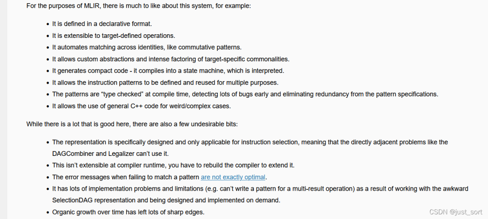MLIR 논문 제목

논문의 제목은 **"MLIR: 무어의 법칙을 종결시키는 컴파일러 인프라스트럭처"** 로 번역됩니다. 제목에서 알 수 있듯이 MLIR은 컴파일러 아키텍처입니다. "무어의 법칙을 종결시킨다"는 표현은 다소 이해하기 어려울 수 있으므로 좀 더 자세히 살펴봐야 합니다. 또한 MLIR은 LLVM, Clang, Swift 프로젝트의 창시자인 Chris가 이끌고 있다는 점에서 프로젝트의 품질이 크게 보장됩니다. 이것이 바로 MLIR 컴파일러 아키텍처가 그토록 인기 있는 이유 중 하나일 것입니다.

# 0x2. 초록

본 논문은 재사용 가능하고 확장 가능한 컴파일러 인프라 구축을 위한 새로운 접근 방식인 MLIR을 제안합니다. MLIR은 **소프트웨어 파편화 문제를 해결하고**, **이기종 하드웨어 환경에서의 컴파일 프로세스를 개선하며**, **도메인 특화 컴파일러 구축 비용을 크게 절감하고**, **기존 컴파일러와의 상호 운용성을 향상시키는 것을 목표로 합니다**. 또한 MLIR은 다양한 abstraction 수준, 응용 분야, 하드웨어 target 및 실행 환경에서 codegen, transformation 도구, optimization 도구의 설계 및 구현을 개선하는 데 도움을 줍니다. 본 논문의 주요 기여는 다음과 같습니다. **"(1) 텍스트 기반 연구 결과물로서 MLIR의 잠재적 확장 및 발전 가능성에 대한 논의를 통해, 이 새로운 접근 방식이 설계, semantics, optimization 명세, 시스템 및 엔지니어링 측면에서 제시하는 과제와 기회를 강조합니다. (2) 다양한 사용 사례를 설명하고 미래의 프로그래밍 언어, 컴파일러, 실행 환경 및 컴퓨터 아키텍처 분야에서 연구 기회를 제시함으로써, 컴파일러 구축 비용을 절감할 수 있는 일반적인 아키텍처로서 MLIR을 평가합니다."** 이어서 본 논문은 MLIR 설계의 기본 원칙, 구조 및 semantics를 소개합니다.

이 절에서는 주로 MLIR의 장점, 즉 MLIR이 소프트웨어 파편화 문제를 해결하고 도메인 특화 컴파일러 구축 비용을 절감하는 데 중점을 둔 새로운 컴파일러 아키텍처라는 점을 설명합니다.

실제로 MLIR이 소프트웨어 파편화 문제를 완전히 해결하는 것은 아닙니다. 단지 파편화 문제를 동일한 언어를 사용하는 다양한 Dialect 간의 파편화로 옮겨놓을 뿐입니다. 이러한 Dialect는 서로 호환되어 사용될 수 있으며, 결과적으로 **"소프트웨어 파편화의 영향을 완화"** 합니다. 왜 완전히 해결하지 않고 완화한다고 표현할까요? 제가 이해하는 소프트웨어 파편화는 N개의 frontend 프레임워크(예: TensorFlow, PyTorch 등)와 M개의 backend(GPU, CPU 등)에 적응해야 하는 문제를 말합니다. 중간 IR이 없다면 적응에 필요한 작업량은 엄청납니다. 마이크로소프트의 ONNX는 중간 IR 역할을 하여 문제를 M개로 줄여, 모든 frontend 프레임워크를 ONNX로 변환할 수 있도록 하고 backend 적응만 필요로 하게 만듭니다. 하지만 이상과 현실은 종종 다릅니다. 다양한 frontend 프레임워크에 적응하기 위해 ONNX는 각 프레임워크의 operator semantics에 맞는 일련의 일반 operator(opset)를 만들었습니다. 이로 인해 frontend 프레임워크와 ONNX 간의 변환 과정에서 새로운 연결 연산이 추가되어 IR이 더욱 복잡해지는 문제가 발생합니다. MLIR로 돌아와 보면, 각 frontend 프레임워크가 MLIR Dialect에 맞춰 IR을 구현한 후, codegen이 가능한 LLVM IR에 도달하기까지 상당한 수의 Dialect 변환 단계를 거쳐야 합니다. ONNX에서 흔히 볼 수 있는 과도한 연결 연산을 피하기 위해 서로 다른 Dialect를 상호 교환하여 사용할 수 있지만, 이것이 원활한 Dialect 변환을 보장하는 것은 아닙니다. 예를 들어 Dialect A에 op X가 있고, 이를 Dialect B의 op로 변환하려는 경우를 생각해 보겠습니다. Dialect B에 op X와 동일한 의미를 가진 op가 없거나, Dialect B의 해당 op가 X와 semantics 측면에서 차이가 있다면, 요구 사항을 충족하기 위해 Dialect B를 확장해야 합니다. 이는 ONNX에서 opset을 지속적으로 추가하는 것과 유사하며, MLIR Dialect 체인이 매우 길어질 수 있기 때문에 ONNX보다 더 번거롭게 느껴질 수 있습니다. 하지만 긍정적으로 보자면, MLIR은 오픈 소스로 공개된 지 2~3년밖에 되지 않았고, Dialect의 다양성이 증가함에 따라 이러한 파편화 위험은 점차 감소할 것으로 예상됩니다.

도메인 특화 컴파일러 구축 비용 절감 측면에서, MLIR 생태계가 더욱 성숙한 후에는 이론적으로 해당 하드웨어용 Dialect를 구현하고, 이 Dialect로 하드웨어 동작을 정의한 다음, 생태계에서 기존 Dialect를 선택하여 완전한 컴파일 프로세스를 구축하는 것만으로 충분합니다.

# 0x3. 서론

컴파일러 설계는 codegen, 정적 분석, 프로그램 transformation 등에 활용할 수 있는 잘 알려진 알고리즘이 풍부한 성숙한 분야입니다. 컴파일러 설계 분야는 LLVM 컴파일러 인프라스트럭처[25], Java Virtual Machine(JVM)[26] 및 기타 시스템을 비롯하여, 현재 컴파일러 커뮤니티 전반에서 널리 사용되는 많은 성숙한 기술 플랫폼을 만들어냈습니다. 이러한 인기 있는 시스템의 공통점은 "one size fits all" 방식, 즉 시스템과의 인터페이스가 단일 수준의 abstraction이라는 점입니다. 예를 들어 LLVM IR은 대략 "vector를 사용하는 C"와 같고, JVM은 "garbage collector가 있는 객체 지향 type 시스템" abstraction을 제공합니다. 이러한 "one size fits all" 방식은 소스 언어(C/C++, Java)에서 이러한 abstraction 영역으로의 매핑이 매우 직접적이기 때문에 매우 유용합니다.

동시에, 어떤 문제는 더 높거나 더 낮은 abstraction 수준에서 모델링하는 것이 더 좋습니다. 예를 들어 LLVM IR 위에서 C++ 코드의 소스 수준 분석을 수행하는 것은 매우 어렵습니다. 많은 언어(예: Swift, Rust, Julia, Fortran)가 자체 IR을 개발하여 언어 도메인에 특화된 문제, 예를 들어 언어/라이브러리 관련 optimization, flow-sensitive type 검사(예: 선형 타입), optimization을 위한 lowering 과정 구현 등을 해결하는 점에 주목해야 합니다. 마찬가지로 머신러닝 시스템은 일반적으로 "ML graphs"를 도메인 특화 abstraction으로 사용합니다.

도메인 특화 IR의 개발은 충분히 연구된 기술이지만, 그 엔지니어링 및 구현 비용은 여전히 매우 높습니다. 이러한 시스템의 구현자에게 인프라스트럭처의 품질이 항상 우선 고려 사항인 것은 아닙니다. 이로 인해 컴파일러 시스템의 구현 품질이 떨어질 수 있으며, 사용자가 자주 마주치는 문제, 예를 들어 컴파일 시간이 느림, 잘못된 구현, 진단 품질 미흡, 최적화된 코드의 디버깅 경험 부족 등의 문제가 발생할 수 있습니다.

MLIR 프로젝트의 목표는 이러한 프로그래밍 언어 설계 및 구현 측면의 과제를 해결하는 것입니다. 이는 매우 편리하게 새로운 abstraction 수준을 정의하고 도입할 수 있도록 하며, 일반적인 컴파일러 엔지니어링 문제를 해결하기 위한 "in the box" 인프라를 제공합니다. MLIR이 채택한 방식은 다음과 같습니다. **"(1) Static Single Assignment(SSA) 기반 IR 데이터 구조의 표준화 (2) IR Dialect를 정의하기 위한 선언적 시스템 제공 (3) 광범위한 범용 인프라(문서화, parsing 및 printing 로직, 위치 추적, 멀티 스레드 컴파일 지원, Pass 관리 등 포함)를 제공"** 합니다.

논문은 MLIR 시스템의 다양한 설계 핵심을 탐구하고, 저자들의 경험을 다양한 문제에 적용하며, 이 작업이 프로그래밍 언어 설계와 교육에 미칠 수 있는 영향을 논의합니다.

논문의 기여는 다음과 같이 정리할 수 있습니다.

  * 산업계와 학계에 중요한 응용 가치를 가진 새로운 컴파일러 인프라스트럭처를 설명합니다.
  * 확장 가능하고 모듈화된 컴파일러 시스템을 구축하기 위한 새로운 방법을 제시합니다.
  * MLIR이 다양한 분야에 적용된 사례를 선정하여 시스템의 범용성을 보여줍니다.
  * MLIR 인프라스트럭처를 기반으로 컴파일 시스템을 개발한 경험을 공유합니다.

이 절에서는 또한 MLIR의 등장 배경도 언급합니다.

먼저 우리는 현대 머신러닝 프레임워크가 다양한 컴파일러, graph 기술 및 runtime 시스템으로 구성되어 있음을 인식했지만(Figure 1 참조), 이러한 부분들은 공통의 인프라스트럭처나 설계 관점을 공유하지 않으며, 일부는 최선의 컴파일러 설계 관행을 따르지 않습니다. 그 결과 사용자는 명확한 불편을 느끼게 되는데, 여기에는 미흡한 오류 메시지, 경계 사례에서의 버그, 예측 불가능한 성능, 새 하드웨어 지원의 어려움 등이 포함됩니다.

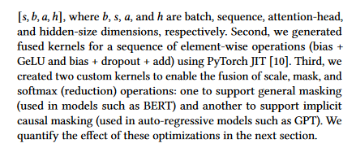Figure1

우리는 곧 컴파일러 산업 전체에 유사한 문제가 존재한다는 사실을 깨달았습니다. 즉, LLVM과 같은 기존 컴파일 시스템은 다언어 구현의 통합 및 통합에서는 매우 성공적이지만, 현대의 고수준 언어들은 결국 자체적인 high-level IR을 구축하고 동일한 고수준 abstraction 기술을 반복적으로 재발명하는 경향이 있습니다(Figure 2 참조). 동시에 LLVM 커뮤니티에서는 병렬 구조를 어떻게 표현하는 것이 최선인지, C 호출 규약이나 OpenMP 같은 cross-language 기능을 위한 일반적인 frontend lowering 인프라스트럭처 구현을 어떻게 공유할지 등과 같은 논쟁이 자주 등장했지만, 만족스러운 해결책에 이르지 못했습니다.

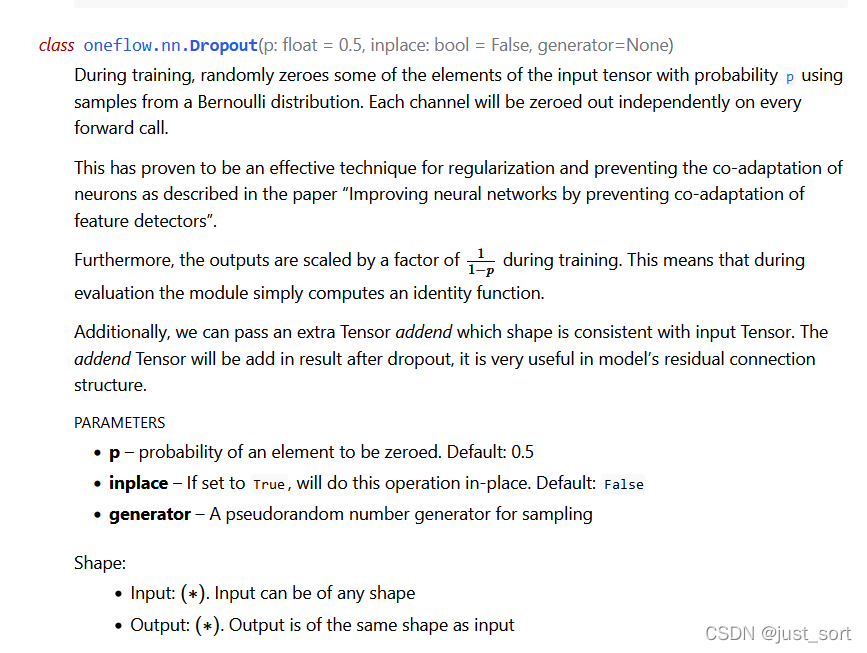Figure2

이러한 과제를 마주하며, 우리는 N개의 개선된 컴파일러를 구현할 작업량을 감당할 수 없다고 판단했고, 따라서 더 범용적인 솔루션을 구축할 필요가 있었습니다. 우리는 고품질의 인프라스트럭처를 개발하는 데 노력을 투자할 수 있었으며, 이는 여러 분야에 도움을 주고 기존 시스템을 점진적으로 업그레이드할 수 있게 하며, 전용 가속기의 이기종 컴파일과 같은 당면한 시급한 문제를 더 쉽게 해결할 수 있게 합니다. 이제 우리는 MLIR 기반 시스템을 구축하고 배포한 풍부한 경험을 축적했으므로, MLIR 인프라스트럭처의 원칙과 설계를 되돌아보고 왜 이 방향으로 발전했는지 논의할 수 있습니다.

> ❝
>
> 이 절에서는 관련 연구와 MLIR의 등장 배경을 나열함으로써 MLIR의 혁신성과 기여를 강조하여 설명합니다.
>
> ❞

# 0x4. 결론

본 논문은 컴파일러 구축을 위한 유연하고 확장 가능한 인프라스트럭처로 활용 가능한 MLIR을 소개합니다. 본 논문은 MLIR의 구체적인 설계를 설명하고, 일련의 중요한 분야에서 그 적용 가능성을 보여주며, 많은 독창적 연구 및 엔지니어링 의의를 기술합니다.

앞으로 우리는 컴파일러 커뮤니티(예: Clang C 및 C++ 컴파일러)와 다양한 분야의 전문가들이 더 고수준의, 언어 특화된 IR로부터 어떻게 이익을 얻을 수 있을지 보고 싶습니다. 또한 MLIR이 컴파일러와 IR 설계 기술을 가르치는 데 새로운 방법을 제공할 수 있는지, 그리고 이러한 인프라스트럭처가 새로운 분야의 연구를 가속화하는 모습을 보고 싶습니다.

여기서는 일련의 미래 연구 방향이 소개됩니다. 관심이 있다면 직접 살펴보시기 바랍니다. 저는 이 부분에 대해 잘 알지 못하므로 여기서 더 다루지 않겠습니다.

# 0x5. 관련 연구

MLIR은 다양한 영역을 아우르는 프로젝트입니다. 그 인프라스트럭처는 새로운 시스템을 제공하지만, 이를 구성하는 각 컴포넌트는 관련 문헌에서 유사한 모듈을 가지고 있습니다.

MLIR은 LLVM[25]과 유사한 컴파일러 인프라스트럭처입니다. 다만 LLVM은 스칼라 optimization과 동종 컴파일에서 강점을 보이는 반면, MLIR은 tensor 대수와 알고리즘, graph 표현, 이기종 컴파일을 포함한 다양한 데이터 구조와 알고리즘을 일급 value와 Operation으로 모델링하는 것을 목표로 합니다. MLIR은 mix-and-match optimization을 허용하여 컴파일 Pass를 구성 요소로 분해하고 lowering을 재정의할 수 있도록 합니다. 이는 주로 pattern rewrite 인프라스트럭처 덕분이며, 완전한 transformation을 작은 지역 pattern의 조합으로 포착하고 단일 op 단위로 어떤 pattern을 적용해 rewrite할지를 제어합니다. rewrite 로직의 자동 확장, 형식화 및 검증은 향후 중요한 단계가 될 것입니다[9, 27]. backend 측면에서, MLIR의 DDR은 LLVM의 instruction selection 인프라스트럭처와 유사하며, 다중 결과 pattern과 명세를 constraint로 사용하는 확장 가능한 op를 지원합니다[49].

많은 프로그래밍 언어와 모델은 하드웨어 이기종 문제를 해결합니다. 동종 프로그래밍 모델인 OpenMP는 StarSs와 OpenACC[34, 31] 같은 이전 제안을 기반으로, offloading task와 가속기의 병렬 영역[32]에 대한 지원을 추가했습니다. C++ AMP, HCC, SyCL은 전통적인 Clang/LLVM 흐름과 C++을 활용하여 하드웨어 가속을 위한 고수준 abstraction을 제공합니다[46]. 그러나 이러한 모든 예시는 host 언어(주로 C++)의 기존 optimization에 의존하여 abstraction으로 인한 손실을 완화하고, 고수준 구조를 runtime 실행 환경에 대한 호출로 빠르게 lowering합니다. LLVM IR을 확장한 병렬 중간 표현은 일부 문제를 해결하지만, 전통적으로 동종 환경에 초점을 맞춰왔습니다[23, 42]. 지금까지 가장 야심찬 작업은 아마도 Liquid Metal[3]일 것입니다. 이는 협업 설계된 도메인 특화 언어(DSL)와, managed object semantics를 정적, vector화된, 또는 재구성 가능한 하드웨어로 변환하는 컴파일 흐름을 제공합니다. 그러나 그 Lime 컴파일러에서는 대부분의 작업량이 round object를 square 하드웨어에 끼워 맞추는 데 들어갑니다(Kou와 Palsberg[24]). MLIR은 확장 가능한 Operation과 Type 집합을 통해 이기종 특성을 포함하는 고수준 언어에 직접 임베딩 수단을 제공하며, 동시에 이러한 구조를 점진적으로 lowering하면서 다양한 target 간 공통 구성 요소를 최대한 재사용할 수 있는 범용 인프라스트럭처를 제공합니다.

언어 이기종성을 해결하는 것은 메타프로그래밍 시스템, 특히 multi-stage 프로그래밍의 오랜 목표였습니다. Lightweight Modular Staging(LMS)[39]은 효율적 코드를 생성하고 DSL을 Scala에 임베딩하는 핵심 구성 요소 라이브러리를 제공하는 최신 기술 프레임워크 및 runtime 코드 생성기입니다. Delite[45]는 DSL 개발자의 효율성을 크게 향상시킨다고 주장하며, 동시에 병렬 및 이기종 실행을 지원합니다. 우리는 이 접근 방식이 MLIR을 보완한다고 봅니다. 이는 임베디드 DSL을 위한 더 고수준의 abstraction을 제공하고, 일반적인 메타프로그래밍 구조를 통해 optimization을 구현합니다.

언어 syntax 측면으로 더 나아가, ANTLR[33]은 새로운 컴파일러 frontend를 쉽게 개발할 수 있도록 만든 parser generator 클래스입니다. MLIR은 현재 일반적인 parser 생성, AST 구축, 또는 모델링 기능을 제공하지 않습니다. MLIR과 ANTLR과 같은 시스템을 결합하면 사용자 입력에서 codegen에 이르기까지 재사용 가능한 컴파일러 라이브러리를 만들 수 있습니다.

XLA[57], Glow[40], TVM[11]은 머신러닝 분야의 응용을 통해 유사한 이기종 컴파일 목표를 해결합니다. 그러나 이러한 기술은 모두 매우 구체적인 codegen 사례로, graph abstraction에서 시작하여 가속기의 다차원 vector abstraction을 target으로 합니다. 이러한 기술은 모두 MLIR을 인프라스트럭처로 사용할 수 있으며, 각자의 기존 codegen 전략을 사용하면서도 MLIR의 범용 기능을 충분히 활용할 수 있습니다. 마찬가지로 Halide[36]와 TVM의 loop nest 메타프로그래밍 기술, 이전 loop nest 메타프로그래밍 문헌[19, 41, 5, 14], 그리고 PolyMage[28], Tensor Comprehension[52], Stripe[58], Diesel[16], Tiramisu[4]와 그 기반 polyhedral 컴파일 기술[17, 54, 8, 55] 같은 완전 자동화 흐름은 MLIR 기반 컴파일 프레임워크에서 다양한 codegen 경로로 공존할 수 있습니다. 직렬화 및 상호 운용성 형식은 ML frontend의 다양성 문제를 다양한 방식으로 해결합니다. 예를 들어 ONNX[48]의 방식은 다양한 프레임워크가 매핑할 수 있는 공통 op 집합을 제공하는 것입니다. ONNX는 MLIR의 Dialect 선택지가 될 수 있으며, 다른 op는 이 Dialect로 lowering될 수 있습니다.

# 0x6. MLIR 설계 관련

## 0x6.1 설계 원칙

**"내장 요소는 최소화, 모든 것은 customizable(Little builtin, everything customizable)"** MLIR 시스템은 최소한의 기본 개념을 기반으로 하며, 대부분의 IR은 완전히 customizable합니다. 설계 시 적은 수의 abstraction(type, operation, attribute, IR에서 가장 흔한 요소들)으로 다른 모든 것을 표현해야 하며, 그렇게 함으로써 abstraction을 더 적고 일관되게 만들고 이해, 확장, 사용을 쉽게 만들 수 있습니다. 넓은 의미에서 customizability는 컴파일 시스템이 변화하는 요구에 적응할 수 있도록 보장하며, 미래의 문제에도 적용 가능성을 높입니다. 이러한 의미에서 우리는 IR을, 그것이 사용하는 중간 언어의 syntax 및 semantics를 지원하면서 재사용 가능한 컴포넌트와 프로그래밍 abstraction을 갖춘 인프라스트럭처로 구성해야 합니다. **"customization"** 의 성공 기준은 머신러닝 graph, AST, 수학적 abstraction(예: polyhedron), Control Flow Graph(CFG), instruction 수준 IR(예: LLVM IR) 등 다양한 abstraction을 표현할 수 있어야 한다는 것이며, 이러한 abstraction을 컴파일 시스템에 적용할 때 hard-coded 개념을 사용해서는 안 됩니다. **"물론, 호환성이 좋지 않을 경우 customizability는 내부 파편화의 위험을 가져올 수 있습니다."** 생태계 파편화 문제를 해결할 순수하게 기술적인 솔루션은 없지만, 시스템은 재사용 가능한 abstraction의 설계를 장려하고, 이러한 abstraction이 설계 예상 범위를 벗어난 곳에서 사용될 것이라고 가정해야 합니다.

**"SSA and regions"** Static Single Assignment 형식[15]은 컴파일러 IR에서 널리 사용되는 표현 형식입니다. 이는 데이터 흐름 분석을 단순하고 sparse하게 만든다는 점, continuation-passing 스타일과의 관계 덕분에 컴파일러 커뮤니티에서 널리 이해되고 있다는 점, 주요 프레임워크에서 채택되었다는 점 등 많은 장점을 제공합니다. 많은 기존 IR이 평탄한 선형 CFG를 사용하지만, 더 고수준의 abstraction을 표현하기 위해서는 nested region을 IR의 일급 개념으로 두는 방향으로 나아갑니다. 이는 전통적인 region 형식을 넘어서 abstraction 수준을 높이고(예: loop tree), 컴파일 과정, instruction 추출, 또는 SIMD 병렬성을 가속화합니다[22, 21, 37]. 이기종 컴파일을 지원하기 위해서는 시스템이 구조화된 control flow, 동시성 구조, 소스 언어의 closure 등을 지원해야 합니다. 한 가지 구체적인 과제는 nested region 위에 CFG 기반 분석과 transformation을 구축하는 것입니다.

이를 위해 LLVM의 normalization, 때로는 canonicalization 속성까지 희생합니다. 다양한 데이터와 control 구조를 더 작은 정규화된 표현 집합으로 lowering할 수 있는 능력은 컴파일러의 복잡성을 제어하는 데 매우 중요합니다. pre-header, header, latch, body로 구성된 canonical loop 구조는 frontend 언어의 다양한 loop 구조를 선형화된 control flow로 표현하는 전형적인 사례입니다. MLIR의 목표는 사용자에게 선택권을 제공하는 것입니다. 즉, **"컴파일 흐름의 Pass 컴파일 알고리즘에 따라 nested loop를 nested region 또는 선형화된 control flow로 캡처할 수 있도록"** 합니다. 이러한 선택권을 제공함으로써 LLVM의 normalization-only 방향에서 벗어나면서, 필요할 때 더 고수준 abstraction을 처리할 수 있는 능력을 보존합니다. 반대로 MLIR의 이러한 접근법은 abstraction normalization을 어떻게 제어할 것인가라는 문제도 발생시키며, 이는 다음 단락의 주제입니다.

**"progressive lowering"** 컴파일 시스템은 progressive lowering을 지원해야 합니다. 즉, 작은 단계로 여러 abstraction 수준을 순차적으로 거치며 고수준 표현에서 최저 수준으로 내려가야 합니다. 다층의 abstraction이 필요한 이유는 범용 컴파일러 인프라스트럭처가 다양한 플랫폼과 프로그래밍 모델을 지원해야 하기 때문입니다. 이전 컴파일러들은 pipeline에 다중 고정 abstraction 수준을 도입했습니다. 예를 들어 Open64 WHIRL 표현[30]은 5단계 수준을 가지며, Clang/LLVM 컴파일러는 AST에서 LLVM IR, SelectionDAG, MachineInstr, MCInst로 lowering됩니다. 위의 lowering 구현 방식은 비교적 경직되어 있으므로 abstraction 수준의 확장성을 지원하기 위해 더 유연한 설계가 필요합니다. 이는 transformation의 phase ordering에 깊은 영향을 미칩니다. 컴파일러 전문가들이 점점 더 많은 transformation Pass를 구현함에 따라, 이러한 Pass 사이에 복잡한 상호작용이 나타나기 시작합니다. 실제로 optimization Pass를 결합하여 실행하면 컴파일러가 더 많은 프로그램의 유용한 정보를 발견할 수 있다는 것이 밝혀졌습니다. 결합된 Pass의 이점을 보여주는 예는 constant propagation, value numbering, dead code elimination을 혼합하는 시도입니다[13]. 일반적으로 컴파일러 Pass는 대략 네 가지 역할로 분류할 수 있습니다. (1) optimization transformation (2) enabling transformation (3) lowering (4) cleanup. 컴파일 시스템은 전체 컴파일 단위에서 이러한 Pass를 순차적으로 실행하는 것이 아니라, 단일 op 단위로 이러한 역할을 mix-and-match할 수 있어야 합니다.

**"고수준 semantics 유지(Maintain higher-level semantics)"** 시스템은 분석이나 optimization 성능에 필요한 고수준 semantics와 계산 구조를 보존해야 합니다. semantics를 낮춘 후 다시 높이려고 하면 성공하기 어려우며, 이러한 정보를 저수준 IR 환경에 강제로 끼워 넣는 것은 일반적으로 파괴적입니다(예: 디버그 정보를 사용하여 구조를 기록할 경우 모든 Pass가 검증/재방문이 필요합니다). 반대로 시스템은 계산 구조를 보존하면서 점진적으로 하드웨어 abstraction으로 lowering해야 합니다. 이때 의식적으로 구조 정보를 버릴 수 있으며, 이러한 폐기는 기본 실행 모델에 매칭하기 위해 더 이상 이 구조가 필요하지 않을 때만 발생해야 합니다. **"예를 들어, 시스템은 관련된 transformation 전 과정에서 loop 구조와 같은 구조화된 control flow를 보존해야 합니다. 이 구조를 제거하는 것, 즉 CFG 기반 control flow로 가는 것은 본질적으로 이 수준에서 더 이상 어떤 transformation도 수행하지 않을 것임을 의미합니다."** 컴파일러 개발에서 병렬 계산 구조를 모델링하는 최신 기술은 이 작업이 일반적으로 얼마나 어려울 수 있는지 보여줍니다[23, 42].

컴파일 시스템의 일부 IR이 더 고수준의 abstraction을 유지하면서 다른 부분은 IR 수준이 낮아질 수 있도록 하기 위해, 동일한 IR 안에 다른 수준의 abstraction과 다른 개념을 혼합하는 것이 시스템의 핵심 속성이 됩니다. 예를 들어, 커스텀 가속기용 컴파일러는 시스템이 정의한 일부 고수준 구조와 abstraction을 IR에서 재사용하면서 동시에 가속기 특유의 기본 스칼라/vector instruction을 표현할 수도 있습니다.

**"IR validation"** 생태계의 개방성은 광범위한 검증 메커니즘을 요구합니다. 검증과 테스트는 컴파일러 버그 탐지에 유용할 뿐만 아니라, 확장 가능한 시스템에서는 검증 방법과 도구의 견고성에 대한 요구도 점점 높아집니다. 검증 메커니즘은 정의가 간결하고 실용적이어야 하며, 정확한 결과의 유일한 출처로 사용될 수 있어야 합니다. 장기 목표 중 하나는 성공적인 transformation validation[35, 29, 50, 51]과 현대 컴파일러 테스팅 방법[12]을 재현하는 것입니다. 확장 가능한 컴파일러 생태계에서 validation과 테스트는 모두 아직 해결되지 않은 두 가지 문제입니다.

**"Declarative rewrite patterns"** 표현 수정자를 정의하는 것은 새로운 abstraction을 정의하는 것만큼 단순해야 합니다. 일반적인 transformation은 선언적으로 표현된 rewrite 규칙으로 구현되어야 하며, 복잡도와 완전성 같은 rewrite 속성을 기계 분석 가능한 형식으로 추론할 수 있어야 합니다. rewrite 시스템은 견고성과 효율성이 매우 좋기 때문에 광범위하게 연구되었으며, type system부터 instruction selection까지 수많은 컴파일 문제에 적용되었습니다. 우리(MLIR)의 목표는 전례 없는 확장성과 progressive lowering 기능을 구현하는 것이며, 프로그램 transformation을 rewrite 시스템으로 모델링할 수 있는 다양한 경로를 통해 이를 달성할 수 있습니다. 또한 rewrite 규칙과 전략을 어떻게 표현할지, 그리고 여러 abstraction 수준에 걸쳐 rewrite 전략을 안내할 수 있는 기계 기술을 어떻게 구축할지에 관한 흥미로운 문제도 제기됩니다. 시스템은 이러한 문제를 해결하면서도 확장성을 유지하고 합리적이고 단조로우며 재현 가능한 동작을 수행해야 합니다.

**"Source location tracking and traceability"** 연산의 출처(원래 위치 및 적용된 transformation 포함)는 시스템에서 쉽게 추적할 수 있어야 합니다. 이는 복잡한 컴파일 시스템에서 흔히 나타나는 투명성 부족 문제를 해결하기 위한 것입니다. 복잡한 컴파일 시스템에서는 최종 표현이 원래 표현으로부터 어떻게 구축되었는지 전체 과정을 이해하기가 매우 어렵습니다. 컴파일 안전성이 매우 중요한 민감한 응용 프로그램을 컴파일할 때 이는 두드러지는 문제이며, 이러한 프로그램에서는 lowering과 optimization 단계를 추적하는 것이 소프트웨어 인증 프로그램의 중요한 구성 요소입니다[43]. 보안 코드(예: 암호 프로토콜이나 프라이버시에 민감한 데이터를 다루는 알고리즘)를 다룰 때, 컴파일러는 보통 중복되거나 번거로워 보이는 계산을 마주합니다. 이러한 계산은 소스 프로그램의 기능적 semantics에 완전히 포착되지 않은 보안 또는 비공개 속성을 내장하며, 보안 코드는 사이드 채널 노출을 방지하거나 네트워크 공격이나 fault attack을 막기 위해 코드를 강화합니다. optimization은 이러한 보호 장치를 변경하거나 완전히 무효화할 수 있습니다[56]. 이러한 투명성의 부재는 보안 컴파일에서 WYSINWYX[6]로 불립니다. 고수준 정보를 저수준에 정확히 전파하는 간접적 목표 중 하나는 안전하고 추적 가능한 컴파일 과정을 구현하는 것입니다.

> ❝
>
> 이 절은 사실 MLIR이 가진 거시적 특성을 설명합니다. MLIR은 다층 IR 구조를 가진 컴파일 아키텍처이며, 실제로는 다층 Dialect로 구성되며, 각 Dialect는 서로 다른 수준의 개념을 모델링합니다. 예를 들어 LLVM Dialect는 시스템 수준의 변환을 담당하고, Linalg, Tensor, Vector 등의 Dialect는 코드 생성을 협업하며, Affine, Math 등의 Dialect는 저수준 계산을 기술합니다.
>
> ❞

## 0x6.2 IR 설계 세부 사항

이 절에서는 이전 절에서 설명한 원칙에 따라 MLIR의 IR 설계를 소개합니다.

### Operations(연산)

MLIR에서의 의미 단위는 "operation"이며, Op라고 부릅니다. MLIR 시스템에서는 instruction부터 함수, module에 이르기까지 모든 것이 Op로 모델링됩니다. MLIR은 고정된 Op 집합을 가지지 않으므로 사용자가 Op를 자유롭게 확장하는 것을 허용하고 권장합니다. 컴파일러 Pass는 알려지지 않은 Op를 보수적으로 처리하며, MLIR은 trait, 특수한 operation hook, Interface 등을 통해 Pass에 Op semantics를 기술하는 것을 지원합니다.

Op(Figure 3 참조)는 고유한 opcode를 가집니다. 문자 그대로 opcode는 그것이 속한 Dialect와 op를 식별하는 문자열입니다. Op는 0개 이상의 value를 operand와 result로 가질 수 있으며, SSA 형식으로 operand와 result를 유지합니다. 모든 value는 LLVM IR과 유사하게 type을 가집니다. opcode, operand, result 외에도 Op는 attribute, region, block argument, 위치 정보(**"Attributes, Regions, Block Arguments, and Location Information"**)를 가질 수 있습니다. Figure 4는 value와 Op를 보여주며, `%` 식별자는 named value(번들)이며, 번들에 여러 value가 있을 경우 `:` 뒤에 번들 안의 value 개수를 명시합니다(주: Figure 3의 `%results:2`처럼 result가 2개임을 의미). 그리고 "#"은 특정 value를 나타냅니다. 일반적인 텍스트 표현 형식에서 op 이름은 따옴표로 둘러싸인 문자열이며, 그 뒤에 괄호로 둘러싸인 operand가 옵니다.

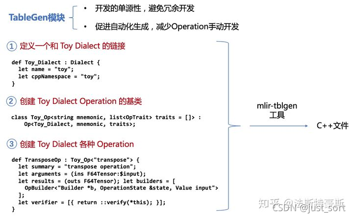Figure3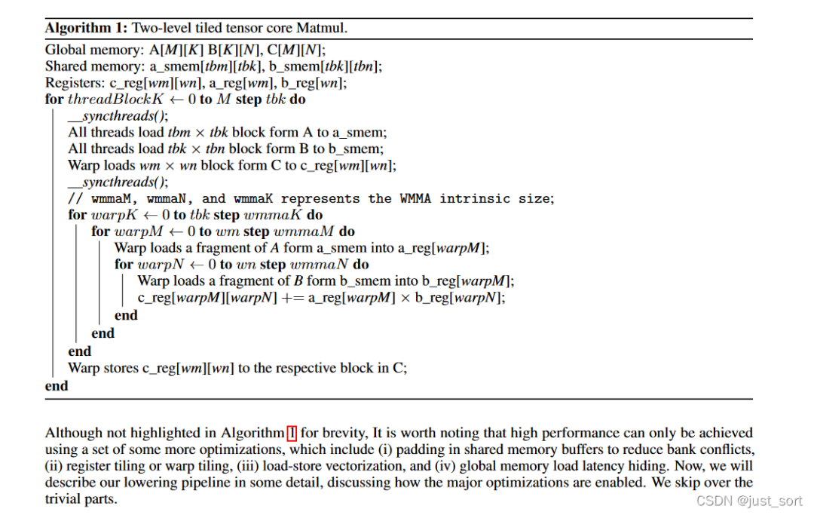Figure4

### Attributes(속성)

MLIR attribute는 정수 상수 값, 문자열 데이터, 또는 상수 부동소수점 값 list와 같은 구조화된 컴파일 타임 정적 정보입니다. attribute는 type을 가지며, 각 Op 인스턴스는 문자열 이름에서 attribute value로의 open key-value 사전 매핑을 가집니다. 일반적인 syntax 기술에서 **"attribute는 Op operand와 그 type 사이에"** 위치합니다. key-value 쌍 list에서 서로 다른 key-value 쌍은 쉼표로 구분되며 전체 list는 중괄호로 묶입니다. (Figure 3의 `{attribute="value" : !d.type}`이나 Figure 4의 `{lower_bound = () -> (0), step = 1 : index, upper_bound = #map3}`처럼). 여기서 `lower_bound`, `step`, `upper_bound`는 attribute 이름입니다. `() -> (0)`은 inline affine 형식 식별자이며, 이 예시에서는 상수 0을 생성하는 affine 함수입니다. `#map3`은 attribute alias 식별자로, 이 attribute alias는 attribute value를 라벨과 미리 연결시킬 수 있게 해주며 attribute value가 필요한 어디에서든 라벨을 사용할 수 있습니다. opcode와 마찬가지로 MLIR은 고정된 attribute 집합을 가지지 않습니다. attribute의 의미는 Op semantics나 attribute와 관련된 Dialect에서 도출됩니다. attribute도 확장 가능하며, 외부 데이터 구조를 직접 참조할 수 있어 기존 시스템과 통합하는 데 매우 유용합니다. 예를 들어, 어떤 attribute는 ML 시스템에서 (컴파일 타임에 알려진) 데이터 저장소의 내용을 참조할 수 있습니다.

### Location information(위치 정보)

MLIR은 위치 정보의 컴팩트한 표현 형식을 제공하며, 시스템 전체에서 위치 정보를 처리하고 전파할 것을 권장합니다. 위치 정보는 Op를 생성한 소스 프로그램의 stack trace를 보존하여 디버그 정보를 생성하는 데 사용될 수 있습니다. 위치 정보는 컴파일러가 진단 정보를 생성하는 방식을 표준화하며, 다양한 테스트 도구에 사용될 수 있습니다. 위치 정보 또한 확장 가능하므로 컴파일러가 기존의 위치 추적 시스템, 고수준 AST node, LLVM 스타일의 file-line-column 주소, DWARF 디버그 정보, 또는 다른 고품질 컴파일 구현이 필요로 하는 정보를 참조할 수 있습니다.

**"위 세 가지 핵심 사항은 Toy 언어의 transpose Op를 통해 이해를 더 깊게 할 수 있습니다."**

    %t_tensor = "toy.transpose"(%tensor) {inplace = true} : (tensor<2x3xf64>) -> tensor<3x2xf64> loc("example/file/path":12:1)

구조 분해 설명:

  * `%t_tensor`: 이 Operation이 정의하는 result의 이름이며, 앞의 `%`는 충돌을 피하기 위함입니다. https://mlir.llvm.org/docs/LangRef/#identifiers-and-keywords 참조. 하나의 Operation은 0개 이상의 result를 정의할 수 있으며(Toy 언어에서는 단일 result Operation만), 이는 SSA value입니다. 이 이름은 parsing 동안 사용되지만 영구적이지는 않습니다(예: SSA value의 메모리 표현에서는 추적되지 않습니다).
  * `"toy.transpose"`: Operation의 이름입니다. 고유한 문자열이어야 하며, Dialect의 namespace는 "."로 구분된 prefix가 됩니다. 이는 Toy Dialect의 transpose Operation으로 이해할 수 있습니다.
  * `(%tensor)`: 0개 이상의 입력 operand(또는 인수) list이며, 다른 op가 정의한 SSA value 또는 block 인수의 참조입니다.
  * `{ inplace = true }`: 0개 이상의 attribute 사전이며, 이러한 attribute는 항상 상수인 특별한 operand입니다. 여기서는 "inplace"라는 boolean attribute를 정의하고, 그 상수 값을 true로 설정합니다.
  * `(tensor<2x3xf64>) -> tensor<3x2xf64>`: 함수 형식으로 표현된 op type이며, 앞은 입력, 뒤는 출력입니다. `<2x3xf64>` 안의 내용은 tensor의 차원 `2x3`과 tensor에 저장된 데이터 type `f64`를 기술하며, 사이는 `x`로 연결됩니다.
  * `loc("example/file/path":12:1)`: 이 op의 소스 코드 내 위치입니다.

### Regions and Blocks(region과 block)

Op 인스턴스는 일련의 부속 region을 가질 수 있습니다. region은 MLIR에서 nested 구조를 위한 구현 메커니즘을 제공합니다. 하나의 region은 일련의 block을 포함하고, 하나의 block은 일련의 op를 포함합니다(op는 다시 region을 포함할 수 있으며, Figure 3 참조). attribute와 마찬가지로 region의 semantics는 그것이 부속된 op에 의해 정의되지만, region 내부의 block(여러 개일 경우)은 Control Flow Graph(CFG)를 형성할 수 있습니다. 예를 들어 Figure 4의 `affine.for` op는 loop이며, `({`와 `})` 구분자 사이에 위치한 단일 block이 region입니다. Op는 region을 가로지르는 control flow를 지정합니다. 이 예시에서는 loop 상한에 도달할 때까지 본문을 반복 실행합니다. 각 region의 본문은 일련의 block이며, 각 block은 terminator op(`terminator`)로 끝나는데, terminator op는 control flow가 이전될 수 있는 후속 block을 가질 수 있습니다. 각 terminator(예: "switch", "conditional branch", 또는 "unwind")는 자체 semantics를 정의합니다. terminator는 control flow를 같은 region 내의 다른 block으로 이전하거나, 그 region을 포함한 op로 반환할 수 있습니다. 후속 block의 graph는 CFG를 정의하며, 따라서 region 내에서 표준 SSA 기반 control flow를 가질 수 있습니다. MLIR은 노드를 사용하지 않고 SSA의 함수 형식을 사용합니다. 즉, terminator는 후속 block이 정의한 block argument에 value를 전달합니다. 각 block은 (비어 있을 수 있는) 타이핑된 block argument list를 가지며, 이 인수들은 일반적인 value이며 SSA 규칙에 부합합니다. terminator op의 semantics는 control이 이전된 후 해당 block의 인수가 가질 value를 정의합니다. region의 첫 번째(entry) block의 경우, value는 포함하는 op의 semantics에 의해 정의됩니다. 예를 들어, `affine.for`은 entry block argument `%arg4`를 loop induction variable로 사용합니다.

> ❝
>
> 여기서 표현하고자 하는 의미는, 하나의 Operation이 여러 Region을 가질 수 있고, Region은 다시 일련의 Block으로 구성되며, Block은 또 일련의 Op를 포함한다는 것입니다. 이렇게 nested 관계가 형성되어 scope와 control flow 관계를 표현할 수 있습니다.
>
> ❞

### Value dominance and visibility

Op는 scope 내의 value, 즉 SSA dominance, nesting, 그리고 op의 semantics 제약 조건을 포함하여 가시적인 value만 사용할 수 있습니다. value가 표준 SSA dominance 관계를 따르는 경우, CFG에서 이러한 value를 볼 수 있으며 사용 전에 control이 정의를 거치도록 보장할 수 있습니다.

region 기반의 가시성은 region의 단순 nesting을 기준으로 정의됩니다. Op의 operand가 현재 region 외부에 있다면, 사용 region의 위에서 외부 lexical scope로 정의되어야 하며, 이를 통해 `affine.for` op 내의 op가 외부 scope에서 정의된 value를 사용할 수 있게 합니다.

MLIR은 또한 op를 **"isolated-from-above"** 로 정의하는 것을 허용하며, 이는 해당 op가 **"scope barrier"** 임을 나타냅니다. 예를 들어, "std.func" op는 함수를 정의하며, 그 내부의 op는 함수 외부에서 정의된 value를 참조할 수 없습니다. 유용한 semantics 검사를 제공하는 것 외에도, isolation barrier를 가로지를 수 있는 use-def 체인이 없기 때문에, isolated-from-above op를 포함한 module은 ML 컴파일러에 의해 병렬 처리될 수 있습니다. 이는 멀티코어 컴퓨터를 활용한 컴파일에서 중요합니다.

### Symbols and symbol tables

Op는 symbol table을 부속할 수도 있습니다. 이 symbol table은 이름(문자열로 표현)을 IR 객체(symbol이라고 함)와 연결시키는 표준 방법입니다. IR은 symbol의 용도를 규정하지 않고, op가 정의하도록 맡깁니다. SSA 규칙을 따를 필요가 없는 named entity의 경우 symbol이 매우 유용합니다. symbol은 같은 table 내에서 중복 정의될 수 없지만, 정의 전에 사용될 수는 있습니다. 예를 들어, 전역 변수, 함수, named module은 symbol로 표현될 수 있습니다. 이러한 메커니즘이 없다면 재귀 함수(정의 안에서 자기 자신을 참조하는)를 정의할 수 없습니다. symbol table을 가진 op의 관련 region이 유사한 op를 포함한다면, symbol table은 nested될 수 있습니다. MLIR은 op에서 symbol을 참조하는 메커니즘(nested symbol 포함)을 제공합니다.

### Dialects

MLIR은 Dialect를 사용하여 확장성을 관리합니다. Dialect는 고유한 namespace 아래에 op, attribute, type의 논리적 그룹화를 제공합니다. Dialect 자체는 새로운 semantics를 도입하지 않으며, 논리적 그룹화 메커니즘으로 기능하고 Dialect 공통 op 지원(예: Dialect 내 모든 op의 constant folding 동작)을 제공하는 데 사용될 수 있습니다. Dialect namespace는 opcode에서 "."로 구분된 prefix이며, 예를 들어 Figure 4가 사용하는 `affine`과 `std` Dialect가 있습니다.

개념적으로 op, type, attribute를 Dialect로 abstraction화할 수 있는데, 이는 일련의 모듈화된 라이브러리를 설계하는 것과 유사합니다. 예를 들어, 어떤 Dialect는 하드웨어 vector를 다루는 op와 type(예: shuffle, insert/extract 원소, mask 등)을 포함할 수 있고, 다른 Dialect는 대수적 vector를 다루는 op와 type(예: 절댓값, dot product 등)을 포함할 수 있습니다. 두 Dialect가 같은 vector type을 사용하는지, 그리고 그 type이 어느 Dialect에 속하는지는 MLIR 사용자가 설계 시점에 결정할 수 있습니다.

모든 op, type, attribute를 단일 Dialect에 넣을 수도 있지만, 그렇게 하면 곧 수많은 개념과 이름 충돌 문제로 인해 Dialect를 관리하기 어려워질 것이라는 점은 쉽게 상상할 수 있습니다. 각 op, type, attribute는 단일 Dialect에만 속하지만, MLIR은 progressive lowering을 구현하기 위해 다중 Dialect의 혼합을 명시적으로 지원합니다. 서로 다른 Dialect의 op는 IR의 어느 수준에서든 공존할 수 있으며, 다른 Dialect에 정의된 type을 사용할 수 있습니다. Dialect 혼합은 재사용성, 확장성, 유연성을 강화합니다.

### Type 시스템

MLIR의 모든 value는 type을 가지며, 이 type은 그 value를 생성한 op나 그 value를 인수로 정의한 block에서 지정됩니다. type은 IR에 컴파일 타임 semantics를 제공합니다. MLIR의 type 시스템은 사용자 확장 가능하며, 이미 존재하는 외부 type 시스템(예: llvm::Type, clang::Type)을 참조할 수 있습니다. MLIR은 엄격한 type equivalence 검사를 강제하며, type 변환 규칙을 제공하지 않습니다. op는 trailing function 같은 syntax로 입력과 result type을 나열합니다. Figure 4에서 `affine.load`는 메모리 reference와 index type에서 load되는 value의 type으로 매핑됩니다. type 이론의 관점에서 MLIR은 trivial type, 매개변수화된 type, 함수 type, sum type, product type을 포함한 비의존적 type만 지원합니다.

### 표준 type

또한 MLIR은 임의 정밀도 정수, 표준 부동소수점 type, tuple, 다차원 vector, tensor와 같은 단순한 일반 컨테이너 등을 포함하는 표준화된 일반적 type 집합을 제공합니다. 이러한 type은 단지 Dialect 개발자의 편의를 위한 것이며, 반드시 사용해야 하는 것은 아닙니다.

### Functions and modules(함수와 module)

일반 IR과 마찬가지로, MLIR은 보통 함수와 module로 구성되며, 이는 MLIR의 새로운 개념이 아닙니다. 함수와 module은 builtin Dialect에서 op로 구현됩니다. module은 단일 region을 가진 op이며, 이 region은 단일 block을 포함합니다. module은 control flow를 이전하지 않는 dummy op로 종료됩니다.

module은 참조될 수 있는 symbol을 정의합니다. 다른 모든 block과 마찬가지로, 본문은 일련의 op를 포함하며, 이러한 op는 함수, 전역 변수, 컴파일러 메타데이터 또는 기타 최상위 구조일 수 있습니다. 함수는 단일 region을 가진 op이며, 그 인수는 함수 매개변수에 대응합니다.

**"함수는 이름으로 참조될 수 있는 symbol을 정의합니다. 함수 호출 op를 사용하면 control flow를 함수로 이전할 수 있습니다."** 일단 내부에 들어가면 control flow는 region 내 각 block의 CFG를 따릅니다. "return" terminator는 후속이 없으며, 대신 region 실행을 종료시켜 control flow를 함수의 호출자로 다시 이전합니다. "return" terminator op의 모든 operand는 함수의 반환 value입니다.

> ❝
>
> 위에서는 MLIR의 IR 설계 세부 사항을 소개했습니다. MLIR 공식 문서의 syntax 규칙과 함께 보면 더 익숙해질 수 있습니다: https://mlir.llvm.org/docs/LangRef/.
>
> ❞

## 0x6.3 IR 인프라스트럭처

IR 자체 외에도 MLIR은 IR 요소(예: Dialect, Op, pattern rewrite, validation, 재사용 가능한 Pass)를 정의하기 위한 인프라스트럭처도 제공합니다. 새로운 abstraction을 정의하고 MLIR을 optimization toolkit으로 사용할 때, MLIR의 인프라스트럭처는 확장성과 사용 편의성을 제공하는 데 매우 중요합니다.

### 0x6.3.1 Operation description(연산 기술)

MLIR은 TableGen[47] 명세를 사용하여 Operation Descriptions(ODS)를 정의하며, 선언적 방식으로 Op의 구조와 그 검증 프로그램 컴포넌트를 정의합니다. TableGen은 LLVM에서 널리 사용되는 데이터 모델링 도구로, domain-specific 정보 record의 정의와 유지보수를 돕는 것이 목적입니다. ODS는 TableGen 언어에 임베딩되어 MLIR Op를 정의하는 DSL로 볼 수 있습니다. 따라서 ODS의 syntax는 TableGen에 의해 규정되지만, MLIR 특유의 semantics는 ODS가 규정합니다. ODS 정의는 최종적으로 C++ 코드로 변환되며, 이 코드는 컴파일 시스템의 나머지 부분과 상호 운용 가능합니다.

MLIR은 ODS에서 TableGen Op 클래스를 사용하여 Op를 모델링합니다. Figure 5는 ODS로 정의된 Op의 예시를 보여줍니다. 각 Op 정의는 고유 식별자인 이름을 가집니다. Op의 trait list는 Op의 속성을 기술합니다. Op의 argument list는 Op의 operand와 attribute를 지정합니다. Op 정의에는 result list도 있습니다. Op의 인수와 result는 이름과 type constraint(예: float 또는 int32의 고정 형상 tensor)를 가집니다. Op 정의는 사람이 읽을 수 있는 Op 설명도 지정할 수 있습니다. Op가 ODS가 제공하는 것보다 더 정밀한 제어를 정의해야 할 때는 builder, printer, parser, verifier 문을 통해 추가 C++ 코드를 주입할 수 있습니다. Op trait는 일반적("has no side-effects" 등)일 수도 있고, Dialect 또는 ODS에 특화된 것("has custom exporter" 등)일 수도 있습니다. ODS의 trait는 trait 동작을 정의하는 C++ 클래스에 의해 뒷받침될 수 있습니다. MLIR은 고정된 trait 집합을 가지지 않지만, 일부 trait이나 optimizer(논문 6.1절에 해당)는 ODS에 알려져 있습니다(예: "shape result and operand type"은 주어진 입력 type에 대해 출력 type을 완전히 캡처하는 constraint를 나타냄).

type constraint는 인수/result type의 속성을 검사하며, 사용자/Dialect에 의해 확장됩니다. MLIR 인프라스트럭처는 또한 "any type", "tensor with element satisfying the given constraint", "vector of given rank" 등 많은 사전 정의된 type constraint를 제공합니다. ODS는 trait이 가져온 constraint를 사용하는 operand의 result type을 자동으로 추론하는 데 제한적인 지원을 제공합니다. 자세한 내용은 다음 절(논문 4.2절에 해당)을 참조하십시오.

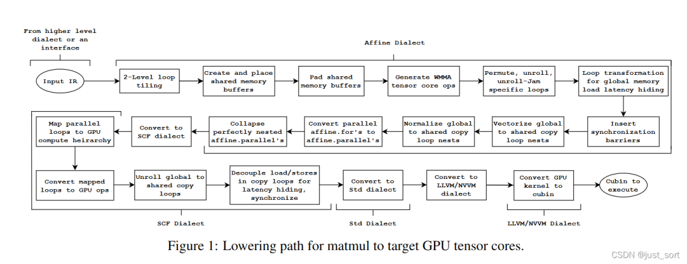Op의 ODS 정의

### 0x6.3.2 Declarative rewrites(선언적 rewrite)

많은 MLIR transformation이 op 조작을 수반합니다. 일부 transformation은 IR에 대한 복잡한 수정이 필요하지만, 다른 많은 transformation은 SSA use-def 관계가 정의하는 DAG의 단순한 rewrite로 표현될 수 있습니다. MLIR은 graph rewrite 프레임워크를 제공하며, Declarative Rewrite Rule(DRR) 시스템을 보조 도구로 활용하여 pattern 표현을 단순하게 만듭니다.

ODS와 마찬가지로 DRR은 TableGen 언어에 임베딩된 DSL입니다. DRR은 source와 target DAG pattern 및 constraint(동적 constraint 포함[49])를 표현하며 pattern 우선순위 기반의 이점을 활용합니다. pattern은 Op의 인수를 캡처하고 재사용할 수 있습니다. 개념적으로 DRR은 특정 constraint 하에서의 DAG의 동등성을 표현합니다. Figure 6은 DRR pattern의 예시를 보여주며, Figure 5에 정의된 Op를 `compare`와 `select`로 구성된 일반적인 저수준 구현으로 변환합니다.

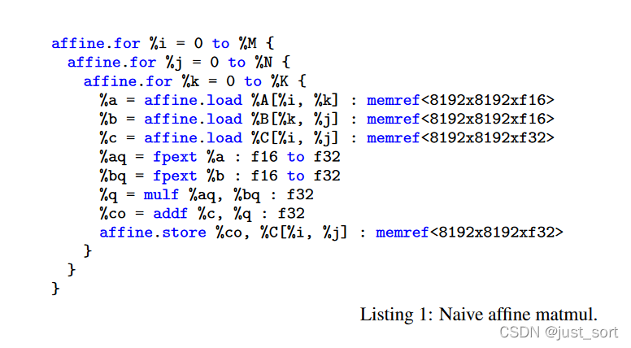DRR graph rewrite 규칙

DRR은 C++ 코드로 변환되며, 일반 graph rewrite 프레임워크를 사용해 C++로 직접 정의된 더 복잡한 pattern과 혼합할 수 있습니다. 이 기능을 통해 MLIR은 흔한 사용 사례를 간결하게 유지하면서도 프레임워크의 일반성을 제한하지 않습니다.

### 0x6.3.3 Pass Manager

MLIR Pass Manager는 다양한 입자도로 IR Pass 시퀀스를 조직하고 처리하여 Pass의 효율적인 실행을 보장합니다. 기존 컴파일 시스템에서의 Pass 관리는 보통 고정된 입자도(예: module, 함수, 또는 loop Pass Manager)로 정의됩니다. 그러나 MLIR에서는 module과 함수가 특별하지 않으며, 단지 region을 가진 op일 뿐이고 다양한 변형이 있습니다. **"따라서 MLIR Pass Manager도 고정된 op 집합에 특화되지 않으며, 임의의 nesting 수준의 임의 op를 대상으로 합니다."**

**"병렬 컴파일"** MLIR의 한 가지 중요한 요구사항은 멀티코어 컴퓨터를 활용해 컴파일을 가속하는 것입니다. Pass Manager는 IR의 병렬 순회와 수정을 지원하는데, 이는 op의 "isolated-from-above" 속성이 제공하는 invariant를 통해 구현될 수 있습니다. SSA use-def 체인은 이러한 op의 region 경계를 가로지를 수 없으므로, 이러한 동작을 가지는 op(예: "std.func" op)는 병렬 처리 가능한 region tree를 정의합니다.

이 요구사항은 MLIR이 (LLVM과 달리) whole-module use-def 체인을 가지지 않는 이유이기도 합니다. 전역 객체는 symbol table 항목을 통해 참조되며, 상수는 관련 attribute를 가진 op로 구현됩니다.

### 0x6.4.4 상호 변환 가능한 IR 텍스트 표현 형식

MLIR의 IR과 op는 메모리 내 IR 표현을 완전히 반영할 수 있는 텍스트 표현 형식을 가지며, 이는 디버깅, transformation 동안의 IR 이해, 테스트 케이스 작성에 매우 중요합니다. Figure 4에서 보여진 원시 IR 표현은 길고 이해하기 어렵습니다. 따라서 MLIR은 사용자가 Op의 커스텀 printing 및 parsing 형식을 정의할 수 있도록 허용합니다. 이를 통해 예시는 Figure 8과 같이 출력 및 parsing될 수 있어 사용이 더 쉬워집니다. 두 형식은 완전히 상호 변환 가능하며, 텍스트 형식을 입력과 출력으로 사용해 각 컴파일러 Pass를 개별 테스트할 수 있습니다. 숨겨진 상태가 없기 때문에 단일 Pass 실행 결과는 전체 Pass pipeline에서 같은 Pass를 실행한 결과와 동일합니다. 이러한 접근 방식은 IR 형식을 수동으로 작성할 수 있고 IR 변환을 추적하기에 편리하므로 사용자 친화적입니다.

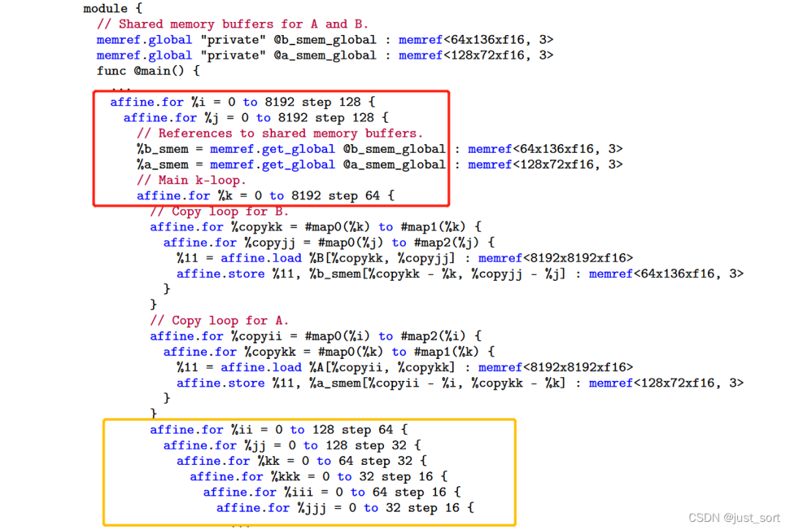커스텀 parsing 형식의 Affine Dialect IR

### 0x6.4.5 문서화

Dialect, Op, Interface는 모두 자체 ODS 기술로부터 생성된 문서를 가집니다. summary와 더 읽기 쉬운 description 외에도, 생성된 문서에는 인수와 result의 type constraint도 포함됩니다. validation 코드와 문서가 동일한 출처를 사용하므로, 문서는 runtime 동작과 동기화될 수 있습니다.

### 0x6.4.6 Verifier

Verifier는 IR의 구조적 정확성과 Op의 invariant를 강화하기 위해 사용되며, Pass가 검증된 IR invariant가 검사되었음을 확신할 수 있도록 하고, 디버깅 도구로도 활용될 수 있습니다. validation 과정은 MLIR의 전반적 구조 속성 검사로 시작합니다. 예를 들어 type이 완전히 매칭되어야 하며, value는 한 번만 정의되고 dominance 규칙과 가시성을 따라야 하며, symbol 이름은 symbol table에서 고유해야 하며, 모든 block은 terminator op로 끝나야 하는 등의 검사가 있습니다. 그 후 각 Op와 attribute의 verifier가 적용됩니다. 각 Op는 구조와 semantics 유효성을 검사하는 일련의 규칙을 정의할 수 있습니다. 예를 들어 binary op는 operand가 두 개인지 검사하며, 일부 op는 특정 type의 value만 받아들이고, 일부 op는 특정 attribute 또는 region이 부속되도록 요구합니다. 마찬가지로 Dialect attribute는 특정 op에서만 허용되거나, 이러한 attribute를 통해 그것이 부속된 op에 추가 제약을 가할 수 있습니다. 예를 들어 Dialect attribute는 op가 더 일반적이더라도 Dialect에 정의된 type만 사용하도록 op에 요구할 수 있습니다. validation 실패는 invariant violation으로 간주되며 컴파일은 중단됩니다.

## 0x6.5 평가: MLIR의 응용

MLIR 시스템의 목적은 다양한 종류의 컴파일러 프로젝트를 통합하고 추진하는 것이므로, 우리의 주요 평가 지표는 MLIR이 어떤 프로젝트에 채택되었는지를 보여주는 것입니다. 이 절에서는 사용자 커뮤니티 활동을 간략히 소개하고, 일부 사용 사례를 자세히 기술하여 MLIR의 범용성과 확장성을 강조하고, MLIR이 customizable 설계 원칙을 어떻게 잘 구현하는지 보여줍니다.

현재 MLIR은 여전히 발전 중인 오픈 소스 프로젝트이며, 사용자 커뮤니티는 학계와 산업계에 걸쳐 있습니다. 4개국의 4개 국립 연구소와 16개 대학에서 온 인사들이 고성능 컴퓨팅(HPC)에서 MLIR 사용에 관한 학술 워크숍에 참여했습니다. MLIR은 또한 14개의 다국적 기업의 인정을 받았습니다. LLVM Developer Meeting에서는 100명 이상의 산업계 개발자가 MLIR 관련 라운드테이블 회의에 참여했습니다. 26개 이상의 Dialect가 개발 중이며, 각각 다른 회사의 7개 프로젝트가 MLIR로 커스텀 컴파일러 인프라스트럭처를 대체하고 있습니다. 이는 MLIR에 대한 실질적인 수요와 가용성에 대한 인정을 보여줍니다.

### 0x6.5.1 TensorFlow graphs

대부분의 컴파일러 개발자도 다른 표현 형식에 익숙하지만, MLIR의 핵심 사용 사례 중 하나는 머신러닝 프레임워크의 개발을 지원하는 것입니다. 머신러닝 프레임워크의 내부 표현은 보통 동적 실행 semantics를 가진 데이터 흐름 graph[53]에 기반합니다.

TensorFlow[1]는 이러한 프레임워크의 한 예입니다. TensorFlow의 표현은 고수준 데이터 흐름 계산이며, 그 노드는 다양한 디바이스(특정 하드웨어 가속기 포함)에 배치할 수 있는 다양한 계산 과정입니다.

TensorFlow는 MLIR을 사용하여 이 내부 표현을 모델링하고, Figure 1에 표시된 사용 사례에 대해 변환을 수행합니다. 이는 단순한 대수 optimization을 (하드웨어 가속기) 데이터 센터 클러스터에서 병렬로 실행 가능한 새로운 형태의 graph로 변환하고, IR을 XLA[57]와 같은 도구를 사용해 효율적인 native 코드를 생성할 수 있고 모바일 배포에 적합한 표현으로 lowering합니다. MLIR에서의 TensorFlow Graph 표현은 그림 7과 같습니다.

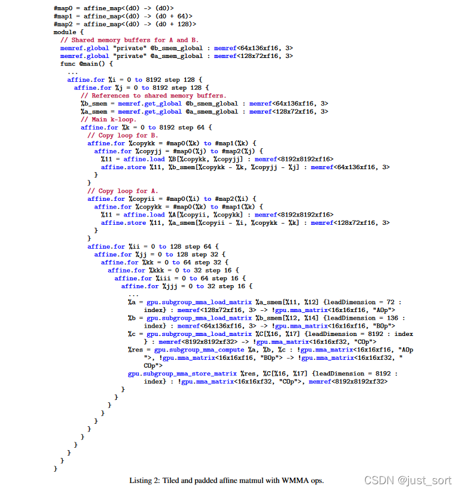TensorFlow Graph에 대응하는 MLIR 표현

### 0x6.5.2 Polyhedral code generation 다면체 코드 생성

MLIR의 초기 동기 중 하나는 가속기를 위한 polyhedral codegen을 탐구하는 것이었습니다. affine Dialect는 단순화된 polyhedral 표현 형식이며, progressive IR lowering을 구현하기 위해 설계되었습니다. 설계 핵심 사항을 모두 다루는 것은 본 논문의 범위를 벗어나지만, 본 논문은 affine Dialect의 몇 가지 측면을 설명하여 MLIR의 모델링 능력을 보여주고, affine Dialect를 과거의 일부 표현 형식과 비교합니다[17, 19, 54, 55, 52].

#### 공통점

MLIR affine Dialect는 모든 메모리 접근의 구조화된 다차원 type에 대해 작업할 수 있습니다. 기본 설정에서 이러한 구조화된 type은 injective이며, 서로 다른 index가 구성에 의해 alias되지 않음을 보장합니다. 이는 polyhedral dependence analysis의 일반적인 전제입니다.

Affine modeling은 두 부분으로 나눌 수 있습니다. attribute는 컴파일 타임에 affine map과 정수 집합을 모델링하는 데 사용되고, op는 코드에 affine constraint를 적용하는 데 사용됩니다. 즉, `affine.for` op는 "for" loop이며, 그 경계는 value의 affine map으로 표현되고, 이러한 value는 함수에서 불변 상태로 유지되어야 합니다. 따라서 loop는 정적 control flow를 가집니다. 이와 유사하게, `affine.if`는 affine integer set에 의해 제한되는 조건문입니다. loop와 조건문의 본문은 region이며, 이러한 region은 `affine.load`와 `affine.store`를 사용하여 index를 loop iterator의 affine 형식으로 제한합니다. 이로써 정확한 affine dependence analysis를 수행할 수 있고, 동시에 저수준 표현에서 affine 형식을 추론하는 일을 피할 수 있습니다.

#### 차이점

MLIR과 기존 polyhedral codegen 프레임워크 사이의 차이는 많으며, 다음 네 가지로 분류할 수 있습니다. (1) 풍부한 type: MLIR의 구조화된 memref type은 buffer index space를 실제 주소 space로 연결하는 layout map을 포함합니다. 이 두 space의 분리는 loop와 데이터 변환의 조합을 개선할 수 있는데, 데이터 layout 수정이 코드에 영향을 주지 않으며, 의존성 분석을 오염시키지 않기 때문입니다. 문헌[38]은 이러한 변환 혼합을 탐구한 바 있지만, 흔한 일은 아닙니다. (2) abstraction의 혼합: MLIR의 affine loop body는 typed SSA op로 표현될 수 있습니다. 따라서 모든 전통적인 컴파일러 분석과 transformation 과정이 여전히 적용 가능하며, polyhedral transformation과 교차로 사용될 수 있습니다. 반대로 polyhedral 컴파일러는 보통 이러한 세부 사항을 완전히 abstraction화하므로, vector type 같은 일부 객체를 다루기 어렵습니다. (3) 표현 차이의 감소: polyhedral 모델의 주요 특징 중 하나는 type 시스템에서 loop iteration 순서를 표현할 수 있다는 것입니다. 그러나 polyhedral transformation은 IR을 원본 IR과 완전히 다른 표현 형식으로 들어올립니다[20, 10]. 또한 변환된 polyhedron에서 loop로의 변환은 계산상 어렵습니다[7]. MLIR 기반 표현은 저수준 표현에서도 고수준 loop 구조를 유지하므로 IR을 들어올릴 필요가 없습니다. (4) 0x6.3.3 Pass Manager 절에서 언급한 바와 같이, 컴파일 속도는 MLIR의 핵심 목표이지만, 기존 대부분의 polyhedral 방식은 컴파일 속도에 주목하지 않습니다. 이러한 polyhedral 방식은 지수 복잡도 알고리즘에 크게 의존합니다. 정수 선형 계획법으로 loop 순서를 자동 도출하고, polyhedral scanning 알고리즘으로 IR을 다시 loop로 변환하는 데 의존합니다. MLIR이 채택한 방식은 polyhedral scanning에 의존하지 않으며, loop가 IR에 보존되기 때문입니다.

> ❝
>
> 논문은 MLIR이 도메인 특화 컴파일러에 적용된 사례와 MLIR 기반으로 개발된 Fortran IR 등의 예시도 들고 있는데, 여기서는 더 이상 다루지 않겠습니다. 관심이 있다면 원문을 참조하시기 바랍니다.
>
> ❞

## 0x6.6 MLIR 설계의 성과

MLIR 설계는 새로운 언어와 컴파일 abstraction을 모델링하는 데 도움이 되며, 동시에 기존의 일반적인 관련 컴파일 방법을 재사용하는 데도 도움이 됩니다. **"MLIR이 많은 문제에 대해 효과적으로 제시하는 해결 방법은 '새 op, 새 type을 추가하고, 가능하다면 그것들을 어떤 새 Dialect에 모으는 것'입니다"**. 컴파일러 엔지니어링 측면에서 이는 중대한 설계 전환이며, 새로운 기회와 도전, 통찰을 만들어냅니다. 이 절에서는 그중 일부 관점을 탐구합니다.

### 0x6.6.1 재사용 가능한 컴파일러 Pass

하나의 IR에서 여러 abstraction 수준을 표현할 수 있는 능력은 자연스럽게 여러 abstraction 수준에서 작동하는 Pass를 작성하자는 아이디어로 이어졌습니다. MLIR에 대한 흔한 질문은, 확장 가능한 op와 type 시스템을 가진 MLIR에서 컴파일러 Pass를 어떻게 작성할 것인가입니다. 컴파일러 Pass는 항상 보수적이고 정확한 방식으로 알려지지 않은 구조를 다룰 수 있지만, MLIR의 목표는 고성능 코드를 생성하는 것이며, 주로 네 가지 방법이 있습니다.

**"기본 op trait"** 일부 "bread and butter" 컴파일러 Pass(예: "dead code elimination", "common subexpression elimination")는 우리가 Op trait의 단순 속성으로 정의한 것(예: "has no side effect" 또는 "is commutative")에만 의존합니다. ODS의 Op 정의는 Op 개발자가 이러한 trait를 지정할 수 있도록 하며, Pass는 이 정보를 사용하여 op가 다양한 abstraction 도메인에서도 적용 가능하게 유지합니다.

MLIR의 확장성은 일부 구조적 속성을 포함하는 것으로 나타납니다. 여기에는 다음 정보가 포함됩니다. **"어떤 op가 control flow terminator인지 알려져 있는가"**, **"어떤 op가 포함하는 region이 isolated-from-above인지 알려져 있는가"**, 등등. 이러한 정보는 함수, closure, module, 기타 코드 구조의 모델링과 처리에 사용될 수 있습니다.

**"Privileged operation hooks"** (Op의 특별 hook) 일부 trait은 단일 비트로 모델링할 수 있지만, constant folding 로직 같은 다른 많은 trait은 C++ 코드 구현이 필요합니다. MLIR은 많은 Pass에 적용 가능한 일부 hook에 대해 가장 좋은 지원을 제공합니다. 이러한 hook은 op별로 구현될 수도 있고, Dialect 객체에 구현될 수도 있습니다. 후자의 방식은 TensorFlow op의 constant folding 같은 Pass를 지원하는 데 편리하며, 이런 경우에는 기존 로직에 위임하기가 쉽습니다.

constant folding은 매우 중요한 기능이지만, 더 흥미로운 hook은 `getCanonicalizationPatterns`이며, 이 hook은 op에 적용할 folding pattern을 지정할 수 있게 해줍니다. 이로써 중요한 대수적 단순화 형식(예: x − x → 0, min(x, y, y) → min(x, y) 등)이 확장 가능해지고, 일반적인 "Canonicalization" Pass를 모든 Dialect에 적용하는 데 도움이 됩니다. 이 모두는 단일 확장 가능한 시스템이 LLVM 생태계(및 다른 컴파일러)의 "InstCombine", "DAGCombine", "PeepholeOptimizer", "SILCombine" 같은 Pass와 기타 특수 목적 Pass를 포괄할 수 있게 합니다.

**"Optimization interfaces"** (optimization interface) MLIR의 주요 목표는 확장성이며, op와 type뿐만 아니라 transformation 측면에서도 확장 가능해야 합니다. canonicalization과 constant folding이 핵심 작업이지만, 코드 모델 등을 구현하기 위해서는 여전히 많은 표준 transformation을 어떤 방식으로 매개변수화하여 transformation의 특정 속성을 기술해야 합니다.

문제에 대한 해결책은 "optimization interface"라는 서브시스템입니다. MLIR inliner Pass를 생각해 봅시다. 우리는 inliner가 TensorFlow graph, Flang 함수, 함수형 언어의 closure 등을 처리할 수 있기를 바라지만, inliner는 caller가 무엇인지, 심지어 callee가 무엇인지도 모릅니다. inliner가 알아야 할 핵심 특성은 다음과 같습니다.

  * 주어진 op를 주어진 region에 inline하는 것이 유효한가;
  * inline 후 block 중간에서 종료되는 terminator op를 어떻게 처리할 것인가.

이러한 속성을 알기 위해 Inliner Pass는 Figure 10의 interface를 정의합니다. 각 op와 Dialect는 op와 Dialect에 그 interface 구현을 MLIR에 등록할 수 있으며, 일반 Inliner Pass에서 이익을 얻을 수 있습니다. op나 Dialect가 interface를 제공하지 않으면, 해당 optimization Pass는 그 op를 보수적으로 다룰 것입니다. 이러한 설계는 Dialect 개발자가 빠르게 Dialect 개발과 실행을 시작할 수 있게 합니다. 시간이 지나면서 interface 개발에 더 많은 노력을 투입함으로써 시스템에서 더 많은 이익을 얻을 수 있습니다.

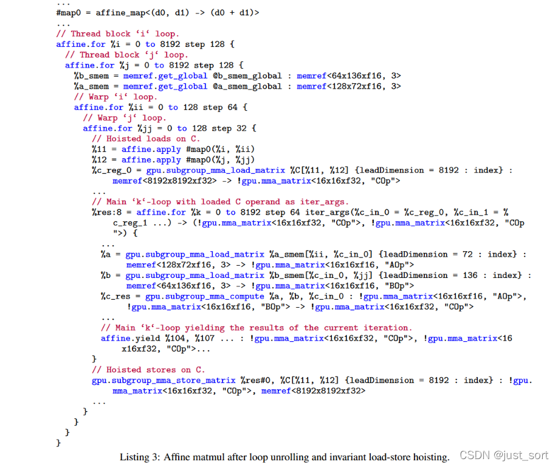inline Pass interface

optimization interface는 또한 핵심 컴파일러에 모듈화 이점을 제공합니다. Dialect 특화 로직이 핵심 transformation이 아닌 Dialect 자체 내부에서 구현되기 때문입니다.

**"Dialect 특화 Pass"** 마지막으로, 특정 Dialect를 정의하면 전용 Pass를 정의할 수 있습니다. MLIR 시스템에서 이러한 Pass는 다른 컴파일러 시스템의 Pass처럼 매우 유용합니다. 예를 들어 codegen이 특정 머신 constraint에 따라 머신 instruction을 커스텀 schedule하도록 만들고 싶다면, 전용 Pass를 통해 그 목적을 달성할 수 있습니다. 이는 Pass의 일반성을 고려할 필요 없이 새로운 transformation Pass를 개발하기 위한 출발점이 될 수 있습니다.

### 0x6.6.2 Dialect의 혼합

MLIR에서 가장 근본적인(그리고 가장 이해하기 어려운) 부분 중 하나는 서로 다른 Dialect의 op를 한 프로그램에 혼합하는 것을 허용하고 권장한다는 점입니다. 일부 경우(예: host와 가속기의 계산을 같은 module에 보존)에는 이해하기 쉽지만, 가장 흥미로운 경우는 MLIR에서 Dialect를 직접 혼합할 수 있다는 점입니다(이를 통해 클래스 전체의 재사용이 가능). 이는 다른 시스템에서는 볼 수 없는 것입니다.

0x6.5.2 절에서 기술한 affine Dialect를 생각해 봅시다. affine control flow와 affine map의 정의는 affine region 안에 포함된 op의 semantics와는 무관합니다. 우리의 사례에서는 affine Dialect를 "standard" Dialect와 결합하여 단순 산술을 (LLVM IR처럼) target 무관 형식으로 표현했고, 또한 내부 가속기를 target으로 하기 위해 affine Dialect를 다중 target 관련 머신 instruction Dialect와 결합할 수도 있습니다. 다른 사람들은 affine Dialect를 다른 문제 영역의 abstraction과 결합하기도 했습니다.

(특정 transformation에서 op의 semantics를 얻기 위해 Op Interface를 사용하여) 일반 polyhedral transformation을 재사용하는 능력은 컴파일러 인프라스트럭처를 분해하는 강력한 방법입니다. 또 다른 예시로, 다양한 source 언어 IR에서 OpenMP Dialect를 사용하고 재사용할 수 있습니다.

### 0x6.6.3 상호 운용성

본 논문의 작업은 많은 기존 시스템과의 상호 운용을 다룹니다. 예를 들어 protobuf 형식의 머신러닝 graph, LLVM IR을 포함한 컴파일러 IR, 다양한 독자적 instruction set 등입니다. 어떤 표현 형식이든 불가피하게 다양한 결함이 있으며, 이러한 결함은 어떤 기존 시스템의 적용 시나리오에서는 합리적이지만, MLIR의 표현력은 MLIR을 더 나은 표현 형식으로 만듭니다. importer와 exporter의 테스트 난이도가 매우 높기 때문에(테스트 케이스는 보통 binary 형식), 우리는 그 복잡도를 최소화하기를 원합니다.

문제에 대한 해결책은 가능한 한 외부 시스템에 직접 대응하는 Dialect를 정의하는 것이며, 이를 통해 단순하고 예측 가능한 방식으로 그 형식을 양방향 변환할 수 있습니다. 일단 IR을 MLIR 형식으로 import하면, MLIR 인프라스트럭처의 모든 transformation을 사용하여 import된 IR을 더 적합한 IR 형식으로 upgrade 또는 downgrade할 수 있으며, 이러한 transformation Pass에 대해 다른 모든 MLIR Pass와 유사한 테스트를 수행할 수 있습니다.

이러한 Dialect의 예는 많습니다. a) LLVM Dialect, LLVM IR을 MLIR로 매핑할 수 있음; b) TensorFlow의 graph 표현 형식, 이러한 표현이 제안된 이유는 TensorFlow에서 "switch and merge" 노드 관련 분석과 transformation을 단순화하기 위함; c) 함수형 control flow operator. "functional while"과 "functional if"는 머신러닝 graph에서 매우 흔하며, 이러한 경우 그 코드 본문을 외부 함수가 아닌 region으로 두는 것이 더 편리합니다.

이 접근 방식은 우리에게 매우 잘 작동하며, MLIR 도구는 외부 binary 파일 형식의 테스트 케이스를 작성하는 데도 매우 유용합니다.

### 0x6.6.4 비표준화 설계가 가져온 새로운 도전

MLIR은 개발자가 거의 임의의 abstraction을 정의할 수 있게 하지만, 어떤 방식이 실제로 더 효과적인지 또는 덜 효과적인지에 대한 지침을 거의 제공하지 않습니다. 현재 일부 엔지니어와 연구자가 이 분야의 경험을 가지고 있으며, 컴파일러 IR 설계와 abstraction 설계의 "예술"이 컴파일러와 언어 분야에서 잘 이해되지 않는다는 것을 깨달았습니다. 많은 사람들은 기존 시스템의 제약 안에서 작업하지만, 상대적으로 직접 abstraction을 정의할 기회를 얻는 사람은 드뭅니다.

이는 도전이지만 동시에 미래 연구의 기회이기도 합니다. MLIR 커뮤니티는 이러한 abstraction 설계를 통해 전문 지식을 축적하고 있으며, 시간이 지남에 따라 이는 결실 있는 연구 영역이 될 것입니다.

### 0x6.6.5 기대

여러 다른 시스템에 MLIR을 구축하고 적용한 후, MLIR의 설계가 다른 컴파일러 인프라스트럭처와 매우 다르다는 것을 발견할 수 있었습니다. 우리는 발견되어야 할 응용 영역이 여전히 많이 남아 있다고 믿으며, MLIR의 모든 설계 핵심을 완전히 이해하고 모범 사례를 정립하기 위해서는 더 많은 연구 시간이 필요합니다. 예를 들어 out-of-tree Dialect의 부상, frontend가 MLIR을 사용하는 source 언어의 증가, AST에서의 가능한 응용, 그리고 구조화된 데이터(예: JSON, protocol buffer 등)에 대한 응용이 모두 매우 초기 단계이며, 거기에서 많은 흥미로운 새로운 도전과 기회를 발견할 수 있을 것입니다.

# 0x7. 논평(OneFlow Dialect를 예시로)

이상이 MLIR 논문의 대략적인 내용입니다. MLIR 논문에서 언급된 컴포넌트를 마인드맵으로 그려보면 대략 다음과 같습니다.

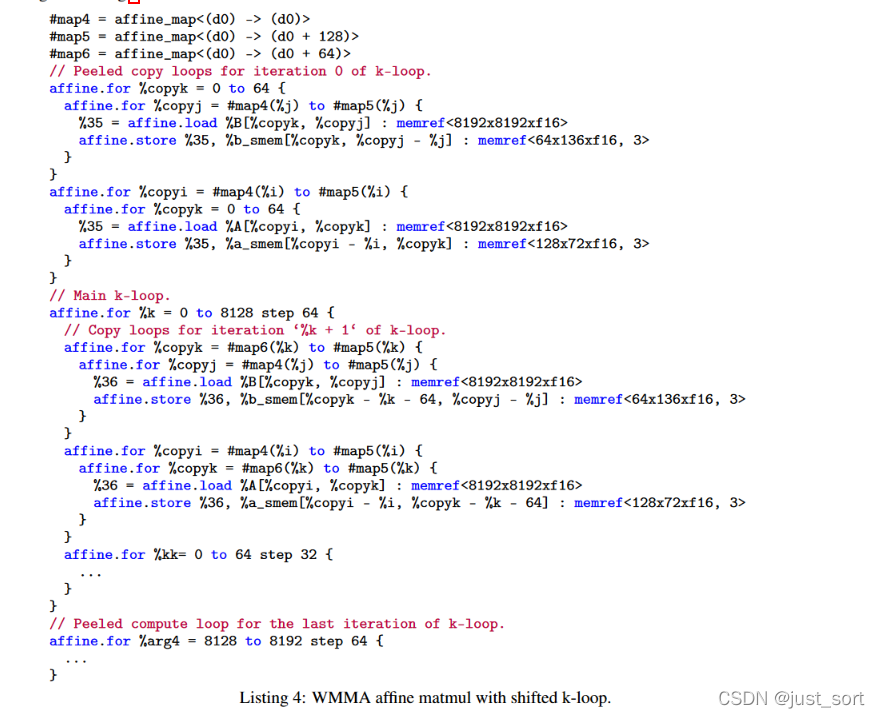Dialect의 구성 요소

아래에서는 OneFlow Dialect를 예시로 이 그림을 설명하겠습니다.

논문에서 언급한 것처럼, MLIR에서 Operation은 MLIR의 기본 의미 단위입니다. 새로운 Dialect를 정의한 후 가장 먼저 고려해야 할 것은 Operation의 정의이며, Operation을 정의하려면 먼저 Attribute와 Type을 정의해야 합니다. OneFlow Dialect의 정의는 `oneflow/ir/include/OneFlow/OneFlowDialect.td` 파일에 있으며, ODS 규칙에 따라 `description`, `cppNamespce` 같은 핵심 정보를 설정한 다음, MLIR이 제공하는 `mlir-tblgen` 실행 파일에 의존하여 OneFlow Dialect의 C++ 코드를 자동 생성합니다.

    def OneFlow_Dialect : Dialect {
        let name = "oneflow";
        let summary = "OneFlow MLIR dialect.";
        let description = [{
            This dialect is the IR of OneFlow.
        }];
        let cppNamespace = "::mlir::oneflow";
        let dependentDialects = [
            "StandardOpsDialect"
        ];
    }

다음으로 Type의 정의는 `oneflow/ir/include/OneFlow/OneFlowBase.td`와 `oneflow/ir/include/OneFlow/OneFlowEnums.td` 두 파일에 있으며, 각각 OneFlow의 Tensor type 및 후속 Operation에서 Attribute를 지정하는 데 필요한 Type을 정의합니다. 참고로 OneFlow의 Operation 정의에서는 아래에 정의된 Type 외에도 MLIR이 제공하는 기본 Type을 광범위하게 사용합니다.

    def OneFlow_Tensor : TensorOf<[AnyType]>;
    def SI32ArrayAttr : TypedArrayAttrBase<SI32Attr, "signed 32-bit integer array attribute"> {}

    def SI64ArrayAttr : TypedArrayAttrBase<SI64Attr, "signed 64-bit integer array attribute"> {}

    def ShapeAttr : TypedArrayAttrBase<SI64Attr, ""> {}
    ...

Attribute의 정의는 각 Operation 정의 안에서 `let attrs=`를 사용하여 지정합니다. 다음으로 LeakyReLU를 예로 OneFlow Dialect의 Operation 정의를 살펴보겠습니다(`oneflow/ir/include/OneFlow/OneFlowUserOps.td`에 위치).

    def OneFlow_LeakyReluOp : OneFlow_BaseOp<"leaky_relu", [NoSideEffect, DeclareOpInterfaceMethods<UserOpCompatibleInterface>]> {
      let input = (ins
        OneFlow_Tensor:$x
      );
      let output = (outs
        OneFlow_Tensor:$y
      );
      let attrs = (ins
        DefaultValuedAttr<F32Attr, "0.">:$alpha
      );
      let has_logical_tensor_desc_infer_fn = 1;
      let has_physical_tensor_desc_infer_fn = 1;
      let has_get_sbp_fn = 1;
      let has_data_type_infer_fn = 1;
    }

`OneFlow_LeakyReluOp`가 `OneFlow_BaseOp`를 상속하고, 입력, 출력, Attribute를 선언했음을 확인할 수 있습니다. 가장 아래의 4개의 마크는 OneFlow가 LLVM의 `table-gen` 위에 추가한 약간의 확장으로, op 정보 추론 interface를 자동으로 생성하는 데 편리하므로 여기서는 신경 쓸 필요가 없습니다.

위에서 Attribute, Type, Interface를 다루었으니 이제 OneFlow Dialect의 Operation의 Trait와 Constraint에 대해 이야기해 보겠습니다. MLIR에서 Trait(특성)와 Constraint(제약)의 base class는 `OpTrait` 클래스이며, trait와 constraint는 보통 op의 특별한 속성과 제약을 지정하는 데 사용됩니다. 예를 들어 op가 부작용을 가지는지 여부, op의 출력이 입력과 같은 형상을 가지는지 여부 등입니다.

OneFlow의 Operation 정의에서는 LeakyReLU에서의 `NoSideEffect` 같은 MLIR 제공 trait뿐만 아니라, `IsOpConfCompatible` 같은 커스텀 trait도 사용했습니다. `oneflow/ir/include/OneFlow/OneFlowBase.td`의 `def OneFlow_IsOpConfCompatible : NativeOpTrait<"IsOpConfCompatible">;`라는 한 줄은 MLIR이 제공하는 ODS 메서드 `NativeOpTrait`을 사용하여 OneFlow Dialect로 정의된 op가 OpName, DeviceDagAttr 등 일부 공통 속성을 가지는지 검사하는 커스텀 trait를 선언한 것입니다. 이는 ODS에서 커스텀 속성을 선언한 것일 뿐이며, 실제 정의는 `oneflow/ir/include/OneFlow/OneFlowOpTraits.h`에 있습니다. 여기서는 간단히 발췌하여 살펴보겠습니다.

    template<typename ConcreteType>
    class IsOpConfCompatible : public TraitBase<ConcreteType, IsOpConfCompatible> {
     public:
      static StringRef getOpNameAttr() { return "op_name"; }
      static StringRef getDeviceTagAttr() { return "device_tag"; }
      static StringRef getDeviceNameAttr() { return "device_name"; }
      static StringRef getScopeSymbolIDAttr() { return "scope_symbol_id"; }
      static StringRef getHierarchyAttr() { return "hierarchy"; }
      static LogicalResult verifyTrait(Operation* op) { return impl::VerifyIsOpConfCompatible(op); }
    };

    LogicalResult VerifyIsOpConfCompatible(Operation* op) {
      for (auto attr : {
               IsOpConfCompatible<void>::getOpNameAttr(),
               IsOpConfCompatible<void>::getDeviceTagAttr(),
           }) {
        if (!op->hasAttrOfType<StringAttr>(attr)) {
          return op->emitError("expected operation to have attribute: " + attr);
        }
      }
      if (!op->hasAttrOfType<ArrayAttr>(IsOpConfCompatible<void>::getDeviceNameAttr())) {
        return op->emitError("expected operation to have attribute: "
                             + IsOpConfCompatible<void>::getDeviceNameAttr());
      }
      return success();
    }

Trait 외에도 OneFlow는 MLIR이 제공하는 `SameOperandsAndResultType` 같은 trait도 사용합니다. `oneflow/ir/include/OneFlow/OneFlowBase.td`의 `OneFlow_UnaryBaseOp` 정의 부분을 봅시다.

    class OneFlow_UnaryBaseOp<string mnemonic, list<Trait> traits = []> :
            OneFlow_BaseOp<mnemonic, !listconcat(traits, [SameOperandsAndResultType, NoSideEffect])> {
      let summary = "";
      let input = (ins AnyType:$x);
      let output = (outs AnyType:$y);
      let has_logical_tensor_desc_infer_fn = 1;
      let has_physical_tensor_desc_infer_fn = 1;
      let has_get_sbp_fn = 1;
      let has_data_type_infer_fn = 1;
    }

이 trait가 표현하는 의미는, UnaryBaseOp을 상속한 Operation의 operand와 result type이 모두 동일하다는 것입니다. 물론 trait도 constraint와 마찬가지로 커스텀할 수 있으며, `td` 파일에서 `NativeOpTrait`로 명시한 다음 구현은 마찬가지로 `oneflow/ir/include/OneFlow/OneFlowOpTraits.h`에 작성합니다.

위 설명을 통해 MLIR 안의 Type, Attribute, Operation, Trait, Constraint에 대해 어느 정도 이해하셨을 것이라 믿습니다. 다음으로는 Interface에 대해 말씀드릴 텐데, Interface는 MLIR에서 IR과 상호 작용하는 일반적인 방식을 제공합니다. Interface의 설계 목표는 특정 Dialect의 특정 Operation과 Dialect의 특정 지식에 침범하지 않고도 MLIR 표현식을 변환하고 분석할 수 있도록 하는 것입니다. 이렇게 하면 변환, 분석과, 새 Dialect 및 그에 대응하는 Operation 추가를 분리할 수 있어 MLIR의 확장성이 크게 강화됩니다. Interface의 중요성을 설명하기 위해, 이 시리즈에서는 공식 문서를 참고하여 별도의 글을 작성했습니다. 참고 가능: [[밑바닥부터 배우는 딥러닝 컴파일러] 18, MLIR의 Interfaces](<https://mp.weixin.qq.com/s?__biz=MzA4MjY4NTk0NQ==&mid=2247500664&idx=1&sn=3f3f11dee1b9a66030ed57805b721b16&scene=21#wechat_redirect>).

OneFlow에서 각 커스텀 Interface는 `oneflow/ir/include/OneFlow/OneFlowInterfaces.td`에 있습니다. `UserOpCompatibleInterface`를 예시로 Interface의 구체적 구현을 살펴보겠습니다.

    def UserOpCompatibleInterface : OpInterface<"UserOpCompatible"> {
      let description = [{
        Interface to getting the hard-coded bn
      }];

      let methods = [
        StaticInterfaceMethod<"",
            "const std::vector<std::string>*", "inputKeys", (ins), [{
            static std::vector<std::string> val(mlir::oneflow::support::GetInputKeys(ConcreteOp::getOperationName().split('.').second.str()));
            return &val;
        }]>,
        StaticInterfaceMethod<"",
            "const std::vector<std::string>*", "outputKeys", (ins), [{
            static std::vector<std::string> val(mlir::oneflow::support::GetOutputKeys(ConcreteOp::getOperationName().split('.').second.str()));
            return &val;
        }]>,
        InterfaceMethod<"",
            "std::pair<unsigned, unsigned>", "getODSOperandIndexAndLength", (ins "unsigned":$index), [{
            return $_op.getODSOperandIndexAndLength(index);
        }]>,
        InterfaceMethod<"",
            "std::pair<unsigned, unsigned>", "getODSResultIndexAndLength", (ins "unsigned":$index), [{
            return $_op.getODSResultIndexAndLength(index);
        }]>
      ];
    }

`UserOpCompatibleInterface`가 Interface ODS 명세의 StaticInterfaceMethod와 InterfaceMethod를 사용하여, 이 Interface에 대해 Operation의 입력 operand 이름, 출력 operand 이름, operand 및 길이, result 및 길이 등을 얻는 메서드를 지정한 것을 볼 수 있습니다. 그런 다음 OneFlow의 `oneflow/ir/include/OneFlow/OneFlowUserOps.td`에서 `DeclareOpInterfaceMethods<UserOpCompatibleInterface>`를 사용하여 이를 Operation 수준 Interface로 지정합니다. 생성된 Operation 코드에는 이 Interface 선언이 포함됩니다.

그렇다면 이렇게 하는 데 어떤 이점이 있을까요? 첫째, OneFlow의 UserOp이 모두 UserOpCompatibleInterface를 갖추고 있기 때문에, OneFlow의 UserOp에 대해 일반적인 `GetInputKeys` 함수를 구현하기만 하면, UserOp에서 파생된 모든 Operation이 이 함수의 기능을 갖추게 됩니다. 모두 UserOpCompatibleInterface 라는 interface를 가지고 있기 때문입니다.

Interface에 대한 보다 일반적이고 고전적인 또 다른 예시는 Interface 기반으로 일부 일반 Pass를 개발하는 것입니다. 예를 들어 inlining과 형상 추론 Pass인데, 이는 Dialect 수준 Interface 응용에 속합니다. 자세한 내용은 [[밑바닥부터 배우는 딥러닝 컴파일러] 13, MLIR에서 Pass를 어떻게 작성할까?](<https://mp.weixin.qq.com/s?__biz=MzA4MjY4NTk0NQ==&mid=2247499540&idx=1&sn=c88146d7f00d83d8671fe6214d4416d4&scene=21#wechat_redirect>)를 참조하십시오.

마인드맵에서는 region과 block에 대한 설명만 빠져 있습니다. 사실 MLIR 논문에서 region과 block에 대해 한 설명은 충분히 적절하다고 생각합니다. Operation(Op)은 일련의 region에 부속됩니다. region은 MLIR의 nested 구조를 구현하는 메커니즘을 제공합니다. Operation은 일련의 region을 가지며, region은 일련의 block으로 구성되고, block은 일련의 Operation을 포함합니다. 이러한 nested 관계를 통해 scope와 control flow 관계를 표현할 수 있습니다. OneFlow의 Dialect에서 region과 block의 응용은 현재 주로 함수 관련 semantics에 집중되어 있습니다. 예를 들어 `oneflow/ir/lib/OneFlow/Passes.cpp`의 Pass 구현에서 `OutlineMulCast`는 IR에 있는 instruction의 op pattern을 실행하기 위해 FuncOp 유형의 Operation으로 외부화할 수 있으며, 이때 block을 사용하여 IR에서 FuncOp의 삽입 위치를 결정합니다. 또 다른 예로 FuncOp의 매개변수에 접근하는 것이 있는데, 이 또한 block이 필요합니다. 예를 들어 `oneflow/ir/lib/OneFlow/OneFlowOps.cpp`에서는 Job Operation에 대해 함수의 매개변수 list가 entry block의 인수 list와 매칭되는지 검사하는 verify 함수가 구현될 수 있습니다.

    static LogicalResult verify(Job op) {
      // 이 함수가 external이라면 할 일이 없음.
      if (op.isExternal()) return success();

      // 함수의 인수 list와 entry block의 인수 list가 일치하는지 검증.
      // trait는 이미 시그니처와 block 사이의 인수 개수가 같음을 검증했음.
      auto fnInputTypes = op.getType().getInputs();
      Block& entryBlock = op.front();
      for (unsigned i = 0, e = entryBlock.getNumArguments(); i != e; ++i)
        if (fnInputTypes[i] != entryBlock.getArgument(i).getType())
          return op.emitOpError("type of entry block argument #")
                 << i << '(' << entryBlock.getArgument(i).getType()
                 << ") must match the type of the corresponding argument in "
                 << "function signature(" << fnInputTypes[i] << ')';

      return success();
    }

Job op의 정의를 보면 `let regions = (region AnyRegion:$body);`로 body라는 region에 바인딩되어 있음을 알 수 있습니다. 따라서 위의 verify 함수가 FuncOp의 block에 접근할 때, 해당 block이 대응하는 region에 암묵적으로 접근하게 되며, 이는 `op.front()`을 `op.body().front()`로 바꾸는 것과 동등합니다.

Region과 Block은 MLIR의 scope에 대응합니다. 이를 통해 MLIR의 복잡한 구조에 대한 control flow 관계를 구현하고, 일반 Operation, FuncOp, ModuleOp을 구분하여 MLIR에서 Operation 균일성 원칙을 달성할 수 있습니다.

OneFlow Dialect에서 사용되는 Pass 메커니즘에 대해서는 [OneFlow를 예시로 MLIR의 실제 개발 흐름을 살펴보면서](<https://mp.weixin.qq.com/s?__biz=MzA4MjY4NTk0NQ==&mid=2247500159&idx=1&sn=e7f8359110372ec0f4ff95a91833cf7f&scene=21#wechat_redirect>)에서 이미 설명했으므로 여기서는 반복하지 않겠습니다.

정리하자면, MLIR은 재사용 가능하고 확장 가능한 컴파일 인프라스트럭처이며 엔지니어링 개발 관점에서 주목할 만한 가치가 있습니다. 이 절에서는 OneFlow Dialect의 다양한 구성 요소와 그 관계를 소개했지만, OneFlow Dialect와 다른 Dialect 간의 관계 또는 현재 Dialect의 lowering 흐름에 대해서는 아직 다루지 않았습니다. 실제로 MLIR에는 심층적인 연구와 학습이 필요한 기술적 세부 사항이 여전히 많으므로, 이 절은 주로 정리와 영감 제공의 역할을 합니다.

# 0x8. 관련 참고 자료

이 글은 원본 MLIR 논문(https://arxiv.org/pdf/2002.11054.pdf)과 번역본(https://zhuanlan.zhihu.com/p/336543238)을 참조했습니다.
