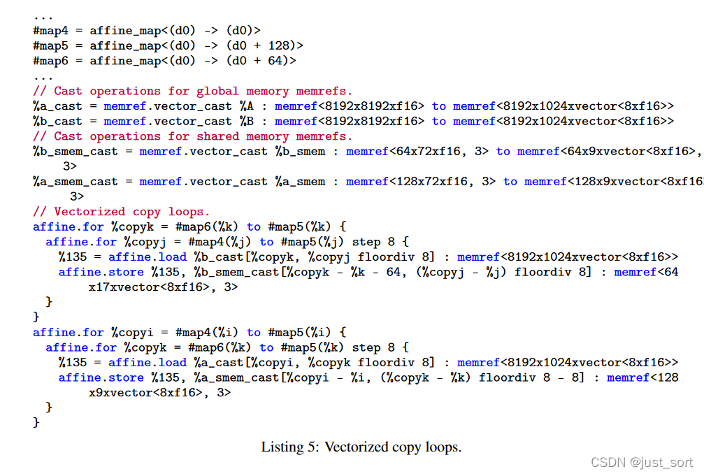
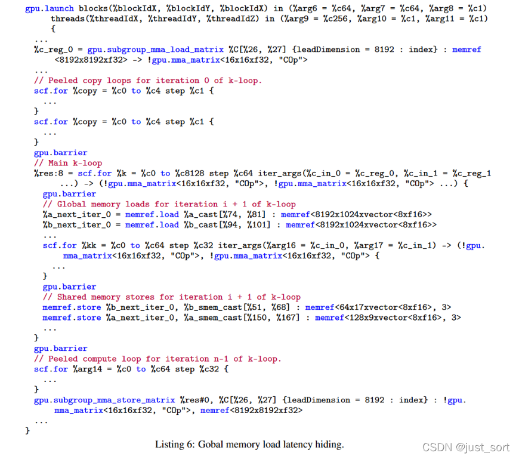
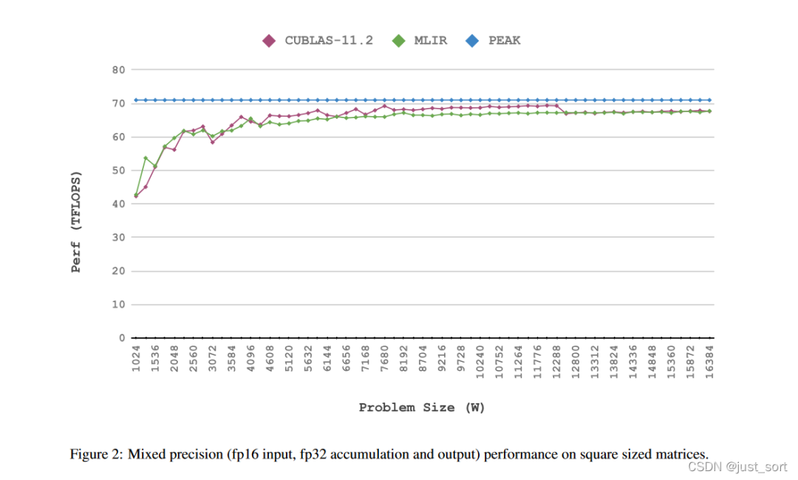
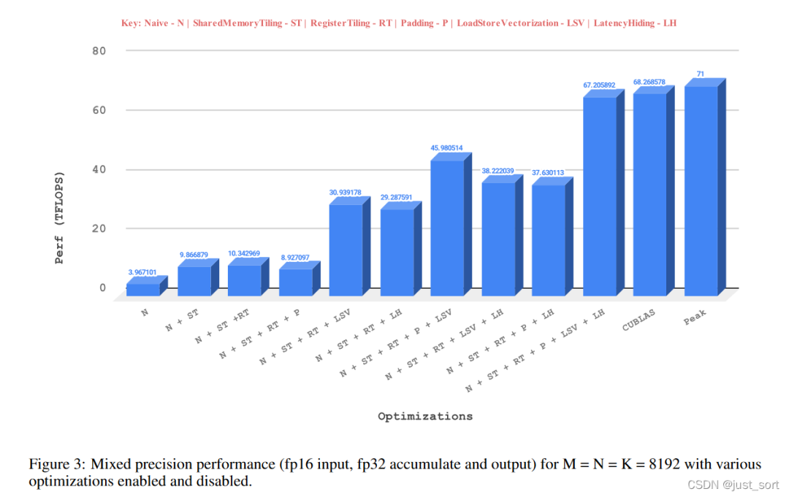
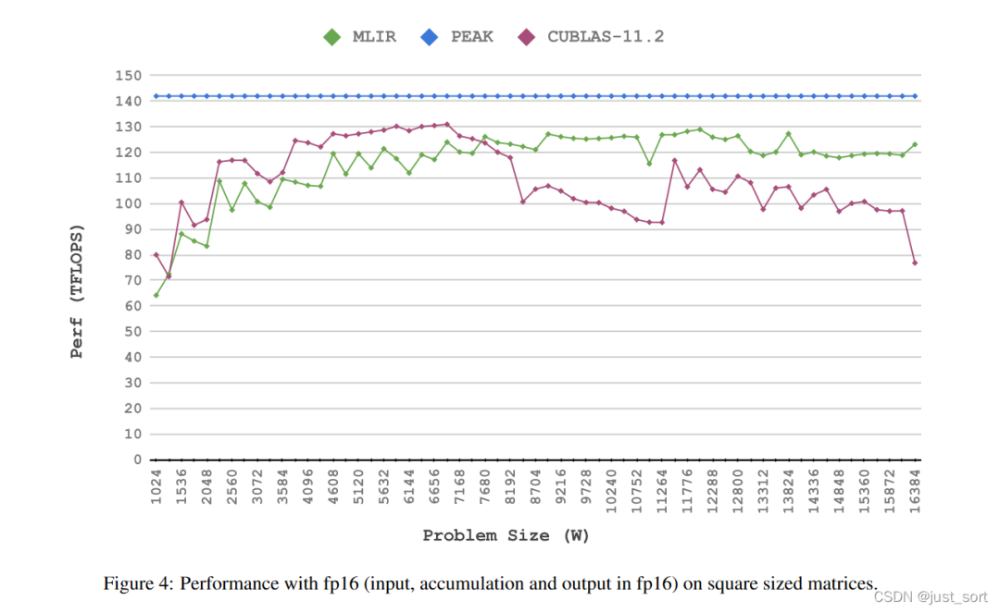

# [논문 해설] MLIR 기반 행렬 곱 고성능 GPU 코드 생성, cuBLAS와 동등한 성능

# 0x0. 머리말

이 글에서는 MLIR 컴파일러 인프라를 기반으로 효율적인 GPU 코드를 생성하는 방법을 알아보기 위해 논문(https://arxiv.org/abs/2108.13191)을 해설합니다. 이 글의 읽기 순서는 다음과 같습니다.

  1. 제목
  2. 초록
  3. 서론
  4. 결론
  5. 배경
  6. 설계
  7. 실험
  8. 코멘트

> 본 논문은 MLIR의 Tensor Core 관련 연구이며, 본 논문에 사용된 코드는 llvm 프로젝트에서 오픈 소스로 공개되었습니다.

# 0x1. 제목

논문 제목 및 저자 정보

이 논문의 제목은 "MLIR 기반 행렬 곱(matrix multiplication) 고성능 GPU 코드 생성: 초기 결과(High Performance GPU Code Generation for Matrix-Matrix Multiplication using MLIR: Some Early Results)"입니다. 이는 향후 추가 실험이나 보충 정보를 통해 논문이 더욱 정교해질 수 있음을 시사합니다. 저자들은 PolyMage Labs와 인도 공과대학교(IIT) 소속입니다.

# 0x2. 초록

이 논문은 MLIR 컴파일러 인프라를 사용하여 NVIDIA GPU의 Tensor Core용 코드를 생성하는 일부 결과를 제시합니다. 현재 최첨단 고성능 딥러닝 기술은 주로 고도로 튜닝된 라이브러리에 의해 구동됩니다. 이러한 라이브러리는 일반적으로 전문 프로그래머가 수동으로 저수준에서 최적화 및 튜닝하므로 상당한 노력이 필요합니다. 이러한 작업과 노력은 유사한 하드웨어 또는 향후 새로운 하드웨어에 대해 반복되어야 할 수도 있습니다. 따라서 이 과정은 LLVM과 같은 컴파일러 인프라만큼 모듈화되고 재사용성이 높지 않습니다. 수동 최적화는 일반적으로 IR을 활용하지 않지만, 이러한 최적화는 IR에 정의된 일련의 Pass로 인코딩될 수 있습니다. 또한 수동 튜닝은 자동 코드 생성을 통해서만 쉽게 달성할 수 있는 최적화 지점을 놓칠 수 있습니다. 이 논문은 MLIR이 도입되기 전에는 IR 인프라가 도메인 특화 라이브러리의 자동 생성 문제를 효과적으로 해결하지 못했다고 주장합니다. 특히, 단일 IR을 사용하여 고수준, 중간 수준 및 저수준 추상화를 표현하고 변환하는 것은 어렵습니다.

MLIR 내의 적절한 추상화를 활용하여 GPU 기반 Tensor Core 하드웨어에서 matrix multiplication 코드를 자동으로 생성하는 실험적인 sub-pipeline을 구축했습니다. 초기 성능 실험 결과, NVIDIA Ampere 아키텍처(GeForce 3090 RTX 그래픽 카드)에서 FP32 및 FP16 연산에 대해 각각 cuBLAS 성능의 95~119% 및 80~160%를 달성할 수 있음을 보여주었습니다. 이러한 결과는 IR 인프라를 활용하여 유사한 특수 가속기를 위한 코드 및 라이브러리를 자동으로 생성하는 추가 연구 개발에 동기를 부여할 것으로 기대합니다.

# 0x3. 서론

딥러닝과 인공지능은 일반적으로 고성능 컴퓨팅에 크게 의존합니다. 컴퓨터 하드웨어 및 마이크로아키텍처, 라이브러리, 컴파일러, 런타임, 프로그래밍 모델의 혁신은 이러한 컴퓨팅 요구를 충족시키기 위해 끊임없이 이루어지고 있습니다. 현재, cuDNN, cuBLAS, MKL(현재는 oneDNN으로 간주됨)과 같은 하드웨어 제조사에서 제공하는 고도로 최적화된 라이브러리를 통해 많은 고성능 딥러닝 애플리케이션이 지원되고 있습니다. 이러한 라이브러리를 개발하는 데는 상당한 노력과 전문 지식이 필요하며, 하드웨어 또는 소프트웨어 버전이 변경될 때마다 개발 과정을 반복해야 할 수도 있어 효과적인 탐색 및 최적화에 한계가 있습니다.

matrix multiplication 연산 kernel은 BERT와 같은 많은 transformer 기반 아키텍처의 핵심이며, 달성 가능한 목표를 측정하는 데 좋은 테스트 사례로도 활용됩니다. 자동 코드 생성기의 장점은 개별 kernel보다는 여러 kernel의 조합을 최적화하는 데 있지만, 잘 연구된 kernel에 대해 하드웨어 최고 성능에 근접하는 코드를 자동으로 생성할 수 없다면 자동 코드 생성의 타당성이 떨어집니다. 이 보고서에서는 특히 matrix multiplication-accumulate(MMA) 연산 전용 유닛인 NVIDIA GPU Tensor Core에 초점을 맞추는데, 이 코어는 일반적으로 일반 CUDA Core보다 3~4배 높은 throughput을 제공합니다.

최근 몇몇 연구에서는 GPU Tensor Core에서의 GEMM에 초점을 맞추고 있습니다. Faingnaert 등은 Julia로 3계층 API를 만들어 두 언어의 문제를 해결하고자 했으며, 이를 통해 사용자는 효율적인 GEMM kernel을 작성할 수 있습니다. 이들의 주요 목표는 여러 수준의 추상화를 가진 통합 IR 인프라를 사용하는 대신, 다양한 애플리케이션의 요구 사항을 충족할 수 있도록 충분히 유연한 API를 개발하는 것입니다. Bhaskaracharya 등은 polyhedral 코드 생성 방법을 사용하여 Volta Tensor Core용 코드를 생성했습니다. 이들은 스케줄링 트리를 사용하여 계산을 표현하고 ISL[27]을 사용하여 CUDA 코드를 생성했습니다. matmul 및 BiasAdd+ReLU와 같은 fusion 연산에 대한 코드를 생성하여 최대 2.55배의 속도 향상을 달성할 수 있습니다. 이 연구는 Volta를 대상으로 하며 고성능을 달성하기 위한 하드웨어별 최적화를 포함합니다. Tillet 등은 IR 및 신경망 계산 최적화 컴파일러인 Triton을 제안했습니다. 이 프레임워크는 정적 다차원 배열의 `tile` 개념을 기반으로 합니다. Triton 컴파일러는 사용자가 Python 코드를 작성하면 컴파일러가 자동으로 효율적인 기계어 코드를 생성해 주는 Python 패키지로 제공됩니다. 이 프로젝트는 CUDA Core와 Tensor Core를 모두 지원하며 우수한 성능을 달성합니다.

본 논문에서는 고성능 코드 라이브러리 생성을 위해 컴파일러 IR(Intermediate Representation) 인프라를 활용하는 접근 방식을 제시합니다. NVIDIA Tensor Core를 backend로 사용하는 matrix multiplication kernel을 대상으로 실험을 수행했습니다. 본 논문에서 사용하는 컴파일러 인프라는 MLIR이며, 전체 프로세스를 크게 모듈화, 체계화 및 자동화하는 것을 목표로 합니다. IR을 점진적으로 lowering하고 적절한 IR 변환 및 최적화를 적용함으로써, 실제로 코드를 작성하지 않고도 수작업으로 작성한 라이브러리와 유사한 성능을 달성할 수 있음을 보여줍니다. 기존 연구에서는 단일 CPU 코어에서 고성능 구현을 위한 유사한 접근 방식을 탐구했지만, 본 논문에서는 전용 가속기에 초점을 맞춥니다.

이 논문의 기여:

  * MLIR Dialect에 Warp Matrix Multiply Accumulate(WMMA) [13] 연산을 도입하고 이를 LLVM/NVPTX backend로 lowering합니다.
  * GPU에서 matmul을 일련의 MLIR 변환 및 dialect 처리 과정을 통해 체계적이고 점진적으로 생성하는 방법을 보여줍니다.
  * Tensor Core용 matrix multiplication(matmul) 코드 생성 pipeline을 end-to-end로 구축했습니다. 예비 결과에 따르면, 성능은 수동으로 최적화된 라이브러리와 유사하며, 경우에 따라 최대 1.60배의 속도 향상을 보였습니다.

이러한 유형의 모델에서 MLIR로 이어지는 lowering 경로가 존재한다면, 우리의 IR 기반 접근 방식은 다양한 프로그래밍 모델 및 언어와 함께 사용될 수 있습니다.

> 이 섹션에서는 먼저 GPU Tensor Core GEMM과 관련된 일련의 연구들을 나열하여 초록을 보강합니다. 여기에는 직접 개발한 라이브러리와 Triton과 같은 컴파일러 기반 접근 방식이 포함됩니다. 그런 다음 저자들은 MLIR 인프라를 기반으로 고성능 GPU Tensor Core GEMM 코드 생성을 탐구하는 본 논문의 접근 방식을 소개하고, 논문의 주요 기여 사항을 나열합니다. (본 논문은 MLIR을 응용한 것으로, 엔지니어링 방향에 중점을 두고 있음을 알 수 있습니다.)

# 0x4. 결론

본 논문에서는 NVIDIA Tensor Core에서 지원하는 전용 matmul 명령어에 대한 자동 코드 생성의 초기 결과를 제시합니다. 이러한 예비 결과는 자동 코드 생성기가 많은 경우 수동으로 최적화된 라이브러리와 유사한 성능을 달성할 수 있음을 보여줍니다. NVIDIA Ampere 아키텍처 기반의 NVIDIA GeForce 3090 RTX에서의 실험 결과는 본 접근 방식의 효과를 입증합니다. 이 연구는 개별 kernel뿐만 아니라 kernel 구성 및 fusion까지 최적화할 수 있는 강력한 코드 생성기를 설계하는 데 있어 중요한 초석이 될 것입니다. 이는 최적화된 라이브러리가 한계를 보이는 영역입니다. DSL 컴파일러나 그래프 재작성기를 통해 fusion 및 코드 생성을 달성하기 위한 상당한 노력이 이루어졌지만, 통합된 IR 인프라를 기반으로 하는 강력한 접근 방식은 여전히 부족합니다.

> 저는 항상 이 결론이 뭔가 미흡하고 설명이 부족한 것 같다고 느꼈습니다. 저자는 아마도 이 논문의 MLIR 기반 방법이 통합된 IR 인프라를 바탕으로 특정 가속기에 맞는 코드를 생성하고 최적화할 수 있게 해주고, MLIR 인프라와의 통합 덕분에 그래프 재작성 또한 더욱 편리해졌다는 점을 말하려고 했던 것 같습니다.

# 0x5. 배경

## 0x5.1 MLIR

MLIR에 대한 소개는 여기서 자세히 다루지 않겠습니다. 제가 이전에 MLIR 논문을 해설한 적이 있으니 관심 있으신 분은 다음 글을 참고하세요: [MLIR: 무어의 법칙 종말 시대의 컴파일러 인프라 논문 해설](<https://mp.weixin.qq.com/s?__biz=MzA4MjY4NTk0NQ==&mid=2247501415&idx=1&sn=843573b01eb67d38a5d7b36e67628ae5&scene=21#wechat_redirect>).

이 작업은 MLIR의 몇 가지 Dialect와 관련이 있으므로, 여기서 이러한 Dialect들을 간략히 소개합니다.

  * Affine Dialect: 이 Dialect는 polyhedral 컴파일에서 비롯된 기법을 사용하여 의존성 분석과 루프 변환을 효율적이고 안정적으로 수행할 수 있게 합니다. 우리는 대부분의 최적화와 변환을 Affine Dialect 수준에서 수행했습니다.
  * GPU Dialect: MLIR의 GPU Dialect는 CUDA나 OpenCL과 유사한 범용 GPU 프로그래밍 패러다임을 모델링합니다. 그 목표는 GPU 특정 연산과 속성을 모델링하기 위한 추상화를 제공하는 것입니다. 이는 대부분 벤더 중립적입니다. 추가 정보는 [11, 12]와 GPU Dialect 문서 [16]에서 찾을 수 있습니다.
  * NVVM Dialect: 우리는 Tensor Core 코드 생성에 집중하기 때문에 NVVM Dialect를 사용하고 확장합니다. 이 Dialect는 LLVM의 NVPTX backend로 직접 매핑되는 연산을 제공합니다.
  * LLVM Dialect: 코드 생성의 마지막 단계는 LLVM IR로의 lowering을 포함하며, 여기서부터 LLVM backend가 제어를 받아 타겟 코드를 생성합니다. LLVM IR을 모델링하기 위해 이 Dialect가 사용됩니다. 이는 MLIR에 존재하는 가장 낮은 추상화 수준입니다.

# 0x5.2 GPU 배경

GPU는 범용 대규모 병렬 컴퓨팅 장치입니다. 메모리 및 계산 계층 구조는 모든 애플리케이션을 최적화하여 고성능을 달성하는 데 중요한 역할을 합니다. 우리는 GPU 메모리를 4단계 계층 구조로 추상화할 수 있습니다: global memory, L2-cache, 구성 가능한 L1-cache(shared memory), 그리고 register. GPU의 프로세서도 두 단계 계층 구조로 추상화할 수 있습니다. 즉, Streaming Multiprocessor(SM)와 SM 내부의 계산 코어입니다. 계산 코어는 보통 CUDA Core라고도 불립니다. CUDA Core 외에도 Tensor Core라는 특수 유닛이 최신 GPU에서 CUDA Core와 같은 수준의 계산 계층 구조에 등장합니다. 각 SM은 각자의 warp scheduler를 가진 처리 블록으로 더 세분화됩니다. GPU 프로그래밍 모델의 구조는 현재 프로세서 계층 구조와도 일치합니다. thread는 GPU에서 다른 thread와 병렬로 실행할 수 있는 단일 실행 엔티티입니다. 이러한 thread들은 32개 단위로 묶여 warp라고 불립니다. warp는 SM의 계산 코어에서 lock-step 방식으로 실행됩니다. warp scheduler는 실행 준비가 된 warp를 선택하여 compute core로 디스패치합니다. warp가 데이터 의존성을 만나면 정지하고, warp scheduler는 실행 준비가 된 다른 warp를 선택합니다.

Fermi 아키텍처 SM의 구조warp scheduler의 간략한 작동 과정 (Fermi 아키텍처 예시). 여기서 말하는 그림 1은 위의 SM 구조도입니다.

SM에서 처리해야 하는 block의 수에 따라 여러 warp가 병렬로 실행될 수 있습니다. 따라서 일반적으로 더 많은 warp는 (i) warp 수준의 parallel, (ii) 더 나은 latency 숨김, (iii) 기본 리소스의 더 나은 활용을 달성하는 데 도움이 됩니다. 이제 이러한 warp들은 thread block으로 더 그룹화됩니다. GPU에서 여러 thread block이 병렬로 실행될 수 있습니다. 하나의 thread block은 하나의 SM에 바인딩됩니다. 실행 수명 동안 SM을 변경할 수 없으며, 동일한 SM에서 실행을 완료해야 하고, 완료 시 할당된 모든 리소스를 해제해야 합니다. 같은 warp의 thread들은 warp 수준 shuffle 명령어를 사용하여 데이터를 교환할 수 있습니다. 같은 thread block 내의 모든 thread는 low-latency shared memory를 사용하여 통신할 수 있으며, 다른 thread block의 thread들은 high-latency global memory를 사용하여 통신해야 합니다. 동기화 primitive는 thread block과 warp 수준에 존재합니다. 사용되는 동기화 유형에 따라, 동기화는 thread block 또는 warp 내의 어떠한 thread도 모든 thread가 동기화 지점에 도달할 때까지 다음 명령어로 진행하지 않도록 보장합니다. 데이터를 먼저 shared memory에 쓰고 모든 thread가 읽는 경우 동기화를 사용하는 것이 필수적입니다. shared memory 버퍼를 읽고 쓰기 전에, 정확성을 보장하기 위해 모든 thread가 동기화되어야 합니다.

> 이 단락은 NVIDIA 관련 블로그를 종합한 것으로, CUDA 프로그래밍 모델, 실행 모델 및 메모리 모델에 대해 간략히 개관하고 있습니다.

# 0x5.3 Tensor Core

Tensor Core는 NVIDIA GPU에 있는 프로그래밍 가능한 matrix multiplication accumulate(MMA) 유닛입니다. Volta 아키텍처에서 처음 도입되었으며, Turing 및 Ampere 아키텍처에도 등장합니다. CUDA Core보다 현저히 높은 throughput으로 인해 딥러닝 작업 가속에 매우 적합합니다. 이들은 MMA 연산을 수행하는데, 연산 크기는 Turing 및 Volta 아키텍처에서는 일정 크기이고, Ampere에서는 더 큰 크기입니다. Tensor Core는 HMMA와 같은 warp-synchronous 명령어를 실행하여 MMA 연산을 수행합니다. warp-synchronous란 warp 내의 모든 thread가 협력하여 이러한 특수 명령어를 실행하여 MMA 연산의 출력을 생성한다는 것을 의미합니다. Tensor Core 명령어의 이러한 warp-synchronous 특성으로 인해, Tensor Core를 프로그래밍할 때는 thread 수준이 아닌 warp 수준에서 코드를 작성하거나 생성해야 합니다. Tensor Core는 처음에는 FP16 입력과 FP16 또는 FP32 누적 출력만 지원했습니다. 그러나 현재는 TF32, BF16, INT8, INT4와 같은 다양한 입출력 형식을 지원합니다. TF32는 FP32와 같은 범위와 FP16과 같은 정밀도를 가지지만 19비트로 표현됩니다. 정밀도에 약간의 손실이 허용되는 곳에 사용할 수 있습니다. 이 모드를 사용하려면 입력은 FP32여야 하며, 내부적으로 TF32로 변환되어 TF32에서 누적되고 출력도 TF32로 생성됩니다. 이는 CUDA Core에서의 일반적인 FP32 모드에 비해 가속을 제공합니다. BF16은 FP32와 같은 범위를 제공하지만 정밀도는 FP16보다 낮습니다. Tensor Core는 BF16과 FP16 모드에서 같은 속도를 제공하며, 둘 다 TF32보다 빠릅니다. 정수 타입은 학습 후 양자화 [21]에 사용됩니다.

프로그래밍 가능성 측면에서 Tensor Core를 활용하는 세 가지 방법이 있습니다: (i) cuBLAS 같은 고수준 라이브러리 사용, (ii) CUDA에서 WMMA[1]와 같은 고수준 C++ API로 프로그래밍, 또는 (iii) 어셈블리 수준 명령어를 사용하여 명시적으로 프로그래밍.

Tensor Core를 프로그래밍하는 다양한 방법 비교

cuBLAS 사용은 인터페이스 호출만 필요하지만, 다른 두 가지 방법은 상당한 프로그래밍 작업을 필요로 합니다. WMMA API는 큰 행렬 연산과 행렬을 load 및 store하기 위한 유틸리티 함수를 제공합니다. 이러한 API 함수를 GPU 마이크로아키텍처별 어셈블리 명령어로 변환하는 작업도 NVIDIA의 전용 컴파일러로 위임됩니다. WMMA API를 사용하여 load된 행렬은 register에 load된 후 불투명한 레이아웃을 가집니다. 즉, 어떤 thread가 load된 행렬의 어떤 요소를 가지고 있는지(thread-data 매핑) 알 수 없습니다. 이러한 불투명한 특성 때문에 `bias_add`와 같이 thread-data 매핑을 알아야 하는 연산과 fusion할 때 추가 단계가 필요합니다. 어셈블리 명령어를 사용하여 Tensor Core를 명시적으로 프로그래밍하는 것은 더욱 어렵습니다. 프로그래머가 register의 thread-data 매핑이나 shared memory와 register 간의 데이터 이동과 같은 복잡성을 다루어야 하기 때문입니다. 위의 Table 1은 이러한 방법들을 요약합니다.

LLVM의 NVPTX backend는 WMMA API 함수를 `intrinsics`로 노출합니다. 이를 통해 MLIR로 Tensor Core를 프로그래밍하는 것이 가능해집니다. 이러한 `intrinsics`는 WMMA API 함수와 일대일로 대응하며, 프로그래밍 및 사용 측면에서 동일한 동작을 보입니다.

# 0x6. 설계

이 섹션에서는 pipeline의 설계를 소개합니다. 우리의 pipeline은 GPU에서 고성능 matmul의 레시피를 구성하는 일련의 최적화 및 변환을 기반으로 합니다. 우리가 사용하는 방법은 이전 일부 연구에서 강조된 것과 매우 유사합니다. 이러한 방법들의 공통적인 부분은 메모리 계층 구조의 다양한 수준에서 재사용을 최대화하기 위한 2단계 blocking입니다. 일반적인 방법은 알고리즘 1에 설명되어 있습니다.

알고리즘 1

우리의 작업 이전에는 MLIR에서 일부 지원이 제공되었으며, 우리는 pipeline에서 이러한 지원을 재사용했지만 일부 핵심 구성 요소가 누락되어 있었습니다. 주로 MLIR에서 WMMA API를 사용하여 Tensor Core를 프로그래밍하는 데 필요한 연산이 없었으며, 우리가 이러한 연산을 도입했습니다. 필요할 때마다 기존 MLIR 인프라를 변경하고 추가합니다.

Figure 1은 우리가 채택한 lowering 경로를 보여주며, 이는 알고리즘 1을 기반으로 합니다. 동일한 목표를 달성하기 위한 다양한 lowering 경로가 있을 수 있지만, 생성된 타겟 kernel이 affine이기 때문에 Affine Dialect를 통한 lowering 경로를 선택해야 한다고 생각합니다. 이는 빠른 메모리 버퍼의 생성 및 배치, loop-tiling, unroll-jam, vectorize, parallel 루프 감지 및 동기화 barrier 배치 등 여러 측면에서 도움이 될 수 있습니다.

Figure 1

알고리즘 1에서는 간결성을 위해 강조하지 않았지만, 다음과 같은 추가적인 최적화 집합을 사용해야만 고성능을 달성할 수 있다는 점은 주목할 만합니다: (i) bank conflict를 줄이기 위해 shared memory 버퍼에 padding을 추가, (ii) register tiling 또는 warp tiling, (iii) load-store vectorize, (iv) global memory load latency 숨김. 이제 우리의 lowering pipeline을 자세히 설명하면서 주요 최적화를 어떻게 활성화하는지 논의하겠습니다.

## 0x6.1 시작점

본 논문 코드 생성 흐름의 시작점은 `lmhlo.dot`이나 `linalg.matmul`과 같은 high-level 연산이거나, 사용자 대상 프로그래밍 모델에서 생성된 linalg dialect IR 내의 `linalg.matmul`입니다. 전자의 경우, 연산을 3중 루프 affine matmul로 lowering할 수 있고, 후자의 경우 3중 루프 affine matmul을 직접 생성할 수 있습니다. 시작점은 Listing 1과 같습니다:

Listing 1. 단순한 affine matmul

## 0x6.2 지역성과 병렬성을 위한 tiling

잘 알려져 있듯이, tiling을 위한 적절한 매개변수가 선택되면 데이터 재사용에 도움이 되고 성능을 크게 향상시킵니다. GPU에서 최적의 성능을 달성하기 위해서는 2단계 tiling이 필수적입니다. 첫 번째 단계의 tiling은 서로 다른 thread block에 매핑되며, 각 thread block은 행렬 A와 B의 tile을 global memory에서 shared memory로 복사하여 high-latency global memory에 여러 번 접근하는 것을 방지합니다. 분할된 tile이 서로 다른 thread block에 매핑되기 때문에, 서로 다른 SM에서 병렬로 계산할 수 있습니다. 두 번째 단계의 tiling은 register의 재사용을 촉진하고 warp 수준의 parallel에 도움이 됩니다. thread block 수준의 tile은 warp 간에 분할되며, 각 warp는 자신에게 매핑된 tile의 일부에서만 작동합니다. 이 단계는 우리에게 2단계 tiling 구조를 제공합니다. Listing 2에서 이 두 단계 Tiling의 구체적인 구조를 볼 수 있습니다:

빨간색과 노란색 부분은 각각 메모리 수준과 warp 수준의 tiling입니다.

> Loop Tiling은 루프를 최적화하는 매우 중요한 전략입니다. 그리고 딥러닝에서 matrix multiplication과 같은 계산 집약적인 operator는 본질적으로 3개의 루프로 구성되어 있기 때문에 Loop tiling은 이 논문의 최적화에서 매우 중요한 역할을 합니다. 간단히 말해, Loop Tiling은 분할(blocking)을 통해 Cache Miss를 줄이고 데이터 evict로 인한 성능 저하를 낮추는 것입니다. 더 자세히 알고 싶다면 https://zhuanlan.zhihu.com/p/477023757 글이나 TVM의 Loop Tiling 소개를 참고하세요.

## 0x6.3 Shared Memory 버퍼 생성 및 배치

tiling이 완료된 후 다음 단계는 shared memory 버퍼를 생성하고 올바른 루프 깊이에 배치하는 것입니다. 행렬 A와 B의 사본을 생성하기 위해 (Affine Dialect의 Transform 부분에서 제공하는) `affineDataCopyGenerate` 유틸리티를 사용합니다. 여기서 우리가 취하는 방식은 이전의 일부 연구와 약간 다릅니다. 우리는 행렬 A와 B에 대해서만 shared memory 버퍼를 생성합니다. 각 warp가 C를 한 번만 load하기 때문에 C는 global memory에서 shared memory로 직접 흘려보낸 다음 shared memory에서 register로 흘려보냅니다. shared memory를 통해 C를 streaming하는 기본 원리는 global memory에 대한 임의 접근을 방지하고 global memory에서의 coalesced access를 촉진할 수 있다는 것이며, 이것이 더 효율적일 수 있습니다. 그러나 우리는 특히 대규모 문제에서 항상 그렇지는 않을 수 있다고 추측합니다. 각 warp가 C의 tile을 한 번만 load하기 때문입니다.

> CUDA가 global memory에 더 효율적으로 접근하는 방법에 대해서는 NVIDIA의 블로그를 참조하세요: How to Access Global Memory Efficiently in CUDA C/C++ Kernels. oneflow의 zzk가 이 블로그를 중국어로 번역했으며, 해당 주소는 다음과 같습니다: https://zhuanlan.zhihu.com/p/473133201.

또한 이 방법은 동적으로 할당된 shared memory를 사용해야 합니다. C 행렬의 최적 tile 크기는 일부 장치의 48KB 정적 shared memory 한계를 쉽게 소진하기 때문입니다. 따라서 tile을 보관하는 버퍼는 동적으로 할당되어야 하며, 세 operand(행렬 A, B, C)의 작은 블록을 저장하기 위해 재사용되어야 합니다. MLIR은 현재 동적 shared memory 할당을 지원하지 않습니다. 따라서 코드 생성기의 추가 복잡성을 피하기 위해 정적으로 할당된 shared memory로 제한합니다. 이는 노력을 들일 만한 가치가 없을 수 있기 때문입니다. shared memory를 동적으로 할당하지 않더라도 대부분의 경우 우리의 성능은 이미 수동으로 튜닝된 라이브러리에 가깝습니다.

shared memory 생성은 그 일부에 불과하며, shared memory 접근이 최소한의 bank conflict를 갖도록 하는 것은 또 다른 문제입니다. bank conflict는 메모리 throughput을 크게 저하시킵니다. bank conflict를 피하는 일반적인 기법은 shared memory 버퍼에 padding을 추가하는 것입니다. `affineDataCopyGenerate`가 생성하는 shared memory 버퍼의 `leadingDimension`을 `leadingDimension+paddingFactor`로 변경하여 동일한 효과를 얻습니다. 이렇게 하면 leading 차원의 변환을 고려하여 shared memory 버퍼의 기본 레이아웃이 변경되며, IR의 나머지 부분은 변경할 필요가 없습니다. 또한 여기서 다양한 padding factor를 시도하여 어떤 것이 가장 효과적인지 확인할 수 있다는 점에 주목할 가치가 있지만, padding factor는 8의 배수여야 합니다. 예를 들어 FP16 요소는 128-bit를 차지합니다. 이는 WMMA API의 메모리 정렬 요구 사항 때문입니다.

## 0x6.4 WMMA 연산 등 생성

이제 필요한 모든 기본 요소를 갖췄으므로 `gpu.subgroup_mma` op를 계속 생성할 수 있습니다. WMMA 연산에는 다양한 크기가 있으며, 본 작업에서는 특정 버전의 연산을 사용합니다. 여기서 생성하는 연산은 이미 존재하는 스칼라 연산을 대체해야 하며, 해당 루프의 루프 step도 그에 맞게 조정해야 합니다.

tiling 및 padded shared memory 이후 WMMA 연산을 사용한 matmul op

이제 WMMA 연산을 생성했으므로 다음 IR 변환을 수행합니다:

  * 가장 바깥쪽 6개 루프를 원래 순서에서 새로운 순서로 재배열합니다. 이는 나중에 계산 루프를 GPU 계산 계층에 매핑하는 데 도움이 됩니다. 또한 C 위의 불변 load-store 연산을 가능한 한 가장 바깥쪽으로 이동시키는 데 도움이 됩니다.
  * 가장 안쪽의 3개 루프를 치환합니다. Bhaskaracharya 등이 지적했듯이, 이는 warp 수준 MMA 연산을 외적(outer product)으로 표현하고 명령어의 parallel 전략을 강화합니다. [4].
  * 가장 안쪽의 3개 루프를 완전히 unroll합니다.

> 여기에 약간의 이해의 혼동이 있을 수 있어, 제 이해를 공유하고 여러분과 토론하고자 합니다. 먼저 첫 번째 단계를 통해 변형된 후, 가장 안쪽 3개의 루프가 0,1,2 순서에서 2,0,1 순서로 변경됩니다. 그리고 현재 전체 루프의 순서가 정해진 다음, unroll 후 kk가 펼쳐집니다. 그러면 최종 루프 배열 순서는 Listing 3의 순서와 일치합니다.

위의 Listing 2는 WMMA 연산을 생성한 후 얻은 IR을 보여줍니다. 여기서 가장 안쪽 루프의 step이 조정되었음을 주목해야 합니다. 이 listing은 또한 우리가 원하는 루프 중첩의 배열을 추가로 보여줍니다. 가장 바깥쪽 두 개의 루프는 나중에 grid의 thread block에 매핑되고, 그 다음 두 개의 루프는 warp에 매핑됩니다. 다음 두 개의 루프는 thread block에 해당하는 k-loop이고, 그 다음은 warp입니다. unroll 후, 우리는 다음을 관찰합니다: (1) C 행렬 위의 연산은 이제 인접한 두 루프에 독립적이므로, 이제 C 위의 연산을 가장 바깥쪽 k loop로 끌어올립니다. 이러한 방식으로, global memory에서 C에 대한 반복적인 load 및 store를 방지할 수 있으며, thread block tile의 처리 시작과 끝에서만 실행할 수 있습니다. (2) 이러한 루프를 펼치면 A와 B 위의 모든 load가 드러납니다. 이러한 load는 k 차원에서 동일하며, CSE를 적용함으로써 중복 load를 완전히 제거하여 unroll-jam의 효과를 달성할 수 있습니다.

> unroll-jam에 대해서는 천칭양(Chen Qingyang)의 글을 참고하세요: https://zhuanlan.zhihu.com/p/392892255

루프 unroll 및 불변 load-store 끌어올리기 후의 Affine Matmul

위의 최적화 후 루프 구조는 Listing 3에 나타나 있습니다. C 행렬에 대한 불변 load-store 쌍을 이동한 후 루프 구조에 어떠한 변화가 일어났는지 주의해야 합니다. 20번 줄의 `affine.for` 연산은 main k loop를 나타내며, 이제 C operand의 load를 루프 `iter_args`로 사용하도록 수정되었습니다. 이는 이 루프 내에서 발생하는 곱셈의 누적기로 사용됩니다. 매 iteration 후, 이 k loop는 누적된 결과를 생성하고 이러한 결과를 `iter_args`로 다음 iteration에 전달합니다. 이러한 `iter_args`는 register에 상주하며, k loop의 다양한 iteration 사이에서 반복 사용됩니다.

## 0x6.5 Global Memory load latency 숨김

이전 섹션에서 `gpu.subgroup_mma` op 및 기타 일부 최적화를 도입함에 따라, 최종 IR의 구조에 가까워지고 있습니다. 우리는 자체적으로 GPU 특정 정보가 없는 Affine Dialect에서 가능한 한 많은 최적화를 수행하는 데 중점을 둡니다. 현재 IR에서는 A와 B의 shared memory에 load되기 전에는 계산을 시작할 수 없습니다. latency 측면에서, global memory load는 가장 비용이 많이 드는 연산 중 하나이므로 operand의 긴 대기 시간을 제거하는 것이 매우 중요합니다. main k-loop 또는 thread block k-loop를 분할하여 0번째 iteration에서 A와 B의 사본을 가져오고 n-1번의 iteration 동안 계산을 통과시킴으로써 이를 달성합니다. 사본은 k-loop 앞에 배치되고 계산이 그 뒤를 잇습니다. 매 iteration 시 해당 루프에서 실행되는 계산의 인덱스도 한 번 앞으로 이동해야 합니다. 결과적으로 계산은 shared memory에 이미 사용 가능한 데이터에서 발생하고, 다음 iteration의 load도 이미 발행되었습니다(이는 사실 PyTorch DataLoader와 같은 prefetch와 비슷합니다). 우리는 Listing 4에서 이 IR의 구조를 보여줍니다.

shifted k-loop를 사용한 matmul

이는 latency 숨김의 토대를 마련하지만, 이를 실현하려면 shared memory로의 store와 global memory로의 load를 분리해야 하며, 이는 thread block k-loop 내의 copy 루프에 편리합니다. 이는 최적화의 정확성과 기능 모두에 필요합니다. 이를 위해 copy loop를 unroll하고, k-loop 외부의 끝부분으로 store를 지연시킵니다. 활성화하려면 일부 GPU 특정 정보가 필요하기 때문에 이 최적화는 pipeline의 다른 시점으로 지연시킵니다.

## 0x6.6 동기화 barrier 삽입

우리는 IR에서 생성의 대부분을 완료했으며, 이는 동기화 barrier가 필요할 수 있습니다. shared memory 버퍼는 thread block의 모든 thread에 의해 읽기/쓰기되므로, 이러한 버퍼에 쓰기 전후에 동기화가 필요합니다. 일반적으로 이 과정도 메모리 기반 의존성 분석을 사용하여 자동화할 수 있습니다. 그러나 현재 우리의 목적을 위해, copy 루프에 대한 위의 정적 정보를 사용하여 이러한 동기화 barrier를 배치합니다.

## 0x6.7 Global에서 Shared로의 Copy vectorize

latency 숨김이 작동하지만, 실제 copy를 더 빠르게 실행할 수는 없습니다. 잘 알려져 있듯이, 벡터 load store 명령어 [17]는 메모리 접근 횟수를 줄이고 일반적으로 사용 가능한 bandwidth를 더 잘 활용할 수 있기 때문에 스칼라 명령어보다 더 잘 수행됩니다.

우리는 MLIRX [24]에 이미 존재하는 vectorize 유틸리티를 사용합니다. 이 유틸리티를 global에서 shared memory로의 copy에 호출합니다. 이 유틸리티를 사용하여 다양한 벡터 너비를 시도할 수 있습니다. 우리는 32, 64 및 128비트 너비의 벡터를 시도했으며, 128비트 너비의 벡터가 가장 잘 작동한다는 것을 발견했습니다. vectorize된 copy 루프는 Listing 5에 나타나 있습니다:

vectorize된 copy 루프

> Listing 4와 비교할 수 있습니다. 여기에는 vectorize 연산을 위한 vector_cast가 있습니다.

## 0x6.8 parallel 루프 추출

이는 Affine Dialect에서 우리가 취하는 마지막 단계입니다. MLIR의 `isLoopParallel` 유틸리티를 사용하여 parallel화 가능한 모든 루프를 찾은 다음, `affineParallelize`를 사용하여 parallel화합니다. 이러한 parallel 루프는 나중에 처리되어 GPU 프로세서 계층에 매핑되며, 순차 루프만이 kernel에 남아있는 유일한 루프입니다.

## 0x6.9 GPU 계산 계층으로의 매핑

이전 단계는 Affine Dialect의 마지막 단계였으며, 그 이후 즉시 IR을 SCF Dialect로 변환합니다. SCF Dialect 시작 후 가장 먼저 하는 일은 parallel 루프를 GPU 계산 계층에 매핑하는 것입니다. MLIR에서 매핑에 사용되는 기존의 유틸리티와 pass는 단일 warp로의 루프 매핑을 지원하지 않으며, 이는 우리의 경우에 필요합니다. **우리는 matmul에 대한 지원을 추가하기 위해 유틸리티와 pass를 확장했습니다**. 이상적으로는, 이 단계에서 사용되는 pass와 유틸리티를 다양한 루프 중첩을 처리하도록 일반화해야 하지만, 이는 향후 작업으로 남겨둡니다. 이 시점에서 강조할 가치가 있는 것은, 우리가 **coalesced global memory** 접근 [10]을 보장하기 위해 모든 필요한 조치를 취했다는 것이며, 이는 bandwidth를 효과적으로 활용하고 global memory에서 shared memory로 더 빠르게 복사하는 데 매우 중요합니다. 매핑이 완료되면, 가장 바깥쪽 두 개 루프는 `gpu.launch op`로 변환되고, 다음 두 개 루프는 warp에 매핑되며, 나머지 계산 루프(k-loop를 가리킴)는 실제로 순차적이며 그대로 유지됩니다.

> coalesced global memory에 대해서는 NVIDIA의 다음 블로그를 참고하세요: https://developer.nvidia.com/blog/how-access-global-memory-efficiently-cuda-c-kernels/

## 0x6.10 latency 숨김 완성

0x6.5절에서 우리는 latency 숨김을 설명하고 결론을 내렸지만, load와 store를 분리할 때까지 이를 완성할 수 없다고 했습니다. 코드 복잡성을 도입하지 않고 이를 달성하기 위해, 먼저 thread block k-loop 내에서 copy 루프를 완전히 unroll한 다음, 계산이 완료된 후 store가 발생하도록 store를 지연시킵니다. Listing 6에서 IR의 일반적인 구조를 보여주며, 우리가 따른 방법은 [4]에서 언급된 것과 매우 유사합니다.

Global Memory load latency 숨김

이것이 우리의 최적화의 종점이며, SCF Dialect에서의 마지막 단계입니다.

## 0x6.11 종합

이전 단계가 최적화 측면에서의 마지막 단계였기 때문에, 이제 생성된 IR을 실행을 제공하도록 설정해야 합니다. 이를 위한 잘 설계된 인프라가 이미 MLIR에 존재합니다 [12, 11]. 완전성을 위해 개략적인 개요를 제공합니다. MLIR의 기존 설계는 단일 MLIR 파일에서 GPU와 같은 가속기에서 실행되는 IR을 표현할 수 있게 합니다. IR은 두 부분으로 구성됩니다: CPU에서 실행되는 host 측 컴포넌트와 GPU에서 실행되는 device 측 컴포넌트 또는 kernel. host 측 컴포넌트는 device 측 컴포넌트를 호출하며, 그 실행이 완료될 때까지 기다리거나 다른 작업을 계속할 수 있습니다. host 측과 device 측 컴포넌트의 lowering 경로는 약간 다릅니다:

  * Host 측 컴파일: host 측의 코드는 std dialect로 변환된 후 llvm dialect로 변환됩니다. llvm dialect로 변환되는 동안, GPU dialect의 `gpu.launch` 같은 연산은 MLIR CUDA 런타임 API 함수 호출을 통해 LLVM IR로 lowering되고, 타겟 코드를 생성합니다. 그런 다음 `mlir-cpu-runner`(MLIR이 제공하는 jit)를 통해 IR을 실행합니다. 이는 링크할 공유 라이브러리를 인수로 받는데, 여기서 CUDA 드라이버 API에 해당하는 라이브러리를 제공할 수 있습니다.
  * Device 측 컴파일: device 측 코드도 std dialect로 변환된 후 llvm 및 nvvm dialect의 혼합으로 변환됩니다. 이는 다시 LLVM IR로 변환된 다음, LLVM의 NVPTX backend에 의해 PTX로 변환됩니다. 그런 다음 NVIDIA의 컴파일러를 사용하여 PTX를 cubin(CUDA 바이너리 형식)으로 변환합니다. NVIDIA의 컴파일러는 MLIR의 CUDA 드라이버 API 호출을 통해 호출됩니다. MLIR의 `gpu-to-cubin` pass는 드라이버 API에 접근할 수 있으며, 우리를 위해 PTX에서 cubin으로의 컴파일과 임베딩을 실행합니다. 우리는 이 pass를 확장하여 PTX를 cubin으로 컴파일할 때 필요한 최적화 수준 및 thread당 최대 register 수와 같은 일부 추가 옵션을 사용하도록 했습니다.

이러한 최종 단계를 실행하기 위한 인프라는 이미 MLIR에 존재합니다. 우리의 평가는 MLIR JIT를 사용했지만, 유사한 설정으로 ahead-of-time 컴파일도 수행할 수 있습니다. 우리가 도입한 GPU dialect 연산 `gpu.subgroup_mma_load_matrix`, `gpu.subgroup_mma_store_matrix` 및 `gpu.subgroup_mma_compute`는 오픈 소스로 공개되어 공식 LLVM/MLIR 저장소에 업로드되었습니다.

# 0x7. 평가

이 섹션에서는 우리 kernel의 성능을 보여주고 cuBLAS 11.2와 비교합니다. 평가는 NVIDIA Ampere 기반 GeForce RTX 3090에서 수행되었으며, 이는 AMD Ryzen Threadripper 3970X CPU를 탑재한 x86-64 시스템에 설치되어 Ubuntu 20.04 LTS 시스템에서 실행됩니다. 모든 실험에 대해 다음 매개변수를 설정했습니다:

  * 모든 실험의 SM 적정 평가는 백서에 명시된 최고 주파수인 1695 MHz로 설정됩니다.
  * 우리는 정적으로 할당된 shared memory, 즉 48KB로 제한합니다.
  * thread당 최대 register 수는 255로 설정됩니다.

우리는 NVIDIA Nsight Systems [23]를 사용하여 시간을 측정하고, 달성된 TFlops를 계산하기 위해 kernel 실행 시간만 고려합니다. 이는 우리 kernel뿐만 아니라 cuBLAS에도 적용됩니다. 우리는 thread block 수준 tile과 warp 수준 tile의 다양한 조합을 고려하고, 가장 성능이 좋은 버전을 보고합니다. 보고된 성능은 10회 실행에 대해 평균을 낸 것입니다.

마지막으로, 우리는 (세 행렬 모두 row-major 레이아웃으로 저장된) 형식의 matmul을 고려합니다. 우리는 WMMA 명령어의 버전을 사용하고, 문제 크기를 1024부터 16384까지의 정사각형 크기로, 256씩 증가하는 단계로 제한합니다. 우리는 문제 크기가 thread block tile의 배수이며, warp tile의 배수라고 가정합니다.

## 0x7.1 mixed precision 성능

이 섹션에서는 자동 생성된 mixed precision kernel의 성능을 보여줍니다. F16의 A, B를 가진 matrix-matrix multiplication과 F32에서의 누적은 mixed precision matmul이라고 합니다. 출력 행렬 C도 F32에 있습니다. 우리는 이 버전에 특별히 관심이 있는데, 이는 딥러닝 모델 학습에 중요하기 때문입니다 [22].

우리가 달성한 성능은 cuBLAS 11.2의 95-119% 범위 내에서 일관되게 나타났습니다. 우리의 성능을 장치의 절대 peak와 비교하면, 우리는 장치 peak의 95.4%를 유지합니다. Figure 2는 Ampere RTX 3090에서 자동 생성된 kernel의 성능을 보여줍니다. 그림은 우리의 결과가 cuBLAS에 매우 가깝다는 것을 보여줍니다. 일부 작은 크기에서, 우리의 성능은 cuBLAS를 능가합니다. 일반적으로, cuBLAS kernel은 작은 크기에 대한 튜닝이 큰 크기에 대한 성능만큼 좋지 않을 수 있습니다. 큰 크기에서, MLIR 생성 코드의 성능은 cuBLAS 성능의 2-8% 범위 내에 있습니다. 작은 thread block 크기는 작은 문제 크기에서 더 잘 수행된다는 것이 추가로 관찰됩니다. 이는 작은 문제 크기가 증가된 occupancy로부터 이익을 얻는다는 것을 시사합니다. 이는 작은 문제 크기가 occupancy 증가로부터 이익을 얻는다는 것을 시사합니다(occupancy는 각 multiprocessor(Streaming Multiprocessor, SM)의 활성 warp 수와 실제 활성 warp 수의 비율을 의미합니다. 높은 occupancy가 반드시 성능을 향상시키는 것은 아니지만, 낮은 occupancy는 메모리 latency 숨김의 효과를 떨어뜨립니다). 작은 tile 크기는 shared memory에서 A와 B의 재사용을 줄이지만, occupancy를 증가시키며, 이는 비교적 적은 수의 thread block을 시작할 가능성이 있는 작은 문제 크기에 유리합니다. 큰 size에서, tile 크기가 너무 작으면 비교적 많은 작은 thread block이 발생하여 데이터 재사용의 효과 감소가 더 두드러지고, occupancy는 더 이상 명확한 이득이 없습니다.

정사각형 크기 행렬에서의 mixed precision 성능

자동 코드 생성 방법은 또한 우리가 개별 최적화의 영향을 선택적으로 활성화 또는 비활성화하여 연구할 수 있게 합니다. 우리는 Figure 3에서 원래 버전부터 완전히 최적화된 버전까지 앞서 논의된 각 최적화의 영향을 점진적으로 보여줍니다.

각 최적화가 성능에 미치는 영향을 통제 변수 방식으로 테스트

## 0x7.2 half precision 성능

이 섹션에서는 자동 생성된 half precision kernel의 성능을 보여줍니다. 이 버전의 matmul에서, 세 행렬 A, B 및 C 모두 FP16에 있습니다. 결과의 누적도 FP16에서 완료됩니다. 이 버전은 일반적으로 F32 버전보다 빠르지만, mantissa와 exponent의 좁은 표현으로 인해 정밀도가 부족한 문제가 발생하기 쉽습니다.

우리가 달성한 성능은 cuBLAS 11.2 대비 80~160% 수준으로 일관되게 나타났습니다. 그림 4는 Ampere RTX 3090에서 자동 생성된 kernel의 성능을 보여줍니다. cuBLAS는 전체 범위, 특히 W=8848보다 큰 문제에서 일관되지 않은 성능을 보였습니다. 이는 cuBLAS가 모든 문제 크기에 최적화되어 있지 않음을 시사합니다. 특히 cuBLAS kernel을 분석한 결과, cuBLAS가 선택하는 thread block 크기가 우리가 최적 성능을 달성하는 크기보다 작다는 것을 발견했습니다. 예를 들어, W=11264일 때 cuBLAS는 [특정 값]을 선택하는 반면, 우리는 [특정 값]을 선택했습니다. 우리는 global memory load latency를 숨기기 위해 하나의 pipeline 단계를 사용하는 반면, cuBLAS는 5개의 단계를 사용합니다. cuBLAS의 경우 global memory load 중에 훨씬 더 많은 일시 정지가 발생합니다. 이는 latency 숨김이 최적화되지 않았기 때문일 가능성이 높습니다.

cuBLAS 및 부동 소수점 peak 값과 함께 FP16으로 자동 생성된 코드의 비교.

> 이것이 대략적인 실험 설정입니다. 실제로는 크기와 정밀도(fp32 대 fp16)에 따라 cuBLAS와 본 논문에서 MLIR 기반으로 자동 생성된 kernel의 성능이 달라집니다. 하지만 전반적으로 본 논문의 코드 자동 생성 방법은 cuBLAS와 같은 하드웨어 제조사에서 제공하는 고성능 라이브러리와 유사한 성능을 달성하며, 이는 매우 훌륭한 결과입니다.

# 0x8. 코멘트

본 논문은 MLIR 기반의 비교적 완성도 높은 코드 생성 작업을 제시하며, 특정 가속기(이 경우 GPU Tensor Core)와 MLIR 인프라를 활용하면 matmul과 같은 계산 집약적인 operator에서 최첨단 수동 최적화 라이브러리(예: cuBLAS)와 동등한 성능을 달성하거나 경우에 따라서는 능가할 수 있음을 보여줍니다. 전반적으로 본 논문은 유용한 자료이며, 실현 가능한 최적화 방향을 제시하고 MLIR 기반의 보다 일반적인 자동 코드 생성 작업을 수행하도록 영감을 줍니다.
