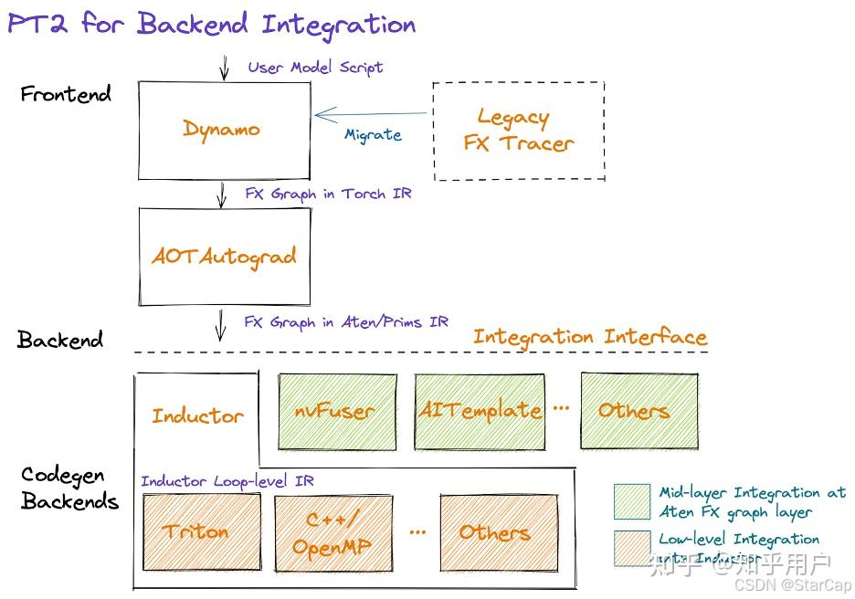

# [torch.compile 시리즈] Torch.compile() 흐름 해석 — 1. torch.compile 소개

> 원문: https://zhuanlan.zhihu.com/p/9418379234

## 요약

본 시리즈는 훈련 컴파일 관련 지식을 공유하며, 제1장에서는 torch.compile의 작업 흐름과 각 컴포넌트의 역할 및 소스 코드 호출 관계를 해석하고, 코드 예시를 통해 해설합니다. 크게 두 부분으로 나뉩니다: 프런트엔드 정적 그래프 캡처와 백엔드 컴파일.

- 프런트엔드는 TorchDynamo에 해당하며, Python 컴파일 실행의 기본 흐름, PEP 523, TorchDynamo의 바이트코드 시뮬레이션 실행, FX Graph 구축 과정을 주로 소개합니다.
- 백엔드 컴파일은 inductor 함수 구현을 분석하며, AOTAutograd, PrimTorch, TorchInductor 등을 포함합니다. AOTAutograd는 `__torch_dispatch__`가 FX Graph에서 전방/역방향 joint graph를 단계적으로 구축하는 방법을 다루고, PrimTorch는 연산자 decompose를 다루며, TorchInductor는 주로 그래프 최적화와 Triton 커널 코드 생성을 다룹니다.

본 글은 torch2.4.1+cu118의 소스 코드를 기반으로 해석합니다.

## 배경

모델 훈련/추론 성능을 개선하기 위해 PyTorch는 torch.compile을 출시하고, torch 1.xx에서 torch 2.xx로 전환하면서 PyTorch의 컴파일러 수준 동작 방식을 변경하고 강화했습니다. 동시에 PyTorch의 일부 코드를 C++에서 Python으로 다시 마이그레이션하기 시작했으며, 주요 특징은 다음과 같습니다:

- 동적 PyTorch 모델을 정적이고 최적화된 실행 그래프로 변환하여 런타임 오버헤드를 줄이고 계산 효율을 높입니다.
- 사용자가 모델 코드를 수동으로 수정하거나 특정 최적화 전략을 선택할 필요 없이, torch.compile이 자동으로 최적의 최적화 경로를 식별하고 적용하여 모델 가속을 더 편리하게 만듭니다.
- 광범위한 PyTorch API와 연산을 지원하여, 대부분의 기존 모델이 torch.compile 사용 후 큰 수정 없이 성능 향상의 혜택을 받을 수 있습니다.

### torch.compile의 4가지 기본 컴포넌트

- **TorchDynamo**: Python 바이트코드에서 계산 그래프를 해석하고 구축합니다. 동적인 Python 수준 컴파일러로, PyTorch 모델의 동적 실행 경로를 캡처하여 최적화된 코드로 변환하며, bytecode-to-bytecode 컴파일을 구현합니다.
- **AOTAutograd**: PyTorch가 도입한 자동 미분 메커니즘으로, 모델 실행 전에 미리 그래디언트 계산 코드를 생성합니다. 이 방법은 모델의 순방향 계산 그래프를 정적 분석하여 역전파에 필요한 그래디언트 계산 로직을 사전 생성함으로써 런타임 오버헤드를 줄이고 훈련 효율을 높입니다.
- **PrimTorch**: 2000+ PyTorch op를 약 250개의 원시 op 폐쇄 집합으로 정규화합니다. PyTorch의 중간 표현(IR) 레이어로, 고수준 PyTorch 연산을 더 저수준의, 추가 최적화와 컴파일에 적합한 기본 연산으로 변환합니다. 연산의 단순화와 표준화를 통해 컴파일러와 백엔드 옵티마이저의 계산 그래프 처리 효율을 높입니다.
- **TorchInductor**: 딥러닝 컴파일러로, 다양한 가속기와 백엔드용 코드를 생성합니다. OpenAI Triton(Nvidia/AMD GPU)과 OpenMP/C++(CPU) 코드를 생성하며, 메모리 최적화, 병렬화, 저수준 코드 생성 등 다양한 최적화 기법을 활용하여 계산 성능을 최대화합니다.

이상 4개 컴포넌트는 모두 Python으로 작성되었으며, 동적 shape(즉, 재컴파일 없이 다른 크기의 텐서를 전송 가능)을 지원하여 유연한 구현과 개발자 및 벤더의 개발 문턱을 낮추는 효과를 실현합니다.



### torch.compile 사용법

- torch.compile 사용 예시:
```python
import torch
import torchvision.models as models

model = models.resnet18().cuda()
optimizer = torch.optim.SGD(model.parameters(), lr=0.01)
compiled_model = torch.compile(model, backend="inductor")    # backend 파라미터로 백엔드 지정, 기본값은 inductor
# compiled_model = torch._dynamo.optimize("inductor")(fn)    # torch._dynamo.optimize 함수로도 컴파일 가능

x = torch.randn(16, 3, 224, 224).cuda()
optimizer.zero_grad()
out = compiled_model(x)
out.sum().backward()
optimizer.step()
```

- 지원 백엔드
```python
>>> import torch
>>> import torch._dynamo as dynamo
>>> dynamo.list_backends()
['cudagraphs', 'inductor', 'onnxrt', 'openxla', 'tvm']
```

- 커스텀 backend:
```python
import torch
from typing import List
import torch._dynamo as dynamo

def my_compiler(gm: torch.fx.GraphModule, example_inputs_: List[torch.Tensor]):
    print("===============my compiler=================")
    gm.graph.print_tabular()    # FX Graph를 포맷팅하여 출력
    print("code is:", gm.code)   # 해당 Python 코드
    return gm

# <1> 컴파일 함수에 직접 데코레이터 적용
@torch._dynamo.optimize(my_compiler)
def my_func(x, y):
    if x.sum() > y.sum():
        loss = torch.cos(torch.cos(x))
    else:
        loss = torch.cos(torch.cos(y))
    return loss


# <2> torch._dynamo.optimize 함수 호출
def my_func(x, y):
    if x.sum() > y.sum():
        loss = torch.cos(torch.cos(x))
    else:
        loss = torch.cos(torch.cos(y))
    return loss

def test():
    func = dynamo.optimize(my_compiler)(my_func)
    x, y = torch.randn(10, requires_grad=True), torch.randn(10, requires_grad=True)
    func(x, y)

test()
```

### 코드 초기 해석

- torch.compile 함수 해석: torch.compile은 torch._dynamo.optimize 함수의 간단한 래핑일 뿐입니다.
```python
def compile(model: Optional[Callable] = None, *,        # 최적화할 Module/function
            fullgraph: builtins.bool = False,            # False(기본값)이면 컴파일 가능한 영역을 찾아 최적화. True이면 전체 함수가 단일 그래프로 캡처 가능해야 함
            dynamic: Optional[builtins.bool] = None,     # 동적 shape
            backend: Union[str, Callable] = "inductor",  # 사용할 백엔드
            mode: Union[str, None] = None,               # "default", "reduce-overhead", "max-autotune" 또는 "max-autotune-no-cudagraphs"
            options: Optional[Dict[str, Union[str, builtins.int, builtins.bool]]] = None,  # 백엔드에 전달할 옵션 딕셔너리
            disable: builtins.bool = False)              # torch.compile()을 테스트용 no-op으로 전환
            -> Callable:
    # 중간 코드 생략...
    return torch._dynamo.optimize(backend=backend, nopython=fullgraph, dynamic=dynamic, disable=disable)(model)
```

- torch._dynamo.optimize 함수 해석: torch._dynamo.optimize의 함수 호출 스택을 더 분석하면, torch._dynamo.optimize가 `_optimize_catch_errors` 함수를 통해 OptimizeContext 객체를 반환할 뿐임을 알 수 있습니다. 따라서 torch.compile로 데코레이트된 함수/모델은 OptimizeContext가 되며, `convert_frame.catch_errors_wrapper`가 OptimizeContext의 콜백 함수(callback)가 됩니다. 이 콜백 함수에 inductor나 커스텀 컴파일 함수 등의 컴파일 함수 진입점이 포함됩니다. 이로써 torch.compile은 실제 컴파일을 수행하지 않고 간단한 초기화 작업만 하며, 코드가 처음 실제 실행되기 전에야 컴파일이 수행됩니다.

```python
def _optimize(
    rebuild_ctx: Callable[[], Union[OptimizeContext, _NullDecorator]],
    backend="inductor",
    *,
    nopython=False,
    guard_export_fn=None,
    guard_fail_fn=None,
    disable=False,
    dynamic=None,
) -> Union[OptimizeContext, _NullDecorator]:
    # 중간 코드 생략...

    return _optimize_catch_errors(
        convert_frame.convert_frame(backend, hooks=hooks),
        hooks,
        backend_ctx_ctor,
        dynamic=dynamic,
        compiler_config=backend.get_compiler_config()
        if hasattr(backend, "get_compiler_config")
        else None,
        rebuild_ctx=rebuild_ctx,
    )

# -----------------------------------------------------------------------
def _optimize_catch_errors(
    compile_fn,
    hooks: Hooks,
    backend_ctx_ctor=null_context,
    export=False,
    dynamic=None,
    compiler_config=None,
    rebuild_ctx=None,
):
    return OptimizeContext(
        convert_frame.catch_errors_wrapper(compile_fn, hooks),
        backend_ctx_ctor=backend_ctx_ctor,
        first_ctx=True,
        export=export,
        dynamic=dynamic,
        compiler_config=compiler_config,
        rebuild_ctx=rebuild_ctx,
    )
```

- torch.compile 최적화 흐름: TorchDynamo와 AOTAutograd를 기반으로 PyTorch의 순방향 및 역방향 계산 그래프를 구축하고, PrimTorch로 op를 분해하여 더 저수준의 기본 op로 변환한 후, 최종적으로 Inductor가 연산자 융합 등 그래프 최적화를 수행하고 특정 하드웨어에 맞는 Triton(GPU) 또는 OpenMP/C++(CPU) 최적화 코드를 생성합니다.

다음 절에서는 컴파일 프런트엔드 TorchDynamo를 소개하고, PyTorch 코드를 해석하는 작업 흐름과 계산 그래프 구축 방법을 분석합니다.

> 더 자세한 사용 설명은 공식 문서를 참고하세요: https://pytorch.org/get-started/pytorch-2.0/
