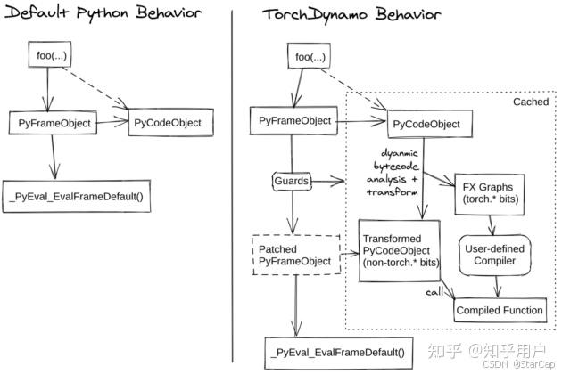
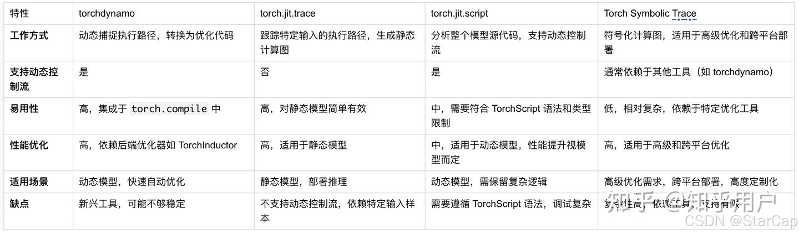
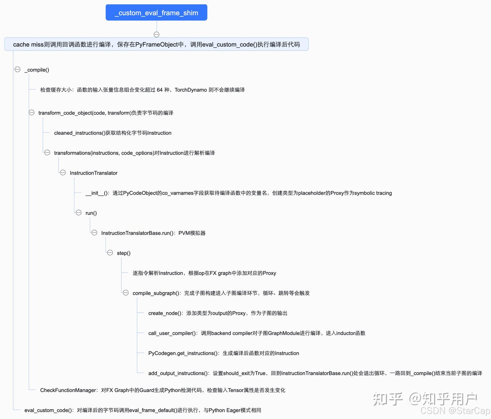

# [torch.compile 시리즈] Torch.compile() 흐름 해석 — 2. TorchDynamo

> 원문: https://zhuanlan.zhihu.com/p/9640728231

## 기본 소개

이전 글 【컴파일 시리즈】Torch.compile() 흐름 해석 — 1. torch.compile 소개에서 torch.compile이 등장한 배경을 설명하고 사용법과 기본 구성 요소를 살펴보았습니다. 본 장에서는 네 가지 기본 컴포넌트 중 TorchDynamo를 해설합니다.

TorchDynamo의 기본 작업 흐름은 PEP 523(Python Enhancement Proposal)을 기반으로 함수 실행 전에 Python 바이트코드를 가져와서, 각 Python 바이트코드를 파싱하고 시뮬레이션 실행하여 단계적으로 FX Graph를 생성하는 것입니다. if/else, loop 또는 지원하지 않는 연산을 만나면 graph break가 발생하여 sub-graph를 생성합니다. 예를 들어 아래의 `my_func()` 함수는 세 개의 subgraph를 생성합니다. opcode에는 여섯 가지 종류가 있습니다: `placeholder`는 입력에 대응, `call_method`/`call_function`/`call_module`은 함수/메서드/모델 호출에 대응, `output`은 출력에 대응합니다. `target`은 함수 호출, `name`은 op 결과 이름, `args`와 `kwargs`는 파라미터입니다.

```
# 원본 함수
def my_func(x, y):
    if x.sum() > y.sum():
        loss = torch.cos(torch.cos(x))
    else:
        loss = torch.cos(torch.cos(y))
    return loss

# 판단문 및 이전 코드에 대응하는 subgraph
===============my compiler=================
opcode         name    target                  args            kwargs
-------------  ------  ----------------------  --------------  --------
placeholder    l_x_    L_x_                    ()              {}
placeholder    l_y_    L_y_                    ()              {}
call_method    sum_1   sum                     (l_x_,)         {}
call_method    sum_2   sum                     (l_y_,)         {}
call_function  gt      <built-in function gt>  (sum_1, sum_2)  {}
output         output  output                  ((gt,),)        {}
# 대응하는 Python 코드
code is: 
def forward(self, L_x_ : torch.Tensor, L_y_ : torch.Tensor):
    l_x_ = L_x_
    l_y_ = L_y_
    sum_1 = l_x_.sum();  l_x_ = None
    sum_2 = l_y_.sum();  l_y_ = None
    gt = sum_1 > sum_2;  sum_1 = sum_2 = None
    return (gt,)

# if가 True일 때 대응하는 subgraph
===============my compiler=================
opcode         name    target                                                  args        kwargs
-------------  ------  ------------------------------------------------------  ----------  --------
placeholder    l_x_    L_x_                                                    ()          {}
call_function  cos     <built-in method cos of type object at 0x7f0f1017b500>  (l_x_,)     {}
call_function  loss    <built-in method cos of type object at 0x7f0f1017b500>  (cos,)      {}
output         output  output                                                  ((loss,),)  {}
# 대응하는 Python 코드
code is: 
def forward(self, L_x_ : torch.Tensor):
    l_x_ = L_x_
    cos = torch.cos(l_x_);  l_x_ = None
    loss = torch.cos(cos);  cos = None
    return (loss,)

# if가 False일 때 대응하는 subgraph
===============my compiler=================
opcode         name    target                                                  args        kwargs
-------------  ------  ------------------------------------------------------  ----------  --------
placeholder    l_y_    L_y_                                                    ()          {}
call_function  cos     <built-in method cos of type object at 0x7f1254470500>  (l_y_,)     {}
call_function  loss    <built-in method cos of type object at 0x7f1254470500>  (cos,)      {}
output         output  output                                                  ((loss,),)  {}
# 대응하는 Python 코드
code is:
def forward(self, L_y_ : torch.Tensor):
    l_y_ = L_y_
    cos = torch.cos(l_y_);  l_y_ = None
    loss = torch.cos(cos);  cos = None
    return (loss,)
```



**장점:**
- **동적 최적화**: 루프와 조건문을 포함하는 동적 제어 흐름이 있는 모델을 처리할 수 있어 동적 계산 그래프에 적합합니다.
- **자동화**: 사용자가 수동으로 변환 코드를 작성할 필요 없이 자동으로 실행 경로를 식별하고 최적화합니다.
- **유연성**: TorchInductor 등 다양한 백엔드 옵티마이저를 지원하여 다양한 성능 향상 방안을 제공합니다.

**단점:**
- **신생 도구**: 비교적 새로운 최적화 도구로서, 일부 극단적인 시나리오에서는 아직 안정적이지 않거나 모든 PyTorch 기능을 완전히 지원하지 못할 수 있으며, 직렬화/역직렬화 API가 아직 제공되지 않습니다.
- **백엔드 의존**: 최종 성능 향상은 사용하는 백엔드 옵티마이저에 의존하며, 특정 백엔드는 특정 하드웨어나 모델에서 성능이 좋지 않을 수 있습니다. 다른 정적 그래프 구축 방식과 비교하면 TorchDynamo는 더 유연하고 복잡한 연산을 더 많이 지원하며, 사용자가 대량의 코드 수정을 할 필요가 없습니다.



## CPython 코드의 실행 과정 & PEP 523

TorchDynamo의 작업 과정에 본격적으로 들어가기 전에 먼저 CPython의 작업 흐름을 이해해야 합니다. 먼저 CPython에서 두 가지 중요한 객체인 PyCodeObject와 PyFrameObject를 소개합니다.

PyCodeObject는 바이너리 바이트코드, 상수 테이블, 변수명 테이블 등의 정적 정보를 저장합니다. PyFrameObject는 실행 환경을 나타내는 객체로, 함수가 호출될 때마다 Python은 새로운 PyFrameObject를 생성하며, 여기에는 해당 함수의 PyCodeObject와 함께 지역 변수를 저장하는 메모리 공간과 evaluation stack(함수 호출 스택) 등 실행에 필요한 정보가 포함됩니다.

CPython은 Python 함수를 실행하기 전에 Python 코드를 바이트코드로 컴파일하고, Python 가상 머신(PVM)의 `_PyEval_EvalFrameDefault()` 함수가 컴파일된 바이트코드를 하나씩 실행합니다. PEP 523은 PVM이 바이트코드를 실행하기 전에 실행 대기 중인 바이트코드를 가져올 수 있는 API 인터페이스를 제공하여, 바이트코드를 최적화 수정하여 즉시 컴파일(JIT Compiler) 효과를 구현할 수 있게 합니다.

TorchDynamo는 바로 PEP 523을 기반으로 TorchDynamo의 컴파일 로직을 Python 코드의 인터프리터 실행 과정에 도입합니다. CPython이 제공하는 `_PyInterpreterState_SetEvalFrameFunc()` 함수를 통해 CPython에서 바이트코드를 실행하는 기본 함수를 `custom_eval_frame_shim()`으로 교체합니다.

사용자가 컴파일하려는 함수를 실행할 때 `_custom_eval_frame_shim()`에 진입하며, `_custom_eval_frame` 함수에서는 먼저 lookup 함수를 통해 캐시에 이미 컴파일된 코드가 있는지 확인합니다. 존재하면 `eval_custom_code` 함수를 직접 호출하여 실행함으로써 동일 함수의 중복 컴파일을 방지합니다. 캐시 미스가 발생하면 `call_callback`을 통해 콜백 함수를 호출하여 컴파일하고, `set_extra()`를 통해 컴파일 결과를 PyFrameObject에 저장한 후, 마지막으로 `eval_custom_code`를 호출하여 계속 실행합니다. 여기서 콜백 함수는 앞서 `torch._dynamo.optimize`에서 전달한 `convert_frame.convert_frame(backend, hooks=hooks)`(컴파일 진입점 `compile_fn` 포함)입니다.

따라서 torch.compile은 코드를 처음 정식 실행하기 직전에만 컴파일을 수행하며, 이로 인해 컴파일된 코드의 시간을 테스트할 때는 데이터 워밍업을 고려해야 합니다.

여기까지 torch.compile이 Python 코드 실행 과정에서 TorchDynamo를 어떻게 도입하는지 설명했으며, 다음으로 `torch._dynamo.optimize`가 바이트코드에서 FX Graph를 단계적으로 구축하는 방법을 해석합니다.

```c
static PyObject* _custom_eval_frame_shim(
    PyThreadState* tstate,
    THP_EVAL_API_FRAME_OBJECT* frame,
    int throw_flag) {
  // Shims logic into one of three states. Can probably be refactored into a
  // single func, later:
  //  - None: disables TorchDynamo
  //  - False: run-only mode (reuse existing compiles)
  //  - Python callable(): enables TorchDynamo
  PyObject* callback = eval_frame_callback_get();

  if (callback == Py_None) {
    return eval_frame_default(tstate, frame, throw_flag);
  }
  return _custom_eval_frame(tstate, frame, throw_flag, callback);    // 컴파일 함수 호출
}

// ------------------------------------------------------------------------------------------------------------------------------------
static PyObject* _custom_eval_frame(
    PyThreadState* tstate,
    THP_EVAL_API_FRAME_OBJECT* frame,
    int throw_flag,
    PyObject* callback) {
    // 중간 코드 생략, 핵심 함수 호출만 표시...

  PyObject* maybe_cached_code = lookup(extra, frame, NULL);
  if (maybe_cached_code == NULL) {
    // Python error
    return NULL;
  } else if (maybe_cached_code != Py_None) {
    PyCodeObject* cached_code = (PyCodeObject*)maybe_cached_code;
    // used cached version
    DEBUG_TRACE("cache hit %s", name(frame));
    // Re-enable custom behavior
    eval_frame_callback_set(callback);
    return eval_custom_code(tstate, frame, cached_code, throw_flag);    // 캐시 히트, eval_custom_code 함수로 frame의 코드를 직접 실행
  }
  // cache miss
  PyObject* result =
      call_callback(callback, frame, cache_size(extra));    // 미스 시 콜백 함수를 호출하여 컴파일
  if (result == NULL) {
    return NULL;
  } else if (result != Py_None) {
    DEBUG_TRACE("create cache %s", name(frame));
    extra = create_cache_entry(extra, result);
    Py_DECREF(result);
    set_extra(frame->f_code, extra);    // 컴파일 완료된 코드를 frame에 추가
    // Re-enable custom behavior
    eval_frame_callback_set(callback);
    return eval_custom_code(tstate, frame, extra->code, throw_flag);
  } 
}
```

> **후속 TorchDynamo의 코드 로직은 다음과 같습니다. 관심 있는 분은 뒤의 코드 해석 부분도 참고해 주세요.**



## TorchDynamo 시뮬레이션 실행 & FX Graph 구축

`torch._dynamo.optimize`에서 설정한 콜백 함수 `convert_frame.convert_frame(backend, hooks=hooks)`로 돌아가면, 핵심 함수는 `_compile()`이며 바이트코드 컴파일을 담당합니다. `_compile()`에서는 캐시 크기를 판단하여, 캐시 크기가 설정값을 초과하면 경고 메시지를 출력합니다. 기본값은 64이며, 이는 동일한 Python 함수에 대해 함수의 입력 텐서 정보 조합 변화가 64종을 초과하면 TorchDynamo가 해당 함수의 컴파일을 더 이상 진행하지 않음을 의미합니다.

`_compile`에서는 `transform_code_object(code, transform)`을 통해 사용자 코드를 최적화 변환합니다. 여기서 `code`는 PyCodeObject 타입으로 컴파일 최적화할 바이트코드이고, `transformer`는 변환 함수입니다. `transform_code_object` 함수에서 `cleaned_instructions()`는 바이트코드 명령어를 전처리하며, Python 표준 라이브러리 `dis.get_instructions(code)`로 바이트코드 명령어를 가져오고, 바이트코드를 정리(예: 점프 명령어 표준화 처리)하여 구조화된 데이터 표현 `Instruction`으로 변환합니다.

```python
# ps: 핵심 함수 호출만 표시
# path: torch/_dynamo/convert_frame.py
@compile_time_strobelight_meta(phase_name="_compile")
@_use_lazy_graph_module(config.use_lazy_graph_module)
def _compile(
    code: types.CodeType,
    globals: Dict[str, object],
    locals: Dict[str, object],
    builtins: Dict[str, object],
    compiler_fn: CompilerFn,
    one_graph: bool,
    export: bool,
    export_constraints,
    hooks: Hooks,
    cache_entry,
    cache_size: CacheSizeRelevantForFrame,
    frame: Optional[types.FrameType] = None,
    frame_state=None,
    compile_id=None,
    *,
    skip: int = 0,
) -> Optional[GuardedCode]:
    exceeded, limit_type = exceeds_cache_size_limit(cache_size)    # 캐시 크기가 임계값(기본 64)을 초과하는지 판단
    try:
        guarded_code = compile_inner(code, one_graph, hooks, transform)
        return guarded_code
    except ...
    finally:
            tracer.output.call_cleanup_hooks()

        output = tracer.output
        assert output is not None
        assert output.output_instructions
        instructions[:] = output.output_instructions
        code_options.update(output.code_options)

        if config.dead_code_elimination:
            propagate_inst_exn_table_entries(instructions)
            check_inst_exn_tab_entries_valid(instructions)
            instructions[:] = remove_pointless_jumps(remove_dead_code(instructions)) # FX Graph 분석으로 미호출 코드를 찾아 제거
 #---------------------------------------------------------------------------------------------------------------------------------
    def compile_inner(
        code: types.CodeType,
        one_graph: bool,
        hooks: Hooks,
        transform: Callable[[List[Instruction], Dict[str, Any]], Any],
    ) -> Optional[GuardedCode]:
        for attempt in itertools.count():
            CompileContext.get().attempt = attempt
            try:
                out_code = transform_code_object(code, transform)    # 사용자가 최적화하려는 함수를 컴파일
                break
            except ...

#-------------------------------------------------------------------------------------------------------------------------------
def transform_code_object(code, transformations, safe=False) -> types.CodeType:
    keys = get_code_keys()
    code_options = {k: getattr(code, k) for k in keys}
    assert len(code_options["co_varnames"]) == code_options["co_nlocals"]

    instructions = cleaned_instructions(code, safe)
    propagate_line_nums(instructions)

    transformations(instructions, code_options)
    return clean_and_assemble_instructions(instructions, keys, code_options)[1]

def cleaned_instructions(code, safe=False) -> List[Instruction]:
    instructions = list(map(convert_instruction, dis.get_instructions(code)))
    check_offsets(instructions)
    if sys.version_info >= (3, 11):
        populate_kw_names_argval(instructions, code.co_consts)
        virtualize_exception_table(code.co_exceptiontable, instructions)
    virtualize_jumps(instructions)
    strip_extended_args(instructions)
    if not safe:
        if sys.version_info < (3, 11):
            remove_load_call_method(instructions)
        if sys.version_info < (3, 12):
            explicit_super(code, instructions)
    if sys.version_info >= (3, 11):
        remove_jump_if_none(instructions)
        if sys.version_info >= (3, 12):
            remove_binary_store_slice(instructions)
        update_offsets(instructions)
        devirtualize_jumps(instructions)
    return instructions
```

예를 들어 앞의 샘플 함수 `my_func`에 대해 `cleaned_instructions()`를 수행한 결과는 다음과 같습니다.

```
Instruction(opcode=113, opname='JUMP_ABSOLUTE', arg=18, argval=18, offset=0, starts_line=13, is_jump_target=False, positions=None, target=Instruction(opcode=116, opname='LOAD_GLOBAL', arg=1, argval='torch', offset=18, starts_line=14, is_jump_target=True, positions=None, target=None, exn_tab_entry=None), exn_tab_entry=None)
Instruction(opcode=124, opname='LOAD_FAST', arg=0, argval='x', offset=2, starts_line=None, is_jump_target=False, positions=None, target=None, exn_tab_entry=None)
Instruction(opcode=106, opname='LOAD_ATTR', arg=0, argval='sum', offset=4, starts_line=None, is_jump_target=False, positions=None, target=None, exn_tab_entry=None)
Instruction(opcode=131, opname='CALL_FUNCTION', arg=0, argval=0, offset=6, starts_line=None, is_jump_target=False, positions=None, target=None, exn_tab_entry=None)
Instruction(opcode=124, opname='LOAD_FAST', arg=1, argval='y', offset=8, starts_line=None, is_jump_target=False, positions=None, target=None, exn_tab_entry=None)
Instruction(opcode=106, opname='LOAD_ATTR', arg=0, argval='sum', offset=10, starts_line=None, is_jump_target=False, positions=None, target=None, exn_tab_entry=None)
Instruction(opcode=131, opname='CALL_FUNCTION', arg=0, argval=0, offset=12, starts_line=None, is_jump_target=False, positions=None, target=None, exn_tab_entry=None)
Instruction(opcode=107, opname='COMPARE_OP', arg=4, argval='>', offset=14, starts_line=None, is_jump_target=False, positions=None, target=None, exn_tab_entry=None)
Instruction(opcode=114, opname='POP_JUMP_IF_FALSE', arg=36, argval=36, offset=16, starts_line=None, is_jump_target=False, positions=None, target=Instruction(opcode=116, opname='LOAD_GLOBAL', arg=1, argval='torch', offset=36, starts_line=16, is_jump_target=True, positions=None, target=None, exn_tab_entry=None), exn_tab_entry=None)
Instruction(opcode=116, opname='LOAD_GLOBAL', arg=1, argval='torch', offset=18, starts_line=14, is_jump_target=True, positions=None, target=None, exn_tab_entry=None)
Instruction(opcode=106, opname='LOAD_ATTR', arg=2, argval='cos', offset=20, starts_line=None, is_jump_target=False, positions=None, target=None, exn_tab_entry=None)
Instruction(opcode=116, opname='LOAD_GLOBAL', arg=1, argval='torch', offset=22, starts_line=None, is_jump_target=False, positions=None, target=None, exn_tab_entry=None)
Instruction(opcode=106, opname='LOAD_ATTR', arg=2, argval='cos', offset=24, starts_line=None, is_jump_target=False, positions=None, target=None, exn_tab_entry=None)
Instruction(opcode=124, opname='LOAD_FAST', arg=0, argval='x', offset=26, starts_line=None, is_jump_target=False, positions=None, target=None, exn_tab_entry=None)
Instruction(opcode=131, opname='CALL_FUNCTION', arg=1, argval=1, offset=28, starts_line=None, is_jump_target=False, positions=None, target=None, exn_tab_entry=None)
Instruction(opcode=131, opname='CALL_FUNCTION', arg=1, argval=1, offset=30, starts_line=None, is_jump_target=False, positions=None, target=None, exn_tab_entry=None)
Instruction(opcode=125, opname='STORE_FAST', arg=2, argval='loss', offset=32, starts_line=None, is_jump_target=False, positions=None, target=None, exn_tab_entry=None)
Instruction(opcode=110, opname='JUMP_FORWARD', arg=16, argval=52, offset=34, starts_line=None, is_jump_target=False, positions=None, target=Instruction(opcode=124, opname='LOAD_FAST', arg=2, argval='loss', offset=52, starts_line=17, is_jump_target=True, positions=None, target=None, exn_tab_entry=None), exn_tab_entry=None)
Instruction(opcode=116, opname='LOAD_GLOBAL', arg=1, argval='torch', offset=36, starts_line=16, is_jump_target=True, positions=None, target=None, exn_tab_entry=None)
Instruction(opcode=106, opname='LOAD_ATTR', arg=2, argval='cos', offset=38, starts_line=None, is_jump_target=False, positions=None, target=None, exn_tab_entry=None)
Instruction(opcode=116, opname='LOAD_GLOBAL', arg=1, argval='torch', offset=40, starts_line=None, is_jump_target=False, positions=None, target=None, exn_tab_entry=None)
Instruction(opcode=106, opname='LOAD_ATTR', arg=2, argval='cos', offset=42, starts_line=None, is_jump_target=False, positions=None, target=None, exn_tab_entry=None)
Instruction(opcode=124, opname='LOAD_FAST', arg=1, argval='y', offset=44, starts_line=None, is_jump_target=False, positions=None, target=None, exn_tab_entry=None)
Instruction(opcode=131, opname='CALL_FUNCTION', arg=1, argval=1, offset=46, starts_line=None, is_jump_target=False, positions=None, target=None, exn_tab_entry=None)
Instruction(opcode=131, opname='CALL_FUNCTION', arg=1, argval=1, offset=48, starts_line=None, is_jump_target=False, positions=None, target=None, exn_tab_entry=None)
Instruction(opcode=125, opname='STORE_FAST', arg=2, argval='loss', offset=50, starts_line=None, is_jump_target=False, positions=None, target=None, exn_tab_entry=None)
Instruction(opcode=124, opname='LOAD_FAST', arg=2, argval='loss', offset=52, starts_line=17, is_jump_target=True, positions=None, target=None, exn_tab_entry=None)
Instruction(opcode=83, opname='RETURN_VALUE', arg=None, argval=None, offset=54, starts_line=None, is_jump_target=False, positions=None, target=None, exn_tab_entry=None)
```

정리된 바이트코드는 `transformations(instructions, code_options)` 함수를 통해 처리되며, 핵심 `transform()` 함수 구현은 다음과 같습니다. 먼저 InstructionTranslator 객체를 인스턴스화하며, InstructionTranslator에는 OutputGraph 인스턴스가 있어 InstructionTranslator가 컴파일한 출력을 `torch.fx.Graph`로 저장합니다.

`transform()`(즉, TorchDynamo)이 FX Graph를 구축하는 핵심 모듈은 두 가지입니다:
- InstructionTranslator의 초기화 과정: 변수에 대응하는 Proxy를 구축하며, FX Graph의 placeholder 부분에 해당합니다.
- `InstructionTranslator.run()`: 바이트코드를 시뮬레이션 실행하고 대응하는 Node를 FX Graph에 추가합니다.

```python
def transform(instructions, code_options):
    nonlocal output
    nonlocal tracer
    speculation_log.restart()
    tracer = InstructionTranslator(
        instructions,
        code,
        locals,
        globals,
        builtins,
        code_options,
        compiler_fn,
        one_graph,
        export,
        export_constraints,
        mutated_closure_cell_contents,
        frame_state=frame_state,
        speculation_log=speculation_log,
    )
    try:
        with tracing(tracer.output.tracing_context), tracer.set_current_tx():
            tracer.run()
    except ...
```

InstructionTranslator의 초기화 과정에서는 PyCodeObject 객체의 `co_varnames` 필드를 통해 컴파일 대상 함수의 변수명을 가져오고, 각 변수에 대해 LazyVariableTracker를 생성하여 `symbolic_locals`로 설정합니다. LazyVariableTracker는 주어진 기본 값의 VariableTracker 생성을 해당 값에 접근할 때까지 지연시켜 공간 자원을 절약하는 방식이며, VariableTracker는 각 Python 변수에 대응하는 타입 정보를 기록하여 정적 그래프 구축에 사용됩니다.

```python
vars = list(code_options["co_varnames"])
cells_and_freevars = [x for x in self.cell_and_freevars() if x not in vars]
vars.extend(cells_and_freevars)
cells_and_freevars_set = set(cells_and_freevars)

self.symbolic_locals = {
    k: variables.LazyVariableTracker.create(
        f_locals[k],
        source=LocalSource(k, cell_or_freevar=k in cells_and_freevars_set),
    )
    for k in vars
    if k in f_locals
}
```

LazyVariableTracker는 VariableBuilder를 통해 실제 객체를 생성합니다. `torch.Tensor`를 예로 들면, VariableBuilder의 생성 로직은 다음과 같습니다:
- 먼저 `create_graph_input()`을 통해 FX Graph에 placeholder 타입의 FX Proxy를 생성합니다(FX Proxy는 FX symbolic tracing의 symbol이며, placeholder는 변수에 대응, 즉 앞서 말한 opcode입니다).
- `install_guards()` 함수가 `GuardBuilder.TYPE_MATCH` 타입의 Guard 객체를 생성합니다. Guard는 TorchDynamo에서 컴파일된 함수가 참조하는 외부 데이터 정보의 변경 여부를 검사하는 역할을 합니다. 변경되지 않았으면 이전에 컴파일된 함수를 재사용할 수 있고, 변경되었으면 해당 함수를 재컴파일해야 합니다. `TYPE_MATCH`는 주로 두 데이터의 타입이 일치하는지 판단하고, `TENSOR_MATCH`는 주로 입력 Tensor의 shape, stride 등의 정보가 변경되었는지 검사합니다.
- `wrap_fx_proxy()`가 방금 생성한 Proxy에 대해 실제 VariableTracker를 생성합니다. 핵심 로직은 `wrap_fx_proxy_cls()` 함수에 구현되어 있습니다:
  - `wrap_fx_proxy_cls()` 함수에서 먼저 `wrap_to_fake_tensor_and_record()` 함수를 통해 런타임에 얻은 `torch.Tensor`에 대해 FakeTensor를 생성합니다(기본적으로 TorchDynamo는 실제 `torch.Tensor` 대신 FakeTensor를 사용하여 계산 그래프를 캡처합니다. FakeTensor는 실제 `torch.Tensor`와 동일한 텐서 정보를 가지지만 실제 데이터와 텐서 메모리 할당은 없습니다).
  - `specialize()` 함수를 통해 텐서 정보(dtype, device 등)를 특수화합니다. static shape 모드에서는 size, stride, is_contiguous 정보도 특수화하지만, dynamic shape 모드에서는 이 부분을 특수화하지 않습니다.
  - 마지막으로 `target_cls`를 통해 대응하는 VariableTracker 객체를 생성합니다. 예를 들어 여기서는 `torch.Tensor`이므로 TensorVariable(VariableTracker의 하위 클래스)을 생성하며, PyTorch의 `torch.Tensor` 타입 데이터 관련 정보를 기록합니다.

따라서 InstructionTranslator 객체 초기화에서 VariableTracker를 생성하는 과정에서 TorchDynamo는 FX Graph에 FX Proxy 생성, Guard 및 FakeTensor 관련 연산 추가, VariableTracker 초기화를 완료합니다. 모든 지역 변수가 현재 frame에서 사용되는 것은 아니므로 자원 오버헤드를 절약하기 위해 LazyVariableTracker를 채택하여 실제 사용 시에만 생성합니다. 여기까지 입력에 대응하는 VariableTracker 생성이 완료되며, 이후 Guard, FakeTensor 등의 정보를 계속 가지고 Tensor의 후속 연산을 추적합니다.

```python
tensor_proxy = self.tx.output.root_tracer.create_graph_input(
    re.sub(r"[^a-zA-Z0-9]+", "_", self.name), type(value), source=source
)
options = {}
if type(value) in config.traceable_tensor_subclasses:
    options["torch_function_fn"] = build_torch_function_fn(
        self.tx, value, self.source
    )
    self.install_guards(GuardBuilder.TYPE_MATCH)

tensor_variable = wrap_fx_proxy(
    tx=self.tx,
    proxy=tensor_proxy,
    example_value=value,
    subclass_type=subclass_type,
    source=source,
    **options,
)

guard_type = GuardBuilder.TENSOR_MATCH

if isinstance(source, GradSource) and is_from_optimizer_source(source):
    guard_type = GuardBuilder.NOT_NONE_MATCH

self.install_guards(
    functools.partial(
        guard_type,
        value=value
        if isinstance(source, NumpyTensorSource)
        else TensorWeakRef(value),
    )
)

#----------------------------------------------------------------------------------------------------------------------------------------------------------------------------------------
# 지면 절약을 위해 핵심 함수 호출만 표시
def wrap_fx_proxy_cls(
    target_cls, tx, proxy, example_value=None, subclass_type=None, **options
):
    example_value = wrap_to_fake_tensor_and_record(example_value, tx=tx, **kwargs)
    if isinstance(example_value, torch.Tensor):
        set_example_value(proxy.node, example_value)
        specialized_props = target_cls.specialize(example_value)
        options.update(specialized_props)
        return target_cls(proxy, **options)
```

InstructionTranslator 객체의 초기화가 완료되면 `InstructionTranslator.run()` 함수로 돌아갑니다. InstructionTranslator는 `InstructionTranslatorBase` 클래스를 상속하므로, 실제로 호출되는 것은 `InstructionTranslatorBase.run()` 함수입니다. InstructionTranslatorBase의 본질은 Python 가상 머신의 시뮬레이터로, 루프에서 바이트코드를 하나씩 파싱하고 시뮬레이션 실행합니다.

핵심 함수 `step()`을 분석하면, 먼저 `instruction_pointer`를 기반으로 실행할 바이트코드 명령어를 가져오고, `dispatch_table` 매핑 테이블을 통해 각 op에 대응하는 함수 호출을 가져와 현재 바이트코드 명령어를 파싱합니다. 루프, if/else 등 점프 관련 바이트코드 명령어를 만나면 `compile_subgraph()` 함수를 트리거하여 서브그래프 컴파일 관련 작업에 진입합니다.

```python
def run(self):
    with self.run_ctx_mgr():
        try:
            self.output.push_tx(self)
            while self.step():        # step() 함수를 루프 호출하여 Python 바이트코드를 시뮬레이션 실행
                pass
        except BackendCompilerFailed:
            raise

# ------------------------------------------------------------------------------------------------------------------------------------------------------------------------------------------------
def step(self):
    """Process exactly one instruction, return False we should exit"""
    ip = self.instruction_pointer    # Python 가상 머신의 PC(Program Counter), 현재 실행 중인 바이트코드 명령어 위치를 표시
    if ip is None:
        return False
    self.current_instruction = inst = self.instructions[ip]
    self.instruction_pointer = ip + 1

    if inst.starts_line:
        self.starts_line(inst.starts_line)

    # stack: Python 가상 머신의 데이터 스택, Python 가상 머신에서 바이트코드 간 데이터 스택을 통해 데이터를 교환
    if (
        not self.stack
        and self.should_compile_partial_graph()
        and self.is_non_empty_graph()
    ):
        self.current_speculation = self.speculate()   
        # 루프, if/else 등의 문에서 트리거되어 step_graph_break로 진입하여 서브그래프 컴파일 수행
        if self.current_speculation.failed:
            return self.step_graph_break(inst)

    self.update_block_stack(inst)

    try:
        self.dispatch_table[inst.opcode](self, inst)    # 명령어를 하나씩 실행
        return not self.output.should_exit    # 실행 종료 시 퇴출
    except exc.ObservedException:
        self.exception_handler()
        return True
    except ReturnValueOp:
        return False    # 반환 명령어
    except Unsupported:
        if self.current_speculation is None:
            log.debug("empty checkpoint")
            raise
        log.debug("step triggered compile", exc_info=True)
```

각 바이트코드의 시뮬레이션 실행과 파싱에 대해, 위의 CALL_FUNCTION 함수 호출을 예로 들면, 먼저 `argval`에 따라 대응하는 함수 파라미터를 팝(pop)하고, `TensorVariable.call_method()` 함수를 추가로 호출합니다. `call_method()` 함수에서 `proxy_args_kwargs()` 함수가 `symbolic_locals`에서 해당 함수 파라미터 Proxy를 가져오고, `create_proxy()`를 호출하여 새로운 Proxy를 생성합니다. 타입은 `call_method`이며, 대응하는 method명(예: `my_func`의 `x.sum()`, TorchDynamo의 target 항목에 해당)과 파라미터를 가집니다. 마지막으로 `wrap_fx_proxy()`(앞서 지역 변수 생성과 동일)를 통해 새로운 TensorVariable을 생성하여 결과를 저장하며, 중간에 수집된 Guard 정보도 함께 첨부됩니다. 마지막으로 `call_function()` 함수에서 결과를 스택에 푸시합니다. 이렇게 현재 바이트코드의 시뮬레이션 실행이 완료되고, 이 과정에서 대응하는 Proxy가 FX Graph에 추가됩니다.

```python
@break_graph_if_unsupported(push=1)
def CALL_FUNCTION(self, inst):
    args = self.popn(inst.argval)
    fn = self.pop()
    self.call_function(fn, args, {})

# ------------------------------------------------------------------------------------------------------------------------------------------------------------------------------------
# TensorVariable
def call_method(
    self,
    tx,
    name,
    args: "List[VariableTracker]",
    kwargs: "Dict[str, VariableTracker]",
) -> "VariableTracker":
     # 중간 코드 생략...
    return wrap_fx_proxy(
        tx,
        tx.output.create_proxy(
            "call_method",
            name,
            *proxy_args_kwargs([self, *args], kwargs),
        ),
    )
```

따라서, **TorchDynamo는 바이트코드 분석 과정에서 명령어를 실제로 실행하는 것이 아니라, 기호 분석(symbolic analysis) 방식으로 바이트코드에서 해당 기호와 함수를 추출하고, 대응하는 Proxy를 생성하여 FX Graph에 추가합니다. 명령어를 하나씩 시뮬레이션 실행(파싱)하면서 지속적으로 FX Graph를 구축하다가 `compile_subgraph()`가 트리거될 때까지 진행합니다.**

## 서브그래프 컴파일

앞의 분석에서 TorchDynamo는 명령어를 하나씩 실행하면서 계속 FX Graph를 구축하지만, 예를 들어 jump 바이트코드 명령어(if/else, 루프 등에 대응)를 만나면 `compile_subgraph()` 함수가 트리거됩니다. TorchDynamo에서는 서브그래프 단위로 컴파일을 수행하기 때문입니다(`full_graph=True`로 설정한 경우 제외). `compile_subgraph()`에서 FX Graph의 하나의 완전한 서브그래프 구축을 완료하고, backend compiler를 호출하여 해당 서브그래프를 컴파일합니다.

`compile_subgraph()`의 핵심 함수 `compile_and_call_fx_graph()` 구현을 분석합니다:
- `create_node`를 호출하여 output 타입의 Proxy를 생성합니다(출력 반환값에 대응). 여기까지 하나의 완전한 FX Graph 구축이 완료됩니다.
- 완전한 FX Graph를 기반으로 대응하는 GraphModule을 생성하여 컴파일 함수의 입력 파라미터로 사용하고, `call_user_compiler()` 함수를 통해 backend compiler를 호출하여 GraphModule을 컴파일합니다(여기서부터 inductor 컴파일 함수에 진입).
- `PyCodegen.get_instructions()` 함수를 통해 컴파일된 함수에 대응하는 Instructions를 가져옵니다. 여기까지 전체 서브그래프의 컴파일 부분이 완료됩니다.

```python
# ps: 핵심 함수 호출만 표시, 중간 과정 생략
def compile_and_call_fx_graph(self, tx, rv, root):
    """
    Generate code from self.graph and return the Instruction()s to
    call that generated code.
    """
    self.create_node(
        "output", "output",
        (self.current_tracer.create_arg(tuple(x.as_proxy() for x in rv)),),
        {},
    )
    gm = _make_graph_module(root, self.graph)    # GraphModule 생성, 컴파일 함수의 전달 파라미터에 대응, 컴파일에 사용

    with self.restore_global_state():
        compiled_fn = self.call_user_compiler(gm)    # 사용자가 지정한 backend compiler를 호출하여 컴파일, 예: inductor 등

    compiled_fn = disable(compiled_fn)    # TorchDynamo가 이미 컴파일된 함수를 재컴파일하는 것을 방지

    cg = PyCodegen(tx)
    cg.make_call_generated_code(name)    # 바이트코드 생성
    return cg.get_instructions()    # 컴파일된 코드의 Instructions 반환
```

마지막으로 `add_output_instructions()` 함수를 호출하여 `should_exit` 속성을 True로 설정합니다. 이는 `InstructionTranslatorBase.run()` 루프로 돌아가면 종료됨을 의미합니다.

`_compile()`까지 되돌아가면, `transform_code_object()`에서 `clean_and_assemble_instructions()`를 호출하여 Instruction을 Python에서 실행 가능한 바이트코드로 어셈블합니다.

## Guard 생성

정적 그래프 생성, 특히 static shape에 대해 TorchDynamo에는 또 하나의 중요한 구성 요소인 Guard가 있습니다. 위에서 언급한 함수 호출 스택을 따라 `_compile()`까지 돌아가면, 이 시점에서 FX Graph 구축, backend compiler 호출을 통한 컴파일, 컴파일된 코드의 바이트코드 생성이 이미 완료되었습니다. TorchDynamo는 마지막으로 이전 FX Graph 구축 과정에서 수집한 Guard에 대한 검사 코드(Python 코드)를 생성하여, 이후 코드 실행 시 코드가 이미 컴파일되었는지 검사합니다.

TorchDynamo는 CheckFunctionManager의 `compile_check_fn()` 함수를 통해 Guard에 대한 실행 가능한 Python 코드를 생성합니다. 런타임에 입력 변경 여부를 검사하는 함수의 오버헤드를 줄이기 위해 TorchDynamo는 Guard 검사 기능을 C++로 구현하였습니다. (구체적인 구현은 `/usr/local/lib/python3.9/dist-packages/torch/_dynamo/guards.py`를 참조할 수 있습니다.)

`_compile()` 함수로 돌아가면, `check_fn`은 생성된 Guard 검사 함수이며, GuardedCode는 컴파일된 서브그래프 `out_code`와 `check_fn`을 저장합니다.

```python
check_fn = CheckFunctionManager(
    output,
    hooks.guard_fail_fn if hooks else None,
)

guarded_code = GuardedCode(out_code, check_fn.check_fn)
```

여기까지 하나의 완전한 서브그래프의 전체 구축 및 컴파일 작업이 완료됩니다. 최종적으로 처음의 `_custom_eval_frame()` 함수로 돌아가서, 컴파일 완료된 코드에 대해 `eval_custom_code()`를 호출하고, CPython 기본 실행 함수 진입점 `_PyEval_EvalFrameDefault`로 보내 실행을 완료합니다(PyTorch eager 모드 실행과 동일).

## 후속 함수의 실행 과정

`_custom_eval_frame()` 함수로 돌아가면, 이 시점에서 컴파일된 GuardedCode를 가지고 있습니다. `create_cache_entry()`와 `set_extra()`가 현재 사용자 함수의 `frame->f_code`에 CacheEntry를 기록하며, 여기에는 `check_fn`과 컴파일된 code가 포함됩니다. `eval_custom_code()`는 새로운 Python Frame을 생성하고 컴파일된 함수를 실행합니다.

`eval_custom_code()`에서는 `eval_frame_default()`를 직접 호출하여 위의 바이트코드를 실행하므로, 여기서는 TorchDynamo가 커스터마이징한 Frame Evaluation 함수 `custom_eval_frame_shim()`이 다시 트리거되지 않습니다. 컴파일된 서브그래프의 실행이 완료되면 프로그램은 Python 인터프리터로 돌아가고, 다음 바이트코드는 if/else에 대응하는 점프 명령어입니다. 이때 다시 TorchDynamo가 설정한 Frame Evaluation 함수 `custom_eval_frame_shim()`이 트리거되어 서브그래프의 캡처와 컴파일을 계속 진행합니다.

다음 장에서는 Inductor 부분의 AOTAutograd를 소개하며, 역방향 계산 그래프의 캡처를 다룹니다.
