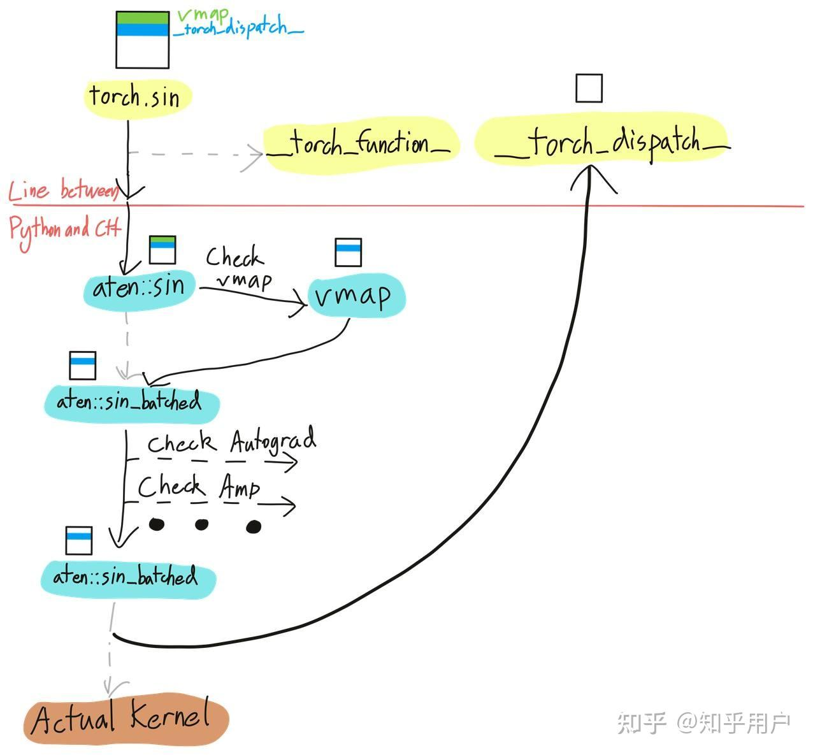
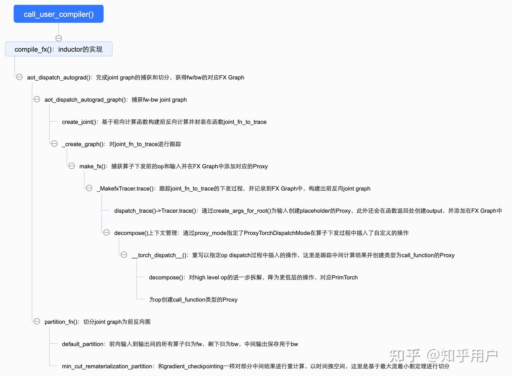

# [torch.compile 시리즈] Torch.compile() 흐름 해석 — 3. AOTAutograd

> 원문: https://zhuanlan.zhihu.com/p/9997263922

## AOTAutograd(Ahead-Of-Time Autograd)

> 본 글은 torch.compile() 흐름 해석 시리즈이므로, 많은 코드와 예제는 이전 글과 함께 봐야 이해하기 쉽습니다.

이전 장 TorchDynamo 소개에서 torch.compile()이 계산 그래프를 캡처하고 GraphModule로 저장하는 방법을 해석했습니다. 하지만 이 과정에서는 전체 Python 바이트코드를 시뮬레이션 실행, 파싱하고 FX Graph를 구축한 것에 불과하며, 전방향 계산 그래프를 초기 구축한 것일 뿐 훈련 시나리오에서의 역방향 계산 그래프는 캡처하지 않았습니다. PyTorch에서 역방향 계산 그래프의 캡처는 backend compiler 내부에서 구현됩니다. torch.compile의 기본 backend compiler인 inductor를 예로 들면, 그 구현 함수 `compile_fx`에는 AOTAutograd(fw-bw joint graph 캡처), PrimTorch(lowering op), TorchInductor(그래프 최적화, Triton)가 포함됩니다. 아래에서 backend compiler의 기본 함수인 inductor의 함수 구현을 해석하고, 나머지 세 컴포넌트의 원리를 정리합니다.

먼저 AOTAutograd를 소개합니다. AOTAutograd는 PyTorch가 도입한 자동 미분 메커니즘으로, 모델 실행 전에 미리 그래디언트 계산 코드를 생성하는 것을 목표로 합니다. 이 방법은 모델의 전방향 계산 그래프를 정적 분석하여 역전파에 필요한 그래디언트 계산 로직을 사전 생성함으로써 런타임 오버헤드를 줄이고 훈련 효율을 높입니다. AOTAutograd를 통해 개발자는 다음을 수행할 수 있습니다:
- 역전파 계산 그래프, 나아가 순방향과 역방향 연합 계산 그래프를 얻을 수 있습니다.
- 서로 다른 백엔드 컴파일러로 순방향과 역방향 계산 그래프를 각각 컴파일할 수 있습니다.
- 훈련(training)에 대해 순방향/역방향 연합 최적화를 수행할 수 있습니다. 예를 들어 역방향에서 재계산(recompute)을 도입하여 순방향이 역방향을 위해 보존하는 tensor를 줄여 메모리 사용량을 절감합니다.

전체적으로 AOTAutograd의 작업 흐름은 다음과 같습니다:
- `__torch_dispatch__` 메커니즘을 기반으로 순방향/역방향 전파를 trace하여 연합 계산 그래프(joint graph)를 생성합니다.
- decompositions를 통해 추가 분해하여 FX Graph를 더 낮은 수준의 중간 표현, 즉 PrimTorch로 변환합니다.
- `partition_fn`을 통해 joint graph를 순방향/역방향 계산 그래프로 분할합니다.
- `fw_compiler`와 `bw_compiler`를 호출하여 순방향, 역방향 계산 그래프를 각각 컴파일하고, `torch.autograd.Function`으로 통합합니다.

## torch dispatch

AOTAutograd는 `__torch_dispatch__` 메커니즘을 기반으로 연산자가 dispatch되어 실행되기 전에 실제로 실행되는 op을 가져오고, 대응하는 Proxy를 구축합니다. 즉, PyTorch의 역전파 계산 그래프는 순방향 과정을 실행하면서 동적으로 생성되며, 이는 완전한 순방향 과정을 실행해야만 대응하는 FX Graph를 구축할 수 있음을 의미합니다. 이를 통해 함수 정식 실행 전에 순방향/역방향 계산 그래프를 얻어 AOTAutograd를 구현합니다. 이 과정은 앞서 TorchDynamo가 캡처한 FX Graph라는 IR 표현에 의존합니다.

AOTAutograd를 본격적으로 해석하기 전에 먼저 `__torch_dispatch__` 메커니즘을 이해해야 합니다. **PyTorch의 핵심은 dispatcher이며, 입력 tensor의 속성에 따라 연산자를 구체적인 kernel에 dispatch하는 기능을 합니다.** 예를 들어 tensor의 device 속성에 따라 CUDA kernel을 호출할지 CPU 구현을 호출할지 결정하며, 여러 속성을 종합하여 dispatch key를 산출하여 어떤 kernel을 호출할지 결정합니다. PyTorch에서 하나의 연산자는 여러 번 dispatch를 거치며, **`__torch_dispatch__`는 개발자에게 연산자가 최종 dispatch되기 전에 대응하는 연산자와 입력을 가져올 수 있는 인터페이스를 제공합니다.**



> 후속 AOTAutograd 구현의 코드 로직은 다음과 같습니다. 관심 있는 분은 뒤의 코드 해석 부분도 참고해 주세요.



## Joint Graph

TorchDynamo 편의 제3절에서 TorchDynamo가 FX Graph를 구축한 후 `call_user_compiler()`를 호출하여 backend compiler로 계산 그래프를 컴파일한다고 언급했습니다. torch.compile()의 기본 컴파일 함수 구현 inductor의 진입 함수는 `compile_fx()`입니다.

`compile_fx()`의 함수 호출 스택을 분석하면, 핵심 구현은 `aot_dispatch_autograd()` 함수이며 주요 흐름은 다음과 같습니다:
1. `aot_dispatch_autograd_graph()`를 호출하여 순방향/역방향 joint graph를 생성합니다.
2. `partition_fn`을 호출하여 분할하고, 최종적으로 순방향, 역방향 계산 그래프를 포함하는 `torch.autograd.Function`을 반환합니다.

먼저 `aot_dispatch_autograd_graph()` 함수가 joint graph를 생성하는 과정을 소개합니다:
1. `create_joint()` 함수를 통해 순방향/역방향 계산을 함수로 캡슐화합니다. `create_joint()`은 순방향 계산 결과를 분석하여 그래디언트 계산이 필요한 파라미터와 대응하는 tangents(그래디언트 가중치)를 파악한 후, `torch.autograd.grad`로 역방향 미분을 수행하고 순방향/역방향 과정을 함수로 캡슐화하여 `joint_fn_to_trace`로 반환합니다.
2. `_create_graph()`가 `joint_fn_to_trace` 함수를 추적합니다. 핵심은 `make_fx()` 함수를 호출하여 연산자 dispatch 전에 실제로 실행되는 op을 가져와 Proxy를 생성하고 FX Graph에 추가하는 것입니다.

`make_fx()` 함수에서는 `_MakefxTracer.trace()` 함수를 통해 전체 함수 계산 과정을 추적하고 GraphModule을 생성합니다. GraphModule에는 순방향/역방향 계산에 대응하는 계산 그래프가 포함됩니다. 여기서 순방향/역방향 계산은 TorchDynamo의 graph break에 대응하는 서브그래프이며, 즉 각 서브그래프가 한 번의 `make_fx`를 호출하여 joint graph를 생성합니다. 캡처 과정은 주로 두 가지 핵심 작업을 포함합니다:
1. **입출력 캡슐화**: `dispatch_trace()`→`Tracer.trace()`에서 함수 파라미터, 지역 변수 및 출력에 대응하는 Proxy를 생성합니다. `create_args_for_root()`→`create_proxy()`를 통해 모든 변수(함수 파라미터와 지역 변수)에 대해 placeholder 타입의 Proxy를 생성하고, `create_proxy()`에서 동시에 Node를 생성하여 FX Graph에 추가한 후 Proxy로 Node를 래핑합니다. `create_node()`를 통해 출력에 대해 output 타입의 Node를 생성하여 FX Graph에 추가합니다.
2. **op dispatch의 캡처와 캡슐화**: `with decompose()` 컨텍스트 관리에서 `self.proxy_mode`를 통해 ProxyTorchDispatchMode를 지정합니다(텐서 연산의 분배 과정을 가로채고 커스터마이징하는 데 사용됩니다. Dispatch Mode 메커니즘은 개발자가 텐서 연산(덧셈, 행렬 곱셈 등)이 실행될 때 커스텀 로직을 삽입할 수 있게 하여 디버깅, 성능 모니터링, 커스텀 백엔드 지원 등의 기능을 Python 핵심 코드 수정 없이 구현합니다). `__torch_dispatch__` 함수를 재정의하여 op dispatch 과정에 삽입할 작업을 지정하며, ProxyTorchDispatchMode에서는 op의 decompose(PrimTorch가 규정한 집합으로 분해)와 함께 op에 대해 `call_function()` 타입의 Proxy를 생성합니다.

```python
# aot_dispatch_autograd_graph() 함수 구현
# ps: 핵심 함수 호출만 표시
def aot_dispatch_autograd_graph(
    flat_fn,
    flat_args: List[Any],
    aot_config: AOTConfig,
    *,
    fw_metadata: ViewAndMutationMeta,
) -> Tuple[torch.fx.GraphModule, Tuple[List[Any], List[Any]], Optional[SubclassMeta]]:
    # traced_tangents corresponds to the set of outputs in the traced forward that should get grad_outputs in the traced backward.
    # It includes outputs of the original forward, *and* any updated inputs due to input mutations.
    # However, it does *not* include any outputs that are aliases of inputs or intermediates, or any metadata-only input mutations.
    joint_inputs = (flat_args, fw_metadata.traced_tangents)

    joint_fn_to_trace = create_joint(fn_prepared_for_autograd, aot_config=aot_config)    # 순방향/역방향 계산을 생성하여 함수로 캡슐화

    fx_g = _create_graph(joint_fn_to_trace, updated_joint_inputs, aot_config=aot_config)    # make_fx()를 통해 joint_fn_to_trace의 계산 과정을 추적하여 joint_graph를 생성, torch.fx.GraphModule 형식으로 반환
# _create_graph()의 핵심 구현
# path: torch/fx/experimental/proxy_tensor.py::class _MakefxTracer
# ps: 핵심 코드 구현만 표시
def _trace_inner(self, f, *args):
    phs = pytree.tree_map(lambda _: fx.PH, args)  # type: ignore[attr-defined]

    args = _wrap_fake(args)
    func = _wrap_func(f, phs)
    # We disable the autocast cache as the autocast cache causes type conversions on parameters to
    # check a cache, which introduces untracked tensors into the graph
    #
    # We also disable tracing by any other tensor proxy-based tracers except the current. The
    # purpose of `make_fx` is to produce graphmodules as a side effect; its internal execution is
    # thus irrelevant to any external functional trace.
    with decompose(self.decomposition_table), self.fake_tensor_mode, self.python_dispatcher_mode, self.proxy_function_mode, \
         self.proxy_mode.sym_mode, self.torch_fn_metadata_mode, \
         self.proxy_mode, disable_autocast_cache(), _set_make_fx_tracer(self):    # op decompose 설정, PrimTorch 관련
        t = dispatch_trace(    # op dispatch를 추적하고 FX Graph에 추가, 최종적으로 GraphModule 생성
            wrap_key(func, args, self.fx_tracer, self.pre_dispatch),    
            tracer=self.fx_tracer,
            concrete_args=tuple(phs)
        )
    return t
# __torch_dispatch__ 실행 과정
    r = maybe_handle_decomp(proxy_mode, func, args, kwargs)    # CURRENT_DECOMPOSITION_TABLE에서 op에 대응하는 함수 구현을 조회하여 반환
    if r is not NotImplemented:
        return r

    # ATen op이 아니면 연산자를 추가 분해
    # For pre-autograd tracing, we do not want to run CompositeImplicit decomps.
    if not pre_dispatch and func not in [
        torch.ops.aten.size.default,
        torch.ops.aten.stride.default,
        torch.ops.aten.storage_offset.default,
    ]:
        with proxy_mode:
            r = func.decompose(*args, **kwargs)
            if r is not NotImplemented:
                return r
    # 중간 함수 호출에 대해 call_function 타입의 Proxy를 생성
    proxy_args, proxy_kwargs = pytree.tree_unflatten(proxy_flat_args_kwargs, spec)
    proxy_out = proxy_mode.tracer.create_proxy(
        "call_function",
        func,
        proxy_args,
        proxy_kwargs,
        name=proxy_mode.tracer.graph._target_to_str(func.overloadpacket.__name__),
    )

    out = func(*args, **kwargs)    # FakeTensor를 입력으로 함수를 실행하여 대응하는 출력을 얻음
    track_tensor_tree(out, proxy_out, constant=constant, tracer=tracer)    # 결과 Tensor를 대응하는 Proxy에 바인딩
    return out
```

위의 `__torch_dispatch__`와 `_MakefxTracer.trace()` 추적을 통해, 전체 `joint_fn_to_trace` 실행이 완료된 후 모든 연산이 FX Graph에 기록되어 순방향/역방향 joint graph가 구축됩니다. `_MakefxTracer.trace()`에서 `fx._lazy_graph_module._make_graph_module(tracer.root, graph, name)`을 통해 GraphModule을 생성하고 `aot_dispatch_autograd_graph()`까지 반환합니다. joint graph에 대해 `eliminate_dead_code()`로 불필요한 코드 제거와 `recompile()`로 대응하는 Python 코드를 생성한 후, `aot_dispatch_autograd()`로 반환하여 후속 분할을 진행합니다.

고전적인 예제 `my_func()` 함수를 예로 들면, 생성된 순방향/역방향 joint graph는 다음과 같습니다. 모든 지역 변수는 placeholder에 대응하고, 출력은 output에 대응하며, 중간 계산은 모두 call_function에 대응합니다. 각 서브그래프는 하나의 joint graph에 대응합니다.

```
# 순방향/역방향 joint graph 예시
opcode         name    target            args            kwargs
-------------  ------  ----------------  --------------  --------
placeholder    arg0_1  arg0_1            ()              {}
placeholder    arg1_1  arg1_1            ()              {}
call_function  sum_1   aten.sum.default  (arg0_1,)       {}
call_function  sum_2   aten.sum.default  (arg1_1,)       {}
call_function  gt      aten.gt.Tensor    (sum_1, sum_2)  {}
output         output  output            ((gt,),)        {}

opcode         name        target            args               kwargs
-------------  ----------  ----------------  -----------------  --------
placeholder    primals_1   primals_1         ()                 {}
placeholder    tangents_1  tangents_1        ()                 {}
call_function  cos         aten.cos.default  (primals_1,)       {}
call_function  cos_1       aten.cos.default  (cos,)             {}
call_function  sin         aten.sin.default  (cos,)             {}
call_function  neg         aten.neg.default  (sin,)             {}
call_function  mul         aten.mul.Tensor   (tangents_1, neg)  {}
call_function  sin_1       aten.sin.default  (primals_1,)       {}
call_function  neg_1       aten.neg.default  (sin_1,)           {}
call_function  mul_1       aten.mul.Tensor   (mul, neg_1)       {}
output         output      output            ([cos_1, mul_1],)  {}
```

## partition 계산 그래프 분할

앞서 `aot_dispatch_autograd_graph()` 함수를 통해 joint graph를 포함하는 GraphModule을 얻는 방법을 소개했습니다. `aot_dispatch_autograd()` 함수로 돌아가서 `aot_config.partition_fn()`으로 분할을 수행합니다. 현재 두 가지 내장 `partition_fn`이 있습니다:
- **default_partition**: PyTorch의 기본 동작을 시뮬레이션하여, forward의 입력에서 출력까지의 모든 연산자 출력을 찾고, 나머지 부분을 모두 backward로 간주하여 순방향/역방향 graph를 분할합니다. forward의 모든 중간 결과가 backward를 위해 보존됩니다.
- **min_cut_rematerialization_partition**: backward에 재계산을 도입하여, forward가 backward를 위해 보존하는 tensor를 줄여 GPU 메모리 사용량을 절감합니다. 이 재계산 아이디어는 gradient/activation checkpointing과 일치합니다. backward의 입력 Tensor(즉, tangents 계산에 직접 참여하는 Tensors, tangent's closure라고도 함)는 반드시 보존해야 하지만, 나머지 Tensors는 다양한 보존/제거 방안이 있습니다. 계산과 메모리 간의 tradeoff를 위해 forward가 backward를 위해 보존할 Tensors를 어떻게 선택할지는 최대 유량-최소 컷(max-flow/min-cut) 문제를 풀어 결정합니다. 흐름은 다음과 같습니다:
  - 소스 노드(source, 가상 추가)와 primals(forward 입력 Tensors) 사이에 각각 하나의 에지를 추가하고, 모든 tangent's closure(backward 입력 Tensors)와 목표 노드(sink, 가상 추가) 사이에 각각 하나의 에지를 추가합니다. 이들은 source에서 sink까지의 유향 그래프를 구성하며, 에지의 가중치는 tensor size, 즉 메모리 사용량을 나타냅니다.
  - 적합한 분할 방법을 찾아 이 유향 그래프를 두 부분으로 나누어, source 서브그래프에서 target 서브그래프로의 에지 가중치 합이 최소가 되게 합니다. 이것은 최소 컷 문제입니다.

최소 컷 문제의 동치 문제는 최대 유량 문제이며, 이미 표준적인 해법이 있으므로 해당 유향 그래프에서 직접 최대 유량 알고리즘을 실행하면 최적의 분할 방법을 얻을 수 있습니다. 최소 컷 집합의 Tensors를 forward가 보존하는 Tensors 집합으로 설정하고, 나머지 Tensors는 삭제하여 backward 과정에서 재계산합니다.

inductor 컴파일 함수는 `compile_fx()` 함수에서 기본 분할 알고리즘을 `min_cut_rematerialization_partition`으로 정의합니다. `my_func()` 함수를 예로 들면, if/else 서브그래프의 분할에서 cos 계산의 중간 결과를 보존하지 않고 backward 과정에서 재계산합니다(여기 예제는 비교적 단순하여 실제 효과를 보여주기 어렵습니다...).

```
# joint graph 예시
============original joint graph
opcode         name        target            args               kwargs
-------------  ----------  ----------------  -----------------  --------
placeholder    primals_1   primals_1         ()                 {}
placeholder    tangents_1  tangents_1        ()                 {}
call_function  cos         aten.cos.default  (primals_1,)       {}
call_function  cos_1       aten.cos.default  (cos,)             {}
call_function  sin         aten.sin.default  (cos,)             {}
call_function  neg         aten.neg.default  (sin,)             {}
call_function  mul         aten.mul.Tensor   (tangents_1, neg)  {}
call_function  sin_1       aten.sin.default  (primals_1,)       {}
call_function  neg_1       aten.neg.default  (sin_1,)           {}
call_function  mul_1       aten.mul.Tensor   (mul, neg_1)       {}
output         output      output            ([cos_1, mul_1],)  {}
======================forward graph
opcode         name       target            args                   kwargs
-------------  ---------  ----------------  ---------------------  --------
placeholder    primals_1  primals_1         ()                     {}
call_function  cos        aten.cos.default  (primals_1,)           {}
call_function  cos_1      aten.cos.default  (cos,)                 {}
output         output     output            ([cos_1, primals_1],)  {}
======================backward graph
opcode         name        target            args               kwargs
-------------  ----------  ----------------  -----------------  --------
placeholder    primals_1   primals_1         ()                 {}
placeholder    tangents_1  tangents_1        ()                 {}
call_function  cos         aten.cos.default  (primals_1,)       {}
call_function  sin         aten.sin.default  (cos,)             {}
call_function  neg         aten.neg.default  (sin,)             {}
call_function  mul         aten.mul.Tensor   (tangents_1, neg)  {}
call_function  sin_1       aten.sin.default  (primals_1,)       {}
call_function  neg_1       aten.neg.default  (sin_1,)           {}
call_function  mul_1       aten.mul.Tensor   (mul, neg_1)       {}
output         output      output            ([mul_1],)         {}
======================end
```

여기까지 TorchDynamo의 FX Graph 캡처가 완료되었으며, AOTAutograd를 통해 순방향/역방향 계산 그래프의 추적과 분할이 이루어졌습니다. 동시에 op dispatch 과정에서 decompose를 통해 PrimTorch의 규범 연산자 집합으로 분해되었으며, 다음으로 TorchInductor 최적화 부분에 진입합니다.
