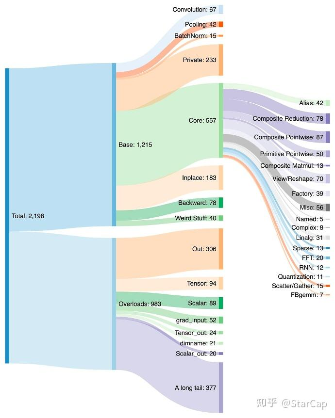
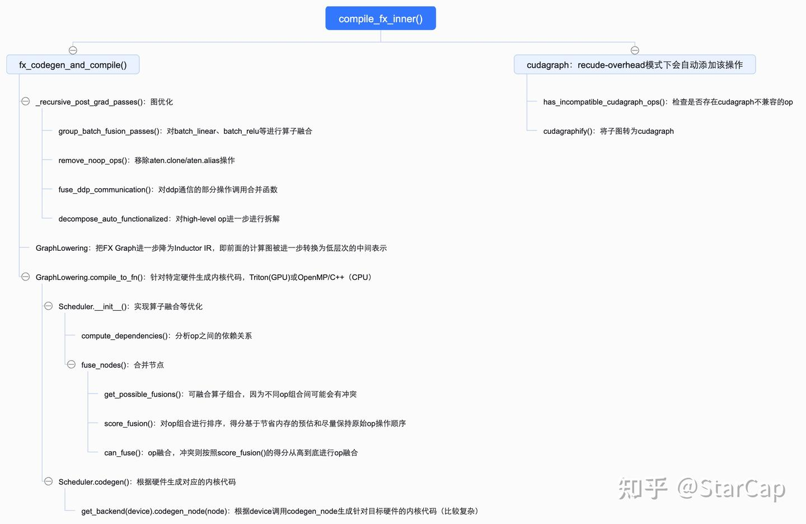

# [torch.compile 시리즈] Torch.compile() 흐름 해석 — 4. PrimTorch & TorchInductor

> 원문: https://zhuanlan.zhihu.com/p/11224299472

> 본 글은 torch.compile() 흐름 해석 시리즈이므로, 많은 코드와 예제는 이전 글과 함께 봐야 이해하기 쉽습니다.

## PrimTorch

이전 장 【컴파일 시리즈】Torch.compile() 흐름 해석 — 3. AOTAutograd에서 joint graph 구축 시 op 실행 과정에서 ProxyTorchDispatchMode의 `__torch_dispatch__`를 통해 op을 decompose한다고 언급했습니다. 구체적인 흐름은 다음과 같습니다:

1. `maybe_handle_decomp()` 함수를 호출하여 CURRENT_DECOMPOSITION_TABLE(ATen op 매핑 테이블)에서 op에 대응하는 함수 구현을 조회하여 반환합니다. 미구현 시 2로 진입합니다.
2. 미구현이면 `decompose()` 함수를 호출하여 계속 분해합니다. `decompose()` 구현 로직은 다음과 같습니다:

```python
# decompose() 함수 구현
# path: /torch/_ops.py
def decompose(self, *args, **kwargs):
    dk = torch._C.DispatchKey.CompositeImplicitAutograd
    if dk in self.py_kernels:
        # NB: This branch is not too necessary anymore, because we can
        # apply Python CompositeImplicitAutograd *before* tracing
        # using Python dispatcher (also taking advantage of the autograd
        # formula).  But it's included for completeness
        return self.py_kernels[dk](*args, **kwargs)
    elif torch._C._dispatch_has_kernel_for_dispatch_key(self.name(), dk):
        return self._op_dk(dk, *args, **kwargs)
    else:
        return NotImplemented
```

이를 통해 high level op을 단계적으로 ATen op으로 분해하는 과정을 구현합니다. 전체적으로 PrimTorch는 일종의 규범으로서, 모든 op을 약속된 op 규범 집합으로 분해하며, 개발자와 하드웨어 벤더 사이의 중간 브릿지 역할을 합니다. PyTorch 프런트엔드는 op을 PrimTorch로 분해 매핑하고, 하드웨어 벤더는 이러한 특정 op에 대해 최적화를 수행합니다.



## TorchInductor

TorchInductor는 PyTorch의 고성능 컴파일 백엔드로, 최적화된 계산 그래프를 특정 하드웨어(CPU, GPU 등)를 위한 효율적인 커널 코드로 변환하는 데 집중합니다. 메모리 최적화, 병렬화, 저수준 코드 생성 등 다양한 최적화 기법을 활용하여 계산 성능을 극대화합니다.

`aot_dispatch_autograd()` 함수는 순방향/역방향 FX Graph를 얻은 후 각각 `fw_compiler`, `bw_compiler`를 호출하여 순방향/역방향 그래프를 컴파일합니다. 여기서 `fw_compiler`와 `bw_compiler`는 서로 다른 compiler일 수 있으며, inductor의 기본 구현에서는 `compile_fx_inner`를 호출합니다. 그 핵심 함수는 `fx_codegen_and_compile()`로, FX Graph에 대한 그래프 최적화, Triton 커널 코드 생성 등을 담당합니다.

> TorchInductor의 핵심 구현 로직은 다음과 같습니다. 관심 있는 분은 뒤의 코드 해석 부분도 참고해 주세요.



`fx_codegen_and_compile()`에서 비교적 중요한 세 가지 함수는 다음과 같습니다:
- **_recursive_post_grad_passes**: 계산 그래프의 추가 최적화를 담당하며, 다음을 포함합니다:
  - `group_batch_fusion_passes`: batch_linear, batch_relu, batch_sigmoid 등 정규화 연산에 대해 연산자 융합을 수행합니다. 먼저 융합 규칙을 생성한 후 BFS 방식으로 규칙에 부합하는 op을 찾아 융합합니다.
  - `remove_noop_ops`: 그래프에서 본질적으로 `aten.clone`과 `aten.alias`인 연산을 제거합니다.
  - `fuse_ddp_communication`: DDP 통신의 일부 연산에 대해 합병 함수를 호출하여 융합합니다.
  - `decompose_auto_functionalized`: high-level op을 추가 분해합니다(앞서 연산자 융합 등의 작업이 새로운 high level op을 도입할 수 있으므로 여기서 다시 수행). 고수준 연산을 점진적으로 저수준 구현으로 변환합니다.
- **GraphLowering**: FX Graph를 Inductor IR로 추가 하강시킵니다. 즉, 앞의 계산 그래프가 더 낮은 수준의 중간 표현으로 변환됩니다. 이 표현은 최종 머신 코드에 더 가까우며 추가적인 코드 생성과 최적화에 적합합니다.
- **GraphLowering.compile_to_fn()**: 앞서 생성한 IR 표현을 대상 하드웨어의 저수준 코드로 변환합니다. GPU에서는 Triton을, CPU에서는 OpenMP/C++을 생성하며, 동시에 SIMD 명령어와 멀티스레드 병렬화를 활용하여 계산을 가속화할 수 있습니다. inductor의 핵심 구현입니다.

### compile_to_fn() — 커널 코드 생성

`compile_to_fn()`은 Scheduler 클래스에서 커널 코드 컴파일의 핵심 기능을 구현합니다. Scheduler의 두 함수가 주목할 만합니다:

1. **Scheduler.__init__()**: 연산자 융합 등의 최적화를 구현하며, 기본 흐름은 다음과 같습니다:
   - `compute_dependencies()`: op 간의 의존 관계를 분석합니다.
   - `fuse_nodes()`: 노드를 합병합니다. 핵심 로직은 `get_possible_fusions`로 융합 가능한 연산자 조합을 가져오고(여기서는 먼저 융합 가능한 것을 선별하기만 합니다. op 간에 교집합이 있을 수 있으므로 직접 융합을 실행하지 않고, 융합 가능한 조합을 선별하여 정렬 후 순서대로 융합), `can_fuse()`로 추가 검사하여 융합 가능 여부를 확인하고 최종적으로 융합합니다. 두 가지 중요한 함수: `can_fuse()`는 두 op의 융합이 합법적인지 검사하고, `score_fusion()`은 주어진 융합 op에 우선순위를 부여합니다(융합 op 조합이 충돌할 때 정렬 점수가 높은 것부터 융합하며, 정렬 점수는 <1> 절약되는 메모리 연산의 추정치, <2> 원래 연산 순서 유지를 기반으로 합니다).

2. **Scheduler.codegen()**: 
   - `codegen_extern_call()`: 일부 kernel 결정에 대해 인-플레이스 변경을 수행하고 결정을 기록합니다.
   - `self.get_backend(device).codegen_node(node)`: device에 따라 `codegen_node`를 호출하여 대상 하드웨어를 위한 커널 코드를 생성합니다. 예를 들어 `torch/_inductor/codegen/cuda_combined_scheduling.py::codegen_node`에서 Triton 커널 코드 생성이 구현되어 있습니다.

`compile_to_module()`로 돌아가서, 앞서 생성한 커널 코드를 .py 파일 형태(Triton 구현)로 PyCodeCache에 저장하고, 마지막으로 `PyCodeCache.load_by_key_path()`를 호출하여 컴파일된 module을 얻습니다(이 module에는 Triton 코드의 임시 파일 경로가 포함됨). `fx_codegen_and_compile()` 함수로 반환되어 CompiledFxGraph로 추가 캡슐화됩니다.

마지막으로 `compile_fx_inner` 함수로 돌아가서, cudagraph를 지원하면 컴파일된 그래프에 대해 cudagraph 컴파일 최적화를 수행합니다(torch.compile의 reduce-overhead 모드에서는 CUDA Graph를 자동 추가하여 런타임 오버헤드를 줄입니다). 구체적인 흐름은 다음과 같습니다:
- `has_incompatible_cudagraph_ops()`: cudagraph와 호환되지 않는 op이 있는지 확인
- `cudagraphify()`: 서브그래프를 cudagraph로 변환하여 최적화

여기까지 TorchInductor의 컴파일 부분이 완료되며, Triton 커널 코드로 구현된 CompiledFxGraph를 반환합니다. 최종적으로 `compile_fx()` 즉 inductor의 진입점까지 돌아가고, `call_user_compiler` 호출 지점으로 돌아와 후속 작업을 계속 진행합니다(【컴파일 시리즈】Torch.compile() 흐름 해석 — 2. TorchDynamo에서 이미 소개). 이로써 전체 흐름이 완성됩니다.

```python
# Inductor 핵심 함수 구현
def fx_codegen_and_compile(
    gm: torch.fx.GraphModule,
    example_inputs: List[torch.Tensor],
    cudagraphs: Optional[BoxedBool] = None,
    static_input_idxs: Optional[List[int]] = None,
    is_backward: bool = False,
    graph_id: Optional[int] = None,
    cpp_wrapper: bool = False,
    aot_mode: bool = False,
    is_inference: bool = False,
    # Use a dict with None value rather than a set for deterministic
    # iteration order just in case.
    user_visible_outputs: Optional[Dict[str, None]] = None,
    layout_opt: Optional[bool] = None,
    extern_node_serializer: Optional[Callable[[List[ExternKernelNode]], Any]] = None,
) -> Union[CompiledFxGraph, str]:
    # 중간 생략...
    V.debug.fx_graph(gm, example_inputs)
    shape_env = _shape_env_from_inputs(example_inputs)
    view_to_reshape(gm)

    with torch.no_grad():
        fake_mode = fake_tensor_prop(gm, example_inputs)

    with V.set_fake_mode(fake_mode):
        # has some issues with memory in training
        _recursive_post_grad_passes(gm, is_inference=is_inference)    # 계산 그래프 최적화: group_batch_fusion, remove_noop_ops(복사/별칭 처리), fuse_ddp_communication 등
        V.debug.fx_graph_transformed(gm, example_inputs)
        post_grad_graphs_log.debug(
            "%s",
            lazy_format_graph_code(
                "AFTER POST GRAD", gm, include_stride=True, include_device=True
            ),
        )
        trace_structured(
            "inductor_post_grad_graph",
            payload_fn=lambda: gm.print_readable(
                print_output=False, include_stride=True, include_device=True
            ),
        )
        if config.is_fbcode():
            log_optimus_to_scuba(
                extra_logging={"pt2_configs": str(get_patched_config_dict())}
            )

    with V.set_fake_mode(fake_mode), maybe_disable_comprehensive_padding(
        example_inputs
    ):
        const_output_index = None
        const_graph = None
        const_code = None

        if aot_mode and config.aot_inductor.use_runtime_constant_folding:
            const_gm, const_output_index = split_const_gm(gm)

            const_graph = GraphLowering(
                const_gm,
                example_inputs=[],
                shape_env=shape_env,
                graph_id=graph_id,
                cpp_wrapper=cpp_wrapper,
                aot_mode=aot_mode,
                user_visible_outputs=user_visible_outputs,
                extern_node_serializer=extern_node_serializer,
                is_inference=is_inference,
                is_const_graph=True,
            )
            with V.set_graph_handler(const_graph):
                assert cpp_wrapper, "AOT mode only supports C++ wrapper"
                const_graph.run()

                const_code, _ = const_graph.codegen_with_cpp_wrapper()
        # Inductor IR로 하강하여 추가 최적화
        graph = GraphLowering(
            gm,
            # example_inputs will be used by AOTInductor to dry-run the generated code for Triton kernel tuning.
            # For the forward pass, we have the real inputs to be used as example_inputs. For the backward pass,
            # we currently use fake tensors and defake them later.
            example_inputs=example_inputs,
            shape_env=shape_env,
            graph_id=graph_id,
            cpp_wrapper=cpp_wrapper,
            aot_mode=aot_mode,
            user_visible_outputs=user_visible_outputs,
            extern_node_serializer=extern_node_serializer,
            is_inference=is_inference,
            const_output_index=const_output_index,
            const_code=const_code,
            const_module=const_graph,
        )
        metrics_helper = metrics.CachedMetricsHelper()
        with V.set_graph_handler(graph):
            graph.run(*example_inputs)
            output_strides: List[Optional[Tuple[int, ...]]] = []
            if graph.graph_outputs is not None:
                # We'll put the output strides in the compiled graph so we
                # can later return them to the caller via TracingContext
                for out in graph.graph_outputs:
                    if (
                        hasattr(out, "layout")
                        and len(free_unbacked_symbols(out.layout.stride)) == 0
                    ):
                        output_strides.append(
                            tuple(
                                V.graph.sizevars.size_hint(s) for s in out.layout.stride
                            )
                        )
                    else:
                        output_strides.append(None)

            _check_triton_bf16_support(graph)
            compiled_fn = graph.compile_to_fn()    # 대응하는 백엔드 커널 코드 생성, GPU는 Triton, CPU는 C++/OpenMP

            # 중간 코드 생략...

            # 컴파일된 코드를 CompiledFxGraph로 캡슐화하여 반환
            compiled_graph = CompiledFxGraph(
                compiled_fn,
                graph,
                output_strides,
                V.graph.disable_cudagraphs_reason,
                metrics_helper.get_deltas(),
            )

    return compiled_graph
```

여기까지 torch.compile() 함수의 전체 흐름을 정리했습니다. TorchDynamo의 계산 그래프 캡처, AOTAutograd의 순방향/역방향 계산 그래프 캡처 및 연산자 decompose, 그리고 마지막으로 TorchInductor에서의 연산자 융합과 커널 코드 생성의 구현 로직을 해석했습니다. 추후 일부 구현 세부사항에 대해 심층 분석을 진행할 예정입니다.
