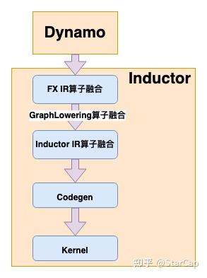
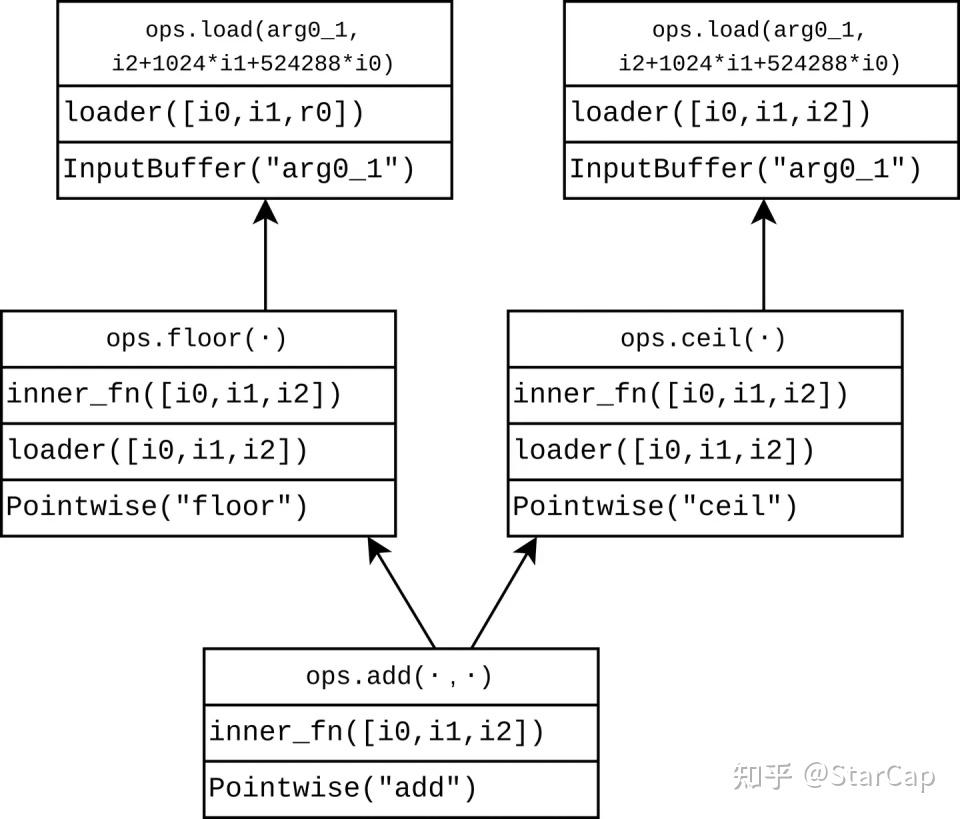
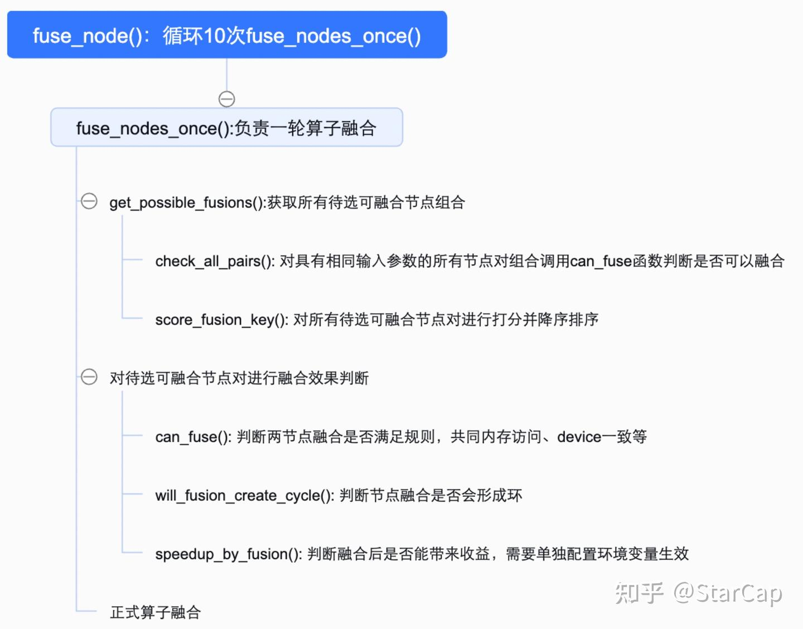
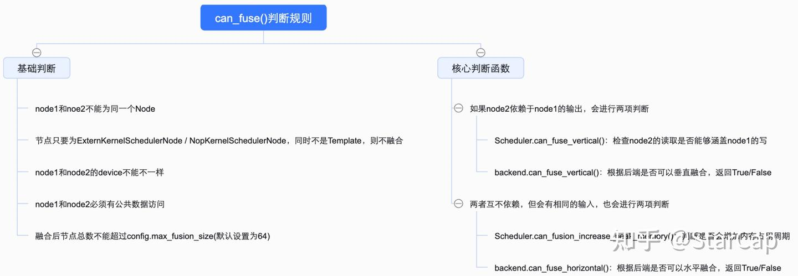

# [torch.compile 시리즈] Torch.compile() 훈련 컴파일 — 연산자 융합 로직 & 엔지니어링

> 원문: https://zhuanlan.zhihu.com/p/21053905491

## 1. 배경

torch.compile()에서 Dynamo는 프런트엔드로서 계산 그래프 캡처를 담당하고, 백엔드에는 inductor, tvm 등이 컴파일 최적화를 수행합니다.
- **Dynamo**: Python 바이트코드 레벨에서 pass를 주입하여 bytecode-to-bytecode 최적화를 구현하며, 바이트코드를 한 줄씩 파싱하여 FX Graph를 구축합니다.
- **Inductor**: FX Graph에 대해 AOTAutograd로 joint-graph를 생성하고, PrimTorch 기본 op으로 decompose하며, 하드웨어에 기반하여 대응하는 커널 코드를 생성합니다.

본 글에서는 주로 다음 내용을 공유합니다:
- TorchInductor의 연산자 융합 로직
- torch.compile에서 커스텀 융합 연산자를 구현하는 방법

## 2. TorchInductor 연산자 융합 로직



TorchInductor에서 연산자 융합을 담당하는 주요 세 가지 유형이 있습니다:
- **FX Graph 상의 연산자 융합**: FX IR의 target이 아직 torch.ops 레벨일 수 있어 비교적 조대한 입도의 융합에 해당합니다. 보통 추론 시나리오에서 적용되며, 예를 들어 추론에서는 Conv+BN 연산자 융합을 수행하지만, 훈련 시나리오에서는 가중치 업데이트 문제로 적용되지 않습니다.
- **GraphLowering 과정의 inline**: GraphLowering은 FX Graph를 Inductor IR로 변환하는 것을 담당하며, Inductor IR로 변환하는 과정에서 순수 계산의 중간 결과를 inline하여 융합 효과를 구현합니다.
- **Inductor IR 상의 연산자 융합**: Scheduler가 GraphLowering 후 생성된 모든 메모리 할당된 Inductor IR(Inductor에서는 buffer라 칭함) 중 공유 메모리 접근이 있는 연산자를 융합합니다.

### 2.1. FX Graph 상의 연산자 융합

이 단계에서는 아직 decompose되지 않은 op이 존재하며, AOTAutograd를 통해 역전파 계산 그래프를 구축해야 하므로 훈련 시나리오에서의 연산자 융합은 비교적 제한적입니다(보통 연산자의 역전파 함수를 제공해야 합니다). 하지만 상대적으로 더 상위 레벨에서 융합할 수 있어 수익이 더 명확합니다. Conv+BN 코드를 예로 들면:

```python
# Conv+BN
# code
import torch
from typing import List
import torch._dynamo as dynamo
import torch
import torch.nn as nn

class ConvNet(nn.Module):
    def __init__(self, num_classes=10):
        super(ConvNet, self).__init__()
        self.conv_1 = nn.Conv2d(3, 16, kernel_size=3, stride=1, padding=2) # assuming input is 3-channel image
        self.bn_1 = nn.BatchNorm2d(16)
        self.relu_1 = nn.ReLU()

    def forward(self, x):
        out = self.conv_1(x)
        out = self.bn_1(out)
        out = self.relu_1(out)
        return out

def test():
    data = torch.randn((2,3,128,128),requires_grad=True,device="cuda")
    model = ConvNet().to("cuda")
    model.eval()
    model = dynamo.optimize("inductor")(model)
    output = model(data)

test()
```

훈련 시나리오에서는 FX IR 상에서 어떤 연산자 융합도 수행되지 않으며, 단순히 conv 계산 → 평균·분산 계산 → BN 계산 순서로 진행됩니다.

```python
# 훈련 시나리오의 Conv+BN FX Graph
def forward(self, primals, tangents):
    primals_1, primals_2, primals_3, primals_4, primals_5, primals_6, primals_7, primals_8, tangents_1, = fx_pytree.tree_flatten_spec([primals, tangents], self._in_spec)
    convolution = torch.ops.aten.convolution.default(primals_8, primals_1, primals_2, [1, 1], [2, 2], [1, 1], False, [0, 0], 1);  primals_2 = None
    convert_element_type = torch.ops.prims.convert_element_type.default(primals_5, torch.float32)
    convert_element_type_1 = torch.ops.prims.convert_element_type.default(primals_6, torch.float32)
    add = torch.ops.aten.add.Tensor(convert_element_type_1, 1e-05);  convert_element_type_1 = None
    sqrt = torch.ops.aten.sqrt.default(add);  add = None
    reciprocal = torch.ops.aten.reciprocal.default(sqrt);  sqrt = None
    mul = torch.ops.aten.mul.Tensor(reciprocal, 1);  reciprocal = None
    unsqueeze = torch.ops.aten.unsqueeze.default(convert_element_type, -1);  convert_element_type = None
    unsqueeze_1 = torch.ops.aten.unsqueeze.default(unsqueeze, -1);  unsqueeze = None
    unsqueeze_2 = torch.ops.aten.unsqueeze.default(mul, -1);  mul = None
    unsqueeze_3 = torch.ops.aten.unsqueeze.default(unsqueeze_2, -1);  unsqueeze_2 = None
    sub = torch.ops.aten.sub.Tensor(convolution, unsqueeze_1);  unsqueeze_1 = None
    mul_1 = torch.ops.aten.mul.Tensor(sub, unsqueeze_3);  sub = unsqueeze_3 = None
    unsqueeze_4 = torch.ops.aten.unsqueeze.default(primals_3, -1)
    unsqueeze_5 = torch.ops.aten.unsqueeze.default(unsqueeze_4, -1);  unsqueeze_4 = None
    mul_2 = torch.ops.aten.mul.Tensor(mul_1, unsqueeze_5);  mul_1 = unsqueeze_5 = None
    unsqueeze_6 = torch.ops.aten.unsqueeze.default(primals_4, -1);  primals_4 = None
    unsqueeze_7 = torch.ops.aten.unsqueeze.default(unsqueeze_6, -1);  unsqueeze_6 = None
    add_1 = torch.ops.aten.add.Tensor(mul_2, unsqueeze_7);  mul_2 = unsqueeze_7 = None
    relu = torch.ops.aten.relu.default(add_1);  add_1 = None
    alias = torch.ops.aten.alias.default(relu)
    alias_1 = torch.ops.aten.alias.default(alias);  alias = None
    alias_2 = torch.ops.aten.alias.default(alias_1);  alias_1 = None
    alias_3 = torch.ops.aten.alias.default(alias_2);  alias_2 = None
    le = torch.ops.aten.le.Scalar(alias_3, 0);  alias_3 = None
    scalar_tensor = torch.ops.aten.scalar_tensor.default(0, dtype = torch.float32, layout = torch.strided, device = device(type='cuda', index=0))
    where = torch.ops.aten.where.self(le, scalar_tensor, tangents_1);  le = scalar_tensor = tangents_1 = None
    add_2 = torch.ops.aten.add.Tensor(primals_6, 1e-05);  primals_6 = None
    rsqrt = torch.ops.aten.rsqrt.default(add_2);  add_2 = None
    unsqueeze_8 = torch.ops.aten.unsqueeze.default(primals_5, 0);  primals_5 = None
    unsqueeze_9 = torch.ops.aten.unsqueeze.default(unsqueeze_8, 2);  unsqueeze_8 = None
    unsqueeze_10 = torch.ops.aten.unsqueeze.default(unsqueeze_9, 3);  unsqueeze_9 = None
    sum_1 = torch.ops.aten.sum.dim_IntList(where, [0, 2, 3])
    sub_1 = torch.ops.aten.sub.Tensor(convolution, unsqueeze_10);  convolution = unsqueeze_10 = None
    mul_3 = torch.ops.aten.mul.Tensor(where, sub_1);  sub_1 = None
    sum_2 = torch.ops.aten.sum.dim_IntList(mul_3, [0, 2, 3]);  mul_3 = None
    mul_8 = torch.ops.aten.mul.Tensor(rsqrt, primals_3);  primals_3 = None
    unsqueeze_17 = torch.ops.aten.unsqueeze.default(mul_8, 0);  mul_8 = None
    unsqueeze_18 = torch.ops.aten.unsqueeze.default(unsqueeze_17, 2);  unsqueeze_17 = None
    unsqueeze_19 = torch.ops.aten.unsqueeze.default(unsqueeze_18, 3);  unsqueeze_18 = None
    mul_9 = torch.ops.aten.mul.Tensor(where, unsqueeze_19);  where = unsqueeze_19 = None
    mul_10 = torch.ops.aten.mul.Tensor(sum_2, rsqrt);  sum_2 = rsqrt = None
    sum_3 = torch.ops.aten.sum.dim_IntList(mul_9, [0, 2, 3])
    convolution_backward = torch.ops.aten.convolution_backward.default(mul_9, primals_8, primals_1, [16], [1, 1], [2, 2], [1, 1], False, [0, 0], 1, [True, True, False]);  mul_9 = primals_8 = primals_1 = None
    getitem = convolution_backward[0]
    getitem_1 = convolution_backward[1];  convolution_backward = None
    return pytree.tree_unflatten([relu, getitem_1, sum_3, mul_10, sum_1, None, None, None, getitem], self._out_spec)
```

추론 시나리오에서는 FX Graph가 변화하며, 먼저 평균·분산을 계산 → Conv의 weight와 bias에 덧셈 → conv 계산 순서로 진행됩니다. 즉, BN의 가중치를 Conv에 융합하는 연산자 융합에 해당합니다.

```python
# 추론 시나리오의 Conv+BN FX Graph
def forward(self, primals, tangents):
    primals_1, primals_2, primals_3, primals_4, primals_5, primals_6, primals_7, primals_8, tangents_1, = fx_pytree.tree_flatten_spec([primals, tangents], self._in_spec)
    add = torch.ops.aten.add.Tensor(primals_6, 1e-05);  primals_6 = None
    rsqrt = torch.ops.aten.rsqrt.default(add);  add = None
    view = torch.ops.aten.view.default(rsqrt, [-1, 1, 1, 1]);  rsqrt = None
    view_1 = torch.ops.aten.view.default(primals_3, [16, 1, 1, 1]);  primals_3 = None
    mul = torch.ops.aten.mul.Tensor(view_1, view);  view_1 = None
    mul_1 = torch.ops.aten.mul.Tensor(primals_1, mul)
    view_2 = torch.ops.aten.view.default(mul, [16])
    sub = torch.ops.aten.sub.Tensor(primals_2, primals_5);  primals_2 = primals_5 = None
    mul_2 = torch.ops.aten.mul.Tensor(view_2, sub)
    add_1 = torch.ops.aten.add.Tensor(primals_4, mul_2);  primals_4 = mul_2 = None
    convolution = torch.ops.aten.convolution.default(primals_8, mul_1, add_1, [1, 1], [2, 2], [1, 1], False, [0, 0], 1);  add_1 = None
    relu = torch.ops.aten.relu.default(convolution);  convolution = None
    # ... (이하 생략)
```

**종합하면, 훈련 시나리오에서 이 단계에서 연산자 융합을 수행하려면, 융합된 연산자의 역전파 함수를 제공해야 역전파 계산 그래프에 필요한 중간 활성화 값과 대응할 수 있습니다. 또한 이 단계에서 융합을 수행하면 Inductor는 해당 Node를 ExternKernel로 취급하여 후속 Inductor IR 상의 융합에 참여하지 않게 됩니다. Inductor IR 융합의 수익을 추가로 얻으려면 GraphLowering의 pass 규칙을 수정해야 합니다(상당히 많은 수정이 수반됩니다).**

### 2.2. GraphLowering 과정의 inline

GraphLowering은 FX IR을 Inductor IR로 변환하는 것을 담당하며, `inner_fn`이라는 함수를 통해 inline을 구현합니다. 주로 인접한 PointWise 또는 Reduction 연산의 융합에 관여합니다. 지원되는 op에는 대응하는 lowering 함수가 있어 변환을 수행하고, 지원되지 않는 op은 직접 fallback으로 처리되어 FallbackKernel로 표현됩니다(예: 사용자 정의 op, `aten._scaled_dot_product_flash_attention_backward.default`, `aten._scaled_dot_product_flash_attention.default`, `aten.convolution_backward.default` 등). 또한 `aten.rand` 같은 난수 류는 모두 fallback으로 처리됩니다.

inline 과정을 이해하기 위해 다음 코드를 예로 들면, 계산 흐름은 `aten.floor`, `aten.ceil`, 덧셈, reduce 합산, 덧셈, 결과 반환입니다.

```python
# PyTorch 코드
import torch

@torch.compile
def f(x: torch.Tensor):
    b = torch.floor(x) + torch.ceil(x)
    c = b.sum(dim=-1)
    d = c + 1
    return d
f(torch.empty([32,512,1024], device="cuda"))
# TorchDynamo 계산 그래프
def forward(self, arg0_1):
    floor = torch.ops.aten.floor.default(arg0_1)
    ceil = torch.ops.aten.ceil.default(arg0_1);  arg0_1 = None
    add = torch.ops.aten.add.Tensor(floor, ceil);  floor = ceil = None
    sum_1 = torch.ops.aten.sum.dim_IntList(add, [-1]);  add = None
    add_1 = torch.ops.aten.add.Tensor(sum_1, 1);  sum_1 = None
    return (add_1,)
```

GraphLowering 과정에서 FX Graph의 각 node에 대해 lowering pass를 수행하여 InputBuffer, PointWise, ComputedBuffer 등의 Inductor IR로 변환하며, 각 Inductor IR의 속성을 기술합니다. 동시에 TensorBox/StorageBox로 캡슐화하며, TensorBox든 StorageBox든 주로 stride, shape 등의 정보를 기록하고 pointer offset 방법으로 데이터를 읽을 수 있습니다.

FX Graph 상 각 Node의 Lowering 결과를 분석하면, 주로 세 가지 유형의 Inductor IR이 있습니다:
- **PointWise**: 원소별 계산을 나타내며(덧셈, 뺄셈, 곱셈, 나눗셈 등), 계산만 기술하고 결과는 메모리에 저장하지 않습니다. `inner_fn`은 Tensor의 각 원소가 실행할 연산을 기술합니다(각 원소의 인덱스 위치를 전달하고, 인덱스 위치와 shape, stride 등의 정보로 데이터를 가져와 계산). `aten.floor`, `aten.ceil`과 덧셈 같은 순수 계산의 중간 결과는 PointWise 타입으로 저장됩니다.
- **InputBuffer**: 입력 변수를 저장하며 대응하는 메모리 할당이 있고, 이름은 보통 arg로 시작합니다. **ComputedBuffer**: 중간 계산 결과 또는 출력을 저장하며, reduce 같은 통신이 관여하거나 출력에 사용되는 Node에 사용되고, 이름은 보통 buf로 시작합니다.

InputBuffer와 ComputedBuffer 같은 실제 저장 노드는 stride와 shape 정보를 가집니다. lowering 작업이 완료되면 GraphLowering 클래스는 실제 저장이 있는 Inductor IR만 보존합니다. 이는 PointWise 류가 융합되어 사라짐을 의미하며, 즉 이 과정에서 이미 간단한 fusion이 수행됩니다.

```
# FX IR 상 각 Node에 대응하는 Inductor IR
============================
op="placeholader" 
name=arg0_1
output=TensorBox(StorageBox(
  InputBuffer(name='arg0_1', layout=FixedLayout('cuda', torch.float32, size=[32, 512, 1024], stride=[524288, 1024, 1]))
))

============================
op="call_function" 
name=aten.floor.default
output=TensorBox(StorageBox(
  Pointwise(
    'cuda',
    torch.float32,
    def inner_fn(index):
        i0, i1, i2 = index
        tmp0 = ops.load(arg0_1, i2 + 1024 * i1 + 524288 * i0)
        tmp1 = ops.floor(tmp0)
        return tmp1
    ,
    ranges=[32, 512, 1024],
    origin_node=None,
    origins={floor}
  )
))

============================
op="call_function" 
name=aten.ceil.default
output=TensorBox(StorageBox(
  Pointwise(
    'cuda',
    torch.float32,
    def inner_fn(index):
        i0, i1, i2 = index
        tmp0 = ops.load(arg0_1, i2 + 1024 * i1 + 524288 * i0)
        tmp1 = ops.ceil(tmp0)
        return tmp1
    ,
    ranges=[32, 512, 1024],
    origin_node=None,
    origins={ceil}
  )
))

============================
op="call_function" 
name=aten.add.Tensor
output=TensorBox(StorageBox(
  Pointwise(
    'cuda',
    torch.float32,
    def inner_fn(index):
        i0, i1, i2 = index
        tmp0 = ops.load(arg0_1, i2 + 1024 * i1 + 524288 * i0)
        tmp1 = ops.floor(tmp0)
        tmp2 = ops.load(arg0_1, i2 + 1024 * i1 + 524288 * i0)
        tmp3 = ops.ceil(tmp2)
        tmp4 = tmp1 + tmp3
        return tmp4
    ,
    ranges=[32, 512, 1024],
    origin_node=None,
    origins={add, floor, ceil}
  )
))

============================
op="call_function" 
name=aten.sum.dim_IntList
output=TensorBox(StorageBox(
  ComputedBuffer(name='buf0', layout=FlexibleLayout('cuda', torch.float32, size=[32, 512], stride=[512, 1]), data=Reduction(
    'cuda',
    torch.float32,
    def inner_fn(index, rindex):
        i0, i1 = index
        r0 = rindex
        tmp0 = ops.load(arg0_1, r0 + 1024 * i1 + 524288 * i0)
        tmp1 = ops.floor(tmp0)
        tmp2 = ops.load(arg0_1, r0 + 1024 * i1 + 524288 * i0)
        tmp3 = ops.ceil(tmp2)
        tmp4 = tmp1 + tmp3
        return tmp4
    ,
    ranges=[32, 512],
    reduction_ranges=[1024],
    reduction_type=sum,
    origin_node=None,
    origins={sum_1, add, floor, ceil}
  ))
))

============================
op="call_function" 
name=aten.add.Tensor
output=TensorBox(StorageBox(
  Pointwise(
    'cuda',
    torch.float32,
    def inner_fn(index):
        i0, i1 = index
        tmp0 = ops.load(buf0, i1 + 512 * i0)
        tmp1 = ops.constant(1, torch.float32)
        tmp2 = tmp0 + tmp1
        return tmp2
    ,
    ranges=[32, 512],
    origin_node=None,
    origins={add_1}
  )
))

============================
op="output" 
 name=output
output=(TensorBox(StorageBox(
  ComputedBuffer(name='buf1', layout=FixedLayout('cuda', torch.float32, size=[32, 512], stride=[512, 1]), data=Pointwise(
    'cuda',
    torch.float32,
    def inner_fn(index):
        i0, i1 = index
        tmp0 = ops.load(buf0, i1 + 512 * i0)
        tmp1 = ops.constant(1, torch.float32)
        tmp2 = tmp0 + tmp1
        return tmp2
    ,
    ranges=[32, 512],
    origin_node=add_1,
    origins={add_1}
  ))
```

예를 들어 위의 `torch.floor(x) + torch.ceil(x)` 연산은 `aten.floor`, `aten.ceil`, `aten.add` 세 op으로 분해되지만, `aten.add`의 Inductor IR의 `inner_fn`은 `aten.floor`와 `aten.ceil`의 `inner_fn`을 직접 재사용하여 덧셈을 수행합니다. `c = b.sum(dim=-1)`의 `aten.sum`은 `aten.add`의 `inner_fn`을 직접 재사용하고 Reduction을 씌워 `inner_fn`의 계산 결과에 대해 reduce 연산을 수행하며, 최종적으로 ComputedBuffer로 buf_0에 저장합니다.

**종합하면, 연산자 융합의 전제 조건과 종료 조건은 다음과 같습니다:**
- **순수 계산 pointwise 노드, `inner_fn`을 재사용할 수 있는 노드는 fused됩니다(예: PointWise와 PointWise 간, Reduction의 입력인 PointWise 간). 이런 중간 결과는 메모리에 저장하지 않고 직접 재사용하여 후속 계산을 진행합니다.**
- **`sum()` 함수처럼 reduce를 호출하여 `inner_fn`을 직접 재사용할 수 없는 경우 ComputedBuffer로 저장합니다(하나의 IR buffer에 대응). 또한 output에 사용되는 Node도 직접 ComputedBuffer로 저장됩니다.**



### 2.3. Inductor IR 상의 연산자 융합

Inductor IR 상에서는 Scheduler 클래스가 연산자 융합을 담당합니다. GraphLowering 후 생성된 Inductor IR에서 각 IR Node는 하나의 buffer 메모리 공간 할당에 대응하며, Scheduler는 두 IR Node 연산의 공유 읽기/쓰기 buffer 존재 여부를 기반으로 연산자를 융합하여 중간 결과의 저장/읽기를 추가로 줄이고, 융합된 IR Node를 Triton template을 통해 하나의 kernel로 합성하여 실행합니다.

훈련 시나리오에서 연산자 융합 시 그래디언트 역전파 보장에 대한 관심사는, Inductor IR 단계는 이미 AOTAutograd로 joint-graph를 구축한 이후이므로 이 시점에서 순방향/역방향 graph의 입출력이 이미 확정되어 있고, 순방향 graph의 출력이 역방향 graph의 입력이 되므로 순방향/역방향 graph의 입출력만 정확하면 중간에서 어떻게 융합하든 블랙박스 연산이 됩니다.

앞의 Conv+BN 코드를 예로 들면, 순방향 계산 그래프에서 relu, primals_1, primals_3, primals_8, convolution, squeeze_1, le, unsqueeze_6을 보존해야 합니다. relu는 전체 순방향 과정의 최종 출력 결과이고, 나머지 값들은 그래디언트 역전파에 사용되며, 역방향 계산 그래프는 이러한 중간 결과를 기반으로 계산합니다.

```python
# Conv+BN 순방향 계산 그래프
def forward(self, primals_1, primals_2, primals_3, primals_4, primals_5, primals_6, primals_7, primals_8):
    convolution = torch.ops.aten.convolution.default(primals_8, primals_1, primals_2, [1, 1], [2, 2], [1, 1], False, [0, 0], 1);  primals_2 = None
    add = torch.ops.aten.add.Tensor(primals_7, 1)
    var_mean = torch.ops.aten.var_mean.correction(convolution, [0, 2, 3], correction = 0, keepdim = True)
    getitem = var_mean[0]
    getitem_1 = var_mean[1];  var_mean = None
    add_1 = torch.ops.aten.add.Tensor(getitem, 1e-05)
    rsqrt = torch.ops.aten.rsqrt.default(add_1);  add_1 = None
    sub = torch.ops.aten.sub.Tensor(convolution, getitem_1)
    mul = torch.ops.aten.mul.Tensor(sub, rsqrt);  sub = None
    squeeze = torch.ops.aten.squeeze.dims(getitem_1, [0, 2, 3]);  getitem_1 = None
    squeeze_1 = torch.ops.aten.squeeze.dims(rsqrt, [0, 2, 3]);  rsqrt = None
    # ... (이하 생략)
    return [relu, primals_1, primals_3, primals_8, convolution, squeeze_1, le, unsqueeze_6]

# Conv+BN 역방향 계산 그래프
def forward(self, primals_1, primals_3, primals_8, convolution, squeeze_1, le, unsqueeze_6, tangents_1):
    full_default = torch.ops.aten.full.default([], 0.0, dtype = torch.float32, layout = torch.strided, device = device(type='cuda', index=0), pin_memory = False)
    where = torch.ops.aten.where.self(le, full_default, tangents_1);  le = full_default = tangents_1 = None
    # ... (이하 생략)
    return [getitem_3, sum_3, mul_15, sum_1, None, None, None, getitem_2]
```

### 2.3.1. fuse_node 내부 로직 해석

Inductor IR 상 연산자 융합의 핵심 함수는 `fuse_node()`이며, 전체 작업 흐름은 다음과 같습니다:



`fuse_nodes()` 함수에서는 비교적 단순하게 직접 10회 루프를 돌며 `fuse_nodes_once()` 함수를 호출하여 연산자 융합을 수행합니다. 융합 전후 `Scheduler.nodes` 길이가 변하지 않거나 하나만 남으면 조기에 루프를 종료합니다. `fuse_nodes_once()`에서 핵심적인 두 함수는 `can_fuse`(두 node의 융합이 규칙을 충족하는지 판단)와 `score_fusion`(모든 융합 가능한 노드 쌍에 점수를 매기며, 두 노드 쌍의 융합이 충돌하면 점수가 높은 것을 우선 융합)입니다. `fuse_nodes_once()`의 전체 흐름은 다음과 같습니다:

- `get_possible_fusions()` 함수가 모든 융합 가능한 후보 노드 쌍을 가져오고 `score_fusion`으로 점수를 매겨 정렬합니다. 구체적인 흐름은:
  i. 모든 `Scheduler.nodes`를 순회하여 필요한 buffer로부터 `buffer_names_grouping`(각 buffer를 어떤 node가 사용하는지)을 얻고, `buffer_names_grouping`을 기반으로 `check_all_pairs` 함수를 호출하여 `possible_fusions` 융합 가능 노드 쌍을 생성합니다. 동일 입력 파라미터를 가진 노드에 대해 융합을 시도하는 방식입니다.
  ii. `possible_fusions`에 대해 `score_fusion_key`로 내림차순 정렬하며, 핵심은 `score_fusion` 함수로 점수를 매기는 것입니다.
- `get_possible_fusions()`로 얻은 융합 가능 후보 노드 쌍(이미 내림차순 정렬됨)에 대해 정식 융합 전 최종 판단:
  i. `can_fuse()=True`: 합법적 융합인지 재확인
  ii. `will_fusion_create_cycle()=False`: 두 노드 융합이 순환을 도입하는지 판단. 예를 들어 1→2→3이고 1→3인 경우, 1과 3을 융합하면 융합된 1_3과 2가 순환을 구성합니다. 즉, 두 노드 중 하나가 다른 하나의 조상인지 판단합니다.
  iii. `speedup_by_fusion()=True`: 기본적으로 이 함수는 항상 False를 반환합니다. 해당 환경 변수를 설정해야만 적용되며, 융합이 가속을 가져올 때만 True를 반환합니다. 구현 로직은 융합 전후 연산자 시간을 직접 실측하여 수익이 있는지 비교합니다.
- 융합 작업: b단계의 추가 평가를 거친 후 정식으로 두 노드를 융합합니다.

### 2.3.2. score_fusion 구현 아이디어

목적은 두 노드 쌍의 융합이 충돌할 때 점수가 높은 것을 우선하는 것입니다. 평가 기준은 메모리 절약 추정(`score_fusion_memory` 함수 담당)과 두 노드가 원래 순서에서 더 가까운 것(융합 후 대용량 메모리 수명 주기 증가 방지)입니다.

- **메모리 절약 추정 score_fusion_memory**: 두 노드의 읽기/쓰기 메모리 인덱스를 기반으로 공통 메모리가 있는지 판단하고 공통 메모리의 크기를 계산합니다. 결과는 `memory_score`, 즉 메모리 절약 추정치로 표현됩니다. 이 부분은 메모리에 쓸 필요가 없고 중간 결과를 레지스터에 직접 저장하면 되기 때문입니다. 읽기/쓰기 메모리 인덱스가 완전히 일치해야 공통 메모리로 인정된다는 점에 유의해야 합니다.
- **proximity_score 계산(그래프 거리)**: 두 노드의 그래프 상 토폴로지 거리의 최대값을 계산합니다. 즉, `max(abs(node1.min_order - node2.min_order))`.

최종적으로 `score_fusion()`은 `memory_score`와 `proximity_score`를 반환하여 정렬에 사용합니다.

### 2.3.3. can_fuse 구현 아이디어

`can_fuse()` 함수는 두 노드의 융합이 정해진 규칙을 충족하는지 판단하며, 주요 규칙은 다음과 같습니다:



전체적으로, 왼쪽의 많은 판단은 비교적 기본적인 제약 판단이며, 최종적으로 `can_fuse_vertical()`/`can_fuse_horizontal()` 두 함수로 수직/수평 융합 가능 여부를 판단하여 최종 융합 가능 여부를 결정합니다. 핵심 함수 구현:

- **can_fusion_increase_peak_memory()**: 두 노드의 `min_order`와 `max_order`를 기반으로 두 노드 사이의 최대 거리를 직접 계산합니다. 두 노드 사이의 거리 `proximity_score > 64`이면 True를 반환하고, 아니면 False를 반환합니다. 주로 융합 후 메모리 피크 증가를 방지하기 위함입니다. 예를 들어 원래 순서에서 멀리 떨어진 노드가 융합되어 텐서의 수명이 연장되면 공간×시간 지표가 커집니다.
- **backend.can_fuse_vertical()/can_fuse_horizontal()**: 수평 융합이든 수직 융합이든 최종적으로 호출되는 것은 `SIMDScheduling.can_fuse()`입니다. `can_fuse` 함수를 분석하면 실질적으로 융합 후 정상적인 Triton kernel을 codegen할 수 있는지 판단하는 것입니다. 주로 Node가 reduction인지에 따라 서로 다른 판단 규칙을 적용하며, 핵심 판단 규칙은 node1과 node2의 size가 완전히 일치하고 융합 전후 생성되는 tiling이 동일한지입니다.

**따라서 종합하면, `Scheduler.can_fuse()` 함수 구현에서 앞의 융합 불허 규칙 판단 외에 마지막으로 수직 융합과 수평 융합 판단으로 나뉩니다. Scheduler는 추가 판단 규칙을 보충하며(예: 수평 융합의 경우 추가 공간 점유 증가 여부 판단), 마지막으로 백엔드의 동일한 규칙 판단 함수를 호출합니다. 즉, Scheduler 레벨에서 수직/수평 융합을 구분하지만, 백엔드에서는 구분하지 않으며 백엔드는 융합 후 생성되는 kernel이 합리적인지만 관심을 가집니다.**

## 3. torch.compile() 커스텀 PyTorch 연산자 융합

### 3.1. PyTorch 커스텀 op 등록

2.4 버전부터 PyTorch는 `torch.library` 방식으로 torch.compile에 새 operator를 등록하는 것을 지원합니다. 환경 요구사항은 torch>=2.4 및 gcc>=9입니다. 2.4 미만 버전도 지원하지만 사용이 상대적으로 번거롭습니다. 훈련 시나리오에서는 operator에 대응하는 순방향 함수와 역전파 함수의 구현이 요구됩니다. operator를 등록하려면 다음 단계가 필요합니다:

- operator의 순방향 함수를 정의합니다. Python/C++/CUDA로 구현 가능하며, Python에서는 `torch.library.custom_op`으로, C++/CUDA에서는 `TORCH_LIBRARY_IMPL`로 정의합니다.
- `register_fake`을 통해 operator의 FakeTensor 생성 함수를 정의하며, 주로 결과의 shape, device 정보를 정의합니다.
- `torch.library.register_autograd`를 통해 operator의 역전파 함수를 정의합니다.

위 정의를 완료하면 코드에서 `torch.ops.xxx`로 호출할 수 있으며, torch.compile에서 추가 코드 수정 없이 Dynamo의 새 op 캡처를 지원합니다.

예를 들어 mylib 라이브러리에 Tensor 곱셈과 덧셈을 융합하는 `fused_mul_add`를 구현하고, PyTorch에서 `torch.ops.mylib.fused_mul_add`로 호출합니다.

```python
# 커스텀 op 구현
import torch
from torch import Tensor

@torch.library.custom_op("mylib::fused_mul_add", mutates_args={})
def fused_mul_add(x: Tensor, y: Tensor, z: float) -> Tensor:
    return x * y + z

@fused_mul_add.register_fake
def _(x, y, z):
    torch._check(x.device == y.device)
    torch._check(x.shape == y.shape)
    torch._check(x.dtype == y.dtype)
    return torch.empty_like(x)

def _backward(ctx, grad):
    x, y = ctx.saved_tensors
    grad_x, grad_y = None, None
    if ctx.needs_input_grad[0]:
        grad_x = grad * y
    if ctx.needs_input_grad[1]:
        grad_y = grad * x
    return grad_x, grad_y, None, None

def _setup_context(ctx, inputs, output):
    x, y, z = inputs
    save_x, save_y = None, None
    if ctx.needs_input_grad[0]:
        save_y = y
    if ctx.needs_input_grad[1]:
        save_x = x
    ctx.save_for_backward(save_x, save_y)

torch.library.register_autograd("mylib::fused_mul_add", _backward, setup_context=_setup_context)
# PyTorch 코드
import torch
import mylib

def my_func(x, y, z):
    x = x + 1
    return torch.ops.mylib.fused_mul_add(x, y, z)

def main():
    x = torch.randn((2, 3), device='cuda', dtype=torch.float, requires_grad=True)
    y = torch.randn((2, 3), device='cuda', dtype=torch.float, requires_grad=True)
    z = 0.5
    compiled_func = torch.compile(my_func, backend="inductor")
    data = compiled_func(x, y, z)
    data.mean().backward()

if __name__ == '__main__':
    main()
```

Dynamo가 캡처한 순방향/역방향 계산 그래프는 다음과 같습니다. 순방향 계산 그래프의 target이 직접 `mylib.fused_mul_add`인 것을 확인할 수 있으며, 즉 커스텀 op이 Dynamo에 의해 정상적으로 캡처되었습니다. 동시에 역전파가 두 개의 곱셈으로 정의되었으므로 역방향 계산 그래프에는 두 개의 `aten.mul` 연산이 있습니다.

```
# 계산 그래프
# forward
opcode         name           target                               args                                kwargs
-------------  -------------  -----------------------------------  ----------------------------------  --------
placeholder    primals_1      primals_1                            ()                                  {}
placeholder    primals_2      primals_2                            ()                                  {}
call_function  add            aten.add.Tensor                      (primals_1, 1)                      {}
call_function  fused_mul_add  mylib.fused_mul_add.default  (add, primals_2, 0.5)               {}
output         output         output                               ([fused_mul_add, primals_2, add],)  {}

def forward(self, primals_1, primals_2):
    add = torch.ops.aten.add.Tensor(primals_1, 1);  primals_1 = None
    fused_mul_add = torch.ops.mylib.fused_mul_add.default(add, primals_2, 0.5)
    return [fused_mul_add, primals_2, add]

# backward
opcode         name        target           args                     kwargs
-------------  ----------  ---------------  -----------------------  --------
placeholder    primals_2   primals_2        ()                       {}
placeholder    add         add              ()                       {}
placeholder    tangents_1  tangents_1       ()                       {}
call_function  mul         aten.mul.Tensor  (tangents_1, primals_2)  {}
call_function  mul_1       aten.mul.Tensor  (tangents_1, add)        {}
output         output      output           ([mul, mul_1],)          {}

def forward(self, primals_2, add, tangents_1):
    mul = torch.ops.aten.mul.Tensor(tangents_1, primals_2);  primals_2 = None
    mul_1 = torch.ops.aten.mul.Tensor(tangents_1, add);  tangents_1 = add = None
    return [mul, mul_1]
```

다만 주의할 점은, 사용자 정의 op에 대해 torch.compile은 decompose를 수행하지 않으며, PrimTorch가 규정한 op으로 분해하지 않습니다. Inductor는 ExternKernel로 분류하여 직접 fallback 처리하며, Inductor Scheduler의 연산자 융합 등에 참여하지 않고 Dynamo에서 Inductor를 거쳐 실행까지 전 과정에서 독립적인 개체로 존재합니다. 사용자 정의에 대한 기본 인터페이스를 제공하며, 커스텀 연산자에 Inductor의 최적화를 적용하려면 Inductor의 lowering 함수, 각종 pass 등의 함수를 수정해야 하며 관련 코드 수정이 상당히 많아집니다.

### 3.2. 커스텀 융합 pass 추가

위의 구현에서 PyTorch에 커스텀 op을 등록했고 Dynamo와 Inductor 모두 이 op의 연산을 정상 지원하지만, PyTorch 레벨에서 `fused_mul_add`를 수동으로 호출해야 합니다. 이는 모델에 대해 수동으로 코드를 분석하고 API 호출을 변경해야 함을 의미하며, 상당히 번거로운 작업입니다. 이때 커스텀 융합 pass인 pattern match를 도입하여 FX Graph 상의 Node를 분석합니다. Tensor Mul + Tensor Add의 인접 전후 Node를 만족하는 경우, 즉 Tensor Add의 입력이 Tensor Mul의 출력인 경우, target이 `fused_mul_add`인 call_function Node를 추가하고 원래의 Mul과 Add를 삭제합니다.

검증 결과는 다음과 같으며, 커스텀 융합 pass 후 곱셈과 덧셈이 `mylib.fused_mul_add`로 대체된 것을 확인할 수 있습니다.

```
def my_func(x: Tensor, y: Tensor, z: Tensor) -> Tensor:
    result = x * y + z
    result = result + 1
    return result

# pass 전후 비교
=================before custom grad passes
opcode         name      target                   args            kwargs
-------------  --------  -----------------------  --------------  --------
placeholder    l_x_      L_x_                     ()              {}
placeholder    l_y_      L_y_                     ()              {}
placeholder    l_z_      L_z_                     ()              {}
call_function  mul       <built-in function mul>  (l_x_, l_y_)    {}
call_function  result    <built-in function add>  (mul, l_z_)     {}
call_function  result_1  <built-in function add>  (result, 1)     {}
output         output    output                   ((result_1,),)  {}

=================after custom grad passes
opcode         name              target               args                               kwargs
-------------  ----------------  -------------------  ---------------------------------  --------
placeholder    primals_1         primals_1            ()                                 {}
placeholder    primals_2         primals_2            ()                                 {}
placeholder    primals_3         primals_3            ()                                 {}
call_function  my_fused_mul_add  mylib.fused_mul_add  (primals_1, primals_2, primals_3)  {}
call_function  add_1             aten.add.Tensor      (my_fused_mul_add, 1)              {}
output         output            output               ([add_1, primals_1, primals_2],)   {}
```

종합하면, 여기서는 커스텀 pass의 흐름을 검증하기 위해 FX Graph 레벨에서 비교적 간단한 custom pass를 정의했으며, 프런트엔드 모델 코드를 수정하지 않고 자동 op 융합 및 커스텀 op 매핑을 구현했습니다. 후속으로 추가 개발이 가능합니다. FX Graph 레벨에서 커스텀 수정을 선택한 것은 주로 다음 두 가지 요인에 기반합니다:

- FX Graph 레벨 수정은 torch 2.4에서 제공하는 커스텀 operator 기능을 활용하여 비교적 낮은 비용으로 커스텀 pass를 구현할 수 있으며, PyTorch 공식에서 현재 훈련 연산자 융합 지원이 상대적으로 취약한 부분에 해당합니다.
- FX Graph 레벨은 비교적 조대한 입도의 융합을 구현할 수 있고, Inductor 레벨은 기본적으로 aten op이므로 최적화 수익이 상대적으로 작으며, Inductor Scheduler가 이미 상당히 많은 기본 융합 작업을 담당하고 있습니다.

물론 Inductor IR 레벨의 커스텀 최적화도 추가 탐구할 가치가 있으며, 기존 aten op의 kernel 구현을 최적화할 때도 Inductor IR 레벨에 커스텀 op 매핑을 주입하는 것이 관련됩니다.
