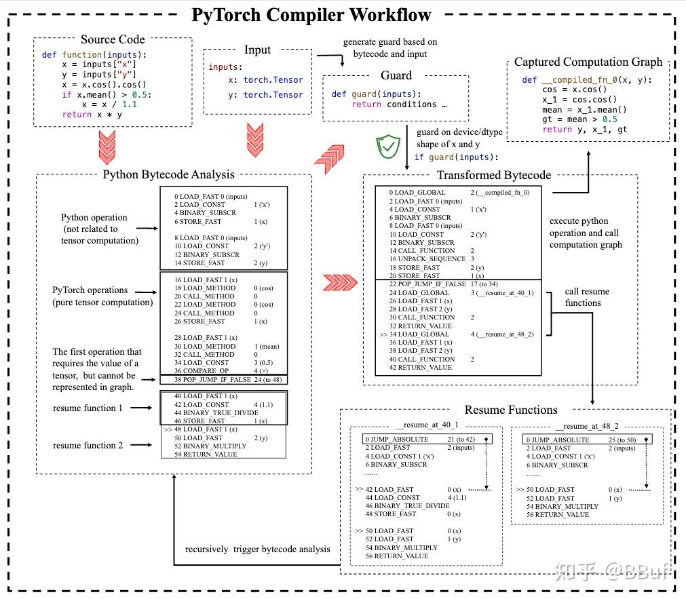
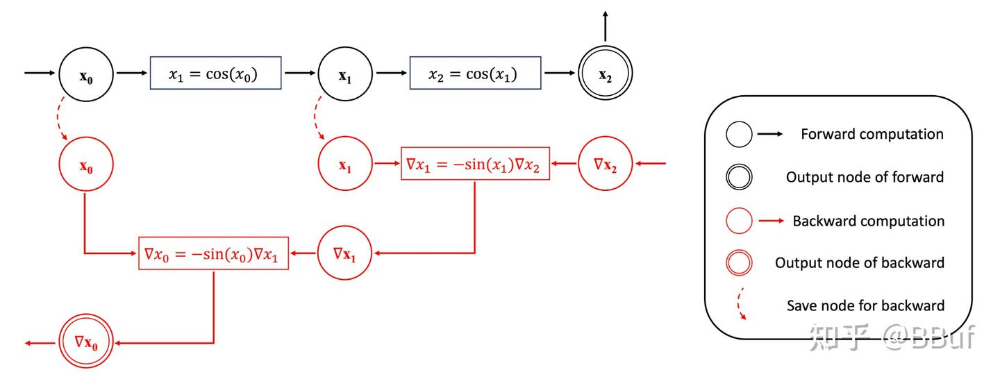
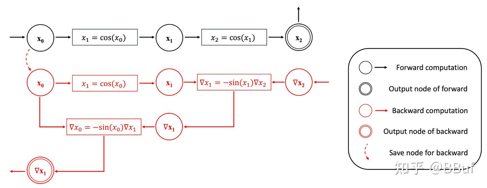
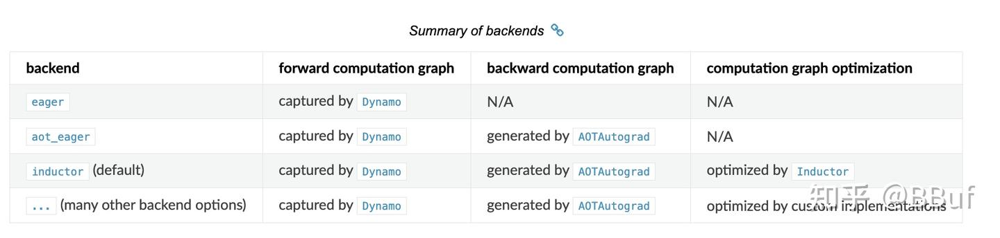

# [번역] torch.compile의 상세 예제 해석 튜토리얼

> 원문: https://zhuanlan.zhihu.com/p/855291863
> 튜토리얼 링크: https://depyf.readthedocs.io/en/latest/walk_through.html

## `torch.compile`의 상세 예제 해석

본 튜토리얼은 PyTorch 컴파일러의 다음 측면을 다룹니다:
- 기본 개념 (Just-In-Time 컴파일러, Ahead-of-time 컴파일러)
- Dynamo (그래프 캡처, 사용자 코드를 순수 Python 코드와 순수 PyTorch 관련 코드로 분리)
- AOTAutograd (순방향 계산 그래프로부터 역방향 계산 그래프 생성)
- Inductor/기타 백엔드 (주어진 계산 그래프를 다양한 디바이스에서 더 빠르게 실행하는 방법)

이 컴포넌트들은 서로 다른 백엔드 옵션으로 호출됩니다:
- `torch.compile(backend="eager")`은 Dynamo만 사용
- `torch.compile(backend="aot_eager")`은 Dynamo와 AOTAutograd 사용
- `torch.compile(backend="inductor")`(기본 파라미터)은 Dynamo, AOTAutograd, PyTorch의 내장 그래프 최적화 백엔드 `Inductor`를 사용

## PyTorch 컴파일러는 Just-In-Time 컴파일러

먼저 이해해야 할 개념은 PyTorch 컴파일러가 Just-In-Time 컴파일러라는 것입니다. 그렇다면 "Just-In-Time 컴파일러"란 무엇일까요? 예제를 살펴봅시다:

```python
import torch

class A(torch.nn.Module):
    def __init__(self):
        super().__init__()

    def forward(self, x):
        return torch.exp(2 * x)

class B(torch.nn.Module):
    def __init__(self):
        super().__init__()

    def forward(self, x):
        return torch.exp(-x)

def f(x, mod):
    y = mod(x)
    z = torch.log(y)
    return z
```

흥미로운 함수 `f`를 작성했습니다. 이 함수는 모듈 호출(`mod.forward` 호출)과 `torch.log` 호출을 포함합니다. 잘 알려진 대수 간소화 항등식 log(exp(a×x)) = a×x 덕분에 코드를 다음과 같이 최적화할 수 있습니다:

```python
def f(x, mod):
    if isinstance(mod, A):
        return 2 * x
    elif isinstance(mod, B):
        return -x
```

이것을 우리의 첫 번째 컴파일러라 부를 수 있으며, 자동화 프로그램이 아닌 우리의 두뇌가 "컴파일"한 것입니다.

더 엄밀하게 하려면 컴파일러 예제를 다음과 같이 업데이트해야 합니다:

```python
def f(x, mod):
    if isinstance(x, torch.Tensor) and isinstance(mod, A):
        return 2 * x
    elif isinstance(x, torch.Tensor) and isinstance(mod, B):
        return -x
    else:
        y = mod(x)
        z = torch.log(y)
        return z
```

각 파라미터를 검사하여 최적화 조건이 합리적인지 확인하고, 코드를 최적화할 수 없을 때 원본 코드로 폴백해야 합니다.

이것은 (Just-In-Time) 컴파일러의 두 가지 기본 개념을 이끌어냅니다: **가드(guards)**와 **변환된 코드**. 가드는 함수가 최적화될 수 있는 조건이고, 변환된 코드는 함수의 최적화된 버전입니다. 위의 간단한 컴파일러 예제에서 `isinstance(mod, A)`가 가드이고, `return 2 * x`가 가드 조건 하에서 원본 코드와 동등하지만 명백히 더 빠른 변환된 코드입니다.

위 예제는 Ahead-of-time 컴파일러입니다: 사용 가능한 모든 소스 코드를 검사하고 함수를 실행하기 전에(즉, Ahead-of-time) 가능한 모든 가드와 변환된 코드를 기반으로 최적화된 함수를 작성합니다.

다른 유형의 컴파일러는 Just-In-Time 컴파일러입니다: 함수 실행 전에 실행을 최적화할 수 있는지, 어떤 조건에서 함수 실행을 최적화할 수 있는지 분석합니다. 이 조건이 새로운 입력에 대해 충분히 일반적이어서 컴파일의 이점이 즉시 컴파일 비용을 초과하기를 바랍니다. 모든 조건이 실패하면 새로운 조건으로 코드를 최적화하려고 시도합니다.

Just-In-Time 컴파일러의 기본 작업 흐름은 다음과 같습니다:

```python
def f(x, mod):
    for guard, transformed_code in f.compiled_entries:
        if guard(x, mod):
            return transformed_code(x, mod)
    try:
        guard, transformed_code = compile_and_optimize(x, mod)
        f.compiled_entries.append([guard, transformed_code])
        return transformed_code(x, mod)
    except FailToCompileError:
        y = mod(x)
        z = torch.log(y)
        return z
```

Just-In-Time 컴파일러는 자신이 본 것만 최적화합니다. 가드 조건을 만족하지 않는 새 입력을 볼 때마다 새 입력에 대한 새로운 가드와 변환된 코드를 컴파일합니다.

컴파일러 상태(가드와 변환된 코드 형태)를 단계별로 설명합니다:

```python
import torch

class A(torch.nn.Module):
    def __init__(self):
        super().__init__()
    def forward(self, x):
        return torch.exp(2 * x)

class B(torch.nn.Module):
    def __init__(self):
        super().__init__()
    def forward(self, x):
        return torch.exp(-x)

@just_in_time_compile # 가상의 컴파일러 함수
def f(x, mod):
    y = mod(x)
    z = torch.log(y)
    return z

a = A()
b = B()
x = torch.randn((5, 5, 5))

# f(x, a) 실행 전, f.compiled_entries == [] 비어있음
f(x, a)
# f(x, a) 실행 후, f.compiled_entries == [Guard("isinstance(x, torch.Tensor) and isinstance(mod, A)"), TransformedCode("return 2 * x")]

# 두 번째 f(x, a) 호출은 조건에 히트하므로 변환된 코드를 직접 실행
f(x, a)

# f(x, b)는 컴파일을 트리거하고 새 컴파일 항목 추가
f(x, b)
# f(x, b) 실행 후, 두 개의 컴파일 항목 보유

# 두 번째 f(x, b) 호출은 조건에 히트
f(x, b)
```

이 예제에서 `isinstance(mod, A)` 같은 타입에 대해 가드하고, `TransformedCode`도 Python 코드입니다. `torch.compile`의 경우 디바이스(CPU/GPU), 데이터 타입(int32, float32), shape(`[10]`, `[8]`) 등 더 많은 조건에 대해 가드하며, `TransformedCode`는 Python 바이트코드입니다.

## 대수 간소화를 넘어서는 최적화

위 예제는 대수 간소화에 관한 것이었습니다. 하지만 이 최적화는 실제로 상당히 드뭅니다. PyTorch 컴파일러가 다음 코드를 어떻게 처리하는지 더 실용적인 예제를 봅시다:

```python
import torch

@torch.compile
def function(inputs):
    x = inputs["x"]
    y = inputs["y"]
    x = x.cos().cos()
    if x.mean() > 0.5:
        x = x / 1.1
    return x * y

shape_10_inputs = {"x": torch.randn(10, requires_grad=True), "y": torch.randn(10, requires_grad=True)}
shape_8_inputs = {"x": torch.randn(8, requires_grad=True), "y": torch.randn(8, requires_grad=True)}
# 워밍업
for i in range(100):
    output = function(shape_10_inputs)
    output = function(shape_8_inputs)

# 컴파일된 함수 실행
output = function(shape_10_inputs)
```

이 코드는 활성화 함수 cos(cos(x))를 구현하고, 활성화 값에 따라 출력을 스케일링한 후 다른 텐서 `y`와 곱합니다.

## Dynamo가 함수를 어떻게 변환하고 수정하는가?

`torch.compile`이 Just-In-Time 컴파일러로서의 전체 그림을 이해한 후, 작동 방식을 자세히 살펴볼 수 있습니다. `gcc`나 `llvm` 같은 범용 컴파일러와 달리 `torch.compile`은 도메인 특화 컴파일러입니다: PyTorch 관련 계산 그래프에만 관심을 가집니다. 따라서 사용자 코드를 순수 Python 코드와 계산 그래프 코드 두 부분으로 분리하는 도구가 필요합니다.

`torch._dynamo` 모듈에 위치한 `Dynamo`가 바로 이 작업을 수행하는 도구입니다. 보통 이 모듈과 직접 상호작용하지 않으며, `torch.compile` 함수 내부에서 호출됩니다.

개념적으로 `Dynamo`는 다음을 수행합니다:
- 계산 그래프에서 표현할 수 없지만 계산된 값이 필요한 첫 번째 연산을 찾습니다(예: 텐서 값을 `print`, 텐서 값으로 Python `if`문 제어 흐름 결정).
- 이전 연산을 두 부분으로 분리합니다: 텐서 계산에 관한 순수 계산 그래프와 Python 객체 조작에 관한 Python 코드.
- 나머지 연산을 하나 또는 두 개의 새 함수(`resume functions`)로 남기고 위 분석을 다시 트리거합니다.

함수에 대한 이런 세밀한 연산을 구현하기 위해 `Dynamo`는 Python 소스 코드보다 더 낮은 수준인 Python 바이트코드 레벨에서 작동합니다.

다음 과정은 Dynamo가 함수에 수행하는 작업을 설명합니다:



> 이미지 설명:
- **소스 코드(Source Code)**: 입력 텐서 `x`와 `y`에 수학 연산(`cos`, `mean` 등)을 수행하여 `x * y`를 반환하는 Python 함수 `function(inputs)`
- **입력(Input)**: 함수의 입력 inputs에 `torch.Tensor` 타입의 `x`와 `y` 포함
- **가드 함수(Guard)**: 입력과 Python 바이트코드를 기반으로 생성되어, 런타임에 텐서 `x`와 `y`의 shape과 타입을 검증하여 재컴파일이 필요한지 직접 실행 가능한지 결정
- **Python 바이트코드 분석**: Python 소스 코드를 컴파일러가 분석하여 바이트코드 생성. Python 연산(텐서 계산 무관)과 순수 텐서 계산의 PyTorch 연산을 분리
- **변환된 바이트코드**: PyTorch 컴파일러가 소스를 바이트코드로 변환 후 가드 조건에 따라 실행 흐름 결정
- **Resume 함수**: 특정 조건 불충족 시 resume function 트리거, 필요한 계산을 계속 수행하고 재귀적으로 바이트코드 분석 트리거
- **실행 흐름**: 원본 바이트코드에서 가드 조건, 텐서 계산 그래프, resume 함수 등을 거쳐 최종 실행 바이트코드 흐름 형성

`Dynamo`의 중요한 특성은 `function` 함수 내부에서 호출되는 모든 함수를 분석할 수 있다는 것입니다. 함수가 완전히 계산 그래프로 표현될 수 있으면 해당 함수 호출이 인라인되어 함수 호출이 제거됩니다.

`Dynamo`의 임무는 안전하고 신뢰할 수 있는 방식으로 Python 코드에서 계산 그래프를 추출하는 것입니다. 계산 그래프를 얻으면 계산 그래프 최적화의 세계로 진입할 수 있습니다.

> 위 작업 흐름에는 이해하기 어려운 바이트코드가 많이 포함되어 있습니다. Python 바이트코드를 읽을 수 없는 분들은 `depyf`가 도움이 됩니다! https://depyf.readthedocs.io/en/latest/에서 자세히 알아보세요.

## Dynamo의 동적 shape 지원

딥러닝 컴파일러는 일반적으로 정적 shape 입력을 선호합니다. 그래서 위의 가드 조건에 shape 가드가 포함됩니다. 첫 번째 함수 호출은 shape `[10]`의 입력을 사용하지만, 두 번째는 shape `[8]`의 입력을 사용합니다. shape 가드에 실패하므로 새로운 코드 변환이 트리거됩니다.

기본적으로 Dynamo는 동적 shape을 지원합니다. shape 가드가 실패하면 shape을 분석하고 비교하여 일반화를 시도합니다. 이 경우 shape `[8]`의 입력을 본 후 임의의 1차원 shape `[s0]`으로 일반화를 시도하며, 이를 동적 shape 또는 기호 shape이라 합니다.

## AOTAutograd: 순방향 그래프에서 역방향 계산 그래프 생성

위의 코드는 순방향 계산 그래프만 처리합니다. 중요한 누락 부분은 그래디언트를 계산하기 위한 역방향 계산 그래프를 얻는 방법입니다.

일반적인 PyTorch 코드에서 역방향 계산은 스칼라 손실 값에서 `backward` 함수를 호출하여 트리거됩니다. 각 PyTorch 함수는 순방향 계산 중에 역방향에 필요한 내용을 저장합니다.

eager 모드에서 역방향 과정에서 일어나는 일을 설명하기 위해 `torch.cos` 함수의 내장 동작을 모방하는 구현을 보여줍니다:

```python
import torch
class Cosine(torch.autograd.Function):
    @staticmethod
    def forward(x0):
        x1 = torch.cos(x0)
        return x1, x0

    @staticmethod
    def setup_context(ctx, inputs, output):
        x1, x0 = output
        print(f"shape {x0.shape}의 텐서 저장")
        ctx.save_for_backward(x0)

    @staticmethod
    def backward(ctx, grad_output):
        x0, = ctx.saved_tensors
        result = (-torch.sin(x0)) * grad_output
        return result

def cosine(x):
    y, x = Cosine.apply(x)
    return y

def naive_two_cosine(x0):
    x1 = cosine(x0)
    x2 = cosine(x1)
    return x2
```

그래디언트가 필요한 입력으로 위 함수를 실행하면 두 개의 텐서가 저장되는 것을 확인할 수 있습니다.

사전에 계산 그래프가 있다면 계산을 다음과 같이 변환할 수 있습니다:

```python
class AOTTransformedTwoCosine(torch.autograd.Function):
    @staticmethod
    def forward(x0):
        x1 = torch.cos(x0)
        x2 = torch.cos(x1)
        return x2, x0

    @staticmethod
    def setup_context(ctx, inputs, output):
        x2, x0 = output
        print(f"shape {x0.shape}의 텐서 저장")
        ctx.save_for_backward(x0)

    @staticmethod
    def backward(ctx, grad_x2):
        x0, = ctx.saved_tensors
        # 역방향에서 재계산
        x1 = torch.cos(x0)
        grad_x1 = (-torch.sin(x1)) * grad_x2
        grad_x0 = (-torch.sin(x0)) * grad_x1
        return grad_x0
```

하나의 값만 저장하고 첫 번째 `cos` 함수를 재계산하여 역방향에 필요한 다른 값을 얻습니다. 추가 계산이 더 많은 계산 시간을 의미하지는 않습니다: GPU 같은 현대 디바이스는 일반적으로 메모리 바운드이며, 즉 메모리 접근 시간이 계산 시간을 지배하므로 약간 더 많은 계산은 중요하지 않습니다.





AOTAutograd는 위 변환을 자동으로 수행합니다. 본질적으로 다음과 같은 함수를 동적으로 생성합니다:

```python
class AOTTransformedFunction(torch.autograd.Function):
    @staticmethod
    def forward(inputs):
        outputs, saved_tensors = forward_graph(inputs)
        return outputs, saved_tensors

    @staticmethod
    def setup_context(ctx, inputs, output):
        outputs, saved_tensors = output
        ctx.save_for_backward(saved_tensors)

    @staticmethod
    def backward(ctx, grad_outputs):
        saved_tensors = ctx.saved_tensors
        grad_inputs = backward_graph(grad_outputs, saved_tensors)
        return grad_inputs
```

이렇게 저장된 텐서가 명시화되며, `AOT_transformed_function`은 원본 함수와 완전히 동일한 입력을 받고 동일한 출력을 생성하며 동일한 역방향 동작을 가집니다.

`saved_tensors`의 수를 변경하여 역방향을 위해 더 적은 텐서를 저장하여 순방향의 메모리 사용량을 줄일 수 있습니다. AOTAutograd는 최적의 메모리 절약 방식을 자동으로 선택합니다. 구체적으로 최대 유량-최소 컷(max-flow/min-cut) 알고리즘을 사용하여 연합 그래프를 순방향 그래프와 역방향 그래프로 분할합니다.

## 백엔드: 계산 그래프 컴파일 및 최적화

마지막으로 `Dynamo`가 PyTorch 코드를 Python 코드에서 분리하고 `AOTAutograd`가 순방향 계산 그래프에서 역방향 계산 그래프를 생성한 후, 순수 계산 그래프의 세계에 진입합니다.

`torch.compile`의 `backend` 파라미터가 작용하는 지점입니다. 위 계산 그래프를 입력으로 받아 다양한 디바이스에서 계산 그래프를 실행할 수 있는 최적화된 코드를 생성합니다.

`torch.compile`의 기본 백엔드는 `"inductor"`입니다. 알고 있는 모든 최적화 기법을 시도하여 계산 그래프를 최적화합니다. 각 최적화 기법을 하나의 `pass`라 합니다.

> 매우 중요한 최적화는 "커널 퓨전(kernel fuse)"입니다. 하드웨어 발전에 익숙하지 않은 분들은 현대 하드웨어가 계산에서 매우 빠르지만 보통 메모리 바운드라는 사실에 놀랄 수 있습니다: 메모리 읽기와 쓰기가 대부분의 시간을 차지합니다. 최적화 전 역방향 그래프는 ∇x₂, x₁, x₀를 읽고 ∇x₀를 씁니다; 최적화 후 역방향 그래프는 ∇x₂, x₀만 읽고 ∇x₀를 씁니다. x₁을 재계산함에도 최적화된 역방향 그래프는 최적화 전의 75% 시간만 필요할 수 있습니다.

## 요약

다음 표는 `torch.compile`의 여러 `backend` 옵션의 차이를 보여줍니다. 코드를 `torch.compile`에 적용하려면, 먼저 `backend="eager"`로 코드가 어떻게 계산 그래프로 변환되는지 확인하고, `backend="aot_eager"`로 역방향 그래프에 만족하는지 확인한 후, 마지막으로 `backend="inductor"`로 성능 향상을 얻을 수 있는지 시도하는 것을 권장합니다.


