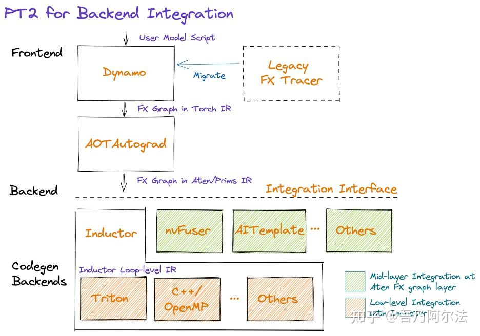
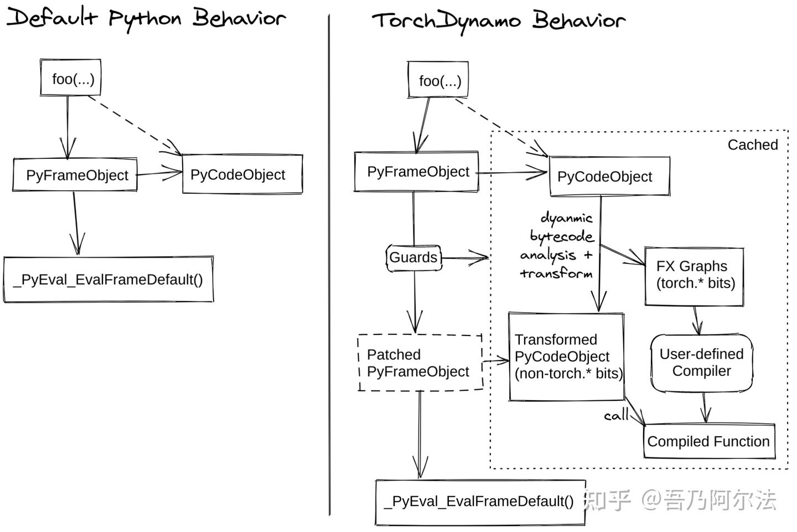

# TorchDynamo 원리 이해

> 원문: https://zhuanlan.zhihu.com/p/630933479

## 소개

PyTorch 2.0의 목표는 더 빠르고, 더 Pythonic하며, 일관되게 동적 특성을 지원하는 것입니다. 이를 위해 PyTorch 2.0은 `torch.compile`을 도입하여 PyTorch의 고질적인 성능 문제를 해결하는 동시에 C++로 구현되어 있던 부분을 Python 영역으로 끌어올립니다. PyTorch 2.0은 네 가지 컴포넌트를 활용합니다: **TorchDynamo, AOTAutograd, PrimTorch, TorchInductor**. 본 글은 몇 가지 간단한 사례를 통해 TorchDynamo의 사용법과 구현 원리를 설명합니다.



**TorchDynamo의 역할은 PyTorch 애플리케이션으로부터 계산 그래프를 캡처하는 것**입니다. TorchScript나 TorchFX에 비해 TorchDynamo는 더 유연하고 신뢰성이 높습니다. TorchScript를 사용해본 분들은 알겠지만, `jit.trace`나 `jit.script`로 모델을 TorchScript로 변환하는 과정은 난관의 연속이고 소스 코드를 대량 수정해야 하는 경우가 많습니다. TorchFX는 계산 그래프를 캡처할 때 지원되지 않는 연산자를 만나면 바로 에러를 발생시키는데, 가장 흔한 예가 `if` 문입니다. TorchDynamo는 TorchScript와 TorchFX의 단점을 극복하여 사용이 극도로 편리하며, 사용자 경험이 두 컴파일러에 비해 크게 향상되었습니다. TorchInductor 등 백엔드 컴파일러와 조합하면, TorchDynamo로 캡처한 계산 그래프는 몇 줄의 코드 수정만으로도 괜찮은 성능 향상을 얻을 수 있습니다.

## 사용법

TorchDynamo는 `torch.compile()` 또는 `torch._dynamo.optimize()`로 매우 간단하게 사용할 수 있으며, `backend`로 `'inductor'`, `'eager'`, 또는 사용자 정의 Python 함수를 graph compiler로 지정할 수 있습니다. 아래 코드에서는 사용자 정의 Python 함수 `my_compiler`를 컴파일러로 사용합니다.

```python
from typing import List
import torch

def my_compiler(gm: torch.fx.GraphModule, example_inputs: List[torch.Tensor]):
    print(">>> my_compiler() invoked:")
    print(">>> FX graph:")
    gm.graph.print_tabular()
    print(f">>> Code:\n{gm.code}")
    return gm.forward  # return a python callable

@torch.compile(backend=my_compiler)
def foo(x, y):
    return (x + y) * x

if __name__ == "__main__":
    a, b = torch.randn(10), torch.ones(10)
    foo(a, b)
```

위 코드를 실행하면, TorchDynamo가 `foo()` 함수에서 계산 그래프 하나를 캡처한 것을 볼 수 있습니다. TorchDynamo는 캡처한 계산 그래프를 **FX Graph** 형태로 저장합니다.

```
>>> FX graph:
opcode         name    target                   args       kwargs
-------------  ------  -----------------------  ---------  --------
placeholder    x       x                        ()         {}
placeholder    y       y                        ()         {}
call_function  add     <built-in function add>  (x, y)     {}
call_function  mul     <built-in function mul>  (add, x)   {}
output         output  output                   ((mul,),)  {}

>>> Code:
def forward(self, x : torch.Tensor, y : torch.Tensor):
    add = x + y;  y = None
    mul = add * x;  add = x = None
    return (mul,)
```

## Python 바이트코드

**TorchDynamo가 계산 그래프를 캡처하는 것은 Python 바이트코드를 번역하는 과정에서 이루어집니다**. Python 함수는 실행 전에 Python 가상 머신에 의해 바이트코드(bytecode)로 컴파일되며, 각 Python 함수 인스턴스는 하나의 frame에 대응합니다. frame에는 해당 함수 실행에 필요한 전역 변수, 지역 변수, 바이트코드 등이 저장됩니다.

Python 가상 머신, 바이트코드, TorchDynamo의 동작을 쉽게 이해하기 위해 `hello()` 함수로 Python 바이트코드의 동작을 간단히 살펴봅니다. `dis` 패키지로 Python 함수의 바이트코드를 확인할 수 있습니다.

```python
import dis

def hello():
    print("Hello, world!")

for k in ["co_names", "co_varnames", "co_consts"]:
    print(k, getattr(hello.__code__, k))
print(dis.dis(hello))
```

실행 결과는 다음과 같습니다.

```
co_names ('print',)
co_varnames ()
co_consts (None, 'Hello, world!')

0 LOAD_GLOBAL              0 (print)
2 LOAD_CONST               1 ('Hello, world!')
4 CALL_FUNCTION            1
6 POP_TOP
8 LOAD_CONST               0 (None)
10 RETURN_VALUE
```

여기에는 6개의 Python 바이트코드가 포함되어 있으며, 각각의 기능은 다음과 같습니다.

- `LOAD_GLOBAL 0`: `f_builtins`와 `f_globals`에서 인덱스 0이 참조하는 전역 객체를 로드하여 데이터 스택에 push
- `LOAD_CONST 1`: `co_consts`에서 인덱스 1이 참조하는 상수를 로드하여 데이터 스택에 push
- `CALL_FUNCTION 1`: 스택 최상단에서 1개 원소를 pop하여 함수 인자로 사용하고, 그 다음 원소를 pop하여 호출 대상 함수로 사용한 뒤, 해당 함수를 호출하고 반환값을 데이터 스택에 push
- `POP_TOP`: 스택 최상단에서 원소 하나 제거
- `LOAD_CONST 0`: `co_consts`에서 인덱스 0이 참조하는 상수를 로드하여 데이터 스택에 push
- `RETURN_VALUE`: 스택 최상단에서 1개 원소를 pop하여 호출자에게 반환값으로 반환

**Python 가상 머신은 Stack Machine**으로, 3개의 스택을 유지합니다.

- **Call Stack**: 항목은 Python frame이며, C의 함수 호출 스택과 유사
- **Evaluation Stack (Data Stack)**: Python frame마다 하나씩 있으며, 바이트코드 실행 시의 데이터는 이 스택이 관리. 일반적인 Register Machine과는 다름
- **Block Stack**: Python frame마다 하나씩 있으며, 루프·`try/except`·`with` 문 등 Python의 제어 구조를 추적. 이런 구조 진입/종료 시 대응 항목이 push/pop됨. Block stack 덕분에 Python은 언제든 현재 활성 block을 알 수 있고, `continue`와 `break`는 현재 활성 block에 영향을 줌

더 자세한 Python 바이트코드와 가상 머신 내용은 `_PyEval_EvalFrameDefault`를 참고하세요.

## 구현 원리

TorchDynamo의 **컴파일은 함수가 실행되기 직전에 일어나는** JIT 컴파일러입니다. Python이 함수를 실행하려는 시점에 TorchDynamo가 바이트코드 번역을 시작하고 계산 그래프를 캡처합니다. Python 가상 머신(PVM)에는 `_PyEval_EvalFrameDefault`라는 매우 중요한 함수가 있는데, 이 함수는 PVM에서 컴파일된 바이트코드를 한 줄씩 실행합니다. TorchDynamo의 진입점은 **PEP-523**이 제공하는 CPython Frame Evaluation API입니다. 이 API 덕분에 사용자는 **콜백 함수(callback function)** 를 통해 바이트코드를 가져올 수 있으며, 수정한 바이트코드를 인터프리터에 돌려주어 실행하게 하거나 미리 컴파일해둔 목적 코드를 실행하도록 할 수 있습니다. 즉 Python 안에서 **JIT 컴파일러** 기능을 구현할 수 있습니다. TorchDynamo는 바로 이 PEP-523을 통해 TorchDynamo의 핵심 로직을 Python 가상 머신에 주입하여, 함수가 실행되기 직전에 바이트코드를 가져옵니다.

아래 그림은 TorchDynamo의 핵심 원리를 보여줍니다.



**TorchDynamo는 Python 가상 머신 시뮬레이터를 구현하고, Python 바이트코드 실행을 시뮬레이션하는 과정에서 대응하는 계산 그래프를 구축합니다**. 여전히 `foo()`를 예로 들면:

```python
@torch.compile(backend=my_compiler)
def foo(x, y):
    return (x + y) * x
```

`foo()`에 대응하는 바이트코드는 아래와 같습니다. TorchDynamo는 `BINARY_ADD`와 `BINARY_MULTIPLY`를 번역할 때 FX Graph에 `operator.add`와 `operator.mul` 두 개의 FX Node를 생성하여 최종적으로 완전한 계산 그래프를 형성합니다.

```
0 LOAD_FAST                0 (x)
 2 LOAD_FAST                1 (y)
 4 BINARY_ADD
 6 LOAD_FAST                0 (x)
 8 BINARY_MULTIPLY
10 RETURN_VALUE
```

TorchDynamo가 캡처한 계산 그래프가 다음 실행 시에도 여전히 유효한지 검증하기 위해, TorchDynamo는 컴파일된 함수에 대해 `Guard`를 생성합니다. `Guard`로부터 만들어지는 Python 실행 가능 함수 `check_fn`은 TorchDynamo에서 **컴파일된 함수의 입력 속성이 변했는지 검사하는 역할**을 합니다. 변하지 않았다면 이전에 컴파일된 함수를 재사용할 수 있고, 그렇지 않으면 현재 입력에 대해 이전 컴파일이 무효이므로 **재컴파일(graph recompilation)** 이 필요합니다. `TENSOR_MATCH`는 텐서 정보를 검사하는 `Guard`로, 기본 설정에서는 입력 텐서의 device, shape, stride 등의 속성 변화 여부를 주로 확인합니다.

`foo()` 함수에 대응하는 `check_fn`은 아래와 같으며, C++ 함수를 호출해 텐서 `x`와 `y`의 정보 변화 여부를 검사하고 이전 컴파일 결과 재사용 여부를 결정합니다.

```
GUARDS ___guarded_code.valid and ___check_tensors(x, y)
```

**TorchDynamo가 컴파일한 함수는 frame의 cache에 저장**되어, 동일한 함수와 동일한 입력에 대해 재컴파일을 피합니다. 기본 cache 크기는 64로, 동일한 Python 함수에 대해 입력은 최대 64가지 변형을 가질 수 있으며, 이 한도를 초과하면 TorchDynamo는 해당 함수를 더 이상 컴파일하지 않습니다.

## Graph Break

TorchDynamo가 모든 함수를 하나의 계산 그래프로 캡처할 수 있는 것은 아닙니다. **TorchDynamo는 지원할 수 없는 연산자를 만나면 graph break를 만들어, 계산 그래프를 지원 가능한 여러 서브그래프로 분할하고, 처리할 수 없는 연산자는 Python 인터프리터에 맡겨 실행하게 합니다**. 가장 흔한 graph break 사례는 텐서 값을 `if` 조건으로 사용하는 경우입니다. 아래 함수를 예로 봅시다.

```python
def toy_example(a, b):
    x = a / (torch.abs(a) + 1)
    if b.sum() < 0:
        b = b * -1
    return x * b
```

TorchDynamo는 `toy_example()`을 3개의 서브그래프로 분할하고, 처리할 수 없는 `if` 문은 Python 인터프리터가 실행합니다. 컴파일 후 대응하는 Python 함수는 다음과 같습니다. 컴파일된 서브그래프 `__compiled_fn_0()`을 실행한 후 프로그램은 Python 인터프리터로 돌아가고, `if` 문의 결과에 따라 아직 컴파일되지 않은 서브그래프 `__resume_at_30_1()` 또는 `__resume_at_38_2()`를 선택해 실행합니다.

```python
def compiled_toy_example(a, b):
    x, lt = __compiled_fn_0(a, b)
    if lt:
        return __resume_at_30_1(b, x)
    else:
        return __resume_at_38_2(b, x)
```

세 개의 함수는 다음과 같습니다.

- `__compiled_fn_0()`: TorchDynamo가 컴파일한 서브그래프로, `if` 문 이전 부분에 해당
```python
def __compiled_fn_0(a, b):
    x = a / (torch.abs(a) + 1)
    return b.sum() < 0
```

- `__resume_at_30_1()`: TorchDynamo가 아직 컴파일하지 않은 서브그래프로, `if` 분기에 해당 (TorchDynamo는 바이트코드를 직접 조작하지만, 설명을 위해 여기서는 goto/label을 지원한다고 가정한 Python 의사 코드로 표현):
```python
# goto와 label이 있는 의사 Python 코드
def __resume_at_30_1(b, x):
    goto if_next
    x = a / (torch.abs(a) + 1)
    if b.sum() < 0:
        label if_next
        b = b * -1
    return x * b
```

이 함수는 최초 실행 시 TorchDynamo에 의해 캡처되고 컴파일됩니다.

- `__resume_at_38_2()`: TorchDynamo가 아직 컴파일하지 않은 서브그래프로, `else` 분기에 해당. 이 함수 또한 최초 실행 시 캡처·컴파일됩니다.
```python
# goto와 label이 있는 의사 Python 코드
def __resume_at_38_2(b, x):
    goto if_jump
    x = a / (torch.abs(a) + 1)
    if b.sum() < 0:
        b = b * -1
    label if_jump
    return x * b
```

## Dynamic Shape

기본적으로 TorchDynamo는 **static shape** 모드로 동작합니다. 계산 그래프를 캡처할 때 텐서의 `shape`와 `stride`가 특화되어 `Guard`에 기록됩니다. 그래프 캡처가 끝나면 해당 `Guard`에 대응하는 `check_fn`이 생성되며, 이 함수는 **해당 계산 그래프의 입력 정보가 변했는지 검사**합니다. 변하지 않았다면 이미 컴파일된 그래프를 재사용하고, 변했다면 재캡처·재컴파일(graph recompilation)합니다.

환경 변수 `TORCHDYNAMO_DYNAMIC_SHAPES`를 1로 설정하면 TorchDynamo는 **dynamic shape** 모드로 그래프를 캡처합니다. 이 경우 텐서의 `shape`와 `stride`는 특화되지 않고 `Guard`에도 기록되지 않으며, 생성되는 `check_fn`도 `shape`/`stride`를 검사하지 않습니다. 따라서 서로 다른 `shape`/`stride` 텐서로 컴파일된 계산 그래프를 실행해도 재캡처와 재컴파일이 일어나지 않습니다.

아래 코드에서 `test()`는 `toy_example()`을 두 번 호출하며, 두 호출 사이에 tensor shape가 다르므로 재컴파일이 트리거됩니다.

```python
@torch.compile(backend=my_compiler)
def toy_example(x):
    x = x / (torch.abs(x) + 1)
    return x

def test():
    x = torch.randn(10)
    toy_example(x)
    x = torch.randn(20)
    toy_example(x)
```

`torch.compile()`로 `toy_example()`을 컴파일해 실행하면, 두 번 컴파일이 트리거되는 것을 볼 수 있습니다. 두 번째 호출 시 텐서 `x`가 `Guard` 검사를 통과하지 못했기 때문입니다.

## 루프 언롤링

**TorchDynamo는 Python 루프를 언롤링된(unrolled) 계산 그래프로 캡처하며, 캡처된 그래프에 루프 자체는 포함되지 않습니다**. 아래 코드의 `for` 루프는 4번 반복하며 매번 한 번의 곱셈을 수행합니다.

```python
@torch.compile
def toy_example(x, n):
    for i in range(1, n+1):
        x = x * i
    return x

def test():
    x = torch.randn(10)
    toy_example(x, 4)
```

캡처된 계산 그래프에 대응하는 Python 함수는 다음과 같습니다.

```python
def forward(self, x : torch.Tensor):
    mul = x * 1;  x = None
    mul_1 = mul * 2;  mul = None
    mul_2 = mul_1 * 3;  mul_1 = None
    mul_3 = mul_2 * 4;  mul_2 = None
    return (mul_3,)
```

원리는 TorchDynamo가 Python 가상 머신 시뮬레이터 안에서 `FOR_ITER` 바이트코드를 시뮬레이션 실행하고, 각 반복에서 나타나는 연산을 캡처하기 때문입니다. `for` 루프 자체를 그래프로 캡처하지 않습니다.

## 함수 인라이닝

**사용자 함수 호출에 대해 TorchDynamo는 호출된 함수를 인라이닝(inline)하여 더 큰 계산 그래프를 생성하려 합니다. 그러나 호출된 함수 내부에 graph break가 있으면 인라이닝에 실패하고, 이 경우 호출 스택의 모든 함수에 graph break가 발생합니다.**

아래 코드에서 `test()`는 재귀 함수 `toy_example()`을 호출합니다.

```python
@torch.compile
def toy_example(x, n):
    if n > 0:
        return toy_example(x, n-1) * n
    else:
        return x

def test():
    x = torch.randn(10)
    toy_example(x, 4)
```

TorchDynamo가 `toy_example(x, 4)`의 그래프를 캡처할 때 `toy_example(x, 3)`의 그래프를 인라이닝하려 시도하고, 이런 식으로 `toy_example(x, 0)`까지 성공적으로 인라이닝합니다. 최종적으로 함수 호출이 전개된 하나의 큰 계산 그래프가 생성됩니다.

```python
def forward(self, x : torch.Tensor):
    mul = x * 1;  x = None
    mul_1 = mul * 2;  mul = None
    mul_2 = mul_1 * 3;  mul_1 = None
    mul_3 = mul_2 * 4;  mul_2 = None
    return (mul_3,)
```

반면 아래 코드에서 사용자 함수 `baz()`는 TorchDynamo가 인라이닝할 수 없습니다. `if` 조건이 텐서 값에 의존하여 런타임에서만 어느 분기를 실행할지 결정할 수 있기 때문에 graph break가 발생합니다. 이 graph break는 호출자인 `bar()`와 `foo()`에도 graph break를 유발하여, 결국 총 7개의 계산 그래프가 생성되고 그중 `baz()`에 3개가 포함됩니다.

```python
def baz(x):
    return -x if x > 0 else x - 1

def bar(x):
    return x * baz(x - 1)

@torch.compile
def foo(x):
    return x * bar(2 * x)

def test():
    x = torch.tensor([4])
    foo(x)
```

TorchDynamo는 `CALL_FUNCTION` 바이트코드를 통해 함수 인라이닝을 구현합니다. 여기서 사용자 함수 호출을 식별하고 인라이닝을 시도하며, 실패하면 호출자 상태를 복원하고 graph break를 생성합니다. 서브그래프 컴파일이 끝나면 인터프리터로 돌아가 자식 함수 호출을 실행합니다.

## DistributedDataParallel

데이터 병렬로 멀티 GPU에서 딥러닝 모델을 학습할 때는 allreduce를 호출해 모든 GPU의 그래디언트를 리듀스해야 합니다. 딥러닝 프레임워크는 일반적으로 일부 파라미터의 그래디언트를 하나의 bucket에 묶고, 해당 bucket의 그래디언트가 모두 준비되면 allreduce로 리듀스를 수행합니다.

TorchDynamo가 캡처한 계산 그래프에는 DDP의 hook이나 allreduce 노드가 포함되지 않습니다. 모델 전체가 하나의 그래프로 캡처되면 모든 allreduce는 역전파가 완전히 끝날 때까지 기다려야 트리거되므로 allreduce와 역전파를 오버랩할 수 없습니다. **하나의 bucket 내 그래디언트가 준비되는 즉시 allreduce 통신을 호출할 수 있도록, TorchDynamo는 각 bucket 경계에서 graph break를 도입합니다.**

아래 코드는 EfficientNet-B0를 초기화합니다(파라미터 5,288,548개). 설명을 위해 DDP의 bucket 크기를 4 MB로 지정하여 그래디언트를 5개 bucket으로 나눕니다.

```python
#!/usr/bin/env python

# Run with: torchrun --nnodes=1 --nproc_per_node=1 test.py

import os
import torch
import torch.distributed as dist
import torch.nn as nn
import torch.optim as optim

from torch.nn.parallel import DistributedDataParallel as DDP

def run_epoch(model, loss_fn, optimizer, inputs, labels):
    for i in range(3):
        print(f">>> Iteration {i}")
        outputs = model(inputs)
        loss_fn(outputs, labels).backward()
        optimizer.step()

def demo_basic():
    dist.init_process_group("nccl")
    rank = dist.get_rank()
    print(f"Start running basic DDP example on rank {rank}.")

    # create model and move it to GPU with id rank
    device_id = rank % torch.cuda.device_count()
    efficientnet = torch.hub.load(
        "NVIDIA/DeepLearningExamples:torchhub",
        "nvidia_efficientnet_b0",
        pretrained=False,
    )
    model = efficientnet.to(device_id, memory_format=torch.channels_last)
    model = DDP(model, device_ids=[device_id], bucket_cap_mb=4)
    loss_fn = nn.MSELoss()
    optimizer = optim.Adam(model.parameters(), lr=0.001)
    optimizer.zero_grad()

    inputs = torch.randn((4, 3, 224, 224), device="cuda")
    inputs = inputs.to(memory_format=torch.channels_last)
    labels = torch.randn(4, 1000).to(device_id)

    num_params = sum(p.numel() for p in model.parameters() if p.requires_grad)
    print(f">>> Parameters: {num_params}")

    model = torch.compile(model, backend="eager")
    run_epoch(model, loss_fn, optimizer, inputs, labels)

if __name__ == "__main__":
    demo_basic()
```

TorchDynamo는 위 EfficientNet-B0를 5개의 계산 그래프로 캡처합니다.

```
graph():
    %x : torch.Tensor [#users=1] = placeholder[target=x]
    %submod_0 : [#users=1] = call_module[target=compiled_submod_0](args = (%x,), kwargs = {})
    %submod_1 : [#users=1] = call_module[target=compiled_submod_1](args = (%submod_0,), kwargs = {})
    %submod_2 : [#users=1] = call_module[target=compiled_submod_2](args = (%submod_1,), kwargs = {})
    %submod_3 : [#users=1] = call_module[target=compiled_submod_3](args = (%submod_2,), kwargs = {})
    %submod_4 : [#users=1] = call_module[target=compiled_submod_4](args = (%submod_3,), kwargs = {})
    return (submod_4,)
```

## 디버깅

TorchDynamo 사용 중 문제가 생겼을 때, 아래 코드 조각은 디버깅을 돕는 로그를 출력합니다.

```python
import os
import logging
import torch._dynamo
torch._dynamo.config.log_level = logging.DEBUG
torch._dynamo.config.verbose = True
torch._dynamo.config.output_code = True
os.environ["TORCHDYNAMO_PRINT_GUARDS"] = "1"
```

이외에도 `eager` 백엔드를 사용하여 TorchDynamo 내부의 문제를 검증할 수 있습니다.

```python
model = torch.compile(model, backend="eager")
```

캡처된 계산 그래프에서 어떤 코드가 graph break를 일으켰는지 확인하려면 `dynamo.explain`을 사용할 수 있습니다.

```python
import torch
import torch._dynamo as dynamo

def toy_example(a, b):
    x = a / (torch.abs(a) + 1)
    print("woo")
    if b.sum() < 0:
        b = b * -1
    return x * b

explanation, out_guards, graphs, ops_per_graph = dynamo.explain(
    toy_example, torch.randn(10), torch.randn(10))
```

## 정리

- TorchDynamo의 역할은 PyTorch 프로그램에서 계산 그래프를 캡처하는 것
- TorchDynamo는 JIT 컴파일러로, PEP-523을 통해 실행 직전의 Python 함수 바이트코드를 얻고, 바이트코드를 번역하는 과정에서 FX Graph를 구축
- 컴파일된 각 frame은 cache를 가지며, 동일한 함수에 대해 서로 다른 입력 속성으로 컴파일된 버전들이 cache에 저장됨
- Guard는 이미 컴파일된 함수를 재사용할 수 있는지 판단하며, 입력 데이터 속성의 변화 여부를 검사
- 지원하지 않는 연산자를 만나면 TorchDynamo는 graph break로 계산 그래프를 서브그래프로 분할하고, 지원하지 않는 연산자는 Python 인터프리터가 실행
- 루프는 TorchDynamo의 그래프 캡처 시 언롤링됨
- TorchDynamo는 호출된 함수 인라이닝을 시도하여, 성공하면 큰 그래프 하나를 생성하고, 실패하면 호출자에 graph break를 생성
- TorchDynamo는 DDP bucket 경계에 graph break를 도입하여 allreduce가 역전파와 오버랩될 수 있도록 보장
