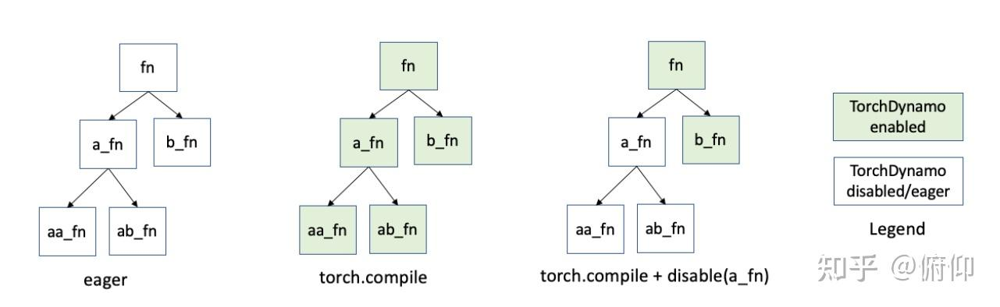

# torch.compile 기본 원리와 사용 방법 이해하기

> 원문: https://zhuanlan.zhihu.com/p/12712224407

본 글은 torch.compile의 사용 방법, 기본 기술 소개, 기존 PyTorch 컴파일러 대비 장점을 소개합니다.

**대상 독자:**
- torch.compile을 사용해본 적 없고 개념과 원리에 대한 기본 이해를 원하는 초급자
- 블랙박스 방식으로 torch.compile의 혜택을 받았지만 잘 이해하지 못하는 초급자
- 심화 사용법을 더 전면적으로 이해하고 싶은 중급자

**본 글에서 다루는 내용:**
- TC의 기본 사용법 및 중첩 상황 처리
- TC의 최적 사용 방식과 기본 기술 소개
- TC와 TorchScript, Fx Tracing 등 선배 컴파일러와의 비교
- TC 심화 파라미터 소개

torch.compile(이하 TC)은 PyTorch 코드를 가속하는 방법으로, JIT 컴파일 방식으로 코드를 더 빠르게 실행하며 코드 변경을 최소화합니다.

## 환경 설정

Python modules:
- `torch >= 2.0`
- `torchvision`
- `numpy`
- `scipy`
- `tabulate`

CUDA device check:
```python
import torch
import warnings

gpu_ok = False
if torch.cuda.is_available():
    device_cap = torch.cuda.get_device_capability()
    if device_cap in ((7, 0), (8, 0), (9, 0)):
        gpu_ok = True

if not gpu_ok:
    warnings.warn(
        "GPU is not NVIDIA V100, A100, or H100. Speedup numbers may be lower "
        "than expected."
    )
```

### 1. TC의 기본 사용

모든 Python 함수나 PyTorch module을 TC에 파라미터로 전달하여 최적화와 가속을 얻을 수 있습니다. PyTorch는 최적화된 함수로 원본 함수를 대체합니다.

TC의 사용 방식은 두 가지입니다: 명시적 호출과 데코레이터 사용.

직접 호출:
```python
@torch.compile
def opt_foo2(x, y):
    a = torch.sin(x)
    b = torch.cos(y)
    return a + b
```

데코레이터(decorator):
```python
t1 = torch.randn(10, 10)
t2 = torch.randn(10, 10)

@torch.compile
def opt_foo2(x, y):
    a = torch.sin(x)
    b = torch.cos(y)
    return a + b
print(opt_foo2(t1, t2))
```

TC로 PyTorch Module 인스턴스 최적화:
```python
class MyModule(torch.nn.Module):
    def __init__(self):
        super().__init__()
        self.lin = torch.nn.Linear(100, 10)

    def forward(self, x):
        return torch.nn.functional.relu(self.lin(x))

mod = MyModule()
opt_mod = torch.compile(mod)
print(opt_mod(torch.randn(10, 100)))
```

### 2. TC의 중첩 호출

TC 데코레이터로 장식된 함수/Module에서 중첩된 함수/Module도 TC에 의해 컴파일되어, 하나하나 처리하는 번거로움을 줄여줍니다.

```python
def nested_function(x):
    return torch.sin(x)

@torch.compile
def outer_function(x, y):
    a = nested_function(x)
    b = torch.cos(y)
    return a + b

print(outer_function(t1, t2))
```

`torch.compiler.disable`을 통해 중첩 과정에서 특정 함수의 trace를 비활성화할 수 있습니다. 아래 예제는 함수 `complex_function`의 컴파일을 비활성화하며, 포함된 함수 호출도 비활성화됩니다.

```python
def complex_conjugate(z):
    return torch.conj(z)

@torch.compiler.disable(recursive=True)
def complex_function(real, imag):
    z = torch.complex(real, imag)
    return complex_conjugate(z)

def outer_function():
    real = torch.tensor([2, 3], dtype=torch.float32)
    imag = torch.tensor([4, 5], dtype=torch.float32)
    z = complex_function(real, imag)
    return torch.abs(z)

try:
    opt_outer_function = torch.compile(outer_function)
    print(opt_outer_function())
except Exception as e:
    print("Compilation of outer_function failed:", e)
```



`torch.compiler.disable` 함수의 파라미터 `recursive` 값에 따라 작용 범위가 달라집니다:
- `recursive=True`이면 TC가 해당 함수 및 호출하는 함수를 완전히 처리하지 않습니다.
- `recursive=False`이면 TC가 현재 함수만 처리하지 않고, 호출하는 함수는 여전히 처리합니다.

`torch.compiler.disable` 외에 TC가 컴파일할 수 없는 함수/Module을 그래프에서 제외하는 방법으로 `torch._dynamo.disallow_in_graph`가 있습니다. 제외된 함수는 그래프 실행 과정에서 break out되어 eager mode로 실행됩니다.

`torch._dynamo.disallow_in_graph`에 대응하여 `torch._dynamo.allow_in_graph`는 함수를 블랙박스 형태로 생성된 계산 그래프에 배치합니다. 이 방법을 사용한 함수는 그래프 이탈 여부, 클로저 처리 등 모든 안전 검사를 생략하므로 사용 시 주의가 필요합니다.

위 두 API의 작용 범위는 global이므로 다른 compiler backend로 전환할 때 이전에 disallow한 operator를 API로 다시 allow in graph해야 합니다.

### 3. TC의 최적 실천

TC는 target function 또는 target Module 내의 모든 함수 호출을 재귀적으로 컴파일합니다(내장 명령어/함수 및 torch 네임스페이스 내의 특정 함수 제외).

최적 실천:
- 가능한 한 함수/Module의 최상위 호출을 entrypoint로 재귀적으로 컴파일하고, 특정 함수에 오류가 발생하면 `torch.compiler.disable`로 비활성화
- 함수나 Module을 현재 함수/Module에 통합할 때 TC로 사전 컴파일 시도하여 잠재적 문제를 조기 발견
- TC로 컴파일할 수 없는 함수나 sub-module은 비활성화 후 통합
- 복잡한 모델은 leaf function과 leaf submodule부터 컴파일 시작

### 4. TC vs 기존 컴파일러

TorchScript script, TorchScript tracing, FX tracing 대비 TC의 주요 장점:
- 원본 코드 변경 최소화
- 조건 분기 더 나은 지원
- 데이터 타입 추론 불필요, 코드에 타입 어노테이션 필요 없음
- 비-PyTorch 함수 더 나은 지원

### 5. TC의 기본 기술

**TorchDynamo**는 TC 구현을 지원하는 중요 컴포넌트 중 하나로, JIT 방식으로 임의의 Python 코드를 FX graph로 컴파일하고 FX graph를 추가 최적화합니다. TorchDynamo는 런타임에 Python 바이트코드를 분석하고 PyTorch 연산자 호출을 감지합니다.

**TorchInductor**는 TC의 또 다른 중요 컴포넌트로, FX graph를 최적화된 커널로 추가 컴파일합니다. TI는 TC의 유일한 백엔드가 아니며, TorchDynamo는 사용자가 커스텀 백엔드를 포함한 다양한 백엔드를 사용할 수 있게 합니다. 다음 예제는 커스텀 백엔드로 TD가 생성한 FX graph가 데이터 흐름을 어떻게 처리하는지 확인합니다.

```python
from typing import List
def custom_backend(gm: torch.fx.GraphModule, example_inputs: List[torch.Tensor]):
    print("custom backend called with FX graph:")
    gm.graph.print_tabular()
    return gm.forward

torch._dynamo.reset()

def bar(a, b):
    x = a / (torch.abs(a) + 1)
    if b.sum() < 0:
        b = b * -1
    return x * b

opt_bar = torch.compile(bar, backend=custom_backend)
inp1 = torch.randn(10)
inp2 = torch.randn(10)
opt_bar(inp1, inp2)
opt_bar(inp1, -inp2)
```

위 출력에 따르면, TD는 실제로 3개의 서로 다른 FX graph를 추출했으며, 각각 다음 코드에 대응합니다:

1. `x = a / (torch.abs(a) + 1)`
2. `b = b * -1; return x * b;`
3. `return x * b;`

TD가 지원하지 않는 Python 구문(예: 데이터 의존적 제어 흐름)을 만나면 계산 그래프에서 이탈하여 Python 인터프리터가 지원하지 않는 코드를 처리하게 하고, 이후 그래프 캡처를 계속합니다.

`torch._dynamo.explain()`을 사용하면 TD가 어디서 계산 그래프를 이탈했는지 확인할 수 있습니다.

TC에 `fullgraph=True` 파라미터를 추가하면, 처음 graph를 이탈해야 할 때 에러를 발생시켜 TD의 graph 이탈을 제한하고 가속을 도모할 수 있습니다.

```python
opt_bar = torch.compile(bar, fullgraph=True)
try:
    opt_bar(torch.randn(10), torch.randn(10))
except:
    tb.print_exc()
```

### 6. TC의 심화 파라미터

구체적으로 TC는 특정 범위 내의 모든 Python frame(함수 호출)을 컴파일하고 컴파일 결과를 캐시합니다. 이전 컴파일 결과가 이후 호출과 맞지 않으면 해당 frame이 여러 번 컴파일되며, 이를 "guard failure"라 합니다.

컴파일 결과의 캐시는 각 frame이 아닌 각 "코드 객체"당 하나입니다. 코드 객체는 Python 코드를 컴파일한 바이트코드로 정적 개념이고, frame은 Python 실행 프레임으로 동적 개념입니다. 동일한 Code Object에서 생성된 frame은 같은 컴파일 캐시를 공유합니다.

```python
def compile(
    model: _Optional[_Callable] = None,
    *,
    fullgraph: builtins.bool = False,
    dynamic: _Optional[builtins.bool] = None,
    backend: _Union[str, _Callable] = "inductor",
    mode: _Union[str, None] = None,
    options: _Optional[_Dict[str, _Union[str, builtins.int, builtins.bool]]] = None,
    disable: builtins.bool = False,
)
```

Args:
- **model [Callable]**: 최적화할 Module / func
- **full_graph**: 입력 model을 하나의 그래프로 캡처하도록 강제할지 여부. 불가능하면 에러 발생
- **dynamic**: 동적 shape 추적 사용 여부. 활성화 시 shape 변화로 인한 재컴파일을 최대한 방지
- **backend**: 캡처된 FX graph를 처리할 위치 지정. 기본값은 "Inductor". `torch._dynamo.list_backends()`로 모든 사용 가능 옵션 확인 가능. 커스텀 backend를 정의하여 그래프 최적화를 DIY할 수도 있음
- **mode**: 다음 모드 중 하나 지정 가능:
  - "default": 기본 모드, 성능과 오버헤드를 균형 있게 조절
  - "reduce-overhead": CUDA graph 사용, Python 레이어 오버헤드 감소, 대가로 GPU 메모리 사용 증가
  - "max-autotune": Triton 또는 템플릿 기반 matmul 활용, GPU 실행 시 기본으로 cuda graph 사용
  - "max-autotune-no-cudagraph": 위와 동일하나 cuda graph 미사용
- **options**: backend에 전달할 옵션 딕셔너리. `torch._inductor.list_options()`로 수용 가능 파라미터 확인
- **disable**: `True`로 설정 시 TC가 어떤 컴파일 최적화도 수행하지 않고 원본 모델을 직접 반환. 보통 테스트 목적으로 사용

## Reference
- Introduction to torch.compile
- TorchDynamo APIs for fine-grained tracing
