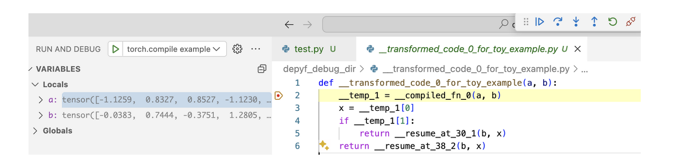
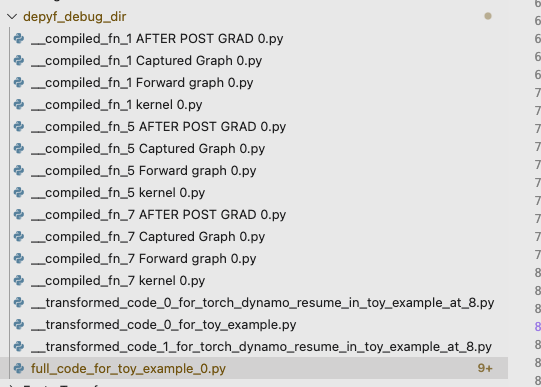
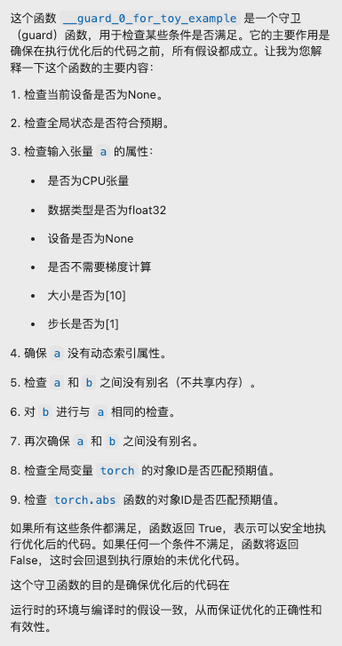
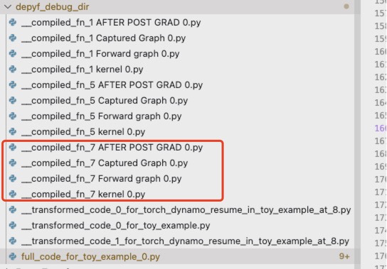

> 블로그 링크: https://pytorch.org/blog/introducing-depyf/

> 최근 `torch.compile`을 살펴보다가, 칭화대에서 `torch.compile`이 우리 코드에 어떤 최적화를 했는지 이해하는 데 도움을 주는 depyf라는 라이브러리를 만들었다는 것을 알게 되었습니다. 이 튜토리얼은 그 라이브러리를 간단히 소개하는 글이며, 앞부분은 이 튜토리얼을 번역한 것입니다. 뒷부분에서는 cursor를 이용해 depyf가 생성한 `torch.compile` 컴파일 산출물을 온전히 읽는 예제를 보여 줍니다. `torch.compile`이 최적화한 각 subgraph와 생성한 fuse kernel을 볼 수 있으니, 관심 있는 독자에게 도움이 되길 바랍니다.


# depyf 소개: torch.compile 쉽게 이해하기


PyTorch 생태계의 새 프로젝트인 depyf를 소개하게 되어 기쁩니다. depyf는 사용자가 `torch.compile`을 이해하고, 배우고, 적응하는 것을 돕기 위해 만들어졌습니다!

## 동기

`torch.compile`은 PyTorch 2.x의 초석 중 하나이며, 단 한 줄의 코드로 학습과 추론 모두에서 머신러닝 workflow를 가속할 수 있는 직접적인 경로를 제공합니다. 단순히 `@torch.compile`을 붙이는 것만으로도 코드 성능이 크게 향상될 수 있습니다. 하지만 `torch.compile`을 어디에 넣는 것이 가장 좋은지 찾는 일은 쉽지 않습니다. 최대 효율을 위해 여러 파라미터를 조정하는 복잡성까지 생각하면 더욱 그렇습니다.

`torch.compile` 기술 stack은 Dynamo, AOTAutograd, Inductor 등으로 구성되어 있으며, 학습 곡선이 가파릅니다. 이 component들은 deep learning 성능 최적화에 매우 중요하지만, 탄탄한 기초 지식이 없으면 위압적으로 느껴질 수 있습니다.

> 참고: `torch.compile` 동작 원리에 대한 입문 예시는 이 단계별 설명(https://depyf.readthedocs.io/en/latest/walk_through.html)을 참고하세요.

## 흔히 쓰는 도구: TORCH_COMPILE_DEBUG

`torch.compile`의 내부를 드러내기 위해 흔히 사용하는 방법은 `TORCH_COMPILE_DEBUG` 환경 변수를 활용하는 것입니다. 이 변수는 더 많은 정보를 제공하지만, 출력 내용을 해석하는 일은 여전히 꽤 어렵습니다.

예를 들어 다음 코드가 있다고 합시다.

```python
# test.py
import torch
from torch import _dynamo as torchdynamo
from typing import List

@torch.compile
def toy_example(a, b):
   x = a / (torch.abs(a) + 1)
   if b.sum() < 0:
       b = b * -1
   return x * b

def main():
   for _ in range(100):
       toy_example(torch.randn(10), torch.randn(10))

if __name__ == "__main__":
   main()
```

`TORCH_COMPILE_DEBUG=1 python test.py`로 실행하면 `torch_compile_debug/run_2024_02_05_23_02_45_552124-pid_9520`이라는 디렉터리가 생성되고, 그 안에는 다음 파일들이 들어 있습니다.

```shell
.
├── torchdynamo
│   └── debug.log
└── torchinductor
   ├── aot_model___0_debug.log
   ├── aot_model___10_debug.log
   ├── aot_model___11_debug.log
   ├── model__4_inference_10.1
   │   ├── fx_graph_readable.py
   │   ├── fx_graph_runnable.py
   │   ├── fx_graph_transformed.py
   │   ├── ir_post_fusion.txt
   │   ├── ir_pre_fusion.txt
   │   └── output_code.py
   ├── model__5_inference_11.2
   │   ├── fx_graph_readable.py
   │   ├── fx_graph_runnable.py
   │   ├── fx_graph_transformed.py
   │   ├── ir_post_fusion.txt
   │   ├── ir_pre_fusion.txt
   │   └── output_code.py
   └── model___9.0
       ├── fx_graph_readable.py
       ├── fx_graph_runnable.py
       ├── fx_graph_transformed.py
       ├── ir_post_fusion.txt
       ├── ir_pre_fusion.txt
       └── output_code.py
```

생성된 파일과 log는 답보다 더 많은 질문을 불러일으키곤 합니다. 개발자는 이 데이터가 무엇을 의미하고 서로 어떤 관계인지 혼란스러워합니다. `TORCH_COMPILE_DEBUG`와 관련한 흔한 질문은 다음과 같습니다.

- `model__4_inference_10.1`은 무슨 뜻인가?
- 함수는 하나뿐인데 디렉터리에는 `model__xxx.py`가 세 개 있습니다. 이들은 서로 어떻게 대응되는가?
- `debug.log`에 있는 `LOAD_GLOBAL`은 무엇인가?

## 더 나은 도구: `DEPYF`가 도와준다

이제 `depyf`가 위의 문제를 어떻게 도와주는지 보겠습니다. `depyf`를 사용하려면 `pip install depyf`를 실행하거나 프로젝트 페이지 https://github.com/thuml/depyf 에 따라 최신 버전을 설치한 뒤, main 코드를 `with depyf.prepare_debug`로 감싸면 됩니다.

```python
# test.py
import torch
from torch import _dynamo as torchdynamo
from typing import List

@torch.compile
def toy_example(a, b):
   x = a / (torch.abs(a) + 1)
   if b.sum() < 0:
       b = b * -1
   return x * b

def main():
   for _ in range(100):
       toy_example(torch.randn(10), torch.randn(10))

if __name__ == "__main__":
   import depyf
   with depyf.prepare_debug("depyf_debug_dir"):
       main()
```

`python test.py`를 실행하면 `depyf`는 `depyf_debug_dir`(`prepare_debug` 함수의 인자)라는 디렉터리를 생성합니다. 그 디렉터리 아래에는 다음 파일들이 있습니다.

```shell
.
├── __compiled_fn_0 AFTER POST GRAD 0.py
├── __compiled_fn_0 Captured Graph 0.py
├── __compiled_fn_0 Forward graph 0.py
├── __compiled_fn_0 kernel 0.py
├── __compiled_fn_3 AFTER POST GRAD 0.py
├── __compiled_fn_3 Captured Graph 0.py
├── __compiled_fn_3 Forward graph 0.py
├── __compiled_fn_3 kernel 0.py
├── __compiled_fn_4 AFTER POST GRAD 0.py
├── __compiled_fn_4 Captured Graph 0.py
├── __compiled_fn_4 Forward graph 0.py
├── __compiled_fn_4 kernel 0.py
├── __transformed_code_0_for_torch_dynamo_resume_in_toy_example_at_8.py
├── __transformed_code_0_for_toy_example.py
├── __transformed_code_1_for_torch_dynamo_resume_in_toy_example_at_8.py
└── full_code_for_toy_example_0.py
```

여기에는 분명한 장점이 두 가지 있습니다.

- 길고 이해하기 어려운 `torchdynamo/debug.log`가 사라졌습니다. 그 내용은 사람이 읽을 수 있는 source code 형태로 정리되어 `full_code_for_xxx.py`와 `_transformed_code{n}_for_xxx.py`에 표시됩니다. 주목할 점은, `depyf`의 가장 어렵고 힘든 작업이 `torchdynamo/debug.log` 안의 bytecode를 Python source code로 decompile하는 일이라는 것입니다. 덕분에 개발자는 Python 내부 구조에 휘둘리지 않아도 됩니다.
- 함수 이름과 computation graph 사이의 대응 관계가 보존됩니다. 예를 들어 `__transformed_code_0_for_toy_example.py` 안에서 `__compiled_fn_0`이라는 함수를 볼 수 있고, 즉시 그에 대응하는 computation graph가 같은 `__compiled_fn_0` prefix를 공유하는 `__compiled_fn_0_xxx`.py 안에 있다는 것을 알 수 있습니다.

`full_code_for_xxx.py`에서 시작해 관련 함수를 따라가면, 사용자는 `torch.compile`이 자신의 코드에 무엇을 했는지 명확히 이해할 수 있습니다.

## 한 가지 더: step-by-step debugging 기능

debugger로 코드를 한 줄씩 실행하는 것은 코드의 동작 방식을 이해하는 좋은 방법입니다. 하지만 `TORCH_COMPILE_DEBUG` 모드의 파일들은 사용자 참고용일 뿐, 사용자가 신경 쓰는 데이터와 함께 실행할 수 없습니다.

> 참고: 여기서 "debugging"은 문제가 있는 코드를 고치는 것이 아니라, 프로그램을 점검하고 개선하는 과정을 뜻합니다.

**`depyf`의 두드러진 특징은 `torch.compile`에 step-by-step debugging 기능을 제공할 수 있다는 점입니다. depyf가 생성하는 모든 파일은 Python interpreter 내부의 runtime code object와 연결되어 있으므로, 이 파일들에 breakpoint를 설정할 수 있습니다**. 사용법은 간단합니다. context manager `with depyf.debug()`를 하나 추가하면 됩니다.

```python
# test.py
import torch
from torch import _dynamo as torchdynamo
from typing import List

@torch.compile
def toy_example(a, b):
   x = a / (torch.abs(a) + 1)
   if b.sum() < 0:
       b = b * -1
   return x * b

def main():
   for _ in range(100):
       toy_example(torch.randn(10), torch.randn(10))

if __name__ == "__main__":
   import depyf
   with depyf.prepare_debug("depyf_debug_dir"):
       main()
   with depyf.debug():
       main()
```

주의할 점은 `torch.compile`을 debugging하는 workflow가 표준 debugging workflow와 조금 다르다는 것입니다. `torch.compile`을 사용하면 많은 코드가 **동적으로** 생성됩니다. 따라서 다음 흐름이 필요합니다.

- 프로그램을 시작합니다.
- 프로그램이 `with depyf.prepare_debug("depyf_debug_dir")`를 빠져나오면, 코드가 `depyf_debug_dir` 안에 준비됩니다.
- 프로그램이 `with depyf.debug()`에 들어가면, 내부에서 자동으로 breakpoint를 설정해 프로그램을 멈춥니다.
- `depyf_debug_dir`로 이동해 breakpoint를 설정합니다.
- 코드를 계속 실행하면 debugger가 해당 breakpoint에 도달합니다!




위 스크린샷은 실제 모습입니다. 모든 코드와 tensor 변수는 live 상태이며, 어떤 변수든 확인할 수 있고 평소 debugging workflow처럼 한 줄씩 실행할 수 있습니다. 유일한 차이는 사람이 작성한 코드가 아니라 `torch.compile`이 생성한 코드를 debugging하고 있다는 점입니다.

## 결론

`torch.compile`은 PyTorch 코드를 쉽게 가속할 수 있는 매우 귀중한 도구입니다. `torch.compile`을 더 깊이 파고들고 싶은 사람에게는, 그 잠재력을 충분히 활용하려는 목적이든 custom operation을 통합하려는 목적이든, 학습 곡선이 꽤 가파를 수 있습니다. `depyf`는 이 장벽을 낮추고, `torch.compile`을 이해하고 배우고 적응하기 위한 사용자 친화적 경험을 제공하는 것을 목표로 합니다.

직접 `depyf`를 살펴보고 그 이점을 경험해 보세요! 이 프로젝트는 open source이며 https://github.com/thuml/depyf 에서 확인할 수 있습니다. 설치도 간단해서 pip install depyf만 실행하면 됩니다. `depyf`가 모두의 `torch.compile` 개발 workflow를 개선하길 바랍니다.

## 개인 보충: cursor로 depyf code 읽기 보조하기

위 예제를 사용합니다.

```python
# test.py
import torch
from torch import _dynamo as torchdynamo
from typing import List

@torch.compile
def toy_example(a, b):
   x = a / (torch.abs(a) + 1)
   if b.sum() < 0:
       b = b * -1
   return x * b

def main():
   for _ in range(100):
       toy_example(torch.randn(10), torch.randn(10))

if __name__ == "__main__":
   main()
```

그러면 아래 결과를 순조롭게 얻을 수 있습니다.



`full_code_for_toy_example_0.py`에서부터 `torch.compile`이 우리 코드에 어떤 최적화를 했는지 파악할 수 있습니다. 이 과정에서 LLM을 사용해 코드 이해를 가속할 수도 있습니다. 예를 들어 Cursor에서 이 파일을 선택한 뒤 "이 파일 내용을 바탕으로 flow chart를 그려 줄 수 있나요?"라고 입력하면, 해당 코드에 기반해 flow chart를 생성합니다. 출력은 다음과 같습니다.

```shell
시작
  |
  v
[입력 a와 b]
  |
  v
[guard 조건 검사]
  |
  +-> guard 조건이 만족되면:
  |     |
  |     v
  |   [__transformed_code_0_for_toy_example 실행]
  |     |
  |     v
  |   [x = a / (torch.abs(a) + 1) 계산]
  |     |
  |     v
  |   [b.sum() < 0 검사]
  |     |
  |     +-> 참이면:
  |     |     |
  |     |     v
  |     |   [__resume_at_30_2 실행]
  |     |     |
  |     |     v
  |     |   [b = b * -1]
  |     |
  |     +-> 거짓이면:
  |           |
  |           v
  |         [__resume_at_38_3 실행]
  |
  +-> guard 조건이 만족되지 않으면:
        |
        v
      [원래 toy_example 함수 실행]
        |
        v
      [x = a / (torch.abs(a) + 1) 계산]
        |
        v
      [b.sum() < 0 검사]
        |
        +-> 참이면:
        |     |
        |     v
        |   [b = b * -1]
        |
        +-> 거짓이면:
              |
              v
            [b를 수정하지 않음]
  |
  v
[x * b 반환]
  |
  v
끝
```

이 flow chart는 toy_example 함수의 실행 과정을 설명합니다. 최적화된 경로와 원래 경로가 모두 포함되어 있습니다. 핵심 차이는 guard 조건을 만족하는지 여부이며, 이 조건이 최적화된 코드를 실행할지 원래 코드를 실행할지를 결정합니다. 두 경로는 최종적으로 모두 x * b를 계산해 반환합니다.

그 다음에는 `__guard_0_for_torch_dynamo_resume_in_toy_example_at_8` 함수의 역할을 물어볼 수 있습니다.



이 검사들은 모두 입력 Tensor의 meta 정보, Python object 정보, 현재 runtime environment 등을 바탕으로 판단됩니다. 위 flow chart를 통해 우리는 `torch.compile`이 무엇을 했는지 단계별로 볼 수 있습니다. 예를 들어 `__transformed_code_0_for_toy_example` 함수 안의 `__resume_at_30_2`를 봅시다.

```python
def __transformed_code_1_for_torch_dynamo_resume_in_toy_example_at_8(b, x):
    a = None # this line helps Python to generate bytecode with at least the same number of local variables as the original function
    __temp_9, = __compiled_fn_7(b, x)
    return __temp_9

# Note: if there is a transformed version below, this function might well not be executed directly. Please check the transformed version if possible.
def __resume_at_30_2(b, x):
    b = b * -1
    return x * b

def transformed___resume_at_30_2(b, x):
    __local_dict = {"b": b, "x": x}
    __global_dict = globals()
    if __guard_1_for_torch_dynamo_resume_in_toy_example_at_8(__local_dict, __global_dict):
        return __transformed_code_1_for_torch_dynamo_resume_in_toy_example_at_8(b, x)
    # Note: this function might well not be executed directly. It might well be transformed again, i.e. adding one more guards and transformed code.
    return __resume_at_30_2(b, x)

def __transformed_code_0_for_toy_example(a, b):
    __temp_2, __temp_3 = __compiled_fn_1(a, b)
    x = __temp_2
    if __temp_3:
        return __resume_at_30_2(b, x)
    return __resume_at_38_3(b, x)
```

이때 우리는 `__compiled_fn_7` 함수에 대응하는 컴파일 산출물을 보면 된다는 것을 쉽게 알 수 있습니다. 아래 그림의 빨간색 표시 부분입니다.



`_compiled_fn_7_kernel0.py` 파일을 열면 원래의 다음 코드가:

```python
def __resume_at_30_2(b, x):
    b = b * -1
    return x * b
```

하나의 kernel로 fuse되었고, 구현은 다음과 같습니다.

```python
cpp_fused_mul_0 = async_compile.cpp_pybinding(['const float*', 'const float*', 'float*'], '''
#include "/tmp/torchinductor_root/sk/cskh5dx62fglpphcrl6723dnmowdabouerrzy3dmqcngbxwfa7bv.h"
extern "C" void kernel(const float* in_ptr0,
                       const float* in_ptr1,
                       float* out_ptr0)
{
    {
        #pragma omp simd simdlen(8) 
        for(long x0=static_cast<long>(0L); x0<static_cast<long>(10L); x0+=static_cast<long>(1L))
        {
            auto tmp0 = in_ptr0[static_cast<long>(x0)];
            auto tmp1 = in_ptr1[static_cast<long>(x0)];
            auto tmp2 = static_cast<float>(-1.0);
            auto tmp3 = decltype(tmp1)(tmp1 * tmp2);
            auto tmp4 = decltype(tmp0)(tmp0 * tmp3);
            out_ptr0[static_cast<long>(x0)] = tmp4;
        }
    }
}
''')
```


CUDA 프로그램에서도 전체 흐름은 비슷합니다.

위에서는 depyf가 생성한 `torch.compile` 컴파일 산출물을 완전히 읽는 예제를 보여 주었습니다. 여러분에게 도움이 되길 바랍니다.

