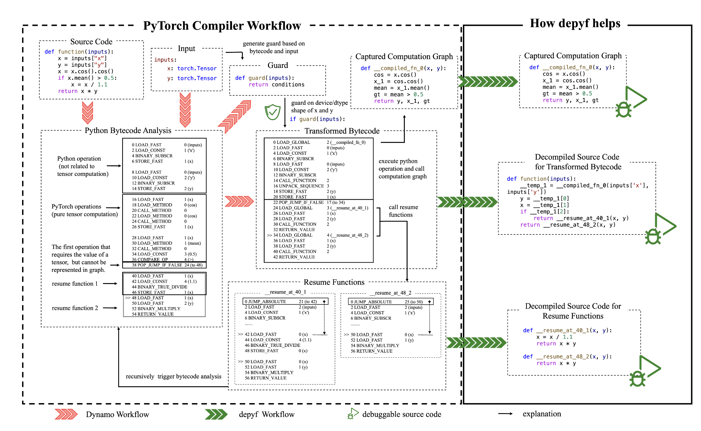
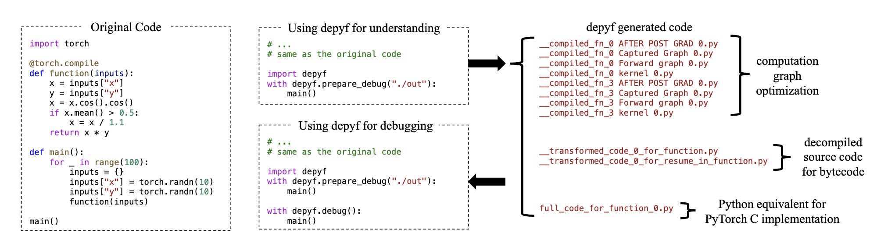
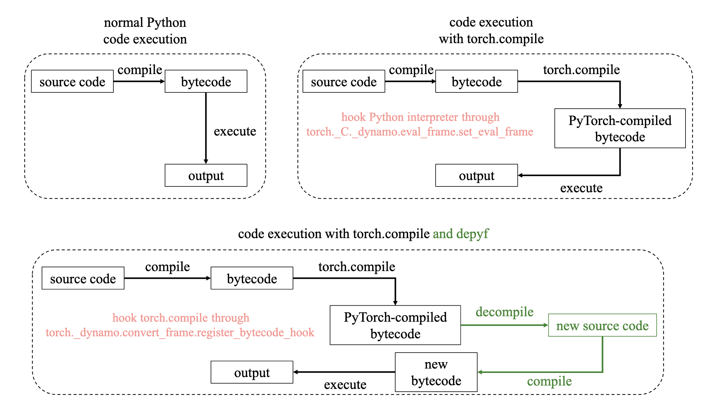

> address: https://depyf.readthedocs.io/en/latest/

# depyf overview

``depyf`` 사용법을 배우기 전에, ``depyf``가 어떻게 도움이 되는지 이해할 수 있도록 "[번역]torch.compile 상세 예제 분석 튜토리얼"을 읽는 것을 권장한다.

``depyf``는 ``torch.compile``의 두 가지 pain point를 해결하기 위해 만들어졌다.

- ``torch.compile``은 Python bytecode를 변환하지만, Python bytecode를 읽을 수 있는 developer는 드물다. 무슨 일이 일어났는지 이해하려면 머릿속에 stack machine이 있어야 할지도 모른다. ``depyf``는 transformed bytecode를 다시 Python source code로 decompile해 developer가 ``torch.compile``이 자신의 code를 어떻게 변환했는지 이해할 수 있게 한다. 이는 사용자가 자신의 code를 ``torch.compile``에 맞추고, ``torch.compile`` 친화적인 code를 작성하는 데 큰 도움을 준다.
- ``torch.compile``은 많은 function을 dynamic하게 생성하며, 이 function들은 black box처럼만 실행될 수 있다. 사용자는 code를 line by line으로 debug할 수 없다. ``depyf``는 source code를 file로 dump하고, 이 function들을 source code file과 link하여 사용자가 debugger로 function을 line by line debug할 수 있게 한다. 이는 사용자가 ``torch.compile``을 이해하고 training 중 ``NaN`` 같은 문제를 debug하는 데 큰 도움을 준다.

"torch.compile 상세 예제 분석 튜토리얼"에서 workflow를 가져오면 다음과 같다.



> 그림 설명:

- **source code**: 그림은 간단한 Python function `function(inputs)`를 보여준다. 이 function은 input의 두 tensor `x`와 `y`에 대해 `cos`, `mean` 같은 수학 operation을 수행한 뒤 `x * y`를 반환한다.
- **input**: 이 function의 input인 inputs가 `x`와 `y` 두 개의 `torch.Tensor` type tensor를 포함함을 보여준다.
- **guard function**: guard function은 input과 Python bytecode를 바탕으로 생성되며, compiler가 runtime에 tensor `x`와 `y`의 shape와 type을 검증해 recompile이 필요한지 아니면 직접 실행할 수 있는지 결정하도록 보장한다.
- **Python bytecode analysis**: 그림은 Python source code가 compiler analysis 후 생성한 bytecode를 보여준다. 여기서는 Python operation(tensor computation과 무관한 부분)과 순수 tensor computation의 PyTorch operation(cos, mean 등)을 분리해 나열한다.
- **transformed bytecode**: PyTorch compiler가 source를 bytecode로 변환한 뒤, 서로 다른 operation에 따라 대응 bytecode instruction을 생성하고 guard 조건에 따라 execution flow를 결정한다. 예를 들어 그림은 `_compiled_fn` 구현과 conditional jump operation을 보여준다.
- **resume functions**: 어떤 operation이 필요로 하는 조건이 만족되지 않을 때, 예를 들어 어떤 tensor value를 다시 계산해야 할 때 compiler는 resume function을 trigger한다. 이 resume function은 필요한 computation을 계속할 수 있고 bytecode analysis를 recursive하게 trigger한다.
- **execution workflow**: 마지막으로 원래 bytecode instruction에서 guard 조건, tensor computation graph, resume function 등 일련의 operation을 거쳐 최종 execution bytecode flow가 어떻게 형성되는지 보여준다.

> 참고: bytecode 뒤에는 대응하는 원래 Python code가 표시되어 있다.

``depyf``는 다음을 돕는다.

- 위 workflow의 source code description을 제공해 사용자가 쉽게 이해할 수 있게 한다. 실제 workflow는 C language와 CPython interpreter 내부에서 발생하지만, 사용자가 쉽게 이해할 수 있도록 workflow의 Python source code description을 제공한다.
- transformed bytecode와 Resume Functions의 source code를 생성한다.
- graph computation function을 disk 위의 code와 link하여 debugger가 code를 line by line 실행할 수 있게 한다.

``depyf``의 주요 사용법은 두 context manager와 관련되며, debugger로 script를 시작하는 것을 권장한다.

```python

import torch

@torch.compile
def function(inputs):
    x = inputs["x"]
    y = inputs["y"]
    x = x.cos().cos()
    if x.mean() > 0.5:
        x = x / 1.1
    return x * y

shape_10_inputs = {"x": torch.randn(10, requires_grad=True), "y": torch.randn(10, requires_grad=True)}
shape_8_inputs = {"x": torch.randn(8, requires_grad=True), "y": torch.randn(8, requires_grad=True)}

import depyf
with depyf.prepare_debug("./debug_dir"):
    # warmup
    for i in range(100):
        output = function(shape_10_inputs)
        output = function(shape_8_inputs)
# the program will pause here for you to set breakpoints
# then you can hit breakpoints when running the function
with depyf.debug():
    output = function(shape_10_inputs)
```

첫 번째 context manager인 ``depyf.prepare_debug()``는 모든 source code를 dump할 directory path를 받는다. 이 context manager 안에서는 PyTorch의 모든 internal detail이 ``depyf``에 hook되며, 필요한 source code를 대신 dump한다.

두 번째 context manager인 ``depyf.debug()``는 parameter가 없다. 새 compile entry만 비활성화한다. 이 context manager에 들어가면 program이 pause되고, 지정한 directory, 이 예에서는 ``"./debug_dir"`` 아래의 모든 source code를 둘러볼 수 있다. entry file은 ``full_code_for_xxx.py``다. 이 file들에 breakpoint를 설정할 수 있다. 가장 중요한 점은 이 context manager 아래에서 설정한 breakpoint가 hit될 수 있다는 것이다. code를 line by line으로 살펴보며 가능한 ``NaN`` value를 debug하거나 code에서 무슨 일이 일어나는지 이해할 수 있다.

아래 그림은 ``depyf``의 두 가지 typical usage를 보여주고, 생성된 모든 file을 나열한다.




## API reference

### ``torch.compile`` 이해와 debug

> 아래 function을 사용하기 전에 "torch.compile 상세 예제 분석 튜토리얼"을 읽고 `torch.compile`에 대한 기본 이해를 갖는 것을 권장한다.

#### `depyf.prepare_debug`

`torch.compile` debug 정보를 dump하기 위한 context manager다.
``torch.compile``을 적용하는 code가 아니라, 실제 compile을 trigger하는 code를 감싸야 한다.

예시:

```python
import torch

@torch.compile
def toy_example(a, b):
    x = a / (torch.abs(a) + 1)
    if b.sum() < 0:
        b = b * -1
    return x * b

def main():
    for _ in range(100):
        toy_example(torch.randn(10), torch.randn(10))

if __name__ == "__main__":
    # main()
    # surround the code you want to run inside `with depyf.prepare_debug`
    import depyf
    with depyf.prepare_debug("./dump_src_dir"):
        main()
```

code를 실행하면 directory ``dump_src_dir``에서 dump된 정보를 찾을 수 있다. 세부 정보는 다음처럼 구성된다.

- ``full_code_for_xxx.py`` 는 torch.compile을 사용하는 각 function용이다.
- ``__transformed_code_for_xxx.py`` 는 각 graph와 관련된 Python code용이다.
- ``__transformed_code_for_xxx.py.xxx_bytecode`` 는 Python bytecode용이다. dump된 code object이며 ``dill.load(open("/path/to/file", "wb"))``로 load할 수 있다. load function이 transformers 같은 module을 import할 수 있다는 점에 주의하라. 이 module들이 설치되어 있는지 확인하라.
- ``__compiled_fn_xxx.py`` 는 각 computation graph와 그 optimization용이다.
    - ``Captured Graph``: 간단한 forward computation graph
    - ``Joint Graph``: AOTAutograd의 joint forward-backward graph
    - ``Forward Graph``: AOTAutograd의 forward graph
    - ``Backward Graph``: AOTAutograd의 backward graph
    - ``kernel xxx``: Inductor의 compiled CPU/GPU kernel wrapper

parameter:

- ``dump_src_dir``: source code를 dump할 directory
- ``clean_wild_fx_code``: 인식되지 않은 compiled function 부분에 있는 wild fx code를 정리할지 여부다. 보통 PyTorch 내부에서 사용된다.
- ``log_bytecode``: bytecode(original bytecode, Dynamo의 transformed bytecode, decompile 후 다시 compile된 bytecode)를 기록할지 여부다.

#### `depyf.debug`

compiled code를 debug하기 위한 context manager다. 본질적으로 breakpoint를 설정해 program을 pause하고, `depyf.prepare_debug()`의 `dump_src_dir` parameter 안에서 `full_code_for_` prefix가 붙은 file의 complete source code를 검사할 수 있게 한다. 그리고 function name에 따라 별도의 `__transformed_code_` file에 breakpoint를 설정할 수 있게 한다. 그런 다음 debug를 계속하면 된다.

### 일반 Python bytecode/function decompile

#### `depyf.decompile`

어떤 callable object나 code object든 Python source code로 decompile한다.
이는 ``torch.compile`` 또는 ``dataclasses``처럼 dynamic하게 생성된 code에 특히 유용하다.

사용 예시:

```python
from dataclasses import dataclass
@dataclass
class Data:
    x: int
    y: float

import depyf
print(depyf.decompile(Data.__init__))
print(depyf.decompile(Data.__eq__))
```

output:

```python
def __init__(self, x, y):
    self.x = x
    self.y = y
    return None

def __eq__(self, other):
    if other.__class__ is self.__class__:
        return (self.x, self.y) == (other.x, other.y)
    return NotImplemented
```

output source code는 function과 semantic하게 equivalent하지만 syntax는 같지 않다. Python code에서 숨겨진 많은 detail을 자세히 추가한다. 예를 들어 위 ``__init__``의 output code는 ``None``을 명시적으로 반환하는데, 일반적으로 이것은 생략된다.

또 다른 detail은 type이 다를 때 ``__eq__``의 output code가 ``NotImplemented`` exception을 raise하는 대신 ``NotImplemented``를 반환한다는 점이다. 언뜻 보면 error처럼 보인다. 하지만 이것은 실제로 올바른 behavior다. type이 다를 때 ``__eq__`` method는 ``NotImplemented``를 반환해야 하며, 그래야 다른 object가 현재 object와 비교를 시도할 수 있다. 자세한 내용은 `Python docs <https://docs.python.org/3/library/numbers.html#implementing-the-arithmetic-operations>`_를 참고하라.

### PyTorch logging 강화

#### `depyf.install`

PyTorch의 bytecode hook을 설치하고 PyTorch logging system에 통합한다.

예시:

```python
import torch
import depyf
depyf.install()
# anything with torch.compile
@torch.compile
def f(a, b):
    return a + b
f(torch.tensor(1), torch.tensor(2))
```

`export TORCH_LOGS="+bytecode"`로 bytecode log를 켜고 script를 실행한다. log에서 decompile된 source code를 볼 수 있다.

```shell
ORIGINAL BYTECODE f test.py line 5 
7           0 LOAD_FAST                0 (a)
            2 LOAD_FAST                1 (b)
            4 BINARY_ADD
            6 RETURN_VALUE


MODIFIED BYTECODE f test.py line 5 
5           0 LOAD_GLOBAL              0 (__compiled_fn_1)
            2 LOAD_FAST                0 (a)
            4 LOAD_FAST                1 (b)
            6 CALL_FUNCTION            2
            8 UNPACK_SEQUENCE          1
            10 RETURN_VALUE


possible source code:
def f(a, b):
    __temp_2, = __compiled_fn_1(a, b)
    return __temp_2

If you find the decompiled code is wrong,please submit an issue at https://github.com/thuml/depyf/issues.
```
이 hook을 제거하려면 `depyf.uninstall()`을 사용한다.

#### `depyf.uninstall`

PyTorch의 bytecode hook을 uninstall한다. `depyf.install()` 이후 호출해야 한다.

## optimization tutorial

이 tutorial에서는 ``torch.compile``로 code를 최적화하는 방법을 ``depyf`` library의 도움을 받아 보여준다.

### 예제 code

간단한 예제에서 시작하자. 이것이 최적화하려는 code다.

```python
import torch

class F(torch.nn.Module):
    def __init__(self, i):
        super().__init__()
        self.i = i

    def forward(self, x):
        return x + self.i

class Mod(torch.nn.Module):
    def __init__(self, n: int):
        super().__init__()
        self.fs = torch.nn.ModuleList([F(i) for i in range(n)])

    @torch.compile
    def forward(self, x):
        for f in self.fs:
            x = f(x)
        return x

total_time = 0
import time

mod = Mod(100)
mod(torch.tensor([1]))  # Compile the function

x = torch.tensor([2])  # Create input tensor
start = time.time()
for i in range(10000):
    y = mod(x)
    # do something with y
end = time.time()
total_time += end - start
print(total_time)
```

이 예제는 이해를 쉽게 하기 위해 computation process를 의도적으로 단순화했다. 실제 scenario에서 function은 더 복잡한 operation을 수행한다. MacOS machine에서 compiled function을 10,000번 실행하면 약 0.7초가 걸린다. 우리의 목표는 code를 최적화해 execution time을 줄이는 것이다.

### Depyf로 code 이해하기

code를 최적화하려면 먼저 execution 과정에서 무슨 일이 일어나는지 이해해야 한다. ``depyf`` library는 bytecode를 decompile하고 insight를 제공할 수 있다. 이전 code에 두 줄을 추가할 수 있다.

```python
# Insert these lines before ``mod(torch.tensor([1]))``
import depyf
with depyf.prepare_debug("dump_src_dir/"):
    mod(torch.tensor([1]))  # Compile the function
# Remaining code as above
```

code를 실행하면 ``dump_src_dir/``라는 새 directory가 생긴다. 이 directory에는 decompile된 source code가 들어 있다. 예를 들어 ``full_code_for_forward_0.py`` file에서 다음을 찾을 수 있다.

```python
def __guard_0_for_forward(L, G, **___kwargs_ignored):
    __guard_hit = True
    __guard_hit = __guard_hit and utils_device.CURRENT_DEVICE == None
    __guard_hit = __guard_hit and ___check_global_state()
    __guard_hit = __guard_hit and check_tensor(L['x'], Tensor, DispatchKeySet(CPU, ...), ...)
    ...
    __guard_hit = __guard_hit and len(L['self'].fs) == 100
    __guard_hit = __guard_hit and L['self'].fs[0].i == 0
    __guard_hit = __guard_hit and L['self'].fs[1].i == 1
    __guard_hit = __guard_hit and L['self'].fs[2].i == 2
    ...
    return __guard_hit
```

이것은 ``torch.compile``이 생성한 code로, function input이 compiled function에 대해 여전히 valid한지 검사한다. 하지만 이런 check 중 상당수는 지나치게 보수적이다. 예를 들어 ``L['self'].fs[0].i == 0``는 ``self.fs[0].i``가 여전히 ``0``인지 확인하지만, 우리의 code는 이 값을 수정하지 않는다.

> ``torch.compile``은 just-in-time compiler다. 즉 function을 호출할 때마다 위의 모든 check가 실행되어 상당한 overhead를 도입한다.

### code 최적화

``torch.compile``은 function을 호출할 때마다 이런 check를 수행하므로 overhead가 도입된다. code를 최적화하기 위해 이런 check를 우회할 수 있다. 한 가지 방법은 ``__guard_0_for_forward`` function을 수정해 즉시 ``True``를 반환하도록 하는 것이지만, ``torch.compile``은 이를 직접 수행할 mechanism을 제공하지 않는다.

대신 ``depyf``를 사용해 check 없이 compiled function을 직접 호출할 수 있다. 아래 code는 이 방법을 보여준다.

```python

import torch
import depyf
from depyf.optimization import TorchCompileWrapperWithCustomDispatcher

class F(torch.nn.Module):
    def __init__(self, i):
        super().__init__()
        self.i = i

    def forward(self, x):
        return x + self.i

class Mod(TorchCompileWrapperWithCustomDispatcher):
    def __init__(self, n: int):
        self.fs = torch.nn.ModuleList([F(i) for i in range(n)])
        compiled_callable = torch.compile(self.forward)
        super().__init__(compiled_callable)

    def forward(self, x):
        for f in self.fs:
            x = f(x)
        return x

    def __call__(self, x):
        if len(self.compiled_codes) == 1:
            with self.dispatch_to_code(0):
                return self.forward(x)
        else:
            return self.compiled_callable(x)

total_time = 0
import time

mod = Mod(100)
mod(torch.tensor([1]))  # Compile

x = torch.tensor([2])  # Input tensor
start = time.time()
for i in range(10000):
    y = mod(x)
end = time.time()
total_time += end - start
print(total_time)
```

이 code에서는 ``TorchCompileWrapperWithCustomDispatcher`` class를 사용해 check를 우회한다. 이렇게 하면 execution time이 원래 0.7초에서 약 0.05초로 줄어든다. 이는 check가 overhead의 대부분을 차지한다는 것을 보여준다.

### 동작 원리

``TorchCompileWrapperWithCustomDispatcher``는 ``torch.compile``이 생성한 bytecode를 hijack하고 compiled function을 직접 호출해 guard check를 건너뛴다. ``__call__`` method는 이미 compiled version이 있는지 확인하고, 있으면 compiled code로 직접 dispatch한다.

### 실제 적용

이것은 computation이 매우 단순하지만 Dynamo가 도입한 overhead가 비례하지 않게 큰 extreme example이다. 실제 application에서 overhead가 보통 이렇게 심하지는 않다. 하지만 TPU에서 code를 실행하는 것 같은 high-performance 환경에서는 이런 overhead가 여전히 매우 클 수 있다. TPU code는 보통 성능에 매우 민감하며, 불필요한 check를 제거하면 큰 acceleration을 가져올 수 있다.

예를 들어 `vLLM의 TPU integration <https://github.com/vllm-project/vllm/pull/7898>`_ 에서는 이 optimization technique을 사용해 Dynamo overhead를 제거했고, TPU throughput을 4% 높였다.

### 결론

``torch.compile``로 code를 최적화하는 과정은 다음 step을 포함한다.

1. ``depyf``를 사용해 bytecode를 decompile하고 performance bottleneck을 이해한다.
2. 불필요한 check 또는 다른 overhead source를 식별하고 해결한다.
3. ``depyf``를 사용해 compiled function을 직접 호출하고, 적절한 곳에서 불필요한 step을 우회한다.

이 step을 따르면 성능을 크게 높일 수 있다. 특히 execution time이 매우 중요한 환경에서 그렇다.

## developer documentation

developer이고 codebase를 이해하고 contribute하고 싶다면 이 section이 적합하다.

### library의 전체 architecture



위 그림은 library의 전체 architecture를 보여준다.

1. 일반적으로 Python code를 실행할 때 code는 Python bytecode로 compile된 뒤 Python interpreter가 실행한다.
2. ``torch.compile``을 사용할 때 PyTorch는 function을 새 bytecode object로 compile해 실행한다. 이것은 Python interpreter에 frame evaluation function을 register함으로써 구현된다. function이 실행될 때마다 frame evaluation function이 호출된다. PyTorch는 ``torch._C._dynamo.eval_frame.set_eval_frame`` function으로 frame evaluation callback registration을 wrapping한다. PyTorch가 bytecode를 직접 생성하기 때문에 source code 정보가 없다. bytecode는 Python interpreter가 직접 실행한다.
3. ``depyf``를 PyTorch와 함께 사용할 때, ``torch._dynamo.convert_frame.register_bytecode_hook``을 통해 PyTorch에 bytecode hook을 register한다. 우리는 PyTorch team과 함께 이 bytecode hook mechanism을 설계했다. PyTorch가 function을 compile할 때마다 hook이 호출된다. hook은 bytecode를 source code로 decompile하고 disk에 dump한다. 그런 다음 source code는 새 bytecode object로 compile된다. 이 object는 PyTorch가 생성한 bytecode와 기능적으로 equivalent하지만 source code 정보를 포함한다. PyTorch는 이 새 bytecode object를 사용해 function을 실행한다. ``depyf``와 관련된 부분은 초록색으로 표시되어 있다.

이를 통해 이 library가 PyTorch와 긴밀히 통합된 Python bytecode decompiler임을 알 수 있다. 자연스럽게 두 부분으로 나뉜다.

- decompiler 부분은 ``depyf/decompiler.py`` file에 구현되어 있다. 독립 library로 Python bytecode를 decompile하는 데도 사용할 수 있다.
- PyTorch integration 부분은 ``depyf/explain/enable_debugging.py`` file에 구현되어 있다. 또한 graph compile과 transformation, code guard와 cache 등 PyTorch compiler의 다른 부분을 처리하는 많은 code를 포함한다.

상대적으로 PyTorch integration 부분은 이해하고 contribute하기 더 쉽다. 우리의 주된 목표는 ``depyf``가 PyTorch 2.2부터 시작하는 모든 이전 PyTorch version과 호환되도록 하는 것이다. 이를 달성하기 위해 test는 PyTorch nightly build version을 대상으로 실행된다. compatibility issue를 발견할 때마다 backward-compatible 방식으로 고친다. 그런 fix가 불가능하면 PyTorch team과 논의해 solution을 찾는다.

decompiler 부분은 더 도전적이다. 복잡하며 다양한 random Python implementation detail을 처리해야 한다. 다행히 우리는 official release Python version만 처리하면 되므로 task가 좀 더 관리 가능해진다. decompiler는 bug를 발견하거나 새 Python version이 release될 때만 update하면 된다.

decompiler 부분을 깊이 파고들고 싶다면 계속 읽어라.

### decompiler overview

bytecode 읽기에 익숙해지려면 먼저 다음 자료를 읽는 것을 권장한다.

- `torchdynamo deepdive <https://www.youtube.com/watch?v=egZB5Uxki0I>`_: 이 video는 torchdynamo의 motivation과 design을 설명한다. 특히 Python bytecode가 stack machine처럼 어떻게 동작하는지 언급하며, 이는 bytecode execution 방식을 이해하는 데 도움이 된다.
- `Python bytecode documentation <https://docs.python.org/3/library/dis.html>`_: 이 문서는 Python bytecode instruction을 설명한다. Python bytecode는 어떤 backward compatibility도 보장하지 않으므로 bytecode instruction은 각 Python version마다 바뀔 수 있다는 점에 주의하라. decompiler를 구현할 때 지원되는 모든 Python version을 고려해야 한다.
- `Python으로 작성한 Python interpreter <https://aosabook.org/en/500L/a-python-interpreter-written-in-python.html>`_: 이 book chapter는 Python으로 Python interpreter를 작성하는 방법을 설명한다. Python bytecode가 어떻게 실행되는지 이해하기 위한 좋은 출발점이다.

decompile 과정은 Python bytecode를 실행하면서 stack과 variable을 기록하는 방식으로 구현된다. variable의 값은 source code 표현으로 나타낸다.

예를 들어 다음 간단한 function을 생각하자.

```python
def f(a, b):
    return a + b
```

이것은 다음 bytecode를 갖는다.

```shell
0 LOAD_FAST                0 (a)
2 LOAD_FAST                1 (b)
4 BINARY_ADD
6 RETURN_VALUE
```

첫 번째 bytecode ``LOAD_FAST``를 실행할 때 우리는 variable을 stack에 load하지 않고 variable name ``"a"``를 stack에 push한다. 이것은 string으로 표현된 variable이다.

두 번째 bytecode ``LOAD_FAST``를 실행할 때도 마찬가지로 variable name ``"b"``를 stack에 push한다.

세 번째 bytecode ``BINARY_ADD``를 실행할 때, 이 instruction은 두 variable을 더하려 한다. 우리는 stack에서 두 variable을 pop하고 string concatenation ``"a + b"``를 수행한다. concatenate된 string은 다시 stack에 push된다.

마지막으로 네 번째 bytecode ``RETURN_VALUE``를 실행할 때 stack에서 string을 pop하고 앞에 ``return`` keyword를 붙인다. 그러면 decompile된 source code ``"return a + b"``를 얻는다.

bytecode를 정확히 decompile하려면 Python bytecode instruction의 semantic을 충실히 따라야 한다. 주목할 점은 `Python bytecode documentation <https://docs.python.org/3/library/dis.html>`_도 outdated이거나 부정확할 수 있다는 것이다. gold standard는 CPython source code와 Python interpreter behavior를 참고하는 것이다. `torchdynamo source code <https://github.com/pytorch/pytorch/blob/main/torch/_dynamo/symbolic_convert.py>`_도 PyTorch가 Python bytecode를 어떻게 생성하는지 이해하기 좋은 reference다.

추가 질문이 있다면 언제든 `GitHub Issues <https://github.com/thuml/depyf/issues>`_ section에서 질문하라.

## FAQ

### ``depyf``는 general Python bytecode decompiler인가?

이 package는 생성된 PyTorch bytecode를 이해하는 것을 목표로 하며, Python의 모든 syntax를 완전히 cover하는 것을 목표로 하지 않는다. 예를 들어 ``async/await`` 같은 asynchronous operation은 지원되지 않는다.

timm과 huggingface transformers benchmark 중 생성된 모든 PyTorch bytecode는 `여기 <https://github.com/thuml/learn_torch.compile>`_에 수집되어 있다. 다음 observation을 할 수 있다.

- while loop가 없다. 뒤로 jump하는 instruction이 없다.
- try-except-finally는 try-finally만 있다.
- ``if a and b or c or (d and e)`` 같은 복잡한 condition이 없다.

그러면 decompiler를 PyTorch가 생성한 bytecode에 맞게 overfit할 수 있다. 어떻게 할까? 순수한 노동이다. 지원되는 모든 Python version에 대해 모든 bytecode를 하나씩 구현한다. 그렇다, 정말 그것뿐이다.

#### 지원되는 bytecode set을 어떻게 알 수 있는가?

간단히 ``python python_coverage.py``를 실행해 coverage report를 볼 수 있다. 이 script는 `repository <https://github.com/thuml/depyf/blob/master/python_coverage.py>`_ 안에 있다.

#### ``depyf``와 ``TORCH_COMPILE_DEBUG``는 무엇이 다른가?

아주 좋은 질문이다.

readme에 있는 이 간단한 example code를 예로 들자.

```python
# test.py
import torch
from torch import _dynamo as torchdynamo
from typing import List

@torch.compile
def toy_example(a, b):
    x = a / (torch.abs(a) + 1)
    if b.sum() < 0:
        b = b * -1
    return x * b

def main():
    for _ in range(100):
        toy_example(torch.randn(10), torch.randn(10))

if __name__ == "__main__":
    main()
```

``TORCH_COMPILE_DEBUG=1 python test.py``를 실행하면 ``torch_compile_debug/run_2024_02_05_23_02_45_552124-pid_9520``라는 directory를 얻는다. directory 안에는 다음이 포함된다.

```shell

    .
    ├── torchdynamo
    │   └── debug.log
    └── torchinductor
        ├── aot_model___0_debug.log
        ├── aot_model___10_debug.log
        ├── aot_model___11_debug.log
        ├── model__4_inference_10.1
        │   ├── fx_graph_readable.py
        │   ├── fx_graph_runnable.py
        │   ├── fx_graph_transformed.py
        │   ├── ir_post_fusion.txt
        │   ├── ir_pre_fusion.txt
        │   └── output_code.py
        ├── model__5_inference_11.2
        │   ├── fx_graph_readable.py
        │   ├── fx_graph_runnable.py
        │   ├── fx_graph_transformed.py
        │   ├── ir_post_fusion.txt
        │   ├── ir_pre_fusion.txt
        │   └── output_code.py
        └── model___9.0
            ├── fx_graph_readable.py
            ├── fx_graph_runnable.py
            ├── fx_graph_transformed.py
            ├── ir_post_fusion.txt
            ├── ir_pre_fusion.txt
            └── output_code.py
```

``depyf``와 다음 code를 사용하면:

```python
# test.py
import torch
from torch import _dynamo as torchdynamo
from typing import List

@torch.compile
def toy_example(a, b):
    x = a / (torch.abs(a) + 1)
    if b.sum() < 0:
        b = b * -1
    return x * b

def main():
    for _ in range(100):
        toy_example(torch.randn(10), torch.randn(10))

if __name__ == "__main__":
    import depyf
    with depyf.prepare_debug("depyf_debug_dir"):
        main()
```

``python test.py``를 실행한 뒤 ``depyf_debug_dir``라는 directory를 얻고, 여기에는 다음 file이 들어 있다.

```shell
    .
    ├── __compiled_fn_0 AFTER POST GRAD 0.py
    ├── __compiled_fn_0 Captured Graph 0.py
    ├── __compiled_fn_0 Forward graph 0.py
    ├── __compiled_fn_0 kernel 0.py
    ├── __compiled_fn_3 AFTER POST GRAD 0.py
    ├── __compiled_fn_3 Captured Graph 0.py
    ├── __compiled_fn_3 Forward graph 0.py
    ├── __compiled_fn_3 kernel 0.py
    ├── __compiled_fn_4 AFTER POST GRAD 0.py
    ├── __compiled_fn_4 Captured Graph 0.py
    ├── __compiled_fn_4 Forward graph 0.py
    ├── __compiled_fn_4 kernel 0.py
    ├── __transformed_code_0_for_torch_dynamo_resume_in_toy_example_at_8.py
    ├── __transformed_code_0_for_toy_example.py
    ├── __transformed_code_1_for_torch_dynamo_resume_in_toy_example_at_8.py
    └── full_code_for_toy_example_0.py
```

그렇다면 차이는 무엇일까?

1. ``TORCH_COMPILE_DEBUG``를 사용할 때 ``torchdynamo/debug.log`` file은 길고 이해하기 어렵다. ``depyf``는 bytecode를 readable source code로 decompile하고, ``__transformed_code_xx.py`` file에 저장한다.
2. ``TORCH_COMPILE_DEBUG``를 사용할 때 ``torchinductor/model__5_inference_11.2`` 같은 이름은 매우 이해하기 어렵다. 사용자는 ``torchdynamo/debug.log`` 안의 어떤 function이 어떤 directory에 대응하는지 수동으로 찾아야 한다. 반면 ``depyf``에서는 ``__compiled_fn_0``과 다른 function의 이름이 ``torchdynamo/debug.log``에 나타나는 이름과 완전히 같다.

요약하면 ``depyf``는 ``torch.compile`` debug information의 개선 version이며, ``TORCH_COMPILE_DEBUG``보다 더 완성도가 높다.

