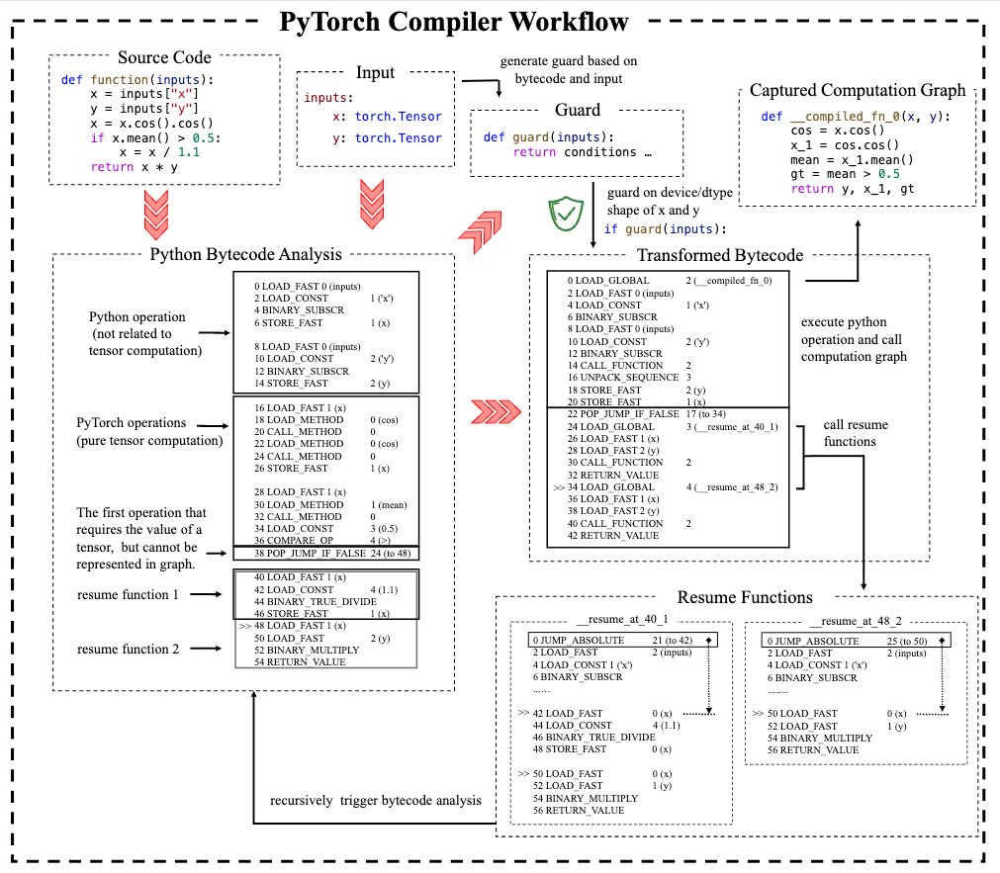
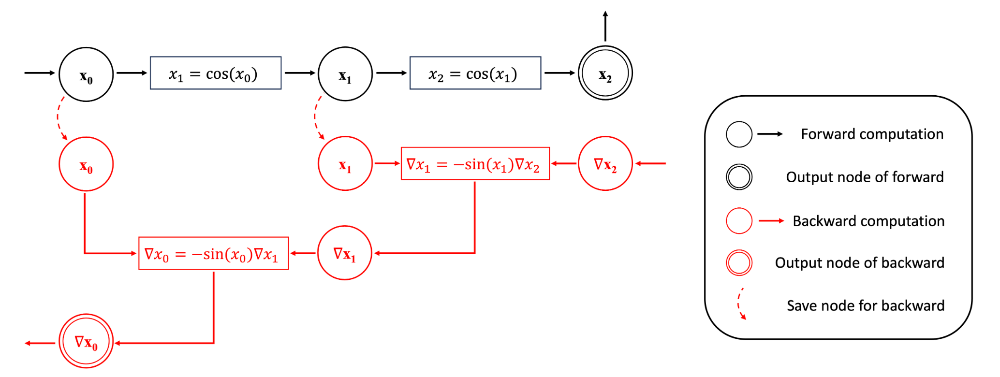
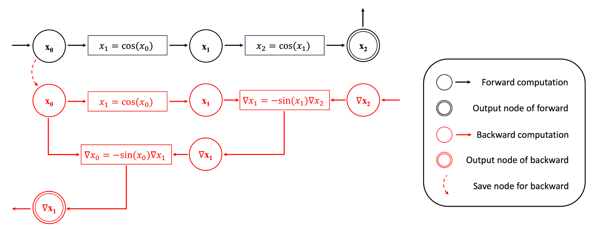
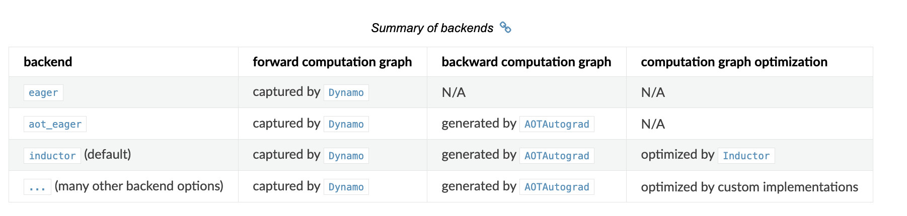

> tutorial link: https://depyf.readthedocs.io/en/latest/walk_through.html


# ``torch.compile`` 상세 예제 분석

이 tutorial은 PyTorch compiler의 다음 몇 가지 측면을 다루는 것을 목표로 한다.

- 기본 개념(Just-In-Time compiler, Ahead-of-time compiler)
- Dynamo(graph capture, 사용자 코드를 순수 Python 코드와 순수 PyTorch 관련 코드로 분리)
- AOTAutograd(forward computation graph에서 backward computation graph 생성)
- Inductor/기타 backend(주어진 computation graph를 서로 다른 device에서 더 빠르게 실행하는 방법)

이 component들은 서로 다른 backend option으로 호출된다.

- ``torch.compile(backend="eager")`` 는 Dynamo만 사용한다.
- ``torch.compile(backend="aot_eager")`` 는 Dynamo와 AOTAutograd를 사용한다.
- ``torch.compile(backend="inductor")`` (기본 parameter)는 Dynamo, AOTAutograd, 그리고 PyTorch의 내장 graph optimization backend인 ``Inductor``를 사용한다.

## PyTorch compiler는 Just-In-Time compiler다

먼저 이해해야 할 개념은 PyTorch compiler가 Just-In-Time compiler라는 것이다. 그렇다면 "Just-In-Time compiler"란 무엇일까? 예제를 보자.

```python
import torch

class A(torch.nn.Module):
    def __init__(self):
        super().__init__()

    def forward(self, x):
        return torch.exp(2 * x)

class B(torch.nn.Module):
    def __init__(self):
        super().__init__()

    def forward(self, x):
        return torch.exp(-x)

def f(x, mod):
    y = mod(x)
    z = torch.log(y)
    return z

# 사용자는 다음처럼 사용할 수 있다.
# mod = A()
# x = torch.randn(5, 5, 5)
# output = f(x, mod)

```

우리는 이 흥미로운 함수 ``f``를 작성했다. 여기에는 module call(``mod.forward``를 호출한다)과 ``torch.log`` call이 포함되어 있다. 잘 알려진 algebraic simplification identity인 $\log(\exp(a\times x))=a\times x$ 때문에, 우리는 코드를 다음처럼 최적화하고 싶어진다.

```python
def f(x, mod):
    if isinstance(mod, A):
        return 2 * x
    elif isinstance(mod, B):
        return -x
```

이것을 우리의 첫 compiler라고 부를 수 있다. 자동화 program이 아니라 우리의 brain이 "compile"한 것이긴 하지만 말이다.

조금 더 엄밀하게 하려면 compiler 예시는 다음처럼 update되어야 한다.

```python
def f(x, mod):
    if isinstance(x, torch.Tensor) and isinstance(mod, A):
        return 2 * x
    elif isinstance(x, torch.Tensor) and isinstance(mod, B):
        return -x
    else:
        y = mod(x)
        z = torch.log(y)
        return z
```

각 parameter를 확인해야 한다. 최적화 조건이 합리적인지 보장하고, code를 최적화할 수 없을 때 original code로 fallback하기 위해서다.

여기서 (Just-In-Time) compiler의 두 기본 개념인 guard와 transformed code가 나온다. guard는 function이 최적화될 수 있는 조건이고, transformed code는 function의 최적화 version이다. 위의 간단한 compiler 예시에서 ``isinstance(mod, A)``는 guard이고, ``return 2 * x``는 guard 조건에서 original code와 동등하지만 훨씬 빠른 해당 transformed code다.

위 예시는 Ahead-of-time compiler다. 모든 available source code를 검사하고, 어떤 function도 실행하기 전, 즉 Ahead-of-time에 가능한 모든 guard와 transformed code를 기준으로 최적화된 function을 작성한다.

다른 종류의 compiler가 Just-In-Time compiler다. function 실행 전에 실행이 최적화될 수 있는지, 어떤 조건에서 function 실행을 최적화할 수 있는지 분석한다. 이 조건이 새로운 input에 충분히 일반적이어서 compile이 주는 이득이 just-in-time compile 비용을 넘기를 기대한다. 모든 조건이 실패하면 새 조건에서 code 최적화를 시도한다.

Just-In-Time compiler의 기본 workflow는 다음과 같아야 한다.

```python
def f(x, mod):
    for guard, transformed_code in f.compiled_entries:
        if guard(x, mod):
            return transformed_code(x, mod)
    try:
        guard, transformed_code = compile_and_optimize(x, mod)
        f.compiled_entries.append([guard, transformed_code])
        return transformed_code(x, mod)
    except FailToCompileError:
        y = mod(x)
        z = torch.log(y)
        return z
```

Just-In-Time compiler는 자신이 본 것에 대해서만 최적화한다. 어떤 guard 조건도 만족하지 않는 새 input을 볼 때마다, 그 새 input을 위한 새 guard와 transformed code를 compile한다.

compiler의 상태, 즉 guard와 transformed code의 형태를 단계별로 설명해보자.

```python
import torch

class A(torch.nn.Module):
    def __init__(self):
        super().__init__()

    def forward(self, x):
        return torch.exp(2 * x)

class B(torch.nn.Module):
    def __init__(self):
        super().__init__()

    def forward(self, x):
        return torch.exp(-x)

@just_in_time_compile # 가상의 compiler function
def f(x, mod):
    y = mod(x)
    z = torch.log(y)
    return z

a = A()
b = B()
x = torch.randn((5, 5, 5))

# f(x, a)를 실행하기 전, f.compiled_entries == [] 로 비어 있다.
f(x, a)
# f(x, a)를 실행한 뒤, f.compiled_entries == [Guard("isinstance(x, torch.Tensor) and isinstance(mod, A)"), TransformedCode("return 2 * x")]

# f(x, a)를 두 번째로 호출하면 조건에 hit하므로 transformed code를 바로 실행할 수 있다.
f(x, a)

# f(x, b)는 compile을 trigger하고 새 compile entry를 추가한다.
# f(x, b)를 실행하기 전, f.compiled_entries == [Guard("isinstance(x, torch.Tensor) and isinstance(mod, A)"), TransformedCode("return 2 * x")]
f(x, b)
# f(x, b)를 실행한 뒤, f.compiled_entries == [Guard("isinstance(x, torch.Tensor) and isinstance(mod, A)"), TransformedCode("return 2 * x"), Guard("isinstance(x, torch.Tensor) and isinstance(mod, B)"), TransformedCode("return -x")]

# f(x, b)를 두 번째로 호출하면 조건에 hit하므로 transformed code를 바로 실행할 수 있다.
f(x, b)
```

이 예시에서는 ``isinstance(mod, A)`` 같은 type에 guard를 걸고, ``TransformedCode``도 Python code다. ``torch.compile``의 경우에는 device(CPU/GPU), data type(int32, float32), shape(``[10]``, ``[8]``) 같은 더 많은 조건에 guard를 건다. 그리고 ``TransformedCode``는 Python bytecode다. function에서 이런 compile entry를 추출할 수 있으며, 자세한 내용은 `PyTorch 문서 <https://pytorch.org/docs/main/torch.compiler_deepdive.html#how-to-inspect-artifacts-generated-by-torchdynamo>`_를 참고하라. guard와 transformed code가 다르기는 하지만, ``torch.compile``의 기본 workflow는 이 예시와 동일하다. 즉 Just-In-Time compiler로 동작한다.

## algebraic simplification을 넘어선 최적화

위 예시는 algebraic simplification에 관한 것이었다. 하지만 이런 최적화는 실제로는 꽤 드물다. 더 현실적인 예를 보고 PyTorch compiler가 아래 code를 어떻게 처리하는지 살펴보자.

```python

import torch

@torch.compile
def function(inputs):
    x = inputs["x"]
    y = inputs["y"]
    x = x.cos().cos()
    if x.mean() > 0.5:
        x = x / 1.1
    return x * y

shape_10_inputs = {"x": torch.randn(10, requires_grad=True), "y": torch.randn(10, requires_grad=True)}
shape_8_inputs = {"x": torch.randn(8, requires_grad=True), "y": torch.randn(8, requires_grad=True)}
# warmup
for i in range(100):
    output = function(shape_10_inputs)
    output = function(shape_8_inputs)

# compiled function 실행
output = function(shape_10_inputs)
```

이 code는 activation function $\text{cos}(\text{cos}(x))$를 구현하고, activation 값에 따라 output을 scale한 다음, 다른 tensor ``y``와 output을 곱하려고 한다.

## Dynamo는 function을 어떻게 변환하고 수정하는가?

``torch.compile``이 Just-In-Time compiler로 동작하는 전체 그림을 이해했으니, 이제 어떻게 동작하는지 더 깊이 들어갈 수 있다. ``gcc``나 ``llvm`` 같은 범용 compiler와 달리, ``torch.compile``은 domain-specific compiler다. PyTorch와 관련된 computation graph에만 관심을 둔다. 따라서 사용자 code를 두 부분, 즉 순수 Python code와 computation graph code로 나눌 tool이 필요하다.

module ``torch._dynamo`` 안에 있는 ``Dynamo``가 바로 이 작업을 수행하는 tool이다. 보통 우리는 이 module과 직접 상호작용하지 않는다. ``torch.compile`` function 내부에서 호출된다.

개념적으로 ``Dynamo``는 다음 몇 가지를 수행한다.

- computation graph로 표현할 수 없지만 값을 계산해야 하는 첫 operation을 찾는다. 예를 들어 tensor 값을 ``print``하거나, tensor 값을 사용해 Python의 ``if`` statement control flow를 결정하는 경우다.
- 그 이전의 operation을 두 부분으로 나눈다. tensor computation에 관한 순수 computation graph와 Python object 조작에 관한 Python code다.
- 남은 operation을 하나 또는 두 개의 새 function, 즉 ``resume functions``로 남기고 위 분석을 다시 trigger한다.

function을 이렇게 세밀하게 조작하기 위해 ``Dynamo``는 Python source code보다 낮은 수준인 Python bytecode level에서 동작한다.

다음 과정은 Dynamo가 우리 function에 대해 수행하는 작업을 설명한다.



> 그림 설명:

- **source code**: 그림은 간단한 Python function `function(inputs)`를 보여준다. 이 function은 input의 두 tensor `x`와 `y`에 대해 `cos`, `mean` 같은 수학 operation을 수행한 뒤 `x * y`를 반환한다.
- **input**: 이 function의 input인 inputs가 `x`와 `y` 두 개의 `torch.Tensor` type tensor를 포함함을 보여준다.
- **guard function**: guard function은 input과 Python bytecode를 바탕으로 생성되며, compiler가 runtime에 tensor `x`와 `y`의 shape과 type을 검증해 recompile이 필요한지 아니면 직접 실행할 수 있는지 결정하도록 보장한다.
- **Python bytecode analysis**: 그림은 Python source code가 compiler analysis 후 생성한 bytecode를 보여준다. 여기서는 Python operation(tensor computation과 무관한 부분)과 순수 tensor computation의 PyTorch operation(cos, mean 등)을 분리해 나열한다.
- **transformed bytecode**: PyTorch compiler가 source를 bytecode로 변환한 뒤, 서로 다른 operation에 따라 대응 bytecode instruction을 생성하고 guard 조건에 따라 execution flow를 결정한다. 예를 들어 그림은 `_compiled_fn` 구현과 conditional jump operation을 보여준다.
- **resume functions**: 어떤 operation이 필요로 하는 조건이 만족되지 않을 때, 예를 들어 어떤 tensor value를 다시 계산해야 할 때 compiler는 resume function을 trigger한다. 이 resume function은 필요한 computation을 계속할 수 있고 bytecode analysis를 recursive하게 trigger한다.
- **execution workflow**: 마지막으로 원래 bytecode instruction에서 guard 조건, tensor computation graph, resume function 등 일련의 operation을 거쳐 최종 execution bytecode flow가 어떻게 형성되는지 보여준다.

> 참고: bytecode 뒤에는 대응하는 원래 Python code가 표시되어 있다.

``Dynamo``의 중요한 특성 하나는 ``function`` function 내부에서 호출되는 모든 function을 분석할 수 있다는 점이다. 어떤 function이 완전히 computation graph로 표현될 수 있다면, 그 function call은 inline되고 function call은 제거된다.

``Dynamo``의 task는 Python code에서 안전하고 신뢰할 수 있는 방식으로 computation graph를 추출하는 것이다. 일단 computation graph가 생기면 computation graph optimization의 세계로 들어갈 수 있다.

> 위 workflow에는 이해하기 어려운 bytecode가 많이 포함되어 있다. Python bytecode를 읽을 수 없는 사람에게는 ``depyf``가 도움이 된다! 자세한 내용은 https://depyf.readthedocs.io/en/latest/ 를 확인하라.

## Dynamo의 dynamic shape 지원

deep learning compiler는 보통 static shape input을 선호한다. 위 guard 조건에 shape guard가 포함된 이유다. 첫 번째 function call은 shape이 ``[10]``인 input을 사용했지만, 두 번째 function call은 shape이 ``[8]``인 input을 사용했다. 그러면 shape guard가 실패하고 새 code transformation이 trigger된다.

기본적으로 Dynamo는 dynamic shape를 지원한다. shape guard가 실패하면 shape를 분석하고 비교한 뒤 shape를 generalize하려고 시도한다. 이 경우 shape ``[8]`` input을 본 뒤 임의의 1차원 shape ``[s0]``로 generalize하려고 시도한다. 이를 dynamic shape 또는 symbolic shape라고 부른다.

## AOTAutograd: forward graph에서 backward computation graph 생성

위 code는 forward computation graph만 처리했다. 중요한 누락 부분은 gradient를 계산하기 위한 backward computation graph를 어떻게 얻는가이다.

일반 PyTorch code에서 backward computation은 어떤 scalar loss value에 대해 ``backward`` function을 호출해 trigger된다. 각 PyTorch function은 forward computation 동안 backward에 필요한 내용을 저장한다.

eager mode에서 backward 과정에 무슨 일이 일어나는지 설명하기 위해 아래 구현을 사용한다. 이는 ``torch.cos`` function의 내장 동작을 모방한 것이다. PyTorch에서 automatic differentiation 지원 custom function을 작성하는 방법에 대한 `background knowledge <https://pytorch.org/docs/main/notes/extending.html#extending-torch-autograd>`_가 조금 필요하다.

```python

import torch
class Cosine(torch.autograd.Function):
    @staticmethod
    def forward(x0):
        x1 = torch.cos(x0)
        return x1, x0

    @staticmethod
    def setup_context(ctx, inputs, output):
        x1, x0 = output
        print(f"shape {x0.shape} tensor saved")
        ctx.save_for_backward(x0)

    @staticmethod
    def backward(ctx, grad_output):
        x0, = ctx.saved_tensors
        result = (-torch.sin(x0)) * grad_output
        return result

# output이 무엇인지 더 명확하게 보기 위해 Cosine을 function으로 감싼다.
def cosine(x):
    # `apply`는 `forward`와 `setup_context`를 호출한다.
    y, x= Cosine.apply(x)
    return y

def naive_two_cosine(x0):
    x1 = cosine(x0)
    x2 = cosine(x1)
    return x2
```

gradient가 필요한 input으로 위 function을 실행하면 두 tensor가 저장되는 것을 볼 수 있다.

```python
input = torch.randn((5, 5, 5), requires_grad=True)
output = naive_two_cosine(input)
```

output:

```shell
shape torch.Size([5, 5, 5]) tensor saved
shape torch.Size([5, 5, 5]) tensor saved
```

미리 computation graph가 있다면 computation을 다음처럼 변환할 수 있다.

```python
class AOTTransformedTwoCosine(torch.autograd.Function):
    @staticmethod
    def forward(x0):
        x1 = torch.cos(x0)
        x2 = torch.cos(x1)
        return x2, x0

    @staticmethod
    def setup_context(ctx, inputs, output):
        x2, x0 = output
        print(f"shape {x0.shape} tensor saved")
        ctx.save_for_backward(x0)

    @staticmethod
    def backward(ctx, grad_x2):
        x0, = ctx.saved_tensors
        # backward에서 recompute한다.
        x1 = torch.cos(x0)
        grad_x1 = (-torch.sin(x1)) * grad_x2
        grad_x0 = (-torch.sin(x0)) * grad_x1
        return grad_x0

def AOT_transformed_two_cosine(x):
    # `apply`는 `forward`와 `setup_context`를 호출한다.
    x2, x0 = AOTTransformedTwoCosine.apply(x)
    return x2
```

gradient가 필요한 input으로 위 function을 실행하면 하나의 tensor만 저장되는 것을 볼 수 있다.

```python
input = torch.randn((5, 5, 5), requires_grad=True)
output = AOT_transformed_two_cosine(input)
```

output:

```shell
shape torch.Size([5, 5, 5]) tensor saved
```

두 구현과 native PyTorch 구현의 correctness를 확인할 수 있다.

```python

input = torch.randn((5, 5, 5), requires_grad=True)
grad_output = torch.randn((5, 5, 5))

output1 = torch.cos(torch.cos(input))
(output1 * grad_output).sum().backward()
grad_input1 = input.grad; input.grad = None

output2 = naive_two_cosine(input)
(output2 * grad_output).sum().backward()
grad_input2 = input.grad; input.grad = None

output3 = AOT_transformed_two_cosine(input)
(output3 * grad_output).sum().backward()
grad_input3 = input.grad; input.grad = None

assert torch.allclose(output1, output2)
assert torch.allclose(output1, output3)
assert torch.allclose(grad_input1, grad_input2)
assert torch.allclose(grad_input1, grad_input3)
```

다음 computation graph는 naive implementation의 세부 내용을 보여준다.



다음 computation graph는 transformed implementation의 세부 내용을 보여준다.



값 하나만 저장하고, backward에 필요한 다른 값을 얻기 위해 첫 번째 ``cos`` function을 recompute하면 된다. 추가 computation이 더 많은 computation time을 의미하지는 않는다는 점에 유의하라. GPU 같은 현대 device는 보통 memory-bound다. 즉 memory access time이 computation time을 지배하므로 약간 더 많은 computation은 중요하지 않다.

AOTAutograd는 위 transformation을 자동으로 수행한다. 본질적으로 다음과 비슷한 function을 dynamic하게 생성한다.

```python

class AOTTransformedFunction(torch.autograd.Function):
    @staticmethod
    def forward(inputs):
        outputs, saved_tensors = forward_graph(inputs)
        return outputs, saved_tensors

    @staticmethod
    def setup_context(ctx, inputs, output):
        outputs, saved_tensors = output
        ctx.save_for_backward(saved_tensors)

    @staticmethod
    def backward(ctx, grad_outputs):
        saved_tensors = ctx.saved_tensors
        grad_inputs = backward_graph(grad_outputs, saved_tensors)
        return grad_inputs

def AOT_transformed_function(inputs):
    outputs, saved_tensors = AOTTransformedFunction.apply(inputs)
    return outputs
```

이렇게 saved tensor가 명시화되고, ``AOT_transformed_function``은 original function과 완전히 같은 input을 받으며, original function과 완전히 같은 output을 만들고, original function과 완전히 같은 backward behavior를 갖는다.

``saved_tensors``의 수를 바꾸면 backward를 위해 저장하는 tensor를 줄여 forward의 memory footprint를 낮출 수 있다. AOTAutograd는 최적의 memory saving 방식을 자동으로 선택한다. 구체적으로는 `maximum flow minimum cut <https://en.wikipedia.org/wiki/Minimum_cut>`_ algorithm을 사용해 joint graph를 forward graph와 backward graph로 자른다. 더 많은 논의는 `이 thread <https://dev-discuss.pytorch.org/t/min-cut-optimal-recomputation-i-e-activation-checkpointing-with-aotautograd/467>`_에서 찾을 수 있다.

이것이 기본적으로 AOT Autograd의 동작 원리다!

참고: function의 joint graph를 얻는 방법이 궁금하다면 코드는 다음과 같다.

```python

def run_autograd_ahead_of_time(function, inputs, grad_outputs):
    def forward_and_backward(inputs, grad_outputs):
        outputs = function(*inputs)
        grad_inputs = torch.autograd.grad(outputs, inputs, grad_outputs)
        return grad_inputs
    from torch.fx.experimental.proxy_tensor import make_fx
    wrapped_function = make_fx(forward_and_backward, tracing_mode="fake")
    joint_graph = wrapped_function(inputs, grad_outputs)
    print(joint_graph._graph.python_code(root_module="self", verbose=True).src)

def f(x0):
    x1 = torch.cos(x0)
    x2 = torch.cos(x1)
    return x2

input = torch.randn((5, 5, 5), requires_grad=True)
grad_output = torch.randn((5, 5, 5)) # output shape와 같다.
run_autograd_ahead_of_time(f, [input], [grad_output])
```

이 function은 real input에서 fake tensor 몇 개를 만들고, metadata(shape, device, data type)만 사용해 computation을 수행한다. 따라서 AOTAutograd component는 ahead-of-time으로 실행된다. 이름이 AOTAutograd인 이유가 이것이다. AOTAutograd는 automatic differentiation engine을 ahead-of-time으로 실행한다.

## backend: computation graph compile과 optimization

마지막으로 ``Dynamo``가 PyTorch code를 Python code에서 분리하고, ``AOTAutograd``가 forward computation graph에서 backward computation graph를 생성한 뒤, 우리는 순수 computation graph의 세계로 들어간다.

이때 ``torch.compile``의 ``backend`` parameter가 역할을 한다. 이것은 위 computation graph를 input으로 받고, 서로 다른 device에서 위 computation graph를 실행할 수 있는 optimized code를 생성한다.

``torch.compile``의 기본 backend는 ``"inductor"``다. Inductor는 자신이 알고 있는 모든 optimization technique을 시도해 computation graph를 최적화한다. 각 optimization technique은 ``pass``라고 부른다. 일부 optimization pass는 `PyTorch repository <https://github.com/pytorch/pytorch/tree/main/torch/_inductor/fx_passes>`_에서 찾을 수 있다.

> 매우 중요한 optimization 하나는 "kernel fuse"다. hardware 발전에 익숙하지 않은 사람은 현대 hardware가 computation에서 너무 빨라서 보통 memory-bound라는 사실에 놀랄 수 있다. memory에서 읽고 memory에 쓰는 일이 가장 많은 시간을 차지한다. 위 예시에서 optimization 전 backward graph는 :$\nabla x_2, x_1, x_0$ 를 읽고 $\nabla x_0$ 를 쓴다. optimization 후 backward graph는 :$\nabla x_2, x_0$ 를 읽고 $\nabla x_0$ 를 쓴다. optimization된 backward graph는 $x_1$을 recompute하더라도 optimization 전 graph 시간의 75%만 필요할 수 있다.

또한 optimization을 하지 않는 것도 가능한 optimization이다. PyTorch에서는 이를 ``eager`` backend라고 부른다.

엄밀히 말하면 ``torch.compile``의 ``backend`` option은 backward computation graph가 존재하는지, 그리고 computation graph를 어떻게 최적화하는지에 영향을 준다. 실제로 custom backend는 보통 ``AOTAutograd``와 함께 동작해 backward computation graph를 얻으며, forward graph이든 backward graph이든 computation graph optimization만 처리하면 된다.

## 정리

아래 표는 ``torch.compile``의 몇 가지 ``backend`` option 차이를 보여준다. 우리 code를 ``torch.compile``에 맞추고 싶다면, 먼저 ``backend="eager"``를 시도해 code가 computation graph로 어떻게 변환되는지 확인하고, 다음으로 ``backend="aot_eager"``를 시도해 backward graph에 만족하는지 확인한 뒤, 마지막으로 ``backend="inductor"``를 시도해 성능 향상을 얻을 수 있는지 보는 것을 권장한다.




