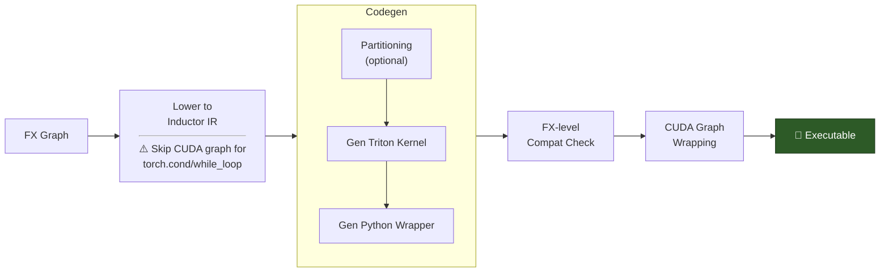
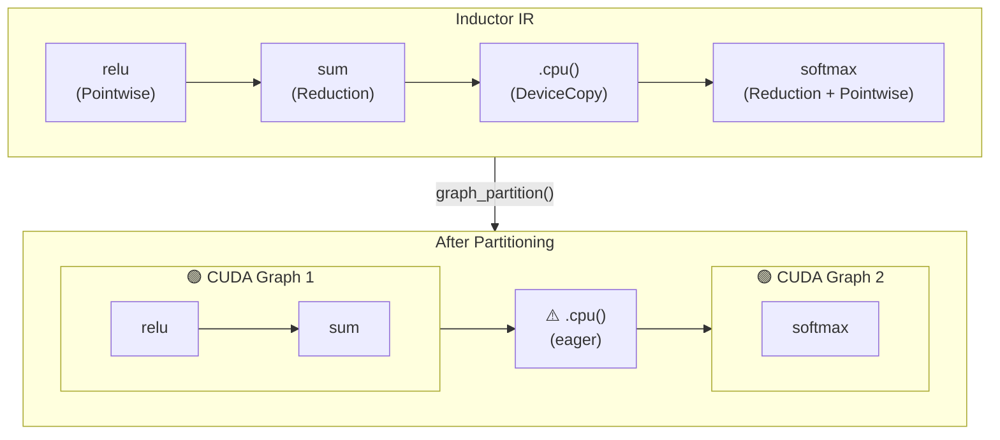
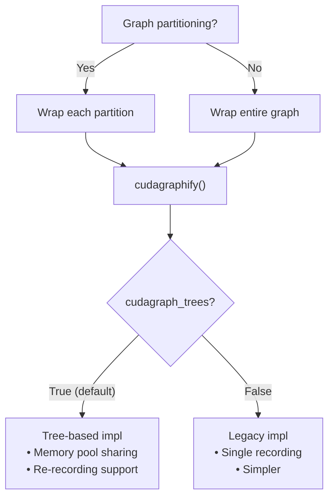
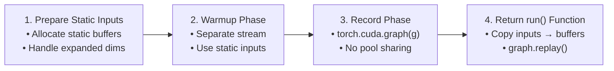
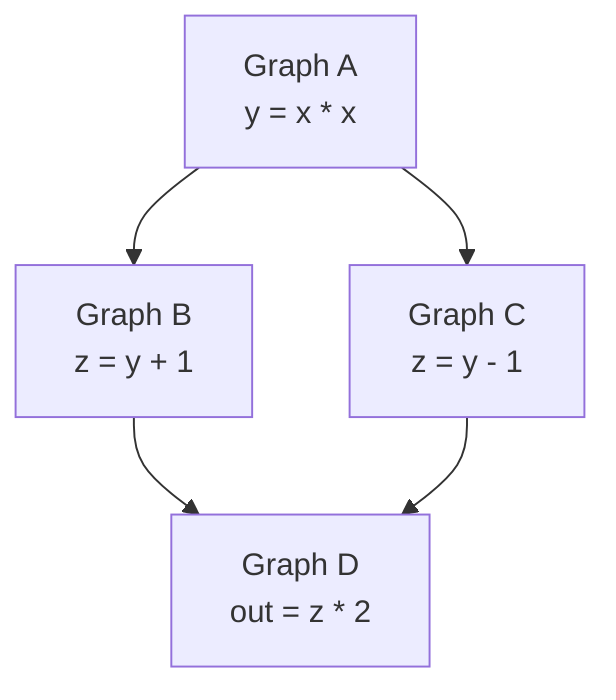
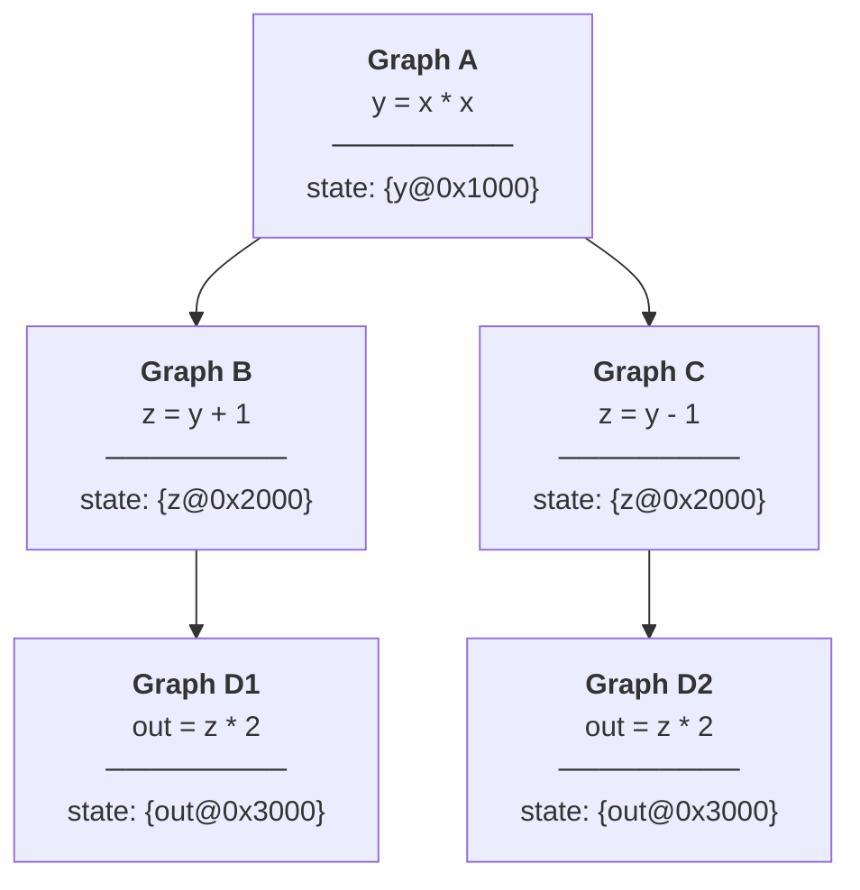
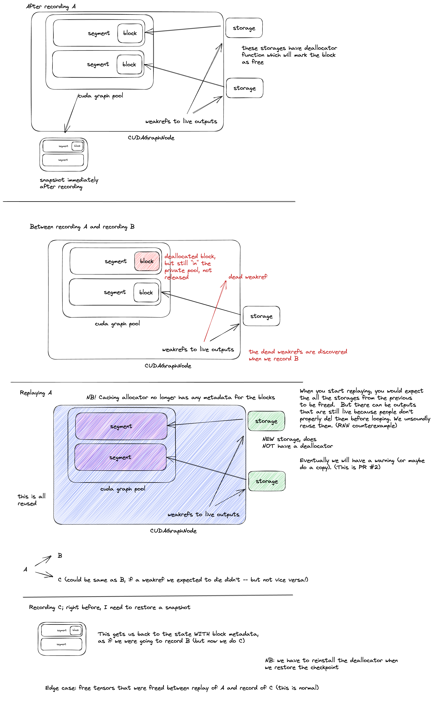

# torch.compile에서 CUDA Graph는 어떻게 동작하는가

> 원문: https://fkong.tech/posts/2025-12-23-cuda-graph-in-torch-compile/

## Introduction

CUDA Graph는 일련의 GPU 연산을 캡처한 뒤 하나의 단위로 replay하여, 개별 커널마다 발생하는 CPU launch overhead를 제거합니다. 특히 배치가 작은 워크로드나 작은 커널이 많은 모델처럼 CPU 오버헤드가 병목이 되는 경우에 큰 이득이 있습니다.

`torch.compile(mode="reduce-overhead")`을 사용하거나 `options={"triton.cudagraphs": True}`를 켜면, PyTorch는 자동으로 CUDA Graph를 활용하여 모델을 가속합니다. 그렇다면 내부에서는 실제로 어떤 일이 일어날까요? 이 글에서는 `torch.compile`의 CUDA Graph 통합 내부 구조를 들여다보며, 컴파일 파이프라인, 호환성 검사, 그래프 분할, 그리고 두 가지 구현 방식(CUDA Graph Trees 대 legacy)을 다룹니다.

이 글은 **PyTorch v2.9.0** 기준입니다. 모든 소스 코드 링크는 이 버전을 가리킵니다.

## CUDA Graph 기본 개념

`torch.compile`로 들어가기 전에, [CUDA Graph](https://pytorch.org/docs/stable/notes/cuda.html#cuda-graphs)가 어떻게 동작하는지 간단히 복습해 봅시다.

CUDA Graph는 근본적으로 다음을 요구합니다:

1.  **비동기 실행 모델** — 캡처되는 모든 연산은 비동기 CUDA 호출이어야 합니다(그래프 내부에서 CPU 동기화가 없어야 함).

2.  **정적 그래프 토폴로지** — 연산의 순서(노드와 엣지)가 캡처 시점에 고정되어야 합니다.

3.  **정적 노드 파라미터** — 모든 커널 파라미터가 불변이어야 하며, 여기에는 다음이 포함됩니다:

    - Grid/block 차원
    - 커널 인자
    - **메모리 주소** — 입력/출력 텐서의 주소가 capture와 replay 사이에서 동일해야 합니다

정적 메모리 주소 요구 사항은 특히 중요합니다. CUDA graph는 capture 중에 사용된 실제 포인터를 그대로 "구워 넣기" 때문입니다. 다른 주소로 replay하면 그래프는 잘못된 메모리 위치를 읽고 쓰게 됩니다.

PyTorch에서 CUDA Graph를 직접 사용하는 방법은 다음과 같습니다:

```python
# static input 버퍼 할당 (주소가 고정되어 있어야 함)
static_input = torch.randn(batch_size, features, device="cuda")

g = torch.cuda.CUDAGraph()

# Warmup 실행 (커널 JIT 컴파일, 메모리 할당 안정화)
s = torch.cuda.Stream()
s.wait_stream(torch.cuda.current_stream())
with torch.cuda.stream(s):
    for _ in range(3):
        output = model(static_input)
torch.cuda.current_stream().wait_stream(s)

# Capture
with torch.cuda.graph(g):
    output = model(static_input)

# Replay (먼저 새 데이터를 static 버퍼로 복사)
static_input.copy_(new_data)
g.replay()  # 커널마다 발생하는 CPU 오버헤드 없음
```

**핵심 개념:**

1.  **Static input 버퍼** — 입력 텐서는 고정된 메모리 주소를 가져야 합니다. replay 전에 새 데이터를 static 버퍼로 복사합니다.
2.  **Warmup** — capture 전에 모델을 실행하여 커널(예: Triton, cuBLAS)을 JIT 컴파일하고 메모리 할당을 안정화합니다.
3.  **Capture** — `torch.cuda.graph()`를 사용하여 모든 CUDA 연산을 그래프에 기록합니다. capture 중에 PyTorch는 이 그래프 전용의 **private memory pool**에서 출력을 할당합니다. caching allocator는 replay 전반에 걸쳐 이 주소들이 안정적으로 유지되도록 보장합니다. 그래프가 살아 있는 동안 해당 메모리는 일반 pool로 반환되지 않습니다.
4.  **Replay** — 그래프 전체를 하나의 단위로 실행하여, 커널마다 발생하는 CPU launch overhead를 제거합니다.

CUDA graph가 PyTorch의 메모리 allocator와 어떻게 상호작용하는지(private pool, 메모리 예약, replay 보장)에 대한 자세한 내용은 caching allocator 구현의 [`Note [Interaction with CUDA graph capture]`](https://github.com/pytorch/pytorch/blob/v2.9.0/c10/cuda/CUDACachingAllocator.cpp#L106-L136)를 참고하십시오.

## PyTorch에서 CUDA Graph 사용하기

위의 수동 방식에서 보았듯이, CUDA Graph를 올바르게 사용하려면 static 버퍼, warmup 실행, memory pool을 세심하게 관리해야 합니다. PyTorch는 이를 단순화하는 두 가지 상위 수준 API를 제공합니다: `make_graphed_callables`와 `torch.compile`입니다.

[`make_graphed_callables`](https://pytorch.org/docs/stable/generated/torch.cuda.make_graphed_callables.html)는 함수나 모듈을 감싸서 CUDA Graph의 capture와 replay를 자동으로 처리합니다:

```python
# CUDA Graph 가속을 위해 모델을 래핑
model = torch.cuda.make_graphed_callables(model, sample_inputs)
output = model(x)  # 캡처된 그래프를 자동으로 replay
```

raw CUDA Graph API보다는 간단하지만, 여전히 CUDA Graph 호환성을 직접 보장해야 합니다. 올바른 shape의 sample input을 제공해야 하고, 캡처할 수 없는 연산을 처리해야 합니다. 여러 callable을 래핑하면 이들은 하나의 private memory pool을 공유하며 **순차 체인(sequential chain)**을 형성합니다. 따라서 반드시 기록된 순서와 정확히 같은 순서로 replay해야 합니다. 다른 순서나 비순차적 구조(예: 분기)는 지원되지 않으며 메모리 손상을 일으킵니다.

`torch.compile`은 여기서 한 걸음 더 나아가, static 버퍼 할당, warmup, capture, replay는 물론 호환되지 않는 op에 대한 그래프 분할까지 모든 복잡성을 자동으로 처리해 줍니다:

```python
# reduce-overhead 모드 사용 (권장)
@torch.compile(mode="reduce-overhead")
def forward(x):
    return model(x)
```

CUDA Graph를 활성화하는 다른 모드로는 `"max-autotune"`이 있습니다. 명시적으로 제어하려면 `options={"triton.cudagraphs": True}`를 사용할 수도 있습니다.

이 글의 나머지 부분에서는 `torch.compile`이 내부적으로 CUDA Graph 통합을 **어떻게** 구현하는지를 깊이 파고듭니다.

## 컴파일 흐름 개요

`torch.compile()`을 호출하면 코드는 여러 단계의 컴파일 파이프라인을 거칩니다. CUDA Graph 통합은 모든 커널 최적화가 끝난 뒤, 마지막 Inductor 단계에서 일어납니다.


**단계별 구분:**

1.  **TorchDynamo** — Python 바이트코드를 분석하여 FX Graph(PyTorch 연산을 방향성 비순환 그래프로 표현한 중간 표현)를 캡처합니다. graph break(예: 데이터 의존적 제어 흐름)가 발생하면 여러 개의 FX Graph가 생기고, 각각 독립적으로 처리됩니다.

2.  **AOT Autograd** — forward와 backward가 합쳐진 joint graph를 트레이싱하고, 상위 수준 연산자를 하위 수준 연산자로 분해(PrimTorch)한 뒤, **forward graph와 backward graph로 분리**합니다. 각 그래프는 독립적으로 Inductor를 거칩니다.

3.  **Inductor** — 각 그래프를 최적화된 코드로 lowering하고, CUDA Graph 호환성 검사를 수행하며, 호환되지 않는 op 경계에서 그래프를 분할하고, Triton 커널을 생성한 뒤, 마지막으로 컴파일된 코드를 CUDA Graph 로직으로 감쌉니다.

이제 Inductor가 CUDA Graph 통합을 어떻게 처리하는지 더 깊이 들어가 봅시다. [`codegen_and_compile()`](https://github.com/pytorch/pytorch/blob/v2.9.0/torch/_inductor/compile_fx.py#L1154)에서 시작하는 핵심 호출 스택은 다음과 같습니다:

```
codegen_and_compile()                        # compile_fx.py:1154
├── graph.run()                              # Lower FX → Inductor IR
├── graph.compile_to_module()                # graph.py:2312
│   └── scheduler.codegen()                  # Partitioning + Triton/wrapper codegen
├── get_first_incompatible_cudagraph_node()  # FX-level compat check
└── return CompiledFxGraph
        └── post_compile()                   # CUDA Graph wrapping
```

아래 다이어그램은 이 단계들을 시각적으로 보여줍니다:



각 단계가 하는 일은 다음과 같습니다:

- **Inductor IR로 lowering** — [`GraphLowering.run()`](https://github.com/pytorch/pytorch/blob/v2.9.0/torch/_inductor/graph.py#L935)이 FX graph 노드를 Inductor 내부 표현으로 변환합니다. 특히 [`torch.cond`](https://github.com/pytorch/pytorch/blob/v2.9.0/torch/_inductor/lowering.py#L7055)와 [`torch.while_loop`](https://github.com/pytorch/pytorch/blob/v2.9.0/torch/_inductor/lowering.py#L7067)는 lowering 중에 `disable_cudagraphs_reason`을 설정하는데, 이는 (일부 partition이 아니라) **컴파일된 그래프 전체**에 대해 CUDA Graph를 비활성화합니다. 이 고차(higher-order) 제어 흐름 연산자들은 Dynamo graph break를 피하게 해주지만, CUDA Graph capture는 전혀 불가능하게 만듭니다.
- **Codegen** — [`Scheduler.codegen()`](https://github.com/pytorch/pytorch/blob/v2.9.0/torch/_inductor/scheduler.py#L5202)은 선택적인 그래프 분할([`should_partition()`](https://github.com/pytorch/pytorch/blob/v2.9.0/torch/_inductor/scheduler.py#L4649)을 통해 호환되지 않는 IR 노드에서 분리)을 수행하고, [`TritonScheduling.define_kernel()`](https://github.com/pytorch/pytorch/blob/v2.9.0/torch/_inductor/codegen/triton.py#L4710)로 Triton 커널을 생성하며, [`PythonWrapperCodegen`](https://github.com/pytorch/pytorch/blob/v2.9.0/torch/_inductor/codegen/wrapper.py#L928)으로 Python wrapper 코드를 생성합니다.
- **FX 수준 호환성 검사** — [`get_first_incompatible_cudagraph_node()`](https://github.com/pytorch/pytorch/blob/v2.9.0/torch/_inductor/utils.py#L1048)는 원본 FX graph를 훑어 항상 CUDA Graph를 비활성화하는 `forbidden_set` op(예: `aten._local_scalar_dense`)을 찾습니다.
- **CUDA Graph 래핑** — [`CompiledFxGraph.post_compile()`](https://github.com/pytorch/pytorch/blob/v2.9.0/torch/_inductor/output_code.py#L618)은 컴파일된 코드를 [`cudagraphify()`](https://github.com/pytorch/pytorch/blob/v2.9.0/torch/_inductor/compile_fx.py#L1733)로 감싸서 런타임에 CUDA Graph capture가 가능하게 합니다.

여기서 **호환성 검사가 두 수준에 걸쳐 존재한다**는 점에 유의하십시오. 분할 중의 IR 수준 검사(`should_partition()`)는 partition 경계를 결정하고, FX 수준 검사(`get_first_incompatible_cudagraph_node()`)는 특정 op에 대해 CUDA Graph를 완전히 비활성화할 수 있습니다. FX 수준 검사가 `forbidden_set` op을 발견하면, 해당 컴파일 그래프 내의 **모든 partition**에 대해 CUDA Graph가 비활성화됩니다. 분할 작업 자체는 그대로 수행되지만, 어떤 partition도 cudagraphify되지 않습니다.

다음 절들에서 이 단계들을 자세히 설명합니다.

## Codegen: 분할과 Triton 생성

핵심 진입점은 [`Scheduler.codegen()`](https://github.com/pytorch/pytorch/blob/v2.9.0/torch/_inductor/scheduler.py#L5202)이며, 선택적인 `graph_partition` config에 따라 분기합니다:

```python
def codegen(self) -> None:
    return (
        self._codegen_partitions()  # graph_partition=True (default)
        if config.graph_partition
        else self._codegen(self.nodes)  # graph_partition=False
    )
```

**`graph_partition=True`(기본값)인 경우**, [`_codegen_partitions()`](https://github.com/pytorch/pytorch/blob/v2.9.0/torch/_inductor/scheduler.py#L5326)는 먼저 [`graph_partition()`](https://github.com/pytorch/pytorch/blob/v2.9.0/torch/_inductor/scheduler.py#L5170)을 호출하여 호환되지 않는 노드 경계에서 Inductor IR을 분리합니다. 분리 여부는 [`should_partition()`](https://github.com/pytorch/pytorch/blob/v2.9.0/torch/_inductor/scheduler.py#L4649)이 결정합니다. 다음 연산들이 partition 경계를 만듭니다:

- **Non-GPU op** — CPU나 CUDA가 아닌 다른 device에서 실행되는 연산
- **Device copy** (`ir.DeviceCopy`) — `.cpu()`나 `.cuda()` 같은 device 간 전송
- **조건부 op** (`ir.Conditional`) — `torch.cond()`나 `torch.while_loop()`처럼 정적 그래프로 캡처할 수 없는 제어 흐름
- **Unbacked symbolic binding** — `x[x > 0]`처럼 capture 시점에 구체적인 값으로 뒷받침되지 않는 dynamic shape. 참고로 이는 분할을 유발하지만, 아래에서 설명할 FX 수준 검사 역시 unbacked symbol을 감지하여 CUDA Graph를 완전히 비활성화하므로, 실제로는 unbacked symbol에 대한 이 분할이 의미가 없습니다.
- **`cudagraph_unsafe`로 태그된 op** — CUDA Graph와 호환되지 않는다고 명시적으로 표시된 custom operator

분할이 끝나면 [`_codegen()`](https://github.com/pytorch/pytorch/blob/v2.9.0/torch/_inductor/scheduler.py#L5359)이 각 partition에 대해 Triton 커널과 wrapper 코드를 생성합니다. cudagraph가 가능한 partition은 별도의 wrapper 함수가 되고, cudagraph가 불가능한 op은 메인 `call` 함수에 인라인되어 eager mode로 실행됩니다. cudagraph가 가능한 partition이 하나도 없으면 CUDA Graph는 완전히 비활성화됩니다.

**`graph_partition=False`인 경우**에는 분할이 일어나지 않고 모든 코드가 하나의 `call` 함수에 들어갑니다. 호환되지 않는 op에 대해 CUDA Graph를 끌지 여부는 이후의 FX 수준 호환성 검사에서 결정됩니다.

분할은 wrapper 코드의 구조에만 영향을 준다는 점에 유의하십시오. partition 설정과 무관하게 동일한 `_codegen()`이 동일한 Triton 커널을 생성합니다.

분할을 유발하는 예제는 다음과 같습니다:

```python
def fn(x):
    x = torch.relu(x)
    cpu_val = x.sum().cpu()  # device copy가 분할을 유발
    x = torch.softmax(x, dim=-1)
    return x, cpu_val

compiled_fn = torch.compile(fn, mode="reduce-overhead")
```

`.cpu()` 호출은 FX graph에서 `prims.device_put`이 되고, Inductor IR에서는 `DeviceCopy`가 됩니다. `TORCH_COMPILE_DEBUG=1`로 실행하면 다음이 출력됩니다:

```
cudagraph partition due to non gpu ops
cudagraph partition into 2 partitions
```

아래 다이어그램은 `DeviceCopy`가 그래프를 cudagraph 가능한 두 partition으로 나누는 모습을 보여줍니다:



## FX 수준 호환성 검사

코드 생성이 끝나면, CUDA Graph를 완전히 비활성화할지 결정하는 몇 가지 검사가 수행됩니다:

**1. Dynamic shape 검사** — [`config.triton.cudagraph_skip_dynamic_graphs=True`](https://github.com/pytorch/pytorch/blob/v2.9.0/torch/_inductor/config.py#L1222)(기본값: `False`)이고 그래프에 symbolic shape 입력이 있으면, CUDA Graph는 [완전히 비활성화됩니다](https://github.com/pytorch/pytorch/blob/v2.9.0/torch/_inductor/compile_fx.py#L1561). `False`(기본값)일 때는 서로 다른 입력 크기 조합마다 새로운 CUDA graph를 다시 recording하는 방식으로 dynamic shape를 지원합니다. 이것이 CUDA Graph Trees의 `int_key` 디스패치 메커니즘입니다.

**2. 비호환 노드 검사** — [`get_first_incompatible_cudagraph_node()`](https://github.com/pytorch/pytorch/blob/v2.9.0/torch/_inductor/utils.py#L1048)는 원본 FX graph에서 CUDA Graph를 비활성화하는 op을 찾습니다:

- **`forbidden_set` op**은 컴파일된 함수 전체에 대해 항상 CUDA Graph를 비활성화합니다:

  - `.item()`에서 나오는 [`aten._local_scalar_dense`](https://github.com/pytorch/pytorch/blob/v2.9.0/aten/src/ATen/native/Scalar.cpp#L16). 이는 [`capture_scalar_outputs=True`](https://github.com/pytorch/pytorch/blob/v2.9.0/torch/_dynamo/variables/tensor.py#L1002)일 때만 Dynamo graph에 나타나며, 그렇지 않으면 `.item()`이 Dynamo graph break를 일으킵니다
  - random op이 포함된 activation checkpointing(`torch.utils.checkpoint`)에서 나오는 [`run_and_save_rng_state`](https://github.com/pytorch/pytorch/blob/v2.9.0/torch/_prims/rng_prims.py#L152)와 `run_with_rng_state`

- **비결정적 op**: `torch.are_deterministic_algorithms_enabled()`인 경우, scatter/index_put op도 `forbidden_set`에 추가됩니다

- **`cudagraph_unsafe`로 태그된 op**은 `graph_partition=False`일 때만 CUDA Graph를 비활성화합니다. 분할이 켜져 있으면(기본값) 이 op들은 대신 IR 수준 분할을 유발합니다.

- **Unbacked symbol**은 항상 CUDA Graph를 비활성화합니다. 어떤 노드의 출력에 unbacked symbol이 있으면(shape 또는 storage offset에), 최종 출력이 backed shape를 갖더라도 CUDA Graph는 비활성화됩니다. unbacked symbol이 생기는 흔한 원인은 다음과 같습니다:

  - **Unbacked shape**(데이터 의존적 출력 크기):

    - `torch.nonzero()`, `torch.masked_select()` — 출력 크기가 텐서 값에 의존
    - `torch.unique()`, `torch.unique_consecutive()` — 고유 원소 개수가 데이터에 의존 ([fake_impls.py#L324](https://github.com/pytorch/pytorch/blob/v2.9.0/torch/_subclasses/fake_impls.py#L324))
    - `torch.repeat_interleave()` — 출력 크기가 반복 횟수에 의존
    - `torch.bincount()` — 출력 크기가 입력 값에 의존
    - `torch.nn.utils.rnn.pack_padded_sequence()` — packed batch size가 데이터에 의존
    - 가변 길이 시퀀스를 담은 nested tensor(`torch.nested`)

  - **Unbacked storage offset**(데이터 의존적 메모리 위치):

    - `idx`가 컴파일 시점에 부호를 결정할 수 없는 데이터 의존적 값일 때의 `torch.select(x, dim, idx)` 또는 `x[:, idx]` — shape는 알려져 있지만 storage offset이 unbacked입니다

  예를 들어 `x[x > 0].sum()`은 CUDA Graph를 비활성화합니다. `.sum()`이 정적 shape `[]`를 갖는 0차원 텐서를 만들더라도, 중간 인덱싱 결과가 데이터 의존적 shape를 갖기 때문입니다.

**3. Device 검사** — [`check_lowering_disable_cudagraph()`](https://github.com/pytorch/pytorch/blob/v2.9.0/torch/_inductor/cudagraph_utils.py#L198)는 그래프가 여러 CUDA device에 걸쳐 있으면 CUDA Graph를 비활성화합니다. CPU 노드도 CUDA Graph를 비활성화하지만, 이는 `graph_partition=False`일 때만 해당합니다. 분할이 켜져 있으면(기본값) CPU op은 IR 수준 분할로 처리됩니다.

> **`.cpu()` 대 `.item()`**: 이 둘은 CUDA Graph 관점에서 매우 다르게 동작합니다:
>
> - **`.cpu()`**는 Inductor IR에서 `DeviceCopy`가 되므로 **분할 가능**합니다. 주변의 GPU op은 여전히 cudagraphify될 수 있으며, `.cpu()`는 graph replay 사이에서 eager mode로 실행됩니다.
> - **`.item()`**은 `aten._local_scalar_dense`로 디스패치되므로 **금지 대상**입니다. CPU-GPU 동기화가 필요하고 반환된 값이 보통 이후 계산에 영향을 주기 때문에, CUDA Graph가 완전히 비활성화됩니다.

IR 수준 분할과의 핵심 차이는 이것입니다: 이 FX 수준 검사들은 `graph_partition` 설정과 무관하게 **항상** 컴파일된 그래프 전체에 대해 CUDA Graph를 비활성화합니다.

## Post-Compile 단계: CUDA Graph 래핑

코드 생성과 호환성 검사가 끝나면, [`CompiledFxGraph.post_compile()`](https://github.com/pytorch/pytorch/blob/v2.9.0/torch/_inductor/output_code.py#L618)이 컴파일된 코드를 CUDA Graph 로직으로 감쌉니다. FX 수준 검사가 `disable_cudagraphs_reason`을 설정했다면 CUDA Graph는 완전히 건너뜁니다. 그렇지 않으면 분할 활성화 여부에 따라 래핑이 진행됩니다.



**`graph_partition=True`(기본값)인 경우**, [`cudagraph_partition_post_compile()`](https://github.com/pytorch/pytorch/blob/v2.9.0/torch/_inductor/output_code.py#L253)이 cudagraph 가능한 각 partition을 순회하며 `cudagraphify()`로 감쌉니다. codegen 중에 cudagraph 불가능한 op은 이미 메인 `call` 함수에 인라인되었으므로, partition 함수는 cudagraph 가능함이 보장됩니다.

**`graph_partition=False`인 경우**, [`cudagraph_post_compile()`](https://github.com/pytorch/pytorch/blob/v2.9.0/torch/_inductor/output_code.py#L190)이 전체 callable을 감싸기 전에 추가적인 런타임 검사를 수행합니다. 이 검사들은 [`cudagraph_fail_reasons`](https://github.com/pytorch/pytorch/blob/v2.9.0/torch/_inductor/output_code.py#L550-L568)를 채우며, mutate된 입력, 복잡한 메모리 중첩(complex memory overlap), 비텐서 입력 등을 포함합니다. 하나라도 실패하면 CUDA Graph는 건너뛰지만, 컴파일된 Triton 커널은 그대로 실행됩니다. 시도 후 실패 시 되돌리는 방식은 없습니다. 판단은 capture 이전에 **정적 분석**으로 이루어집니다.

CUDA Graph capture는 컴파일 시점이 아니라 **첫 런타임 실행 시점**(warmup → recording → replay)에 일어난다는 점에 유의하십시오.

래핑이 진행되면, [`cudagraphify()`](https://github.com/pytorch/pytorch/blob/v2.9.0/torch/_inductor/compile_fx.py#L1733)가 `cudagraph_trees` config에 따라 두 구현 중 하나를 선택합니다:

```python
def cudagraphify(model, static_input_idxs, *, device_index, ...):
    if config.triton.cudagraph_trees:
        cudagraphify_fn = new_cudagraphify_impl  # Tree-based (default)
    else:
        cudagraphify_fn = cudagraphify_impl      # Legacy (no pool sharing)
```

tree 기반 방식(기본값)은 forward/backward 그래프 간 memory pool 공유를 지원하고, 실행 경로가 바뀌면 새로운 분기를 다시 recording할 수 있습니다. legacy 방식은 더 단순하지만 각 그래프가 자체 pool을 갖기 때문에 메모리를 더 많이 사용합니다.

## Legacy 구현

legacy [`cudagraphify_impl()`](https://github.com/pytorch/pytorch/blob/v2.9.0/torch/_inductor/compile_fx.py#L1795)은 고전적인 CUDA Graph 패턴을 따릅니다. warmup과 capture는 컴파일 시점이 아니라 함수가 런타임에 처음 호출될 때 일어난다는 점에 유의하십시오:

```python
def cudagraphify_impl(model, inputs, static_input_idxs):
    # 1. 입력을 위한 static 버퍼 할당
    static_inputs = [static_input(x) if idx not in static_input_idxs else x
                     for idx, x in enumerate(inputs)]

    # 2. 별도 stream에서 warmup
    stream = torch.cuda.Stream()
    with torch.cuda.stream(stream):
        model(list(static_inputs))

    # 3. 그래프 recording
    graph = torch.cuda.CUDAGraph()
    with torch.cuda.graph(graph, stream=stream):
        static_outputs = model(list(static_inputs))

    # 4. replay 함수 반환
    def run(new_inputs):
        # 새 데이터를 static 버퍼로 복사
        for idx in copy_indices:
            static_inputs[idx].copy_(new_inputs[idx])
        graph.replay()
        return static_outputs

    return run  # 이후 실행 시 런타임에 호출됨
```



첫 단계는 입력을 위한 static 버퍼를 할당합니다. 여기서 "static"과 "dynamic"은 입력 텐서의 **메모리 주소**가 호출 간에 동일하게 유지되는지를 가리킵니다:

| 입력 유형 | 설명 | 동작 |
|----|----|----|
| **Static** | 텐서가 동일한 메모리 주소를 재사용함(예: 모델 파라미터, 이전 CUDA Graph의 출력) | 복사 불필요. 포인터를 그대로 캡처 |
| **Dynamic** | 호출마다 텐서의 메모리 주소가 달라질 수 있음(예: dataloader에서 온 배치 데이터) | static 버퍼를 할당하고, replay마다 데이터를 복사 |

legacy 구현에서는 **shape 변경 시 Dynamo 전체 재컴파일**이 일어납니다. legacy 방식은 고정된 텐서 shape로 단일 CUDA graph를 recording하므로, 각 `SymInt`에 대해 `int(t)`를 호출하여 [모든 symbolic 입력을 specialize하도록 강제](https://github.com/pytorch/pytorch/blob/v2.9.0/torch/_inductor/output_code.py#L178-L182)합니다. 이로 인해 shape가 조금이라도 바뀌면 실패하는 정적 guard가 생성되고, 서로 다른 shape마다 새로운 Dynamo+Inductor 컴파일이 필요해집니다.

단순하다는 장점이 있지만, legacy 구현에는 한 가지 핵심적인 한계가 있습니다: **memory pool 공유가 없다**는 점입니다. 각 CUDA Graph가 자체 메모리를 할당하며, 이 메모리는 그래프 간에 재사용될 수 없습니다. 여러 그래프(예: forward와 backward)를 캡처할 때 메모리 소비가 특히 커집니다.

이 메모리 공유 한계를 해결하기 위해 PyTorch는 CUDA Graph Trees를 기본 구현으로 도입했습니다.

## Memory Pool 공유 문제

메모리 소비를 줄이는 자연스러운 해법은 여러 CUDA Graph가 memory pool을 공유하도록 하는 것입니다. PyTorch는 `pool` 파라미터를 통해 이를 지원합니다:

```python
graph1 = torch.cuda.CUDAGraph()
graph2 = torch.cuda.CUDAGraph()

with torch.cuda.graph(graph1):
    y1 = func1(x1)
with torch.cuda.graph(graph2, pool=graph1.pool()):  # pool 공유!
    y2 = func2(x2)
```

그러나 memory pool 공유는 치명적인 제약을 하나 도입합니다: **그래프는 recording된 순서와 동일한 순서로 replay되어야 한다**는 것입니다. 이 규칙을 어기면 어떤 일이 일어나는지 봅시다:

```python
def func1(x1):
    t1 = x1 * 3   # x1=1.0 → t1=3.0
    y1 = t1 + 5   # y1=8.0
    return y1

def func2(x2):
    y2 = x2 ** 2  # x2=2.0 → y2=4.0
    return y2

x1 = torch.tensor([1.0], device='cuda')
x2 = torch.tensor([2.0], device='cuda')

# graph1을 먼저 recording한 뒤 graph2를 recording (pool 공유)
with torch.cuda.graph(graph1):
    y1 = func1(x1)
with torch.cuda.graph(graph2, pool=graph1.pool()):
    y2 = func2(x2)

# 잘못된 순서로 replay: graph2를 먼저, 그다음 graph1
graph2.replay()
graph1.replay()

print(f"y1={y1.item()}, y2={y2.item()}")
```

이를 실행하면 다음과 같은 결과가 나옵니다:

```
# During capture:
x1.data_ptr()=0x7f8743000000, t1.data_ptr()=0x7f8728600000, y1.data_ptr()=0x7f8728600200
x2.data_ptr()=0x7f8743000200, y2.data_ptr()=0x7f8728600000  ← Same as t1!

# Results:
Correct: y1.item()=8.0, y2.item()=4.0
Actual:  y1.item()=8.0, y2.item()=3.0  ← y2 is WRONG!
```

`y2`와 `t1`이 동일한 메모리 주소(`0x7f8728600000`)를 공유한다는 점에 주목하십시오. `graph2`가 recording될 때 `t1`은 이미 죽어 있었기 때문에, allocator가 그 메모리를 `y2`에 재사용했습니다. 그런데 잘못된 순서로(`graph2` 다음 `graph1`) replay하면, `graph2`가 `y2=4.0`을 쓴 *뒤에* `graph1`이 그 주소에 `t1=3.0`을 쓰면서 결과를 망가뜨립니다.

항상 같은 순서로 실행되는 **순차적 그래프**라면 이 제약을 지키기 쉽습니다. recording 순서대로 replay하면 됩니다. 하지만 실제 워크로드는 훨씬 복잡한 실행 패턴을 갖는 경우가 많습니다:

- **Graph break**는 여러 그래프를 만들어내며, 이들은 서로 다른 순서로 실행될 수 있습니다
- **학습 루프**는 forward 그래프, backward 그래프, optimizer step을 번갈아 실행합니다. 특히 micro-batch가 겹치는 pipeline parallelism에서 그렇습니다
- **조건 분기**는 반복에 따라 특정 그래프를 아예 건너뛸 수 있습니다

이런 경우에는 엄격한 선형 replay 순서를 강제하는 것이 비현실적입니다. 우리에게 정말 필요한 것은 유연한 실행 경로를 지원하면서도 memory pool을 공유할 수 있는 방법입니다.

## Stale Allocator State 문제

replay 순서 외에도, CUDA Graph replay와 새로운 recording이 섞일 때 발생하는 또 다른 미묘한 문제가 있습니다. CUDA graph를 **replay**하면 GPU 연산만 실행되고, CPU 쪽 allocator 장부(bookkeeping)는 **갱신되지 않습니다**.

조건 분기가 있는 함수를 생각해 봅시다:

```python
@torch.compile(mode="reduce-overhead")
def foo(x):
    y = x * x          # Graph A
    if y.sum() > 0:
        z = y + 1      # Graph B
    else:
        z = y - 1      # Graph C
    out = z * 2        # Graph D
    return out
```

이는 입력에 따라 서로 다른 경로를 타는 다이아몬드 모양의 그래프를 만듭니다:



이제 이미 A → B → D 경로를 recording했다고 가정합시다. 새로운 호출에서 A를 replay했는데, 입력이 **else** 분기를 타게 되어 Graph C를 처음으로 recording해야 하는 상황입니다.

**CPU Allocator 상태** (`y`→`0x1000`, `z`→`0x2000`, `out`→`0x3000`으로 가정하고, 단순화를 위해 `y.sum()`은 무시):

| 단계 | `0x1000` | `0x2000` | `0x3000` | 비고 |
|---------------------|---------------------|----------|----------|-------------------|
| A **recording** 후 | `y` | free | free | |
| B **recording** 후 | `y` | `z` | free | |
| D **recording** 후 | free | free | `out` | `y`, `z` 회수됨 |
| A **replay** 후 | free (`y` 데이터 있음) | free | `out` | stale 상태! |
| C **recording** 시도 | `z` (충돌) | free | `out` | `y`를 덮어씀! |

문제의 핵심은 이것입니다: replay는 GPU 연산을 실행하지만 **CPU 쪽 allocator 장부를 갱신하지 않습니다**. A를 replay한 뒤에도 allocator는 여전히 `0x1000`이 비어 있다고 생각합니다(D의 recording이 끝난 시점의 상태 그대로입니다). 그 상태에서 Graph C를 recording하면 allocator가 `z`를 `0x1000`에 배치하고, `z = y - 1`에 여전히 필요한 **`y`를 덮어쓰게** 됩니다.

이것이 핵심 난제입니다: 효율을 위해 memory pool을 공유하면서, 동시에 replay와 새 recording에 걸쳐 텐서의 생존(liveness)을 어떻게 올바르게 추적할 것인가?

## CUDA Graph Trees

tree 기반 구현([`torch/_inductor/cudagraph_trees.py`](https://github.com/pytorch/pytorch/blob/v2.9.0/torch/_inductor/cudagraph_trees.py))은 checkpointing과 텐서 liveness 추적이라는 정교한 체계를 통해 이러한 한계를 해결합니다. [모듈 docstring](https://github.com/pytorch/pytorch/blob/v2.9.0/torch/_inductor/cudagraph_trees.py#L1-L35)에서 인용하면:

> CUDA graph tree는 make_graph_callables와 유사하게 동일한 memory pool을 공유하는, CUDAGraph 위의 안전성 추상화입니다. memory pool 공유는 여러 CUDA graph를 연결할 때 극히 중요한 최적화입니다. 한 그래프에서 다음 그래프로 중간 텐서를 복사할 필요를 없애주고, 첫 번째 pool의 죽은 메모리를 두 번째에서 재사용할 수 있게 하여 전체 메모리 사용량을 줄여주기 때문입니다.

### Tree 구조

앞서 언급했듯이, pool을 공유하는 전통적인 CUDA Graph에는 두 가지 근본적인 문제가 있습니다:

1.  **엄격한 replay 순서** — A 다음 B 순으로 recording했다면 반드시 A → B 순으로 replay해야 하며, 그렇지 않으면 메모리 손상이 발생합니다;
2.  **메모리 덮어쓰기(clobbering)** — 그래프가 pool을 공유하면 나중 그래프가 앞선 그래프의 메모리를 재사용하는데, 앞선 그래프의 출력에 대한 참조를 여전히 들고 있다면 그 값이 조용히 손상될 수 있습니다.

CUDA Graph Trees는 recording들을 tree 구조로 조직하여 두 문제를 모두 해결합니다. 이 tree에서 각 경로는 유효한 실행 시퀀스를 나타냅니다. 위의 `foo(x)` 예제에 대한 tree 구조는 다음과 같습니다:



Graph D가 tree에 두 번 나타난다는 점에 주목하십시오. 한 번은 B의 자식(경로 A→B→D1)으로, 또 한 번은 C의 자식(경로 A→C→D2)으로 나타납니다. tree를 지나는 각 경로가 유효한 실행 시퀀스를 나타내며, **각 recording 이후에 caching allocator 상태의 checkpoint를 저장합니다**.

checkpointing이 어떻게 새 분기 recording을 가능하게 하는지 이해하기 위해 다음 시나리오를 생각해 봅시다. 이미 A→B→D1 경로를 recording했고, 각 recording 이후 checkpoint를 저장했으며, 여러 번 replay했습니다. 이제 새 입력이 `else` 분기를 타게 되어 Graph C를 처음으로 recording해야 합니다:

1.  **Graph A replay 후**: GPU는 `0x1000`에 `y`를 계산해 두었지만, CPU allocator 상태는 stale합니다(D1이 recording된 이후의 상태, 즉 `0x1000`이 free로 표시된 상태를 여전히 반영합니다)
2.  **Graph C recording 전**: tree manager가 Graph A의 checkpoint된 allocator 상태를 복원합니다. 이 상태는 `0x1000`이 `y`에 할당되어 있음을 올바르게 보여줍니다
3.  **Graph C recording**: 이제 C가 `z = y - 1`을 계산할 때 allocator는 `0x1000`이 사용 중임을 알고 있으므로, `z`를 다른 주소(예: `0x2000`)에 할당합니다
4.  **Graph C recording 후**: 이 상태를 담은 새 checkpoint가 저장되어, 앞으로 C에서 분기할 수 있게 됩니다
5.  **Graph D2 recording**: 이제 tree에는 Graph D로 가는 두 경로가 있습니다. 하나는 B에서(이미 D1으로 recording됨), 다른 하나는 C에서(아직 recording되지 않음)입니다. 우리는 C를 거쳐 왔으므로, C의 자식으로서 *새로운* D를 recording해야 합니다. tree manager는 Graph C의 checkpoint를 복원하는데, 이는 `y`가 `0x1000`에, `z`가 `0x2000`에 있음을 보여줍니다
6.  **Graph D2 recording 후**: D2는 `out = z * 2`를 계산하고 C의 자식으로 추가됩니다. 새 checkpoint가 저장되면서, 기존의 A→B→D1과 나란히 두 번째 경로 A→C→D2가 만들어집니다

이것이 tree 구조가 필수적인 이유입니다. 각 노드의 checkpoint가 그 지점에서의 allocator 상태를 담고 있어, 어느 방향으로든 안전하게 분기할 수 있게 해줍니다.

### 핵심 구성 요소

구현은 세 가지 핵심 구성 요소를 중심으로 이루어집니다:

1.  [**`CUDAGraphTreeManager`**](https://github.com/pytorch/pytorch/blob/v2.9.0/torch/_inductor/cudagraph_trees.py#L1870)는 device별 manager로, recording들의 tree 구조를 유지하고, 텐서 liveness와 generation을 추적하며, warmup → recording → 실행 전환을 처리하고, memory pool 공유와 checkpointing을 관리합니다.
2.  [**`CUDAGraphNode`**](https://github.com/pytorch/pytorch/blob/v2.9.0/torch/_inductor/cudagraph_trees.py#L794)는 하나의 recording을 나타냅니다. 캡처된 CUDA Graph를 저장하고, 부모/자식 관계를 추적하며, recording 후 나중에 복원할 수 있도록 allocator 상태를 checkpoint합니다.
3.  [**`CUDAWarmupNode`**](https://github.com/pytorch/pytorch/blob/v2.9.0/torch/_inductor/cudagraph_trees.py#L609)는 warmup 실행에 사용되는 단순화된 래퍼입니다. `CUDAGraphNode`와 달리 CUDA Graph를 recording하지 않고, CUDA graph memory pool 안에서 함수를 eager하게 실행합니다.

tree 구조는 사실 **forest**입니다. device마다 tree가 하나씩 있지만, 각 tree는 여러 개의 root를 가질 수 있습니다. [`roots`](https://github.com/pytorch/pytorch/blob/v2.9.0/torch/_inductor/cudagraph_trees.py#L1900) 딕셔너리는 각 `FunctionID`를 `CUDAGraphNode` 객체의 **리스트**에 매핑합니다. 컴파일된 함수가 replay할 수 없는 서로 다른 불변식(invariant)으로 호출되면 여러 root 노드를 가질 수 있습니다. 예를 들어 서로 다른 입력 shape, 서로 다른 static input 주소, 서로 다른 텐서 속성 등이 그렇습니다. 각 root는 그 함수에 대한 별개의 "진입점"을 나타내며, tree는 실행 경로에 따라 거기서부터 분기합니다.

모든 recording은 device마다 하나의 memory pool(`torch.cuda.graph_pool_handle()`)을 공유합니다. CUDA Graph Trees에서는 이것이 효율적인 메모리 사용을 가능하게 합니다. 예를 들어 A→B와 A→B' 경로가 있다면, 필요한 총 메모리는 `mem(A,B) + mem(A,B')`가 아니라 `max(mem(A,B), mem(A,B'))`뿐입니다. checkpointing 메커니즘이 tree의 각 지점에서 어떤 메모리 영역이 살아 있는지 정확히 추적하므로 이것이 안전합니다.

### Warmup 단계

CUDA Graph를 recording하기 전에, 커널(예: Triton, cuBLAS)을 JIT 컴파일하고 메모리 할당을 안정화하기 위해 함수를 "warmup"해야 합니다. 전역 memory pool에서 warmup하는 legacy 구현과 달리, CUDA Graph Trees는 [`CUDAWarmupNode`](https://github.com/pytorch/pytorch/blob/v2.9.0/torch/_inductor/cudagraph_trees.py#L609)를 사용하여 **공유 memory pool 안에서** warmup을 실행합니다.

이 설계 선택은 메모리 효율 측면에서 중요합니다. warmup이 pool 바깥에서 실행된 뒤 recording을 위해 입력의 사본을 따로 들고 있어야 한다면 메모리 손해가 발생합니다. warmup을 pool 안에서 실행하면 그 할당들이 즉시 추적되고 재사용될 수 있습니다. [소스 주석](https://github.com/pytorch/pytorch/blob/v2.9.0/torch/_inductor/cudagraph_trees.py#L1885-L1892)에서 인용하면:

> 우리는 graph warmup을 cudagraph memory pool 안에서 실행하고 함수의 첫 호출에서 그 결과를 반환합니다. 많은 모델에서 backward를 실행하면서 activation을 회수하는 것이 중요합니다. 만약 모델을 warmup하고 이후 recording에 사용하기 위해 입력의 추가 사본을 들고 있어야 한다면, 메모리 손해를 감수해야 할 것입니다.

`CUDAWarmupNode`와 `CUDAGraphNode`의 핵심 차이는 다음과 같습니다:

- **그래프 recording 없음** — warmup은 eager하게 실행되며, 출력 storage만 추적합니다
- **입력 복사 없음** — 입력을 static 버퍼로 복사할 필요가 없습니다
- **일시적** — `CUDAWarmupNode`는 tree에 저장되지 않습니다. warmup이 끝나면 폐기되고, 실제 tree는 `CUDAGraphNode` 인스턴스만으로 구성됩니다

warmup에서 recording으로의 전환은 자동으로 일어납니다. 함수가 warmup을 마치면 [`try_end_curr_warmup()`](https://github.com/pytorch/pytorch/blob/v2.9.0/torch/_inductor/cudagraph_trees.py#L2407)이 `current_node = None`으로 설정하여 `CUDAWarmupNode`를 폐기합니다. 그다음 호출에서 `CUDAGraphNode`가 recording됩니다. 또한 영속적인 할당이 CUDA graph pool과 충돌하지 않도록, warmup과 recording 전에 [`clear_cublass_cache()`](https://github.com/pytorch/pytorch/blob/v2.9.0/torch/_inductor/cudagraph_trees.py#L129)를 통해 cuBLAS workspace 캐시를 비웁니다. 확률적 연산(예: dropout)이 있는 모델의 경우, 매 replay마다 난수 값이 올바르게 진행되도록 RNG generator 상태를 `graph.register_generator_state()`로 그래프에 등록합니다.

### Checkpoint와 복원

위에서 설명했듯이 checkpoint의 저장과 복원이 새 분기 recording을 가능하게 하는 핵심입니다. 각 [`CUDAGraphNode`](https://github.com/pytorch/pytorch/blob/v2.9.0/torch/_inductor/cudagraph_trees.py#L794)는 recording이 끝날 때마다 `torch._C._cuda_getCheckpointState()`를 사용하여 allocator 상태의 checkpoint를 저장합니다([cudagraph_trees.py#L1373-L1375](https://github.com/pytorch/pytorch/blob/v2.9.0/torch/_inductor/cudagraph_trees.py#L1373-L1375) 참고):

```python
# At end of recording (in CUDAGraphNode._record)
self.checkpointed_caching_state = torch._C._cuda_getCheckpointState(
    self.device, self.cuda_graphs_pool
)
```

기존 노드 뒤에 이어지는 새 그래프를 recording할 때(즉, `current_node is not None`일 때), [`apply_checkpoint_execution_state_in_allocator()`](https://github.com/pytorch/pytorch/blob/v2.9.0/torch/_inductor/cudagraph_trees.py#L2522)가 `torch._C._cuda_setCheckpointPoolState()`를 사용하여 allocator 상태를 복원합니다. 맨 처음 recording(root 노드)의 경우에는 allocator가 이미 깨끗한 상태이므로 복원이 필요하지 않습니다:

```python
def apply_checkpoint_execution_state_in_allocator(self):
    # 1. 이 노드가 recording될 때 저장된 checkpoint를 가져옴
    state = self.current_node.checkpointed_caching_state

    # 2. 현재 살아 있는 텐서를 찾음 (weakref를 통해)
    live_storages = list(self.current_node.path_live_weakrefs())

    # 3. replay 이후 죽은 텐서를 찾음 (그래프 사이의 eager 코드에서)
    ptrs_to_deallocate = self.current_node.data_ptrs_dead_since_invocation()

    # 4. 실제로 살아 있는 것이 무엇인지 알려주면서 allocator 상태를 복원
    torch._C._cuda_setCheckpointPoolState(device, state, [], live_storages)

    # 5. eager 구간에서 죽은 텐서의 메모리를 해제
    for ptr in ptrs_to_deallocate:
        torch._C._cuda_cudaCachingAllocator_raw_delete(ptr)
```

### Liveness 추적

부모 `CUDAGraphNode`의 allocator checkpoint를 단순히 복원하는 것만으로는 충분하지 않습니다. graph recording 사이에 무슨 일이 일어나는지 생각해 보십시오. Graph A가 replay됩니다 → eager 코드가 실행됩니다 → 일부 출력 텐서가 범위를 벗어나 garbage collect됩니다 → 새로운 Graph B를 recording해야 합니다. 부모의 checkpoint는 모든 출력이 아직 살아 있던 *recording 종료 시점*의 allocator 상태를 반영합니다. 그 상태를 그대로 복원하면 allocator는 지금은 죽은 텐서들이 여전히 메모리를 점유하고 있다고 믿게 되어, 그 메모리가 재사용되지 못합니다.



이를 해결하기 위해 CUDA Graph Trees는 weak reference를 사용하여 텐서 liveness를 추적합니다. 각 `CUDAGraphNode`는 [`path_weakrefs`](https://github.com/pytorch/pytorch/blob/v2.9.0/torch/_inductor/cudagraph_trees.py#L866)를 유지하는데, 이는 root부터 현재 `CUDAGraphNode`까지의 경로상에 있는 모든 출력의 storage에 대한 weak reference입니다. [`path_live_weakrefs()`](https://github.com/pytorch/pytorch/blob/v2.9.0/torch/_inductor/cudagraph_trees.py#L1601)가 호출되면 이 weak reference들을 순회하여 아직 살아 있는 것(즉, 기반 storage가 garbage collect되지 않은 것)만 반환합니다. 마찬가지로 [`data_ptrs_dead_since_invocation()`](https://github.com/pytorch/pytorch/blob/v2.9.0/torch/_inductor/cudagraph_trees.py#L1582)은 graph 실행 종료 시점에 기록된 liveness와 현재 liveness를 비교하여, 그사이에 죽은 텐서를 식별합니다.

이 liveness 정보가 있으면 복원 과정이 메모리를 정확하게 회수할 수 있습니다. 먼저 `torch._C._cuda_setCheckpointPoolState()`로 allocator checkpoint를 복원한 뒤, `torch._C._cuda_cudaCachingAllocator_raw_delete()`로 죽은 텐서의 메모리를 명시적으로 해제합니다. 이로써 allocator 상태가 실제 사용 중인 것을 정확히 반영하게 되어, 새 분기를 안전하게 recording할 수 있습니다. 기반이 되는 allocator checkpointing 메커니즘에 대한 자세한 내용은 [`Note [Checkpointing PrivatePoolState]`](https://github.com/pytorch/pytorch/blob/v2.9.0/c10/cuda/CUDACachingAllocator.cpp#L2241-L2286)를 참고하십시오.

### 실행 흐름

checkpoint와 복원이 갖추어지면, [`CUDAGraphTreeManager._run()`](https://github.com/pytorch/pytorch/blob/v2.9.0/torch/_inductor/cudagraph_trees.py#L2073)이 warmup, recording, replay로 이어지는 전체 수명 주기를 조율합니다. 단순화한 로직은 아래와 같습니다. 이 함수는 먼저 eager fallback이 필요한 입력 mutation이 있는지 확인합니다. 아직 warmup되지 않은 함수라면 checkpoint를 복원하고 eager하게 실행합니다. warmup된 함수라면 replay할 수 있는 자식 노드를 찾으려 시도합니다(fast path). 일치하는 것이 없으면 checkpoint를 복원하고 새 분기를 recording합니다.

```python
def _run(self, new_inputs, function_id):
    # 필요하면 현재 recording/warmup을 종료
    if self.in_recording:
        self.try_end_curr_recording(function_id)

    # 입력 mutation 확인 → eager 실행으로 fallback
    if self.non_cudagraph_managed_mutation_hint[...]:
        return self.ids_to_funcs[function_id].model(new_inputs)

    # warmup이 필요한가? 실행 상태였다면 먼저 checkpoint를 복원
    if function_id not in self.warmed_up_functions:
        if self.path_state == ExecutionState.EXECUTION:
            self.apply_checkpoint_execution_state_in_allocator()
        return self.run_eager(new_inputs, function_id)

    # replay할 자식 노드를 찾아봄 (fast path)
    for child in child_nodes[function_id]:
        if child.check_invariants(new_inputs) == SUCCESS:
            return self.execute_node(child, new_inputs)

    # 일치하는 것이 없음 → checkpoint를 복원하고 새 분기를 recording
    if self.current_node is not None:
        self.apply_checkpoint_execution_state_in_allocator()
    return self.record_function(new_inputs, function_id)
```

### 입력 Mutation 처리

위 코드에 입력 mutation에 대한 별도의 검사(`non_cudagraph_managed_mutation_hint`)가 있다는 점에 주목하십시오. CUDA Graph Trees는 입력 mutation을 신중하게 처리합니다. 다음 예제를 봅시다:

```python
@torch.compile(mode="reduce-overhead")
def mutating_fn(x):
    x.add_(1)  # In-place mutation
    return x * 2
```

CUDA graph는 입력에 대해 정적 메모리 주소를 요구한다는 점을 기억하십시오. 반복마다 바뀌는 사용자 제공 텐서에 대해, CUDA Graph Trees는 static 사본(예: `static_x`)을 만들고 매 replay 전에 데이터를 그곳으로 복사합니다. 컴파일된 함수가 입력을 mutate하면, 시스템은 [`check_for_mutation()`](https://github.com/pytorch/pytorch/blob/v2.9.0/torch/_inductor/cudagraph_utils.py#L132-L160)을 통해 mutate되는 입력이 "CUDA graph managed"인지 확인합니다. 즉, static input(파라미터/버퍼)이거나 tree 내 이전 CUDA graph의 출력인지를 봅니다. 이런 managed 텐서에 대한 mutation은 메모리 주소가 replay 전반에 걸쳐 안정적이므로 안전합니다. 그러나 위의 `x`처럼 dynamic 입력을 mutate하는 함수라면, recording된 그래프는 사용자의 원본 `x`가 아니라 `static_x`를 mutate하게 됩니다. 즉, mutation이 호출자에게 보이지 않아 잘못된 결과로 이어집니다. 이 경우 시스템은 정확성을 보장하기 위해 eager 실행으로 fallback합니다.

### Generation 추적

checkpointing이 분기 recording에서의 메모리 일관성을 처리한다면, CUDA Graph Trees는 **반복(iteration) 간의** 메모리 재사용도 관리해야 합니다. 그렇지 않으면 (Python 참조가 남아 있을 수 있으므로) 시스템은 이전의 모든 출력을 영원히 살려 두어야 하고, 반복 간 메모리 재사용이 불가능해집니다. 다음 예제를 봅시다:

```python
@torch.compile(mode="reduce-overhead")
def my_model(x):
    return torch.matmul(x, x)

x = torch.randn(10, 10, device="cuda")
y1 = my_model(x)  # 첫 번째 호출: 출력이 0x1000에
y2 = my_model(x)  # 두 번째 호출: 0x1000을 재사용하여 y1의 데이터를 덮어씀
print(y1)         # 문제: y1에 이제 y2의 데이터가 들어 있음 (손상!)
```

두 번째 호출은 `y2`를 위해 동일한 메모리 주소 `0x1000`을 재사용하여 `y1`의 데이터를 덮어씁니다. 사용자가 여전히 `y1`에 대한 참조를 들고 있다가 접근하면 손상된 데이터를 얻게 됩니다. CUDA Graph Trees는 손상된 데이터를 조용히 반환하는 대신 이 상황을 감지하여 명확한 오류를 발생시킵니다:

> RuntimeError: Error: accessing tensor output of CUDAGraphs that has been overwritten by a subsequent run.
>
> To prevent overwriting, clone the tensor outside of torch.compile() or call torch.compiler.cudagraph_mark_step_begin() before each model invocation.

여러 반복에 걸쳐 출력을 보존해야 한다면, 오류 메시지의 조언대로 `torch.compile` 바깥에서 clone하십시오:

```python
y1 = my_model(x).clone()  # 반복 간 보존을 위해 clone
y2 = my_model(x)          # 이제 y1은 안전함
```

CUDA Graph Trees의 이 자동 감지는 TorchDynamo의 [`GenerationTracker.generation`](https://github.com/pytorch/pytorch/blob/v2.9.0/torch/_dynamo/mutation_guard.py#L76-L77)으로 추적되는 "generation"([`self.current_gen`](https://github.com/pytorch/pytorch/blob/v2.9.0/torch/_inductor/cudagraph_trees.py#L1972))을 사용하여 구현됩니다. 새로운 `torch.compile` 호출(즉, `torch.compile`로 감싼 함수에 대한 새 호출)이 일어나면 generation이 증가합니다. 새 generation을 시작할지 여부는 [`can_start_new_generation()`](https://github.com/pytorch/pytorch/blob/v2.9.0/torch/_inductor/cudagraph_trees.py#L2356)이 결정합니다:

```python
def can_start_new_generation(self) -> bool:
    if not self.in_new_torch_compile_invocation():
        return False
    if self.user_invoked_mark_step():
        return True
    return not self.running_forwards_with_pending_backwards
```

이 함수가 `True`를 반환하면, 메모리 재사용을 허용하기 전에 [`dealloc_current_path_weakrefs()`](https://github.com/pytorch/pytorch/blob/v2.9.0/torch/_inductor/cudagraph_trees.py#L2468)가 호출되어 이전 출력들을 무효화합니다. 이제 사용자가 `y1`에 접근하려 하면, PyTorch는 손상된 데이터를 반환하는 대신 명확한 `RuntimeError: accessing tensor output of CUDAGraphs that has been overwritten by a subsequent run`을 발생시킵니다.

자동 generation 감지 로직은 추론과 학습을 다르게 다룹니다. 메모리 재사용 요구 사항이 다르기 때문입니다:

- **추론 모드.** 추론(또는 `torch.no_grad()` 사용) 시에는 새 호출마다 곧바로 새 generation이 시작됩니다. 즉, 이전 호출의 출력은 무효화되고 그 메모리가 재사용됩니다.

- **학습 모드.** forward와 backward pass 모두 동일한 CUDA graph tree의 노드로 recording되며, device별로 동일한 memory pool을 공유합니다. 각 함수는 [`CompilationMode`](https://github.com/pytorch/pytorch/blob/v2.9.0/torch/_inductor/cudagraph_trees.py#L1864-L1867)(`FORWARD`, `BACKWARD`, `INFERENCE`)와 함께 등록되며, 전형적인 학습 반복은 `Forward₁ → Forward₂ → ... → Backwardₙ → ... → Backward₁`과 같은 경로를 형성합니다(backward는 대략 forward의 역순으로 실행됩니다).

  학습에서는 generation 휴리스틱이 forward 출력을 backward가 끝날 때까지 살려 두어야 합니다. 시스템은 [`running_forwards_with_pending_backwards`](https://github.com/pytorch/pytorch/blob/v2.9.0/torch/_inductor/cudagraph_trees.py#L1997)를 추적합니다. forward가 실행되면 이 플래그가 `True`로 설정되고, backward가 실행되면 해제됩니다([`Note: [Backward Generation Handling]`](https://github.com/pytorch/pytorch/blob/v2.9.0/torch/_inductor/cudagraph_trees.py#L1983-L1995) 참고). 이 플래그가 `True`인 동안에는 `can_start_new_generation()`이 `False`를 반환하여 때 이른 메모리 재사용을 막습니다.

- **수동 제어.** 위의 자동 휴리스틱이 사용 사례에 맞지 않는다면, 모델 호출 전에 [`torch.compiler.cudagraph_mark_step_begin()`](https://github.com/pytorch/pytorch/blob/v2.9.0/torch/_inductor/cudagraph_trees.py#L297-L301)을 호출하여 반복 경계를 명시적으로 표시할 수 있습니다. 이는 [`MarkStepBox.mark_step_counter`](https://github.com/pytorch/pytorch/blob/v2.9.0/torch/_inductor/cudagraph_trees.py#L287-L288)를 증가시켜 `user_invoked_mark_step()`이 `True`를 반환하게 하고, `running_forwards_with_pending_backwards` 검사를 우회합니다.

> `cudagraph_mark_step_begin()`은 메모리 덮어쓰기 자체를 *막아주지는 않는다*는 점에 유의하십시오. 이것은 *더 이른 감지*를 가능하게 할 뿐입니다. 새 generation이 시작되면 이전 출력들이 무효화되어, 손상된 데이터를 반환하는 대신 접근 시 명확한 오류가 발생합니다. 반복에 걸쳐 출력을 보존해야 한다면, 위 예제처럼 여전히 clone해야 합니다.

### 재recording 제한

기존 그래프를 replay하기 전에, 시스템은 [`CUDAGraphNode.check_invariants()`](https://github.com/pytorch/pytorch/blob/v2.9.0/torch/_inductor/cudagraph_trees.py#L1690-L1761)를 호출하여 다음을 검증합니다:

1.  **CUDA graph managed 텐서 주소** — 경로상 이전 그래프들의 출력이 안정적인 주소를 가져야 함
2.  **텐서 liveness 패턴** — 이 그래프 전에 죽어 있어야 할 텐서들이 여전히 죽어 있어야 함
3.  **Static input 주소** (`rerecord_if_static_inputs_change=True`일 때) — 파라미터/버퍼 주소가 안정적이어야 함

하나라도 실패하면 시스템은 불일치 유형을 나타내는 [`CheckInvariantStatus`](https://github.com/pytorch/pytorch/blob/v2.9.0/torch/_inductor/cudagraph_utils.py#L263-L284)를 반환합니다. 모든 검사를 통과하는 자식이 없으면, 형제 분기로서 새 그래프가 recording됩니다. 흔한 원인은 다음과 같습니다:

- **Static input 주소 변경**: `inline_inbuilt_nn_modules=False`(legacy 동작)일 때, 파라미터 텐서는 안정적인 주소가 기대되는 입력으로 전달됩니다. `model.param.data = ...`로 재할당하거나 optimizer가 텐서를 옮기면 재recording이 유발됩니다. [`test_rerecord_if_static_input_address_changed`](https://github.com/pytorch/pytorch/blob/v2.9.0/test/inductor/test_cudagraph_trees.py#L2605)를 참고하십시오.
- **텐서 liveness 패턴 변경**: 다음 순서를 생각해 보십시오. Graph A가 replay됩니다 → eager 코드가 실행되어 A의 출력 일부를 해제합니다 → Graph B를 recording해야 합니다. B를 recording하기 전에 시스템은 A의 allocator checkpoint를 복원하고 eager mode에서 죽은 텐서들을 해제합니다. 그다음 Graph B가 recording되면서, 그 시점에 어떤 텐서가 죽어 있었는지를 `expected_dead_indices`에 담습니다. 이후 실행에서 recording 당시 죽어 있던 텐서가 지금은 살아 있다면, B를 replay할 경우 그 텐서의 메모리를 덮어쓰게 되므로 재recording이 필요합니다. [`check_invariants()`](https://github.com/pytorch/pytorch/blob/v2.9.0/torch/_inductor/cudagraph_trees.py#L1721-L1725)를 참고하십시오. 반대 경우는 안전하다는 점에 유의하십시오. recording 당시 살아 있던 텐서가 replay 전에 죽었다면, 그래프는 이제 비어 있는 메모리에 접근하지 않을 뿐입니다.

이를 설명하기 위해, `foo()`가 두 개의 출력을 반환하고 `bar()`가 그중 첫 번째를 소비하는 예제를 봅시다:

```python
@torch.compile(mode="reduce-overhead")
def foo(x):
    return x + 1, x + 2  # Two outputs: y1, y2

@torch.compile(mode="reduce-overhead")
def bar(y):
    return y * 2

for i in range(3):
    torch.compiler.cudagraph_mark_step_begin()
    x = torch.randn(4, device="cuda")
    y1, y2 = foo(x)
    if i == 1:
        del y2  # iter 1에서만: 두 번째 출력이 bar() 전에 죽음
    z = bar(y1)
```

tree 구조는 다음과 같이 변화합니다:

- **Iter 0** (`y2` 살아 있음): 두 함수 모두 warmup이 실행됩니다. 아직 recording된 그래프는 없습니다.
- **Iter 1** (`y2` 죽음): `foo()`가 출력 2개를 갖는 `Graph[0]`으로 recording됩니다. 그다음 `y2`가 삭제되므로, `bar()`가 `Graph[1]`로 recording될 때 `expected_dead_indices = [(0, 1)]`을 담습니다. 이는 Graph\[0\]의 출력 인덱스 1(즉, `y2`)이 replay 전에 죽어 있어야 함을 뜻합니다.
- **Iter 2** (`y2` 살아 있음): `foo()`는 `Graph[0]`을 replay합니다. 그런데 이제 `y2`가 살아 있으므로, `bar()`가 `Graph[1]`을 replay하려 할 때 liveness 검사가 실패합니다. `y2`가 죽어 있어야 하는데 그렇지 않기 때문입니다. 죽음 기대치가 없는 새 `Graph[2]`가 형제 분기로 recording됩니다.

```
══════════════════════════════════════════════════
  CUDA Graph Tree (device 0)
  Graphs in tree: 3
══════════════════════════════════════════════════
└── Graph[0] foo() outputs=2
    ├── Graph[1] bar() outputs=1 [expects_dead: [(0, 1)]]
    └── Graph[2] bar() outputs=1
```

`[expects_dead: [(0, 1)]]` 표기는 `Graph[1]`이 `foo()`의 두 번째 출력이 죽어 있기를 기대한다는 것을 보여줍니다. `Graph[2]`에는 그런 기대치가 없으므로, 두 출력이 모두 살아 있을 때 replay될 수 있습니다.

과도한 재recording은 불안정성을 나타내며 성능을 해칩니다. 시스템은 [`num_rerecord`](https://github.com/pytorch/pytorch/blob/v2.9.0/torch/_inductor/cudagraph_trees.py#L1954)로 재recording 횟수를 추적하고, [`exceed_rerecord_limit()`](https://github.com/pytorch/pytorch/blob/v2.9.0/torch/_inductor/cudagraph_trees.py#L2062)이 `True`를 반환하면 eager 실행으로 fallback합니다:

```python
def exceed_rerecord_limit(self, node_id, function_id) -> bool:
    if torch._dynamo.config.inline_inbuilt_nn_modules:
        return False  # Skip limit when inlining builtin nn modules
    return (
        self.num_rerecord[node_id][function_id]
        > config.triton.cudagraph_unexpected_rerecord_limit  # Default: 128
    )
```

이 제한은 `torch._inductor.config.triton.cudagraph_unexpected_rerecord_limit`으로 설정할 수 있습니다. 재recording 경고가 자주 보인다면, 제한을 단순히 올리기보다 근본 원인을 조사하십시오.

### Dynamic Shape 처리

dynamic shape는 `torch.compile` 스택의 여러 수준에서 처리됩니다. 각 메커니즘이 언제 적용되는지 이해하는 것이 중요합니다:

| 수준 | 시점 | 일어나는 일 | Config |
|----|----|----|----|
| **Dynamo guard** | guard 실패(dtype, device, requires_grad, 또는 첫 shape 변경) | 전체 재컴파일: 새 FX graph → 새 Inductor 컴파일 → 새 CUDA graph | `automatic_dynamic_shapes` |
| **FX 수준 검사** | 컴파일 시점, unbacked symbolic shape가 존재 | 해당 그래프에 대해 CUDA Graph 완전 비활성화 | `cudagraph_skip_dynamic_graphs` |
| **int_key 디스패치** | 런타임, 동일 컴파일 그래프에서 backed symint가 변함 | 고유한 int_key마다 새 FunctionID, tree에 새 root 노드 | `cudagraph_capture_sizes` |

핵심 구분점:

- **수준 1 (Dynamo guard)**: `automatic_dynamic_shapes=True`(기본값)일 때 **첫 컴파일은 정적 shape를 사용**합니다(생성된 Triton 커널에 하드코딩됩니다). shape가 처음으로 바뀌면 guard가 실패하고(예: `"tensor 'x' size mismatch at index 0. expected 4, actual 8"`), 해당 차원을 symbolic으로 표시한 상태로 재컴파일이 유발됩니다. 그 차원에 대한 이후의 shape 변경은 재컴파일을 일으키지 않습니다. shape가 아닌 guard(dtype, device, requires_grad)는 symbolic이 아니므로 항상 재컴파일을 유발합니다. 이는 CUDA Graph Trees보다 **먼저** 일어납니다.

- **수준 2 (FX 수준)**: 컴파일 시점에 **unbacked** symbolic shape는 항상 CUDA Graph를 비활성화합니다. 이는 코드가 실제로 실행되기 전까지 크기를 결정할 수 없는 차원을 말합니다. 예를 들어 `x[x > 0]`에서는 출력 크기가 입력 shape만이 아니라 조건을 만족하는 원소가 몇 개인지에 달려 있습니다. 구체적인 런타임 값을 갖는 backed symint와는 다릅니다.

- **수준 3 (int_key 디스패치)**: 런타임에 컴파일된 그래프가 **backed** symbolic shape(배치 크기 같은 구체적인 정수 값)를 가지면, shape 값이 스칼라 커널 인자로 전달됩니다. CUDA Graph는 recording 시점에 커널 인자를 캡처하므로, 고유한 조합마다 자체 CUDA Graph recording이 필요합니다. 여기서 `int_key` 디스패치가 등장합니다.

Dynamo guard(수준 1)와 FX 수준 검사(수준 2)를 통과한 뒤, CUDA Graph Trees는 [`cudagraphify_impl()`](https://github.com/pytorch/pytorch/blob/v2.9.0/torch/_inductor/cudagraph_trees.py#L361)을 통해 변하는 backed symint를 처리합니다. 이 함수는 정수 입력을 추출하여 캐시 키로 사용합니다:

```python
fn_cache: dict[tuple[int, ...], Callable[..., Any]] = {}

def deferred_cudagraphify(inputs):
    int_key = get_ints(inputs)  # 정수 입력 추출 (예: 배치 크기)

    if not is_cudagraph_capture_sizes(int_key):
        return model(inputs)    # capture 집합에 없으면 eager로 fallback

    fn = fn_cache.get(int_key)
    if fn is not None:
        return fn(inputs)       # 이 int_key에 대한 기존 함수 재사용

    fn, out = cudagraphify(...)  # tree manager에 새 FunctionID 등록
    fn_cache[int_key] = fn
    return out
```

고유한 `int_key`마다 동일한 `CUDAGraphTreeManager` 안에 **새 FunctionID**가 생성됩니다. recording이 시작되면(반복의 시작 시점에) 이것이 해당 FunctionID의 **새 root 노드**가 되며, 다른 `int_key` 값들의 root와 나란히 놓이는 형제 root가 됩니다. `fn_cache`는 같은 함수를 다시 등록하지 않기 위한 지역적 최적화입니다.

서로 다른 크기가 너무 많이 recording되면, 입력을 padding하거나 `cudagraph_skip_dynamic_graphs=True`로 dynamic shape에 대해 CUDA graph를 끄라는 경고가 출력됩니다. capture할 크기 집합은 `torch._inductor.config.triton.cudagraph_capture_sizes`로 제한할 수 있으며, 이 집합에 없는 `int_key`는 eager 실행으로 fallback합니다.

## 요약

`torch.compile`의 CUDA Graph 통합은 Triton 커널 codegen 이후, Inductor의 마지막 단계에서 일어납니다. 더 큰 CUDA graph로 더 큰 성능 이득을 얻으려면 graph break를 최소화하는 것이 중요합니다.

하나의 Inductor 그래프는 `.cpu()`, RNG 상태 저장/복원, 또는 비결정적 op 지점에서 여러 CUDA graph로 분할될 수 있습니다. 어떤 op들은 CUDA graph를 완전히 비활성화합니다:

- **`.item()`** (`aten._local_scalar_dense`로 디스패치) — FX 수준 forbidden set에 포함
- **`torch.cond`/`torch.while_loop`** — 고차 제어 흐름 op으로, IR lowering 중에 `disable_cudagraphs_reason`을 설정
- **Unbacked symbolic shape** — `x[x > 0]` 같은 데이터 의존적 출력 크기

구현은 두 가지가 있습니다:

- **Legacy:** memory pool 공유 없이 단순한 capture/replay를 수행합니다. symbolic 입력에 `int(t)`를 적용하여 shape specialization을 강제하므로, 고유한 shape마다 Dynamo 전체 재컴파일이 발생합니다.
- **CUDA Graph Trees (기본값):** tree 구조의 분기를 지원하는 단일 공유 memory pool을 사용합니다. 실제 구조는 forest로, device마다 tree가 하나 있고 각 컴파일 함수는 서로 다른 입력 불변식에 대해 여러 root 노드를 가질 수 있습니다. dynamic shape는 `int_key` 디스패치로 처리하여, Dynamo 재컴파일 없이 shape마다 별도의 CUDA graph를 recording합니다.

CUDA Graph Trees는 다음과 같은 핵심 메커니즘을 제공합니다:

- **Memory pool 공유:** 모든 그래프가 device마다 하나의 pool을 공유하므로, 합이 아니라 `max(path₁, path₂)`만큼의 메모리만 필요합니다
- **Pool 내 warmup:** `CUDAWarmupNode`를 통해 공유 memory pool 안에서 warmup을 실행하여 추가 메모리 오버헤드를 피합니다
- **Checkpointing:** recording 전후로 allocator 상태를 복원/저장하여, replay 중 CPU allocator 상태가 stale해지는 문제를 처리하고 안전한 분기 recording(예: `if/else` 경로)을 가능하게 합니다
- **Liveness 추적:** weak reference로 텐서 liveness를 추적하여 recording 사이에 해제된 텐서를 감지합니다
- **입력 mutation 처리:** 사용자 제공 입력이 mutate되면 eager 실행으로 fallback합니다
- **Generation 추적:** 덮어쓰인 출력에 대한 반복 간 접근을 감지하여, 조용한 데이터 손상 대신 `RuntimeError`를 발생시킵니다
- **재recording 제한:** 함수가 재recording 제한(기본값: 128)을 초과하면 eager 실행으로 fallback합니다

CUDA graph 동작을 디버깅하려면 `TORCH_LOGS="+cudagraphs"` 또는 `TORCH_COMPILE_DEBUG=1` 환경 변수를 사용하십시오.

## 참고 자료

**문서:**

- [PyTorch CUDA Graphs Documentation](https://pytorch.org/docs/stable/notes/cuda.html#cuda-graphs)
- [CUDA Graph Trees Design Doc](https://pytorch.org/docs/stable/torch.compiler_cudagraph_trees.html)
- [torch.compile API Reference](https://pytorch.org/docs/stable/generated/torch.compile.html)
- [NVIDIA CUDA Graphs Guide](https://docs.nvidia.com/cuda/cuda-programming-guide/04-special-topics/cuda-graphs.html)

**핵심 소스 파일 (PyTorch v2.9.0):**

- [`cudagraph_trees.py`](https://github.com/pytorch/pytorch/blob/v2.9.0/torch/_inductor/cudagraph_trees.py) — tree 기반 CUDA Graph 구현
- [`compile_fx.py`](https://github.com/pytorch/pytorch/blob/v2.9.0/torch/_inductor/compile_fx.py) — `cudagraphify()`와 legacy 구현
- [`output_code.py`](https://github.com/pytorch/pytorch/blob/v2.9.0/torch/_inductor/output_code.py) — `CompiledFxGraph`와 post-compile 로직
- [`scheduler.py`](https://github.com/pytorch/pytorch/blob/v2.9.0/torch/_inductor/scheduler.py) — 그래프 분할 로직
- [`utils.py`](https://github.com/pytorch/pytorch/blob/v2.9.0/torch/_inductor/utils.py) — 호환성 검사 (`get_first_incompatible_cudagraph_node`)
- [`config.py`](https://github.com/pytorch/pytorch/blob/v2.9.0/torch/_inductor/config.py) — 설정 옵션
