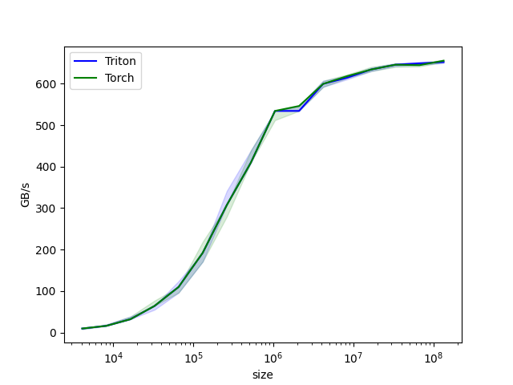

# [Triton 프로그래밍][기초] Triton 극간단 입문: Triton Vector Add

> 원문: https://zhuanlan.zhihu.com/p/1902778199261291694

### 0x00 서문

앞으로 CUDA와 Triton Kernel 프로그래밍 입문 수준의 글을 지속적으로 업데이트할 예정입니다. 비교적 기초적이고 간단하지만, 온고지신(溫故知新)의 느낌이 개인적으로 꽤 좋습니다.

더 많은 기술 노트와 CUDA 학습 노트는 LeetCUDA를 참고해 주세요. LeetCUDA에는 **LLM/VLM** 문서 정리와 **FlashAttention, SGEMM, HGEMM, GEMV** 등 주요 **CUDA Kernel**의 **예제 구현**이 포함되어 있으며 현재 **3k+ stars**를 달성했습니다. 링크: xlite-dev/LeetCUDA


LeetCUDA: Modern CUDA Learn Notes with PyTorch for Beginners

Triton 관련 노트 목록:
- [Triton편][기초] Triton 극간단 입문: Triton Vector Add
- [Triton편][기초] Triton Fused Softmax Kernel 상세: Python에서 PTX까지
- [Triton편][기초] vLLM Triton Merge Attention States Kernel 상세
- [Triton편][고급] vLLM Triton Prefix Prefill Kernel 도해

본 글의 내용:
- 0x00 서문
- 0x01 Triton 프로그래밍 기초
- 0x02 Triton Vector Add
- 0x03 PyTorch 래핑
- 0x04 PTX Gen code
- 0x05 성능
- 0x06 총결

### 0x01 Triton 프로그래밍 기초

핵심: **Triton의 프로그래밍 단위는 Block**(각 Block은 하나의 SM에만 스케줄링됨)이며, Thread가 아닙니다. 우리는 각 Block이 무엇을 해야 하는지만 고려하면 되고, Thread/Warp의 분배와 스케줄링은 Triton이 자동으로 처리합니다.

OpenAI Triton에 대해 여기서는 간단한 소개만 합니다. 인터넷에서 대량의 입문 글을 찾을 수 있으므로 본 글에서는 반복하지 않겠습니다. 본 글은 주로 기본 Kernel 구현에 초점을 맞추며, Triton 하위 레벨의 원리를 깊이 파고들지는 않습니다.


GPU 기본 아키텍처

전통적인 CUDA 기반 GPU 프로그래밍은 난이도가 높습니다. CUDA 코드를 최적화할 때 DRAM, SRAM, ALU 간의 데이터 흐름에서 Load/Store 문제를 고려해야 하며, Grid, Block, Thread, Warp 등 다양한 수준의 스케줄링 최적화 문제도 세심하게 고려해야 합니다. 이러한 문제는 다음을 포함하되 이에 국한되지 않습니다:
> 1. DRAM에서의 메모리 전송은 현대 메모리 인터페이스의 넓은 버스 폭을 활용하기 위해 대규모 트랜잭션으로 합체(coalesce)되어야 합니다.
> 2. 데이터는 재사용 전에 수동으로 SRAM에 저장되어야 하며, bank conflict를 최소화하도록 관리해야 합니다.
> 3. 계산은 스트리밍 멀티프로세서(SM) 간뿐만 아니라 내부에서도 세심하게 분할 및 스케줄링되어야 하며, 명령어/스레드 수준 병렬성을 촉진하고 전용 ALU(예: Tensor Core)를 활용해야 합니다.

따라서 CUDA 숙련공이라 하더라도 이론적 피크에 근접하는 성능의 Kernel을 작성하려면 상당한 노력이 필요합니다. Triton의 등장은 CUDA Kernel 작성의 난이도를 낮추었으며, 메모리 트랜잭션 합체, SRAM 할당 및 관리, 파이프라인 최적화 등 세심한 설계가 필요한 최적화 전략을 자동화하여 프로그래머가 알고리즘 자체에 더 많은 에너지를 쏟을 수 있게 했습니다.


Triton Compiler 컴파일 최적화

공식에서 제공한 이 표를 보면, Triton을 사용하면 메모리 트랜잭션 합체, SRAM 관리, SM 내 스레드 스케줄링이 모두 자동으로 수행되며, 우리는 SM 간 관리에만 신경 쓰면 됩니다. 즉, **Triton의 프로그래밍 단위는 Block**(각 Block은 하나의 SM에만 스케줄링됨)이며 Thread가 아닙니다. 우리는 각 Block이 무엇을 해야 하는지만 고려하면 됩니다. 그렇다면 Block이라는 개념이 Triton에서 무엇으로 표현될까요? 답은: **program**입니다.


Triton Block-wise 프로그래밍 모델

block → program, Triton에서는 **program_id**로 고유한 program을 식별합니다. 프로그래머는 하나의 program(block) 내의 프로그래밍 로직만 고려하면 됩니다. 예를 들어 가장 간단한 add_kernel이 있습니다. `x_ptr`, `y_ptr`, `output_ptr`는 각각 첫 번째 입력 벡터, 두 번째 입력 벡터, 출력 벡터의 포인터입니다. 이 벡터들은 GPU 메모리에 저장됩니다. 보통 PyTorch와 Triton을 함께 사용하며, Triton은 전달받은 Tensor를 데이터 텐서가 아닌 포인터로 처리합니다. `BLOCK_SIZE: tl.constexpr`는 Triton의 컴파일 시 상수로 각 block이 처리할 요소 수를 나타냅니다. `mask = offsets < n_elements`는 메모리 연산이 범위를 초과하지 않도록 mask를 생성합니다. tl.load와 tl.store는 각각 Triton의 데이터 로드와 저장 연산을 나타내며, Triton은 더 나은 성능 최적화를 위해 데이터 Tensor 수준이 아닌 포인터 수준에서 연산합니다.

### 0x02 Triton Vector Add

```python
import triton
import triton.language as tl

@triton.jit
def add_kernel(x_ptr,  # 첫 번째 입력 벡터의 *포인터*
               y_ptr,  # 두 번째 입력 벡터의 *포인터*
               output_ptr,  # 출력 벡터의 *포인터*
               n_elements,  # 벡터의 크기
               BLOCK_SIZE: tl.constexpr,  # 각 program이 처리할 요소 수
               ):
    # 여러 'program'(즉 block)이 서로 다른 데이터를 처리함
    # 여기서 우리가 어떤 program인지 식별:
    pid = tl.program_id(axis=0)  # 1D 런치 그리드를 사용하므로 axis는 0
    # 이 program은 초기 데이터에서 오프셋된 입력을 처리
    # 예: 길이 256의 벡터와 block_size 64라면,
    # 각 program은 [0:64, 64:128, 128:192, 192:256]에 접근
    block_start = pid * BLOCK_SIZE
    offsets = block_start + tl.arange(0, BLOCK_SIZE)
    # 범위 초과 접근을 방지하기 위한 mask 생성
    mask = offsets < n_elements
    # DRAM에서 x와 y 로드, 입력이 block 크기의 배수가 아닌 경우 추가 요소를 마스킹
    x = tl.load(x_ptr + offsets, mask=mask)
    y = tl.load(y_ptr + offsets, mask=mask)
    output = x + y
    # x + y를 DRAM에 다시 기록
    tl.store(output_ptr + offsets, output, mask=mask)
```

### 0x03 PyTorch 래핑

참고: Triton은 전달받은 Tensor를 데이터 텐서가 아닌 포인터로 처리합니다.

```python
def add(x: torch.Tensor, y: torch.Tensor):
    # 출력을 미리 할당해야 함
    output = torch.empty_like(x)
    assert x.is_cuda and y.is_cuda and output.is_cuda
    n_elements = output.numel()
    # SPMD 런치 그리드는 병렬로 실행되는 커널 인스턴스 수를 나타냄
    # CUDA 런치 그리드와 유사. add_kernel에는 1D 그리드를 사용하며 크기는 블록 수:
    grid = lambda meta: (triton.cdiv(n_elements, meta['BLOCK_SIZE']), )
    # 참고:
    #  - 각 torch.tensor 객체는 암묵적으로 첫 번째 요소의 포인터로 변환됨
    #  - `triton.jit` 함수는 런치 그리드를 인덱싱하여 호출 가능한 GPU 커널을 얻을 수 있음
    #  - 메타 파라미터를 키워드 인자로 전달하는 것을 잊지 말 것
    add_kernel[grid](x, y, output, n_elements, BLOCK_SIZE=1024)
    # z에 대한 핸들을 반환하지만, `torch.cuda.synchronize()`가 아직 호출되지 않았으므로
    # 커널은 여전히 비동기적으로 실행 중
    return output
```

Triton은 전달받은 Tensor를 데이터 텐서가 아닌 포인터로 처리한다는 점에 유의해야 합니다. 또한 Triton Kernel도 비동기 호출이므로 성능을 테스트할 때는 함수 반환 후 `torch.cuda.synchronize()`를 추가해야 합니다.

> 1. Program은 CUDA 프로그래밍의 Block에 해당하고, program_id는 block id에 해당합니다.
> 2. CUDA의 프로그래밍 모델이 grid-block-thread에서 **Block-wise**로 간소화됩니다. 커널 실행 시 grid 내 block의 레이아웃만 고려하면 됩니다. 예: grid=(M,N,D/BLOCK_K)는 이 grid가 3D block 레이아웃임을 나타냅니다.

### 0x04 PTX Gen code

Triton이 실제로 어떤 코드(PTX)를 생성하는지 정확히 아는 것은 성능 병목 분석에 도움이 됩니다. 여기서 Triton kernel을 분석하는 간단하고 효과적인 방법을 기록합니다(물론 ncu, nsys를 사용하면 더 좋습니다). 보통 Triton이 실제로 어떤 kernel을 생성했는지, 예를 들어 생성된 kernel PTX가 어떤 형태인지, 벡터화를 사용했는지, cp.async가 있는지, 합체 접근이 잘 되었는지 알고 싶습니다. 이때 TRITON_CACHE_DIR 환경 변수를 지정하여 Triton이 생성한 중간 IR 파일을 저장하여 분석할 수 있습니다.

```
export TRITON_CACHE_DIR=$(pwd)/cache
python3 triton_vector_add.py
# 생성된 코드 트리 확인
cd cache && tree .
.
├── QLAEYTJR4KV5WSBGJKRUAKVP475DE47NW7P4XMI2RFXBOIE5TZ4Q
│   └── cuda_utils.so
├── ZARIVSGCNM2WWDVKCRVGVJENDT5COGJCEQYAY47GLLIBDH2FTW2A
│   ├── add_kernel.cubin
│   ├── add_kernel.json
│   ├── add_kernel.llir
│   ├── add_kernel.ptx
│   ├── add_kernel.ttgir
│   ├── add_kernel.ttir
│   └── __grp__add_kernel.json
└── ZQ5DTL26WSB4LIKU54SE5N3EGMWSTLNP3XSOKNNVT6YBZ3ECSBOA
    └── __triton_launcher.so
```

Triton은 다단계 중간 IR을 생성합니다. 그 중 **ttir→ttgir→ttllir**은 Triton 컴파일 과정에서 소스 언어로 AST를 생성한 후 만들어지는 MLIR 표현으로, 단계별로 하강(Lowering)하여 최종적으로 MLIR 분석기를 거쳐 대상 하드웨어 프로그램(Backend)을 생성합니다. 구체적인 컴파일러 구현 세부 사항은 일단 무시합니다. 최종 생성된 **PTX와 cubin**은 대상 하드웨어와 관련된 코드/바이너리입니다(여기서는 NVIDIA GPU, CUDA). 따라서 개인적으로 대부분의 경우 PTX만 확인하면 됩니다. 즉 add_kernel.ptx이며, 본 사례에서 생성된 일부 PTX 어셈블리 코드:

```
 @%p2 ld.global.v4.b32 { %r13, %r14, %r15, %r16 }, [ %rd4 + 0 ];
    mov.b32     %f13, %r13;
    mov.b32     %f14, %r14;
    mov.b32     %f15, %r15;
    mov.b32     %f16, %r16;
    add.f32     %f17, %f1, %f9;
    add.f32     %f18, %f2, %f10;
    add.f32     %f19, %f3, %f11;
    add.f32     %f20, %f4, %f12;
    add.f32     %f21, %f5, %f13;
    add.f32     %f22, %f6, %f14;
    add.f32     %f23, %f7, %f15;
    add.f32     %f24, %f8, %f16;
    add.s64     %rd5, %rd9, %rd10;
    add.s64     %rd6, %rd5, 2048;
    mov.b32     %r17, %f17;
    mov.b32     %r18, %f18;
    mov.b32     %r19, %f19;
    mov.b32     %r20, %f20;
    @%p1 st.global.v4.b32 [ %rd5 + 0 ], { %r17, %r18, %r19, %r20 };
```

생성된 PTX 어셈블리 코드를 분석해보면, Triton이 add_kernel에 대해 ld.global.v4.b32와 st.global.v4.b32라는 벡터화 접근 명령어를 정확하게 사용했음을 발견합니다. Python 코드에서는 kernel 내에서 tl.load/tl.store만 호출하면 되며, 스레드 수준의 접근 합체는 Triton이 자동으로 수행합니다.

### 0x05 성능

마지막으로 Triton Vector Add Kernel과 PyTorch의 CUDA 구현 add 연산자의 성능을 간단히 비교합니다. 사례는 Triton 공식 예제 Vector Addition에서 수정했으며, LeetCUDA/openai-triton/elementwise에서 바로 실행할 수 있습니다. 아래 그림에서 보듯이, Triton Vector Add Kernel과 PyTorch의 add 연산자 성능은 기본적으로 동일합니다.


Triton Vector Add 성능

### 0x06 총결

본 글은 Triton Kernel 프로그래밍과 CUDA 프로그래밍의 주요 차이점을 간단히 비교하고, **Triton의 프로그래밍 단위는 Block**이며 Thread가 아니라 각 Block이 무엇을 해야 하는지만 고려하면 된다는 점을 설명했습니다. 또한 PTX 분석을 통한 Gen code 방식을 소개하여 Triton이 생성한 연산자가 기대에 부합하는지 판단할 수 있게 했습니다. 마지막으로 Vector Add 예시를 통해 Triton kernel 프로그래밍 방식을 설명했으며, 생성된 kernel과 PyTorch 네이티브 연산자의 성능이 동등합니다. 코드: LeetCUDA/openai-triton/elementwise

오류는 발견 후 수정합니다...
