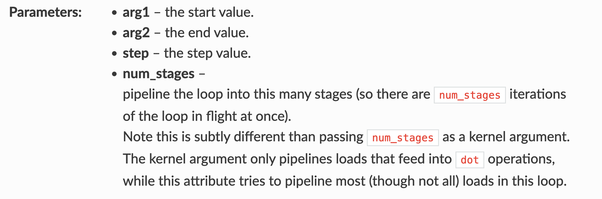
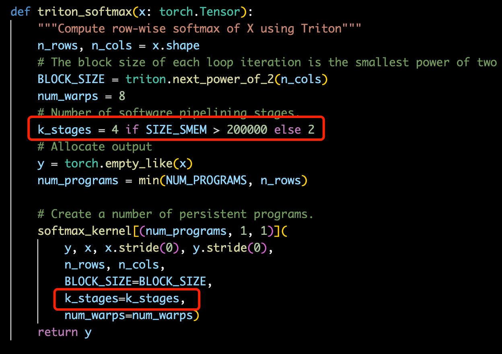
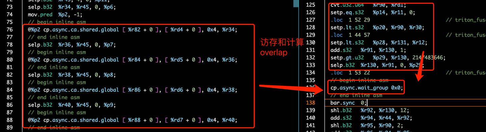
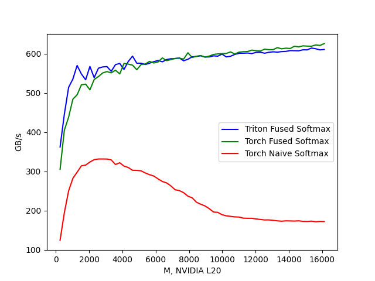

# Triton Fused Softmax Kernel 상세: Python 소스부터 PTX 분석까지

> 원문: https://zhuanlan.zhihu.com/p/1899562146477609112

**목차**
- 0x00 머리말
- 0x01 Naive Softmax 구현
- 0x02 Triton Fused Softmax 구현
- 0x03 row 인덱스 계산 방식
- 0x04 num_stages의 역할
- 0x05 num_programs 계산
- 0x06 성능 비교
- 0x07 정리

## 0x00 머리말


*Triton Fused Softmax Pipelining*

앞으로 CUDA와 Triton kernel 입문 수준의 글을 꾸준히 올릴 예정이다. 다소 얕은 내용이지만, 옛것을 되짚으며 새로 깨닫는(温故而知新) 감각이 좋다. 원본 문서 링크: Fused Softmax - Triton documentation. 다만 Triton 공식 Fused Softmax 예제 코드는 오랫동안 유지보수가 되지 않아 현재는 실행조차 안 된다. 본 글은 수정해서 동작하는 버전을 함께 제공한다.

저자의 더 많은 기술 노트와 CUDA 학습 노트는 LeetCUDA에서 확인할 수 있다. LeetCUDA는 LLM/VLM 관련 글 정리와 더불어 FlashAttention, SGEMM, HGEMM, GEMV 같은 대표적인 CUDA kernel 예제 구현을 담고 있으며, 현재 누적 3k+ stars를 기록했다. 링크: xlite-dev/LeetCUDA.


*LeetCUDA: Modern CUDA Learn Notes with PyTorch for Beginners*

저자의 Triton 관련 노트 목록:
- [Triton 기초] Triton 극간단 입문: Triton Vector Add
- [Triton 기초] Triton Fused Softmax Kernel 상세: Python에서 PTX까지
- [Triton 기초] vLLM Triton Merge Attention States Kernel 상세
- [Triton 고급] vLLM Triton Prefix Prefill Kernel 도해

## 0x01 Naive Softmax 구현

먼저 PyTorch로 row-wise naive softmax를 구현해 보자.

```python
import torch

def naive_softmax(x):
    """Compute row-wise softmax of X using native pytorch

    We subtract the maximum element in order to avoid overflows. Softmax is invariant to
    this shift.
    """
    # read MN elements; write M elements
    x_max = x.max(dim=1)[0]
    # read MN + M elements; write MN elements
    z = x - x_max[:, None]
    # read MN elements; write MN elements
    numerator = torch.exp(z)
    # read MN elements; write M elements
    denominator = numerator.sum(dim=1)
    # read MN + M elements; write MN elements
    ret = numerator / denominator[:, None]
    # in total: read 5MN + 2M; wrote 3MN + 2M
    return ret
```

코드 주석에 적힌 대로, naive softmax의 접근량은 읽기 5MN+2M, 쓰기 3MN+2M, 합쳐서 **8MN+4M**이다.

## 0x02 Triton Fused Softmax 구현

`softmax_kernel`의 핵심 아이디어는 다음과 같다. kernel에 num_programs개의 program(즉 thread block, 이후 program = thread block으로 보겠다)을 할당하고, 각 thread block은 서로 겹치지 않는 row 집합을 처리한다. 각 row에 대해서는 safe softmax를 수행한다. 먼저 max를 구하고, 다음으로 exp를 구한 뒤, 마지막으로 `softmax_output = numerator / denominator`로 정규화한다. 이 softmax_kernel은 x를 한 번만 읽고 y를 한 번만 쓰면 된다. naive softmax의 **8MN+4M** 접근량과 비교하면 Triton softmax_kernel은 **2MN**만 필요하며, **원래의 약 1/4** 수준이다.

```python
@triton.jit
def softmax_kernel(output_ptr, input_ptr, input_row_stride, output_row_stride, n_rows, n_cols, BLOCK_SIZE: tl.constexpr,
                   num_stages: tl.constexpr):
    # starting row of the program
    row_start = tl.program_id(0)
    row_step = tl.num_programs(0)
    for row_idx in tl.range(row_start, n_rows, row_step, num_stages=num_stages):
        # The stride represents how much we need to increase the pointer to advance 1 row
        row_start_ptr = input_ptr + row_idx * input_row_stride
        # The block size is the next power of two greater than n_cols, so we can fit each
        # row in a single block
        col_offsets = tl.arange(0, BLOCK_SIZE)
        input_ptrs = row_start_ptr + col_offsets
        # Load the row into SRAM, using a mask since BLOCK_SIZE may be > than n_cols
        mask = col_offsets < n_cols
        row = tl.load(input_ptrs, mask=mask, other=-float('inf'))
        # Subtract maximum for numerical stability
        row_minus_max = row - tl.max(row, axis=0)
        # Note that exponentiation in Triton is fast but approximate (i.e., think __expf in CUDA)
        numerator = tl.exp(row_minus_max)
        denominator = tl.sum(numerator, axis=0)
        softmax_output = numerator / denominator
        # Write back output to DRAM
        output_row_start_ptr = output_ptr + row_idx * output_row_stride
        output_ptrs = output_row_start_ptr + col_offsets
        tl.store(output_ptrs, softmax_output, mask=mask)
```

## 0x03 row 인덱스 계산 방식

kernel에서 핵심은 다음 세 줄이다. (`tl.range` API docs)

```python
row_start = tl.program_id(0)
row_step = tl.num_programs(0)
for row_idx in tl.range(row_start, n_rows, row_step, num_stages=num_stages)
```

`tl.range` 문서에 따르면 이 함수는 Python/torch의 range와 같은 기능을 한다. `row_start`는 block idx로 [0, num_programs) 범위 값이고, `row_step`은 num_programs의 실제 값이다. 예컨대 num_programs=10이면 이 kernel에 thread block 10개가 할당된 셈이다. 그런데 왜 row를 num_programs(row_step) 간격으로 잡는 걸까? 처음 보면 직관적이지 않다. 풀어서 살펴보자. n_rows=100, row_step=num_programs=10, row_start는 block idx로 [0, num_programs=10) 범위라 하면:

```python
>>> list(range(0, 100, 10))  # thread block 0, row_start 0
[0, 10, 20, 30, 40, 50, 60, 70, 80, 90]
>>> list(range(1, 100, 10))  # thread block 1, row_start 1
[1, 11, 21, 31, 41, 51, 61, 71, 81, 91]
>>> list(range(2, 100, 10))  # thread block 2, row_start 2
[2, 12, 22, 32, 42, 52, 62, 72, 82, 92]
```

펼쳐 보면 각 thread block이 담당하는 row 인덱스가 서로 중복되지 않음을 알 수 있다. 다만 이 kernel의 변수 명명 방식은 다소 헷갈린다. 이 **교차된 인덱스 레이아웃**은 직관적이지 않은데, L2 cache hit rate를 고려한 선택이 아닐까 추측한다. 그렇지 않다면 [0,10), [10,20), …, [90,100)처럼 잡는 편이 더 직관적이었을 것이다.

## 0x04 num_stages의 역할

먼저 `tl.range`의 API 문서를 보자.


*tl.range API 문서*

`tl.range`에서 `num_stages`는 현재 for loop를 **다단 파이프라인화**하라는 의미다. 즉 loop 한 번의 iteration에서 num_stages개 분량의 데이터(num_stages개의 row)를 로드한다. PTX 명령어로는 **cp.async**에 해당할 것이다. 즉 cp.async와 num_stages를 활용해 다단 파이프라인을 만들고, kernel 내 연산과 메모리 접근을 overlap해서 성능을 끌어올린다는 뜻이다. 실제로 그런지 확인하기 위해 generated code를 dump 받아 PTX를 분석해 보자. `TRITON_CACHE_DIR` 환경 변수로 Triton이 생성한 중간 IR을 저장할 수 있다.

```bash
export TRITON_CACHE_DIR=$(pwd)/cache
python3 triton_fused_softmax.py
cd cache && tree .
.
├── 0d7duE9PwZgNUtoh6wb3yun356hXMwGHw2TM8-BcO5s
│   └── __triton_launcher.so
├── Jd4HhUM5PbKNdPpOLLxG6knNnfS3WPM3oXHA6POM45M
│   ├── __grp__softmax_kernel.json
│   ├── softmax_kernel.cubin
│   ├── softmax_kernel.json
│   ├── softmax_kernel.llir
│   ├── softmax_kernel.ptx
│   ├── softmax_kernel.ttgir
│   └── softmax_kernel.ttir
└── q4oIpkjOtdHHfi8xBkm4jC4JWIk5AjKtN8WRkZb8MD8
    └── cuda_utils.so
```

우리는 `softmax_kernel.ptx`만 보면 된다. 코드에서 `k_stages=num_stages=4`로 지정했다.


*k_stages=num_stages=4*

`softmax_kernel.ptx`에서는 cp.async 명령이 4번 호출되어 있다(아래 그림). cp.async를 4번 호출한 뒤 commit_group을 수행하고, 약간의 연산을 한 다음 wait_group을 호출한다. 데이터가 SRAM에 로드되면 그 다음 연산이 이어진다. 다만 생성된 PTX를 보면 Triton의 pipeline 로직이 최적은 아니다. `wait_group 0x0`을 호출하기 때문에 결국 모든 메모리 트랜잭션이 완료되어야만 exp 등의 연산이 시작된다.


*메모리 접근과 연산의 overlap*

## 0x05 num_programs 계산

Triton Fused Softmax 예제에서 num_programs 값은 즉흥적으로 정한 게 아니다. kernel이 사용하는 register 수, 현재 device의 SM 수, device가 지원하는 최대 register 수, occupancy를 기반으로 계산한다.

```python
properties = driver.active.utils.get_device_properties(DEVICE.index)
NUM_SM = properties["multiprocessor_count"]
NUM_REGS = properties["max_num_regs"]
SIZE_SMEM = properties["max_shared_mem"]
WARP_SIZE = properties["warpSize"]
target = triton.runtime.driver.active.get_current_target()
kernels = {}

def sofmax(x):
    n_rows, n_cols = x.shape
    # The block size of each loop iteration is the smallest power of two greater than the number of columns in `x`
    BLOCK_SIZE = triton.next_power_of_2(n_cols)
    num_warps = 8

    # Number of software pipelining stages.
    num_stages = 4 if SIZE_SMEM > 200000 else 2

    # Allocate output
    y = torch.empty_like(x)
    # pre-compile kernel to get register usage and compute thread occupancy.
    kernel = softmax_kernel.warmup(y, x, x.stride(0), y.stride(0), n_rows, n_cols, BLOCK_SIZE=BLOCK_SIZE,
                                   num_stages=num_stages, num_warps=num_warps, grid=(1, ))
    kernel._init_handles()
    n_regs = kernel.n_regs
    size_smem = kernel.metadata.shared
    if is_hip():
        # ...
    else:  # CUDA
        occupancy = NUM_REGS // (n_regs * WARP_SIZE * num_warps)
    occupancy = min(occupancy, SIZE_SMEM // size_smem)
    num_programs = NUM_SM * occupancy

    num_programs = min(num_programs, n_rows)

    # Create a number of persistent programs.
    kernel[(num_programs, 1, 1)](y, x, x.stride(0), y.stride(0), n_rows, n_cols, BLOCK_SIZE, num_stages)
```

그러나 Triton 공식 Fused Softmax 예제 코드는 **오랫동안 방치되어 지금은 전혀 동작하지 않는다**. NUM_SM, NUM_REGS 같은 속성을 가져오는 방식도 최신 Triton API에서는 제거되었다. pycuda로 동등한 코드를 짜 두었다.

```python
def get_device_properties(device_id=None):
    import pycuda.driver as cuda
    import pycuda.autoinit
    device = (cuda.Device(device_id) if device_id is not None
              else torch.cuda.current_device())
    NUM_SM = device.get_attribute(
        cuda.device_attribute.MULTIPROCESSOR_COUNT)
    NUM_REGS = device.get_attribute(
        cuda.device_attribute.MAX_REGISTERS_PER_BLOCK)
    SIZE_SMEM = device.get_attribute(
        cuda.device_attribute.MAX_SHARED_MEMORY_PER_BLOCK)
    WARP_SIZE = device.get_attribute(
        cuda.device_attribute.WARP_SIZE)
    return NUM_SM, NUM_REGS, SIZE_SMEM, WARP_SIZE
```

## 0x06 성능 비교

Triton 공식 Fused Softmax 예제 코드는 오랫동안 방치되어 현재 실행이 불가능하다. 본 글에서는 수정해서 돌아가는 버전을 제공한다. 코드: triton fused-softmax. 성능 결과는 아래와 같다. 앞 분석대로 triton softmax_kernel은 x를 한 번 읽고 y를 한 번 쓰면 충분하며, naive softmax의 **8MN+4M** 접근량에 비해 **2MN**, 즉 **원래의 약 1/4**이다. 테스트 결과에서도 triton-fused-softmax의 대역폭 throughput이 naive-softmax 대비 약 **4배**로 나타났고, 이는 우리 분석 결과와 일치한다.


*4x throughput 가속*

## 0x07 정리

본 글은 Triton Fused Softmax Kernel의 구현 로직을 상세히 다뤘다. Fused Softmax의 접근량은 naive softmax의 1/4에 불과하다는 점을 분석했고, PTX 수준까지 내려가 `tl.range`의 `num_stages`가 어떻게 다단 파이프라인(cp.async)을 구현하는지 살펴봤다. 마지막으로, 오랫동안 방치돼 있던 Triton Fused Softmax 코드를 수정해 benchmark를 통과시켰고, 성능 결과는 이론 분석과 일치해 대역폭 throughput이 4x 향상되었음을 확인했다. 코드: triton fused-softmax.

저자의 더 많은 기술 노트와 CUDA 학습 노트는 LeetCUDA를 참고하면 된다. LeetCUDA에는 LLM/VLM 관련 글 정리와 FlashAttention, SGEMM, HGEMM, GEMV 같은 대표 CUDA kernel 예제 구현이 포함돼 있으며, 누적 3k+ stars를 기록 중이다. 링크: xlite-dev/LeetCUDA.


*LeetCUDA: Modern CUDA Learn Notes with PyTorch for Beginners*

늘 그렇듯, 오류는 발견 즉시 갱신하고 수정해 나가겠다.
