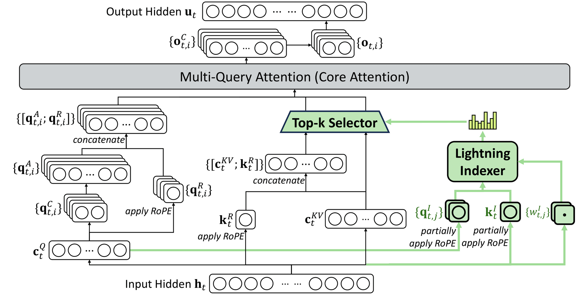

# DeepSeek V3.2 DSA 연산자로 살펴보는 TileLang 컴파일러의 세부 사항

> 서문의 서문: 최근 휴가 기간에 마침 이전 TVM 시절의 내용을 다시 살펴보다가, Ansor의 1저자이자 Tensor IR의 저자가 바로 SGLang 프로젝트의 핵심 발기인인 Lianmin 신이라는 것을 알게 되어 깊이 존경하게 되었다. SGLang 개발 과정에서도 운 좋게 많은 도움을 받아 매우 기뻤다. 그리고 TileLang 저자인 Wang Lei 박사 역시 TVM에서 시작해 점점 영향력이 커지고 있는 새로운 DSL인 TileLang을 만들어 냈다는 것을 알게 되었고, 이전에 즈후에서 비교적 관심 있게 보던 컴파일 최적화 분야의 Zheng Size는 ByteDance에서 Triton-distributed를 만들어 냈다. 예전 컴파일러 분야의 고수들이 모두 대규모 모델 분야에서 매우 solid한 성과를 내고 있다.

> 국경절 전후로 최근 DeepSeek V3.2의 DSA(DeepSeek Sparse Attention) 연산자 구현을 기반으로 TileLang이 이러한 연산자들을 어떻게 효율적으로 구현하는지 자세히 살펴보았다. 이 블로그를 완성하는 데 오랜 시간이 걸렸고, 블로그에 너무 많은 오류가 생기지 않도록 TileLang에 대해서도 좀 더 충분히 이해하게 되었다. 앞으로도 가능하면 TileLang으로 일부 연산자를 더 많이 구현하고, TileLang의 최적화 기법에 대해서도 가능한 한 더 많이 알아볼 생각이다. 현재 TileLang의 몇 가지 설계상의 장점을 체감하고 있지만, DSA 관련 연산자의 모든 TileLang 코드와 세부 사항을 다 읽고 나니 사람이 완전히 움직일 수 없는 상태가 되었다. DSA 관련 연산자만 놓고 보면 MLA, Sparse MLA 같은 이 TileLang의 복잡한 구현의 핵심 연산자는 TileLang 메커니즘을 매우 잘 이해하고 TileLang 개발에 깊이 참여한 사람이 작성해야 한다. 다만 좀 더 간단한 연산자 작업이라면 우리가 TileLang으로 해도 문제 없을 것이고, 복잡한 작업은 Wang Lei 박사의 TileLang 팀을 믿으면 된다. 일상적으로 관찰해 보면 TileLang은 열정으로 가득 찬 오픈소스 프로젝트다. TileLang 프로젝트 주소: https://github.com/tile-ai/tilelang , 더 많은 사람이 기여하기를 바라며 현재 활약할 수 있는 공간도 꽤 클 것이다.

> 본문에서 분석하는 TileLang commit은 7fb06776b0cc326718e690800f2463dc335f5111 이며, 관련 코드 행 번호 지정은 모두 이 commit에 대응한다. Sparse MLA Forward부터의 내용은 이해에 오류가 있을 수 있으니 신중하게 보고 정정해 주기를 바란다. 감사하다.

## 0x0. 서문

DeepSeek V3.2는 긴 시퀀스 모델링을 최적화하기 위해 DeepSeek Sparse Attention (DSA) 메커니즘을 도입했다. 전통적인 full attention 메커니즘과 비교해, DSA는 가장 관련성 높은 Key-Value 쌍을 동적으로 선택해 attention을 계산함으로써 계산 복잡도를 O(N²)에서 O(N×K)로 낮춘다. 여기서 K는 선택된 top-k의 크기이며 시퀀스 길이 N보다 훨씬 작다.

TileLang에 대한 소개는 프로젝트 저자인 Wang Lei 박사의 즈후 글을 직접 참고하면 된다. 예를 들어 고성능 GPU 행렬 곱셈의 한 가지 TileLang 구현(https://zhuanlan.zhihu.com/p/20718641070), TileLang 즉시 컴파일!(https://zhuanlan.zhihu.com/p/25425216622) 등이 있다. 또한 ryume의 TileLang: 80줄의 Python kernel 코드로 FlashMLA 성능의 95% 구현하기(https://zhuanlan.zhihu.com/p/27965825936)도 있다. 공식 문서도 꽤 좋으니, 입문하려면 프로젝트의 examples 디렉터리부터 시작하면 된다.

본문은 다음 몇 가지 측면에서 다룬다:
1. **DeepSeek V3.2 DSA 연산자 원리**: DSA의 핵심 아이디어와 세 가지 핵심 연산자
2. **TileLang 구현 분석**: 각 연산자의 TileLang 구현 세부 사항

비록 두 가지뿐이지만 매우 길게 작성했으니 필요에 따라 보면 된다.

## 0x1. DeepSeek V3.2 DSA 연산자 원리

DSA 연산자의 더 자세한 원리는 Zarbot의 공식 계정 글을 참고할 수 있다: [DeepSeek-V3.2를 학습해 보자](https://mp.weixin.qq.com/s/LYhfpduM72hEJJGe2GFDXw)

### 1.1 DSA 전체 아키텍처

DeepSeek V3.2의 DeepSeek Sparse Attention은 세 가지 핵심 모듈로 구성된다:



**1. Lightning Indexer(빠른 인덱서)**
- 입력: Query와 Key의 저차원 압축 표현(Index Vectors)
- 출력: 각 Query 위치와 모든 Key 위치 간 유사도 점수 행렬(Logits)
- 목표: 관련 가능성이 있는 Key-Value 쌍을 빠르게 선별

**2. Top-k Selector(Top-k 선택기)**
- 입력: Logits 행렬(Lightning Indexer의 출력)
- 출력: 각 Query 위치가 선택한 top-k개의 Key 위치 인덱스
- 목표: 유사도 점수에서 가장 관련성 높은 K개의 위치를 정밀하게 선택

**3. Sparse MLA(희소 Multi-Head Latent Attention)**
- 입력: Query, Key-Value cache, Top-k 인덱스
- 출력: attention 출력
- 목표: 선택된 K개의 위치에서만 완전한 attention 계산

### 1.2 Lightning Indexer 원리

Lightning Indexer는 FP8로 양자화된 저차원 Index Vectors를 사용해 Query와 Key 간 유사도를 빠르게 계산한다. 구체적인 흐름은 다음과 같다:

1. **압축 표현**: 고차원의 Query와 Key를 저차원 공간(예: 128차원)으로 투영하고 FP8로 양자화한다
2. **빠른 계산**: FP8 GEMM을 사용해 `index_score = ReLU(Q_index @ K_index^T) * weights`를 계산한다
3. **희소 최적화**: per-token의 시퀀스 경계 정보(`CuSeqLenKS`와 `CuSeqLenKE`)를 활용해 무관한 계산을 건너뛴다

핵심 공식:
```
s = Q_index @ K_index^T  # FP8 GEMM
s = ReLU(s) * weights    # ReLU + 가중치 적용
logits = sum(s, dim=heads)  # head 간 집계
```

### 1.3 Top-k Selector 원리

Top-k Selector는 길이가 N인 시퀀스에서 K개의 최댓값 인덱스를 선택해야 하며, Radix Sort 기반의 2단계 알고리즘을 채택한다:

**Stage 1: 거친 단위 선별**
- float32 logits를 uint16으로 변환(8비트 지수 + 부호)
- 모든 원소에 대해 8비트 히스토그램을 구축
- 누적 합을 통해 임계 bin을 찾고, 임계값보다 큰 모든 원소를 직접 출력

**Stage 2: 정밀화 처리**
- 임계 bin에 있는 원소들에 대해 최대 4라운드의 8비트 radix sort 수행
- 매 라운드마다 더 높은 8비트를 처리하며 점진적으로 정밀하게 선별

이 방법은 전체 시퀀스를 정렬하는 것을 피하므로 시간 복잡도가 O(N log N)이 아닌 O(N)이다.

### 1.4 Sparse MLA 원리

Sparse MLA는 계산 측면에서 Dense MLA와 거의 완전히 동일하며, 유일한 차이는 반복 패턴이다:

**Dense MLA**:
```python
for k in range(0, seq_len_kv, block_size):
    load KV[k:k+block_size]
    compute attention
```

**Sparse MLA**:
```python
for i in range(0, topk, block_size):
    indices = TopK_Indices[i:i+block_size]
    load KV[indices]  # 인덱스에 따라 로드
    compute attention
```

이렇게 해서 계산량을 O(seq_len * seq_len_kv)에서 O(seq_len * topk)로 낮춘다.

## 0x2. TileLang으로 DSA 연산자 구현 상세 분석

이 절에서는 TileLang으로 구현한 각 DSA 연산자를 다음을 포함해 자세히 설명한다:
1. **연산자 기능**: 이 연산자가 무엇을 하는지
2. **입력 출력**: 입력과 출력의 형상과 타입
3. **참조 구현**: PyTorch의 naive 구현
4. **TileLang 구현**: kernel 코드 설명
5. **테스트 코드**: 정확성을 어떻게 검증하는지

### 2.0 HuggingFace Model에서의 DSA 모듈 통합

TileLang 구현을 설명하기 전에, DSA 모듈이 DeepSeek V3.2 모델에 어떻게 통합되어 있는지 먼저 살펴본다.

**HuggingFace Model 구현 위치**:
- Model 메인 파일: `https://huggingface.co/deepseek-ai/DeepSeek-V3.2-Exp/blob/main/inference/model.py`
- Kernel 구현: `https://huggingface.co/deepseek-ai/DeepSeek-V3.2-Exp/blob/main/inference/kernel.py`

**DSA 모듈의 삽입 위치**:

DeepSeek V3.2의 MLA(Multi-Head Latent Attention) 레이어에서 DSA는 `forward` 메서드에 통합되어 있다:

```python
# model.py 의 MLA 클래스에서
class MLA(nn.Module):
    def __init__(self, args: ModelArgs):
        super().__init__()
        # ... 그 외 초기화
        self.indexer = Indexer(args)  # Lightning Indexer 모듈
    
    def forward(self, x: torch.Tensor, start_pos: int, freqs_cis: torch.Tensor, 
                mask: Optional[torch.Tensor]):
        # 1. Q, KV 압축 표현 계산
        qr = self.q_norm(self.wq_a(x))
        q = self.wq_b(qr)
        kv = self.wkv_a(x)
        
        # 2. Indexer를 사용해 유사도를 계산하고 top-k 선택
        if mask is not None:  # Prefill 단계
            # Lightning Indexer를 호출해 logits 계산
            topk_indices = self.indexer(x, qr, start_pos, freqs_cis, mask)
            # topk_indices: [batch, seq_len, kv_group, topk]
            
            # 3. top-k 인덱스를 사용해 희소 attention 계산
            # index mask를 생성해, 선택된 position에만 attend
            index_mask = torch.full((bsz, seqlen, seqlen), float("-inf"), 
                                   device=x.device).scatter_(-1, topk_indices, 0)
            scores += index_mask.unsqueeze(2)
        else:  # Decode 단계
            # 동일한 로직이지만 decode에 맞게 최적화
            topk_indices = self.indexer(x, qr, start_pos, freqs_cis, mask)
            index_mask = torch.full((bsz, 1, end_pos), float("-inf"), 
                                   device=x.device).scatter_(-1, topk_indices, 0)
            scores += index_mask.unsqueeze(2)
```

**DSA의 세 가지 핵심 연산자 호출 흐름**:

```
Input Hidden States
        ↓
[Lightning Indexer]
    fp8_index() in kernel.py
        ↓
    Logits [seq_len, seq_len_kv]
        ↓
[Top-k Selector]  
    torch.topk() or custom kernel
        ↓
    Indices [seq_len, topk]
        ↓
[Sparse MLA]
    Standard attention with sparse indexing
        ↓
    Output [seq_len, heads, dim]
```

TileLang의 완전한 구현은 `tilelang/examples/deepseek_v32/` 디렉터리 아래에 있으며, 다음을 포함한다:
- `fp8_lighting_indexer.py`: Lightning Indexer의 TileLang 구현
- `topk_selector.py`: Top-k Selector의 TileLang 구현
- `sparse_mla_fwd.py`: Sparse MLA Forward의 기본 구현
- `sparse_mla_fwd_pipelined.py`: Sparse MLA Forward의 고성능 Pipelined 구현
- `sparse_mla_bwd.py`: Sparse MLA Backward 구현
- `inference/`: HuggingFace 버전에 대응하는 완전한 추론 구현

### 2.1 Lightning Indexer 구현

**파일 경로**: `tilelang/examples/deepseek_v32/fp8_lighting_indexer.py`

#### 2.1.1 연산자 기능과 입력 출력

**Lightning Indexer는 무엇을 하는가?**

Lightning Indexer는 DSA의 첫 번째 단계로, 그 역할은 **각 Query 위치와 모든 Key 위치 간의 유사도 점수를 빠르게 계산하는 것**이다. 이 점수는 이후 Top-k Selector가 가장 관련성 높은 K개의 위치를 선택하는 데 사용된다.

**입력 텐서**:
```python
# 입력1: Query의 Index 벡터(FP8 양자화)
IndexQ: [seq_len * heads, index_dim]  # 예: [4096 * 32, 128]

# 입력2: Key의 Index 벡터(FP8 양자화)
IndexK: [seq_len_kv, index_dim]       # 예: [8192, 128]

# 입력3: Key의 FP8 양자화 scale
IndexKScale: [seq_len_kv]             # 예: [8192]

# 입력4: 각 Query head의 가중치
Weights: [seq_len, heads]             # 예: [4096, 32]

# 입력5: 각 Query 위치의 KV 시작 인덱스
CuSeqLenKS: [seq_len]                 # 예: [4096]

# 입력6: 각 Query 위치의 KV 끝 인덱스
CuSeqLenKE: [seq_len]                 # 예: [4096]
```

**출력 텐서**:
```python
# 출력: 유사도 점수 행렬
Logits: [seq_len, seq_len_kv]        # 예: [4096, 8192]
```

**계산 로직**:
```
각 Query 위치 i 에 대해:
    1. 해당 위치의 모든 head의 Query 벡터를 로드: q[i, :, :]
    2. 유효 범위 내의 Key 벡터만 로드: k[CuSeqLenKS[i]:CuSeqLenKE[i], :]
    3. 유사도 계산: s = ReLU(q @ k.T) * weights[i, :]
    4. head 간 집계: logits[i, :] = sum(s, dim=heads) * k_scale
```

#### 2.1.2 PyTorch 참조 구현

**파일 경로**: `tilelang/examples/deepseek_v32/fp8_lighting_indexer.py` (제243-259행)

연산자의 수학적 로직을 이해하기 쉽도록 먼저 PyTorch 참조 구현을 살펴본다:

```python
def ref_fp8_mqa_logits(q: torch.Tensor, kv: torch.Tensor, weights: torch.Tensor,
                       cu_seqlen_ks: torch.Tensor, cu_seqlen_ke: torch.Tensor):
    """
    Lightning Indexer의 PyTorch 참조 구현
    
    매개변수:
        q: Query 텐서 [seq_len, heads, index_dim]
        kv: Key 텐서 [seq_len_kv, index_dim]
        weights: 각 head의 가중치 [seq_len, heads]
        cu_seqlen_ks: 각 Query 위치의 KV 시작 인덱스 [seq_len]
        cu_seqlen_ke: 각 Query 위치의 KV 끝 인덱스 [seq_len]
    
    반환:
        logits: 유사도 점수 [seq_len, seq_len_kv]
        cost: 실제로 계산된 원소 개수(성능 분석용)
    """
    k = kv
    q = q.float()  # FP32로 변환해 계산
    k = k.float()
    
    seq_len_kv = kv.shape[0]
    
    # 단계1: mask를 구축해 각 Query 위치의 유효 KV 범위를 표시
    # mask_lo[i, j] = True if j >= cu_seqlen_ks[i]
    mask_lo = torch.arange(0, seq_len_kv, device='cuda')[None, :] >= cu_seqlen_ks[:, None]
    # mask_hi[i, j] = True if j < cu_seqlen_ke[i]
    mask_hi = torch.arange(0, seq_len_kv, device='cuda')[None, :] < cu_seqlen_ke[:, None]
    # >= ks 이고 동시에 < ke 인 위치만 유효
    mask = mask_lo & mask_hi
    
    # 단계2: Query와 Key의 유사도 계산
    # einsum 'mhd,nd->hmn' 의 의미:
    #   m: seq_len 차원
    #   h: heads 차원
    #   d: index_dim 차원
    #   n: seq_len_kv 차원
    # 계산 결과: score[h, m, n] = sum_d(q[m, h, d] * k[n, d])
    score = torch.einsum('mhd,nd->hmn', q, k)
    
    # 단계3: ReLU 활성화 함수 적용 및 가중치 적용
    # score.relu(): 음수 값을 0으로
    # weights.unsqueeze(-1).transpose(0, 1): [seq_len, heads] -> [heads, seq_len, 1]
    # 곱한 후 가중된 score 획득: [heads, seq_len, seq_len_kv]
    # sum(dim=0): heads 간 집계, 결과: [seq_len, seq_len_kv]
    logits = (score.relu() * weights.unsqueeze(-1).transpose(0, 1)).sum(dim=0)
    
    # 단계4: mask 적용, 유효하지 않은 위치를 -inf 로 설정
    logits = logits.masked_fill(~mask, float('-inf'))
    
    # 실제 계산량(유효 원소 개수) 계산
    cost = mask.sum()
    
    return logits, cost
```

**한 줄씩 설명**:

1. **mask 구축**(제250-252행):
   ```python
   mask_lo = torch.arange(0, seq_len_kv, device='cuda')[None, :] >= cu_seqlen_ks[:, None]
   mask_hi = torch.arange(0, seq_len_kv, device='cuda')[None, :] < cu_seqlen_ke[:, None]
   mask = mask_lo & mask_hi
   ```
   - `mask_lo`와 `mask_hi`는 형상이 `[seq_len, seq_len_kv]`인 2D boolean tensor를 구축한다
   - `mask[i, j] = True`는 i번째 Query 위치가 j번째 Key 위치에 attend할 수 있음을 의미한다
   - 이는 가변 길이 시퀀스와 causal mask 요구를 처리하기 위함이다

2. **유사도 계산**(제254행):
   ```python
   score = torch.einsum('mhd,nd->hmn', q, k)
   ```
   - 이것은 batched 행렬 곱셈이다: 각 head에 대해 `q[m, :] @ k.T`를 계산
   - 결과 형상: `[heads, seq_len, seq_len_kv]`

3. **ReLU + 가중치 적용 + 집계**(제255행):
   ```python
   logits = (score.relu() * weights.unsqueeze(-1).transpose(0, 1)).sum(dim=0)
   ```
   - `score.relu()`: 양의 유사도만 유지
   - `weights.unsqueeze(-1).transpose(0, 1)`: weights 형상을 `[heads, seq_len, 1]`로 조정
   - 곱한 후 heads 차원으로 sum 하여 최종 집계된 logits 획득

4. **mask 적용**(제256행):
   ```python
   logits = logits.masked_fill(~mask, float('-inf'))
   ```
   - 유효하지 않은 위치를 음의 무한대로 채운다. 이후 softmax 시 이 위치들은 0이 된다

#### 2.1.3 TileLang Kernel 구현

다음으로 TileLang 구현을 살펴보며, 각 부분의 역할을 한 줄씩 설명한다.

**파일 경로**: `tilelang/examples/deepseek_v32/fp8_lighting_indexer.py` (제88-179행)

**제1부분: JIT 데코레이터와 매개변수 정의**(제88-108행)

```python
@tilelang.jit(
    pass_configs={
        tilelang.PassConfigKey.TL_ENABLE_FAST_MATH: True,  # 빠른 수학 연산 최적화 활성화
    },)
def mqa_attn_return_logits(
    heads,          # attention head 수, 예: 32
    index_dim,      # Index 벡터의 차원, 예: 128
    block_N=256,    # Key의 block 크기, 한 번에 256개 Key 처리
    num_stages=3,   # Pipeline의 stage 수, 메모리 레이턴시 은닉에 사용
    threads=512,    # 각 thread block의 스레드 수
    block_Q=None,   # Query의 block 크기, None이면 자동 계산
):
    # block_Q가 지정되지 않으면 heads 수에 따라 자동 계산
    # 목표는 block_Q * heads ≤ 128 이 되도록 해 register 사용을 합리적으로 유지
    if block_Q is None:
        block_Q = 128 // heads
    
    # 데이터 타입 정의
    dtype = "float8_e4m3"    # FP8 데이터 타입, 메모리와 대역폭 절약
    accum_dtype = "float"    # 누적은 FP32 사용, 정밀도 보장
    index_dtype = "int32"    # 인덱스 타입
    
    # 심볼릭 차원(런타임에 결정)
    seq_len = T.symbolic("seq_len")       # Query 시퀀스 길이
    seq_len_kv = T.symbolic("seq_len_kv") # Key 시퀀스 길이
```

**설명**:
- `@tilelang.jit`: Python 함수를 GPU kernel로 컴파일
- `TL_ENABLE_FAST_MATH`: 빠르지만 정밀도가 약간 낮아지는 수학 연산을 활성화
- `block_Q`와 `block_N`: tile의 크기를 정의하며, shared memory 사용량과 병렬도에 영향을 준다
- `num_stages`: Pipeline 깊이로, 클수록 레이턴시 은닉 효과가 좋지만 더 많은 shared memory가 필요하다

**제2부분: Kernel 함수 정의**(제114-123행)

```python
@T.prim_func
def mqa_attn_return_logits_kernel(
        IndexQ: T.Tensor([seq_len * heads, index_dim], dtype),        # Query Index 벡터
        IndexK: T.Tensor([seq_len_kv, index_dim], dtype),             # Key Index 벡터
        IndexKScale: T.Tensor([seq_len_kv], accum_dtype),             # Key의 FP8 scale
        Logits: T.Tensor([seq_len, seq_len_kv], accum_dtype),         # 출력 logits
        Weights: T.Tensor([seq_len, heads], accum_dtype),             # Head 가중치
        CuSeqLenKS: T.Tensor([seq_len], index_dtype),                 # KV 시작 인덱스
        CuSeqLenKE: T.Tensor([seq_len], index_dtype),                 # KV 끝 인덱스
):
    # Grid 구성: 각 block은 block_Q개의 Query 위치를 처리
    with T.Kernel(T.ceildiv(seq_len, block_Q), threads=threads) as bx:
```

**설명**:
- `@T.prim_func`: TileLang의 primitive function 정의
- `T.Tensor`: 입력 출력 tensor의 형상과 타입 정의
- `T.Kernel(...) as bx`: kernel을 시작, `bx`는 block index(grid 차원)
- `T.ceildiv(seq_len, block_Q)`: 모든 Query를 처리하는 데 필요한 block 수 계산

**제3부분: 메모리 할당**(제126-132행)

```python
# 공유 메모리(Shared Memory) 할당
index_q_shared = T.alloc_shared([block_Q * heads, index_dim], dtype)  
# 현재 block의 모든 Query 저장, 크기 약: block_Q * 32 * 128 * 1B = 4KB

index_k_shared = T.alloc_shared([block_N, index_dim], dtype)  
# 현재 반복의 Key block 저장, 크기 약: 256 * 128 * 1B = 32KB

# register(Fragment/Register) 할당
index_k_scale_fragment = T.alloc_fragment([block_N], accum_dtype)  
# Key의 scale 저장, 각 스레드의 register 구체 할당은 TileLang Layout Inference가 결정

s = T.alloc_fragment([block_N, block_Q * heads], accum_dtype)  
# GEMM 결과(K @ Q.T) 저장, 이것이 가장 큰 register 소모

s_reshaped = T.alloc_fragment([block_N, block_Q, heads], accum_dtype)  
# reshape된 s, head 단위 연산을 편리하게 하기 위함

logits = T.alloc_fragment([block_N, block_Q], accum_dtype)  
# 집계된 logits 저장(head 간 합산 후)

weights = T.alloc_fragment([block_Q, heads], accum_dtype)  
# 현재 block의 head weights 저장
```

**설명**:
- `T.alloc_shared`: Shared Memory 할당, thread block 내 모든 스레드가 공유
- `T.alloc_fragment`: register 할당, 각 스레드의 register 구체 할당은 컴파일러가 결정하며 TileLang의 Layout Inference Pass에서 확정된다
- Shared Memory는 데이터 사전 로드와 스레드 간 통신에 사용
- Fragment/Register는 고속 계산에 사용되지만 용량이 제한적이다

**제4부분: 유효 KV 범위 계산**(제134-149행)

```python
seq_len_i = bx * block_Q  # 현재 block이 처리하는 Query 시작 인덱스

# 로컬 변수(Local Memory/Register) 할당
cu_k_s_min = T.alloc_local([1], index_dtype)  # 최소 KV 시작 인덱스
cu_k_e_max = T.alloc_local([1], index_dtype)  # 최대 KV 끝 인덱스

T.no_set_max_nreg()  # register 수 제한 없음(컴파일러가 자동 결정)

# 극값으로 초기화
cu_k_s_min[0] = 2147483647   # INT32_MAX
cu_k_e_max[0] = -2147483648  # INT32_MIN

# 현재 block의 모든 Query 위치를 순회하며 최소 ks와 최대 ke를 찾음
for bq_i in T.serial(block_Q):
    # cu_k_s_min = min(cu_k_s_min, CuSeqLenKS[seq_len_i + bq_i])
    cu_k_s_min[0] = T.min(cu_k_s_min[0], T.min(CuSeqLenKS[seq_len_i + bq_i], seq_len_kv))

for bq_i in T.serial(block_Q):
    # cu_k_e_max = max(cu_k_e_max, CuSeqLenKE[seq_len_i + bq_i])
    cu_k_e_max[0] = T.max(cu_k_e_max[0], T.min(CuSeqLenKE[seq_len_i + bq_i], seq_len_kv))
```

**설명**:
- 이 단계는 **희소 계산의 핵심 최적화**다
- 모든 `seq_len_kv`개의 Key를 계산하는 것이 아니라, `[cu_k_s_min, cu_k_e_max)` 범위 내의 Key만 계산한다
- 가변 길이 시퀀스의 경우 이는 많은 계산을 절약할 수 있다
- 예: `cu_k_s_min=1000`, `cu_k_e_max=3000`이면 전체 8192개가 아닌 2000개의 Key만 계산하면 된다

**제5부분: Query와 Weights 로드**(제151-152행)

```python
# 전역 메모리에서 Query를 공유 메모리로 로드
T.copy(IndexQ[seq_len_i * heads, 0], index_q_shared)
# 소스 주소: IndexQ[seq_len_i * heads : (seq_len_i + block_Q) * heads, :]
# 대상: index_q_shared[block_Q * heads, index_dim]

# 전역 메모리에서 Weights를 register로 로드
T.copy(Weights[seq_len_i, 0], weights)
# 소스 주소: Weights[seq_len_i : seq_len_i + block_Q, :]
# 대상: weights[block_Q, heads]
```

**설명**:
- `T.copy`: TileLang의 고수준 추상화로, 효율적인 메모리 복사 코드를 자동 생성
- 컴파일러는 데이터 크기에 따라 적절한 로드 명령(`ld.global`, `cp.async`, TMA 등)을 선택한다
- Query를 Shared Memory에 로드하는 이유는 여러 번 재사용되기 때문이다(각 Key block마다 필요)
- Weights를 Register에 로드하는 이유는 이 block 내에서만 사용되기 때문이다

**제6부분: Pipeline 루프**(제154-177행)

```python
# Pipeline 루프: 유효한 KV 범위만 처리
for nbn_i in T.Pipelined(
        T.ceildiv(cu_k_e_max[0] - cu_k_s_min[0], block_N),  # 반복 횟수
        num_stages=num_stages  # Pipeline 깊이
):
    # ===== Stage 0: 데이터 로드 =====
    # 전역 메모리에서 Key block을 공유 메모리로 로드
    T.copy(IndexK[cu_k_s_min[0] + nbn_i * block_N, 0], index_k_shared)
    # Key의 scale을 register로 로드
    T.copy(IndexKScale[cu_k_s_min[0] + nbn_i * block_N], index_k_scale_fragment)
    
    # ===== Stage 1: 계산 =====
    # GEMM: s = K @ Q.T
    T.gemm(
        index_k_shared,     # A 행렬: [block_N, index_dim]
        index_q_shared,     # B 행렬: [block_Q * heads, index_dim]
        s,                  # C 행렬: [block_N, block_Q * heads]
        transpose_B=True,   # B 행렬 전치
        clear_accum=True,   # 누적기 초기화(이전 결과에 누적하지 않음)
        policy=T.GemmWarpPolicy.FullCol,  # warpgroup 수준 GEMM 정책
    )
    
    # ===== Stage 2: 후처리 =====
    # ReLU, 가중치 적용, scale 적용
    for bn_i, bq_i, h_i in T.Parallel(block_N, block_Q, heads):
        s_reshaped[bn_i, bq_i, h_i] = (
            T.max(s[bn_i, bq_i * heads + h_i], 0) *  # ReLU
            weights[bq_i, h_i]  # head weight 곱
        ) * index_k_scale_fragment[bn_i]  # K의 FP8 scale 곱
    
    # head 간 집계: head 차원으로 sum
    T.reduce_sum(s_reshaped, logits, dim=-1, clear=True)
    
    # ===== Stage 3: 결과 저장 =====
    for bq_i, bn_i in T.Parallel(block_Q, block_N):
        Logits[seq_len_i + bq_i, cu_k_s_min[0] + nbn_i * block_N + bn_i] = logits[bn_i, bq_i]
```

**단계별 설명**:

1. **T.Pipelined 루프**:
   - `T.Pipelined`: TileLang의 소프트웨어 파이프라인 추상화
   - `num_stages=3`: 루프를 3개 stage로 나눠 겹쳐 실행
   - 예: i번째 반복이 계산할 때, i+1번째 반복이 동시에 데이터를 로드할 수 있다

2. **GEMM 계산**(제159-166행):
   - `T.gemm`: Tensor Core를 호출해 행렬 곱셈 수행
   - `transpose_B=True`: 실제로 `K @ Q.T`를 계산, 결과 형상 `[block_N, block_Q * heads]`
   - `policy=FullCol`: policy=FullCol은 각 warpgroup이 한 열을 계산하도록 지정한다(즉 output을 세로로 분할). 이 매개변수에 대한 더 자세한 설명은 https://zhuanlan.zhihu.com/p/27965825936 를 참고할 수 있다.

3. **ReLU + 가중치 적용 + Scale**(제168-171행):
   - `T.max(s[...], 0)`: ReLU 활성화 함수
   - `* weights[...]`: 학습 가능한 head 가중치 곱
   - `* index_k_scale_fragment[...]`: FP8 역양자화 scale 곱

4. **head 간 집계**(제173행):
   - `T.reduce_sum(..., dim=-1)`: heads 차원에서 합산
   - `clear=True`: logits 누적기 초기화

5. **결과 저장**(제175-177행):
   - 결과를 전역 메모리에 다시 쓴다
   - 인덱스 계산 주의: `cu_k_s_min[0] + nbn_i * block_N + bn_i`가 올바른 위치에 쓰도록 보장한다

**전체 Kernel 반환**(제179행):

```python
return mqa_attn_return_logits_kernel  # 컴파일된 kernel 함수 반환
```

#### 2.1.4 테스트 코드 분석

**파일 경로**: `tilelang/examples/deepseek_v32/fp8_lighting_indexer.py` (제261-303행)

다음으로 이 kernel을 어떻게 사용하는지 테스트 코드를 살펴본다:

```python
def test_fp8_lighting_indexer(S=4096, SKV=8192, H=32, HKV=1, D=64, kv_stride=1):
    """
    Lightning Indexer의 정확성과 성능 테스트
    
    매개변수:
        S: Query 시퀀스 길이 (seq_len)
        SKV: Key 시퀀스 길이 (seq_len_kv)
        H: attention head 수 (heads)
        HKV: KV head 수(GQA/MQA 시 사용)
        D: Index 차원 (index_dim)
        kv_stride: KV의 stride(cu_seqlens 생성에 사용)
    """
    # 1단계: 테스트 데이터 생성
    q = torch.randn(S, H, D, device="cuda", dtype=torch.bfloat16).to(torch.bfloat16)
    # Query 텐서: [4096, 32, 64]
    
    kv = torch.randn(SKV, D, device="cuda", dtype=torch.bfloat16).to(torch.bfloat16)
    # Key 텐서: [8192, 64]
    
    weights = torch.randn(S, H, device="cuda", dtype=torch.float32)
    # Head 가중치: [4096, 32]
    
    p = (torch.randn(S, SKV, device="cuda", dtype=torch.float32) * 4).softmax(dim=-1)
    # 확률 분포(검증용, 실제로 kernel에 전달하지 않음)
    
    # 2단계: cu_seqlens 생성(가변 길이 시퀀스 모의)
    ks, ke = generate_random_cu_seqlens(
        per_cp_seqlen=S, cp_size=4, cp_rank=3, kv_stride=kv_stride, average_q_len=2048)
    # ks: 각 Query 위치의 KV 시작 인덱스
    # ke: 각 Query 위치의 KV 끝 인덱스
    
    # 3단계: 참조 결과 계산(PyTorch 사용)
    logits_ref, cost_ref = ref_fp8_mqa_logits(
        q=q, kv=kv, weights=weights, cu_seqlen_ks=ks, cu_seqlen_ke=ke)
    # logits_ref: [4096, 8192]
    # cost_ref: 실제로 계산된 원소 개수
    
    # 4단계: FP8로 양자화
    q_fp8 = q.to(torch.float8_e4m3fn)
    # 단순 양자화: 직접 FP8로 cast
    
    kv_fp8, kv_scales = per_custom_dims_cast_to_fp8(kv, (0,), False)
    # 정밀 양자화: scale을 계산하고 양자화
    # kv_fp8: [8192, 64] FP8 타입
    # kv_scales: [8192] FP32 타입
    
    # 5단계: TileLang kernel 호출
    logits_tl = mqa_attn_return_logits_interface(
        q=q_fp8, kv=kv_fp8, kv_scales=kv_scales, weights=weights, 
        cu_seqlen_ks=ks, cu_seqlen_ke=ke)
    # logits_tl: [4096, 8192]
    
    # 6단계: 정확성 검증
    diff = validate_tensor_match(
        logits_ref, logits_tl, tolerance=1e-14, tensor_name="logits", should_raise=False)
    print(f"diff: {diff}")  # 유사도 차이 출력
    
    # 7단계: 성능 테스트
    from tilelang.profiler import do_bench
    
    def logits_fn():
        return mqa_attn_return_logits_interface(
            q=q_fp8, kv=kv_fp8, kv_scales=kv_scales, weights=weights,
            cu_seqlen_ks=ks, cu_seqlen_ke=ke)
    
    # Benchmark kernel 실행 시간
    logits_ms = do_bench(logits_fn, warmup=100, rep=100)
    
    # TFlops 계산
    logits_flops = 2 * cost_ref * H * D  # 2배인 이유는 GEMM의 곱셈-덧셈이 2회 연산이기 때문
    logits_tflops = logits_flops / (logits_ms * 1e-3) / 1e12
    
    print(f"logits_tflops: {logits_tflops}, logits_ms: {logits_ms}")
    print(f"cost_ref: {cost_ref}")
```

### 2.2 Top-k Selector 구현

**파일 경로**: `tilelang/examples/deepseek_v32/topk_selector.py`

#### 2.2.1 연산자 기능과 입력 출력

**Top-k Selector는 무엇을 하는가?**

Top-k Selector는 DSA의 두 번째 단계로, 그 역할은 **Lightning Indexer가 출력한 logits에서 top-k개의 최댓값 인덱스를 선택하는 것**이다. 이 연산자는 긴 시퀀스(예: 32K tokens)를 효율적으로 처리해야 하는데, 전통적인 정렬 알고리즘(O(N log N))은 병목이 되므로 TileLang은 Radix Sort 기반의 O(N) 알고리즘을 채택한다.

**입력 텐서**:
```python
# 입력1: Lightning Indexer가 출력한 유사도 점수
input: [batch, seq_len]  # 예: [64, 32768], 데이터 타입: float32

# 입력2: 각 batch의 유효 시작 위치
starts: [batch]          # 예: [64], 데이터 타입: int32

# 입력3: 각 batch의 유효 끝 위치
ends: [batch]            # 예: [64], 데이터 타입: int32

# 매개변수: topk 값
topk: int                # 예: 2048
```

**출력 텐서**:
```python
# 출력: top-k개 위치의 인덱스
index: [batch, topk]     # 예: [64, 2048], 데이터 타입: int32
```

**계산 로직**:
```
각 batch 에 대해:
    1. float32 logits를 uint16으로 변환(부호 비트와 지수 유지)
    2. Stage 1: 8비트 거친 선별
       - 256-bin 히스토그램 구축
       - 병렬 prefix sum을 통해 임계 bin 찾기
       - 임계값보다 큰 모든 원소를 직접 출력
    3. Stage 2: 임계 bin의 원소들에 대해 최대 4라운드의 8비트 Radix Sort 수행
       - 매 라운드마다 더 높은 8비트 처리
       - double buffer 기법을 사용해 충돌 회피
       - 적응적 종료(충분한 원소를 찾으면 중단)
```

#### 2.2.2 Float에서 Uint 변환 함수

본격적으로 kernel을 설명하기 전에, 핵심 보조 함수 `convert_to_uint16`을 먼저 살펴본다:

```python
def convert_to_uint16(x):
    """
    float를 uint16으로 변환하면서 대소 관계를 유지
    
    핵심 아이디어:
    1. 부동소수점의 IEEE 754 표현: [부호 비트(1)] [지수(8)] [가수(23)]
    2. 양수: 최상위 비트를 1로 직접 설정(0x8000)
    3. 음수: 비트 단위로 반전, 음수가 더 작은 uint가 되도록
    4. 상위 8비트(부호+지수)만 유지, 가수는 무시
    
    이렇게 변환하면 float의 대소 관계가 uint16에서도 일치하게 유지된다:
    - 가장 큰 양수 -> 가장 큰 uint
    - 가장 작은 음수 -> 가장 작은 uint
    """
    hval = T.Cast("float16", x)  # 먼저 float16으로 변환
    bits_uint = T.reinterpret("uint16", hval)  # uint16으로 재해석
    
    # 부호 비트 처리
    bits_uint = T.if_then_else(
        x < 0,
        ~bits_uint & (0xFFFF),  # 음수: 반전, 이렇게 하면 가장 작은 음수가 0이 됨
        bits_uint | (0x8000)    # 양수: 최상위 비트를 1로 설정, 이렇게 하면 모든 양수가 음수보다 큼
    )
    
    return bits_uint >> 8  # 오른쪽으로 8비트 시프트, 부호 비트와 지수 부분만 유지
```

**왜 이렇게 변환하는가?**

1. **대소 관계 유지**: 변환된 uint16은 부동소수점 비교 없이 직접 대소를 비교할 수 있다
2. **메모리 소모 감소**: 8비트(uint8)만으로 표현 가능해 Radix Sort에 적합하다
3. **정렬 가속**: 정수 비교는 부동소수점 비교보다 훨씬 빠르다

**예시**:
```
원본 float:  -100.5  -1.0  0.0  1.0  100.5
변환 uint16: 0x00   0x3F  0x80  0xBF  0xFF
대소 관계가 일치하게 유지됨을 볼 수 있다
```

#### 2.2.3 TileLang Kernel 구현

다음으로 Top-k Selector의 구현을 자세히 분석한다:

**파일 경로**: `tilelang/examples/deepseek_v32/topk_selector.py` (제27-177행)

**제1부분: JIT 데코레이터와 상수 정의**(제27-34행)

```python
@tilelang.jit(pass_configs=pass_configs)
def tl_topk_impl(topk, in_dtype="float32", out_dtype="int32"):
    """
    Top-k Selector의 TileLang 구현
    
    매개변수:
        topk: 선택할 top-k 값
        in_dtype: 입력 데이터 타입(기본값 float32)
        out_dtype: 출력 인덱스 타입(기본값 int32)
    """
    batch = T.symbolic("batch")        # batch 차원(심볼릭, 런타임에 결정)
    seq_len = T.symbolic("seq_len")    # 시퀀스 길이(심볼릭)
    RADIX = 1 << 8                     # 256개 bins, 8비트 Radix Sort에 사용
    BLOCK_SIZE = 1024                  # 각 thread block의 스레드 수
    SMEM_INPUT_SIZE = 4096             # 공유 메모리에 최대 4096개 후보 원소 저장
                                       # 첫 라운드 선별 후 임계 bin의 원소가 4K를 넘지 않는다고 가정
```

**설명**:
- `pass_configs`: 컴파일러 Pass를 설정, 여기서는 `THREAD_STORAGE_SYNC` 최적화를 비활성화함
- `RADIX = 256`: 매번 8비트를 처리하므로 256개 bins가 있음
- `SMEM_INPUT_SIZE = 4096`: 이것은 경험적 값으로, 첫 라운드 선별 후 남은 원소가 4K를 넘지 않는다고 가정

**제2부분: Kernel 함수 정의와 메모리 할당**(제35-63행)

```python
@T.prim_func
def tl_topk_kernel(
    input: T.Tensor[(batch, seq_len), in_dtype],     # 입력 logits
    index: T.Tensor[(batch, topk), out_dtype],       # 출력 인덱스
    starts: T.Tensor[(batch), out_dtype],            # 각 batch의 시작 위치
    ends: T.Tensor[(batch), out_dtype],              # 각 batch의 끝 위치
):
    # Grid 구성: 각 batch마다 하나의 block
    with T.Kernel(batch, threads=BLOCK_SIZE) as (bx):
        # thread ID 획득
        tx = T.get_thread_binding()
        
        # ===== 공유 메모리 할당 =====
        # 임계 bin의 ID 저장
        s_threshold_bin_id = T.alloc_shared([1], "int32")
        
        # 히스토그램: 256개 bins + 1개 추가 공간(prefix sum용)
        s_histogram = T.alloc_shared([RADIX + 1], "int32")
        
        # double buffer: 현재와 다음 라운드의 후보 원소 개수 기록
        s_num_input = T.alloc_shared([2], "int32")
        
        # double buffer: 후보 원소의 인덱스 저장
        # [2, 4096]: 2개 buffer, 각각 최대 4096개 원소
        s_input_idx = T.alloc_shared([2, SMEM_INPUT_SIZE], "int32")
        
        # ===== 로컬 변수(register) 할당 =====
        l_threshold_bin_id = T.alloc_var("int32")  # 임계 bin ID
        l_new_topk = T.alloc_var("int32")          # 남은 찾아야 할 원소 개수
        l_num_input = T.alloc_var("int32")         # 현재 후보 원소 개수
        l_bin_id32 = T.alloc_var("int32")          # 현재 원소의 bin ID
        l_val = T.alloc_var("int32")               # 임시 값
        l_start_pos = T.alloc_var("int32")         # 출력 시작 위치
        l_start_idx = T.alloc_var("int32")         # 유효 입력 시작 위치
        l_end_idx = T.alloc_var("int32")           # 유효 입력 끝 위치
        l_out_pos = T.alloc_var("int32")           # 출력 위치
        
        # 초기화
        l_new_topk = topk                # 처음에는 topk개의 원소를 찾아야 함
        l_start_idx = starts[bx]         # 현재 batch의 시작 위치
        l_end_idx = ends[bx]             # 현재 batch의 끝 위치
```

**설명**:
- 각 batch마다 하나의 thread block(1024개 스레드)을 할당한다
- 공유 메모리에 5개의 buffer를 할당했다: 임계 ID, 히스토그램, double buffer의 원소 카운트, double buffer의 인덱스 배열
- 로컬 변수는 register를 사용하므로 접근 속도가 가장 빠르다

**제3부분: Stage 1 - 8비트 거친 선별(히스토그램 구축)**(제64-74행)

```python
# ===== Stage 1: 8비트를 사용한 빠른 Top-k 선별 =====
# 초기화
T.fill(s_histogram, 0)      # 히스토그램 초기화
T.fill(s_num_input[0], 0)   # 후보 원소 카운트 초기화

T.sync_threads()  # 모든 스레드의 초기화 완료를 보장

# 모든 입력 원소를 순회하며 8비트 히스토그램 구축
for s in T.serial(T.ceildiv(seq_len, BLOCK_SIZE)):
    # 현재 스레드가 처리하는 원소 인덱스
    input_idx = s * BLOCK_SIZE + tx
    
    # 유효 범위 내인지 확인
    if input_idx < l_end_idx and input_idx >= l_start_idx and input_idx < seq_len:
        # float를 8비트 uint로 변환
        inval_int16 = convert_to_uint16(input[bx, input_idx])
        
        # 해당 bin의 카운트를 원자적으로 증가
        T.atomic_add(s_histogram[inval_int16], 1)

T.sync_threads()  # 모든 스레드의 히스토그램 구축 완료를 보장
```

**설명**:
- 각 스레드는 `ceil(seq_len / 1024)`개의 원소 처리를 담당한다
- `convert_to_uint16`은 float를 8비트 uint로 변환한다(부호 비트와 지수만 유지)
- `T.atomic_add`는 여러 스레드가 동시에 같은 bin을 갱신할 때의 정확성을 보장한다
- 구축된 히스토그램은 각 bin(256개 가능 값)의 원소 개수를 기록한다

**제4부분: Stage 1 - 병렬 suffix sum(임계 bin 찾기)**(제76-94행)

```python
# 병렬 suffix sum(Parallel Suffix Sum) - 핵심: 이것은 오른쪽에서 왼쪽으로의 누적이다!
# 앞쪽 256개 스레드만 참여(256개 bins에 대응)
if tx < RADIX:
    # 병렬 누적 알고리즘: O(log N) 시간 복잡도
    for i in T.serial(8):  # log2(256) = 8라운드
        offset = 1 << i  # offset = 1, 2, 4, 8, 16, 32, 64, 128
        
        # 앞쪽 256개 스레드 동기화
        T.sync_threads(3, RADIX)
        
        # 각 스레드는 자기 자신과 오른쪽 offset 거리의 원소를 누적
        if tx < RADIX - offset:
            l_val = s_histogram[tx] + s_histogram[tx + offset]
        
        T.sync_threads(3, RADIX)
        
        # 누적 결과를 다시 씀
        if tx < RADIX - offset:
            s_histogram[tx] = l_val
    
    # 임계 bin 찾기: s_histogram[tx] > topk >= s_histogram[tx+1]
    T.sync_threads(3, RADIX)
    if s_histogram[tx] > l_new_topk and s_histogram[tx + 1] <= l_new_topk:
        s_threshold_bin_id[0] = tx

T.sync_threads()  # 모든 스레드 동기화

# 임계 bin ID를 읽고, 남은 찾아야 할 원소 개수를 갱신
l_threshold_bin_id = s_threshold_bin_id[0]
l_new_topk = l_new_topk - s_histogram[l_threshold_bin_id + 1]
T.sync_threads()
```

**설명**:

**주의: 이것은 prefix sum이 아니라 suffix sum이다!**

8개 bins로 완전히 한 번 유도해 본다(기억할 것: bin 값이 클수록 대응하는 부동소수점 값이 크다):

```
원본 histogram(각 bin의 원소 개수):
bin:   [0,  1,  2,  3,  4,  5,  6,  7]
count: [5,  3,  8,  2,  6,  1,  4,  7]

Round 0 (offset=1, 각 위치에 오른쪽 1개 위치의 값을 더함):
h[0] = h[0] + h[1] = 5+3 = 8   (bins 0-1의 원소 총수)
h[1] = h[1] + h[2] = 3+8 = 11  (bins 1-2의 원소 총수)
h[2] = h[2] + h[3] = 8+2 = 10  (bins 2-3의 원소 총수)
h[3] = h[3] + h[4] = 2+6 = 8   (bins 3-4의 원소 총수)
h[4] = h[4] + h[5] = 6+1 = 7   (bins 4-5의 원소 총수)
h[5] = h[5] + h[6] = 1+4 = 5   (bins 5-6의 원소 총수)
h[6] = h[6] + h[7] = 4+7 = 11  (bins 6-7의 원소 총수)
h[7] = 7 (불변, bin 7만)
결과: [8, 11, 10, 8, 7, 5, 11, 7]

Round 1 (offset=2, 각 위치에 오른쪽 2개 위치의 값을 더함):
h[0] = 8 + 10 = 18  (bins 0-3의 원소 총수)
h[1] = 11 + 8 = 19  (bins 1-4의 원소 총수)
h[2] = 10 + 7 = 17  (bins 2-5의 원소 총수)
h[3] = 8 + 5 = 13   (bins 3-6의 원소 총수)
h[4] = 7 + 11 = 18  (bins 4-7의 원소 총수)
h[5] = 5 + 7 = 12   (bins 5-7의 원소 총수)
h[6] = 11 (불변, bins 6-7)
h[7] = 7 (불변, bin 7만)
결과: [18, 19, 17, 13, 18, 12, 11, 7]

Round 2 (offset=4, 각 위치에 오른쪽 4개 위치의 값을 더함):
h[0] = 18 + 18 = 36  (bins 0-7의 원소 총수, 즉 모든 원소)
h[1] = 19 + 12 = 31  (bins 1-7의 원소 총수)
h[2] = 17 + 11 = 28  (bins 2-7의 원소 총수)
h[3] = 13 + 7 = 20   (bins 3-7의 원소 총수)
h[4] = 18 (불변, bins 4-7)
h[5] = 12 (불변, bins 5-7)
h[6] = 11 (불변, bins 6-7)
h[7] = 7 (불변, bin 7만)
최종 결과(suffix sum): [36, 31, 28, 20, 18, 12, 11, 7]
```

**suffix sum의 의미**:
- `s_histogram[i]` = bin i부터 bin 255까지의 원소 총수(bin i 및 그보다 큰 모든 bins 포함)
- bin 값이 클수록 부동소수점 값이 크다는 것을 의미하므로, `s_histogram[i]`는 **>= i번째 bin인 원소의 총수**를 나타낸다

**임계 bin을 찾는 로직**:
```
topk=19, suffix sum이 [36, 31, 28, 20, 18, 12, 11, 7]라고 가정

탐색 조건: s_histogram[tx] > topk AND s_histogram[tx+1] <= topk

각 위치 확인:
- s_histogram[0]=36 > 19 이지만 s_histogram[1]=31 > 19 ❌
- s_histogram[1]=31 > 19 이지만 s_histogram[2]=28 > 19 ❌
- s_histogram[2]=28 > 19 이지만 s_histogram[3]=20 > 19 ❌
- s_histogram[3]=20 > 19 이고 s_histogram[4]=18 <= 19 ✓

찾음: threshold_bin_id = 3

의미:
- bins 3-7 에는 총 20개의 원소가 있음 (> 19)
- bins 4-7 에는 18개의 원소만 있음 (<= 19)
- 따라서 19번째로 큰 원소는 반드시 bin 3에 있다!

남은 찾아야 할 원소 개수: new_topk = 19 - 18 = 1
(bins 4-7에서 이미 18개를 선택했으니, bin 3에서 1개를 더 선택해야 함)
```

**제5부분: Stage 1 - 원소 수집**(제96-112행)

```python
# 임계값보다 높은 모든 원소를 수집하고, 임계 bin의 원소를 공유 메모리에 저장
for s in T.serial(T.ceildiv(seq_len, BLOCK_SIZE)):
    T.sync_threads()
    
    input_idx = s * BLOCK_SIZE + tx
    
    if input_idx < l_end_idx and input_idx >= l_start_idx and input_idx < seq_len:
        # 현재 원소의 bin ID 획득
        bin_id = convert_to_uint16(input[bx, input_idx])
        l_bin_id32 = T.Cast("int32", bin_id)
        
        if l_bin_id32 > l_threshold_bin_id:
            # 경우1: bin ID가 임계값보다 큼, 결과에 직접 출력
            pos = T.atomic_add(s_histogram[l_bin_id32 + 1], 1, return_prev=True)
            index[bx, pos] = input_idx
            
        elif l_bin_id32 == l_threshold_bin_id and l_new_topk > 0:
            # 경우2: bin ID가 임계값과 같음, Stage 2 정밀 선별에 진입해야 함
            # 인덱스를 공유 메모리에 저장
            pos = T.atomic_add(s_num_input[0], 1, return_prev=True)
            s_input_idx[0, pos] = input_idx
```

**설명**:

**왜 `s_histogram[l_bin_id32 + 1]`을 사용하는가?**

suffix sum 계산을 거친 후 `s_histogram`의 의미가 바뀌었다:
- `s_histogram[i]` = bins i부터 255까지의 원소 총수
- `s_histogram[i+1]` = bins (i+1)부터 255까지의 원소 총수

`bin_id > threshold_bin_id`인 원소에 대해:
- 이 원소들은 (더 크기 때문에) 반드시 top-k에 들어간다
- `s_histogram[bin_id+1]`은 현재 bin보다 큰 모든 bins의 원소 총수를 나타낸다
- `atomic_add`로 이 위치부터 증가시키면, 같은 bin의 원소들에 연속된 출력 위치를 할당할 수 있다

예시(앞의 예시 사용, topk=19, threshold_bin_id=3):
```
suffix sum: [36, 31, 28, 20, 18, 12, 11, 7]
            bin: 0   1   2   3   4   5   6   7

bin_id=5인 원소를 만나면:
- 그것은 > threshold_bin_id(3), 반드시 top-19에 들어감
- 출력 위치는 s_histogram[6]=11부터 할당
- 의미는: bins 6-7이 이미 앞쪽 11개 위치를 차지했고, bin 5의 원소는 위치 11부터 배치

bin_id=3(임계 bin)인 원소를 만나면:
- Stage 2 정밀 선별에 진입해야 함
- s_input_idx에 임시 저장
```

suffix sum을 통해 여기서 교묘하게 다음을 구현했다:
1. 임계 bin 찾기(이진 탐색 효과)
2. 동시에 각 bin에 출력 위치 범위를 사전 할당

**제6부분: Stage 2 - 정밀 Radix Sort(최대 4라운드)**(제114-176행)

```python
# ===== Stage 2: 임계 bin의 원소에 대해 정밀 선별 =====
# 최대 4라운드의 8비트 Radix Sort 수행
for round in T.serial(4):
    # 조기 종료 조건: 이미 충분한 원소를 찾음
    if l_new_topk <= 0:
        T.loop_break()
    
    # double buffer 인덱스: 0과 1을 번갈아 사용
    r_idx = round % 2
    
    # 현재 출력 시작 위치 계산
    l_start_pos = topk - l_new_topk
    
    # 다음 라운드의 데이터 초기화
    T.sync_threads()
    T.fill(s_histogram, 0)     # 히스토그램 초기화
    if tx == 0:
        s_num_input[r_idx ^ 1] = 0  # 다음 buffer의 카운트 초기화
    T.sync_threads()
    
    # 현재 라운드의 후보 원소 개수 읽기
    l_num_input = s_num_input[r_idx]
    
    # === 2a. 현재 8비트의 히스토그램 구축 ===
    for s in T.serial(T.ceildiv(l_num_input, BLOCK_SIZE)):
        if s * BLOCK_SIZE + tx < l_num_input:
            # 공유 메모리에서 후보 원소의 인덱스 읽기
            candidate_idx = s_input_idx[r_idx, s * BLOCK_SIZE + tx]
            
            # 현재 라운드에서 처리할 8비트 추출
            # round 0: bits [31:24]
            # round 1: bits [23:16]
            # round 2: bits [15:8]
            # round 3: bits [7:0]
            l_bin_id32 = T.Cast("int32", ((
                convert_to_uint32(input[bx, candidate_idx]) >>
                (24 - round * 8)) & 0xFF))
            
            # bin 카운트를 원자적으로 증가
            T.atomic_add(s_histogram[l_bin_id32], 1)
    
    T.sync_threads()
    
    # === 2b. 병렬 prefix sum(Stage 1과 동일한 로직) ===
    if tx < RADIX:
        for i in T.serial(8):
            offset = 1 << i
            T.sync_threads(3, RADIX)
            if tx < RADIX - offset:
                l_val = s_histogram[tx] + s_histogram[tx + offset]
            T.sync_threads(3, RADIX)
            if tx < RADIX - offset:
                s_histogram[tx] = l_val
        
        # 임계 bin 찾기
        T.sync_threads(3, RADIX)
        if s_histogram[tx] > l_new_topk and s_histogram[tx + 1] <= l_new_topk:
            s_threshold_bin_id[0] = tx
    
    T.sync_threads()
    
    # 임계 bin과 남은 찾아야 할 원소 개수 갱신
    l_threshold_bin_id = s_threshold_bin_id[0]
    l_new_topk = l_new_topk - s_histogram[l_threshold_bin_id + 1]
    T.sync_threads()
    
    # === 2c. 원소 수집 ===
    for s in T.serial(T.ceildiv(l_num_input, BLOCK_SIZE)):
        T.sync_threads()
        
        if s * BLOCK_SIZE + tx < l_num_input:
            candidate_idx = s_input_idx[r_idx, s * BLOCK_SIZE + tx]
            
            # 현재 라운드의 8비트 추출
            l_bin_id32 = T.Cast("int32", ((
                convert_to_uint32(input[bx, candidate_idx]) >>
                (24 - round * 8)) & 0xFF))
            
            if l_bin_id32 > l_threshold_bin_id:
                # 경우1: 임계값보다 큼, 직접 출력
                pos = T.atomic_add(
                    s_histogram[l_bin_id32 + 1], 1, return_prev=True) + l_start_pos
                index[bx, pos] = candidate_idx
                
            elif l_bin_id32 == l_threshold_bin_id and l_new_topk > 0:
                if round == 3:
                    # 경우2a: 4라운드(마지막 라운드), 남은 원소를 직접 출력
                    l_out_pos = T.atomic_add(
                        s_histogram[l_bin_id32 + 1], 1, return_prev=True) + l_start_pos
                    if l_out_pos < topk:
                        index[bx, l_out_pos] = candidate_idx
                else:
                    # 경우2b: 마지막 라운드가 아님, 다음 buffer에 저장해 계속 선별
                    pos = T.atomic_add(s_num_input[r_idx ^ 1], 1, return_prev=True)
                    s_input_idx[r_idx ^ 1, pos] = candidate_idx

return tl_topk_kernel  # 컴파일된 kernel 반환
```

**설명**:

**double buffer 메커니즘**:
```
Round 0: buffer 0에서 읽기 -> 선별 후 buffer 1에 쓰기
Round 1: buffer 1에서 읽기 -> 선별 후 buffer 0에 쓰기
Round 2: buffer 0에서 읽기 -> 선별 후 buffer 1에 쓰기
Round 3: buffer 1에서 읽기 -> 결과에 직접 출력
```

**라운드별 정밀도 향상**:
```
Stage 1: 8비트 거친 선별(부호 비트+지수만 봄)
Round 0: float32의 bits [31:24] 처리
Round 1: float32의 bits [23:16] 처리
Round 2: float32의 bits [15:8] 처리
Round 3: float32의 bits [7:0] 처리(가수 하위 비트)

매 라운드마다 후보 범위를 더욱 좁힌다
```

> 이 연산자는 보면서 사람이 멍해질 정도로 정말 너무 복잡하게 작성되어 있다. DeepSeek 너희는 정말 대단하다

#### 2.2.4 테스트 코드 분석

**파일 경로**: `tilelang/examples/deepseek_v32/topk_selector.py` (제188-246행)

```python
def test_topk_selector(batch=64, seq_len=32 * 1024, topk=2048):
    """
    Top-k Selector의 정확성과 성능 테스트
    
    매개변수:
        batch: batch 크기
        seq_len: 시퀀스 길이
        topk: top-k개 원소 선택
    """
    # 1단계: 테스트 데이터 생성
    batch = 64
    seq_len = 32 * 1024  # 32K 시퀀스
    topk = 2048
    
    torch.manual_seed(1)  # 랜덤 시드 고정
    input = torch.randn(batch, seq_len, dtype=torch.float32).cuda()
    # 입력 텐서: [64, 32768]
    
    starts = torch.zeros(batch, dtype=torch.int32).cuda()
    # 시작 위치 모두 0
    
    ends = torch.ones(batch, dtype=torch.int32).cuda() * seq_len
    # 끝 위치 모두 seq_len
    
    # 2단계: TileLang kernel 호출
    indexes = tl_topk(input, starts, ends, topk)
    print(indexes)  # 출력: [64, 2048]
    
    # 3단계: PyTorch 참조 결과 계산
    indexes_ref = torch.topk(input, topk, dim=-1)[1]
    print(indexes_ref)  # 출력: [64, 2048]
    
    # 4단계: 정확성 검증(교집합 계산)
    for i in range(batch):
        ref_np = indexes_ref[i].cpu().to(torch.int32).numpy()
        trt_np = indexes[i].cpu().to(torch.int32).numpy()
        
        set_ref = set(ref_np)   # 참조 결과의 집합
        set_trt = set(trt_np)   # TileLang 결과의 집합
        intersection = set_ref & set_trt  # 교집합
        
        print("selected/all:", len(intersection), "/", len(set_ref), "=",
              len(intersection) / len(set_ref))
        # 이상적인 경우: intersection/all = 1.0(100% 일치)
    
    # 5단계: 성능 테스트
    torch.cuda.synchronize()
    start_event = torch.cuda.Event(enable_timing=True)
    end_event = torch.cuda.Event(enable_timing=True)
    
    # Warmup
    for _ in range(5):
        _ = tl_topk(input, starts, ends, topk)
    torch.cuda.synchronize()
    
    # TileLang 구현 테스트
    n_iters = 20
    start_event.record()
    for _ in range(n_iters):
        _ = tl_topk(input, starts, ends, topk)
    end_event.record()
    torch.cuda.synchronize()
    elapsed_time_ms = start_event.elapsed_time(end_event)
    print(f"Average tl_topk time: {elapsed_time_ms / n_iters:.3f} ms")
    
    # PyTorch 구현 테스트
    start_event.record()
    for _ in range(n_iters):
        _ = torch.topk(input, topk, dim=-1)[1]
    end_event.record()
    torch.cuda.synchronize()
    elapsed_time_ms = start_event.elapsed_time(end_event)
    print(f"Average torch.topk time: {elapsed_time_ms / n_iters:.3f} ms")
```


### 2.3 Sparse MLA Forward 구현

**파일 경로**: `tilelang/examples/deepseek_v32/sparse_mla_fwd.py`

Sparse MLA를 깊이 살펴보기 전에, TileLang으로 구현한 원본 DeepSeek MLA(Dense 버전)의 핵심 최적화 기법을 먼저 되짚어 보자. 이는 ryume의 이 글에 대응한다: TileLang: 80줄의 Python kernel 코드로 FlashMLA 성능의 95% 구현하기(https://zhuanlan.zhihu.com/p/27965825936)

#### 2.3.1 DeepSeek MLA 원본 구현 회고

**참조 문서**: `tilelang/docs/deeplearning_operators/deepseek_mla.md`

DeepSeek의 MLA(Multi-Head Latent Attention)는 KV Cache 압축을 핵심 목적으로 하는 새로운 attention 메커니즘이다. TileLang은 Layout Inference, Warp Specialization 등의 기법을 통해 고성능 MLA 연산자를 구현했다.

**MLA의 핵심 도전 과제**:

전통적인 MHA나 GQA와 비교해, MLA 최적화의 주요 도전 과제는 그 큰 head 차원이다:
- Query와 Key의 head 차원은 576(512 + 64)
- Value의 head 차원은 512

이로 인해 핵심 문제가 발생한다: `acc_o`(출력 누적기)가 지나치게 커진다. 스레드 수가 부족한 상황(예: 128 스레드)에서는 register spilling이 발생해 성능에 심각한 영향을 준다.

**Layout Inference의 역할**:

MLA의 `Q @ K` 계산을 예로 들면, TileLang은 Layout Inference를 통해 buffer 형상을 자동 유도한다:

1. `T.gemm(..., policy=T.GemmWarpPolicy.FullCol)`에 따라, 각 warpgroup의 `acc_s_0` 형상이 `[blockM, blockN / 2]`여야 함을 유도한다
2. 이후의 `acc_s @ V`가 완전한 `acc_s`를 필요로 하므로, 이때 `acc_s` 형상이 `[blockM, blockN]`이어야 함을 유도한다
3. 계속 앞으로 유도해, `S_shared`와 중간 buffer의 형상이 모두 `[blockM, blockN]`이어야 함을 확정한다

**Warp-Specialization 전략**:

register 압력 문제를 해결하기 위해 TileLang은 Warp-Specialization을 채택한다:
- `acc_o`를 `dim` 차원을 따라 분할
- 두 개의 warpgroup이 각각 `acc_o`의 왼쪽 절반과 오른쪽 절반을 계산
- 각 warpgroup은 `Q @ K` 시 `acc_s`의 절반만 계산하고, 나머지 절반은 공유 메모리를 통해 가져온다

이러한 최적화로 TileLang의 MLA 구현은 Hopper 아키텍처에서 FlashMLA에 근접한 성능(~80줄의 Python 코드로 구현)을 달성했다.

**성능 비교**:

`tilelang/docs/deeplearning_operators/deepseek_mla.md`의 benchmark 결과에 따르면, batch size가 64와 128, float16 데이터 타입에서:
- TileLang은 FlashMLA에 필적하는 성능을 달성했다
- FlashInfer와 Triton 구현을 현저히 능가했다
- 단 약 80줄의 Python 코드로 구현했다

구체적인 TFlops 데이터는 문서의 성능 차트를 참고할 수 있다. 더 자세한 소개는 다음을 참고할 수 있다:
- TileLang 문서: `tilelang/docs/deeplearning_operators/deepseek_mla.md`
- 즈후 글: TileLang: 80줄의 Python kernel 코드로 FlashMLA 성능의 95% 구현하기 (https://zhuanlan.zhihu.com/p/27965825936)

#### 2.3.2 연산자 기능과 입력 출력

**Sparse MLA Forward는 무엇을 하는가?**

Sparse MLA Forward는 top-k 희소 인덱스 기반의 Multi-Head Latent Attention 계산을 구현한다. Lightning Indexer가 선택한 top-k개의 token에 대해서만 attention을 계산하므로, 계산 복잡도를 O(N²)에서 O(N×K)로 낮춘다.

**입력 텐서**:
```python
# 입력1: Query 텐서
Q: [batch, seq_len, heads, dim+tail_dim]  
# 예: [1, 4096, 128, 576]
# 여기서:
#   - dim=512: Value 차원
#   - tail_dim=64: RoPE 차원  

# 입력2: Key-Value 텐서(공유)
KV: [batch, seq_len_kv, kv_group, dim+tail_dim]
# 예: [1, 4096, 1, 576]
# kv_group=1은 GQA(Grouped Query Attention)를 의미

# 입력3: 희소 인덱스(Top-k Selector가 출력)
Indices: [batch, seq_len, kv_group, topk]
# 예: [1, 4096, 1, 2048]
# Indices[b, s, g, i]는 s번째 query가 attend할 i번째 KV token의 위치를 나타냄

# 매개변수:
sm_scale: float  # Softmax 스케일링 인자(기본값 1/√(dim+tail_dim))
is_causal: bool  # causal mask 사용 여부(기본값 True)
```

**출력 텐서**:
```python
# 출력1: Attention 출력
Output: [batch, seq_len, heads, dim]
# 예: [1, 4096, 128, 512]
# 주의: 출력은 dim 차원(Value 차원)만 있고 tail_dim은 포함하지 않음

# 출력2: Log-Sum-Exp(backward용)
LSE: [batch, seq_len, heads]
# 예: [1, 4096, 128]
# LSE[b, s, h] = log(sum(exp(scores[b, s, h, :])))
```

**계산 로직**(수학적 표현):
```
각 query 위치 s 에 대해:
    1. Indices[b, s, g, :]에 따라 top-k개 KV tokens의 위치를 획득
    2. attention scores 계산:
       S[h, i] = (Q[s, h, :] @ KV[Indices[s, i], g, :]^T) * sm_scale
    3. causal mask 적용:
       S[h, i] = S[h, i] if Indices[s, i] <= s else -∞
    4. softmax 계산:
       P[h, i] = softmax(S[h, :])
    5. 가중 합:
       O[s, h, :] = Σ_i P[h, i] * KV[Indices[s, i], g, :dim]
    6. LSE 계산(backward용):
       LSE[s, h] = log(Σ_i exp(S[h, i]))
```

**Dense MLA와의 차이**:

| 특성 | Dense MLA | Sparse MLA |
|------|-----------|------------|
| 반복 패턴 | `for i in range(seq_len_kv)` | `for i in range(topk)` |
| KV 접근 | `KV[b, i, g, :]` | `KV[b, Indices[b, s, g, i], g, :]` |
| 계산 복잡도 | O(seq_len × seq_len_kv) | O(seq_len × topk) |
| 메모리 접근 | 연속 접근 | 랜덤 접근(Indices 기반) |

#### 2.3.3 PyTorch 참조 구현

**파일 경로**: `tilelang/examples/deepseek_v32/sparse_mla_fwd.py` (제198-232행)

```python
def ref_sparse_mla_fwd_interface(q, kv, indices, sm_scale=None, is_casual=True):
    """
    Sparse MLA Forward의 PyTorch 참조 구현
    TileLang 구현의 정확성 검증에 사용
    """
    # 1단계: 데이터 타입 변환 및 형상 재배치
    q = q.float()  # 정밀도 향상을 위해 float32로 변환
    kv = kv.float()
    indices = indices.transpose(1, 2)  # [B, S, G, K] -> [B, G, S, K]
    
    b, sq, h, dim_q = q.shape
    b, sk, g, _ = kv.shape
    
    # 2단계: KV를 Key와 Value로 분리
    assert kv.shape[-1] == 576, "dim=512 라고 가정"
    dim = 512
    k = kv  # Key는 완전한 576차원 사용
    v = kv[..., :dim]  # Value는 앞쪽 512차원만 사용
    
    b, _, _, dim_v = v.shape
    g_index = g
    h_index = h // g  # 각 group의 head 수
    
    # 3단계: causal mask 구축
    # compressed_causal_mask[i, j] = (i >= j)
    compressed_casual_mask = torch.arange(
        0, sq, dtype=torch.int32, device="cuda").view(-1, 1) >= torch.arange(
            1 - 1, sk * 1, 1, dtype=torch.int32, device="cuda").view(1, -1)
    # 형상: [sq, sk]
    
    # 4단계: sparse mask 구축(indices 기반)
    # mask[b, g, s, k] = 1 if k in indices[b, g, s, :] else 0
    mask = q.new_zeros(b, g_index, sq, sk + 1, dtype=torch.bool).scatter(
        3,  # 3번째 차원(k 차원)에서 scatter
        indices.long(),  # scatter할 인덱스
        1  # scatter할 값
    )
    mask = mask[..., :-1]  # 마지막 차원(padding) 제거
    # 형상: [b, g, sq, sk]
    
    # 5단계: causal mask와 sparse mask 병합
    mask = mask & compressed_casual_mask.view(1, 1, sq, sk)
    # mask[b, g, s, k] = (s >= k) AND (k in indices[b, g, s, :])
    
    # 특수 경우 처리: 첫 번째 token
    mask[:, :, :1 - 1, 0] = True
    
    # attention scores에 맞게 mask 차원 확장
    mask = mask.view(b, g_index, 1, sq, sk)
    # 형상: [b, g, 1, sq, sk]
    
    # 6단계: GQA에 맞게 Q reshape
    q = q.view(b, sq, g, -1, dim_q)
    # 형상: [b, sq, g, h_per_group, dim_q]
    
    # 7단계: attention scores 계산
    # S[b, g, h, sq, sk] = Q[b, sq, g, h, :] @ K[b, sk, g, :]^T
    score = torch.einsum("bmghd,bngd->bghmn", q, k)
    # "bmghd": Q[batch, seq_q, group, head, dim]
    # "bngd":  K[batch, seq_k, group, dim]
    # "bghmn": Score[batch, group, head, seq_q, seq_k]
    
    # 8단계: 스케일링과 mask 적용
    sm_scale = dim_q**-0.5 if sm_scale is None else sm_scale
    score = score.masked_fill(~mask, float("-inf")).mul(sm_scale)
    # masked_fill: mask=False인 위치를 -inf로 채움
    # mul: softmax 스케일링 인자 곱
    
    # 9단계: softmax 계산
    p = score.softmax(dim=-1)
    # p[b, g, h, sq, sk]: attention 확률 분포
    
    # 10단계: weighted sum(P @ V)
    p = p.view(b, g_index, h_index, -1, sq, sk)
    p = p.view(b, g, -1, sq, sk)
    # einsum에 맞게 재reshape
    
    o = torch.einsum("bghmn,bngd->bmghd", p.type(v.dtype), v)
    # "bghmn": P[batch, group, head, seq_q, seq_k]
    # "bngd":  V[batch, seq_k, group, dim]
    # "bmghd": O[batch, seq_q, group, head, dim]
    
    # 11단계: 출력 reshape
    o = o.reshape(b, sq, h, dim_v)
    # 형상: [b, sq, h, dim_v]
    
    return o.to(torch.bfloat16)  # bfloat16으로 다시 변환
```

**구현 세부 사항**:

1. **Sparse Mask의 구축**:
```python
mask = q.new_zeros(b, g_index, sq, sk + 1, dtype=torch.bool).scatter(3, indices.long(), 1)
```
이 코드는 `scatter` 연산을 사용해 indices의 위치를 True로 표시하고 나머지는 False로 한다.
- `new_zeros(..., sk + 1)`: 위치를 하나 더 할당해 유효하지 않은 인덱스를 처리
- `scatter(3, indices, 1)`: 3번째 차원(k 차원)의 indices 위치에 1을 채움

2. **Causal Mask**:
```python
compressed_casual_mask = torch.arange(0, sq).view(-1, 1) >= torch.arange(0, sk).view(1, -1)
```
이것은 broadcast 연산으로, 상삼각 mask를 생성한다:
```
[[True, False, False, ...],
 [True, True,  False, ...],
 [True, True,  True,  ...],
 ...]
```

3. **Einsum 상세 분석**:
```python
score = torch.einsum("bmghd,bngd->bghmn", q, k)
```
이 einsum은 다음과 동등하다:
```python
for b in range(B):
    for g in range(G):
        for h in range(H):
            for m in range(sq):
                for n in range(sk):
                    score[b,g,h,m,n] = sum(q[b,m,g,h,d] * k[b,n,g,d] for d in range(D))
```

#### 2.3.4 TileLang Kernel 구현

**파일 경로**: `tilelang/examples/deepseek_v32/sparse_mla_fwd.py` (제8-174행)

다음으로 Sparse MLA Forward의 TileLang 구현을 자세히 분석한다.

**제1부분: JIT 데코레이터와 함수 시그니처**(제8-27행)

```python
@tilelang.jit(
    out_idx=[-2, -1],  # 출력 텐서의 인덱스 위치 지정
                        # -2: Output, -1: Lse
    pass_configs={
        tilelang.PassConfigKey.TL_DISABLE_TMA_LOWER: True,
        # TMA(Tensor Memory Accelerator) lowering 비활성화
        # 희소 접근 pattern이 TMA에 적합하지 않기 때문
        
        tilelang.PassConfigKey.TL_DISABLE_WARP_SPECIALIZED: True,
        # 자동 Warp Specialization 비활성화
        # 수동 최적화된 버전 사용(pipelined 버전 참고)
    },
)
def sparse_mla_fwd(
    heads,          # attention head 수, 예: 128
    dim,            # Value 차원, 예: 512
    tail_dim,       # RoPE 차원, 예: 64
    topk,           # Top-k 값, 예: 2048
    kv_group=1,     # KV group 수(GQA), 기본값 1
    sm_scale=None,  # Softmax 스케일링 인자
    is_causal=True, # causal mask 사용 여부
    CP0=True,       # 사용되지 않는 매개변수(호환성 보존)
    block_I=64,     # 각 KV block의 크기
    num_stages=2,   # Pipeline stage 수
    threads=256,    # 각 block의 스레드 수
):
    """
    Sparse MLA Forward의 TileLang 구현
    
    핵심 아이디어:
    1. top-k개 token에 대해서만 attention 계산(희소)
    2. Online Softmax를 사용해 모든 scores 저장 회피
    3. Pipeline을 사용해 메모리 레이턴시 은닉
    """
```

**설명**:

- `out_idx=[-2, -1]`: 함수가 반환하는 것이 뒤에서 두 번째와 뒤에서 첫 번째 매개변수(Output과 Lse)임을 컴파일러에 알림
- `TL_DISABLE_TMA_LOWER`: TMA는 Hopper 아키텍처의 하드웨어 가속기이지만, 희소 접근은 이를 활용할 수 없음
- `TL_DISABLE_WARP_SPECIALIZED`: 이 기본 버전은 Warp Specialization을 사용하지 않음(pipelined 버전은 사용)

**제2부분: 매개변수 계산과 심볼릭 차원**(제28-43행)

```python
    # 단언 검사
    assert dim == tilelang.math.next_power_of_2(dim), f"dim은 2의 거듭제곱이어야 함, dim={dim}"
    assert tail_dim == tilelang.math.next_power_of_2(tail_dim), f"tail_dim은 2의 거듭제곱이어야 함"
    assert is_causal == True, "causal mask를 사용해야 함"
    assert (topk % block_I == 0), "topk는 block_I의 배수여야 함"
    
    # softmax 스케일링 인자 계산
    if sm_scale is None:
        sm_scale = (1.0 / (dim + tail_dim))**0.5 * 1.44269504  # log2(e)
        # 1/√(dim+tail_dim) 은 표준 attention 스케일링
        # 1.44269504 = log2(e), exp 대신 exp2를 사용하기 때문
    else:
        sm_scale = sm_scale * 1.44269504
    
    # 심볼릭 차원(런타임에 결정)
    batch = T.symbolic("batch")
    seq_len = T.symbolic("seq_len")
    seq_len_kv = T.symbolic("seq_len_kv")
    
    # 파생 상수
    head_kv = heads // kv_group  # 각 group의 head 수
    q_shape = [batch, seq_len, heads, dim + tail_dim]
    kv_shape = [batch, seq_len_kv, kv_group, dim + tail_dim]
    o_shape = [batch, seq_len, heads, dim]
    indices_shape = [batch, seq_len, kv_group, topk]
    lse_shape = [batch, seq_len, heads]
    
    # Block 구성
    G = kv_group
    H = head_kv
    padded_H = max(tilelang.math.next_power_of_2(head_kv), 16)
    # head 수를 2의 거듭제곱으로 padding, 최소 16
    # 이는 메모리 정렬과 벡터화에 도움이 됨
    
    BI = block_I  # 64, 매번 64개 KV tokens 처리
    NI = tilelang.cdiv(topk, block_I)  # 반복해야 할 block 수
    D = dim  # 512
    D_tail = tail_dim  # 64
    
    # 큰 head 수의 경우 처리(head > 64)
    if head_kv > 64:
        assert head_kv % 64 == 0, "head_kv는 64의 배수여야 함"
        REPLICATE_H = head_kv // 64  # 64-head block이 몇 개 필요한지
    else:
        REPLICATE_H = 1
    
    H_per_block = padded_H if REPLICATE_H == 1 else 64
    # 각 block이 처리하는 head 수
```

**설명**:

**왜 log₂(e) ≈ 1.44269504를 곱하는가?**

```python
sm_scale = (1.0 / (dim + tail_dim))**0.5 * 1.44269504
```

**배경 문제:**

표준 Attention Softmax 공식은:
```
softmax(x) = exp(x / √d) / Σ exp(x / √d)
```

그러나 TileLang(CUDA 기반)에서는 **`T.exp2(x)` 함수(2^x 계산)만 제공하고**, **`exp(x)` 함수(e^x 계산)는 제공하지 않는다**. 이는 하드웨어 수준에서 `exp2`(2의 거듭제곱)가 `exp`(e의 거듭제곱)보다 더 효율적이기 때문이다.

**수학적 변환 유도:**

`exp2`를 사용해 `exp`를 모사해야 하며, 로그의 밑변환 공식을 활용한다:

**단계1:** 표준 softmax는 다음을 계산해야 한다
```
exp(x / √d) = e^(x / √d)
```

**단계2:** 로그의 밑변환 공식 활용
```
e^(x / √d) = 2^(log₂(e^(x / √d)))
           = 2^((x / √d) · log₂(e))
```

**단계3:** 따라서 `exp2`로 구현 가능
```
exp(x / √d) = exp2((x / √d) · log₂(e))
            = exp2(x · log₂(e) / √d)
```

**코드 구현 비교:**

```python
# 표준 작성법(exp 함수가 있다면):
result = exp(qk_score / sqrt(d))

# TileLang 작성법(exp2만 있음):
result = T.exp2(qk_score * sm_scale)
       = T.exp2(qk_score * (log₂(e) / √d))
       = 2^(qk_score · log₂(e) / √d)
       = e^(qk_score / √d)  # 수학적으로 완전히 동등!
```

**제3부분: Kernel 함수 정의와 메모리 할당**(제74-116행)

```python
    @T.prim_func
    def main(
        Q: T.Tensor(q_shape, "bfloat16"),      # [B, S, H, D+D_tail]
        KV: T.Tensor(kv_shape, "bfloat16"),    # [B, SKV, G, D+D_tail]
        Indices: T.Tensor(indices_shape, "int32"),  # [B, S, G, topk]
        Output: T.Tensor(o_shape, "bfloat16"), # [B, S, H, D]
        Lse: T.Tensor(lse_shape, "float"),     # [B, S, H]
    ):
        # Grid 구성: 각 (seq_pos, batch, group)마다 하나의 block 할당
        with T.Kernel(
            seq_len * REPLICATE_H,  # X 차원: seq_len * REPLICATE_H
            batch,                   # Y 차원: batch
            kv_group,                # Z 차원: kv_group
            threads=threads          # 각 block 256개 스레드
        ) as (bx, by, bz):
            
            # ===== 공유 메모리 할당 =====
            # Query (주 차원과 tail 차원으로 분리)
            Q_shared = T.alloc_shared([H_per_block, D], "bfloat16")
            Q_tail_shared = T.alloc_shared([H_per_block, D_tail], "bfloat16")
            
            # Key-Value (주 차원과 tail 차원으로 분리)
            KV_shared = T.alloc_shared([BI, D], "bfloat16")
            K_tail_shared = T.alloc_shared([BI, D_tail], "bfloat16")
            
            # 출력 버퍼
            O_shared = T.alloc_shared([H_per_block, D], "bfloat16")
            Lse_shared = T.alloc_shared([H_per_block], "float")
            
            # Causal mask
            mask = T.alloc_fragment([BI], "bool")
            
            # ===== register(Fragment) 할당 =====
            # 출력 누적기
            acc_o = T.alloc_fragment([H_per_block, D], "float")
            
            # Attention scores 누적기
            acc_s = T.alloc_fragment([H_per_block, BI], "float")
            S_shared = T.alloc_shared([H_per_block, BI], "bfloat16")
            
            # Online Softmax 관련
            sumexp = T.alloc_fragment([H_per_block], "float")      # 누적된 exp 합
            sumexp_i = T.alloc_fragment([H_per_block], "float")    # 현재 block의 exp 합
            alpha = T.alloc_fragment([H_per_block], "float")       # 재정규화 인자
            m_i = T.alloc_fragment([H_per_block], "float")         # 현재 최댓값
            m_i_prev = T.alloc_fragment([H_per_block], "float")    # 이전 최댓값
            
            # 초기화
            T.fill(acc_o, 0)      # 출력 누적기 0으로 초기화
            T.fill(sumexp, 0)     # exp 합 0으로 초기화
            T.fill(m_i, -(2**30)) # 최댓값을 매우 작은 음수로 초기화
                                  # -inf - inf = nan 회피
            
            # 현재 block이 처리하는 인덱스 계산
            b_i, g_i = by, bz
            s_i = bx if REPLICATE_H == 1 else (bx // REPLICATE_H)
            q_i = s_i
            max_kv_i = q_i  # Causal mask: <=q_i 인 KV에만 attend 가능
            
            # 현재 block이 처리하는 head 범위 계산
            H0 = g_i * padded_H + (0 if REPLICATE_H == 1 else (bx % REPLICATE_H) * 64)
            H1 = H0 + H_per_block
            # 예: padded_H=128, REPLICATE_H=2 인 경우
            #   첫 번째 block: H0=0, H1=64
            #   두 번째 block: H0=64, H1=128
            
            # Query를 공유 메모리로 로드
            T.copy(Q[b_i, s_i, H0:H1, :D], Q_shared)
            T.copy(Q[b_i, s_i, H0:H1, D:], Q_tail_shared)
```

**설명**:

```python
if head_kv > 64:
        assert head_kv % 64 == 0, "head_kv should be a multiple of 64"
        REPLICATE_H = head_kv // 64
    else:
        REPLICATE_H = 1
```

**Grid 구성**:
```
Grid: (seq_len * REPLICATE_H, batch, kv_group)
예: seq_len=4096, batch=1, kv_group=1, REPLICATE_H=1
=> Grid: (4096, 1, 1) = 4096개 blocks

head 수가 매우 큰 경우(예: heads=256)에는 REPLICATE_H=4:
=> Grid: (16384, 1, 1) = 16384개 blocks
각 block은 64개 heads 처리
```

**메모리 계층**:
```
Global Memory (HBM) -> Shared Memory -> Registers (Fragment)
         ↓                    ↓                  ↓
    Q, KV, Indices      Q_shared, KV_shared    acc_o, acc_s, m_i
```

**제4부분: 메인 루프 - 희소 반복(Online Softmax)**(제120-162행)

```python
            # ===== 메인 루프: top-k개 tokens 순회 =====
            for i_i in T.Pipelined(NI, num_stages=num_stages):
                # i_i: 현재 KV block 인덱스(0 ~ NI-1)
                # NI = ceil(topk / BI) = ceil(2048 / 64) = 32
                # num_stages=2: 2-stage pipeline 사용
                
                # === 단계1: Causal Mask 구축 ===
                for bi_i in T.Parallel(BI):
                    # Indices[b_i, s_i, g_i, i_i * BI + bi_i]가 causal 제약을 만족하는지 확인
                    mask[bi_i] = Indices[b_i, s_i, g_i, i_i * BI + bi_i] <= max_kv_i
                    # mask[bi_i] = True if KV_index <= Query_index
                    # 예: 현재 query가 위치 100에 있으면, 위치<=100인 KV에만 attend 가능
                
                # === 단계2: KV를 공유 메모리로 로드(희소 접근) ===
                # 주 차원(512차원)
                for bi_i, d_i in T.Parallel(BI, D):
                    KV_shared[bi_i, d_i] = KV[
                        b_i,                                      # batch 인덱스
                        Indices[b_i, s_i, g_i, i_i * BI + bi_i], # Indices에서 KV 위치 읽기
                        g_i,                                      # group 인덱스
                        d_i                                       # 차원 인덱스
                    ]
                # 핵심: 여기서 KV 접근은 희소하며 Indices가 지정한다
                # 예: Indices[0, 100, 0, :] = [99, 87, 95, 23, ...]
                #      이면 순차적으로 KV[0, 99, 0, :], KV[0, 87, 0, :], ... 로드
                
                # tail 차원(64차원)
                for bi_i, d_i in T.Parallel(BI, D_tail):
                    K_tail_shared[bi_i, d_i] = KV[
                        b_i, 
                        Indices[b_i, s_i, g_i, i_i * BI + bi_i], 
                        g_i,
                        D + d_i  # tail 차원은 D부터 시작
                    ]
                
                # === 단계3: scores 초기화 및 mask 적용 ===
                for h_i, bi_i in T.Parallel(H_per_block, BI):
                    acc_s[h_i, bi_i] = T.if_then_else(
                        mask[bi_i],              # mask=True 이면
                        0,                       # 0으로 초기화(정상 계산)
                        -T.infinity(acc_s.dtype) # 아니면 -inf(softmax 후 0)
                    )
                # 이렇게 하면 causal mask 밖의 위치는 softmax 후 0이 된다
                
                # === 단계4: Attention Scores 계산(Q @ K^T) ===
                # 주 차원의 GEMM
                T.gemm(
                    Q_shared,     # [H_per_block, D]
                    KV_shared,    # [BI, D]
                    acc_s,        # [H_per_block, BI] (출력, 누적 모드)
                    transpose_B=True,  # KV_shared를 [D, BI]로 전치
                    policy=T.GemmWarpPolicy.FullCol,
                    # FullCol: 각 warp이 완전한 열 차원을 처리
                )
                # acc_s[h, bi] += sum(Q_shared[h, d] * KV_shared[bi, d] for d in range(D))
                
                # tail 차원의 GEMM(acc_s에 누적)
                T.gemm(
                    Q_tail_shared,  # [H_per_block, D_tail]
                    K_tail_shared,  # [BI, D_tail]
                    acc_s,          # [H_per_block, BI] (계속 누적)
                    transpose_B=True,
                    policy=T.GemmWarpPolicy.FullCol,
                )
                # 이제 acc_s[h, bi] = Q[h, :] @ K[bi, :]^T (완전한 512+64차원)
                
                # === 단계5: Online Softmax(FlashAttention 핵심) ===
                # 5a. 이전 최댓값 저장
                T.copy(m_i, m_i_prev)
                # m_i_prev[h]: 이전 모든 blocks의 max(scores[h, :])
                
                # 5b. 현재 block의 최댓값 계산
                T.reduce_max(acc_s, m_i, dim=1, clear=False)
                # m_i[h] = max(m_i_prev[h], max(acc_s[h, :]))
                # clear=False: m_i를 초기화하지 않고 max를 취함
                
                # 5c. 재정규화 인자 계산
                for h_i in T.Parallel(H_per_block):
                    alpha[h_i] = T.exp2((m_i_prev[h_i] - m_i[h_i]) * sm_scale)
                # alpha = 2^((m_prev - m_new) * scale)
                # 이전에 누적된 exp 합을 수정하는 데 사용(max가 커졌기 때문)
                
                # 5d. 현재 block의 softmax 분자(exp(s - m)) 계산
                for h_i, bi_i in T.Parallel(H_per_block, BI):
                    acc_s[h_i, bi_i] = T.exp2(
                        acc_s[h_i, bi_i] * sm_scale - m_i[h_i] * sm_scale
                    )
                # acc_s[h, bi] = 2^((s[h, bi] - m[h]) * scale)
                # 수치 안정성: max를 빼서 overflow 회피
                
                # 5e. 현재 block의 exp 합 계산
                T.reduce_sum(acc_s, sumexp_i, dim=1)
                # sumexp_i[h] = sum(acc_s[h, :])
                
                # 5f. 누적된 exp 합 갱신
                for h_i in T.Parallel(H_per_block):
                    sumexp[h_i] = sumexp[h_i] * alpha[h_i] + sumexp_i[h_i]
                # sumexp = sumexp_old * alpha + sumexp_current
                # alpha는 이전 exp 합을 수정하는 데 사용(max가 바뀌었기 때문)
                
                # 5g. 이전에 누적된 출력 재정규화
                for h_i, d_i in T.Parallel(H_per_block, D):
                    acc_o[h_i, d_i] = acc_o[h_i, d_i] * alpha[h_i]
                # 이전 출력 수정(max가 바뀌어 가중치 조정 필요)
                
                # === 단계6: 가중 합(P @ V) ===
                T.copy(acc_s, S_shared)  # Fragment -> Shared Memory
                # S_shared는 이제 softmax 후 확률(미정규화)을 포함
                
                T.gemm(S_shared, KV_shared, acc_o, policy=T.GemmWarpPolicy.FullCol)
                # acc_o[h, d] += sum(S_shared[h, bi] * KV_shared[bi, d] for bi in range(BI))
                # 주의: KV_shared는 동시에 Value로도 사용(앞쪽 D차원)
```

**Online Softmax 알고리즘 상세 분석**:

전통적인 Softmax는 두 번의 순회가 필요하다:
```python
# Pass 1: max 찾기
m = max(scores)

# Pass 2: exp 합 계산
sum_exp = sum(exp(scores - m))

# Pass 3: 정규화
probs = exp(scores - m) / sum_exp
```

Online Softmax는 한 번의 순회만 필요하다:
```python
m_old = -inf
sum_old = 0

for block in blocks:
    # max 갱신
    m_new = max(m_old, max(block_scores))
    
    # 수정 인자
    alpha = exp(m_old - m_new)
    
    # sum 갱신
    sum_new = sum_old * alpha + sum(exp(block_scores - m_new))
    
    # 출력 수정
    output = output * alpha + softmax(block_scores) @ block_values
    
    m_old = m_new
    sum_old = sum_new
```

**제5부분: 최종 정규화와 출력**(제163-172행)

```python
            # === 모든 KV blocks 처리 완료, 최종 정규화 수행 ===
            
            # 단계1: 출력 정규화
            for h_i, d_i in T.Parallel(H_per_block, D):
                acc_o[h_i, d_i] /= sumexp[h_i]
            # O[h, d] = O[h, d] / sum(exp(S[h, :] - m[h]))
            # 이것이 최종 attention 출력: O = softmax(S) @ V
            
            # 단계2: LSE(Log-Sum-Exp) 계산
            for h_i in T.Parallel(H_per_block):
                sumexp[h_i] = T.log2(sumexp[h_i]) + m_i[h_i] * sm_scale
            # LSE = log2(sum(exp(S - m))) + m * scale
            #     = log2(sum(exp(S - m)) * 2^(m * scale))
            #     = log(sum(exp(S)))
            # LSE는 backward 시 필요함
            
            # 단계3: 전역 메모리에 다시 쓰기
            T.copy(acc_o, O_shared)           # Fragment -> Shared
            T.copy(acc_o, Output[b_i, s_i, H0:H1, :])  # Fragment -> Global
            
            T.copy(sumexp, Lse_shared)        # Fragment -> Shared
            T.copy(sumexp, Lse[b_i, s_i, H0:H1])  # Fragment -> Global
    
    return main  # 컴파일된 kernel 반환
```

**설명**:

**왜 LSE가 필요한가?**

backward pass에서는 softmax의 gradient를 계산해야 한다:
```
forward:  P = softmax(S) = exp(S) / sum(exp(S))
backward: dS = dP ⊙ P - P ⊙ (dP^T @ P)
```

LSE를 사용하면 효율적으로 계산할 수 있다:
```python
LSE = log(sum(exp(S)))
P = exp(S - LSE)  # 수치적으로 안정적인 softmax
dS = (dO @ V^T) ⊙ P - P ⊙ sum((dO @ V^T) ⊙ P)
```

backward 구현이 너무 복잡해서, 이 부분 코드의 읽기는 계속하지 않았다. 이해해 주기를 바란다.


#### 2.3.5 테스트 코드 분석

**파일 경로**: `tilelang/examples/deepseek_v32/sparse_mla_fwd.py` (제235-276행)

```python
def test_sparse_mla_fwd(
    B=1,           # batch size
    S=4096,        # seq_len
    SKV=4096,      # seq_len_kv
    H=128,         # heads  
    HKV=1,         # kv_group
    DQK=576,       # dim + tail_dim
    DV=512,        # dim (Value 차원)
    topk=2048,     # top-k 값
    dtype=torch.bfloat16
):
    """
    Sparse MLA Forward의 정확성과 성능 테스트
    """
    # 1단계: 테스트 데이터 생성
    torch.random.manual_seed(0)  # 재현성 보장을 위해 랜덤 시드 고정
    
    q = torch.randn((B, S, H, DQK), dtype=dtype, device="cuda").requires_grad_(True)
    # Query: [1, 4096, 128, 576]
    # requires_grad=True: backward pass 준비
    
    kv = torch.randn((B, SKV, HKV, DQK), dtype=dtype, device="cuda").requires_grad_(True)
    # Key-Value: [1, 4096, 1, 576]
    
    # 2단계: 희소 인덱스 생성(Top-k Selector의 출력 모의)
    indices = torch.full((B, S, HKV, topk), SKV, dtype=torch.int32, device="cuda")
    # SKV(유효하지 않은 값, padding으로)로 초기화
    
    for b in range(B):
        for t in range(S):
            for h in range(HKV):
                # [0, t]에서 topk개 인덱스를 랜덤 선택(causal 제약 만족)
                i_i = torch.randperm(max(1, t))[:topk]
                indices[b, t, h, :len(i_i)] = i_i
                # 예:
                #   t=0: indices[0, 0, 0, :] = [0, SKV, SKV, ...]  # 1개만 유효
                #   t=100: indices[0, 100, 0, :] = [99, 87, 23, ...]  # [0,99]에서 topk개 선택
                #   t=2048: indices[0, 2048, 0, :] = [2047, 1234, ...]  # topk개 전부 유효
    
    # 3단계: TileLang kernel 호출
    tl_out, tl_lse = sparse_mla_fwd_interface(q, kv, indices)
    # tl_out: [1, 4096, 128, 512]  # 주의: 출력은 Value 차원(512)만
    # tl_lse: [1, 4096, 128]
    
    # 4단계: 정확성 검증
    if SKV <= 4096:
        # 시퀀스가 너무 길면 PyTorch 참조 구현이 OOM될 수 있음
        ref_out = ref_sparse_mla_fwd_interface(q, kv, indices)
        assert_tensors_similar(tl_out, ref_out, eps=1e-2, name="out")
        # eps=1e-2: bfloat16 정밀도에서 상대 오차 1-2%는 허용 가능
        print("assert_tensors_similar passed")
    
    # 5단계: 성능 테스트
    def fn():
        return sparse_mla_fwd_interface(q, kv, indices)
    
    from tilelang.profiler import do_bench
    
    ms = do_bench(
        fn,
        rep=100,      # 100회 실행 후 평균
        warmup=250,   # warmup 250회(첫 실행은 추가 오버헤드가 있음)
    )
    print(f"Average time: {ms:.3f} ms")
    
    # 6단계: 성능 지표 계산
    # IO 대역폭(이론적 최소 IO 양)
    # 읽기: Q (S×DQK) + KV (topk×DQK)  
    # 쓰기: Output (S×DV) + LSE (S)
    io_bytes = B * S * DQK * topk * 2  # bfloat16 = 2 bytes
    print("fwd io bandwidth = ", io_bytes / (ms * 1e-3) / 1e12, "TB/s")
    
    # 계산량(FLOPs)
    # GEMM1: Q @ K^T -> query당 head당 (DQK + DV) * topk * 2 FLOPs
    #   Q: [H, DQK], K: [topk, DQK] => S: [H, topk]
    #   각 출력 원소는 DQK회의 곱셈과 덧셈 필요
    # Softmax: 무시 가능(GEMM에 비해 매우 작음)
    # GEMM2: P @ V -> query당 head당 DV * topk * 2 FLOPs
    #   P: [H, topk], V: [topk, DV] => O: [H, DV]
    flops = B * S * (DQK + DV) * topk * 2 * H
    print("fwd tflops = ", flops / (ms * 1e-3) / 1e12, "TFLOPs")


if __name__ == "__main__":
    test_sparse_mla_fwd(
        B=1, S=4096, SKV=4096, H=128, HKV=1, 
        DQK=576, DV=512, topk=2048, dtype=torch.bfloat16
    )
```

### 2.4 Sparse MLA Pipelined 구현

**파일 경로**: `tilelang/examples/deepseek_v32/sparse_mla_fwd_pipelined.py`

Pipelined 버전은 수동으로 구현한 고성능 버전으로, Hopper 아키텍처의 특성(Tensor Memory Accelerator, Warpgroup GEMM 등)에 특화해 최적화했다. Warp Specialization과 다단계 파이프라인을 통해 H800 SXM에서 600 TFlops에 근접한 성능을 달성했으며, 이는 기본 버전 대비 약 23% 향상된 것이다.

#### 2.4.1 연산자 기능과 핵심 설계

**핵심 설계 아이디어: Warp Specialization**

Pipelined 버전은 384개 스레드(12개 warp)를 3개의 전문화된 역할로 나눈다:

```python
with T.Kernel(..., threads=384) as (...):
    tx = T.get_thread_binding()  # 스레드 ID: 0-383
    
    if tx < 128:
        # Consumer 0 (Warp 0-3, 128개 스레드)
        # 담당:
        # 1. Q @ K^T (전체 계산)
        # 2. Softmax (전체 계산)
        # 3. P @ V (왼쪽 절반만 계산: D 차원의 앞쪽 256차원)
        T.set_max_nreg(240, 1)
        
    elif tx >= 128 and tx < 256:
        # Consumer 1 (Warp 4-7, 128개 스레드)
        # 담당:
        # 1. P @ V (오른쪽 절반만 계산: D 차원의 뒤쪽 256차원)
        T.set_max_nreg(168, 1)
        
    elif tx >= 256:
        # Producer (Warp 8-11, 128개 스레드)
        # 담당:
        # 1. 전역 메모리에서 KV 데이터를 공유 메모리로 비동기 로드
        # 2. TMA (Tensor Memory Accelerator) 사용
        # 3. barrier를 통해 Consumer와 동기화
```

**왜 세 가지 역할로 나누는가?**

1. **register 압력 감소**:
   ```
   기본 버전: 모든 스레드가 완전한 acc_o[H, D]를 저장해야 함
            -> 대량의 register 필요 -> register spilling 유발
   
   Pipelined 버전:
   Consumer 0: acc_o_l[H, D/2]만 저장
   Consumer 1: acc_o_r[H, D/2]만 저장
   -> 각 consumer의 register 사용량 절반
   ```

2. **병렬도 향상**:
   ```
   Consumer 0이 QK와 왼쪽 절반 PV를 계산하는 동시에
   Consumer 1이 오른쪽 절반 PV를 병렬로 계산할 수 있음
   Producer는 다음 iteration의 KV 데이터를 미리 가져올 수 있음
   ```

3. **메모리 레이턴시 은닉**:
   ```
   Consumer가 계산할 때, Producer가 비동기로 데이터를 로드
   double buffer 기법 사용, 하나의 buffer는 계산 중, 다른 하나는 로드 중
   ```

**double Buffer 설계**:

```python
# KV 데이터를 위해 두 개의 buffer 할당
KV_shared_0_l = T.alloc_shared([BI, D // 2], dtype)  # Buffer 0 왼쪽 절반
KV_shared_0_r = T.alloc_shared([BI, D // 2], dtype)  # Buffer 0 오른쪽 절반
KV_shared_1_l = T.alloc_shared([BI, D // 2], dtype)  # Buffer 1 왼쪽 절반
KV_shared_1_r = T.alloc_shared([BI, D // 2], dtype)  # Buffer 1 오른쪽 절반

# 번갈아 사용:
# Iteration 0: Producer가 Buffer 0 채움, Consumer가 Buffer 1 사용
# Iteration 1: Producer가 Buffer 1 채움, Consumer가 Buffer 0 사용
# Iteration 2: Producer가 Buffer 0 채움, Consumer가 Buffer 1 사용
# ...
```

**Barrier 동기화 메커니즘**:

```python
# 서로 다른 동기화 지점을 위해 여러 barrier 할당
bar_q = T.alloc_barrier(arrive_count=384)  # 모든 스레드가 Q 로드하기를 대기
bar_k_0_ready = T.alloc_barrier(arrive_count=128)  # Buffer 0 준비됨
bar_k_1_ready = T.alloc_barrier(arrive_count=128)  # Buffer 1 준비됨  
bar_k_0_free = T.alloc_barrier(arrive_count=256)   # Buffer 0 재사용 가능
bar_k_1_free = T.alloc_barrier(arrive_count=256)   # Buffer 1 재사용 가능
bar_sScale_and_sS_ready = T.alloc_barrier(arrive_count=256)  # Softmax 결과 준비됨
bar_sScale_and_sS_free = T.alloc_barrier(arrive_count=256)   # Softmax buffer 재사용 가능
```

**Pipeline 흐름 도식**:

```
시간축 →
Iteration:     0              1              2              3
             ┌────────┐    ┌────────┐    ┌────────┐    ┌────────┐
Producer:    │Load KV0│    │Load KV1│    │Load KV0│    │Load KV1│
             └────────┘    └────────┘    └────────┘    └────────┘
                  ↓             ↓             ↓             ↓
             ┌────────────┐┌────────────┐┌────────────┐┌────────────┐
Consumer 0:  │QK+Softmax │ │QK+Softmax │ │QK+Softmax │ │QK+Softmax │
             │  + PV_l   │ │  + PV_l   │ │  + PV_l   │ │  + PV_l   │
             └────────────┘└────────────┘└────────────┘└────────────┘
                  ↓             ↓             ↓             ↓
             ┌────────────┐┌────────────┐┌────────────┐┌────────────┐
Consumer 1:  │   PV_r    │ │   PV_r    │ │   PV_r    │ │   PV_r    │
             └────────────┘└────────────┘└────────────┘└────────────┘
```

#### 2.4.2 상세 코드 분석

**제1부분: JIT 구성과 매개변수**(제9-44행)

```python
@tilelang.jit(
    out_idx=[-2, -1],
    compile_flags=[
        "-O3",  # 최고 최적화 수준
        "-Wno-deprecated-declarations",
        "-U__CUDA_NO_HALF_OPERATORS__",  # half 정밀도 연산 활성화
        "-U__CUDA_NO_HALF_CONVERSIONS__",
        "-U__CUDA_NO_HALF2_OPERATORS__",
        "-U__CUDA_NO_BFLOAT16_CONVERSIONS__",
        "--expt-relaxed-constexpr",  # constexpr 제한 완화
        "--expt-extended-lambda",    # 확장 lambda 지원
        "--ptxas-options=-v,--register-usage-level=10",  # PTX 어셈블러 최적화
        "-DNDEBUG"  # debug 단언 비활성화
    ],
)
def sparse_mla_fwd(
    batch, seq_len, seq_len_kv,  # 차원 매개변수(구체적 값, symbolic 아님)
    heads, dim, tail_dim, topk,
    kv_stride,  # KV cache의 stride(CP 메커니즘용)
    kv_group=1,
    sm_scale=None,
    is_causal=True,
    CP0=True,  # CP0 메커니즘 사용 여부
    block_I=64,
    num_stages=0,  # 여기서는 자동 pipeline 사용 안 함, 수동 구현
    threads=384,  # 384개 스레드 = 12개 warp
):
    """
    Pipelined 버전의 Sparse MLA Forward
    
    기본 버전과의 핵심 차이:
    1. 구체적인 차원 값(symbolic 아님): 컴파일러 최적화에 유리
    2. 수동 Warp Specialization
    3. double buffer + barrier 동기화
    4. 더 정교한 register 관리
    """
```

**설명**:

- `compile_flags`: NVCC에 직접 전달되는 컴파일 옵션
- `--ptxas-options=--register-usage-level=10`: 공격적인 register 최적화
- 차원 매개변수가 `T.symbolic()` 대신 구체적 값을 사용: 컴파일러가 컴파일 시점에 더 많은 최적화를 수행하도록 허용

**제2부분: 메모리 할당**(제88-113행)

```python
with T.Kernel(..., threads=384) as (bx, by, bz):
    # ===== 공유 메모리 할당 =====
    # Query (좌우 두 부분으로 분리)
    Q_shared_l = T.alloc_shared([H_per_block, D // 2], dtype)  # 왼쪽 256차원
    Q_shared_r = T.alloc_shared([H_per_block, D // 2], dtype)  # 오른쪽 256차원
    Q_tail_shared = T.alloc_shared([H_per_block, D_tail], dtype)  # RoPE 차원
    
    # KV double buffer (각 buffer도 좌우로 분리)
    KV_shared_0_l = T.alloc_shared([BI, D // 2], dtype)
    KV_shared_0_r = T.alloc_shared([BI, D // 2], dtype)
    KV_shared_1_l = T.alloc_shared([BI, D // 2], dtype)
    KV_shared_1_r = T.alloc_shared([BI, D // 2], dtype)
    K_tail_shared_0 = T.alloc_shared([BI, D_tail], dtype)
    K_tail_shared_1 = T.alloc_shared([BI, D_tail], dtype)
    
    # 출력 buffer는 Q의 공간을 재사용(공유 메모리 절약)
    O_shared_l = Q_shared_l  # 출력 왼쪽 절반은 Q_shared_l 재사용
    O_shared_r = Q_shared_r  # 출력 오른쪽 절반은 Q_shared_r 재사용
    
    # Causal mask (공유 메모리에, 모든 warp가 공유)
    is_kv_valid = T.alloc_shared([BI], "bool", scope="shared")
    
    # ===== register 할당 =====
    # 출력 누적기(분리)
    acc_o_l = T.alloc_fragment([H_per_block, D // 2], "float")  # 왼쪽 절반
    acc_o_r = T.alloc_fragment([H_per_block, D // 2], "float")  # 오른쪽 절반
    
    # Attention scores
    acc_s = T.alloc_fragment([H_per_block, BI], "float")
    S_shared = T.alloc_shared([H_per_block, BI], dtype)
    
    # Online Softmax 변수
    sumexp = T.alloc_fragment([H_per_block], "float")
    sum_exp_shared = T.alloc_shared([H_per_block], "float")
    sumexp_i = T.alloc_fragment([H_per_block], "float")
    alpha_shared = T.alloc_shared([H_per_block], "float", scope="shared")
    alpha_local = T.alloc_fragment([H_per_block], "float")
    m_i = T.alloc_fragment([H_per_block], "float")
    m_i_prev = T.alloc_fragment([H_per_block], "float")
    
    # ===== Barrier 할당 =====
    bar_q = T.alloc_barrier(arrive_count=384)  # 모든 스레드
    bar_k_0_ready = T.alloc_barrier(arrive_count=128)  # Producer -> Consumer
    bar_k_1_ready = T.alloc_barrier(arrive_count=128)
    bar_k_0_free = T.alloc_barrier(arrive_count=256)   # Consumers -> Producer
    bar_k_1_free = T.alloc_barrier(arrive_count=256)
    bar_sScale_and_sS_ready = T.alloc_barrier(arrive_count=256)  # C0 -> C1
    bar_sScale_and_sS_free = T.alloc_barrier(arrive_count=256)   # C1 -> C0
```

**설명**:

**왜 Q/KV를 좌우로 분리하는가?**
```
분리하지 않음: acc_o[H, D] = acc_o[128, 512]
      각 스레드가 저장해야 할 양: 128 * 512 * 4bytes = 262KB register
      -> GPU register 상한을 크게 초과해 spilling 유발

분리 후: acc_o_l[H, D/2] = acc_o_l[128, 256]
      각 스레드가 필요한 양: 128 * 256 * 4bytes = 131KB
      -> Consumer 0과 Consumer 1이 각자 절반만 필요
```

**Barrier의 arrive_count**:
- `arrive_count=384`: 모든 스레드가 도달해야 함
- `arrive_count=128`: Producer(128개 스레드)만 도달하면 됨
- `arrive_count=256`: Consumer 0과 Consumer 1(총 256개 스레드)이 도달해야 함

**제3부분: Query 로드 및 초기화**(제135-145행)

```python
# 현재 처리하는 시퀀스 위치 계산
b_i, g_i = by, bz
s_i = (bx + (KV_stride - 1 if CP0 else 0)) if REPLICATE_H == 1 else (
    bx // REPLICATE_H + (KV_stride - 1 if CP0 else 0))
q_i = q_start_index_s[0] + s_i
max_kv_i = (q_i + 1 - KV_stride) // KV_stride

H0 = g_i * padded_H + (0 if REPLICATE_H == 1 else (bx % REPLICATE_H) * 64)
H1 = H0 + H_per_block

tx = T.get_thread_binding()  # 스레드 ID 획득

# 모든 스레드가 협력해 Query 로드(3부분으로 분리)
T.copy(Q[b_i, s_i, H0:H1, 0:D // 2], Q_shared_l)        # 왼쪽 256차원
T.copy(Q[b_i, s_i, H0:H1, D // 2:D], Q_shared_r)        # 오른쪽 256차원
T.copy(Q[b_i, s_i, H0:H1, D:], Q_tail_shared)           # RoPE 64차원
T.barrier_arrive(bar_q)  # 모든 스레드가 barrier 도달, Q 로드 완료 표시
```

**제4부분: Consumer 0 로직**(제140-227행)

```python
if tx < 128:
    # ===== Consumer 0: QK matmul, Softmax, PV 왼쪽 절반 담당 =====
    
    T.set_max_nreg(240, 1)  # 최대 240개 register 사용 제한
    # 이는 컴파일러가 register를 과도하게 할당해 occupancy가 낮아지는 것을 방지
    
    # Online Softmax 변수 초기화
    T.fill(sumexp, 0)
    T.fill(m_i, -2**30)  # -inf - inf = nan 회피
    T.fill(acc_o_l, 0)   # 왼쪽 절반만 초기화
    
    T.barrier_wait(bar_q, 0)  # Q 로드 완료 대기
    
    # 메인 루프: top-k개 tokens 처리(둘씩 묶어서, double buffer 사용)
    for i_i in T.serial(T.ceildiv(NI, 2)):
        # i_i는 현재 처리하는 buffer 쌍의 인덱스를 나타냄
        # NI=ceil(topk/BI), 예: topk=2048, BI=64 => NI=32
        # 둘씩 묶으므로 NI/2=16회 루프
        
        # ========== Buffer 0 처리 ==========
        T.barrier_wait(bar_k_0_ready[0], (i_i & 1))
        # Producer가 Buffer 0 채우기를 대기
        # (i_i & 1): barrier의 두 phase(0과 1)를 번갈아 사용
        
        # 단계1: scores 초기화 및 causal mask 적용
        for h_i, bi_i in T.Parallel(H_per_block, BI):
            acc_s[h_i, bi_i] = T.if_then_else(
                is_kv_valid[bi_i],  # mask는 Producer가 설정
                0,
                -T.infinity(acc_s.dtype)
            )
        
        # 단계2: Q @ K^T 계산(3개 GEMM)
        T.gemm(Q_shared_l, KV_shared_0_l, acc_s, transpose_B=True, wg_wait=-1)
        # wg_wait=-1: 이 GEMM의 완료를 기다리지 않고 즉시 다음을 시작
        T.gemm(Q_shared_r, KV_shared_0_r, acc_s, transpose_B=True, wg_wait=-1)
        T.gemm(Q_tail_shared, K_tail_shared_0, acc_s, transpose_B=True, wg_wait=-1)
        
        T.wait_wgmma(0)  # 모든 GEMM 완료 대기
        # 이제 acc_s는 완전한 QK scores를 포함
        
        # 단계3: 이전 라운드의 공유 메모리 buffer 해제
        if i_i != 0:
            T.barrier_arrive(bar_sScale_and_sS_free)
            T.barrier_wait(bar_sScale_and_sS_free, ((i_i * 2) & 1) ^ 1)
        
        # 단계4: Online Softmax
        T.copy(m_i, m_i_prev)  # 이전 max 저장
        T.reduce_max(acc_s, m_i, dim=1, clear=False)  # 새 max 계산
        
        # 재정규화 인자 계산
        for h_i in T.Parallel(H_per_block):
            alpha_local[h_i] = T.exp2((m_i_prev[h_i] - m_i[h_i]) * sm_scale)
        
        # exp(s - m) 계산
        for h_i, bi_i in T.Parallel(H_per_block, BI):
            acc_s[h_i, bi_i] = T.exp2(
                acc_s[h_i, bi_i] * sm_scale - m_i[h_i] * sm_scale
            )
        
        # sumexp 갱신
        T.reduce_sum(acc_s, sumexp_i, dim=1)
        for h_i in T.Parallel(H_per_block):
            sumexp[h_i] = sumexp[h_i] * alpha_local[h_i] + sumexp_i[h_i]
        
        # 이전 출력 재정규화(왼쪽 절반만 처리)
        for h_i, d_i in T.Parallel(H_per_block, D // 2):
            acc_o_l[h_i, d_i] *= alpha_local[h_i]
        
        # alpha를 공유 메모리에 써서 Consumer 1이 사용하도록 함
        T.copy(alpha_local, alpha_shared)
        
        # 단계5: P @ V 계산(왼쪽 절반만 계산)
        T.copy(acc_s, S_shared)  # softmax 결과를 공유 메모리에 쓰기
        T.gemm(S_shared, KV_shared_0_l, acc_o_l)
        # acc_o_l[h, d_l] += sum(P[h, bi] * V_l[bi, d_l])
        
        # 단계6: Consumer 1과 Producer에게 알림
        T.barrier_arrive(bar_sScale_and_sS_ready)  # C1에게: softmax 결과 준비됨
        T.barrier_arrive(bar_k_0_free[0])          # Producer에게: Buffer 0 재사용 가능
        
        # ========== Buffer 1 처리(로직 동일) ==========
        T.barrier_wait(bar_k_1_ready[0], (i_i & 1))
        
        # ... 위 단계 반복(Buffer 1 사용) ...
        
        T.barrier_arrive(bar_sScale_and_sS_ready)
        T.barrier_arrive(bar_k_1_free[0])
    
    # 메인 루프 종료, 최종 정규화 수행
    for h_i in T.Parallel(H_per_block):
        sum_exp_shared[h_i] = sumexp[h_i]  # 이후 사용을 위해 공유 메모리에 쓰기
    
    for h_i, d_i in T.Parallel(H_per_block, D // 2):
        acc_o_l[h_i, d_i] /= sumexp[h_i]  # 정규화
    
    for h_i in T.Parallel(H_per_block):
        sumexp[h_i] = T.log2(sumexp[h_i]) + m_i[h_i] * sm_scale  # LSE 계산
    
    # 전역 메모리에 다시 쓰기(왼쪽 절반)
    T.copy(acc_o_l, O_shared_l)
    T.copy(O_shared_l, Output[b_i, s_i, H0:H1, 0:D // 2])
```

**여기서 핵심은 wg_wait=-1이다**:
```python
T.gemm(..., wg_wait=-1)  # 기다리지 않고 즉시 반환
T.gemm(..., wg_wait=-1)
T.gemm(..., wg_wait=-1)
T.wait_wgmma(0)          # 모든 GEMM 완료를 한 번에 대기
```
이는 3개의 GEMM이 병렬로 실행되도록 허용해 처리량을 높인다.

**barrier의 phase 메커니즘**:
```python
T.barrier_wait(bar_k_0_ready[0], (i_i & 1))
```
- `(i_i & 1)`: 홀짝 라운드마다 다른 phase 사용
- 현재 라운드의 wait가 이전 라운드의 arrive와 충돌하는 것을 방지

**제5부분: Consumer 1 로직**(제228-260행)

```python
elif tx >= 128 and tx < 256:
    # ===== Consumer 1: PV 오른쪽 절반만 담당 =====
    
    T.set_max_nreg(168, 1)  # Consumer 0보다 적은 register(scores 저장 불필요)
    T.fill(acc_o_r, 0)  # 오른쪽 절반만 초기화
    
    for i_i in T.serial(T.ceildiv(NI, 2)):
        # ========== Buffer 0 처리 ==========
        # 단계1: Consumer 0의 softmax 완료 대기
        T.barrier_arrive(bar_sScale_and_sS_ready)
        T.barrier_wait(bar_sScale_and_sS_ready, ((i_i * 2) & 1))
        
        # 단계2: 공유 메모리에서 alpha를 읽어 이전 출력 재정규화
        for h_i, d_i in T.Parallel(H_per_block, D // 2):
            acc_o_r[h_i, d_i] *= alpha_shared[h_i]
        
        # 단계3: P @ V 계산(오른쪽 절반)
        T.gemm(S_shared, KV_shared_0_r, acc_o_r)
        # S_shared는 Consumer 0이 채움, softmax 결과 포함
        # acc_o_r[h, d_r] += sum(P[h, bi] * V_r[bi, d_r])
        
        # 단계4: Producer와 Consumer 0에게 알림
        T.barrier_arrive(bar_k_0_free[0])         # Producer에게: Buffer 0 재사용 가능
        T.barrier_arrive(bar_sScale_and_sS_free) # C0에게: 공유 buffer 재사용 가능
        
        # ========== Buffer 1 처리(로직 동일) ==========
        T.barrier_arrive(bar_sScale_and_sS_ready)
        T.barrier_wait(bar_sScale_and_sS_ready, ((i_i * 2 + 1) & 1))
        
        for h_i, d_i in T.Parallel(H_per_block, D // 2):
            acc_o_r[h_i, d_i] *= alpha_shared[h_i]
        
        T.gemm(S_shared, KV_shared_1_r, acc_o_r)
        
        T.barrier_arrive(bar_k_1_free[0])
        if i_i != T.ceildiv(NI, 2) - 1:
            T.barrier_arrive(bar_sScale_and_sS_free)
    
    # 최종 정규화(Consumer 0이 쓴 sumexp 사용)
    for h_i, d_i in T.Parallel(H_per_block, D // 2):
        acc_o_r[h_i, d_i] /= sum_exp_shared[h_i]
    
    # 전역 메모리에 다시 쓰기(오른쪽 절반)
    T.copy(acc_o_r, O_shared_r)
    T.copy(O_shared_r, Output[b_i, s_i, H0:H1, D // 2:D])
    
    # LSE 쓰기(Consumer 0이 이미 계산함)
    T.copy(sum_exp_shared, Lse[b_i, s_i, H0:H1])
```

Consumer 1의 작업량은 Consumer 0보다 확실히 적다:
- QK matmul을 계산할 필요 없음
- Softmax를 계산할 필요 없음
- Consumer 0의 결과를 바탕으로 PV의 오른쪽 절반만 계산하면 됨


**제6부분: Producer 로직**(제261-380행)

```python
elif tx >= 256:
    # ===== Producer: KV 데이터 비동기 로드 담당 =====
    
    T.set_max_nreg(40, 1)  # Producer는 가장 적은 register 사용
    
    for i_i in T.serial(T.ceildiv(NI, 2)):
        # ========== Buffer 0 채우기 ==========
        # 단계1: Consumer가 Buffer 0을 해제하기를 대기
        if i_i != 0:
            T.barrier_wait(bar_k_0_free[0], (i_i - 1) & 1)
        
        # 단계2: 희소 인덱스 계산 및 causal mask 확인
        for bi_i in T.Parallel(BI):
            # indices 읽기
            indices_local[0] = Indices[b_i, s_i, g_i, (i_i * 2) * BI + bi_i]
            
            # causal 제약 확인
            is_kv_valid[bi_i] = indices_local[0] <= max_kv_i
        
        # 단계3: KV 데이터 비동기 로드(TMA 또는 async copy 사용)
        # 왼쪽 절반
        for bi_i, d_i in T.Parallel(BI, D // 2):
            indices_local[0] = Indices[b_i, s_i, g_i, (i_i * 2) * BI + bi_i]
            KV_shared_0_l[bi_i, d_i] = KV[b_i, indices_local[0], g_i, d_i]
        
        # 오른쪽 절반
        for bi_i, d_i in T.Parallel(BI, D // 2):
            indices_local[0] = Indices[b_i, s_i, g_i, (i_i * 2) * BI + bi_i]
            KV_shared_0_r[bi_i, d_i] = KV[b_i, indices_local[0], g_i, D // 2 + d_i]
        
        # tail 차원
        for bi_i, d_i in T.Parallel(BI, D_tail):
            indices_local[0] = Indices[b_i, s_i, g_i, (i_i * 2) * BI + bi_i]
            K_tail_shared_0[bi_i, d_i] = KV[b_i, indices_local[0], g_i, D + d_i]
        
        # 단계4: Consumer에게 데이터 준비 완료 알림
        T.barrier_arrive(bar_k_0_ready[0])
        
        # ========== Buffer 1 채우기(로직 동일) ==========
        T.barrier_wait(bar_k_1_free[0], (i_i - 1) & 1 if i_i != 0 else 0)
        
        # Buffer 1의 데이터 로드(인덱스는 (i_i * 2 + 1) * BI)
        for bi_i in T.Parallel(BI):
            indices_local[0] = Indices[b_i, s_i, g_i, (i_i * 2 + 1) * BI + bi_i]
            is_kv_valid[bi_i] = indices_local[0] <= max_kv_i
        
        # ... KV_shared_1_l, KV_shared_1_r, K_tail_shared_1 로드 ...
        
        T.barrier_arrive(bar_k_1_ready[0])

return main
```

**여기서의 몇 가지 최적화**:

1. **Producer는 적은 register 사용**(40개):
   - 임시 indices만 저장하면 됨
   - 계산 중간 결과를 저장할 필요 없음
   - 더 높은 occupancy

2. **희소 접근 처리**:
   ```python
   indices_local[0] = Indices[b_i, s_i, g_i, idx]
   KV_shared[bi_i, d_i] = KV[b_i, indices_local[0], g_i, d_i]
   ```
   매번 Indices에서 읽은 후 KV의 희소 접근에 사용

3. **비동기 로드**:
   비록 여기서는 일반적인 `T.copy`를 사용하지만, 실제 GPU에서는 비동기 copy 명령으로 컴파일된다

#### 2.4.3 성능 비교와 정리

**성능 향상(H800 SXM)**:

| 버전 | TFlops | 기본 버전 대비 향상 | 주요 최적화 |
|------|--------|-----------------|---------|
| Sparse MLA (기본) | 미공개 | - | Online Softmax, Pipeline |
| Sparse MLA (Pipelined) | ~590 | +23% | Warp Spec, double buffer, 수동 pipeline |

**데이터 출처**: `tilelang/examples/deepseek_v32/README.md`에 따르면, Pipelined 버전은 H800 SXM에서 600 TFlops에 근접한다. 기본 버전의 구체적인 TFlops 데이터는 공식 문서에 공개되어 있지 않지만, 23%의 성능 향상으로 추산하면 기본 버전은 약 480 TFlops다.

**최적화 기법 정리**:

1. **Warp Specialization**
   - 384개 스레드를 3개의 역할로 분할: 2개의 Consumer + 1개의 Producer
   - 각 역할마다 register 사용을 타겟 최적화
   - Consumer 0: 240 regs, Consumer 1: 168 regs, Producer: 40 regs

2. **차원 분할**
   - D 차원(512)을 좌우 두 절반(각 256)으로 분할
   - 단일 consumer의 register 압력 감소
   - 두 consumer가 PV를 병렬로 계산하도록 허용

3. **double Buffer + Barrier 동기화**
   - 두 개의 KV buffer를 번갈아 사용
   - 정교한 barrier 메커니즘으로 생산과 소비를 조율
   - 메모리 레이턴시 은닉

4. **비동기 GEMM**
   - `wg_wait=-1`을 사용해 여러 GEMM의 병렬 실행 허용
   - Tensor Core를 충분히 활용

5. **공유 메모리 재사용**
   - 출력 buffer가 Query의 공유 메모리 공간을 재사용해 공유 메모리 자원 절약

**적용 시나리오**:

- 프로덕션 환경 배포: 최고 성능이 필요한 경우
- Hopper 아키텍처 GPU(H100, H800): 하드웨어 특성을 충분히 활용
- 긴 시퀀스(> 4K tokens): 성능 우위가 명확함

**단점 혹은 제약**:

- 코드 복잡도가 높음: barrier와 buffer를 수동으로 관리해야 함
- 특정 구성만 지원: heads와 dims가 특정 요구를 만족해야 함
- 디버깅이 어려움: barrier deadlock은 비교적 찾기 어렵다. 내 느낌으로는 TileLang 핵심 개발자이면서 CUTLASS에도 매우 익숙한 엔지니어만이 이것을 작성할 수 있을 것 같다

이렇게 정교하게 설계된 최적화들을 통해 Pipelined 버전은 600 TFlops에 근접한 성능을 달성했으며, Hopper 아키텍처의 잠재력을 충분히 끌어냈다.

---

### 2.5 FP8 양자화 연산자 구현

**파일 경로**: `tilelang/examples/deepseek_v32/inference/kernel.py`

FP8 양자화는 DeepSeek V3.2 추론 가속의 핵심 기술 중 하나다. bfloat16/float32 정밀도를 FP8(8-bit floating point)로 낮춤으로써 메모리 대역폭 요구를 현저히 줄이고 계산 처리량을 높일 수 있다.

#### 2.5.1 FP8 양자화 원리

**FP8 포맷(E4M3)**:
```
8 bits = 1 sign bit + 4 exponent bits + 3 mantissa bits
표현 범위: [-448, 448]
정밀도: 상대 오차 약 1-2%
```

**Blockwise 양자화 전략**:
```python
# 큰 텐서를 여러 blocks로 나누고, 각 block을 독립적으로 양자화
Block size = 128  # 128개 원소마다 동일한 scale 사용

각 block 에 대해:
    1. amax = max(abs(block)) 계산
    2. scale = amax / 448 계산  # 448은 FP8의 최댓값
    3. 양자화: x_fp8 = clamp(x / scale, -448, 448)
    4. 역양자화: x_reconstruct = x_fp8 * scale
```

**왜 per-tensor가 아니라 blockwise를 사용하는가?**
- Per-tensor: 전체 텐서가 하나의 scale을 사용, 정밀도 낮음
- Per-element: 각 원소마다 하나의 scale, 오버헤드 큼
- Blockwise: 정밀도와 오버헤드의 균형, block_size=128은 경험적 최적값

#### 2.5.2 핵심 코드 분석

**파일 경로**: `tilelang/examples/deepseek_v32/inference/kernel.py` (제25-90행)

```python
# Fast round scale 함수(2의 거듭제곱 scale을 빠르게 계산)
def fast_log2_ceil(x):
    """log2(x)를 빠르게 계산하고 올림"""
    bits_x = T.reinterpret("uint32", x)  # float를 uint32로 재해석
    exp_x = (bits_x >> 23) & 0xFF        # 지수 부분 추출(bits 23-30)
    man_bits = bits_x & ((1 << 23) - 1)  # 가수 부분 추출(bits 0-22)
    return T.Cast("int32", exp_x - 127 + T.if_then_else(man_bits != 0, 1, 0))
    # 127은 float32의 지수 오프셋

def fast_pow2(x):
    """2^x 를 빠르게 계산"""
    bits_x = (x + 127) << 23  # 지수를 올바른 위치에 놓음
    return T.reinterpret("float32", bits_x)  # float로 재해석

def fast_round_scale(amax, fp8_max_inv):
    """
    scale을 가장 가까운 2의 거듭제곱으로 반올림
    
    장점:
    1. 2의 거듭제곱 곱셈/나눗셈은 시프트로 구현 가능, 더 빠름
    2. 부동소수점 정밀도 누적 오차 회피
    """
    return fast_pow2(fast_log2_ceil(amax * fp8_max_inv))
```

**양자화 Kernel**:

```python
@tilelang.jit(pass_configs=pass_configs)
def act_quant_kernel(N, in_dtype=BF16, out_dtype=FP8, scale_dtype=FP32, round_scale=False):
    """
    activation 양자화 kernel
    
    입력:
        X: [M, N], bfloat16
    출력:
        Y: [M, N], float8_e4m3
        S: [M, N//128], float32  # 128개 원소마다 하나의 scale
    """
    M = T.symbolic("M")
    fp8_min = -448.0
    fp8_max = 448.0
    fp8_max_inv = 1 / fp8_max
    num_stages = 0 if round_scale else 2  # round_scale일 때는 pipeline 사용 안 함
    blk_m = 32
    group_size = 128  # blockwise 양자화의 block 크기
    
    @T.prim_func
    def act_quant_kernel_(
        X: T.Tensor[(M, N), in_dtype],
        Y: T.Tensor[(M, N), out_dtype],
        S: T.Tensor[(M, T.ceildiv(N, group_size)), scale_dtype],
    ):
        # Grid: (M//32, N//128)
        with T.Kernel(T.ceildiv(M, blk_m), T.ceildiv(N, group_size), threads=128) as (
            pid_m, pid_n,
        ):
            # 공유 메모리와 register 할당
            x_shared = T.alloc_shared((blk_m, group_size), in_dtype)
            x_local = T.alloc_fragment((blk_m, group_size), in_dtype)
            amax_local = T.alloc_fragment((blk_m,), scale_dtype)
            s_local = T.alloc_fragment((blk_m,), scale_dtype)
            y_local = T.alloc_fragment((blk_m, group_size), out_dtype)
            y_shared = T.alloc_shared((blk_m, group_size), out_dtype)
            
            for _ in T.Pipelined(1, num_stages=num_stages):
                # 단계1: 입력 로드(32×128 tile)
                T.copy(X[pid_m * blk_m, pid_n * group_size], x_shared)
                T.copy(x_shared, x_local)
                
                # 단계2: 각 행의 amax 계산
                T.reduce_absmax(x_local, amax_local, dim=1)
                # amax_local[i] = max(abs(x_local[i, :]))
                
                # 단계3: scale 계산
                for i in T.Parallel(blk_m):
                    amax_local[i] = T.max(amax_local[i], 1e-4)  # 0으로 나누기 회피
                    if round_scale:
                        s_local[i] = fast_round_scale(amax_local[i], fp8_max_inv)
                    else:
                        s_local[i] = amax_local[i] * fp8_max_inv
                
                # 단계4: 양자화
                for i, j in T.Parallel(blk_m, group_size):
                    y_local[i, j] = T.clamp(
                        x_local[i, j] / s_local[i],  # scale로 나눔
                        fp8_min, fp8_max             # FP8 범위로 clamp
                    )
                
                # 단계5: scale 다시 쓰기
                for i in T.Parallel(blk_m):
                    S[pid_m * blk_m + i, pid_n] = s_local[i]
                
                # 단계6: 양자화 결과 다시 쓰기
                T.copy(y_local, y_shared)
                T.copy(y_shared, Y[pid_m * blk_m, pid_n * group_size])
    
    return act_quant_kernel_
```

**몇 가지 최적화**:

1. **Pipeline**: `T.Pipelined(1, num_stages=2)`로 메모리 레이턴시 은닉
2. **Blockwise 처리**: 32×128 tile, 공유 메모리를 충분히 활용
3. **Fast round scale**: 비트 연산으로 빠른 2의 거듭제곱 반올림 구현
4. **Vectorized clamp**: `T.clamp`는 벡터화 명령으로 컴파일됨

#### 2.5.3 FP8 GEMM 통합

양자화 후의 GEMM은 전용 FP8 Tensor Core를 사용한다:

```python
@tilelang.jit(pass_configs=pass_configs)
def fp8_gemm_kernel(N, K, out_dtype=BF16, accum_dtype="float32"):
    """
    FP8 GEMM: C = A @ B
    
    입력:
        A: [M, K], float8_e4m3
        B: [N, K], float8_e4m3
        scales_a: [M, K//128], float32
        scales_b: [N//128, K//128], float32
    출력:
        C: [M, N], bfloat16
    """
    M = T.symbolic("M")
    group_size = 128
    block_M, block_N, block_K = 32, 128, 128
    
    @T.prim_func
    def fp8_gemm_kernel_(...):
        with T.Kernel(...) as (bx, by):
            C_local = T.alloc_fragment((block_M, block_N), accum_dtype)
            C_local_accum = T.alloc_fragment((block_M, block_N), accum_dtype)
            Scale_C_shared = T.alloc_shared((block_M), FP32)
            
            T.clear(C_local)
            T.clear(C_local_accum)
            
            K_iters = T.ceildiv(K, block_K)
            for k in T.Pipelined(K_iters, num_stages=4):
                # A, B 로드
                T.copy(A[by * block_M, k * block_K], A_shared)
                T.copy(B[bx * block_N, k * block_K], B_shared)
                
                # 조합 scale 계산: scale_C = scale_A * scale_B
                Scale_B = scales_b[bx * block_N // group_size, k]
                for i in T.Parallel(block_M):
                    Scale_C_shared[i] = scales_a[by * block_M + i, k] * Scale_B
                
                # FP8 GEMM (FP8 Tensor Core 사용)
                T.gemm(A_shared, B_shared, C_local, transpose_B=True)
                
                # 역양자화: C_local * scale_C
                for i, j in T.Parallel(block_M, block_N):
                    C_local_accum[i, j] += C_local[i, j] * Scale_C_shared[i]
                T.clear(C_local)
            
            # 결과 다시 쓰기
            T.copy(C_local_accum, C_shared)
            T.copy(C_shared, C[by * block_M, bx * block_N])
    
    return fp8_gemm_kernel_
```

**여기서의 몇 가지 요점**:

1. **4-stage pipeline**: 메모리와 계산 레이턴시를 충분히 은닉
2. **Scale 조합**: `scale_C = scale_A * scale_B`, 중간 역양자화 회피
3. **Float32 누적**: `C_local_accum`은 float32로 정밀도 보장
4. **FP8 Tensor Core**: `T.gemm`은 Hopper의 FP8 Tensor Core에 매핑됨


## 0x3. 정리

이 블로그는 DeepSeek V3.2의 DSA(DeepSeek Sparse Attention) 연산자 구현을 기반으로, TileLang이 이러한 연산자들을 어떻게 효율적으로 구현하는지 자세히 살펴보았다. 이 블로그를 완성하는 데 오랜 시간이 걸렸고, TileLang에 대해서도 좀 더 충분히 이해하게 되었다. 앞으로도 가능하면 TileLang으로 일부 연산자를 더 많이 구현하고, TileLang의 최적화 기법에 대해서도 가능한 한 더 많이 알아볼 생각이다.


## 0x4. 참고 자료

- https://huggingface.co/deepseek-ai/DeepSeek-V3.2-Exp
- TileLang GitHub: https://github.com/tile-ai/tilelang
- TileLang Documentation: https://tile-ai.github.io/tilelang/
- DeepSeek MLA Documentation: https://github.com/tile-ai/tilelang/blob/main/docs/deeplearning_operators/deepseek_mla.md
