> blog 주소: https://pytorch.org/blog/accelerating-triton/
> triton kernel 주소: https://github.com/foundation-model-stack/foundation-model-stack/blob/triton/triton/kernels/gptq/splitk_dequant_gemm.py#L51

# GPTQ의 Triton Dequantization Kernel 가속

## 너무 길면 이것만

first-principles 접근을 사용해 현재 Triton GPTQ kernel을 3배(core GPTQ)와 6배(AutoGPTQ) 가속하는 단계적 과정을 보여준다. 예를 들어 전형적인 Llama-style 추론 입력에서 처리 시간을 275 microseconds에서 47 microseconds로 낮춘다. 우리의 목표는 주어진 어떤 Triton kernel이든 가속할 때 쓸 수 있는 유용한 template을 제공하는 것이다. Triton과 GPTQ quantization/dequantization 과정의 배경 정보를 제공하고, coalesced memory access가 shared/global memory throughput 개선에 미치는 영향을 보여주며, warp stall을 줄여 전체 throughput을 높이기 위해 수행한 변경을 강조하고, Triton kernel을 PyTorch code에 통합하는 방법을 개략적으로 설명한다. 장기적으로는 우리의 Triton kernel이 기존 CUDA native GPTQ kernel을 넘어설 수 있기를 바란다.

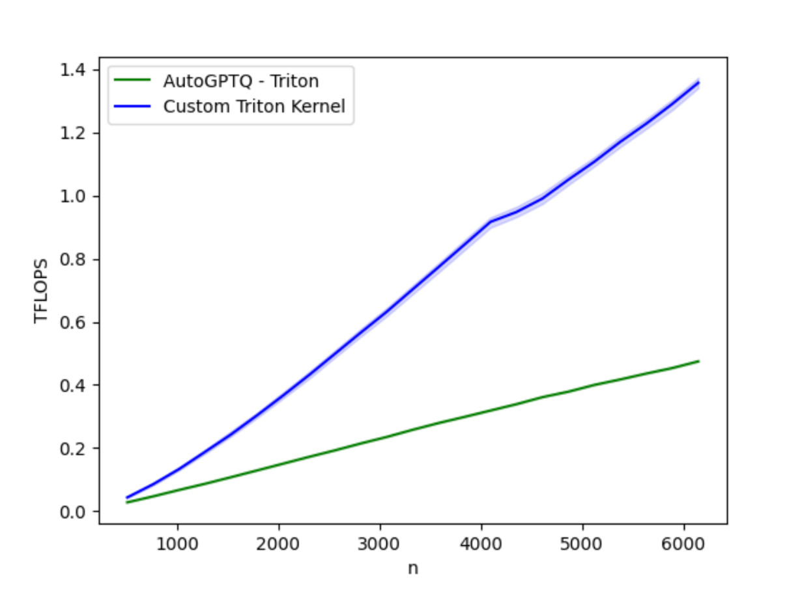

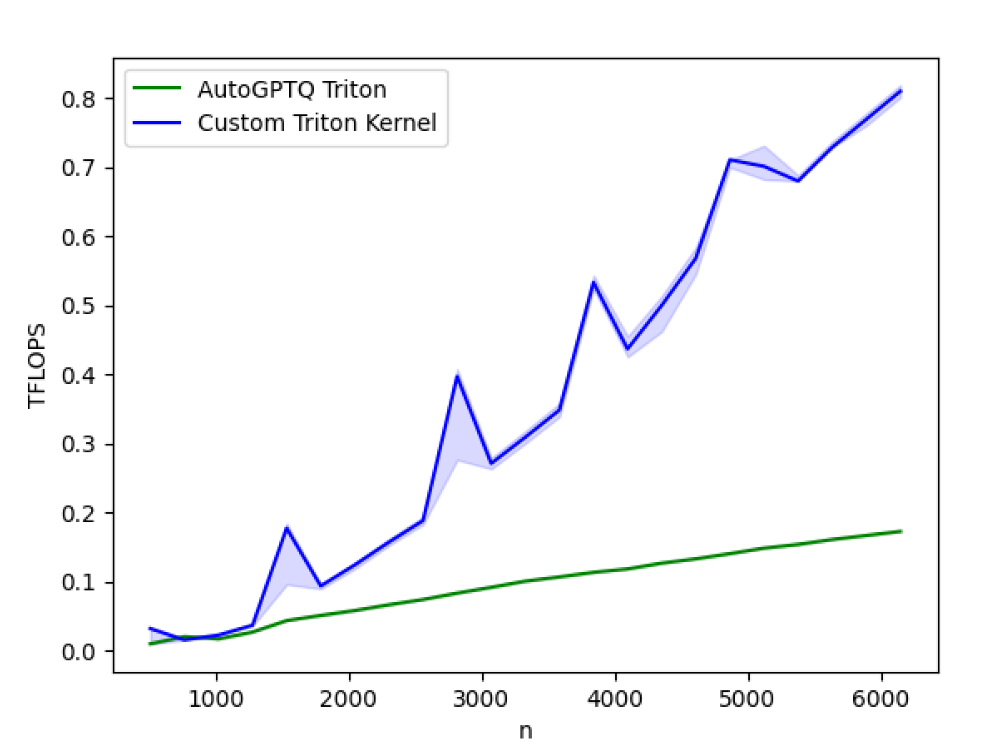

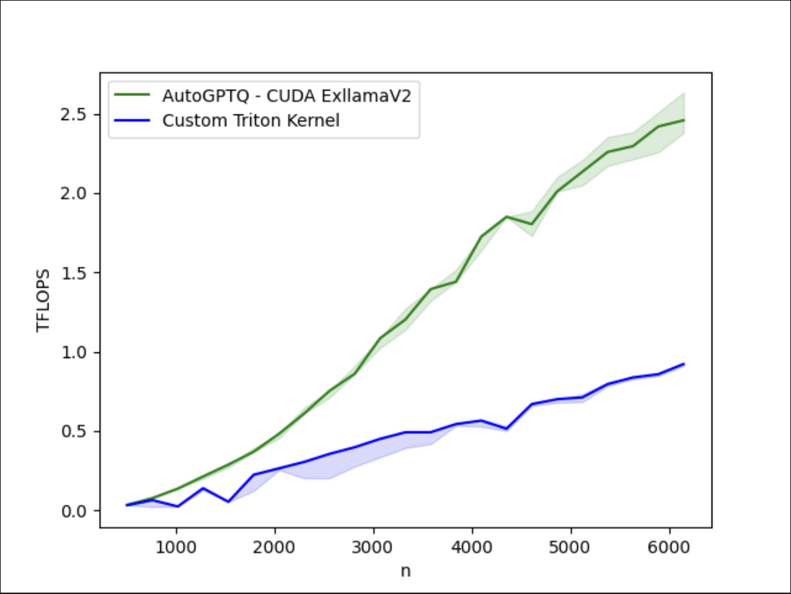

## 1.0 Triton 소개

Triton framework는 GPU programming을 hardware-agnostic 방식으로 제공한다. 현재 NVIDIA와 AMD를 지원하며 다른 hardware vendor 지원도 진행 중이다. Triton은 이제 PyTorch 2.0의 주요 구성 요소가 되었고, `torch.compile`은 eager PyTorch code를 분해한 뒤 큰 비율의 Triton kernel과 PyTorch glue code로 다시 조립한다.

Triton 채택이 더 넓어지면서 programmer는 Triton stack을 high-level Python에서 low-level SASS까지 체계적으로 훑는 방법을 알아야 한다. 그래야 performance bottleneck을 해결하고 `torch.compile`이 생성한 Triton kernel보다 더 빠른 kernel에 도달할 수 있다.

이 글에서는 Triton programming language의 몇 가지 core concept, GPU kernel에서 흔한 performance limiting factor를 식별하는 방법, 그리고 high-throughput inference application에 쓸 수 있는 AutoGPTQ용 quantization kernel을 함께 tuning하는 과정을 소개한다.

### GPTQ quantization과 dequantization 소개

GPTQ(https://arxiv.org/abs/2210.17323)는 approximate second-order information(Hessian inverse matrix)을 사용해 초대형(175B+) LLM을 4-bit integer representation으로 효율적으로 압축하는 quantization algorithm이다. AutoGPTQ(https://github.com/AutoGPTQ/AutoGPTQ)는 GPTQ 위에 구축된 framework로, GPTQ-quantized LLM을 빠르게 dequantize하고 inference 또는 serving할 수 있게 한다.

AutoGPTQ stack의 일부로, 모델 추론 때 dequantization을 처리하는 Triton GPTQ kernel을 제공한다.

INT quantization의 기본 과정은 아래와 같다. scale과 zero point를 정하고, 이를 사용해 quantized 4-bit weight를 계산한다.

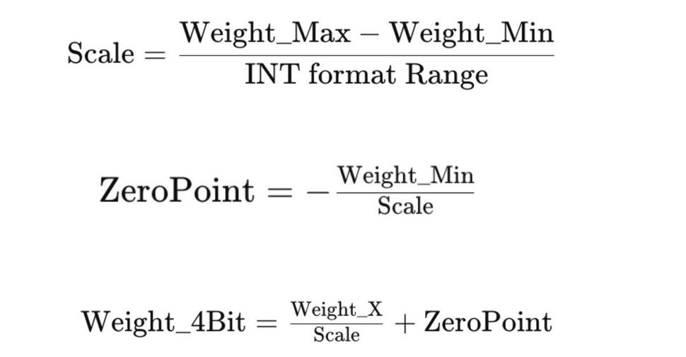

따라서 우리는 4-bit weight와 각 weight group의 scale/zero point metadata를 저장한다.

이 weight를 "dequantize"하려면 다음을 수행한다.

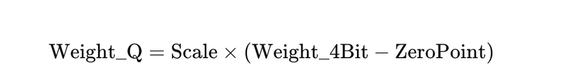

그런 다음 **matrix multiplication**을 수행해 dequantized weight와 해당 linear layer의 dense input feature matrix를 곱한다.

## 2.0 Bottleneck 식별 - matrix multiplication 최적화

빠른 matrix multiplication kernel을 만드는 일은 단순하지 않다. 단순 구현 matrix multiplication은 GPU 같은 highly parallel machine에서 peak throughput performance에 도달하기 어렵다. 따라서 GPU 안의 compute와 memory subsystem을 계층적으로 다루어 각 resource를 최대한 활용해야 한다.

최적화 과정은 unoptimized Triton kernel을 실행하고 Nvidia Nsight Compute tool을 사용해 몇 가지 중요한 metric과 warning을 기록하는 것으로 시작한다.

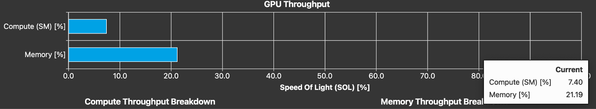

먼저 compute throughput과 memory throughput이 모두 낮다는 점을 확인했다. 각각 7.40%와 21.19%다. 전형적인 inference matrix problem size를 고려하면 memory-bound 상태다. A100 GPU memory subsystem을 겨냥한 code change를 적용해 kernel을 optimize해 볼 것이다.

이 글은 세 가지 주제를 다룬다.

1. L2 최적화
2. vectorized load
3. warp stall

각 주제를 차례로 논하고, 알맞은 변경을 수행한 뒤, 이 변경이 Triton kernel에 미치는 영향을 관찰한다. 이 Triton kernel은 fused dequantization kernel이다. Packed int32 weight, 즉 B matrix를 dequantize한다. INT32 weight 하나는 INT4 weight 8개에 대응된다. 이를 FP16 data type으로 dequantize한 뒤 activation tensor, 즉 A matrix와 FP16 mode로 matrix multiplication을 수행하고 결과를 C matrix에 저장한다.

> https://github.com/foundation-model-stack/foundation-model-stack/blob/triton/triton/kernels/gptq/splitk_dequant_gemm.py#L51 에서 보이는 `// 8`이 바로 INT32 weight를 INT4 weight에 대응시키는 부분이다.

위 과정은 W4A16 quantization이라고 부른다. 우리가 설명하는 과정은 어떤 GPU kernel을 개발할 때도 사용할 수 있고 또 사용해야 한다. 이것들은 어떤 unoptimized kernel에서든 흔히 나타나는 bottleneck이기 때문이다.

## 3.0 L2 최적화

이 최적화는 AutoGPTQ kernel에 이미 존재하지만, Triton에서 thread block mapping과 execution order가 어떻게 처리되는지 독자가 더 잘 이해하도록 따로 논의한다. 따라서 naive mapping부터 더 optimized mapping까지 단계적으로 소개하고 그 영향을 관찰한다.

먼저 naive하게 kernel을 구성한다. 처음에는 global memory에서 "linear" load를 수행하고, 이를 더 optimized된 "swizzled" load와 비교한다. linear와 interleaved는 GPU에서 work grid가 실행되는 순서를 결정한다. naive한 경우 Nvidia Nsight Compute tool이 kernel shared memory access pattern에 대해 제공하는 hint를 보자.

이 문제를 해결하기 위해 "tile-swizzling"이라고 하는 방법을 사용할 수 있다. 이 방법의 아이디어는 thread block을 L2 cache에 더 친화적인 순서로 launch하는 것이다.

한 걸음 물러나 Triton의 몇 가지 semantics를 익히고, 간단한 CUDA analogy로 이 개념을 더 잘 이해해 보자. Triton kernel은 "program"을 launch한다. 이 program은 CUDA의 thread block 개념에 mapping되며, Triton kernel parallelism의 기본 단위다. 각 program에는 관련된 "pid"가 있으며, program 안의 모든 thread는 같은 instruction을 실행한다고 보장된다.

`pid`를 output matrix C의 2D grid position에 단순 linear mapping하면 Triton program은 naive한 방식으로 SM에 분포된다.

이 2D grid position은 Triton에서 `pid_m`과 `pid_n`으로 결정된다. work grid를 할당할 때 GPU L2 cache의 data와 cache locality를 활용하고 싶다. 이를 위해 Triton에서 다음과 같이 변경할 수 있다.

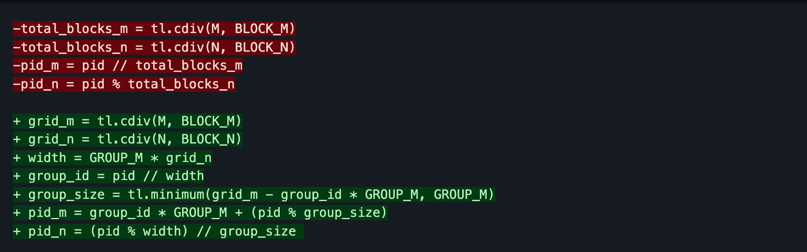

빨간색 highlight code는 naive한 "linear" tile ordering이고, 초록색 highlight code는 "interleaved" tile ordering이다. 이 launch 방식은 locality를 개선한다. 이를 더 잘 이해하도록 visualization도 있다.

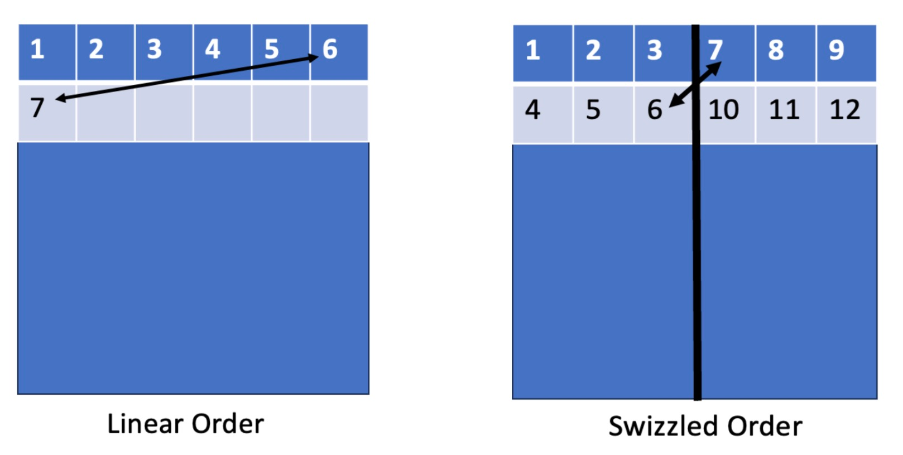

이 변경을 merge한 뒤 ncu profiler는 더 이상 uncoalesced memory access를 불평하지 않는다. memory throughput이 어떻게 변했는지 보자.

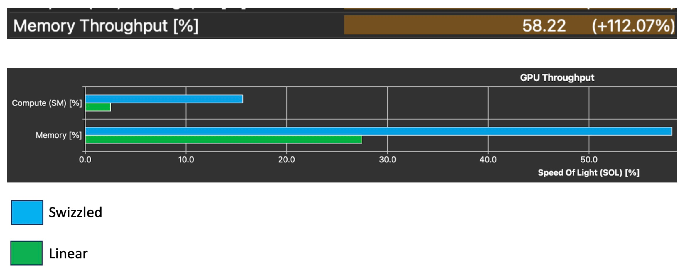

이 변경은 단순 load/store kernel에서 테스트되었다. profiler의 GPU speed statistics section을 보면 simple load kernel의 memory throughput도 112.07% 증가했다. 이것이 바로 이 최적화로 달성하려던 목표다.

다시 강조하면, 이 최적화는 AutoGPTQ kernel에 이미 존재한다. 하지만 이것은 모든 Triton kernel programmer가 흥미로운 dequantization 또는 matrix multiplication logic을 작성하기 전에 kernel 앞부분에 반드시 작성해야 하는 boilerplate logic이기도 하다. 따라서 다음을 이해하는 것이 중요하다.

- 이 mapping은 유일하지 않다.
- Triton이 programmer를 대신해 이 최적화를 자동 처리하지 않는다. kernel이 shared memory access를 최적으로 처리하도록 신중하게 고려해야 한다.

Triton을 막 접한 사람에게는 이것이 분명하지 않다. 대부분의 shared memory access optimization은 Triton compiler가 처리하기 때문이다. 하지만 compiler가 처리할 수 없는 경우에는 우리가 memory behavior에 영향을 주기 위해 어떤 tool과 method를 사용할 수 있는지 이해할 수 있어야 한다.

## 4.0 Vectorized Load

이제 unoptimized kernel의 원래 문제로 돌아가자. kernel의 global memory access pattern을 optimize하고 싶다. Nvidia Nsight Compute tool의 detail page에서 다음 주석을 볼 수 있다. profiler는 uncoalesced global memory access를 지적한다. unoptimized memory read의 SASS(assembly) code load를 자세히 보자.

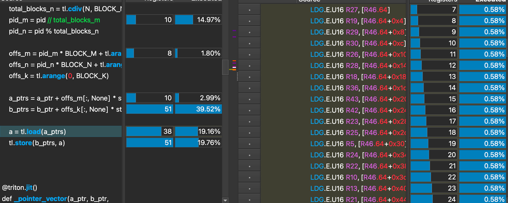

이 load operation은 32개의 16-bit-wide global load operation을 유발한다. 이는 이상적이지 않다.

global memory load를 vectorized 방식으로 수행해 가능한 적은 load instruction을 생성하고 싶다. 이 문제를 해결하기 위해 Triton compiler에 약간의 도움을 줄 수 있다.

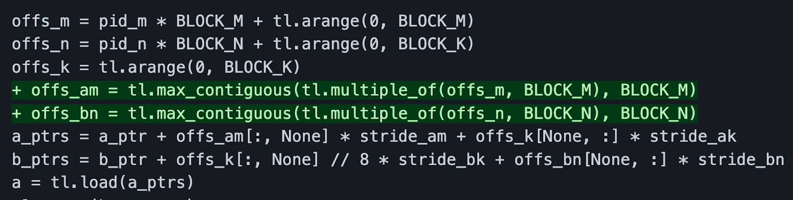

위 초록색 highlight line은 compiler hint다. compiler에게 이 element들이 memory에서 contiguous하고 이 load operation은 coalesce될 수 있다고 알려준다.

이 line을 추가한 뒤 assembly에서 어떤 효과가 나타나는지 보자.

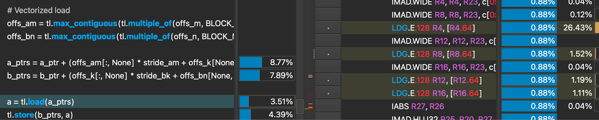

이제 load는 32개의 16-bit global load operation이 아니라 4개의 128-bit-wide global load operation으로 수행된다. 이는 memory fetch instruction이 28개 줄었다는 뜻이며, 더 중요하게는 coalesced memory access를 달성했다는 뜻이다. 이는 single thread가 더 이상 contiguous memory address를 접근하지 않는다는 사실에서도 볼 수 있다. compiler hint가 없을 때는 그런 behavior가 나타난다.

isolated load operation에서는 결과가 73배 가속이었다. 이를 full dequantization kernel에 통합한 뒤에도 추가 6% 가속을 볼 수 있었다. 올바른 방향으로 한 걸음 더 나아간 것이다.

## 5.0 Warp Stall

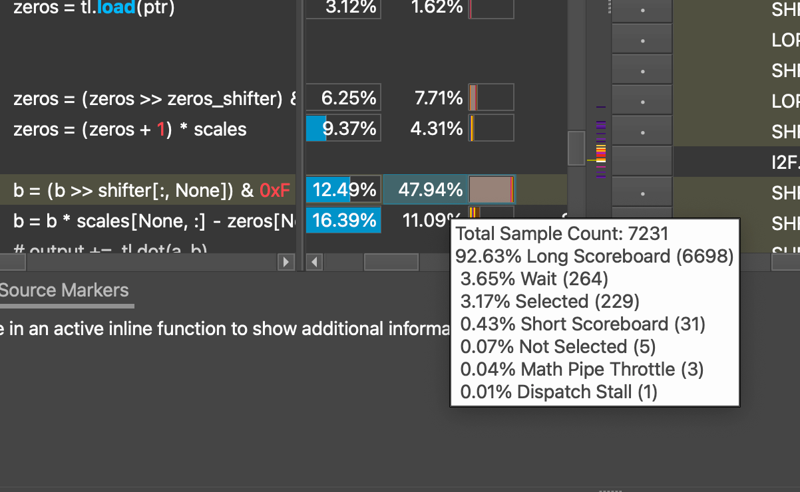

이제 모든 변경을 full dequantization kernel에 다시 적용하면 다음 performance limiting factor, 즉 warp stall을 볼 수 있다.

이 warp stall은 주로 "long scoreboard" stall에서 오며 전체의 92.63%를 차지한다.

high-level에서 보면 long scoreboard stall(https://docs.nvidia.com/nsight-compute/ProfilingGuide/index.html#metrics-reference)은 warp가 issued 상태로 들어가기 위해 필요한 data가 아직 준비되지 않았을 때 발생한다. 다시 말해 GPU는 throughput machine이므로, load instruction의 latency를 compute instruction으로 숨겨야 한다. 더 많은 data를 load하고 script 안 load instruction 위치를 재배치하면 이 문제를 해결할 수 있다.

이상적인 경우 각 warp scheduler는 clock cycle마다 instruction 1개를 issue할 수 있다. 참고로 A100 GPU의 각 SM에는 4개 warp scheduler가 있다.

하지만 우리 kernel에는 bottleneck이 있다. AutoGPTQ Triton kernel이 optimal이라고 생각하는 block size에서 stall state에 4.4 cycle을 소비한다.

이를 어떻게 개선할 수 있을까?

warp가 instruction을 issue할 때 load가 SRAM에 저장되어 compute에 사용되기를 기다리지 않도록 memory throughput을 높이고 싶다. pipeline stage 수와 warp 수 등 여러 parameter를 시도했고, k dimension block size를 2배로 늘리는 것이 가장 큰 영향을 냈다.

이 변경은 compute와 memory throughput 모두에 직접적인 영향을 주었다.

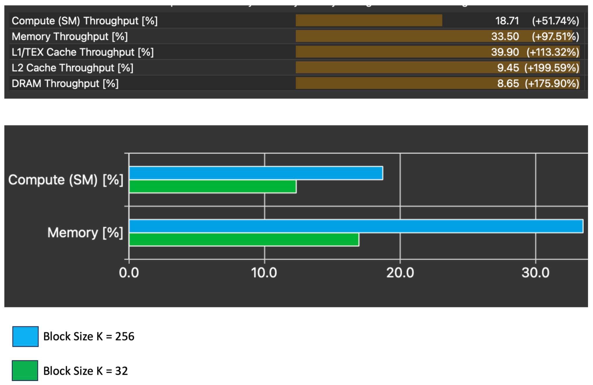

또한 quantized weight를 shift하고 scale하는 step에서 long scoreboard wait time이 크게 내려간 것을 볼 수 있었다. 이는 source code에서 식별한 원래 bottleneck이다. 이 line에는 여전히 stall이 존재하지만, long scoreboard stall이 차지하는 비율은 이전 92%에서 68%로 낮아졌다. 이상적으로는 stall을 전혀 보고 싶지 않으므로 아직 할 일이 남아 있다. 하지만 long scoreboard stall 수가 감소했다는 것은 instruction 실행 시점에 data가 더 높은 빈도로 준비되어 사용 가능하다는 뜻이다(L1TEX memory 안에서).

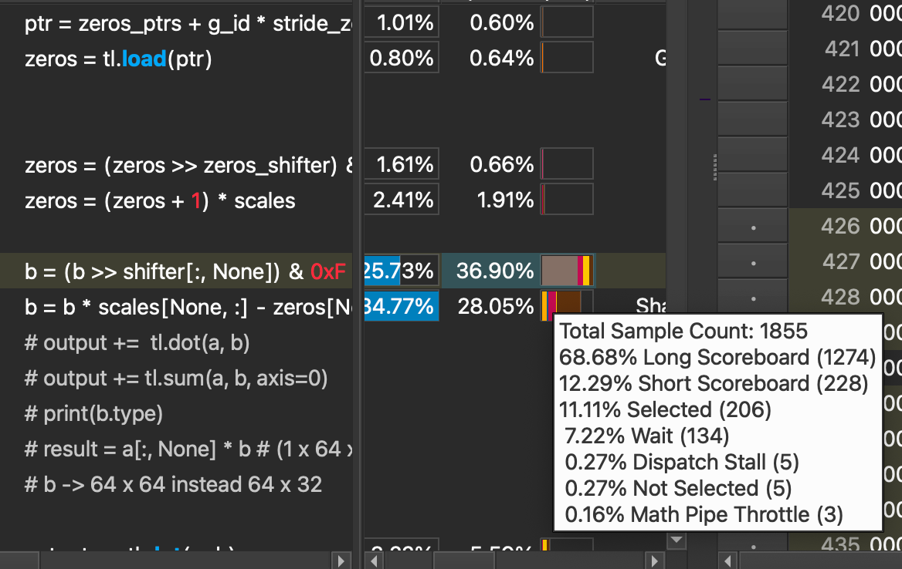

그에 따른 영향은 kernel execution time 1.4배 가속이다.

## 6.0 결과

이 모든 문제를 체계적으로 해결한 결과, 최종 kernel은 Nvidia A100 GPU에서 AutoGPTQ가 기본 제공하는 Triton kernel보다 6배 빨라졌다.

관련 Llama inference sample data point를 예로 들면, 우리가 개발한 Triton kernel(https://github.com/foundation-model-stack/foundation-model-stack/blob/triton/triton/kernels/gptq/splitk_dequant_gemm.py)은 dequantization과 matrix multiplication에 47 microseconds만 필요하다. 반면 AutoGPTQ kernel은 같은 크기 matrix에 275 microseconds가 필요하다.

이 단계적 방법을 복제하면 다른 kernel에서도 비슷한 가속을 얻을 수 있을 것이며, 흔한 GPU bottleneck과 그 해결 방법을 이해하는 데 도움이 된다.

주의할 점은 AutoGPTQ Triton kernel의 performance 개선에서는 진전이 있었지만, AutoGPTQ의 현재 exllamaV2 CUDA native kernel과의 차이를 아직 좁히지는 못했다는 것이다.

이 kernel을 더 최적화해 동등한 custom CUDA kernel performance에 맞추는 방법을 이해하려면 더 많은 연구가 필요하다.

### 정리와 향후 작업

Triton은 CUDA programming보다 높은 abstraction level에서 low-level GPU optimization을 가능하게 해 PyTorch를 확장한다. 최종 결과는 optimized Triton kernel을 추가해 PyTorch model을 더 빠르게 실행하도록 돕는 것이다.

이 글의 목표는 GPTQ dequantization kernel을 가속하는 예를 보여주고, 이런 가속을 어떻게 달성할 수 있는지에 대한 template workflow를 제공하는 것이다.

향후 작업으로는 matrix multiplication의 SplitK work decomposition을 잠재적 가속 방법으로 연구할 것이다.

### Custom Triton kernel을 PyTorch에 통합하기

위에서 보인 가속을 고려하면, 흔한 질문은 주어진 PyTorch codebase에서 custom kernel을 실제로 어떻게 사용하는가다.

Triton kernel은 적어도 두 부분을 포함한다. 실제 Triton kernel code, 즉 Triton compiler가 compile할 code다.

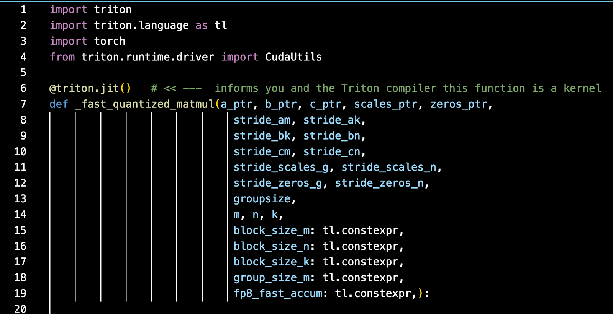

실제 kernel code 외에 Python wrapper도 있다. 이 wrapper는 PyTorch autograd class를 상속할 수도 있고 그렇지 않을 수도 있다. 이는 backward propagation을 지원해야 하는지, 즉 training 목적에도 쓸 것인지 inference 전용인지에 달려 있다.

Python class를 PyTorch code로 import하고, 쓰고 싶은 곳에서 다른 Python/PyTorch function처럼 사용하면 된다.

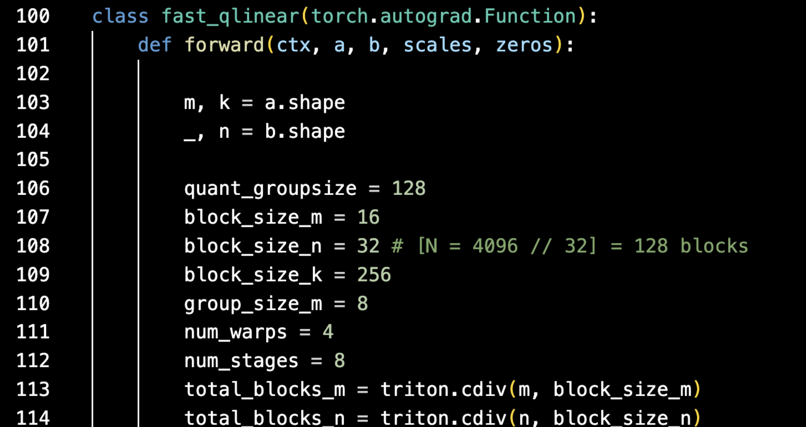

이 경우에는 import한 뒤 `'fast_qlinear'`를 사용하기만 하면 underlying Triton kernel이 호출되고, 위에서 보여준 가속이 PyTorch model에 적용된다.

### 감사

이 결과를 수집하는 동안 기술적 guidance를 제공해 준 IBM Research의 Jamie Yang과 Hao Yu에게 감사한다.
