> 내 강의 노트다. 관심 있으면 봐도 좋다: https://github.com/BBuf/how-to-optim-algorithm-in-cuda/tree/master/cuda-mode .

> 이 강의는 Triton compiler의 내부 동작 원리를 자세히 소개한다. 글은 먼저 CUDA compiler(NVCC)의 workflow를 소개한 뒤, Triton compiler의 architecture design을 깊이 다룬다. Python DSL code가 여러 intermediate representation(IR)을 거쳐 최종적으로 CUDA executable file로 compile되는 과정을 설명한다. 강의의 초점은 Triton과 MLIR(Multi-Level Intermediate Representation)의 관계이며, TritonCombineOps, TritonReorderBroadcast 같은 여러 optimization Pass의 구현과 역할도 보여준다. vector_add라는 구체 예시를 통해 Python layer에서 GPU IR로 code가 변환되는 과정과, 이 과정에서 `.cubin`, `.ptx` 같은 여러 intermediate artifact가 생성되는 방식을 자세히 보여준다. 마지막으로 Triton에서 새 compiler Pass를 구현하는 방법도 소개해, 독자가 Triton compiler를 깊이 이해하고 확장할 수 있는 실전 지침을 제공한다.

# 29강, Triton Internals

## 강의 노트

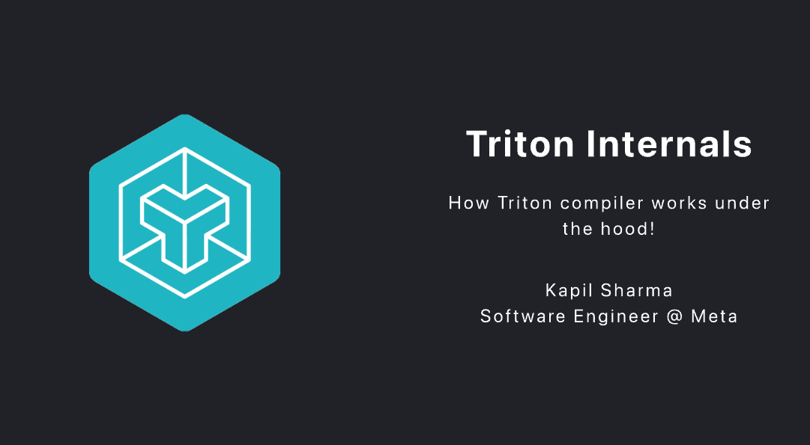

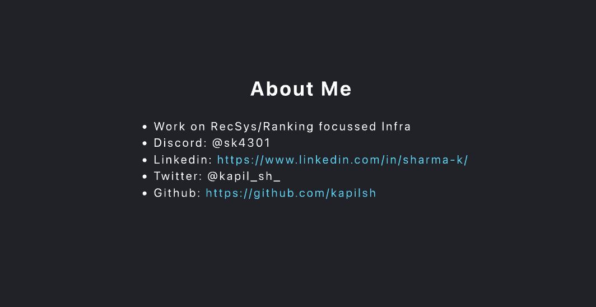

이것은 Meta software engineer Kapil Sharma가 진행한 기술 공유이며, 주제는 Triton compiler의 내부 동작 원리다. 발표자는 현재 Meta의 RecSys/Ranking infrastructure team에서 일하고 있으며, slide에서 LinkedIn, Twitter, GitHub 등 자기 social media와 code repository link를 공유했다.

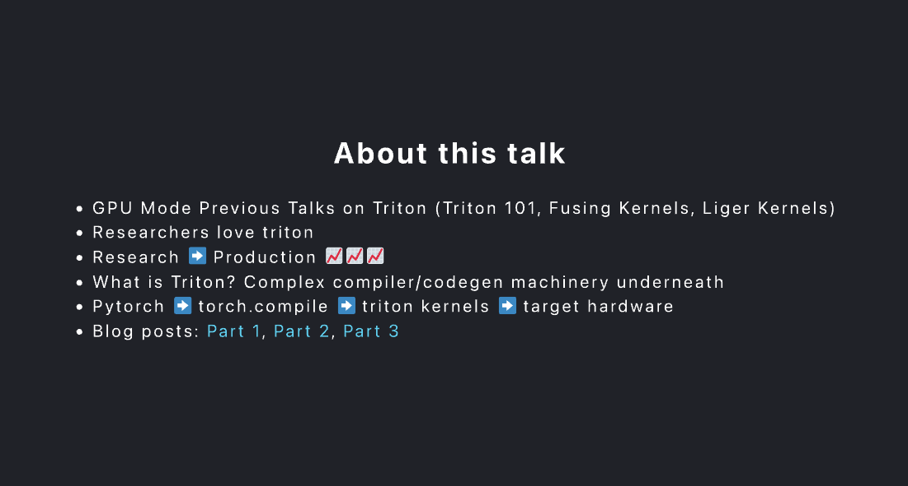

이 Slide는 Triton에 관한 발표 개요를 소개한다. Triton은 복잡한 compiler/code generation mechanism이다. 이미 관련 발표가 몇 차례 있었고, Triton 101, Kernel fusion, Liger kernel 등이 포함된다. 연구자들은 일반적으로 Triton 사용을 좋아하며, 연구와 production 모두에 쓸 수 있다. Triton workflow는 PyTorch에서 시작해 `torch.compile`로 Triton kernel로 compile되고, 마지막에 target hardware에 deploy된다. 관련 내용은 세 편의 series blog post에서 더 자세히 찾을 수 있다. 이는 PyTorch code를 optimize하고 GPU 위에서 실행되도록 compile하는 중요한 tool이다.

세 series blog link:
- https://www.kapilsharma.dev/posts/deep-dive-into-triton-internals/
- https://www.kapilsharma.dev/posts/deep-dive-into-triton-internals-2/
- https://www.kapilsharma.dev/posts/deep-dive-into-triton-internals-3/

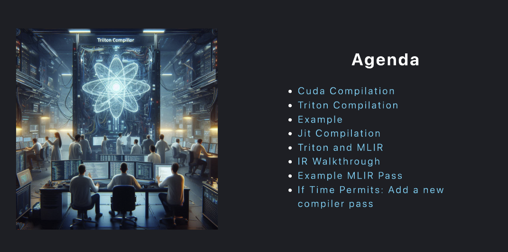

이것은 이번 발표의 목차다. 주요 내용은 CUDA compilation, Triton compiler, example code, JIT compilation, Triton과 MLIR(machine learning intermediate representation)의 관계, IR의 자세한 소개, MLIR Pass example 등을 포함한다. 시간이 허락하면 새로운 compiler pass도 소개한다.


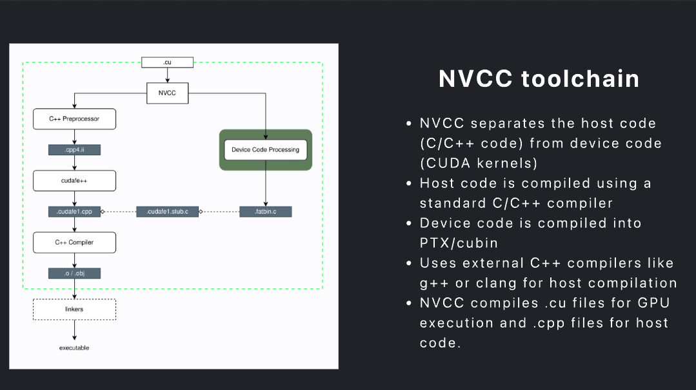

이 Slide는 NVIDIA CUDA compiler(NVCC)의 전체 workflow를 보여준다. NVCC의 주요 역할은 CUDA code를 host code(C/C++)와 device code(CUDA kernel)로 분리하는 것이다. host code는 g++ 또는 clang 같은 standard C/C++ compiler로 compile되고, device code는 PTX 또는 cubin format으로 compile된다. 전체 flow는 preprocessing, compilation, linking 같은 일련의 intermediate step을 거쳐 최종 executable file을 생성한다. 그림은 `.cu` source file에서 최종 executable file까지의 complete transformation process를 명확히 보여준다.

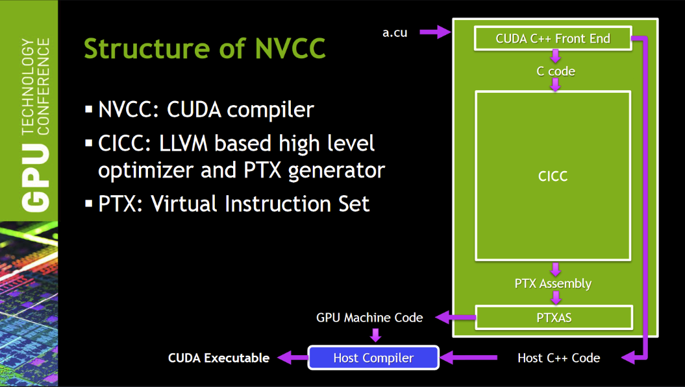

이 Slide는 NVIDIA 발표에서 온 것으로, NVCC compiler의 내부 구조와 component를 자세히 설명한다. NVCC는 CUDA의 main compiler이고, CICC는 LLVM 기반 high-level optimizer와 PTX generator다. PTX(Parallel Thread Execution)는 virtual instruction set이다. 그림은 `.cu` file에서 시작해 CUDA C++ frontend 처리를 거치고, CICC로 PTX assembly code를 생성한 뒤, 마지막으로 PTXAS와 host compiler를 통해 최종 CUDA executable file을 만드는 complete flow를 보여준다.

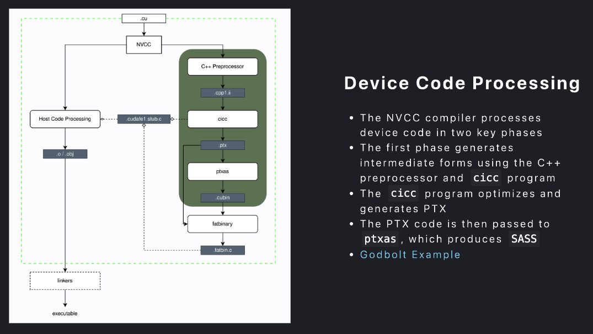

이 Slide는 NVCC compiler가 device code를 처리하는 두 key stage를 중점적으로 소개한다. 첫 번째 stage는 C++ preprocessor와 CICC program을 사용해 intermediate form을 생성한다. 두 번째 stage에서는 CICC program이 code를 optimize하고 PTX를 생성한다. 생성된 PTX code는 ptxas로 전달되어 SASS, 즉 실제 GPU machine code를 생성한다. 전체 flowchart는 source code에서 최종 GPU executable code로 변환되는 과정을 명확히 보여주며, Godbolt example도 참고로 언급한다. Compiler Explorer도 참고할 수 있다. 둘 다 좋은 online CUDA compiler visualization tool이다.

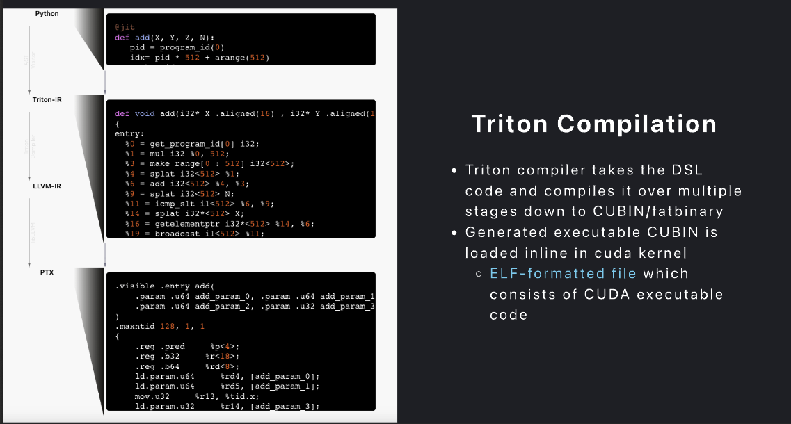

이 Slide는 OpenAI Triton 소개 blog의 그림이다. Triton compiler workflow를 주로 소개한다. code가 Python DSL(domain-specific language)에서 최종 CUDA executable file로 변환되는 과정을 보여준다. 구체적으로 Triton compiler는 DSL code를 여러 compilation stage로 처리해 최종적으로 CUBIN/fatbinary format executable file을 생성한다. 이 CUBIN file은 CUDA kernel에서 inline load할 수 있는 executable code를 담은 file이다. Slide는 Python layer, Triton-IR layer, PTX layer라는 세 수준의 code를 보여주며 이 compilation process를 설명한다.

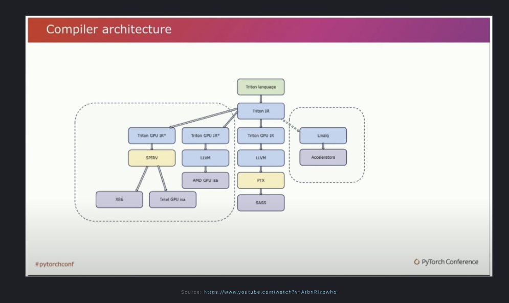

이 Slide는 Triton compiler의 architecture design diagram을 보여준다. top-level에서 보면 Triton language에서 시작하고, Triton IR(intermediate representation)을 통해 아래로 흐른다. architecture는 몇 가지 주요 branch로 나뉜다.
- 왼쪽 branch는 SPIRV를 통해 처리되어 최종적으로 x86과 Intel GPU backend로 compile된다.
- 가운데 branch는 LLVM과 AMD GPU backend를 거친다.
- 오른쪽 branch는 LLVM과 PTX를 통해 처리되어 최종적으로 SASS(NVIDIA GPU assembly)에 도달한다.
- 가장 오른쪽에는 여러 accelerator를 처리하는 별도 branch가 있다.

이 architecture design은 Triton code가 CPU(x86), 여러 GPU(Intel/AMD/NVIDIA), 기타 accelerator 등 서로 다른 hardware platform으로 compile되어 실행될 수 있게 한다. 좋은 cross-platform compatibility를 보여준다.

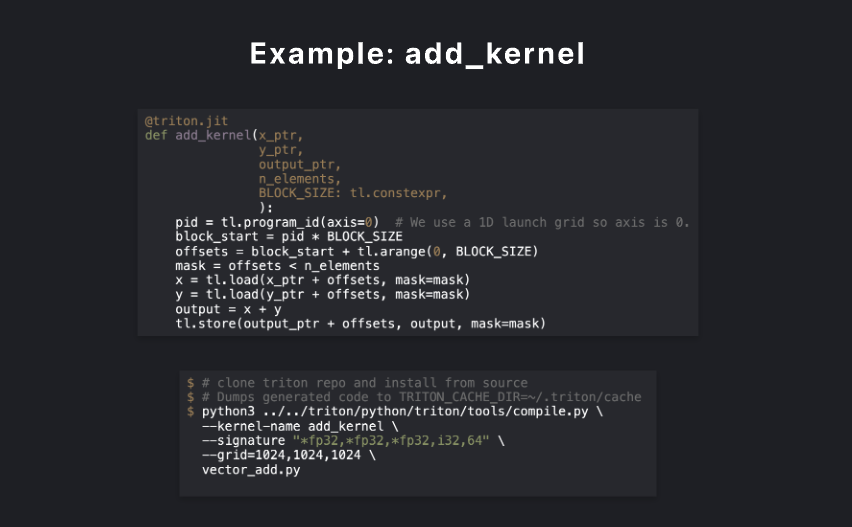

이것은 Triton 공식 tutorial의 첫 번째 예시인 `vector_add`다. 이어 Triton이 제공하는 compile tool을 사용해 executable file 생성 과정에서 어떤 것이 dump되는지 볼 수 있다.

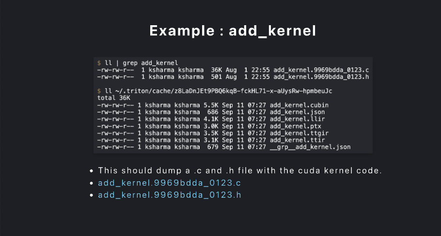

여기서는 `vector_add`가 executable file 생성 과정에서 만든 intermediate parameter를 보여준다. compilation/build 과정에서 생성되는 `.cubin`, `.json`, `.llir`, `.ptx` 같은 file과 CUDA kernel을 포함한 최종 source code file `add_kernel.9969bdda_0123.c`(.c file), 대응 header file(.h file)이 포함된다.

- https://github.com/gpu-mode/lectures/blob/main/lecture_029/add_kernel.9969bdda_0123.h
- https://github.com/gpu-mode/lectures/blob/main/lecture_029/add_kernel.9969bdda_0123.c

`add_kernel.9969bdda_0123.c`의 내용을 살펴볼 수 있다. 분량 때문에 `unsigned char CUBIN_NAME[10960]`의 내용은 일부만 보여준다.

```c++
/* clang-format off */
// 필요한 header file 포함
#include <stdio.h>
#include <stdint.h>
#include <inttypes.h>
#include <string.h>
#include <cuda.h>


// CUDA error check macro 정의
#define CUDA_CHECK(ans) {\
    gpuAssert((ans), __FILE__, __LINE__);\
  }\

// CUDA error check helper function
static inline void gpuAssert(CUresult code, const char *file, int line) {
  if (code != CUDA_SUCCESS) {
    const char *prefix = "Triton Error [CUDA]: ";
    const char *str;
    cuGetErrorString(code, &str);  // error string 획득
    char err[1024] = {0};
    strcat(err, prefix);  // error prefix 연결
    strcat(err, str);     // error message 연결
    printf("%s\\n", err); // error message 출력
    exit(code);          // program 종료
  }
}

// global variable 정의
#define CUBIN_NAME add_kernel_9969bdda_0123_cubin
CUmodule add_kernel_9969bdda_0123_mod = NULL;    // CUDA module handle
CUfunction add_kernel_9969bdda_0123_func = NULL;  // CUDA function handle
// CUBIN binary data, compiled CUDA kernel code 포함
unsigned char CUBIN_NAME[10960] = { 0x7f, 0x45, 0x4c, 0x46, 0x02, 0x01, 0x01, 0x33, 0x07, 0x00, 0x00, 0x00, 0x00, 0x00, 0x00, 0x00, 0x02, 0x00, 0xbe, 0x00, 0x7c, 0x00, 0x00, 0x00, 0x00, 0x00, 0x00, 0x00, 0x00, 0x00, 0x00, 0x00, 0xc0, 0x14.... };


// CUDA kernel module unload
void unload_add_kernel_9969bdda_0123(void) {
    CUDA_CHECK(cuModuleUnload(add_kernel_9969bdda_0123_mod));
}

// CUDA kernel module load
void load_add_kernel_9969bdda_0123() {
    int dev = 0;
    void *bin = (void *)&CUBIN_NAME;
    int shared = 0;
    // CUBIN data를 CUDA module로 load
    CUDA_CHECK(cuModuleLoadData(&add_kernel_9969bdda_0123_mod, bin));
    // add_kernel function handle 획득
    CUDA_CHECK(cuModuleGetFunction(&add_kernel_9969bdda_0123_func, add_kernel_9969bdda_0123_mod, "add_kernel"));
    
    // shared memory 설정
    int shared_optin;
    // device가 지원하는 최대 shared memory size 획득
    CUDA_CHECK(cuDeviceGetAttribute(&shared_optin, CU_DEVICE_ATTRIBUTE_MAX_SHARED_MEMORY_PER_BLOCK_OPTIN, dev));
    // 필요한 shared memory가 default보다 크고 device가 지원하면 더 큰 shared memory 설정
    if (shared > 49152 && shared_optin > 49152) {
      CUDA_CHECK(cuFuncSetCacheConfig(add_kernel_9969bdda_0123_func, CU_FUNC_CACHE_PREFER_SHARED));
      CUDA_CHECK(cuFuncSetAttribute(add_kernel_9969bdda_0123_func, CU_FUNC_ATTRIBUTE_MAX_DYNAMIC_SHARED_SIZE_BYTES, shared_optin))
    }
}

/*
kernel configuration parameter:
['BLOCK_SIZE=64', 'num_warps=1', 'num_stages=3']
*/
// CUDA kernel launch function
CUresult add_kernel_9969bdda_0123(CUstream stream, CUdeviceptr x_ptr, CUdeviceptr y_ptr, CUdeviceptr output_ptr, int32_t n_elements) {
    // function이 load되지 않았으면 먼저 load
    if (add_kernel_9969bdda_0123_func == NULL)
       load_add_kernel_9969bdda_0123();
    // grid dimension 설정
    unsigned int gX = 1024;
    unsigned int gY = 1024;
    unsigned int gZ = 1024;
    // kernel parameter 준비
    void *args[4] = { &x_ptr, &y_ptr, &output_ptr, &n_elements };
    // CUDA kernel launch
    if(gX * gY * gZ > 0)
      return cuLaunchKernel(add_kernel_9969bdda_0123_func, gX, gY, gZ, 1 * 32, 1, 1, 0, stream, args, NULL);
}
```

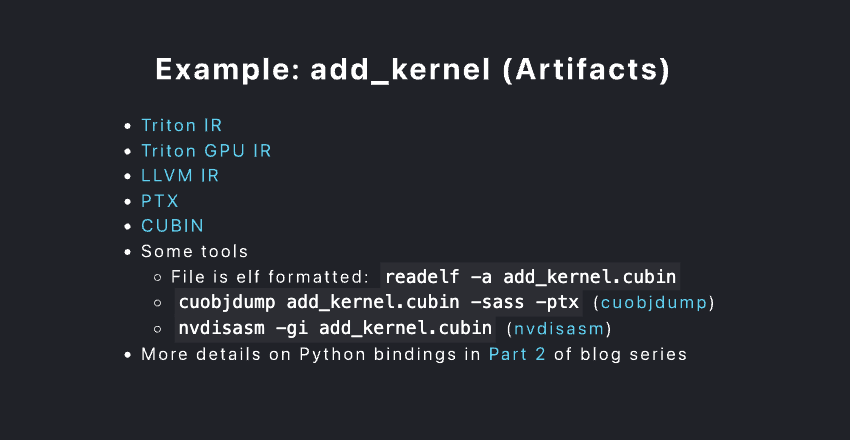

여기서는 `add_kernel` 관련 compilation artifact를 보여준다. Triton IR, Triton GPU IR, LLVM IR, PTX, CUBIN이 포함된다. 동시에 작성자는 몇 가지 유용한 tool command도 발견했다. `readelf`로 elf format file을 확인하고, `cuobjdump`로 sass와 ptx code를 export하며, `nvidisasm` tool로 `cubin` file을 읽을 수 있게 한다. 마지막으로 Python binding에 대한 자세한 정보는 blog series의 2부에서 찾을 수 있다고 언급한다. 이 내용은 주로 developer가 CUDA kernel compilation process와 intermediate artifact를 이해하고 분석하는 데 도움을 주기 위한 것이다.

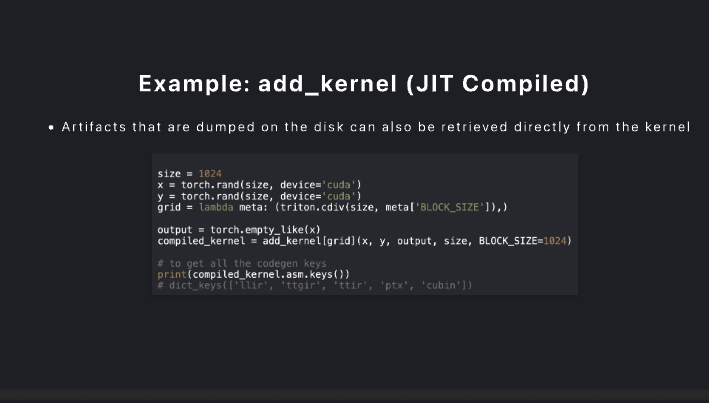

이 Slides는 Triton의 또 다른 JIT compilation 방식을 보여준다. code example은 vector_add의 PyTorch CUDA kernel configuration과 execution process를 보여준다. 먼저 size parameter를 설정하고, input tensor x와 y를 만든다. 둘 다 CUDA device 위에 있다. compute grid를 정의하고 output tensor를 만든 뒤 kernel을 compile하고 실행한다. 마지막으로 `compiled_kernel.asm.keys()` method를 통해 모든 code generation key를 얻을 수 있다. 이 key에는 'ttir', 'ttgir', 'ptx', 'cubin' 같은 다양한 intermediate representation form이 포함된다.

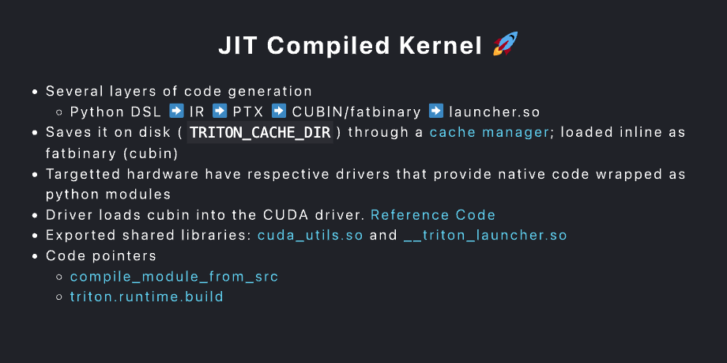

이 Slide는 JIT Compiled Kernel의 동작 원리를 소개한다. Python DSL에서 시작해 IR, PTX를 거쳐 CUBIN/fatbinary와 `launcher.so`까지 이어지는 multi-layer code generation process를 보여준다. system은 `TRITON_CACHE_DIR`과 cache manager(https://github.com/triton-lang/triton/blob/4348109b0a8e1aac748aa9b1bbbcd858e9488940/python/triton/runtime/cache.py#L50-L71)를 통해 compilation result를 disk에 저장하고 fatbinary(cubin) format으로 inline load한다. target hardware에는 각자 driver가 있고, 이 driver는 Python module로 wrapping된 native code를 제공하며 cubin을 CUDA driver로 load한다(https://github.com/triton-lang/triton/blob/main/third_party/nvidia/backend/driver.c#L389-L406). 또한 `cuda_utils.so`(https://github.com/triton-lang/triton/blob/main/third_party/nvidia/backend/driver.py#L72-L86)와 `triton_launcher.so`(https://github.com/triton-lang/triton/blob/main/third_party/nvidia/backend/driver.py#L413-L426) 두 shared library를 export하며, `compile_module_from_src`(https://github.com/triton-lang/triton/blob/main/third_party/nvidia/backend/driver.py#L48-L64)와 `triton.runtime.build`(https://github.com/triton-lang/triton/blob/main/python/triton/runtime/build.py#L21-L80)라는 두 중요한 code point를 제공한다.

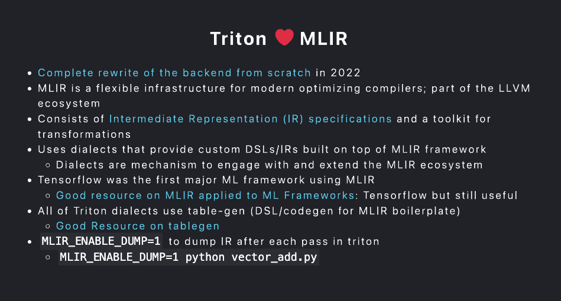

이 Slide는 Triton과 MLIR(Multi-Level Intermediate Representation)의 관계와 기본 개념을 소개한다. MLIR은 2022년에 완전히 다시 작성된 modern optimizing compiler infrastructure이며 LLVM ecosystem의 일부다. IR specification과 transformation toolkit을 포함하고, dialect mechanism으로 MLIR framework를 확장한다(https://mlir.llvm.org/docs/Passes/). TensorFlow는 MLIR을 사용한 첫 주요 machine learning framework다. Triton에서는 모든 dialect가 table-gen이라는 DSL/code generation tool을 사용해 MLIR boilerplate code를 처리하며, `MLIR_ENABLE_DUMP=1`을 설정하면 매 compilation process의 IR 정보를 dump할 수 있다.
- tablegen 우수 자료 추천: https://www.jeremykun.com/2023/08/10/mlir-using-tablegen-for-passes/
- MLIR을 deep learning framework에 적용하는 자료: https://www.youtube.com/watch?v=R5LLIj8EMxw

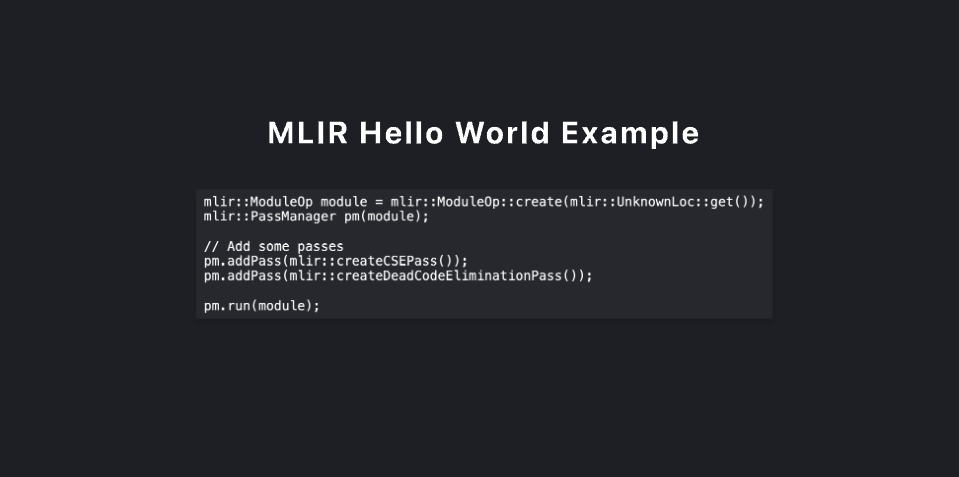

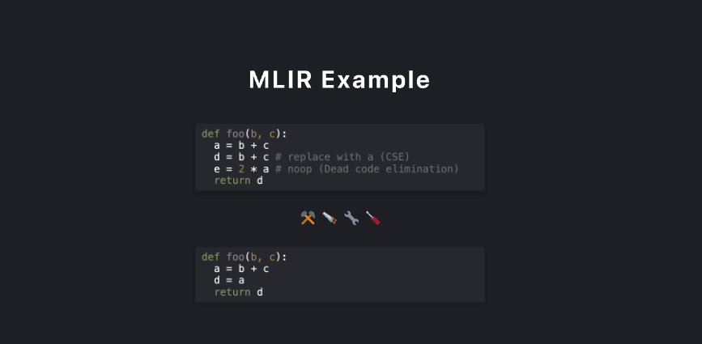

여기서는 MLIR(Multi-Level Intermediate Representation)의 기본 사용 예시를 보여준다. 첫 번째는 MLIR의 "Hello World" example code다. `ModuleOp`를 만들고 `PassManager`로 두 optimization pass, 즉 `CSEPass`와 `DeadCodeEliminationPass`를 추가해 module을 처리한다. 두 번째는 간단한 Python function optimization example로, MLIR로 code optimization을 수행하는 방법을 보여준다. 여분의 계산이 포함된 function(`a = b + c; e = b + c; d = e; return d`)을 더 간결한 형태(`a = b + c; d = a; return d`)로 optimize하고 simplify한다. 이는 MLIR의 code optimization 응용을 보여준다.

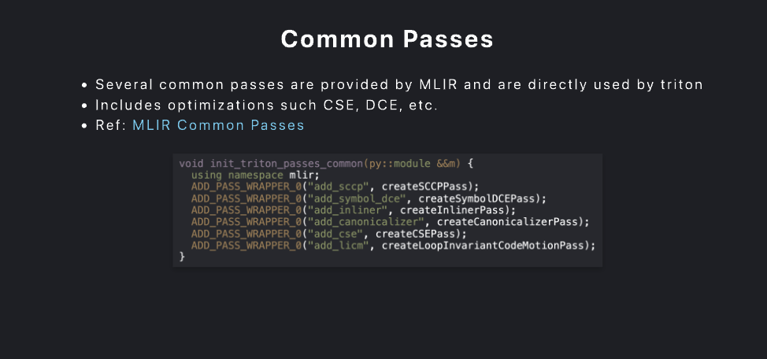

이 Slide는 MLIR의 common Pass(https://mlir.llvm.org/doxygen/namespacemlir.html)를 보여준다. 이를 Triton에 적용할 수 있다.

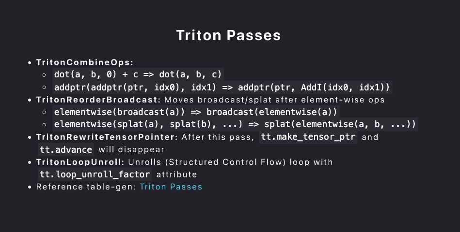

이 slide는 Triton compiler의 몇 가지 중요한 optimization Pass(compilation optimization stage)를 소개한다.

- `TritonCombineOps`: dot product와 address calculation 같은 basic operation을 combine한다.
- `TritonReorderBroadcast`: broadcast와 slice operation의 순서를 reorder해 더 효율적으로 만든다.
- `TritonRewriteTensorPointer`: tensor pointer 관련 operation을 제거한다.
- `TritonLoopUnroll`: 지정한 factor에 따라 loop structure를 unroll한다.

이 Pass들은 모두 Triton compiler가 GPU code performance를 optimize하는 데 사용하는 중요한 step이다. 이런 optimization으로 더 효율적인 GPU code를 생성할 수 있다. 코드는 여기를 참고할 수 있다: https://github.com/triton-lang/triton/blob/576426bccfb9a2c90f2abaa405995738d4a79403/include/triton/Dialect/Triton/Transforms/Passes.td#L27

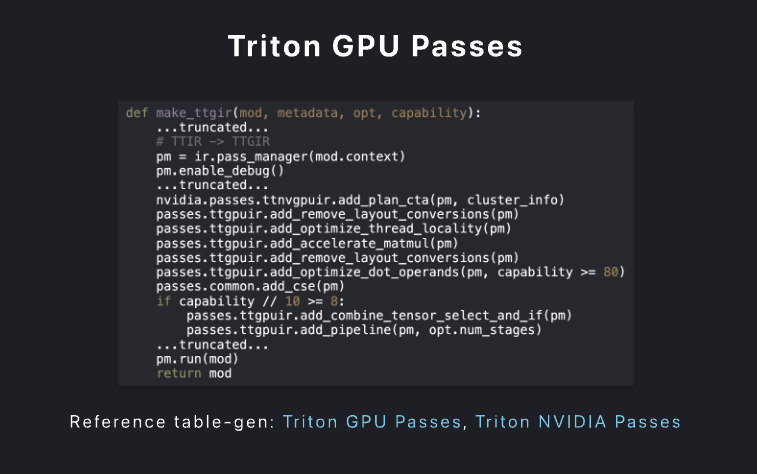

여기서는 Triton GPU compilation optimization flow(Passes)를 보여준다. code는 Triton compiler optimization pipeline으로 GPU code를 처리하는 방법을 보여준다. 구체적으로 thread locality optimization(`optimize_thread_locality`), layout conversion(`layout_conversions`), matrix multiplication acceleration(`accelerate_matmul`), tensor operation optimization(`optimize_dot_operands`) 같은 몇 가지 중요한 optimization Pass가 포함된다. 이 optimization passes의 목적은 GPU 위 code execution efficiency를 높이는 것이며, Triton compiler optimization framework의 core component다. https://github.com/triton-lang/triton/blob/main/include/triton/Dialect/TritonGPU/Transforms/Passes.td 와 https://github.com/triton-lang/triton/blob/main/include/triton/Dialect/TritonNvidiaGPU/Transforms/Passes.td 두 Tablegen file에서 Triton GPU optimization Pass 정의를 찾을 수 있다.

사실 두 file 이름을 보면 Triton이 GPU Passes에서 generic abstraction과 specialized abstraction을 계속 만들고 있음을 알 수 있다. 예를 들어 `TritonGPU`와 `TritonNvidiaGPU`라는 이름이다.

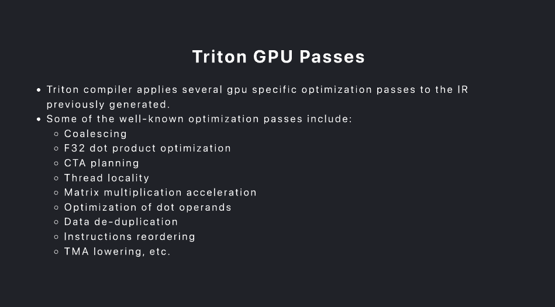

여기에는 몇 가지 Triton GPU optimization Pass가 나열되어 있다.
- coalesced memory access(Coalescing)
- F32 dot product operation optimization
- CTA(cooperative thread array) planning
- thread locality optimization
- matrix multiplication acceleration
- dot operation operand optimization
- data deduplication
- instruction reordering
- TMA(Tensor Memory Access) lowering 등

다음으로 vector_add의 GPU IR을 훑어볼 수 있다.

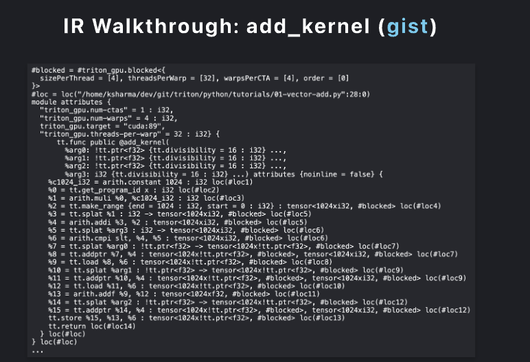

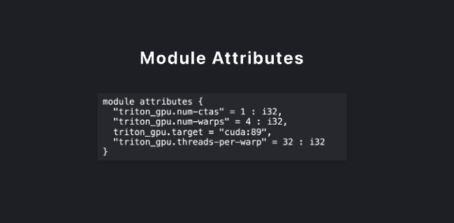

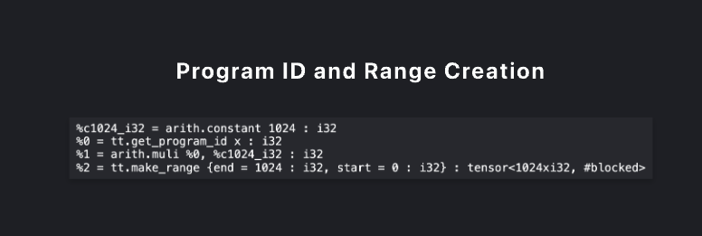

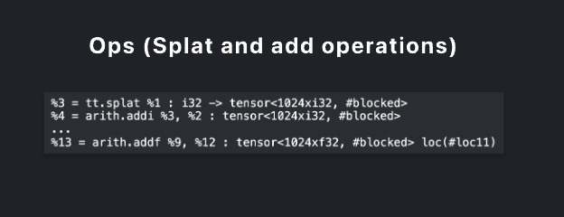

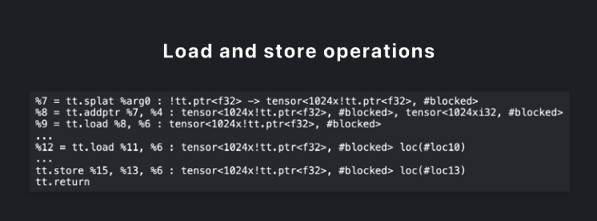

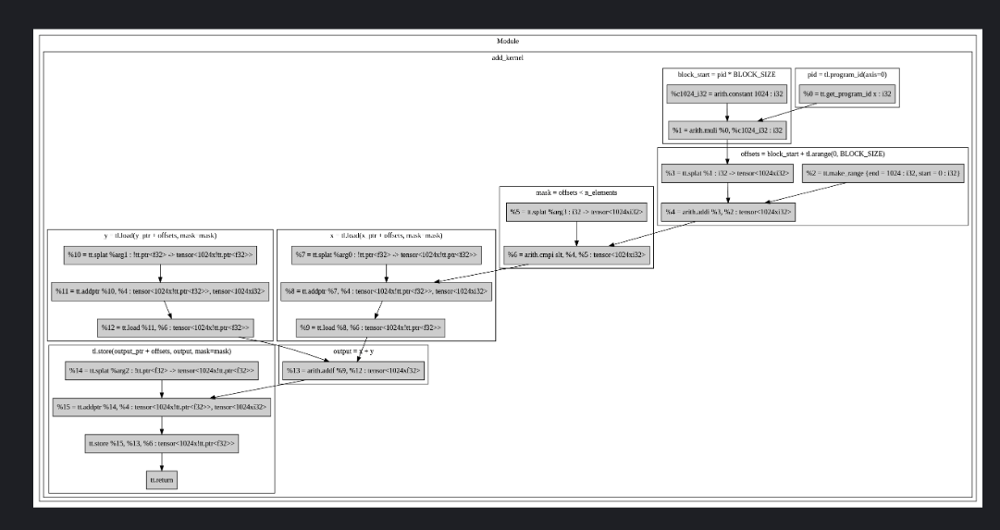

여기서는 triton `vector_add`가 gpu IR로 lowering된 결과를 보여준다. 그중 일부는 Python code 내용과 쉽게 대응된다.

1. Module Attributes:
- `triton_gpu.num-ctas = 1`: CTA(Cooperative Thread Array) 하나를 지정한다.
- `triton_gpu.num-warps = 4`: CTA마다 4개 warp를 포함한다.
- `triton_gpu.threads-per-warp = 32`: warp마다 32개 thread를 포함한다.
- target platform은 "cuda:89", 즉 compute capability 8.9의 CUDA device다.

2. Program ID and Range Creation:
- `%c1024_i32`는 constant 1024를 만든다.
- `%0`은 program ID를 얻는다.
- `%1`은 program ID에 1024를 곱한다.
- `%2`는 0부터 1024까지의 range를 만들고, 1024xi32 tensor를 생성한다.

3. Ops(Splat and add operations):
- `%3`은 splat operation으로 scalar를 1024xi32 tensor에 broadcast한다.
- `%4`는 add operation을 수행한다.
- `%13`은 floating-point addition operation(addf)을 보여준다.

4. Load and store operations:
- `%7-%9`는 data load operation을 보여준다.
- `splat` operation은 pointer를 broadcast한다.
- `addptr`는 offset이 적용된 address를 계산한다.
- `load`는 계산된 address에서 data를 load한다.
- 마지막으로 `tt.store`로 결과를 memory에 다시 저장한다.
- `tt.return`은 kernel 종료를 표시한다.

이 IR은 vector addition operation의 low-level implementation step을 보여준다.

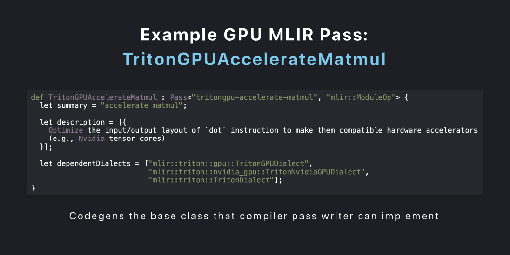

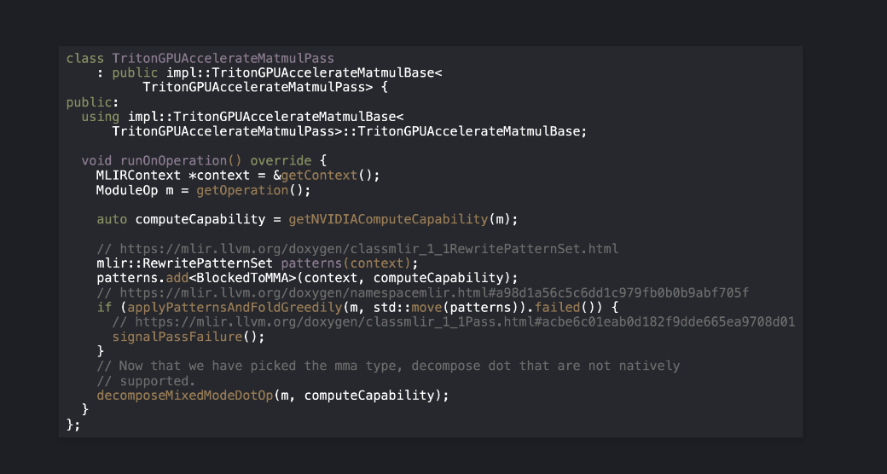

TritonGPUAccelerateMatmul Pass 같은 optimization Pass 구현을 더 알고 싶다면, Triton code repository에서 검색할 때 관련 위치 3개를 볼 수 있다(https://github.com/search?q=repo%3Atriton-lang%2Ftriton%20TritonGPUAccelerateMatmul&type=code).

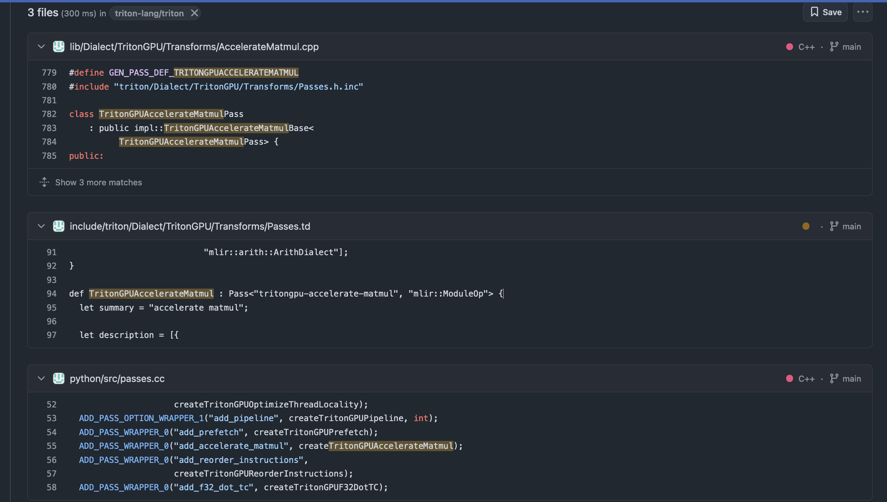

각각 이 Pass의 Tablegen definition, 구체 MLIR implementation, Python Binding이다.

이어서 작성자는 Triton codebase를 기반으로 parameter를 받지 않는 간단한 Pass 2개를 새로 구현한 것을 보여준다. OpGraph를 출력하는 Pass와 Op 수를 기록하는 Pass다. 관심이 있다면 직접 시도해 봐도 좋다.

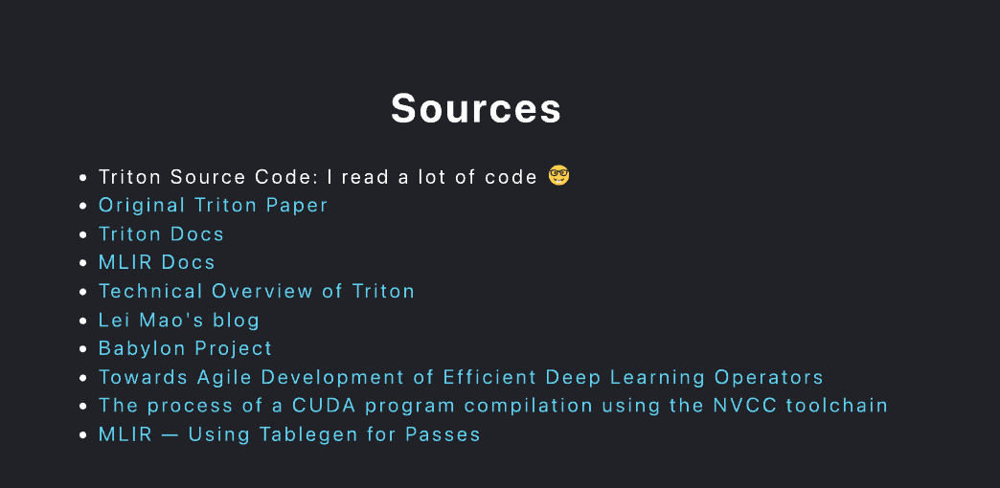

## 정리

이 강의는 Triton compiler의 내부 동작 원리를 자세히 소개한다. 글은 먼저 CUDA compiler(NVCC)의 workflow를 소개한 뒤, Triton compiler의 architecture design을 깊이 다룬다. Python DSL code가 여러 intermediate representation(IR)을 거쳐 최종적으로 CUDA executable file로 compile되는 과정을 설명한다. 강의의 초점은 Triton과 MLIR(Multi-Level Intermediate Representation)의 관계이며, TritonCombineOps, TritonReorderBroadcast 같은 여러 optimization Pass의 구현과 역할도 보여준다. vector_add라는 구체 예시를 통해 Python layer에서 GPU IR로 code가 변환되는 과정과, 이 과정에서 `.cubin`, `.ptx` 같은 여러 intermediate artifact가 생성되는 방식을 자세히 보여준다. 마지막으로 Triton에서 새 compiler Pass를 구현하는 방법도 소개해, 독자가 Triton compiler를 깊이 이해하고 확장할 수 있는 실전 지침을 제공한다.
