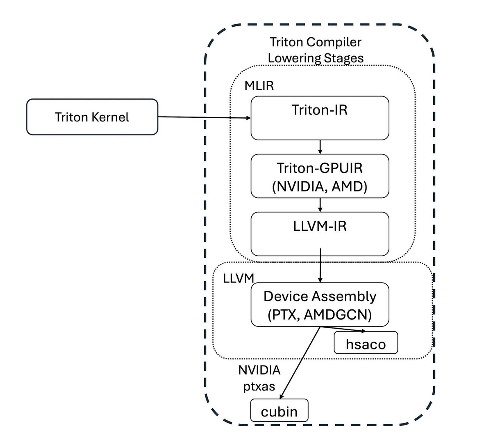
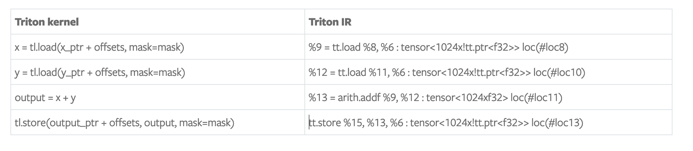

> 블로그 출처: https://pytorch.org/blog/triton-kernel-compilation-stages/ . 여기서는 번역을 하며, [CUDA-MODE 강의 노트 29강 Triton 내부 메커니즘](https://mp.weixin.qq.com/s/7tfTXaG7D208l_5DzN9hBw)의 보충 자료입니다.

# Triton Kernel Compilation Stages

> by Sara Kokkila-Schumacher*, Brian Vaughan*, Raghu Ganti*, and Less Wright+ (*IBM Research, +Meta)

Triton은 오픈소스 프로그래밍 언어이자 컴파일러로, Python 기반의 효율적인 GPU 코드 작성 방법을 제공합니다. 이 블로그에서는 Triton 프로그램의 컴파일 과정과 중간 표현을 강조합니다. Triton 소개는 이 블로그(https://openai.com/index/triton/)를 참고하세요.

## Triton 언어와 컴파일

Triton 프로그래밍 언어는 여러 종류의 현대 GPU를 지원하며 block-style programming 방식을 따릅니다. 예시로 Triton vector add tutorial을 따라가며 약간 수정하겠습니다. vector add kernel과 helper function 정의는 다음과 같습니다.

```python
import torch
import triton
import triton.language as tl

@triton.jit
def add_kernel(x_ptr,  # *Pointer* to first input vector.
               y_ptr,  # *Pointer* to second input vector.
               output_ptr,  # *Pointer* to output vector.
               n_elements, 
               BLOCK_SIZE: tl.constexpr, 
               ):
  
    pid = tl.program_id(axis=0) 
    block_start = pid * BLOCK_SIZE
    offsets = block_start + tl.arange(0, BLOCK_SIZE)
 
    mask = offsets < n_elements

    x = tl.load(x_ptr + offsets, mask=mask)
    y = tl.load(y_ptr + offsets, mask=mask)
    output = x + y
    tl.store(output_ptr + offsets, output, mask=mask)
 
def add(x: torch.Tensor, y: torch.Tensor):
    output = torch.empty_like(x)
    assert x.is_cuda and y.is_cuda and output.is_cuda
    n_elements = output.numel()

    grid = lambda meta: (triton.cdiv(n_elements, meta['BLOCK_SIZE']), )
    triton_kernel=add_kernel[grid](x, y, output, n_elements, BLOCK_SIZE=1024)
    torch.cuda.synchronize()

    # Save compilation stages - some of the stages identified here are specific to NVIDIA devices:
    with open('triton_IR.txt', 'w') as f:
        print(triton_kernel.asm['ttir'], file=f)
    with open('triton_TTGIR.txt', 'w') as f:
        print(triton_kernel.asm['ttgir'], file=f)
    with open('triton_LLVMIR.txt', 'w') as f:
        print(triton_kernel.asm['llir'], file=f)
    with open('triton_PTX.ptx', 'w') as f:
        print(triton_kernel.asm['ptx'], file=f)
    with open('triton_cubin.txt', 'w') as f:
        print(triton_kernel.asm['cubin'], file=f)

    return output

torch.manual_seed(0)
size = 98432
x = torch.rand(size, device='cuda')
y = torch.rand(size, device='cuda')
output_torch = x + y
output_triton = add(x, y)
print(output_torch)
print(output_triton)
print(f'The maximum difference between torch and triton is '
      f'{torch.max(torch.abs(output_torch - output_triton))}')
```

Triton vector add kernel에는 `@triton.jit` decorator가 포함되어 있습니다. Triton compiler는 `@triton.jit`로 표시된 함수를 컴파일하고 여러 컴파일 단계를 거쳐 함수를 낮춥니다. helper function `add`는 output tensor를 할당하고 적절한 GPU grid size를 계산하며, 추가로 중간 컴파일 단계를 저장합니다.

컴파일 과정에 초점을 맞추면, Triton kernel은 아래 그림의 일련의 단계를 거쳐 device-specific assembly code로 낮아집니다.



kernel 컴파일은 먼저 decorator가 붙은 Python 함수의 AST, 즉 abstract syntax tree를 순회해 Triton intermediate representation(Triton-IR)을 만드는 것으로 시작합니다. Triton-IR은 최적화되지 않은 machine-independent intermediate representation입니다. block-level programming 요구 사항을 도입하고, 오픈소스 LLVM compiler project를 기반으로 합니다. 다음으로 Triton compiler는 Triton-IR을 최적화하고 Triton-GPU IR(Triton-TTGIR) 단계로 변환한 뒤 LLVM-IR로 변환합니다. Triton-IR과 Triton-GPUIR 표현은 모두 MLIR Dialect 형태로 작성됩니다. MLIR은 heterogeneous hardware compilation을 개선하기 위한 LLVM의 하위 프로젝트입니다.

Triton vector add tutorial kernel에 대한 Triton IR 예시 조각은 다음과 같습니다.

```shell
module {
  tt.func public @add_kernel(%arg0: !tt.ptr<f32> {tt.divisibility = 16 : i32} loc("/u/saraks/triton_blog/01-vector-add.py":28:0), %arg1: !tt.ptr<f32> {tt.divisibility = 16 : i32} loc("/u/saraks/triton_blog/01-vector-add.py":28:0), %arg2: !tt.ptr<f32> {tt.divisibility = 16 : i32} loc("/u/saraks/triton_blog/01-vector-add.py":28:0), %arg3: i32 {tt.divisibility = 16 : i32} loc("/u/saraks/triton_blog/01-vector-add.py":28:0)) attributes {noinline = false} {
    %c1024_i32 = arith.constant 1024 : i32 loc(#loc1)
    %0 = tt.get_program_id x : i32 loc(#loc2)
    %1 = arith.muli %0, %c1024_i32 : i32 loc(#loc3)
    %2 = tt.make_range {end = 1024 : i32, start = 0 : i32} : tensor<1024xi32> loc(#loc4)
    %3 = tt.splat %1 : i32 -> tensor<1024xi32> loc(#loc5)
    %4 = arith.addi %3, %2 : tensor<1024xi32> loc(#loc5)
    %5 = tt.splat %arg3 : i32 -> tensor<1024xi32> loc(#loc6)
    %6 = arith.cmpi slt, %4, %5 : tensor<1024xi32> loc(#loc6)
    %7 = tt.splat %arg0 : !tt.ptr<f32> -> tensor<1024x!tt.ptr<f32>> loc(#loc7)
    %8 = tt.addptr %7, %4 : tensor<1024x!tt.ptr<f32>>, tensor<1024xi32> loc(#loc7)
    %9 = tt.load %8, %6 : tensor<1024x!tt.ptr<f32>> loc(#loc8)
    %10 = tt.splat %arg1 : !tt.ptr<f32> -> tensor<1024x!tt.ptr<f32>> loc(#loc9)
    %11 = tt.addptr %10, %4 : tensor<1024x!tt.ptr<f32>>, tensor<1024xi32> loc(#loc9)
    %12 = tt.load %11, %6 : tensor<1024x!tt.ptr<f32>> loc(#loc10)
    %13 = arith.addf %9, %12 : tensor<1024xf32> loc(#loc11)
    %14 = tt.splat %arg2 : !tt.ptr<f32> -> tensor<1024x!tt.ptr<f32>> loc(#loc12)
    %15 = tt.addptr %14, %4 : tensor<1024x!tt.ptr<f32>>, tensor<1024xi32> loc(#loc12)
    tt.store %15, %13, %6 : tensor<1024x!tt.ptr<f32>> loc(#loc13)
    tt.return loc(#loc14)
  } loc(#loc)
} loc(#loc)
```

Triton kernel의 주 함수가 이제 다음과 같이 표현된다는 점에 주목하세요.



Triton IR 단계에서 `%arg0: !tt.ptr&lt;f32>`와 이어지는 tensor reference는 intermediate representation이 이미 data type에 맞춰 specialized되었음을 보여줍니다.

우리는 Tesla V100-SXM2-32GB GPU, CUDA 12.2, Python 3.11.9, PyTorch 2.4.1(PyTorch 기본 설치 Triton 버전 사용)이 있는 머신에서 이 예시를 실행했습니다. 이 장치에서 이 단순 vector add는 다음 Triton GPU IR 조각을 갖습니다. 명확성을 위해 일부 줄은 생략했습니다.

```shell
#blocked = #triton_gpu.blocked<{sizePerThread = [4], threadsPerWarp = [32], warpsPerCTA = [4], order = [0]}>
module attributes {"triton_gpu.num-ctas" = 1 : i32, "triton_gpu.num-warps" = 4 : i32, triton_gpu.target = "cuda:70", "triton_gpu.threads-per-warp" = 32 : i32} {
  tt.func public @add_kernel(%arg0: !tt.ptr<f32> {tt.divisibility = 16 : i32}
    ⋮
    %9 = tt.load %8, %6 : tensor<1024x!tt.ptr<f32>, #blocked> loc(#loc8)
    ⋮
    %12 = tt.load %11, %6 : tensor<1024x!tt.ptr<f32>, #blocked> loc(#loc10)
    %13 = arith.addf %9, %12 : tensor<1024xf32, #blocked> loc(#loc11)
    ⋮
    tt.store %15, %13, %6 : tensor<1024x!tt.ptr<f32>, #blocked> loc(#loc13)
    ⋮
  } loc(#loc)
} loc(#loc)
```

이 단계에는 일부 hardware-specific 정보가 포함됩니다. 예를 들어 compute capability는 tensor를 core와 warps, 또는 AMD GPU의 wavefronts에 어떻게 분산할지와 관련됩니다. 이 예시에서 tensor는 `#blocked` layout으로 표현됩니다. 이 encoding에서는 각 wavefront가 tensor의 연속 부분을 소유합니다. 현재 다른 가능한 memory optimization에는 `slice`, `dot_op`, `shared`, `nvidia_mma`, `amd_mfma`, `amd_wmma`가 있습니다. `slice`는 한 차원을 따라 tensor를 재구성하고 분산하고, `dot_op`는 block matrix product layout을 최적화하고, `shared`는 GPU shared memory를 나타내고, `nvidia_mma`는 NVIDIA Tensor Cores에서 생성되며, `amd_mfma`와 `amd_wmma`는 각각 AMD MFMA/WMMA matrix core에서 생성됩니다. 최근 Triton 회의에서는 이 layout representation이 내부 및 backend 간 layout을 통일하기 위해 새로운 linear layout으로 전환될 것이라고 발표되었습니다. Triton-GPUIR에서 LLVM-IR로 가는 단계는 Triton-GPUIR을 LLVM 표현으로 변환합니다. 현재 Triton은 NVIDIA와 AMD 장치용 third-party backend 지원을 갖고 있으며, 다른 장치 지원도 오픈소스 커뮤니티에서 활발히 개발 중입니다.

LLVM-IR vector add parameter의 일부 예시는 다음과 같습니다.

```shell
  %19 = extractvalue { i32, i32, i32, i32 } %18, 0, !dbg !16
  %39 = extractvalue { i32, i32, i32, i32 } %38, 0, !dbg !18
  %23 = bitcast i32 %19 to float, !dbg !16
  %43 = bitcast i32 %39 to float, !dbg !18
  %56 = fadd float %23, %43, !dbg !19
```

몇 가지 pointer arithmetic과 inline assembly 호출을 통해 전역 메모리에서 데이터를 가져온 뒤, vector element가 추출되고 올바른 type으로 변환됩니다. 마지막으로 이 값들은 더해지고 inline assembly expression을 통해 전역 메모리에 다시 쓰입니다.

Triton 컴파일 과정의 마지막 단계는 LLVM-IR을 device-specific binary로 낮춥니다. vector add 예시에서 NVIDIA GPU의 다음 intermediate representation은 PTX, 즉 parallel thread execution입니다. low-level PTX syntax는 NVIDIA 장치에서 thread-level execution을 지정하며, 이는 CUDA 1.0부터 시작되었습니다. PTX에 대한 깊은 가이드는 NVIDIA 문서를 참고하세요. vector add에서 kernel parameter는 host에서 kernel로 전달되고, address가 할당되며, `mov` 명령이 thread-level data access를 촉진합니다. 마지막으로 아래 예시처럼 `add.f32`로 element add 호출을 표현합니다.

```shell
add.f32 	%f17, %f1, %f9// add type float32, output register, input register for x, input register for y
```

Triton compiler는 여러 hardware backend를 통해 assembly code compilation을 관리해 binary를 생성합니다. 이제 Triton kernel을 사용할 수 있습니다.


## 요약

Triton은 다양한 종류의 하드웨어를 대상으로 kernel을 작성하고 컴파일하기 위한 high-level abstraction을 제공합니다. 이 블로그에서는 Triton code representation과 Triton compiler의 여러 단계를 강조했습니다. custom Triton kernel 또는 Triton kernel로 다양한 workload를 가속하는 더 자세한 정보는 PyTorch Triton tutorial(https://pytorch.org/tutorials/recipes/torch_compile_user_defined_triton_kernel_tutorial.html), Triton GPTQ kernel blog(https://mp.weixin.qq.com/s/CX6lPJOVYRPlpFS_WbGbmg), Triton을 사용한 Llama3 FP8 추론(https://mp.weixin.qq.com/s/v6Ah4uFtI2zTgiAZ3-mKvw), LLMs의 CUDA-Free 추론(https://mp.weixin.qq.com/s/KlxBzBNxyRBnoEr8qXjgeg), 또는 PyTorch 2.2 절(https://pytorch.org/assets/pytorch2-2.pdf)의 Triton code generation 내용을 확인하세요.
