# Triton kernel로 Llama3 FP8 추론 가속하기

> 번역: https://pytorch.org/blog/accelerating-llama3/

## Accelerating Llama3 FP8 Inference with Triton Kernels

> by Adnan Hoque, Less Wright, Chih Chieh Yang 

### 1.0 요약

우리는 SplitK parallelization을 활용하는 optimized Triton FP8 GEMM(general matrix multiplication) kernel인 TK-GEMM을 제안합니다. small batch size inference에서 NVIDIA H100 GPU의 Llama3-70B를 대상으로 할 때, TK-GEMM은 basic Triton matrix multiplication implementation과 비교해 최대 **1.94**배 performance improvement를 제공하고, cuBLAS FP8보다 **1.87**배, **cuBLAS FP16**보다 1.71배 빠릅니다.

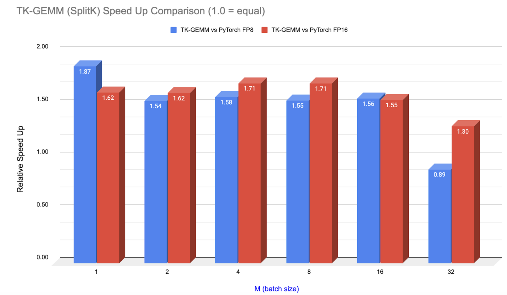

**그림 1. Llama3-70B attention layer matrix shape(N=K=8192)에서 PyTorch(cuBLAS 호출) 대비 TK-GEMM speedup**

이 블로그에서는 Triton으로 FP8 inference를 위한 효율적인 kernel을 설계하고, Llama3-70B inference에 맞춰 tuning하는 방법을 소개합니다. FP8(8-bit floating point), Hopper generation GPU(SM90)가 지원하는 새로운 data type, Triton이 지원하는 SM90의 key feature, 그리고 memory-limited inference problem size에서 memory throughput을 최대화하기 위해 parallelization을 어떻게 수정했는지 논의합니다.

또한 CUDA Graph도 별도로 논의합니다. CUDA Graph는 kernel-level acceleration을 실현하는 데 도움이 되는 중요한 technique이며, production environment에서 Triton kernel을 사용하려는 developer가 추가 performance improvement를 얻을 수 있게 합니다.

code repository와 source는 https://github.com/pytorch-labs/applied-ai 에서 얻을 수 있습니다.

### 2.0 FP8 data type

FP8 data type은 Nvidia, Arm, Intel이 16-bit floating type의 successor로 함께 내놓은 것입니다. bit 수가 절반으로 줄어들기 때문에 Transformer network에 대해 이전 type보다 상당한 throughput improvement를 제공할 잠재력이 있습니다. FP8 data type은 두 format을 포함합니다.

**E4M3**(4-bit exponent, 3-bit mantissa). +/-448과 NaN(not a number)을 저장할 수 있습니다.
**E5M2**(5-bit exponent, 2-bit mantissa). +/-57,334, NaN(not a number), inf(infinity)를 저장할 수 있습니다.

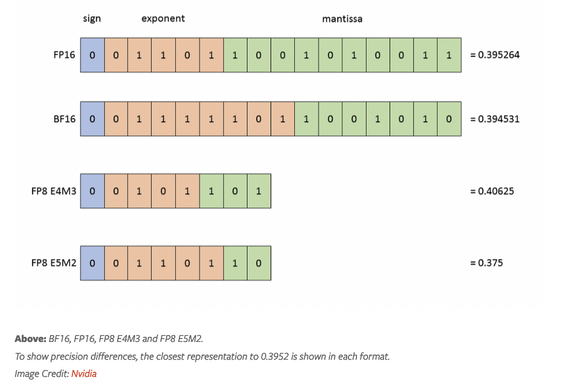

inference와 forward training에는 precision이 더 높은 E4M3를 사용하고, backward training에는 dynamic range가 더 높은 E5M2를 사용합니다. Nvidia는 H100 FP8 Tensor Core를 설계해 최대 3958 TFLOPS peak performance를 제공하며, 이는 FP16 Tensor Core의 **2배** FLOPS입니다.

우리는 Triton kernel을 설계할 때 이러한 hardware innovation을 고려했습니다. 블로그의 나머지 부분에서는 이런 feature를 활용하는 방법을 논의하고, 이 feature들이 실제로 Triton compiler에서 사용되는지 검증합니다.

### 3.0 Triton의 Hopper support와 FP8 Tensor Core instruction

Hopper GPU architecture는 FP8 GEMM을 가속할 것으로 예상되는 다음 새로운 feature를 추가했습니다.

- TMA(Tensor Memory Accelerator) hardware unit
- WGMMA(warpgroup matrix multiply-accumulate instruction)
- Threadblock Clusters

Triton은 현재 이 중 하나, 즉 wgmma instruction을 활용합니다. 반면 PyTorch(cuBLAS 호출)는 세 feature를 모두 활용합니다. 그래서 이러한 speedup은 더 인상적입니다. Hopper FP8 Tensor Core를 충분히 활용하려면, 예전 mma.sync instruction도 여전히 지원되지만 wgmma가 필요합니다.

mma와 wgmma instruction의 핵심 차이는 CUDA warp 1개가 output tile 하나를 담당하는 것이 아니라, 전체 warpgroup(4개 CUDA warp)이 비동기적으로 output tile 하나에 기여한다는 점입니다.

이 instruction이 실제로 어떤 모습인지 확인하고, 우리의 Triton kernel이 실제로 이 feature를 활용하는지 검증하기 위해 nsight compute로 PTX와 SASS assembly를 분석했습니다.

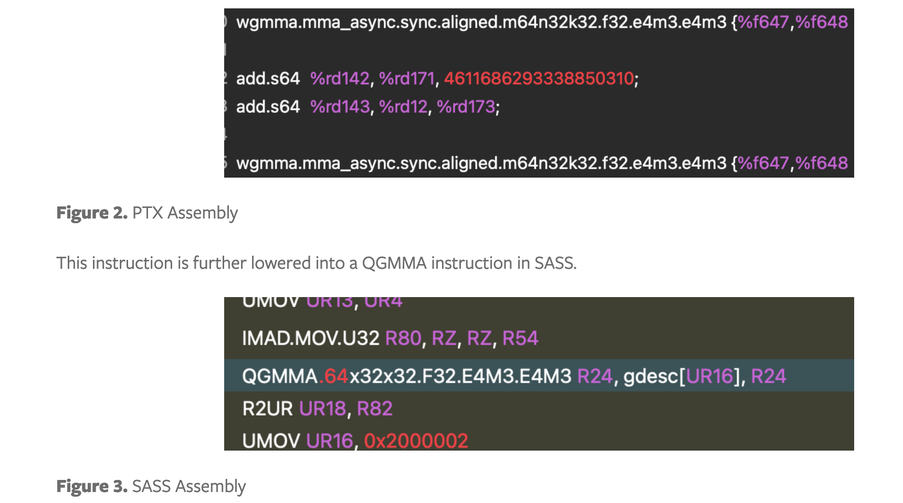

두 instruction 모두 FP8 E4M3 format의 input tensor 두 개를 곱하고 F32(32-bit floating point)로 accumulate하고 있음을 알려줍니다. 이는 TK-GEMM kernel이 실제로 FP8 Tensor Core를 활용하고 있고 lowering이 올바르게 수행되고 있음을 확인해 줍니다.

### 4.0 SplitK work decomposition

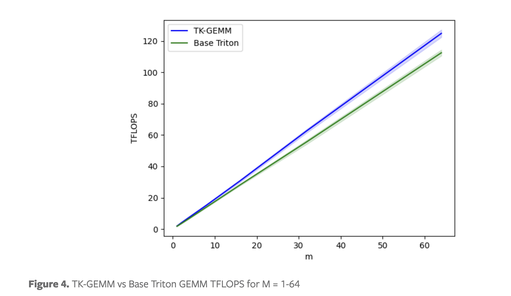

basic Triton FP8 GEMM implementation은 small M range(https://github.com/triton-lang/triton/issues/3104)에서 성능이 좋지 않습니다. 즉 matrix multiplication A (MxN) x B (NxK)에서 M < N, K인 경우입니다. 이 matrix configuration을 최적화하기 위해 basic Triton kernel의 data parallel decomposition 대신 SplitK work decomposition을 적용했습니다. 이는 small M range에서 latency를 크게 개선했습니다.

배경으로 설명하면, SplitK는 k dimension을 따라 추가 thread block을 launch해 partial output sum을 계산합니다. 이후 atomic reduction으로 각 thread block의 partial result를 합산합니다. 이는 더 fine-grained work decomposition을 가능하게 해 performance improvement를 가져옵니다. SplitK에 대한 더 자세한 내용은 arxiv paper(https://arxiv.org/abs/2402.00025)에서 볼 수 있습니다.

Llama3-70B problem size에 맞춰 tile size, warp 수, pipeline stage 수 같은 kernel의 다른 관련 hyperparameter를 세심하게 조정한 뒤, Triton basic implementation(https://triton-lang.org/main/getting-started/tutorials/03-matrix-multiplication.html) 대비 최대 1.94배 speedup을 만들 수 있었습니다. hyperparameter tuning에 대한 더 포괄적인 소개는 우리의 blog(https://pytorch.org/blog/accelerating-moe-model/#30-work-decomposition---splitk)를 참고하세요.

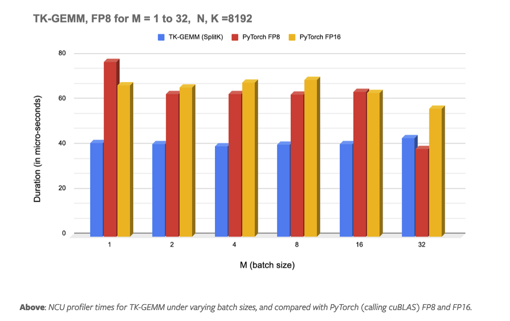

M=32부터 cuBLAS FP8 kernel의 performance가 TK-GEMM을 넘기 시작한다는 점에 주의하세요. M >= 32인 경우, 우리가 찾은 hyperparameter가 optimal이 아니라고 의심합니다. 따라서 medium M range의 best parameter를 결정하기 위한 또 다른 experiment set이 필요합니다.

### 5.0 CUDA Graphs의 end-to-end acceleration

end-to-end environment에서 이러한 speedup을 실현하려면 kernel execution time(GPU duration)과 wall time(CPU+GPU duration)을 동시에 고려해야 합니다. Triton kernel은 hand-written이며(torch compile로 생성된 것이 아님), 높은 kernel launch latency가 있는 것으로 잘 알려져 있습니다. torch profiler로 TK-GEMM kernel을 trace하면 CPU side call stack을 볼 수 있고, 무엇이 slowdown을 유발하는지 정확히 파악할 수 있습니다.

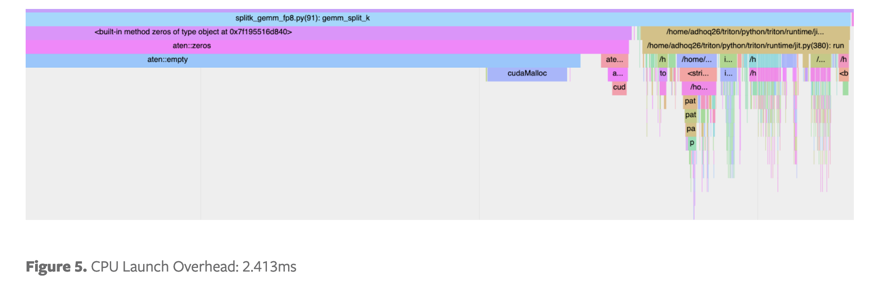

위에서 볼 수 있듯, optimized kernel의 wall time 대부분은 just-in-time(JIT) compilation overhead가 지배합니다. 이 문제를 해결하기 위해 CUDA graphs를 사용할 수 있습니다.

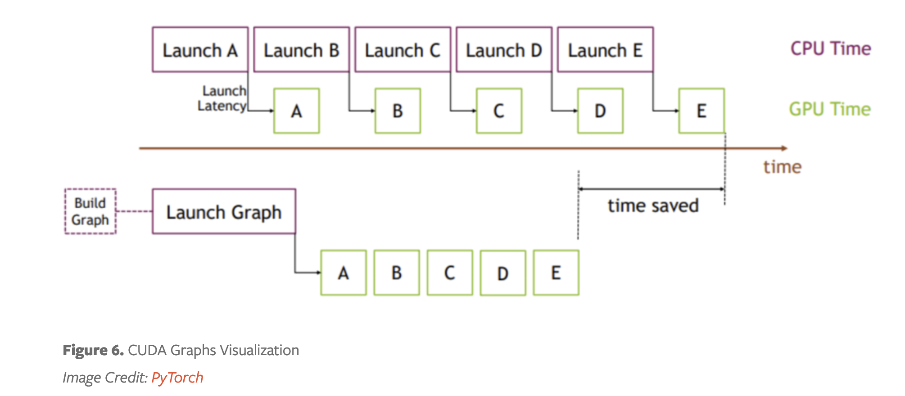

핵심 아이디어는 kernel을 여러 번 launch하는 대신 graph를 create하고 instantiate한 뒤(일회성 cost), 해당 graph instance를 submit해 실행하는 것입니다. 이를 설명하기 위해 Llama3-70B attention layer를 simulation했습니다. 아래 그림(nsight systems로 생성)에서 볼 수 있듯, CPU kernel launch overhead 때문에 각 GEMM 사이의 interval은 165 microseconds이고 실제 matrix multiplication은 12 microseconds만 걸립니다. 즉 attention layer에서 92% 시간 동안 GPU가 idle 상태로 아무 일도 하지 않는다는 뜻입니다.

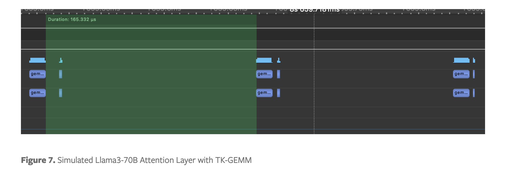

CUDA Graph의 영향을 보여주기 위해 toy attention layer에서 TK-GEMM kernel의 Graph를 만들고 해당 Graph를 replay했습니다. 아래에서 kernel execution 사이 interval이 6.65 microseconds로 줄어든 것을 볼 수 있습니다.

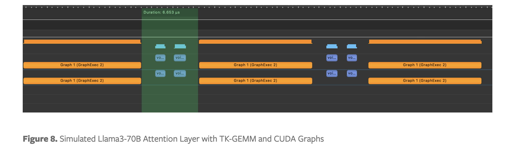

실제로 CUDA Graphs를 사용하지 않는 model에서 단순히 TK-GEMM을 사용하는 것과 비교하면, 이 optimization은 Llama3-70B의 single attention layer에서 6.4배 speedup을 제공합니다.

### 6.0 잠재적인 future optimization path

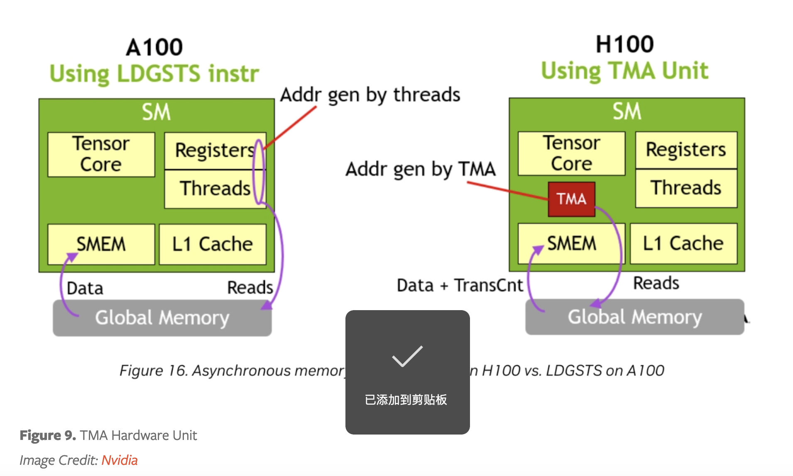

NVIDIA H100에는 TMA hardware unit이 있습니다. 전용 TMA unit은 address generation을 완전히 TMA가 처리하므로 register와 thread를 다른 작업에 사용할 수 있게 합니다. memory-limited problem size에서는 Triton이 이 feature를 지원할 때 더 큰 이득을 제공할 수 있습니다.

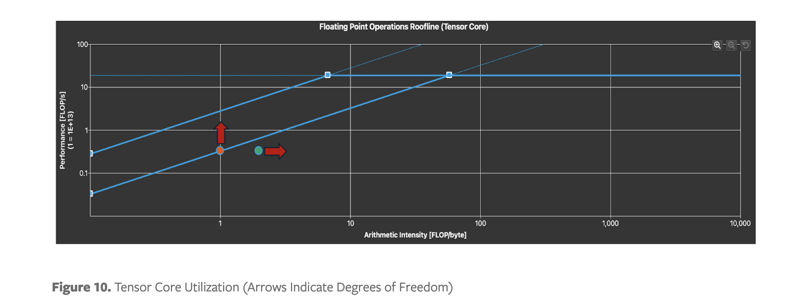

Tensor Core utilization을 파악하기 위해 roofline chart를 분석할 수 있습니다. 작은 M의 경우 예상대로 memory-limited region에 있다는 점에 주의하세요. kernel latency를 개선하려면 arithmetic intensity를 높일 수 있습니다. 고정된 problem size에서는 data locality와 다른 loop optimization을 활용해야만 가능합니다. 또는 memory throughput을 높일 수 있습니다. 이를 위해서는 FP8 data type과 FP8 inference에서 예상되는 problem size 특성에 맞춘 더 optimized parallel algorithm이 필요합니다.

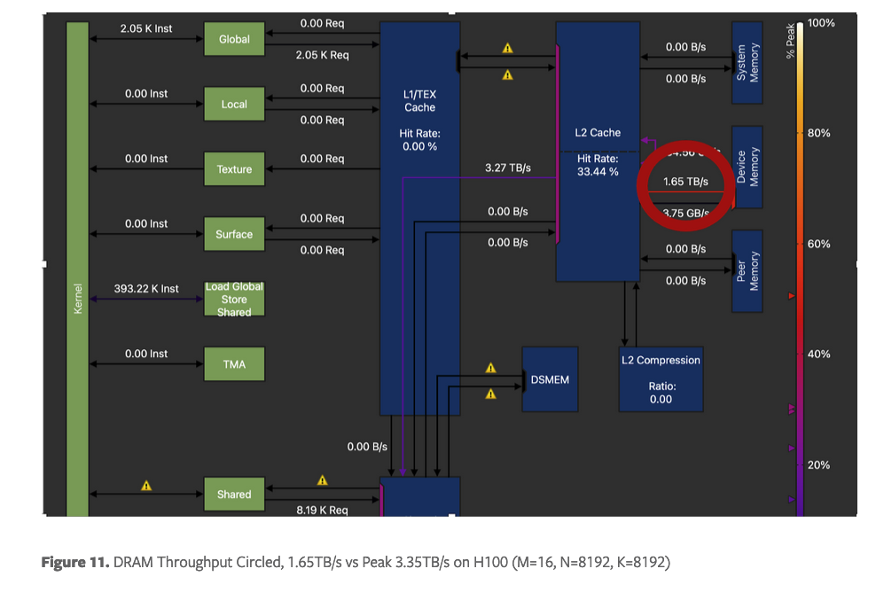

마지막으로 NVIDIA H100에서 peak DRAM throughput의 약 50%만 달성했다는 것을 볼 수 있습니다. high-performance GEMM kernel은 보통 peak throughput의 70-80%에 도달할 수 있습니다. 이는 개선 여지가 크다는 뜻이며, 위에서 언급한 loop unrolling, parallelization optimization 같은 technique을 적용해 추가 performance improvement를 얻어야 합니다.

### 7.0 Future work

향후 연구에서는 Hopper feature에 대한 더 직접적인 control을 활용하기 위해 CUTLASS 3.x와 CuTe를 탐색하고자 합니다. 특히 direct TMA control을 얻고, FP8 GEMM에서 이미 유망한 결과를 보인 pingpong architecture를 탐색하는 데 집중할 것입니다.
