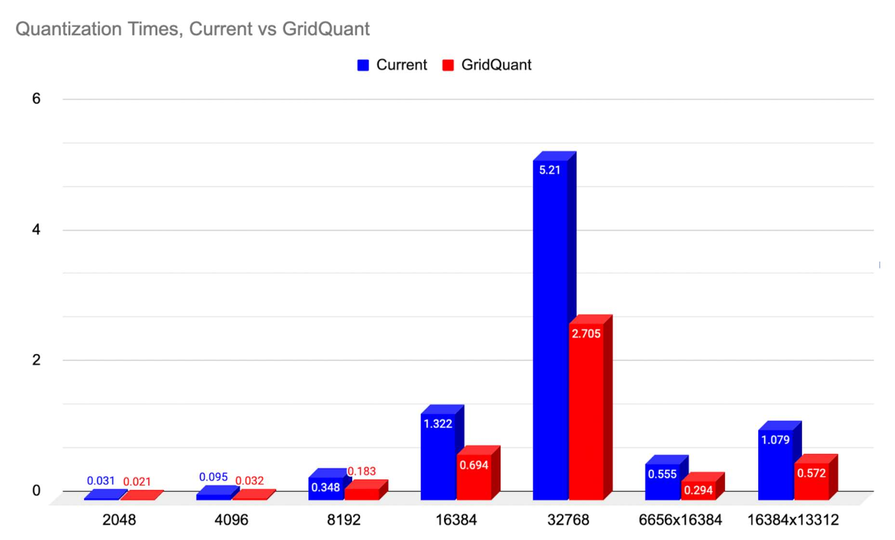
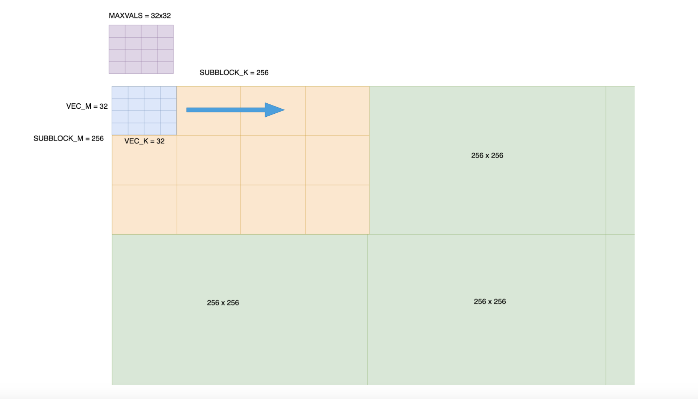
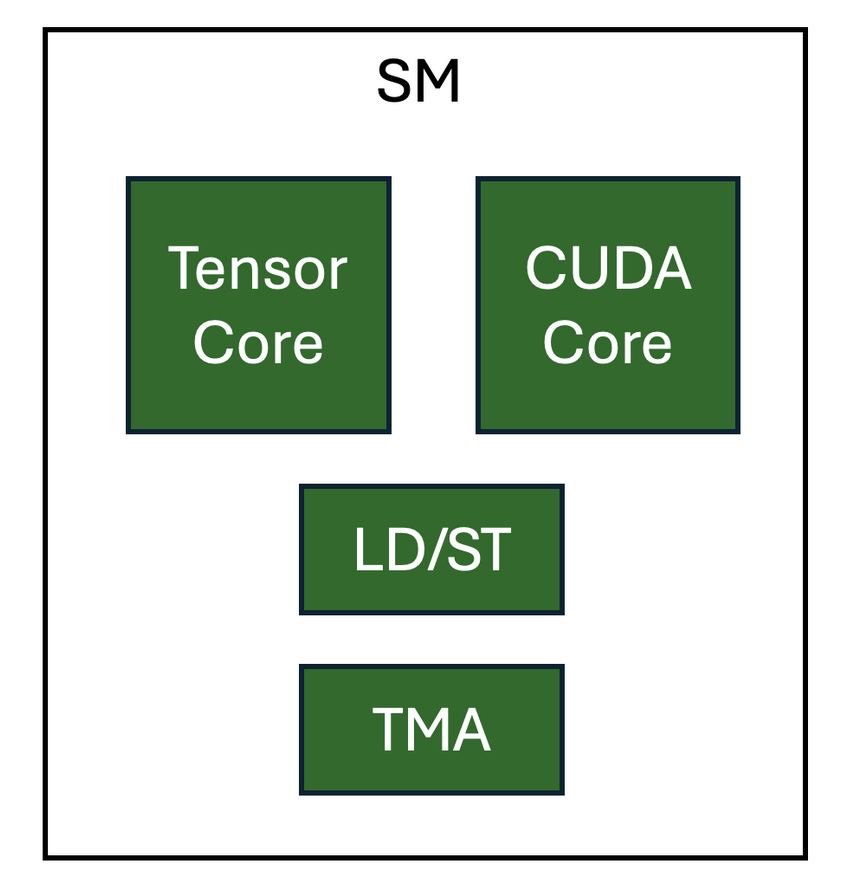
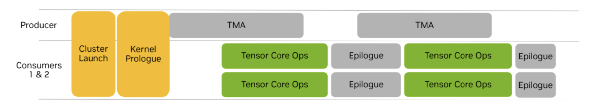
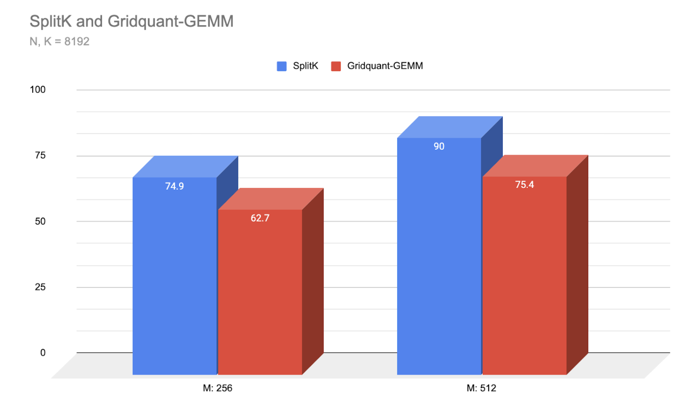

> Blog source: https://pytorch.org/blog/accelerating-gemms-triton/ 를 번역했다. 이 blog는 Triton으로 Float8 format의 matrix multiplication(GEMM) operation을 최적화하는 방법을 주로 다룬다. 글에서는 GridQuant라는 방법을 제안한다. 큰 matrix를 256x256 작은 block으로 나눈 뒤, 각 block을 다시 더 작은 32x32 grid로 나누어 data를 처리한다. 이 방법은 이전 solution보다 거의 2배 빠르다. 또한 글은 Warp Specialization, TMA(Tensor Memory Accelerator), persistent kernel이라는 세 가지 새로운 기술을 소개한다. 이 기술들은 서로 다른 computation task를 더 잘 병렬 실행하게 하며, GPU hardware 특성을 충분히 활용한다. 이러한 optimization을 통해 특정 scenario에서는 기존 최고 solution보다 약 1.2배 더 빨라지며, 특히 large language model inference stage에 적합하다. 다만 여기의 Triton code는 아직 open source되지 않았다.

# Triton으로 2D Dynamic Block Quantization Float8 GEMM 가속하기

Float8(FP8)의 2D block quantization은 Float8 quantization의 accuracy를 높이는 동시에 inference와 training의 GEMM operation을 가속할 가능성이 있다. 이 blog에서는 Triton을 사용한 block-quantized Float8 GEMM의 두 주요 stage에서의 진전을 보여준다.

High precision(BFloat16)에서 Float8로 A와 B tensor를 input quantization하는 과정에 대해, 우리는 GridQuant를 보여준다. GridQuant는 mini-grid stride loop 방식의 processing을 활용하며, 현재 2D block quantization kernel 대비 거의 2배(99.31%)의 acceleration을 달성한다.

Float8 GEMM에 대해서는 Triton의 세 가지 새로운 발전, 즉 Warp Specialization, TMA, persistent kernel을 보여준다. 이는 실질적으로 cooperative kernel을 만들어낸다(Ping-Pong scheduling의 대안으로 볼 수 있다. [PyTorch blog CUTLASS Ping-Pong GEMM Kernel 소개](https://mp.weixin.qq.com/s/QWS9YEjsbM7hzy5tJm--1g)). 그 결과 우리는 작년 최고의 SplitK kernel 대비 약 1.2배 acceleration을 달성했다.

## FP8의 2D Block Quantization을 선택하는 이유

일반적으로 tensor-level scaling에서 row-level scaling, 다시 2D block-level scaling, 마지막으로 column-level scaling으로 갈수록 fp8 quantization accuracy는 단계적으로 높아진다. 이는 주어진 token의 feature가 각 column에 저장되므로, tensor의 각 column이 더 유사한 scaling을 갖기 때문이다.

주어진 numerical set에서 outlier 수를 최소화하려면, 숫자들이 비슷한 방식으로 scale되도록 공통성을 찾아야 한다. Transformer의 경우 이는 column-based quantization이 최적일 수 있음을 의미한다. 하지만 data는 memory에서 row-contiguous layout으로 저장되므로 column-wise memory access는 효율이 매우 낮다. 따라서 column-wise load는 isolated value를 추출하기 위해 memory에서 큰 stride access를 수행해야 하며, 이는 efficient memory access의 핵심 원칙에 어긋난다.

하지만 2D는 suboptimal choice다. 일부 column-wise 특성을 포함하면서도, 2D vectorization으로 이러한 load를 수행할 수 있기 때문에 memory efficiency가 더 좋다. 따라서 우리는 2D block quantization 속도를 높이는 방법을 찾고자 했고, 이것이 GridQuant kernel을 개발한 이유다.

Quantization process에서는 high-precision BF16 input tensor(A = input activation, B = weight)에 대해 2D block quantization을 수행한 뒤, quantized tensor와 그 2D block scale value를 사용해 Float8 matrix multiplication을 수행하고 BF16 format의 output C tensor를 반환해야 한다.

## GridQuant는 어떻게 2D Block Quantization 효율을 높이는가

GridQuant kernel은 처음의 standard tile 기반 baseline quantization implementation과 비교해 몇 가지 개선점이 있다. GridQuant kernel은 전체 input tensor를 두 번 complete traversal하며, 동작 방식은 다음과 같다.

### Stage 1 - High-Precision Tensor의 각 256x256 Sub-block에서 Max Absolute Value 찾기

1 - BF16 tensor를 256 x 256 sub-block으로 나눈다. 이 quantization size는 configurable하지만, 256x256이 default다. quantization accuracy와 processing efficiency 사이에서 좋은 balance를 제공하기 때문이다.

2 - 각 256x256 sub-block은 8x8 pattern으로 배열된 64개 sub-block으로 다시 나뉘며, 각 sub-block은 32x32 element block을 처리한다. 하나의 warp(32 thread)가 자신에게 할당된 32x32 block 안의 모든 element computation을 처리한다.

3 - shared memory에 32x32 `max_vals` array를 선언한다. 이는 2D vector block이 전체 256x256 sub-block 안에서 이동할 때 각 position i,j의 current max value를 저장한다.

이는 중요한 개선이다. max vals scoring system을 scalar update가 아니라 vectorized update로 수행할 수 있어 더 효율적인 update가 가능하기 때문이다.

4 - 각 warp는 하나의 32x32 block을 처리한다. 우리는 4개 warp를 사용하므로 Triton compiler가 다음 32x32 block의 memory load와 현재 block의 absmax computation을 pipeline화할 수 있다. 이를 통해 warp scheduler는 data를 load하는 warp와 data를 처리하는 warp 사이를 전환하며 SM을 계속 busy하게 유지할 수 있다.

5 - 32x32 2D vector block processing은 grid-stride loop 방식으로 전체 256x256 sub-block 안을 이동한다. 각 warp는 current 32x32 sub-block에 따라 shared memory의 32x32 max_vals를 update한다. 따라서 max_vals[i,j]는 각 sub-block을 처리할 때 최신 max value를 유지한다.

256x256 block grid-stride loop가 끝나면, maxvals matrix 자체를 reduction하여 전체 256 block의 단일 absolute maximum을 찾는다.

이 값이 이 2D 256 x 256 block의 최종 scale factor value가 된다.

### Stage 2 - Stage 1에서 찾은 단일 Maximum Scale Factor로 256x256 Block Value를 Float8로 Quantize하기

다음으로 전체 256x256 block을 두 번째로 traversal하며, Stage 1에서 찾은 maximum value를 사용해 모든 number를 rescale하고 float 8 format으로 변환한다.

우리는 complete traversal이 2회 필요하다는 것을 알고 있으므로, Stage 1의 load 동안 Triton compiler에 이 value들을 더 높은 priority로 cache에 유지하라고 지시한다(evict policy = last).

이는 두 번째 traversal에서 L2 cache의 hit rate를 높일 수 있음을 의미하며, HBM에 직접 접근하는 것보다 더 빠른 memory access를 제공한다.

모든 256 x 256 block 처리가 끝나면 2D block quantization processing이 완료된다. 새로운 Float8 quantized tensor와 그 scale factor matrix를 반환할 수 있으며, 이는 GEMM processing의 다음 stage에서 사용된다. 이 input quantization은 두 번째 input tensor에도 반복 수행된다. 따라서 최종적으로 A_Float 8, A_scaling_matrix, B_Float8, B_scaling matrix를 얻는다.

## GridQuant - GEMM Kernel

GridQuant-GEMM kernel은 위에서 quantized된 네 개의 output을 입력으로 받아 처리한다. 우리의 high-performance GEMM kernel은 LLM inference decoding stage와 관련된 matrix shape configuration에서 SOTA performance를 달성하기 위해 몇 가지 새로운 Triton development feature를 갖고 있다.

이 새로운 feature들은 FlashAttention-3(https://arxiv.org/abs/2407.08608)과 Machete(https://neuralmagic.com/blog/introducing-machete-a-mixed-input-gemm-kernel-optimized-for-nvidia-hopper-gpus/)처럼 CUTLASS 3.x로 만든 Hopper-optimized kernel에서 흔히 볼 수 있다. 여기서는 이러한 방법을 논의하고 Triton으로 구현했을 때 얻을 수 있는 performance advantage를 보여준다.

## Tensor Memory Accelerator(TMA)

NVIDIA Hopper GPU의 TMA unit은 AI workload에서 흔한 multi-dimensional tensor의 load/store operation을 처리하는 dedicated hardware unit이다. 여기에는 몇 가지 중요한 장점이 있다.

Global memory와 shared memory 사이의 data transfer는 GPU SM의 다른 resource를 사용하지 않고 수행될 수 있어 register와 CUDA core를 해방한다. 또한 warp-specialized kernel에서 사용할 때 lightweight TMA operation을 producer warp에 할당할 수 있어 memory transfer와 computation을 크게 overlap할 수 있다.

TMA를 Triton에서 사용하는 자세한 내용은 우리의 [이전 blog](https://mp.weixin.qq.com/s/cZRoRq_gzAdA2iaMpZ08VA)를 참고하라.

## Warp Specialization(Cooperative Persistent Kernel Design)

Warp specialization은 GPU pipeline parallelism을 활용하는 기술이다. 이 experimental feature는 `tl.async_task` API(https://github.com/facebookexperimental/triton/tree/ws)를 통해 dedicated thread 표현을 구현하며, 사용자가 Triton program 안의 operation을 warp 사이에서 어떻게 "분할"할지 지정할 수 있게 한다. Cooperative Triton kernel은 서로 다른 type의 computation과 load를 수행하며, 각 operation은 전용 hardware에서 실행된다. 각 dedicated task에 dedicated hardware를 제공하면 data dependency가 없는 operation에 대해 효율적인 parallelism을 구현할 수 있다.

우리 kernel에서 pipeline을 만드는 operation은 다음과 같다.

A - GMEM에서 각 block scale을 SMEM으로 load(cp.async engine)

B - GMEM에서 activation(A)과 weight(B) tile을 SMEM으로 load(TMA)

C - A tile과 B tile의 matrix multiplication = C tile(Tensor Core)

D - A의 per-block scale과 B의 per-block scale로 C tile을 scale(CUDA core)

이 step들은 threadblock 안의 dedicated warp group에서 실행되는 "task"에 할당될 수 있다. Cooperative strategy에는 세 warp group이 있다. 하나는 compute unit에 data를 공급하는 producer warp group이고, 두 개는 computation을 수행하는 consumer warp group이다. 두 consumer warp group은 동일 output tile의 절반씩을 각각 처리한다.

이는 이전 blog에서 논의한 ping-pong scheduling과 다르다. ping-pong scheduling에서는 각 consumer warp group이 서로 다른 output tile을 처리한다. 우리는 Tensor Core operation과 epilogue computation이 overlap되지 않는다는 점에 주목했다. Computation의 epilogue stage에서 Tensor Core pipeline utilization을 낮추면 consumer warp group의 register pressure가 줄어든다. Tensor Core를 항상 busy하게 유지하는 ping-pong과 비교하면, 이는 더 큰 tile size를 허용한다.

마지막으로 grid size가 H100 GPU에서 사용 가능한 compute unit 수(132)를 초과하면, 우리의 kernel은 persistent하게 설계된다. Persistent kernel은 GPU에서 더 오래 active 상태를 유지하며, lifecycle 동안 여러 output tile을 계산한다. 우리의 kernel은 TMA asynchronous shared-to-global memory store를 활용해, 여러 threadblock을 schedule하는 cost를 감수하는 대신 다음 output tile 처리를 계속한다.

## Microbenchmark

Warp-specialized Triton kernel은 위의 small M 및 square matrix shape에서 SOTA performance를 달성했으며, 이 low arithmetic intensity range에서 이전 Triton GEMM best-performance strategy였던 SplitK Triton kernel 대비 거의 1.2배 acceleration을 구현했다. 향후 작업으로는 중간에서 큰 M range와 non-square matrix에서 우리 kernel의 performance를 tuning할 계획이다.

## Conclusion and Future Work

Future work에는 end-to-end workflow에 대한 gridquant benchmark가 포함된다. 또한 non-square(rectangular) matrix와 중간~큰 M size에 대해 더 광범위한 benchmark를 진행할 계획이다. 마지막으로 Triton의 ping-pong style warp specialization과 현재 cooperative implementation을 비교해 탐색할 계획이다.

