> blog link: https://pytorch.org/blog/flexattention/
> code example: https://github.com/pytorch-labs/attention-gym/blob/main/examples/flex_attn.ipynb

# FlexAttention: PyTorch의 Flexibility와 FlashAttention의 Performance

> by Team PyTorch: Horace He, Driss Guessous, Yanbo Liang, Joy Dong


이론적으로는 Attention is All You Need다. 하지만 실제로는 FlashAttention 같은 optimized attention implementation도 필요하다.

이러한 fused attention implementation은 performance를 크게 높이고 long context를 지원하지만, 그 efficiency는 flexibility를 대가로 얻어진다. 이제 몇 개의 PyTorch operator를 작성해 새로운 attention variant를 시도하는 것이 불가능하다. 보통 새로운 custom kernel을 작성해야 한다! 이는 machine learning researcher에게 일종의 "software lottery"와 같다. 당신의 attention variant가 기존 optimized kernel 중 하나에 맞지 않으면, 느린 runtime과 CUDA out-of-memory 문제를 피할 수 없다.

Attention variant의 예로는 causality, relative position embedding(https://paperswithcode.com/method/relative-position-encodings), Alibi(https://paperswithcode.com/method/alibi), sliding window attention(https://mistral.ai/news/announcing-mistral-7b/), PrefixLM(https://x.com/andersonbcdefg/status/1800907703688339569?mx=2), Document Masking/Sample Packing/Jagged Tensors(https://github.com/pytorch/torchtune/pull/875), Tanh Soft-Capping(https://x.com/LysandreJik/status/1807779471891538199), paged attention(https://arxiv.org/abs/2309.06180) 등이 있다. 더 나쁜 점은 사람들이 보통 이들의 조합을 원한다는 것이다! Sliding window attention + Document Masking + causality + context parallel? 또는 paged attention + sliding window + Tanh Soft-Capping?

아래 그림의 왼쪽은 오늘날의 현황을 나타낸다. 어떤 mask + bias + setting 조합은 이미 kernel implementation이 존재한다. 하지만 다양한 option이 exponential한 setting 수를 만들기 때문에, 결국 support는 꽤 fragmented해진다. 더 나쁜 점은 researcher가 제안하는 새로운 attention variant는 support가 전혀 없다는 것이다.

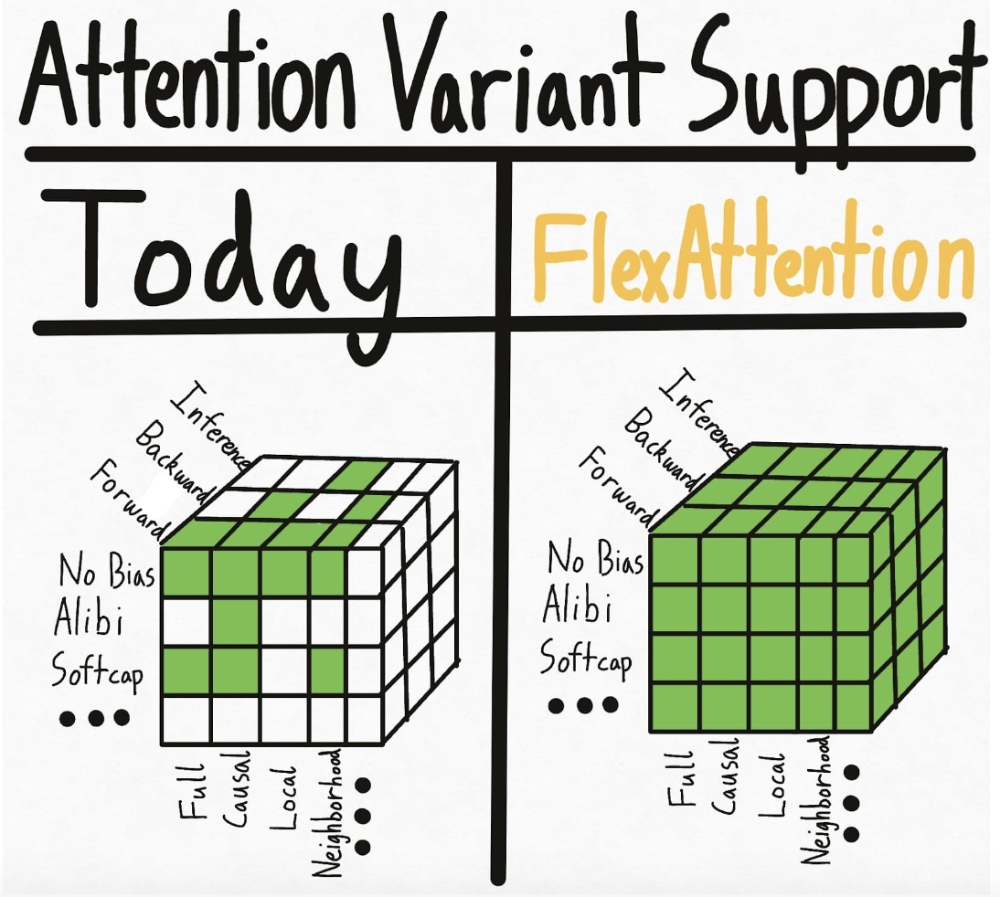

이 hypercube 문제를 근본적으로 해결하기 위해 우리는 새로운 PyTorch API인 **FlexAttention**을 도입했다.

- 우리는 flexible API를 제공해 blog post에서 언급한 모든 variant를 포함한 많은 attention variant를 몇 줄의 idiomatic PyTorch code로 구현할 수 있게 한다.
- 이를 `torch.compile`을 통해 fused FlashAttention kernel로 lower한다. 생성된 FlashAttention kernel은 추가 memory를 materialize하지 않으며, handwritten kernel과 비슷한 performance를 제공한다.
- PyTorch의 automatic differentiation mechanism도 활용해 backward propagation을 자동 생성한다.
- 마지막으로 attention mask의 sparsity를 활용해 standard attention implementation 대비 significant improvement도 얻을 수 있다.

FlexAttention을 통해 새로운 attention variant를 시도하는 일이 오직 당신의 상상력에만 제한되기를 바란다.

Attention Gym에서 많은 FlexAttention example을 찾을 수 있다: https://github.com/pytorch-labs/attention-gym . 멋진 application이 있다면 example을 submit해 달라!

PS: 우리는 이 API가 기존 PyTorch infrastructure를 흥미로운 방식으로 많이 활용한다는 점에서도 매우 exciting하다고 느꼈다. 더 많은 내용은 마지막에 소개한다.

## FlexAttention

전통적인 attention equation은 다음과 같다.

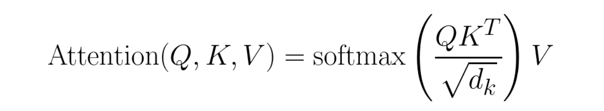

Code로 표현하면 다음과 같다.

```python
Q, K, V: Tensor[batch_size, num_heads, sequence_length, head_dim]
score: Tensor[batch_size, num_heads, sequence_length, sequence_length] = (Q @ K) / sqrt(head_dim)
probabilities = softmax(score, dim=-1)
output: Tensor[batch_size, num_heads, sequence_length, head_dim] = probabilities @ V
```

FlexAttention은 사용자가 `score_mod` function을 정의할 수 있게 한다.

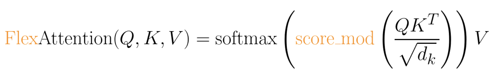

Code로 표현하면 다음과 같다.

```python
Q, K, V: Tensor[batch_size, num_heads, sequence_length, head_dim]
score: Tensor[batch_size, num_heads, sequence_length, sequence_length] = (Q @ K) / sqrt(head_dim)
modified_scores: Tensor[batch_size, num_heads, sequence_length, sequence_length] = score_mod(score)
probabilities = softmax(modified_scores, dim=-1)
output: Tensor[batch_size, num_heads, sequence_length, head_dim] = probabilities @ V
```

이 function은 softmax 전에 attention score를 수정할 수 있게 한다. 놀랍게도 이는 대부분의 attention variant에 이미 충분하다(아래 example에서 보듯)!

구체적으로 `score_mod`의 expected signature는 조금 독특하다.

```python
def score_mod(score: f32[], b: i32[], h: i32[], q_idx: i32[], kv_idx: i32[])
    return score # noop - standard attention
```

다시 말해 `score`는 query token과 key token의 dot product를 나타내는 scalar PyTorch tensor다. 나머지 parameter는 현재 어떤 dot product를 계산하는지 알려준다. `b`는 current batch element, `h`는 current head, `q_idx`는 query의 position, `kv_idx`는 key/value tensor의 position이다.

이 function을 적용하려면 다음과 같이 구현할 수 있다.

```python
for b in range(batch_size):
    for h in range(num_heads):
        for q_idx in range(sequence_length):
            for kv_idx in range(sequence_length):
                modified_scores[b, h, q_idx, kv_idx] = score_mod(scores[b, h, q_idx, kv_idx], b, h, q_idx, kv_idx)
```

물론 FlexAttention의 underlying implementation은 이렇게 동작하지 않는다. `torch.compile`을 활용하면 당신의 function을 자동으로 single fused FlexAttention kernel로 낮출 수 있다. 보장한다. 아니면 환불이다!

이 API는 결국 놀라울 정도로 expressive하다. 몇 가지 example을 보자.

## Score Mod Example
### Full Attention
먼저 "full attention", 즉 standard bidirectional attention을 구현해 보자. 이 경우 `score_mod`는 no-op이다. 입력 score를 받아 그대로 반환한다.

```python
def noop(score, b, h, q_idx, kv_idx):
    return score
```
End-to-end 사용 예시는 다음과 같다(forward와 backward 포함).
```python
from torch.nn.attention.flex_attention import flex_attention

flex_attention(query, key, value, score_mod=noop).sum().backward()
```

### Relative Position Encodings

흔한 attention variant 중 하나는 "relative position encoding"이다. Query와 key에 absolute distance를 encode하는 대신, relative position encoding은 query와 key 사이의 "distance"에 따라 score를 조정한다.

```python
def relative_positional(score, b, h, q_idx, kv_idx):
    return score + (q_idx - kv_idx)
```

전통적인 implementation과 달리, 이것은 SxS tensor를 materialize할 필요가 없다는 점에 유의하라. FlexAttention은 kernel 안에서 bias value를 "on the fly"로 계산하므로 memory와 performance를 크게 개선한다.

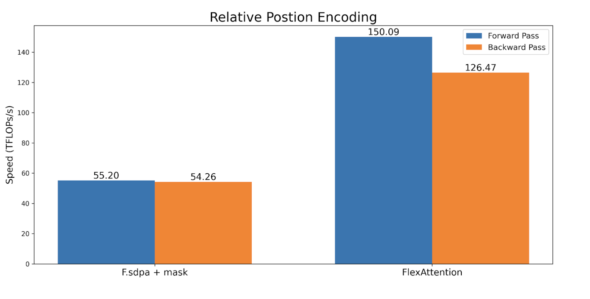

### ALiBi Bias

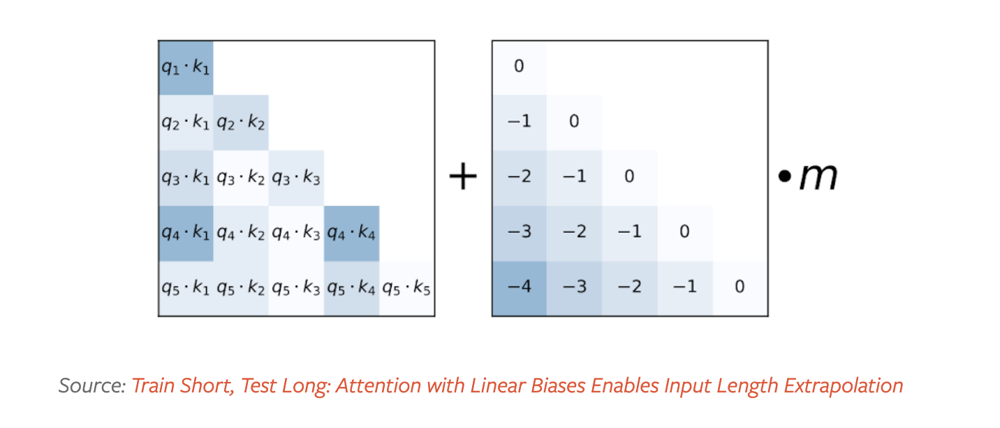

ALiBi는 《Train Short, Test Long: Attention with Linear Biases Enables Input Length Extrapolation(https://arxiv.org/abs/2108.12409)》에서 도입되었으며, inference 시 length extrapolation에 유익한 특성이 있다고 주장한다. 주목할 점은 MosaicML이 "kernel support 부족"(https://x.com/jefrankle/status/1804567458092605736)을 ALiBi에서 rotary embedding으로 전환한 주요 이유로 지적했다는 것이다.

Alibi는 relative position encoding과 유사하지만 한 가지 예외가 있다. 보통 precompute되는 per-head factor가 있다.

```python
alibi_bias = generate_alibi_bias() # [num_heads]

def alibi(score, b, h, q_idx, kv_idx):
    bias = alibi_bias[h] * (q_idx - kv_idx)
    return score + bias
```

이는 `torch.compile`이 제공하는 흥미로운 flexibility를 보여준다. `alibi_bias`가 explicit input으로 전달되지 않더라도 거기서 data를 load할 수 있다! 생성된 Triton kernel은 `alibi_bias` tensor에서 올바르게 load한 data를 계산하고 fuse한다. `alibi_bias`를 다시 생성하더라도 recompilation이 필요하지 않다는 점에 유의하라.

### Soft-capping

Soft-capping은 Gemma2(https://huggingface.co/blog/gemma2#soft-capping-and-attention-implementations)와 Grok-1에서 사용되는 technique으로, logits가 과도하게 커지는 것을 방지한다. FlexAttention에서는 다음과 같이 보인다.

```python
softcap = 20
def soft_cap(score, b, h, q_idx, kv_idx):
    score = score / softcap
    score = torch.tanh(score)
    score = score * softcap
    return score
```

여기서도 forward pass에서 backward pass를 자동 생성한다는 점에 주목하라. 또한 이 implementation은 semantic하게 correct하지만, performance 때문에 이 경우 tanh approximation을 사용하고 싶을 수 있다. 더 자세한 내용은 attention-gym(https://github.com/pytorch-labs/attention-gym/blob/main/attn_gym/mods/softcapping.py)을 참고하라.


### Causal Mask

Bidirectional attention은 가장 단순하지만, 《Attention is All You Need》 paper와 대부분의 LLM은 decoder-only setting에서 attention을 사용한다. 여기서 각 token은 자신보다 앞선 token만 attend할 수 있다. 사람들은 보통 이를 lower triangular mask라고 생각한다. `score_mod` API를 사용하면 다음과 같이 표현할 수 있다.

```python
def causal_mask(score, b, h, q_idx, kv_idx):
    return torch.where(q_idx >= kv_idx, score, -float("inf"))
```

기본적으로 query token이 key token 뒤에 있으면 score를 유지한다. 그렇지 않으면 `-inf`로 설정해 mask out하여 softmax computation에 참여하지 않도록 한다.

하지만 다른 modification과 비교하면 mask는 특별하다. 어떤 내용이 mask out되면 그 computation을 완전히 skip할 수 있기 때문이다! 이 경우 causal mask는 약 50% sparsity를 가지므로, 이 sparsity를 활용하지 않으면 2배 slowdown이 발생한다. 이 `score_mod`만으로도 causal mask를 correct하게 구현할 수 있지만, sparsity의 performance advantage를 얻으려면 또 다른 개념인 `mask_mod`가 필요하다.

## Mask Mods

Mask가 가져오는 sparsity를 활용하려면 더 많은 작업이 필요하다. 구체적으로 `mask_mod`를 `create_block_mask`에 전달하면 `BlockMask`를 만들 수 있다. 이후 FlexAttention은 이 `BlockMask`를 사용해 sparsity를 활용한다!

`mask_mod`의 signature는 `score_mod`와 매우 비슷하다. 다만 score가 없을 뿐이다. 특히 다음과 같다.

```python
# returns True if this position should participate in the computation
mask_mod(b, h, q_idx, kv_idx) => bool
```

`score_mod`가 `mask_mod`보다 더 expressive하다는 점에 유의하라. 하지만 mask operation에는 performance가 더 좋으므로 `mask_mod`와 `create_block_mask` 사용을 권장한다. `score_mod`와 `mask_mod`를 왜 분리했는지는 FAQ를 참고하라.

이제 `mask_mod`로 causal mask를 구현하는 방법을 보자.

### Causal Mask

```python
from torch.nn.attention.flex_attention import create_block_mask

def causal(b, h, q_idx, kv_idx):
    return q_idx >= kv_idx

# Because the sparsity pattern is independent of batch and heads, we'll set them to None (which broadcasts them) 
block_mask = create_block_mask(causal, B=None, H=None, Q_LEN=1024, KV_LEN=1024)
# In this case, we don't need a score_mod, so we won't pass any in.
# However, score_mod can still be combined with block_mask if you need the additional flexibility.
flex_attention(query, key, value, block_mask=block_mask)
```

`create_block_mask`는 **상대적으로 expensive한 operation**이라는 점에 유의하라! FlexAttention은 변경 시 recompilation이 필요하지 않지만, 이를 cache하는 데 주의하지 않으면 significant slowdown이 발생할 수 있다(best practice suggestion은 FAQ 참고).

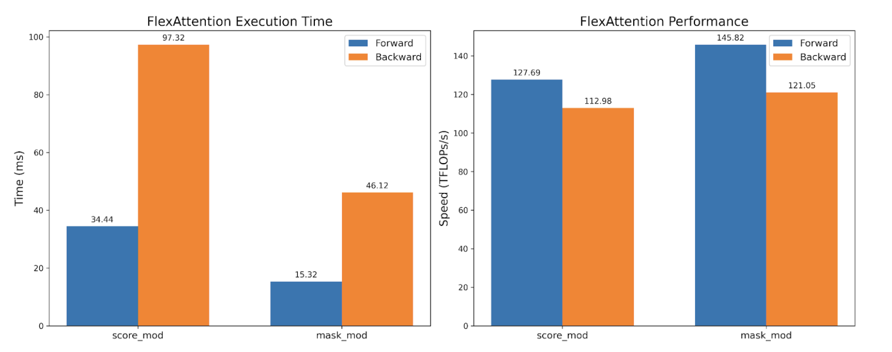

TFlops는 대략 동일하지만 `mask_mod` version의 execution time은 2배 빠르다! 이는 BlockMask가 제공하는 sparsity를 hardware efficiency loss 없이 활용할 수 있음을 보여준다.

### Sliding Window + Causal

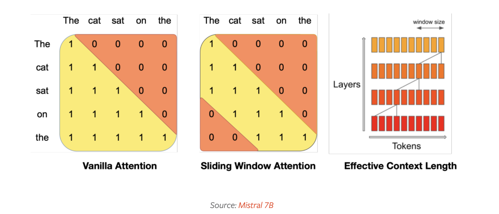

Mistral(https://arxiv.org/abs/2310.06825)이 popularize한 sliding window attention(local attention이라고도 함)은 최근 token이 가장 유용하다는 intuition을 활용한다. 특히 query token이 최근 1024 token만 attend하도록 허용한다. 이는 보통 causal attention과 함께 사용된다.

```python
SLIDING_WINDOW = 1024

def sliding_window_causal(b, h, q_idx, kv_idx):
    causal_mask = q_idx >= kv_idx
    window_mask = q_idx - kv_idx <= SLIDING_WINDOW 
    return causal_mask & window_mask

# If you want to be cute...
from torch.nn.attention import or_masks

def sliding_window(b, h, q_idx, kv_idx)
    return q_idx - kv_idx <= SLIDING_WINDOW

sliding_window_causal = or_masks(causal_mask, sliding_window)
```

이를 sliding window mask가 있는 `F.scaled_dot_product_attention` 및 causal mask가 있는 FA2(performance reference point)와 benchmark했다. 우리는 `F.scaled_dot_product_attention`보다 훨씬 빠를 뿐 아니라, causal mask가 있는 FA2보다도 훨씬 빠르다. 이 mask가 훨씬 더 높은 sparsity를 갖기 때문이다.

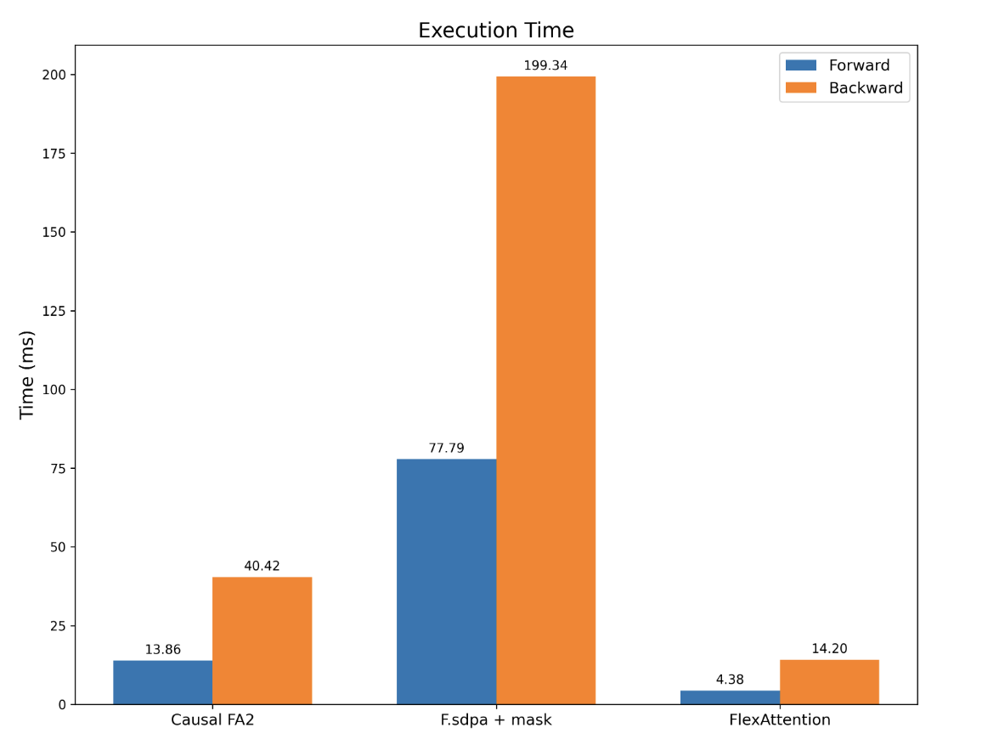

### PrefixLM

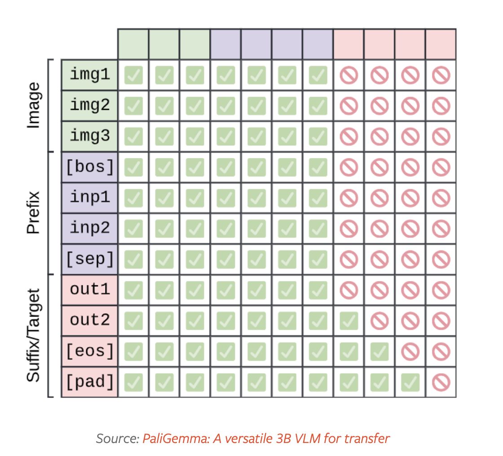

T5 architecture는 《Exploring the Limits of Transfer Learning with a Unified Text-to-Text Transformer(https://arxiv.org/abs/1910.10683)》에서 제안되었고, "prefix"에서는 fully bidirectional attention을 수행하고 나머지 부분에서는 causal attention을 수행하는 attention variant를 설명한다. 이를 구현하기 위해 다시 두 mask function을 조합한다. 하나는 causal mask용이고, 다른 하나는 prefix length 기반이다.

```python
prefix_length: [B]
def prefix_mask(b, h, q_idx, kv_idx):
    return kv_idx <= prefix_length[b]

prefix_lm_causal = or_masks(prefix_mask, causal_mask)
# In this case, our mask differs for each sequence, so we set B to our batch size.
block_mask = create_block_mask(prefix_lm_causal, B=B, H=None, S, S)
```

`score_mod`와 마찬가지로 `mask_mod`도 function의 explicit input이 아닌 extra tensor를 reference할 수 있다! 하지만 prefixLM에서는 sparsity pattern이 각 input마다 달라진다. 즉 새로운 input batch마다 `BlockMask`를 다시 계산해야 한다. 흔한 pattern은 model 시작 부분에서 `create_block_mask`를 호출하고, model의 모든 attention call에서 이 `block_mask`를 재사용하는 것이다. "Recomputing Block Masks vs. Recompilation"을 참고하라.

그 대가로 우리는 prefixLM을 위한 efficient attention kernel을 제공할 수 있을 뿐 아니라, input에 존재하는 모든 sparsity를 활용할 수도 있다! FlexAttention은 recompilation 없이 BlockMask data에 따라 performance를 동적으로 조정한다.

### Document Masking/Jagged Sequences

또 다른 흔한 attention variant는 document masking/jagged sequence다. 길이가 다른 sequence set이 있다고 상상해 보자. 이들을 함께 train하고 싶지만, 불행히도 대부분의 operator는 rectangular tensor만 받는다.

`BlockMask`를 사용하면 FlexAttention에서도 이를 효율적으로 지원할 수 있다!

- 먼저 모든 sequence를 `sum(sequence lengths)` token을 포함하는 single sequence로 flatten한다.
- 그런 다음 각 token이 속한 `document_id`를 계산한다.
- 마지막으로 `mask_mod` 안에서 query와 kv token이 같은 document에 속하는지만 판단하면 된다!

```python
# The document that each token belongs to.
# e.g. [0, 0, 0, 1, 1, 2, 2, 2, 2, 2, 2] corresponds to sequence lengths 3, 2, and 6.
document_id: [SEQ_LEN]

def document_masking(b, h, q_idx, kv_idx):
    return document_id[q_idx] == document_id[kv_idx]
```

그게 전부다! 이 경우 최종적으로 block-diagonal mask를 얻는다.

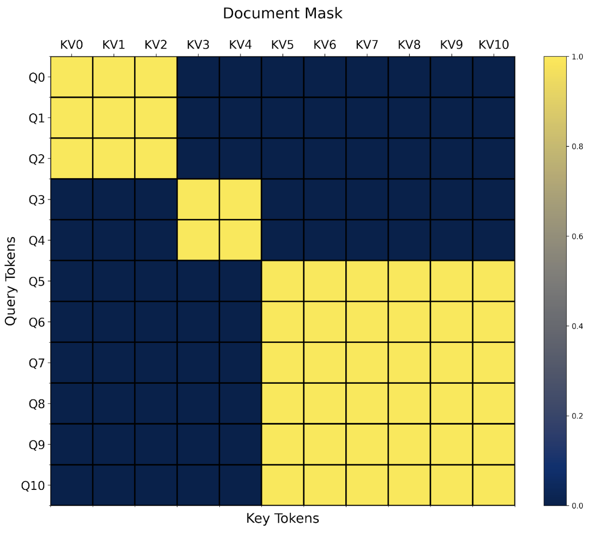

Document masking의 흥미로운 점은 임의의 다른 mask combination과 쉽게 결합할 수 있다는 것이다. 예를 들어 이전 절에서 이미 `prefixlm_mask`를 정의했다. 그렇다면 이제 `prefixlm_document_mask` function도 새로 정의해야 할까?

이런 경우에 매우 유용한 pattern을 우리는 "higher-order modification"이라고 부른다. 이 경우 기존 `mask_mod`를 가져와 jagged sequence에 적용 가능한 mask로 자동 변환할 수 있다!

```python
def generate_doc_mask_mod(mask_mod, document_id):
    # Get unique document IDs and their counts
    _, counts = torch.unique_consecutive(document_id, return_counts=True)
    # Create cumulative counts (offsets)
    offsets = torch.cat([torch.tensor([0], device=document_id.device), counts.cumsum(0)[:-1]])
    def doc_mask_wrapper(b, h, q_idx, kv_idx):
        # Check whether query and kv token belong to the same document
        same_doc = document_id[q_idx] == document_id[kv_idx]
        # Compute logical indices
        q_logical = q_idx - offsets[document_id[q_idx]]
        kv_logical = kv_idx - offsets[document_id[kv_idx]]
        # Apply the inner mask function
        inner_mask = mask_mod(b, h, q_logical, kv_logical)
        # Return the combined mask
        return same_doc & inner_mask
    return doc_mask_wrapper
```

예를 들어 위의 `prefix_lm_causal` mask가 주어졌을 때, 다음과 같이 packed documents에 적용 가능한 mask로 변환할 수 있다.

```python
prefix_length = torch.tensor(2, dtype=torch.int32, device="cuda")
def prefix_mask(b, h, q_idx, kv_idx):
    return kv_idx < prefix_length
prefix_lm_causal = or_masks(prefix_mask, causal_mask)
doc_prefix_lm_causal_mask = generate_doc_mask_mod(prefix_lm_causal, document_id)
```

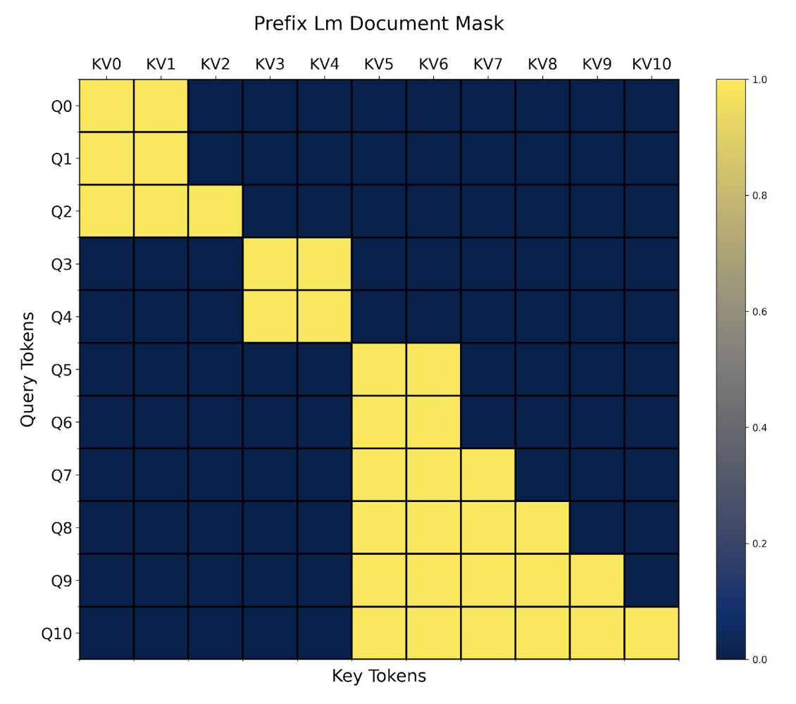

> packed documents: prefix(2)에서는 bidirectional attention을 수행하고, 나머지 부분에서는 causal attention을 수행한다.

이제 이 mask는 "block-prefixLM-diagonal" shape다. :)

이것이 우리의 모든 example이다! 더 많은 attention variant가 있지만 하나하나 열거할 수는 없으므로 더 많은 example은 Attention Gym을 확인하라. Community도 자신들이 좋아하는 FlexAttention application을 contribution해 주기를 바란다.

## FAQ

**Q: FlexAttention은 언제 recompilation이 필요한가?**

FlexAttention은 graph capture에 `torch.compile`을 활용하므로, 실제로 광범위한 상황에서 recompilation을 피할 수 있다. 주목할 점은 captured tensor value가 바뀌더라도 recompilation이 필요 없다는 것이다!

```python
flex_attention = torch.compile(flex_attention)
def create_bias_mod(bias)
    def bias_mod(score, b, h, q_idx, kv_idx):
        return score + bias
    return bias_mod
bias_mod1 = create_bias_mod(torch.tensor(0))
flex_attention(..., score_mod=bias_mod1) # Compiles the kernel here 

bias_mod2 = create_bias_mod(torch.tensor(2))
flex_attention(..., score_mod=bias_mod2) # Doesn't need to recompile! 
```

Block sparsity가 바뀌어도 recompilation은 필요 없다. 하지만 block sparsity가 바뀌면 BlockMask는 다시 계산해야 한다.

**Q: 언제 BlockMask를 다시 계산해야 하는가?**

Block sparsity가 바뀔 때마다 BlockMask를 다시 계산해야 한다. BlockMask 계산은 recompilation보다 훨씬 저렴하지만(초가 아니라 microsecond 단위), BlockMask를 과도하게 재계산하지 않도록 주의해야 한다.

다음은 흔한 pattern과 이를 처리하는 권장 방식이다.

**Mask가 절대 바뀌지 않는 경우(예: causal mask)**
이 경우 block mask를 precompute하고 global cache해 모든 attention call에서 재사용하면 된다.

```python
block_mask = create_block_mask(causal_mask, 1, 1, S,S)
causal_attention = functools.partial(flex_attention, block_mask=block_mask)
```
**Mask가 batch마다 바뀌는 경우(예: document mask)**
이 경우 model 시작 부분에서 BlockMask를 계산하고 model 안으로 전달하는 것을 권장한다. 모든 layer에서 BlockMask를 재사용한다.

```python
def forward(self, x, doc_mask):
    # Compute block mask at beginning of forwards
    block_mask = create_block_mask(doc_mask, None, None, S, S)    
    x = self.layer1(x, block_mask)
    x = self.layer2(x, block_mask)
    ...
    # amortize block mask construction cost across all layers
    x = self.layer3(x, block_mask) 
    return x
```

**Layer마다 mask가 바뀌는 경우(예: data-dependent sparsity)**
이는 가장 어려운 setting이다. 여러 FlexAttention call에 걸쳐 block mask computation을 amortize할 수 없기 때문이다. FlexAttention은 이 경우에도 benefit을 얻을 수 있지만, BlockMask의 실제 이점은 attention mask의 sparsity degree와 BlockMask를 얼마나 빠르게 build할 수 있는지에 달려 있다. 이것이 우리를 다음 질문으로 이끈다...

> Note: 여기서는 solution을 계속 제시하지 않는다.

**Q: BlockMask를 더 빠르게 계산하려면 어떻게 해야 하는가?**

`create_block_mask`는 안타깝게도 memory와 computation 관점 모두에서 꽤 expensive하다. 한 block이 완전히 sparse한지 판단하려면 block 안의 모든 point에서 `mask_mod`를 evaluate해야 하기 때문이다. 이 문제를 해결하는 몇 가지 방법이 있다.

- Mask가 batch size 또는 head 수에서 동일하다면, 해당 dimension에서 broadcast하도록 해야 한다. 즉 `create_block_mask`에서 이들을 `None`으로 설정한다.
- `create_block_mask`를 compile한다. 아쉽게도 현재 `torch.compile`은 몇 가지 불행한 limitation 때문에 `create_block_mask`에 직접 동작하지 않는다. 하지만 `_compile=True`를 설정할 수 있으며, 이는 peak memory와 runtime을 크게 줄인다(우리 test에서는 보통 한 order of magnitude 감소).
- Custom BlockMask constructor를 작성한다. BlockMask의 metadata는 매우 단순하다(document https://pytorch.org/docs/main/nn.attention.flex_attention.html#blockmask 참고). 기본적으로 두 tensor다. a. `num_blocks`: 각 query block이 계산하는 KV block 수. b. `indices`: 각 query block이 계산하는 KV block의 position.

예를 들어 다음은 `causal_mask`용 custom BlockMask constructor다.

```python
def create_causal_mask(S):
    BLOCK_SIZE = 128
    # The first query block computes one block, the second computes two blocks, and so on.
    num_blocks = torch.arange(S // BLOCK_SIZE, device="cuda") + 1
    # Because we always compute from left to right,
    # we can use indices [0, 1, 2, ...] for each query block.
    indices = torch.arange(S // BLOCK_SIZE, device="cuda").expand(
        S // BLOCK_SIZE, S // BLOCK_SIZE
    )
    num_blocks = num_blocks[None, None, :]
    indices = indices[None, None, :]
    return BlockMask(num_blocks, indices, BLOCK_SIZE=BLOCK_SIZE, mask_mod=causal_mask)
```

**Q: 왜 `score_mod`와 `mask_mod`가 다른가? `mask_mod`는 그냥 `score_mod`의 special case 아닌가?**
매우 날카로운 질문이다! 실제로 어떤 `mask_mod`든 쉽게 `score_mod`로 변환할 수 있다(실전에서는 이 function 사용을 권장하지 않는다!).

```python
def mask_mod_as_score_mod(b, h, q_idx, kv_idx):
    return torch.where(mask_mod(b, h, q_idx, kv_idx), score, -float("inf"))
```

그렇다면 `score_mod`가 `mask_mod`의 모든 기능을 구현할 수 있는데 왜 `mask_mod`가 필요할까?

직접적인 challenge 하나는 `score_mod`가 input으로 실제 score value를 필요로 하지만, BlockMask를 precompute할 때는 실제 score value가 없다는 점이다. 모두 zero를 전달해 이 value를 fake할 수 있고, `score_mod`가 `-inf`를 반환하면 mask되었다고 판단할 수 있다(사실 처음에는 그렇게 했다!).

하지만 두 가지 문제가 있다. 첫 번째는 이것이 hacky하다는 것이다. 사용자의 `score_mod`가 input이 0일 때 `-inf`를 반환하면 어떻게 될까? 또는 사용자의 `score_mod`가 mask에 `-inf` 대신 큰 negative value를 사용하면 어떻게 될까? 둥근 못을 네모난 구멍에 넣으려는 것처럼 보인다. 하지만 `mask_mod`와 `score_mod`를 분리하는 더 중요한 이유가 있다. 근본적으로 더 효율적이기 때문이다!

계산되는 각 element에 mask를 적용하는 것은 실제로 꽤 비싸다는 것이 밝혀졌다. Benchmark에서는 performance가 약 15~20% 떨어졌다! 따라서 computation 절반을 skip해 큰 acceleration을 얻을 수 있어도, 각 element를 mask해야 하는 cost 때문에 일부 acceleration을 잃는다.

다행히 causal mask를 visualize하면 대부분의 block은 "causal mask"가 전혀 필요 없다는 것을 알 수 있다. 완전히 계산되는 block이다! 대각선 위의 일부 block만 partial computation과 partial mask가 있어 mask를 적용해야 한다.

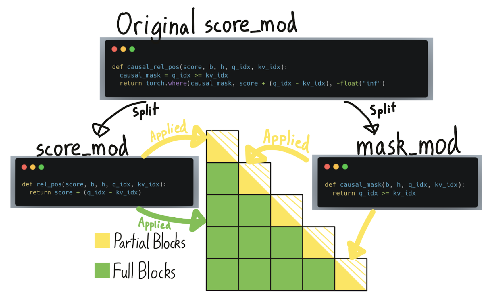

기존 BlockMask는 어떤 block을 계산해야 하고 어떤 block을 skip할 수 있는지 알려주었다. 이제 이 data structure를 더 확장해 어떤 block이 "fully computed"(즉 mask를 skip할 수 있음)이고, 어떤 block이 "partially computed"(즉 mask를 적용해야 함)인지도 알려준다. 하지만 "fully computed" block에서는 mask를 skip할 수 있어도, relative position embedding 같은 다른 `score_mods`는 여전히 적용해야 한다는 점에 유의해야 한다.

`score_mod`만으로는 어떤 부분이 "mask"인지 명확하게 알 수 없다. 따라서 사용자가 이 부분을 직접 `mask_mod`로 분리해야 한다.

**Q: BlockMask는 얼마나 많은 extra memory가 필요한가?**
BlockMask metadata size는 `[BATCH_SIZE, NUM_HEADS, QUERY_LEN//BLOCK_SIZE, KV_LEN//BLOCK_SIZE]`다. Mask가 batch 또는 head dimension에서 동일하다면, 이 dimension에서는 broadcast하여 memory를 절약할 수 있다.

Default `BLOCK_SIZE`가 128일 때 대부분의 use case에서 memory usage는 매우 작을 것으로 예상한다. 예를 들어 sequence length 1 million의 경우 BlockMask는 extra memory를 60MB만 사용한다. 이것이 문제라면 block size를 키울 수 있다: `create_block_mask(..., BLOCK_SIZE=1024)`. 예를 들어 `BLOCK_SIZE`를 1024로 키우면 이 metadata는 1MB 미만으로 줄어든다.

**Q: Numerical comparison은 어떤가?**
Result가 bitwise identical하지는 않지만, 우리는 FlexAttention이 numerical precision 측면에서 FlashAttention과 comparable하다고 확신한다. 많은 input에서 FlashAttention과 FlexAttention의 causal 및 non-causal attention variant를 비교해 다음 difference distribution을 생성했다. Error는 거의 동일하다.

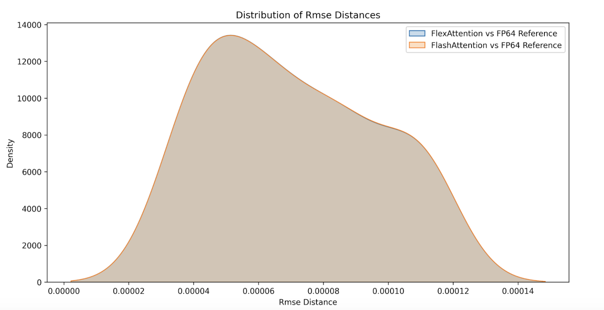

## Performance
일반적으로 FlexAttention의 performance는 handwritten Triton kernel과 거의 비슷하다. 이는 놀랍지 않다. 우리가 handwritten Triton kernel을 많이 활용하기 때문이다. 하지만 generality 때문에 약간의 performance loss는 있다. 예를 들어 다음에 계산할 block을 결정하는 데 약간의 additional latency를 부담해야 한다. 어떤 경우에는 kernel option을 제공하며, 이 option은 behavior를 바꾸면서 kernel performance에도 영향을 줄 수 있다. 이는 여기서 찾을 수 있다: performance knobs(https://github.com/pytorch/pytorch/blob/ee09d066d35d7e17cf7e9479c0b8bfc70cffc264/torch/_inductor/kernel/flex_attention.py#L146-L155)

Case study로, 이 knob들이 causal attention performance에 어떤 영향을 주는지 탐구해 보자. A100에서 Triton kernel과 FlashAttentionv2 performance를 비교한다. Script는 여기서 찾을 수 있다(https://github.com/pytorch/pytorch/blob/main/benchmarks/transformer/score_mod.py).

FlexAttention은 forward pass에서 FlashAttention2 performance의 90%, backward pass에서 85%에 도달했다. FlexAttention은 현재 deterministic algorithm을 사용하며, 이 algorithm은 FAv2보다 더 많은 intermediate result를 recompute한다. 하지만 우리는 FlexAttention backward algorithm을 개선할 계획이 있고, 이 gap을 줄이기를 기대한다!

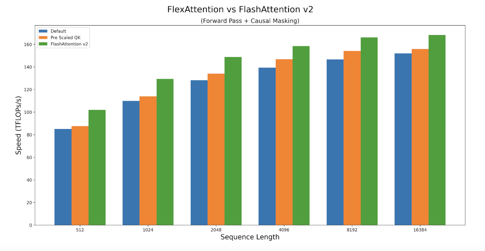

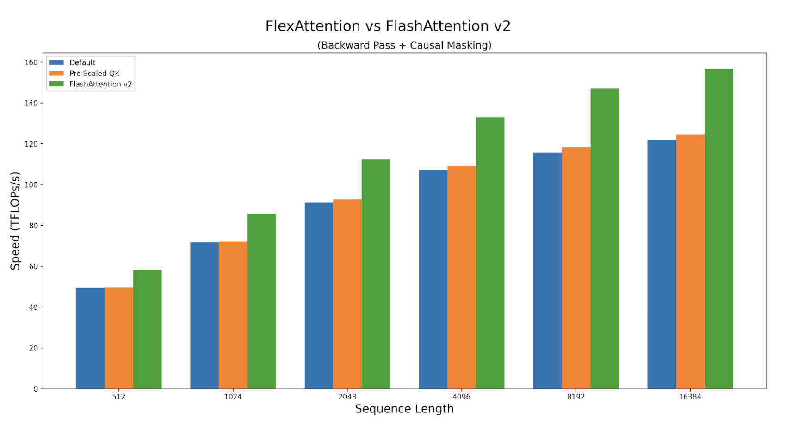

## Conclusion

우리가 FlexAttention을 개발하며 즐거웠던 만큼, 여러분도 이를 사용할 때 재미를 느끼길 바란다! 개발 과정에서 우리는 예상보다 훨씬 더 많은 API application을 발견했다. 이미 FlexAttention은 torchtune의 sample packing throughput을 71% 높였고(https://github.com/pytorch/torchtune/pull/1193), researcher가 자신의 custom Triton kernel을 작성하는 데 일주일을 쓰지 않아도 되게 했으며, custom handwritten attention variant와 경쟁할 만한 performance를 제공했다.

FlexAttention implementation에서 마지막으로 매우 흥미로웠던 점은 기존 PyTorch infrastructure를 재미있는 방식으로 많이 활용할 수 있었다는 것이다. 예를 들어 TorchDynamo(`torch.compile` frontend)의 독특한 점 중 하나는 compiled function에서 사용되는 tensor가 explicit input으로 전달될 필요가 없다는 것이다. 이 덕분에 document masking 같은 modification도 compile할 수 있었다. 이런 modification은 global variable에 접근해야 하고, 그 global variable은 바뀔 수 있다!

```python
bias = torch.randn(1024, 1024)
def score_mod(score, b, h, q_idx, kv_idx):
    return score + bias[q_idx][kv_idx] # The bias tensor can change!
```

또한 `torch.compile`은 general graph capture mechanism이기 때문에, 어떤 `mask_mod`든 jagged tensor에 적용 가능한 higher-order transformation으로 변환하는 더 "advanced"한 transformation도 지원할 수 있다.

우리는 TorchInductor(`torch.compile` backend) infrastructure도 활용해 Triton template을 지원했다. 이는 FlexAttention code generation support를 쉽게 만들었을 뿐 아니라 dynamic shape와 epilogue fusion(attention 끝에서 operator를 fuse하는 것)에 대한 support도 자동으로 제공했다! 향후에는 quantized version의 attention이나 RadixAttention(https://lmsys.org/blog/2024-01-17-sglang/)과 유사한 것을 허용하도록 이 support를 확장할 계획이다.

또한 higher-order operation, PyTorch autograd로 backward propagation 자동 생성, 그리고 `score_mod`를 자동 적용해 BlockMask를 만드는 vmap도 활용했다.

물론 Triton과 TorchInductor가 Triton code를 generate할 수 있는 능력이 없었다면 이 project는 불가능했을 것이다.

우리는 여기서 사용한 방법을 앞으로 더 많은 application에 적용하기를 기대한다!

## Limitations and Future Work

- FlexAttention은 현재 PyTorch nightly version에서만 사용할 수 있으며, 2.5.0 version에서 prototype feature로 release할 계획이다.
- 여기서는 FlexAttention을 inference에 사용하는 방법(또는 PagedAttention을 구현하는 방법)을 소개하지 않았다. 이는 후속 글에서 다룰 예정이다.
- 우리는 H100 GPU에서 FlashAttention3와 맞먹도록 FlexAttention performance를 개선하려 노력 중이다.
- FlexAttention은 모든 sequence length가 128의 multiple이어야 한다. 이 문제는 곧 해결될 것이다.
- 곧 GQA support를 추가할 계획이다. 현재는 kv heads를 단순히 copy하면 된다.

## Acknowledgements

FlexAttention에 inspiration을 준 몇 가지 prior work와 사람들을 강조하고 싶다.
- Tri Dao의 FlashAttention work
- Francisco Massa와 Xformers team의 Triton BlockSparseAttention
- Jax team의 SplashAttention work
- Triton 사용을 도와준 Philippe Tillet과 Keren Zhou
- Neighborhood attention에 대해 논의해 준 Ali Hassani
- 자신들이 좋아하는 attention variant를 attention kernel이 지원하지 않는다고 불평한 모든 사람 :)

