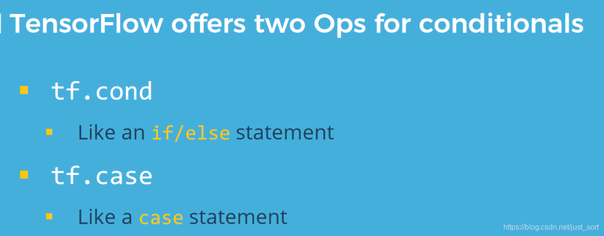
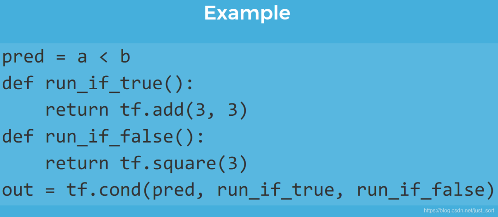
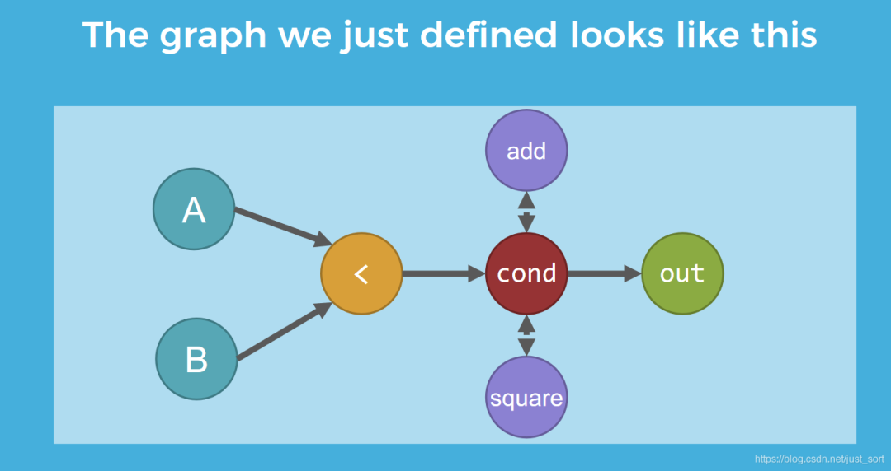
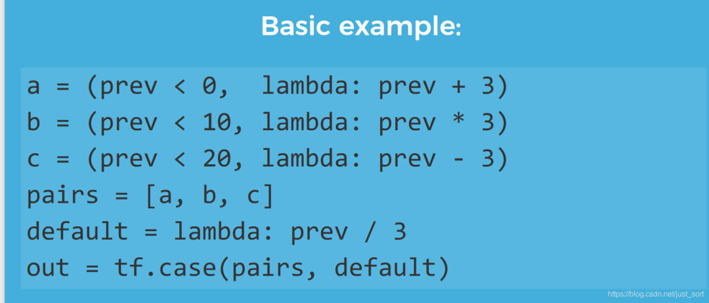
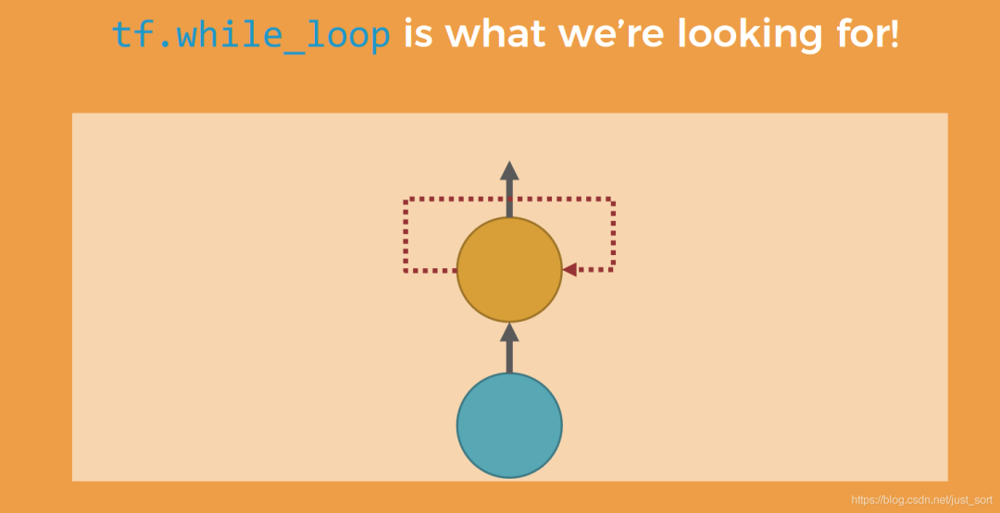
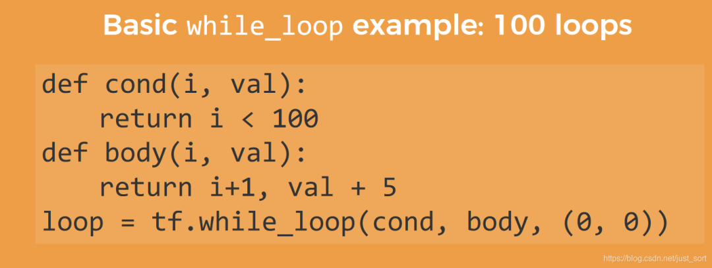

# TVM Primitive — Compute 편

TVM을 사용하고 직접 손대 본 지도 꽤 시간이 흘렀습니다. 사실 많은 시나리오에서는 PyTorch model을 받아 TorchScript로 변환한 뒤 `relay.frontend.from_pytorch`를 통해 import하고, 한 단계씩 NVIDIA GPU 위에서 네트워크 안의 각 op에 해당하는 CUDA code를 generate해 내곤 합니다. 하지만 우리의 시나리오가 더 이상 뉴럴 네트워크에 국한되지 않을 때, 예를 들어 tensor로 구성된 어떤 dense computation 같은 경우에는, TVM의 primitives, 즉 DSL을 통해 알고리즘을 정의한 다음 AutoTVM 또는 Ansor를 사용해 문제를 풀어야 합니다. 물론 Ansor를 사용한다면 algorithm이 어떤 형태인지만 정의해 주면 schedule 부분은 알아서 처리해 줍니다. 다만 custom-level의 schedule을 얻고 싶다면 모든 것을 Ansor에만 맡길 수는 없으므로, TVM primitives에 대한 학습은 여전히 매우 중요합니다. TVM의 설계 사상은 "compute"와 "schedule"을 decouple하는 것이며, 이 글에서는 compute와 관련된 모든 primitives를 정리하고, 다음 글에서는 schedule과 관련된 primitives를 정리해 보겠습니다.

가장 간단한 예시부터 시작해서 한 단계씩 깊이 들어가 보겠습니다. 본 글에서는 다음과 같은 몇 가지 예시를 다룹니다.

  1. 1차원 vector의 덧셈 vector_addition
  2. 2차원 matrix multiplication gemm
  3. convolution layer의 구현 conv2d

## (1) Vector Addition

먼저 첫 번째 예시인 vector_addition을 살펴보겠습니다. 어떤 알고리즘을 구현할 때 우리가 해야 하는 일은, 그 알고리즘의 수식을 적어 내고, 그것을 우리에게 익숙한 언어로 번역해 컴퓨터에게 실행하도록 시키는 것입니다.

vector_addition이 하려는 것은 사실 다음과 같습니다.

,

이 식이 주어졌으니, 먼저 배열의 길이를 n으로 정한 다음, 두 배열 A와 B를 만들고, A와 B의 대응되는 위치의 element를 더해서 배열 C에 넣습니다. TVM에서는 이를 어떻게 구현하는지 살펴봅시다.

n은 정의된 배열의 길이를 나타내고, A, B는 각각 길이가 n인 배열을 만든 것입니다. 그런 다음 lambda 식을 통해 A와 B의 각 element 계산 결과를 C에 넣습니다. `te.compute`에 관해 말하자면 사실 이것이 바로 출력 결과입니다. 첫 번째 인자 `A.shape`는 출력 행렬의 shape를 나타내고, `lambda i:`는 `for i: 0->n-1`로 이해할 수 있습니다. 마지막에 `create_schedule`을 통해 C를 생성하는 과정을 구축합니다. 이 구축 과정이 사실 `te.compute`가 하는 일입니다. 마지막으로 `tvm.lower`를 통해 해당 schedule을 IR로 매핑합니다. `print` 함수를 사용해 살펴볼 수 있습니다.

평소에 작성하는 C 코드와 매우 비슷하지 않나요?

## (2) GEMM

먼저 GEMM의 수식을 적어 봅시다.

먼저 차원의 matrix A, 차원의 matrix B, 차원의 matrix C를 정의합니다. TVM에서의 구현을 살펴봅시다.

n, m, l은 각각 matrix의 dimension을 나타냅니다. A matrix와 B matrix가 먼저 matrix multiplication 연산을 수행하고, 그런 다음 C matrix와 더해서 최종 계산 결과를 얻습니다. 먼저 TVM이 생성한 schedule이 어떤 모습인지 살펴봅시다.

첫 번째 `te.compute`는 3중 for-loop를 만드는 것을 볼 수 있는데, 이것은 평소 두 matrix multiplication을 작성할 때 쓰는 방식입니다. 어렵지 않게 이해할 수 있는데, 여기서는 2차원 좌표 표현을 1차원 좌표 형식으로 풀어 놓은 것입니다 (A[i][j] -> A'[i * width + j]). 두 번째 `te.compute`가 생성하는 것은 matrix 안의 대응되는 위치의 element끼리의 덧셈입니다.

세심한 분이라면 여기서 새로운 primitive인 `te.reduce_axis`가 등장한 것을 발견했을 것입니다. 이 primitive는 매우 중요한 primitive라고 할 수 있고, 많은 알고리즘을 구현할 수 있게 도와주므로, 따로 끄집어 내서 자세히 이야기할 필요가 있습니다. 그러면 먼저 reduce라는 연산에 대해 이야기해 봅시다.

제가 처음 TVM을 배울 때 reduce에 대한 인식은 "약분"이라는 의미였는데, 그다지 정확하지는 않을 수도 있습니다. matrix multiplication 예시로 말하자면, 이고, 연산 후에는 등호 오른쪽의 식이 (i, j, k) 세 차원에서 (i, j) 두 차원으로만 변한 것을 볼 수 있습니다. 그렇다면 이렇게 하는 장점은 무엇일까요? 어떤 변수 묶음에 대해 동작하는 10중 for-loop 프로그램이 있는데, 최종적으로 6차원 vector만 얻고 싶다고 가정해 봅시다. 그러면 그 중 4중 for-loop는 reduce 될 수 있습니다. matrix multiplication에서는 아직 그 장점이 잘 보이지 않을 수 있지만, 매우 간단한 convolution을 작성해 보면 reduce가 가져다주는 이점을 볼 수 있습니다. 여기서는 디지털 영상 처리에서의 간단한 convolution을 예로 들겠습니다 (input feature map의 channel은 1, output feature map의 channel도 1). 알고리즘에 대한 설명은 다음과 같습니다. input은 어떤 convolution이고, kernel의 크기는 이며, output은 `te.compute`로 계산되어 얻어집니다.

위의 작성 방식에 대해 이야기해 봅시다. 이것은 매우 naive한 convolution 구현으로, padding 연산은 포함하지 않으며, kernel을 단일 채널 이미지 위에서 직접 들고 다니며 filtering을 수행합니다. 수학적 유도를 통해 단일 window에 대한 연산 결과를 얻을 수 있습니다.

, window가 슬라이딩하기 시작하면 (i, j) 값을 바꾸어 줘야 합니다. 단지 의 기반 위에 좌표 (i, j)를 더해 주기만 하면 됩니다.

그러면 식은 다음과 같이 갱신됩니다.

최종적으로 얻는 Output은 (n-4) * (n-4) 크기의 배열이므로, reduce를 사용해 와 에 대해 연산할 수 있습니다.

사실 reduce에는 아직 배워야 할 연산이 많이 남아 있습니다. 여기서는 `te.compute`가 동시에 여러 입력을 받는 것에 대해서도 소개하겠습니다.

다음 예시를 봅시다. 예를 들어 두 개의 배열 이 있고, , 가 있으며, A 배열은 같은 차원을 가지며 길이는 모두 n입니다. 그러면 C/C++로 구현한다면, 두 개의 for-loop를 작성해 각각 , 배열에 값을 할당하면 됩니다. 그렇다면 TVM의 DSL로는 어떻게 구현해야 할까요?

사실 매우 간단합니다. 생성된 schedule이 어떤 모습인지 봅시다.

B0, B1의 계산이 모두 두 개의 for-loop 안으로 통합되었으며, 따로 떨어져 연산되지 않았습니다. 물론 다음과 같이 작성하면

이에 대응해서 생성되는 schedule은 다음과 같이 됩니다.

이런 구현은 사실 효율적이지 않습니다. 왜냐하면 같은 차원의 for-loop라면 코드를 작성할 때 가능한 한 함께 묶어서 두기 때문입니다. 물론 이러한 최적화가 모든 상황에 적용되는지에 대해서는 분명 토론의 여지가 있습니다.

## (3) Convolution Layer의 구현

앞서 GEMM 예시를 소개할 때, 매우 간단한 단일 채널 이미지와 filter를 사용한 convolution 예시를 사용했습니다. 그러나 딥러닝에서 convolution을 사용할 때는, 여러 input channel의 input feature map과 여러 output channel의 feature map을 사용한 다음, input feature map을 적절한 크기로 padding하고 convolution 연산을 수행합니다. conv2d의 파라미터를 표준화해 봅시다.

data layout: NCHW

input feature map: [128, 256, 64, 64]

filter: [512, 256, 3, 3, 1, 1] (pad: 1, stride: 1)

설명하자면, [128, 256, 64, 64]는 입력 feature map의 batch가 128이고, input channel이 256이며, 들어오는 입력의 차원은 64*64라는 것을 나타냅니다. [512, 256, 3, 3]은 convolution kernel의 파라미터를 나타냅니다. output channel은 512, input channel은 256이며, 반드시 input feature map의 input channel과 일치해야 합니다. 그리고 3 곱하기 3은 kernel size를 나타내며, pad는 1, stride도 1입니다.

자, 이러한 파라미터에 대한 소개가 끝났으니, 이제 TVM의 DSL을 사용해 convolution 알고리즘에 대한 한 세트의 설명을 매우 쉽게 구축할 수 있습니다.

convolution의 첫 단계로 해야 할 일은 input feature map에 padding 연산을 수행하여, padding된 input feature map이 convolution을 거친 후의 output feature map의 크기가 input feature map의 크기와 같아지도록 하는 것입니다. 먼저 0으로 채우는 연산에 대해 이야기해 봅시다. 0으로 채우는 연산은 전통 디지털 영상 처리에서도 매우 많이 사용됩니다.

0으로 채우는 연산은, 사실 원래 input feature map의 위, 아래, 왼쪽, 오른쪽 네 변에 0을 한 줄씩 추가하는 것입니다 (pad=1). 그러면 원래 input feature map에서 Input[0][0]에 해당하던 element는 padding 후 InputPad[1][1]이 됩니다. 이렇게 하면 InputPad에서 어떤 element가 0이고 어떤 element가 1인지 알 수 있고, 이에 대응해 생성되는 schedule은 다음과 같습니다.

테두리 채우기를 마쳤다면, 다음은 conv2d 연산을 수행할 차례입니다. 우리의 data layout은 NCHW를 채택했으므로, TVM의 DSL로 구현하는 과정에서 lambda 식의 loop 순서는 batch -> in_channel -> height -> width가 되어야 합니다. 앞서 이야기한 1차원 convolution 예시를 결합해, Filter의 세 차원 (out_channel, kernel_size, kernel_size)에 대해서는 `te.reduce_axis` 연산을 사용합니다.

간단한 conv2d 알고리즘은 7중 for-loop로 표현할 수 있는데, 세 번의 reduce_axis 연산을 거치면 나머지 4중 for-loop가 만들어집니다. 위 그림의 알고리즘에서 B는 batch_size, K는 out_channel, C는 In_channel, Y는 Height, X는 Width를 나타내며, Fy와 Fx는 각각 kernel_size를 나타냅니다. TVM의 DSL로 기술한 convolution은 다음과 같습니다.

이에 대응되는 schedule은 다음과 같습니다.

## (4) 정리

정리하자면, TVM의 DSL은 사실 많은 내용을 담고 있고, 평소에 우리가 작성하는 sequential 형식의 코드 스타일과는 좀 다르며, 이런 작성 방식은 functional programming 모드에 더 가깝습니다. 물론 이렇게 작성하는 장점도 분명합니다. lambda 식과 reduce_axis의 조합을 통해 for-loop의 형태를 hidden 시키고, 알고리즘에 대한 이해도를 높여 주며, 이를 통해 compiler의 backend가 frontend에서 DSL로 정의한 for-loop를 더 잘 최적화할 수 있게 해 줍니다.

