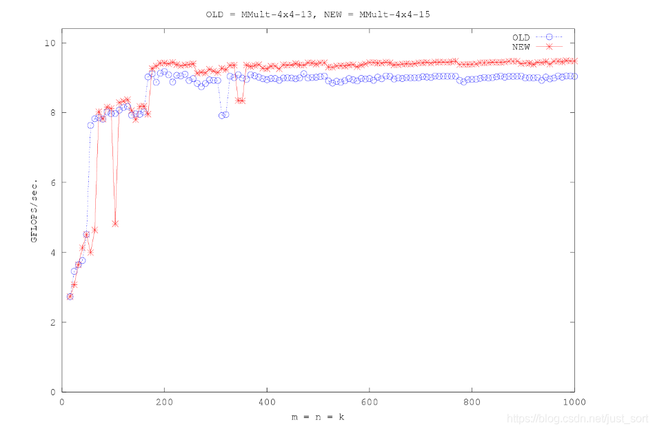
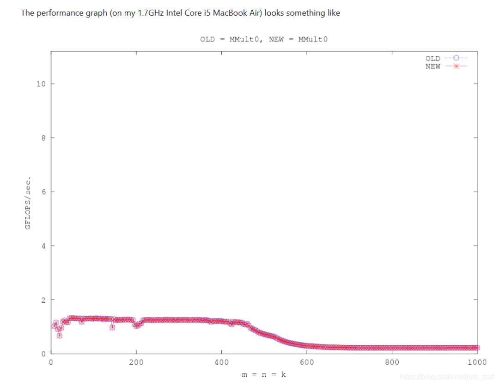

# [밑바닥부터 배우는 TVM] 3. ONNX 모델 구조를 통해 TVM 프론트엔드 이해하기

이 글은 PyTorch에서 export한 ONNX 모델을 기반으로 TVM 프론트엔드를 자세히 분석합니다. 구체적으로 TVM이 ONNX 모델을 어떻게 Relay IR로 변환하는지를 설명하고, 마지막에는 사용자 정의 op를 추가하는 예제도 함께 제공합니다. 사실 TVM에서는 현재 주류 딥러닝 프레임워크인 TensorFlow, PyTorch, MxNet 등 다양한 프레임워크의 컴파일을 지원하는데, 이들의 프론트엔드 상호작용 과정도 본문에서 소개하는 ONNX와 대동소이합니다. TVM에 관심 있는 독자가 이 글을 읽고 난 뒤 op를 새로 추가하거나, 더 나아가 TVM에서 새로운 DL 프레임워크를 지원하는 작업에 대한 전체적인 감을 잡을 수 있기를 바랍니다. 본문 실험 관련 코드는 `https://github.com/BBuf/tvm_learn` 에 있습니다.

# 0x0. 개요

본 시리즈의 앞선 두 번의 공유에서는 TVM 및 scheduler에 대해 소개했습니다. 이번 글에서는 TVM의 프론트엔드를 기반으로 TVM의 소스 코드 안으로 들어가 보려고 합니다. TVM의 아키텍처는 다음과 같습니다.

TVM의 아키텍처 그림

여기서 말하는 TVM의 프론트엔드는, Caffe/Keras/MxNet 등 프레임워크에서 학습한 모델을 Relay의 대응 인터페이스를 통해 로드하는 부분을 가리킵니다. 이 인터페이스가 바로 TVM의 모델 파싱 프론트엔드이며, 다양한 프레임워크의 계산 그래프를 TVM이 처리할 수 있는 계산 그래프로 번역해 주는 역할을 합니다. 본문에서는 ONNX 모델을 예로 들어 이 과정을 따라가 보고, 그 과정에서 핵심이 되는 코드를 분석한 뒤, 만약 우리가 직접 정의한 모델을 지원하려면 어떻게 해야 하는지(새로운 op 추가) 살펴보겠습니다.

# 0x1. TVM으로 ONNX 모델을 로드하고 추론하기

공식 문서 예제에서 제공하는 ONNX 모델은 네트워크 문제로 계속 다운로드가 되지 않으므로, 여기서는 첫 번째 글에서 사용한 PyTorch의 ResNet18 모델을 ONNX로 export하여 예제로 사용하겠습니다. ONNX로 export하기 전에 먼저 PyTorch 모델이 정확히 동작하는지 확인할 필요가 있습니다. 구체적으로는 고양이 사진 한 장을 추론하여 그 클래스가 고양이에 해당하는지 확인합니다. 코드는 다음과 같습니다.

    
    import torch  
    import numpy as np  
    import torchvision  
      
    # torchvision의 ResNet18 모델 로드
    model_name = "resnet18"  
    model = getattr(torchvision.models, model_name)(pretrained=True)  
    model = model.eval()  
      
    from PIL import Image  
    image_path = 'cat.png'  
    img = Image.open(image_path).resize((224, 224))  
      
    # 이미지를 처리하여 Tensor로 변환
    from torchvision import transforms  
      
    my_preprocess = transforms.Compose(  
        [  
            transforms.Resize(256),  
            transforms.CenterCrop(224),  
            transforms.ToTensor(),  
            transforms.Normalize(mean=[0.485, 0.456, 0.406], std=[0.229, 0.224, 0.225]),  
        ]  
    )  
    img = my_preprocess(img)  
    img = np.expand_dims(img, 0)  
      
    # PyTorch로 추론 결과 얻기
    with torch.no_grad():  
        torch_img = torch.from_numpy(img)  
        output = model(torch_img)  
      
        top1_torch = np.argmax(output.numpy())  
      
    print(top1_torch)  
      
    # export onnx  
      
    torch_out = torch.onnx.export(model, torch_img, 'resnet18.onnx', verbose=True, export_params=True)  
    

여기서 `top1_torch`의 값은 282이며, 이 ID는 정확히 ImageNet의 고양이 클래스에 해당합니다. 따라서 위의 PyTorch 모델은 정확하다고 볼 수 있습니다. 이렇게 export된 ONNX 모델은 이어서 TVM으로 로드하여 추론해 보겠습니다. 추론에 앞서 Netron으로 한 번 열어서 export한 모델이 정상인지 확인해 보는 것을 권장합니다.

PyTorch 1.7로 export한 ONNX 모델, 단일 입력/단일 출력, 시각화 결과 정상

이제 TVM을 사용해 ONNX를 import하고 추론을 진행해 보겠습니다. 먼저 필요한 패키지들을 import하고, 입력 데이터에 대해 전처리를 수행합니다. 여기서는 위의 PyTorch 프로그램과 입력을 동일하게 유지하며, 전처리도 완전히 동일합니다.

    
    import onnx  
    import numpy as np  
    import tvm  
    from tvm import te  
    import tvm.relay as relay  
      
    onnx_model = onnx.load('resnet18.onnx')  
      
    from PIL import Image  
    image_path = 'cat.png'  
    img = Image.open(image_path).resize((224, 224))  
      
    # Preprocess the image and convert to tensor  
    from torchvision import transforms  
      
    my_preprocess = transforms.Compose(  
        [  
            transforms.Resize(256),  
            transforms.CenterCrop(224),  
            transforms.ToTensor(),  
            transforms.Normalize(mean=[0.485, 0.456, 0.406], std=[0.229, 0.224, 0.225]),  
        ]  
    )  
    img = my_preprocess(img)  
    x = np.expand_dims(img, 0)  
    

다음으로 TVM의 Relay를 사용해 ONNX 모델을 TVM이 인식할 수 있는 Graph IR로 변환합니다. TVM은 Relay에 `frontend.from_onnx`라는 함수를 제공하며, 이 함수로 ONNX 모델을 로드하고 Relay IR로 변환합니다. 모델을 로드한 뒤 ONNX 모델이 TVM에서 어떤 IR로 변환되었는지 한 번 출력해 봅시다. 코드는 다음과 같습니다.

    
    # 여기서 target을 설정하여 Relay IR을 CPU 백엔드에서 실행하겠다는 것을 표시
    target = "llvm"  
      
    input_name = "input.1"  
    shape_dict = {input_name: x.shape}  
    mod, params = relay.frontend.from_onnx(onnx_model, shape_dict)  
    

먼저 mod를 출력해 봅시다.

    
    def @main(%input.1: Tensor[(1, 3, 224, 224), float32], %v193: Tensor[(64, 3, 7, 7), float32], %v194: Tensor[(64), float32], %v196: Tensor[(64, 64, 3, 3), float32], %v197: Tensor[(64), float32], %v199: Tensor[(64, 64, 3, 3), float32], %v200: Tensor[(64), float32], %v202: Tensor[(64, 64, 3, 3), float32], %v203: Tensor[(64), float32], %v205: Tensor[(64, 64, 3, 3), float32], %v206: Tensor[(64), float32], %v208: Tensor[(128, 64, 3, 3), float32], %v209: Tensor[(128), float32], %v211: Tensor[(128, 128, 3, 3), float32], %v212: Tensor[(128), float32], %v214: Tensor[(128, 64, 1, 1), float32], %v215: Tensor[(128), float32], %v217: Tensor[(128, 128, 3, 3), float32], %v218: Tensor[(128), float32], %v220: Tensor[(128, 128, 3, 3), float32], %v221: Tensor[(128), float32], %v223: Tensor[(256, 128, 3, 3), float32], %v224: Tensor[(256), float32], %v226: Tensor[(256, 256, 3, 3), float32], %v227: Tensor[(256), float32], %v229: Tensor[(256, 128, 1, 1), float32], %v230: Tensor[(256), float32], %v232: Tensor[(256, 256, 3, 3), float32], %v233: Tensor[(256), float32], %v235: Tensor[(256, 256, 3, 3), float32], %v236: Tensor[(256), float32], %v238: Tensor[(512, 256, 3, 3), float32], %v239: Tensor[(512), float32], %v241: Tensor[(512, 512, 3, 3), float32], %v242: Tensor[(512), float32], %v244: Tensor[(512, 256, 1, 1), float32], %v245: Tensor[(512), float32], %v247: Tensor[(512, 512, 3, 3), float32], %v248: Tensor[(512), float32], %v250: Tensor[(512, 512, 3, 3), float32], %v251: Tensor[(512), float32], %fc.bias: Tensor[(1000), float32], %fc.weight: Tensor[(1000, 512), float32]) {  
      %0 = nn.conv2d(%input.1, %v193, strides=[2, 2], padding=[3, 3, 3, 3], kernel_size=[7, 7]);  
      %1 = nn.bias_add(%0, %v194);  
      %2 = nn.relu(%1);  
      %3 = nn.max_pool2d(%2, pool_size=[3, 3], strides=[2, 2], padding=[1, 1, 1, 1]);  
      %4 = nn.conv2d(%3, %v196, padding=[1, 1, 1, 1], kernel_size=[3, 3]);  
      %5 = nn.bias_add(%4, %v197);  
      %6 = nn.relu(%5);  
      %7 = nn.conv2d(%6, %v199, padding=[1, 1, 1, 1], kernel_size=[3, 3]);  
      %8 = nn.bias_add(%7, %v200);  
      %9 = add(%8, %3);  
      %10 = nn.relu(%9);  
      %11 = nn.conv2d(%10, %v202, padding=[1, 1, 1, 1], kernel_size=[3, 3]);  
      %12 = nn.bias_add(%11, %v203);  
      %13 = nn.relu(%12);  
      %14 = nn.conv2d(%13, %v205, padding=[1, 1, 1, 1], kernel_size=[3, 3]);  
      %15 = nn.bias_add(%14, %v206);  
      %16 = add(%15, %10);  
      %17 = nn.relu(%16);  
      %18 = nn.conv2d(%17, %v208, strides=[2, 2], padding=[1, 1, 1, 1], kernel_size=[3, 3]);  
      %19 = nn.bias_add(%18, %v209);  
      %20 = nn.relu(%19);  
      %21 = nn.conv2d(%20, %v211, padding=[1, 1, 1, 1], kernel_size=[3, 3]);  
      %22 = nn.bias_add(%21, %v212);  
      %23 = nn.conv2d(%17, %v214, strides=[2, 2], padding=[0, 0, 0, 0], kernel_size=[1, 1]);  
      %24 = nn.bias_add(%23, %v215);  
      %25 = add(%22, %24);  
      %26 = nn.relu(%25);  
      %27 = nn.conv2d(%26, %v217, padding=[1, 1, 1, 1], kernel_size=[3, 3]);  
      %28 = nn.bias_add(%27, %v218);  
      %29 = nn.relu(%28);  
      %30 = nn.conv2d(%29, %v220, padding=[1, 1, 1, 1], kernel_size=[3, 3]);  
      %31 = nn.bias_add(%30, %v221);  
      %32 = add(%31, %26);  
      %33 = nn.relu(%32);  
      %34 = nn.conv2d(%33, %v223, strides=[2, 2], padding=[1, 1, 1, 1], kernel_size=[3, 3]);  
      %35 = nn.bias_add(%34, %v224);  
      %36 = nn.relu(%35);  
      %37 = nn.conv2d(%36, %v226, padding=[1, 1, 1, 1], kernel_size=[3, 3]);  
      %38 = nn.bias_add(%37, %v227);  
      %39 = nn.conv2d(%33, %v229, strides=[2, 2], padding=[0, 0, 0, 0], kernel_size=[1, 1]);  
      %40 = nn.bias_add(%39, %v230);  
      %41 = add(%38, %40);  
      %42 = nn.relu(%41);  
      %43 = nn.conv2d(%42, %v232, padding=[1, 1, 1, 1], kernel_size=[3, 3]);  
      %44 = nn.bias_add(%43, %v233);  
      %45 = nn.relu(%44);  
      %46 = nn.conv2d(%45, %v235, padding=[1, 1, 1, 1], kernel_size=[3, 3]);  
      %47 = nn.bias_add(%46, %v236);  
      %48 = add(%47, %42);  
      %49 = nn.relu(%48);  
      %50 = nn.conv2d(%49, %v238, strides=[2, 2], padding=[1, 1, 1, 1], kernel_size=[3, 3]);  
      %51 = nn.bias_add(%50, %v239);  
      %52 = nn.relu(%51);  
      %53 = nn.conv2d(%52, %v241, padding=[1, 1, 1, 1], kernel_size=[3, 3]);  
      %54 = nn.bias_add(%53, %v242);  
      %55 = nn.conv2d(%49, %v244, strides=[2, 2], padding=[0, 0, 0, 0], kernel_size=[1, 1]);  
      %56 = nn.bias_add(%55, %v245);  
      %57 = add(%54, %56);  
      %58 = nn.relu(%57);  
      %59 = nn.conv2d(%58, %v247, padding=[1, 1, 1, 1], kernel_size=[3, 3]);  
      %60 = nn.bias_add(%59, %v248);  
      %61 = nn.relu(%60);  
      %62 = nn.conv2d(%61, %v250, padding=[1, 1, 1, 1], kernel_size=[3, 3]);  
      %63 = nn.bias_add(%62, %v251);  
      %64 = add(%63, %58);  
      %65 = nn.relu(%64);  
      %66 = nn.global_avg_pool2d(%65);  
      %67 = nn.batch_flatten(%66);  
      %68 = nn.batch_flatten(%67);  
      %69 = nn.dense(%68, %fc.weight, units=1000);  
      %70 = multiply(1f, %fc.bias);  
      add(%69, %70)  
    }  
    

보다시피 이 mod는 사실 하나의 함수(Relay Function)이며, 함수의 입력은 ONNX 모델의 모든 입력 Tensor에 대한 shape 정보입니다. 진짜 입력인 `input.1` 뿐만 아니라, 가중치를 가진 op의 가중치 Tensor의 shape 정보(예: 컨볼루션 레이어의 weight와 bias)도 모두 포함합니다. 이에 대응하여 `mod, params = relay.frontend.from_onnx(onnx_model, shape_dict)` 에서 params는 ONNX 모델의 모든 op의 가중치 정보를 dict 형태로 저장합니다. dict의 key는 가중치 Tensor의 이름이고, value는 TVM의 NDArray로서 (Numpy를 중간 데이터 타입으로 거쳐서 전달된) 실제 가중치 값을 담고 있습니다.

다음으로 이 계산 그래프 모델에 대한 최적화를 수행합니다. 여기서는 최적화 수준을 1로 선택하고, 최종적으로 최적화된 Relay IR을 사용해 추론을 수행하여 분류 결과가 PyTorch와 일치하는지 확인합니다.

    
    with tvm.transform.PassContext(opt_level=1):  
        intrp = relay.build_module.create_executor("graph", mod, tvm.cpu(0), target)  
      
    ######################################################################  
    # Execute on TVM  
    # ---------------------------------------------  
    dtype = "float32"  
    tvm_output = intrp.evaluate()(tvm.nd.array(x.astype(dtype)), **params).asnumpy()  
      
    print(np.argmax(tvm_output))  
    

출력 결과는 `282`로 PyTorch와 일치합니다. 이로써 TVM을 사용해 ONNX 모델을 배포하는 작업을 완료했습니다.

# 0x2. TVM은 어떻게 ONNX를 Relay IR로 변환하는가?

이제 TVM이 어떻게 ONNX를 로드하고 Relay IR로 변환하는지, 즉 위에서 본 `mod, params = relay.frontend.from_onnx(onnx_model, shape_dict)` 라는 한 줄의 코드가 구체적으로 무슨 일을 하는지 살펴보겠습니다. 먼저 이 함수의 위치를 찾아보면 `tvm/python/tvm/relay/frontend/onnx.py` 에 있습니다. 주석을 한국어로 옮기면 비교적 이해하기 쉽습니다.

    
    def from_onnx(model, shape=None, dtype="float32", opset=None, freeze_params=False):  
        """ONNX 모델을 등가의 Relay 함수로 변환한다.
       
        ONNX Graph는 Python의 Protobuf 객체로 표현되며, 함께 따라오는 파라미터는 자동으로 처리된다.
        그러나 ONNX Graph의 입력 이름은 모호하여 입력과 네트워크 가중치/편향이 "1", "2"... 처럼
        섞여 있다. 편의를 위해 "real" 입력 이름은 "input_0", "input_1"... 로 rename하고,
        파라미터는 "param_0", "param_1"... 로 rename한다.
         
        기본적으로 ONNX는 동적 shape를 기준으로 모델을 정의한다. ONNX importer는 import 시점에
        이러한 동적 특성을 보존하며, 컴파일러는 컴파일 시점에 모델을 정적 shape로 변환하려 시도한다.
        실패하면 모델 내에 동적 연산이 여전히 남아 있을 수 있다. 현재 모든 TVM kernel이 동적 shape를
        지원하는 것은 아니므로, 동적 kernel을 사용하다가 오류가 발생하면 ask.tvm.apache.org 에 질문해 주기 바란다.
      
        Parameters  
        ----------  
        model : protobuf 객체
            ONNX ModelProto after ONNX v1.1.0  
      
        shape : str을 key로, tuple을 value로 갖는 dict, optional
            계산 그래프의 입력 shape
      
        dtype : str or dict of str to str  
            계산 그래프의 입력 shape (입력이 여러 개일 수 있으므로 str일 수도, dict일 수도 있음)
      
        opset : int, optional
            자동 감지된 operator 집합을 override한다.
            일부 테스트에 유용하다.
      
        freeze_params: bool  
            If this parameter is true, the importer will take any provided  
            onnx input values (weights, shapes, etc) and embed them into the relay model  
            as Constants instead of variables. This allows more aggressive optimizations  
            at compile time and helps in making models static if certain inputs represent  
            attributes relay would traditionally consider compile-time constants.  
            요약하면, freeze_params 옵션을 켜면 ONNX로부터 생성되는 Relay IR이
            제공된 모든 입력(가중치, shape 포함)을 상수 형태로 Relay IR에 임베드한다.
            이는 컴파일 시점 최적화에 도움이 되고 모델을 정적으로 만드는 데 도움이 된다.
      
        Returns
        -------  
        mod : tvm.IRModule  
            컴파일에 사용할 Relay IR
        params : dict of str to tvm.nd.NDArray  
            Relay에서 사용할 파라미터 dict로, 가중치를 저장한다
        """  
        try:  
            import onnx  
      
            if hasattr(onnx.checker, "check_model"):  
                # try use onnx's own model checker before converting any model  
                try:  
                    onnx.checker.check_model(model)  
                except Exception as e:  # pylint: disable=c-extension-no-member, broad-except  
                    # the checker is a bit violent about errors, so simply print warnings here  
                    warnings.warn(str(e))  
        except ImportError:  
            pass  
        # pb2.GraphProto에서 복사한 helper class로, Relay IR을 처리하는 데 사용
        g = GraphProto(shape, dtype, freeze_params)  
        # ONNX 모델의 GraphProto
        graph = model.graph  
        if opset is None:  
            try:  
                opset = model.opset_import[0].version if model.opset_import else 1  
            except AttributeError:  
                opset = 1  
        # Use the graph proto as a scope so that ops can access other nodes if needed.  
        with g:  
            mod, params = g.from_onnx(graph, opset)  
        return mod, params  
      
    

위의 `freeze_params` 파라미터에 대한 개인적인 이해는 다음과 같습니다. 이 옵션을 켜면 컴파일된 정적 모델은 사용자가 지정한 shape의 모델만 처리할 수 있게 됩니다. 예를 들어 fully convolutional network는 원래 임의의 해상도를 입력으로 받을 수 있지만, 사용자가 특정 해상도를 지정하여 Relay IR을 빌드하고 이 파라미터를 `True`로 설정하면, 모델 추론 시 지정한 해상도가 아닌 이미지가 들어오면 예외가 발생하게 됩니다. 위 함수의 주석을 통해, Relay IR이 ONNX 모델을 받은 뒤 GraphProto 클래스를 새로 만들어 ONNX 모델의 op 변환과 Relay IR 생성을 **관리**한다는 것을 알 수 있습니다. 여기서 핵심 함수는 `g.from_onnx(graph, opset)` 이며, 계속 따라가 보면 주석이 달린 코드는 다음과 같습니다.

    
    def from_onnx(self, graph, opset, get_output_expr=False):  
            """ONNX 모델을 기반으로 Relay IR을 빌드한다.
      
            Parameters
            ----------  
            graph : onnx protobuf 객체
               로드된 ONNX Graph
      
            opset : operator 집합 버전
      
            get_output_expr: bool  
                true로 설정하면, 변환 결과로 패키징된 모듈 대신 각 출력 표현식을 반환한다.
                서브그래프를 Relay로 변환할 때 유용할 수 있다.
      
            Returns  
            -------  
            mod : tvm.IRModule  
                The returned relay module  
      
            params : dict  
                A dict of name: tvm.nd.array pairs, used as pretrained weights  
            """  
            self.opset = opset  
            # 네트워크의 입력을 relay로 파싱. 파라미터라고도 부르며, ONNX의 initializer가 모델 파라미터를 저장하는 데 사용됨
            for init_tensor in graph.initializer:  
                if not init_tensor.name.strip():  
                    raise ValueError("Tensor's name is required.")  
                # 구체적으로는 먼저 이 TensorProto를 get_numpy 함수로 값으로 받고,
                # 특정 shape로 reshape한 뒤, 이 numpy를 기반으로 tvm.nd.array를 생성
                array = self._parse_array(init_tensor)  
                # 앞서 설명했듯이 freeze_params가 설정되어 있으면 해당 파라미터를 Relay의 상수 op로 설정
                if self._freeze_params:  
                      
                    self._nodes[init_tensor.name] = _expr.const(array)  
                else:  
                    self._params[init_tensor.name] = array  
                    self._nodes[init_tensor.name] = new_var(  
                        init_tensor.name,  
                        shape=self._params[init_tensor.name].shape,  
                        dtype=self._params[init_tensor.name].dtype,  
                    )  
            # ONNX 모델의 입력을 파싱
            for i in graph.input:  
                # from onnx v0.2, GraphProto.input has type ValueInfoProto,  
                #  and the name is 'i.name'  
                # i 입력의 이름, shape, 데이터 타입 그리고 shape 각 차원의 이름을 얻음
                i_name, i_shape, d_type, i_shape_name = get_info(i)  
                # i 입력이 가중치 파라미터인지 입력인지 판별
                if i_name in self._params:  
                    # i is a param instead of input  
                    self._num_param += 1  
                    self._params[i_name] = self._params.pop(i_name)  
                    self._nodes[i_name] = new_var(  
                        i_name, shape=self._params[i_name].shape, dtype=self._params[i_name].dtype  
                    )  
                # 입력 노드가 이미 Relay IR에 들어있으면 처리하지 않음
                elif i_name in self._nodes:  
                    continue  
                else:  
                    # 진짜 입력 노드는 사용자의 지정에 의존
                    self._num_input += 1  
                    self._input_names.append(i_name)  
                    if i_name in self._shape:  
                        i_shape = self._shape[i_name]  
                    else:  
                        if "?" in str(i_shape):  
                            warning_msg = (  
                                "Input %s has unknown dimension shapes: %s. "  
                                "Specifying static values may improve performance"  
                                % (i_name, str(i_shape_name))  
                            )  
                            warnings.warn(warning_msg)  
                    if isinstance(self._dtype, dict):  
                        dtype = self._dtype[i_name] if i_name in self._dtype else d_type  
                    else:  
                        dtype = d_type  
                    self._nodes[i_name] = new_var(i_name, shape=i_shape, dtype=dtype)  
                self._inputs[i_name] = self._nodes[i_name]  
            # Only check user inputs in the outer-most graph scope.  
            if self._old_manager is None:  
                assert all(  
                    [name in self._input_names for name in self._shape.keys()]  
                ), "User specified the shape for inputs that weren't found in the graph: " + str(  
                    self._shape  
                )  
            # 지원하지 않는 연산자 목록 얻기
            convert_map = _get_convert_map(opset)  
            unsupported_ops = set()  
            for node in graph.node:  
                op_name = node.op_type  
                if (  
                    op_name not in convert_map  
                    and op_name != "Constant"  
                    and op_name not in _identity_list  
                ):  
                    unsupported_ops.add(op_name)  
            # 지원하지 않는 연산자 집합 출력
            if unsupported_ops:  
                msg = "The following operators are not supported for frontend ONNX: "  
                msg += ", ".join(unsupported_ops)  
                raise tvm.error.OpNotImplemented(msg)  
            # 여기까지 왔다면 이 ONNX 모델의 모든 연산자가 Relay에서 지원됨을 의미하므로, 정상적으로 변환 가능
            for node in graph.node:  
                op_name = node.op_type  
                # attribute 파라미터 파싱
                attr = self._parse_attr(node.attribute)  
                # onnx 입력 객체 생성 및 채우기
                inputs = onnx_input()  
                for i in node.input:  
                    if i != "":  
                        # self._renames.get(i, i)로 ONNX Graph 각 노드의 입력을 얻음
                        inputs[i] = self._nodes[self._renames.get(i, i)]  
                    else:  
                        inputs[i] = None  
                i_name = self._parse_value_proto(node)  
                node_output = self._fix_outputs(op_name, node.output)  
                attr["tvm_custom"] = {}  
                attr["tvm_custom"]["name"] = i_name  
                attr["tvm_custom"]["num_outputs"] = len(node_output)  
       # 변환 작업 실행
                op = self._convert_operator(op_name, inputs, attr, opset)  
                # op의 출력은 하나일 수도 있고 여러 개일 수도 있음
                if not isinstance(op, _expr.TupleWrapper):  
                    outputs_num = 1  
                else:  
                    outputs_num = len(op)  
                if outputs_num > 1:  
                    # ONNX의 일부 노드는 optional output을 지원함
                    # 이 부분은 ONNX Graph에서 누락된 출력을 검색하고 불필요한 노드를 제거함
                    valid_outputs = [False] * outputs_num  
                    for i, output in enumerate(node_output):  
                        if output != "":  
                            valid_outputs[i] = True  
                    # If we have outputs ONNX isn't expecting, we need to drop them  
                    # ONNX가 기대하지 않는 출력이 있으면 제거해야 함
                    if not all(valid_outputs):  
                        tup = op.astuple()  
                        # TupleWrapper can also wrap ops with TupleType outputs  
                        if isinstance(tup, _expr.Tuple):  
                            # For tuples, we extract the fields instead of using GetTupleItem  
                            outputs = [tup.fields[i] for i, valid in enumerate(valid_outputs) if valid]  
                        else:  
                            # For call nodes, we need to GetTupleItem  
                            outputs = [op[i] for i, valid in enumerate(valid_outputs) if valid]  
                        # Create the new op with valid outputs  
                        if len(outputs) == 1:  
                            op = outputs[0]  
                        else:  
                            op = _expr.TupleWrapper(outputs, len(outputs))  
                        # Drop invalid outputs for the onnx node  
                        outputs_num = len(outputs)  
                        node_output = [output for output in node_output if output != ""]  
                assert (  
                    len(node_output) == outputs_num  
                ), "Number of output mismatch {} vs {} in {}.".format(  
                    len(node_output), outputs_num, op_name  
                )  
                # 출력이 하나인 경우 상수 op일 가능성이 있어 한 번 상수 폴딩을 수행
                if outputs_num == 1:  
                    self._nodes[node_output[0]] = fold_constant(op)  
                else:  
                    op = _expr.TupleWrapper(fold_constant(op.astuple()), len(op))  
                    for k, i in zip(list(node_output), range(len(node_output))):  
                        self._nodes[k] = op[i]  
      
            # ONNX 모델의 출력 파싱
            outputs = [self._nodes[self._parse_value_proto(i)] for i in graph.output]  
            outputs = outputs[0] if len(outputs) == 1 else _expr.Tuple(outputs)  
            # 변환된 표현식을 직접 반환해야 한다면 여기서 return
            if get_output_expr:  
                return outputs  
            # ONNX Graph로부터의 입력과 파라미터 순서를 유지하되, Relay로 변환되어야 하는 노드만 포함시킴
            free_vars = analysis.free_vars(outputs)  
            nodes = {v: k for k, v in self._nodes.items()}  
            free_vars = [nodes[var] for var in free_vars]  
            for i_name in self._params:  
                if i_name in free_vars and i_name not in self._inputs:  
                    self._inputs[i_name] = self._nodes[i_name]  
            # 출력 표현식과 모든 입력 변수로부터 함수를 생성
            func = _function.Function([v for k, v in self._inputs.items()], outputs)  
            # 이 함수를 IRModule로 감싸 반환하고 가중치 파라미터도 함께 반환
            return IRModule.from_expr(func), self._params  
      
    

이 함수를 분석해 보면 ONNX Graph가 어떻게 Relay의 IR로 변환되는지 알 수 있습니다. 이 함수에서 가장 중요한 것은 각 op에 대해 구체적인 변환 로직을 수행하는 함수, 즉 `op = self._convert_operator(op_name, inputs, attr, opset)` 입니다. 이 함수가 ONNX의 op를 어떻게 Relay IR로 변환하는지 살펴보겠습니다. `convert_operator` 함수의 정의는 다음과 같습니다.

    
    def _convert_operator(self, op_name, inputs, attrs, opset):  
            """ONNX의 op를 Relay의 op로 변환
            변환기는 호환되지 않는 이름에 대해 명시적으로 변환을 지정해야 하며, 핸들러를 operator의 attribute에 적용해야 한다.
      
            Parameters  
            ----------  
            op_name : str  
                Operator 이름, 예: 컨볼루션, 완전연결
            inputs : tvm.relay.function.Function의 list
                List of inputs.  
            attrs : dict  
                op의 attribute dict
            opset : int  
                Opset version  
      
            Returns  
            -------  
            sym : tvm.relay.function.Function  
                Converted relay function  
            """  
            convert_map = _get_convert_map(opset)  
            if op_name in _identity_list:  
                sym = get_relay_op(op_name)(*inputs, **attrs)  
            elif op_name in convert_map:  
                sym = convert_map[op_name](inputs, attrs, self._params)  
            else:  
                raise NotImplementedError("Operator {} not implemented.".format(op_name))  
            return sym  
    

여기에는 `_get_convert_map` 이라는 것이 있는데, 특정 ONNX Opset Version에서 TVM이 지원하는 op dict를 얻을 수 있습니다. dict의 key는 ONNX op 타입 이름이고, value는 변환된 Relay IR입니다.

    
    # _convert_map defines maps of name to converter functor(callable)  
    # for 1 to 1 mapping, use Renamer if nothing but name is different  
    # use AttrCvt if attributes need to be converted  
    # for 1 to N mapping(composed), use custom callable functions  
    # for N to 1 mapping, currently not supported(?)  
    def _get_convert_map(opset):  
        return {  
            # defs/experimental  
            "Identity": Renamer("copy"),  
            "Affine": Affine.get_converter(opset),  
            "BitShift": BitShift.get_converter(opset),  
            "ThresholdedRelu": ThresholdedRelu.get_converter(opset),  
            "ScaledTanh": ScaledTanh.get_converter(opset),  
            "ParametricSoftplus": ParametricSoftPlus.get_converter(opset),  
            "Constant": Constant.get_converter(opset),  
            "ConstantOfShape": ConstantOfShape.get_converter(opset),  
            # 'GivenTensorFill'  
            "FC": AttrCvt("dense", ignores=["axis", "axis_w"]),  
            "Scale": Scale.get_converter(opset),  
            # 'GRUUnit'  
            # 'ATen'  
            # 'ImageScaler'  
            # 'MeanVarianceNormalization'  
            # 'Crop'  
            # 'Embedding'  
            "Upsample": Upsample.get_converter(opset),  
            "SpatialBN": BatchNorm.get_converter(opset),  
            # defs/generator  
            # 'Constant' # Implemented  
            # 'RandomUniform'  
            # 'RandomNormal'  
            # 'RandomUniformLike'  
            # 'RandomNormalLike'  
            # defs/logical  
            # defs/math  
            "Add": Add.get_converter(opset),  
            "Sub": Sub.get_converter(opset),  
            "Mul": Mul.get_converter(opset),  
            "Div": Div.get_converter(opset),  
            "Neg": Renamer("negative"),  
            "Abs": Absolute.get_converter(opset),  
            "Reciprocal": Reciprocal.get_converter(opset),  
            "Floor": Renamer("floor"),  
            "Ceil": Renamer("ceil"),  
            "Round": Renamer("round"),  
            "IsInf": Renamer("isinf"),  
            "IsNaN": Renamer("isnan"),  
            "Sqrt": Renamer("sqrt"),  
            "Relu": Renamer("relu"),  
            "LeakyRelu": Renamer("leaky_relu"),  
            "Selu": Selu.get_converter(opset),  
            "Elu": Elu.get_converter(opset),  
            "Exp": Renamer("exp"),  
            "Greater": Greater.get_converter(opset),  
            "Less": Less.get_converter(opset),  
            "Log": Renamer("log"),  
            "Acos": Renamer("acos"),  
            "Acosh": Renamer("acosh"),  
            "Asin": Renamer("asin"),  
            "Asinh": Renamer("asinh"),  
            "Atan": Renamer("atan"),  
            "Atanh": Renamer("atanh"),  
            "Cos": Renamer("cos"),  
            "Cosh": Renamer("cosh"),  
            "Sin": Renamer("sin"),  
            "Sinh": Renamer("sinh"),  
            "Tan": Renamer("tan"),  
            "Tanh": Renamer("tanh"),  
            "Pow": Renamer("power"),  
            "PRelu": Prelu.get_converter(opset),  
            "Sigmoid": Renamer("sigmoid"),  
            "HardSigmoid": HardSigmoid.get_converter(opset),  
            "Max": Maximum.get_converter(opset),  
            "Min": Minimum.get_converter(opset),  
            "Sum": Sum.get_converter(opset),  
            "Mean": Mean.get_converter(opset),  
            "Clip": Clip.get_converter(opset),  
            "Softplus": Softplus.get_converter(opset),  
            # softmax default axis is different in onnx  
            "Softmax": Softmax.get_converter(opset),  
            "LogSoftmax": LogSoftmax.get_converter(opset),  
            "OneHot": OneHot.get_converter(opset),  
            # 'Hardmax'  
            "Softsign": Softsign.get_converter(opset),  
            "Gemm": Gemm.get_converter(opset),  
            "MatMul": MatMul.get_converter(opset),  
            "Mod": Mod.get_converter(opset),  
            "Xor": Renamer("logical_xor"),  
            # defs/nn  
            "AveragePool": AveragePool.get_converter(opset),  
            "LpPool": LpPool.get_converter(opset),  
            "MaxPool": MaxPool.get_converter(opset),  
            "MaxUnpool": MaxUnpool.get_converter(opset),  
            "Conv": Conv.get_converter(opset),  
            "ConvTranspose": ConvTranspose.get_converter(opset),  
            "GlobalAveragePool": Renamer("global_avg_pool2d"),  
            "GlobalMaxPool": Renamer("global_max_pool2d"),  
            "BatchNormalization": BatchNorm.get_converter(opset),  
            "InstanceNormalization": InstanceNorm.get_converter(opset),  
            # 'LpNormalization'  
            "Dropout": AttrCvt("dropout", {"ratio": "rate"}, ignores=["is_test"]),  
            "Flatten": Flatten.get_converter(opset),  
            "LRN": LRN.get_converter(opset),  
            # Recurrent Layers  
            "LSTM": LSTM.get_converter(opset),  
            "GRU": GRU.get_converter(opset),  
            # defs/vision  
            "MaxRoiPool": MaxRoiPool.get_converter(opset),  
            "RoiAlign": RoiAlign.get_converter(opset),  
            "NonMaxSuppression": NonMaxSuppression.get_converter(opset),  
            # defs/reduction  
            "ReduceMax": ReduceMax.get_converter(opset),  
            "ReduceMin": ReduceMin.get_converter(opset),  
            "ReduceSum": ReduceSum.get_converter(opset),  
            "ReduceMean": ReduceMean.get_converter(opset),  
            "ReduceProd": ReduceProd.get_converter(opset),  
            "ReduceLogSumExp": ReduceLogSumExp.get_converter(opset),  
            "ReduceLogSum": ReduceLogSum.get_converter(opset),  
            "ReduceSumSquare": ReduceSumSquare.get_converter(opset),  
            "ReduceL1": ReduceL1.get_converter(opset),  
            "ReduceL2": ReduceL2.get_converter(opset),  
            # defs/sorting  
            "ArgMax": ArgMax.get_converter(opset),  
            "ArgMin": ArgMin.get_converter(opset),  
            "TopK": TopK.get_converter(opset),  
            # defs/tensor  
            "Cast": Cast.get_converter(opset),  
            "Reshape": Reshape.get_converter(opset),  
            "Expand": Expand.get_converter(opset),  
            "Concat": Concat.get_converter(opset),  
            "Split": Split.get_converter(opset),  
            "Slice": Slice.get_converter(opset),  
            "Transpose": AttrCvt("transpose", {"perm": "axes"}),  
            "DepthToSpace": DepthToSpace.get_converter(opset),  
            "SpaceToDepth": SpaceToDepth.get_converter(opset),  
            "Gather": Gather.get_converter(opset),  
            "GatherElements": GatherElements.get_converter(opset),  
            "GatherND": GatherND.get_converter(opset),  
            "Size": AttrCvt("ndarray_size", extras={"dtype": "int64"}),  
            "Scatter": Scatter.get_converter(opset),  
            "ScatterElements": Scatter.get_converter(opset),  
            "Squeeze": AttrCvt("squeeze", {"axes": "axis"}),  
            "Unsqueeze": Unsqueeze.get_converter(opset),  
            "Pad": Pad.get_converter(opset),  
            "Shape": Shape.get_converter(opset),  
            "Sign": Sign.get_converter(opset),  
            "Equal": Equal.get_converter(opset),  
            "Not": Not.get_converter(opset),  
            "And": And.get_converter(opset),  
            "Tile": Tile.get_converter(opset),  
            "Erf": Erf.get_converter(opset),  
            "Where": Where.get_converter(opset),  
            "Or": Or.get_converter(opset),  
            "Resize": Resize.get_converter(opset),  
            "NonZero": NonZero.get_converter(opset),  
            "Range": Range.get_converter(opset),  
            "CumSum": CumSum.get_converter(opset),  
            # defs/control_flow  
            "Loop": Loop.get_converter(opset),  
            "If": If.get_converter(opset),  
            # Torch ATen Dispatcher.  
            "ATen": ATen.get_converter(opset),  
            # Quantization  
            "QuantizeLinear": QuantizeLinear.get_converter(opset),  
            "DequantizeLinear": DequantizeLinear.get_converter(opset),  
            "DynamicQuantizeLinear": DynamicQuantizeLinear.get_converter(opset),  
        }  
      
    

이제 컨볼루션 레이어를 예로 들어 ONNX의 op가 어떻게 Relay 표현식으로 변환되는지 살펴보겠습니다. 컨볼루션 op는 일반적으로 입력, 가중치, 편향이라는 세 가지 항목을 가지며, 이는 아래 함수의 `inputs[0], inputs[1], inputs[2]` 에 대응됩니다. 그리고 `auto_pad`라는 attribute는 ONNX에 특화된 attribute로, TVM의 Relay 컨볼루션 op는 이 attribute를 지원하지 않기 때문에 ONNX 컨볼루션 op에 필요한 Pad 값을 계산하여 경우를 나누어 처리해야 합니다(여기에는 입력에 직접 Pad를 수동으로 적용하는 방법과, Relay의 컨볼루션 op에 `padding` 파라미터를 추가하는 두 가지 방식이 있으며, 구체적인 상황에 따라 분석합니다). 또한 주의할 점은 이 변환 함수에서 `inputs[0]` 은 Relay IR이지 실제 데이터가 아니라는 것입니다. 아래 코드의 `inputs[0]` 을 출력해 보면 확인할 수 있습니다.

    
    class Conv(OnnxOpConverter):  
        """Operator converter for Conv."""  
      
        @classmethod  
        def _impl_v1(cls, inputs, attr, params):  
            # Use shape of input to determine convolution type.  
            data = inputs[0]  
            input_shape = infer_shape(data)  
            ndim = len(input_shape)  
            if "auto_pad" in attr:  
                attr["auto_pad"] = attr["auto_pad"].decode("utf-8")  
                if attr["auto_pad"] in ("SAME_UPPER", "SAME_LOWER"):  
                    # Warning: Convolution does not yet support dynamic shapes,  
                    # one will need to run dynamic_to_static on this model after import  
                    data = autopad(data, attr["strides"], attr["kernel_shape"], attr["dilations"], ndim)  
                elif attr["auto_pad"] == "VALID":  
                    attr["pads"] = tuple([0 for i in range(ndim - 2)])  
                elif attr["auto_pad"] == "NOTSET":  
                    pass  
                else:  
                    msg = 'Value {} in attribute "auto_pad" of operator Conv is invalid.'  
                    raise tvm.error.OpAttributeInvalid(msg.format(attr["auto_pad"]))  
                attr.pop("auto_pad")  
      
            out = AttrCvt(  
                op_name=dimension_picker("conv"),  
                transforms={  
                    "kernel_shape": "kernel_size",  
                    "dilations": ("dilation", 1),  
                    "pads": ("padding", 0),  
                    "group": ("groups", 1),  
                },  
                custom_check=dimension_constraint(),  
            )([data, inputs[1]], attr, params)  
      
            use_bias = len(inputs) == 3  
            if use_bias:  
                out = _op.nn.bias_add(out, inputs[2])  
            return out  
    

그리고 이 함수 안에는 `AttrCvt` 클래스도 있는데, 이것은 attribute 변환을 담당합니다. 즉 위에서 언급한 것처럼 ONNX Graph의 op attribute를 그에 대응되는 TVM Relay op의 attribute로 변환합니다. 마지막으로 컨볼루션 레이어에 Bias가 있다면 `_op.nn.bias_add` 를 사용해 Bias를 더해 줍니다. 이 op가 반환하는 것도 여전히 Relay 표현식이라는 점에 유의해야 합니다.

다른 op의 처리도 컨볼루션 op와 비슷합니다. 모든 ONNX op에 대해 1대1 변환을 마치고 나면 2절에서 본 Relay IR과 가중치 파라미터를 얻을 수 있게 되는데, 그것이 바로 다음 코드 한 줄입니다. `mod, params = relay.frontend.from_onnx(onnx_model, shape_dict)` 

# 0x3. TVM에 op 추가하기

이제 우리는 TVM이 ONNX를 어떻게 Relay IR로 변환하는지 알게 되었습니다. 그렇다면 사용자 정의 모델을 적용할 때 TVM이 아직 지원하지 않는 op가 있다면 어떻게 해야 할까요? 이런 경우에는 사용자 정의 op를 직접 추가해야 합니다. 사용자 정의 op를 만드는 방식은 이미 존재하는 op들을 조합하여 만드는 방법도 있고, TVM 내부에 이 op를 독립적으로 구현한 뒤 프론트엔드에 변환 인터페이스를 추가하는 방법도 있습니다. 여기서는 SeLU를 예로 들어 op 추가 시 무엇을 해야 하는지 간단히 소개하겠습니다.

먼저 SeLU 클래스를 구현해야 합니다. 이 클래스는 OnnxOpConverter를 상속받고, `_impl_v1` 메서드를 구현합니다. 코드는 다음과 같습니다.

    
    class Selu(OnnxOpConverter):  
        """Operator converter for Selu."""  
      
        @classmethod  
        def _impl_v1(cls, inputs, attr, params):  
            alpha = float(attr.get("alpha", 1.6732))  
            gamma = float(attr.get("gamma", 1.0507))  
            return _expr.const(gamma) * (  
                _expr.const(-alpha) * _op.nn.relu(_expr.const(1.0) - _op.exp(inputs[0]))  
                + _op.nn.relu(inputs[0])  
            )  
    

여기서는 자주 사용되는 몇 가지 연산자를 SeLU 공식에 따라 조합하여 이 op를 만든 것을 볼 수 있습니다. 이 변환 로직을 구현한 뒤에는 이 op를 `_convert_map` 에 등록해야 합니다. 즉 `_get_convert_map` 에 `"Selu": Selu.get_converter(opset),` 한 줄을 추가하고, 소스 코드를 저장한 뒤 TVM을 다시 빌드하면 됩니다. 새로 추가한 SeLU 클래스가 상속받는 `OnnxOpConverter` 클래스의 구현은 다음과 같습니다.

    
    class OnnxOpConverter(object):  
        """A helper class for holding onnx op converters."""  
      
        @classmethod  
        def get_converter(cls, opset):  
            """주어진 operator 집합에 매칭되는 변환기를 얻는다
      
            Parameters  
            ----------  
            opset: int  
                opset from model.  
      
            Returns  
            -------  
            converter, which should be `_impl_vx`. Number x is the biggest  
                number smaller than or equal to opset belongs to all support versions.  
            """  
            # 여기서 _impl_v_xxx 메서드는 각 op의 구체적인 구현 메서드이며, xxx는 버전을 나타내고 ONNX의 Opset Version에 대응
            versions = [int(d.replace("_impl_v", "")) for d in dir(cls) if "_impl_v" in d]  
            versions = sorted(versions + [opset])  
            version = versions[max([i for i, v in enumerate(versions) if v == opset]) - 1]  
            if hasattr(cls, "_impl_v{}".format(version)):  
                return getattr(cls, "_impl_v{}".format(version))  
            raise NotImplementedError(  
                "opset version {} of {} not implemented".format(version, cls.__name__)  
            )  
    

TVM을 다시 빌드한 후에는 사용자 정의 모델의 배포를 완료할 수 있습니다. 모델 배포 관점에서 보면 TVM은 꽤 사용하기 쉬운 편입니다.

# 0x4. 정리

이 글에서는 주로 TVM에서 Relay의 프론트엔드 인터페이스를 통해 ONNX 모델을 어떻게 TVM으로 로드하고 Relay IR을 만들어 내는지 살펴보았고, 또한 ONNX의 사용자 정의 op를 지원하기 위해 무엇을 해야 하는지도 함께 다루었습니다. 사실 TVM은 매우 다양한 DL 프레임워크의 컴파일을 지원하며, 다음 그림에서 이를 확인할 수 있습니다.

TVM이 지원하는 딥러닝 프레임워크

이들의 프론트엔드 상호작용 과정도 사실 ONNX와 대동소이합니다. TVM에 관심 있는 독자가 이 글을 읽고 난 뒤 op를 새로 추가하거나, 더 나아가 TVM에서 새로운 DL 프레임워크를 지원하는 작업에 대한 전체적인 감을 잡을 수 있기를 바랍니다.

# 0x5. 추천 자료

  * [ONNX 첫걸음](<https://mp.weixin.qq.com/s?__biz=MjM5OTg0NzI3Ng==&mid=2247484003&idx=1&sn=e1cdb55fb122160ec3dd0c322266b143&scene=21#wechat_redirect>)
  * [ONNX 다시 살펴보기](<https://mp.weixin.qq.com/s?__biz=MzA4MjY4NTk0NQ==&mid=2247493044&idx=1&sn=bb4c2ae7fa77ff020f6f5830e905f130&scene=21#wechat_redirect>)
  * [onnx2pytorch와 onnx-simplifier 새 버전 소개](<https://mp.weixin.qq.com/s?__biz=MzA4MjY4NTk0NQ==&mid=2247493175&idx=1&sn=b9b9b11714b3ed28437c6c9ecc10c480&scene=21#wechat_redirect>)
  * [onnx simplifier 와 optimizer](<https://mp.weixin.qq.com/s?__biz=MzA4MjY4NTk0NQ==&mid=2247493119&idx=1&sn=9797a6cc1f0c5a7f853569b4f7b8e418&scene=21#wechat_redirect>)
  * [딥러닝 프레임워크 OneFlow는 ONNX와 어떻게 상호작용하는가?](<https://mp.weixin.qq.com/s?__biz=MzA4MjY4NTk0NQ==&mid=2247493931&idx=1&sn=19f9603facf4b8788e4cb7c97aff9c8b&scene=21#wechat_redirect>)
  * [[밑바닥부터 배우는 딥러닝 컴파일러] 1. 딥러닝 컴파일러 및 TVM 소개](<https://mp.weixin.qq.com/s?__biz=MzA4MjY4NTk0NQ==&mid=2247493461&idx=1&sn=f2580a4a795fbbee89c8f7da6cca4ae4&scene=21#wechat_redirect>)
  * [[밑바닥부터 배우는 딥러닝 컴파일러] 2. TVM의 scheduler](<https://mp.weixin.qq.com/s?__biz=MzA4MjY4NTk0NQ==&mid=2247493649&idx=1&sn=fb9ddb7ee5a5fd54653fcb926ade4ffc&scene=21#wechat_redirect>)

* * *
