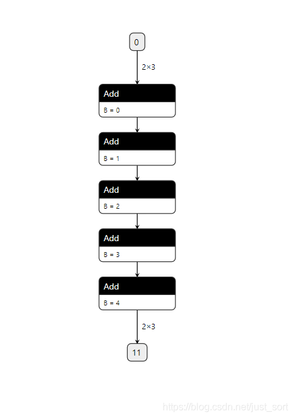
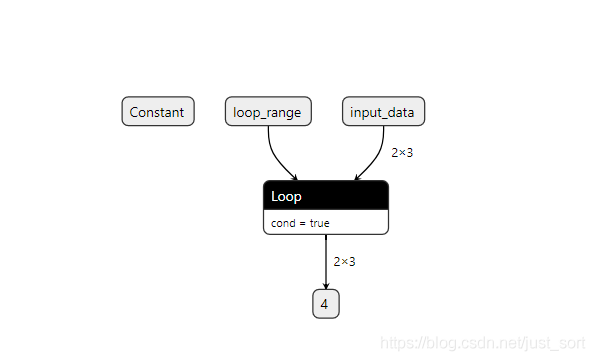

# [밑바닥부터 배우는 딥러닝 컴파일러] 외전 1. Data Flow와 Control Flow

본 글은 밑바닥부터 배우는 딥러닝 컴파일러 시리즈의 외전 편으로, 딥러닝 프레임워크의 Data Flow와 Control Flow를 소개하고, TensorFlow를 기반으로 TensorFlow가 static graph에서 Control Flow를 어떻게 구현하는지 설명한다. 그리고 dynamic graph의 경우 Python 레벨에서 직접 Control Flow를 작성하는 것을 지원하므로, 마지막으로 PyTorch를 기반으로 Python 레벨의 Control Flow를 TorchScript 모델 및 ONNX 모델로 어떻게 export하는지 소개한다.

# 0x0. 머리말

원래는 TVM Relay를 다룰 때 Data Flow와 Control Flow를 언급하려고 했지만, 코드 분석 글을 본 독자들이 바로 창을 닫아 버릴까 봐, 여기서는 짧은 글로 딥러닝 프레임워크의 Data Flow와 Control Flow를 소개하고자 한다.

# 0x1. Data Flow

내가 처음 접한 딥러닝 프레임워크는 TensorFlow 1.x였고, 학부 졸업 작품도 TensorFlow 기반으로 완성했다. 따라서 여기서는 TensorFlow 1.x를 예로 들어 Data Flow를 소개하고자 한다.

이제 어떤 로직을 구현한다고 가정하자. 그중 a, b, c는 모두 단순한 실수이고, Python으로 구현한다면 매우 간단하게 다음과 같은 모습이 될 것이다.
    
    
    #coding=utf-8  
      
    import os  
      
    def cal(a, b, c):  
        res = (a + b) * c  
        print(res)  
        return res  
      
    print(cal(1.0, 2.0, 3.0))  
    

출력 결과는 9.0이다. 이번에는 tf1.31.1을 사용해 같은 과정을 구현해 보자.
    
    
    import tensorflow as tf  
      
    def cal(a, b, c):  
        add_op = a + b  
        print(add_op)  
        mul_op = add_op * c  
      
        init = tf.global_variables_initializer()  
        sess = tf.Session()  
          
        sess.run(init)  
        mul_op_res = sess.run([mul_op])  
      
        return mul_op_res  
      
    a = tf.constant(1.0)  
    b = tf.constant(2.0)  
    c = tf.constant(3.0)  
      
    print(cal(a, b, c))  
    

마찬가지로 코드의 출력은 9.0이다. 위 두 예시는 TensorFlow와 같은 프레임워크에서 그 computation graph가 계산 흐름 그래프이며, 데이터에 의해 구동된다는 점을 설명하기 위한 것이다. 위 프로그램에서 `add_op`를 출력해 보면 결과가 하나의 `Tensor`임을 확인할 수 있다.
    
    
    Tensor("add:0", shape=(), dtype=float32  
    

이는 TensorFlow 1.x로 구현한 이 계산 함수가 먼저 메모리에 dataflow 그래프를 만들기 때문이다. 그래프는 다음과 같다.

위 TensorFlow 프로그램에 대응하는 dataflow 그래프

다시 Python 구현을 살펴보자. 실제로 `res = (a + b) * c`라는 코드가 실행될 때 이미 `res` 값이 계산된다. Python과 같은 절차적 언어의 수학 계산은 코드에 의해 구동되기 때문이다. 그러나 TensorFlow는 다르다. TensorFlow는 먼저 dataflow 그래프를 구성한 다음, 이 계산 흐름 그래프에 데이터를 바인딩하여, 그 데이터가 그래프 안에서 흐르게 만든다. 이는 명시적으로 `sess.run`을 호출하여 출력을 얻는다.

TensorFlow처럼 dataflow 그래프(Data Flow)를 기반으로 계산하는 딥러닝 프레임워크는 적지 않다. 예컨대 초기의 Theano, 2020년 오픈소스로 공개된 국내 딥러닝 프레임워크 **OneFlow**, 그리고 PaddlePaddle 1.x 초기 버전이 모두 dataflow 그래프 기반이다. 물론 더 많은 사람들은 이를 static graph라고 부른다.

# 0x2. Control Flow

이 절에서는 TensorFlow 1.x의 Control Flow를 결합해 Control Flow의 어려운 점과 TensorFlow의 몇 가지 해결 방안을 분석한다. 여기에 나오는 내용은 주로 다음 블로그(https://www.altoros.com/blog/logical-graphs-native-control-flow-operations-in-tensorflow/) 를 기반으로 하므로, 관심이 있는 독자는 원문을 참고하기 바란다.

컴퓨터 과학에서 control flow(Control Flow)는 독립적인 문장, 명령, 함수 호출 등의 실행 또는 평가 순서를 정의한다. 예를 들어 우리가 네이티브 control flow 하나를 구현해야 한다고 하자. 즉, 함수 A의 출력 값에 따라 함수 B 또는 C 중 하나를 실행해야 한다.

Control Flow의 한 예

이 control flow를 구현할 때 가장 Naive한 방식은 Python 쪽에서 If/Else 문을 작성하는 것이다. 즉 Python 레벨의 Control Flow이며, 각 조건마다 session.run()으로 서로 다른 분기의 값을 구한다. TensorFlow의 경우 대략 다음과 같다.

여기서 A의 값을 가져오는 것은 단지 그것을 다시 피드백하기 위한 것이다

그리고 이러한 Python 레벨의 Control Flow는 computation graph에 표현되지 않는다. 즉,

노란색 부분은 computation graph에서 사실상 삭제된 것이다. 초기의 TensorFlow는 이런 제어 로직을 표현할 수 없었기 때문이다

위 구현은 다소 좋지 않다는 것을 알 수 있다. 이는 우리가 `sess.run`으로 A를 평가한 후 아무런 수정도 하지 않고 다시 원래의 computation graph로 되돌려 놓았기 때문이며, TensorFlow의 computation graph가 Python과 데이터를 자주 주고받으면 연산 속도가 크게 느려진다. 성능 문제 외에도 Python 레벨에서 Control Flow를 만들면 computation graph에 Python 로직이 표현되지 않는다. 따라서 graph를 export하면 사실상 이러한 if/else 문은 보이지 않으며, 결과적으로 네트워크 구조 정보가 사라진다.

이 문제는 PyTorch에서 ONNX를 export해 본 독자라면 알 것이다. 만약 NMS 후처리까지 포함된 완전한 검출 모델을 export하려 한다면, 반드시 정상적으로 타깃을 출력할 수 있는 이미지 한 장을 입력으로 사용해야 한다. 만약 무작위 입력을 사용하면, 후처리 부분이 export 시 누락될 가능성이 매우 높다. 이는 PyTorch로 검출 모델을 구현할 때 Python 레벨에서 If와 같은 Control Flow를 사용했기 때문이다. 그리고 PyTorch는 ONNX 모델을 export할 때 입력에 따라 모델을 한 번 실행하는 tracing 방식(이는 예전 버전의 방식이며, 새 버전의 TensorFlow는 이미 Python 레벨의 Control Flow export를 지원한다.)을 사용해, 이 과정에서 어떤 연산이 발생했는지를 기록한다. 잘 생각해 보면, 모델을 구현하는 과정에서 Python 레벨의 Control Flow가 있다면(tracing 메커니즘 기반) 일부 노드는 반드시 누락될 수밖에 없다.

PyTorch 공식 문서에서는 ONNX를 export할 때 Python 레벨의 control flow를 computation graph에 함께 export하려면 `@jit.script`로 한 번 감싸야 한다고 설명한다.

요약하면 PyTorch에서 Python 레벨의 control flow를 포함한 모델을 ONNX로 export하면 control flow가 사라진다. 이를 보존하려면 TorchScript 모델로 export하거나 script 모델 기반의 export 방식을 사용하는 것을 권장한다

PyTorch와 같은 dynamic graph 프레임워크는 Python 레벨의 Control Flow를 편리하게 사용할 수 있지만, TensorFlow는 1.x 시대에 이 문제를 해결하기 위해 많은 노력을 기울였다. 그것이 바로 TensorFlow 1.x의 네이티브 control flow다.

## TensorFlow의 네이티브 control flow

TensorFlow는 네이티브 control flow를 위한 몇 가지 operator를 제공하며, 다음과 같다.

TensorFlow는 네이티브 control flow를 위한 몇 가지 operator를 제공한다

그렇다면 이러한 네이티브 control flow를 사용하는 장점은 무엇일까?

  * **고효율**. TensorFlow의 computation graph가 Python과 데이터를 주고받는 것은 비교적 느리다. computation graph가 end-to-end가 되어야 데이터 전송 오버헤드를 최소화하고 실행 속도를 높일 수 있다.
  * **유연성**. static computation graph는 동적 모듈로 강화될 수 있으며, computation graph 로직은 자기 완결적이다. PyTorch가 현재 TensorFlow보다 인기 있는 주된 이유는 PyTorch가 dynamic computation graph라서 런타임에 computation graph를 수정할 수 있기 때문이다. TensorFlow는 control flow를 활용해 정적으로 정의된 computation graph 안에서도 dynamic computation graph와 유사한 기능을 구현할 수 있다.
  * **호환성**. TensorBoard로 computation graph를 디버깅하고 검사하며, TensorFlow Serving을 통해 매끄럽게 배포할 수 있고, autograd, 큐 및 파이프라인 메커니즘도 활용할 수 있다.

## 제어 의존성(Control Dependency)

TensorFlow는 각 operator의 의존성을 기록한 다음, 이 의존성을 기반으로 스케줄링하여 계산한다. 즉 어떤 operator는 그 의존성이 모두 완료되었을 때, 그리고 그때만 한 번 실행된다. 의존성을 모두 충족한 임의의 두 operator는 임의의 순서로 실행될 수 있다. 그러나 이러한 설정은 **경쟁 상태(race condition)**를 일으킬 수 있다. 예를 들어,

제어 의존성으로 인한 경쟁 상태

여기서 var는 변수이고, bot을 평가할 때 var 자체가 2 증가한 뒤 증가된 값을 반환한다. 이때 top 문장의 실행 순서가 out 결과에 서로 다른 영향을 미치게 되며, 결과는 예측할 수 없다.

이 문제를 해결하기 위해 개발자는 인위적으로 bot과 top의 의존 관계를 추가하여 지정한 operator가 먼저 완료되도록 할 수 있다. 다음 그림과 같다.

인위적으로 bot과 top의 의존 관계를 추가하여, 지정한 operator가 먼저 완료되도록 한다

여기서 표현하는 것은, 만약 우리가 읽는 값이 최신 값임을 보장하고 싶다면 아래 그림에서 점선 화살표로 표시된 의존 관계를 추가해야 한다는 것이다. 즉 아래 그림에서 위쪽 파란색 원이 아래쪽 파란색 원의 연산 완료에 의존해야 비로소 계산을 진행할 수 있다.

의존 관계를 추가한 후의 computation graph는 이런 모습이다

## 조건 분기

다음으로 조건 분기를 살펴보자. 이 절 첫머리에서 제시한 예시를 TensorFlow는 어떻게 처리할까?

TensorFlow는 두 가지 조건 제어 op, 즉 tf.cond와 tf.case를 제공한다

다음 코드는 tf.cond를 활용해 조건 분기를 구현한 것으로, a < b가 참일 때 out을 평가하면 tf.add(3, 3)이 실행되고, 그렇지 않으면 tf.square(3)이 실행된다.

tf.cond로 조건 분기 구현

위 코드는 다음과 동일하다. `tf.cond(a < b, lambda: tf.add(3, 3), lambda: tf.sqaure(3))`

생성된 computation graph는 다음과 같다.

조건 control flow가 포함된 computation graph

병렬 분기가 많을 때는 tf.case를 사용해 처리할 수 있다. 예를 들어,

병렬 조건 분기가 2개를 초과할 때는 tf.case로 제어한다

## 반복

TensorFlow는 `tf.while_loop`를 제공하여 반복 블록을 구성한다. RNN과 같은 구조에서 이런 요구가 있을 것 같다. 예를 들어,

tf.while_loop는 반복 control flow를 구현하여 RNN과 같은 computation graph 구조의 제어 로직을 해결할 수 있다

다음 코드는 기본적인 반복 예시로, 100회 반복한다.

tf.while_loop를 사용해 static graph에서 반복 control flow를 구현한다

전반적으로 TensorFlow는 dynamic graph 프레임워크처럼 Python 레벨에서 직접 Control Flow를 작성하는 것이 아니라 Control Flow를 computation graph에 도입한 최초의 딥러닝 프레임워크일 것이며, 이 점은 어느 정도 존중받아야 한다. 비록 PyTorch가 현재 학계에서 TensorFlow보다 더 인기가 많지만, TensorFlow에서 진화한 다양한 산업용 프로젝트들은 여전히 자기 역할을 하고 있다.

# 0x3. PyTorch에서의 Control Flow

PyTorch와 같은 dynamic graph 프레임워크에서는 Python 쪽에서 직접 Control Flow를 작성할 수 있고, 이러한 제어 로직을 computation graph에 포함시킬 수도 있다. 여기서는 TorchScript를 예로 들겠다. PyTorch 모델을 TorchScript로 변환할 때 두 가지 방식이 있는데, 하나는 trace이고, 다른 하나는 script이다. trace 모드는 Python 레벨에 Control Flow가 없는 computation graph에 적합하다. 예시는 다음과 같다.
    
    
    #coding=utf-8  
    import torch  
    import torch.nn as nn  
      
    class MyModule(nn.Module):  
        def __init__(self):  
           super(MyModule,self).__init__()  
           self.conv1 = nn.Conv2d(1,3,3)  
        def forward(self,x):  
           x = self.conv1(x)  
           return x  
      
    model = MyModule()  # 모델 인스턴스화  
    trace_module = torch.jit.trace(model,torch.rand(1,1,224,224))   
    print(trace_module.code)  # 모델 구조 확인  
    output = trace_module (torch.ones(1, 1, 224, 224)) # 테스트  
    print(output)  
    # trace_modult('model.pt')   
    

`trace_module`의 code를 출력하면 다음과 같다.
    
    
    def forward(self,  
        input: Tensor) -> Tensor:  
      return (self.conv1).forward(input, )  
    

반면 script 모드는 computation graph가 Python 레벨에 Control Flow가 있는 경우에 적합하다. 예를 들어,
    
    
    #coding=utf-8  
    import torch  
    import torch.nn as nn  
      
    class MyModule(nn.Module):  
        def __init__(self):  
            super(MyModule,self).__init__()  
            self.conv1 = nn.Conv2d(1,3,3)  
            self.conv2 = nn.Conv2d(2,3,3)  
      
        def forward(self,x):  
            b,c,h,w = x.shape  
            if c ==1:  
                x = self.conv1(x)  
            else:  
                x = self.conv2(x)  
            return x  
      
    model = MyModule()  
      
    # 이렇게 작성하면 control flow가 있어서 에러가 발생한다  
    # trace_module = torch.jit.trace(model,torch.rand(1,1,224,224))   
      
    # 이때는 script 방법을 써야 한다  
    script_module = torch.jit.script(model)   
    print(script_module.code)  
    output = script_module(torch.rand(1,1,224,224))  
      
    

`script_module`의 code를 출력하면 TorchScript 모델이 위에서 Python 레벨로 정의한 Control Flow를 포함하고 있음을 확인할 수 있다.
    
    
    def forward(self,  
        x: Tensor) -> Tensor:  
      b, c, h, w, = torch.size(x)  
      if torch.eq(c, 1):  
        x0 = (self.conv1).forward(x, )  
      else:  
        x0 = (self.conv2).forward(x, )  
      return x0  
    

이제 위에서 만든 Control Flow가 포함된 Module을 ONNX로 export하는 실험을 해 보자. 여기서는 PyTorch 공식 문서에서 제공하는 반복 Control Flow가 포함된 예시를 사용한다.
    
    
    import torch  
      
    # Trace-based only  
      
    class LoopModel(torch.nn.Module):  
        def forward(self, x, y):  
            for i in range(y):  
                x = x + i  
            return x  
      
    model = LoopModel()  
    dummy_input = torch.ones(2, 3, dtype=torch.long)  
    loop_count = torch.tensor(5, dtype=torch.long)  
      
    torch.onnx.export(model, (dummy_input, loop_count), 'loop.onnx', verbose=True)  
      
    

이렇게 하면 `loop`라는 이름의 ONNX 모델을 성공적으로 export할 수 있다. Netron 시각화 소프트웨어로 열어 살펴보자.

Module을 직접 export하면 Python 레벨의 제어 로직이 사라진다(즉, for 루프가 완전히 펼쳐진다). 이는 PyTorch가 ONNX를 export할 때 기본적으로 tracing 메커니즘을 사용하기 때문이다

반면 script 모드를 사용하면 export된 ONNX는 Python 레벨의 Control Flow를 보존하고 이를 ONNX의 Loop OP로 변환한다. 예시 코드와 Netron 시각화 결과는 다음과 같다.
    
    
    import torch  
    # Mixing tracing and scripting  
      
    @torch.jit.script  
    def loop(x, y):  
        for i in range(int(y)):  
            x = x + i  
        return x  
      
    class LoopModel2(torch.nn.Module):  
        def forward(self, x, y):  
            return loop(x, y)  
      
    model = LoopModel2()  
    dummy_input = torch.ones(2, 3, dtype=torch.long)  
    loop_count = torch.tensor(5, dtype=torch.long)  
    torch.onnx.export(model, (dummy_input, loop_count), 'loop.onnx', verbose=True,  
                      input_names=['input_data', 'loop_range'])  
    

PyTorch 모델에서 Python 레벨로 정의된 Control Flow가 보존되었다

# 0x4. 정리

이 글에서는 딥러닝의 Data Flow와 Control Flow를 소개하고, PyTorch 모델을 TorchScript로 변환하는 두 가지 모드를 소개했으며, PyTorch의 Python 레벨 Control Flow를 ONNX로 변환하려면 어떻게 해야 하는지를 살펴보았다.

# 0x5. 참고

  * https://blog.csdn.net/lvxingzhe123456/article/details/82597095
  * https://www.altoros.com/blog/logical-graphs-native-control-flow-operations-in-tensorflow/
  * https://mp.weixin.qq.com/s/6uVeEHcQeaPN_qEhHvcEoA

