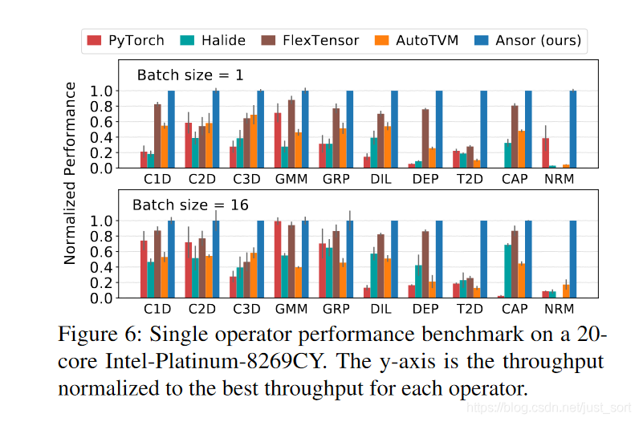
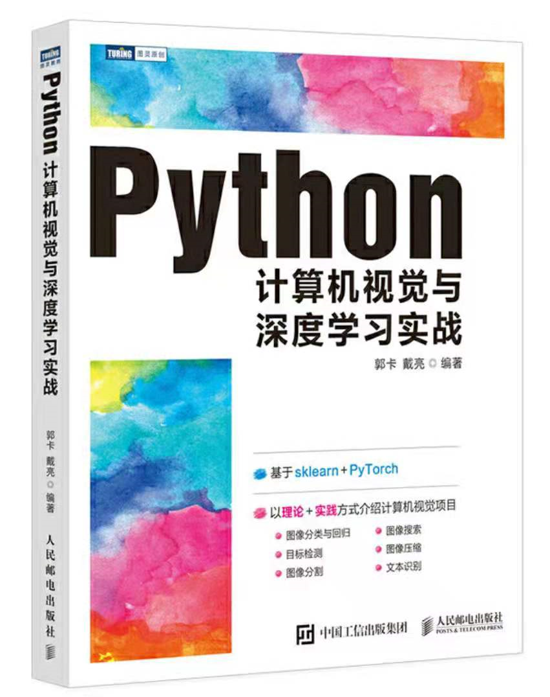
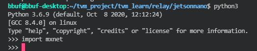
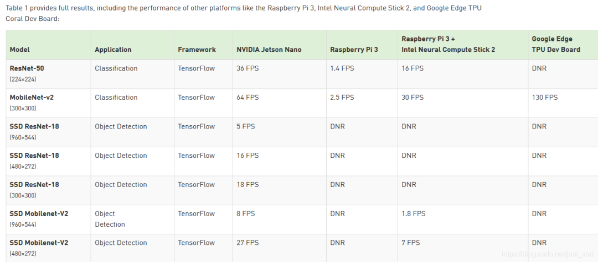

# [밑바닥부터 배우는 딥러닝 컴파일러] 외전 2. Jetson Nano에서 TVM 다루기

이 글은 주로 Jetson Nano에 OS를 설치하는 방법과, Jetson Nano에서 TVM을 어떻게 구성하고 MxNet의 ResNet18을 실행하여 분류 결과를 얻는지를 설명합니다. 마지막으로 AutoTVM을 사용하여 Jetson Nano에서 ResNet50의 추론 효율을 향상시키는 것도 체험해 봅니다. 하나의 Task만 AutoTune(총 20개의 Task를 AutoTune해야 함)한 결과 ResNet50의 추론 속도를 이미지(224x224x3) 한 장당 150ms로 만들 수 있었습니다. 위 BenchMark에서 볼 수 있듯이 TensorRT는 FP32에서 이미지(224x224x3) 한 장당 약 50~60ms의 추론 성능을 보입니다. 본문의 모든 실험 코드는 다음 링크에서 확인할 수 있습니다: https://github.com/BBuf/tvm_learn/blob/main/relay . TVM 학습에 관심이 있다면 star 한번 부탁드립니다.

# 0x00. Jetson Nano 설치

여기서는 Jetson Nano를 자세히 소개하지는 않겠습니다. NVIDIA Jetson은 NVIDIA의 임베디드 컴퓨팅 보드 시리즈 중 하나로, 임베디드 환경에서 머신러닝 애플리케이션을 실행할 수 있게 해준다는 점만 알면 충분합니다. 마침 친구가 예전에 보내준 Jetson Nano가 있는데, 1년 정도 지난 오늘 꺼내서 다뤄볼 준비를 했습니다.

받은 Jetson Nano는 대략 다음과 같이 생겼습니다.

Jetson Nano 실물 사진

Jetson Nano를 위한 OS 이미지를 구워야 합니다. Jetson Nano의 OS는 SD Card에 구워진 후 보드에 꽂아 사용합니다. 저는 여기서 128GB 용량의 SD Card를 선택했습니다.

먼저 Jetson Nano 이미지(`https://developer.nvidia.com/embedded/jetpack`)를 다운로드합니다. 이 이미지에는 부트로더, Ubuntu 18.04, 필수 펌웨어, NVIDIA 드라이버, 예시 파일 시스템 등이 포함되어 있습니다.

그 다음 Etcher(https://www.balena.io/etcher)라는 이미지 굽기 도구를 다운로드하여 받아둔 Jetson Nano 이미지를 SD 카드에 굽습니다. 작업은 매우 간단하며, 이미지와 카드 리더기를 선택하기만 하면 됩니다. 다음은 굽기를 완료한 화면입니다.

이미지 굽기 완료

그런 다음 SD Card를 다시 Jetson Nano에 꽂고 전원을 연결하여 OS 설치를 마치면 됩니다. 설치 완료 후 화면은 다음과 같습니다.

Ubuntu 18.04 시스템 설치 성공

모니터가 하나뿐이라 Windows 기반 개발 작업에 영향을 주지 않기 위해 SSH로 바로 로그인했습니다.

Jetson Nano로 직접 원격 로그인

개발 편의를 위해 Jetson Nano를 VsCode에서 구성할 수 있습니다. 설정 정보는 다음과 같이 작성합니다.
    
    
    Host JetsonNano  
      HostName 192.168.1.6  
      User bbuf  
    

그러면 VsCode를 통해 Jetson Nano에 원격으로 접속하여 개발할 수 있습니다.

# 0x01. 기본 환경 설치

먼저 `uname -a`로 시스템의 기본 정보를 확인해 봅니다.
    
    
    Linux bbuf-desktop 4.9.201-tegra #1 SMP PREEMPT Fri Feb 19 08:40:32 PST 2021 aarch64 aarch64 aarch64 GNU/Linux  
    

이 시스템이 64비트 ARM 시스템임을 알 수 있습니다. 이제 Ubuntu의 미러 소스를 국내 소스로 바꿔보겠습니다. 소스 변경 전에는 원래 소스를 백업해두는 것이 좋습니다.
    
    
    sudo cp /etc/apt/sources.list /etc/apt/sources_init.list  
    

그리고 소스를 변경합니다.
    
    
    sudo gedit /etc/apt/sources.list  
    

저는 Tsinghua의 미러 소스를 선택했고, 아래 코드를 붙여 넣습니다.
    
    
    deb http://mirrors.tuna.tsinghua.edu.cn/ubuntu-ports/ bionic main multiverse restricted universe  
    deb http://mirrors.tuna.tsinghua.edu.cn/ubuntu-ports/ bionic-security main multiverse restricted universe  
    deb http://mirrors.tuna.tsinghua.edu.cn/ubuntu-ports/ bionic-updates main multiverse restricted universe  
    deb http://mirrors.tuna.tsinghua.edu.cn/ubuntu-ports/ bionic-backports main multiverse restricted universe  
    deb-src http://mirrors.tuna.tsinghua.edu.cn/ubuntu-ports/ bionic main multiverse restricted universe  
    deb-src http://mirrors.tuna.tsinghua.edu.cn/ubuntu-ports/ bionic-security main multiverse restricted universe  
    deb-src http://mirrors.tuna.tsinghua.edu.cn/ubuntu-ports/ bionic-updates main multiverse restricted universe  
    deb-src http://mirrors.tuna.tsinghua.edu.cn/ubuntu-ports/ bionic-backports main multiverse restricted universe  
    

저장한 후 `sudo apt-get update`를 실행하면 완료됩니다.

미러 소스 업데이트 성공

이제 TVM에 필요한 의존성들을 설정해 보겠습니다. 컴파일하면서 동시에 설정하고, 에러 메시지에 따라 진행합니다.

먼저 새 폴더를 하나 만들고 TVM 소스를 클론한 다음 아래 작업을 수행합니다.
    
    
    git clone --recursive https://github.com/apache/tvm tvm  
    cd tvm  
    mkdir build  
    cp cmake/config.cmake build  
    cd build  
    cmake ..  
    make -j4  
    export TVM_HOME=/path/to/tvm  
    export PYTHONPATH=$TVM_HOME/python:${PYTHONPATH}  
    

먼저 `config.cmake`에서 `USE_LLVM`과 `USE_CUA` 컴파일 옵션을 켜고 Cmake를 시작하면, 다음과 같은 에러가 발생합니다.
    
    
    CMake Error at cmake/utils/FindLLVM.cmake:47 (find_package):  
      Could not find a package configuration file provided by "LLVM" with any of  
      the following names:  
      
        LLVMConfig.cmake  
        llvm-config.cmake  
    

이는 LLVM이 설치되지 않았기 때문입니다. 설치해 보겠습니다.
    
    
    git clone https://github.com/llvm/llvm-project llvm-project  
    cd llvm-project  
    mkdir build  
    cd build  
    cmake -DCMAKE_BUILD_TYPE=Release -DLLVM_ENABLE_PROJECTS=lld -DCMAKE_INSTALL_PREFIX=/usr/local ../../llvm-project/llvm  
    make -j4 && sudo make install  
    

컴파일 시 cmake 버전이 너무 낮다는 안내가 나오니 먼저 cmake 버전을 업그레이드합니다.
    
    
    wget https://github.com/Kitware/CMake/releases/download/v3.14.4/cmake-3.14.4.tar.gz  
    tar xvf cmake-3.14.4.tar.gz  
    cd cmake-3.14.4  
    ./bootstrap --prefix=/usr  
    make  
    sudo make install  
    

이제 cmake 버전 업그레이드에 성공했으니 LLVM 컴파일을 계속합니다(LLVM 컴파일 시 release 7.0 이상 브랜치로 checkout하는 것을 권장합니다. 저는 master 코드로 직접 컴파일했더니 컴파일은 성공했지만 TVM 빌드 시 LLVM 관련 Codegen 에러가 발생했습니다).

그 다음 LLVM 컴파일이 끝나면 TVM을 컴파일하면 됩니다. 컴파일에 성공한 뒤에는 TVM의 PYTHONPATH 환경 변수를 설정하는 것도 잊지 말아야 합니다.
    
    
    export TVM_HOME=/home/bbuf/tvm_project/tvm  
    export PYTHONPATH=$TVM_HOME/python:${PYTHONPATH}  
    

그리고 `source ~/.bashrc`로 환경 변수를 적용시키면, Jetson Nano에서 TVM 구성이 끝납니다.

TVM을 정상적으로 import 가능

# 0x02. Jetson Nano에서 ResNet50 실행하기

먼저 TVM이 제공하는 라즈베리파이용 튜토리얼 `https://tvm.apache.org/docs/tutorials/frontend/deploy_model_on_rasp.html` 를 참고하여 수정합니다. 여기서 사용하는 사전 학습 모델은 MxNet에서 제공하는 것이므로, Jetson Nano에 MxNet 패키지를 설치해야 합니다. 설치 단계는 다음과 같습니다.

먼저 MxNet의 의존성을 설치합니다.
    
    
    sudo apt-get update  
    sudo apt-get install -y git build-essential libopenblas-dev libopencv-dev python3-pip  
    sudo pip3 install -U pip  
    

그 다음 Jetson Nano용 MxNet v1.6 wheel 패키지를 다운로드하여 설치합니다.
    
    
    wget https://mxnet-public.s3.us-east-2.amazonaws.com/install/jetson/1.6.0/mxnet_cu102-1.6.0-py2.py3-none-linux_aarch64.whl  
    sudo pip3 install mxnet_cu102-1.6.0-py2.py3-none-linux_aarch64.whl  
    

설치가 끝났으면 MxNet을 import해서 정상적으로 동작하는지 확인합니다.

MxNet을 정상적으로 import 가능

이제 Jetson Nano에서 MxNet의 ResNet50 모델을 추론하는 방법을 설명하겠습니다.

먼저 필요한 헤더를 import합니다.
    
    
    import tvm  
    from tvm import te  
    import tvm.relay as relay  
    from tvm import rpc  
    from tvm.contrib import utils, graph_executor as runtime  
    from tvm.contrib.download import download_testdata  
    

실행할 때는 RPC를 사용해 서버에서 Jetson Nano 보드를 원격으로 호출해 실행할 수도 있고, 보드에서 직접 실행할 수도 있습니다. 여기서는 보드에서 직접 실행하기 때문에 RPC Server를 시작할 필요는 없습니다. 따라서 사전 학습 모델을 준비한 뒤 Graph를 컴파일하고 로컬 Jetson Nano에서 추론하면 됩니다.

## 사전 학습 모델 준비

여기서는 mxnet의 gluon modelzoo에서 ResNet18 사전 학습 모델을 직접 로드합니다.
    
    
    from mxnet.gluon.model_zoo.vision import get_model  
    from PIL import Image  
    import numpy as np  
      
    # one line to get the model  
    block = get_model("resnet18_v1", pretrained=True)  
    

그리고 이 모델을 테스트하기 위해 고양이 이미지를 한 장 다운로드하고 이미지 형식을 변환합니다.
    
    
    img_url = "https://github.com/dmlc/mxnet.js/blob/main/data/cat.png?raw=true"  
    img_name = "cat.png"  
    img_path = download_testdata(img_url, img_name, module="data")  
    image = Image.open(img_path).resize((224, 224))  
      
      
    def transform_image(image):  
        image = np.array(image) - np.array([123.0, 117.0, 104.0])  
        image /= np.array([58.395, 57.12, 57.375])  
        image = image.transpose((2, 0, 1))  
        image = image[np.newaxis, :]  
        return image  
      
      
    x = transform_image(image)  
    

`synset_url`은 네트워크 출력 클래스의 인덱스와 실제 이름을 매핑한 파일이며, 마찬가지로 로드합니다.
    
    
    synset_url = "".join(  
        [  
            "https://gist.githubusercontent.com/zhreshold/",  
            "4d0b62f3d01426887599d4f7ede23ee5/raw/",  
            "596b27d23537e5a1b5751d2b0481ef172f58b539/",  
            "imagenet1000_clsid_to_human.txt",  
        ]  
    )  
    synset_name = "imagenet1000_clsid_to_human.txt"  
    synset_path = download_testdata(synset_url, synset_name, module="data")  
    with open(synset_path) as f:  
        synset = eval(f.read())  
    

그 다음 앞서 소개한 `relay.frontend.xxx` 인터페이스로 Gluon 모델을 Relay 계산 그래프로 변환합니다.
    
    
    # We support MXNet static graph(symbol) and HybridBlock in mxnet.gluon  
    shape_dict = {"data": x.shape}  
    mod, params = relay.frontend.from_mxnet(block, shape_dict)  
    # we want a probability so add a softmax operator  
    func = mod["main"]  
    func = relay.Function(func.params, relay.nn.softmax(func.body), None, func.type_params, func.attrs)  
    

아래에는 데이터 관련 기본 설정 정보가 정의되어 있습니다.
    
    
    batch_size = 1  
    num_classes = 1000  
    image_shape = (3, 224, 224)  
    data_shape = (batch_size,) + image_shape  
    

## 그래프 컴파일

여기서는 `relay.build`로 계산 그래프를 컴파일합니다. ARM 디바이스에서는 X86 프로그램을 추론할 수 없으므로 target을 "llvm"으로 지정해야 하며, 여기서 "llvm"은 Jetson Nano의 ARM CPU를 의미합니다. 그리고 계산 그래프의 runtime 라이브러리를 컴파일한 후에는 이 라이브러리를 그대로 저장해두면 다음 실행 시 다시 컴파일할 필요가 없습니다. 아래 코드에서 `local_demo`가 True이면 실제 Jetson Nano에서 이 Relay 계산 그래프를 실행한다는 의미이고, False이면 RPC를 통해 LAN 내의 Jetson Nano를 호출하여 Relay 계산 그래프를 실행한다는 의미입니다. 여기서는 로컬에서 직접 컴파일하고 실행합니다. 이 단계가 끝나면 Jetson Nano CPU에서 바로 실행 가능한 라이브러리를 얻을 수 있고, `net.tar`로 패키징됩니다.
    
    
    local_demo = True  
      
    if local_demo:  
        target = tvm.target.Target("llvm")  
    else:  
        target = tvm.target.Target("llvm")  
      
    with tvm.transform.PassContext(opt_level=3):  
        lib = relay.build(func, target, params=params)  
      
    # After `relay.build`, you will get three return values: graph,  
    # library and the new parameter, since we do some optimization that will  
    # change the parameters but keep the result of model as the same.  
      
    # Save the library at local temporary directory.  
    tmp = utils.tempdir()  
    lib_fname = tmp.relpath("net.tar")  
    lib.export_library(lib_fname)  
    

이제 runtime 라이브러리를 로드한 다음 방금 준비한 고양이 이미지를 추론할 수 있습니다.
    
    
    local_demo = True  
      
    if local_demo:  
        target = tvm.target.Target("llvm")  
        # target = tvm.target.Target("nvidia/jetson-nano")  
        # target_host = "llvm"  
        # assert target.kind.name == "cuda"  
        # assert target.attrs["arch"] == "sm_53"  
        # assert target.attrs["shared_memory_per_block"] == 49152  
        # assert target.attrs["max_threads_per_block"] == 1024  
        # assert target.attrs["thread_warp_size"] == 32  
        # assert target.attrs["registers_per_block"] == 32768  
    else:  
        target = tvm.target.Target("llvm")  
      
    with tvm.transform.PassContext(opt_level=7):  
        lib = relay.build(func, target, target_host=target_host, params=params)  
      
    tmp = utils.tempdir()  
    lib_fname = tmp.relpath("net.tar")  
    lib.export_library(lib_fname)  
      
      
    # create the remote runtime module  
    dev = tvm.cuda(0)  
    module = runtime.GraphModule(lib["default"](dev))  
    time_start = time.time()  
    # set input data  
    module.set_input("data", tvm.nd.array(x.astype("float32")))  
    # run  
    module.run()  
      
    time_end = time.time()  
      
    print('time cost', time_end-time_start,'s')  
    # get output  
    out = module.get_output(0)  
    # get top1 result  
    top1 = np.argmax(out.numpy())  
    print("TVM prediction top-1: {}".format(synset[top1]))  
    

출력 결과는 다음과 같습니다.
    
    
    TVM prediction top-1: tiger cat  
    

그리고 위에서는 실행 시간도 기록했는데, 결과는 다음과 같습니다.
    
    
    time cost 0.16585731506347656 s  
    

Jetson Nano의 CPU에서 입력 데이터를 로드한 뒤 이 이미지를 추론(후처리 미포함)하는 데 약 160ms 정도 걸리는 것을 확인할 수 있습니다.

이어서 Jetson Nano의 GPU로 추론을 시도해보면 tophub 패키지를 찾지 못한다는 경고가 발생합니다.
    
    
    WARNING:root:Failed to download tophub package for cuda: <urlopen error [Errno 111] Connection refused>  
    

이 경고는 일련의 에러로 이어져 추론이 불가능하게 만듭니다. 이 에러의 해결 방법은 다음과 같습니다.
    
    
    git clone https://github.com/tlc-pack/tophub  
    cp tophub/tophub/ /home/bbuf/.tvm -rf  
    

그러면 Jetson Nano의 GPU로 추론할 수 있게 되는데, 이 이미지를 추론하는 데 1.81초나 걸렸습니다... 이 절의 코드는 `https://github.com/BBuf/tvm_learn/blob/main/relay/jetsonnano/deploy_model_on_jetsonnano.py` 에서 확인할 수 있습니다.

이를 통해 TVM을 Jetson Nano에 그대로 적용하면 효율이 매우 낮음을 알 수 있습니다. 주된 이유는 이 하드웨어를 대상으로 Auto-tuning을 하지 않았기 때문입니다. 즉, AutoTVM을 사용하여 프로그램 실행 성능을 향상시켜야 합니다.

# 0x03. AutoTVM 체험

여기서는 AutoTVM의 원리 같은 것은 일단 다루지 않고, 곧바로 Jetson Nano에서 AutoTVM을 사용해 ResNet50을 Autotune해서 효과를 보겠습니다. NVIDIA 공식 사이트 https://developer.nvidia.com/embedded/jetson-nano-dl-inference-benchmarks 에서 ResNet50을 포함한 Jetson Nano의 대표적인 네트워크 FPS를 찾을 수 있는데, 여기 수치는 FP16 추론 기준임을 유의해야 합니다. 따라서 FP32 환경의 추론 시간은 50ms 이상이 될 것으로 추정할 수 있습니다.

Jetson Nano BenchMark

그리고 공식 AutoTune 문서 https://tvm.apache.org/docs/tutorials/autotvm/tune_relay_cuda.html 를 참고하여 약간 수정하면 Jetson Nano에서 ResNet50을 AutoTune할 수 있습니다. 수정한 코드는 다음을 참고하세요: `https://github.com/BBuf/tvm_learn/blob/main/relay/tune_relay_cuda.py`. 여기서는 Jetson Nano에서 직접 로컬로 AutoTune합니다.

이 AutoTune은 시간이 매우 오래 걸리기 때문에, 일단 오후 동안만 돌려서 하나의 Task만(여기서 Task의 개념은 ResNet50의 Conv 레이어 개수와 관련 있는데, 여기서는 합성곱 Op를 AutoTune하는 것이고 ResNet50에는 20개의 Conv Op가 있어 Task가 총 20개입니다) 마치고 추론 속도를 측정해 봤습니다.
    
    
    Extract tasks...  
    Compile...  
    Evaluate inference time cost...  
    Mean inference time (std dev): 154.54 ms (0.47 ms)  
    

평균 추론 시간이 약 150ms 정도입니다. 여기서는 한 라운드만 돌렸음에 주의하세요. 전체 Auto-Tune이 완료된다면 어쩌면 TensorRT의 속도를 넘어설 수 있을지도 모릅니다. 이 보드에서 AutoTune을 끝까지 돌리려면 3~4일 정도 걸릴 것 같습니다... 다음 글에서 최종 결과를 보고하면서 TensorRT를 능가할 수 있는지 확인해 보겠습니다.

# 0x04. 정리

이 글은 주로 Jetson Nano에 OS를 설치하는 방법과, Jetson Nano에서 TVM을 어떻게 구성하고 MxNet의 ResNet18을 실행하여 분류 결과를 얻는지를 설명했습니다. 마지막으로 AutoTVM을 사용하여 Jetson Nano에서 ResNet50의 추론 효율을 향상시키는 것도 체험해 봤습니다. 하나의 Task만 AutoTune(총 20개의 Task를 AutoTune해야 함)한 결과 ResNet50의 추론 속도를 이미지(224x224x3) 한 장당 150ms로 만들 수 있었습니다. 위 BenchMark에서 볼 수 있듯이 TensorRT는 FP32에서 이미지(224x224x3) 한 장당 약 50~60ms의 추론 성능을 보입니다.

# 0x05. 시리즈 글

  * [[밑바닥부터 배우는 딥러닝 컴파일러] 8. TVM의 연산자 융합과 TVM Pass Infra로 Pass 커스터마이징하기](<https://mp.weixin.qq.com/s?__biz=MzA4MjY4NTk0NQ==&mid=2247495225&idx=1&sn=5819431f3b1bca6687cb171bd4243bb6&scene=21#wechat_redirect>)
  * [[밑바닥부터 배우는 딥러닝 컴파일러] 7. 만 자 분량의 TVM Pass 입문](<https://mp.weixin.qq.com/s?__biz=MzA4MjY4NTk0NQ==&mid=2247494923&idx=1&sn=0cdde2ecdd1cee546b0847d03cc40b2c&scene=21#wechat_redirect>)
  * [[밑바닥부터 배우는 딥러닝 컴파일러] 6. TVM의 컴파일 흐름 상세 해설](<https://mp.weixin.qq.com/s?__biz=MzA4MjY4NTk0NQ==&mid=2247494801&idx=1&sn=b893c43133eea1343034bb0aca356e24&scene=21#wechat_redirect>)
  * [[밑바닥부터 배우는 딥러닝 컴파일러] 5. TVM Relay 및 Pass 소개](<https://mp.weixin.qq.com/s?__biz=MzA4MjY4NTk0NQ==&mid=2247494752&idx=1&sn=554d418ff07ebd9a8734a7b12870a7e4&scene=21#wechat_redirect>)
  * [[밑바닥부터 배우는 딥러닝 컴파일러] 외전 1. Data Flow와 Control Flow](<https://mp.weixin.qq.com/s?__biz=MzA4MjY4NTk0NQ==&mid=2247494431&idx=1&sn=496d4e0b51b36b9a61466022fb5cc536&scene=21#wechat_redirect>)
  * [[밑바닥부터 배우는 딥러닝 컴파일러] 4. TVM 연산자 분석](<https://mp.weixin.qq.com/s?__biz=MzA4MjY4NTk0NQ==&mid=2247494373&idx=1&sn=6eb14998e8cfe45a144ba1b8c61346ac&scene=21#wechat_redirect>)
  * [[밑바닥부터 배우는 TVM] 3. ONNX 모델 구조 기반으로 TVM의 frontend 살펴보기](<https://mp.weixin.qq.com/s?__biz=MzA4MjY4NTk0NQ==&mid=2247494189&idx=1&sn=a0f646dac459d3a47019f6f9bd0db545&scene=21#wechat_redirect>)
  * [[밑바닥부터 배우는 딥러닝 컴파일러] 2. TVM의 scheduler](<https://mp.weixin.qq.com/s?__biz=MzA4MjY4NTk0NQ==&mid=2247493649&idx=1&sn=fb9ddb7ee5a5fd54653fcb926ade4ffc&scene=21#wechat_redirect>)
  * [[밑바닥부터 배우는 딥러닝 컴파일러] 1. 딥러닝 컴파일러 및 TVM 소개](<https://mp.weixin.qq.com/s?__biz=MzA4MjY4NTk0NQ==&mid=2247493461&idx=1&sn=f2580a4a795fbbee89c8f7da6cca4ae4&scene=21#wechat_redirect>)

# 0x06. 참고

  * https://zhuanlan.zhihu.com/p/91876198

