# Tensor-001 행렬 곱셈 블록 곱셈 개요

- 원문 제목: Tensor-001 행렬 곱셈 블록 곱셈 개요
- 저자: 자보터의 지우개
- 계정: zartbot
- 발행일: 2024년 7월 25일 15:20

행렬 계산과 관련된 내용을 소개하기 위해 새 주제를 열어 보려고 한다. 가장 기본적인 알고리즘부터 Cutlass 같은 선형대수 템플릿 라이브러리, 특히 Layout 대수 관련 내용까지 다룰 것이다. 뒤에서는 점차 하드웨어 구현의 메모리 접근 최적화와 몇 가지 연산자 fusion 관련 주제까지 세분화할 예정이다. 준비 작업은 한가할 때 조금씩 보충해서 장기적인 칼럼으로 만들어 보려 한다.

## 1. GEMM 개요

### 1.1 GEMM 정의

행렬 곱셈 하나에 대해, 우리는 다음과 같이 정의한다.

$$
C = A \times B + C, \quad A\in \mathbb R^{M*K}, B \in \mathbb R^{K*N}, C \in \mathbb R^{M*N}
$$

아래 그림과 같다.


#### 1.1.1 내적 형태

따라서 우리는 가장 단순한 알고리즘을 구성할 수 있다.

```c++
for (int i = 0; i < M; ++i)
    for (int j = 0; j < N; ++j)
        for (int k = 0; k < K; ++k)
            C[i][j] += A[i][k] * B[k][j];
```

이런 곱셈은 행렬 곱셈의 내적 형태라고도 한다.

$$
c_{i,j} =
\left[
\begin{matrix}
 a_{i,1} &  a_{i,2} & \cdots & a_{i,k}
\end{matrix}
\right]
\left[
\begin{matrix}
 b_{1,j} \\
 b_{2,j} \\
 \vdots \\
b_{k,j}
\end{matrix}
\right]
= \sum_{k=0}^K a_{i,k}b_{k,j}
$$

전체 과정에서 $j$ 루프가 진행됨에 따라 B 행렬 곱셈의 공간 지역성이 매우 나쁘고 여러 번 접근이 발생한다는 점을 볼 수 있다. 따라서 캐시 thrashing을 피하기 위해 일부 데이터를 최대한 캐싱해야 한다.

#### 1.1.2 외적 형태

생각을 바꾸어, 만약 다음 방법으로 곱셈을 구성한다면

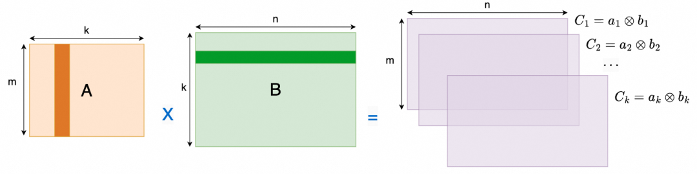

여기서

$$
C_i = a_i \otimes b_i =
\left[
\begin{matrix}
 a_{i,1} \\
 a_{i,2} \\
 \vdots \\
a_{i,m}
\end{matrix}
\right]
\left[
\begin{matrix}
 b_{i,1} &  a_{i,2} & \cdots & a_{i,n}
\end{matrix}
\right]
$$

즉 K 차원을 가장 바깥쪽에 둘 수 있고, 이렇게 하면 A와 B 행렬을 각각 열과 행 단위의 전체 블록으로 읽을 수 있다.

```c++
for (int k = 0; k < K; ++k) //dim-k at outer loop
    //outer-product for C_i
    for (int i = 0; i < M; ++i)
        for (int j = 0; j < N; ++j)
            C[i][j] += A[i][k] * B[k][j];
```

## 2. 블록 행렬 곱셈

### 2.1 블록 곱셈을 사용하는 이유

행렬 차원 (M,K,N)의 규모가 매우 클 때는 대량의 on-chip 캐시에 데이터 결과를 저장해야 하므로 계산 효율이 매우 낮다. 행렬 블록 곱셈(Block Matrix Multiplication)은 컴퓨터 과학과 수학 분야에서 매우 실용적인 기술이다. 특히 대규모 행렬을 처리할 때 다음과 같은 몇 가지 핵심 장점을 제공한다.

1. **메모리 제한**: 매우 큰 행렬의 경우 전체 행렬을 한 번에 메모리에 로드하지 못할 수 있다. 큰 행렬을 더 작은 블록(부분 행렬)으로 나누면 일부만 메모리에 로드해 계산하고 다른 부분은 교체할 수 있으므로 제한된 메모리 자원을 관리할 수 있다.
2. **병렬 계산**: 최신 프로세서와 컴퓨팅 아키텍처, 예를 들어 멀티코어 CPU, GPU, 분산 시스템은 모두 병렬 계산을 지원한다. 행렬 블록 곱셈은 행렬 곱셈 작업을 더 작은 독립 작업으로 분해할 수 있게 해 주며, 이 작업들은 서로 다른 프로세서 코어 또는 노드에서 동시에 수행되어 계산 과정을 가속할 수 있다.
3. **캐시 최적화**: 컴퓨터의 캐시 계층 구조에서는 연속적이거나 가까운 데이터에 접근하는 것이 무작위로 분포된 데이터에 접근하는 것보다 빠르다. 행렬을 적절히 블록으로 나누면 계산 과정에서 자주 접근하는 데이터가 캐시에 위치하도록 보장할 수 있어 캐시 miss를 줄이고 계산 효율을 높일 수 있다.
4. **구현 용이성**: 프로그래밍 관점에서 블록 곱셈은 특히 병렬 프로그래밍과 관련될 때 이해하고 구현하기가 더 쉬운 경우가 많다. 이는 workload와 데이터를 나누는 직관적인 방법을 제공한다.

### 2.2 블록 곱셈

보통 우리는 하나의 행렬을 여러 블록으로 나눌 수 있다. 예를 들어

$$
P =
\begin{bmatrix}
1 & 2 & 3 & 4\\
5 & 6 & 7 & 8\\
9 & 10 & 11 & 12 \\
13 & 14 & 15 & 16
\end{bmatrix}
$$

이를 4개의 블록으로 나눌 수 있다.

$$
P =
\begin{bmatrix}
1 & 2 & | & 3 & 4\\
5 & 6 & | & 7 & 8\\
- & - & + & - & - \\
9 & 10 & | & 11 & 12 \\
13 & 14 & |  & 15 & 16
\end{bmatrix}
$$

$$
P_{11} =
\begin{bmatrix}
1 & 2 \\
5 & 6
\end{bmatrix}
,
P_{12} =
\begin{bmatrix}
3 & 4 \\
7 & 8
\end{bmatrix}
,
P_{21} =
\begin{bmatrix}
9 & 10 \\
13 & 14
\end{bmatrix}
,
P_{22} =
\begin{bmatrix}
11 & 12 \\
15 & 16
\end{bmatrix}
$$

블록으로 나눈 뒤의 행렬은 다음과 같이 표기한다.

$$
P =
\begin{bmatrix}
P_{11} & P_{12} \\
P_{21} & P_{22}
\end{bmatrix}
$$

블록 행렬 곱셈은 다음과 같다.

$$
\begin{bmatrix}
A_{11}&A_{12}\\
A_{21}&A_{22}
\end{bmatrix}
\begin{bmatrix}
B_{11}&B_{12}\\
B_{21}&B_{22}
\end{bmatrix}
=
\begin{bmatrix}
A_{11}B_{11}+A_{12}B_{21} & A_{11}B_{12}+A_{12}B_{22}\\
A_{21}B_{11}+A_{22}B_{21} & A_{21}B_{12}+A_{22}B_{22}
\end{bmatrix}
$$

분할은 반드시 완전히 등간격일 필요는 없고, 부분 행렬 곱셈 규칙만 만족하면 된다. 예를 들어

$$
\begin{bmatrix}
1&2&|&3\\
4&5&|&6\\
-&-&+&-\\
7&8&|&9
\end{bmatrix}
\begin{bmatrix}
1&|&2\\
3&|&4\\
-&+&-\\
5&|&6
\end{bmatrix}
=
\begin{bmatrix}\begin{bmatrix}1&2\\4&5\end{bmatrix}\begin{bmatrix}1\\3\end{bmatrix}+\begin{bmatrix}3\\6\end{bmatrix}\begin{bmatrix}5\end{bmatrix}&\begin{bmatrix}1&2\\4&5\end{bmatrix}\begin{bmatrix}2\\4\end{bmatrix}+\begin{bmatrix}3\\6\end{bmatrix}\begin{bmatrix}6\end{bmatrix}\\\begin{bmatrix}7&8\end{bmatrix}\begin{bmatrix}1\\3\end{bmatrix}+\begin{bmatrix}9\end{bmatrix}\begin{bmatrix}5\end{bmatrix}&\begin{bmatrix}7&8\end{bmatrix}\begin{bmatrix}2\\4\end{bmatrix}+\begin{bmatrix}9\end{bmatrix}\begin{bmatrix}6\end{bmatrix}\end{bmatrix}
$$

더 일반적으로 말하면 아래 그림과 같다.

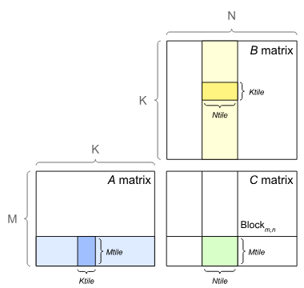

$(m \times k)$ 행렬 $A$가 주어졌고 이를 $q$개의 행과 $s$개의 열로 나눈다.

$$
A=
\begin{bmatrix}
 A_{11} & A_{12} & \cdots & A_{1s}      \\
 A_{21} & A_{22} & \cdots & A_{2s}      \\
 \vdots & \vdots & \ddots & \vdots      \\
 A_{q1} & A_{q2} & \cdots & A_{qs}
\end{bmatrix}
$$

다른 하나의 $(k \times n)$ 행렬 $B$는 $s$개의 행과 $r$개의 열로 나눈다.

$$
B=
\begin{bmatrix}
 B_{11} & B_{12} & \cdots & B_{1r}      \\
 B_{21} & B_{22} & \cdots & B_{2r}      \\
 \vdots & \vdots & \ddots & \vdots      \\
 B_{s1} & B_{s2} & \cdots & B_{sr}
\end{bmatrix}
$$

그러면 이들의 곱 $C=AB$는 다음과 같이 계산된다.

$$
C_{\alpha\beta} = \sum_{\gamma=1}^s A_{\alpha\gamma}B_{\gamma\beta}
$$

대응하는 곱셈 루프 코드는 다음과 같다.

```c++
for (int m = 0; m < M; m += Mtile)                // iterate over M dimension
    for (int n = 0; n < N; n += Ntile)            // iterate over N dimension
        for (int k = 0; k < K; ++k)
            for (int i = 0; i < Mtile; ++i)       // compute one tile
                for (int j = 0; j < Ntile; ++j) {
                    int row = m + i;
                    int col = n + j;
                    C[row][col] += A[row][k] * B[k][col];
                }
```

## 3. 하드웨어 관점에서 보는 GEMM

Stanford의 CS217 강의는 아주 좋은 참고 자료다.

### 3.1 블록 곱셈의 메모리 계층 구조

블록 행렬 곱셈은 아래와 같다. 행렬을 블록으로 분해함으로써 프로세서의 Cache와 register 메모리에 저장해 빠르게 계산할 수 있다. 계산이 끝난 뒤에는 주 메모리에 다시 기록한다.

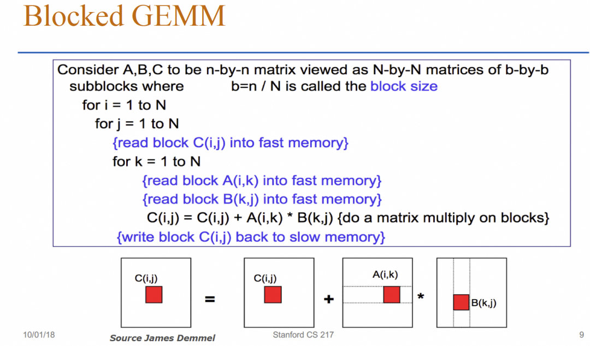

먼저 모든 데이터는 주 메모리에 있다. 아래 그림과 같다.

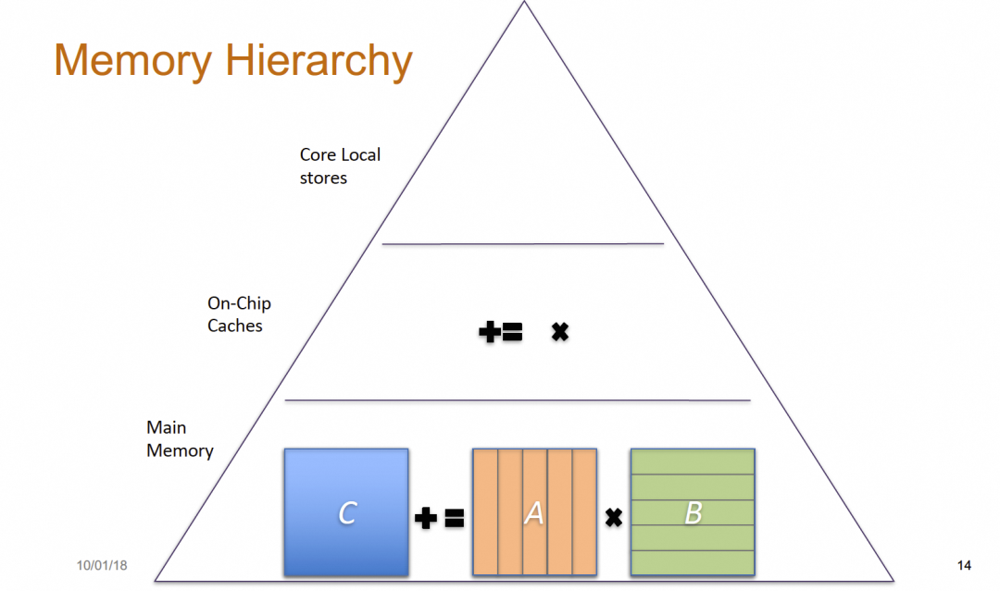

그런 다음 블록 단위로 L2Cache에 로드해 블록 부분 작업을 완료한다.

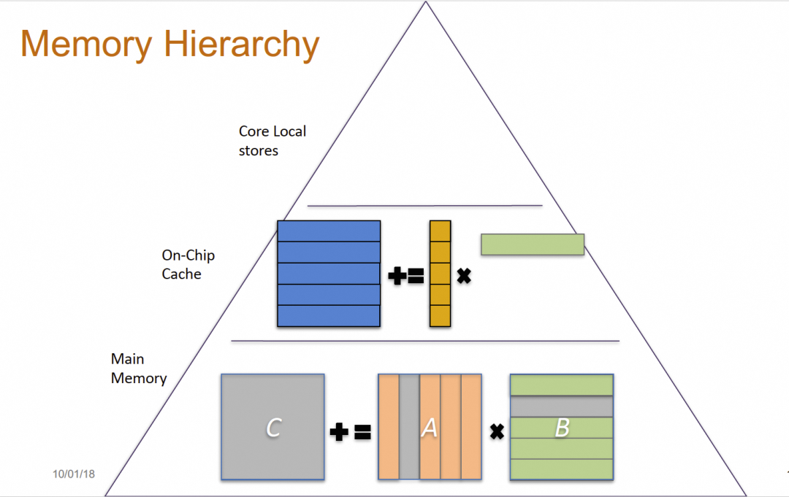

계산 코어 내부로 들어갈 때는 vector Block을 더 작은 Tile로 한 번 더 분해해 계산한다.

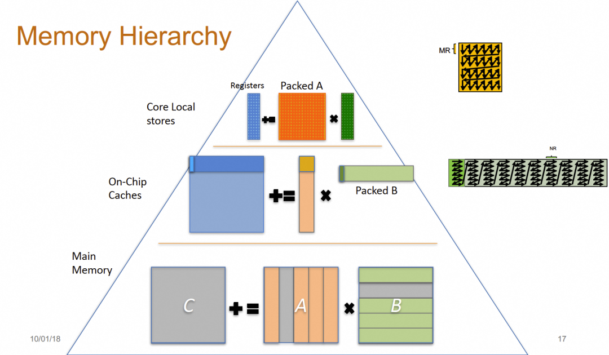

전체 계산 과정의 계층화된 메모리 접근 구조는 다음과 같다.

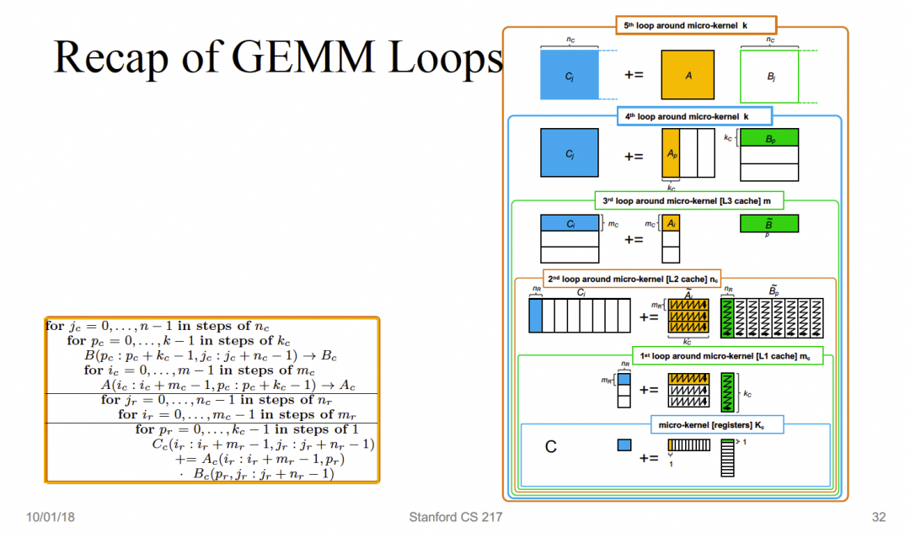

이 과정을 익히면 NVIDIA의 행렬 곱셈 흐름도 명확해진다.

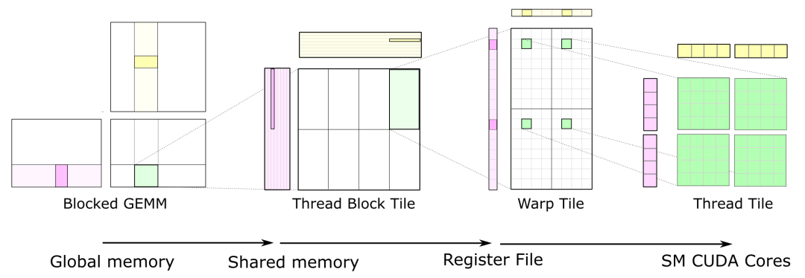

NVIDIA도 여러 번에 걸쳐 행렬을 점차 더 작은 Tile로 나누어 계산하며, 원리는 서로 통한다.

### 3.2 Memory Layout

계산 과정에서 메모리 접근의 연속성을 보장하기 위해 A 행렬은 행 기준으로 정렬되어야 하고, B 행렬은 열 기준으로 정렬되어야 한다는 점에 주목한다.

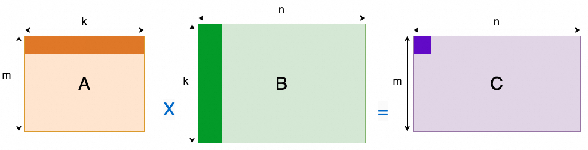

반면 블록 내부에서 블록 곱셈을 수행할 때는 메모리 접근 순서가 $A_{t}$ column-major / $B_{t}$ row-major 방식으로 바뀐다. 따라서 행렬의 Layout은 일종의 Z자 배열이 된다. 아래와 같다.

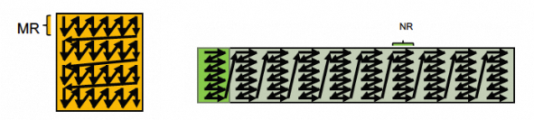

## 4. GEMM in action

이 절에서는 손으로 구현한 Naive GEMM과 Block GEMM 두 예제를 통해 행렬 블록 곱셈의 원리와 성능 영향을 설명한다. 성능 차이가 거의 53배에 가깝다는 것을 볼 수 있다. 테스트에 사용한 A10 GPU의 FP32 peak 연산 성능 31TFFLOPS를 기준으로 계산하면, 가장 단순한 알고리즘은 메모리 접근 효율 문제 때문에 부동소수점 연산 성능이 peak의 1%에 불과하다.

```bash
## ./naive
AveragePerformance  0.2336 Tflops

## ./block
AveragePerformance  10.7669 Tflops
```

다음 글에서는 행렬 곱셈 최적화와 관련된 내용을 더 자세히 이야기하고, 세 번째 글에서 Cutlass를 끌어낼 것이다.

### 4.1 Naive GEMM

가장 단순한 행렬 곱셈은 다음과 같다.

```c++
##define OFFSET(row, col, stride) ((row) * (stride) + (col))

__global__ void basic_gemm(
    float *  A, float *  B, float *  C,
    const int M, const int N, const int K) {

    int _x = blockIdx.x * blockDim.x + threadIdx.x;
    int _y = blockIdx.y * blockDim.y + threadIdx.y;
    if (_x < M && _y < N) {
        float sum = 0.0;
        for (int k = 0; k < K; k++) {
            sum +=A[OFFSET(_x, k, K)] *  B[OFFSET(k , _y, N)];
        }
        C[OFFSET(_x, _y, N)] = sum;
    }
}
```

A10에서 테스트했을 때 FLOPS는 대략 233GFlops에 불과하다.

```c++
int main() {
    const int M = 4096;
    const int K = 1024;
    const int N = 4096;
    const int ITER = 100;

    dim3 gridDim(ceil(M/32), ceil(N/32), 1);
    dim3 blockDim(32, 32, 1);

    float *d_a, *d_b, *d_c ;
    cudaMalloc(&d_a, M * K * sizeof(float));
    cudaMalloc(&d_b, K * N * sizeof(float));
    cudaMalloc(&d_c, M * N * sizeof(float));

    cudaEvent_t start, end;
    cudaEventCreate(&start);
    cudaEventCreate(&end);

    cudaEventRecord(start);
    for (int i = 0; i < ITER; i++)
        basic_gemm<<<gridDim, blockDim>>>(d_a, d_b, d_c, M, N, K);
    cudaEventRecord(end);
    cudaEventSynchronize(end);

    float msec;
    cudaEventElapsedTime(&msec, start, end);

    long workload =  long(M) * N * K * 2 * ITER;
    double avg_Tflops = ((double)workload / 1e12 ) / (double(msec)/ 1e3);
    printf("AveragePerformance  %6.4lf Tflops\n",avg_Tflops);

    cudaFree(d_a);
    cudaFree(d_b);
    cudaFree(d_c);
}
```

### 4.2 Block GEMM

코드는 Anthropic Performance & Kernel 팀의 siboehm이 쓴 "How to Optimize a CUDA Matmul Kernel for cuBLAS-like Performance: a Worklog"[1] 관련 코드에서 가져왔고, 이해하기 쉬운 도식도 함께 그렸다.

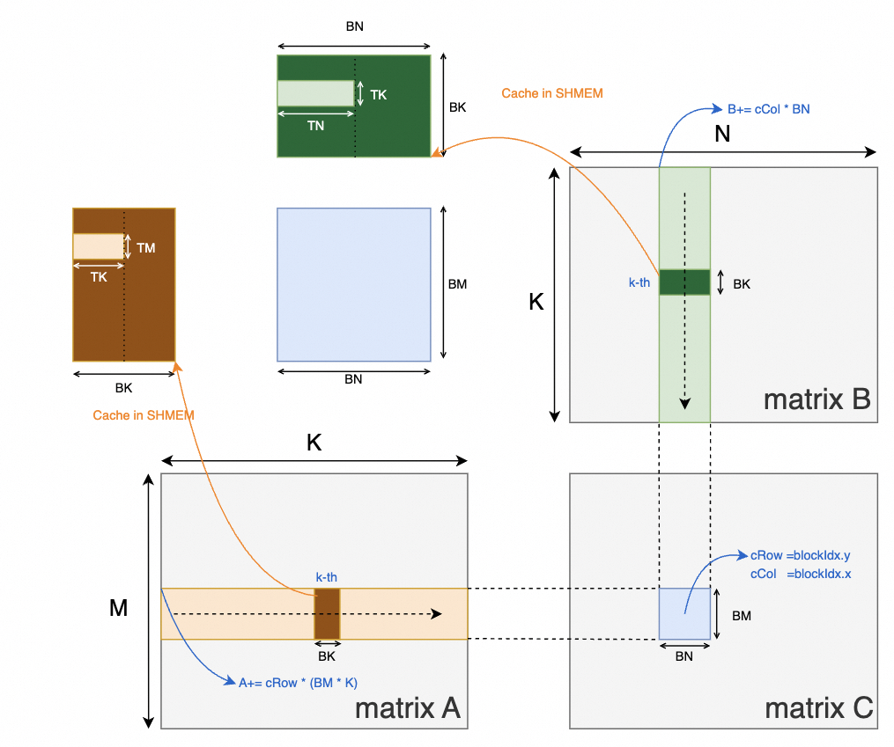

자세한 내용은 다음 글에서 설명하겠다.

```c++
__global__ void block2d_gemm(const float *A, const float *B, float *C,
                            int M, int N, int K) {

  const int BM = 128;
  const int BN = 128;
  const int BK = 8;
  const int TM = 8;
  const int TN = 8;

  const uint cRow = blockIdx.y;
  const uint cCol = blockIdx.x;

  const uint totalResultsBlocktile = BM * BN;
  // A thread is responsible for calculating TM*TN elements in the blocktile
  const uint numThreadsBlocktile = totalResultsBlocktile / (TM * TN);


  // BN/TN are the number of threads to span a column
  const int threadCol = threadIdx.x % (BN / TN);
  const int threadRow = threadIdx.x / (BN / TN);

  // allocate space for the current blocktile in smem
  __shared__ float As[BM * BK];
  __shared__ float Bs[BK * BN];

  // Move blocktile to beginning of A's row and B's column
  A += cRow * BM * K;
  B += cCol * BN;
  C += cRow * BM * N + cCol * BN;

  // calculating the indices that this thread will load into SMEM
  const uint innerRowA = threadIdx.x / BK;
  const uint innerColA = threadIdx.x % BK;

  // calculates the number of rows of As that are being loaded in a single step
  // by a single block
  const uint strideA = numThreadsBlocktile / BK;
  const uint innerRowB = threadIdx.x / BN;
  const uint innerColB = threadIdx.x % BN;
  // for both As and Bs we want each load to span the full column-width, for
  // better GMEM coalescing (as opposed to spanning full row-width and iterating
  // across columns)
  const uint strideB = numThreadsBlocktile / BN;

  // allocate thread-local cache for results in registerfile
  float threadResults[TM * TN] = {0.0};
  // register caches for As and Bs
  float regM[TM] = {0.0};
  float regN[TN] = {0.0};

  // outer-most loop over block tiles
  for (uint bkIdx = 0; bkIdx < K; bkIdx += BK) {
    // populate the SMEM caches
    for (uint loadOffset = 0; loadOffset < BM; loadOffset += strideA) {
      As[(innerRowA + loadOffset) * BK + innerColA] =
          A[(innerRowA + loadOffset) * K + innerColA];
    }
    for (uint loadOffset = 0; loadOffset < BK; loadOffset += strideB) {
      Bs[(innerRowB + loadOffset) * BN + innerColB] =
          B[(innerRowB + loadOffset) * N + innerColB];
    }
    __syncthreads();

    // advance blocktile
    A += BK;     // move BK columns to right
    B += BK * N; // move BK rows down

    // calculate per-thread results
    for (uint dotIdx = 0; dotIdx < BK; ++dotIdx) {
      // block into registers
      for (uint i = 0; i < TM; ++i) {
        regM[i] = As[(threadRow * TM + i) * BK + dotIdx];
      }
      for (uint i = 0; i < TN; ++i) {
        regN[i] = Bs[dotIdx * BN + threadCol * TN + i];
      }
      for (uint resIdxM = 0; resIdxM < TM; ++resIdxM) {
        for (uint resIdxN = 0; resIdxN < TN; ++resIdxN) {
          threadResults[resIdxM * TN + resIdxN] +=
              regM[resIdxM] * regN[resIdxN];
        }
      }
    }
    __syncthreads();
  }

  // write out the results
  for (uint resIdxM = 0; resIdxM < TM; ++resIdxM) {
    for (uint resIdxN = 0; resIdxN < TN; ++resIdxN) {
      C[(threadRow * TM + resIdxM) * N + threadCol * TN + resIdxN] =
         threadResults[resIdxM * TN + resIdxN] +
         C[(threadRow * TM + resIdxM) * N + threadCol * TN + resIdxN];
    }
  }
}
```

참고 자료

[1]

How to Optimize a CUDA Matmul Kernel for cuBLAS-like Performance: a Worklog: https://siboehm.com/articles/22/CUDA-MMM
