# Tensor-002 행렬 곱셈 최적화

- 원문 제목: Tensor-002 행렬 곱셈 최적화
- 저자: 자보터의 지우개
- 계정: zartbot
- 발행일: 2024년 7월 25일 15:20

이번 글에서는 SIMT 아키텍처에서 TensorCore를 사용하지 않고 행렬 곱셈을 계산할 때 필요한 메모리 접근 관련 최적화를 주로 다룬다. 단계적으로 반복 최적화를 진행하면서 GPU 성능 관련 특성과 메모리 접근 최적화를 더 깊이 이해해 보려 한다. TensorCore 관련 내용은 다음 글에서 소개한다.

테스트 환경은 A10 GPU 한 장이며, Driver Version: 550.54.15, CUDA Version: 12.4이다. 행렬은 M=N=K=4092이다.

| Kernel | GFLOPs/s | cuBLAS 대비 성능 |
| --- | --- | --- |
| 0: cuBLAS | `14765.9` | 100.0% |
| 1: Naive | `588.5` | 3.9% |
| 2: GMEM Coalescing | `1165.7` | 7.9% |
| 3: SMEM Caching | `2166.7` | 14.6% |
| 4: 1D Blocktiling | `6082.0` | 41.2% |
| 5: 2D Blocktiling | `11279.0` | 76.4% |
| 6: Vectorized Mem Access | `12861.4` | 87.1% |
| 7: WarpTiling | `14766.3` | 100.0% |

주로 아래 자료를 참고했고, 정리와 테스트를 진행했다. Credit은 아래 글들의 저자에게 있다.

1. Simon Boehm, How to Optimize a CUDA Matmul Kernel for cuBLAS-like Performance: a Worklog[1]
2. 마쥔 | MegEngine 아키텍트, CUDA 행렬 곱셈 궁극 최적화 가이드[2]
3. nicholaswilde, CUDA SGEMM 행렬 곱셈 최적화 노트 - 입문부터 cublas까지[3]
4. 리샤오샤, [작성 중] CUDA GEMM 이론 성능 분석과 kernel 최적화[4]
5. LeiMao, CUDA Matrix Multiplication Optimization[5]
6. 유러치치더군즈, 쉽게 풀어 보는 GPU 최적화[6]

## 1. cuBLAS 기준선

우리는 cuBLAS를 성능 테스트 기준선으로 사용한다. 테스트 환경은 A10 inference 카드 한 장이고, 테스트 행렬 규모는 다음과 같다.

$C = \alpha * A \times B + \beta * C, \quad A\in \mathbb R^{M*K}, B \in \mathbb R^{K*N}, C \in \mathbb R^{M*N}$
```c++
const int M = 4092;
const int K = 4092;
const int N = 4092;
float alpha = 1.0f;
float beta = 0.5f;
```

cuBLAS 테스트 코드는 다음과 같다.
```c++
#include <stdio.h>
#include <stdlib.h>
#include <cublas_v2.h>
#include "util.h"

int main()
{
  cudaError_t cudaStat;  // cudaMalloc status
  cublasStatus_t stat;   // cuBLAS functions status
  cublasHandle_t handle; // cuBLAS context

  stat = cublasCreate(&handle); // initialize CUBLAS context

  float *d_a, *d_b, *d_c;
  cudaMalloc(&d_a, M * K * sizeof(float));
  cudaMalloc(&d_b, K * N * sizeof(float));
  cudaMalloc(&d_c, M * N * sizeof(float));

  cudaEvent_t start, end;
  cudaEventCreate(&start);
  cudaEventCreate(&end);

  cudaEventRecord(start);
  for (int i = 0; i < ITER; i++)
    stat = cublasSgemm(handle,
                       CUBLAS_OP_N, CUBLAS_OP_N,
                       N, M, K,
                       &alpha, d_b, N,
                       d_a, K, &beta, d_c, N);
  cudaEventRecord(end);
  cudaEventSynchronize(end);

  float msec;
  cudaEventElapsedTime(&msec, start, end);

  long workload = long(M) * N * K * 2 * ITER;
  double avg_Gflops = ((double)workload / 1e9) / (double(msec) / 1e3);
  printf("cuBLAS AveragePerformance  %10.1lf Gflops\n", avg_Gflops);

  cudaFree(d_a);
  cudaFree(d_b);
  cudaFree(d_c);
  cublasDestroy(handle); // destroy CUBLAS context
}
```

## 2. 단순 구현

앞 장에서 설명했듯이, 세 겹의 루프 구조에 따라 프로그래밍한다. 결과 C 행렬 관점에서 보면, 각 스레드가 하나의 위치 값을 담당하도록 배치할 수 있다.

c_{i,j} =
\left[
\begin{matrix}
a_{i,1} & a_{i,2} & \cdots & a_{i,k}
\end{matrix}
\right]
\left[
\begin{matrix}
b_{1,j} \\
b_{2,j} \\
\vdots \\
b_{k,j}
\end{matrix}
\right]
= \sum_{k=0}^K a_{i,k}b_{k,j}

### 2.1 스레드 배치

CUDA는 Grid/Block 방식으로 스레드를 구성한다. 아래 그림과 같다.

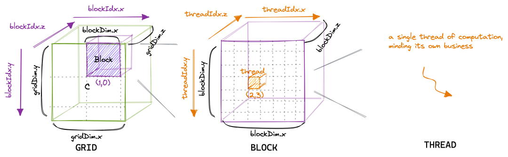

현재 작업에 대해서는 Z 차원을 1로 정의하고 2D 방식으로 스레드를 배치할 수 있다. 하나의 BLOCK이 `32 * 32`개의 스레드를 포함하도록 선택하면 필요한 전체 Grid 수는 다음과 같다.
```c++
// 필요한 Grid 수는 Ceil(M/32) * ceil(N/32)
dim3 gridDim(CEIL_DIV(M, 32), CEIL_DIV(N, 32), 1);
// 각 BLOCK에는 32 * 32 = 1024개의 스레드가 있다
dim3 blockDim(32, 32, 1);
// Kernel 호출
sgemm_naive<<<gridDim, blockDim>>>(M, N, K, alpha, A, B, beta, C);
```

전체 곱셈 workflow는 다음과 같으며, 각 스레드는 C의 한 위치에 필요한 내적 계산을 담당한다.

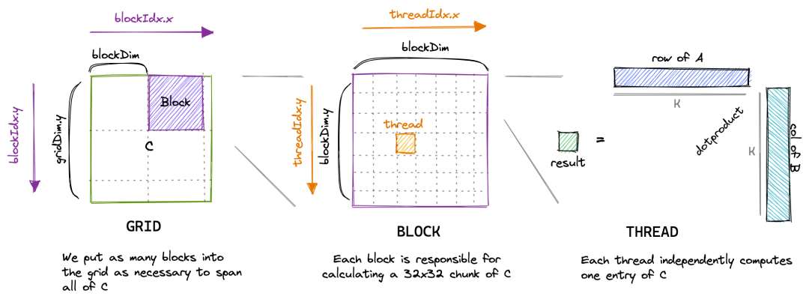

### 2.2 내적 계산

이 블록이 C에서 가지는 좌표는 아래와 같다. 우리는 스레드 안에서 blockIdx와 ThreadIdx를 바탕으로 이를 계산해야 한다.

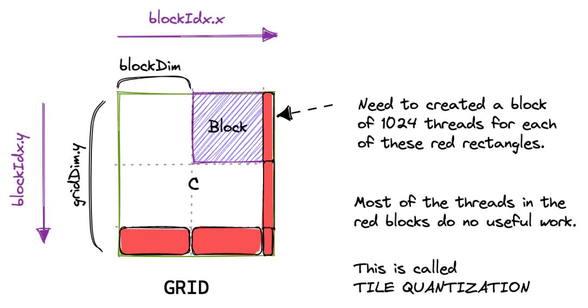

동시에 BLOCK을 할당할 때 일부 BLOCK 안의 THREAD는 행렬 경계를 넘어가게 된다(위 그림의 빨간 부분). 따라서 실행을 제어하는 조건문이 필요하며, 최종 코드는 다음과 같다.
```c++
__global__ void sgemm_naive(int M, int N, int K, float alpha, const float *A,
                            const float *B, float beta, float *C) {

  // 스레드가 담당하는 블록의 C 내 좌표 계산
  const uint x = blockIdx.x * blockDim.x + threadIdx.x;
  const uint y = blockIdx.y * blockDim.y + threadIdx.y;

  // 경계 조건 처리. Grid 분할은 Ceil_DIV 기준이므로 경계 BLOCK의 일부 스레드는 행렬 경계를 넘는 데이터를 처리하지 못하게 해야 한다
  if (x < M && y < N) {
    float tmp = 0.0;
    for (int i = 0; i < K; ++i) {
      tmp += A[x * K + i] * B[i * N + y];
    }

    // C = α*(A@B)+β*C
    C[x * N + y] = alpha * tmp + beta * C[x * N + y];
  }
}
```

하지만 이 방식으로 얻은 성능은 588.5GFLOPS로, cuBLAS의 4%에 불과하다.

### 2.3 계산 실행 시간 하한 분석

전체 행렬 규모는 M=K=N=4092이다.

1. 부동소수점 계산량은 $2*4092^3+4092^2=137GFLOPs$이다.
2. 계산은 FP32이므로 읽어야 하는 데이터는 $3*4092^2 *4B = 201MB*$이다.
3. 전체 저장해야 하는 데이터는 $4092^2 *4B =67MB$이다.
4. 누적 최소 메모리 접근량은 268MB이다.

A10 GPU는 공식 문서 기준 FP32 peak 부동소수점 계산 능력이 30TFLOPs/s이고 global memory bandwidth는 768GB/s이다. peak 계산 성능 기준으로는 4.5ms가 필요하고, peak memory bandwidth 기준으로는 0.34ms가 메모리 전송에 필요하다. 따라서 우리가 전송하는 데이터 양이 10x 268MB보다 작기만 하면 Compute-Bound 연산자다.

### 2.4 단순 모드의 메모리 접근 문제

하나의 Kernel에서 같은 BLOCK 안의 두 스레드 ThreadId(0,0)와 ThreadId(0,1)를 보자. 아래 그림처럼 이들은 모두 B의 같은 열을 로드하지만 A의 서로 다른 행을 로드한다.

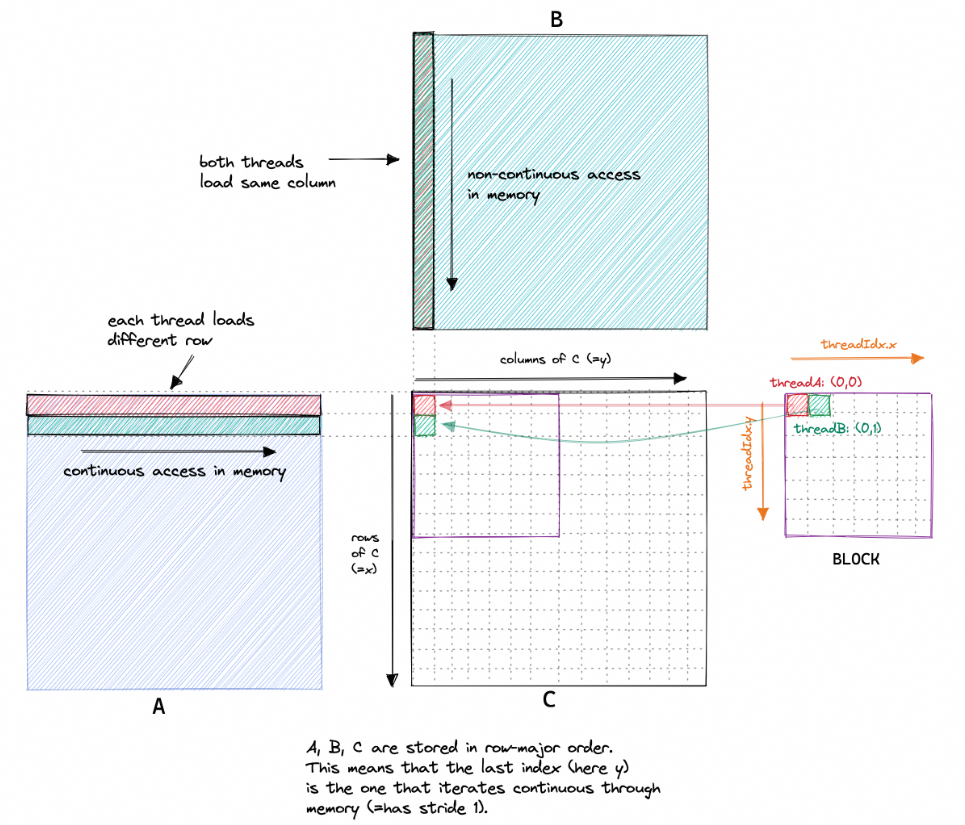

만약 Cache가 전혀 없다고 가정하면 각 스레드는 $2* 4092+1$개의 부동소수점 수를 로드해야 하고, 전체 스레드는 $4092^2$개이므로 누적 548GB의 메모리 접근이 발생한다. 따라서 global memory(GMEM) 접근을 가능한 한 합쳐 데이터 접근량을 줄일 수 있도록 Kernel의 메모리 접근 패턴을 최적화해야 한다.

## 3. global memory coalescing(GMEM Coalescing)

GPU에서는 보통 인접한 32개 스레드가 하나의 warp를 구성한다. 각 스레드가 global memory에서 FP32 데이터를 로드할 때 접근 데이터 주소가 연속적이면 32 \* 4B=128B의 단일 Load transaction으로 합칠 수 있다. 아래 그림처럼 행렬이 row-major로 정렬되어 있을 때 어떤 열을 접근하면 불연속 주소가 나타난다. 앞 절의 단순 구현에서는 이로 인해 대량의 32B LD가 발생해 성능에 영향을 준다.

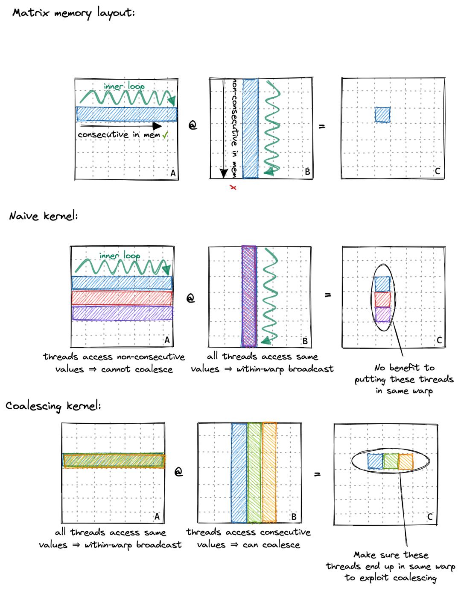

한 가지 방법은 B와 C 행렬을 column-major 방식으로 저장하는 것이다. 물론 thread 배치를 다시 구성하는 방식으로 처리할 수도 있다. 아래와 같이 thread와 block의 index를 동시에 수정하면 구현할 수 있다.
```c++
__global__ void gmem_coalescing_gemm(int M, int N, int K, float alpha, const float *A,
                           const float *B, float beta, float *C)
{
  // 행렬 C의 X/Y index 교환
  const uint y = blockIdx.x * blockDim.x + threadIdx.x;
  const uint x = blockIdx.y * blockDim.y + threadIdx.y;

  if (x < M && y < N)
  {
    float tmp = 0.0;
    for (int i = 0; i < K; ++i)
    {
      tmp += A[x * K + i] * B[i * N + y];
    }
    // C = α*(A@B)+β*C
    C[x * N + y] = alpha * tmp + beta * C[x * N + y];

  }
}

void launch_gemm(int M, int N, int K, float alpha, const float *A,
                 const float *B, float beta, float *C)
{
  // Grid 배치 교환
  dim3 gridDim(ceil(N / 32), ceil(M / 32), 1);
  dim3 blockDim(32, 32, 1);
  gmem_coalescing_gemm<<<gridDim, blockDim>>>(M, N, K, alpha, A, B, beta, C);
}
```

간단히 교환한 뒤 성능은 1165.7GFlops까지 향상된다. Profiling을 통해 단순 구현에서의 메모리 접근 대역폭이 52.29GB/s임을 볼 수 있다.

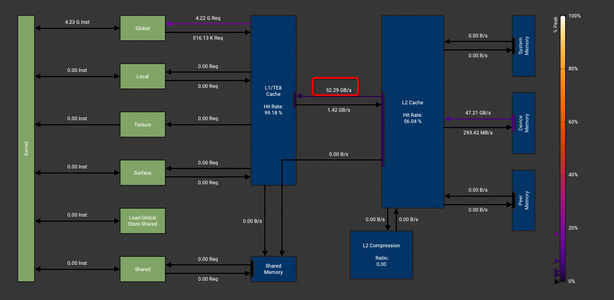

반면 global memory coalesced access를 사용하면 113.33GB/s까지 도달할 수 있다.

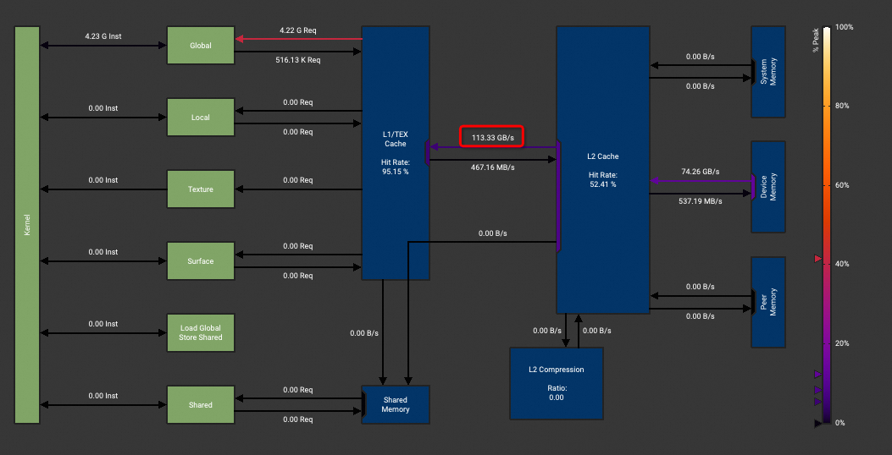

## 4. SMEM Cache-Blocking

GPU의 캐시 계층 구조를 살펴보자. 각 SM 안에는 Shared Memory(SMEM)도 있다. 아래 그림과 같다.

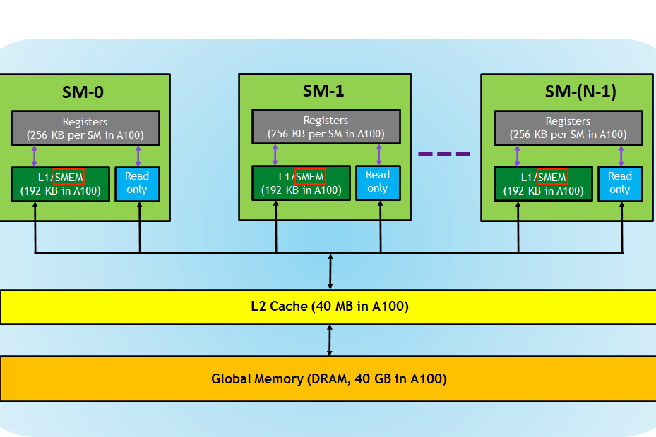

리샤오샤 선생님의 테스트 코드[7]에 따르면 A10 shared memory의 대역폭은 대략 15.6TB/s이다.
```
shared memory accessed: 2097152 byte
duration: 19348 cycles
shared memory bandwidth per SM (measured): 108.391151 byte/cycle
shared memory bandwidth per SM (theoretical): 128 byte/cycle
standard clock frequency: 1695 MHz
SM: 72
whole chip shared memory bandwidth (theoretical): 15621.120117 GB/s
```

따라서 우리는 global memory(GMEM)에서 A와 B 블록을 shared memory로 로드한 다음, 이 두 블록에 대해 가능한 한 많은 계산을 수행한다.

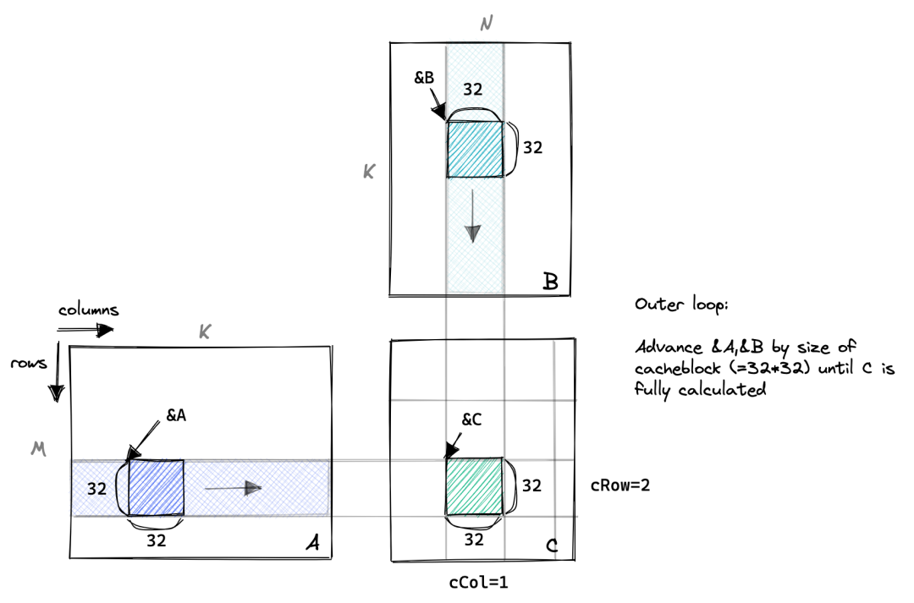

우리는 A의 열과 B의 행을 따라 블록을 이동시키며 C에 대해 부분합을 수행하고, 결과가 계산될 때까지 반복한다.
```c++
template <const int CHUNK_SIZE>
__global__ void sgemm_shared_mem_block(int M, int N, int K, float alpha,
                                       const float *A, const float *B,
                                       float beta, float *C) {
  // 행렬 C를 BLOCK 기준으로 나눈다. cRow와 cCol은 이 스레드가 속한 Block에 대응하는 Block의 행 번호와 열 번호다
  const uint cRow = blockIdx.x;
  const uint cCol = blockIdx.y;

  // shared memory 할당. shared memory는 Block 안의 모든 thread가 접근할 수 있다
  __shared__ float As[CHUNK_SIZE * CHUNK_SIZE];
  __shared__ float Bs[CHUNK_SIZE * CHUNK_SIZE];

  // BLOCK 안의 스레드는 kernel launch 시 blockdim이 하나의 차원만 갖도록 할당된다
  // threadIdx를 통해 스레드가 BLOCK 내부에서 대응하는 행과 열을 찾는다
  const uint threadCol = threadIdx.x % CHUNK_SIZE;
  const uint threadRow = threadIdx.x / CHUNK_SIZE;

  // cRow와 cCol을 기반으로 행렬 시작 포인터 위치를 계산한다
  A += cRow * CHUNK_SIZE * K;                    // row=cRow, col=0
  B += cCol * CHUNK_SIZE;                        // row=0, col=cCol
  C += cRow * CHUNK_SIZE * N + cCol * CHUNK_SIZE; // row=cRow, col=cCol

  float tmp = 0.0;
  for (int bkIdx = 0; bkIdx < K; bkIdx += CHUNK_SIZE) {
    // 각 스레드는 A와 B의 원소 하나를 로드한다. threadIdx.x는 연속 분포이므로
    // GMEM 접근은 coalescing될 수 있다
    As[threadRow * CHUNK_SIZE + threadCol] = A[threadRow * K + threadCol];
    Bs[threadRow * CHUNK_SIZE + threadCol] = B[threadRow * N + threadCol];

    // 모든 thread가 데이터 로드를 완료할 때까지 동기화해 기다린다
    __syncthreads();

    // 데이터를 다음 CHUNK로 이동한다
    A += CHUNK_SIZE;
    B += CHUNK_SIZE * N;

    // BLOCK level의 내적 계산 수행
    for (int dotIdx = 0; dotIdx < CHUNK_SIZE; ++dotIdx) {
      tmp += As[threadRow * CHUNK_SIZE + dotIdx] *
             Bs[dotIdx * CHUNK_SIZE + threadCol];
    }
    // Cache 영향을 고려해 다음 로드를 수행하기 전에 한 번 더 동기화해야 한다
    __syncthreads();
  }
  C[threadRow * N + threadCol] =
      alpha * tmp + beta * C[threadRow * N + threadCol];
}

void launch_gemm(int M, int N, int K, float alpha, const float *A,
                 const float *B, float beta, float *C)
{
  dim3 gridDim(CEIL_DIV(M, 32), CEIL_DIV(N, 32));
  dim3 blockDim(32 * 32);

  sgemm_shared_mem_block<32>
      <<<gridDim, blockDim>>>(M, N, K, alpha, A, B, beta, C);
}
```

테스트 결과 성능이 2166GFLOPS까지 향상된 것을 볼 수 있다. 동시에 Profiling을 통해 메모리 접근 요청이 SMEM으로 옮겨간 것을 볼 수 있다.

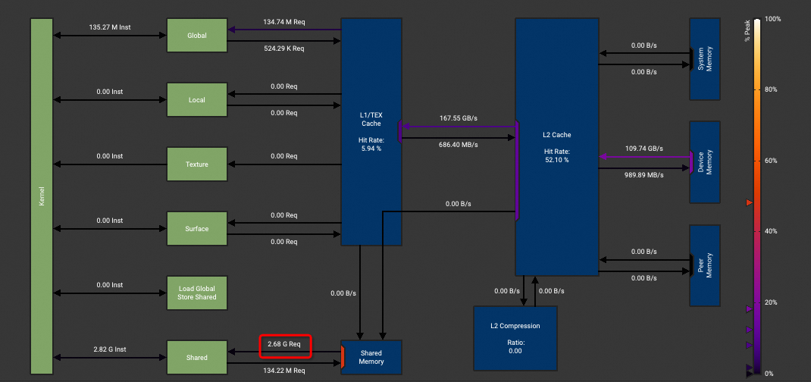

하지만 성능은 cuBLAS와 이론 peak에 비해 여전히 큰 차이가 있다. 따라서 더 살펴봐야 하며, 주요 instruction은 LDS다.

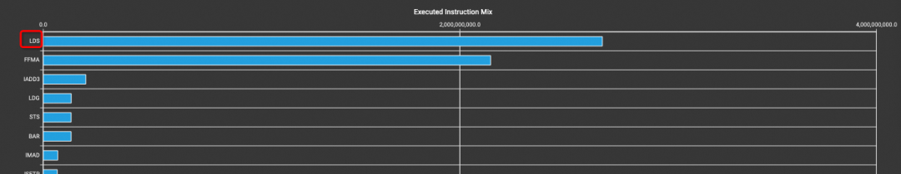

하지만 WARP scheduling 관점에서 보면 주로 Stall MIO Throttle이다.

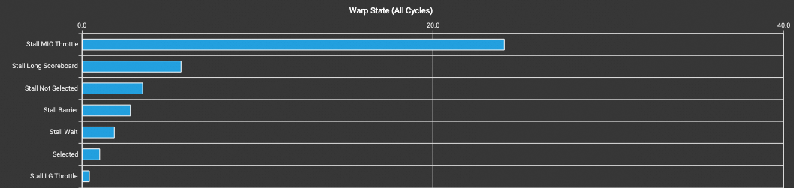

Stall MIO Throttle의 의미는 Warp가 MIO(memory input/output) instruction queue를 기다리며 발생하는 stall이다. SMEM에 자주 접근하는 장면에서는 이런 상황이 발생한다. 따라서 다음 목표는 KERNEL이 발행하는 LDS instruction을 최적화해 줄이는 것이다. 그러려면 각 스레드가 여러 원소를 계산해야 한다.

## 5. 1D BlockTiling

따라서 CHUNK\_SIZE를 키워 SMEM에 `BM*BK + BN*BK = 64*8 + 64*8 = 1024`개의 부동소수점 수를 캐싱한다. 아래 그림과 같다.

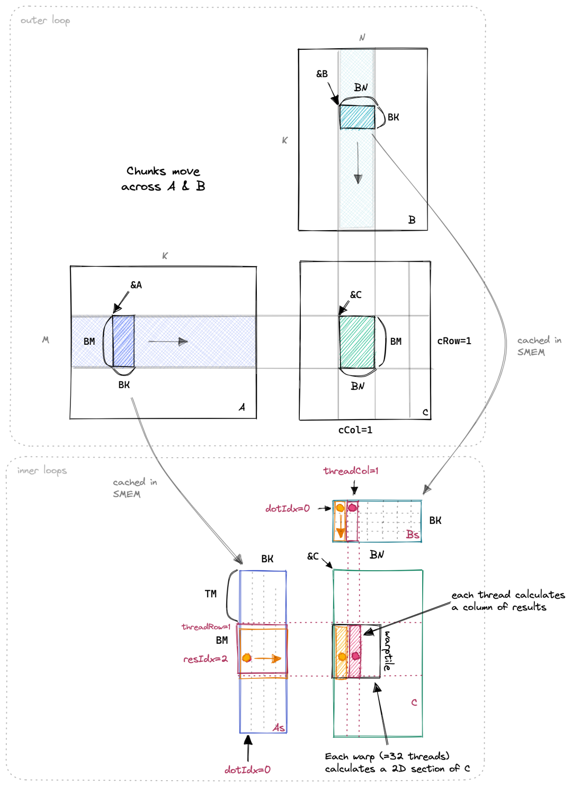

SMEM 로드는 기본적으로 동일하지만, 각 스레드 내부에 (dotIdx/resIdx) 두 루프를 구성한다.
```c++
// register file 안에 thread-local result cache를 할당한다
float threadResults[TM] = {0.0};

// BLOCKTILE 기반의 외부 루프
for (uint bkIdx = 0; bkIdx < K; bkIdx += BK) {
  // 메모리 접근은 이전과 동일하다
  As[innerRowA * BK + innerColA] = A[innerRowA * K + innerColA];
  Bs[innerRowB * BN + innerColB] = B[innerRowB * N + innerColB];
  __syncthreads();

  // 데이터를 다음 BLOCKTILE로 이동한다
  A += BK;
  B += BK * N;

  // 각 스레드의 계산 작업은 dotIdx/resIdx 두 루프로 나뉜다
  for (uint dotIdx = 0; dotIdx < BK; ++dotIdx) {
    // Bs 행렬을 재사용하기 위해 내적 루프를 바깥쪽에 두고 Btmp에 캐싱한다
    float Btmp = Bs[dotIdx * BN + threadCol];
    for (uint resIdx = 0; resIdx < TM; ++resIdx) {
      threadResults[resIdx] +=
          As[(threadRow * TM + resIdx) * BK + dotIdx] * Btmp;
    }
  }
  __syncthreads();
}
```

전체 Kernel 코드는 다음과 같다.
```c++
template <const int BM, const int BN, const int BK, const int TM>
__global__ void sgemm1DBlocktiling(int M, int N, int K, float alpha,
                                   const float *A, const float *B, float beta,
                                   float *C) {

  // BLOCK에 대응하는 행/열 배치를 교환해 B 행렬의 열 접근이 연속되게 한다.
  const uint cRow = blockIdx.y;
  const uint cCol = blockIdx.x;

  const int threadCol = threadIdx.x % BN;
  const int threadRow = threadIdx.x / BN;

  // SMEM 할당
  __shared__ float As[BM * BK];
  __shared__ float Bs[BK * BN];

  // BLOCKTILE 포인터 이동
  A += cRow * BM * K;
  B += cCol * BN;
  C += cRow * BM * N + cCol * BN;

  const uint innerColA = threadIdx.x % BK; // warp-level GMEM coalescing
  const uint innerRowA = threadIdx.x / BK;
  const uint innerColB = threadIdx.x % BN; // warp-level GMEM coalescing
  const uint innerRowB = threadIdx.x / BN;

  // allocate thread-local cache for results in registerfile
  float threadResults[TM] = {0.0};

  // outer loop over block tiles
  for (uint bkIdx = 0; bkIdx < K; bkIdx += BK) {
    // populate the SMEM caches
    As[innerRowA * BK + innerColA] = A[innerRowA * K + innerColA];
    Bs[innerRowB * BN + innerColB] = B[innerRowB * N + innerColB];
    __syncthreads();

    // advance blocktile
    A += BK;
    B += BK * N;

    // calculate per-thread results
    for (uint dotIdx = 0; dotIdx < BK; ++dotIdx) {
      // we make the dotproduct loop the outside loop, which facilitates
      // reuse of the Bs entry, which we can cache in a tmp var.
      float tmpB = Bs[dotIdx * BN + threadCol];
      for (uint resIdx = 0; resIdx < TM; ++resIdx) {
        threadResults[resIdx] +=
            As[(threadRow * TM + resIdx) * BK + dotIdx] * tmpB;
      }
    }
    __syncthreads();
  }

  // write out the results
  for (uint resIdx = 0; resIdx < TM; ++resIdx) {
    C[(threadRow * TM + resIdx) * N + threadCol] =
        alpha * threadResults[resIdx] +
        beta * C[(threadRow * TM + resIdx) * N + threadCol];
  }
}

void launch_gemm(int M, int N, int K, float alpha, const float *A,
                 const float *B, float beta, float *C)
{
  const uint BM = 64;
  const uint BN = 64;
  const uint BK = 8;
  const uint TM = 8;
  dim3 gridDim(CEIL_DIV(N, BN), CEIL_DIV(M, BM));
  dim3 blockDim((BM * BN) / TM);
  sgemm1DBlocktiling<BM, BN, BK, TM>
      <<<gridDim, blockDim>>>(M, N, K, alpha, A, B, beta, C);
}
```

실행해 보면 성능이 6082GFlops까지 향상되어 이전 Kernel 대비 3배 개선된다. WARP MIO Stall도 기존 22 Cycle에 비해 크게 개선된다.

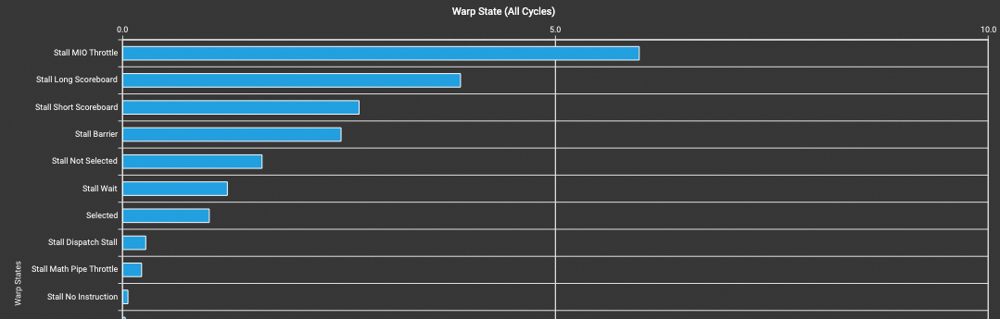

동시에 LDS instruction도 대폭 줄어든다.

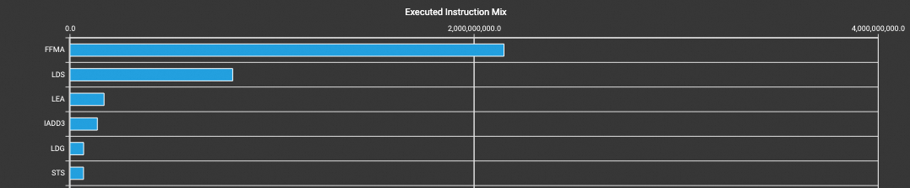

이전 Kernel에서는 다음과 같았다.

- GMEM 외부 루프 K/32회 \* LOAD 2회
- SMEM 외부 루프 K/32회 \* CHUNKSIZE(32) \* LOAD 2회
- 각 결과의 메모리 접근: GMEM: K/16, SMEM K \* 2

반면 새로운 1D BlockingTiling에서는 각 스레드가 8개의 결과를 계산한다.

- GMEM 외부 루프 K/8회 \* LOAD 2회
- SMEM 외부 루프 K/8회 \* BK \* (1+TM), 주: BK=8, TM=8, (1+TM)은 BLOCK-B 1회, BLOCK-A TM회다
- 각 결과의 메모리 접근: GMEM: K/32, SMEM K \* 9/8

또한 컴파일러 최적화 하나를 볼 수 있는데, Bs의 SMEM LOAD에 대해 vectorization이 적용되었다.
```c++
 for (uint dotIdx = 0; dotIdx < BK; ++dotIdx) {
      // we make the dotproduct loop the outside loop, which facilitates
      // reuse of the Bs entry, which we can cache in a tmp var.
      float tmpB = Bs[dotIdx * BN + threadCol];
      for (uint resIdx = 0; resIdx < TM; ++resIdx) {
        threadResults[resIdx] +=
            As[(threadRow * TM + resIdx) * BK + dotIdx] * tmpB;
      }
  }

LDS     R26, [R35.X4+0x800] // a 32b load from As
LDS.128 R8,  [R2]           // a 128b load from Bs
LDS.128 R12, [R2+0x20]
LDS     R24, [R35.X4+0x900]
LDS.128 R20, [R2+0x60]
LDS     R36, [R35.X4+0xb00]
LDS.128 R16, [R2+0x40]
LDS.128 R4,  [R2+0x80]
LDS     R38, [R35.X4+0xd00]
```

## 6. 2D BlockTiling

이 시점에는 Stall을 완화하기 위해 더 높은 계산 강도(Arithmetic Intensity)가 필요하다. 아래 그림처럼 하나의 스레드가 여러 결과를 계산하는 방식으로 LD/ST를 줄일 수 있다.

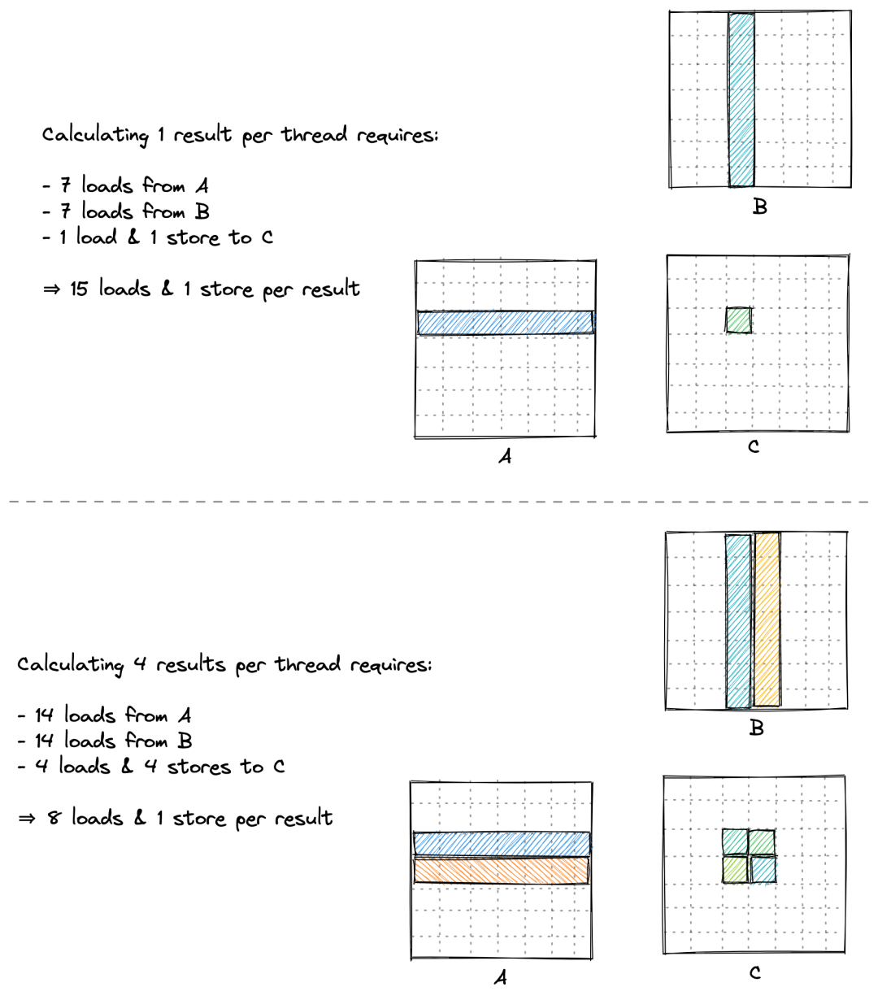

물론 단순히 한 차원만 늘리는 것을 생각할 수도 있지만, 그 경우 메모리 접근량이 2D tile보다 커진다. 아래와 같다.


결과 행렬 C를 Block 기준으로 나눈 뒤, 각 Thread가 `TM * TN`개의 블록 데이터를 담당하도록 한다. 아래와 같다.

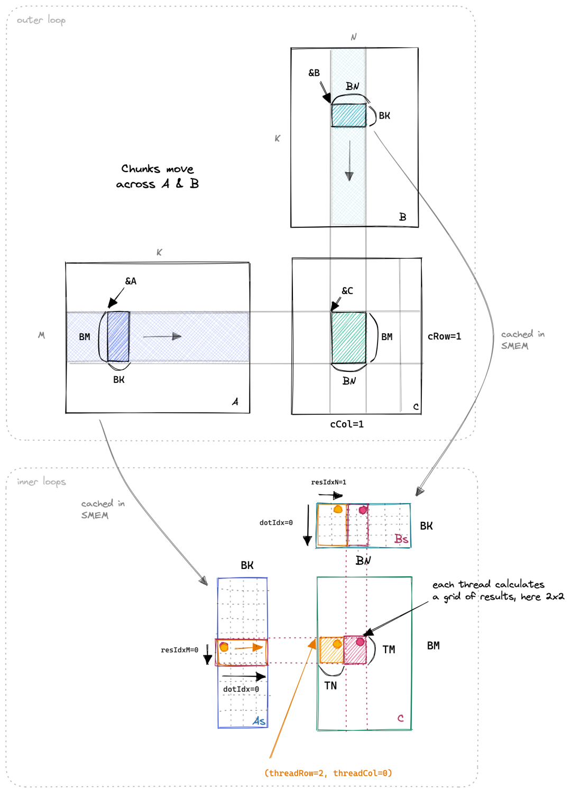

1D BlockTiling에 비해 내부에는 세 개의 루프(dotIdx/ResIdxM/ResIdxN)가 구성된다. 아래와 같다.
```c++
// allocate thread-local cache for results in registerfile
float threadResults[TM * TN] = {0.0};
// register caches for As and Bs
float regM[TM] = {0.0};
float regN[TN] = {0.0};

// outer-most loop over block tiles
for (uint bkIdx = 0; bkIdx < K; bkIdx += BK) {
  // populate the SMEM caches
  for (uint loadOffset = 0; loadOffset < BM; loadOffset += strideA) {
    As[(innerRowA + loadOffset) * BK + innerColA] =
        A[(innerRowA + loadOffset) * K + innerColA];
  }
  for (uint loadOffset = 0; loadOffset < BK; loadOffset += strideB) {
    Bs[(innerRowB + loadOffset) * BN + innerColB] =
        B[(innerRowB + loadOffset) * N + innerColB];
  }
  __syncthreads();

  // advance blocktile
  A += BK;     // move BK columns to right
  B += BK * N; // move BK rows down

  // calculate per-thread results
  for (uint dotIdx = 0; dotIdx < BK; ++dotIdx) {
    // load relevant As & Bs entries into registers
    for (uint i = 0; i < TM; ++i) {
      regM[i] = As[(threadRow * TM + i) * BK + dotIdx];
    }
    for (uint i = 0; i < TN; ++i) {
      regN[i] = Bs[dotIdx * BN + threadCol * TN + i];
    }
    // perform outer product on register cache, accumulate
    // into threadResults
    for (uint resIdxM = 0; resIdxM < TM; ++resIdxM) {
      for (uint resIdxN = 0; resIdxN < TN; ++resIdxN) {
        threadResults[resIdxM * TN + resIdxN] +=
            regM[resIdxM] * regN[resIdxN];
      }
    }
  }
  __syncthreads();
}
```

각 스레드가 이제 `TM * TN`개의 원소를 처리하므로 `As Tile`과 `Bs Tile`을 여러 번 로드해야 한다는 점에 주목할 수 있다.
왜냐하면
```c++
threadCol = threadIdx.x % (BN / TN)
threadRow = threadIdx.x / (BN / TN)
```

즉 인접 스레드는 `Bs Tile`의 서로 다른 열 thread partition과 `As Tile`의 같은 행 thread partition에 대응한다.
dotIdx 루프는 여전히 thread block fragment가 K 차원을 따라 하나씩 계산하는 구조다. 즉 매번 As는 한 열을 처리하고 Bs는 한 행을 처리한다. 두 내부 루프는 재사용되는 thread fragment 원소를 register로 로드한다.
마지막으로 resIdxM/resIdxN 루프를 통해 thread block fragment의 결과를 계산한다. 즉 As dotIdx 열의 `TM`개 원소와 Bs dotIdx 행의 `TN`개 원소를 차례로 반복해 총 TM \* TN개의 값을 계산한다.

dotIdx를 가장 바깥쪽으로 이동해 SMEM 접근 횟수를 줄였기 때문에, 세 겹 루프 구조에 대한 보충 설명 그림은 다음과 같다.

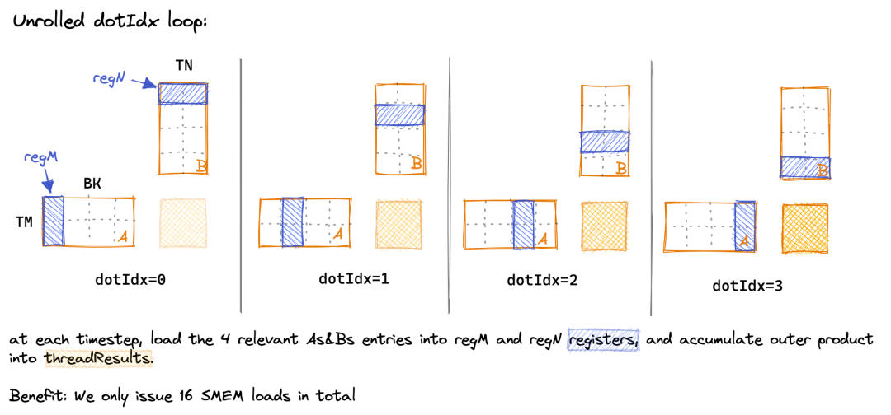

이때 성능은 11279GFLOPs에 도달하며, 1D BlockTiling 대비 다시 거의 두 배가 된다. Profiling을 통해 Warp Stall MIO throttle 현상이 개선된 것을 볼 수 있다.

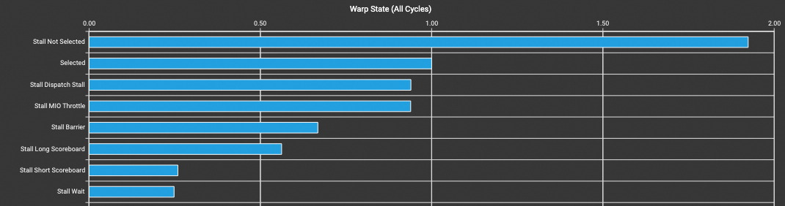

LDS 수량도 대폭 감소한다.

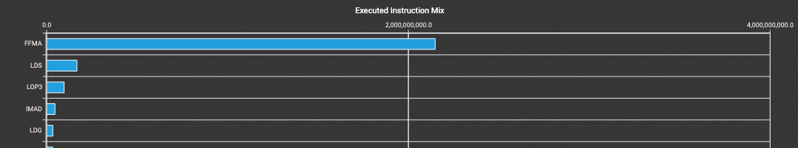

## 7. Vectorized SMEM/GMEM access

앞의 최적화는 As를 transpose함으로써 vectorized instruction(LDS.128)으로 As에서 로드할 수 있게 했다. 하지만 float4 vector data type을 사용해 GMEM의 모든 LD/ST를 vectorization할 수도 있다. 예를 들어 row read와 transpose 두 가지 모드를 처리한다.
```c++
// vector read
reinterpret_cast<float4 *>(&Bs[innerRowB * BN + innerColB * 4])[0] =
    reinterpret_cast<float4 *>(&B[innerRowB * N + innerColB * 4])[0];

// GMEM에서 SMEM으로 이동할 때 동시에 transpose 수행
float4 tmp =
    reinterpret_cast<float4 *>(&A[innerRowA * K + innerColA * 4])[0];

As[(innerColA * 4 + 0) * BM + innerRowA] = tmp.x;
As[(innerColA * 4 + 1) * BM + innerRowA] = tmp.y;
As[(innerColA * 4 + 2) * BM + innerRowA] = tmp.z;
As[(innerColA * 4 + 3) * BM + innerRowA] = tmp.w;
```

`reinterpret_cast<float4 *>`의 목적은 컴파일러에게 float\* B가 128b 정렬되어 있음을 명시적으로 알리는 것이다. 이렇게 하면 32b GMEM LD/ST instruction(LDG.E & STG.E)이 LDG.E.128 & STG.E.128로 대체되며, 수동으로 전개한 네 개의 LD보다 더 빠르다.
```c
template <const int BM, const int BN, const int BK, const int TM, const int TN>
__global__ void sgemmVectorize(int M, int N, int K, float alpha, float *A,
                               float *B, float beta, float *C) {
  const uint cRow = blockIdx.y;
  const uint cCol = blockIdx.x;

  // BN/TN are the number of threads to span a column
  const int threadCol = threadIdx.x % (BN / TN);
  const int threadRow = threadIdx.x / (BN / TN);

  // allocate space for the current blocktile in smem
  __shared__ float As[BM * BK];
  __shared__ float Bs[BK * BN];

  // Move blocktile to beginning of A's row and B's column
  A += cRow * BM * K;
  B += cCol * BN;
  C += cRow * BM * N + cCol * BN;

  // calculating the indices that this thread will load into SMEM
  // we'll load 128bit / 32bit = 4 elements per thread at each step
  const uint innerRowA = threadIdx.x / (BK / 4);
  const uint innerColA = threadIdx.x % (BK / 4);
  const uint innerRowB = threadIdx.x / (BN / 4);
  const uint innerColB = threadIdx.x % (BN / 4);

  // allocate thread-local cache for results in registerfile
  float threadResults[TM * TN] = {0.0};
  float regM[TM] = {0.0};
  float regN[TN] = {0.0};

  // outer-most loop over block tiles
  for (uint bkIdx = 0; bkIdx < K; bkIdx += BK) {

    // vectorized load와 transpose 수행
    float4 tmp =
        reinterpret_cast<float4 *>(&A[innerRowA * K + innerColA * 4])[0];
    As[(innerColA * 4 + 0) * BM + innerRowA] = tmp.x;
    As[(innerColA * 4 + 1) * BM + innerRowA] = tmp.y;
    As[(innerColA * 4 + 2) * BM + innerRowA] = tmp.z;
    As[(innerColA * 4 + 3) * BM + innerRowA] = tmp.w;

    reinterpret_cast<float4 *>(&Bs[innerRowB * BN + innerColB * 4])[0] =
        reinterpret_cast<float4 *>(&B[innerRowB * N + innerColB * 4])[0];
    __syncthreads();

    // advance blocktile
    A += BK;     // move BK columns to right
    B += BK * N; // move BK rows down

    // calculate per-thread results
    for (uint dotIdx = 0; dotIdx < BK; ++dotIdx) {
      // block into registers
      for (uint i = 0; i < TM; ++i) {
        regM[i] = As[dotIdx * BM + threadRow * TM + i];
      }
      for (uint i = 0; i < TN; ++i) {
        regN[i] = Bs[dotIdx * BN + threadCol * TN + i];
      }
      for (uint resIdxM = 0; resIdxM < TM; ++resIdxM) {
        for (uint resIdxN = 0; resIdxN < TN; ++resIdxN) {
          threadResults[resIdxM * TN + resIdxN] +=
              regM[resIdxM] * regN[resIdxN];
        }
      }
    }
    __syncthreads();
  }

  // write out the results
  for (uint resIdxM = 0; resIdxM < TM; resIdxM += 1) {
    for (uint resIdxN = 0; resIdxN < TN; resIdxN += 4) {

      // vectorized C load
      float4 tmp = reinterpret_cast<float4 *>(
          &C[(threadRow * TM + resIdxM) * N + threadCol * TN + resIdxN])[0];

      // 결과를 register file에 업데이트
      tmp.x = alpha * threadResults[resIdxM * TN + resIdxN] + beta * tmp.x;
      tmp.y = alpha * threadResults[resIdxM * TN + resIdxN + 1] + beta * tmp.y;
      tmp.z = alpha * threadResults[resIdxM * TN + resIdxN + 2] + beta * tmp.z;
      tmp.w = alpha * threadResults[resIdxM * TN + resIdxN + 3] + beta * tmp.w;

      // vectorized write-back
      reinterpret_cast<float4 *>(
          &C[(threadRow * TM + resIdxM) * N + threadCol * TN + resIdxN])[0] =
          tmp;
    }
  }
}

void launch_gemm(int M, int N, int K, float alpha,  float *A,
                  float *B, float beta, float *C)
{
  const uint BK = 8;
  const uint TM = 8;
  const uint TN = 8;

    const uint BM = 128;
    const uint BN = 128;
    dim3 gridDim(CEIL_DIV(N, BN), CEIL_DIV(M, BM));
    dim3 blockDim((BM * BN) / (TM * TN));
    sgemmVectorize<BM, BN, BK, TM, TN>
        <<<gridDim, blockDim>>>(M, N, K, alpha, A, B, beta, C);

}
```

최종 최적화 후 성능은 12861.4GFLops로, cuBLAS 구현의 87%에 가깝다. 이때 Profiling은 아직 일부 Bank Conflict가 있음을 보여 준다.


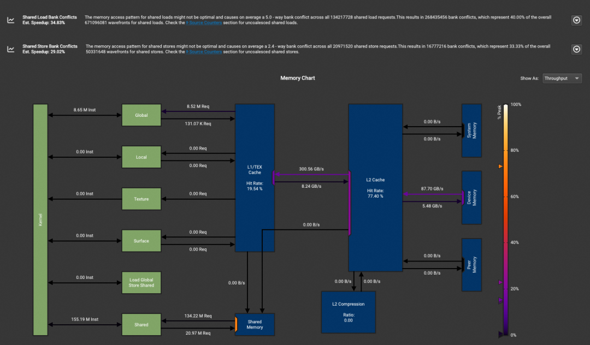

이 문제들은 다음 절에서 살펴본다.

## 8. Bank Conflict

### 8.1 Bank conflict란 무엇인가

동시 접근에서 높은 메모리 대역폭을 구현하기 위해 shared memory는 동시에 접근 가능한 동일한 크기의 memory module(Bank)로 나뉜다. 따라서 n개의 서로 다른 bank에 걸쳐 있는 주소의 데이터는 임의로 병렬 load/store할 수 있다. 단순화한 4-thread + 4-bank Warp를 예로 들어 보자. 각 warp 안의 스레드가 모두 Offset=1로 연속 데이터에 접근하면 한 번에 모두 읽을 수 있고 Bank conflict가 발생하지 않는다.


반면 Offset=2일 때는 Thread-0과 Thread-2, 그리고 Thread-1과 Thread-3이 같은 Bank의 메모리에 접근하므로 conflict가 발생해 접근 지연이 증가한다.

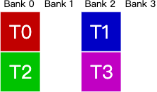

32개 스레드를 포함하는 Warp에서 Bank conflict는 다음과 같고, 왼쪽부터 오른쪽으로 Offset=1,2,3이다.

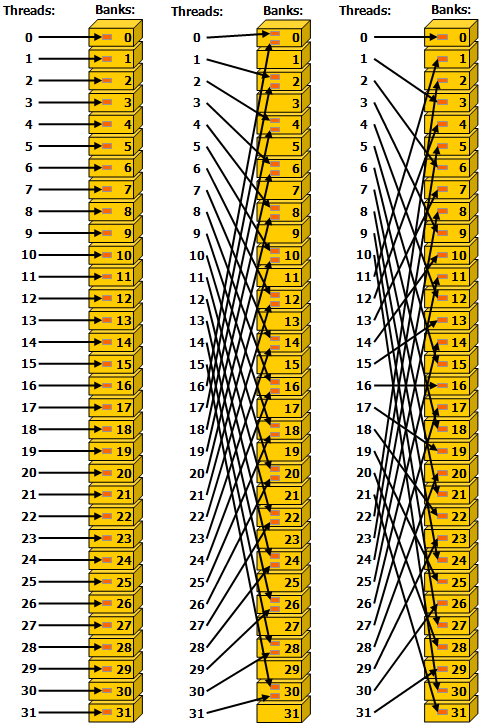

Bank conflict가 성능에 미치는 영향은 아래 그림과 같다.

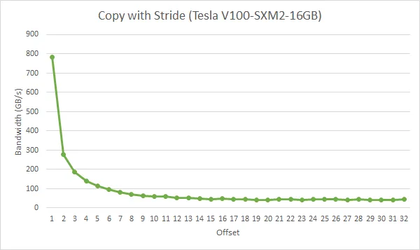

해결 방법은 스레드의 메모리 접근을 가능한 한 affinity에 맞게 배치하는 것이다. 보통 이런 기술을 Swizzle이라고 부른다. Swizzle의 더 자세한 내용은 CuTe Layout에서 설명한다.

### 8.2 Bank conflict 분석

Thread 배치를 살펴보자.
```c++
  const int threadCol = threadIdx.x % (BN / TN);
  const int threadRow = threadIdx.x / (BN / TN);
```

`BN/TN = 128/8 = 16`이므로 하나의 WARP 안의 32개 스레드에서 16개마다 같은 `threadRow`와 서로 다른 `threadCol`을 가진다.

`As` 로드 `As[dotIdx * BM + threadRow * TM + i]`에 대해 dotIdx와 i가 변하지 않을 때, 16개 스레드는 같은 주소에 접근하고 다른 16개 스레드는 Offset=TM인 주소에 접근하는 것과 같다. bank 차이는 8이며, WARP의 broadcast mechanism 때문에 Bank conflict가 발생하지 않는다.

`Bs` 로드 `Bs[dotIdx * BN + threadCol * TN + i]`에 대해서는 `threadCol`이 서로 다르므로 인접 스레드의 접근 주소 차이가 BN=8 bank가 된다. 따라서 threadIdx가 4 차이날 때마다 bank conflict가 하나 발생한다.

Simon Boehm은 여기서 하나의 수정[8]을 수행해 16열 8행 변환을 만들었다.

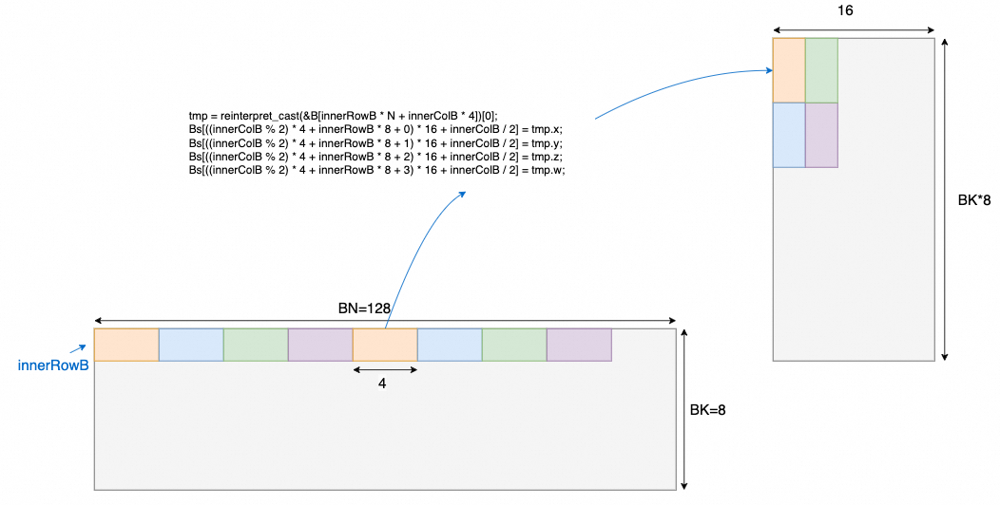
```c++
-    reinterpret_cast<float4 *>(&Bs[innerRowB * BN + innerColB * 4])[0] =
-        reinterpret_cast<float4 *>(&B[innerRowB * N + innerColB * 4])[0];

+    // "linearize" Bs while storing it
+    tmp = reinterpret_cast<float4 *>(&B[innerRowB * N + innerColB * 4])[0];
+    Bs[((innerColB % 2) * 4 + innerRowB * 8 + 0) * 16 + innerColB / 2] = tmp.x;
+    Bs[((innerColB % 2) * 4 + innerRowB * 8 + 1) * 16 + innerColB / 2] = tmp.y;
+    Bs[((innerColB % 2) * 4 + innerRowB * 8 + 2) * 16 + innerColB / 2] = tmp.z;
+    Bs[((innerColB % 2) * 4 + innerRowB * 8 + 3) * 16 + innerColB / 2] = tmp.w;

// block into registers
      for (uint i = 0; i < TM; ++i) {
        regM[i] = As[dotIdx * BM + threadRow * TM + i];
      }
      for (uint i = 0; i < TN; ++i) {
-        regN[i] = Bs[dotIdx * BN + threadCol * TN + i];
+        regN[i] = Bs[(dotIdx * 8 + i) * 16 + threadCol];
      }
```

수정 후에는 같은 Warp 안에서 `Bs[(dotIdx * 8 + i) * 16 + threadCol]`에 접근할 때 앞 16개 스레드가 읽는 원소들이 서로 1씩 차이 나고, 뒤 16개 스레드는 앞 16개와 같은 주소에 접근한다. 하지만 GMEM에서 Bs를 로드해야 하고, `Bs[((innerColB % 2) * 4 + innerRowB * 8 + 0) * 16 + innerColB / 2]`에 쓸 때는 다음 점에 주목한다.
```c++
  const uint innerRowB = threadIdx.x / (BN / 4);
  const uint innerColB = threadIdx.x % (BN / 4);
```

따라서 `threadIdx`가 1 차이날 때 실제 주소는 64개 주소만큼 차이 난다. 그러므로 여전히 Bank conflict가 있다. Profiling에서도 LD의 bank conflict는 해결됐지만 ST의 bank conflict가 아직 남아 있음을 볼 수 있다.

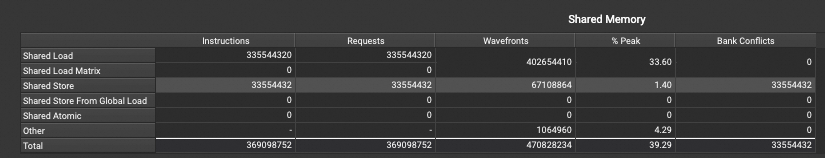

하지만 이전 Kernel과 비교하면 ST conflict가 더 높아졌다.

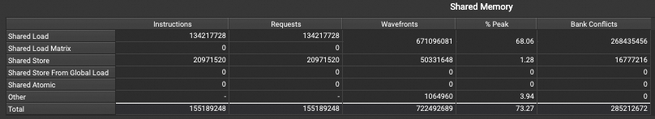

저자는 A6000에서 성능 향상을 확인했지만, A10에서 테스트해 보니 성능이 이전 Kernel보다 오히려 하락했다.

## 9. WarpTiling

앞서 설명한 Kernel에서는 세 개의 루프를 볼 수 있다.

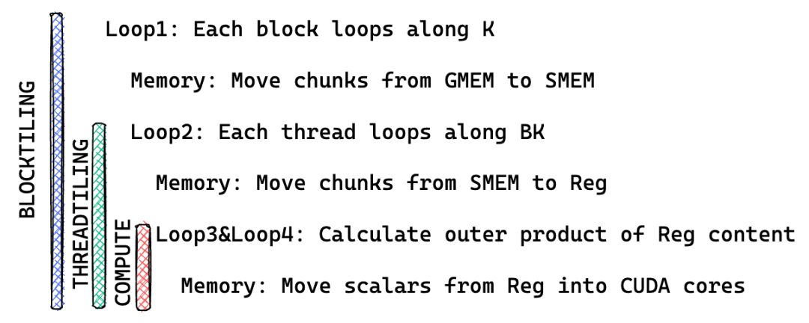

BlockTiling과 ThreadTiling은 성능을 크게 높였지만, 여전히 일부 메모리 접근 Bank conflict 문제가 존재한다. GPU 하드웨어 구조 관점에서 Warp는 SM에 매핑되고 Warp Scheduler가 이를 스케줄링한다. shared memory의 bank conflict는 같은 warp 안의 thread 사이에서만 발생한다. 따라서 이 기반 위에서 다시 한 번 Warp Tiling을 수행한다.

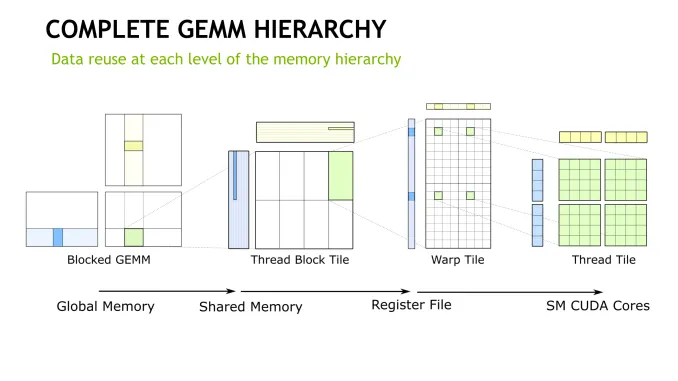

이런 방식으로 BlockTiling은 데이터를 블록으로 나누어 서로 다른 SM에 배치해 실행하고, WarpTiling은 SM 내부에서 Warp scheduler를 통해 스케줄링되도록 한다. ThreadTiling의 instruction은 같은 CUDA Core에서 instruction-level parallelism으로 실행될 수 있다.
```c++
// dotIdx loops over contents of SMEM
for (uint dotIdx = 0; dotIdx < BK; ++dotIdx) {
  // populate registers for this thread's part of the warptile
  for (uint wSubRowIdx = 0; wSubRowIdx < WMITER; ++wSubRowIdx) {
    for (uint i = 0; i < TM; ++i) {
      regM[wSubRowIdx * TM + i] =
          As[(dotIdx * BM) + warpRow * WM + wSubRowIdx * WSUBM +
             threadRowInWarp * TM + i];
    }
  }
  for (uint wSubColIdx = 0; wSubColIdx < WNITER; ++wSubColIdx) {
    for (uint i = 0; i < TN; ++i) {
      regN[wSubColIdx * TN + i] =
          Bs[(dotIdx * BN) + warpCol * WN + wSubColIdx * WSUBN +
             threadColInWarp * TN + i];
    }
  }

  // execute warptile matmul. Later this will map well to
  // warp-wide matrix instructions, executed on tensor cores.
  for (uint wSubRowIdx = 0; wSubRowIdx < WMITER; ++wSubRowIdx) {
    for (uint wSubColIdx = 0; wSubColIdx < WNITER; ++wSubColIdx) {
      // calculate per-thread results with register-cache locality
      for (uint resIdxM = 0; resIdxM < TM; ++resIdxM) {
        for (uint resIdxN = 0; resIdxN < TN; ++resIdxN) {
          threadResults[(wSubRowIdx * TM + resIdxM) * (WNITER * TN) +
                        (wSubColIdx * TN) + resIdxN] +=
              regM[wSubRowIdx * TM + resIdxM] *
              regN[wSubColIdx * TN + resIdxN];
        }
      }
    }
  }
}
```

각 WARP는 `(WSUBN * WNITER) x (WSUBM * WMITER)` 블록을 계산하고, 각 스레드는 `WNITER * WMITER`개의 `TM*TN` 블록을 계산한다.

여기서 `WM=32`, `WN=64`는 행렬 C를 Warp 기준으로 fragment한 크기를 의미한다. warp 배치는 다음과 같다.
```c++
  const uint warpIdx = threadIdx.x / WARPSIZE;
  const uint warpCol = warpIdx % (BN / WN);
  const uint warpRow = warpIdx / (BN / WN);
```

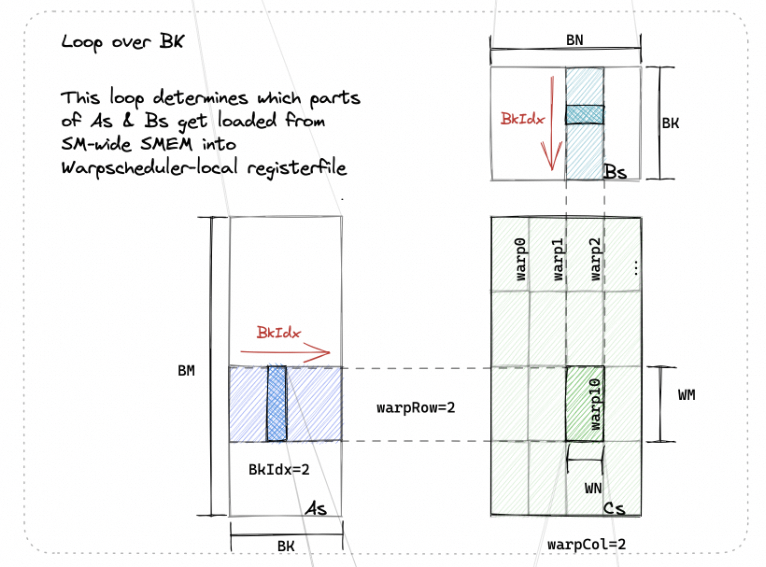

`WNITER=4`, `WMITER = (WM * WN) / (WARPSIZE * TM * TN * WNITER)`이며 WarpTile 안에서는 `WMITER`와 `WNITER`에 따라 반복한다. `WSUBM = WM / WMITER (32/2 = 16)`, `WSUBN = WN / WNITER (64/2 = 32)`는 WARP가 매 반복에서 M과 N 차원에서 처리해야 하는 원소 수를 나타낸다.
```c++
  // size of the warp subtile
  constexpr uint WMITER = (WM * WN) / (WARPSIZE * TM * TN * WNITER);
  constexpr uint WSUBM = WM / WMITER; // 64/2=32
  constexpr uint WSUBN = WN / WNITER; // 32/2=16
```

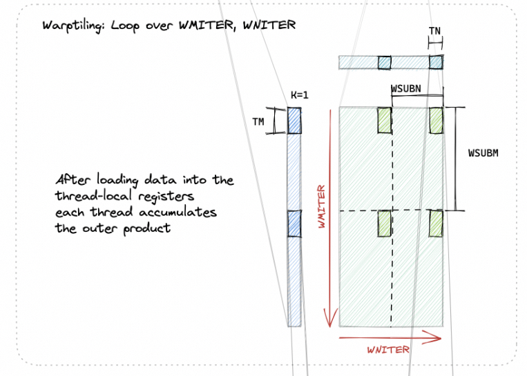

각 스레드는 WARPTile 안에서 다음과 같이 index를 계산한다.
```c++
  // Placement of the thread in the warp subtile
  const uint threadIdxInWarp = threadIdx.x % WARPSIZE;         // [0, 31]
  const uint threadColInWarp = threadIdxInWarp % (WSUBN / TN); // i%(16/4)
  const uint threadRowInWarp = threadIdxInWarp / (WSUBN / TN); // i/4
```

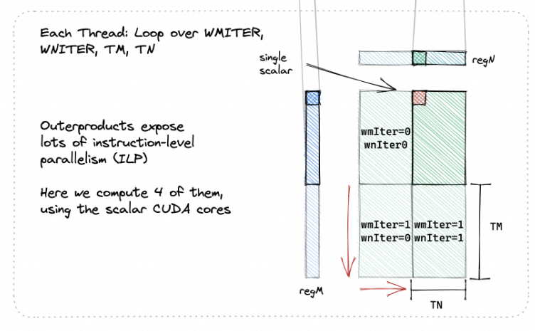

스레드 내부 처리 함수는 다음과 같다.
```c++
template <const int BM, const int BN, const int BK, const int rowStrideA,
          const int rowStrideB>
__device__ void loadFromGmem(int N, int K, const float *A, const float *B,
                             float *As, float *Bs, int innerRowA, int innerColA,
                             int innerRowB, int innerColB) {
  for (uint offset = 0; offset + rowStrideA <= BM; offset += rowStrideA) {
    const float4 tmp = reinterpret_cast<const float4 *>(
        &A[(innerRowA + offset) * K + innerColA * 4])[0];
    As[(innerColA * 4 + 0) * BM + innerRowA + offset] = tmp.x;
    As[(innerColA * 4 + 1) * BM + innerRowA + offset] = tmp.y;
    As[(innerColA * 4 + 2) * BM + innerRowA + offset] = tmp.z;
    As[(innerColA * 4 + 3) * BM + innerRowA + offset] = tmp.w;
  }

  for (uint offset = 0; offset + rowStrideB <= BK; offset += rowStrideB) {
    reinterpret_cast<float4 *>(
        &Bs[(innerRowB + offset) * BN + innerColB * 4])[0] =
        reinterpret_cast<const float4 *>(
            &B[(innerRowB + offset) * N + innerColB * 4])[0];
  }
}
```

데이터 로드 시 Offset 루프가 추가되었다.
```c++
  const uint innerRowA = threadIdx.x / (BK / 4);
  const uint innerColA = threadIdx.x % (BK / 4);
  constexpr uint rowStrideA = (NUM_THREADS * 4) / BK;
  const uint innerRowB = threadIdx.x / (BN / 4);
  const uint innerColB = threadIdx.x % (BN / 4);
  constexpr uint rowStrideB = NUM_THREADS / (BN / 4);
```

GMEM 로드에 대해 주의해야 할 점은 `As`의 threadIdx가 1 차이 나면 innerColA도 1 차이 나므로 `(innerColA * 4 + 0) * BM`이 `4* BM= 512`가 되어 같은 bank에 대응한다는 것이다. 따라서 Bank conflict가 발생한다.
```c++
template <const int BM, const int BN, const int BK, const int WM, const int WN,
          const int WMITER, const int WNITER, const int WSUBM, const int WSUBN,
          const int TM, const int TN>
__device__ void
processFromSmem(float *regM, float *regN, float *threadResults, const float *As,
                const float *Bs, const uint warpRow, const uint warpCol,
                const uint threadRowInWarp, const uint threadColInWarp) {
  for (uint dotIdx = 0; dotIdx < BK; ++dotIdx) {
    // populate registers for whole warptile
    for (uint wSubRowIdx = 0; wSubRowIdx < WMITER; ++wSubRowIdx) {
      for (uint i = 0; i < TM; ++i) {
        regM[wSubRowIdx * TM + i] =
            As[(dotIdx * BM) + warpRow * WM + wSubRowIdx * WSUBM +
               threadRowInWarp * TM + i];
      }
    }
    for (uint wSubColIdx = 0; wSubColIdx < WNITER; ++wSubColIdx) {
      for (uint i = 0; i < TN; ++i) {
        regN[wSubColIdx * TN + i] =
            Bs[(dotIdx * BN) + warpCol * WN + wSubColIdx * WSUBN +
               threadColInWarp * TN + i];
      }
    }

    // execute warptile matmul
    for (uint wSubRowIdx = 0; wSubRowIdx < WMITER; ++wSubRowIdx) {
      for (uint wSubColIdx = 0; wSubColIdx < WNITER; ++wSubColIdx) {
        // calculate per-thread results
        for (uint resIdxM = 0; resIdxM < TM; ++resIdxM) {
          for (uint resIdxN = 0; resIdxN < TN; ++resIdxN) {
            threadResults[(wSubRowIdx * TM + resIdxM) * (WNITER * TN) +
                          (wSubColIdx * TN) + resIdxN] +=
                regM[wSubRowIdx * TM + resIdxM] *
                regN[wSubColIdx * TN + resIdxN];
          }
        }
      }
    }
  }
}
```

전체 flowchart는 아래와 같다.

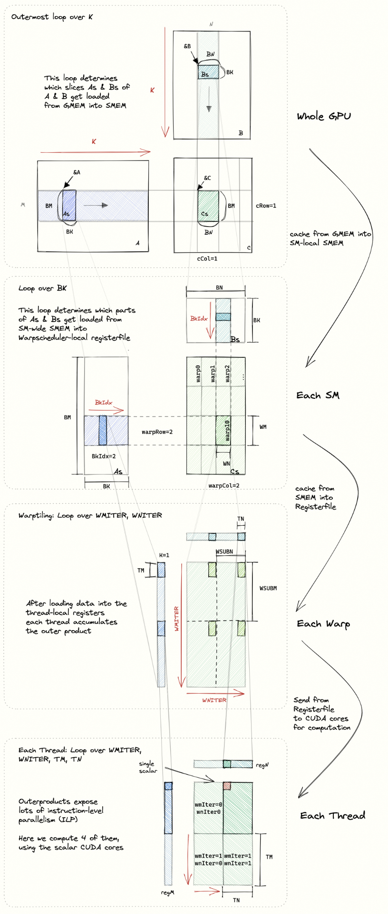
```c++
/*
 * @tparam BM The threadblock size for M dimension SMEM caching.
 * @tparam BN The threadblock size for N dimension SMEM caching.
 * @tparam BK The threadblock size for K dimension SMEM caching.
 * @tparam WM M dim of continuous tile computed by each warp
 * @tparam WN N dim of continuous tile computed by each warp
 * @tparam WMITER The number of subwarp tiling steps in M dimension.
 * @tparam WNITER The number of subwarp tiling steps in N dimension.
 * @tparam TM The per-thread tile size for M dimension.
 * @tparam TN The per-thread tile size for N dimension.
 */
template <const int BM, const int BN, const int BK, const int WM, const int WN,
          const int WNITER, const int TM, const int TN, const int NUM_THREADS>
__global__ void __launch_bounds__(NUM_THREADS)
    sgemmWarptiling(int M, int N, int K, float alpha, float *A, float *B,
                    float beta, float *C) {
  const uint cRow = blockIdx.y;
  const uint cCol = blockIdx.x;

  // Thread BlockTile 안에 Warp 배치
  const uint warpIdx = threadIdx.x / WARPSIZE; // the warp this thread is in
  const uint warpCol = warpIdx % (BN / WN);
  const uint warpRow = warpIdx / (BN / WN);

  // size of the warp subtile
  constexpr uint WMITER = (WM * WN) / (WARPSIZE * TM * TN * WNITER);
  constexpr uint WSUBM = WM / WMITER; // 64/2=32
  constexpr uint WSUBN = WN / WNITER; // 32/2=16

  // Warp SubTile 안에 Thread 배치
  const uint threadIdxInWarp = threadIdx.x % WARPSIZE;         // [0, 31]
  const uint threadColInWarp = threadIdxInWarp % (WSUBN / TN); // i%(16/4)
  const uint threadRowInWarp = threadIdxInWarp / (WSUBN / TN); // i/4

  // SMEM 할당
  __shared__ float As[BM * BK];
  __shared__ float Bs[BK * BN];

  // Move blocktile to beginning of A's row and B's column
  A += cRow * BM * K;
  B += cCol * BN;
  // Move C_ptr to warp's output tile
  C += (cRow * BM + warpRow * WM) * N + cCol * BN + warpCol * WN;

  // calculating the indices that this thread will load into SMEM
  // we'll load 128bit / 32bit = 4 elements per thread at each step
  const uint innerRowA = threadIdx.x / (BK / 4);
  const uint innerColA = threadIdx.x % (BK / 4);
  constexpr uint rowStrideA = (NUM_THREADS * 4) / BK;
  const uint innerRowB = threadIdx.x / (BN / 4);
  const uint innerColB = threadIdx.x % (BN / 4);
  constexpr uint rowStrideB = NUM_THREADS / (BN / 4);

  // allocate thread-local cache for results in registerfile
  float threadResults[WMITER * TM * WNITER * TN] = {0.0};

  // we cache into registers on the warptile level
  float regM[WMITER * TM] = {0.0};
  float regN[WNITER * TN] = {0.0};

  // outer-most loop over block tiles
  for (uint bkIdx = 0; bkIdx < K; bkIdx += BK) {
    wt::loadFromGmem<BM, BN, BK, rowStrideA, rowStrideB>(
        N, K, A, B, As, Bs, innerRowA, innerColA, innerRowB, innerColB);
    __syncthreads();

    wt::processFromSmem<BM, BN, BK, WM, WN, WMITER, WNITER, WSUBM, WSUBN, TM,
                        TN>(regM, regN, threadResults, As, Bs, warpRow, warpCol,
                            threadRowInWarp, threadColInWarp);
    A += BK;     // move BK columns to right
    B += BK * N; // move BK rows down
    __syncthreads();
  }

  // write out the results
  for (uint wSubRowIdx = 0; wSubRowIdx < WMITER; ++wSubRowIdx) {
    for (uint wSubColIdx = 0; wSubColIdx < WNITER; ++wSubColIdx) {
      // move C pointer to current warp subtile
      float *C_interim = C + (wSubRowIdx * WSUBM) * N + wSubColIdx * WSUBN;
      for (uint resIdxM = 0; resIdxM < TM; resIdxM += 1) {
        for (uint resIdxN = 0; resIdxN < TN; resIdxN += 4) {
          // load C vector into registers
          float4 tmp = reinterpret_cast<float4 *>(
              &C_interim[(threadRowInWarp * TM + resIdxM) * N +
                         threadColInWarp * TN + resIdxN])[0];
          // perform GEMM update in reg
          const int i = (wSubRowIdx * TM + resIdxM) * (WNITER * TN) +
                        wSubColIdx * TN + resIdxN;
          tmp.x = alpha * threadResults[i + 0] + beta * tmp.x;
          tmp.y = alpha * threadResults[i + 1] + beta * tmp.y;
          tmp.z = alpha * threadResults[i + 2] + beta * tmp.z;
          tmp.w = alpha * threadResults[i + 3] + beta * tmp.w;
          // write back
          reinterpret_cast<float4 *>(
              &C_interim[(threadRowInWarp * TM + resIdxM) * N +
                         threadColInWarp * TN + resIdxN])[0] = tmp;
        }
      }
    }
  }
}
void launch_gemm(int M, int N, int K, float alpha, float *A,
                 float *B, float beta, float *C)
{

  const uint NUM_THREADS = 128;
  const uint BN = 128;
  const uint BM = 128;
  const uint BK = 16;
  const uint WN = 64;
  const uint WM = 64;
  const uint WNITER = 4;
  const uint TN = 4;
  const uint TM = 8;
  dim3 blockDim(NUM_THREADS);

  constexpr uint NUM_WARPS = NUM_THREADS / 32;
  dim3 gridDim(CEIL_DIV(N, BN), CEIL_DIV(M, BM));
  sgemmWarptiling<BM, BN, BK, WM, WN, WNITER, TM,
                  TN, NUM_THREADS>
      <<<gridDim, blockDim>>>(M, N, K, alpha, A, B, beta, C);
}
```

WARPTiling 기반 성능은 A10 테스트 결과 14766.3GFlops로, 이미 cuBLAS 결과와 거의 동일하다.

## 10. Double Buffering

이전 Kernel에서는 데이터 로드와 처리가 여전히 동기식 blocking mode였다.
```c++
  // outer-most loop over block tiles
  for (uint bkIdx = 0; bkIdx < K; bkIdx += BK) {
    // 데이터 로드
    wt::loadFromGmem<BM, BN, BK, rowStrideA, rowStrideB>(
        N, K, A, B, As, Bs, innerRowA, innerColA, innerRowB, innerColB);
    __syncthreads();

    // 동기식 blocking 후 데이터 처리
    wt::processFromSmem<BM, BN, BK, WM, WN, WMITER, WNITER, WSUBM, WSUBN, TM,
                        TN>(regM, regN, threadResults, As, Bs, warpRow, warpCol,
                            threadRowInWarp, threadColInWarp);
    A += BK;     // move BK columns to right
    B += BK * N; // move BK rows down
    __syncthreads();
  }
```

그렇다면 두 개의 버퍼(double buffering)를 사용해 번갈아 로드할 수 있지 않을까?

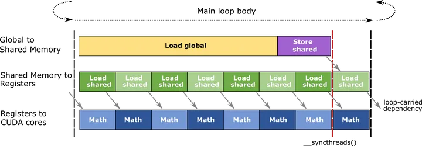

이 내용은 다음 절에서 TensorCore를 소개할 때 펼쳐 보겠다.

## 부록. Nsight Compute Profiling 도구

예를 들어 basic\_gemm kernel을 5회 profile해야 한다면 `-k <kernel-name> -c <num>` 인자를 붙일 수 있다. 아래와 같다.
```
# ncu --set full -k basic_gemm -c 5  -o  native ./native
==PROF== Connected to process 947606 (/data/cuda/gemm/native)
==PROF== Profiling "basic_gemm": 0%....50%....100% - 37 passes
==PROF== Profiling "basic_gemm": 0%....50%....100% - 37 passes
==PROF== Profiling "basic_gemm": 0%....50%....100% - 37 passes
==PROF== Profiling "basic_gemm": 0%....50%....100% - 37 passes
==PROF== Profiling "basic_gemm": 0%....50%....100% - 37 passes

AveragePerformance     42.7145 Gflops
==PROF== Disconnected from process 947606
==PROF== Report: /data/cuda/gemm/native.ncu-rep
```

실행이 끝난 뒤 생성된 `native.ncu-rep` 파일을 로컬로 내려받아 Nsight-Compute에서 열어 분석할 수 있다. 여기에는 GPU 메모리와 계산 throughput의 Roofline 분석이 포함되어 있다.

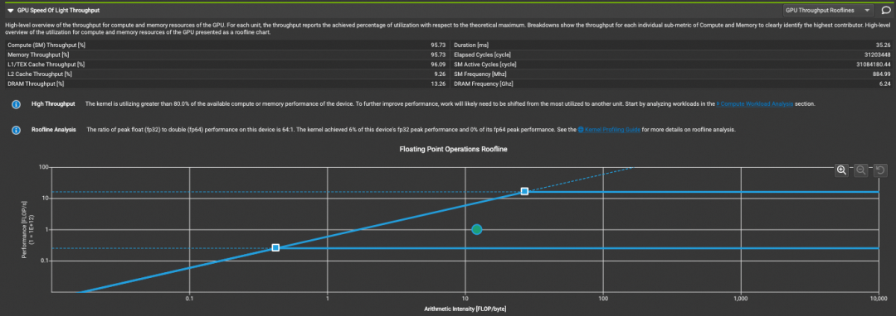

메모리 접근 분석

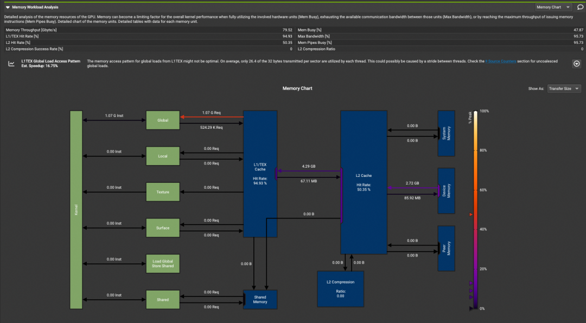

관련 instruction 분석

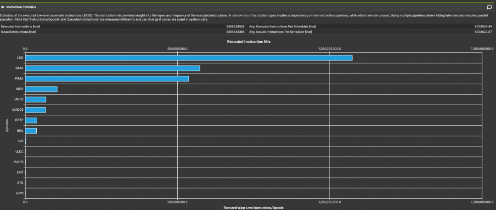

Scheduler와 Warp Stall 통계

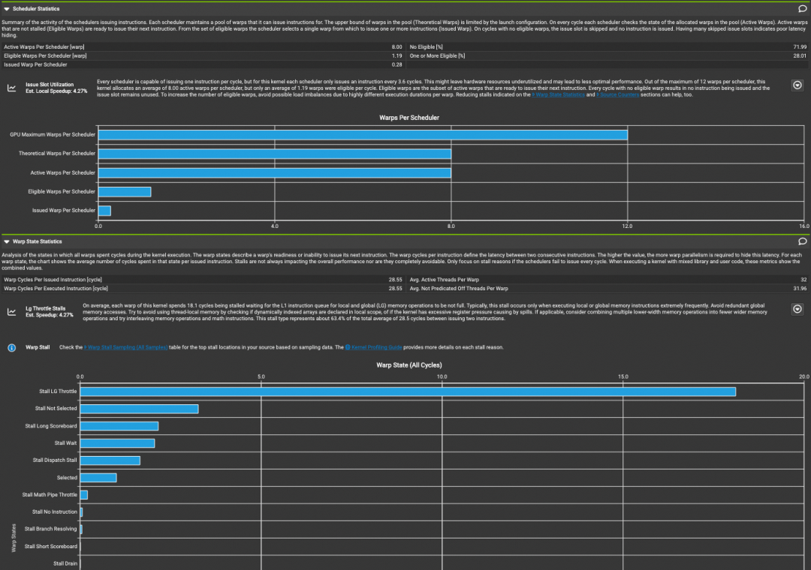

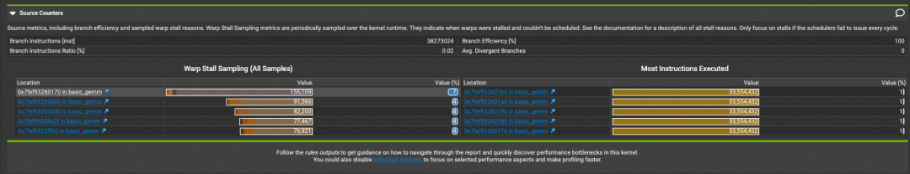

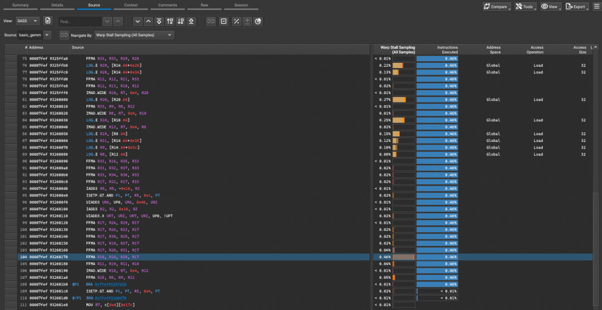

참고 자료

[1]

How to Optimize a CUDA Matmul Kernel for cuBLAS-like Performance: a Worklog: https://siboehm.com/articles/22/CUDA-MMM

[2]

CUDA 행렬 곱셈 궁극 최적화 가이드: https://zhuanlan.zhihu.com/p/410278370

[3]

CUDA SGEMM 행렬 곱셈 최적화 노트 - 입문부터 cublas까지: https://zhuanlan.zhihu.com/p/518857175

[4]

[작성 중] CUDA GEMM 이론 성능 분석과 kernel 최적화: https://zhuanlan.zhihu.com/p/441146275

[5]

CUDA Matrix Multiplication Optimization: https://leimao.github.io/article/CUDA-Matrix-Multiplication-Optimization/

[6]

쉽게 풀어 보는 GPU 최적화: https://www.zhihu.com/column/c\_1437330196193640448

[7]

SMEM Bandwidth benchmark: https://github.com/Yinghan-Li/YHs\_Sample/blob/master/cuda/microbenchmark/smem\_bandwidth.cu

[8]

kernel-7 for bank conflict(linear: https://github.com/siboehm/SGEMM\_CUDA/blob/master/src/kernels/7\_kernel\_resolve\_bank\_conflicts.cuh
