# Tensor-003 TensorCore 아키텍처

- 원문 제목: Tensor-003 TensorCore 아키텍처
- 저자: 자보터의 지우개
- 계정: zartbot
- 발행일: 2024년 8월 3일 17:38

시간을 2016년으로 되돌려 보자. Google이 TPU를 발표한 뒤(내부에서는 이미 1년 넘게 사용하고 있었다), 같은 시기에 NVIDIA가 발표한 Pascal 아키텍처는 완전히 밀렸다. Volta 세대의 아키텍처 계획은 2013년에 시작됐고, 아마 2015년 무렵 TPU 소식을 접한 뒤 전체 아키텍처를 수정했을 가능성이 있다. 결국 2017년에야 출시됐고, 추가된 1세대 TensorCore도 상당히 급하게 들어간 것이어서 문제도 적지 않았다.

TensorCore의 진화는 다음과 같다.

| Arch | Dtype | SM당 TC | TC m,n,k | 희소성 | 메모리 접근 | 지원 instruction |
| --- | --- | --- | --- | --- | --- | --- |
| Volta(SM70) | FP16 | 8 | 4 x 4 x 4 | No | N/A | mma |
| Turing(SM75) | FP16,INT8,INT4,Binary | 8 | 4 x 4 x 4 | No | ldmatrix | mma,ldmatrix |
| Ampere(SM80) | FP16,BF16,TF32,FP64,INT8,INT4,Binary | 4 | 8 x 4 x 8 | Yes | async Copy | mma,ldmatrix, mma.sp |
| Hopper(SM90) | FP16,BF16,TF32,FP64,INT8,Binary | 4 | 8 x 4 x 16 | Yes | TMA | mma,ldmatrix, mma.sp  ,wgmma |

가장 초기의 FMA instruction부터 vectorized DP4A, Volta(SM70)의 1세대 TensorCore, 그리고 Ampere/Hopper에 이르기까지 행렬 곱셈 규모를 키우고 계산/메모리 접근 비율을 높이며 동시에 더 낮은 정밀도의 데이터 형식을 지원해 왔다는 것을 볼 수 있다.

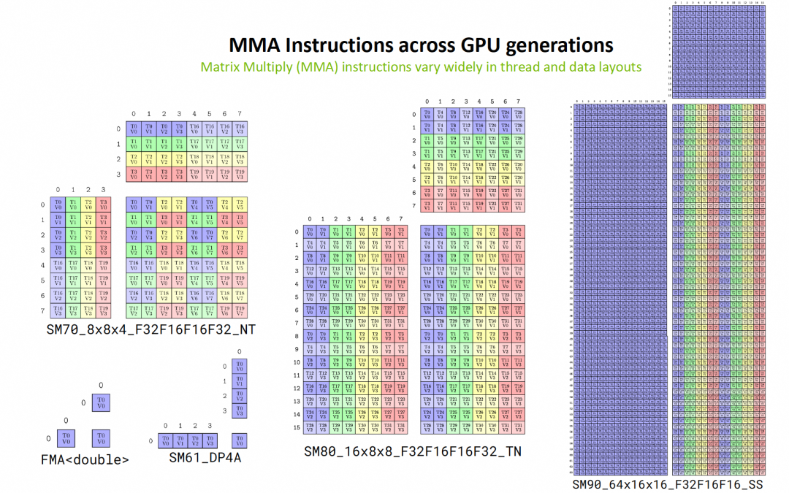

오늘날의 TensorCore도 SIMT 아키텍처 아래에서는 여전히 많은 문제가 있다. 이후 글에서 자세히 분석할 것이다. 이 글의 목차는 다음과 같다.

```
1. TensorCore 개요
1.1 16x16x16 행렬 곱셈
1.2 V100 TensorCore 아키텍처
1.2.1 HMMA.884 구현
1.2.2 TensorCore 아키텍처 추정
1.2.3 데이터 로드

2. TensorCore 진화
2.1 Turing 2세대 TensorCore
2.1.1 HMMA.1688
2.1.2 LDMATRIX
2.2 Ampere 3세대 TensorCore
2.2.1 HMMA.16816
2.2.2 비동기 copy
2.2.3 희소 행렬
2.3 Hopper 4세대 TensorCore
2.3.1 DSMEM
2.3.2 TMA
2.3.2.1 cp.async.bulk
2.3.2.2 cp.reduce.async.bulk
2.3.2.3 cp.async.bulk.prefetch
2.3.2.4 Tensor 기반 cp.async.buk
2.3.2.5 TMA 프로그래밍
2.3.3 WGMMA
```

## 1. Tensor Core 개요

하나의 $M,N,K$ 행렬 곱셈에 대해 계산량은 $C= 2\times M \times N \times K \sim \mathcal O(N^3)$이고, 메모리 접근량은 $D = M \times K + K \times N + 2 \times M \times N \sim \mathcal O(N^2)$이다. 계산/메모리 접근 비율은 $C/D \sim \mathcal O(N)$이다. 문제를 단순화해 $M=N=K$인 경우를 생각하면 계산/메모리 접근 비율은 $N/2$가 되므로, 데이터 저장과 접근 시 reuse가 매우 필요하다.

하나의 Warp 안에서는 Thread 계산 효율을 더 병렬적으로 높일 수 있다. 특히 WarpLevel의 register file reuse 측면에서 그렇다. 이것이 Tensor Core가 탄생한 이유다. 1세대 TensorCore는 Volta 아키텍처에서 등장했다.

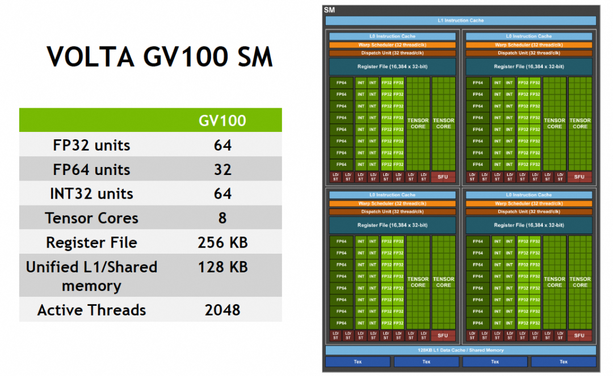

앞서 말했듯이 이는 Google TPU가 기존 SIMT 아키텍처에 가한 압박에 대응하기 위한 일종의 패치였다. 추가로 systolic array와 유사한 행렬 곱셈 계산 유닛을 배치했다.

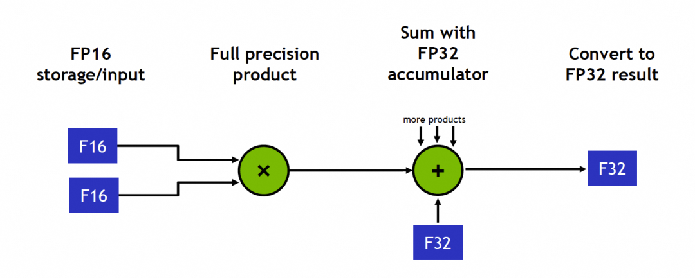

TensorCore 안에서는 4x4x4 행렬 곱셈을 구현했다.

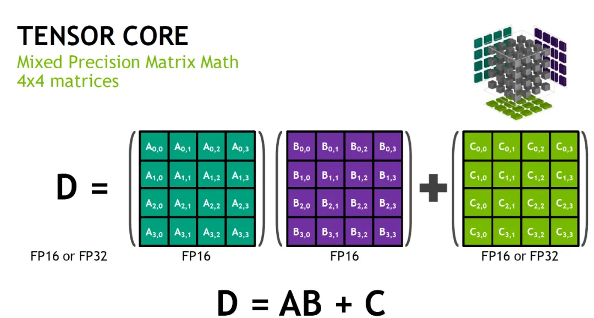

TensorCore가 아주 새로운 것은 아니다. SGI가 구현했던 Geometry Engine을 기억하는가? 1980년에 이미 register를 조작하는 LoadMM, MultMM, PushMM, PopMM, SotreMM 같은 일련의 instruction set을 제공해 4x4 행렬 연산을 처리했다. NVIDIA도 비슷하게 `ldmatrix`, `stmatrix`, `movmatrix`, `mma` 몇 가지 instruction을 제공하고, 이를 CUDA에서 wmma API로 감쌌다.

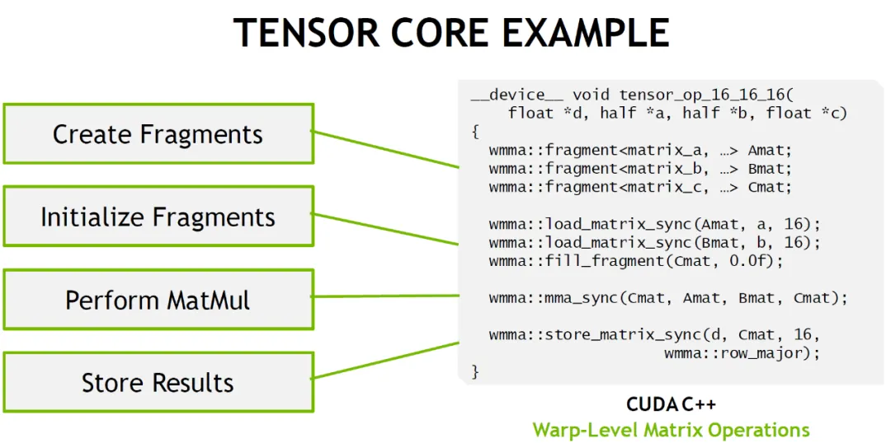

`wmma::fragment`로 structure를 정의하고, `wmma::load_matrix`로 데이터를 로드한 뒤 `wmma::mma_sync`로 행렬 곱셈을 계산하고, 마지막으로 `wmma::store_matrix_sync`로 데이터를 저장한다.

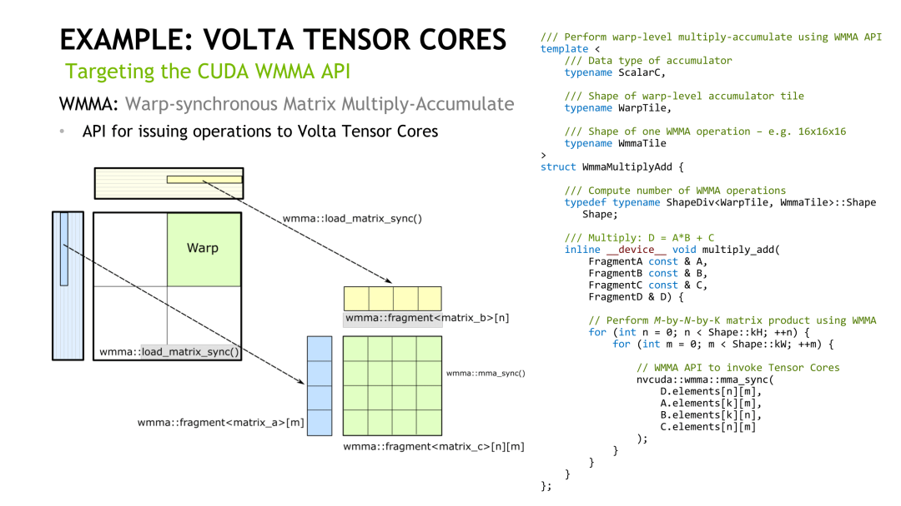

주의해야 할 점은 이 instruction들이 Warp-Level이라는 것이다. 따라서 Tensor-Core에서는 Warp-Level scheduling이 필요하다.

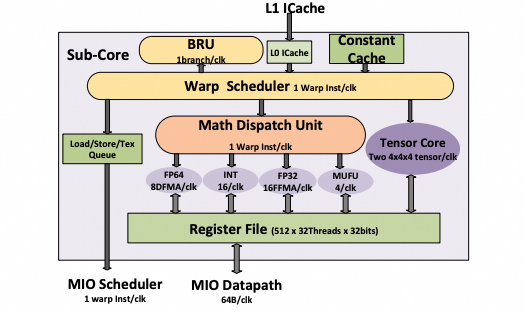

### 1.1 16x16x16 행렬 곱셈

공식 소개에서 TensorCore는 4x4 행렬 곱셈이지만, CUDA C++ 레벨에 노출된 API 관점에서는 16x16의 전체 Warp 동기 연산이다. 대응하는 PTX instruction은 `wmma.mma.sync.aligned.{alayout}.{blayout}.m16n16k16`이다.

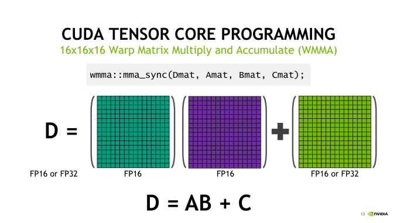

Volta의 TensorCore 관점에서 보면, 한 Cycle에 4×4 행렬 곱셈 누산(MACC, matrix-multiply-and-accumulation) 연산, 즉 D = A × B + C를 한 번 완료할 수 있다. 16x16 행렬 곱셈은 16개의 4x4 부분 행렬 블록 곱셈으로 분해할 수 있고, 누적으로 64회의 TensorCore MACC 연산이 필요하며, 계산 과정은 동기식 blocking 방식으로 완료된다.

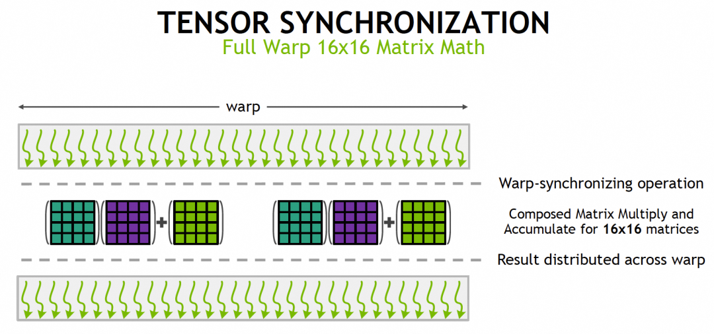

실제 실행 방식은 테스트 코드 한 조각으로 분석해 보자.

```c++
#include <cuda_fp16.h>
#include <mma.h>
using namespace nvcuda;

__global__ void test_wmma(half  *C, half *A, half *B)
{
        wmma::fragment<wmma::matrix_a, 16, 16, 16, __half, wmma::row_major> a_frag;
        wmma::fragment<wmma::matrix_b, 16, 16, 16, __half, wmma::col_major> b_frag;
        wmma::fragment<wmma::accumulator, 16, 16, 16, __half> acc_frag;

        wmma::load_matrix_sync( a_frag, A, 16 );
        wmma::load_matrix_sync( b_frag, B, 16 );
        wmma::fill_fragment( acc_frag, 0.0f );

        wmma::mma_sync( acc_frag, a_frag, b_frag, acc_frag );
        wmma::store_matrix_sync( C, acc_frag, 16, wmma::mem_row_major );
}
```

컴파일해서 PTX instruction을 dump하면 호출되는 것이 m16n16k16의 mma.sync 곱셈 instruction임을 볼 수 있다.

```c++
nvcc -c -arch sm_70 --ptx  tmp2.cu
.visible .entry _Z9test_wmmaP6__halfS0_S0_(
	.param .u64 _Z9test_wmmaP6__halfS0_S0__param_0,
	.param .u64 _Z9test_wmmaP6__halfS0_S0__param_1,
	.param .u64 _Z9test_wmmaP6__halfS0_S0__param_2
)
{
	.reg .b16 	%rs<2>;
	.reg .f32 	%f<2>;
	.reg .b32 	%r<23>;
	.reg .b64 	%rd<7>;


	ld.param.u64 	%rd1, [_Z9test_wmmaP6__halfS0_S0__param_0];
	ld.param.u64 	%rd2, [_Z9test_wmmaP6__halfS0_S0__param_1];
	ld.param.u64 	%rd3, [_Z9test_wmmaP6__halfS0_S0__param_2];
	cvta.to.global.u64 	%rd4, %rd3;
	cvta.to.global.u64 	%rd5, %rd2;
	mov.u32 	%r1, 16;
	wmma.load.a.sync.aligned.row.m16n16k16.global.f16 	{%r2, %r3, %r4, %r5, %r6, %r7, %r8, %r9}, [%rd5], %r1;
	wmma.load.b.sync.aligned.col.m16n16k16.global.f16 	{%r10, %r11, %r12, %r13, %r14, %r15, %r16, %r17}, [%rd4], %r1;
	mov.f32 	%f1, 0f00000000;
	// begin inline asm
	{  cvt.rn.f16.f32 %rs1, %f1;}

	// end inline asm
	mov.b32 	%r18, {%rs1, %rs1};
	cvta.to.global.u64 	%rd6, %rd1;
	wmma.mma.sync.aligned.row.col.m16n16k16.f16.f16 {%r19, %r20, %r21, %r22}, {%r2, %r3, %r4, %r5, %r6, %r7, %r8, %r9}, {%r10, %r11, %r12, %r13, %r14, %r15, %r16, %r17}, {%r18, %r18, %r18, %r18};
	wmma.store.d.sync.aligned.row.m16n16k16.global.f16 	[%rd6], {%r19, %r20, %r21, %r22}, %r1;
	ret;

}
```

SASS를 보면 V100에서 실제 실행 유닛은 m8n8k4(`HMMA.884`)이다. 이는 MMA instruction을 4개 그룹(SET)으로 나누며, Accumulator가 FP16일 때 각 SET은 2개 STEP이고, Accumulator가 FP32일 때는 4개 STEP이 필요하다.

```c++
 nvcc -c -arch sm_70 tmp2.cu ; cuobjdump -sass tmp2.o | grep HMMA
        /*01a0*/                   HMMA.884.F16.F16.STEP0 R20, R12.reuse.ROW, R16.reuse.COL, RZ ;   /* 0x000000100c147236 */
        /*01b0*/                   HMMA.884.F16.F16.STEP1 R22, R12.ROW, R16.COL, RZ ;               /* 0x000000100c167236 */
        /*01c0*/                   HMMA.884.F16.F16.STEP0 R12, R14.reuse.ROW, R18.reuse.COL, R20 ;  /* 0x000000120e0c7236 */
        /*01d0*/                   HMMA.884.F16.F16.STEP1 R14, R14.ROW, R18.COL, R22 ;              /* 0x000000120e0e7236 */
        /*01e0*/                   HMMA.884.F16.F16.STEP0 R12, R4.reuse.ROW, R8.reuse.COL, R12 ;    /* 0x00000008040c7236 */
        /*01f0*/                   HMMA.884.F16.F16.STEP1 R14, R4.ROW, R8.COL, R14 ;                /* 0x00000008040e7236 */
        /*0210*/                   HMMA.884.F16.F16.STEP0 R12, R6.reuse.ROW, R10.reuse.COL, R12 ;   /* 0x0000000a060c7236 */
        /*0230*/                   HMMA.884.F16.F16.STEP1 R14, R6.ROW, R10.COL, R14 ;               /* 0x0000000a060e7236 */
```

더 새로운 TensorCore에서는 Turing 아키텍처가 `HMMA.1688` 행렬 곱셈을 지원하고, Ampere와 Hopper는 `HMMA.16816` 곱셈을 지원한다.

```c++
//Turing
nvcc -c -arch sm_75 tmp2.cu ; cuobjdump -sass tmp2.o | grep HMMA
        /*0120*/                   HMMA.1688.F16 R16, R8, R0, RZ ;                            /* 0x000000000810723c */
        /*0130*/                   HMMA.1688.F16 R18, R8, R13, RZ ;                           /* 0x0000000d0812723c */
        /*0150*/                   HMMA.1688.F16 R16, R10, R12, R16 ;                         /* 0x0000000c0a10723c */
        /*0170*/                   HMMA.1688.F16 R18, R10, R14, R18 ;                         /* 0x0000000e0a12723c */

//Ampere
nvcc -c -arch sm_80 tmp2.cu ; cuobjdump -sass tmp2.o | grep HMMA
        /*0130*/                   HMMA.16816.F16 R12, R4.reuse, R12, RZ ;                    /* 0x0000000c040c723c */
        /*0140*/                   HMMA.16816.F16 R14, R4, R14, RZ ;                          /* 0x0000000e040e723c */

//Hopper
nvcc -c -arch sm_90 tmp2.cu ; cuobjdump -sass tmp2.o | grep HMMA
        /*0160*/                   HMMA.16816.F16 R12, R4, R12, RZ ;                /* 0x0000000c040c723c */
        /*0170*/                   HMMA.16816.F16 R14, R4, R14, RZ ;                /* 0x0000000e040e723c */

```

이제 세대별로 이러한 TensorCore 변화를 분석해 보겠다.

### 1.2 V100 TensorCore 아키텍처

《Modeling Deep Learning Accelerator Enabled GPUs》[1]에서는 Volta 계열 TensorCore를 어느 정도 자세히 분석했다. 그 밖에도 NVIDIA 논문 《Automatic Kernel Generation for Volta Tensor Cores》[2]가 있으며, NVIDIA PTX instruction set[3]에도 자세한 설명이 있다.

#### 1.2.1 HMMA.884 구현

16x16 행렬 하나를 WARP의 32개 스레드에 평균적으로 분배하면 각 스레드는 저장을 위해 8개의 register가 필요하다. 하나의 WARP 안에서 thread id는 `%laneid` register로 표현되고 값 범위는 `[0,31]`이다. V100에서는 스레드 4개마다 하나의 그룹(ThreadGroup)으로 나눈다. 즉 0−3, 4−7, 8−11, 12−15, 16−19, 20−23, 24−27, 28−31이다. 그런 다음 4개씩 묶인 스레드 그룹을 pair로 만들며, NVIDIA 문서에서는 이를 `Quad Pair(QP)`라고 부른다. 예를 들어 QP0은 0-3,16-19를 포함하고 QP1은 4-7,20-23을 포함한다. 아래 표와 같다.

| %laneid | QP | ThreadGroup |
| --- | --- | --- |
| 0~3 | 0 | 0 |
| 4~7 | 1 | 1 |
| 8~11 | 2 | 2 |
| 12~15 | 3 | 3 |
| 16~19 | 0 | 4 |
| 20~23 | 1 | 5 |
| 24~27 | 2 | 6 |
| 28~31 | 3 | 7 |

HMMA.884 instruction은 QP 위에서 로드된다. 아래와 같다.

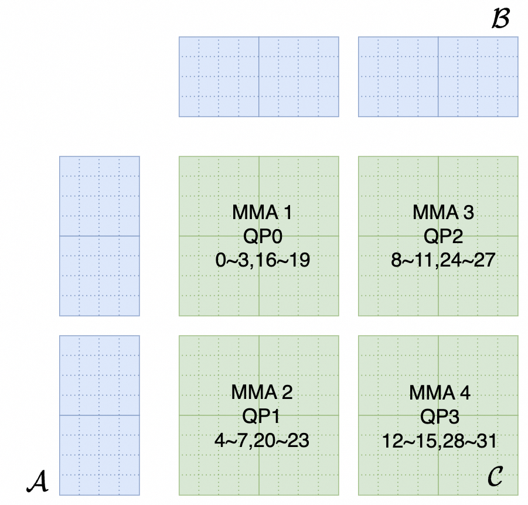

단일 Warp-Level은 실제로 4개 QP의 HMMA.884를 실행한다. 그런 다음 외적 방식으로 행렬 곱셈을 구해, 4개 Warp-Level의 HMMA.884(SET0~SET3)를 누적하면 16x16x16 연산을 완료할 수 있다.

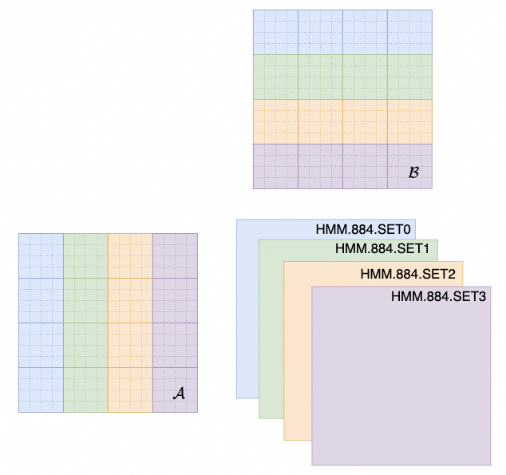

구체적인 HMMA.884 곱셈을 다시 보자. QP0을 예로 들면 아래 그림과 같다.

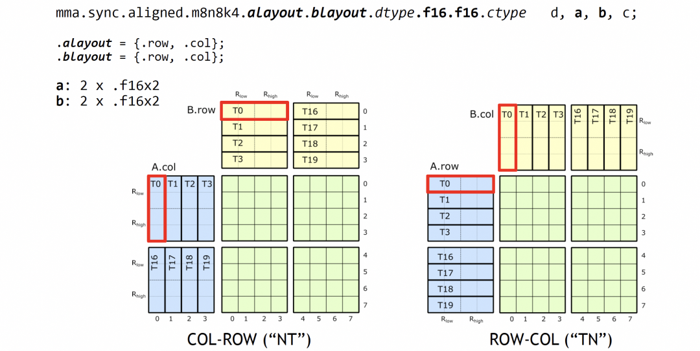

계산할 때 행렬은 두 번 접근해야 한다. 아래 그림과 같다.

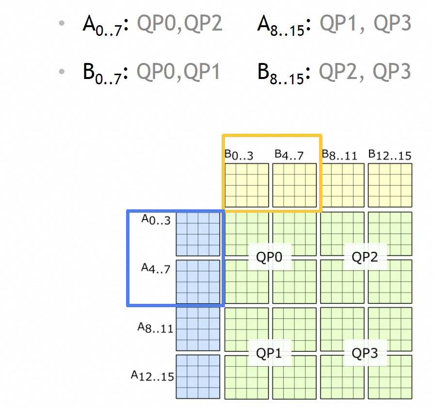

따라서 HMMA.884는 두 STEP으로 나누어 완료된다. 최종적으로 16x16x16 행렬 곱셈은 4개의 SET으로 분해되고, 각 SET은 2개의 STEP을 포함한다.

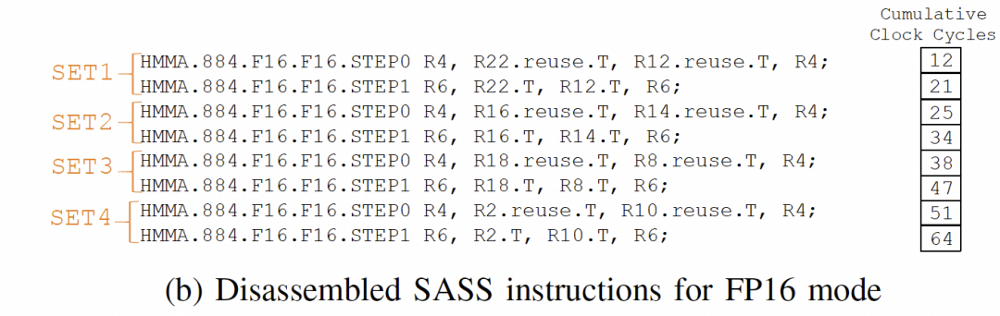

주의할 점은 Accumulator 행렬 C/D가 FP32일 때 더 많은 register를 차지하므로 4개의 STEP이 필요하다는 것이다.

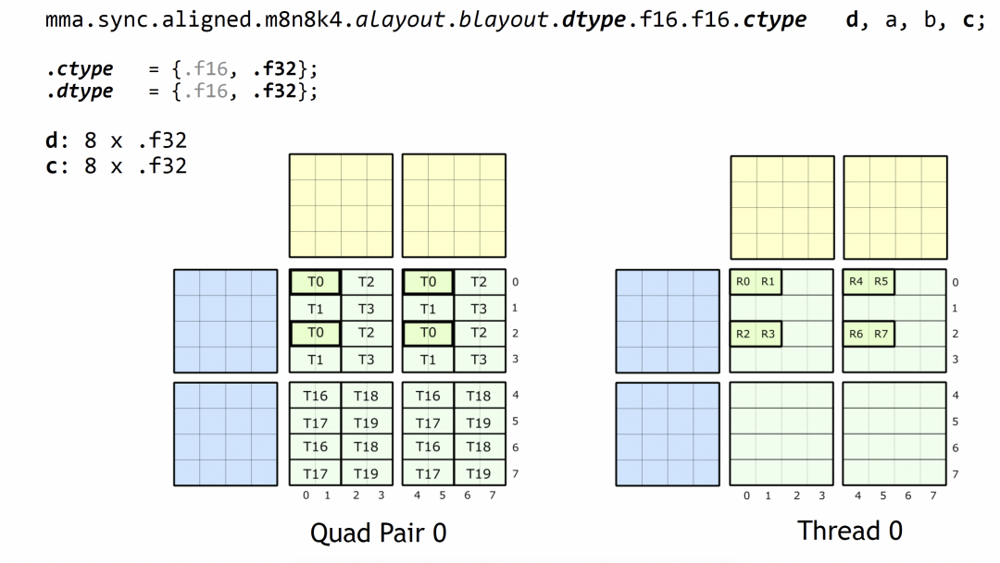

대응하는 SASS

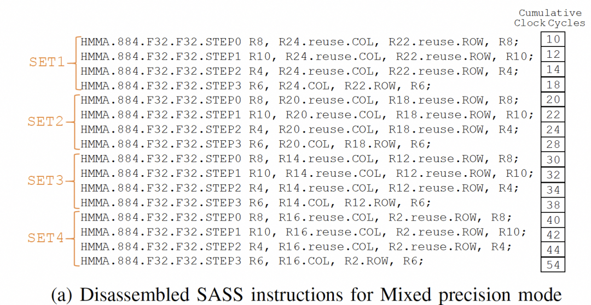

#### 1.2.2 TensorCore 아키텍처 추정

추정한 행렬 곱셈 유닛 아키텍처는 다음과 같다.

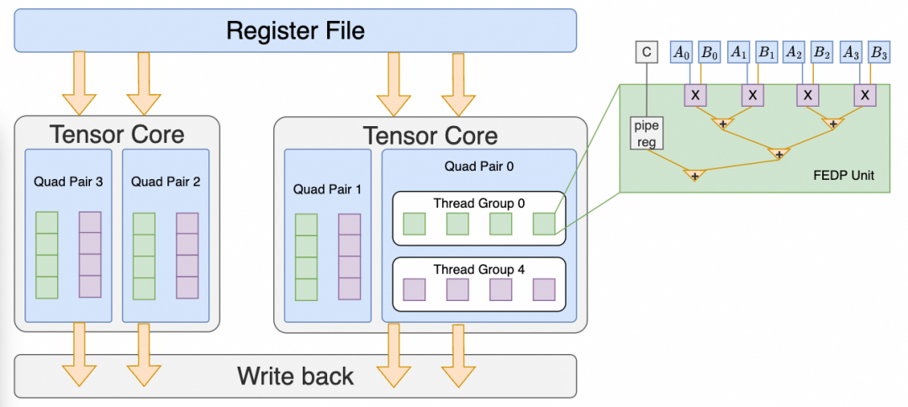

하나의 SubCore 안에는 두 개의 TensorCore가 포함되고, 각각 두 개의 Quad Pair를 담당한다. 하나의 Quad Pair 안에는 두 개의 Thread Group이 있으며, 각 Thread Group 안에는 네 개의 FEDP(Four Elements Dot Product) 유닛이 있다. 구체적인 operand 공급 로직은 논문 《Modeling Deep Learning Accelerator Enabled GPUs》에 그림이 있다.

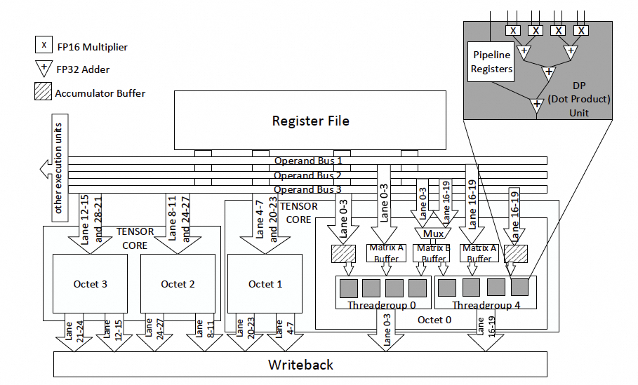

여기서 Octet의 정의는 Quad-Pairs와 동등하다. ThreadGroup0(Laneid 0~3)과 ThreadGroup4(Laneid 16~19)는 각각 자신의 A 행렬 operand를 제공하고, B 행렬은 Mux를 거쳐 동시에 multiplier에 주입되어 `데이터 reuse`를 구현한다. C 행렬은 Operand Bus3에서 주입되어 덧셈을 완료한다.

#### 1.2.3 데이터 로드

행렬 곱셈의 operand `A`와 `B`는 모두 4x4 행렬로 로드된다. 《Modeling Deep Learning Accelerator Enabled GPUs》를 인용하면 다음과 같다.

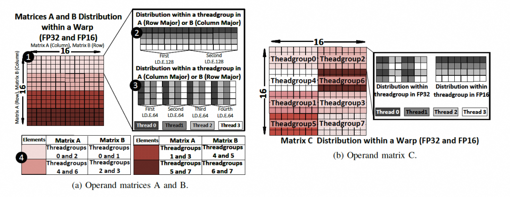

위 그림의 ❷처럼 코드에서 A와 B를 Row-major와 Col-major로 정의하면, 연속된 두 개의 LDG.E.128 로드를 사용한다.

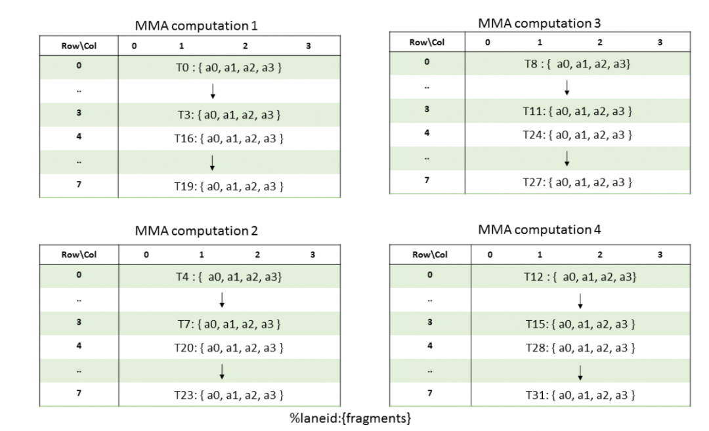

```c++
        wmma::fragment<wmma::matrix_a, 16, 16, 16, __half, wmma::row_major> a_frag;
        wmma::fragment<wmma::matrix_b, 16, 16, 16, __half, wmma::col_major> b_frag;

nvcc -c -arch sm_70 tmp2.cu ; cuobjdump -sass tmp2.o | grep LDG
        /*0130*/                   LDG.E.128.SYS R12, [R24] ;                                       /* 0x00000000180c7381 */
        /*0140*/                   LDG.E.128.SYS R16, [R26] ;                                       /* 0x000000001a107381 */
        /*0150*/                   LDG.E.128.SYS R4, [R24+0x10] ;                                   /* 0x0000100018047381 */
        /*0160*/                   LDG.E.128.SYS R8, [R26+0x10] ;                                   /* 0x000010001a087381 */
```

A와 B를 Col-major와 Row-major로 바꾸면 위 그림의 ❸처럼 4개의 LDG.E.64 로드를 사용한다.

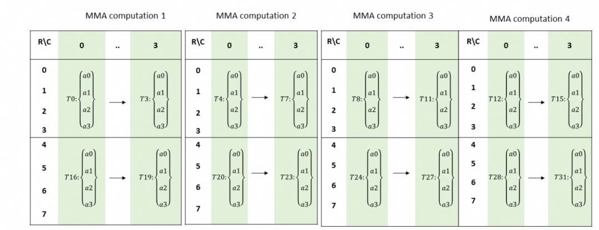

```c++
        wmma::fragment<wmma::matrix_a, 16, 16, 16, __half, wmma::col_major> a_frag;
        wmma::fragment<wmma::matrix_b, 16, 16, 16, __half, wmma::row_major> b_frag;

nvcc -c -arch sm_70 tmp2.cu ; cuobjdump -sass tmp2.o | grep LDG
        /*0160*/                   LDG.E.64.SYS R22, [R24] ;                                      /* 0x0000000018167381 */
        /*0170*/                   LDG.E.64.SYS R6, [R26] ;                                       /* 0x000000001a067381 */
        /*0180*/                   LDG.E.64.SYS R16, [R26+0x80] ;                                 /* 0x000080001a107381 */
        /*0190*/                   LDG.E.64.SYS R18, [R24+0x80] ;                                 /* 0x0000800018127381 */
        /*01a0*/                   LDG.E.64.SYS R10, [R26+0x100] ;                                /* 0x000100001a0a7381 */
        /*01b0*/                   LDG.E.64.SYS R12, [R24+0x100] ;                                /* 0x00010000180c7381 */
        /*01c0*/                   LDG.E.64.SYS R2, [R26+0x180] ;                                 /* 0x000180001a027381 */
        /*01d0*/                   LDG.E.64.SYS R8, [R24+0x180] ;                                 /* 0x0001800018087381 */
```

## 2. TensorCore 진화

기존 TensorCore(TC) 4세대를 정리하면 다음과 같다.

| Arch | Dtype | SM당 TC | TC m,n,k | 희소성 | 메모리 접근 | 지원 instruction |
| --- | --- | --- | --- | --- | --- | --- |
| Volta(SM70) | FP16 | 8 | 4 x 4 x 4 | No | N/A | mma |
| Turing(SM75) | FP16,INT8,INT4,Binary | 8 | 4 x 4 x 4 | No | ldmatrix | mma,ldmatrix |
| Ampere(SM80) | FP16,BF16,TF32,FP64,INT8,INT4,Binary | 4 | 8 x 4 x 8 | Yes | async Copy | mma,ldmatrix, mma.sp |
| Hopper(SM90) | FP16,BF16,FP8,TF32,FP64,INT8,Binary | 4 | 8 x 4 x 16 | Yes | TMA | mma,ldmatrix, mma.sp  ,wgmma |

TensorCore의 4세대 진화는 주로 몇 가지 방향을 포함한다.

1. 더 낮은 정밀도의 데이터 형식
2. 더 큰 계산 규모
3. 희소 행렬 지원
4. 점진적 비동기화, TC에 대한 operand 공급 throughput 향상

### 2.1 Turing 2세대 TensorCore

Turing 계열의 2세대 TensorCore에서는 주로 다음 몇 가지 최적화를 수행했다.

1. INT8/INT4/Binary 형식 지원
2. Warp-Level에서 `HMMA.1688` 지원
3. 메모리 접근에서 `ldmatrix` instruction 지원

Turing SM 아키텍처는 아래 그림과 같다. 하나의 SM에는 4개의 SubCore가 있고, 각각 2개의 TensorCore를 포함한다.

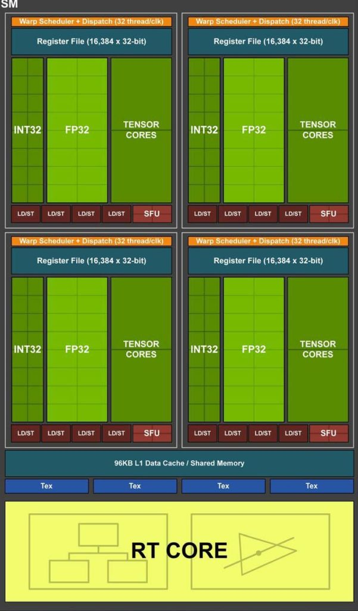

#### 2.1.1 HMMA.1688

`wmma.mma.sync.aligned.row.col.m16n16k16.f16.f16`은 Turing에서 네 개의 HMMA.1688 instruction으로 전개된다.

```c++
nvcc -c -arch sm_75 tmp2.cu ; cuobjdump -sass tmp2.o | grep HMMA
        /*0120*/                   HMMA.1688.F16 R16, R8, R0, RZ ;                            /* 0x000000000810723c */
        /*0130*/                   HMMA.1688.F16 R18, R8, R13, RZ ;                           /* 0x0000000d0812723c */
        /*0150*/                   HMMA.1688.F16 R16, R10, R12, R16 ;                         /* 0x0000000c0a10723c */
        /*0170*/                   HMMA.1688.F16 R18, R10, R14, R18 ;                         /* 0x0000000e0a12723c */
```

구체적인 실행은 아래 그림과 같다.

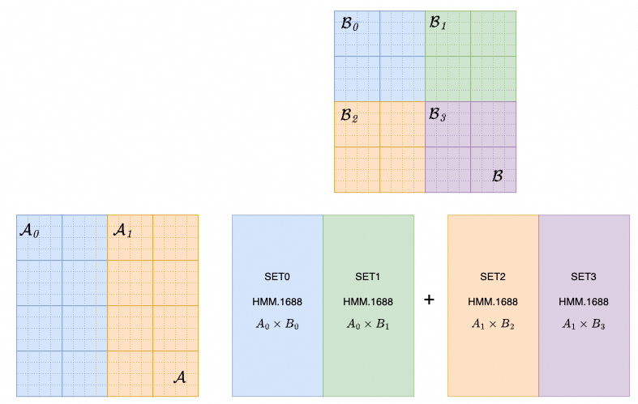

#### 2.1.2 LDMATRIX

전통적인 LDS instruction은 단일 Thread 안에서 실행되므로 thread 내부 register에만 쓸 수 있다. 한편 SMEM은 32bits 단위로 접근하므로 LDS.b16을 직접 사용하면 각 thread가 16b를 낭비하게 된다. 따라서 행렬 transpose load 상황에서는 두 개의 LDS.b16이 필요하고 16b 데이터 두 개가 낭비된다. 32개 스레드가 병렬 LD할 때 WARP 전체 관점에서도 instruction 수가 많으며, 동시에 LD 시 Bank Conflict 상황도 고려해야 한다.

따라서 Turing 세대부터 WARP-Level PTX instruction인 LDMATRIX가 추가되었다.

```c++
ldmatrix.sync.aligned.shape.num{.trans}{.ss}.type r, [p];

.shape  = {.m8n8};
.num    = {.x1, .x2, .x4};
.ss     = {.shared};
.type   = {.b16};
```

이는 SMEM(`.shared`)에서 원소가 16bits(`.b16`)인 8x8(`.m8n8`) 행렬을 register로 로드하는 것만 지원한다. `.num`은 로드할 8x8 행렬 수를 나타내며 `x1,x2,x4`를 지원한다. `.trans`는 transpose 여부를 나타내고, `[p]`는 SHMEM 주소 포인터를, `r`은 로드 대상 register를 나타낸다.

자주 쓰이는 조합에 대해 다음 6개 macro를 정의한다.

```c++
#define LDMATRIX_X1(R, addr) \
    asm volatile("ldmatrix.sync.aligned.x1.m8n8.shared.b16 {%0}, [%1];\n" : "=r"(R) : "r"(addr))

#define LDMATRIX_X2(R0, R1, addr) \
    asm volatile("ldmatrix.sync.aligned.x2.m8n8.shared.b16 {%0, %1}, [%2];\n" : "=r"(R0), "=r"(R1) : "r"(addr))

#define LDMATRIX_X4(R0, R1, R2, R3, addr)                                             \
    asm volatile("ldmatrix.sync.aligned.x4.m8n8.shared.b16 {%0, %1, %2, %3}, [%4];\n" \
                 : "=r"(R0), "=r"(R1), "=r"(R2), "=r"(R3)                             \
                 : "r"(addr))

#define LDMATRIX_X1T(R, addr) \
    asm volatile("ldmatrix.sync.aligned.x1.trans.m8n8.shared.b16 {%0}, [%1];\n" : "=r"(R) : "r"(addr))

#define LDMATRIX_X2T(R0, R1, addr) \
    asm volatile("ldmatrix.sync.aligned.x2.trans.m8n8.shared.b16 {%0, %1}, [%2];\n" : "=r"(R0), "=r"(R1) : "r"(addr))

#define LDMATRIX_X4T(R0, R1, R2, R3, addr)                                                  \
    asm volatile("ldmatrix.sync.aligned.x4.trans.m8n8.shared.b16 {%0, %1, %2, %3}, [%4];\n" \
                 : "=r"(R0), "=r"(R1), "=r"(R2), "=r"(R3)                                   \
                 : "r"(addr))
```

`LDMATRIX_X1`은 8x8 b16 행렬 하나를 로드한 뒤 32개 스레드의 `R0` register에 딱 맞게 배치한다(각 register는 32bits이므로 16bits 두 개를 정확히 저장한다). 이 instruction은 연속된 128bits를 한 행으로 읽으며, 누적으로 8행을 읽어야 한다. 각 행의 시작 주소는 앞 8개 스레드(laneid = 0~7)의 register addr이 제공한다. `LDMATRIX_X2`는 2개의 8x8 행렬을 로드하는 것을 의미하며, 로드되는 16행의 시작 주소는 앞 16개 스레드(laneid = 0~16)의 register addr이 제공한다. `LDMATRIX_X4`는 4개의 8x8 행렬을 로드해 총 32행을 읽는 것을 의미한다. 아래 표와 같다.

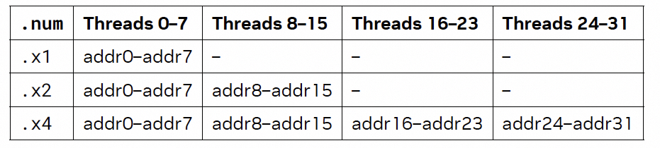

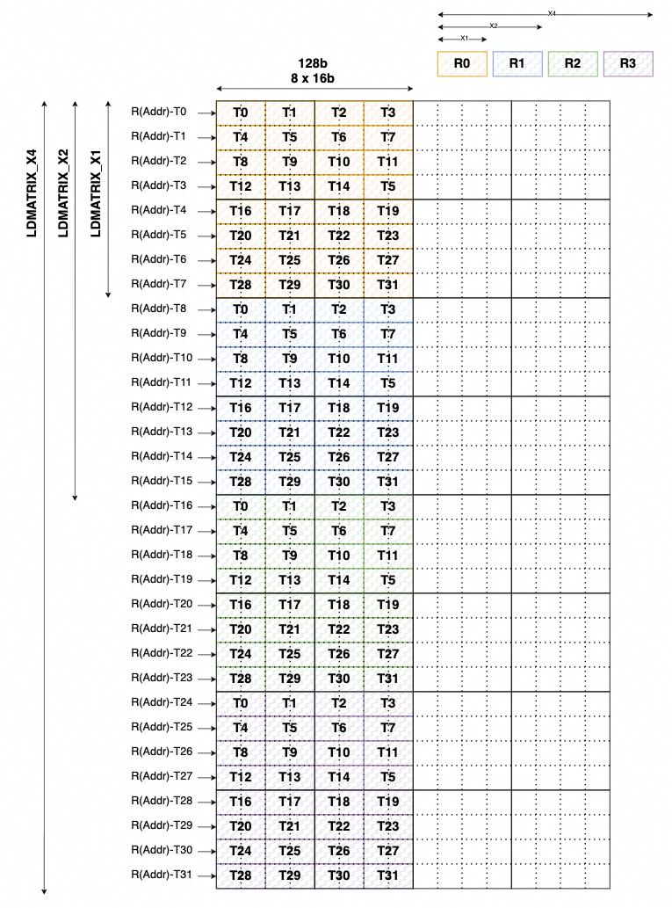

NVIDIA의 일부 자료에도 매우 명확한 그림이 있다.

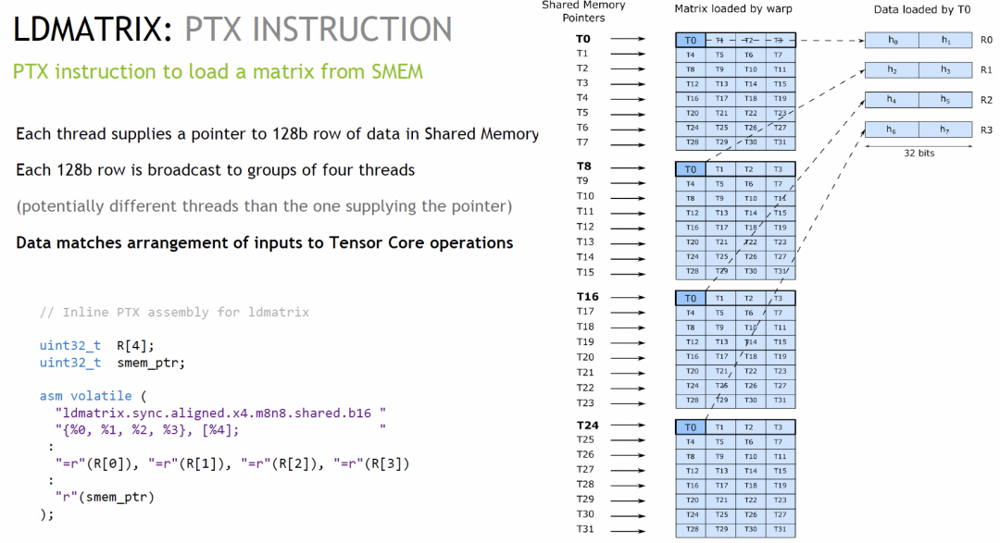

`LDMATRIX_X1T`, `LDMATRIX_X2T`, `LDMATRIX_X4T`는 읽은 뒤 8x8 행렬을 transpose해서 register에 저장하는 load instruction이다.

예를 들어 다음 테스트 프로그램을 구성한다.

```c++
#include <stdio.h>
#include <stdint.h>
#include "cuda_fp16.h"

__global__ void TestLDMatrix(void)
{
    const int tid = threadIdx.x;

    // shared memory 안에 4x16x16 행렬 하나를 구성한다
    __shared__ uint16_t M[4 * 16 * 16];
    if (tid == 0)
    {
        int offset = 0;
        for (int i = 0; i < 4; ++i){
            for (int j = 0; j < 16; ++j){
                for (int k = 0; k < 16; ++k)
                {
                    M[offset] = static_cast<uint16_t>((i+1) * 10000 + (j+1) * 100 + k+1);
                    printf(" %6d",M[offset]);
                    offset++;
                }
                printf("\n");
            }
             printf("\n");
        }
    }
    __syncthreads();

    int offset = tid * 16;
    uint32_t addr = __cvta_generic_to_shared(M + offset);
    uint32_t frag[4];
    //LDMATRIX_X1(frag[0],addr);
    LDMATRIX_X4(frag[0], frag[1], frag[2], frag[3], addr);
    uint16_t data[4][2];
    for (int i = 0; i < 4; ++i)
    {
        data[i][0] = static_cast<uint16_t>(frag[i] & 0xFFFF);
        data[i][1] = static_cast<uint16_t>((frag[i] >> 16) & 0xFFFF);
    }
    printf("OFFSET %4d  tid: %3d | A | %6d %6d | %6d %6d | %6d %6d | %6d %6d |\n", offset, tid,
           int(data[0][0]), int(data[0][1]), int(data[1][0]), int(data[1][1]),
           int(data[2][0]), int(data[2][1]), int(data[3][0]), int(data[3][1]));
}

int main(void)
{
    dim3 gridDim(1, 1, 1);
    dim3 blockDim(32, 1, 1);
    TestLDMatrix<<<gridDim, blockDim>>>();

    cudaDeviceReset();
    return 0;
}
```

컴파일하려면 Arch가 Turing(SM_75)보다 커야 한다. SASS instruction을 보면 아래와 같은 LDSM이다.

```c++
nvcc -c -arch sm_75 ldmatrix.cu ; cuobjdump -sass ldmatrix.o | grep LDSM
        /*1470*/                   LDSM.16.M88.4 R4, [R3] ;                   /* 0x000000000304783b */
```

shared memory의 행렬은 4x16x16이며, 아래와 같다.

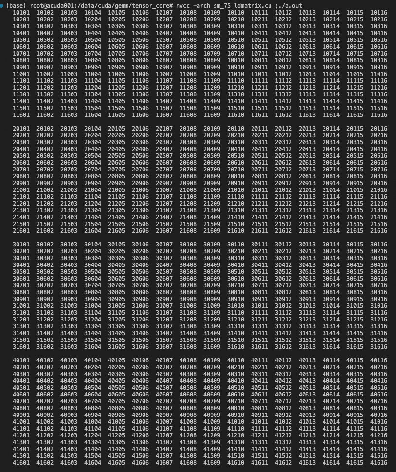

offset = tid * 16이면 stride가 정확히 한 행의 길이가 되고, 출력 결과는 다음과 같다.

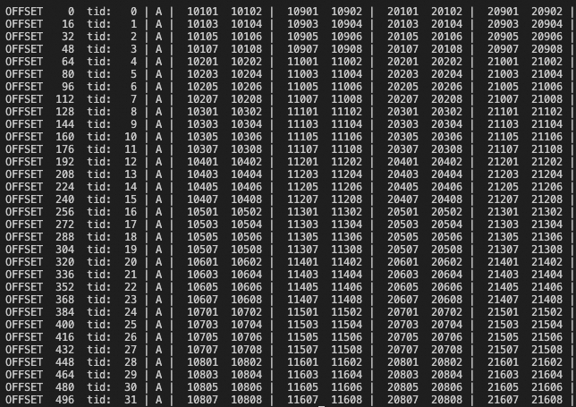

offset = tid * 32이면 원본 행렬 M을 한 행 건너 읽으며, 출력 결과는 다음과 같다.

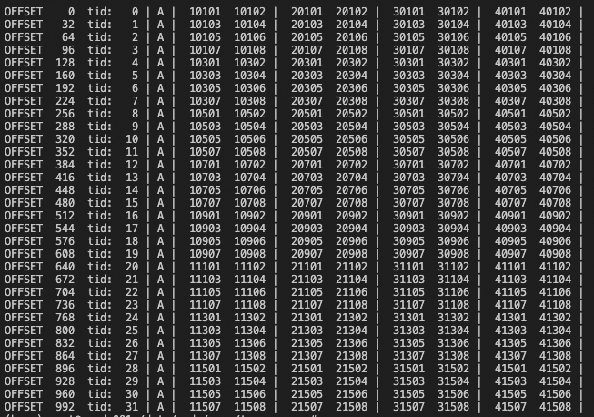

instruction을 transpose read 버전, 예를 들어 `LDMATRIX_X4T`로 바꾸면 출력은 다음과 같다.

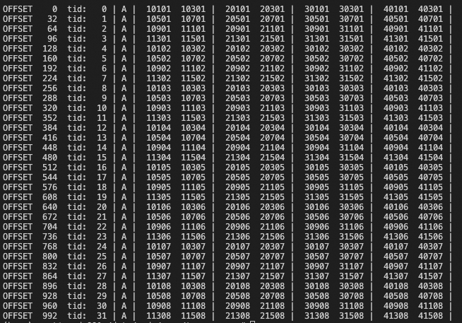

### 2.2 Ampere 3세대 TensorCore

3세대 TensorCore의 개선 폭은 더 크다. 하나의 SubCore 안에서 단일 TensorCore로 통합되어 WARP 안의 32개 스레드가 직접 공유한다. 따라서 단일 SM의 TensorCore 수는 4개로 줄어든다.

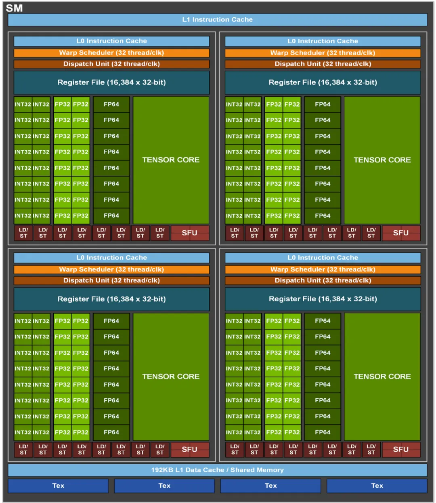

단일 Cycle에서 8x4x8 행렬 곱셈을 지원하며 Quad Pair와 ThreadGroup 개념을 없앴다. 한편 HMMA.16816을 지원하므로 16x16x16 행렬 곱셈에는 instruction 두 개만 필요하다. 또한 희소 행렬 곱셈과 비동기 memory copy 등의 특성도 지원한다.

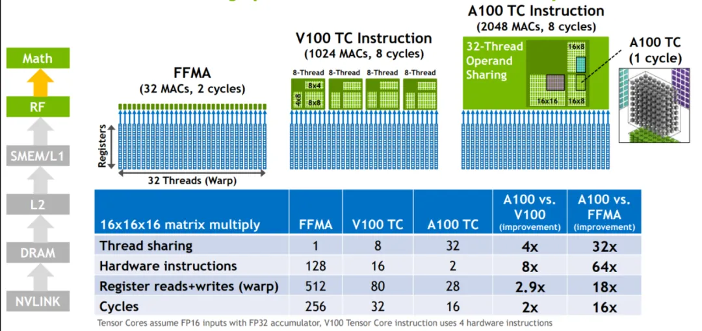

한편 Warp-Level Reduction, L2Cache의 효율적 관리, 비동기 memory copy와 비동기 Barrier 등 새로운 기능도 지원한다.

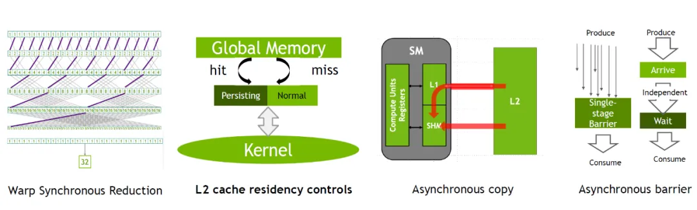

#### 2.2.1 HMMA.16816

행렬 곱셈 규모를 한층 더 키웠다.

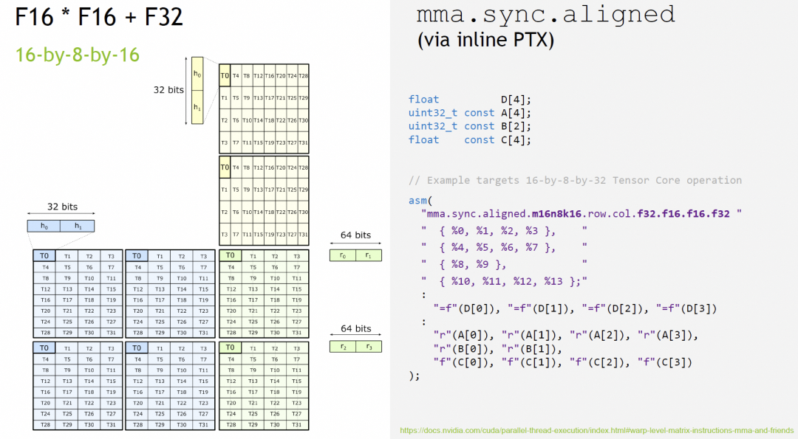

```c++
nvcc -c -arch sm_80 tmp2.cu ; cuobjdump -sass tmp2.o | grep HMMA
        /*0130*/                   HMMA.16816.F16 R12, R4.reuse, R12, RZ ;                    /* 0x0000000c040c723c */
        /*0140*/                   HMMA.16816.F16 R14, R4, R14, RZ ;                          /* 0x0000000e040e723c */
```

따라서 전체 행렬에는 instruction 두 개만 필요하다.

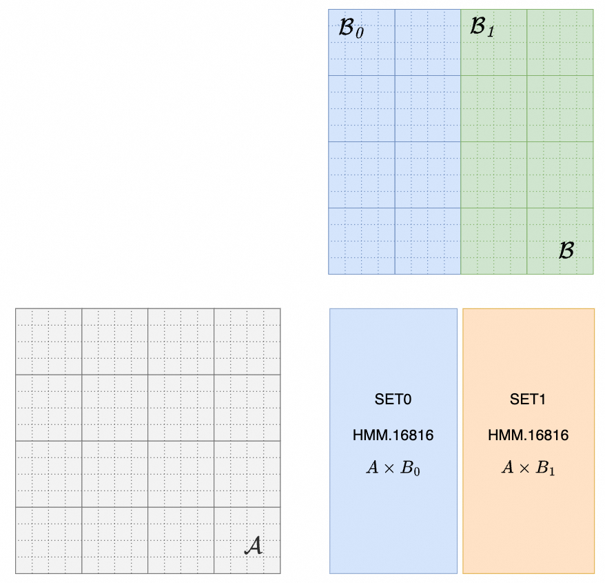

TensorCore 연산은 전체 WARP-LEVEL로 실행되므로 기존 ThreadGroup과 QuadPair의 블록 분할이 필요 없다. 전체 SubCore의 TensorCore도 완전히 하나의 더 큰 TensorCore로 합쳐져 8x4x8 행렬 연산을 지원한다.

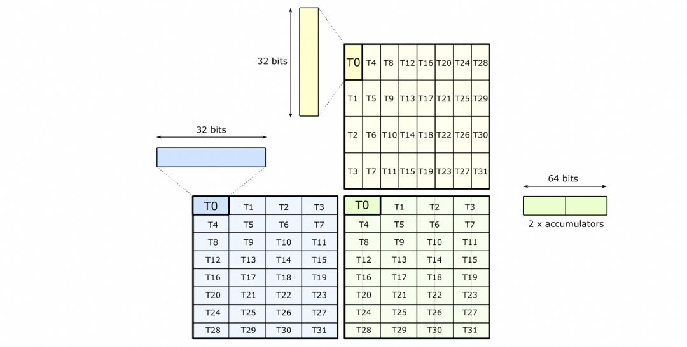

#### 2.2.2 비동기 copy

A100과 함께 발표된 CUDA 11.0의 가장 큰 업데이트는 비동기 프로그래밍 지원이다. Barrier Object가 기존의 `__syncthreads`를 대체했다.

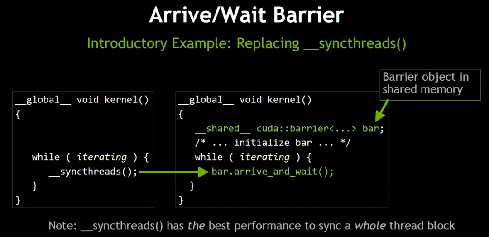

위 왼쪽 그림처럼 가장 기본적인 vectorized copy 과정을 보자. 즉 데이터가 GMEM에서 L1으로, 다시 register로 이동한 뒤 마지막으로 SMEM에 저장된다.

```c++
__global__ void testcopy(float *x, int N) {
    int tid = threadIdx.x;
    __shared__ float Tile[32];
    *reinterpret_cast<float4*>(&Tile[tid]) = *reinterpret_cast<float4*>(&x[tid*4]);
    printf("%f ", Tile[tid]);
}

# nvcc -arch sm_80 -ptx async_cp.cu

    ld.global.v4.u32  {%r5, %r6, %r7, %r8}, [%rd6];
 st.shared.v4.u32  [%r4], {%r5, %r6, %r7, %r8};

# nvcc -arch sm_80 -c async_cp.cu ; cuobjdump -sass async_cp.o | grep 128
        /*0060*/                   LDG.E.128 R8, [R8.64] ;                  /* 0x0000000408087981 */
        /*00e0*/                   STS.128 [R0.X4], R8 ;                    /* 0x0000000800007388 */
```

비동기 memory copy를 사용하면 GMEM 데이터를 L1/RF를 bypass해 SMEM으로 직접 copy할 수 있어 TensorCore에 대한 operand 공급 효율이 더 높아진다.


비동기 copy instruction은 다음과 같다.

```c++
cp.async.ca.shared{::cta}.global{.level::cache_hint}{.level::prefetch_size}
                         [dst], [src], cp-size{, src-size}{, cache-policy} ;

cp.async.cg.shared{::cta}.global{.level::cache_hint}{.level::prefetch_size}
                         [dst], [src], 16{, src-size}{, cache-policy} ;

cp.async.ca.shared{::cta}.global{.level::cache_hint}{.level::prefetch_size}
                         [dst], [src], cp-size{, ignore-src}{, cache-policy} ;

cp.async.cg.shared{::cta}.global{.level::cache_hint}{.level::prefetch_size}
                         [dst], [src], 16{, ignore-src}{, cache-policy} ;

.level::cache_hint =     { .L2::cache_hint }
.level::prefetch_size =  { .L2::64B, .L2::128B, .L2::256B }
cp-size =                { 4, 8, 16 }
```

- `cp-size`: 목표 `dst`로 copy할 데이터 크기를 지정하는 integer constant이며, 값은 4/8/16만 가능하다.
- `ignore-sorce`: 선택적 predicate parameter로, src의 데이터를 완전히 무시해야 하는지 지정한다. 설정되면 `dst`를 0으로 직접 채운다.
- `cg` | `ca`: Cache operator다. `cg`는 L2에만 cache함을 의미하고, `ca`는 L1을 포함한 모든 cache 계층에 cache해야 함을 의미한다.
- `prefetch_size`: L2 안의 Prefetch 수량과 크기를 정의할 수 있다.

  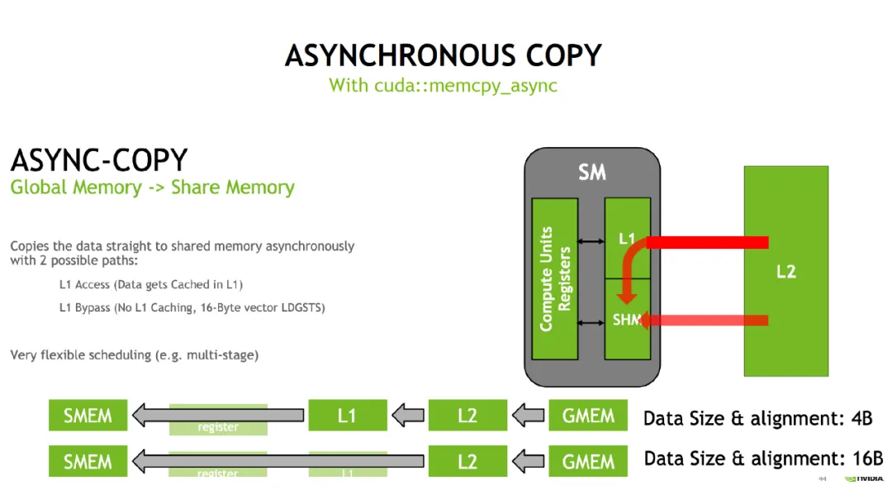

비동기 copy 코드는 다음과 같다.

```c++
__global__ void testcopy2(float *x, int N) {
    int tid = threadIdx.x;
    __shared__ float Tile[32];
    asm volatile("cp.async.cg.shared.global [%0], [%1], %2;\n"
                :: "r"((uint32_t)__cvta_generic_to_shared(&Tile[tid])),
                "l"(&x[tid]),
                "n"(16)
            );

    printf("%f ", Tile[tid]);
}

# nvcc -arch sm_80 -ptx async_cp.cu
 cp.async.cg.shared.global [%r1], [%rd1], 16;
# nvcc -arch sm_80 -c async_cp.cu ; cuobjdump -sass async_cp.o | grep LDGSTS
        /*00d0*/                   LDGSTS.E.BYPASS.128 [R0], [R2.64] ;      /* 0x0000000002007fae */
```

새로 LDGSTS(Load GMEM, Store SMEM) instruction이 하나 추가되어 L1/RF를 bypass한다는 것을 볼 수 있다. 비동기 실행에 대해서는 cp.async.wait_group 또는 async mbarrier instruction으로 상태를 처리할 수 있다. 예를 들면 다음과 같다.

```c++
// Example of .wait_all:
cp.async.ca.shared.global [shrd1], [gbl1], 4;
cp.async.cg.shared.global [shrd2], [gbl2], 16;
cp.async.wait_all;  // waits for all prior cp.async to complete

// Example of .wait_group :
cp.async.ca.shared.global [shrd3], [gbl3], 8;
cp.async.commit_group;  // End of group 1

cp.async.cg.shared.global [shrd4], [gbl4], 16;
cp.async.commit_group;  // End of group 2

cp.async.cg.shared.global [shrd5], [gbl5], 16;
cp.async.commit_group;  // End of group 3

cp.async.wait_group 1;  // waits for group 1 and group 2 to complete
```

CUDA interface를 사용해 barrier로 구현하면 다음과 같다.

```c++
#include <stdio.h>
#include <stdint.h>
#include <cuda/barrier>
#include <cooperative_groups.h>
#include <cooperative_groups/memcpy_async.h>
namespace cg = cooperative_groups;

__global__ void testcopy2(float *global1, float *global2, int subset_count)
{
    extern __shared__ float shared[];
    auto group = cooperative_groups::this_thread_block();

    // Create a synchronization object
    __shared__ cuda::barrier<cuda::thread_scope::thread_scope_block> barrier;
    if (group.thread_rank() == 0)
    {
        init(&barrier, group.size());
    }
    group.sync();

    for (size_t subset = 0; subset < subset_count; ++subset)
    {
        cuda::memcpy_async(group, shared,
                           &global1[subset * group.size()], sizeof(float) * group.size(), barrier);
        cuda::memcpy_async(group, shared + group.size(),
                           &global2[subset * group.size()], sizeof(float) * group.size(), barrier);

        barrier.arrive_and_wait(); // Wait for all copies to complete

        compute(shared);
        barrier.arrive_and_wait();
    }
}

# nvcc -c -arch sm_80 async_cp.cu ; cuobjdump -sass async_cp.o | grep LDGSTS
        /*02f0*/                   LDGSTS.E [R3+0x10], [R6.64] ;                      /* 0x0001000006037fae */
        /*0400*/                   ARRIVES.LDGSTSBAR.64 [URZ] ;                       /* 0x00000000ff0079b0 */
        /*04f0*/                   LDGSTS.E [R3+0x10], [R4.64] ;                      /* 0x0001000004037fae */
        /*05d0*/                   ARRIVES.LDGSTSBAR.64 [URZ] ;                       /* 0x00000000ff0079b0 */
```

하지만 실제 실행은 Weak Order라는 점을 고려해야 한다. 예를 들어 아래 두 async copy가 같은 주소에 대해 서로 다른 길이의 memory copy를 사용하면, 실행 결과는 undefined이다.

```c++
  asm volatile(
    "{\n"
    "cp.async.cg.shared.global [%0], [%1], %2, 8;\n"
    "cp.async.cg.shared.global [%0], [%1], %2, 16;\n"
    "cp.async.commit_group;\n"
    "cp.async.wait_group 0\n;"
    "}\n" :: "r"(smem), "l"(&x[tid]), "n"(16)
  );
```

비동기 copy의 자세한 내용은 《Controlling Data Movement to Boost Performance on the NVIDIA Ampere Architecture》[4]를 참고할 수 있다.

#### 2.2.3 희소 행렬

새로운 mma.sp instruction은 dot product Engine에서 select bitmap을 지원함으로써 희소 행렬 계산을 구현한다.

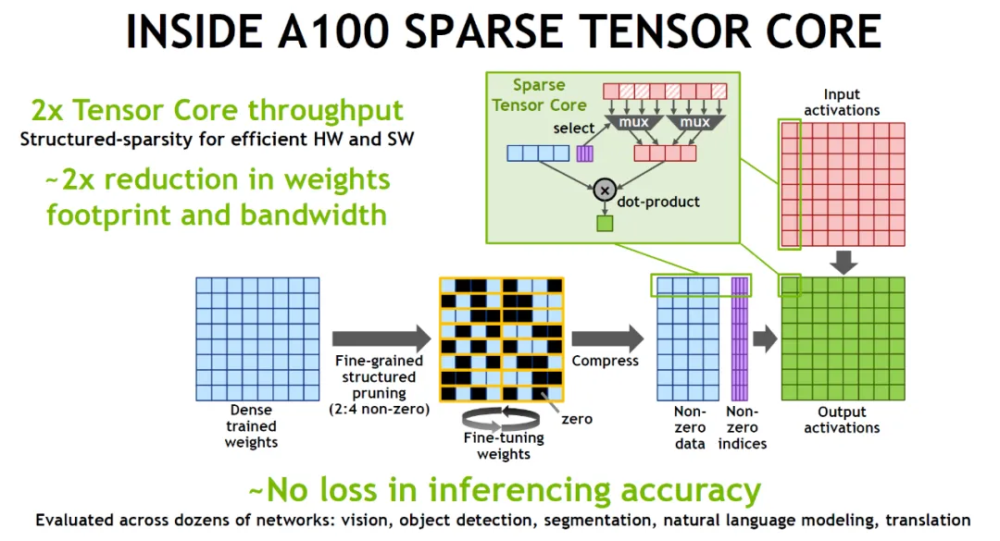

### 2.3 Hopper 4세대 TensorCore

주요 변화는 TensorCore의 사양을 더 높여 16x8x4 행렬 곱셈을 지원한다는 것이다. 동시에 FP8 형식도 지원한다.

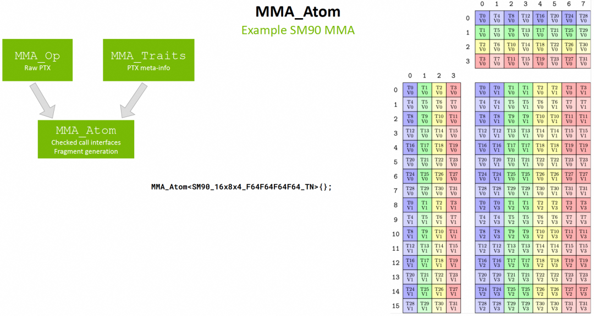

메모리 접근 시 Tensor Memory Accelerator(TMA)를 제공해 메모리 접근을 최적화한다. 동시에 SM-Level 기반의 WARP-Group MMA도 지원한다. 비동기 프로그래밍 모드에서는 여러 Kernel 사이가 생산자/소비자 방식으로 통신하고, SM 사이의 통신 bandwidth 요구도 증가한다. 따라서 Distributed Shared Memory(DSMEM) 개념을 제공한다.

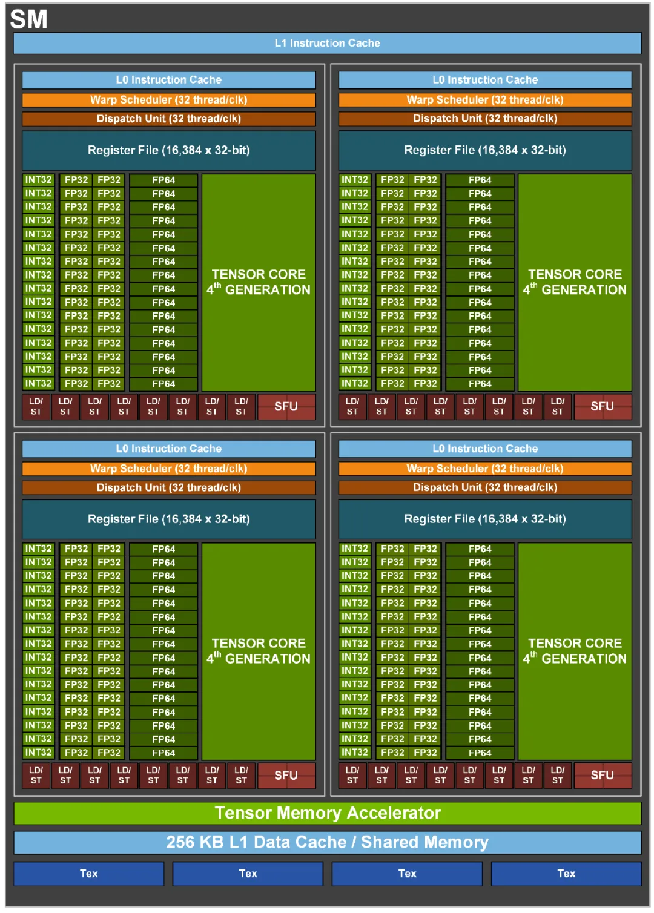

#### 2.3.1 DSMEM

Hopper 이전에는 CUDA가 문제 규모를 처리할 때 Grid와 Block 두 단계 scheduling을 사용했고, Block은 SM에 매핑됐다. 하지만 Cooperative Groups의 등장과 비동기 프로그래밍 지원으로 여러 Kernel 사이가 생산자/소비자 방식으로 통신하면서 SM 사이 통신 bandwidth 요구도 증가하고 있다.

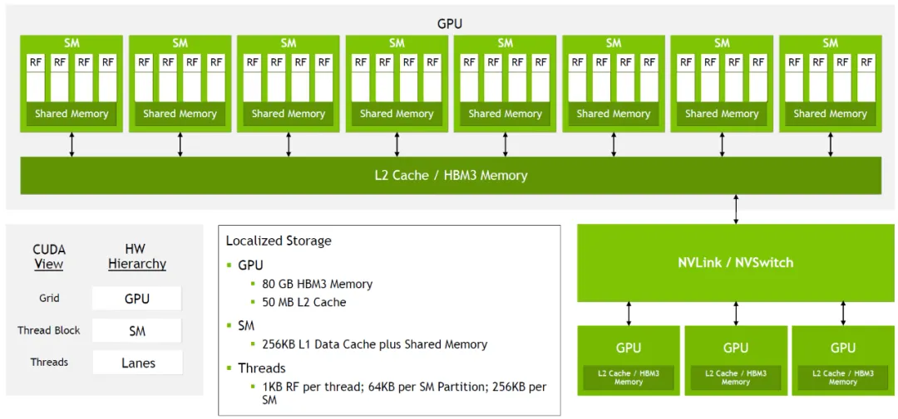

Hopper에서는 Distributed Shared Memory(DSMEM)라는 개념이 새로 추가되었다. 하나의 GPC 내부 SM들이 전용 통신 bandwidth를 갖게 되었고, 따라서 CUDA에 한 단계의 scheduling 계층이 추가되었다.

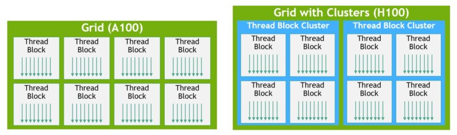

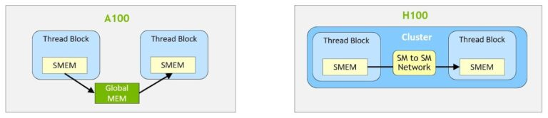

같은 Thread Block 안에서 PGAS를 사용해 distributed shared memory(DSMEM)를 구성하면, 하나의 GPC 내부에서 여러 SM의 LD/ST, Atomic, reduce, 비동기 DMA 연산이 모두 매우 간결해진다.


#### 2.3.2 TMA

A100에서는 Async.copy의 LDGSTS instruction으로 L1을 bypass해 GMEM에서 SMEM으로 직접 copy할 수 있었지만, 여전히 CudaCore가 주소를 계산하고 instruction을 발행해야 했다. Hopper 세대에서는 Tensor Memory Accelerator(TMA) 엔진을 제공해 1D~5D Tensor의 LD/ST를 지원한다.

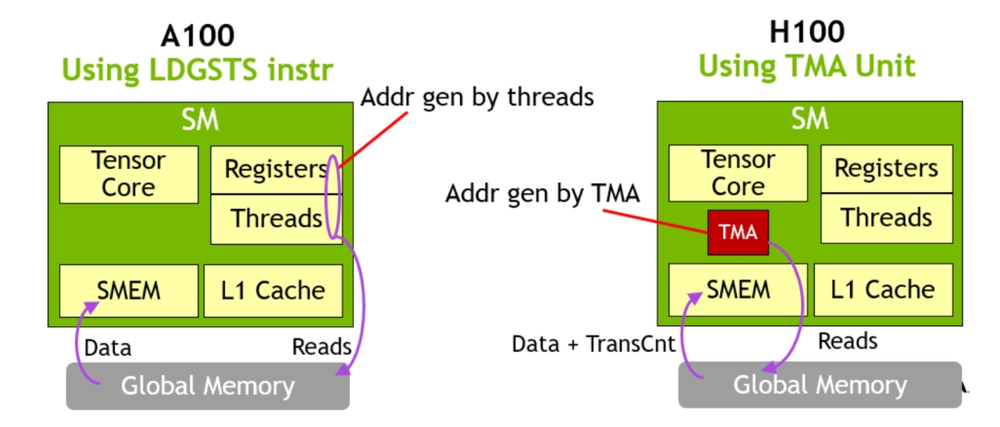

예를 들어 TMA가 없는 경우 Triton GEMM의 throughput은 910GB/s까지만 도달하고, LSU에는 227K개의 instruction이 있다.

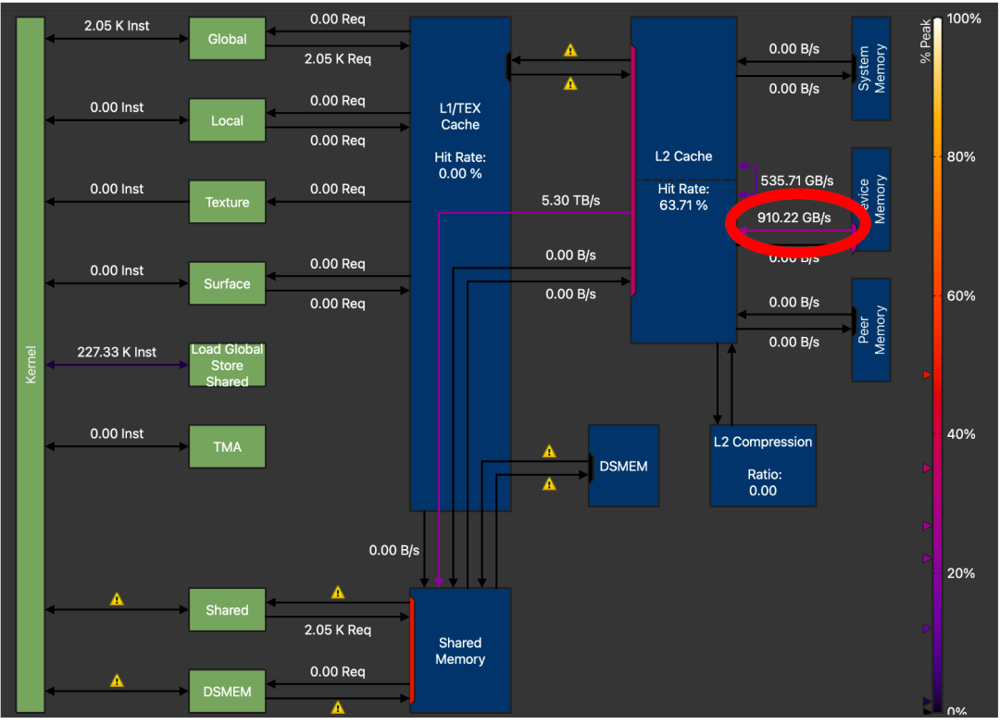

TMA를 지원한 뒤 GEMM throughput은 1.45TB/s에 도달했고, TMA 엔진 instruction 수는 10배 줄어 19K에 불과하다.

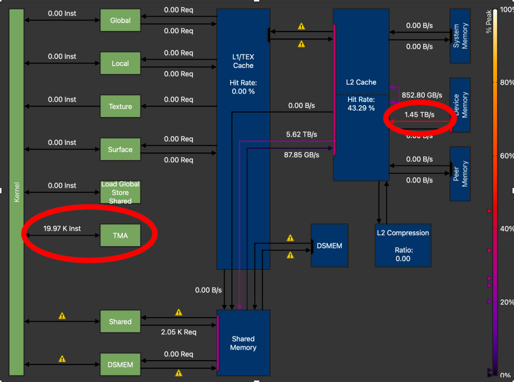

TMA는 GMEM에서 SMEM으로의 copy뿐 아니라 GPC 내부 SM-to-SM의 SMEM copy도 지원한다.

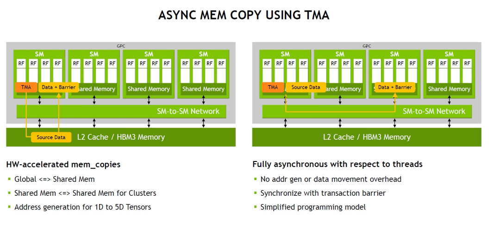

동시에 1D~5D tensor에 대해 특정 BLOCK을 정의해 비동기 데이터 load와 store를 수행할 수 있다.


행렬 블록 곱셈은 Block Tile 단위로 지속적으로 전송해야 하므로, Hopper에서는 TMA 처리를 위해 ATB(Async Transaction Barrier) 능력이 새로 추가되었다. 아래 그림과 같다.

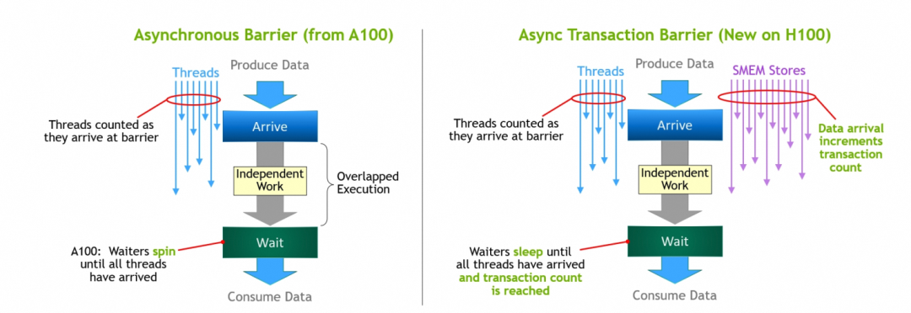

따라서 우리는 계산과 메모리 접근을 overlap하는 더 비동기적인 계산 모드를 구성할 수 있다.

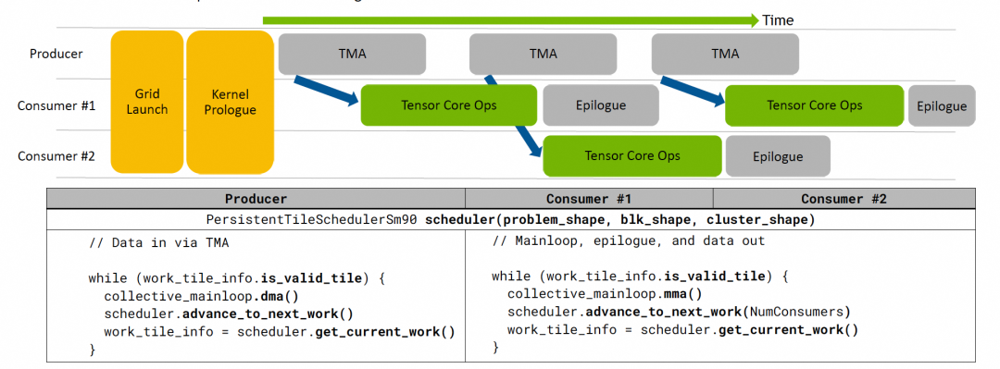

TMA에 추가된 PTX instruction은 다음과 같다.

- cp.async.bulk
- cp.reduce.async.bulk
- cp.async.bulk.prefetch
- cp.async.bulk.tensor
- cp.reduce.async.bulk.tensor
- cp.async.bulk.prefetch.tensor
- cp.async.bulk.commit\_group
- cp.async.bulk.wait\_group
- tensormap.replace

##### 2.3.2.1 cp.async.bulk

cp.async.bulk는 non-blocking bulk async memory copy instruction으로, mbarrier와 bulk_group 두 가지 완료 메커니즘을 지원하고 multicast 기능도 지원한다.

```c++
// multicast
cp.async.bulk.dst.src.completion_mechanism{.multicast}{.level::cache_hint}
                      [dstMem], [srcMem], size, [mbar] {, ctaMask} {, cache-policy}

.dst =                  { .shared::cluster }
.src =                  { .global }
.completion_mechanism = { .mbarrier::complete_tx::bytes }
.level::cache_hint =    { .L2::cache_hint }
.multicast =            { .multicast::cluster  }

// mbarrier 완료 메커니즘
cp.async.bulk.dst.src.completion_mechanism [dstMem], [srcMem], size, [mbar]

.dst =                  { .shared::cluster }
.src =                  { .shared::cta }
.completion_mechanism = { .mbarrier::complete_tx::bytes }

// bulk_group 완료 메커니즘
cp.async.bulk.dst.src.completion_mechanism{.level::cache_hint} [dstMem], [srcMem], size {, cache-policy}

.dst =                  { .global }
.src =                  { .shared::cta }
.completion_mechanism = { .bulk_group }
.level::cache_hint =    { .L2::cache_hint }
```

하지만 multicast instruction에서 source operand는 GMEM이고 destination은 SMEM이라는 점에 주목해야 한다. 즉 하나의 GPC 안에서 TMA는 GMEM에서 한 벌을 읽은 뒤 DSM을 통해 SM-to-SM network 위에서 다른 SM들에 여러 번 쓸 수 있어 L2Cache 압력을 줄인다.
완료 알림 메커니즘의 경우, GMEM에서 SMEM 및 DSM으로 copy할 때는 mbarrier 메커니즘을 사용하고, SMEM에서 GMEM으로 갈 때는 bulk async group 메커니즘을 사용한다는 것을 볼 수 있다.

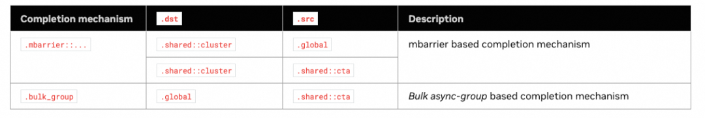

몇 가지 일반적인 예시

```c++
// GMEM -> SMEM
cp.async.bulk.shared::cluster.global.mbarrier::complete_tx::bytes [dstMem], [srcMem], size, [mbar];

// GMEM -> SMEM(Multicast)
cp.async.bulk.shared::cluster.global.mbarrier::complete_tx::bytes.multicast::cluster
                                             [dstMem], [srcMem], size, [mbar], ctaMask;

// GMEM -> SMEM  with L2Cache Hint
cp.async.bulk.shared::cluster.global.mbarrier::complete_tx::bytes.L2::cache_hint
                                             [dstMem], [srcMem], size, [mbar], cache-policy;


// SMEM -> Distributed SMEM
cp.async.bulk.shared::cluster.shared::cta.mbarrier::complete_tx::bytes [dstMem], [srcMem], size, [mbar];

// SMEM -> GMEM
cp.async.bulk.global.shared::cta.bulk_group [dstMem], [srcMem], size;

cp.async.bulk.global.shared::cta.bulk_group.L2::cache_hint} [dstMem], [srcMem], size, cache-policy;
```

##### 2.3.2.2 cp.reduce.async.bulk

Ampere 아키텍처에는 Warp-Level의 integer Reduce 연산자가 추가된 적이 있다. 여기서는 TMA 위에 행렬 계산에서 흔한 reduction(Reduce) 연산을 확장했고, 여러 데이터 타입(FP16/BF16)과 연산자를 지원한다. 다만 GMEM에서 SMEM 방향 또는 Cluster 내부 DSM을 통한 memory copy reduction만 지원한다. 계산 능력은 CudaCore 내부 ALU 자원을 reuse해 L1Cache 오버헤드를 줄이고 RF에서 직접 계산한 것으로 추정된다.

```c++
cp.reduce.async.bulk.dst.src.completion_mechanism.redOp.type
              [dstMem], [srcMem], size, [mbar]

.dst =                  { .shared::cluster }
.src =                  { .shared::cta }
.completion_mechanism = { .mbarrier::complete_tx::bytes }
.redOp=                 { .and, .or, .xor,
                          .add, .inc, .dec,
                          .min, .max }
.type =                 { .b32, .u32, .s32, .b64, .u64 }


cp.reduce.async.bulk.dst.src.completion_mechanism{.level::cache_hint}.redOp.type
               [dstMem], [srcMem], size{, cache-policy}

.dst =                  { .global      }
.src =                  { .shared::cta }
.completion_mechanism = { .bulk_group }
.level::cache_hint    = { .L2::cache_hint }
.redOp=                 { .and, .or, .xor,
                          .add, .inc, .dec,
                          .min, .max }
.type =                 { .f16, .bf16, .b32, .u32, .s32, .b64, .u64, .s64, .f32, .f64 }


cp.reduce.async.bulk.dst.src.completion_mechanism{.level::cache_hint}.add.noftz.type
               [dstMem], [srcMem], size{, cache-policy}
.dst  =                 { .global }
.src  =                 { .shared::cta }
.completion_mechanism = { .bulk_group }
.type =                 { .f16, .bf16 }
```

##### 2.3.2.3 cp.async.bulk.prefetch

HBM에서 L2로 prefetch하는 능력을 제공해 L2Cache hit rate를 높인다.

```c++
cp.async.bulk.prefetch.L2.src{.level::cache_hint}   [srcMem], size {, cache-policy}

.src =                { .global }
.level::cache_hint =  { .L2::cache_hint }
```

##### 2.3.2.4 Tensor 기반 cp.async.buk

고차원 행렬에 대해 TensorMap descriptor를 정의할 수 있다. 더 자세한 내용은 이후 CuTe Layout 관련 절에서 설명하겠다.

```c++
  // Create the tensor descriptor.
  CUresult res = cuTensorMapEncodeTiled(
    &tensor_map,                // CUtensorMap *tensorMap,
    CUtensorMapDataType::CU_TENSOR_MAP_DATA_TYPE_INT32,
    rank,                       // cuuint32_t tensorRank,
    tensor_ptr,                 // void *globalAddress,
    size,                       // const cuuint64_t *globalDim,
    stride,                     // const cuuint64_t *globalStrides,
    box_size,                   // const cuuint32_t *boxDim,
    elem_stride,                // const cuuint32_t *elementStrides,
    // Interleave patterns can be used to accelerate loading of values that
    // are less than 4 bytes long.
    CUtensorMapInterleave::CU_TENSOR_MAP_INTERLEAVE_NONE,
    // Swizzling can be used to avoid shared memory bank conflicts.
    CUtensorMapSwizzle::CU_TENSOR_MAP_SWIZZLE_NONE,
    // L2 Promotion can be used to widen the effect of a cache-policy to a wider
    // set of L2 cache lines.
    CUtensorMapL2promotion::CU_TENSOR_MAP_L2_PROMOTION_NONE,
    // Any element that is outside of bounds will be set to zero by the TMA transfer.
    CUtensorMapFloatOOBfill::CU_TENSOR_MAP_FLOAT_OOB_FILL_NONE
    );
```

이 descriptor와 좌표를 통해 Tensor 안에서 해당 Block을 꺼내 계산할 수 있고, 실제 주소에 대해 Offset/Stride 계산을 수행하는 복잡성을 피할 수 있다.

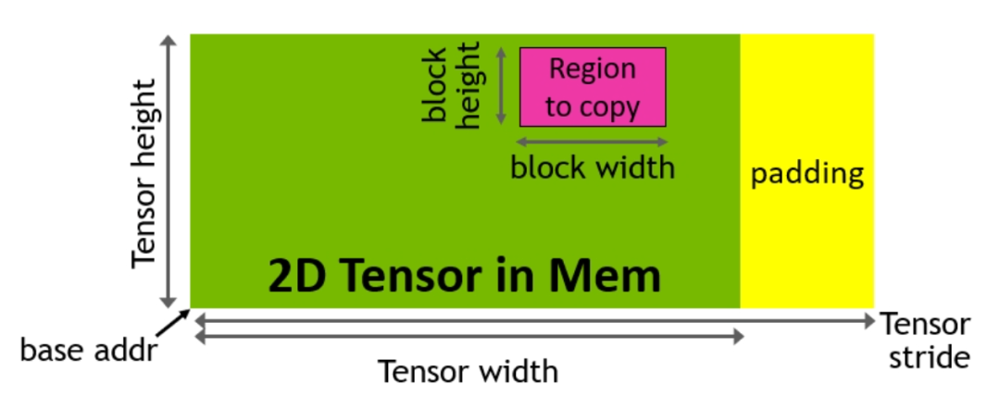

따라서 Tensor 관련 TMA instruction에서는 operand가 `[tensorMap, tensorCoords]`를 포함해야 한다. 이 instruction 역시 GMEM에서 SMEM으로의 copy를 지원하고 DSM multicast 기능도 지원한다. 동시에 SMEM에서 GMEM으로 write-back하는 능력도 지원한다.

```c++
// global -> shared::cluster:
cp.async.bulk.tensor.dim.dst.src{.load_mode}.completion_mechanism{.multicast}{.level::cache_hint}
                                   [dstMem], [tensorMap, tensorCoords], [mbar]{, im2colOffsets}
                                   {, ctaMask} {, cache-policy}

.dst =                  { .shared::cluster }
.src =                  { .global }
.dim =                  { .1d, .2d, .3d, .4d, .5d }
.completion_mechanism = { .mbarrier::complete_tx::bytes }
.load_mode =            { .tile, .im2col }
.level::cache_hint =    { .L2::cache_hint }
.multicast =            { .multicast::cluster  }


// shared::cta -> global:
cp.async.bulk.tensor.dim.dst.src{.load_mode}.completion_mechanism{.level::cache_hint}
                                   [tensorMap, tensorCoords], [srcMem] {, cache-policy}

.dst =                  { .global }
.src =                  { .shared::cta }
.dim =                  { .1d, .2d, .3d, .4d, .5d }
.completion_mechanism = { .bulk_group }
.load_mode =            { .tile, .im2col_no_offs }
.level::cache_hint =    { .L2::cache_hint }
```

동시에 convolution 연산에 대해 im2col 기능도 지원한다.

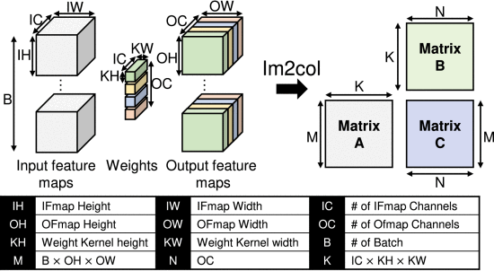

TMA는 Tensor 기반 DSM reduction을 GMEM에 쓰는 기능도 지원한다.

```c++
// shared::cta -> global:
cp.reduce.async.bulk.tensor.dim.dst.src.redOp{.load_mode}.completion_mechanism{.level::cache_hint}
                                          [tensorMap, tensorCoords], [srcMem] {,cache-policy}

.dst =                  { .global }
.src =                  { .shared::cta }
.dim =                  { .1d, .2d, .3d, .4d, .5d }
.completion_mechanism = { .bulk_group }
.load_mode =            { .tile, .im2col_no_offs }
.redOp =                { .add, .min, .max, .inc, .dec, .and, .or, .xor}
```

그리고 GMEM 안에서 Tensor 기반 prefetch 기능도 지원한다.

```c++
// global -> shared::cluster:
cp.async.bulk.prefetch.tensor.dim.L2.src{.load_mode}{.level::cache_hint} [tensorMap, tensorCoords]
                                                             {, im2colOffsets } {, cache-policy}

.src =                { .global }
.dim =                { .1d, .2d, .3d, .4d, .5d }
.load_mode =          { .tile, .im2col }
.level::cache_hint =  { .L2::cache_hint }
```

##### 2.3.2.5 TMA 프로그래밍

CUDA_Samples에 예시로 사용할 수 있는 PR이 하나 있다: Add TMA example for Hopper H100 #214[5]

`1. cuTensorMap 초기화`로 GMEM 데이터를 준비한다.

```c++
 std::vector<int> tensor_host(H_global * W_global);
  for (int i = 0; i < H_global * W_global; ++i) {
    tensor_host[i] = i;
  }

  // Move it to device
  int * tensor = nullptr;
  CUDA_CHECK(cudaMalloc(&tensor, H_global * W_global * sizeof(int)));
  CUDA_CHECK(cudaMemcpy(tensor, tensor_host.data(), H_global * W_global * sizeof(int), cudaMemcpyHostToDevice));
```

CUtensorMap을 초기화할 때 GMEM 포인터 `*tensor`와 대응하는 Shape, Stride 등의 parameter를 지정한다.

```c++
  CUtensorMap tma_desc{};
  CUtensorMapDataType dtype = CUtensorMapDataType::CU_TENSOR_MAP_DATA_TYPE_INT32;
  auto rank = 2;
  uint64_t size[rank] = {W_global, H_global};
  uint64_t stride[rank - 1] = {W_global * sizeof(int)};
  uint32_t box_size[rank] = {SMEM_W, SMEM_H};
  uint32_t elem_stride[rank] = {1, 1};
  CUtensorMapInterleave interleave = CUtensorMapInterleave::CU_TENSOR_MAP_INTERLEAVE_NONE;
  CUtensorMapSwizzle swizzle = CUtensorMapSwizzle::CU_TENSOR_MAP_SWIZZLE_NONE;
  CUtensorMapL2promotion l2_promotion = CUtensorMapL2promotion::CU_TENSOR_MAP_L2_PROMOTION_NONE;
  CUtensorMapFloatOOBfill oob_fill = CUtensorMapFloatOOBfill::CU_TENSOR_MAP_FLOAT_OOB_FILL_NONE;

  // Create the tensor descriptor.
  CUresult res = cuTensorMapEncodeTiled(
      &tma_desc,    // CUtensorMap *tensorMap,
      dtype,        // CUtensorMapDataType tensorDataType,
      rank,         // cuuint32_t tensorRank,
      tensor,       // void *globalAddress,
      size,         // const cuuint64_t *globalDim,
      stride,       // const cuuint64_t *globalStrides,
      box_size,     // const cuuint32_t *boxDim,
      elem_stride,  // const cuuint32_t *elementStrides,
      interleave,   // CUtensorMapInterleave interleave,
      swizzle,      // CUtensorMapSwizzle swizzle,
      l2_promotion, // CUtensorMapL2promotion l2Promotion,
      oob_fill      // CUtensorMapFloatOOBfill oobFill);
    );
```

`2. TMA 연산 함수 구성`

```c++
inline __device__ void cp_async_bulk_tensor_2d(
  __mbarrier_t *barrier, void *dst, int access_coord_x, int access_coord_y, const CUtensorMap *tensor_desc)
{
  unsigned smem_int_ptr = static_cast<unsigned int>(__cvta_generic_to_shared(dst));
  unsigned smem_barrier_int_ptr = static_cast<unsigned int>(__cvta_generic_to_shared(barrier));
  uint64_t tensor_desc_ptr = reinterpret_cast<uint64_t>(tensor_desc);

  asm volatile(
    "cp.async.bulk.tensor.2d.shared::cluster.global.tile.mbarrier::complete_tx::bytes "
    "[%0], [%1, {%2, %3}], [%4];\n"
    :
    : "r"(smem_int_ptr),
      "l"(tensor_desc_ptr),
      "r"(access_coord_x),
      "r"(access_coord_y),
      "r"(smem_barrier_int_ptr)
    : "memory");
}
```

`3. mbarrier`

```c++
inline __device__ __mbarrier_token_t barrier_arrive1_tx(__mbarrier_t *barrier, uint32_t expected_tx_count )
{
  __mbarrier_token_t token;
  asm volatile("mbarrier.arrive.expect_tx.release.cta.shared::cta.b64 %0, [%1], %2;"
               : "=l"(token)
               : "r"(static_cast<unsigned int>(__cvta_generic_to_shared(barrier))), "r"(expected_tx_count)
               : "memory");
  return token;
}

inline __device__ bool barrier_try_wait_token(__mbarrier_t *barrier, __mbarrier_token_t token)
{
  int __ready;
  asm volatile("{\n\t"
               ".reg .pred p;\n\t"
               "mbarrier.try_wait.acquire.cta.shared::cta.b64 p, [%1], %2;\n\t"
               "selp.b32 %0, 1, 0, p;\n\t"
               "}"
               : "=r"(__ready)
               : "r"(static_cast<unsigned int>(__cvta_generic_to_shared(barrier))),
                 "l"(token)
               : "memory");
  return __ready;
}
```

`4. Kernel 함수`

```c++
template <int H, int W>
struct smem_t {
  // TMA는 주소가 128B aligned되어야 한다
  struct alignas(128) tensor_buffer {
    int data[H][W];
    __device__ constexpr int width() {return W;}
    __device__ constexpr int height() {return H;}
  };
  tensor_buffer buffer;

  // Put the barrier behind the tensor buffer to prevent 100+ bytes of padding.
  __mbarrier_t bar;
  __device__ constexpr int buffer_size_in_bytes() {
    return sizeof(tensor_buffer::data);
  }
};

__global__ void kernel(const __grid_constant__ CUtensorMap tma_desc, int x_0, int y_0) {

  // shared memory 선언
  __shared__ smem_t<SMEM_H, SMEM_W> smem;

  bool leader = threadIdx.x == 0;
  if (leader) {
    // barrier 초기화
    __mbarrier_init(&smem.bar, blockDim.x);
  }
  __syncthreads();

  __mbarrier_token_t token;

  // 첫 번째 Batch 로드
  if (leader) {
    // Initiate bulk tensor copy.
    cp_async_bulk_tensor_2d(&smem.bar, &smem.buffer.data, x_0, y_0, &tma_desc);
    // cp_async_bulk_tensor_2d가 copy할 데이터에 대한 barrier 예상값
    token = barrier_arrive1_tx(&smem.bar, smem.buffer_size_in_bytes());
  } else {
    // 다른 thread의 tx는 0이다.
    token = barrier_arrive1_tx(&smem.bar, 0);
  }

  while(! barrier_try_wait_token(&smem.bar, token)) { };

  if (leader) {
    printf("\n\nPrinting tile at coordinates x0 = %d, y0 = %d\n", x_0, y_0);

    // Print global x coordinates
    printf("global->\t");
    for (int x = 0; x < smem.buffer.width(); ++x) {
      printf("[%4d] ", x_0 + x);
    }
    printf("\n");

    // Print local x coordinates
    printf("local ->\t");
    for (int x = 0; x < smem.buffer.width(); ++x) {
      printf("[%4d] ", x);
    }
    printf("\n");

    for (int y = 0; y < smem.buffer.height(); ++y) {
      // Print global and local y coordinates
      printf("[%4d] [%2d]\t", y_0 + y, y);
      for (int x = 0; x < smem.buffer.width(); ++x) {
        printf(" %4d  ", smem.buffer.data[y][x]);
      }
      printf("\n");
    }

    //invalid barrier
   __mbarrier_inval(&smem.bar);
  }
}
```

컴파일하면 TMA의 SASS instruction UTMALDG(Load from GMEM, 2D Tensor)를 볼 수 있다.

```c++
nvcc -arch sm_90 -c tma1.cu;cuobjdump -sass tma1.o | grep TMA
        /*02c0*/                   UTMALDG.2D [UR8], [UR4] ;                                 /* 0x00000008040075b4 */
```

CUDA에서도 유사한 experimental API를 제공한다.

```c++
cuda::device::experimental::cp_async_bulk_tensor_2d_shared_to_global(&tensor_map, x, y, &smem_buffer);
```

지면 관계상 TMA에 대한 더 많은 내용은 이후 Flash Attention-3 관련 연산자 알고리즘에서 소개하겠다.

#### 2.3.2 WGMMA

Hopper에서는 하나의 SM 안의 4개 SubCore를 함께 묶을 수 있고, 연속된 4개의 Warp가 WarpGroup을 구성해 TMA와 함께 4개의 TensorCore가 병렬로 수행하는 64xNx16(N=8~256) 행렬 곱셈을 구현한다.

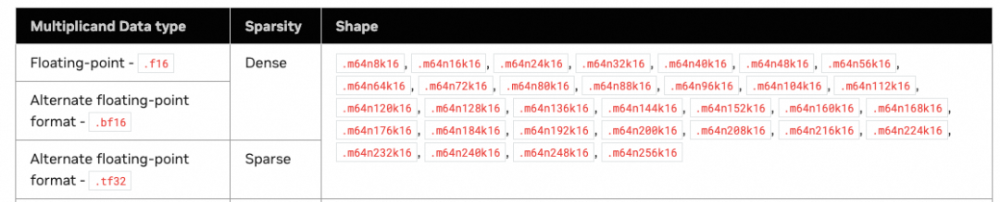

주의해야 할 점은 이것이 Hopper SM90 아키텍처에서만 지원되는 기능이라는 것이다.

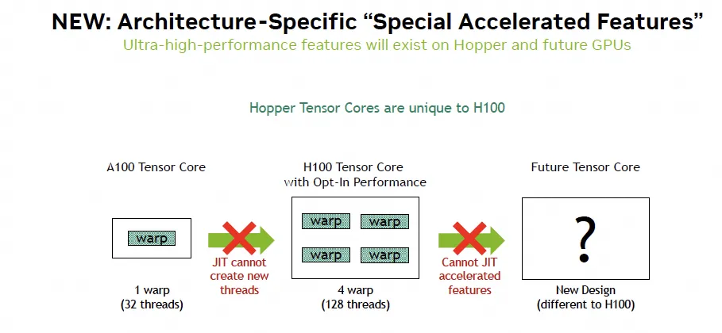

4개 Warp 안의 128개 스레드가 협력해야 하므로 WGMMA 역시 비동기 instruction이다.

- wgmma.mma\_async
- wgmma.fence
- wgmma.commit\_group
- wgmma.wait\_group

행렬 곱셈 $D= A * B + C$에 대해, 먼저 이들을 SMEM 또는 register에 로드해야 한다. 로드가 끝난 뒤에는 warp group level에서 `wgmma.fence` 연산을 실행해야 한다. 그런 다음 `wgmma.mma_async`를 실행한다. 모든 outstanding `wgmma.mma_async`에 대해서는 `wgmma.commit_group` 연산을 수행하고, `wgmma.wait_group`으로 완료를 기다린다.

주의해야 할 점은 CD 행렬이 반드시 register 위에 있어야 하며, shape은 (M=64, N), Layout은 Row-Major 형식이라는 것이다.

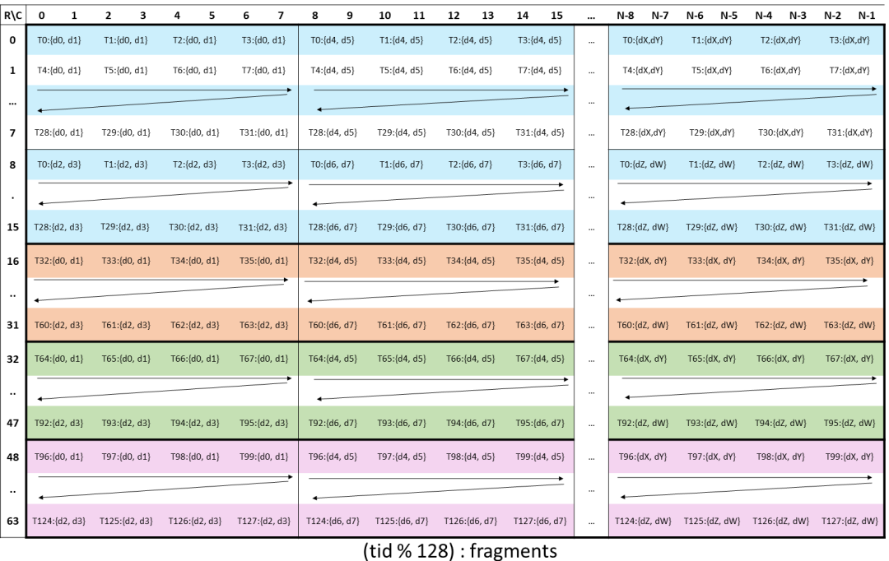

A와 B 행렬은 register 위에 있을 수도 있고 SMEM 위에 있을 수도 있다. SMEM 위에 있을 때는 8x8 Core Matrix Layout 방식을 사용한다.

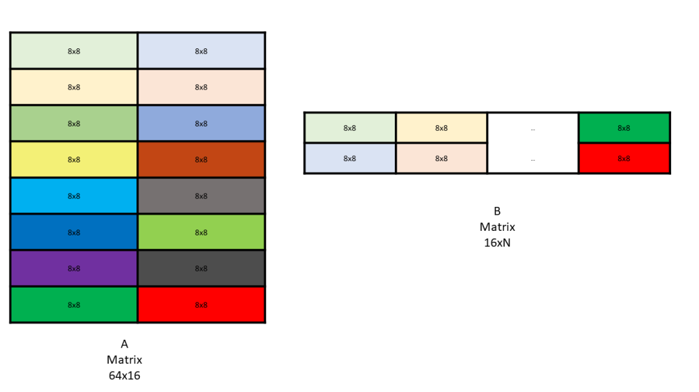

A는 Row-major Zigzag 배열을 사용한다.

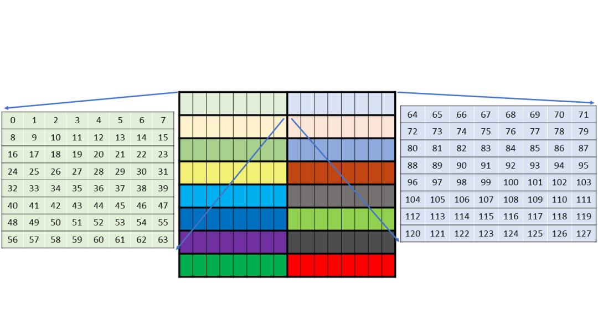

B 행렬은 Col-major Zigzag 배열을 사용한다.

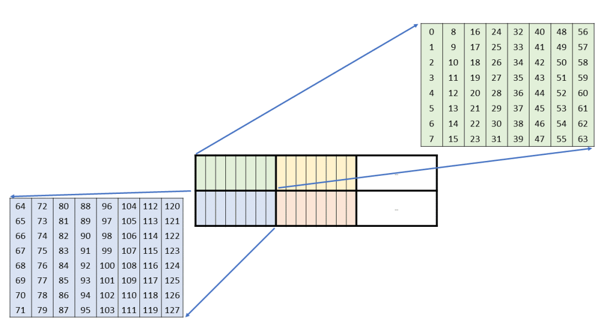

WGMMA instruction은 다음과 같다.

```c++
wgmma.mma_async.sync.aligned.shape.dtype.f16.f16  d, a-desc, b-desc, scale-d, imm-scale-a, imm-scale-b, imm-trans-a, imm-trans-b;

wgmma.mma_async.sync.aligned.shape.dtype.f16.f16  d, a, b-desc, scale-d, imm-scale-a, imm-scale-b, imm-trans-b;
.shape   = {.m64n8k16, .m64n16k16, .m64n24k16, .m64n32k16,
            .m64n40k16, .m64n48k16, .m64n56k16, .m64n64k16,
            .m64n72k16, .m64n80k16, .m64n88k16, .m64n96k16,
            .m64n104k16, .m64n112k16, .m64n120k16, .m64n128k16,
            .m64n136k16, .m64n144k16, .m64n152k16, .m64n160k16,
            .m64n168k16, .m648176k16, .m64n184k16, .m64n192k16,
            .m64n200k16, .m64n208k16, .m64n216k16, .m64n224k16,
            .m64n232k16, .m64n240k16, .m64n248k16, .m64n256k16};
.dtype   = {.f16, .f32};
```

여기서 parameter `d`는 결과 행렬의 register이고, `a-desc`와 `b-desc`는 AB 행렬의 descriptor이다. `scale-d`는 `D=A*B+D`에 D를 더해야 하는지 나타내고, imm-scale-a/b는 AB 행렬 부호의 immediate value이며, imm-trans-a/b는 AB 행렬 transpose 여부의 immediate value이다.

현재 손에 Hopper 카드가 없으므로, 작은 실험으로 컴파일러가 생성하는 instruction을 살펴보자. 예를 들어 M64N16K16 행렬 곱셈이 필요하다고 하면, 결과 행렬 D에는 `M*N=64*16=1024`개의 register가 필요하다. 하나의 WarpGroup에는 128개 스레드가 있으므로 평균적으로 각 스레드에는 8개의 register가 필요하다. Cutelass의 `include/cute/arch/mma_sm90_gmma.hpp`에는 대응하는 예시 `struct SM90_64x16x16_F32F16F16_SS`가 있으며, 여기서 SS는 AB가 모두 SMEM에 있음을 의미하고 RS는 A가 register에, B가 SMEM에 있음을 의미한다.

```c++
#include<cuda.h>

__global__ void kernel(float* D, uint64_t desc_a, uint64_t desc_b, const int scaleA, const int scaleB, const int scale_D, const int tnspA,const int tnspB) {
     float d[16];

     for (int i = 0 ; i < 16 ; ++i ) {
       d[i]=0;
     }

    asm volatile(
    "{\n"
      ".reg .pred p;\n"
      "setp.ne.b32 p, %10, 0;\n"
      "wgmma.mma_async.sync.aligned.m64n16k16.f32.f16.f16 "
      "{%0,  %1,  %2,  %3,  %4,  %5,  %6,  %7},"
      " %8,"
      " %9,"
      " p,   1, 1 , 0 , 0; \n"
    "}\n"
      : "+f"(d[0]), "+f"(d[1]), "+f"(d[2]), "+f"(d[3]),
        "+f"(d[4]), "+f"(d[5]), "+f"(d[6]), "+f"(d[7])
      :  "l"(desc_a),
         "l"(desc_b),
         "r"(int32_t(scale_D)));

    //store to GMEM
    for(int i = 0 ; i < 8 ; ++i ) {
      D[i] = d[i];
    }
}
```

컴파일 시 WGMMA instruction은 SM_90a 아키텍처 지원이 필요하다는 점에 주목할 수 있다.

```
#nvcc -arch sm_90 -c wgmma.cu
ptxas /tmp/tmpxft_0014c40f_00000000-6_wgmma.ptx, line 48; error   : Instruction 'wgmma.mma_async with floating point types' not supported on .target 'sm_90'

# nvcc -arch sm_90a -c wgmma.cu ; cuobjdump -sass wgmma.o > wgmma.sass
```

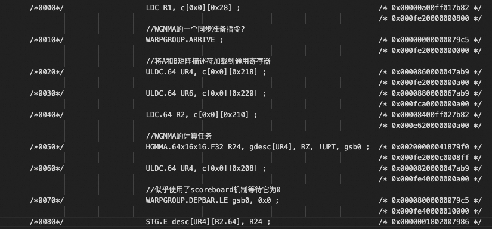

여러 WGMMA 곱셈을 병렬 실행해야 할 때는 끝에 commit_group/wait_group을 추가해야 한다. 아래와 같다.

```c++
__global__ void kernel(float* D, uint64_t desc_a, uint64_t desc_b, const int scaleA, const int scaleB, int scale_D, const int tnspA,const int tnspB) {
     float d[16];

     for (int i = 0 ; i < 16 ; ++i ) {
       d[i]=0;
     }

    asm volatile(
    "{\n"
      ".reg .pred p;\n"
      "setp.ne.b32 p, %10, 0;\n"
      "wgmma.mma_async.sync.aligned.m64n16k16.f32.f16.f16 "
      "{%0,  %1,  %2,  %3,  %4,  %5,  %6,  %7},"
      " %8,"
      " %9,"
      " p,   1, 1 , 0 , 0; \n"
    "}\n"
      : "+f"(d[0]), "+f"(d[1]), "+f"(d[2]), "+f"(d[3]),
        "+f"(d[4]), "+f"(d[5]), "+f"(d[6]), "+f"(d[7])
      :  "l"(desc_a),
         "l"(desc_b),
         "r"(int32_t(scale_D)));

    // 컴파일러 최적화 방지
    desc_a++;
    desc_b++;
    scale_D=1;

    asm volatile(
    "{\n"
      ".reg .pred p;\n"
      "setp.ne.b32 p, %10, 0;\n"
      "wgmma.mma_async.sync.aligned.m64n16k16.f32.f16.f16 "
      "{%0,  %1,  %2,  %3,  %4,  %5,  %6,  %7},"
      " %8,"
      " %9,"
      " p,   1, 1 , 0 , 0; \n"
    "}\n"
      : "+f"(d[8]), "+f"(d[9]), "+f"(d[10]), "+f"(d[11]),
        "+f"(d[12]), "+f"(d[13]), "+f"(d[14]), "+f"(d[15])
      :  "l"(desc_a),
         "l"(desc_b),
         "r"(int32_t(scale_D)));

    asm volatile("wgmma.commit_group.sync.aligned;");
    asm volatile("wgmma.wait_group.sync.aligned 0;");

    //store to GMEM
    for(int i = 0 ; i < 16 ; ++i ) {
      D[i] = d[i];
    }
}
```

이때 첫 번째 wgmma instruction에는 scoreboard가 사라진다.

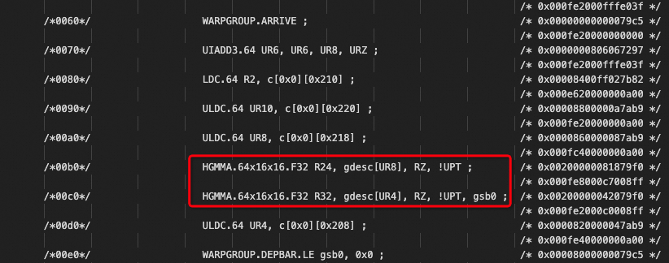

다음 글에서는 TensorCore로 행렬 곱셈 연산을 어떻게 가속하는지 이야기하고, 이를 통해 Cutlass 프로그래밍 framework를 점차 이해해 보겠다.

참고 자료

[1]

Modeling Deep Learning Accelerator Enabled GPUs: https://arxiv.org/abs/1811.08309

[2]

Automatic Kernel Generation for Volta Tensor Cores: https://arxiv.org/pdf/2006.12645

[3]

PTX instruction set: https://docs.nvidia.com/cuda/parallel-thread-execution/index.html

[4]

Controlling Data Movement to Boost Performance on the NVIDIA Ampere Architecture: https://developer.nvidia.com/blog/controlling-data-movement-to-boost-performance-on-ampere-architecture/

[5]

Add TMA example for Hopper H100 #214: https://github.com/NVIDIA/cuda-samples/pull/214
