# Tensor-004 TensorCore 프로그래밍 및 최적화

- 원문 제목: Tensor-004 TensorCore 프로그래밍 및 최적화
- 저자: 환베이
- 계정: zartbot
- 발행일: 2024년 8월 10일 08:31

TensorCore 프로그래밍 관련 코드는 참고할 수 있다. 이 글은 그 코드들을 바탕으로 정리했으며, `Credit은 이 코드들의 저자에게 있다`.

1. Cuda-Samples[1]의 cudaTensorCoreGemm 코드
2. Zhihu: 무쯔즈의 《Nvidia Tensor Core-CUDA HGEMM 최적화 심화》[2]
3. Cutlass v0.1.1[3]
4. 《DEVELOPING CUDA KERNELS TO PUSH TENSOR CORES TO THE ABSOLUTE LIMIT ON NVIDIA A100》[4]

이 글은 주로 TensorCore operand 공급 최적화 관련 내용과 관련 최적화 방법들의 테스트 비교를 다룬다.

| Kernel | GFLOPs/S | cuBLAS 대비 성능 |
| --- | --- | --- |
| Cublas | 90051.0 | 100% |
| Load From GMEM | 6921.4 | 7.6% |
| Hierarchy Load | 49311.8 | 54.7% |
| + Padding SMEM | 53842.7 | 59.7% |
| + Async Copy | 57837.5 | 64.2% |
| + GMEM->SMEM Doublebuffer | 69233.1 | 76.8% |
| + SMEM->RF DoubleBuffer | 70111.5 | 77.8% |
| + Multistage with Swizzle | 91842.1 | 101.9% |

관련 테스트 코드는 github.com/zartbot/tensorecore\_gemm[5]에서 볼 수 있다.

이 글의 목차는 다음과 같다.

```
0. Recap GEMM Optimization
1. TensorCore 프로그래밍
1.1 GMEM에서 직접 로드하는 반례부터 시작하기
1.2 GEMM의 계층 구조
1.3 Padding으로 Bank conflict 완화
1.4 비동기 copy
2. Pipeline 최적화
2.1 GMEM에서 SMEM으로, Double Buffer
2.2 SMEM에서 RF로, DoubleBuffer
2.3 Pipeline 심화
3. 맺음말
```

현재 손에 테스트 가능한 A10 카드 한 장만 있으므로, 이 TensorCore 관련 최적화에는 Hopper가 포함되지 않는다. 또한 Hopper의 TMA/WGMMA 도입은 TensorCore 비동기 프로그래밍 방법도 바꾸었기 때문에, 이후 Cutlass를 소개할 때 관련 내용을 보충하겠다.

## 0. Recap GEMM Optimization

이 장에서 TensorCore 소개를 시작하기 전에, 먼저 Tensor-002에서 소개한 GEMM 최적화 관련 단계들을 간단히 되짚어 본다. 우선 단순한 내적 행렬 곱셈 루프가 가져오는 비효율적인 메모리 접근부터 시작한다.

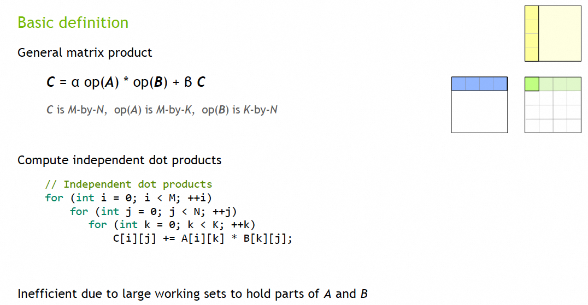

외적 방식으로 최적화하면, 중간 차원 K를 가장 바깥쪽 loop로 올리기만 하면 되어 A/B 행렬의 load 횟수를 줄일 수 있다.

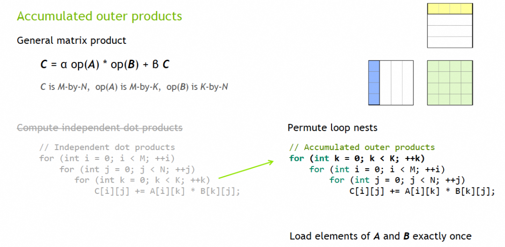

그다음 cache 구조를 더 고려해 SMEM을 사용하여 가능한 한 여러 번 계산할 수 있게 하면, 행렬 block 분할 곱셈이 나온다.

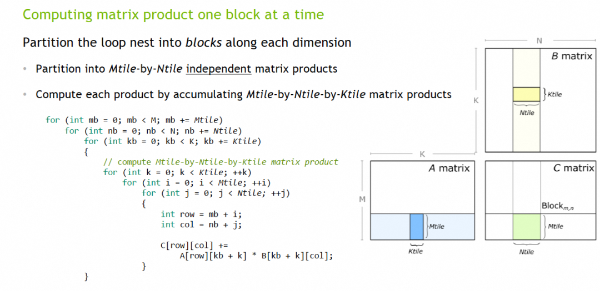

이어서 block 내부에서 thread 병렬 처리를 수행하는 것을 고려할 수 있다.

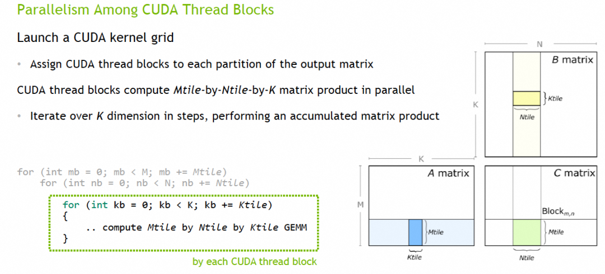

따라서 Thread Block Tile 구조를 도입한다.

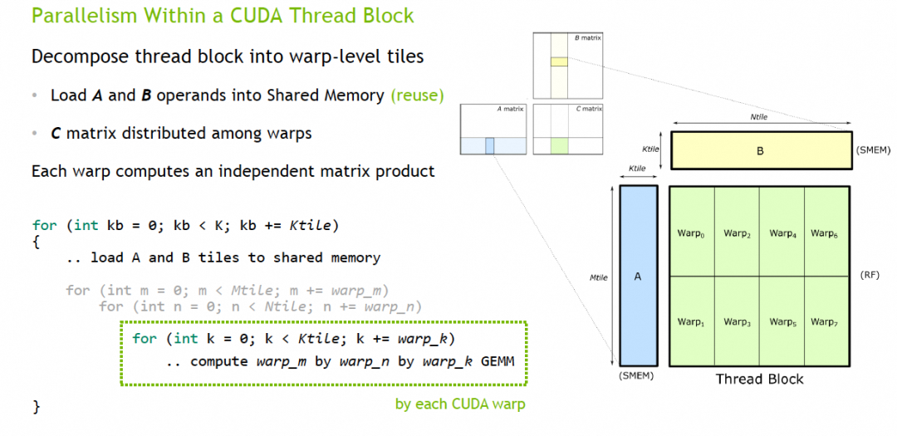

일부 Bank Conflict 관련 문제를 해결하기 위해, 다시 Warp 기반 분할로 병렬화를 더 진행하여 Warp-Level TILE 구조를 도입한다.

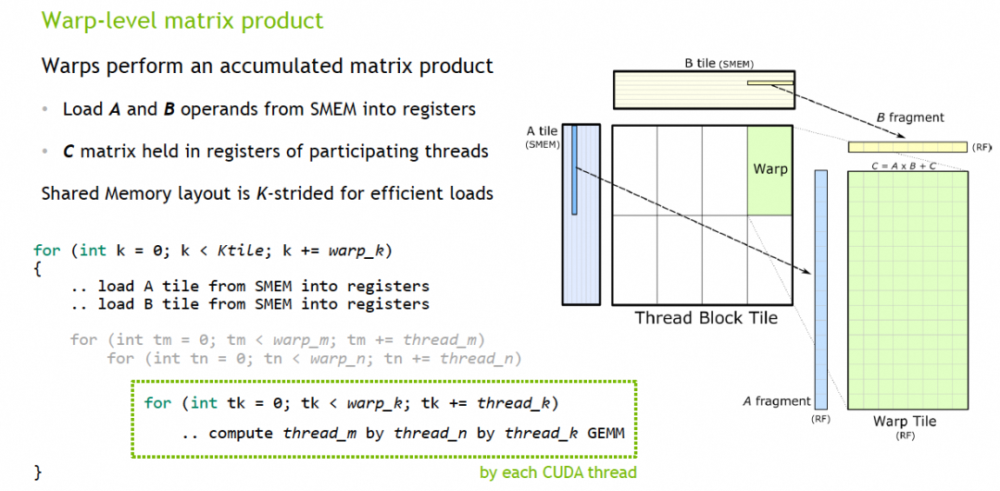

마지막으로 Warp 내부에서 thread 병렬 처리를 수행한다.

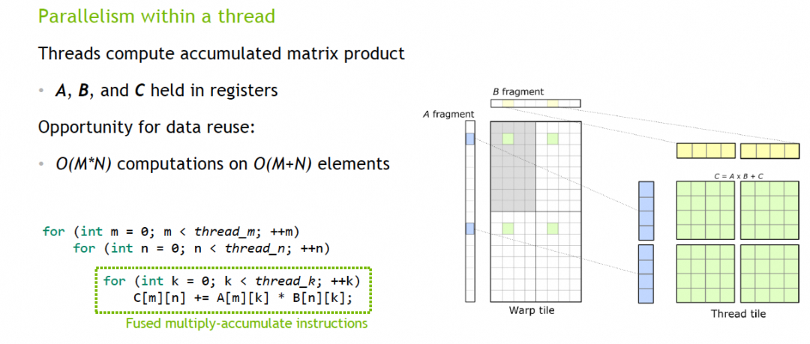

마지막으로 전체 GEMM의 계층적 block 분할과 data load 재사용 흐름은 다음과 같다.

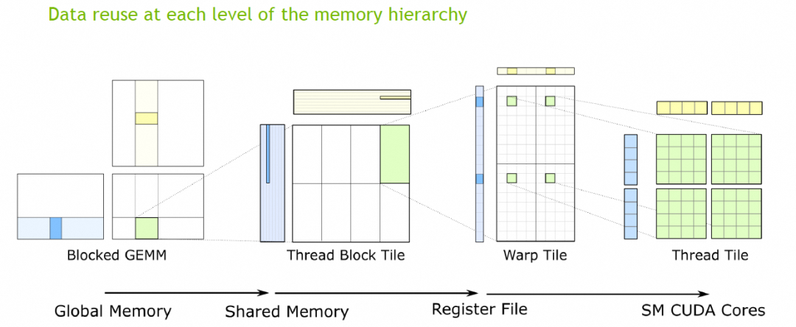

전체 행렬 곱셈의 multi-level block 분할 과정을 loop로 표현하면 다음과 같다.

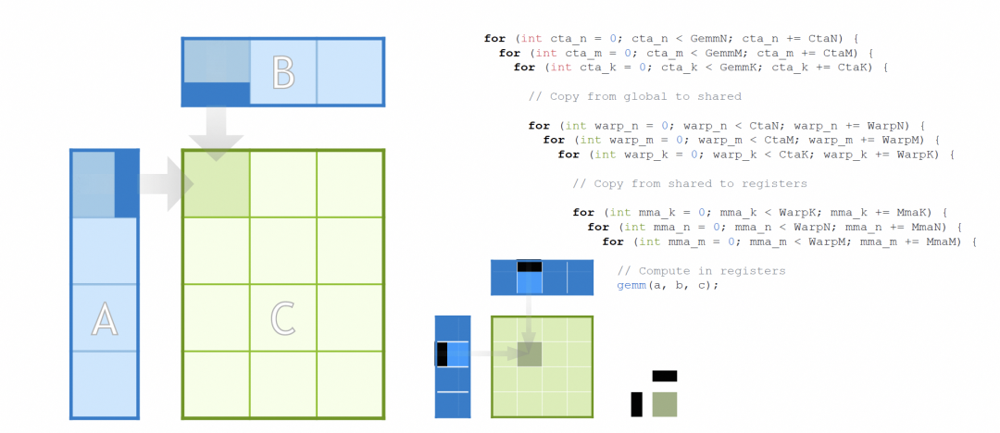

## 1. TensorCore 프로그래밍

TensorCore를 사용할 때의 흐름도 기본적으로 동일하다. 마찬가지로 block을 GMEM에서 SMEM으로 copy한 뒤, 다시 WarpTile로 쪼개 register로 copy해야 한다. 다만 기존에 CUDA Core로 계산하던 GEMM을 TensorCore 사용으로 바꾼다는 점만 다르며, 아래 그림과 같다.

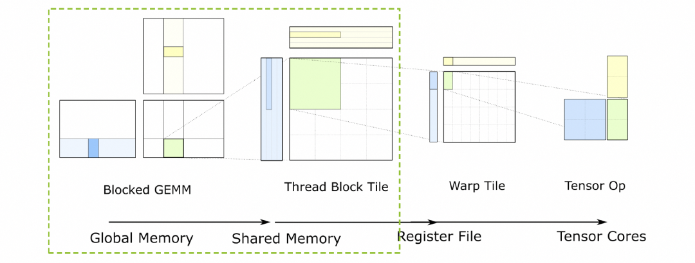

먼저 Cublas를 기준으로 성능 baseline을 테스트해 보면, A10에서는 90.0TFLOPs이다.

```
#include <stdio.h>
#include <stdlib.h>
#include "cublas_v2.h"

#define M_GLOBAL 4096
#define N_GLOBAL 4096
#define K_GLOBAL 4096
#define ITER 100

void launch_gemm(size_t M, size_t N, size_t K, half *A, half *B, half *C, half alpha, half beta)
{
  cublasHandle_t handle;
  cublasCreate(&handle);
  cublasSetMathMode(handle, CUBLAS_TENSOR_OP_MATH);

  cublasGemmEx(handle, CUBLAS_OP_T, CUBLAS_OP_N, N, M, K, &alpha, B, CUDA_R_16F, K, A,
               CUDA_R_16F, K, &beta, C, CUDA_R_16F, N, CUBLAS_COMPUTE_16F,
               CUBLAS_GEMM_DEFAULT_TENSOR_OP);
}

int main()
{
    const float alpha = 1.0f;
    const float beta = 0.0f;

    int dev = 0;
    cudaDeviceProp deviceProp;
    cudaGetDeviceProperties(&deviceProp, dev);

    //testError();

    half *d_a, *d_b, *d_c;
    cudaMalloc(&d_a, M_GLOBAL * K_GLOBAL * sizeof(half));
    cudaMalloc(&d_b, K_GLOBAL * N_GLOBAL * sizeof(half));
    cudaMalloc(&d_c, M_GLOBAL * N_GLOBAL * sizeof(half));

    cudaEvent_t start, end;
    cudaEventCreate(&start);
    cudaEventCreate(&end);

    cudaEventRecord(start);
    for (int i = 0; i < ITER; i++)
        launch_gemm(M_GLOBAL, N_GLOBAL, K_GLOBAL, d_a, d_b, d_c, alpha, beta);

    cudaEventRecord(end);
    cudaEventSynchronize(end);

    float msec;
    cudaEventElapsedTime(&msec, start, end);

    long workload = long(M_GLOBAL) * N_GLOBAL * K_GLOBAL * 2 * ITER;
    double avg_Gflops = ((double)workload / 1e9) / (double(msec) / 1e3);
    printf("Average Performance  %10.1lf Gflops\n", avg_Gflops);

    cudaFree(d_a);
    cudaFree(d_b);
    cudaFree(d_c);
}

# nvcc -lcublas -arch sm_86 00-cublas.cu -o bin/00
# ./bin/00
Average Performance     90051.0 Gflops

# ncu --set full  -c 5 -o 12 ./bin/12
==PROF== Profiling "ampere_h16816gemm_256x128_ldg..." - 0 (1/5): 0%....50%....100% - 37 passes
```

Profiling할 때 호출된 kernel은 `ampere_h16816gemm_256x128_ldg8_stages_32x3_tn`이었다.

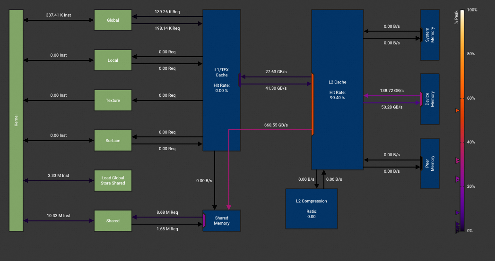

memory access 관점에서는 async copy(LDGSTS)를 호출하고 L1 Cache를 bypass했으며, 행렬 곱셈에는 TensorCore(HMMA)를 사용하고 행렬 load에는 ldmatrix(LDSM)를 사용했다.

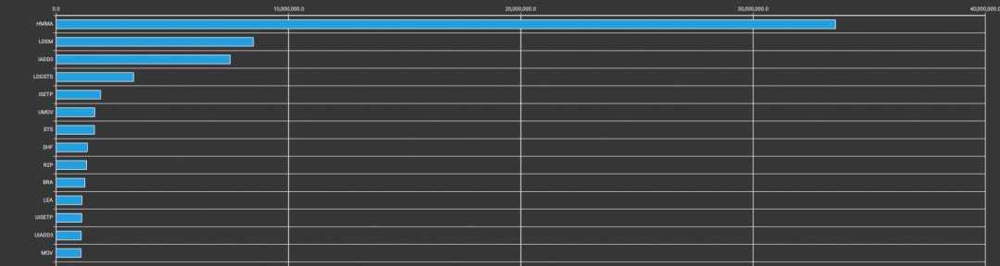

### 1.1 GMEM에서 직접 로드하는 반례부터 시작하기

단계적으로 분할해 memory를 옮기고 Data Locality를 충분히 활용하는 방식이 필수임을 보이기 위해, 먼저 반례 하나를 테스트한다. TensorCore를 이용해 GMEM에서 직접 load해 계산하는 방식이며, block 분할은 아래 그림과 같다.

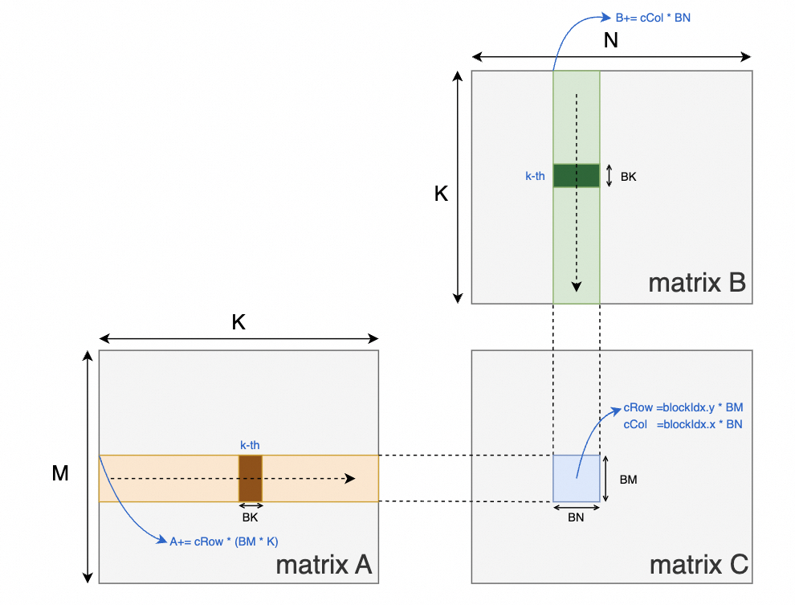

```c++
#include "mma.h"
using namespace nvcuda;

#define CEIL_DIV(M, N) (((M) + (N) - 1) / (N))

#define BLOCK_M 16
#define BLOCK_N 16
#define BLOCK_K 16

#define WARP_SIZE 32

using namespace nvcuda;

__global__ void naiveBlockKernel(const half *A, const half *B, half *C,
                                 size_t M, size_t N, size_t K)
{
    const size_t K_tiles = CEIL_DIV(K, BLOCK_K);

    const size_t c_row = blockIdx.y * BLOCK_M;
    const size_t c_col = blockIdx.x * BLOCK_N;

    if (c_row >= M && c_col >= N)
    {
        return;
    }

    wmma::fragment<wmma::accumulator, BLOCK_M, BLOCK_N, BLOCK_K, half> C_frag;
    wmma::fill_fragment(C_frag, 0.0);

#pragma unroll
    for (size_t i = 0; i < K_tiles; ++i)
    {
        wmma::fragment<wmma::matrix_a, BLOCK_M, BLOCK_N, BLOCK_K, half, wmma::row_major> A_frag;
        wmma::fragment<wmma::matrix_b, BLOCK_M, BLOCK_N, BLOCK_K, half, wmma::col_major> B_frag;

        wmma::load_matrix_sync(A_frag, A + c_row * K + i * BLOCK_K, K);
        wmma::load_matrix_sync(B_frag, B + i * BLOCK_K + c_col * K, K);

        wmma::mma_sync(C_frag, A_frag, B_frag, C_frag);
    }
    wmma::store_matrix_sync(C + c_row * N + c_col, C_frag, N, wmma::mem_row_major);
}

void launch_gemm(int M, int N, int K, half *A, half *B, half *C)
{
    dim3 block(WARP_SIZE);
    dim3 grid(CEIL_DIV(N, BLOCK_N), CEIL_DIV(M, BLOCK_M));

    naiveBlockKernel<<<grid, block>>>(A, B, C, M, N, K);
}

# nvcc -arch sm_86 01-native.cu -o bin/01
# ./bin/01
Naive AveragePerformance      6921.4 Gflops
```

그 peak 처리 능력은 겨우 7TFLOPs임을 볼 수 있다. Profiling 결과는 다음과 같다.

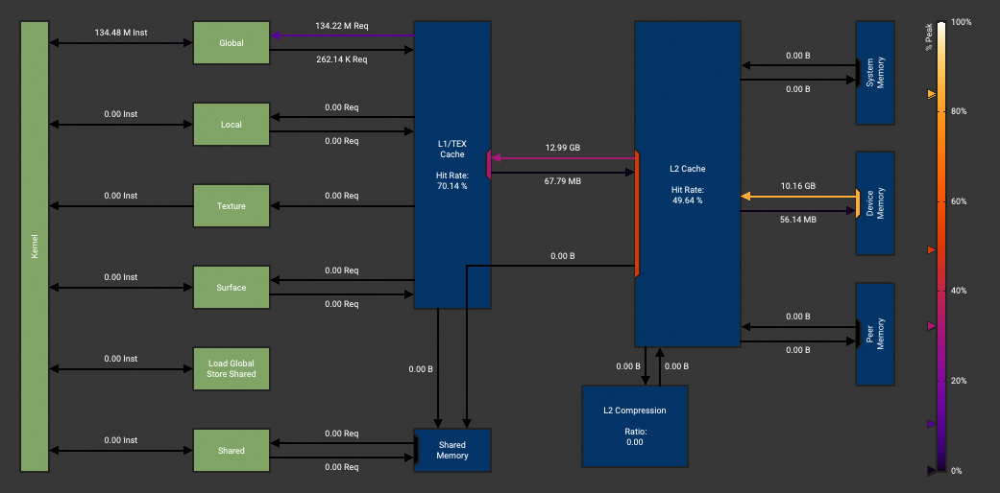

### 1.2 GEMM의 계층 구조

각 block의 이름과 해당 Shape 변수명을 정의하면 아래 그림과 같다.

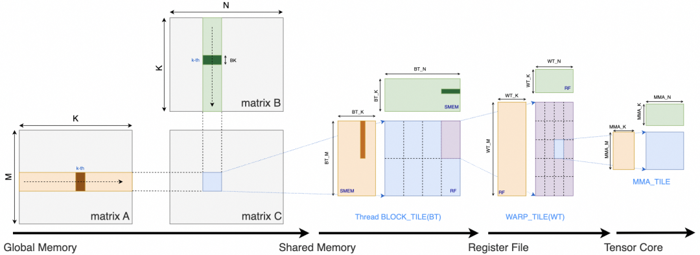

Thread Block Tile은 줄여서 BT라고 하고, Warp level block(WARP\_TILE)은 WT라고 한다. 마지막으로 TensorCore가 계산하는 부분은 MMA\_TILE로 정의하며, 해당 Shape은 BT\_/WT\_/MMA\_를 prefix로 사용해 구분한다.

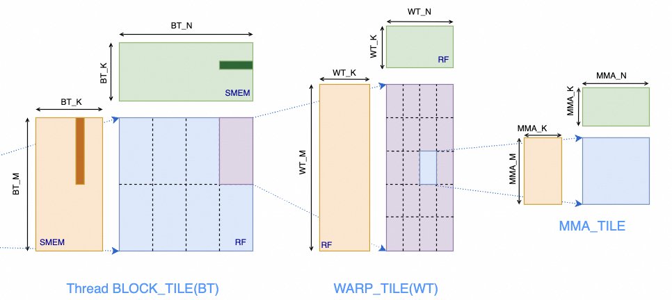

행렬 곱셈의 pseudo code는 다음과 같다.

```c++
// Loop1A: Thread BLOCK_TILE 병렬 계산
  Loop1A: for each m, n in M, N with step BT_M, BT_N
    Loop1B: for each k in K with step BT_K
        Move a chunk of A from GMEM to SMEM (As)
        Move a chunk of B from GMEM to SMEM (Bs)

        // Loop2A: WARP_TILE 병렬 계산
        Loop2A: for each mm, nn in BT_M, BT_N with step WT_M, WT_N
          Loop2B: for each kk in BT_K with step WT_K
            Move a chunk of As from SMEM to RMEM (Ar)
            Move a chunk of Bs from SMEM to RMEM (Br)
            // run mma and accumulate in registers
            mma(Ar, Br, accum)
```

MMA의 Shape은 WMMA API 기준으로 보통 16x16x16으로 정의한다. BT/WT의 Shape은 일반적으로 입력 행렬(GLOBAL M,N,K)과 서로 다른 hardware platform(SMEM 크기/TensorCore 구현)에 관련된다. BlockTile\_A와 BlockTile\_B는 SMEM에 load해야 하며, 동시에 계산 밀도와 Warp 분포도 보장해야 한다. 따라서 A/B의 형상을 분류해야 하며, Cutlass `dispatch_policies.h`에서는 `Small`, `Medium`, `Large`, `Tall`, `Wide`, `Huge` 등 여러 가지로 분류한다.

상대적으로 큰 M=N=K=4096인 HGEMM(half precision 행렬 곱셈)을 예로 든다. BT\_A / BT\_B를 SMEM에 배치해야 하고, 결과 행렬 BT\_D도 SMEM에 둔 뒤 정렬해 GMEM으로 copy해야 한다. 따라서 SMEM 사용량이 조건을 만족하는지 추정하고, Launch Kernel 시 설정할 수 있다.

```c++
void launch_gemm(size_t M, size_t N, size_t K, half *A, half *B, half *C, half alpha, half beta)
{
    // platform SHMEM SIZE 가져오기
    int dev_id = 0;
    cudaDeviceProp dev_prop;
    cudaGetDeviceProperties(&dev_prop, dev_id);

    size_t SHMEM_SZ =
        std::max((BT_M + BT_N) * MMA_SMEM_STRIDE_K * sizeof(half), BT_M * BT_N * sizeof(half));

    if (dev_prop.sharedMemPerMultiprocessor > SHMEM_SZ)
        cudaFuncSetAttribute(blockGemmKernel,
                             cudaFuncAttributeMaxDynamicSharedMemorySize,
                             SHMEM_SZ);

    dim3 block(BT_THREAD_NUM);
    dim3 grid(CEIL_DIV(M, BT_M), CEIL_DIV(N, BT_N));
    blockGemmKernel<<<grid, block, SHMEM_SZ>>>(A, B, C, M, N, K);
}
```

동시에 WARP\_TILE의 SIZE도 고려해야 한다. 일반적인 분할 방식은 하나의 Block\_Tile을 2x4=8개 WARP로 나누는 것이다. 따라서 BT\_SIZE를 256x128, WT\_SIZE를 64x64로 설정했으며, 계산 시 CHUNK\_K도 SMEM 사용량에 따라 조정해야 한다. 관련 변수 macro 정의는 다음과 같다.

```c++
// BlockTile의 Shape
#define BT_M 256
#define BT_N 128

// WMMA-TensorCore가 계산을 수행하는 Shape
#define MMA_M 16
#define MMA_N 16
#define MMA_K 16

// BlockTile 안에서 Warp 2x4로 분할
#define BT_ROW_WT_NUM 2 // BlockTile의 각 행을 2개의 WarpTile로 나눔
#define BT_COL_WT_NUM 4 // BlockTile의 각 열을 4개의 WarpTile로 나눔

// WarpTile의 Shape
#define WT_M (BT_M / BT_COL_WT_NUM) // WarpTile M-Axis의 element 개수
#define WT_N (BT_N / BT_ROW_WT_NUM) // WarpTile N-Axis의 element 개수

// 각 BlockTile의 MMA Tile 개수
#define BT_COL_MMA_NUM (BT_M / MMA_M) // BlockTile의 각 열에 포함된 MMA_TILE 개수
#define BT_ROW_MMA_NUM (BT_N / MMA_N) // BlockTile의 각 행에 포함된 MMA_TILE 개수

// 각 WarpTile의 MMA Tile 개수
#define WT_COL_MMA_NUM (WT_M / MMA_M) // WarpTile의 각 열에 포함된 MMA_TILE 개수
#define WT_ROW_MMA_NUM (WT_N / MMA_N) // WarpTile의 각 행에 포함된 MMA_TILE 개수

// 하나의 WARP에는 32개 thread가 있고, 하나의 BlockTile 안의 thread 수는 BT_THREAD_NUM이다
#define WARP_SIZE 32
#define BT_WARP_NUM (BT_ROW_WT_NUM * BT_COL_WT_NUM)
#define BT_THREAD_NUM (WARP_SIZE * BT_WARP_NUM)

#define CHUNK_K 2      // 매번 처리하는 MMA_TILE_K의 Batch 개수
#define SKEW_PADDING 0 // BankConflict를 해결하기 위해 추가한 Padding
#define MMA_SMEM_STRIDE_K (CHUNK_K * MMA_K + SKEW_PADDING)

#define CHUNK_LINE_BYTES (CHUNK_K * MMA_K * sizeof(half))
#define WARP_COPY_BYTES (WARP_SIZE * sizeof(int4))
#define CHUNK_COPY_LINES_PER_WARP (WARP_COPY_BYTES / CHUNK_LINE_BYTES)
#define CHUNK_COPY_LINE_LANES (WARP_SIZE / CHUNK_COPY_LINES_PER_WARP)
```

block 분할 계산 코드는 다음과 같다.

```c++
__global__ void blockGemmKernel(half *A, half *B, half *C, size_t M, size_t N, size_t K)
{
    // 행렬을 MMA_Tile로 나눈 각 차원의 개수
    const size_t M_tiles = CEIL_DIV(M, MMA_N);
    const size_t N_tiles = CEIL_DIV(N, MMA_M);
    const size_t K_tiles = CEIL_DIV(K, MMA_K);

    // blockIdx에 따라 계산할 MMA_TILE의 좌표를 찾음
    const size_t block_tile_i = blockIdx.x * BT_COL_MMA_NUM;
    const size_t block_tile_j = blockIdx.y * BT_ROW_MMA_NUM;

    // OOB(Out-Of-bound) 판단
    if (block_tile_i >= M_tiles || block_tile_j >= N_tiles)
    {
        return;
    }

    extern __shared__ half shmem[][MMA_SMEM_STRIDE_K];

    // warp_id와 lane_id 정의, PTX 관련 문서에 맞춤
    const size_t warp_id = threadIdx.x / WARP_SIZE;
    const size_t lane_id = threadIdx.x % WARP_SIZE;

    // MMA_TILE 기준으로 WARP_LEVEL에서 C_fragment 배열 초기화
    wmma::fragment<wmma::accumulator, MMA_M, MMA_N, MMA_K, half> C_frag[WT_COL_MMA_NUM][WT_ROW_MMA_NUM];
#pragma unroll
    for (size_t i = 0; i < WT_COL_MMA_NUM; ++i)
    {
#pragma unroll
        for (size_t j = 0; j < WT_ROW_MMA_NUM; ++j)
        {
            wmma::fill_fragment(C_frag[i][j], 0.0);
        }
    }
    // B는 Col-major로 저장되므로 Offset은 Y축의 element 개수 BT_M이다
    constexpr size_t shmem_idx_b_off = BT_M;

    // This pointer is used to access the C and D matrix tiles this warp computes.
    half *shmem_warp_tile_ptr = &shmem[0][0] +
                                (warp_id / BT_ROW_WT_NUM) * BT_N * WT_M +
                                (warp_id % BT_ROW_WT_NUM) * WT_N;

    // This pointer is used to stream the C and D matrices block-wide tile to and
    // from shared memory
    half *shmem_warp_stream_ptr = &shmem[0][0] + warp_id * MMA_M * 2 * BT_N;

    // This warp's pointer to the C matrix data to copy memory from to shared
    // memory.
    const size_t gmem_idx =
        (block_tile_i + warp_id * 2) * MMA_M * N + block_tile_j * MMA_N;

    half *src_gmem_warp_stream_ptr = &C[gmem_idx];

    // A/B 행렬의 GMEM pointer load
    const half *A_warp_ptr = &A[block_tile_i * MMA_M * K] + BT_M / BT_WARP_NUM * K * warp_id;
    const half *B_warp_ptr = &B[block_tile_j * MMA_N * K] + BT_N / BT_WARP_NUM * K * warp_id;

    // 매 iteration의 copy data 양
    constexpr size_t A_smem_iters = BT_M / (CHUNK_COPY_LINES_PER_WARP * BT_WARP_NUM);
    constexpr size_t B_smem_iters = BT_N / (CHUNK_COPY_LINES_PER_WARP * BT_WARP_NUM);

// Loop for Block_Tile_K
#pragma unroll
    for (size_t tile_k = 0; tile_k < K_tiles; tile_k += CHUNK_K)
    {

        // A 행렬의 Chunk를 GMEM에서 SMEM으로 copy
        size_t A_smem_idx = BT_M / BT_WARP_NUM * warp_id;
        int4 *A_lane_ptr = (int4 *)(A_warp_ptr + tile_k * MMA_K + (lane_id / CHUNK_COPY_LINE_LANES) * K) +
                           (lane_id % CHUNK_COPY_LINE_LANES);
        A_smem_idx += lane_id / CHUNK_COPY_LINE_LANES;

#pragma unroll
        for (size_t i = 0; i < A_smem_iters; ++i)
        {
            *((int4 *)&shmem[A_smem_idx][0] + (lane_id % CHUNK_COPY_LINE_LANES)) = *A_lane_ptr;

            A_lane_ptr = (int4 *)((half *)A_lane_ptr + CHUNK_COPY_LINES_PER_WARP * K);
            A_smem_idx += CHUNK_COPY_LINES_PER_WARP;
        }

        // B 행렬의 Chunk를 GMEM에서 SMEM으로 copy
        size_t B_smem_idx = shmem_idx_b_off + BT_N / BT_WARP_NUM * warp_id;
        int4 *B_lane_ptr = (int4 *)(B_warp_ptr + tile_k * MMA_K + (lane_id / CHUNK_COPY_LINE_LANES) * K) +
                           (lane_id % CHUNK_COPY_LINE_LANES);
        B_smem_idx += lane_id / CHUNK_COPY_LINE_LANES;

#pragma unroll
        for (size_t i = 0; i < B_smem_iters; ++i)
        {
            *((int4 *)&shmem[B_smem_idx][0] + (lane_id % CHUNK_COPY_LINE_LANES)) = *B_lane_ptr;

            B_lane_ptr = (int4 *)((half *)B_lane_ptr + CHUNK_COPY_LINES_PER_WARP * K);
            B_smem_idx += CHUNK_COPY_LINES_PER_WARP;
        }

        // 동기화하고 copy 완료를 기다림
        __syncthreads();

        // WarpTile이 GEMM을 계산하고, load된 CHUNK를 처리
#pragma unroll
        for (size_t k_step = 0; k_step < CHUNK_K; ++k_step)
        {
            wmma::fragment<wmma::matrix_a, MMA_M, MMA_N, MMA_K, half, wmma::row_major>
                A_frag[WT_COL_MMA_NUM];
            wmma::fragment<wmma::matrix_b, MMA_M, MMA_N, MMA_K, half, wmma::col_major>
                B_frag[WT_ROW_MMA_NUM];

            // A-Fragment를 SMEM에서 register로 이동
#pragma unroll
            for (size_t i = 0; i < WT_COL_MMA_NUM; ++i)
            {
                size_t A_smem_idx = (warp_id / BT_ROW_WT_NUM) * WT_M + i * MMA_M;
                const half *A_tile_ptr = &shmem[A_smem_idx][k_step * MMA_K];

                wmma::load_matrix_sync(A_frag[i], A_tile_ptr, MMA_K * CHUNK_K);

                // B-Fragment를 SMEM에서 register로 이동
#pragma unroll
                for (size_t j = 0; j < WT_ROW_MMA_NUM; ++j)
                {
                    if (i == 0) // B-Fragment는 한 번만 load하면 되고 이후 재사용됨
                    {
                        size_t B_smem_idx = shmem_idx_b_off + (warp_id % BT_ROW_WT_NUM) * WT_N + j * MMA_N;
                        const half *B_tile_ptr = &shmem[B_smem_idx][k_step * MMA_K];

                        wmma::load_matrix_sync(B_frag[j], B_tile_ptr, MMA_K * CHUNK_K);
                    }
                    // TensorCore MMA 계산 수행
                    wmma::mma_sync(C_frag[i][j], A_frag[i], B_frag[j], C_frag[i][j]);
                }
            }
        }
        // GEMM 계산을 완료하고 동기화
        __syncthreads();
    }

    // WMMA-STORE 결과 C 행렬을 SHMEM에 저장
#pragma unroll
    for (size_t i = 0; i < WT_COL_MMA_NUM; ++i)
    {
#pragma unroll
        for (size_t j = 0; j < WT_ROW_MMA_NUM; ++j)
        {
            half *C_tile_ptr = shmem_warp_tile_ptr + i * BT_N * MMA_M + j * MMA_N;
            wmma::store_matrix_sync(C_tile_ptr, C_frag[i][j], BT_N, wmma::mem_row_major);
        }
    }
    __syncthreads();

    // 정렬해 GMEM으로 write back
#pragma unroll
    for (size_t i = 0; i < MMA_M; ++i)
    {
        *((int4 *)(src_gmem_warp_stream_ptr + (i * 2 + lane_id / 16) * N) + lane_id % 16) =
            *((int4 *)(shmem_warp_stream_ptr + (i * 2 + lane_id / 16) * BT_N) + lane_id % 16);
    }
}

# nvcc -arch sm_86 02_base_tile.cu -o bin/02; ./bin/02
Average Performance     49311.8 Gflops
```

성능은 49TFLOPs/s까지 향상된다. Profiling 결과는 다음과 같다.

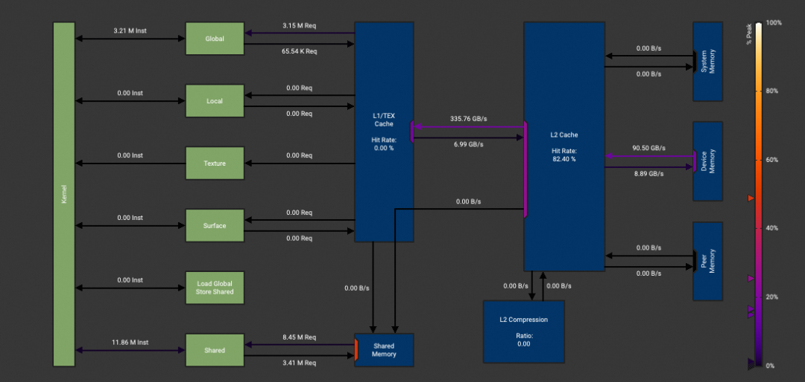

아직 Bank Conflict가 존재하는 것을 볼 수 있다.

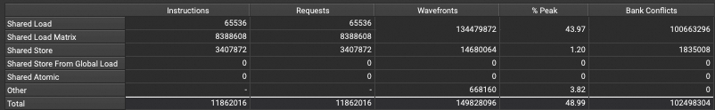

### 1.3 Padding으로 Bank conflict 완화

Kernel-02를 기반으로 SHMEM을 할당할 때 추가로 8B Padding을 신청하여, 단일 Warp가 SHMEM에 접근할 때 서로 다른 영역에 위치하도록 만들 수 있다. diff는 다음과 같다.

```c++
-- 02_base_tile.cu     2024-08-09 18:09:20.824826781 +0800
+++ 03_padding.cu       2024-08-09 18:32:25.068925063 +0800
@@ -32,8 +32,9 @@
 #define BT_THREAD_NUM (WARP_SIZE * BT_WARP_NUM)

 #define CHUNK_K 2      // 매번 처리하는 MMA_TILE_K의 Batch 개수
-#define SKEW_PADDING 0 // BankConflict를 해결하기 위해 추가한 Padding
+#define SKEW_PADDING 8 // BankConflict를 해결하기 위해 추가한 Padding
 #define MMA_SMEM_STRIDE_K (CHUNK_K * MMA_K + SKEW_PADDING)
+#define C_SMEM_STRIDE (BT_N + SKEW_PADDING)

 #define CHUNK_LINE_BYTES (CHUNK_K * MMA_K * sizeof(half))
 #define WARP_COPY_BYTES (WARP_SIZE * sizeof(int4))
@@ -79,12 +80,12 @@

     // This pointer is used to access the C and D matrix tiles this warp computes.
     half *shmem_warp_tile_ptr = &shmem[0][0] +
-                                (warp_id / BT_ROW_WT_NUM) * BT_N * WT_M +
+                                (warp_id / BT_ROW_WT_NUM) * C_SMEM_STRIDE * WT_M +
                                 (warp_id % BT_ROW_WT_NUM) * WT_N;

     // This pointer is used to stream the C and D matrices block-wide tile to and
     // from shared memory
-    half *shmem_warp_stream_ptr = &shmem[0][0] + warp_id * MMA_M * 2 * BT_N;
+    half *shmem_warp_stream_ptr = &shmem[0][0] + warp_id * MMA_M * 2 * C_SMEM_STRIDE;

     // This warp's pointer to the C matrix data to copy memory from to shared
     // memory.
@@ -155,7 +156,7 @@
                 size_t A_smem_idx = (warp_id / BT_ROW_WT_NUM) * WT_M + i * MMA_M;
                 const half *A_tile_ptr = &shmem[A_smem_idx][k_step * MMA_K];

-                wmma::load_matrix_sync(A_frag[i], A_tile_ptr, MMA_K * CHUNK_K);
+                wmma::load_matrix_sync(A_frag[i], A_tile_ptr, MMA_SMEM_STRIDE_K);

                 // B-Fragment를 SMEM에서 register로 이동
 #pragma unroll
@@ -166,7 +167,7 @@
                         size_t B_smem_idx = shmem_idx_b_off + (warp_id % BT_ROW_WT_NUM) * WT_N + j * MMA_N;
                         const half *B_tile_ptr = &shmem[B_smem_idx][k_step * MMA_K];

-                        wmma::load_matrix_sync(B_frag[j], B_tile_ptr, MMA_K * CHUNK_K);
+                        wmma::load_matrix_sync(B_frag[j], B_tile_ptr, MMA_SMEM_STRIDE_K);
                     }
                     // TensorCore MMA 계산 수행
                     wmma::mma_sync(C_frag[i][j], A_frag[i], B_frag[j], C_frag[i][j]);
@@ -184,8 +185,8 @@
 #pragma unroll
         for (size_t j = 0; j < WT_ROW_MMA_NUM; ++j)
         {
-            half *C_tile_ptr = shmem_warp_tile_ptr + i * BT_N * MMA_M + j * MMA_N;
-            wmma::store_matrix_sync(C_tile_ptr, C_frag[i][j], BT_N, wmma::mem_row_major);
+            half *C_tile_ptr = shmem_warp_tile_ptr + i * C_SMEM_STRIDE * MMA_M + j * MMA_N;
+            wmma::store_matrix_sync(C_tile_ptr, C_frag[i][j], C_SMEM_STRIDE, wmma::mem_row_major);
         }
     }
     __syncthreads();
@@ -195,7 +196,7 @@
     for (size_t i = 0; i < MMA_M; ++i)
     {
         *((int4 *)(src_gmem_warp_stream_ptr + (i * 2 + lane_id / 16) * N) + lane_id % 16) =
-            *((int4 *)(shmem_warp_stream_ptr + (i * 2 + lane_id / 16) * BT_N) + lane_id % 16);
+            *((int4 *)(shmem_warp_stream_ptr + (i * 2 + lane_id / 16) * C_SMEM_STRIDE) + lane_id % 16);
     }
 }

@@ -207,7 +208,7 @@
     cudaGetDeviceProperties(&dev_prop, dev_id);

     size_t SHMEM_SZ =
-        std::max((BT_M + BT_N) * MMA_SMEM_STRIDE_K * sizeof(half), BT_M * BT_N * sizeof(half));
+        std::max((BT_M + BT_N) * MMA_SMEM_STRIDE_K * sizeof(half), BT_M * C_SMEM_STRIDE * sizeof(half));

     if (dev_prop.sharedMemPerMultiprocessor > SHMEM_SZ)
         cudaFuncSetAttribute(blockGemmKernel,
```

이때 성능은 53842.7GLOPS/s까지 향상된다. Profiling 결과는 다음과 같으며, Store Bank conflict가 소량만 남은 것을 볼 수 있다.

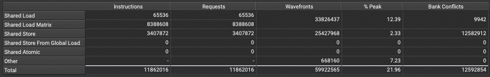

하지만 L1Cache 상황을 살펴보면, HitRate는 0인데도 많은 data가 L1로 Load되고 있다. 다음 단계에서는 비동기 copy를 이용해 최적화한다.

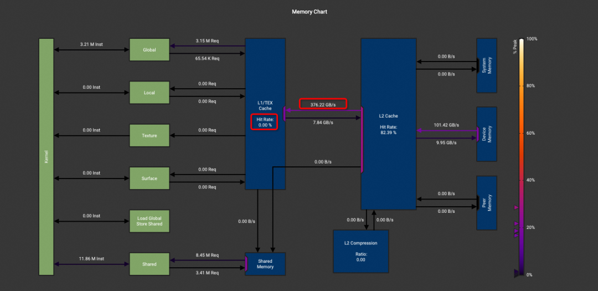

### 1.4 비동기 copy

Ampere 세대에서는 비동기 copy 기능이 추가되었고, cp.async를 사용하면 L1을 우회해 SMEM에 직접 write할 수 있다.


Tensor-003 글을 참고하여, 비동기 copy macro를 다음과 같이 추가한다.

```c++
#define CP_ASYNC_CA(dst, src, Bytes) \
    asm volatile("cp.async.ca.shared.global.L2::128B [%0], [%1], %2;\n" ::"r"(dst), "l"(src), "n"(Bytes))

#define CP_ASYNC_CG(dst, src, Bytes) \
    asm volatile("cp.async.cg.shared.global.L2::128B [%0], [%1], %2;\n" ::"r"(dst), "l"(src), "n"(Bytes))

#define CP_ASYNC_COMMIT_GROUP() asm volatile("cp.async.commit_group;\n" ::)

#define CP_ASYNC_WAIT_GROUP(N) asm volatile("cp.async.wait_group %0;\n" ::"n"(N))

#define CP_ASYNC_WAIT_ALL() asm volatile("cp.async.wait_all;\n" ::)
```

주요 코드 수정은 BT\_A와 BT\_B를 SMEM에 load하는 부분에 있으며, copy 시 16B alignment에 주의해야 한다.

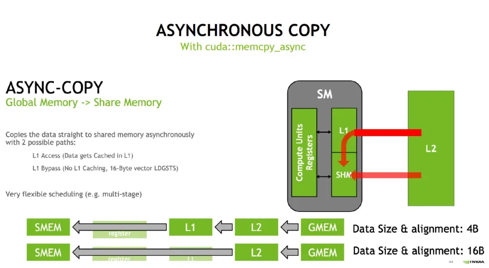

THREAD\_COPY\_BYTES를 16으로 정의하고, cp.async.cg를 사용해 L1 사용을 피한다. diff는 다음과 같다.

```c++
--- 03_padding.cu       2024-08-09 18:32:25.068925063 +0800
+++ 04_async.cu 2024-08-09 19:07:39.607193053 +0800
@@ -41,6 +41,9 @@
 #define CHUNK_COPY_LINES_PER_WARP (WARP_COPY_BYTES / CHUNK_LINE_BYTES)
 #define CHUNK_COPY_LINE_LANES (WARP_SIZE / CHUNK_COPY_LINES_PER_WARP)

+#define THREAD_COPY_BYTES 16
+
+
 __global__ void blockGemmKernel(half *A, half *B, half *C, size_t M, size_t N, size_t K)
 {
     // 행렬을 MMA_Tile로 나눈 각 차원의 개수
@@ -116,7 +119,10 @@
 #pragma unroll
         for (size_t i = 0; i < A_smem_iters; ++i)
         {
-            *((int4 *)&shmem[A_smem_idx][0] + (lane_id % CHUNK_COPY_LINE_LANES)) = *A_lane_ptr;
+            uint32_t A_smem_lane_addr =
+                __cvta_generic_to_shared(&shmem[A_smem_idx][0]) + (lane_id % CHUNK_COPY_LINE_LANES) * THREAD_COPY_BYTES;
+
+            CP_ASYNC_CG(A_smem_lane_addr, A_lane_ptr, THREAD_COPY_BYTES);

             A_lane_ptr = (int4 *)((half *)A_lane_ptr + CHUNK_COPY_LINES_PER_WARP * K);
             A_smem_idx += CHUNK_COPY_LINES_PER_WARP;
@@ -131,11 +137,16 @@
 #pragma unroll
         for (size_t i = 0; i < B_smem_iters; ++i)
         {
-            *((int4 *)&shmem[B_smem_idx][0] + (lane_id % CHUNK_COPY_LINE_LANES)) = *B_lane_ptr;
+            uint32_t B_smem_lane_addr =
+                __cvta_generic_to_shared(&shmem[B_smem_idx][0]) + (lane_id % CHUNK_COPY_LINE_LANES) * THREAD_COPY_BYTES;
+
+            CP_ASYNC_CG(B_smem_lane_addr, B_lane_ptr, THREAD_COPY_BYTES);

             B_lane_ptr = (int4 *)((half *)B_lane_ptr + CHUNK_COPY_LINES_PER_WARP * K);
             B_smem_idx += CHUNK_COPY_LINES_PER_WARP;
         }
+        CP_ASYNC_COMMIT_GROUP();
+        CP_ASYNC_WAIT_GROUP(0);

         // 동기화하고 copy 완료를 기다림
         __syncthreads();
```

성능은 57837.5GFLOPs/s까지 향상될 수 있다. Profiling 결과는 다음과 같으며, data가 이미 SMEM으로 직접 들어간 것을 볼 수 있다.

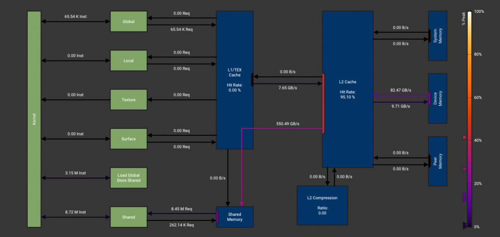

Bank Conflict 수:

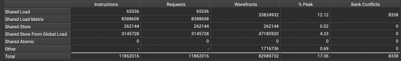

GPU의 계산 및 memory access utilization이 모두 낮다는 점을 확인할 수 있다.

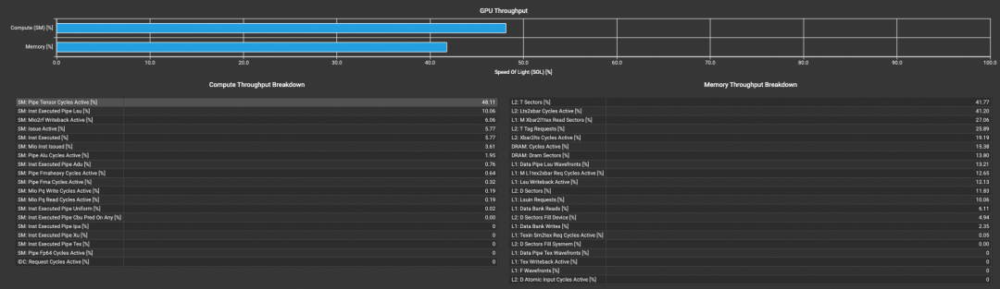

## 2. Pipeline 최적화

현재 계산은 아래와 같다. data copy와 계산이 Overlap되지 않아 실제 계산 및 memory access utilization이 모두 매우 낮다.

```c++
    // Loop for Block_Tile_K
    for (size_t tile_k = 0; tile_k < K_tiles; tile_k += CHUNK_K)
    {
        Copy A-Chunk from GMEM-->SMEM
        Copy B-Chunk from GMEM-->SMEM

        // WarpTile이 GEMM을 계산하고, load된 CHUNK를 처리
        for (size_t k_step = 0; k_step < CHUNK_K; ++k_step)
            for (size_t i = 0; i < WT_COL_MMA_NUM; ++i)
               // A-Fragment load
               wmma::load_matrix_sync(Afragment)
               for (size_t j = 0; j < WT_ROW_MMA_NUM; ++j)
                    // B-Fragment load
                    wmma::load_matrix_sync(B-frag)
                    // TensorCore를 사용해 계산
                    wmma::mma_sync;
    }

    // WMMA-STORE 결과 C 행렬을 SHMEM에 저장
    for (size_t i = 0; i < WT_COL_MMA_NUM; ++i)
        for (size_t j = 0; j < WT_ROW_MMA_NUM; ++j)
            wmma::store_matrix_sync
    // Store-SMEM->GMEM
```

CUDA11 이후에는 비동기 방식으로 memory를 batch별로 copy하고, 계산을 교대로 수행할 수 있다.

### 2.1 GMEM에서 SMEM으로, Double Buffer

전체 flow에 대해 비동기 방식으로 load할 수 있다.

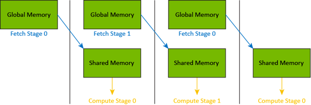

pseudo code는 다음과 같고, 상세 코드는 Kernel-05[6]를 참고할 수 있다.

```c++
Async Copy A-Chunk from GMEM-->SMEM(Buffer_1)
Async Copy B-Chunk from GMEM-->SMEM(Buffer_1)
Wait for Async Copy Completion

for (size_t tile_k = CHUNK_K; tile_k < K_tiles; tile_k += CHUNK_K) {
   Swap Buffer_1/Buffer_2 Offset
   // Buffer-2를 비동기로 load하면서 동시에 Buffer-1을 계산해 Overlap 수행
   Async Copy A-Chunk from GMEM-->SMEM(Buffer_2)
   Async Copy B-Chunk from GMEM-->SMEM(Buffer_2)

   for (size_t k_step = 0; k_step < CHUNK_K; ++k_step){
        for (size_t i = 0; i < WT_COL_MMA_NUM; ++i)
        {
            Load-SMEM(Buffer_1)-to-A_fragment
            for (size_t j = 0; j < WT_ROW_MMA_NUM; ++j)
            {
               Load-SMEM(Buffer_1)-to-B_fragment
               wmma::mma_sync;  // TensorCore를 사용해 계산
            }
        }
    }
    Wait for Async Copy Completion
}
Calculate Last Buffer WarpTile

WMMA-Store-to-SMEM
Store-SMEM->GMEM
```

Double Buffer는 성능을 69233.1 GFLOPs/s까지 향상시킬 수 있다. Profiling 결과는 다음과 같으며, 계산과 memory access utilization이 모두 크게 높아지고 L2 load bandwidth도 750GB/s까지 상승했다.

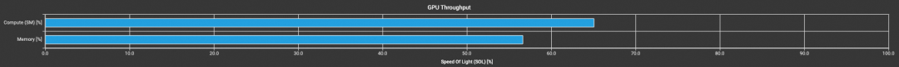

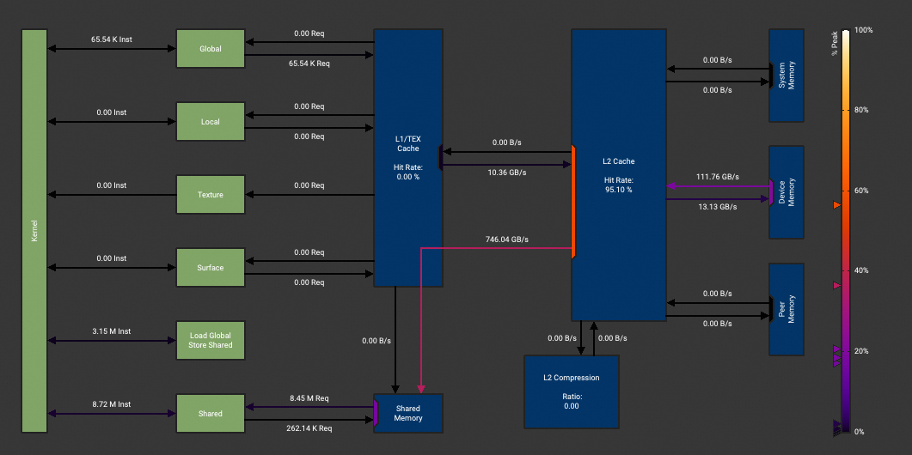

### 2.2 SMEM에서 RF로, DoubleBuffer

data를 SMEM에서 register로 load할 때도 Overlap할 수 있다. 구체적인 코드는 Github Kernel-06을 참고하고, 원리는 아래 그림과 같다.


이때 성능은 1TFLOPs 향상되어 70111.5GFLOPs/s에 도달한다.

### 2.3 Pipeline 심화

아직 충분한 SMEM buffer가 있을 때는 LD data pipeline을 더 깊게 만들 수 있다. 더 많은 data를 prefetch하여 TensorCore가 data를 기다리는 상황을 피하고, latency를 더 숨길 수 있다.
앞에서는 BankConflict를 해결하기 위해 Padding 8B 방식을 사용했다. SMEM을 더 효과적으로 활용하기 위해 XOR permutation의 Swizzle 방식으로 conflict를 해결할 수도 있으며, 아래 그림과 같다.

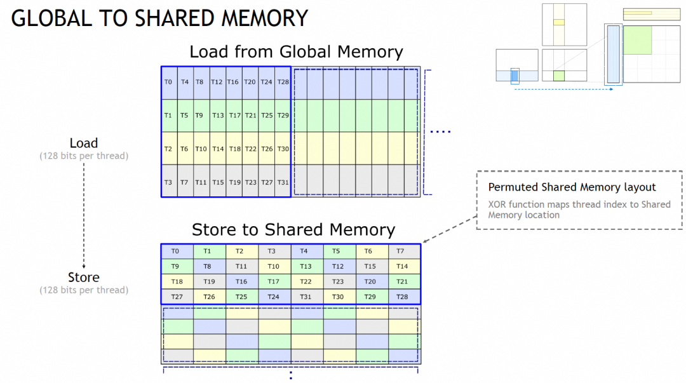

이 단계는 Zhihu: 무쯔즈의 mma\_async\_stage4.cu[7] profiling 결과를 직접 사용했다. L2 access bandwidth는 1TB/s에 가깝고, 성능은 Cublas의 102%에 도달한다.

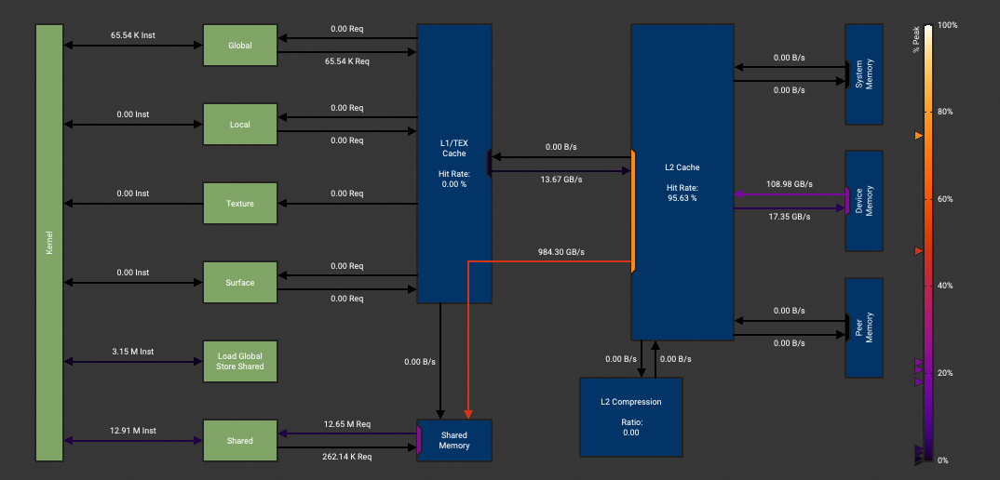

하지만 Cublas와 비교하면, Cublas의 peak bandwidth는 660GB/s이고 memory access 총량은 50% 더 많다(Cublas 1.61GB / This 2.42GB). 시스템에는 추가 tuning 여지가 있다.

## 3. 맺음말

이 글은 Tensor-003의 보충이다. 일련의 tuning을 통해 TensorCore의 operand 공급/feeding 관련 최적화를 분석했으며, 계층적 행렬 block 분할 기반 workflow를 TensorCore와 함께 설명했다. 다음 글에서 Cutlass 관련 소개를 본격적으로 시작하기 위한 배경을 마련했다.

참고 자료

[1]

cudaTensorCoreGemm: https://github.com/NVIDIA/cuda-samples/blob/master/Samples/3\_CUDA\_Features/cudaTensorCoreGemm/cudaTensorCoreGemm.cu

[2]

Nvidia Tensor Core-CUDA HGEMM 최적화 심화: https://zhuanlan.zhihu.com/p/639297098

[3]

Cutlass v0.1.1: https://github.com/NVIDIA/cutlass/tree/v0.1.1

[4]

DEVELOPING CUDA KERNELS TO PUSH TENSOR CORES TO THE ABSOLUTE LIMIT ON NVIDIA A100: https://developer.download.nvidia.com/video/gputechconf/gtc/2020/presentations/s21745-developing-cuda-kernels-to-push-tensor-cores-to-the-absolute-limit-on-nvidia-a100.pdf

[5]

github.com/zartbot/tensorecore\_gemm: https://github.com/zartbot/tensorcore\_gemm

[6]

Kernel-05: https://github.com/zartbot/tensorcore\_gemm/blob/main/05\_pipeline\_gmem\_to\_smem.cu

[7]

mma\_async\_stage4.cu: https://github.com/Bruce-Lee-LY/cuda\_hgemm/blob/master/src/mma/mma\_async\_stage4.cu
