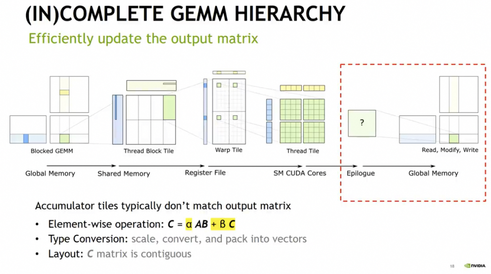
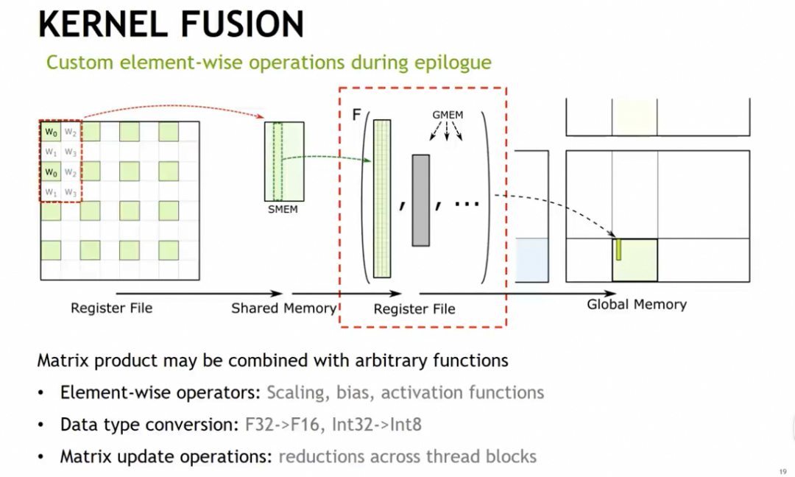
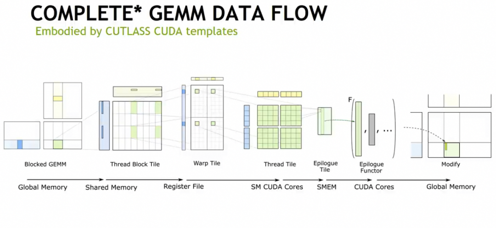
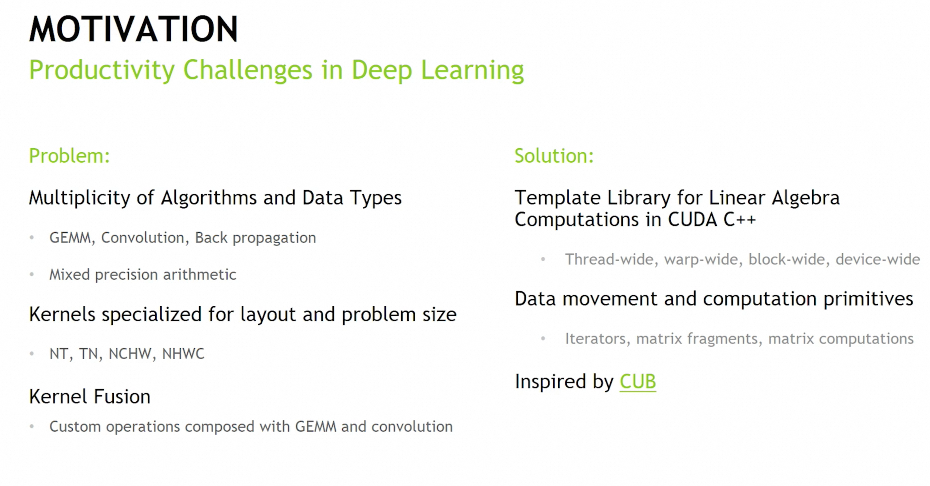
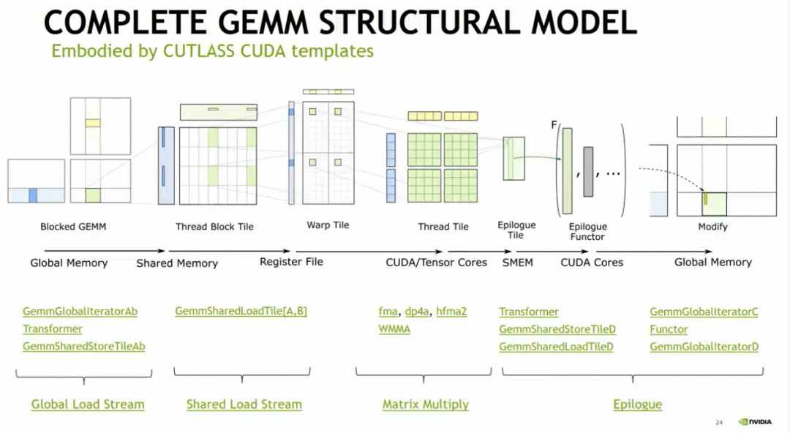
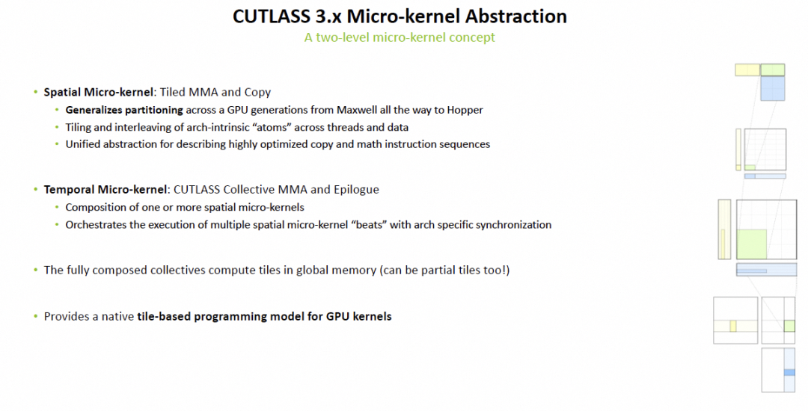
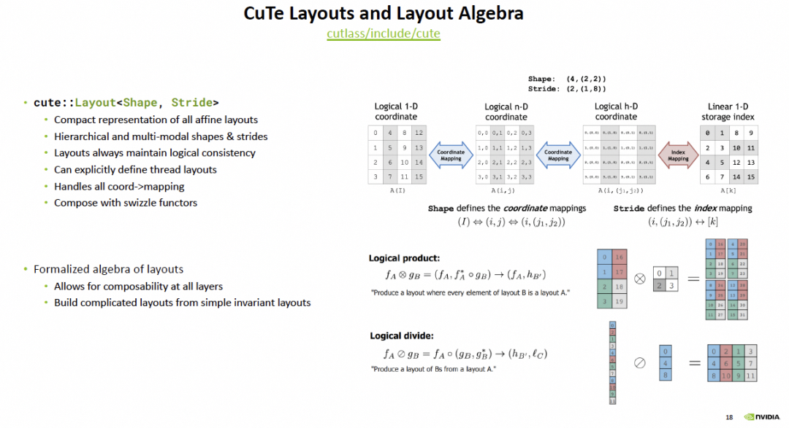
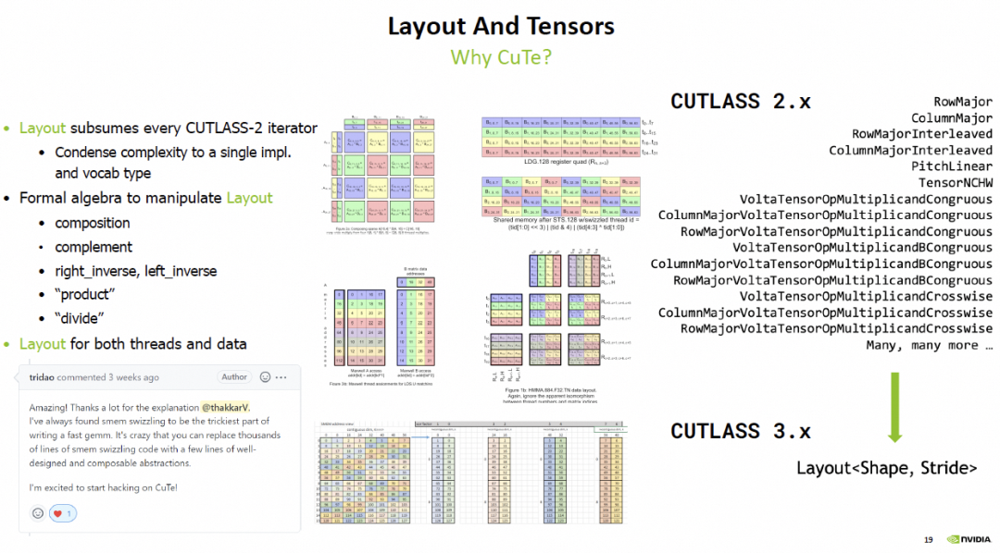

# Tensor-005 CUTLASS 소개

- 원문 제목: Tensor-005 CUTLASS 소개
- 저자: 자보터의 지우개
- 계정: zartbot
- 발행일: 2024년 8월 20일 19:08

## 1. CUTLASS 계산 flow 추상화

### 1.1 행렬 block 분할 곱셈

앞 장에서는 TensorCore를 사용해 행렬 계산을 수행하는 방법을 소개했다. 일반적으로 아래 flow에 따라 단계적으로 block을 나누고, GMEM에서 matrix block을 SMEM으로, 다시 register file로 load한 다음 행렬 곱셈 계산을 수행해야 한다. 동시에 memory access efficiency도 고려하려면 최신 GPU(Ampere/Hopper)에서 multi-stage pipeline의 asynchronous memory load도 구현해야 한다.


### 1.2 Epilogue

앞서의 몇몇 구현에는 $C=AB$의 행렬 곱셈만 있었고 $C= \alpha AB + \beta C$는 고려하지 않았다. 이런 계산은 후속 단계에서 보정해야 하며, 아래와 같다.



한편, 행렬 곱셈이 끝난 뒤 단일 element 기반의 operator들은 함께 fuse할 수 있다. 예를 들어 activation function/data type conversion 등이다.



이 단계들을 이어 붙이면 완전한 계산 flow를 구성한다.



즉 GEMM을 완료한 뒤에도 CUDA Core에서 Epilogue code를 실행하는 code 구간이 하나 더 있다.

### 1.3 계산 flow 추상화

하지만 TensorCore가 지원하는 data type이 점점 많아지고, 다양한 mixed precision 곱셈과 서로 다른 matrix size, 그리고 행렬의 다양한 Layout과 deep learning model에서의 각종 operator fusion 요구가 생기면서 programming complexity가 증가한다.



C++의 template를 통해 이러한 code 작성 복잡도를 낮출 수 있을까? cutlass v0.1.1의 가장 초기 code에서 그런 조짐을 발견할 수 있다. 이후 전체 계산 flow는 Cutlass에서 다음과 같이 추상화되었다:



CUTLASS의 design philosophy는 official docs 첫 문단에도 매우 명확하게 설명되어 있다:

CUTLASS is a collection of CUDA C++ template abstractions for implementing high-performance matrix-matrix multiplication (GEMM) and related computations at all levels and scales within CUDA.

It incorporates strategies for hierarchical decomposition and data movement similar to those used to implement cuBLAS and cuDNN. CUTLASS decomposes these "moving parts" into reusable, modular software components abstracted by C++ template classes.

요약하면:

1. CUDA 기반에서 high-performance matrix multiplication(GEMM) 및 각 level의 관련 계산을 제공하기 위한 일련의 C++ template abstraction을 통합했다.
2. hierarchical decomposition과 data movement라는 component들을 reusable하고 modular하게 정의한다.
3. TileSize와 parallel strategy를 template parameter 기반으로 hierarchical하게 조정할 수 있고, flexible combination으로 development difficulty를 낮춘다.
4. 다양한 data precision을 지원하고, 각 platform에 맞는 high-throughput TensorCore 관련 구현을 제공한다.

더 자세한 내용은 공식 동영상 두 개를 참고할 수 있다:

- 《30분 CUTLASS 빠른 입문 - CUDA 기반 multi-level dense linear algebra computation primitive》[1]
- 《CUTLASS: Software Primitives for Dense Linear Algebra at All Levels and Scales within CUDA》[2]

## 2. CUTLASS Quickstart

### 2.1 Cutlass 설치

Alibaba Cloud에서 GPU server 하나를 열었고, Ubuntu 22.04 + Cuda 12.0 환경에서 cutlass 설치 과정은 다음과 같다.

```c++
cd /opt
git clone https://github.com/NVIDIA/cutlass
cd cutlass
mkdir build && cd build
cmake .. -DCUTLASS_NVCC_ARCHS=90a    # for hopper
cmake .. -DCUTLASS_NVCC_ARCHS=80     # for ampere
```

경로 설정을 `vim ~/.bashrc`로 수정하고 다음을 추가한다.

```c++
export CPLUS_INCLUDE_PATH=/opt/cutlass/include:/opt/cutlass/tools/util/include:$CPLUS_INCLUDE_PATH
export C_INCLUDE_PATH=/opt/cutlass/include:/opt/cutlass_test/cutlass/tools/util/include:$C_INCLUDE_PATH
```

### 2.2 Profiler 테스트

```
make cutlass_profiler -j12

./tools/profiler/cutlass_profiler --kernels=sgemm --m=4352 --n=4096 --k=4096


=============================
  Problem ID: 1

        Provider: CUTLASS
   OperationKind: gemm
       Operation: cutlass_simt_sgemm_128x128_8x2_nn_align1

          Status: Success
    Verification: ON
     Disposition: Passed

reference_device: Passed
          cuBLAS: Not run
           cuDNN: Not run

       Arguments: --gemm_kind=universal --m=4352 --n=4096 --k=4096 --A=f32:column --B=f32:column --C=f32:column --D=f32:column  \
                  --alpha=1 --beta=0 --split_k_mode=serial --split_k_slices=1 --batch_count=1 --raster_order=heuristic  \
                  --op_class=simt --accum=f32 --cta_m=128 --cta_n=128 --cta_k=8 --cluster_m=1 --cluster_n=1 --cluster_k=1  \
                  --stages=2 --warps_m=4 --warps_n=2 --warps_k=1 --inst_m=1 --inst_n=1 --inst_k=1 --min_cc=50 --max_cc=1024  \


           Bytes: 209715200  bytes
           FLOPs: 146064539648  flops
           FLOPs/Byte: 696

         Runtime: 12.5042  ms
          Memory: 15.6198 GiB/s

            Math: 11681.3 GFLOP/s
```

## 3. CUTLASS 테스트 프로그램 예시

하나의 예제를 통해 CUTLASS template 사용 방법을 이해할 수 있다.

### 3.1 행렬 정의

다음 방식으로 행렬의 numeric type과 Layout 방식, memory alignment 방식을 정의할 수 있다.

```c++
// A matrix configuration
using ElementA = cutlass::half_t;                                       // Element type for A matrix operand
using LayoutA = cutlass::layout::RowMajor;                              // Layout type for A matrix operand
constexpr int AlignmentA = 128 / cutlass::sizeof_bits<ElementA>::value; // Memory access granularity/alignment of A matrix in units of elements (up to 16 bytes)

// B matrix configuration
using ElementB = cutlass::half_t;                                       // Element type for B matrix operand
using LayoutB = cutlass::layout::RowMajor;                              // Layout type for B matrix operand
constexpr int AlignmentB = 128 / cutlass::sizeof_bits<ElementB>::value; // Memory access granularity/alignment of B matrix in units of elements (up to 16 bytes)

// C/D matrix configuration
using ElementC = cutlass::half_t;                                       // Element type for C and D matrix operands
using LayoutC = cutlass::layout::RowMajor;                              // Layout type for C and D matrix operands
constexpr int AlignmentC = 128 / cutlass::sizeof_bits<ElementC>::value; // Memory access granularity/alignment of C/D matrices in units of elements (up to 16 bytes)
```

### 3.2 행렬 곱셈 block 분할 방식

그다음 사용할 GPU architecture `ArchTag`, compute precision `ElementAccumulator`, 그리고 행렬 block 분할의 ThreadBlock Tile, WarpTile 및 최종 행렬 곱셈 instruction Shape을 정의한다. 동시에 전체 Global MEM에서 Shared MEM으로 load하는 pipeline 길이도 정의할 수 있다.

```c++
// Multiply-accumulate blocking/pipelining details
using ElementAccumulator = cutlass::half_t;                      // Element type for internal accumulation
using ArchTag = cutlass::arch::Sm80;                             // Tag indicating the minimum SM that supports the intended feature
using OperatorClass = cutlass::arch::OpClassTensorOp;            // Operator class tag
using ThreadblockShape = cutlass::gemm::GemmShape<128, 128, 32>; // Threadblock-level tile size (concept: GemmShape)
using WarpShape = cutlass::gemm::GemmShape<64, 64, 32>;          // Warp-level tile size (concept: GemmShape)
using InstructionShape = cutlass::gemm::GemmShape<16, 8, 16>;    // Instruction-level tile size (concept: GemmShape)
constexpr int NumStages = 4;                                     // Number of global->shared pipeline stages used in the GEMM mainloop
```

### 3.3 Epilogue operation 정의

여기에는 단순한 alpha/beta linear computation만 있으므로 `cutlass::epilogue::thread::LinearCombination`을 호출한다. 즉,

$$
D = \alpha * accumulator + \beta * source + uniform
$$

```c++
// Epilogue output operator
using EpilogueOp = cutlass::epilogue::thread::LinearCombination<
    ElementC,            // Element type for C and D matrix operands
    AlignmentC,          // Memory access granularity of C and D matrix in units of elements
    ElementAccumulator,  // Element type from internal accumaccumulation
    ElementAccumulator>; // Data type used to compute linear combination
```

### 3.4 operator 정의

앞서 말한 각 component에 따라 GEMM operator를 구성한다.

```c++
// Classic data-parallel device GEMM implementation type
using DeviceGemmBasic = cutlass::gemm::device::GemmUniversal<
    ElementA, LayoutA,
    ElementB, LayoutB,
    ElementC, LayoutC,
    ElementAccumulator,
    OperatorClass,
    ArchTag,
    ThreadblockShape,
    WarpShape,
    InstructionShape,
    EpilogueOp,
    cutlass::gemm::threadblock::GemmIdentityThreadblockSwizzle<>,
    NumStages,
    AlignmentA,
    AlignmentB>;
```

### 3.5 operator parameter load

행렬 곱셈의 Shape MNK에 대해 CUTLASS는 GemmCoord object를 캡슐화했다.

```c++
  const int length_m = 4096;
  const int length_n = 4096;
  const int length_k = 4096;

  // Create a tuple of problem size for matrix multiplication
  cutlass::gemm::GemmCoord problem_size(length_m, length_n, length_k);
```

그다음 전체 operator load parameter object를 구성할 수 있다.

```c++
/// Populates a DeviceGemmBasic::Arguments structure from the given commandline options
typename DeviceGemmBasic::Arguments args_from_options(
    const DeviceGemmBasic &device_gemm,
    const cutlass::gemm::GemmCoord problem_size,
    cutlass::HostTensor<ElementA, LayoutA> &tensor_a,
    cutlass::HostTensor<ElementB, LayoutB> &tensor_b,
    cutlass::HostTensor<ElementC, LayoutC> &tensor_c,
    cutlass::HostTensor<ElementC, LayoutC> &tensor_d)
{
  return typename DeviceGemmBasic::Arguments(
      cutlass::gemm::GemmUniversalMode::kGemm, // universal mode
      problem_size,                            // problem_size
      1,                                      // batch count / splitk slices
      {
          // epilogue parameters
          ElementAccumulator(1.0f), // alpha
          ElementAccumulator(0.0f)  // beta
      },
      tensor_a.device_data(),       // ptr_A
      tensor_b.device_data(),       // ptr_B
      tensor_c.device_data(),       // ptr_C
      tensor_d.device_data(),       // ptr_D
      problem_size.mk().product(),  // batch_stride_A
      problem_size.nk().product(),  // batch_stride_B
      problem_size.mn().product(),  // batch_stride_C
      problem_size.mn().product(),  // batch_stride_D
      tensor_a.layout().stride(0),  // stride_a
      tensor_b.layout().stride(0),  // stride_b
      tensor_c.layout().stride(0),  // stride_c
      tensor_d.layout().stride(0)); // stride_d
}
```

### 3.6 행렬 parameter 초기화

tensor 초기화도 CUTLASS가 캡슐화했다. 예를 들어 random fill과 zero fill 등이 있다. 그리고 tensor object의 sync\_device() function을 통해 copy한다.

```c++
  // Initialize tensors using CUTLASS helper functions
  cutlass::HostTensor<ElementA, LayoutA> tensor_a(
      problem_size.mk()); // <- Create matrix A with dimensions M x K
  cutlass::HostTensor<ElementB, LayoutB> tensor_b(
      problem_size.kn()); // <- Create matrix B with dimensions K x N
  cutlass::HostTensor<ElementC, LayoutC> tensor_c(
      problem_size.mn()); // <- Create matrix C with dimensions M x N
  cutlass::HostTensor<ElementC, LayoutC> tensor_d(
      problem_size.mn()); // <- Create matrix D with dimensions M x N used to store output from

  // Fill input and output matrices on host using CUTLASS helper functions
  cutlass::reference::host::TensorFillRandomUniform(
      tensor_a.host_view(),
      1,
      ElementA(4),
      ElementA(-4),
      0); // <- Fill matrix A on host with uniform-distribution random data
  cutlass::reference::host::TensorFillRandomUniform(
      tensor_b.host_view(),
      1,
      ElementB(4),
      ElementB(-4),
      0); // <- Fill matrix B on host with uniform-distribution random data
  cutlass::reference::host::TensorFillRandomUniform(
      tensor_c.host_view(),
      1,
      ElementC(4),
      ElementC(-4),
      0); // <- Fill matrix C on host with uniform-distribution random data
  cutlass::reference::host::TensorFill(
      tensor_d.host_view()); // <- fill matrix D on host with zeros

  // Copy data from host to GPU
  tensor_a.sync_device();
  tensor_b.sync_device();
  tensor_c.sync_device();
  tensor_d.sync_device();
```

### 3.7 GEMM operator 초기화

아래와 같이 먼저 operator를 instantiate하고, 그다음 parameter 기반으로 workspace를 구성하며, operator가 problem\_size를 지원할 수 있는지 확인한 뒤, 마지막으로 Gemm Kernel을 instantiate한다.

```c++
  // Instantiate CUTLASS kernel depending on templates
  DeviceGemmBasic gemm_op;

  auto arguments = args_from_options(gemm_op, problem_size, tensor_a, tensor_b, tensor_c, tensor_d);

  // Using the arguments, query for extra workspace required for matrix multiplication computation
  size_t workspace_size = DeviceGemmBasic::get_workspace_size(arguments);

  // Allocate workspace memory
  cutlass::device_memory::allocation<uint8_t> workspace(workspace_size);

  // Check the problem size is supported or not
  gemm_op.can_implement(arguments);

  // Initialize CUTLASS kernel with arguments and workspace pointer
  cutlass::Status status = gemm_op.initialize(arguments, workspace.get());
```

마지막으로 `gemm_op()` 호출을 실행하면 된다.

## 4. 부록

### 4.1 성능 테스트 함수

마지막으로 이 operator를 기반으로 performance test를 수행한다.

```c++
  cudaEvent_t start, end;
  float elapsedTime;
  cudaEventCreate(&start);
  cudaEventCreate(&end);

  cudaEventRecord(start);

  const int ITER = 100;
  for (int i = 0; i < ITER; ++i)
  {
    gemm_op();
  }
  cudaEventRecord(end);
  cudaEventSynchronize(end);
  cudaEventElapsedTime(&elapsedTime, start, end);

  double workload = double(problem_size.product()) * 2.0 * double(ITER);
  double avg_Gflops = (workload / 1e9) / (double(elapsedTime) / 1e3);
  printf("Average Performance  %10.1lf Gflops\n", avg_Gflops);

# nvcc -arch sm_86 00_basic_gemm.cu
# ./a.out
Average Performance     76279.8 Gflops
```

기본 성능은 CuBlas의 85% 수준에 도달한다. 전체 CUTLASS는 하위 계층의 GMEM load to SMEM 및 TensorCore 호출 방식의 세부 사항을 캡슐화했고, 동시에 BankConflict 같은 문제에 대해서는 `cutlass::gemm::threadblock::GemmIdentityThreadblockSwizzle<>`를 정의해 해결한다.

CUTLASS 3.0에서는 `Spatial Micro-Kernel`과 `Temporal Micro-Kernel` 개념을 도입했는데, 매우 괜찮은 spatio-temporal partition abstraction이다.



그다음 Tensor Layout에 대해서도 Cute Layout algebra를 도입했다.



Layout algebra를 통해 Tensor의 spatio-temporal partition을 unified algebraic description으로 표현했다.



다음 글에서는 CuTe 및 관련 algebraic representation을 자세히 소개하기 시작하겠다.

### 4.2 전체 test code

github에 commit하기 귀찮아서, 그냥 붙인다.

```c++
#include "cutlass/cutlass.h"
#include "cutlass/gemm/device/gemm_universal.h"

#include "cutlass/util/command_line.h"
#include "cutlass/util/host_tensor.h"
#include "cutlass/util/reference/device/gemm.h"
#include "cutlass/util/reference/host/tensor_compare.h"
#include "cutlass/util/reference/host/tensor_copy.h"
#include "cutlass/util/reference/host/tensor_fill.h"
#include "cutlass/util/tensor_view_io.h"

/////////////////////////////////////////////////////////////////////////////////////////////////
/// GEMM kernel configurations (cutlass_tensorop_h16816gemm_128x128_32x4_nn_align8)
/////////////////////////////////////////////////////////////////////////////////////////////////

// A matrix configuration
using ElementA = cutlass::half_t;                                       // Element type for A matrix operand
using LayoutA = cutlass::layout::RowMajor;                              // Layout type for A matrix operand
constexpr int AlignmentA = 128 / cutlass::sizeof_bits<ElementA>::value; // Memory access granularity/alignment of A matrix in units of elements (up to 16 bytes)

// B matrix configuration
using ElementB = cutlass::half_t;                                       // Element type for B matrix operand
using LayoutB = cutlass::layout::RowMajor;                              // Layout type for B matrix operand
constexpr int AlignmentB = 128 / cutlass::sizeof_bits<ElementB>::value; // Memory access granularity/alignment of B matrix in units of elements (up to 16 bytes)

// C/D matrix configuration
using ElementC = cutlass::half_t;                                       // Element type for C and D matrix operands
using LayoutC = cutlass::layout::RowMajor;                              // Layout type for C and D matrix operands
constexpr int AlignmentC = 128 / cutlass::sizeof_bits<ElementC>::value; // Memory access granularity/alignment of C/D matrices in units of elements (up to 16 bytes)

// Multiply-accumulate blocking/pipelining details
using ElementAccumulator = cutlass::half_t;                      // Element type for internal accumulation
using ArchTag = cutlass::arch::Sm80;                             // Tag indicating the minimum SM that supports the intended feature
using OperatorClass = cutlass::arch::OpClassTensorOp;            // Operator class tag
using ThreadblockShape = cutlass::gemm::GemmShape<128, 128, 32>; // Threadblock-level tile size (concept: GemmShape)
using WarpShape = cutlass::gemm::GemmShape<64, 64, 32>;          // Warp-level tile size (concept: GemmShape)
using InstructionShape = cutlass::gemm::GemmShape<16, 8, 16>;    // Instruction-level tile size (concept: GemmShape)
constexpr int NumStages = 4;                                     // Number of global->shared pipeline stages used in the GEMM mainloop

// Epilogue output operator
using EpilogueOp = cutlass::epilogue::thread::LinearCombination<
    ElementC,            // Element type for C and D matrix operands
    AlignmentC,          // Memory access granularity of C and D matrix in units of elements
    ElementAccumulator,  // Element type from internal accumaccumulation
    ElementAccumulator>; // Data type used to compute linear combination

// Classic data-parallel device GEMM implementation type
using DeviceGemmBasic = cutlass::gemm::device::GemmUniversal<
    ElementA, LayoutA,
    ElementB, LayoutB,
    ElementC, LayoutC,
    ElementAccumulator,
    OperatorClass,
    ArchTag,
    ThreadblockShape,
    WarpShape,
    InstructionShape,
    EpilogueOp,
    cutlass::gemm::threadblock::GemmIdentityThreadblockSwizzle<>,
    NumStages,
    AlignmentA,
    AlignmentB>;

/// Populates a DeviceGemmBasic::Arguments structure from the given commandline options
typename DeviceGemmBasic::Arguments args_from_options(
    const DeviceGemmBasic &device_gemm,
    const cutlass::gemm::GemmCoord problem_size,
    cutlass::HostTensor<ElementA, LayoutA> &tensor_a,
    cutlass::HostTensor<ElementB, LayoutB> &tensor_b,
    cutlass::HostTensor<ElementC, LayoutC> &tensor_c,
    cutlass::HostTensor<ElementC, LayoutC> &tensor_d)
{
  return typename DeviceGemmBasic::Arguments(
      cutlass::gemm::GemmUniversalMode::kGemm, // universal mode
      problem_size,                            // problem_size
      1,                                      // batch count / splitk slices
      {
          // epilogue parameters
          ElementAccumulator(1.0f), // alpha
          ElementAccumulator(0.0f)  // beta
      },
      tensor_a.device_data(),       // ptr_A
      tensor_b.device_data(),       // ptr_B
      tensor_c.device_data(),       // ptr_C
      tensor_d.device_data(),       // ptr_D
      problem_size.mk().product(),  // batch_stride_A
      problem_size.nk().product(),  // batch_stride_B
      problem_size.mn().product(),  // batch_stride_C
      problem_size.mn().product(),  // batch_stride_D
      tensor_a.layout().stride(0),  // stride_a
      tensor_b.layout().stride(0),  // stride_b
      tensor_c.layout().stride(0),  // stride_c
      tensor_d.layout().stride(0)); // stride_d
}

int main()
{

  const int length_m = 4096;
  const int length_n = 4096;
  const int length_k = 4096;

  // Create a tuple of problem size for matrix multiplication
  cutlass::gemm::GemmCoord problem_size(length_m, length_n, length_k);

  // Initialize tensors using CUTLASS helper functions
  cutlass::HostTensor<ElementA, LayoutA> tensor_a(
      problem_size.mk()); // <- Create matrix A with dimensions M x K
  cutlass::HostTensor<ElementB, LayoutB> tensor_b(
      problem_size.kn()); // <- Create matrix B with dimensions K x N
  cutlass::HostTensor<ElementC, LayoutC> tensor_c(
      problem_size.mn()); // <- Create matrix C with dimensions M x N
  cutlass::HostTensor<ElementC, LayoutC> tensor_d(
      problem_size.mn()); // <- Create matrix D with dimensions M x N used to store output from

  // Fill input and output matrices on host using CUTLASS helper functions
  cutlass::reference::host::TensorFillRandomUniform(
      tensor_a.host_view(),
      1,
      ElementA(4),
      ElementA(-4),
      0); // <- Fill matrix A on host with uniform-distribution random data
  cutlass::reference::host::TensorFillRandomUniform(
      tensor_b.host_view(),
      1,
      ElementB(4),
      ElementB(-4),
      0); // <- Fill matrix B on host with uniform-distribution random data
  cutlass::reference::host::TensorFillRandomUniform(
      tensor_c.host_view(),
      1,
      ElementC(4),
      ElementC(-4),
      0); // <- Fill matrix C on host with uniform-distribution random data
  cutlass::reference::host::TensorFill(
      tensor_d.host_view()); // <- fill matrix D on host with zeros

  // Copy data from host to GPU
  tensor_a.sync_device();
  tensor_b.sync_device();
  tensor_c.sync_device();
  tensor_d.sync_device();

  // Instantiate CUTLASS kernel depending on templates
  DeviceGemmBasic gemm_op;

  auto arguments = args_from_options(gemm_op, problem_size, tensor_a, tensor_b, tensor_c, tensor_d);

  // Using the arguments, query for extra workspace required for matrix multiplication computation
  size_t workspace_size = DeviceGemmBasic::get_workspace_size(arguments);

  // Allocate workspace memory
  cutlass::device_memory::allocation<uint8_t> workspace(workspace_size);

  // Check the problem size is supported or not
  gemm_op.can_implement(arguments);

  // Initialize CUTLASS kernel with arguments and workspace pointer
  cutlass::Status status = gemm_op.initialize(arguments, workspace.get());

  cudaEvent_t start, end;
  float elapsedTime;
  cudaEventCreate(&start);
  cudaEventCreate(&end);

  cudaEventRecord(start);

  const int ITER = 100;
  for (int i = 0; i < ITER; ++i)
  {
    gemm_op();
  }
  cudaEventRecord(end);
  cudaEventSynchronize(end);
  cudaEventElapsedTime(&elapsedTime, start, end);

  double workload = double(problem_size.product()) * 2.0 * double(ITER);
  double avg_Gflops = (workload / 1e9) / (double(elapsedTime) / 1e3);
  printf("Average Performance  %10.1lf Gflops\n", avg_Gflops);
}
```

참고 자료

[1]

30분 CUTLASS 빠른 입문 - CUDA 기반 multi-level dense linear algebra computation primitive: https://www.bilibili.com/video/BV1Qk4y1n7Nd/

[2]

CUTLASS: Software Primitives for Dense Linear Algebra at All Levels and Scales within CUDA: https://www.nvidia.com/en-us/on-demand/session/gtcsiliconvalley2018-s8854/
