# Tensor-006 AI 소프트웨어/하드웨어 상호작용 인터페이스: 조합 가능한 Kernel

- 원문 제목: Tensor-006 AI 소프트웨어/하드웨어 상호작용 인터페이스: 조합 가능한 Kernel
- 저자: 자보터의 지우개
- 계정: zartbot
- 발행일: 2024년 8월 22일 21:56

CuTe를 이야기하기 전에 먼저 다른 주제, Cutlass 3.x의 refactoring을 살펴보자. NVIDIA에 꽤 좋은 Session 《A Generalized Micro-kernel Abstraction for GPU Linear Algebra》[1]가 있는데, 본질적인 문제는 operator composability다. composability가 가져오는 generalization ability는 매우 크다. 사실 옆집 AMD도 Composable Kernel(CK) 개념을 제시하고 있다.

이어서 Jim Keller도 AI의 software/hardware delivery interface를 이야기하고 있는데, 이 interface의 time dimension과 space dimension에서의 partition은 여러 composable interface를 구성해 generalization과 abstraction을 수행한다. 이 글은 이 시각에서 이 문제를 이야기하고, 현재 Cutlass3.x의 진화를 소개한다.

### 0. 소프트웨어/하드웨어 delivery interface: Composable의 중요성

공학 계열 학생 중에는 abstract algebra와 category theory 관련 지식을 배운 적이 없는 사람이 많을 수 있고, 아마 functional programming의 monad 전설 정도만 들어봤을지도 모른다. **A monad is a monoid in the category of endofunctors, what's the problem?**

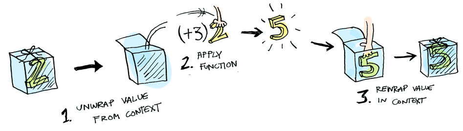

여기서 조금 더 펼쳐 보자. 사실 더 일반적으로 말하면, 행렬 계산 관점에서 하나의 Semi-Ring algebraic structure를 구성한다. 물론 standard GEMM의 addition은 commutative group을 구성하는데, addition에는 inverse element가 있기 때문이다. multiplication에는 identity element가 있고, addition과 multiplication 모두 associativity를 만족한다.

하지만 일부 특수한 상황과 computation requirement를 보면, operation reversibility에 대한 요구를 완화해야 하므로 semi-ring algebraic structure를 구성한다. 예를 들어 일부 graph algorithm에서는 standard addition/multiplication으로 구성된 matrix operation이 아니다. shortest path computation은 실제로 Min-Plus 기반 Tropical Semi-Ring이다. 자세한 내용은 GraphBLAS[2]를 참고할 수 있다.

하지만 본질적으로 이러한 operation은 associativity를 만족하고, identity element를 가지며 computation closure를 만족한다. 즉 Monoid를 구성한다. 더 자세한 내용은 [《대형 모델의 수학적 기초》](https://mp.weixin.qq.com/mp/appmsgalbum?__biz=MzUxNzQ5MTExNw==&action=getalbum&album_id=3210156532718403586#wechat_redirect) 안의 몇몇 글에서 논의한 적이 있다.

[《대형 모델 시대의 수학적 기초(6) - word2vec에서 representation theory, compositionality, monoidal category와 Dataflow Optics까지》](http://mp.weixin.qq.com/s?__biz=MzUxNzQ5MTExNw==&mid=2247488775&idx=1&sn=1793eb897beb71ce4a64c9ab44beee6b&chksm=f99605c5cee18cd3481913d17122bb9da63f6385901c9842e8173186e98040d7f91620a91f95&scene=21#wechat_redirect)

[《대형 모델 시대의 수학적 기초(8) - CDL category deep learning》](http://mp.weixin.qq.com/s?__biz=MzUxNzQ5MTExNw==&mid=2247488968&idx=1&sn=8bfd5194e645f9c37469ca2793bbcee7&chksm=f996050acee18c1c5258b28c8e8211dc9fa662c9a0b28d7174011ddce1c94fce671b6eb5e3f3&scene=21#wechat_redirect)

[《대형 모델 시대의 data intelligence와 수학적 기초》](http://mp.weixin.qq.com/s?__biz=MzUxNzQ5MTExNw==&mid=2247489983&idx=1&sn=673047dc5d1b22caeb51b7fe9f2bbb4c&chksm=f996097dcee1806b43a5174ca55ca81ecec52a66c26f9b565a49c51ec9ff85cc428027022eae&scene=21#wechat_redirect)

model에서 compute chip으로, 그리고 compute chip에서 model로라는 두 시각에서 바라보면, top-down이든 bottom-up이든 abstraction/encapsulation/generalization은 결국 composable software/hardware delivery interface를 필요로 한다. 비유하자면 Lego와 같다.

#### 0.1 model 관점에서 보기

model 자체 관점에서 보면, Transformer 각 layer가 input/output tensor Shape consistency를 보장하는 것도 composability의 표현이다. 물론 여기에는 Optics와 Lens 개념도 일부 관련될 수 있다. 비유하자면 이런 composability는 MoE, Mamba, Transformer=Jamba를 나타낸다.


그리고 이러한 composability가 Pytorch 관련 tensor computation abstraction을 구축한다. 그다음 model partition/training data partition 등의 strategy를 구성하고, 다시 여러 GPU로 어떻게 schedule할지까지 세분화한다.

본질로 돌아가면 distributed representation 문제다. [《대형 모델 interpretability에 대해 이야기하기》](http://mp.weixin.qq.com/s?__biz=MzUxNzQ5MTExNw==&mid=2247490256&idx=2&sn=e25763d3bc3236e5cc22e4baed5702a5&chksm=f9960a12cee18304acafa8fcf866fed5e3528a568a7915e2081f0194331b50e57ece4083cab1&scene=21#wechat_redirect)에서는 distributed representability가 가져오는 composability 요구, 후속 analysis 및 Composable Transformer에 대한 몇 가지 추측을 다루었다.

[《DeepMind가 algorithms textbook의 TransNAR을 만들 수 있는지 이야기하고, SAE-GNN 기반 Composable Transformer 추측을 이끌어내기》](http://mp.weixin.qq.com/s?__biz=MzUxNzQ5MTExNw==&mid=2247490297&idx=1&sn=7d758e84bdce7ae4f20f031f4ac3f221&chksm=f9960a3bcee1832d58956a286d2bc33ca32c69edfb3a00cdad65aec691100f2cc086649aa1bf&scene=21#wechat_redirect)

#### 0.2 chip 관점에서 보기

하나의 matrix multiplication task를 보면, 두 가지 partition을 수행할 수 있다:

- **space partition**: 예를 들어 하나의 행렬을 block으로 나누는 과정에서 block matrix의 memory pointer와 memory access abstraction은 전체 split의 composability를 보장해야 한다. 그래야 주소와 offset을 계산하는 code 구현이 대량으로 중복되는 것을 피할 수 있다.
- **time partition**: 행렬 사이의 data dependency, operator fusion, asynchronous memory access interface, latency hiding 방식, register file/shared memory management 등, 심지어 더 큰 규모의 operator를 multi-card 사이에서 partition하고 scheduling하는 것까지 모두 composability가 필요하다.

본질적으로 우리는 chip architecture와 무관한 abstraction이 필요하며, operator fusion 같은 Composable capability와도 연결될 수 있어야 한다.

#### 0.3 operator representation 관점에서 보기

초기의 APL language[3]부터 이후 Numpy, pytorch 같은 tensor representation까지, 본질적으로 모두 operator composability의 구현을 갖고 있다. 더 나아가 Einstein Summation Convention(Einsum) API를 사용해 composable operator를 구성하는 예도 있다.

예를 들어 Transformer Q,K,V 계산과 Attention 계산의 Einsum representation은 다음과 같다.

```python
dim = 12288
qvk = nn.Linear(dim, dim * 3, bias=False)
#<- 하나의 linear layer로 W 행렬을 구성해, 이후 DP Allreduce를 함께 묶어 수행하기 쉽다
qkv = to_qvk(x) # 이 시점에 곱셈이 끝나면 (batchsize, tokens, dim*3) tensor가 된다

# rearrange 함수로 QKV를 분리하고, 마지막 차원 dim*3을 세 개 tensor로 나눈다
q, k, v = tuple(rearrange(qkv, 'b t (d k) -> k b t d ', k=3))

scaled_dot_prod = torch.einsum('b i d , b j d -> b i j', q, k) * self.scale_factor
if mask is not None:
    assert mask.shape == scaled_dot_prod.shape[1:]
    scaled_dot_prod = scaled_dot_prod.masked_fill(mask, -np.inf)
att = torch.softmax(scaled_dot_prod, dim=-1)

torch.einsum('b i j , b j d -> b i d', att, v)
```

## 1. Composable operator의 난제

### 1.1 chip의 atomic capability

그런데 유감스럽게도 적어도 최하위 chip implementation에서는 동일한 atomic capability를 만들 수 없다. 예를 들어 NV는 GPU architecture마다 서로 다른 matrix multiplication unit을 갖고 있다.

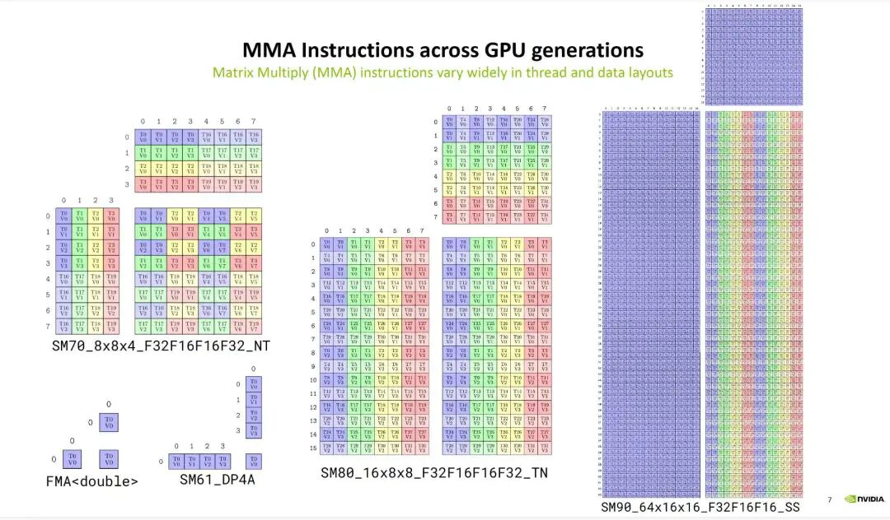

이는 general-purpose CPU ISA software/hardware delivery interface와 가장 큰 차이점이다. 따라서 compute chip에서 algorithm/model architecture로 점차 올라가는 전체 과정에서 common denominator를 찾아 composable Kernel capability를 구성하고, 하위 구현의 차이를 숨겨야 한다.

### 1.2 복잡한 matrix block partition strategy

전체 matrix multiplication 과정에는 Thread Block Tile에서 WarpTile, 다시 MMA Tile까지 여러 차례 partition이 존재한다. 또한 hardware implementation details와 bank conflict/memory access coalescing 등의 요소도 고려해야 하므로, 전체 과정에 대량의 복잡한 address calculation이 포함된다. 그 결과 단순한 standard loop unrolling으로 처리할 수 없다.

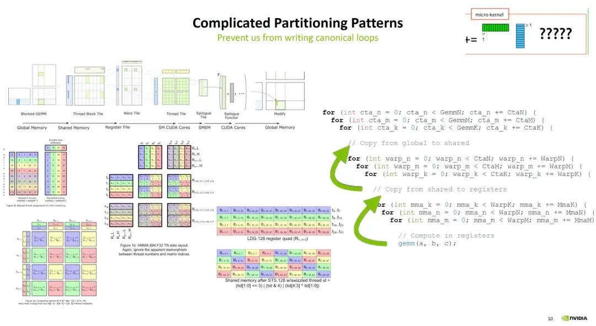

서로 다른 memory access pattern에 대해 CUTLASS 2.x는 많은 abstraction을 만들었다. logical coordinate mapping에서 memory access offset index까지, block 분할 data access iteration을 어떻게 구현할지, thread에서 data block으로의 mapping을 어떻게 할지 등이 포함된다. 각 generation의 hardware architecture에 대해서도 새로운 Layout을 정의해야 하며, 이런 것들은 유지보수하기도 매우 어렵다.

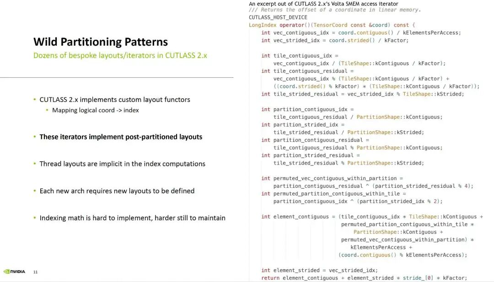

### 1.3 numerical stability 난제

사실 operator composability와 fusion에는 또 하나의 문제가 있는데, 바로 numerical stability 난제다. 즉 일련의 floating-point operation이 가져오는 error다. 이런 문제 자체는 대체로 수학과에서 《Numerical Analysis》 또는 《Computational Methods》 같은 과목에서야 다룬다. 따라서 matrix operation에는 고려해야 할 제약이 꽤 많다.

## 2. Cutlass 3.x의 abstraction

Cutlass 3.x는 전체 Kernel의 abstract/generalized expression capability에 대해 다음과 같은 assumptions를 둔다:

1. Global Memory의 Layout은 GPU generation 사이에서 변하지 않는다.
2. hierarchical memory에 대해, GPU는 nested tiling parallel strategy로 model할 수 있다.
3. 이 hierarchical nested modeling을 기반으로, 가장 안쪽 loop(MMA Tile) 또는 WarpTile이 peak compute capability에 도달하는 크기는 상대적으로 고정되어 있으며, 유일한 변화는 가장 바깥쪽 M-N-K shape과 해당 ThreadBlockTile strategy에 있다.
4. 서로 다른 data region 사이의 data movement는 developer가 관리하는 software pipeline mechanism과 asynchronous memory access mechanism으로 latency를 숨긴다.
5. 서로 다른 MMA instruction size, asynchronous pipeline structure 등 platform-dependent dependency가 일부 있으며, 이런 것은 parameterized template로 구현할 수 있다.

### 2.1 Cutlass 3.x layering

이러한 abstraction assumptions를 바탕으로 하면, GPU architecture와 무관한 delivery interface를 만들 수 있다. 아래 그림과 같다:

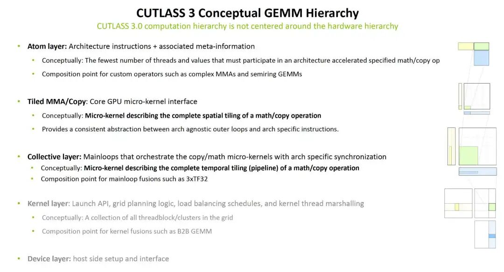

서로 다른 hardware architecture에 대해 Atom Layer를 구성했다. 이는 MMA instruction 또는 COPY instruction(SMEM->RF)을 실행하는 description이다. 이 지점이 GEMM semi-ring algebraic structure와 복잡한 MMA computation의 composable point를 정확히 구성한다. 그다음 Tiled MMA/Copy layer를 추상화했는데, 주로 matrix tiling에 대한 description, 즉 spatial dimension(Spatial Tiling)의 partition을 다룬다. 그 목적은 다양한 architecture의 atomic operator layer 위에 hardware architecture와 무관한 abstraction layer를 구축하는 것이다. 이어서 Collective layer를 추상화했는데, 주로 temporal dimension(Temporal Tiling)에서 서로 다른 architecture의 computation/communication operator orchestration을 다룬다. 더 위의 Kernel layer는 Thread/block placement에 대한 abstraction이고, Device layer는 host invocation에 대한 abstraction이다. 3장에서는 detailed example을 제시한다.

### 2.2 tensor Layout abstraction

time dimension과 space dimension의 partition을 통해 Cutlass 3.x의 Tile 기반 programming model abstraction이 구성된다.

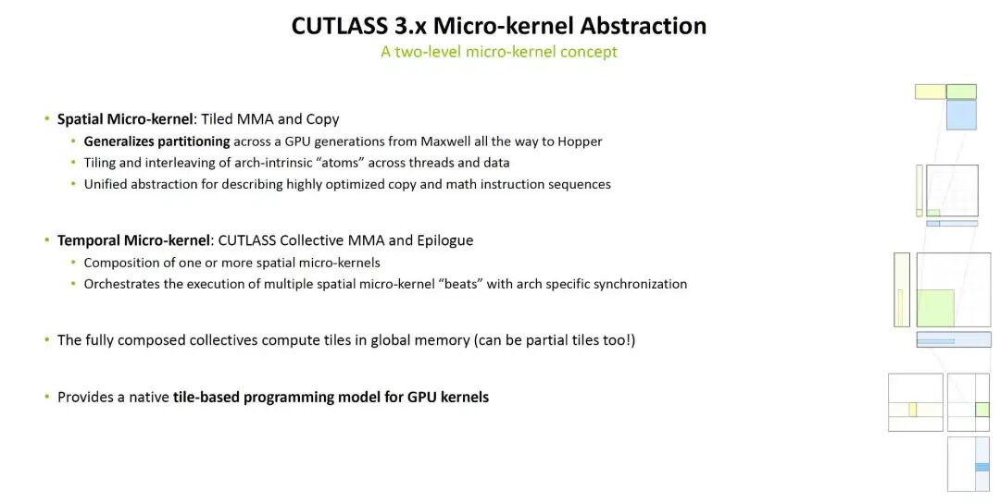

하지만 이러한 Micro-Kernel 사이의 deliverable은 Tensor의 Layout에 대해 algebraically composable structure를 구성해야 한다. 그러나 Cutlass 2.x는 여전히 너무 복잡해서, 추가 abstraction이 필요하다.

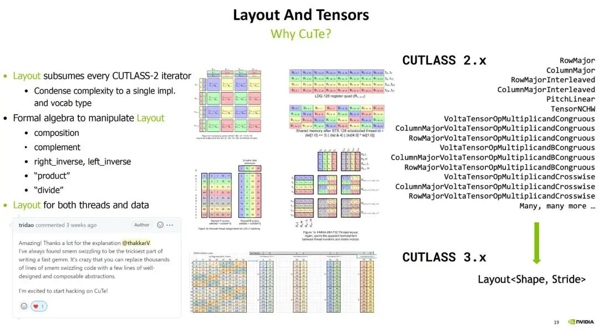

따라서 CuTe Layouts가 등장했다. 구체적인 CuTe Layout algebra와 hierarchical Layout 관련 내용은 이후 글에서 별도로 소개하겠다. 예: Logical Product/Divide 등.

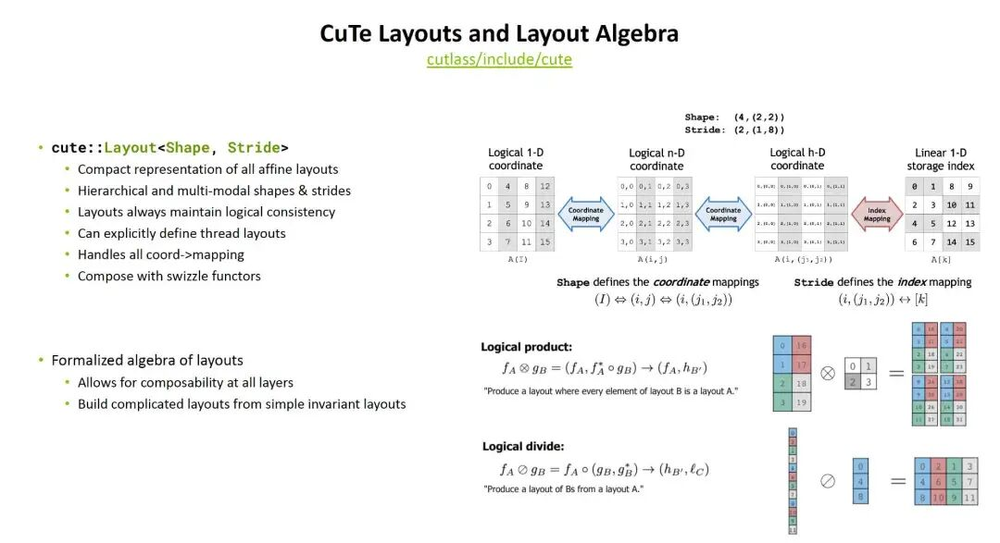

## 3. Cutlass 3.x GEMM Example

CuTe tutorial sgemm\_sm80.cu[4]를 예로 들어 analysis한다.

### 3.1 Overview

GEMM Kernel의 function template은 다음과 같다.

```c++
template <class ProblemShape, class CtaTiler,
          class TA, class AStride, class ASmemLayout, class TiledCopyA,
          class TB, class BStride, class BSmemLayout, class TiledCopyB,
          class TC, class CStride, class CSmemLayout, class TiledMma,
          class Alpha, class Beta>
__global__ static
__launch_bounds__(decltype(size(TiledMma{}))::value)
void
gemm_device(ProblemShape shape_MNK, CtaTiler cta_tiler,
            TA const* A, AStride dA, ASmemLayout sA_layout, TiledCopyA copy_a,
            TB const* B, BStride dB, BSmemLayout sB_layout, TiledCopyB copy_b,
            TC      * C, CStride dC, CSmemLayout          , TiledMma mma,
            Alpha alpha, Beta beta)
{
```

Alpha/Beta는 matrix multiply-add의 parameter이며, 다음과 같다.

$$
C = \alpha A B +\beta C
$$

#### 3.1.1 ProblemShape

즉 matrix multiplication의 M/N/K 값이며, 다음과 같이 정의한다.

```c++
  // Define shapes (dynamic)
  auto M = int(m);
  auto N = int(n);
  auto K = int(k);
  auto prob_shape = make_shape(M, N, K);    // (M, N, K)
```

#### 3.1.2 `CtaTiler`

이는 CuTe의 Tiler concept에서 온 것이며, 이후 자세히 설명한다. 여기서는 ProblemShape에서 BlockTile을 어떻게 split할지에 대한 strategy로 이해할 수 있다. 정의는 다음과 같다.

```c++
  // Define CTA tile sizes (static)
  auto bM = Int<128>{};
  auto bN = Int<128>{};
  auto bK = Int<  8>{};
  auto cta_tiler = make_shape(bM, bN, bK);                   // (BLK_M, BLK_N, BLK_K)
```

#### 3.1.3 TA const\* A, TB const\* B, TC\* C

A, B, C 행렬의 data type과 해당 data pointer

#### 3.1.4 Layout & Stride

- AStride, BStride, CStride는 구체적인 행렬 Column-Major, Row-Major Layout과 관련된다.
- ASmemLayout, BSmemLayout, CSmemLayout은 각 CTA 내부 Shared Memory의 Layout을 나타낸다.

주: TensorCore가 없는 old architecture에는 ThreadLayout도 있다. 즉 AThreadLayout, BThreadLayout, CThreadLayout이다.

행렬의 Layout에 대해 Cutlass는 다음 symbol definition을 사용한다. AB matrix의 Layout이 서로 다른 matrix multiplication에는 네 가지 combination이 존재한다.

- N, Column Major Matrix(Non-Transposed)
- T, Row Major Matrix(Transposed)
- {N,T} x {N,T} - All combinations, i.e., NN, NT, TN, TT

| BLAS | A Majorness | A Layout | B Majorness | B Layout |
| --- | --- | --- | --- | --- |
| NT | M-major | `(M,K):(1,ldA)` | N-major | `(N,K):(1,ldA)` |
| TN | K-major | `(M,K):(ldA,1)` | K-major | `(N,K):(ldB,1)` |
| NN | M-major | `(M,K):(1,ldA)` | K-major | `(N,K):(ldB,1)` |
| TT | K-major | `(M,K):(ldA,1)` | N-major | `(N,K):(1,ldA)` |

서로 다른 Layout에 대해 ldA/ldB/ldC는 다음과 같이 정의한다:

```c++
  int ldA = 0, ldB = 0, ldC = m;

  if (transA == 'N') {
    ldA = m;
  } else if (transA == 'T') {
    ldA = k;
  } else {
    assert(false);
  }

  if (transB == 'N') {
    ldB = k;
  } else if (transB == 'T') {
    ldB = n;
  } else {
    assert(false);
  }
```

다음으로 NT를 예로 든다(A는 Column Major, B는 Row Major Layout). `gemm_nt` 함수에서는 Layout을 다음과 같이 정의한다.

```c++
  // 행렬 Shape 정의
  auto M = int(m);
  auto N = int(n);
  auto K = int(k);
  auto prob_shape = make_shape(M, N, K);                     // (M, N, K)

  // GMEM 내 A/B/C tensor의 Stride 정의
  auto dA = make_stride(Int<1>{}, ldA);                      // (dM, dK)
  auto dB = make_stride(Int<1>{}, ldB);                      // (dN, dK)
  auto dC = make_stride(Int<1>{}, ldC);                      // (dM, dN)

  // Define CTA tile sizes (static)
  auto bM = Int<128>{};
  auto bN = Int<128>{};
  auto bK = Int<  8>{};
  auto cta_tiler = make_shape(bM, bN, bK);                   // (BLK_M, BLK_N, BLK_K)
  auto bP = Int<3>{};  // Pipeline

  // ASmemLayout, BSmemLayout, CSmemLayout 정의
  // Define the smem layouts (static)
  auto sA = make_layout(make_shape(bM, bK, bP));             // (m,k,p) -> smem_idx; m-major
  auto sB = make_layout(make_shape(bN, bK, bP));             // (n,k,p) -> smem_idx; n-major
  auto sC = make_layout(make_shape(bM, bN));                 // (m,n) -> smem_idx; m-major
```

#### 3.1.5 TileCopy, TileMMA

Tile의 copy와 MMA instruction을 정의하면 다음과 같다.

```c++
  // Global Memory에서 SMEM으로 copy하는 TileCopy function
  TiledCopy copyA = make_tiled_copy(Copy_Atom<SM80_CP_ASYNC_CACHEALWAYS<uint128_t>, TA>{},
                                    Layout<Shape<_32,_8>>{}, // Thr layout 32x8 m-major
                                    Layout<Shape< _4,_1>>{});// Val layout  4x1 m-major
  TiledCopy copyB = make_tiled_copy(Copy_Atom<SM80_CP_ASYNC_CACHEALWAYS<uint128_t>, TB>{},
                                    Layout<Shape<_32,_8>>{}, // Thr layout 32x8 n-major
                                    Layout<Shape< _4,_1>>{});// Val layout  4x1 n-major

  TiledMMA mmaC = make_tiled_mma(UniversalFMA<TC,TA,TB>{},
                                 Layout<Shape<_16,_16,_1>>{});  // 16x16x1 TiledMMA
```

`SM80_CP_ASYNC_CACHEALWAYS`가 실제로 호출하는 것은 `cp.async.ca` instruction이며, 아래와 같다. 이 방식은 L1 cache에 Cache하기 때문에 performance 측면에서 최적은 아니다. 이후 L1을 bypass하는 `SM80_CP_ASYNC_CACHEGLOBAL` 구현을 만들 것이다.

```c++
template <class TS, class TD = TS>
struct SM80_CP_ASYNC_CACHEALWAYS
{
  using SRegisters = TS[1];
  using DRegisters = TD[1];

  static_assert(sizeof(TS) == sizeof(TD), "cp.async requires sizeof(src_value_type) == sizeof(dst_value_type)");
  static_assert(sizeof(TS) == 4 || sizeof(TS) == 8 || sizeof(TS) == 16, "cp.async sizeof(TS) is not supported");

  CUTE_HOST_DEVICE static void
  copy(TS const& gmem_src,
       TD      & smem_dst)
  {
#if defined(CUTE_ARCH_CP_ASYNC_SM80_ENABLED)
    TS const* gmem_ptr    = &gmem_src;
    uint32_t smem_int_ptr = cast_smem_ptr_to_uint(&smem_dst);
    asm volatile("cp.async.ca.shared.global.L2::128B [%0], [%1], %2;\n"
        :: "r"(smem_int_ptr),
           "l"(gmem_ptr),
           "n"(sizeof(TS)));
#else
    CUTE_INVALID_CONTROL_PATH("Support for cp.async instructions has not been enabled");
#endif
  }
};
```

TiledCopy 구성은 다음과 같다:

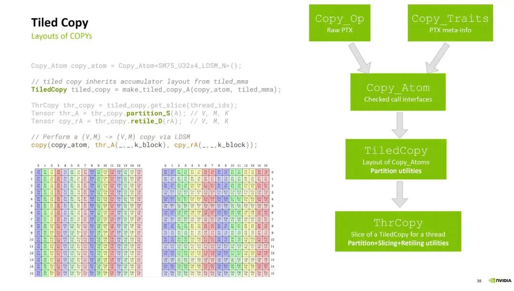

마찬가지로 TiledMMA는 MMA operation을 정의하는 데 사용되며, 다음 방식으로 Latex Layout을 생성할 수 있다.

```c++
#include "cute/tensor.hpp"
using namespace cute;
int main() {
  auto tiled_mma = make_tiled_mma(UniversalFMA<float,float,float>{},
                                 Layout<Shape<_16,_16,_1>>{});
  print_latex(tiled_mma);
  return 0;
}

#nvcc -arch sm_86 tile_mma.cu -o tile_mma
# ./tile_mma > foo.tex
# pdflatex foo.tex
```

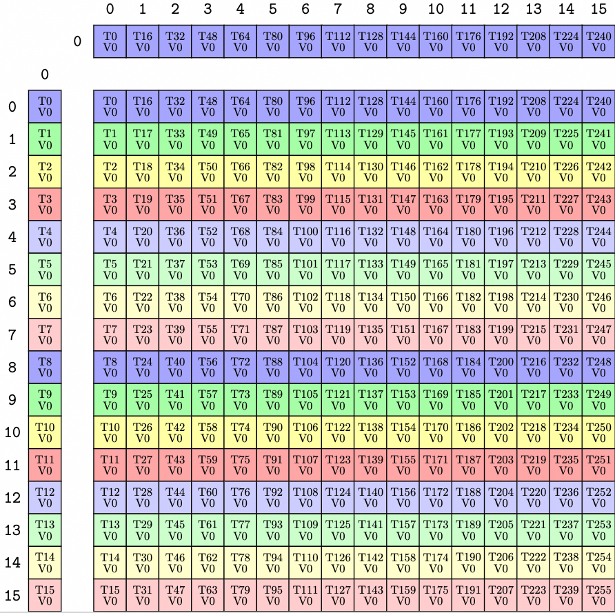

TiledMMA 구성 방식은 다음과 같다:

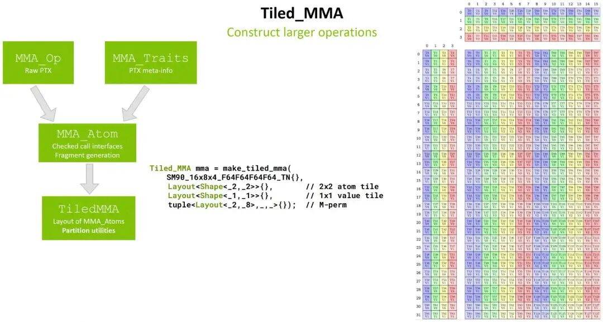

### 3.2 GEMM Kernel

전체 GEMM Kernel의 flow는 다음과 같다.

1. Tensor Tile과 관련 Layout, Shape 생성

```c++
  //
  // Full and Tiled Tensors
  //

  // Represent the full tensors
  Tensor mA = make_tensor(make_gmem_ptr(A), select<0,2>(shape_MNK), dA); // (M,K)
  Tensor mB = make_tensor(make_gmem_ptr(B), select<1,2>(shape_MNK), dB); // (N,K)
  Tensor mC = make_tensor(make_gmem_ptr(C), select<0,1>(shape_MNK), dC); // (M,N)

  // CTA coordinate 기반으로 해당 Tile 구성
  auto cta_coord = make_coord(blockIdx.x, blockIdx.y, _);              // (m,n,k)
  Tensor gA = local_tile(mA, cta_tiler, cta_coord, Step<_1, X,_1>{});  // (BLK_M,BLK_K,k)
  Tensor gB = local_tile(mB, cta_tiler, cta_coord, Step< X,_1,_1>{});  // (BLK_N,BLK_K,k)
  Tensor gC = local_tile(mC, cta_tiler, cta_coord, Step<_1,_1, X>{});  // (BLK_M,BLK_N)

  // Shared memory buffers
  __shared__ TA smemA[cosize_v<ASmemLayout>];
  __shared__ TB smemB[cosize_v<BSmemLayout>];
  Tensor sA = make_tensor(make_smem_ptr(smemA), sA_layout);            // (BLK_M,BLK_K,PIPE)
  Tensor sB = make_tensor(make_smem_ptr(smemB), sB_layout);            // (BLK_N,BLK_K,PIPE)
```

2. block copy

```c++
  ThrCopy thr_copy_a = copy_a.get_slice(threadIdx.x);
  Tensor tAgA = thr_copy_a.partition_S(gA);                            // (CPY,CPY_M,CPY_K,k)
  Tensor tAsA = thr_copy_a.partition_D(sA);                            // (CPY,CPY_M,CPY_K,PIPE)

  ThrCopy thr_copy_b = copy_b.get_slice(threadIdx.x);
  Tensor tBgB = thr_copy_b.partition_S(gB);                            // (CPY,CPY_N,CPY_K,k)
  Tensor tBsB = thr_copy_b.partition_D(sB);                            // (CPY,CPY_N,CPY_K,PIPE)
```

3. pipeline prefetch

```c++
  auto K_PIPE_MAX = size<3>(tAsA);

  // Total count of tiles
  int k_tile_count = size<3>(tAgA);
  // Current tile index in gmem to read from
  int k_tile_next = 0;

  // Start async loads for all pipes but the last
  CUTE_UNROLL
  for (int k_pipe = 0; k_pipe < K_PIPE_MAX-1; ++k_pipe) {
    copy(copy_a, tAgA(_,_,_,k_tile_next), tAsA(_,_,_,k_pipe));
    copy(copy_b, tBgB(_,_,_,k_tile_next), tBsB(_,_,_,k_pipe));
    cp_async_fence();
    --k_tile_count;
    if (k_tile_count > 0) { ++k_tile_next; }
  }
```

4. MMA fragment 정의

```c++
  ThrMMA thr_mma = mma.get_slice(threadIdx.x);
  Tensor tCsA = thr_mma.partition_A(sA);                               // (MMA,MMA_M,MMA_K,PIPE)
  Tensor tCsB = thr_mma.partition_B(sB);                               // (MMA,MMA_N,MMA_K,PIPE)
  Tensor tCgC = thr_mma.partition_C(gC);                               // (MMA,MMA_M,MMA_N)

  // Allocate registers for pipelining
  Tensor tCrA = thr_mma.make_fragment_A(tCsA(_,_,_,0));                // (MMA,MMA_M,MMA_K)
  Tensor tCrB = thr_mma.make_fragment_B(tCsB(_,_,_,0));                // (MMA,MMA_N,MMA_K)
  // Allocate the accumulators -- same size as the projected data
  Tensor tCrC = thr_mma.make_fragment_C(tCgC);                         // (MMA,MMA_M,MMA_N)

  // Clear the accumulators
  clear(tCrC);
```

5. GEMM pipeline. Tensor-004의 관련 글을 참고할 수 있으며, flow는 비슷하다. 여러 pipeline stage를 통해 Copy와 MMA를 Overlap시킨다.

```c++
  // 현재 읽는 Pipeline Index
  int smem_pipe_read  = 0;
  // 현재 write해야 하는 Pipeline Index
  int smem_pipe_write = K_PIPE_MAX-1;

  // SMEM에서 현재 slice 가져오기
  Tensor tCsA_p = tCsA(_,_,_,smem_pipe_read);
  Tensor tCsB_p = tCsB(_,_,_,smem_pipe_read);

  // Size of the register pipeline
  auto K_BLOCK_MAX = size<2>(tCrA);

  // PREFETCH register pipeline
  if (K_BLOCK_MAX > 1) {
    // Wait until our first prefetched tile is loaded in
    cp_async_wait<K_PIPE_MAX-2>();
    __syncthreads();

    // Prefetch the first rmem from the first k-tile
    copy(tCsA_p(_,_,Int<0>{}), tCrA(_,_,Int<0>{}));
    copy(tCsB_p(_,_,Int<0>{}), tCrB(_,_,Int<0>{}));
  }

  //
  // PIPELINED MAIN LOOP
  // TUTORIAL: Example of a gemm loop that pipelines shared memory using SM80's cp.async instructions
  //           and explicit pipelines in shared memory.
  //   Data is read from global(k_tile_next) to shared(smem_pipe_write).
  //   Data is read from shared(smem_pipe_read) to registers(k_block_next).
  //   Data is computed on registers(b_block).
  //
  //   This allows all copies and compute to overlap:
  //     Copy from gmem->smem can overlap with copies from smem->rmem and compute on rmem.
  //     Copy from smem->rmem can overlap with compute on rmem.
  //

  CUTE_NO_UNROLL
  while (k_tile_count > -(K_PIPE_MAX-1))
  {
    CUTE_UNROLL
    for (int k_block = 0; k_block < K_BLOCK_MAX; ++k_block)
    {
      if (k_block == K_BLOCK_MAX - 1)
      {
        // Slice the smem_pipe_read smem
        tCsA_p = tCsA(_,_,_,smem_pipe_read);
        tCsB_p = tCsB(_,_,_,smem_pipe_read);

        // Commit the smem for smem_pipe_read
        cp_async_wait<K_PIPE_MAX-2>();
        __syncthreads();
      }

      // Load A, B shmem->regs for k_block+1
      auto k_block_next = (k_block + Int<1>{}) % K_BLOCK_MAX;      // static
      copy(tCsA_p(_,_,k_block_next), tCrA(_,_,k_block_next));
      copy(tCsB_p(_,_,k_block_next), tCrB(_,_,k_block_next));
      // Copy gmem to smem before computing gemm on each k-pipe
      if (k_block == 0)
      {
        copy(copy_a, tAgA(_,_,_,k_tile_next), tAsA(_,_,_,smem_pipe_write));
        copy(copy_b, tBgB(_,_,_,k_tile_next), tBsB(_,_,_,smem_pipe_write));
        cp_async_fence();

        // Advance the gmem tile
        --k_tile_count;
        if (k_tile_count > 0) { ++k_tile_next; }

        // Advance the smem pipe
        smem_pipe_write = smem_pipe_read;
        ++smem_pipe_read;
        smem_pipe_read = (smem_pipe_read == K_PIPE_MAX) ? 0 : smem_pipe_read;
      }
      // Thread-level register gemm for k_block
      gemm(mma, tCrA(_,_,k_block), tCrB(_,_,k_block), tCrC);
    }
```

6. Epilogue

이 stage는 매우 간단한 `axpby(alpha, tCrC, beta, tCgC);` function이다.

### 3.3 Cutlass 3.x 요약

Cutlass 3.x는 TiledMMA와 TileCopy를 통해 내부의 서로 다른 hardware architecture implementation을 숨겼고, spatial/temporal 두 micro kernel partition을 통해 workflow를 잘 추상화했다. 동시에 CuTe Layout algebra의 flexibility로 비교적 쉬운 composable operator framework를 구축했다.

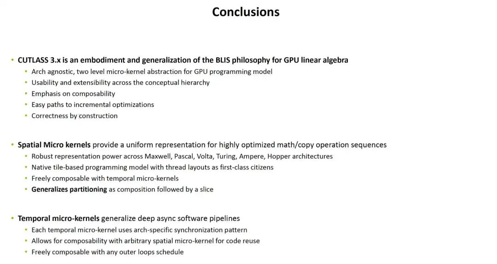

다음 글에서는 CuTe와 해당 CuTe algebra를 자세히 소개하겠다.

참고 자료

[1]

A Generalized Micro-kernel Abstraction for GPU Linear Algebra: https://www.cs.utexas.edu/~flame/BLISRetreat2023/slides/Thakkar\_BLISRetreat2023.pdf

[2]

GraphBLAS: https://www.mit.edu/~kepner/GraphBLAS/GraphBLAS-Math-release.pdf

[3]

APL programming language: https://en.wikipedia.org/wiki/APL\_(programming\_language)

[4]

cute\_sgemm\_sm80.cu: https://github.com/NVIDIA/cutlass/blob/main/examples/cute/tutorial/sgemm\_sm80.cu
