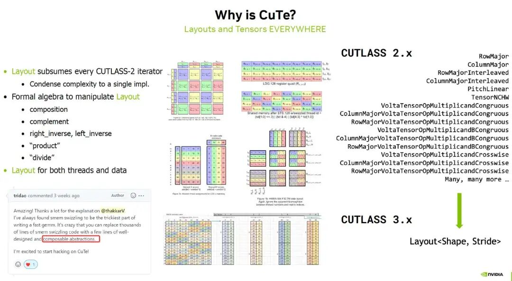
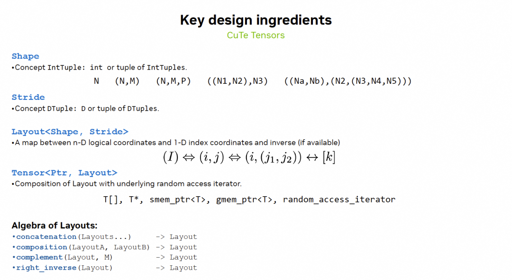
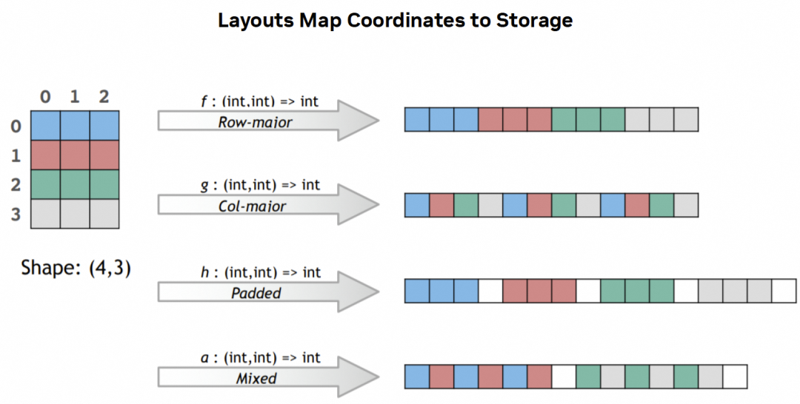
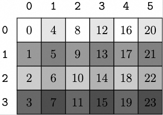
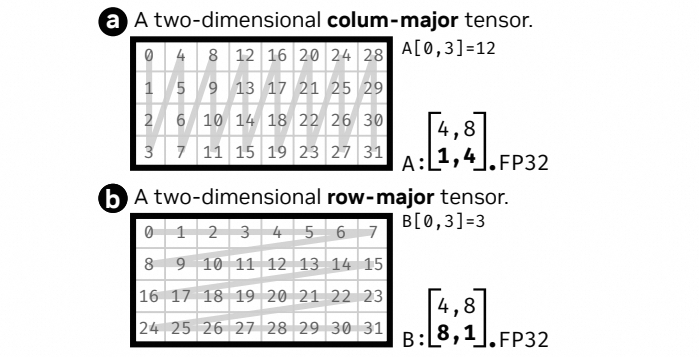
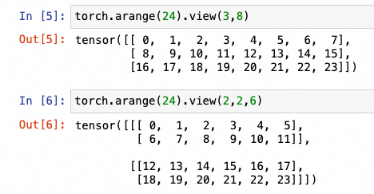
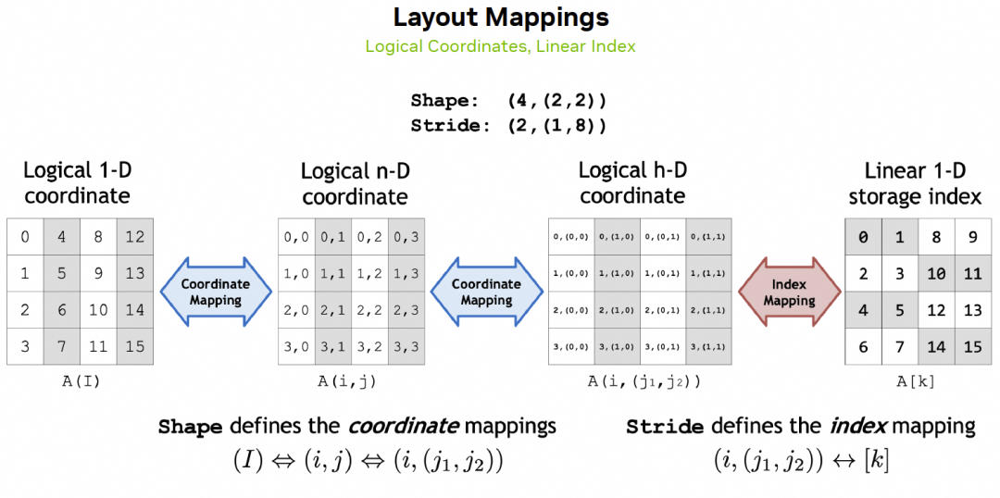
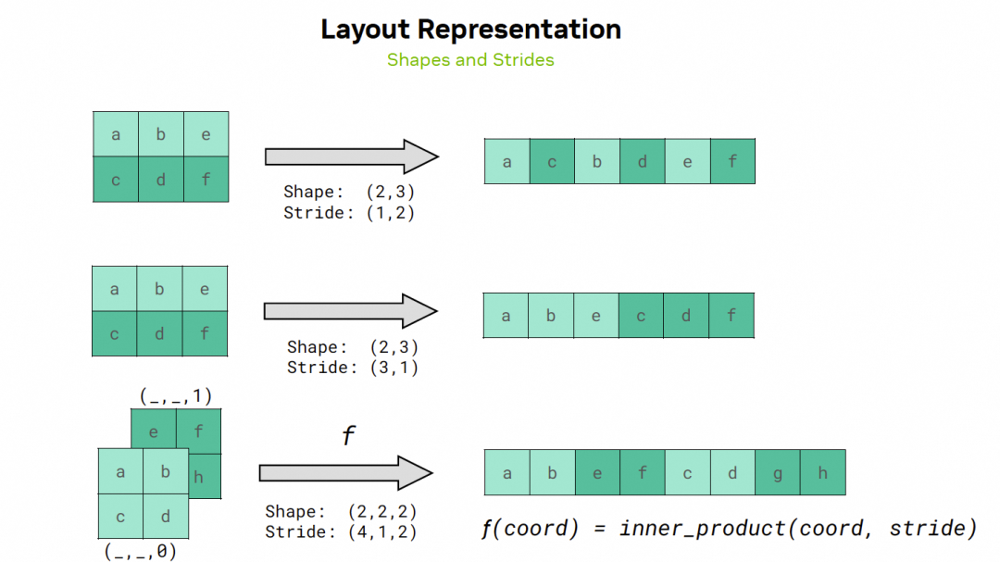
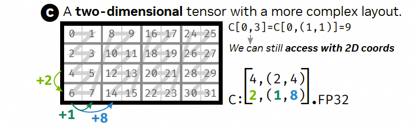
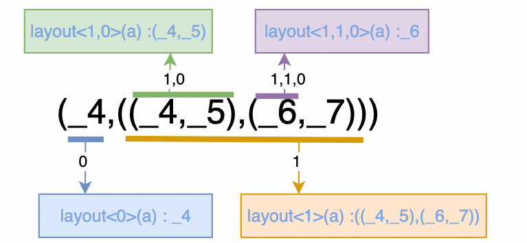

# Tensor-007 Cute Layout 소개

- 원문 제목: Tensor-007 Cute Layout 소개
- 저자: 자보터의 지우개
- 계정: zartbot
- 발행일: 2024년 8월 24일 22:47

### TL;DR

서로 다른 hardware platform architecture를 대상으로 Cutlass 2.x에서는 여러 Layout abstraction을 정의했다. matrix block 계산, memory access의 Bank Conflict 해결, operator fusion 과정에는 memory access address mapping 변환 같은 복잡한 계산이 대량으로 포함된다. 따라서 composable abstraction을 수행할 수 있는 비교적 일반적인 algebraic structure가 필요했고, 이것이 CuTe가 등장한 이유다.



근본적으로 CuTe Layout은 coordinate space에서 memory address index space로 가는 mapping algebra다. high-dimensional array access를 위한 general abstraction interface를 제공한다. 사용자는 column-major 또는 row-major memory layout을 고려할 필요가 없고, 특정 block의 실제 memory address에 대해 복잡한 offset 계산을 할 필요도 없다. 가장 핵심적인 점은 행렬이 GMEM->SMEM->RF로 여러 번 block 분할되는 과정에서 hierarchical Tensor structure와 Layout algebra를 지원하며, 일련의 composition operation을 통해 thread Layout 기반 data partition을 구현할 수 있다는 것이다.

```
1. CuTe Overview
1.1 기본 type과 concept
1.1.1 Integers 정수형
1.1.2 Tuple tuple
1.2 Shape, Stride and Layout
1.3 hierarchical access
1.4 Layout 사용
1.4.1 Layout visualization
1.4.2 vector Layout
1.4.3 2D matrix Layout

2. Layout 상세 설명
2.1 Layout compatibility
2.2 Layout coordinate

3. Layout operation
3.1 SubLayout
3.2 Concate
3.3 Group과 Flatten
```

## 1. CuTe Overview

CuTe Layout 연산에서는 composability를 위해 다양한 matrix split과 thread assignment task를 generalized representation해야 한다. 따라서 computation closure와 composability를 보장할 algebraic system이 필요하다. 먼저 다소 지루한 기본 type과 operation을 소개한다. github에는 cute layout[1] 문서가 있으며, 이 장은 해당 문서를 기반으로 분석한다.

### 1.1 기본 type과 concept

Layout algebra의 abstraction은 다음과 같다:



정수형으로 tuple을 구성해 tensor shape(Shape)과 stride(Stride)를 표현하고, Shape과 Stride를 조합해 Layout을 구성하며, memory의 base address pointer와 Layout을 함께 사용해 tensor를 정의한다. 서로 다른 memory access requirement에 대해서는 Layout function 변환을 통해 처리하고, computation closure를 보장한다. 이러한 algebraic composition을 통해 우리는 서로 다른 business requirement에 대해 matrix가 memory address로 mapping되는 방식을 unified하게 표현할 수 있다.



#### 1.1.1 Integers 정수형

CuTe에서 정의하는 정수형은 두 종류로 나뉜다:

**Dynamic**: dynamic integer(runtime에 값이 할당됨)이며 `int`/`size_t` 같은 일반 정수형과 같다. `std::is_integral<T>`가 받아들이는 모든 type은 dynamic integer로 사용할 수 있다.

**Static**: static integer(compile time에 값이 할당됨)이며, 이러한 static integer에 대해 CuTe는 몇 가지 alias를 정의한다. 예를 들어 `Int<1>`, `Int<2>`, `Int<3>` 또는 `_1`, `_2`, `_3` 등이 있고, `_m1`, `_m2` 등은 negative number를 나타낸다.

이 custom integer 기반에는 관련 expression operation도 정의되어 있다. 구체적인 code는 `/include/cute/numeric/integral_constant.hpp`에 있으며, 예를 들어 아래의 compound operation이 있다.

```c++
    // dynamic integer
    auto dynamic_var = int{2};
    dynamic_var = 4;

    // static integer
    auto static_var = Int<3>{};
    // static_var  -= 3 , compile error

    // compound operation
    auto var = Int<8>{} + max (_4{}, _3{}) - abs(_m4{}) * dynamic_var;
```

동시에 CuTe는 is\_intergal, is\_static 같은 type detection function도 제공한다. 일반적인 사용법은 다음과 같다.

```c++
CUTE_STATIC_ASSERT_V(is_static<decltype(shape<0>(gmem))>{});
```

#### 1.1.2 Tuple tuple

`std::tuple`과 유사한 여러 element를 포함하는 ordered list지만, CPU(host)와 GPU(device) function에 동시에 적용할 수 있다. CuTe는 IntTuple type도 정의했으며, `Shape` / `Stride` / `Step` / `Coord` 등 여러 concept의 container로 사용할 수 있다. `make_tuple` function으로 tuple을 구성할 수 있고, recursive construction도 가능하다.

```c++
// dynamic과 static으로 tuple 구성
make_tuple(int{2}, Int<3>{})

// nested tuple
make_tuple(uint16_t{42}, make_tuple(Int<1>{}, int32_t{3}), Int<17>{})
```

IntTuple에는 몇 가지 function이 정의되어 있다.

- `rank` : IntTuple 안의 element 수
- `get<I>`: IntTuple 안의 I번째 element(I < rank)
- `depth`: IntTuple의 hierarchical structure
- `size` : IntTuple 안의 모든 element의 product

아래에 몇 가지 예가 있다.

```c++
#define PRINT_TUPLE(name, content)      \
    print(name);                  \
    print(" : ");                 \
    print(content);               \
    print(" rank: ");             \
    print(cute::rank(content));   \
    print(" depth: ");            \
    print(cute::depth(content));  \
    print(" size: ");             \
    print(cute::size(content));   \
    print("\n");

    auto a =  make_tuple(uint16_t{42}, int{7});
    PRINT_TUPLE("a",a);
    auto b =  make_tuple(uint16_t{4}, int{8},Int<9>{} );
    PRINT_TUPLE("b",b);
    auto c = make_tuple(uint16_t{42}, make_tuple(Int<1>{}, int32_t{3}), b);
    PRINT_TUPLE("c",c);
    PRINT_TUPLE("c<2>",get<2>(c));

//output
a : (42,7) rank: _2 depth: _1 size: 294
b : (4,8,_9) rank: _3 depth: _1 size: 288

// tuple이 두 level이므로 depth=2, size = 42 * 1 * 3 * 4 * 8 * 9
c : (42,(_1,3),(4,8,_9)) rank: _3 depth: _2 size: 36288

// tuple의 세 번째 element를 꺼냄, size = 4 * 8 * 9
c<2> : (4,8,_9) rank: _3 depth: _1 size: 288
```

### 1.2 Shape, Stride and Layout

Shape과 Stride는 모두 IntTuple로 표현되며, 둘을 조합해 Layout object를 구성한다. 의미상으로는 Stride를 기반으로 Shape 안의 임의 coordinate를 memory address index로 mapping할 수 있다. 또한 Layout은 composition할 수 있으며, 예는 다음과 같다.

```c++
Layout s2xd4_col = make_layout(make_shape(Int<2>{},4),
                               LayoutLeft{});
Layout s2xd4_row = make_layout(make_shape(Int<2>{},4),
                               LayoutRight{});
// Shape/Stride nesting
Layout s2xh4 = make_layout(make_shape (2,make_shape (2,2)),
                           make_stride(4,make_stride(2,1)));
Layout s2xh4_col = make_layout(shape(s2xh4),
                               LayoutLeft{});

Layout a = make_layout(make_shape(_6{},_2{}),make_stride(_1{},_7{}));
Layout b = make_layout(make_shape(_3{},_2{}),make_stride(_2{},_3{}));
Layout c = composition(a,b);
```

Layout construction은 make\_layout(shape,stride) function으로 구현되며, Shape과 Stride는 모두 해당 make\_shape/make\_stride에 intTuple을 parameter로 넘겨 만들 수 있다.
Stride parameter를 생략하면 Shape parameter로부터 다시 생성되며, 기본값은 LayoutLeft 방식이다. 즉 자기 자신의 element를 제외한 Shape을 왼쪽에서 오른쪽으로 product한다. 예를 들어 아래의 세 번째 dimension은 자기 자신 4를 제외하고 왼쪽에서 오른쪽으로 2x3을 곱하므로 stride는 6이다. 이것은 `generalized column-major stride generation`이라고도 부른다. LayoutRight tag를 사용하면 오른쪽에서 왼쪽으로 누적 product한다. 마찬가지로 세 번째 dimension을 예로 들면 자기 자신 4를 제외하고 오른쪽은 5x6이므로 stride는 30이다. 이것은 `generalized row-major stride generation`이라고 부른다.

```c++
    Layout f_col = make_layout(make_shape(Int<2>{},3,4,5,6),
                               LayoutLeft{});
    Layout f_row = make_layout(make_shape(Int<2>{},3,4,5,6),
                               LayoutRight{});

//LayoutLeft:stride = (1, 2, 2*3, 2*3*4, 2*3*4*5)
fcol : (_2,3,4,5,6):(_1,_2,6,24,120) Shape: (_2,3,4,5,6) Stride: (_1,_2,6,24,120)

//LayoutRight: stride = (3*4*5*6,4*5*6,5*6,6,1)
frow : (_2,3,4,5,6):(360,120,30,6,_1) Shape: (_2,3,4,5,6) Stride: (360,120,30,6,_1)
```

Layout에도 Tuple과 비슷하게 rank/get<I>/depth/size 등의 function이 정의되어 있으며, shape과 stride를 가져오는 function도 있다. 또한 cosize는 codomain 위의 size를 나타낸다. codomain의 구체적인 의미는 CuTe Layout algebra 장에서 자세히 설명한다. 아래에 예가 있다.

```c++
#include <cuda.h>
#include <stdlib.h>
#include <cute/tensor.hpp>
#include <cutlass/numeric_types.h>

using namespace cute;

#define PRINT_LAYOUT(name, content)      \
    print(name);                  \
    print(" : ");                 \
    print(content);               \
    print(" Shape: ");            \
    print(cute::shape(content));  \
    print(" Stride: ");           \
    print(cute::stride(content)); \
    print(" rank: ");             \
    print(cute::rank(content));   \
    print(" depth: ");            \
    print(cute::depth(content));  \
    print(" size: ");             \
    print(cute::size(content));   \
    print(" cosize: ");           \
    print(cute::cosize(content)); \
    print("\n");


int main()
{
    Layout a = make_layout(make_shape(_6{}, _2{}), make_stride(_1{}, _7{}));
    Layout b = make_layout(make_shape(_3{}, _2{}), make_stride(_2{}, _3{}));
    Layout c = composition(a, b);
    Layout d = complement(a, c);
    Layout e = make_layout(a, c);
    PRINT_LAYOUT("a", a);
    PRINT_LAYOUT("b", b);
    PRINT_LAYOUT("c", c);
    PRINT_LAYOUT("c-get<1>", get<1>(c));
    PRINT_LAYOUT("d", d);
    PRINT_LAYOUT("e", e);
}

//output
a : (_6,_2):(_1,_7) Shape: (_6,_2) Stride: (_1,_7) rank: _2 depth: _1 size: _12 cosize: _13
b : (_3,_2):(_2,_3) Shape: (_3,_2) Stride: (_2,_3) rank: _2 depth: _1 size: _6 cosize: _8
c : (_3,_2):(_2,_3) Shape: (_3,_2) Stride: (_2,_3) rank: _2 depth: _1 size: _6 cosize: _8
c-get<1> : _2:_3 Shape: _2 Stride: _3 rank: _1 depth: _0 size: _2 cosize: _4
d : _1:_0 Shape: _1 Stride: _0 rank: _1 depth: _0 size: _1 cosize: _1
e : ((_6,_2),(_3,_2)):((_1,_7),(_2,_3)) Shape: ((_6,_2),(_3,_2)) Stride: ((_1,_7),(_2,_3)) rank: _2 depth: _2 size: _72 cosize: _20
```

### 1.3 hierarchical access

get/rank/depth/shape/size function은 모두 template를 통해 hierarchical하게 access할 수 있으며, 다음과 같다.

```c++
int main()
{
    // hierarchical Layout 구성
    auto s1 = make_shape(_1{}, _2{});
    auto d1 = make_stride(_1{}, _2{});
    auto s2 = make_shape(_2{}, _3{}, s1);
    auto d2 = make_stride(_2{}, _3{}, d1);
    auto s3 = make_shape(_3{}, _4{}, _5{}, s2);
    auto d3 = make_stride(_3{}, _4{}, _5{}, d2);
    auto s4 = make_shape(_4{}, _5{}, _6{}, s3);
    auto d4 = make_stride(_4{}, _5{}, _6{}, d3);
    auto s5 = make_shape(_5{}, _6{}, _7{},_8{}, s4);
    auto d5 = make_stride(_5{}, _6{}, _7{},_8{}, d4);

    Layout a = make_layout(s5, d5);
    PRINT_LAYOUT("a", a);
    PRINT_LAYOUT("a<4>", get<4>(a));
    auto a43 = get<4,3>(a);
    PRINT_LAYOUT("a<4,3>",a43 );
    auto a433 = get<4,3,3>(a);
    PRINT_LAYOUT("a<4,3,3>",a433 );
    auto a4332 = get<4,3,3,2>(a);
    PRINT_LAYOUT("a<4,3,3,2> ",a4332 );
    // a433에서 Tuple의 세 번째 element 가져오기
    auto a4332_1 = get<2>(a433);
    PRINT_LAYOUT("a<4,3,3,2>1",a4332_1 );
}


//Output
a : (_5,_6,_7,_8,(_4,_5,_6,(_3,_4,_5,(_2,_3,(_1,_2))))):(_5,_6,_7,_8,(_4,_5,_6,(_3,_4,_5,(_2,_3,(_1,_2))))) Shape: (_5,_6,_7,_8,(_4,_5,_6,(_3,_4,_5,(_2,_3,(_1,_2))))) Stride: (_5,_6,_7,_8,(_4,_5,_6,(_3,_4,_5,(_2,_3,(_1,_2))))) rank: _5 depth: _5 size: _145152000 cosize: _259
a<4> : (_4,_5,_6,(_3,_4,_5,(_2,_3,(_1,_2)))):(_4,_5,_6,(_3,_4,_5,(_2,_3,(_1,_2)))) Shape: (_4,_5,_6,(_3,_4,_5,(_2,_3,(_1,_2)))) Stride: (_4,_5,_6,(_3,_4,_5,(_2,_3,(_1,_2)))) rank: _4 depth: _4 size: _86400 cosize: _111
a<4,3> : (_3,_4,_5,(_2,_3,(_1,_2))):(_3,_4,_5,(_2,_3,(_1,_2))) Shape: (_3,_4,_5,(_2,_3,(_1,_2))) Stride: (_3,_4,_5,(_2,_3,(_1,_2))) rank: _4 depth: _3 size: _720 cosize: _49
a<4,3,3> : (_2,_3,(_1,_2)):(_2,_3,(_1,_2)) Shape: (_2,_3,(_1,_2)) Stride: (_2,_3,(_1,_2)) rank: _3 depth: _2 size: _12 cosize: _11
a<4,3,3,2>  : (_1,_2):(_1,_2) Shape: (_1,_2) Stride: (_1,_2) rank: _2 depth: _1 size: _2 cosize: _3
a<4,3,3,2>1 : (_1,_2):(_1,_2) Shape: (_1,_2) Stride: (_1,_2) rank: _2 depth: _1 size: _2 cosize: _3
```

### 1.4 Layout 사용

#### 1.4.1 Layout visualization

먼저 가장 단순한 Layout 기반 loop print부터 보자. 2D tensor가 있고 Shape이 (M,N)이라고 가정한다. `size<0>(layout)`으로 M 값을 가져올 수 있으며, loop는 다음과 같다.

```c++
#include <cuda.h>
#include <stdlib.h>
#include <cute/tensor.hpp>
using namespace cute;

template <class Shape, class Stride>
void print2D(Layout<Shape, Stride> const &layout)
{
    for (int m = 0; m < size<0>(layout); ++m)
    {
        for (int n = 0; n < size<1>(layout); ++n)
        {
            printf("%3d  ", layout(m, n));
        }
        printf("\n");
    }
}

int main() {
    Layout s46_col = make_layout(make_shape(Int<4>{}, 6), LayoutLeft{});
    Layout s46_row = make_layout(make_shape(Int<4>{}, 6), LayoutRight{});

    printf("2d-col-major layout\n");
    print2D(s46_col);
    printf("2d-row-major layout\n");
    print2D(s46_row);
}
```

출력된 Layout 결과는 다음과 같다:

```c++
2d-col-major layout
  0    4    8   12   16   20
  1    5    9   13   17   21
  2    6   10   14   18   22
  3    7   11   15   19   23
2d-row-major layout
  0    1    2    3    4    5
  6    7    8    9   10   11
 12   13   14   15   16   17
 18   19   20   21   22   23
```

주: CuTe는 built-in Layout print function을 제공하며, 호출과 출력은 다음과 같다.

```c++
print_layout(s46_col);

//output
(_4,6):(_1,_4)
       0    1    2    3    4    5
    +----+----+----+----+----+----+
 0  |  0 |  4 |  8 | 12 | 16 | 20 |
    +----+----+----+----+----+----+
 1  |  1 |  5 |  9 | 13 | 17 | 21 |
    +----+----+----+----+----+----+
 2  |  2 |  6 | 10 | 14 | 18 | 22 |
    +----+----+----+----+----+----+
 3  |  3 |  7 | 11 | 15 | 19 | 23 |
    +----+----+----+----+----+----+
```

또한 `print_latex(s46_col);`로 Latex를 생성하고 pdflatex를 통해 image format으로 변환할 수도 있다.

```c++
 ./a.out > foo.tex
 pdflatex foo.tex
```



#### 1.4.2 vector Layout

가장 기본적인 1D vector(rank==1 Layout)부터 Shape과 Stride를 설명한다. Shape=8을 예로 들어 Stride의 영향을 관찰하면, test code는 다음과 같다.

```c++
#define MAXN 128*128
#define PRINTTENSOR(name,  tensor) \
    print(name);                          \
    print("\nTensor : ");                 \
    print_tensor(tensor);                 \
    print("\n");

int main()
{

    // initial memory with physical layout
    int* A = (int*)malloc(MAXN * sizeof(int));
    for(int i =0 ; i < MAXN ; i++){
     A[i]=int(i);
    }

    auto shape_1d = make_shape(Int<8>{});

    //Layout _8:_1
    Tensor t_1d = make_tensor(A, make_layout(shape_1d, make_stride(_1{})));
    PRINTTENSOR("1d layout",t_1d)

    //Layout _8:_2
    Tensor t_s2 = make_tensor(A,make_layout(shape_1d, make_stride(_2{})));
    PRINTTENSOR("1d stride2",t_s2)

    //Layout _8:_m1
    Tensor t_s_m1 = make_tensor(A+7,make_layout(shape_1d, make_stride(_m1{})));
    PRINTTENSOR("1d stride -1",t_s_m1)

    //Layout _8:_m2
    Tensor t_s_m2 = make_tensor(A+16,make_layout(shape_1d, make_stride(_m2{})));
    PRINTTENSOR("1d stride -1",t_s_m2)
}
```

Stride가 data의 step size를 제어할 수 있음을 볼 수 있다. 값이 negative이면 reverse order output도 가능하다. Layout 결과는 다음과 같다:

```
Layout:  8:1
Coord :  0  1  2  3  4  5  6  7
Index :  0  1  2  3  4  5  6  7

Layout:  8:2
Coord :  0  1  2  3  4  5  6  7
Index :  0  2  4  6  8 10 12 14

Layout:  8:-1, BaseAddress A+7
Coord :  0  1  2  3  4  5  6  7
Index :  7  6  5  4  3  2  1  0

Layout:  8:-2, BaseAddress A+16
Coord :  0  1  2  3  4  5  6  7
Index : 16 14 12 10  8  6  4  2
```

본질적으로 output Index는 coordinate와 Stride의 inner product다. 뒤의 절에서 2D case로 소개한다.

#### 1.4.3 2D matrix Layout

이제 rank=2 Layout, 즉 2D matrix로 확장한다. Stride는 해당 Rank에서 relative stride를 정의한다.

```c++
#define PRINTTENSOR(name,  tensor)  \
    printf("\nTensor : %s :",name); \
    print_tensor(tensor);           \
    print("\n");

int main()
{
    // initial memory with physical layout
    int* A = (int*)malloc(MAXN * sizeof(int));
    for(int i =0 ; i < MAXN ; i++){
     A[i]=int(i);
    }

    // 2D tensor
    auto shape2d = make_shape(_4{},_3{});

    //(_4,_8):(_1,_4)
    Layout l1 = make_layout(shape2d, LayoutLeft{});
    Tensor t1 = make_tensor(A, l1);
    PRINTTENSOR("LayoutLeft",t1)

    //(_4,_8):(_8,_1)
    Layout l2 = make_layout(shape2d, LayoutRight{});
    Tensor t2 = make_tensor(A, l2);
    PRINTTENSOR("LayoutRight",t2)

    //(_4,_8):(_3,_2)
    Layout l3 = make_layout(shape2d, make_stride(_3{},_2{}));
    Tensor t3 = make_tensor(A, l3);
    PRINTTENSOR("(_4,_8):(_3,_2)",t3)
}
```

앞 절에서 설명했듯이 LayoutLeft{} tag는 `generalized column-major layout`이므로, 생성되는 Stride는 `(_1,_4)`이다. 즉 첫 번째 dimension의 각 element에 대한 Stride는 1이고(아래 각 column처럼), 두 번째 dimension의 각 element에 대한 Stride는 4이다(아래 두 번째 row의 1,5,9...처럼).

```
Tensor : LayoutLeft :ptr[32b](0x5587c68585d0) o (_4,_8):(_1,_4):
    0    4    8   12   16   20   24   28
    1    5    9   13   17   21   25   29
    2    6   10   14   18   22   26   30
    3    7   11   15   19   23   27   31
```
LayoutRight{} tag는 `generalized row-major layout`이므로, 생성되는 Stride는 `(_8,_1)`이다. 즉 첫 번째 dimension의 각 element에 대한 Stride는 8이고, 두 번째 dimension의 각 element에 대한 Stride는 1이다.
```c
Tensor : LayoutRight :ptr[32b](0x5587c68585d0) o (_4,_8):(_8,_1):
    0    1    2    3    4    5    6    7
    8    9   10   11   12   13   14   15
   16   17   18   19   20   21   22   23
   24   25   26   27   28   29   30   31
```

구체적인 arrangement order diagram은 논문 《Graphene: An IR for Optimized Tensor Computations on GPUs》[2]에 있으며, 이 논문도 CuTe Layout의 algebraic structure를 차용했다.



이런 row/column Stride definition 방식을 이해한 뒤, 세 번째 Stride `(_3,_2)` case를 구성한다. 즉 첫 번째 dimension(column)의 step은 3이고, 두 번째 dimension의 step은 2이다. Stride 방식으로 memory address를 index할 수 있다.

```
Tensor : (_4,_8):(_3,_2) :ptr[32b](0x56113764d5d0) o (_4,_8):(_3,_2):
    0    2    4    6    8   10   12   14
    3    5    7    9   11   13   15   17
    6    8   10   12   14   16   18   20
    9   11   13   15   17   19   21   23
```

## 2. Layout 상세 설명

이 장에서는 coordinate와 Stride에 대응하는 inner product representation을 도입해 Index를 구성한다. 동시에 같은 matrix의 서로 다른 Layout compatibility를 분석한다.

### 2.1 Layout compatibility

pytorch에서는 tensor에 대해 view function으로 shape을 바꿀 수 있다.



Cute Layout에서도 비슷하게 Layout compatibility를 정의한다. Layout A와 Layout B에 대해, 두 Layout의 Shape이 다음 조건을 만족하면 A와 B는 compatible하다고 한다.

- A와 B의 size가 같다.
- A 안의 모든 coordinate가 B 안의 valid coordinate다.

두 번째 rule에 주목하면, Shape compatibility는 weak partial order 관계다. 즉 reflexivity, antisymmetry, transitivity를 만족한다. 다음 code로 test한다.

```c++
#include <cuda.h>
#include <stdlib.h>
#include <cute/tensor.hpp>
using namespace cute;

template<class T1,class T2>
void print_compatible(T1 l1, T2 l2) {
    print(l1);
    printf(" -> ");
    print(l2);
    printf(" is ");
    if (is_compatible<decltype(l1),decltype(l2)>()) {
        printf("compatible\n");
    } else {
        printf("NOT compatible\n");
    }
}

int main()
{

    auto s1 = make_shape(_24{});

    printf("reflexive\n");
    print_compatible(s1,s1);

    printf("\n\ntransitive\n");
    auto s3 = make_shape(make_tuple(_4{},_6{}));
    auto s5 = make_shape(make_tuple(make_tuple(_2{},_2{}),_6{}));
    print_compatible(s1,s3);
    print_compatible(s3,s5);
    print_compatible(s1,s5);

    printf("\n\nantisymetric\n");
    auto s2 = make_shape(make_tuple(_24{}));
    print_compatible(s1,s2);
    print_compatible(s2,s1);
    print_compatible(s1,s3);
    print_compatible(s3,s1);

    printf("\n\nothers\n");
    auto s4 = make_shape(make_tuple(_2{},_3{}),_4{});
    auto s6 = make_shape(make_tuple(_2{},_3{},_4{}));
    print_compatible(s1,s4);
    print_compatible(s1,s6);
}
```

결과는 다음과 같다:

```c++
reflexive
(_24) -> (_24) is compatible

transitive
(_24) -> ((_4,_6)) is compatible
((_4,_6)) -> (((_2,_2),_6)) is compatible
(_24) -> (((_2,_2),_6)) is compatible

antisymetric
(_24) -> ((_24)) is compatible
((_24)) -> (_24) is NOT compatible
(_24) -> ((_4,_6)) is compatible
((_4,_6)) -> (_24) is NOT compatible

others
(_24) -> ((_2,_3),_4) is NOT compatible
(_24) -> ((_2,_3,_4)) is compatible
(_24) -> (((_2,_3),_4)) is compatible
((_4,_6)) -> (((_2,_3),_4)) is NOT compatible
```

### 2.2 Layout coordinate

각 Layout은 여러 종류의 coordinate를 받을 수 있으며, 각 Layout은 자기와 compatible한 어떤 Shape의 coordinate도 받을 수 있다. CuTe는 Colex Order(colexicographical Order)를 통해 이러한 coordinate set 사이의 mapping을 제공한다.

Lexicographical Order, 즉 dictionary order는 단어의 첫 글자 순서에 따라 사전에서 정렬하는 방법이며, 왼쪽에서 오른쪽으로 읽는 방식으로 정렬한다. 수학에서는 ordered symbol sequence로 일반화할 수 있고, totally ordered set의 element sequence를 정렬하는 방법으로 볼 수 있다. Co-Lexicographical Order는 dictionary order를 오른쪽에서 왼쪽으로 적용해 정렬한다.



Shape(3,(2,3))을 예로 Colex Order를 소개한다. 이 Shape은 1D/2D 및 native hierarchical (x,(y,z)) h-D coordinate를 받을 수 있으며, 그 대응 관계는 다음과 같다:

| 1-D | 2-D | Natural(h-D) |  | 1-D | 2-D | Natural(h-D) |
| --- | --- | --- | --- | --- | --- | --- |
| `0` | `(0,0)` | `(0,(0,0))` |  | `9` | `(0,3)` | `(0,(1,1))` |
| `1` | `(1,0)` | `(1,(0,0))` |  | `10` | `(1,3)` | `(1,(1,1))` |
| `2` | `(2,0)` | `(2,(0,0))` |  | `11` | `(2,3)` | `(2,(1,1))` |
| `3` | `(0,1)` | `(0,(1,0))` |  | `12` | `(0,4)` | `(0,(0,2))` |
| `4` | `(1,1)` | `(1,(1,0))` |  | `13` | `(1,4)` | `(1,(0,2))` |
| `5` | `(2,1)` | `(2,(1,0))` |  | `14` | `(2,4)` | `(2,(0,2))` |
| `6` | `(0,2)` | `(0,(0,1))` |  | `15` | `(0,5)` | `(0,(1,2))` |
| `7` | `(1,2)` | `(1,(0,1))` |  | `16` | `(1,5)` | `(1,(1,2))` |
| `8` | `(2,2)` | `(2,(0,1))` |  | `17` | `(2,5)` | `(2,(1,2))` |

이 Shape은 3x2x3=18개 element를 포함한다. high-dimensional coordinate의 ordering은 Colex Order에 따라 오른쪽에서 왼쪽으로 dictionary order를 적용한 것임을 볼 수 있다. CuTe는 coordinate에서 Index, 그리고 Index에서 coordinate로의 mapping을 제공하며, 다음과 같다:

```c++
    auto shape = Shape<_3, Shape<_5, _4>>{};

    printf("\nidx2crd 19 : ");
    print(idx2crd(19, shape));

    printf("\nidx2crd (1,5) : ");
    print(idx2crd(make_coord(1, 5), shape));

    printf("\nidx2crd (1,(1,2)) : ");
    print(idx2crd(make_coord(1, make_coord(1, 2)), shape));

    printf("\ncrd2idx (1,5) : ");
```

출력 결과

```c++
idx2crd 19 : (1,(1,1))
idx2crd (1,5) : (1,(0,1))
idx2crd (1,(1,2)) : (1,(1,2))
```

### 2.3 Index mapping

coordinate에서 index로의 mapping은 natural coordinate와 Layout의 Stride inner product로 표현된다.



Shape: `(_4,(_2,_4))`, Stride: `(_2,(_1,_8))`인 Layout은 다음과 같고, coordinate (i,(j,k))에 대해서는 다음과 같이 표현된다.

```c++
 i      0    1    2    3    4    5    6    7   <==  1-D col coord
 |   (0,0)(1,0)(0,1)(1,1)(0,2)(1,2)(0,3)(1,3)  <==  2-D col coord (j,k)
 v  +----+----+----+----+----+----+----+----+
 0  |  0 |  1 |  8 |  9 | 16 | 17 | 24 | 25 |
    +----+----+----+----+----+----+----+----+
 1  |  2 |  3 | 10 | 11 | 18 | 19 | 26 | 27 |
    +----+----+----+----+----+----+----+----+
 2  |  4 |  5 | 12 | 13 | 20 | 21 | 28 | 29 |
    +----+----+----+----+----+----+----+----+
 3  |  6 |  7 | 14 | 15 | 22 | 23 | 30 | 31 |
    +----+----+----+----+----+----+----+----+
```

crd2idx function으로 index를 얻을 수 있다. 예를 들어 element 21의 coordinate인 (2,(1,2))에 대응하는 index는 다음과 같다.

```c++
    auto shape = Shape<_4, Shape<_2, _4>>{};
    auto stride = Stride<_2,Stride<_1,_8>>{};
    auto l = make_layout(shape,stride);
    print_layout(l);

    printf("\ncrd2idx 22 : ");
    print(crd2idx(22, shape, stride));

    printf("\ncrd2idx (2,5) : ");
    print(crd2idx(make_coord(2,5), shape, stride));

    printf("\ncrd2idx (2,(1,2)) : ");
    print(crd2idx(make_coord(2,make_coord(1,2)), shape, stride));

//output
crd2idx 22 : 21
crd2idx (2,5) : 21
crd2idx (2,(1,2)) : 21
```

아래 그림에 표시된 gray line을 따라 memory 안의 index를 계산할 수 있다.



## 3. Layout operation

### 3.1 SubLayout

하나의 Layout 안에서 `layout<I...>`, `select<I...>`, `take<I...>`로 Sub-Layout을 추출할 수 있다.



Layout 처리는 위 그림과 같다:

```c++
a :(_4,((_4,_5),(_6,_7))):(_1,((_4,_16),(_80,_480)))
layout<0>(a) :_4:_1
layout<1>(a) :((_4,_5),(_6,_7)):((_4,_16),(_80,_480))
layout<1,0>(a) :(_4,_5):(_4,_16)
layout<1,1>(a) :(_6,_7):(_80,_480)
layout<1,1,0>(a) :_6:_80
```

또한 select function으로 몇 개의 dimension을 선택할 수도 있다.

```c++
b :(_2,_3,_5,_7):(_1,_2,_6,_30)
select<2>(b) :(_5):(_6)
select<1,3>(b) :(_3,_7):(_2,_30)
select<0,1,3>(b) :(_2,_3,_7):(_1,_2,_30)
```

CuTe는 `take<begin,end>` 방식의 선택도 제공한다.

```c++
take<1,3>(b) :(_3,_5):(_2,_6)
take<1,4>(b) :(_3,_5,_7):(_2,_6,_30)
```

### 3.2 Concate

Layout은 make\_layout으로 수정할 수 있다.

```c++
Layout a = Layout<_3,_1>{};                     // 3:1
Layout b = Layout<_4,_3>{};                     // 4:3

// Tuple 안의 같은 rank에 대해 각각 IntTuple 구성. 예: A<0>=_3, b<0>=_4, row<0>=(_3,_4)
Layout row = make_layout(a, b);                 // (3,4):(1,3)
Layout col = make_layout(b, a);                 // (4,3):(3,1)
Layout q   = make_layout(row, col);             // ((3,4),(4,3)):((1,3),(3,1))
Layout aa  = make_layout(a);                    // (3):(1)
Layout aaa = make_layout(aa);                   // ((3)):((1))
Layout d   = make_layout(a, make_layout(a), a); // (3,(3),3):(1,(1),1)
```

CuTe는 append, prepend, replace 등으로 특정 dimension의 IntTuple을 구성하는 방식도 지원한다.

```c++
ayout a = Layout<_3,_1>{};                     // 3:1
Layout b = Layout<_4,_3>{};                     // 4:3

// 같은 Rank의 b의 Int를 a 뒤에 추가
Layout ab = append(a, b);                       // (3,4):(1,3)
Layout ba = prepend(a, b);                      // (4,3):(3,1)
Layout c  = append(ab, ab);                     // (3,4,(3,4)):(1,3,(1,3))

// 특정 Rank의 Int 교체
Layout d  = replace<2>(c, b);                   // (3,4,4):(1,3,3)
```

### 3.3 Group과 Flatten

Cute Layout은 group<begin,end>로 일부 Int를 IntTuple로 aggregate하거나 flatten function으로 flatten할 수도 있다.

```c++
Layout a = Layout<Shape<_2,_3,_5,_7>>{};  // (_2,_3,_5,_7):(_1,_2,_6,_30)
Layout b = group<0,2>(a);                 // ((_2,_3),_5,_7):((_1,_2),_6,_30)
Layout c = group<1,3>(b);                 // ((_2,_3),(_5,_7)):((_1,_2),(_6,_30))
Layout f = flatten(b);                    // (_2,_3,_5,_7):(_1,_2,_6,_30)
Layout e = flatten(c);                    // (_2,_3,_5,_7):(_1,_2,_6,_30)
```

Layout도 slice(Slice)를 지원하지만, 실제 application에서는 Tensor slice가 더 많이 사용된다. 자세한 내용은 이후 글에서 소개하고, 다음 글에서는 CuTe Layout algebra 관련 내용을 살펴보겠다.

참고 자료

[1]

CuTe layout: https://github.com/NVIDIA/cutlass/blob/main/media/docs/cute/01\_layout.md

[2]

Graphene: An IR for Optimized Tensor Computations on GPUs: https://dl.acm.org/doi/pdf/10.1145/3582016.3582018
