# Tensor-008 CuTe Layout algebra

- 원문 제목: Tensor-008 CuTe Layout algebra
- 저자: 자보터의 지우개
- 계정: zartbot
- 발행일: 2024년 8월 29일 05:57

CuTe Layout algebra는 아마 많은 사람이 Cutlass에서 가장 헷갈려 하는 부분이지만, 동시에 매우 정교한 tool이기도 하다. 이제 이 내용을 자세히 분석한다. 이 글의 목차는 다음과 같다.

```
 0. 왜 Layout algebra가 필요한가

 1. Layout algebra overview
 1.1 Layout definition
 1.2 Layout function

 2. Coalesce
 2.1 Coalesce operation overview
 2.2 Coalesce의 algebraic rule
 2.3 Mode별 Coalesce

 3. Composition
 3.1 composable condition
 3.1.1 Left divisible
 3.1.2 composable condition
 3.1.3 composition example
 3.1.4 Mode별 composition
 3.1.5 composition summary

 4. Complementation
 4.1 complement definition
 4.2 complement example

 5. Division
 5.1 division definition
 5.2 1-D logical division
 5.3 2-D logical division
 5.4 Zipped,Tiled,Flat Divides

 6. Product
 6.1 logical product
 6.2 1D logical product
 6.3 2D logical product
 6.3.1 Blocked product
 6.3.2 Raked product
 6.3.3 Zipped /Tiled Product

```

## 0. 왜 Layout algebra가 필요한가

먼저 많은 large model 계산 과정에서 tensor Layout을 변환해야 하는 요구를 살펴보자. Multi-Head-Attention을 예로 들면, n\_head 기준 split과 해당 dimension에서 transpose를 수행하고 back-to-back GEMM multiplication을 구성하는 과정이 포함된다.

```c++
        # Pass through the pre-attention projection: b x lq x (n*dv)
        # Separate different heads: b x lq x n x dv
        q = self.w_qs(q).view(sz_b, len_q, n_head, d_k)
        k = self.w_ks(k).view(sz_b, len_k, n_head, d_k)
        v = self.w_vs(v).view(sz_b, len_v, n_head, d_v)

        # Transpose for attention dot product: b x n x lq x dv
        q, k, v = q.transpose(1, 2), k.transpose(1, 2), v.transpose(1, 2)
```

이러한 operator에 대해 우리는 더 쉽게 구성할 수 있는 composable 방식으로 만들기를 기대한다. 예를 들어 Q matrix는 본질적으로 $WQ \circ view \circ transpose$의 composition이다.

- `transpose`: Tensor-007에서 Stride를 통해 Layout form을 변경해 구성할 수 있음을 이미 소개했다.
- `Multi-Head split`: 본질적으로 Compatible Shape 사이의 mapping이다.

Shape과 Stride의 composition을 통해 Layout object를 구성할 수 있고, 그 위의 서로 다른 Layout transform operation은 closed operation $Layout \rightarrow Layout$을 구성한다. 그리고 이 operation들이 composable하면 Layout category를 구성할 수 있다. 이후 Layout 위에 Transpose, Concate 등 일련의 function을 정의할 수 있다.

자료 참고: 《A note on the algebra of CuTe Layouts》[1] 《CuTe Layout Algebra》[2]

## 1. Layout algebra overview

### 1.1 Layout definition

정수 $\alpha \ge 0$에 대해 Layout $L=S:D = (M_0,M_1,...,M_{\alpha}):(d_0,d_1,...d_{\alpha})$라 하자. 여기서 $S=(M_0,M_1,...,M_{\alpha})$는 integer tuple(IntTuple)이며 Layout의 Shape이라고 부르고, $D=(d_0,d_1,...d_{\alpha})$는 Layout의 Stride라고 부른다.

- `Size`: $size(L)= M = M_0 \cdot M_1\cdot ...\cdot M_{\alpha}$로 정의하며, 이는 Shape 안의 각 Dim의 product다.
- `Length`: L의 Length를 $len(L) = \alpha +1$로 정의한다.
- `Mode` : $\forall k \in [0,\alpha]$에 대해 $(M_k):(d_k)$는 length=1인 Layout이며, 이를 $L$의 Mode라고 부른다.

$S=(M_0,M_1,...,M_{\alpha})$와 $D=(d_0,d_1,...d_{\alpha})$는 `IntTuple` object로 정의할 수 있으며, 그 위에 `Group`, `Flatten` 또는 `Coalesce` operation을 정의할 수 있다. 예를 들면:

$$
S'= Group(S,[0,2])=((M_0,M_1,M_2),M_3,...,M_{\alpha})
$$

$$
S = Flatten(S') = (M_0,M_1,...,M_{\alpha})
$$

임의의 Layout $L$은 자기 자신의 Mode로 decompose할 수 있다. $[0,M) \subset \mathbb{N}$을 natural number의 subset으로 정의하고, 여기서 $M=Size(L)=M_0 \cdot M_1\cdot ...\cdot M_{\alpha}$라고 하자. 그러면 다음 isomorphism이 존재할 수 있다:

$$
[0,M) \cong [0,M_0) \times [0,M_1) \times ... \times [0,M_{\alpha})
$$

즉 `Coalesce` merge operation도 구성할 수 있다. 다만 merge operation은 Layout Stride와 관련되며, 뒤의 2장에서 자세히 설명한다.

$$
[0,M) = Coalesce(M_0,M_1,...,M_{\alpha})
$$

주어진 $x$를 coordinate(Coord)로 보면 다음 form으로 mapping할 수 있다.

$$
x \mapsto (x \mod M_0, \lfloor \frac{x}{M_0} \rfloor \mod M_1, ...,\lfloor \frac{x}{M_0 \cdot M_1\cdot ...\cdot M_{\alpha-1}} \rfloor \mod M_{\alpha})
$$

예를 들어 Shape $(M_0,(M_1,M_2))=(3,(2,3))$에 대해 $x$가 구성하는 mapping은 다음과 같다.

| x | h-D |  | x | h-D |
| --- | --- | --- | --- | --- |
| `0` | `(0,(0,0))` |  | `9` | `(0,(1,1))` |
| `1` | `(1,(0,0))` |  | `10` | `(1,(1,1))` |
| `2` | `(2,(0,0))` |  | `11` | `(2,(1,1))` |
| `3` | `(0,(1,0))` |  | `12` | `(0,(0,2))` |
| `4` | `(1,(1,0))` |  | `13` | `(1,(0,2))` |
| `5` | `(2,(1,0))` |  | `14` | `(2,(0,2))` |
| `6` | `(0,(0,1))` |  | `15` | `(0,(1,2))` |
| `7` | `(1,(0,1))` |  | `16` | `(1,(1,2))` |
| `8` | `(2,(0,1))` |  | `17` | `(2,(1,2))` |

임의의 두 Layout $L=S:D,L'=S':D'$에 대해, 둘은 Concatenation $(L,L')$을 구성할 수 있다. 즉 tuple $S,S',D,D'$를 모두 `flatten`으로 펼친 뒤 concatenate하고 다시 sort와 `group` operation을 거쳐 새로운 Layout을 구성할 수 있다. 마찬가지로 여러 Layout의 Concate operation을 $(L_1,L_2,...,L_N)$으로 정의한다.

### 1.2 Layout function

$L$ 위의 Layout function $f_L:[0,M) \rightarrow \mathbb{N}$은 다음 composable form으로 정의할 수 있다:

$$
[0,M) \cong [0,M_0) \times [0,M_1) \times ... \times [0,M_{\alpha})  \subset \mathbb{N}^{\times (\alpha +1)} \stackrel{(\cdot d_0,...,\cdot d_{\alpha})}{\longrightarrow} \mathbb{N}^{\times (\alpha +1)} \stackrel{+}\rightarrow \mathbb{N}
$$

다른 관점에서 보면, $f_L$은 여러 multilinear function의 composition으로 이루어진다. 여기서 첫 번째 arrow는 같은 Shape의 서로 다른 Stride를 나타낸다.

$$
[0,M_0) \times [0,M_1) \times ... \times [0,M_{\alpha}) \rightarrow \mathbb{N}
$$

$$
(x_0,x_1,...x_{\alpha}) \mapsto d_0x_0 + d_1x_1 + ...+ d_{\alpha}x_{\alpha}
$$

즉 coordinate와 Stride의 inner product가 index를 구성한다.

일반적으로는 $\widehat{f_L}:\mathbb{N} \rightarrow \mathbb{N}$를 정의할 수 있다. $f_L$ definition 안의 $M_{\alpha}$를 $\infty$로 바꾸면, 그 composability는 다음과 같이 표현된다.

$$
\mathbb{N} \cong [0,M_0) \times [0,M_1) \times ... \times [0,M_{\alpha-1}) \times \mathbb{N}  \subset \mathbb{N}^{\times (\alpha +1)} \stackrel{(\cdot d_0,...,\cdot d_{\alpha})}{\longrightarrow} \mathbb{N}^{\times (\alpha +1)} \stackrel{+}\rightarrow \mathbb{N}
$$

그러면

$$
x \mapsto (x \mod M_0, \lfloor \frac{x}{M_0} \rfloor \mod M_1, ...,\lfloor \frac{x}{M_0 \cdot M_1\cdot ...\cdot M_{\alpha-1}} \rfloor)
$$

따라서 coordinate x에 대해 여러 dimension의 mapping을 가질 수 있다.

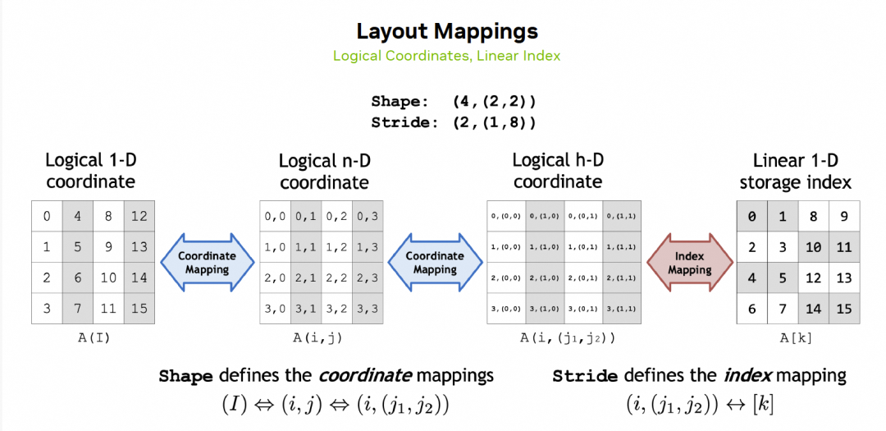

## 2. Coalesce

### 2.1 Coalesce operation overview

1장에서 설명했듯이, 어떤 Layout이든 자기 자신의 Mode로 decompose할 수 있으며, 다음과 같다:

$$
[0,M) \cong [0,M_0) \times [0,M_1) \times ... \times [0,M_{\alpha})
$$

Layout 위의 function $f_L:\mathbb{N} \rightarrow \mathbb{N}$, 즉 $(M_0,M_1,...,M_{\alpha}) \rightarrow M$을 정의한다. coalesce operation을 통해 high-dimensional matrix에서 memory addressing 시간을 절약하고 low-dimensional coordinate mapping으로 바꿀 수 있다.

예를 들어 high-dimensional matrix에 대한 coalesce example은 다음과 같다.

```c++
template<class T>
void print_coalesce(T layout) {
    printf("H-Layout  :");
    print(layout);
    printf("\nCoalesce-Layout :");
    print(coalesce(layout));
    printf("\n");
}

int main()
{
    Layout a0 = make_layout(Shape<_2,_4>{},Stride<_1,_2>{});
    print_coalesce(a0);

    auto s1 = Shape<_2,Shape<_3,_4>>();
    auto s2 = Shape<_5,Shape<_6,_7>>();
    auto s3 = make_shape(s1,s2);

    Layout a_col = make_layout(s3, GenColMajor{});  //GenColMajor == LayoutLeft
    print_coalesce(a_col);

    Layout a_row = make_layout(s3, GenRowMajor{});  //GenRowMajor == LayoutRight
    print_coalesce(a_row);
}

//output
H-Layout  :(_2,_4):(_1,_2)
Coalesce-Layout :_8:_1

H-Layout  :((_2,(_3,_4)),(_5,(_6,_7))):((_1,(_2,_6)),(_24,(_120,_720)))
Coalesce-Layout :_5040:_1

H-Layout  :((_2,(_3,_4)),(_5,(_6,_7))):((_2520,(_840,_210)),(_42,(_7,_1)))
Coalesce-Layout :(_2,_3,_4,_5,_6,_7):(_2520,_840,_210,_42,_7,_1)
```

coalesce 전에는 `(_2,_4)` 2D coordinate 또는 `((_2,(_3,_4)),(_5,(_6,_7)))` high-dimensional coordinate로 addressing해야 한다. coalesce 후에는 single dimension으로 iteration할 수 있다. 하지만 모든 Layout이 single dimension으로 coalesce될 수 있는 것은 아니다. 예를 들어 a\_row가 그렇다.

### 2.2 Coalesce의 algebraic rule

하지만 모든 operation이 1D space로 coalesce될 수 있는 것은 아니다. 실제 Stride와 관련되어 있으며, 어떤 Stride case에서는 repeated address access가 발생하므로 coalesce할 수 없다. 여기서는 두 Layout `s0:d0`와 `s1:d1`의 coalesce rule만 고려하고, coalesce operator를 `s0:d0 ++ s1:d1`로 표기한다.

1. Shape이 `_1`인 어떤 coalesce에 대해서도 `s0:d0 ++ _1:d1 => s0:d0`와 `_1:d0 ++ s1:d1 => s1:d1`를 만족한다.
2. 두 번째 Layout의 Stride `d1`이 첫 번째 Layout의 Shape과 Stride의 product `d1 = s0 * d0`이면 다음 form으로 coalesce할 수 있다: `s0:d0 ++ s1:d1 = s0:d0 ++ s1:s0*d0 => s0*s1:d0`.
3. 다른 Layout coalesce는 구분해서 처리해야 한다: `s0:d0 ++ s1:d1 => (s0,s1):(d0,d1)`.

generalized column-major(GenColMajor, LayoutLeft라고도 함)가 CuTe Layout의 default Layout form이라는 점에 주목하자.

$(M_i)^{\alpha-1}_0 =(M_0,M_1,...M_{\alpha})$라고 쓰고, $M_{-1} =1$이라고 하자.
그 Layout Stride는 $(\prod_{j=0}^{i-1} M_i)^{\alpha-1}_0$이며 rule 2를 만족한다. 따라서 위 예의 a\_col Layout처럼 recursively single dimension으로 coalesce할 수 있다.

### 2.3 Mode별 Coalesce

어떤 때는 일부 dimension만 aggregate하고 다른 Layout dimension은 그대로 유지해야 한다. 예를 들어 `((_2,(_3,_4)),(_5,(_6,_7)))`에서 `(_2,(_3,_4))`만 aggregate하고 싶다면 step iterator를 사용할 수 있다. 예는 다음과 같다.

```c++
    auto s1 = Shape<_2,Shape<_3,_4>>();
    auto s2 = Shape<_5,Shape<_6,_7>>();
    auto s3 = make_shape(s1,s2);

    Layout a_col = make_layout(s3, GenColMajor{});
    auto result = coalesce(a_col, Step<_1,_1>{});   //(_24,_210):(_1,_24)
    // layout<0>(a_col)와 layout<1>(a_col)을 각각 aggregate한 뒤 coalesce하는 것과 동일하다
    auto same_r = make_layout(coalesce(layout<0>(a_col)),
                          coalesce(layout<1>(a_col)));
    // 마찬가지로 다른 Step aggregation도 구성할 수 있다
    auto b1 = coalesce(a_col,Step<_1,Step<_1,_1>>{}); //(_24,(_5,_42)):(_1,(_24,_120))
```

## 3. Composition

이제 Layout A와 Layout B의 composition operation을 논의한다. 예를 들어 한 block의 input data를 Thread Layout 기반으로 variable에 assign해야 한다면, 아래와 같은 composition을 구성한 뒤 Thread-Id index로 해당 data를 얻을 수 있다. 아래 그림과 같다:

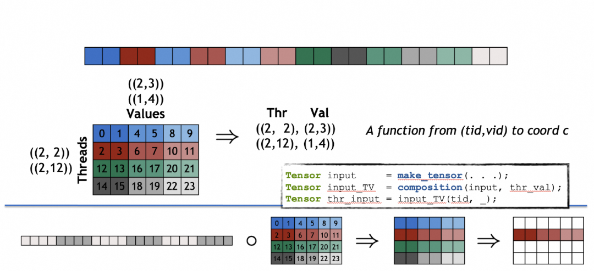

본질적으로 **composition은 Layout A 안에서 Layout B의 rule에 따라 일부 coordinate를 선택해 새로운 Layout을 구성하는 것**이다. A와 B의 composition $A \circ B$는 본질적으로 관련 Layout function $f_{A \circ B}=f_A \circ f_B$가 만족해야 하는 condition을 정의한다. 즉 coordinate c에 대해

$$
f_{A\circ B}(c)= f_A(F_B(c))=F_{B'}(c)
$$

여기서 B'는 B와 compatible한 Shape이다. 단순화를 위해 shape 안에 `_1`이 없는 경우를 고려한다.

### 3.1 composable condition

#### 3.1.1 Left divisible

$M,d >0$를 positive integer라 하고, $M$에 대해 decomposition $M=M_0 \cdot M_1 \cdot ...\cdot M_{\alpha}$가 주어졌다고 하자. $M_{\alpha}$를 $\infty$ dimension으로 확장하고, $\infty$는 임의의 positive integer로 divisible하다고 본다. 다음을 둔다.

$\widehat{M}=M_0 \cdot M_1 \cdot ...\cdot M_{\alpha} \cdot \infty$

$0 \leq i \leq \alpha$가 존재하여 다음을 만족한다면

- (1) $M_0...M_{i-1} | d$
- (2) (1)이 성립할 때 $c = d / M_0...M_{i-1}$라고 둔다. $i \lt \alpha$이면 추가로 $1 \leq c \leq M_i$를 요구한다.
- (3) (2)에 대해 $i \lt\alpha$이면 추가로 $c | M_i$를 요구한다.

그러면 $M$이 $d$로 `left divisible`하다고 부른다. 위 (1)(2) condition은 만족하지만 (3)은 만족할 필요가 없으면, $M$이 $d$로 `weakly left divisible`하다고 부른다.

주의할 점은 i가 존재한다면 반드시 unique하다는 것이다. $\widehat{M} = d \cdot \widehat{M'}$라고 쓰고, i를 division-index라고 부른다.

left divisible에 대해 $\widehat{M'}$에 다음 induced decomposition을 부여한다:

- (a) $0 \leq i \leq \alpha$일 때, $\widehat{M}=M'_0 \cdot M'_1 \cdot ...\cdot M'_{\alpha-i-1} \cdot \infty$이며 $M'_0 = M_i /c > 1$를 만족하고, $0 \lt j \lt \alpha-i$에 대해 $M'_j = M_{i+j}$를 만족한다.
- (b) $i=\alpha$이면 $\widehat{M}= d\cdot\infty$라고 두고, $\widehat{M'}= \infty$라고 한다.

#### 3.1.2 composable condition

먼저 composition할 때 두 번째 matrix B가 1D뿐인 case를 고려한다.

`Definition 3.1` Layout A의 Shape을 $S=(M_0,M_1,...,M_{\alpha})$, Layout $B=(N):(r)$라고 하자. 다음 condition을 만족하면 {S,B}는 composable하다:

- (1) M은 r로 left divisible하고, $\widehat{M} = r \cdot \widehat{M'}$라고 쓴다.
- (2) 그 induced decomposition $\widehat{M'}$는 $N$으로 weakly left divisible하다.

$A \circ B$가 composable하려면 `A의 mode를 따라 B로 나누는` 것이 필요하다. composability에 대한 더 정확한 definition은 다음과 같다:

`Definition 3.2`: Layout A의 Shape을 $S=(M_0,M_1,...,M_{\alpha})$, Stride를 arbitrary tuple $D=(d_0,d_1,...d_{\alpha})$라고 하자. Layout $B=(N):(r)$의 Length=1이다. $M=M_0 \cdot M_1 \cdot ...\cdot M_{\alpha}$, $\widehat{M} = r \cdot \widehat{M'}$, divide index $0 \leq i \leq \alpha$라고 둔다.

$0 \leq i \lt \alpha$일 때,

$$
r=M_0 \cdot M_1 \cdot ...\cdot M_{i-1}\cdot c,\quad \widehat{M'}=M_i/c \cdot ...\cdot \infty
$$

$N \leq M_i/c$이면 $A\circ B =(N):(cd_i)$이다. 그렇지 않으면 $N=M_i/c \cdot...\cdot M_{j-1} \cdot c' , where \quad c' < M_j \quad if\quad  j\neq \alpha)$라고 두고, 다음과 같이 둔다.

$$
A\circ B \left\{
\begin{aligned}
(M_i/c,M_{i+1},...,M_{j-1},c'):(cd_i,d_{i+1},...,d_{j-1},d_j) && if \quad c' >1 \\
(M_i/c,M_{i+1},...,M_{j-1}):(cd_i,d_{i+1},...,d_{j-1}) && if \quad c' = 1 \\
\end{aligned}
\right.
$$

$i=\alpha$이면 $r=M_0 \cdot M_1 \cdot ...\cdot M_{\alpha}\cdot c$이지만 $\widehat{M'}=\infty$이므로, $A\circ B =(N):(cd_{\alpha})$이다.

최종 composition matrix가 $size(A\circ B) = size(B)$임을 알 수 있다. `Definition 3.2`가 만족될 때 $f_{A\circ B} = \widehat{f_A} \circ f_B$이다.

Layout $B=(N):(r)$, 즉 length=1인 case에 대해 Cutlass에는 더 직관적인 설명이 있다. A의 Shape 안에서 `r`을 stride로 삼아 앞의 `N`개 element를 취한다는 것이다. 즉 A의 앞쪽 몇 개 Shape dimension의 product가 `r`을 divide할 수 있어야 하고, 뒤쪽 dimension을 앞으로 누적한 값도 `r`로 divide될 수 있어야 한다. 또한 stride `rN` 뒤에도 유사한 divisibility mechanism을 보장해야 한다. 즉 A의 Shape $S=(M_0,M_1,...,M_{\alpha})$에 대해 $\pi_j = \prod\limits_{i=0}^j M_i$라고 쓰면

$$
\exists 1 \leq i \leq \alpha,\quad \pi_{i-1} | r \quad and \quad r | \pi_i
$$

그리고 앞의 `N`개 element를 취하고 stride가 `r`인 것에 대해서도 다음이 성립해야 한다.

$$
\exists 1 \leq i \leq j \leq \alpha, \quad \pi_{j-1} | rN \quad and \quad rN | \pi_j
$$

B의 Stride r과 A의 Shape $S=(M_0,M_1,...,M_{\alpha})$가 condition을 만족하는지는 Cutlass에서 `shape_div`로 계산한다. 즉 왼쪽에서 오른쪽으로 A의 Shape의 N개 dimension을 점진적으로 StrideB로 나눈다. Shape B의 condition은 `shape_mod`로 계산한다(주: official docs의 shape\_mod 계산에는 일정한 문제가 있으며, 뒤에서 자세히 설명한다).

또 다른 문제는 dynamic type의 Layout Composition에 대해 Cutlass가 performance를 고려해 composability check를 수행하지 않는다는 점이다. 따라서 composable하지 않은 Layout이 잘못된 output을 만들어도 calculation error가 발생할 수 있다. 실제 test에서는 다음과 같이 static definition을 사용하고 compile해 compile time에 check할 수 있다.

```c++
    auto s2 = make_shape(Int<2>{}, Int<6>{}, Int<10>{},Int<14>{});
    auto a2 = make_layout(s2, GenRowMajor{});
    auto b2 = make_layout(make_shape(Int<60>{}), make_stride(Int<4>{}));
    auto c2 = composition(a2, b2);
    print(c2);
```

$r=4$라고 보면 $M_0 =2 | r$, $P_1 = M_0\times M_1= 2\times 6 =12$, $r=4 | \pi_1=12$이다. $rN=4 \times 60=240$에 대해서는 $\pi_2=M_0\times M_1\times M_2 = 120$, $\pi_3= M_0\times M_1\times M_2\times M_3 = 120\times (2\times 7)=240\times 7$이므로 $rN$도 condition을 만족한다. output Layout은 ((\_3,\_10,\_2)):((\_280,\_14,\_1))이다.

예를 들어 B의 SHAPE을 70으로 수정하면, $rN | \pi_3$이지만 $\pi_2 \nmid  rN$이므로 composition은 compile time check에서 실패한다.

```c++
      static_assert(IntTupleA::value % IntTupleB::value == 0 || IntTupleB::value % IntTupleA::value == 0, "Static shape_div failure");
      ^
          detected during:
            instantiation of "auto cute::shape_div(const IntTupleA &, const IntTupleB &) [with IntTupleA=cute::C<70>, IntTupleB=cute::C<3>]" at line 1034 of /opt/cutlass/include/cute/layout.hpp
            instantiation of function "lambda [](const auto &, const auto &)->auto [with <auto-1>=cute::tuple<cute::tuple<cute::C<1>>, cute::C<70>>, <auto-2>=cute::C<3>]" at line 422 of /opt/cutlass/include/cute/algorithm/tuple_algorithms.hpp
            instantiation of "decltype(auto) cute::detail::fold(T &&, V &&, F &&, cute::seq<I, Is...>) [with T=const cute::tuple<cute::_1, cute::C<3>, cute::C<10>> &, V=cute::tuple<cute::tuple<cute::C<1>>, cute::C<70>>, F=lambda [](const auto &, const auto &)->auto &, I=1, Is=<2>]" at line 424 of /opt/cutlass/include/cute/algorithm/tuple_algorithms.hpp
            instantiation of "decltype(auto) cute::detail::fold(T &&, V &&, F &&, cute::seq<I, Is...>) [with T=const cute::tuple<cute::_1, cute::C<3>, cute::C<10>> &, V=cute::tuple<cute::tuple<>, cute::C<70>>, F=lambda [](const auto &, const auto &)->auto &, I=0, Is=<1, 2>]" at line 441 of /opt/cutlass/include/cute/algorithm/tuple_algorithms.hpp
            instantiation of "auto cute::fold(T &&, V &&, F &&) [with T=const cute::tuple<cute::_1, cute::C<3>, cute::C<10>> &, V=cute::tuple<cute::tuple<>, cute::C<70>>, F=lambda [](const auto &, const auto &)->auto]" at line 1035 of /opt/cutlass/include/cute/layout.hpp
            instantiation of "auto cute::detail::composition_impl(const LShape &, const LStride &, const RShape &, const RStride &) [with LShape=cute::tuple<cute::C<2>, cute::C<6>, cute::C<10>, cute::C<14>>, LStride=cute::tuple<cute::C<840>, cute::C<140>, cute::C<14>, cute::_1>, RShape=cute::C<70>, RStride=cute::C<4>]" at line 987 of /opt/cutlass/include/cute/layout.hpp
```

하지만 Cutlass의 check 방식은 더 strict하다는 점에 주목한다. 예를 들어 reference 1에서 설명한 것처럼, 다음 Composition은 Definition 3.1 condition을 만족하고 C=(2,3):(9,5)이지만 Cutlass check는 실패한다.

```c++
    auto s2 = make_shape(Int<4>{}, Int<6>{}, Int<8>{},Int<10>{});
    auto a2 = make_layout(s2, make_stride(Int<2>{}, Int<3>{}, Int<5>{},Int<7>{}));
    auto b2 = make_layout(make_shape(Int<6>{}), make_stride(Int<12>{}));
    auto c2 = composition(a2, b2);
    print(c2);
```

이제 B의 Layout이 여러 tuple인 case로 확장한다. multidimensional coordinate와 해당 Stride로 구성되는 inner product를 index로 삼는 경우, 즉 다음과 같다.

$$
A=S_A=(M_0,M_1,...,M_{\alpha}):D_A(d_0,d_1,...r_{\alpha})
$$

$$
B=S_B=(N_0,N_1,...,N_{\beta}):D_B(r_0,r_1,...r_{\beta})
$$

coordinate $C=(C_0,C_1,...,C_{\beta})$에 대해,

$$
f_{A\circ B}(C) =  f_A(f_B(C)) = f_A(\sum\limits_{i=0}^{\beta} r_iC_i)
$$

그러면 $f_A$가 left distributive law를 만족한다면, $f_{A\circ B}(C) = f_A(\sum\limits_{i=0}^{\beta} r_iC_i) = \sum\limits_{i=0}^{\beta}f_A(r_iC_i)$이므로 B가 1D인 case로 reduce할 수 있다. 즉

$$
A \circ B = A \circ (B_0,B_1,...,B_{\beta}) := (A \circ B_0,A \circ B_1,...,A \circ B_{\beta})
$$

아래에서는 left distributive law를 만족하는 sufficient condition을 분석한다.

1. 각 $B_k, 0 \leq k \leq \beta$에 대해 ${S_A,B_k}$가 모두 composable condition을 만족해야 한다.
2. B는 몇 가지 additional condition을 만족해야 한다. 아래에서 자세히 분석한다.

$f_{B_k}:[0,{N'}_k ) \rightarrow \mathbb{N}$의 image의 convex closure는 $[0,r_k({N'}_k-1)]$이며, 0 point를 제외한 case에서 A 안의 intersection은 다음과 같다.

$$
J_k = [1,r_k({N'}_k-1)]  \cap [1,M'), \quad M'=M_0...M_{\alpha-1}
$$

composition function을 보장하려면 $f_B$가 injective임을 보장할 뿐 아니라 $J_k,(0 \leq k \leq \beta)$가 disjoint임도 보장해야 한다. function composition은 category theory의 commutative diagram으로 표현된다.

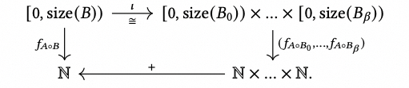

하지만 composition case를 고려하면, 아래쪽 $\widehat(f_A)$는 보통 non-commutative임에 주목한다.

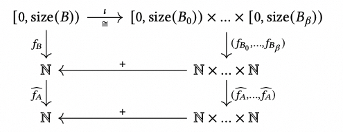

다음 factorization에 대해

$$
\widehat{f_A} : \mathbb{N}\stackrel{\cong}\rightarrow [0,M_0) \times [0,M_1) \times ... \times [0,M_{\alpha-1}) \times \mathbb{N}  \stackrel{(d_0,...,d_{\alpha})}{\longrightarrow} \mathbb{N} \times ... \times \mathbb{N} \stackrel{+}\rightarrow \mathbb{N}
$$

$f_{B_k} , 0\leq k \leq \beta$의 image $im(f_{B_0}),...,im(f_{B_\beta})$가 $[0,M_0) \times [0,M_1) \times ... \times [0,M_{\alpha-1})-\{0\}$ partition 아래에서 disjoint임을 보장해야 한다.

additivity에 대해, disjoint한 두 $B_k,B_l$의 non-zero point $x \in im(f_{B_k})$, $y \in im(f_{B_l})$에 대해,
그 coordinate가 $\widehat{f_A}$ partition 아래에서 $(x_i,y_i) \in [0,M_i) , 0\leq i \lt \alpha$이면, addition이 boundary를 넘지 않도록 $x_i +y_i \lt M_i$를 보장해야 한다.

**주: 기존 CuTe의 left distributive law check가 B의 injectivity만 요구하는 것은 문제가 있다.**

#### 3.1.3 composition example

예를 들어 composition Layout으로 Reshape `20:2 o (5,4):(4,1)`을 구성한다고 하자. Layout `20:2`는 vector `[0,2,4,...,38]`에 대응하며, 이를 `(5,4)` matrix로 Reshape하려는 것이다. 먼저 left distributive law에 따라 `(20:2 o 5:4, 20:2 o 4:1)`로 변환한다. `20:2 o 5:4 => 5:2*4 => 5:8`이고, `20:2 o 4:1 => 4:2`이다. 따라서 `(20:2 o 5:4, 20:2 o 4:1) => (5:8,4:2)`이고 Concate tuple rule에 따라 `(5:8,4:2)=>(5,4):(8,2)`가 된다.
code test는 다음과 같다:

```
    auto sa = make_shape(Int<20>{});
    auto a = make_layout(sa, Stride<_2>{});

    auto sb = make_shape(Int<5>{}, Int<4>{});
    auto b = make_layout(sb, make_stride(Int<4>{}, Int<1>{}));
    Tensor tb =make_tensor(A, b);
    print_tensor(tb);

    auto c = composition(a, b);
    Tensor tc =make_tensor(A, c);
    print_tensor(tc);

//output
ptr[32b](0x563fa0d065d0) o (_5,_4):(_4,_1):
    0    1    2    3
    4    5    6    7
    8    9   10   11
   12   13   14   15
   16   17   18   19
ptr[32b](0x563fa0d065d0) o (_5,_4):(_8,_2):
    0    2    4    6
    8   10   12   14
   16   18   20   22
   24   26   28   30
   32   34   36   38
```

#### 3.1.4 Mode별 composition

CuTe는 Layout의 특정 Mode를 취해 composition operation을 수행하는 것을 지원한다. 예를 들어 matrix 안의 일부 dimension data만 reshape해야 하는 경우, MultiHeadAttention에서 Head 기준 split하는 경우 등이 있다.

Cutlass에서는 여러 Layout을 조합해 구성한 tuple을 Tile이라고 부르며, `make_tile` function으로 구성하고 <Layout1,Layout2...,LayoutN>으로 표기한다. 이것과 Concate의 차이에 유의해야 한다. composition의 parameter B가 Tiler이면 다음과 같이 mode를 취하는 방식으로 composition한다. 이는 각 Mode가 Tiler 안의 해당 Layout과 composition되는 것과 동일하다.

```c++
// (12,(4,8)):(59,(13,1))
auto a = make_layout(make_shape (12,make_shape ( 4,8)),
                     make_stride(59,make_stride(13,1)));
// <3:4, 8:2>
auto tiler = make_tile(Layout<_3,_4>{},  // Apply 3:4 to mode-0
                       Layout<_8,_2>{}); // Apply 8:2 to mode-1

// (_3,(2,4)):(236,(26,1))
auto result = composition(a, tiler);
// Identical to
auto same_r = make_layout(composition(layout<0>(a), get<0>(tiler)),
                          composition(layout<1>(a), get<1>(tiler)));
```

또한 Cute는 Shape tuple을 Tiler로 해석할 수도 있으며, 기본적으로 Stride를 1로 assign한다. 예는 다음과 같다:

```c++
// (12,(4,8)):(59,(13,1))
auto a = make_layout(make_shape (12,make_shape ( 4,8)),
                     make_stride(59,make_stride(13,1)));
// (8, 3)
auto tiler = make_shape(Int<3>{}, Int<8>{});
// Equivalent to <3:1, 8:1>
// auto tiler = make_tile(Layout<_3,_1>{},  // Apply 3:1 to mode-0
//                        Layout<_8,_1>{}); // Apply 8:1 to mode-1

// (_3,(4,2)):(59,(13,1))
auto result = composition(a, tiler);
```

#### 3.1.5 composition summary

composition operation의 역할은 매우 크다. Composition function의 parameter B는 Layout일 수도 있고, 여러 Layout으로 구성된 Tile이나 여러 Shape으로 구성된 Tile의 by-Mode operation일 수도 있다. matrix block 분할(MxNxK -> 3x5x8 sub block), 또는 8x16 matrix를 1-D vector로 flatten한 뒤 32x4 block으로 rearrange하는 operation도 모두 composition으로 표현할 수 있다. 곧 해당 example을 보게 된다.

### 4. Complementation

composition은 Layout A 안에서 Layout B의 rule에 따라 일부 coordinate를 `select`해 새로운 Layout을 구성한다. 그러면 `선택되지 않은 coordinate`에 대해서는 어떤 representation이 필요하다. 예를 들면 아래 그림과 같다:

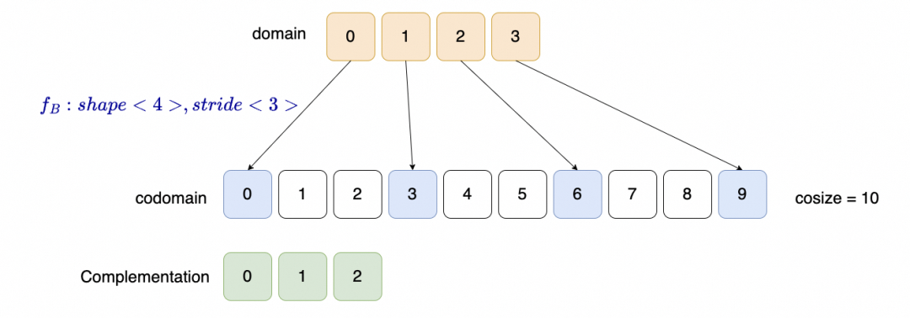

Layout을 coordinate의 function으로 보면, original coordinate는 domain이고 해당 image는 codomain이다.

cosize는 codomain이 차지하는 physical memory space로 볼 수 있으며, 다음과 같이 정의된다.

$$
cosize(A)=f_A(size(A)-1)+1
$$

예를 들어 `(_5,_4):(_4,_2)`의 size는 5x4=20이고, $cosize =f_A(20-1)+1 =22+1= 23$이다.

```
    0    2    4    6
    4    6    8   10
    8   10   12   14
   12   14   16   18
   16   18   20   22
```

### 4.1 complement definition

Cutelass 문서에서는 Layout $A$의 Shape $M$에 대한 complement $R$을 다음과 같이 정의한다:

- (1) $A$와 $R$의 codomain은 disjoint하다. $\forall x \neq 0 , x \in domain(f_A), f_A(x) \neq f_R(x)$에 대해 성립한다.
- (2) $R$은 ordered다. 즉 R의 Stride가 positive이고 increasing이며, $f_R$이 strictly increasing function이 되게 한다.
- (3) $R$은 M 아래에서 bounded다. 즉 R의 size와 cosize는 size(M)의 제한을 받는다. $size(R) \geq M / size(A)$, $cosize(R) \leq \lfloor\frac{M}{cosize(A)} \rfloor$

**complement 가능 condition**:

$f_R$이 strictly increasing하도록, $A$를 permutation reindex할 수 있다. 이때 $A=(N_0,...N_{\alpha}):(d_0,...d_{\alpha})$에서 Stride는 increasing $(d_0 \leq d_1 \leq ...\leq d_{\alpha})$이고, $\forall i < j ,\quad if \quad  d_i =d_j, N_i \leq N_j$이다. positive integer $M$이 다음 condition을 만족하면 $\{A,M\}$은 complementable하다.

- (1) $N_{i-1}d_{i-1} \quad |\quad d_i ,\quad(\forall i, 0\leq i \leq \alpha)$
- (2) $N_{\alpha}d_{\alpha} \quad |\quad M$

$\{A,M\}$이 complementable하면 complement는 다음과 같다.

$$
R = complement(A,M) =(d_0, \frac{d_1}{N_0d_0} , \frac{d_2}{N_1d_1} ,...,\frac{M} {N_{\alpha}d_{\alpha}}) :(1,N_0d_0,N_1d_1,...,N_{\alpha}d_{\alpha})
$$

### 4.2 complement example

예를 들어 official example complement((2,2):(1,6), 24)에서 $N_0=2, N_1=N_{\alpha}=2,d_0=1 , d_1=d_{\alpha}=6, M=24$를 대입하면 다음을 얻는다.

$$
R= (1,\frac{6}{2*1},\frac{24}{2*6}):(1,2*1,2*6)= (3,2):(2,12)
$$

```
#define MAXN  128*128

int main()
{
    // initial memory with physical layout
    int* A = (int*)malloc(MAXN * sizeof(int));
    for(int i =0 ; i < MAXN ; i++){
     A[i]=int(i);
    }

    auto sa = make_shape(Int<2>{},Int<2>{});
    auto a = make_layout(sa, Stride<_1,_6>{});
    Tensor ta =make_tensor(A, a);
    print_tensor(ta);

    auto c = complement(a, 24);
    Tensor tc =make_tensor(A, c);
    print_tensor(tc);

}
\\output
ptr[32b](0x562d2ed985d0) o (_2,_2):(_1,_6):
    0    6
    1    7
ptr[32b](0x562d2ed985d0) o (_3,2):(_2,_12):
    0   12
    2   14
    4   16
```

visualization은 아래 그림과 같다:

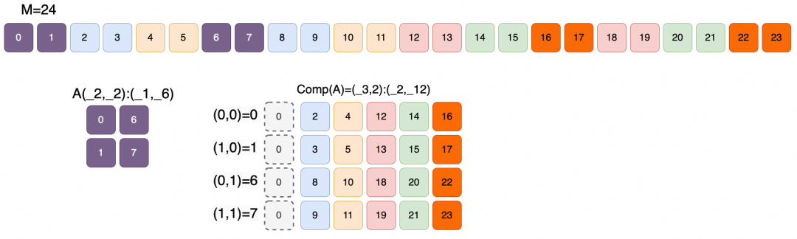

사실 여기에는 이미 Layout division의 흔적이 있다. division은 가장 자주 사용되는 matrix tiling algorithm이지만, GTC의 PPT는 이 내용을 정말 명확하게 설명하지 못했다.

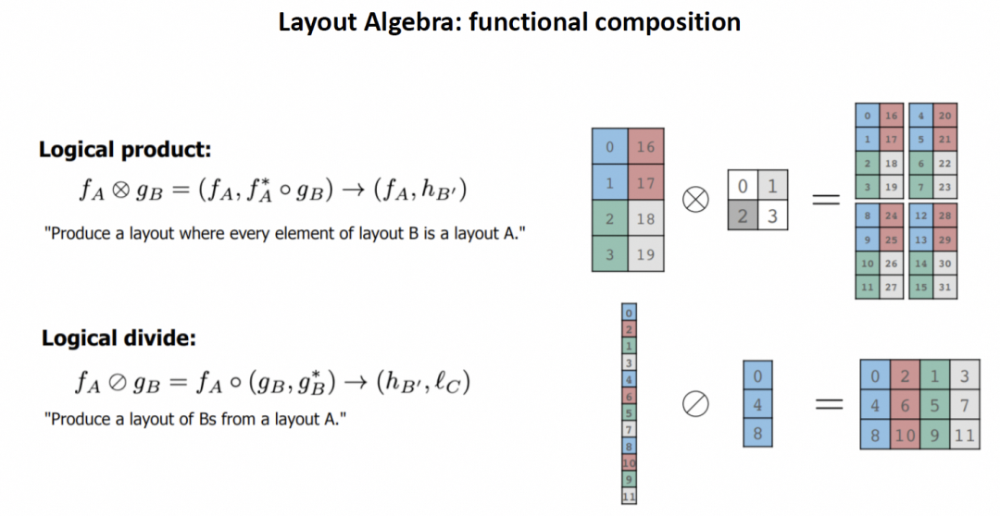

뒤에서 자세히 설명한다.

## 5. Division

하나의 Layout이 다른 Layout에 의해 partition되도록 Layout division을 정의할 수 있다. 이러한 function은 Tiling 또는 Layout partition의 basis로 사용할 수 있다.

### 5.1 division definition

Layout $A=S:D$에 대해 $M=size(A)$라고 하자. B는 다른 Layout이다. $\{B,M\}$이 complementable(Complementation)하고 $\{S,B\}$가 composable(Composition)하다고 가정하면, logical division(Logical Divide)을 다음과 같이 정의한다.

$$
A \oslash B := A \circ (B,complement(B,M))
$$

logical division의 구체적인 code implementation은 실제로 composition function이다.

```c++
template <class LShape, class LStride,
          class TShape, class TStride>
auto logical_divide(Layout<LShape,LStride> const& layout,
                    Layout<TShape,TStride> const& tiler)
{
  return composition(layout, make_layout(tiler, complement(tiler, size(layout))));
}
```

이는 두 mode를 구성한다. $A \oslash B :=  (A \circ B , A \circ B^*), \quad B^*=complement(B,M)$이며, 본질적으로 B가 A를 두 mode로 partition한다.

- 첫 번째 mode $A \circ B$는 B가 가리키는 모든 element다.
- 두 번째 mode $A \circ B^*$는 B가 가리키지 않는 모든 element다.

$B$가 Tiler라면 $B^*$는 Tile의 Layout이라고 이해할 수 있다.

### 5.2 1-D logical division

Layout A = (4,2,3):(2,1,8), Tiler B=4:2를 고려한다. 즉 A 내부에서 Stride 2에 따라 4개 element를 취한다.

$$
A \circ B = ((_2,_2)):((_4,_1))
$$

$$
B^* = complement(B,size(A)) = comp(B,24) = (_2,_3):(_1,_8)
$$

$$
A \circ B^* =(_2,_3):(_2,_8)
$$

$$
A \oslash B = ((_2,_2),(_2,_3)):((_4,_1),(_2,_8))
$$

아래 그림과 같다:

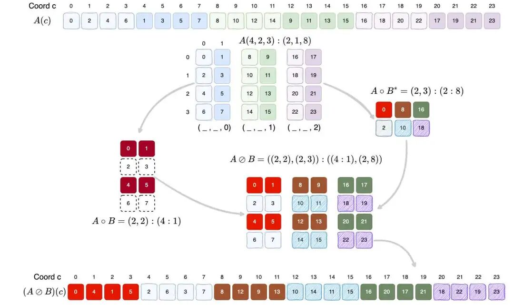

관련 test code는 다음과 같다:

```c++
#include <getopt.h>
#include <cuda.h>
#include <stdlib.h>
#include <cute/tensor.hpp>
using namespace cute;
#define MAXN  128*128

int main()
{
    // initial memory with physical layout
    int* A = (int*)malloc(MAXN * sizeof(int));
    for(int i =0 ; i < MAXN ; i++){
     A[i]=int(i);
    }

    //layout-a
    auto sa = make_shape(Int<4>{},Int<2>{},Int<3>{});
    auto da = make_stride(Int<2>{},Int<1>{},Int<8>{});
    auto a = make_layout(sa, da);
    Tensor ta =make_tensor(A, a);
    printf("\nLayout A: ");
    print_tensor(ta);

    //layout-a
    auto sb = make_shape(Int<4>{});
    auto db = make_stride(Int<2>{});
    auto b = make_layout(sb, db);
    Tensor tb =make_tensor(A, b);
    printf("\nLayout B: ");
    print_tensor(tb);

    auto b_star = complement(b, size(a));
    Tensor tb_star =make_tensor(A, b_star);
    printf("\nLayout B*: ");
    print_tensor(tb_star);

    auto c1 = composition(a,b);
    Tensor tc1 =make_tensor(A, c1);
    auto c2 = composition(a,b_star);
    Tensor tc2 =make_tensor(A, c2);
    printf("\nLayout A o B: ");
    print_tensor(tc1);
    printf("\nLayout A o B*: ");
    print_tensor(tc2);

    auto d = logical_divide(a,b);
    Tensor td =make_tensor(A, d);
     printf("\nLayout A div B: ");
    print_tensor(td);
}
```

### 5.3 2-D logical division

앞 절의 Tiler definition을 통해 이를 high-dimensional space로 일반화할 수 있다. composition과 유사한 방식으로 logical\_divide를 서로 다른 dimension에 적용할 수 있다. 예를 들어 2D Layout `A = (9,(4,8)):(59,(13,1))`가 있고, column(Mode-0)의 Shape 9를 `3:3` 방식으로 split하고, row(mode-1)는 `(2,4):(1,8)` matrix로 split한다고 하자. 이를 `B = <3:3, (2,4):(1,8)>`라고 쓰며, by-mode에는 make\_tile function으로 구성해야 한다. code는 다음과 같다:

```c++
#include <getopt.h>
#include <cuda.h>
#include <stdlib.h>
#include <cute/tensor.hpp>

using namespace cute;

#define MAXN 128 * 128

int main()
{
    // initial memory with physical layout
    int *A = (int *)malloc(MAXN * sizeof(int));
    for (int i = 0; i < MAXN; i++)
    {
        A[i] = int(i);
    }

    // A: shape is (9,32)
    auto layout_a = make_layout(make_shape(Int<9>{}, make_shape(Int<4>{}, Int<8>{})),
                                make_stride(Int<59>{}, make_stride(Int<13>{}, Int<1>{})));
    Tensor ta = make_tensor(A, layout_a);
    printf("\nLayout Tensor A: ");
    print_tensor(ta);

    // B-Tile < 3:3, (2,4):(1:8) >
    auto tiler = make_tile(Layout<_3, _3>{},     // Apply     3:3     to mode-0
                           Layout<Shape<_2, _4>, // Apply (2,4):(1,8) to mode-1
                                  Stride<_1, _8>>{});

    // ((TileM,RestM), (TileN,RestN)) with shape ((3,3), (8,4))
    auto ld = logical_divide(layout_a, tiler);

    Tensor tld = make_tensor(A, ld);
    printf("\nLayout Tensor Logical Divide: ");
    print_tensor(tld);
}
```

아래 그림은 A를 2D layout으로 나타내며, B가 가리키는 element를 gray로 highlight했다. B가 설명하는 Tile< 3:3 , (2:4):(1:8)>은 column direction에서 3개마다 data를 취하고 3개를 가져온다는 뜻이다. row direction에서는 연속으로 2개를 취한 뒤 8개 step을 건너 다시 연속으로 2개를 취한다. A 안에는 이런 block이 12개 있고, 각각의 color로 표시되어 있다.

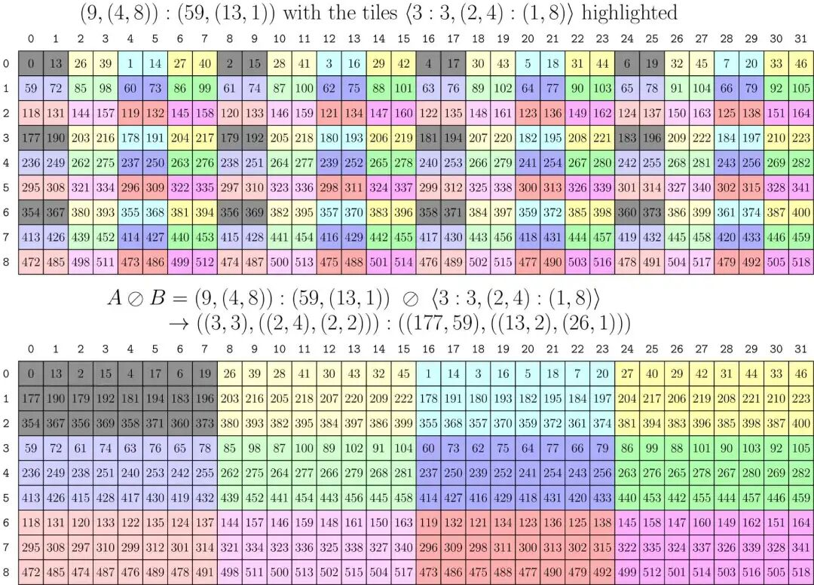

마지막으로 구성된 division result는 $A \oslash B = ((3,3),((2,4),(2,2))):((177,59),((13,2),(26,1)))$이다.

### 5.4 Zipped,Tiled,Flat Divides

위 그림의 아래쪽 절반처럼 같은 color의 block을 꺼내려고 하면, mode로 값을 취하는 방식에는 문제가 생긴다.

```c++
    // ((TileM,RestM), (TileN,RestN)) with shape ((3,3), (8,4))
    auto ld = logical_divide(layout_a, tiler);

    Tensor tld = make_tensor(A, ld);
    print_tensor(tensor<0>(tld));

//output
Layout Tensor Logical Divide(mode-0): (_3,_3):(_177,_59):
    0   59  118
  177  236  295
  354  413  472
```

따라서 division result의 dimension을 어떤 방식으로 sort해 block value를 취하기에 적합하게 만들고 싶다. 예를 들어 A matrix를 threadIdx.x와 threadIdx.y로 addressing해 해당 sub-block을 얻어야 한다.
logical\_divide output result는 항상 다음과 같다.

$$
( (A \circ B_0 , A \circ B_0^*),  (A \circ B_1 , A \circ B_1^*),  (A \circ B_2 , A \circ B_2^*)....
$$

반면 우리가 기대하는 output은 다음과 같다:

$$
( (A \circ B_0 , A \circ B_1 , A \circ B_2, ....), ( A \circ B_0^* , A \circ B_1^* , A \circ B_2^*....)
$$

이렇게 하면 앞의 몇 개 Mode 값을 해당 threadIdx coordinate로 취하기만 해도 관련 matrix를 얻을 수 있다. 따라서 이러한 output dimension sorting requirement를 위해 CuTe는 여러 division을 정의한다.

```c++
Layout Shape : (M, N, L, ...)
Tiler Shape  : <TileM, TileN>

logical_divide : ((TileM,RestM), (TileN,RestN), L, ...)
zipped_divide  : ((TileM,TileN), (RestM,RestN,L,...))
tiled_divide   : ((TileM,TileN), RestM, RestN, L, ...)
flat_divide    : (TileM, TileN, RestM, RestN, L, ...)
```

zipped\_divide를 사용하면 우리의 요구를 만족할 수 있다.

```c++
    // ((TileM,TileN), (RestM,RestN)) with shape ((3,8), (3,4))
    auto zd = zipped_divide(layout_a, tiler);

    Tensor tzd = make_tensor(A, zd);
    print_tensor(tensor<0>(tzd));

//output
Layout Tensor Zipped Divide(mode-0): (_3,(_2,_4)):(_177,(_13,_2)):
    0   13    2   15    4   17    6   19
  177  190  179  192  181  194  183  196
  354  367  356  369  358  371  360  373
```

**주: 사실 여기서는 앞의 permutation mode 관련 내용을 Permutation Layout function으로 정의할 수도 있으며, reference 1에서 자세히 설명한다.**

## 6. Product

이는 Layout과 다른 Layout의 product를 정의한다. 대략적인 생각은 Layout A에 대해 그 complement element를 LayoutB에 따라 배치하는 것이다. 간단히 말하면 Layout A의 Tensor를 여러 번 반복 배치한 뒤, Layout B의 rule에 따라 배치한다.

### 6.1 logical product

logical\_product는 다음과 같이 정의된다. 이는 두 Mode로 구성되며, 첫 번째 Mode는 Layout A이고 두 번째 Mode는 Layout B다. 다만 각 element가 Layout A 안의 `unique replication`으로 대체된다. `unique replication`은 A의 `size(A)*cosize(B)`에 대한 complement처럼 보인다. product를 다음과 같이 쓴다:

$$
A \otimes B := (A, A^* \circ B)
$$

CuTe에서는 다음과 같이 구현된다:

```c++
template <class LShape, class LStride,
          class TShape, class TStride>
auto logical_product(Layout<LShape,LStride> const& layout,
                     Layout<TShape,TStride> const& tiler)
{
  return make_layout(layout, composition(complement(layout, size(layout)*cosize(tiler)), tiler));
}
```

### 6.2 1D logical product

예를 들어 CuTe의 1D example은 다음과 같다.

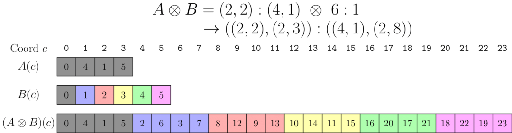

- `A = (2,2):(4,1)`에 대응하는 coordinate mapping은 위 첫 번째 row, 즉 [0,4,1,5]다.
- `B = 6:1`, 즉 [0,1,2,3,4,5]다.
  logical product의 result에 대해 먼저 A를 gray part로 copy하고, 다시 B의 content에 따라 [2,6,3,7] .... 을 채운다.
  이어서 B를 2-D shape B=(4,2):(2:1)로 구성한다.

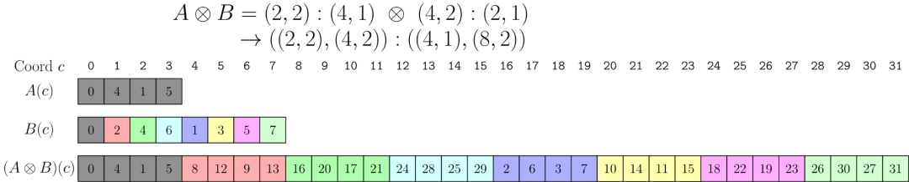

또한 official PPT의 한 example인 A:(4,2):(1,16), B:(2,2):(2:1)에서 size(A)=8, cosize(B)=4이지만, 그림은 이해하기가 꽤 어렵다.

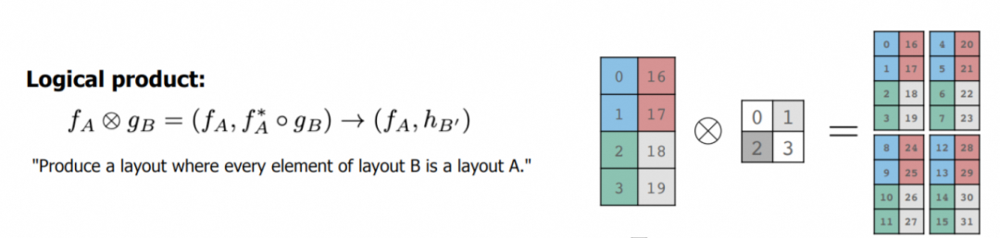

우리는 다음과 같이 계산한다:

$$
A^*:= Complement(A, 32)= 4:4 , \quad  A^* \circ B = (2,2):(8,4)
$$

$$
A \otimes B := (A, A^* \circ B)  = ((4,2),(2,2)):((1,16),(8,4))
$$

test code는 다음과 같다.

```c++
#include <cuda.h>
#include <stdlib.h>
#include <cute/tensor.hpp>

using namespace cute;

#define MAXN 128 * 128

int main()
{
    // initial memory with physical layout
    int *A = (int *)malloc(MAXN * sizeof(int));
    for (int i = 0; i < MAXN; i++)
    {
        A[i] = int(i);
    }

    auto layout_a = make_layout(make_shape(Int<4>{}, Int<2>{}),
                                make_stride(Int<1>{}, Int<16>{}));
    Tensor ta = make_tensor(A, layout_a);
    printf("\nLayout Tensor A: ");
    print_tensor(ta);

    auto layout_b = make_layout(make_shape(Int<2>{}, Int<2>{}),
                                make_stride(Int<2>{}, Int<1>{}));
    Tensor tb = make_tensor(A, layout_b);
    printf("\nLayout Tensor B: ");
    print_tensor(tb);

    Layout a_star = complement(layout_a, size(layout_a) * cosize(layout_b));
    Tensor ta_star = make_tensor(A, a_star);
    printf("\nLayout Tensor A* : ");
    print_tensor(ta_star);

    Layout a_star2 = composition(complement(layout_a, size(layout_a) * cosize(layout_b)), layout_b);
    Tensor ta_star2 = make_tensor(A, a_star2);
    printf("\nLayout Tensor A* o B: ");
    print_tensor(ta_star2);

    auto lp = logical_product(layout_a, layout_b);

    Tensor tlp = make_tensor(A, lp);
    printf("\nLayout Tensor Logical Product: ");
    print_tensor(tlp);
}

//output

Layout Tensor A: (_4,_2):(_1,_16):
    0   16
    1   17
    2   18
    3   19

Layout Tensor B: (_2,_2):(_2,_1):
    0    1
    2    3

Layout Tensor A* : _4:_4:
    0
    4
    8
   12

Layout Tensor A* o B:  (_2,_2):(_8,_4):
    0    4
    8   12

Layout Tensor Logical Product:  ((_4,_2),(_2,_2)):((_1,_16),(_8,_4)):
    0    8    4   12
    1    9    5   13
    2   10    6   14
    3   11    7   15
   16   24   20   28
   17   25   21   29
   18   26   22   30
   19   27   23   31
```

### 6.3 2D logical product

비슷하게 B를 Tiler로 구성할 수 있다. 예를 들어 <3:5,4:6> 두 Layout으로 by-mode logical\_product를 구현할 수 있다.

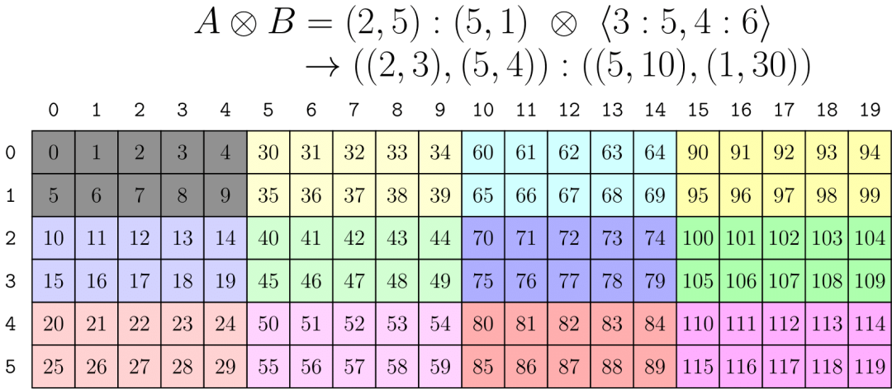

하지만 이런 expression에서 Tiler B는 직관적이지 않으며, A의 Shape과 Stride를 완전히 이해해야 한다. 따라서 우리는 더 직관적인 "Tile Layout A according to Layout B" expression을 기대한다.

본질적으로 $S_A = (xa, ya)$와 $S_B = (xb, yb)$가 product output result의 allocation에서 더 직관적인 description을 가능하게 한다.

| product | result Shape |
| --- | --- |
| logical\_ | ((xa,ya),(xb,yb)) |
| blocked\_ | ((xa,xb),(ya,yb)) |
| raked\_ | ((xb,xa),(yb,ya)) |

#### 6.3.1 Blocked product

예를 들어 Tiler <3:5,4:6>을 구성한다고 하자. 본질적인 의도는 data를 3x4 matrix에 따라 A에 block-wise로 fill하는 것이다. 더 직관적인 B description은 (3:4):(1:3)이다. 이런 block description 기반 product를 blocked\_product라고 부른다.

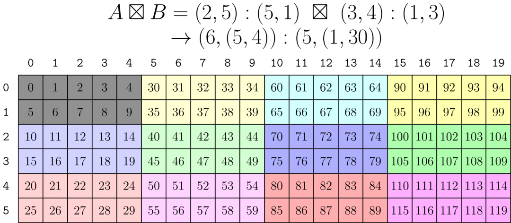

#### 6.3.2 Raked product

output Shape에 대해 각 Mode에서 swap permutation을 수행한다.

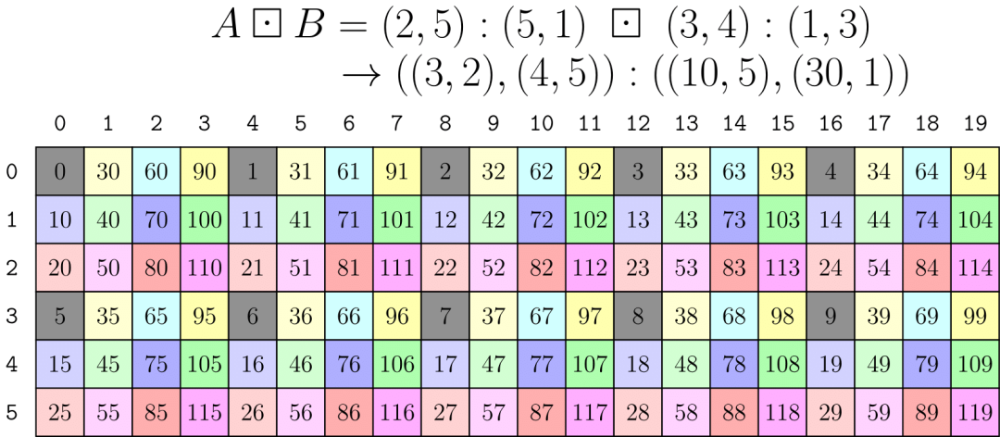

#### 6.3.3 Zipped /Tiled Product

Tile mode-based description에 대해서도 마찬가지로 output result를 rearrange하면 다음과 같다:

```c++
Layout Shape : (M, N, L, ...)
Tiler Shape  : <TileM, TileN>

logical_product : ((M,TileM), (N,TileN), L, ...)
zipped_product  : ((M,N), (TileM,TileN,L,...))
tiled_product   : ((M,N), TileM, TileN, L, ...)
flat_product    : (M, N, TileM, TileN, L, ...)
```

Layout algebra 내용은 대략 여기까지 소개한다. 다음 회차에서는 CuTe tensor 관련 내용을 소개하기 시작하겠다.

참고 자료

[1]

A note on the algebra of CuTe Layouts: https://research.colfax-intl.com/a-note-on-the-algebra-of-cute-layouts/

[2]

CuTe Layout Algebra: https://github.com/NVIDIA/cutlass/blob/main/media/docs/cute/02\_layout\_algebra.md
