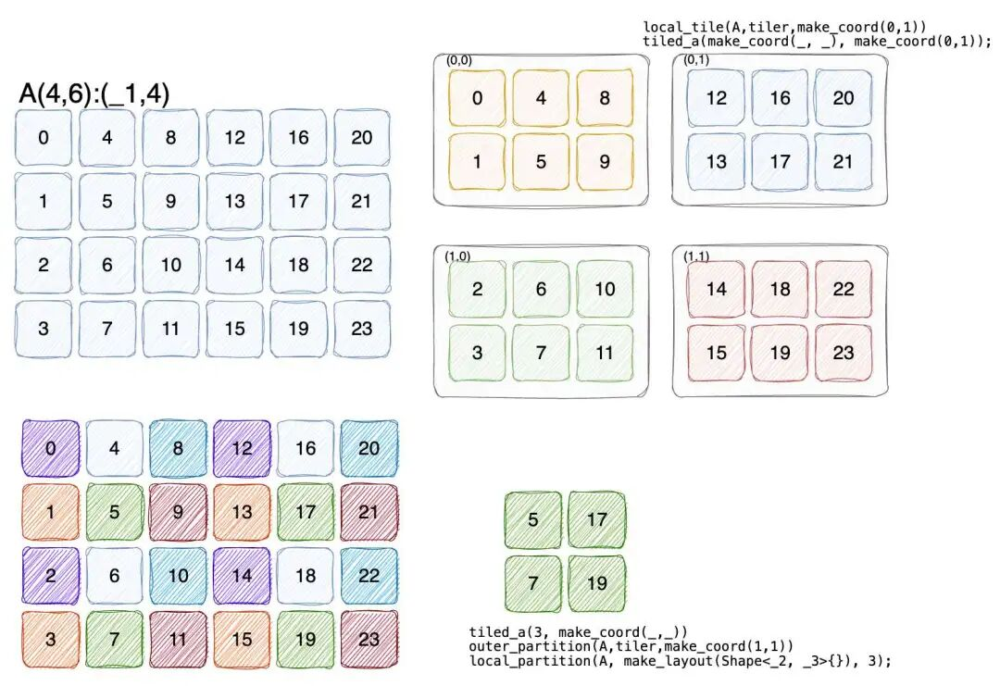
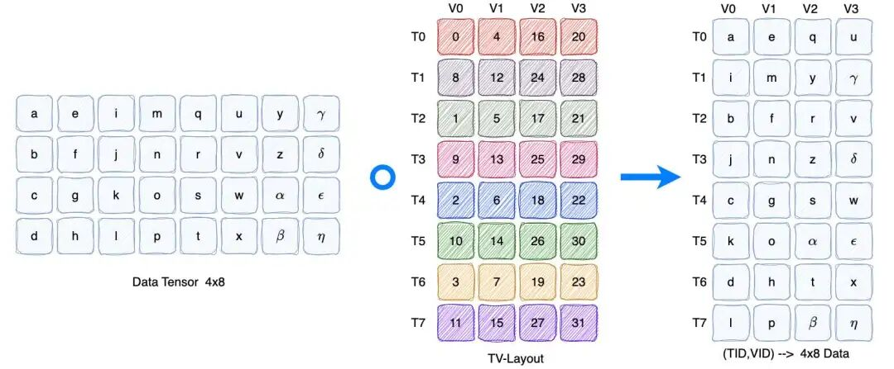
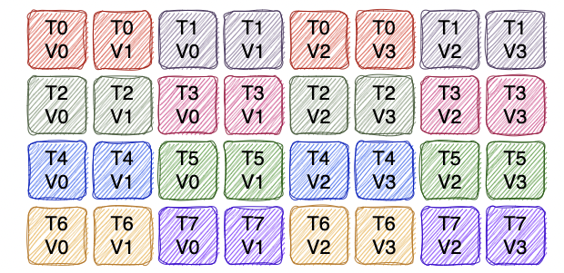

# Tensor-009 Cute Tensor

- 원문 제목: Tensor-009 Cute Tensor
- 저자: 자보터의 지우개
- 계정: zartbot
- 발행일: 2024년 9월 9일 20:09

이전 글에서는 CuTe Layout과 관련 algebra를 자세히 소개했다. 이번 글에서는 Tensor를 소개하기 시작한다. 간단히 보면 Layout은 element arrangement와 underlying storage 사이의 position relation만 정의할 뿐, 실제 storage와는 연결되어 있지 않다. 비교적 좁은 의미의 Tensor definition을 내리면, Tensor는 physical storage space와 Layout으로 정의되는 data structure이며, 외부에는 multidimensional array 형태를 노출하고 내부에서는 Layout 기반으로 indexing한다.

하나의 Tensor는 Layout과 Engine이라는 두 template parameter로 표현된다. Layout은 이전 글에서 자세히 소개했듯 coordinate를 offset으로 mapping하는 logical structure이고, Engine은 Offset과 dereference 기반의 iterator다. 이 글의 목차는 다음과 같다:

```c++
 1. Tensor 생성
 1.1 tensor ownership
 1.1.1 Non-Owning Tensor
 1.1.2 Owning Tensor
 1.2 요약
 2. tensor 사용
 2.1 basic operation
 2.2 element access
 2.3 tensor slicing(Slicing)
 2.4 Flatten/Coalesce/Group_modes
 3. Tiling & Partitioning
 3.1 Tensor division
 3.2 Partitioning
 3.2.1 Inner partition
 3.2.2 Outer partition
 3.2.3 Thread-Value partition
 4. tensor algorithm
 4.1 Fill
 4.2 clear
 4.3 Axpby
```

## 1. Tensor 생성

### 1.1 tensor ownership

CuTe Tensor를 구성할 때 object ownership에 따라 `owning`과 `non-owning`으로 나뉜다. Owning Tensor의 behavior는 `std:array`와 비슷하다. copy 시 각 element를 복제하기 위해 deepcopy를 수행하고, Tensor destructor는 element array를 release한다. Non-owning은 pointer와 비슷해서 copy 시 element를 복제하지 않고, destroy 시 data array도 release하지 않는다. parameter를 전달할 때 이런 점에 유의해야 한다.

#### 1.1.1 Non-Owning Tensor

Tensor는 보통 existing memory에 대한 non-owning view다. 예를 들어 cudamalloc으로 memory를 할당한 뒤 memory pointer를 parameter로 사용하고 `make_tensor` function으로 생성한다. 일반적으로 host memory 안의 tensor를 만들 수도 있고 device 위에서 만들 수도 있으며, memory space로 iterator를 tag할 수 있다. 예를 들어 `make_gmem_ptr`는 global memory(GMEM)를 지정하고, `make_smem_ptr`는 shared memory(SMEM)를 지정한다. 아래와 같다:

```c++
#include <cuda.h>
#include <stdlib.h>
#include <cute/tensor.hpp>

using namespace cute;

#define MAXN 128 * 128

#define PRINTTENSOR(name, tensor) \
    printf("%20s : ", name);      \
    print(tensor);                \
    print("\n");

__global__ void tensor_kernel(float *A)
{
    // tag를 사용하지 않음
    Tensor tensor_8 = make_tensor(A, make_layout(Int<8>{})); // Construct with Layout
    Tensor tensor_8s = make_tensor(A, Int<8>{});             // Construct with Shape
    Tensor tensor_8d2 = make_tensor(A, 8, 2);                // Construct with Shape and Stride
    PRINTTENSOR("tensor_8", tensor_8)
    PRINTTENSOR("tensor_8s", tensor_8s)
    PRINTTENSOR("tensor_8d2", tensor_8d2)

    // global memory, make_gmem_ptr로 tag하고 dynamic/static Layout 지원
    Tensor gmem_8s = make_tensor(make_gmem_ptr(A), Int<8>{});
    Tensor gmem_8d = make_tensor(make_gmem_ptr(A), 8);
    Tensor gmem_8sx16d = make_tensor(make_gmem_ptr(A), make_shape(Int<8>{}, 16));
    Tensor gmem_8dx16s = make_tensor(make_gmem_ptr(A), make_shape(8, Int<16>{}),
                                     make_stride(Int<16>{}, Int<1>{}));
    PRINTTENSOR("gmem_8s", gmem_8s)
    PRINTTENSOR("gmem_8d", gmem_8d)
    PRINTTENSOR("gmem_8sx16d", gmem_8sx16d)
    PRINTTENSOR("gmem_8dx16s", gmem_8dx16s)

    // shared memory, make_smem_ptr로 tag하고 dynamic/static Layout 지원
    Layout smem_layout = make_layout(make_shape(Int<4>{}, Int<8>{}));
    __shared__ float smem[decltype(cosize(smem_layout))::value]; // (static-only allocation)

    Tensor smem_4x8_col = make_tensor(make_smem_ptr(smem), smem_layout);
    Tensor smem_4x8_row = make_tensor(make_smem_ptr(smem), shape(smem_layout), GenRowMajor{});
    PRINTTENSOR("smem_4x8_col", smem_4x8_col)
    PRINTTENSOR("smem_4x8_row", smem_4x8_row)
}

int main()
{
    // initial memory
    float *A = (float *)malloc(MAXN * sizeof(float));
    for (int i = 0; i < MAXN; i++)
    {
        A[i] = float(i);
    }
    // Untagged pointers
    Tensor tensor_8 = make_tensor(A, make_layout(Int<8>{})); // Construct with Layout
    Tensor tensor_8s = make_tensor(A, Int<8>{});             // Construct with Shape
    Tensor tensor_8d2 = make_tensor(A, 8, 2);                // Construct with Shape and Stride
    PRINTTENSOR("host_tensor_8", tensor_8)
    PRINTTENSOR("host_tensor_8s", tensor_8s)
    PRINTTENSOR("host_tensor_8d2", tensor_8d2)
    printf("\n");


    // device memory 할당
    float *dA;
    cudaMalloc(&dA, MAXN * sizeof(float));
    cudaMemcpy(dA, A, MAXN * sizeof(float), cudaMemcpyHostToDevice);

    // Kernel 실행
    tensor_kernel<<<1, 1>>>(dA);

    cudaDeviceSynchronize();
    free(A);
    cudaFree(dA);
}
```

출력 결과는 다음과 같으며, 이들이 연결된 address가 동일함을 볼 수 있다.

```
       host_tensor_8 : ptr[32b](0x55b68f9b2630) o _8:_1
      host_tensor_8s : ptr[32b](0x55b68f9b2630) o _8:_1
     host_tensor_8d2 : ptr[32b](0x55b68f9b2630) o 8:2

            tensor_8 : ptr[32b](0x7f925aa00000) o _8:_1
           tensor_8s : ptr[32b](0x7f925aa00000) o _8:_1
          tensor_8d2 : ptr[32b](0x7f925aa00000) o 8:2

             gmem_8s : gmem_ptr[32b](0x7f925aa00000) o _8:_1
             gmem_8d : gmem_ptr[32b](0x7f925aa00000) o 8:_1
         gmem_8sx16d : gmem_ptr[32b](0x7f925aa00000) o (_8,16):(_1,_8)
         gmem_8dx16s : gmem_ptr[32b](0x7f925aa00000) o (8,_16):(_16,_1)

        smem_4x8_col : smem_ptr[32b](0x7f9281000000) o (_4,_8):(_1,_4)
        smem_4x8_row : smem_ptr[32b](0x7f9281000000) o (_4,_8):(_8,_1)
```

#### 1.1.2 Owning Tensor

`make_tensor<T>`로 생성하지만 static Layout만 지원한다.

```c++
#include <cuda.h>
#include <stdlib.h>
#include <cute/tensor.hpp>
using namespace cute;

#define PRINTTENSOR(name, tensor) \
    printf("%20s : ", name);      \
    print(tensor);                \
    print("\n");

__global__ void tensor_kernel()
{
      // Register memory (static layouts only)
    Tensor rmem_4x8_col = make_tensor<float>(Shape<_4, _8>{});
    Tensor rmem_4x8_row = make_tensor<float>(Shape<_4, _8>{},
                                             LayoutRight{});
    Tensor rmem_4x8_pad = make_tensor<float>(Shape<_4, _8>{},
                                             Stride<_32, _2>{});
    Tensor rmem_4x8_like = make_tensor_like(rmem_4x8_pad);
    PRINTTENSOR("rmem_4x8_col", rmem_4x8_col)
    PRINTTENSOR("rmem_4x8_row", rmem_4x8_row)
    PRINTTENSOR("rmem_4x8_pad", rmem_4x8_pad)
    PRINTTENSOR("rmem_4x8_like", rmem_4x8_like)
}

int main()
{
    // Register memory (static layouts only)
    Tensor rmem_4x8_col = make_tensor<float>(Shape<_4, _8>{});
    Tensor rmem_4x8_row = make_tensor<float>(Shape<_4, _8>{},
                                             LayoutRight{});
    Tensor rmem_4x8_pad = make_tensor<float>(Shape<_4, _8>{},
                                             Stride<_32, _2>{});
    Tensor rmem_4x8_like = make_tensor_like(rmem_4x8_pad);
    PRINTTENSOR("host_rmem_4x8_col", rmem_4x8_col)
    PRINTTENSOR("host_rmem_4x8_row", rmem_4x8_row)
    PRINTTENSOR("host_rmem_4x8_pad", rmem_4x8_pad)
    PRINTTENSOR("host_rmem_4x8_like", rmem_4x8_like)
    printf("\n");

    tensor_kernel<<<1, 1>>>();
    cudaDeviceSynchronize();
}
```

각 Tensor가 unique address를 갖는 것을 볼 수 있다.

```
   host_rmem_4x8_col : ptr[32b](0x7ffeaccf0a70) o (_4,_8):(_1,_4)
   host_rmem_4x8_row : ptr[32b](0x7ffeaccf0af0) o (_4,_8):(_8,_1)
   host_rmem_4x8_pad : ptr[32b](0x7ffeaccf0bf0) o (_4,_8):(_32,_2)
  host_rmem_4x8_like : ptr[32b](0x7ffeaccf0b70) o (_4,_8):(_8,_1)

        rmem_4x8_col : ptr[32b](0x7faec3fff990) o (_4,_8):(_1,_4)
        rmem_4x8_row : ptr[32b](0x7faec3fffa10) o (_4,_8):(_8,_1)
        rmem_4x8_pad : ptr[32b](0x7faec3fffa90) o (_4,_8):(_32,_2)
       rmem_4x8_like : ptr[32b](0x7faec3fffc50) o (_4,_8):(_8,_1)
```

### 1.2 요약

Dynamic Layout에 대해서는 `non-owning` 방식으로만 Tensor를 생성할 수 있다. static type은 생성 시 `make_tensor` function에 pointer를 지정해 `non-owning` type으로 만들 수 있고, pointer에 대해 특정 memory(GMEM/SMEM)의 tag 지정도 지원한다. pointer를 지정하지 않고 static type을 사용하면 `owning` Tensor를 생성할 수 있다.

## 2. tensor 사용

### 2.1 basic operation

Tensor는 layout/shape/stride/size/rank/depth 등의 function을 통해 tensor dimension 등 여러 정보를 얻을 수 있다. 동시에 data function으로 data storage space의 base address를 얻을 수도 있다. 예는 다음과 같다:

```
#include <cuda.h>
#include <stdlib.h>
#include <cute/tensor.hpp>

using namespace cute;

#define MAXN 128 * 128

#define PRINT(name, tensor)  \
    printf("%20s : ", name); \
    print(tensor);           \
    print("\n");

__global__ void tensor_kernel(float *A)
{
    Tensor t = make_tensor(A, make_shape(_8{}, _4{}), GenColMajor{});
    PRINT("tensor_8x4", t)
    PRINT("Layout", t.layout())
    PRINT("SHAPE", t.shape())
    PRINT("STRIDE", t.stride())
    PRINT("SIZE", t.size())
    PRINT("Data", t.data())
    PRINT("Rank", t.rank)
    PRINT("Depth", depth(t))
}

int main()
{
    // initial memory
    float *A = (float *)malloc(MAXN * sizeof(float));
    for (int i = 0; i < MAXN; i++)
    {
        A[i] = float(i);
    }

    float *dA;
    cudaMalloc(&dA, MAXN * sizeof(float));
    cudaMemcpy(dA, A, MAXN * sizeof(float), cudaMemcpyHostToDevice);

    tensor_kernel<<<1, 1>>>(dA);
    cudaDeviceSynchronize();
    free(A);
    cudaFree(dA);
}
//output
          tensor_8x4 : ptr[32b](0x7f3822a00000) o (_8,_4):(_1,_8)
              Layout : (_8,_4):(_1,_8)
               SHAPE : (_8,_4)
              STRIDE : (_1,_8)
                SIZE : _32
                Data : ptr[32b](0x7f3822a00000)
                Rank : 2
               Depth : _1
```

여기서 Tensor는 Mode별 hierarchical operation도 제공할 수 있다.

- `rank<I...>(Tensor)`: The rank of the I...th mode of the Tensor.
- `depth<I...>(Tensor)`: The depth of the I...th mode of the Tensor.
- `shape<I...>(Tensor)`: The shape of the I...th mode of the Tensor.
- `size<I...>(Tensor)`: The size of the I...th mode of the Tensor.
- `layout<I...>(Tensor)`: The layout of the I...th mode of the Tensor.
- `tensor<I...>(Tensor)`: The subtensor corresponding to the the I...th mode of the Tensor.

### 2.2 element access

Tensor object는 parentheses와 square bracket operator를 기반으로 data read/write access를 수행할 수 있다.

```c++
#include <cuda.h>
#include <stdlib.h>
#include <cute/tensor.hpp>
using namespace cute;

int main()
{

    Tensor A = make_tensor<float>(Shape<Shape<_4, _5>, Int<13>>{},
                                  Stride<Stride<_12, _1>, _64>{});
    float *b_ptr = (float *)malloc(13 * 20 * sizeof(float));
    Tensor B = make_tensor(b_ptr, make_shape(13, 20));

    // Fill A via natural coordinates op[]
    for (int m0 = 0; m0 < size<0, 0>(A); ++m0)
        for (int m1 = 0; m1 < size<0, 1>(A); ++m1)
            for (int n = 0; n < size<1>(A); ++n)
                A[make_coord(make_coord(m0, m1), n)] = n + 2 * m0;

    // Transpose A into B using variadic op()
    for (int m = 0; m < size<0>(A); ++m)
        for (int n = 0; n < size<1>(A); ++n)
            B(n, m) = A(m, n);

    // Copy B to A as if they are arrays
    for (int i = 0; i < A.size(); ++i)
        A[i] = B[i];

    print_tensor(A);
    print_tensor(B);

    free(b_ptr);
}
```

### 2.3 tensor slicing(Slicing)

Tensor에 access할 때 `_`를 coordinate로 전달해 slicing할 수 있으며, 해당 Mode 아래의 모든 subtensor를 반환한다. 그 밖에도 Layout과 비슷하게 `take<Begin,End>`로 몇 개 dimension의 data를 선택할 수 있다.

```c++
#include <cuda.h>
#include <stdlib.h>
#include <cute/tensor.hpp>
using namespace cute;

#define MAXN 128 * 128

int main()
{
    // initial memory
    int *a_ptr = (int *)malloc(MAXN * sizeof(int));
    for (int i = 0; i < MAXN; ++i)
        a_ptr[i] = i;

    //(_3,_4,_5):(_20,_5,_1)
    Tensor A = make_tensor(a_ptr, make_shape(Int<3>{}, Int<4>{}, Int<5>{}),
                           GenRowMajor{});

    print_tensor(A);
    Tensor A1 = A(_, _, 2);
    print_tensor(A1);

    //(_3,_4),(_2,_4,_2)):((_64,_16),(_8,_2,_1)
    Tensor B = make_tensor(a_ptr, make_shape(make_shape(Int<3>{}, Int<4>{}),
                                  make_shape(Int<2>{}, Int<4>{}, Int<2>{})),
                                  GenRowMajor{});

    print_tensor(B);
    Tensor C = B(make_coord(_, _), make_coord(1, 2, 1));
    print_tensor(C);

    Tensor D = B(make_coord(1, _), make_coord(0, _, 1));
    print_tensor(D);

    Tensor E = take<0,1>(B);
    print_tensor(E);
}
```

### 2.4 Flatten/Coalesce/Group\_modes

Layout과 유사하게 Tensor는 hierarchical structure를 flatten/coalesce하고 Mode 기준으로 aggregate하는 것을 지원한다.

```c++
#include <cuda.h>
#include <stdlib.h>
#include <cute/tensor.hpp>
using namespace cute;

#define MAXN 128 * 128

int main()
{
    // initial memory
    int *a_ptr = (int *)malloc(MAXN * sizeof(int));
    for (int i = 0; i < MAXN; ++i)
        a_ptr[i] = i;

    //(_3,_4),(_2,_4,_2)):((_64,_16),(_8,_2,_1)
    Tensor B = make_tensor(a_ptr, make_shape(make_shape(Int<3>{}, Int<4>{}), make_shape(Int<2>{}, Int<4>{}, Int<2>{})),
                           GenRowMajor{});

    // flatten은 hierarchical structure를 flatten한다
    //(_3,_4,_2,_4,_2):(_64,_16,_8,_2,_1)
    Tensor C = flatten(B);
    print_tensor(C);

    // ((_3,_4),(_2,_4,_2)):((_1,_3),(_12,_24,_96))
    Tensor D = make_tensor(a_ptr, make_shape(make_shape(Int<3>{}, Int<4>{}), make_shape(Int<2>{}, Int<4>{}, Int<2>{})),
                           GenColMajor{});
    print_tensor(D);

    // level 기준으로 continuous coordinate를 coalesce한다. GenColMajor이므로 1D로 coalesce된다.
    //_192:_1
    Tensor E = coalesce(D);
    print_tensor(E);

    // Mode Begin=1, End=4 기준으로 aggregate, 즉 (_4,_2,_4)
    //(_3,(_4,_2,_4),_2):(_64,(_16,_8,_2),_1):
    Tensor F = group_modes<1,4>(C);
    print_tensor(F);
}
```

## 3. Tiling & Partitioning

### 3.1 Tensor division

**Layout algebra의 product는 Tensor에 구현되어 있지 않다.** 주된 이유는 product가 cosize 변화를 일으켜 memory access out-of-bound 같은 safety issue를 만들 수 있기 때문이다. division은 이전 글 Cute Layout algebra에서 이미 설명했으므로, 구체적인 내용은 이전 글을 참고할 수 있다.

```c++
   composition(Tensor, Tiler)
logical_divide(Tensor, Tiler)
 zipped_divide(Tensor, Tiler)
  tiled_divide(Tensor, Tiler)
   flat_divide(Tensor, Tiler)
```

### 3.2 Partitioning

generic tensor tiling을 구현하기 위해 composition 또는 Tiling을 Slicing과 함께 사용할 수 있다. 보통 매우 유용한 partition method가 세 가지 있다. 예를 들어 4x6 Tensor를 partition하고 Tiler가 (\_2,\_3)이라고 하자.

```c++
Tensor A = make_tensor(ptr, make_shape(4,6));
auto tiler = Shape<_2,_3>{};

Tensor tiled_a = zipped_divide(A, tiler); //((_2,_3),(2,2)):((_1,4),(_2,12))
```



#### 3.2.1 Inner partition

예를 들어 각 ThreadGroup에 4x8 Tile을 제공해야 한다면 zipped\_divide의 뒤쪽 mode(2,2)를 index하면 된다. 아래와 같다:

```
    int blockIdx_x = 0;
    int blockIdx_y = 1;
    Tensor cta_a = tiled_a(make_coord(_, _), make_coord(blockIdx_x, blockIdx_y));
    PRINT("CTA_A", cta_a)
    Tensor local_tileA = local_tile(A, tiler, make_coord(0, 1));
    PRINT("LOCAL_TILE", local_tileA)

//output(blockIdx.x = 0, blockIdx.y =1)
    CTA_A : ptr[32b](0x55aa80892600) o (_2,_3):(_1,4):
   12   16   20
   13   17   21

LOCAL_TILE : ptr[32b](0x55aa80892600) o (_2,_3):(_1,4):
   12   16   20
   13   17   21
```

이를 Inner partition이라고 부른다. 내부의 `Tile` Mode를 유지하기 때문이다. 먼저 Tiling을 적용한 뒤 remaining Mode를 index해 해당 Tile을 잘라내는 pattern은 매우 흔하며, 이미 `inner_partition(Tensor, Tiler, Coord)` function으로 캡슐화되어 있다. 자주 보게 되는 `local_tile(Tensor, Tiler, Coord)`도 inner\_partition의 alias다.

#### 3.2.2 Outer partition

다른 방법은 첫 번째 Mode를 통해 data를 index하는 것이다.

```
    int threadIdx_x = 3;
    Tensor thr_a = tiled_a(threadIdx_x, make_coord(_, _));
    PRINT("THR_A", thr_a)
    Tensor outer_partA = outer_partition(A, tiler, make_coord(1, 1));
    PRINT("OUTER_PART", outer_partA)
    Tensor local_partA = local_partition(A, make_layout(Shape<_2, _3>{}), 3);
    PRINT("LOCAL_PART", local_partA)

//output
   THR_A : ptr[32b](0x55aa808925e4) o (2,2):(_2,12):
    5   17
    7   19

OUTER_PART : ptr[32b](0x55aa808925e4) o (2,2):(_2,12):
    5   17
    7   19

LOCAL_PART : ptr[32b](0x55aa808925e4) o (2,2):(_2,12):
    5   17
    7   19
```

이처럼 첫 번째 Mode를 index하고 나머지 Mode를 유지하므로 Outer partition이라고도 부른다. `outer_partition(Tensor, Tiler, Coord)` 또는 `local_partition(Tensor, Layout, Idx)`로 index할 수 있다.

#### 3.2.3 Thread-Value partition

Thread-Value Partition의 목적은 MxN matrix에 대해 (threadIdx, ValueIdx) 방식으로 partition하여 해당 Thread가 해당 Value를 처리하게 하는 것이다. 아래와 같다:



임의의 4x8 Layout에 대해 Thread-Value와 composition하면 Thread-Value Partition matrix를 얻을 수 있고, TID와 VID로 해당 value를 처리할 수 있다.

```
#include <cuda.h>
#include <stdlib.h>
#include <cute/tensor.hpp>
using namespace cute;

#define MAXN 128 * 128

int main()
{
    // initial memory
    int *hA = (int *)malloc(MAXN * sizeof(int));
       for (int i = 0; i < MAXN; ++i)
        hA[i] = i;


    // TV Layout 구성, 총 8개 thread, 각 thread 4개 value, MxN=4x8 space로 mapping
    // (T8,V4) -> (M4,N8)
    auto tv_layout = Layout<Shape<Shape<_2, _4>, Shape<_2, _2>>,
                            Stride<Stride<_8, _1>, Stride<_4, _16>>>{}; // (8,4)
    print_layout(tv_layout);

    // data tensor MxN=4x8
    Tensor A = make_tensor(hA,make_shape(_4{},_8{}),GenColMajor{});
    print_tensor(A);

    // data tensor와 TV-Layout을 composition해 TV tensor 생성
    Tensor tv = composition(A, tv_layout);

    // tv tensor를 threadIdx 기준으로 value를 가져와 계산
    int tid = 1;
    Tensor v = tv(tid, _); // (4)
    print_tensor(v);
}
//output
((_2,_4),(_2,_2)):((_8,_1),(_4,_16))
       0    1    2    3
    +----+----+----+----+
 0  |  0 |  4 | 16 | 20 |
    +----+----+----+----+
 1  |  8 | 12 | 24 | 28 |
    +----+----+----+----+
 2  |  1 |  5 | 17 | 21 |
    +----+----+----+----+
 3  |  9 | 13 | 25 | 29 |
    +----+----+----+----+
 4  |  2 |  6 | 18 | 22 |
    +----+----+----+----+
 5  | 10 | 14 | 26 | 30 |
    +----+----+----+----+
 6  |  3 |  7 | 19 | 23 |
    +----+----+----+----+
 7  | 11 | 15 | 27 | 31 |
    +----+----+----+----+

// data tensor
ptr[32b](0x55a151d3a5d0) o (_4,_8):(_1,_4):
    0    4    8   12   16   20   24   28
    1    5    9   13   17   21   25   29
    2    6   10   14   18   22   26   30
    3    7   11   15   19   23   27   31

// threadIdx =1의 value(V0~V3)
ptr[32b](0x55a151d3a5f0) o ((_2,_2)):((_4,_16)):
    8
   12
   24
   28
```

이러한 TV Partition을 통해 original data가 ThreadID, ValueID로 mapping되는 관계는 다음과 같다:



## 4. tensor algorithm

`include/cute/algorithm` directory에는 tensor 관련 common numerical algorithm의 interface와 implementation이 일련으로 정의되어 있다. Copy와 MMA는 후속 글에서 별도로 소개한다.

### 4.1 Fill

특정 value로 tensor를 fill한다.

```
    Tensor A = make_tensor<int>(make_shape(_4{},_8{}),GenColMajor{});
    fill(A, 7);
    print_tensor(A);
//output
ptr[32b](0x7fff0275ff70) o (_4,_8):(_1,_4):
    7    7    7    7    7    7    7    7
    7    7    7    7    7    7    7    7
    7    7    7    7    7    7    7    7
    7    7    7    7    7    7    7    7
```

### 4.2 Clear

default constructor를 사용해 tensor 안의 element에 값을 assign한다.

```
    Tensor A = make_tensor<int>(make_shape(_4{},_8{}),GenColMajor{});
    fill(A, 7);
    clear(A);
    print_tensor(A);
//output
ptr[32b](0x7ffe833948f0) o (_4,_8):(_1,_4):
    0    0    0    0    0    0    0    0
    0    0    0    0    0    0    0    0
    0    0    0    0    0    0    0    0
    0    0    0    0    0    0    0    0
```

### 4.3 axpby

axpby(alpha,A, beta,B)는 두 tensor에 대해 linear operation $B = alpha * A + beta * B$를 수행한다.

```
#include <cuda.h>
#include <stdlib.h>
#include <cute/tensor.hpp>
using namespace cute;

int main()
{

    Tensor A = make_tensor<int>(make_shape(_4{},_8{}),GenColMajor{});
    fill(A, 3);

    Tensor B = make_tensor<int>(make_shape(_4{},_8{}),GenColMajor{});
    fill(B, 2);

    // B = 3 * A + 2 * B
    axpby(3,A, 2, B);
    print_tensor(B);
}
//output
ptr[32b](0x7ffe83394970) o (_4,_8):(_1,_4):
   13   13   13   13   13   13   13   13
   13   13   13   13   13   13   13   13
   13   13   13   13   13   13   13   13
   13   13   13   13   13   13   13   13
```
