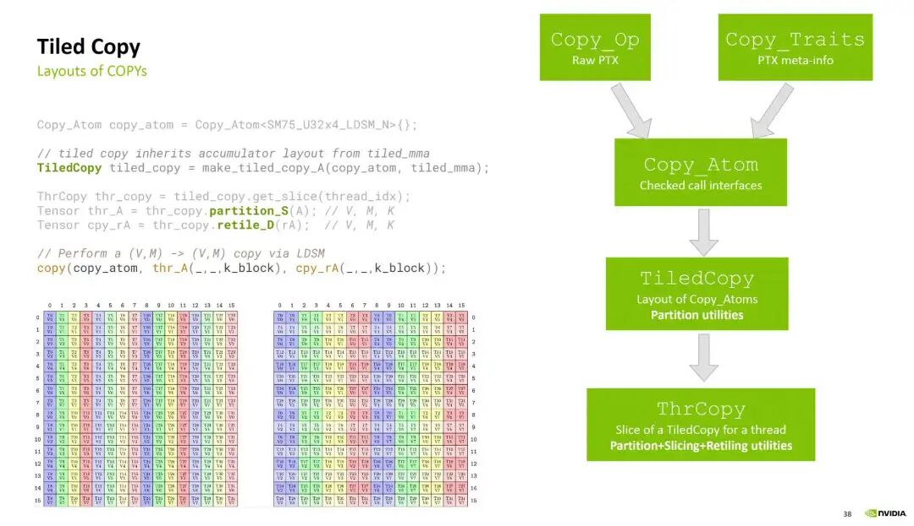

# Tensor-010 Tensor Copy

- 원문 제목: Tensor-010 Tensor Copy
- 저자: 자보터의 지우개
- 계정: zartbot
- 발행일: 2024년 9월 14일 23:34

이 글은 Cute Tiled Copy의 abstract structure와 해당 memory copy flow를 소개한다. 목차는 다음과 같다:

```
1. Cute Copy paradigm
1.1 CopyOperation
1.2 Copy_Traits
1.3 Copy_Atom
1.4 TiledCopy
1.5 ThrCopy
2. Cute Copy example
```

## 1. Cute Copy paradigm

Cutlass Tiled Copy의 abstract structure는 다음과 같다.



### 1.1 Copy\_Op

Copy\_Op는 primitive PTX instruction이다. 《Tensor-003 TensorCore architecture》에서 `ldmatrix`, `cp.async`, Hopper의 TMA 등 여러 memory copy instruction을 소개했다. `include/cute/arch`에 해당 implementation이 있으며, 예를 들어 `ldmatrix`는 다음과 같다.

```c++
struct SM75_U16x8_LDSM_T
{
  using SRegisters = uint128_t[1];
  using DRegisters = uint32_t[4];

  CUTE_HOST_DEVICE static void
  copy(uint128_t const& smem_src,
       uint32_t& dst0, uint32_t& dst1, uint32_t& dst2, uint32_t& dst3)
  {
    uint32_t smem_int_ptr = cast_smem_ptr_to_uint(&smem_src);
    asm volatile ("ldmatrix.sync.aligned.x4.trans.m8n8.shared.b16 {%0, %1, %2, %3}, [%4];\n"
        : "=r"(dst0), "=r"(dst1), "=r"(dst2), "=r"(dst3)
        :  "r"(smem_int_ptr));
  }
};
```

### 1.2 Copy\_Traits

Copy\_Traits는 Copy\_Op에 몇 가지 metadata를 보충한다. 예를 들어 해당 thread ID, source와 destination data의 Layout 등 정보다. ThreadIdx와 ValueID로 data position을 얻을 수 있으며, `/include/cute/atom` directory 아래에 각 platform 관련 implementation이 있다. 아래와 같다:

```c++
template <>
struct Copy_Traits<SM75_U16x8_LDSM_T>
{
  // Logical thread id to thread idx (warp)
  using ThrID = Layout<_32>;

  // Map from (src-thr,src-val) to bit
  using SrcLayout = Layout<Shape < _32,_128>,
                           Stride<_128,  _1>>;

  // Map from (dst-thr,dst-val) to bit
  using DstLayout = Layout<Shape <Shape <  _4, _8>,Shape <_16,  _2,   _4>>,
                           Stride<Stride<_256,_16>,Stride< _1,_128,_1024>>>;

  // Reference map from (thr,val) to bit
  using RefLayout = DstLayout;
};
```

### 1.3 Copy\_Atom

Copy\_Atom은 Copy\_Op와 Copy\_Traits를 캡슐화한 것으로, data type을 bind하고 해당 interface도 check하여 상위 TiledCopy에 atomic capability를 제공한다. 관련 code는 `include/cute/atom/`에 있다.

```c++
struct Copy_Atom<Copy_Traits<Args...>, CopyInternalType>
  : Copy_Traits<Args...>
{
  using Traits = Copy_Traits<Args...>;

  // Copy_Traits 기반 ThreadLayout
  using ThrID        = typename Traits::ThrID;
  using BitLayoutSrc = typename Traits::SrcLayout;
  using BitLayoutDst = typename Traits::DstLayout;
  using BitLayoutRef = typename Traits::RefLayout;

  // Value Layout
  using ValType = CopyInternalType;

  using ValLayoutSrc = decltype(recast_layout<uint1_t, ValType>(BitLayoutSrc{}));
  using ValLayoutDst = decltype(recast_layout<uint1_t, ValType>(BitLayoutDst{}));
  using ValLayoutRef = decltype(recast_layout<uint1_t, ValType>(BitLayoutRef{}));

  static constexpr int NumValSrc = size<1>(ValLayoutSrc{});
  static constexpr int NumValDst = size<1>(ValLayoutDst{});

...

  // Check and call instruction, or recurse
  template <class SEngine, class SLayout,
            class DEngine, class DLayout>
  CUTE_HOST_DEVICE
  void
  call(Tensor<SEngine,SLayout> const& src,
       Tensor<DEngine,DLayout>      & dst) const
  {
    // const case에서는 copy_unpack 실행
    // Shape이 Tuple인 case에는 Mode를 recursively peel off해서 처리
     ....
  }
...
};
```

### 1.4 TiledCopy

TiledCopy는 TiledMMA Layout을 기반으로 Copy Atom을 반복 호출해 더 큰 block copy capability를 구현한다. `include/cute/atom/copy_atom.hpp`에 정의되어 있다. 먼저 Copy\_Atom, TV\_Layout, Tiler\_MN을 기반으로 다음과 같이 정의된다.

```c++
template <class Copy_Atom,
          class LayoutCopy_TV,  // (tid,vid) -> coord   [Need not be 2D...]
          class ShapeTiler_MN>  // coord space
struct TiledCopy : Copy_Atom
{
  // Layout information from the CopyAtom
  using AtomThrID     = typename Copy_Atom::ThrID;        // thrid -> thr_idx
  using AtomLayoutSrc = typename Copy_Atom::ValLayoutSrc; // (thr,val) -> offset
  using AtomLayoutDst = typename Copy_Atom::ValLayoutDst; // (thr,val) -> offset
  using AtomLayoutRef = typename Copy_Atom::ValLayoutRef; // (thr,val) -> offset

  using AtomNumThr = decltype(size<0>(AtomLayoutRef{}));
  using AtomNumVal = decltype(size<1>(AtomLayoutRef{}));

  // Layout information for the TiledCopy
  using Tiler_MN       = ShapeTiler_MN;
  using TiledLayout_TV = LayoutCopy_TV;
  using TiledNumThr    = decltype(size<0>(TiledLayout_TV{}));
  using TiledNumVal    = decltype(size<1>(TiledLayout_TV{}));
```

`tile2thrfrg`는 ((TileM,TileN,...), (RestM,RestN,...)) Layout을 ((ThrV,ThrX),FrgV,(RestM,RestN,...))로 변환한다. 그 안에는 여러 function이 정의되어 있으며, `tidfrg_S`와 `tidfrg_D` 두 function은 각각 source(STensor)와 destination(DTensor) tensor slice를 처리하고 내부에서 `tile2thrfrg` function을 호출한다.

```c++
 tidfrg_S(STensor&& stensor)
  {
    // Tile the stensor and compute the (src-thr, src-val) -> (ref-thr, ref-val) layout
    return tile2thrfrg(zipped_divide(stensor,Tiler_MN{}), right_inverse(AtomLayoutRef{}).compose(AtomLayoutSrc{}));
  }

  tidfrg_D(DTensor&& dtensor)
  {
    // Tile the dtensor and compute the (dst-thr, dst-val) -> (ref-thr, ref-val) layout
    return tile2thrfrg(zipped_divide(dtensor,Tiler_MN{}), right_inverse(AtomLayoutRef{}).compose(AtomLayoutDst{}));
  }
```

또한 `get_layoutS_TV`와 `get_layoutD_TV`, 그리고 `get_layoutS_MN`과 `get_layoutD_MN` function은 `(thr_idx,val_idx) -> (M,N)` 및 `(M,K) -> (thr_idx,val_idx)` mapping을 생성하는 데 사용된다.

`get_slice(ThrIdx const& thr_idx)`와 `get_thread_slice(ThrIdx const& thr_idx)`는 TiledCopy의 core function으로, 특정 thread index의 slice information을 가져온다. 이들이 반환하는 object는 ThrCopy다.

```c++
  get_slice(ThrIdx const& thr_idx)
  {
    return ThrCopy<TiledCopy, ThrIdx>(thr_idx);
  }
```

### 1.5 ThrCopy

TileCopy.get\_slice(threadIdx)가 반환하는 thread-level descriptor object ThrCopy를 기반으로, ThrCopy의 `partition_S/D` function을 통해 해당 copy operand를 얻을 수 있다. 어떤 case에서는 `retile_S/D` function으로 copy function이 요구하는 shape으로 transform할 수도 있고, 마지막으로 cute::copy function을 호출해 copy를 구현한다.

## 2. Cute Copy example

`/blob/v3.5.1/examples/cute/tutorial/tiled_copy.cu` code를 예로 TileCopy instance를 분석한다.
original matrix data type은 float이고, matrix는 MxN=4096x8192다.

```c++
  using Element = float;

  // matrix Shape 정의
  auto tensor_shape = make_shape(4096, 8192);

  // matrix 할당 및 초기화
  thrust::host_vector<Element> h_S(size(tensor_shape));
  thrust::host_vector<Element> h_D(size(tensor_shape));

  for (size_t i = 0; i < h_S.size(); ++i) {
    h_S[i] = static_cast<Element>(i);
    h_D[i] = Element{};
  }

  thrust::device_vector<Element> d_S = h_S;
  thrust::device_vector<Element> d_D = h_D;

  // Tensor 생성
  Tensor tensor_S = make_tensor(make_gmem_ptr(thrust::raw_pointer_cast(d_S.data())), make_layout(tensor_shape));
  Tensor tensor_D = make_tensor(make_gmem_ptr(thrust::raw_pointer_cast(d_D.data())), make_layout(tensor_shape));
```

그다음 Block Shape 128x64로 copy하고, TensorShape과 BlockShape의 dimension이 divisible한지, 동시에 weakly\_compatible condition을 만족하는지 verify한다. weakly\_compatible condition은 《Tensor-008 CuTe Layout algebra》 관련 내용을 참고할 수 있다.

```c++
auto block_shape = make_shape(Int<128>{}, Int<64>{});

  if ((size<0>(tensor_shape) % size<0>(block_shape)) || (size<1>(tensor_shape) % size<1>(block_shape))) {
    std::cerr << "The tensor shape must be divisible by the block shape." << std::endl;
    return -1;
  }
  // Equivalent check to the above
  if (not weakly_compatible(block_shape, tensor_shape)) {
    std::cerr << "Expected the tensors to be weakly compatible with the block_shape." << std::endl;
    return -1;
  }
```

그다음 BlockShape을 기반으로 TileDivide를 사용해 original matrix를 split한다.

```c++
  Tensor tiled_tensor_S = tiled_divide(tensor_S, block_shape);      // ((M, N), m', n')
  Tensor tiled_tensor_D = tiled_divide(tensor_D, block_shape);      // ((M, N), m', n')
```

Block 안의 Thread Layout과 Vector Copy Layout을 정의한다.

```c++
  // Thread arrangement
  Layout thr_layout = make_layout(make_shape(Int<32>{}, Int<8>{}));

  // Vector dimensions
  Layout vec_layout = make_layout(make_shape(Int<4>{}, Int<1>{}));
```

Launch Kernel의 Grid와 block은 split된 Tile 수와 Thread 수에 따라 정의한다.

```c++
  dim3 gridDim (size<1>(tiled_tensor_D), size<2>(tiled_tensor_D));   // Grid shape corresponds to modes m' and n'
  dim3 blockDim(size(thr_layout));

  copy_kernel_vectorized<<< gridDim, blockDim >>>(
    tiled_tensor_S,
    tiled_tensor_D,
    thr_layout,
    vec_layout);
```

copy\_kernel\_vectorized code는 다음과 같다.

```c++
template <class TensorS, class TensorD, class ThreadLayout, class VecLayout>
__global__ void copy_kernel_vectorized(TensorS S, TensorD D, ThreadLayout, VecLayout)
{
  using namespace cute;
  using Element = typename TensorS::value_type;

  // BlockIdx.x/y로 해당 source 및 destination tile 가져오기
  Tensor tile_S = S(make_coord(_, _), blockIdx.x, blockIdx.y);  // (BlockShape_M, BlockShape_N)
  Tensor tile_D = D(make_coord(_, _), blockIdx.x, blockIdx.y);  // (BlockShape_M, BlockShape_N)

  // Define `AccessType` which controls the size of the actual memory access.
  using AccessType = cutlass::AlignedArray<Element, size(VecLayout{})>;

  // Copy_Atom 정의
  using Atom = Copy_Atom<UniversalCopy<AccessType>, Element>;

  // TiledCopy object 구성
  auto tiled_copy =
    make_tiled_copy(
      Atom{},                       // access size
      ThreadLayout{},               // thread layout
      VecLayout{});                 // vector layout (e.g. 4x1)

  // ThreadIdx.x와 tiled_copy object 기반으로 thr_copy object 생성
  auto thr_copy = tiled_copy.get_thread_slice(threadIdx.x);

  // thrCopy object 기반으로 thread_tile tensor 생성
  Tensor thr_tile_S = thr_copy.partition_S(tile_S);             // (CopyOp, CopyM, CopyN)
  Tensor thr_tile_D = thr_copy.partition_D(tile_D);             // (CopyOp, CopyM, CopyN)

  // Thread_tile 기반으로 register file tensor 생성
  Tensor fragment = make_fragment_like(thr_tile_D);             // (CopyOp, CopyM, CopyN)

  // source data를 GMEM에서 RMEM으로 copy하고, 다시 RMEM에서 destination GMEM으로 copy
  copy(tiled_copy, thr_tile_S, fragment);
  copy(tiled_copy, fragment, thr_tile_D);
}
```
