# Tensor-011 Blackwell TensorCore

- 원문 제목: Tensor-011 Blackwell TensorCore
- 저자: ZhaB
- 계정: zartbot
- 발행일: 2025년 3월 26일 20:41

### TL;DR

GTC25에 Blackwell TensorCore programming을 다룬 좋은 Session 《Programming Blackwell Tensor Cores with CuTe and CUTLASS》[1]가 있어 학습하고 몇 가지 note를 정리했다.

전체적으로 보면, TMEM의 등장으로 accumulated result가 RMEM과 분리되었다. 장점은 예전처럼 wgmma를 수행할 필요 없이 하나의 thread가 mma를 issue하고 SMEM mbarrier를 통해 async completion notification을 수행하면 된다는 점이다. 이렇게 전체 pipeline orchestration과 scheduling이 더 flexible해진다. 하지만 TMEM+TensorCore는 memory consistency를 더 복잡하게 만들며, explicit alloc/dealloc/ld/store/copy가 필요하다. programming complexity도 꽤 번거롭다.

## 1. Overview

Blackwell architecture의 주요 변화는 다음과 같다:

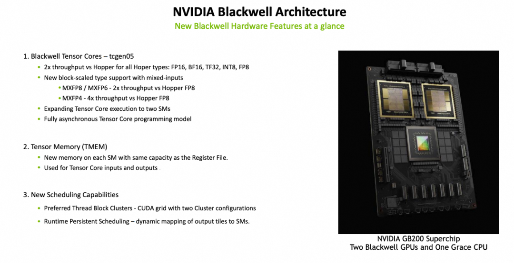

### 1.1 Tensor Memory

Hopper는 wgmma를 통해 4개 warp를 group으로 묶어 `wgmma.mma` instruction을 issue하고, result는 register로 반환된다. Blackwell에서는 Tensor Memory가 새로 추가되었고 서로 다른 lane을 통해 4개 warp에 할당된다. 각 warp는 하나의 thread가 독립적으로 submit할 수 있고, SMEM의 mbarrier로 completion을 notify한다. 흥미로운 점은 Epilogues stage에서 async MMA execution도 추가되었다는 것이다.

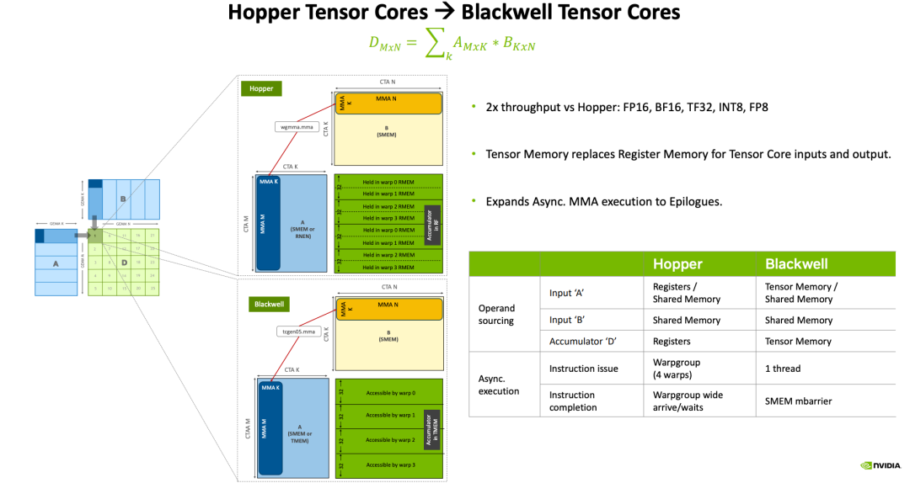

TMEM의 장점은 matrix A와 D를 모두 저장할 수 있고, 더 많은 register와 SMEM space를 사용해 더 깊은 pipeline을 구성할 수 있다는 점이다. 동시에 warpgroup 안의 4개 warp가 함께 completion을 기다릴 필요 없이 하나의 thread가 MMA instruction을 issue하면 되므로, softmax 관련 계산을 더 잘 overlap할 수 있다.

물론 TMEM에도 단점이 있다. memory consistency를 더 깨뜨리기 때문에 explicit allocation(tcgen05.alloc/dealloc)이 필요하고, register로 explicit ld/st하거나 cp instruction으로 SMEM에 copy해야 한다.

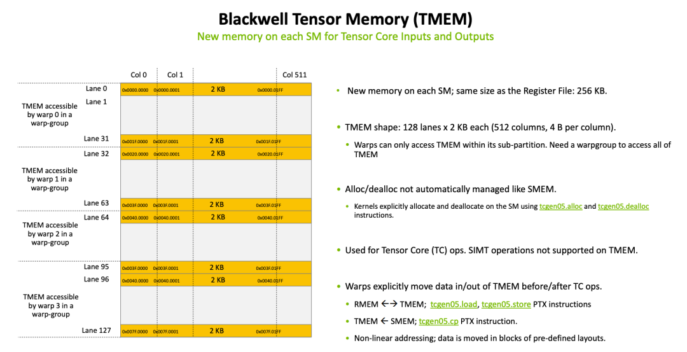

### 1.2 2SM TensorCore Execution

Blackwell에서는 Distributed SMEM(DSMEM) capability가 강화되어 TensorCore가 동시에 두 SM에 걸쳐 execution할 수 있다. 이때 operand B는 DSMEM broadcast를 통해 TensorCore로 load될 수 있다.

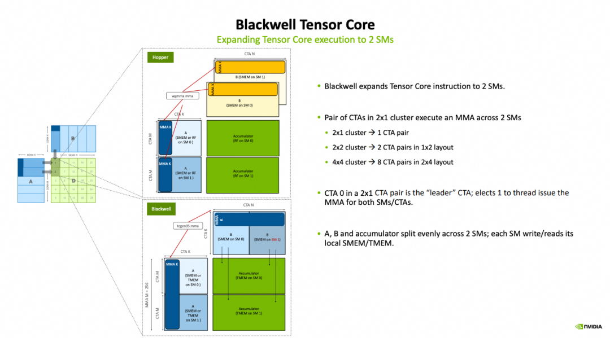

### 1.3 Block-Scale Format

FP4/FP8에 대해 block scale factor 지원이 추가되었다. 이건 좋은 점이다.

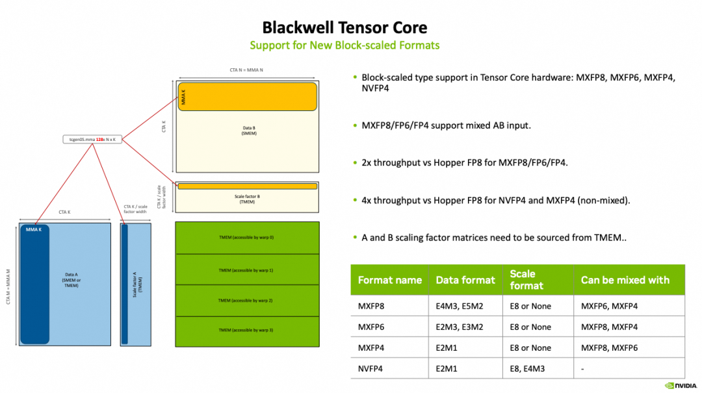

### 1.4 scheduling capability

Hopper에서는 DSMEM support와 함께 하나의 GPC(GPU Processing Cluster) 내부 SM 사이의 hardware communication capability가 구현되었고, Thread Block Cluster(TBC) concept가 추상화되었다. 즉 Grid-->TBC-->CTA-->Thread의 hierarchical structure이며, 하나의 TBC는 여러 CTA로 구성되고 hardware scheduler에 의해 하나의 GPC 안의 여러 SM에서 execution될 수 있다.

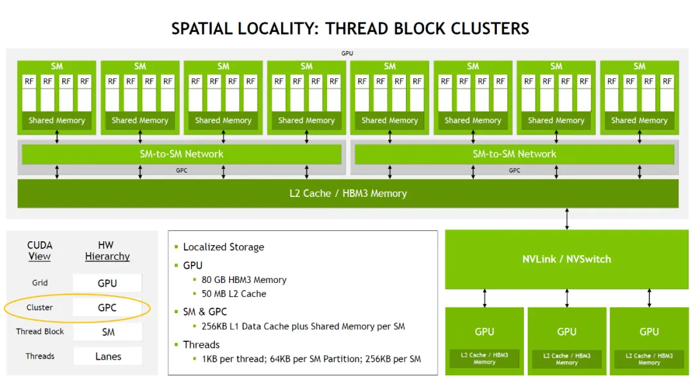

하지만 Hopper에서는 하나의 Cluster 안의 CTA가 반드시 하나의 GPC 안에서 scheduling되어야 하므로, 어떤 경우에는 SM이 idle 상태가 되는 문제가 생긴다:

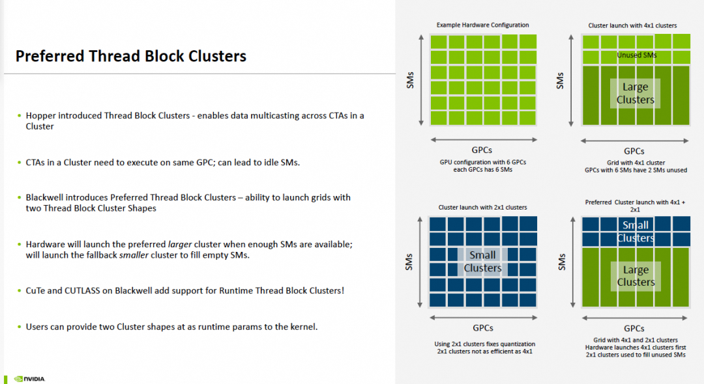

Blackwell의 개선점 중 하나는 Preferred TBC를 지원한다는 것이다. scheduler를 수정해 하나의 GPC 안에서 두 가지 shape의 cluster를 동시에 execute할 수 있어 SM idle을 피한다.

한편 Tile scheduling은 Hopper에서 static orchestration mechanism을 사용한다. 다른 Grid가 어떤 SM에서 execute 중이면 해당 Tile task는 execution이 delayed되어 전체 computation에 long tail이 발생한다.

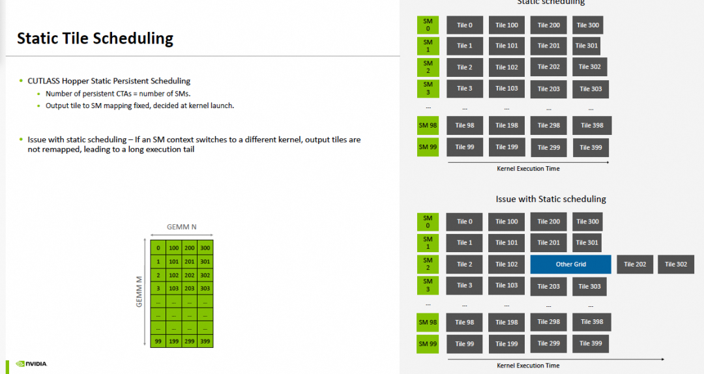

Blackwell에서는 dynamic Tile scheduling mechanism을 지원한다. Tile 202가 다른 Grid에 의해 점유되었을 때 더 빠르게 다음 SM으로 schedule되어 execution될 수 있으므로 long tail latency를 피할 수 있다.

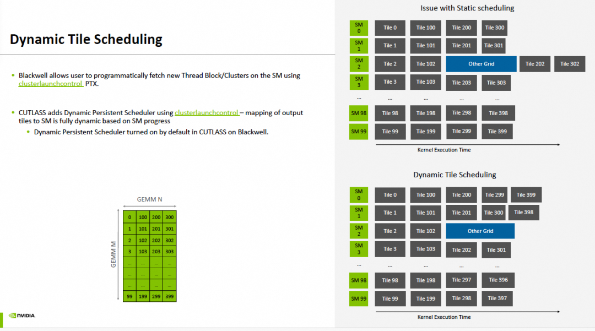

## 2. Blackwell CuTe programming

CuTe는 Op/Traits/Atom/Tile의 abstract structure를 사용한다. 예를 들어 MMA structure는 다음과 같다:

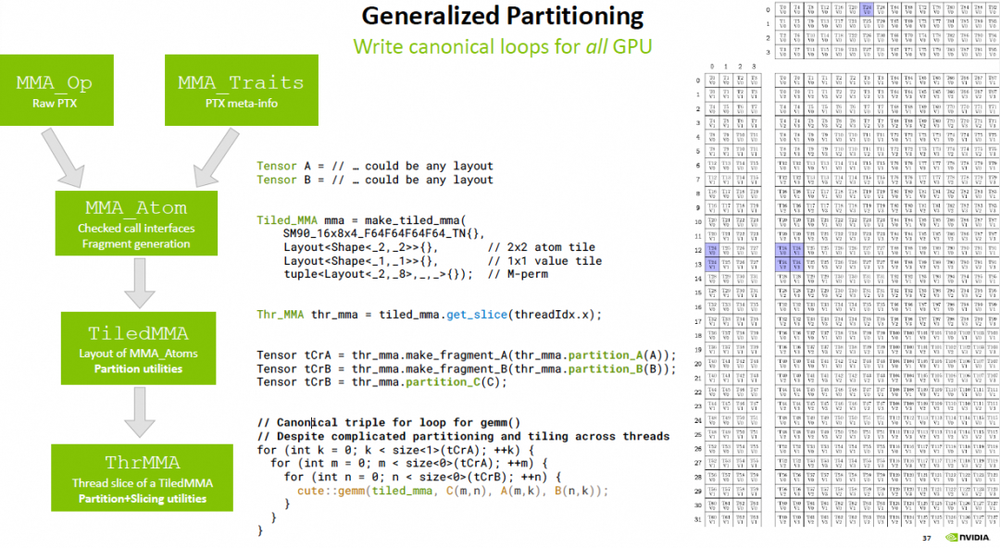

COPY structure는 다음과 같다:

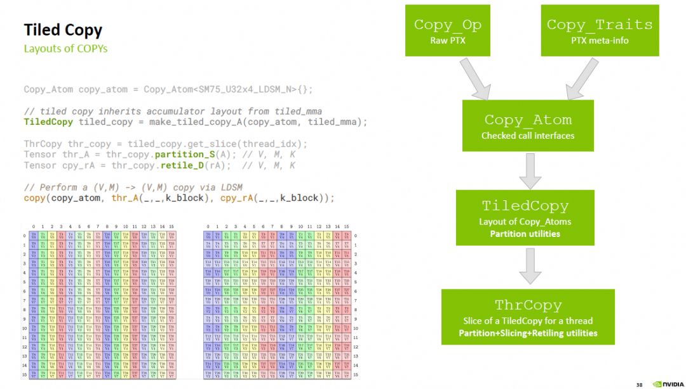

Hopper에서는 TensorCore result가 register에 저장되므로 최종적으로 thread granularity로 처리된다. Hopper와 비교해 Blackwell의 가장 큰 변화 중 하나는 TensorCore computation result를 TMEM에 저장할 수 있다는 점이며, 따라서 scheduling granularity가 CTA Level까지 올라갈 수 있다.

### 2.1 Basic GEMM

- 주: 이 example의 code는 https://github.com/NVIDIA/cutlass/blob/main/examples/cute/tutorial/blackwell/01\_mma\_sm100.cu 에 있다.

Cutlass abstraction 기반에서 MMA Op는 주로 PTX instruction의 description이고, MMA Traits는 더 많은 metadata를 포함한다. Hopper와 Blackwell의 차이를 볼 수 있으며, MMA Partition의 경우 TMEM의 등장으로 CTA Level 기반 description이 가능하다.

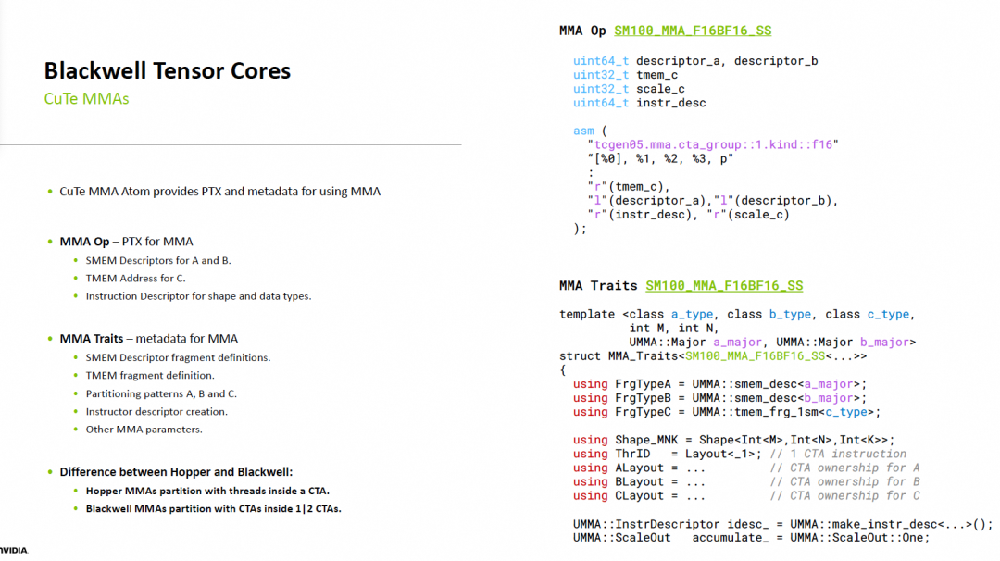

주의할 점은 MMA Traits(code 위치: /include/cute/atom/mma\_traits\_sm100.hpp)에서 A와 B operand는 SMEM을 사용하고 result C는 TMEM을 사용하도록 지정한다는 것이다. 그다음 MMA Op와 MMA Traits로 MMA\_ATOM을 구성하고, make\_tiled\_mma function 호출로 TiledMMA를 생성한다.

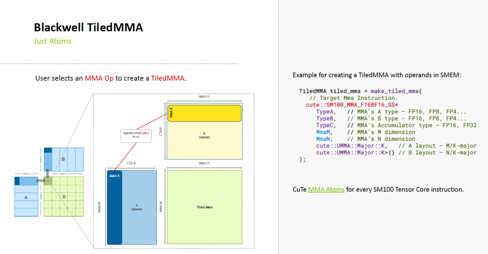

전체 GEMM flow는 다음과 같으며, 먼저 GMEM에 tensor를 생성한다.

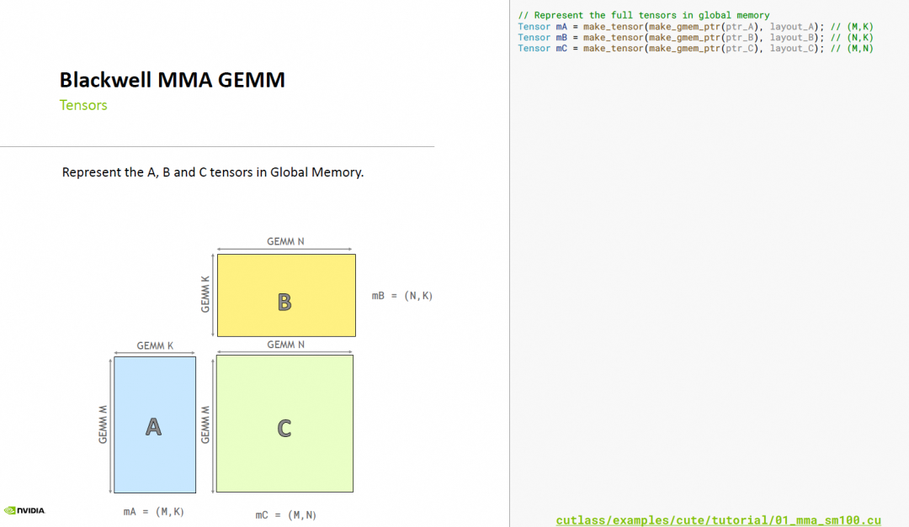

그다음 MMA\_Tiler 기반으로 partition한다. code 안의 MMA\_Tiler comment는 다음과 같고, 마찬가지로 MMA granularity로 scheduling한 뒤에는 MMA\_Coord granularity의 coordinate를 사용할 수 있다.

```c++
auto mma_tiler = make_shape(bM, bN, bK);       // (MMA_M, MMA_N, MMA_K)

// In SM90,  the MMAs are CTA-local and perform thread-level partitioning.
// In SM100, the MMAs are Cluster-local and perform CTA-level partitioning.
// Thus, SM90 uses a cta_tiler to extract portions of the Problem for the CTA
//  and SM100 uses a mma_tiler to extract portions of the Problem for the MMA.
//  The MMA's partitioning then yeilds the CTA-local work.

// Construct the MMA grid coordinate from the CTA grid coordinate
auto mma_coord_vmnk = make_coord(blockIdx.x % size<0>(cluster_layout_vmnk), // Peer CTA coordinate
                                   blockIdx.x / size<0>(cluster_layout_vmnk), //    MMA-M coordinate
                                   blockIdx.y,                                //    MMA-N coordinate
                                   _);                                        //    MMA-K coordinate
```

전체 matrix의 Tile partition은 아래 그림과 같다:

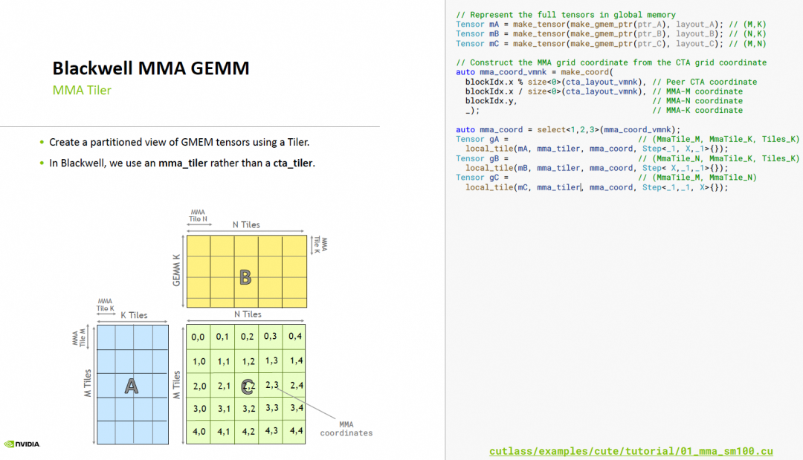

그다음 앞에서 생성한 TiledMMA를 사용해 block partition을 수행한다. Blackwell은 CTA level 기반이므로, 여기서 생성하는 ThrMMA object는 example code 안에서 cta\_mma라고 불린다는 점에 주의해야 한다.

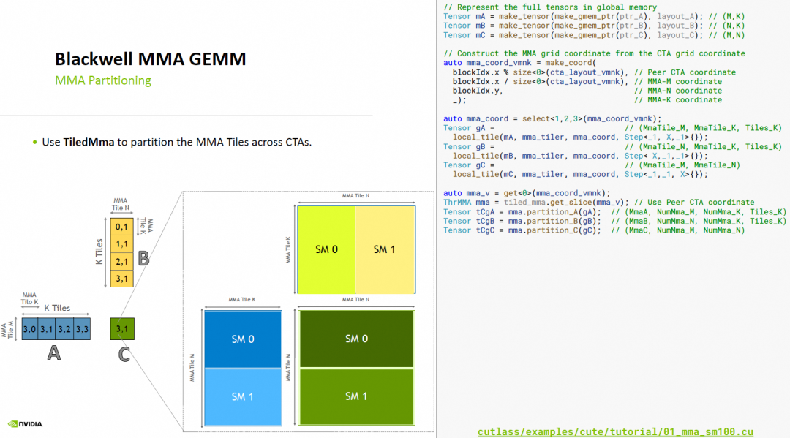

그다음 SMEM을 allocate하고 SMEM Tensor를 생성한다.

```c++
struct SharedStorage
{
  alignas(128) cute::ArrayEngine<TypeA, cute::cosize_v<ASmemLayout>> A;
alignas(128) cute::ArrayEngine<TypeB, cute::cosize_v<BSmemLayout>> B;

alignas(16) cute::uint64_t mma_barrier;  // Barrier to track MMA computation on SMEM

CUTE_DEVICE constexpr auto tensor_sA() { return make_tensor(make_smem_ptr(A.begin()), ASmemLayout{}); }
CUTE_DEVICE constexpr auto tensor_sB() { return make_tensor(make_smem_ptr(B.begin()), BSmemLayout{}); }
};

// Allocate SMEM
extern __shared__ char shared_memory[];
  SharedStorage& shared_storage = *reinterpret_cast<SharedStorage*>(shared_memory);

// Represent the SMEM buffers for A and B
  Tensor tCsA = shared_storage.tensor_sA();         // (MmaA, NumMma_M, NumMma_K, Tiles_K)
  Tensor tCsB = shared_storage.tensor_sB();         // (MmaB, NumMma_M, NumMma_K, Tiles_K)
```

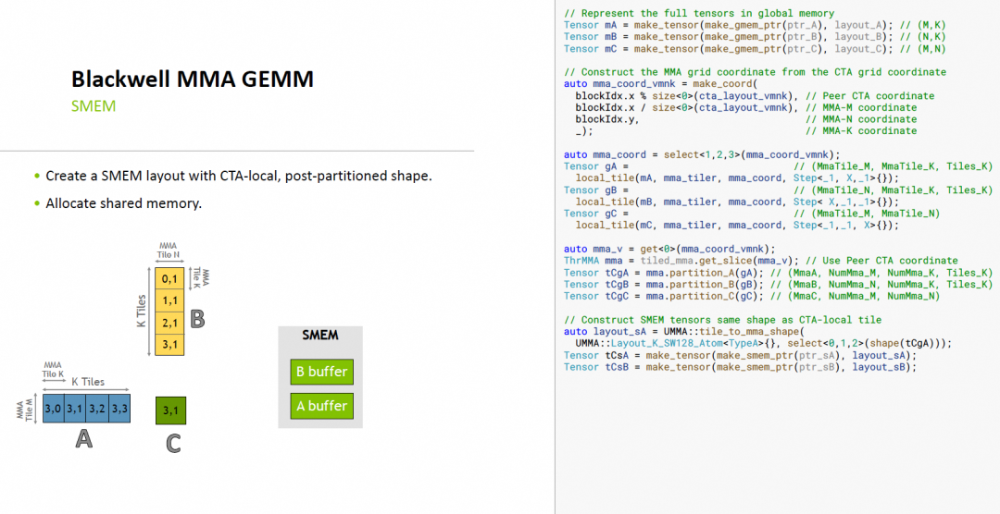

그다음 MMA Fragments를 생성한다.

```c++
  // MMA Fragment Allocation
// We allocate "fragments" which are SMEM descriptors that serve as inputs to cute::gemm operations.
// For tcgen05.mma operations:
// - Matrices A and B are sourced from SMEM
// - tCrA and tCrB provide descriptor views of tCsA and tCsB respectively
// - The first mode of each descriptor represents the SMEM for a single MMA operation
  Tensor tCrA = cta_mma.make_fragment_A(tCsA);      // (MmaA, NumMma_M, NumMma_K, Tiles_K)
  Tensor tCrB = cta_mma.make_fragment_B(tCsB);      // (MmaB, NumMma_M, NumMma_K, Tiles_K)

// TMEM Allocation
// On SM100 architecture, accumulators are stored exclusively in tensor memory (TMEM).
// ThrMma's make_fragment_C() creates a TMEM tensor with the appropriate layout for the accumulator.
  Tensor tCtAcc = cta_mma.make_fragment_C(tCgC);    // (MmaC, NumMma_M, NumMma_N)
```

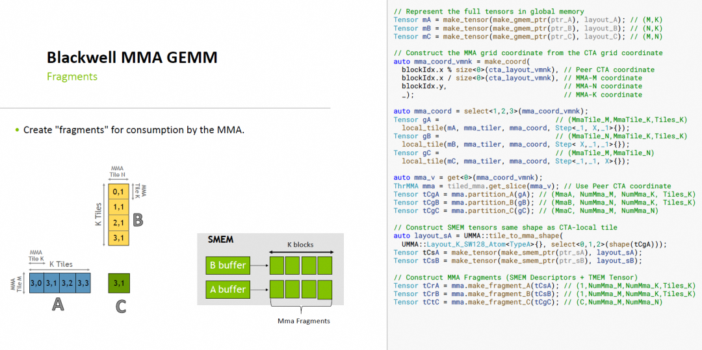

주의할 점은 Blackwell에서 async execution이 SMEM mbarrier 기반이라는 것이다. 다음과 같이 생성한다:

```c++
  // Barrier Initialization
uint32_t elect_one_thr  = cute::elect_one_sync();
uint32_t elect_one_warp = (threadIdx.x / 32 == 0);

// Barriers in SMEM initialized by a single thread.
if (elect_one_warp && elect_one_thr) {
    cute::initialize_barrier(shared_storage.mma_barrier, /* num_ctas */1);
  }
int mma_barrier_phase_bit = 0;  // Each barrier has an associated phase_bit.
  __syncthreads();                // Make sure all threads observe barrier initialization.
```

마지막으로 전체 two-level loop는 k\_tile과 k\_block 기반이다.

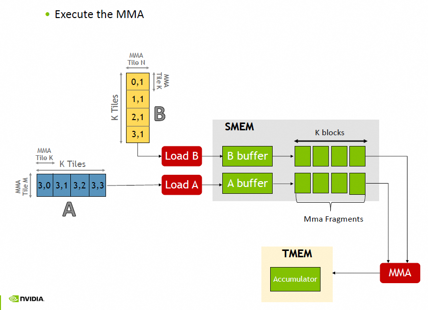

```c++
 // Execute a MmaTile_M x MmaTile_N x GEMM_K GEMM
for (int k_tile = 0; k_tile < size<3>(tCgA); ++k_tile)
  {
    // Step 2a: Load A and B tiles

    // Using auto-vectorized copy operation:
    // - Utilizes 128 threads for parallel data transfer
    // - Copy operations are distributed efficiently across all threads
    // - CuTe can automatically determine optimal vector width
    cooperative_copy<128>(threadIdx.x, tCgA(_,_,_,k_tile), tCsA); // Load MmaTile_M x MmaTile_K A tile
    cooperative_copy<128>(threadIdx.x, tCgB(_,_,_,k_tile), tCsB); // Load MmaTile_N x MmaTile_K B tile

    // Step 2b: Execute the MMAs for this tile

    // Wait for loads to SMEM to complete with __syncthreads()
    __syncthreads();

    // tcgen05.mma instructions require single-thread execution:
    // - Only one warp performs the MMA-related loop operations
    // - CuTe operations internally manage the single-thread execution of tcgen05.mma and tcgen05.cp
    // - No explicit elect_one_sync region is needed from the user
    if (elect_one_warp) {
      // Execute a MmaTile_M x MmaTile_N x MmaTile_K GEMM
      for (int k_block = 0; k_block < size<2>(tCrA); ++k_block) {
        gemm(tiled_mma, tCrA(_,_,k_block), tCrB(_,_,k_block), tCtAcc);
        tiled_mma.accumulate_ = UMMA::ScaleOut::One;
      }
      // Ensure MMAs are completed, only then we can reuse the A and B SMEM.
      cutlass::arch::umma_arrive(&shared_storage.mma_barrier);
    }
    // Wait MMAs to complete to avoid overwriting the A and B SMEM.
    cute::wait_barrier(shared_storage.mma_barrier, mma_barrier_phase_bit);
    mma_barrier_phase_bit ^= 1;
  }
```

마지막으로 epilogue를 execution한다. TMEM에서 copy해 나오고 axpby 등을 실행한다.

```c++
  // Step 3: The Epilogue.

// Create the tiled copy operation for the accumulator (TMEM -> RMEM)
  TiledCopy tiled_t2r_copy = make_tmem_copy(SM100_TMEM_LOAD_32dp32b1x{}, tCtAcc);
  ThrCopy   thr_t2r_copy   = tiled_t2r_copy.get_slice(threadIdx.x);

  Tensor tDgC = thr_t2r_copy.partition_D(tCgC);                   // (CpyD, NumCpy_M, NumCpy_N)
  Tensor tDrC = make_fragment_like(tDgC);                         // (CpyD, NumCpy_M, NumCpy_N)
// Load C tensor GMEM -> RMEM
  copy(tDgC, tDrC);

  Tensor tDtAcc = thr_t2r_copy.partition_S(tCtAcc);               // (CpyS, NumCpy_M, NumCpy_N)
  Tensor tDgD   = thr_t2r_copy.partition_D(tCgD);                 // (CpyD, NumCpy_M, NumCpy_N)
using AccType = typenamedecltype(tCtAcc)::value_type;
  Tensor tDrAcc = make_tensor<AccType>(shape(tDgD));              // (CpyD, NumCpy_M, NumCpy_N)
// Load TMEM -> RMEM
  copy(tiled_t2r_copy, tDtAcc, tDrAcc);

// AXPBY RMEM -> RMEM: tDrC = alpha * tDrAcc + beta * tDrC
  axpby(alpha, tDrAcc, beta, tDrC);
// Store RMEM -> GMEM
  copy(tDrC, tDgD);
```

### 2.2 TMA based GEMM

- 주: 이 example에 대응하는 source code는 /examples/cute/tutorial/blackwell/02\_mma\_tma\_sm100.cu 이다.

주요 수정은 basic gemm을 기반으로 TMA를 사용해 Tensor를 SMEM으로 load하는 것이다. 물론 먼저 TMA descriptor를 생성해야 한다. 이는 Hopper와 동일하므로 TMA Load Op를 재사용한다.

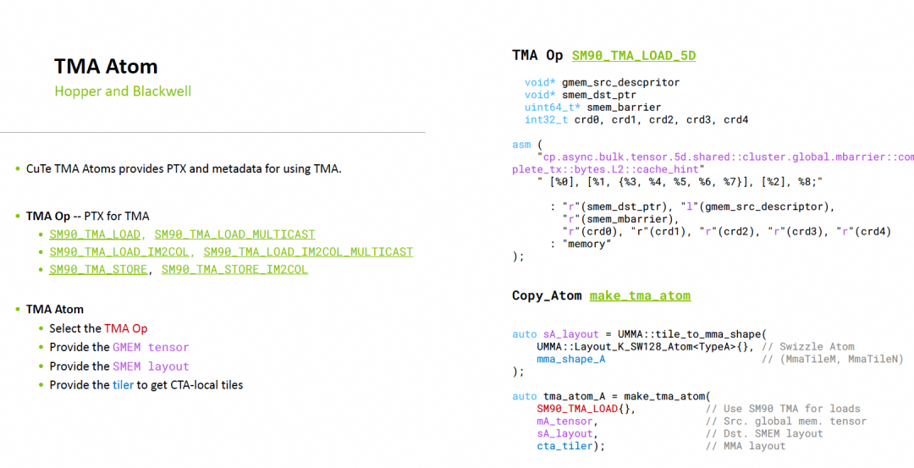

```c++
  // Create TMA descriptors for A and B matrices
  Copy_Atom tma_atom_A = make_tma_atom(
    SM90_TMA_LOAD{},        // TMA Load Op
    mA,                     // Source GMEM tensor
    sA_layout,              // Destination SMEM layout
    select<0,2>(mma_tiler)  // MK Tiler for TMA operation
  );
  Tensor mA_tma = tma_atom_A.get_tma_tensor(shape(mA));

  Copy_Atom tma_atom_B = make_tma_atom(
      SM90_TMA_LOAD{},        // TMA Load Op
      mB,                     // Source GMEM tensor
      sB_layout,              // Destination SMEM layout
      select<1,2>(mma_tiler)  // NK Tiler for TMA operation
    );
  Tensor mB_tma = tma_atom_B.get_tma_tensor(shape(mB));   // (Gemm_N, Gemm_K)
```

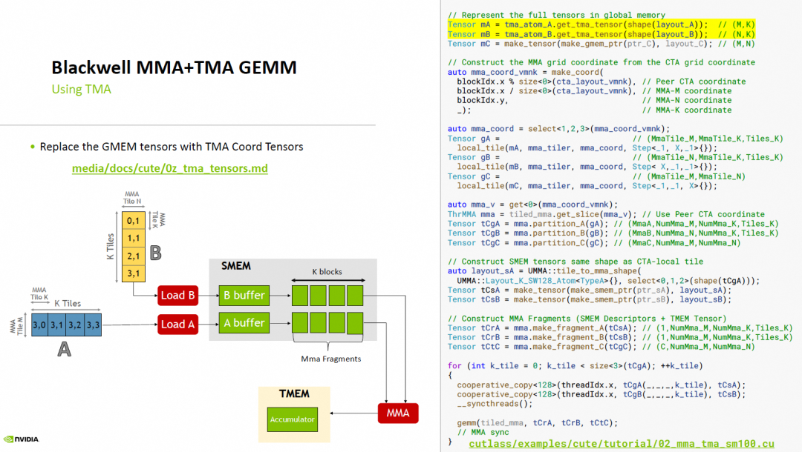

TMA partition의 definition은 다음과 같다:

```c++
  auto [tAgA, tAsA] = tma_partition(tma_atom_A,
                                    Int<0>{}, Layout<_1>{},
                                    group_modes<0,3>(tCsA), group_modes<0,3>(tCgA));

  auto [tBgB, tBsB] = tma_partition(tma_atom_B,
                                    Int<0>{}, Layout<_1>{},
                                    group_modes<0,3>(tCsB), group_modes<0,3>(tCgB));

  // Calculate total bytes that TMA will transfer each tile to track completion
  int tma_transaction_bytes = sizeof(make_tensor_like(tAsA))
                            + sizeof(make_tensor_like(tBsB));
```

그다음 TMA 관련 mbarrier가 하나 추가된다.

```c++
  int tma_barrier_phase_bit = 0;  // Each barrier has an associated phase_bit.
```

그다음 k\_tile loop 안에서 TMA LOAD를 사용한다.

```c++
  // Execute a MmaTile_M x MmaTile_N x GEMM_K GEMM
for (int k_tile = 0; k_tile < size<3>(tCgA); ++k_tile)
  {
    // Step 2a: Load A and B tiles

    // TMA Load Operations:
    // - Execute asynchronous TMA loads with single thread
    // - Set transaction bytes and execute with barrier
    if (elect_one_warp && elect_one_thr) {
      cute::set_barrier_transaction_bytes(shared_storage.tma_barrier, tma_transaction_bytes);
      copy(tma_atom_A.with(shared_storage.tma_barrier), tAgA(_,k_tile), tAsA); // Load MmaTile_M x MmaTile_K A tile
      copy(tma_atom_B.with(shared_storage.tma_barrier), tBgB(_,k_tile), tBsB); // Load MmaTile_N x MmaTile_K B tile

      // Step 2b: Execute the MMAs for this tile

    // Wait for TMA loads to SMEM to complete
    cute::wait_barrier(shared_storage.tma_barrier, tma_barrier_phase_bit);
    tma_barrier_phase_bit ^= 1;
    }
```

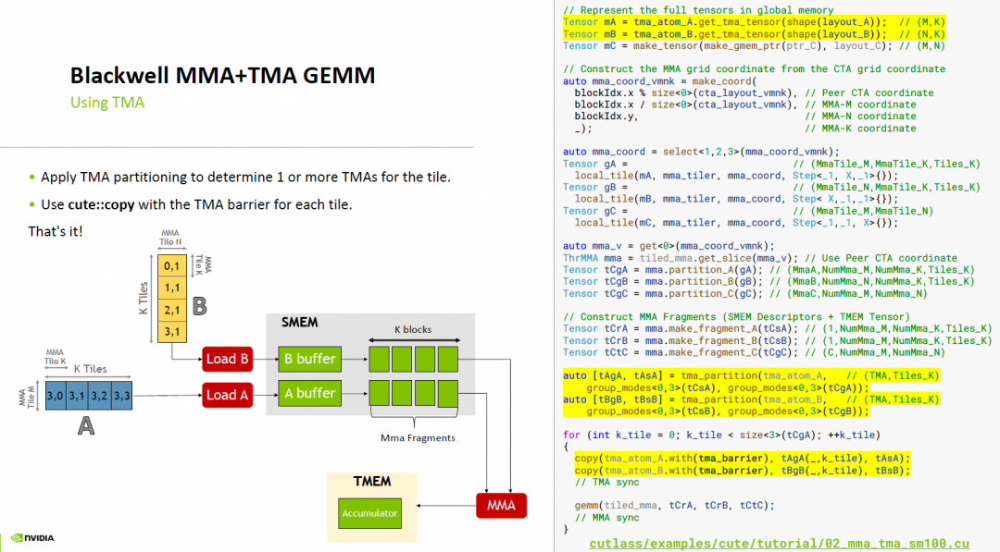

### 2.3 MMA.2SM + TMA.2SM

Blackwell은 두 CTA가 동시에 MMA instruction을 execute하는 것을 지원한다. MMA Op는 cta\_group::2로 수정되고, ThrID = Layout<\_2>가 된다.

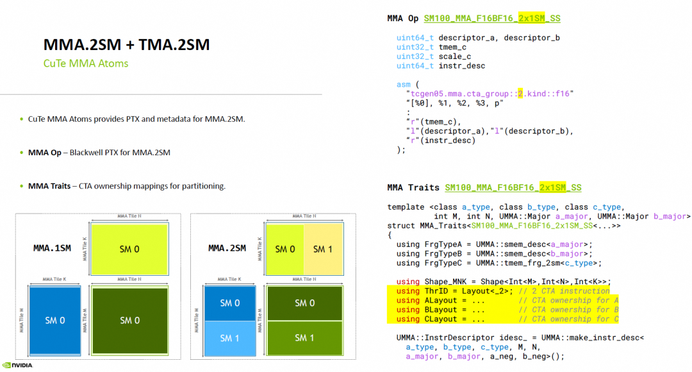

그다음 data load에서는 TMA\_Multicast를 사용해 여러 SM으로 load하는 것을 지원해야 한다.

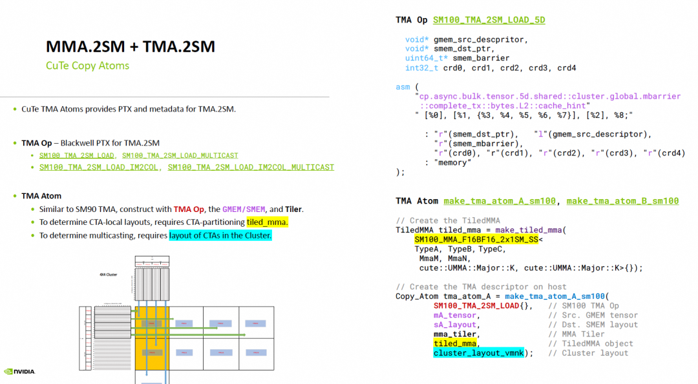

multicast tma load에 대해서는 /examples/cute/tutorial/blackwell/03\_mma\_tma\_multicast\_sm100.cu 라는 별도 example이 있으며, mcast\_mask를 생성해 구현한다.

```c++
// TMA Setup
  //
//   These are TMA partitionings, which have a dedicated custom partitioner.
//   In this example, the TMA multicasts the loads across multiple CTAs.
//   Loads of A are multicasted along the N dimension of the cluster_shape_MNK and
//   Loads of B are multicasted along the M dimension of the cluster_shape_MNK.
//      Any multicasting must be in conformance with tma_x constructed with make_tma_atom on host.
//   For A tensor: The group_modes<0,3> transforms the (MmaA, NumMma_M, NumMma_K, Tiles_K)-shaped tensor
//      into ((MmaA, NumMma_M, NumMma_K), Tiles_K). The partitioning only pays attention to mode-0, the MMA Tile MK.
//   For B tensor: The group_modes<0,3> transforms the (MmaB, NumMma_M, NumMma_K, Tiles_K)-shaped tensor
//      into ((MmaB, NumMma_M, NumMma_K), Tiles_K). The partitioning only pays attention to mode-0, the MMA Tile NK.
//   Simply put, the TMA will be responsible for everything in mode-0 with a single call to cute::copy.
//   The tma_partition reorders and offsets mode-0 according to the tma_x atom and the multicast info.

// Each CTA with the same m-coord will load a portion of A
// Each CTA with the same n-coord will load a portion of B
// Multicast behavior for CTA 1,2 in the cluster
//   A multicast            B multicast
//    0  1  2  3             0  1  2  3
// 0  -  -  -  -          0  -  -  X  -
// 1  X  X  X  X          1  -  -  X  -
// 2  -  -  -  -          2  -  -  X  -
// 3  -  -  -  -          3  -  -  X  -
// tma_multicast_mask_A = 0x2222
// tma_multicast_mask_B = 0x0F00
// mma_multicast_mask_C = 0x2F22

// Construct the CTA-in-Cluster coordinate for multicasting
auto cta_in_cluster_coord_vmnk = cluster_layout_vmnk.get_flat_coord(int(cute::block_rank_in_cluster()));

// Project the cluster_layout for tma_A along the N-modes
auto [tAgA, tAsA] = tma_partition(tma_atom_A,
                                    get<2>(cta_in_cluster_coord_vmnk),          // The CTA coordinate along N mode of the cluster
                                    make_layout(size<2>(cluster_layout_vmnk)),  // The CTA layout along N mode of the cluster
                                    group_modes<0,3>(tCsA), group_modes<0,3>(tCgA));

// Project the cluster_layout for tma_B along the M-modes
auto [tBgB, tBsB] = tma_partition(tma_atom_B,
                                    get<1>(cta_in_cluster_coord_vmnk),          // The CTA coordinate along M mode of the cluster
                                    make_layout(size<1>(cluster_layout_vmnk)),  // The CTA layout along M mode of the cluster
                                    group_modes<0,3>(tCsB), group_modes<0,3>(tCgB));

// Project the cluster_layout and cta_coord along the N-mode to determine the multicast mask for A
uint16_t tma_mcast_mask_a = create_tma_multicast_mask<2>(cluster_layout_vmnk, cta_in_cluster_coord_vmnk);
// Project the cluster_layout and cta_coord along the M-mode to determine the multicast mask for B
uint16_t tma_mcast_mask_b = create_tma_multicast_mask<1>(cluster_layout_vmnk, cta_in_cluster_coord_vmnk);
// Project the cluster_layout and cta_coord along the VM + VN-modes to determine the multicast mask for C
uint16_t mma_mcast_mask_c = create_tma_multicast_mask<0,1>(cluster_layout_vmnk, cta_in_cluster_coord_vmnk) |
                              create_tma_multicast_mask<0,2>(cluster_layout_vmnk, cta_in_cluster_coord_vmnk);
```

그다음 load 시 mcast\_mask를 사용한다.

```c++
      cute::set_barrier_transaction_bytes(shared_storage.tma_barrier, tma_transaction_bytes);
      copy(tma_atom_A.with(shared_storage.tma_barrier,tma_mcast_mask_a), tAgA(_,k_tile), tAsA); // Load MmaTile_M x MmaTile_K A tile
      copy(tma_atom_B.with(shared_storage.tma_barrier,tma_mcast_mask_b), tBgB(_,k_tile), tBsB); // Load MmaTile_N x MmaTile_K B tile
```

MMA.2SM+TMA.2SM의 example code는 /examples/cute/tutorial/blackwell/04\_mma\_tma\_2sm\_sm100.cu 에 있으며, 1SM과의 차이는 MMA\_Tiler가 2개 SM용이라는 점이다.

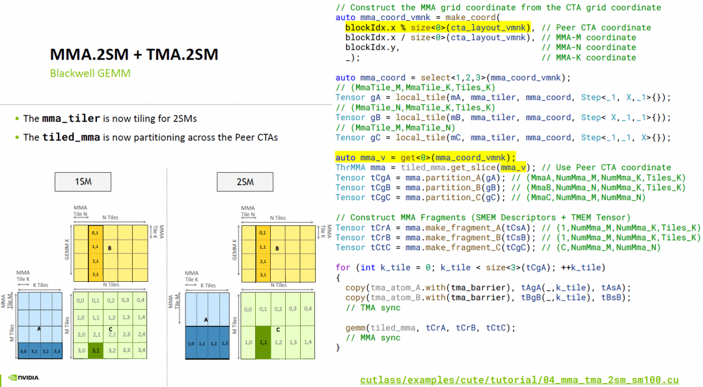

그다음 TMA load 등은 이전과 모두 동일하고, 단지 mma instruction을 issue할 때 leading CTA 하나를 선택해 execute하면 된다.

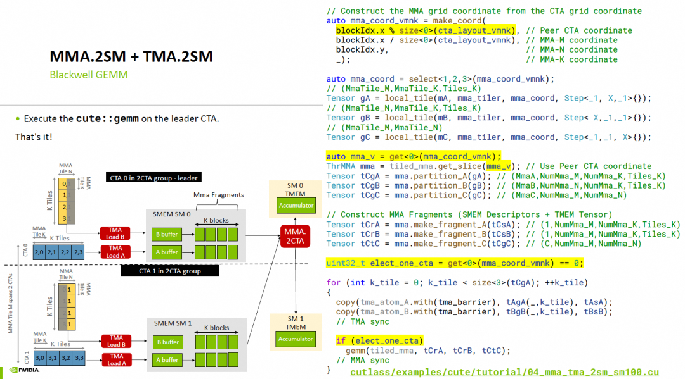

### 2.4 TMEM operation

TMEM은 총 128개 lane이 있고, 각 warp는 32개 lane에 access할 수 있다. memory는 tcgen05.alloc/dealloc으로 관리한다.

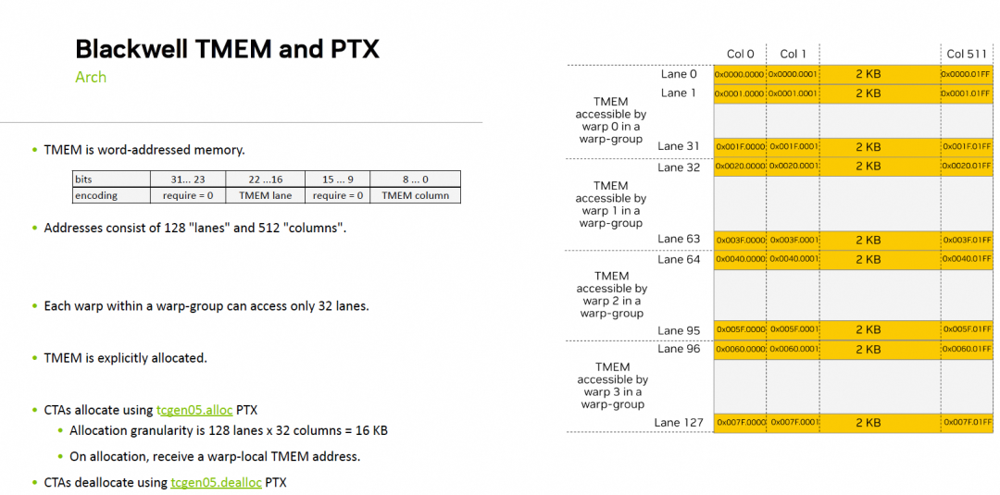

software에서는 tcgen05.load/store/copy를 통해 RMEM/SMEM과 data를 주고받는다.

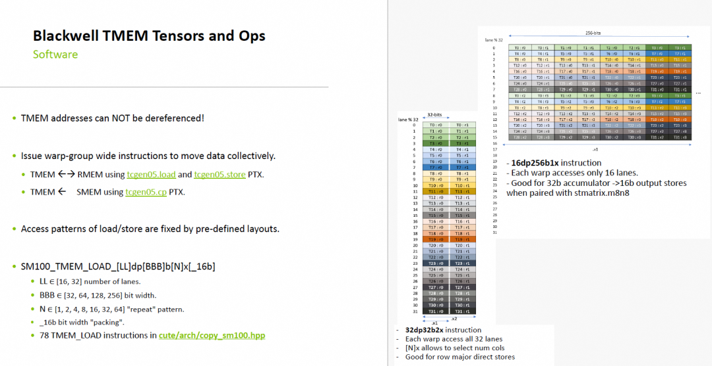

예를 들어 CUDA Core 위의 Epilogue를 execute하려면 TMEM에서 RMEM으로 load해야 하며, 다음과 같다:

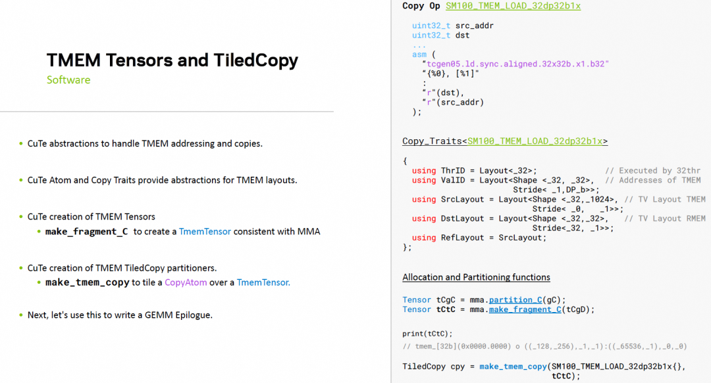

### 2.5 TMEM Epilogue

- 주: code는 /examples/cute/tutorial/blackwell/05\_mma\_tma\_epi\_sm100.cu 에 있다.

TiledMMA definition에 의해 MMA accumulation result는 TMEM에 존재한다.

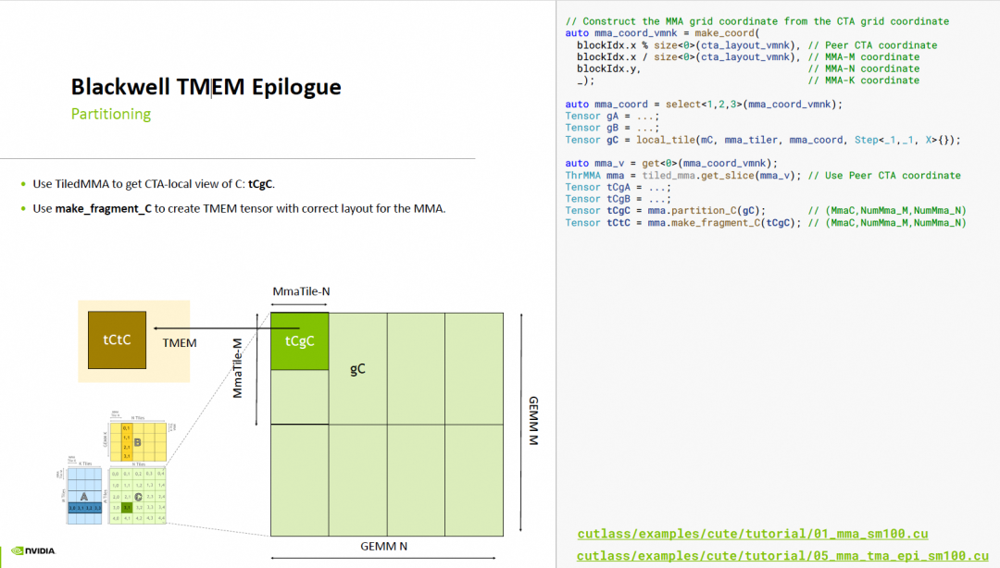

Epilogue stage에서는 TiledCopy를 생성해 TMEM을 RMEM으로 copy한 뒤, axpby류 operation을 execute해야 한다.

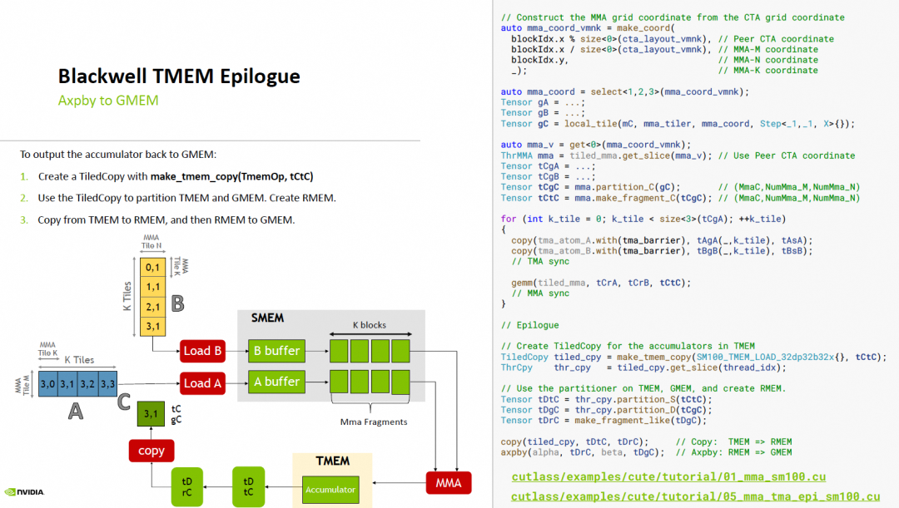

## 3. Cutlass support for Blackwell

여러 Kernel 조합을 지원한다.

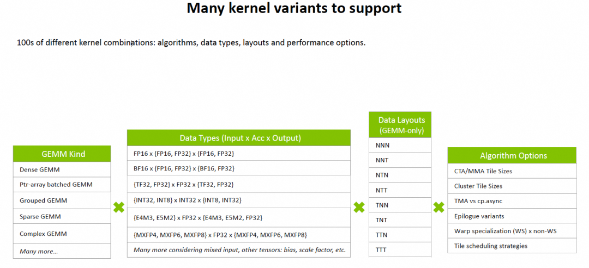

전체 cutlass concept는 다음과 같다. 가장 아래층에는 Op Traits로 구성되는 CuTe Atoms가 있고, 그다음 Tile based Copy와 MMA로 encapsulate된다. 그 위에는 collective layer가 있으며, Collective Layer가 encapsulate되어 Kernel Layer를 구성한다.

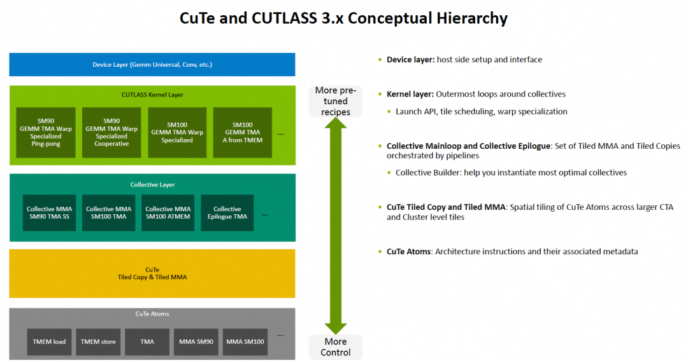

Kernel을 구성하는 방법은 다음과 같다:

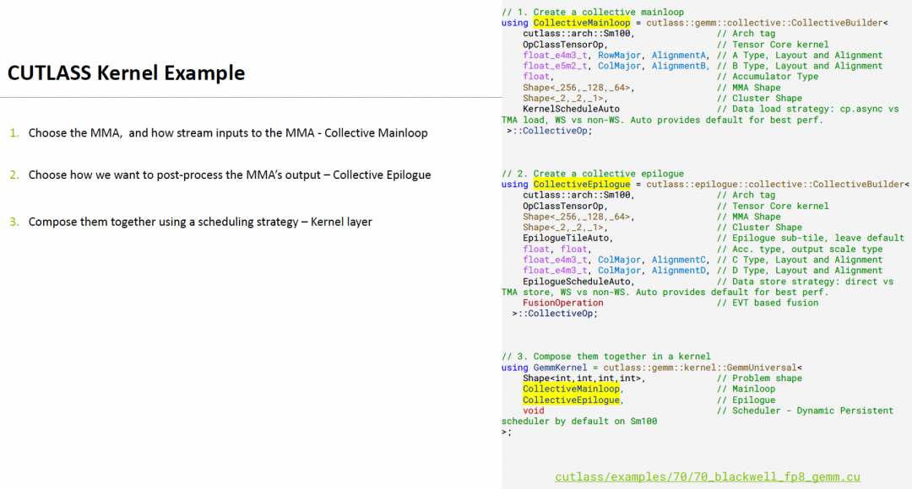

Hopper에서 Blackwell로 migrate할 때는 Arch를 SM100으로 바꾸고, 동시에 TileShape를 CTA에서 MMA로 바꾸기만 하면 된다.

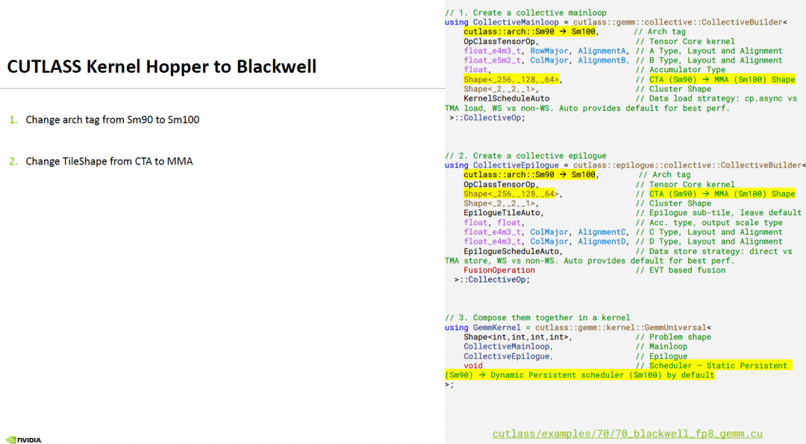

Blackwell을 위해 몇 가지 collective가 추가되었다.

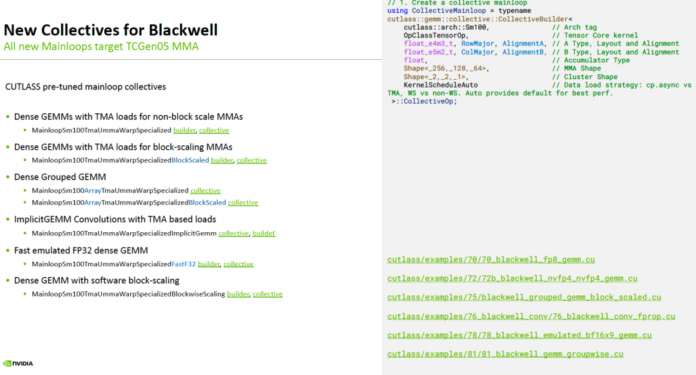

또한 Warp Specialization의 경우 TMEM이 존재하므로 서로 다른 warps에서 execute할 수 있고, Hopper처럼 pingpong할 필요가 없다.

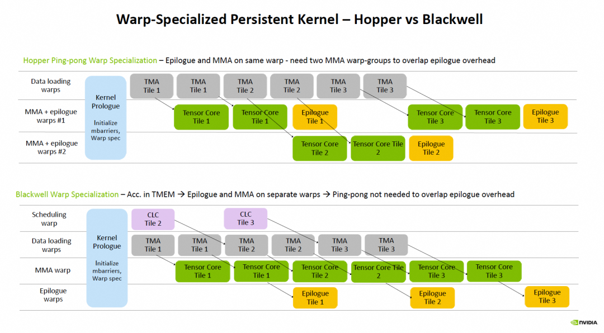

참고 자료

[1]

Programming Blackwell Tensor Cores with CuTe and CUTLASS: *https://register.nvidia.com/flow/nvidia/gtcs25/vap/page/vsessioncatalog/session/1727748479221001aI91*
