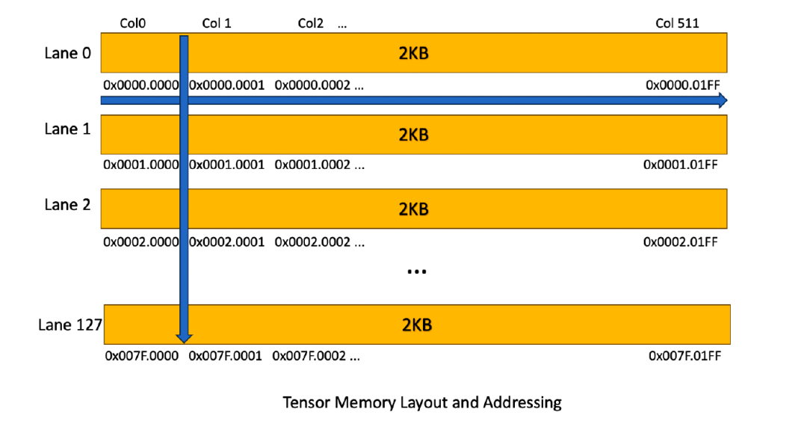
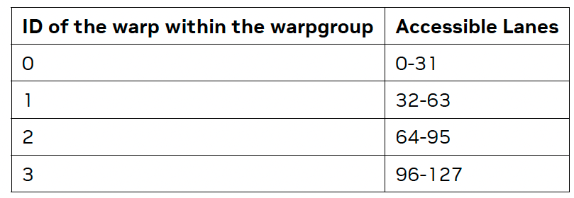
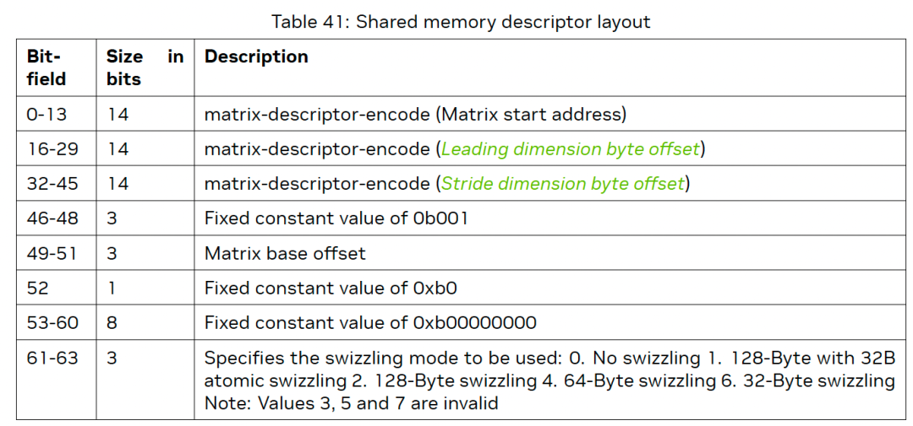
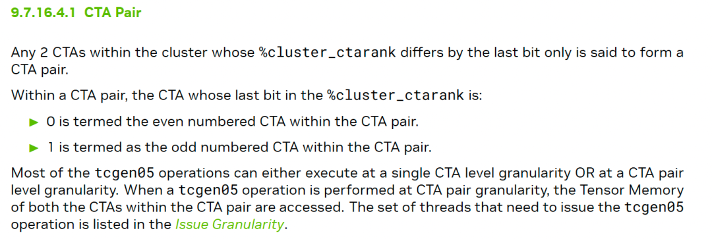
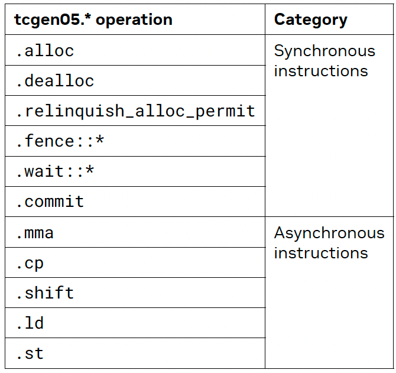
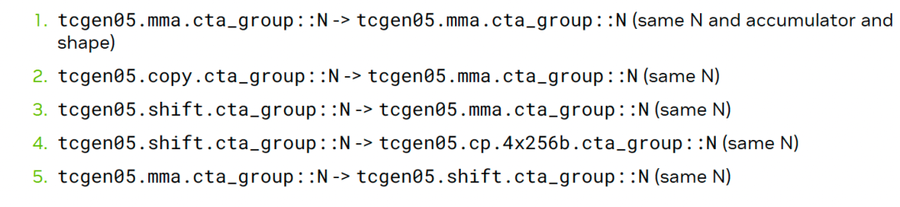
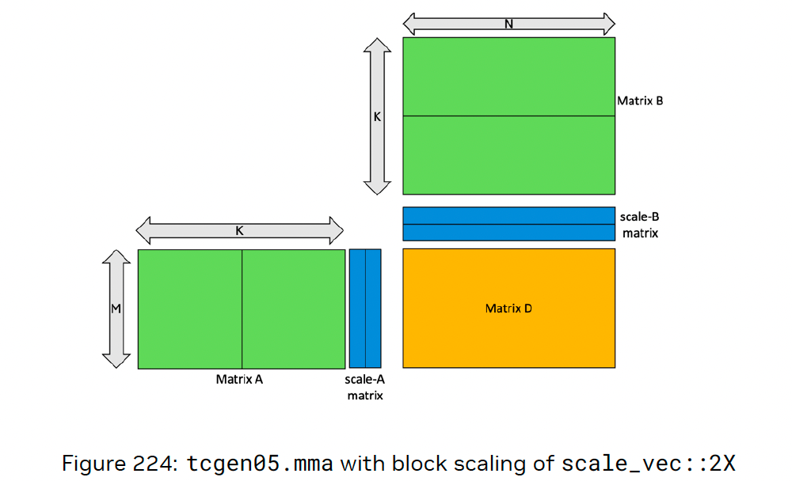
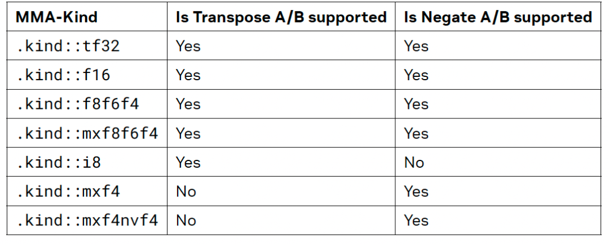
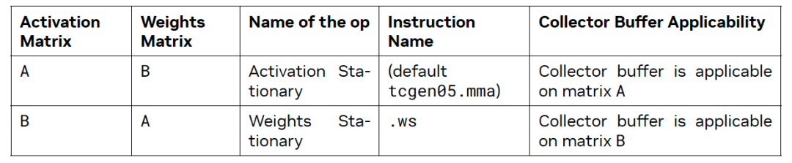
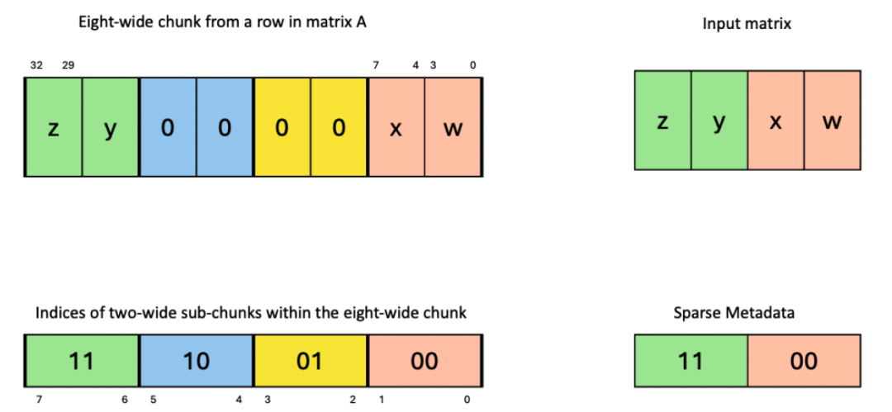

# Tensor-012 Blackwell TensorCore architecture

- 원문 제목: Blackwell TensorCore architecture
- 저자: ZhaB
- 계정: zartbot
- 발행일: 2025년 1월 26일 01:00

어제 Blackwell memory subsystem에 관한 microarchitecture analysis를 조금 썼다.

[《Blackwell microarchitecture에 대한 몇 가지 분석》](https://mp.weixin.qq.com/s?__biz=MzUxNzQ5MTExNw==&mid=2247493041&idx=1&sn=97009afc89e8a031d7bfd63a2cc9a56f&scene=21#wechat_redirect)

오늘은 TensorCore의 변화에 대해 계속 이야기한다. 이전 글에서는 앞선 몇 세대의 TensorCore architecture를 소개한 적이 있다.

[《Tensor-003 TensorCore architecture》](https://mp.weixin.qq.com/s?__biz=MzUxNzQ5MTExNw==&mid=2247491424&idx=1&sn=0fc2110931b27714900e78d73b11a5b5&scene=21#wechat_redirect)

1세대부터 4세대 TensorCore의 data access path는 모두 SMEM과 RF에서 왔다. Blackwell 세대에서는 dedicated TensorMemory가 추가되었다. 이는 2D memory addressing architecture이며, 각 CTA는 512 column과 128 row를 포함하고 각 Cell은 32bit다. address는 32bits Lane<31:16> Column<15:0> 방식을 사용한다. 다만 A와 D matrix만 TMEM에 둘 수 있다.



그다음 Hopper의 WGMMA(SM\_90a--> SM\_100a) 방식을 계속 사용하며, WarpGroup 안에서는 서로 다른 lane에 대한 access가 각각 제한된다.



전체적으로 새로운 Tensor Memory는 각 TensorCore에 2KB x 32, 즉 64KB memory를 추가하며, 동시에 SMEM pressure도 조금 줄어든다. TensorMemory에는 몇 가지 memory management instruction이 추가되었고, 몇 가지 constraint도 있다. 먼저 CTA 안의 단일 warp에서만 allocate할 수 있다. 또한 allocation unit은 32 column이고, 하나의 column이 allocated되면 모든 128 lane도 allocated된다. 보기에는 memory allocation이 여전히 그다지 flexible하지 않다.

그다음 LD/ST instruction의 memory descriptor가 일부 정의되었다. 이는 기존 LDMATRIX instruction에 대한 TMEM용 extension에 해당한다.



MMA operation에는 Zero-Column Mask descriptor가 추가되었다. 이렇게 하면 matrix multiplication에서 0이 많은 matrix에 대해 꽤 많은 computation cost를 절약할 수 있다.

그리고 CTA pair support가 추가되었다.



새로운 5세대 TensorCore의 operator는 다음과 같다:



여기에는 Shift operation이 추가되어 convolution support도 좀 더 편해질 것이다.

async operation에서는 일련의 pipeline을 구성할 수 있다.



FP4와 FP6 update에 대해, 이를 8bit value로 Decompression할 수 있다. TMEM copy instruction은 precision decompression과 multicast capability를 지원하며, 이는 matrix multiplication에 어느 정도 이점이 있다.

```c++
tcgen05.cp.cta_group.shape{.multicast}{.dst_fmt.src_fmt} [taddr], s-desc;
.cta_group = { .cta_group::1, .cta_group::2 }
.src_fmt = { .b6x16_p32 , .b4x16_p64 }
.dst_fmt = { .b8x16 }
.shape = { .128x256b, .4x256b, .128x128b, .64x128b**, .32x128b*** }
.multicast = { .warpx2::02_13** , .warpx2::01_23**, .warpx4*** }
```

MMA instruction에서 operand memory의 definition은 다음과 같다. $D = A * B + D$를 예로 든다.

- A는 MxK matrix이며, TMEM에 둘 수도 있고 SMEM에 둘 수도 있다.
- B는 KxN matrix이며, 현재 CTA의 SMEM 안에 있을 수도 있고 Peer CTA의 SMEM 안에 있을 수도 있다.
- D matrix는 MxN이며, TMEM에 저장된다.

그다음 DeepSeek-v3에는 future hardware의 quantization과 Transpose에 관한 몇 가지 요구가 있는데, 5세대 TensorCore에는 block-scale capability가 추가되었다. 즉,

$(A * scale_A) * (B * scale_B) + D$



동시에 TMEM은 2D structure이므로 Transpose도 좀 더 쉬워 보인다.



그리고 TensorCore 안에는 special collector buffer가 있어 변경되지 않는 matrix는 한 번만 load한다. instruction에서는 activation stationary와 weight stationary로 정의된다.



Sparse matrix multiplication에 대해서도 이것은 파볼 만한 지점일 수 있다. FP32는 1:2, FP16/FP8은 2:4, FP4는 4:8을 지원하므로 flexibility가 꽤 커진다.



Attention이나 MoE에서 activation function을 통해 의도적으로 4:8 representation을 구성할 수 있을까? 잠재적인 model architecture와 compute capability co-optimization 방향일 수 있다.

전체적으로 보면 Blackwell의 TensorCore 변경은 꽤 기대된다. 적어도 Infra 측면에서는 시도해 볼 것이 많다. 하지만 실제 model에 쓰이기까지는 얼마나 걸릴까? Hopper 세대의 가장 큰 문제는 consumer card support가 없어 TMA와 TensorCore의 많은 feature를 일반 사용자가 함께 실험하기 어려웠다는 점이다. 한 세대의 말기에 이르러서야 DeepSeek가 FP8을 점차 사용하기 시작했다. RTX50xx/GB10 같은 platform이 더 많은 developer에게 GEMM kernel debugging과 optimization 공간을 제공해 주기를 기대한다.

물론 PTX 문서를 읽다가 꽤 흥미로운 작은 기능도 발견했지만, 민감한 내용이라 더 말하지는 않겠다.
