# Tensor-013 GPU의 메모리 모델과 상호연결 네트워크 설계 이야기

- 원문 제목: GPU의 메모리 모델과 상호연결 네트워크 설계 이야기
- 저자: ZhaB
- 계정: zartbot
- 발행일: 2025년 4월 13일 11:31

### TL;DR

사실 많은 사람이 ScaleUP과 ScaleOut 버스를 이야기할 때는 네트워크 쪽을 더 많이 이야기하고, GPU Memory Model의 관점은 빠져 있는 경우가 많다. 한편 Jensen Huang이 말한 "먼저 ScaleUP을 하고, 그다음 ScaleOut을 해야 한다"는 말은 사실상 세일즈 화법으로 이해할 수도 있다. 거꾸로 묻자면, 올해 GTC에서 NV가 ScaleOut 쪽으로 내놓을 만한 것이 무엇이 있었는가? IB 스위치는 조용해졌고, 이더넷 스위치와 NIC는 RoCE에서 아직도 많은 문제가 있다. 이것이 실질적인 문제다. 이런 것들을 제쳐 두면, 본질적인 문제는 결국 메모리에 있다.


그래서 오늘은 몇 가지 노트를 정리하면서 Nvidia GPU와 메모리 관련 문제를 처음부터 끝까지 한번 정리해 보려 한다. 마침 GTC25에 "CUDA Techniques to Maximize Memory Bandwidth and Hide Latency"[1]라는 Session이 있었고, GTC24의 "Advanced Performance Optimization in CUDA"[2]라는 Session도 찾았다.

여기에 Blackwell Tensor Memory 도입으로 생긴 메모리 모델 변화와 Tile based IR 등 일련의 요인을 함께 묶어 분석해 보겠다. 때마침 Huawei UB가 발표되었고 UALink 1.0 표준도 발표되었으니, 마지막에는 ScaleOut과 ScaleUP의 메모리 모델 요구사항도 이야기해 보려 한다. 덤으로 eRDMA가 multipath에서 메모리 모델을 어떻게 구현하는지, 그리고 표준 RC 및 AWS SRD와 어떻게 다른지도 이야기한다.

또 GTC25의 이 session에는 매우 가치 있는 두 가지 주제, 즉 low latency Cluster synchronization과 memory bandwidth를 최대화하는 방법이 있었다. 이것들도 함께 소개한다. 이 글의 구조는 다음과 같다:

```c++
1. 메모리 일관성 모델
1.1 기본 예제에서 출발하기
1.2 Sequential consistency
1.3 Total Store Order
1.4 Relaxed Consistency
1.5 Cache consistency와 Memory Model의 차이

2. Nvidia GPU Memory Model
2.1 Single Thread
2.2 Multi-Thread
2.2.1 Sequential consistency(SC)
2.2.2 Acquire
2.2.3 Release
2.2.4 Relaxed
2.2.5 Scope
2.3 Async Thread
2.4 Async Proxy

3. memory order를 이용한 low-latency Cluster synchronization 구현
3.1 Thread Block Cluster 프로그래밍
3.2 Cluster low-latency synchronization
3.3 DSMEM 기반 multicast

4. 메모리 bandwidth 최대화
4.1 메모리 계층 구조 되짚어보기
4.2 Little's Law
4.3 parallel optimization 및 asynchronous access

5. LD/ST 명령으로 Cache 제어하기
5.1 LD 명령
5.2 ST 명령

6. ScaleUP과 ScaleOut 네트워크 설계 논의
6.1 메모리 access Size 이야기
6.2 메모리 access latency
6.3 Memory Model
```

## 1. 메모리 일관성 모델

일관성의 근원은 von Neumann architecture에서 말하는 "모든 read operation은 가장 최근에 write된 결과를 반환해야 한다"는 관점에서 나온다. 그러나 distributed system이나 multi-core CPU system에서는 operation latency 등의 요인 때문에 결과의 예측 불가능성이 생긴다.

### 1.1 기본 예제에서 출발하기

UPenn의 Sequential Consistency and TSO tutorial[3]이 꽤 잘 설명하고 있다. SPCL의 Memory Model[4] ppt도 괜찮다. 더 자세한 내용은 아래 책을 읽어 보면 된다.

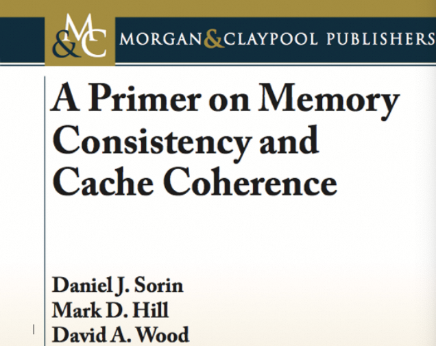

먼저 두 개의 Core가 있는 processor를 보자. 하나는 Producer, 하나는 Consumer 역할을 한다.

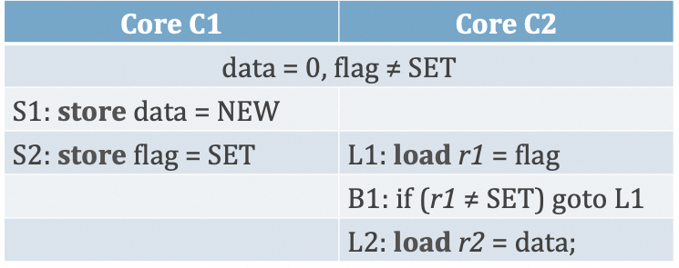

r2가 Core1이 생성한 새로운 데이터를 얻을 수 있을까? 실제 실행 시 예를 들어 Core1의 S1과 S2에 ReOrder가 발생하면, Core2의 L1 때문에 L2가 더 일찍 실행되고, 그 결과 r2는 오래된 데이터를 받게 된다.

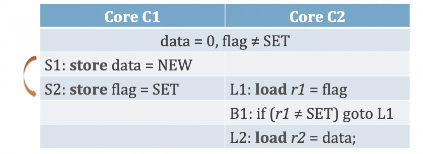

사실 Reorder가 발생하는 경우는 몇 가지로 나눌 수 있다:

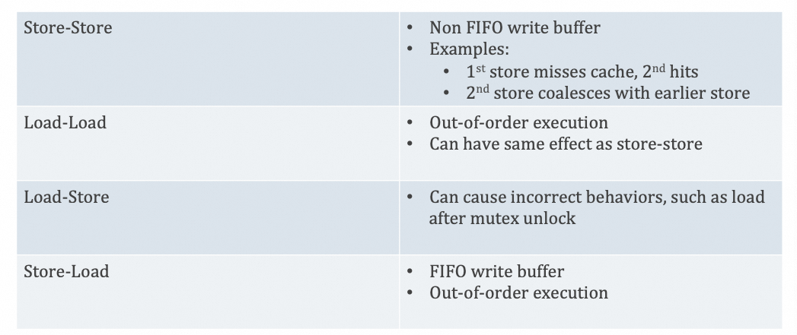

### 1.2 Sequential consistency

가장 직관적인 메모리 일관성 모델은 sequential consistency(Sequential Consistency, SC)다. 최초의 형식적 정의는 Lamport의 논문 "How to Make a Multiprocessor Computer that Correctly Executes Multiprocess Programs. IEEE Transactions on Computers, C-28(9):690-91, Sept. 1979"에서 나왔다. Multi-core processor에서는 본질적으로 MultiCore 실행 시 program execution order(Program Order)가 single-core와 일치하도록 보장해야 한다는 뜻이다.

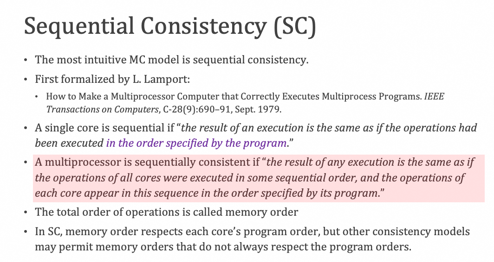

문제의 본질로 돌아가면, 결국 Program Order와 Memory Order가 서로 다른 Load/Store 조합에서 어떤 제약을 갖는가의 문제다. 형식적 정의는 다음과 같다:

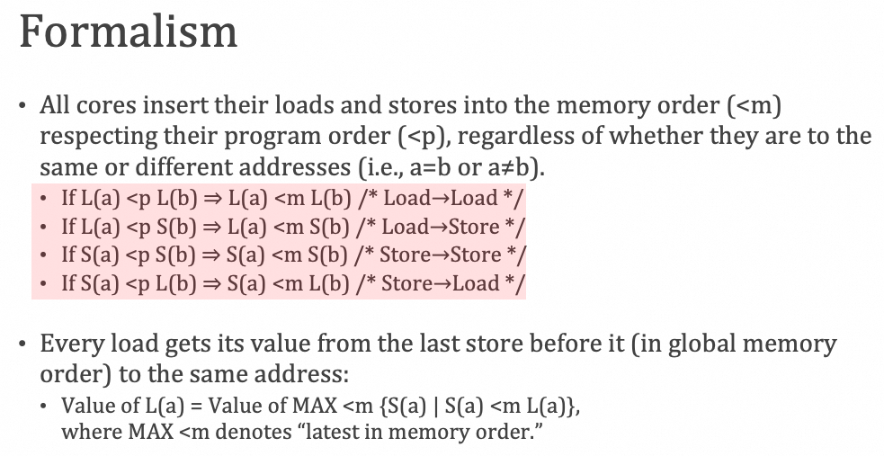

SC를 유지한다는 것의 실질은, single-core로 실행하든지, 아니면 memory access 시 순서가 보장되는 access를 선택하든지 둘 중 하나다.

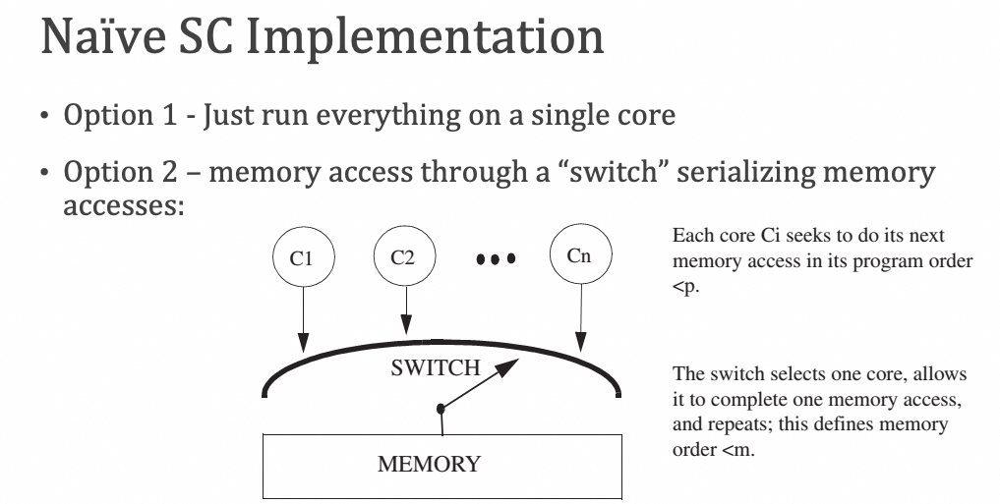

즉 각 time step에서 switch가 실행할 thread를 선택하고, 그 thread의 다음 event를 완전히 실행한다. 이 모델은 sequential consistency의 규칙을 보존하지만, 가장 큰 문제는 재앙적으로 느리다는 점이다. 한 번에 instruction 하나만 실행할 수 있으므로, 여러 thread를 병렬로 실행하는 대부분의 이점을 잃는다.

더 나쁜 점은 각 instruction이 완료될 때까지 기다려야 다음 instruction을 시작할 수 있다는 것이다. 현재 instruction의 효과가 다른 모든 thread에 보이기 전에는 더 많은 instruction을 실행할 수 없다.

### 1.3 Total Store Order

processor 하나의 관점에서 보면, memory write를 직접 기다리면 Store operation이 너무 느려진다. 그래서 보통 latency를 숨기고 stall을 피하기 위해 Store buffer를 설계한다. MultiCore processor에서는 각 core가 독립적인 Store buffer를 가진다.

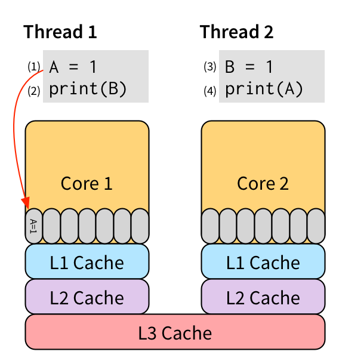

하지만 이런 상황에서는 위 그림처럼 두 Core가 모두 old value를 읽을 가능성이 있다.

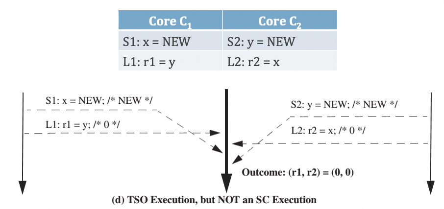

하지만 이런 tradeoff가 가져오는 성능 이득은 매우 크다. 이것이 Total Store Order(TSO)가 등장한 이유다. 형식적 정의로는 Store->Load의 ordering requirement를 포기하고 Store Buffer 설계를 지원하는 것이다.

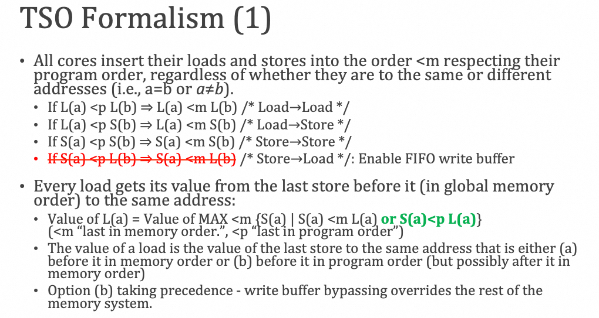

Store->Load 문제는 FENCE로 해결할 수 있다. 사실 FENCE의 구현도 간단하다. 예를 들어 store buffer를 비워 main memory의 Read-Write coherent를 보장하는 방식이다.

### 1.4 Relaxed Consistency

더 나아가 프로그램 실행의 parallelism을 높이기 위해 더 많은 Reorder를 허용할 수 있을까? 그리고 Fence(Memory Barrier)를 통해 program execution order의 correctness를 보장할 수 있을까?

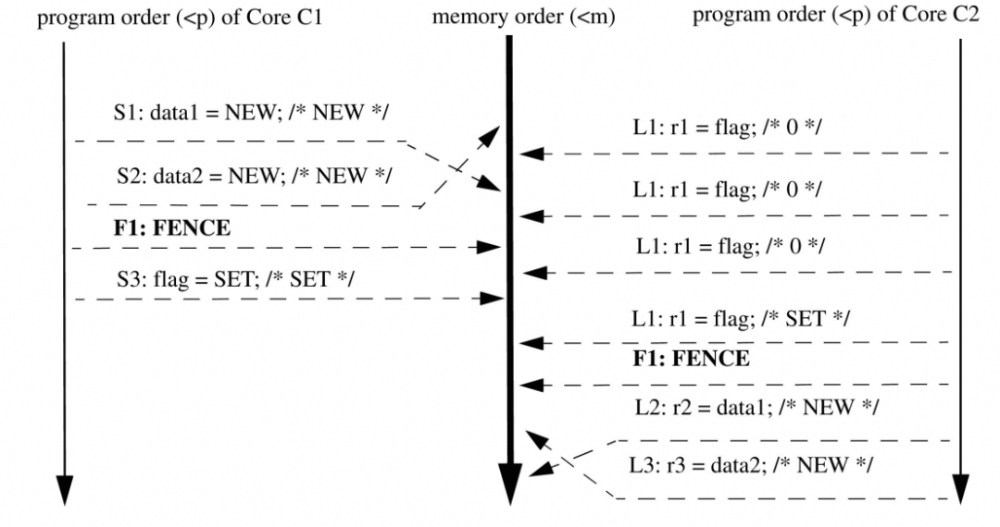

또 산업계에는 Relaxed Consistency에 대한 몇 가지 정의가 있다. 앞서 설명했듯 Total Store Order는 $S\rightarrow L$을 포기한다. Partial Store Order(PSO)는 $S\rightarrow L$과 $S\rightarrow S$ 제약을 포기한다. 일부 Relaxed Memory Order(RMO)는 네 가지 제약을 모두 완전히 포기한다. 사실 많은 processor가 이를 지원하며, GPU 자체도 Relaxed Consistency system이다.

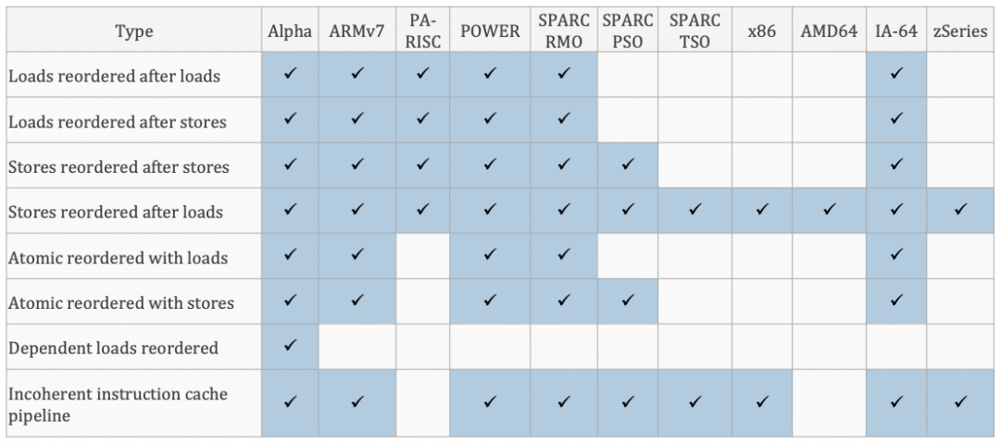

### 1.5 Cache consistency와 Memory Model의 차이

사실 이 부분은 많은 사람이 헷갈리기 쉬운 지점이다. Cache consistency는 주로 Store를 필요에 따라 다른 processor로 전달하여 write가 필요할 때 다른 processor에 보이도록 만드는 mechanism이다. 반면 Memory Model은 operation이 다른 processor로 전달되는 ordering boundary를 정의하는 쪽에 가깝다.

## 2. Nvidia GPU Memory Model

Nvidia GPU의 memory hierarchy는 아래 그림과 같다. 수천 개에 달하는 Cuda Core에서 memory TSO(Total Store Order)를 보장하는 비용은 매우 크다. 따라서 Nvidia GPU에서는 Partial Store Order memory model을 구현했다.


이 문제에 대해서는 architecture마다 미묘한 차이도 있다. 예를 들어 Nvidia 자신이 설명한 memory model의 네 가지 표기 방식이 있다 :)

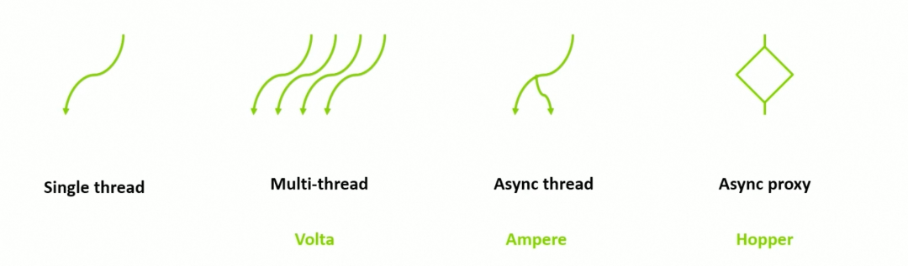

### 2.1 Single Thread

single thread의 경우 동일 주소에 대한 LD/ST는 ordered다. 다음과 같다:

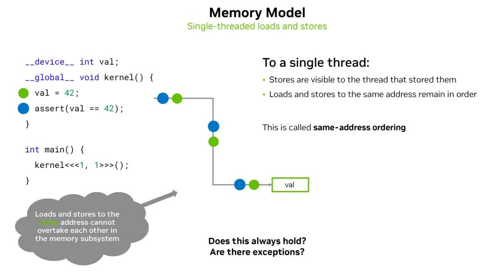

하지만 여기에는 예외가 하나 있다. 먼저 아래 프로그램을 보고 출력 결과를 맞혀 보자. 사실 이 동작은 undefined behavior다.

```c++
#include <iostream>
#include <cuda.h>

__constant__ int val = 1;
__global__ void kernel_constant_sc()
{
int tid = threadIdx.x + blockDim.x * threadIdx.y;
if (tid != 0)
  {
    printf("Thread %d, val %d\n", tid, val); //load val to Const$
  } else {
    //remove constant
    int *mut_val = const_cast<int *>(&val);
    asm volatile("" : "+l"(mut_val));
    //store new value
    *mut_val = 42;
  }
}

int main(int argc, const char *argv[])
{
int n = 2;
if (argc ==2 ) {
    n = strtol(argv[1],NULL,10);
  }
  kernel_constant_sc<<<1, n >>>();
  cudaDeviceSynchronize();
return0;
}
```

이는 SM 내부에 Read-Only Cache가 있고, constant가 이 공간에 들어가기 때문이다. 이 cache는 L2Cache와 독립적인 data path를 가지므로 문제가 생긴다.

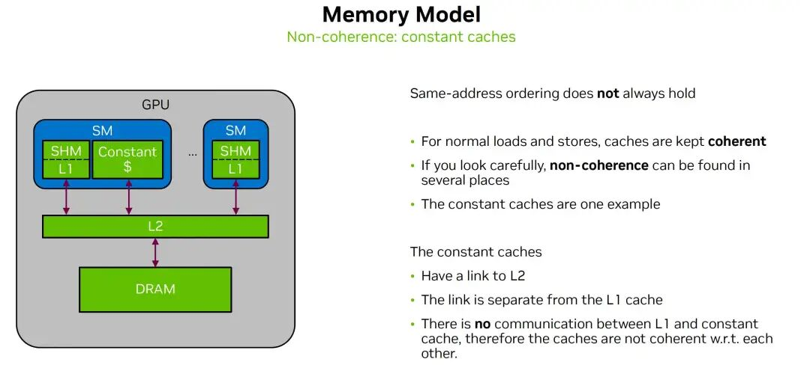

이런 값을 수정하면 undefined behavior가 발생한다.

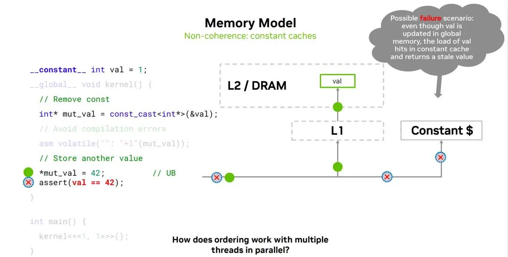

### 2.2 Multi-Thread

다시 한번 되짚어 보자. sequential consistency(SC)는 다음 네 가지 규칙을 보장해야 한다.

$$
1.\ \text{Load} \rightarrow \text{Load}: \text{if } L(a) <_p L(b) \Rightarrow L(a) <_m L(b)
$$

$$
2.\ \text{Load} \rightarrow \text{Store}: \text{if } L(a) <_p S(b) \Rightarrow L(a) <_m S(b)
$$

$$
3.\ \text{Store} \rightarrow \text{Store}: \text{if } S(a) <_p S(b) \Rightarrow S(a) <_m S(b)
$$

$$
4.\ \text{Store} \rightarrow \text{Load}: \text{if } S(a) <_p L(b) \Rightarrow S(a) <_m L(b)
$$

Total Store Order(TSO)는 Store Buffer를 도입하기 위해 네 번째 $Store \rightarrow Load$ 규칙을 포기한다. 그리고 single core 내부에서는 Bypass Load 방식으로 Write Buffer를 읽을 수 있고, core 사이에는 Fence 방식을 도입한다.

하지만 GPU 내부에는 수많은 CudaCore가 있다. 수천 개 core에 대해 memory operation ordering을 보장하려면 instruction parallel execution과 data parallelism 모두에 매우 큰 성능 영향을 준다. 따라서 GPU 안에서 TSO를 유지하는 비용은 매우 크다. 더 적절한 방법은 Relax Order를 지원하고 ATOMIC과 FENCE 방식으로 처리하는 것이다. GPU 안에서 Nvidia는 4가지 mode를 지원한다.

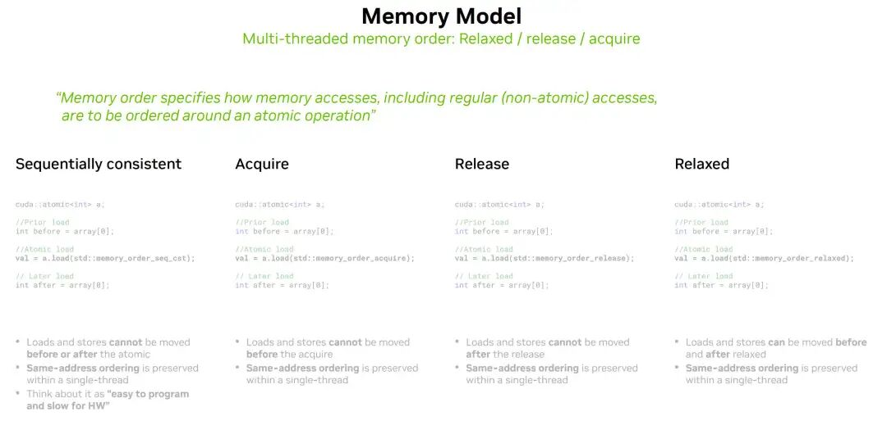

#### 2.2.1 Sequential consistency(SC)

아래 그림처럼 sequential consistency는 LD/ST가 어떤 지정된 operation의 앞뒤로 이동할 수 없도록 요구한다. 이 방식은 프로그래밍은 매우 쉽지만, 성능은 느리다.

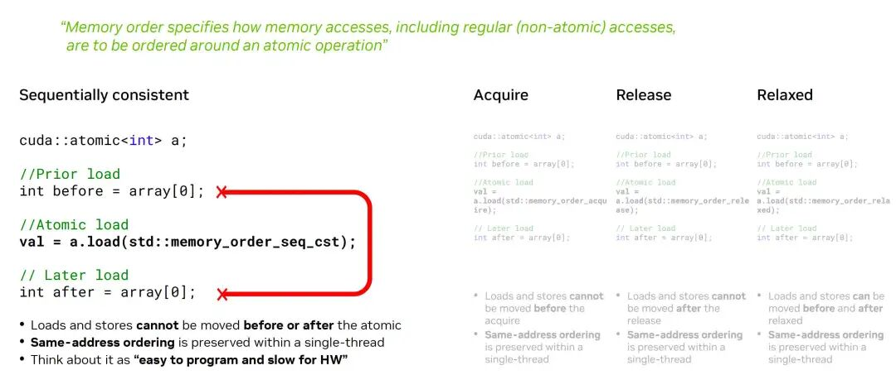

구체적으로 보자. 다음 코드가 생성하는 PTX instruction을 분석해 보겠다.

```c++
__global__ void kernel_seq_constant(int* array)
{
  cuda::atomic<int> a;
int val;
//prior load/store
int before = array[0];
array[0] = 3;
//atomic load
  val = a.load(cuda::std::memory_order_seq_cst);

//Later load
int after = array[0];
printf("before %d, after %d, val %d",before,after,val);
}

int main(int argc, const char *argv[])
{
int *array ;
  cudaMalloc(&array,sizeof(int)*4);

  kernel_seq_constant<<<1, 2>>>(array);
  cudaDeviceSynchronize();
return0;
}
```

PTX instruction에서 `fence.sc.sys`가 Prior load/store가 Atomic 뒤에서 실행되는 것을 막는다는 점을 볼 수 있다. 동시에 atomic load는 `ld.acquire` instruction을 사용해 후속 LD/ST instruction이 이 instruction 앞에서 실행되는 것을 막는다.

```c++
ld.global.u32  %r3, [%rd3];   //before = array[0]
st.global.u32  [%rd3], %r2;  //array[0] =3

// begin inline asm
fence.sc.sys; //후속 LD/ST 명령이 앞당겨 실행되는 것을 막음
// end inline asm

add.u64  %rd1, %SP, 0;
// begin inline asm
ld.acquire.sys.b32 %r1,[%rd1];//acquire는 후속 LD/ST 명령이 앞당겨 실행되는 것을 막음
// end inline asm

ld.global.u32  %r4, [%rd3]; //after = array[0]
```

#### 2.2.2 Acquire

`val = a.load(cuda::std::memory_order_seq_cst)`를 `val = a.load(cuda::std::memory_order_acquire)`로 바꾼 뒤 PTX instruction을 보면 `fence.sc.sys`가 제거된 것을 확인할 수 있다.

```c++
ld.global.u32  %r3, [%rd3];//before = array[0]
st.global.u32  [%rd3], %r2;//array[0] =3

add.u64  %rd1, %SP, 0;
// begin inline asm
ld.acquire.sys.b32 %r1,[%rd1];//acquire는 후속 LD/ST 명령이 앞당겨 실행되는 것을 막음
// end inline asm

ld.global.u32  %r4, [%rd3]; //after = array[0]
```

이때 Atomic Load 이전의 LD/ST instruction은 atomic 이후에 실행될 수 있지만, atomic 이후의 Later Load instruction은 계속 blocked된다.

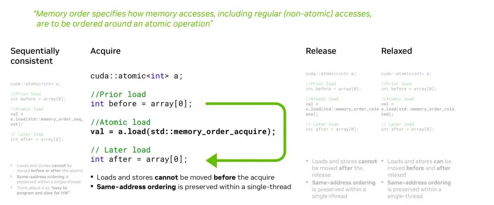

#### 2.2.3 Release

그렇다면 뒤쪽을 block하는 acquire가 있다면, 앞쪽 LD/ST는 block하되 뒤쪽은 block하지 않는 memory model도 있을까? 그것이 Release mode다. 아래와 같다:

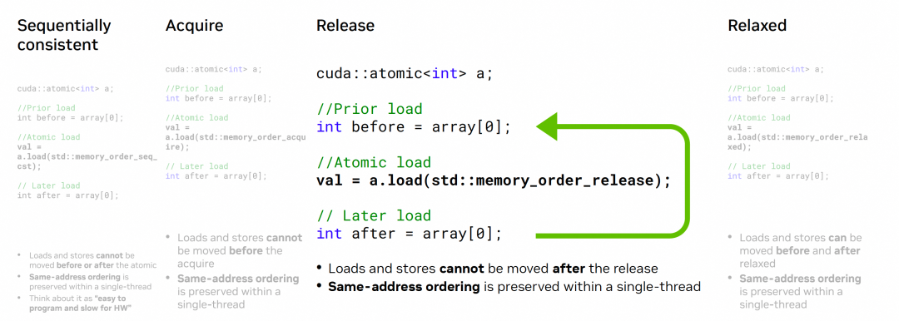

```c++
__global__ void kernel_release(int* array)
{
  cuda::atomic<int> a;
//Prior LD/ST
int before = array[0];
array[0] = 3;
// atomic store.release
  a.store(1, cuda::std::memory_order_release);
//Later Load
int after = array[0];
printf("before %d, after %d",before,after);
}
```

PTX instruction을 보면 `st.release` instruction이 사용된 것을 확인할 수 있다. 이 instruction은 이전 LD/ST를 block할 수 있지만, `Later Load`가 앞당겨 실행되는 것은 허용한다.

```c++
ld.global.u32  %r3, [%rd3]; //before = array[0]
st.global.u32  [%rd3], %r2; //array[0] = 3
mov.u32  %r1, 1;
add.u64  %rd1, %SP, 0;

// begin inline asm
st.release.sys.b32 [%rd1], %r1; //Store.release
// end inline asm

ld.global.u32  %r4, [%rd3]; //Later Load
```

#### 2.2.4 Relaxed

마지막은 가장 느슨한 Relaxed memory model이다. 이 mode에서는 앞뒤의 LD/ST가 모두 out-of-order로 실행될 수 있다.

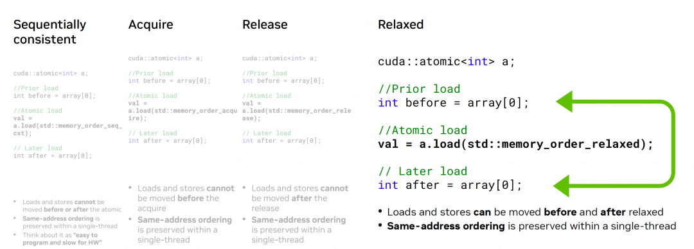

코드는 다음과 같다:

```c++
__global__ void kernel_relaxed(int* array)
{
  cuda::atomic<int> a;
//Prior LD/ST
int before = array[0];
array[0] = 3;

// atomic store.release
  a.store(1, cuda::std::memory_order_relaxed);
//Later Load
int after = array[0];
printf("before %d, after %d",before,after);
}

PTX:

ld.global.u32  %r3, [%rd3]; //before = array[0]
st.global.u32  [%rd3], %r2; //array[0] = 3
mov.u32  %r1, 1;
add.u64  %rd1, %SP, 0;

// begin inline asm
st.relaxed.sys.b32 [%rd1], %r1; //Store.relaxed
// end inline asm

ld.global.u32  %r4, [%rd3];//Later Load
```

#### 2.2.5 Scope

앞서 본 instruction들에는 모두 `.sys` 속성이 있다는 점을 볼 수 있다. 실제로는 사용자의 요구에 따라 서로 다른 범위(scope)를 선택해 처리할 수 있다. CUDA C++ API에서는 다음과 같은 scope를 정의한다.

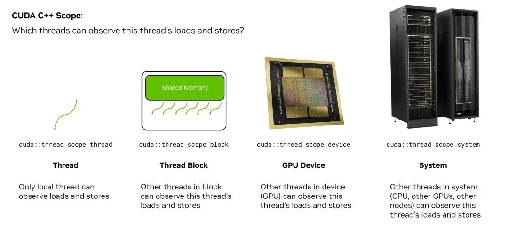

PTX에서의 Scope 정의는 다음과 같다:

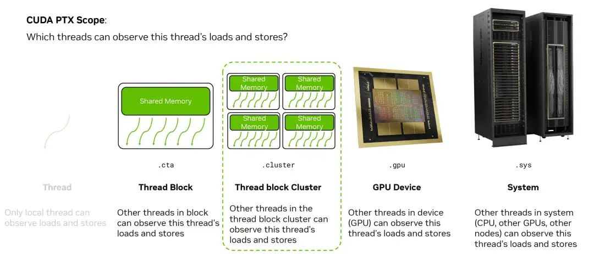

NV GPU의 memory hierarchy를 다시 보면, Block Scope는 SM 내부에서 L1 Cache를 기반으로 consistency를 유지한다.

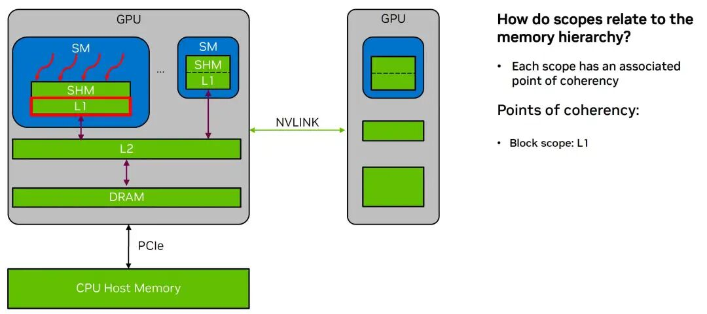

Cluster Scope는 Thread Block Cluster Level이다. hardware 관점에서는 GPC 내부에서 L2Cache를 기반으로 consistency를 유지한다.

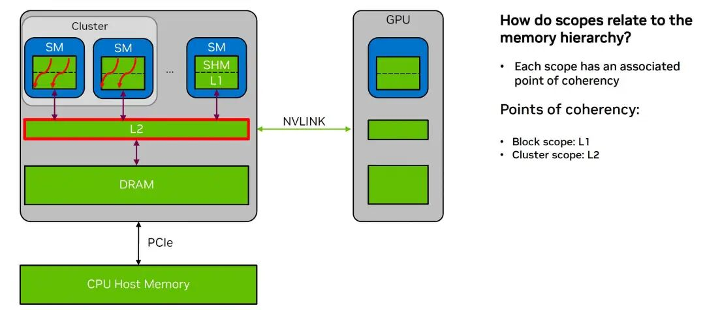

Device Scope는 전체 GPU chip의 모든 SM이 L2를 기반으로 consistency를 유지하는 범위다.

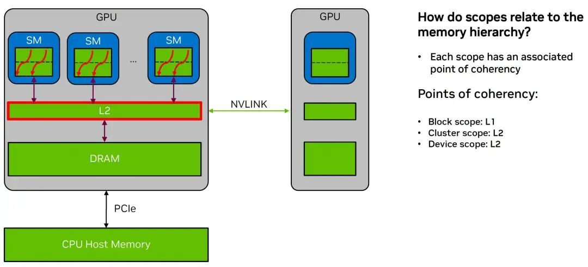

Sys Scope는 전체 system을 포함한다.

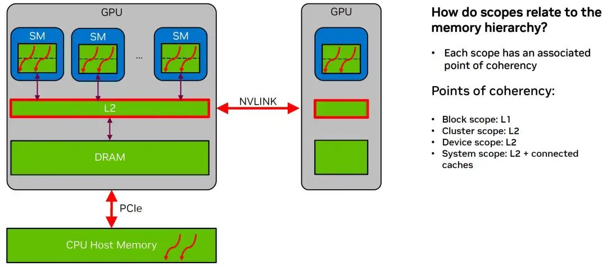

먼저 간단한 `block_scope` 예제를 보자. 코드는 다음과 같다:

```c++
#include <iostream>
#include <cuda.h>
#include <cuda/atomic>

#define CUDAASSERT(condition)                         \
    if (!(condition))                                 \
    {                                                 \
        printf("Assertion %s failed!\n", #condition); \
    }

__device__ void producer(
    cuda::atomic_ref<int, cuda::thread_scope_block> val)
{
    val.store(42, cuda::memory_order_relaxed);
}

__device__ void consumer(
    cuda::atomic_ref<int, cuda::thread_scope_block> val)
{
    volatileint  tmp = -1;
    while (tmp == -1)
    {
        tmp = val.load(cuda::memory_order_relaxed);
    }
    CUDAASSERT(tmp == 42);
}

__global__ void kernel_scope_test(int *array)
{
    if (blockIdx.x == 0)
    {
        producer(array[0]);
    }
    else
    {
        consumer(array[0]);
    }
}

int main(int argc, const char *argv[])
{
    int *array;
    cudaMalloc(&array, sizeof(int) * 4);

    dim3 grid(2, 1);

    kernel_scope_test<<<grid, 1>>>(array);
    cudaDeviceSynchronize();

    return0;
}
```

`cuda::atomic_ref<int, cuda::thread_scope_block> val`로 정의했기 때문에 PTX instruction을 보면 LD/ST relaxed의 scope modifier가 `.cta`로 되어 있다.

```c++
Consumer:
 mov.u64  %rd6, %rd15;
// begin inline asm
 ld.relaxed.cta.b32 %r3,[%rd6];
// end inline asm

Producer:
 mov.u64  %rd12, %rd15;
 mov.u32  %r5, 42;
// begin inline asm
 st.relaxed.cta.b32 [%rd12], %r5;
// end inline asm
```

따라서 실행 결과는 아래 그림과 같다. 다른 block의 LD는 다른 data path 위에 있으므로 blocked되지 않는다.

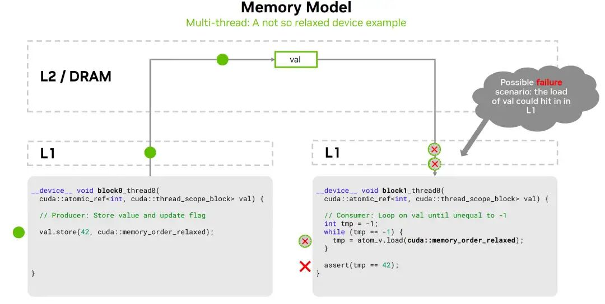

그다음 Scope를 device level로 확장해 보자. 아래와 같이 바꾸면 PTX의 scope가 이미 `.gpu`로 변한 것을 볼 수 있다.

```c++
__device__ void producer(
    cuda::atomic_ref<int, cuda::thread_scope_device> val)
{
    val.store(42, cuda::memory_order_relaxed);
}

__device__ void consumer(
    cuda::atomic_ref<int, cuda::thread_scope_device> val)
{
    int tmp = -1;
    while (tmp == -1)
    {
        tmp = val.load(cuda::memory_order_relaxed);
    }
    CUDAASSERT(tmp == 42);
}
PTX:
Consumer:
 mov.u64  %rd6, %rd15;
// begin inline asm
 ld.relaxed.gpu.b32 %r3,[%rd6];
// end inline asm
 setp.eq.s32  %p2, %r3, -1;
 @%p2 bra  $L__BB0_2;

Producer:
 mov.u64  %rd12, %rd15;
 mov.u32  %r5, 42;
// begin inline asm
 st.relaxed.gpu.b32 [%rd12], %r5;
// end inline asm
```

하지만 프로그램은 Nvidia GTC25의 이 ppt처럼 정상적으로 동작하지 않았다. 왜일까?

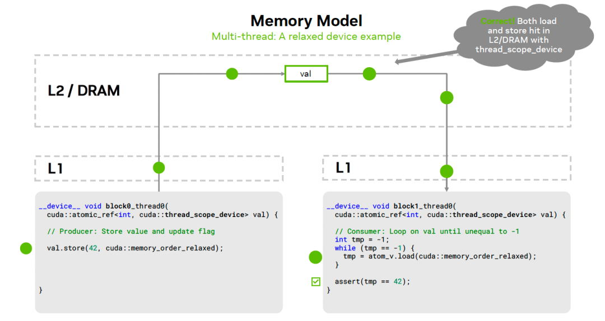

Scope가 전체 GPU라 하더라도, GTC25 발표자에게 typo가 있었을 가능성이 있다. relaxed order 문제다. 물론 이것이 핵심은 아니다. 사실 더 올바른 방식은 flag를 사용하고 release/acquire로 처리하는 것이다.

```c++
#include <iostream>
#include <cuda.h>
#include <cuda/atomic>

#define CUDAASSERT(condition)                         \
    if (!(condition))                                 \
    {                                                 \
        printf("Assertion %s failed!\n", #condition); \
    }

__device__ void producer(
    int &val,
    cuda::atomic_ref<int, cuda::thread_scope_device> flag)
{
    val = 42;
    flag.store(42, cuda::memory_order_relaxed);
}

__device__ void consumer(
    int &val,
    cuda::atomic_ref<int, cuda::thread_scope_device> flag)
{

    while (flag.load(cuda::memory_order_acquire) != -1)
    {
    }
    int tmp = val;
    CUDAASSERT(tmp == 42);
}

__global__ void kernel_scope_test(int *array)
{
    array[0] = 0;
    int flag = -1;
    __syncthreads();

    if (blockIdx.x == 0)
    {
        producer(array[0], flag);
    }
    else
    {
        consumer(array[0], flag);
    }
}

int main(int argc, const char *argv[])
{
    int *array;
    cudaMalloc(&array, sizeof(int) * 4);

    dim3 grid(2, 1);
    kernel_scope_test<<<grid, 1>>>(array);
    cudaDeviceSynchronize();

    cudaFree(&array);
    return0;
}
```

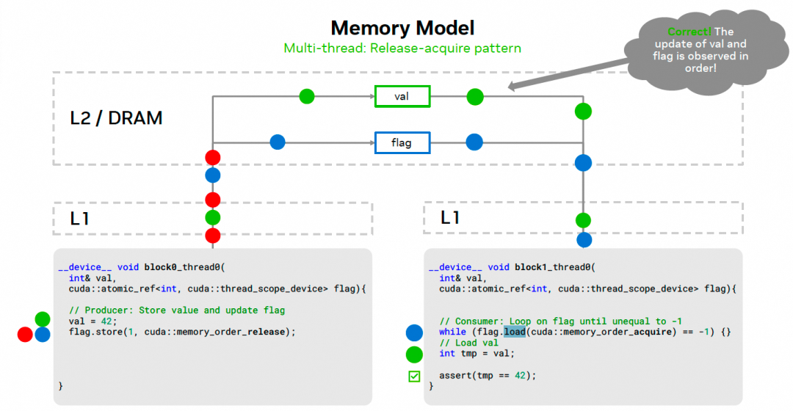

Relaxed와 Acquire-Release의 비교는 다음과 같다. Relaxed는 더 빠르며, 두 thread가 하나의 값만 교환하면 될 때 유용하다. 반면 Release-Acquire는 flush cache가 필요하기 때문에 더 느리지만, 여러 thread가 여러 값을 교환해야 할 때 더 유용하다.

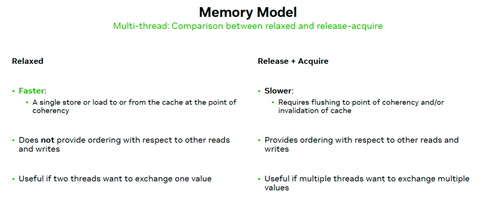

### 2.3 Async Thread

Ampere 세대부터 Async Thread 프로그래밍 능력이 도입되었다. 주로 GMEM에서 SMEM으로 LD하거나 SMEM에서 GMEM으로 ST하는 asynchronous copy mechanism을 구현한 것으로, register와 L1 점유를 피하면서 large data를 처리할 때 throughput도 높인다.

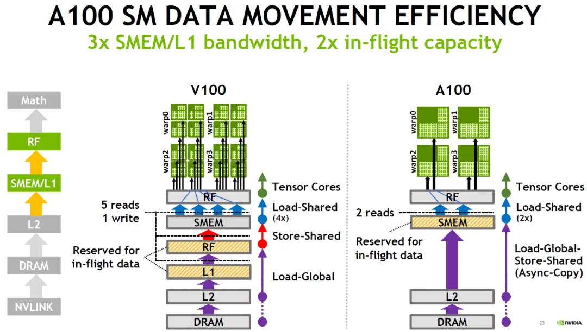

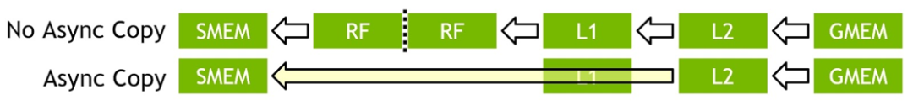

자세한 프로그래밍 구현은 [Tensor-004 TensorCore 프로그래밍 및 최적화](https://mp.weixin.qq.com/s?__biz=MzUxNzQ5MTExNw==&mid=2247491529&idx=1&sn=12902726d6d9a8f9d66405ac6ea42fa7&scene=21#wechat_redirect)의 내용을 참고하면 된다. 이를 통해 data loading과 computation latency를 Overlap할 수 있다. 대략적인 flow는 다음과 같다.

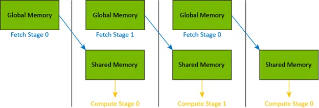

먼저 asynchronous Prefetch를 사용한다.

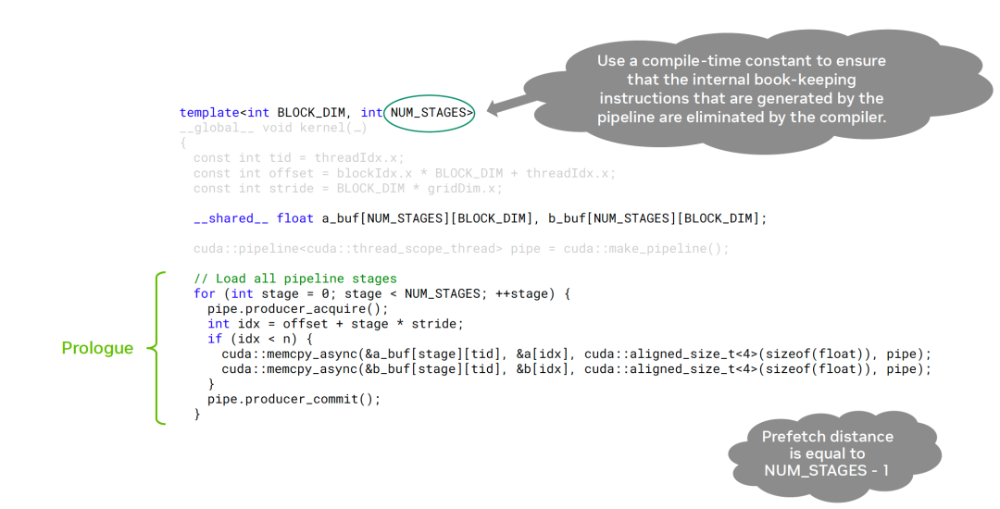

그다음 computation을 실행한다.

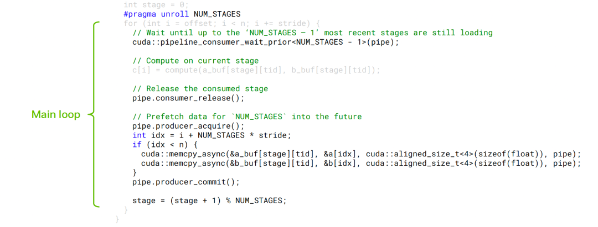

대략적인 computation flow는 다음과 같다. 자세한 코드는 `https://github.com/zartbot/tensorcore_gemm/blob/main/05_pipeline_gmem_to_smem.cu`에서 볼 수 있다.

```c++
Async Copy A-Chunk from GMEM-->SMEM(Buffer_1)
Async Copy B-Chunk from GMEM-->SMEM(Buffer_1)
Wait for Async Copy Completion

for (size_t tile_k = CHUNK_K; tile_k < K_tiles; tile_k += CHUNK_K) {
   Swap Buffer_1/Buffer_2 Offset
   //Buffer-2를 비동기 로드하면서 동시에 Buffer-1을 계산해 Overlap 수행
   Async Copy A-Chunk from GMEM-->SMEM(Buffer_2)
   Async Copy B-Chunk from GMEM-->SMEM(Buffer_2)

   for (size_t k_step = 0; k_step < CHUNK_K; ++k_step){
        for (size_t i = 0; i < WT_COL_MMA_NUM; ++i)
        {
            Load-SMEM(Buffer_1)-to-A_fragment
            for (size_t j = 0; j < WT_ROW_MMA_NUM; ++j)
            {
               Load-SMEM(Buffer_1)-to-B_fragment
                wmma::mma_sync;  //TensorCore를 사용해 계산
            }
        }
    }
    Wait for Async Copy Completion
}
Calculate Last Buffer WarpTile

WMMA-Store-to-SMEM
Store-SMEM->GMEM
```

Hopper에서는 DSMEM 위의 data store를 위해 st.async instruction도 도입했다. 자세한 test code는 3장을 참고하라.

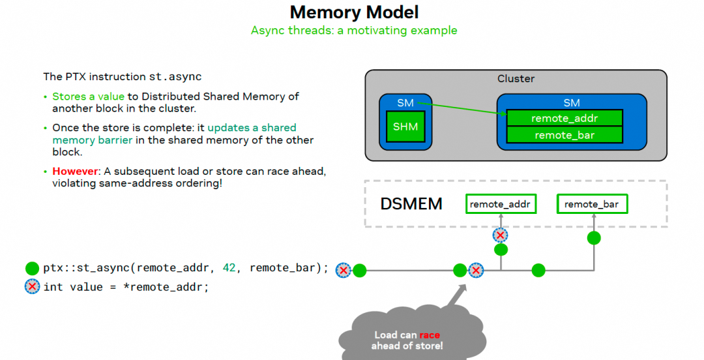

하지만 이런 asynchronous operation은 새로운 문제를 만든다. asynchronous data path가 하나 생기면 Data Race가 발생하므로 각별히 조심해야 한다.

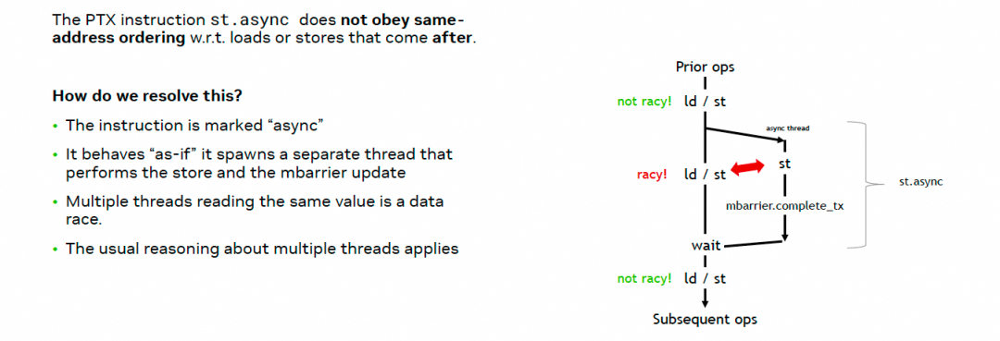

### 2.4 Async Proxy

memory hierarchy 안에는 여러 data path가 존재한다. 특히 Hopper부터 TMA가 도입되었고 Blackwell에는 TensorMemory가 도입되었다. 따라서 서로 다른 data path의 Data Race Condition을 더 잘 관리하고 추상화할 필요가 있다. Hopper부터 Async Proxy가 도입되었고, General Proxy와 Async Proxy를 통해 서로 다른 memory access path를 구분한다.

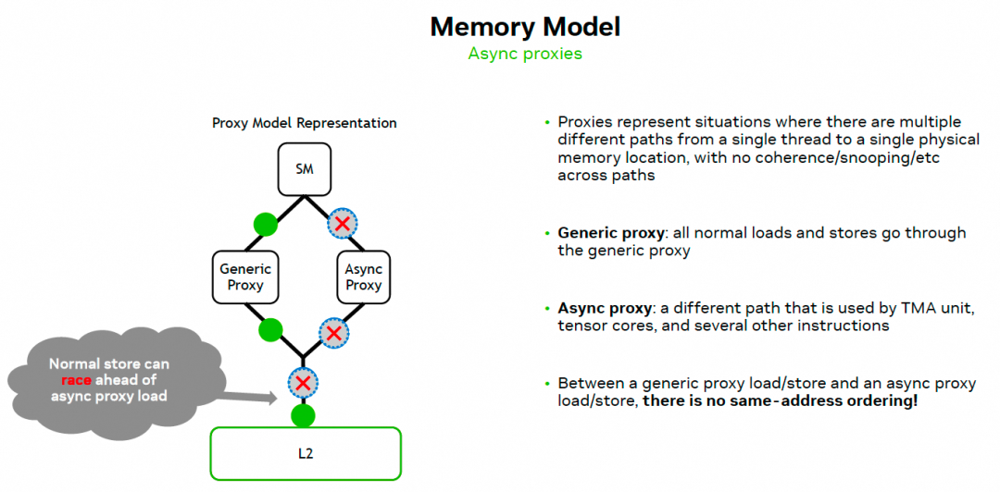

이렇게 구분하면 async proxy의 memory operation에 대해 fence를 수행할 수 있다.

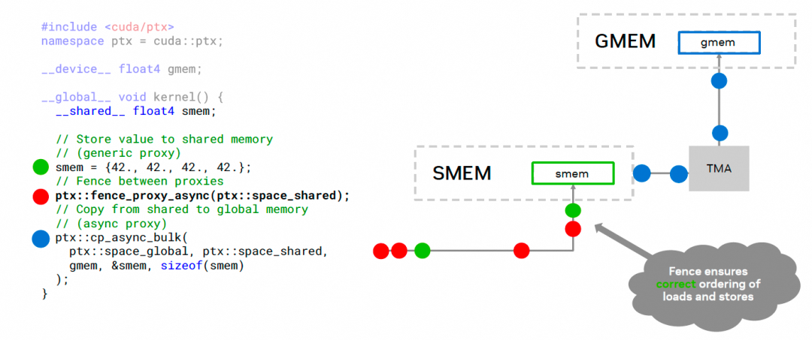

반대로 Async Proxy operation에는 보통 memory barrier가 있고, general proxy의 LD/ST는 이 barrier의 완료를 wait할 수 있다.

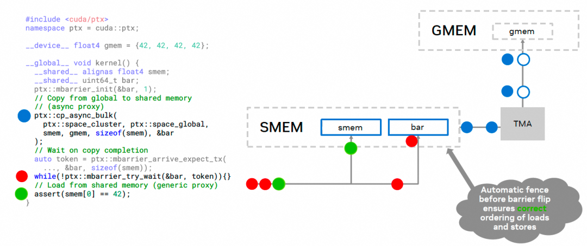

구체적인 flow는 다음과 같다. 먼저 SMEM 안에 mbarrier를 할당하고, 그런 다음 한 thread가 TMA instruction(UBLKCP)을 issue한다. 주의할 점은 SMEM으로 copy되는 data가 반드시 alignas(16) bytes여야 한다는 것이다.

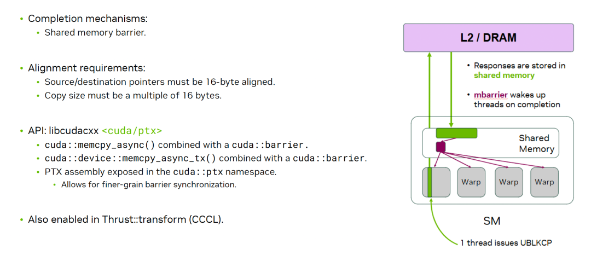

완료는 `completion_tx` counter 방식으로 처리한다.

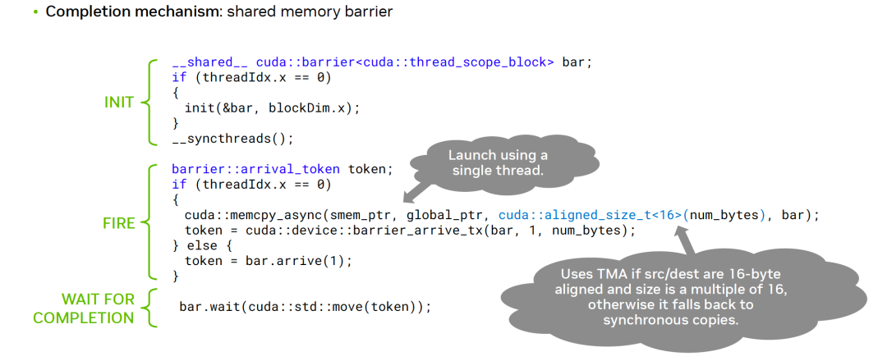

TMA-2D 기반 예제를 보자.

```c++
#include <cuda.h>
#include <cudaTypedefs.h>
#include <cuda/barrier>
#include <iostream>
#pragma nv_diag_suppress static_var_with_dynamic_init

usingbarrier_t = cuda::barrier<cuda::thread_scope_block>;
namespace cde = cuda::device::experimental;

constexprsize_t GLOBAL_M = 64;
constexprsize_t GLOBAL_K = 32;
constexprsize_t TILE_M = 8;
constexprsize_t TILE_K = 16;

inline PFN_cuTensorMapEncodeTiled get_cuTensorMapEncodeTiled()
{
    cudaDriverEntryPointQueryResult driver_status;
    void *cuTensorMapEncodeTiled_ptr = nullptr;

    cudaGetDriverEntryPointByVersion("cuTensorMapEncodeTiled", &cuTensorMapEncodeTiled_ptr, 12000,
                                     cudaEnableDefault, &driver_status);
    if (driver_status != cudaDriverEntryPointSuccess)
        throwstd::runtime_error("driver_status != cudaDriverEntryPointSuccess");
    returnreinterpret_cast<PFN_cuTensorMapEncodeTiled>(cuTensorMapEncodeTiled_ptr);
}

CUtensorMap make_2d_tma_desc(int32_t *global_address,
                             uint64_t global_dim[2], uint64_t stride,
                             uint32_t smem_dim[2],
                             CUtensorMapSwizzle swizzle)
{
    CUtensorMap tensor_map = {};
    uint64_t global_stride[1] = {stride};
    uint32_t elem_stride[2] = {1, 1};

    auto encode = get_cuTensorMapEncodeTiled();

    auto res = encode(
        &tensor_map,
        CUtensorMapDataType::CU_TENSOR_MAP_DATA_TYPE_INT32,
        2, // rank =2
        global_address,
        global_dim,
        global_stride,
        smem_dim,
        elem_stride,
        CUtensorMapInterleave::CU_TENSOR_MAP_INTERLEAVE_NONE,
        swizzle,
        CUtensorMapL2promotion::CU_TENSOR_MAP_L2_PROMOTION_L2_256B,
        CUtensorMapFloatOOBfill::CU_TENSOR_MAP_FLOAT_OOB_FILL_NONE);

    assert(res == CUDA_SUCCESS && "make tma descriptor failed.");
    return tensor_map;
}

__global__ void tma_kernel(const __grid_constant__ CUtensorMap tensor_map,
                           uint32_t x, uint32_t y)
{
    __shared__ alignas(128) int tile_smem[TILE_M * TILE_K];
    __shared__ barrier_t bar;

    // Barrier 초기화
    if (threadIdx.x == 0)
    {
        init(&bar, blockDim.x);
        // TMA 호출 경로는 async proxy이므로, visible을 유지하기 위해 fence 필요
        // cuda::ptx::fence_proxy_async(cuda::ptx::space_shared);
        cde::fence_proxy_async_shared_cta(); // b)
    }
    __syncthreads();

    barrier_t::arrival_token token;
    if (threadIdx.x == 0)
    {
        //TMA copy 실행
        cde::cp_async_bulk_tensor_2d_global_to_shared(tile_smem, &tensor_map, x, y, bar);
        token = cuda::device::barrier_arrive_tx(bar, 1, sizeof(tile_smem));
    }
    else
    {
        token = bar.arrive();
    }
    // 다른 작업 수행....
    int value = threadIdx.x * 100 + threadIdx.x;

    // 모든 data 도착 대기
    bar.wait(std::move(token));
    printf("[tma_kernel] threadIdx.x %d arrived\n", threadIdx.x);
    for (int i = 0; i < TILE_M * TILE_K; i += blockDim.x)
    {
        tile_smem[i + threadIdx.x] += value;
    }

    //async proxy fence가 필요하며, SMEM 저장 종료를 wait
    cuda::ptx::fence_proxy_async(cuda::ptx::space_shared);
    __syncthreads();

    if (threadIdx.x == 0)
    {
        //TMA가 SMEM에서 GMEM으로 copy
        cde::cp_async_bulk_tensor_2d_shared_to_global(&tensor_map, x, y,
                                                      tile_smem);

        cuda::ptx::cp_async_bulk_commit_group();
        //모든 Group 완료 대기
        cuda::ptx::cp_async_bulk_wait_group_read(cuda::ptx::n32_t<0>());
    }
    printf("thread %d done\n", threadIdx.x);
}

int main(int argc, char **argv)
{
    uint64_t global_dim[2] = {GLOBAL_M, GLOBAL_K};
    size_t GLOBAL_SIZE = GLOBAL_K * GLOBAL_M;
    uint32_t tile_dim[2] = {TILE_M, TILE_K};

    int h_data[GLOBAL_SIZE];

    for (size_t i = 0; i < GLOBAL_SIZE; ++i)
    {
        h_data[i] = 1;
    }

    // Malloc memory on GPU6 and allow P2P
    cudaSetDevice(6);
    cudaDeviceEnablePeerAccess(7, 0);
    int *d_data;
    cudaMalloc(&d_data, GLOBAL_SIZE * sizeof(int));
    cudaMemcpy(d_data, h_data, GLOBAL_SIZE * sizeof(int), cudaMemcpyHostToDevice);

    //GPU7을 사용해 NVLINK를 건너 TMA test
    cudaSetDevice(7);
    cudaDeviceEnablePeerAccess(6, 0);

    CUtensorMap tensor_map = make_2d_tma_desc(
        d_data, global_dim, GLOBAL_K * sizeof(int),
        tile_dim,
        CUtensorMapSwizzle::CU_TENSOR_MAP_SWIZZLE_NONE);

    uint32_t coord_x = 16;
    uint32_t coord_y = 16;

    tma_kernel<<<1, TILE_M * TILE_K>>>(tensor_map, coord_x, coord_y);
    cudaDeviceSynchronize();

    cudaError_t err = cudaGetLastError();
    std::cout << cudaGetErrorString(err) << std::endl;

    cudaSetDevice(6);

    cudaMemcpy(h_data, d_data, GLOBAL_SIZE * sizeof(int),
               cudaMemcpyDeviceToHost);

    for (size_t i = 0; i < GLOBAL_M; ++i)
    {
        for (size_t j = 0; j < GLOBAL_K; ++j)
        {
            printf("%5d ", h_data[i * GLOBAL_K + j]);
        }
        printf("\n");
    }

    cudaFree(d_data);
    return0;
}
```

서로 다른 memory asynchronous copy에서는 completion mechanism이 서로 다르다는 점에 주의해야 한다.

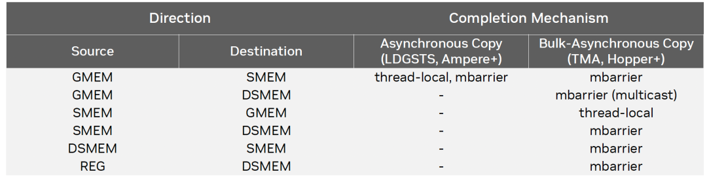

또 mbarrier의 경우, 어떤 것은 completion.tx counter 방식을 사용하고, 다른 것들은 waitgroup 방식을 사용한다.

마지막으로 저자는 요약을 제시했다. st.async / red.async / cp.async는 구현 시기가 더 이르며, data path에서는 async.proxy를 지원하지 않는다. 반면 TMA/TMEM/WGMMA는 async proxy를 지원한다.

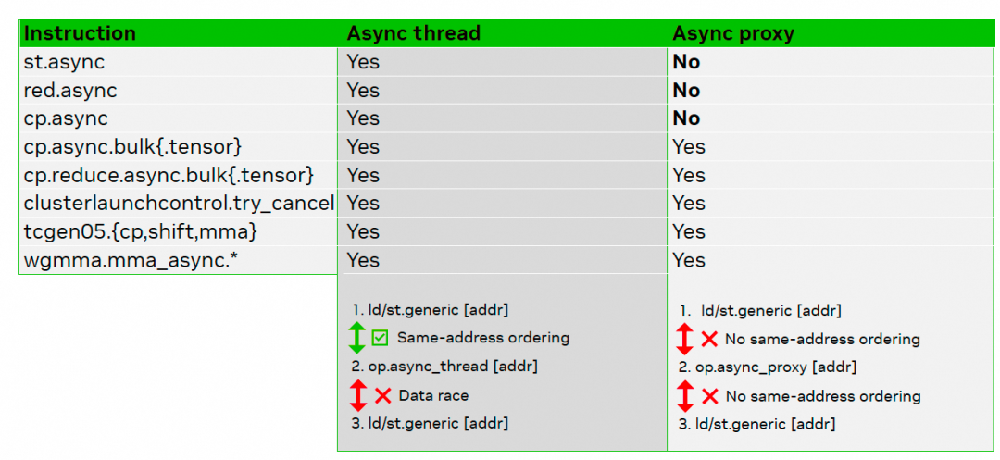

## 3. memory order를 이용한 low-latency Cluster synchronization 구현

### 3.1 Thread Block Cluster 프로그래밍

공개된 Hopper Cluster 프로그래밍 자료는 사실 많지 않다. "cuda c programming guide"[5]에 일부 소개가 있다. 이는 Hopper가 도입한 새로운 hierarchical structure다. Hopper 내부에는 local SM-to-SM data path가 구성되었고, Distribute Shared Memory(DSMEM) 개념이 제공된다.


software interface 관점에서는 Grid와 Block 사이에 Cluster라는 한 계층이 새로 추가된 것이다.

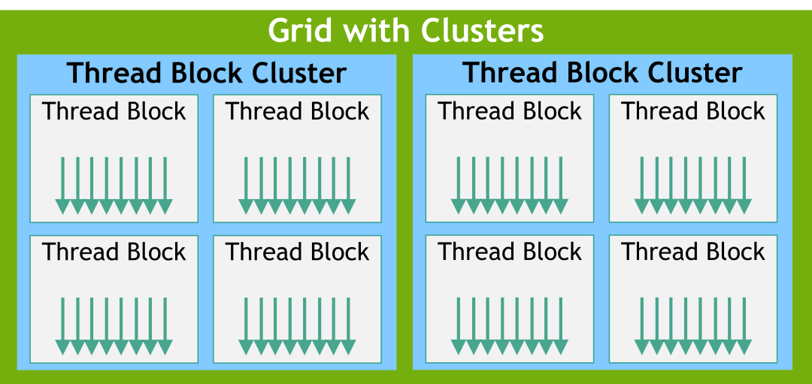

간단한 sample code는 다음과 같다. Kernel function 정의에서 `__cluster_dims__(x, y, z)`로 cluster의 shape를 결정하고, `cg::this_cluster()` function으로 현재 cluster의 descriptor를 얻을 수 있다. 주의할 점은 portability를 고려해 single Cluster 안에서는 최대 8개의 Thread Block만 지원한다는 것이다. 하지만 Hopper DataSheet를 보면 H100은 8개 GPC와 132개 SM을 가지므로 single Cluster가 최대 16개를 지원할 수 있다는 뜻이다. H20에서는 SM이 축소되어 test 결과 최대 8개만 지원했다.

```c++
#include <iostream>
#include <cuda.h>
#include <cuda/atomic>
#include <cooperative_groups.h>

namespace cg = cooperative_groups;

__global__ void __cluster_dims__(4, 2, 1) kernel_cluster_test()
{
    cg::cluster_group cluster = cg::this_cluster();
    unsignedint cluster_block_rank = cluster.block_rank();

    printf("ThreadIdx [%d,%d,%d], BlockDIM [%d,%d,%d], BlockIdx [%d,%d,%d] Cluster rank %d dim [%d,%d,%d] idx [%d,%d,%d] GridDim [%d,%d,%d]\n",
           threadIdx.x, threadIdx.y, threadIdx.z,
           blockDim.x, blockDim.y, blockDim.z,
           blockIdx.x, blockIdx.y, blockIdx.z,
           cluster.block_rank(), cluster.dim_blocks().x, cluster.dim_blocks().y, cluster.dim_blocks().z,
           cluster.block_index().x, cluster.block_index().y, cluster.block_index().z,
           gridDim.x, gridDim.y, gridDim.z);
}

int main(int argc, const char *argv[])
{
    dim3 grid(4, 8, 1);
    dim3 block(4, 4, 4);
    kernel_cluster_test<<<grid, block>>>();

    cudaError_t err = cudaGetLastError();
    std::cout << cudaGetErrorString(err) << std::endl;
    cudaDeviceSynchronize();

    return0;
}
```

물론 `__cluster_dims__` 외에도 `cudaLaunchKernelEx` function으로 runtime에 clusterdim을 결정할 수 있다.

```c++
__global__ void kernel_cluster_test(int var1, int var2){}

int main()
{
    dim3 grid(4, 8, 1);
    dim3 block(4, 4, 4);

    cudaLaunchConfig_t config = {0};

    config.gridDim = grid;
    config.blockDim = block;

    cudaLaunchAttribute attribute[1];
    attribute[0].id = cudaLaunchAttributeClusterDimension;
    attribute[0].val.clusterDim.x = 2;
    attribute[0].val.clusterDim.y = 1;
    attribute[0].val.clusterDim.z = 1;
    config.attrs = attribute;
    config.numAttrs = 1;

    cudaLaunchKernelEx(&config, kernel_cluster_test, var1, var2);
}
```

cluster에는 그 밖에도 여러 function이 있으며, cuda c programming guide의 Cluster group[6] 장에서 소개한다.

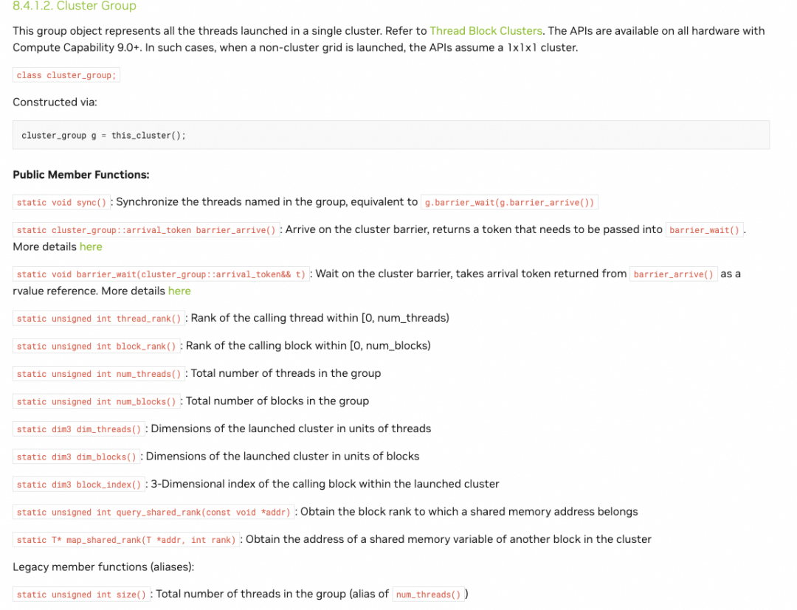

Cluster에서 가장 중요한 scenario는 Distributed Shared Memory를 사용하는 것이다. 이는 Cluster 내부에서 L2를 bypass하는 low-latency SMEM mutual access를 구현할 수 있고, LD/ST, ATOMIC, async DMA 등의 operation을 지원한다.

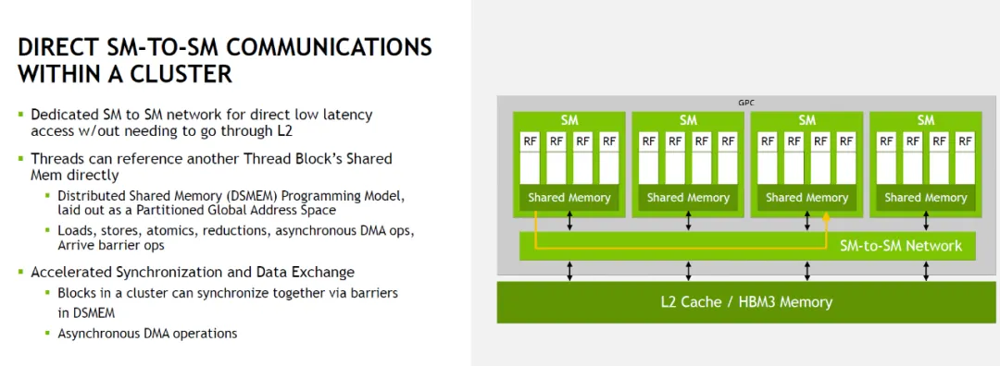

예를 들어 아래 sample을 보자.

```c++
#include <cstdio>
#include <iostream>
#include <cuda/ptx>
#include <cuda/barrier>
#include <cooperative_groups.h>

namespace cg = cooperative_groups;

__global__ void __cluster_dims__(8, 1, 1) kernel()
{
  cg::cluster_group cluster = cg::this_cluster();


//SMEM 선언 및 초기화
  __shared__ int smem_x[32];
  smem_x[threadIdx.x] = blockIdx.x * 10000 + threadIdx.x;

//cluster 범위에서 동기화하고 모든 thread가 shared memory 선언과 초기화를 끝냈는지 보장
  cluster.sync();

int peer_rank = cluster.block_rank() ^1;
int *dst_mem = cluster.map_shared_rank(smem_x,peer_rank);
  dst_mem[threadIdx.x] += cluster.block_rank() * 100;

  cluster.sync();
printf("threadIdx %d blockIdx %d clusterRank %d smem: %d\n", threadIdx.x,blockIdx.x,cluster.block_rank(), smem_x[threadIdx.x]);

}

int main() {
  kernel<<<8, 4>>>();
  cudaDeviceSynchronize();

return0;
}
# 실행 결과는 다음과 같다:
threadIdx 0 blockIdx 6 clusterRank 6 smem: 60700
threadIdx 1 blockIdx 6 clusterRank 6 smem: 60701
threadIdx 2 blockIdx 6 clusterRank 6 smem: 60702
threadIdx 3 blockIdx 6 clusterRank 6 smem: 60703
threadIdx 0 blockIdx 7 clusterRank 7 smem: 70600
threadIdx 1 blockIdx 7 clusterRank 7 smem: 70601
threadIdx 2 blockIdx 7 clusterRank 7 smem: 70602
threadIdx 3 blockIdx 7 clusterRank 7 smem: 70603
threadIdx 0 blockIdx 0 clusterRank 0 smem: 100
threadIdx 1 blockIdx 0 clusterRank 0 smem: 101
threadIdx 2 blockIdx 0 clusterRank 0 smem: 102
threadIdx 3 blockIdx 0 clusterRank 0 smem: 103
threadIdx 0 blockIdx 1 clusterRank 1 smem: 10000
threadIdx 1 blockIdx 1 clusterRank 1 smem: 10001
threadIdx 2 blockIdx 1 clusterRank 1 smem: 10002
threadIdx 3 blockIdx 1 clusterRank 1 smem: 10003
threadIdx 0 blockIdx 2 clusterRank 2 smem: 20300
threadIdx 1 blockIdx 2 clusterRank 2 smem: 20301
threadIdx 2 blockIdx 2 clusterRank 2 smem: 20302
threadIdx 3 blockIdx 2 clusterRank 2 smem: 20303
threadIdx 0 blockIdx 3 clusterRank 3 smem: 30200
threadIdx 1 blockIdx 3 clusterRank 3 smem: 30201
threadIdx 2 blockIdx 3 clusterRank 3 smem: 30202
threadIdx 3 blockIdx 3 clusterRank 3 smem: 30203
threadIdx 0 blockIdx 4 clusterRank 4 smem: 40500
threadIdx 1 blockIdx 4 clusterRank 4 smem: 40501
threadIdx 2 blockIdx 4 clusterRank 4 smem: 40502
threadIdx 3 blockIdx 4 clusterRank 4 smem: 40503
threadIdx 0 blockIdx 5 clusterRank 5 smem: 50400
threadIdx 1 blockIdx 5 clusterRank 5 smem: 50401
threadIdx 2 blockIdx 5 clusterRank 5 smem: 50402
threadIdx 3 blockIdx 5 clusterRank 5 smem: 50403
```

Thread Block Cluster의 장점은 SM-to-SM network를 통해 data를 교환하여 data를 L2/GMEM에 저장하는 것을 피할 수 있다는 점이다.

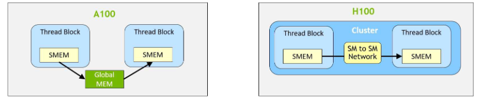

### 3.2 Cluster low-latency synchronization

하지만 앞의 Cluster::sync() 구현에는 performance bottleneck이 있다. 이것은 전체 cluster를 synchronize하고, LD/ST data가 cluster 안의 다른 thread에 보이도록 만든다. 이 과정에서 data가 L2를 지나가게 된다. 실제로 PTX instruction에서 cluster::sync()는 연속된 두 instruction을 생성한다.

```c++
 barrier.cluster.arrive;
 barrier.cluster.wait;
```

하지만 PTX instruction으로 arrive와 wait를 분리할 수 있고, release/relaxed를 선택적으로 사용해 LD/ST의 visibility를 고를 수도 있다.

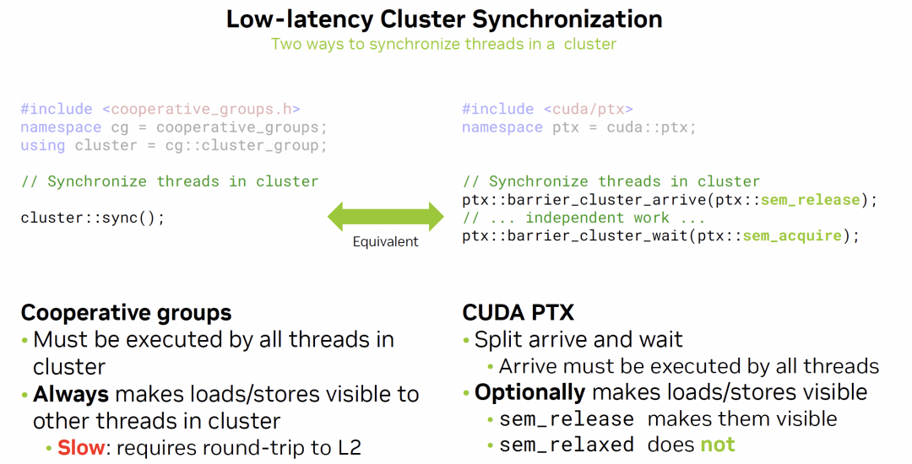

예를 들어 barrier를 초기화할 때는 cluster::sync() 방식을 사용할 수 있다. 간단하지만 L2Cache를 지나가므로 비교적 느리다.

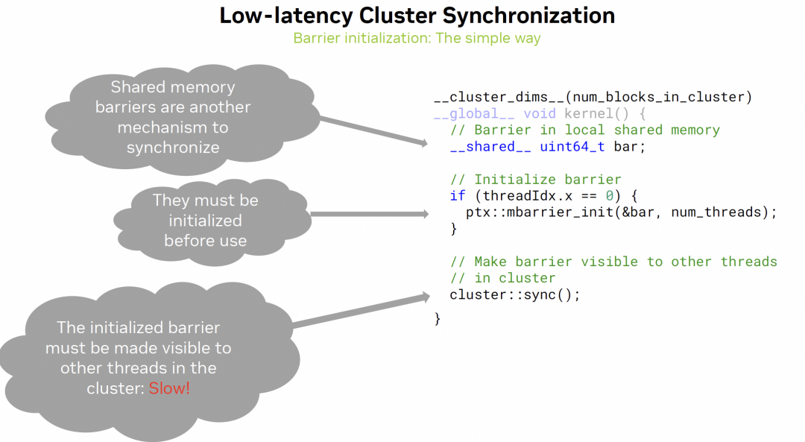

release-acquire 방식을 사용할 수 있다.

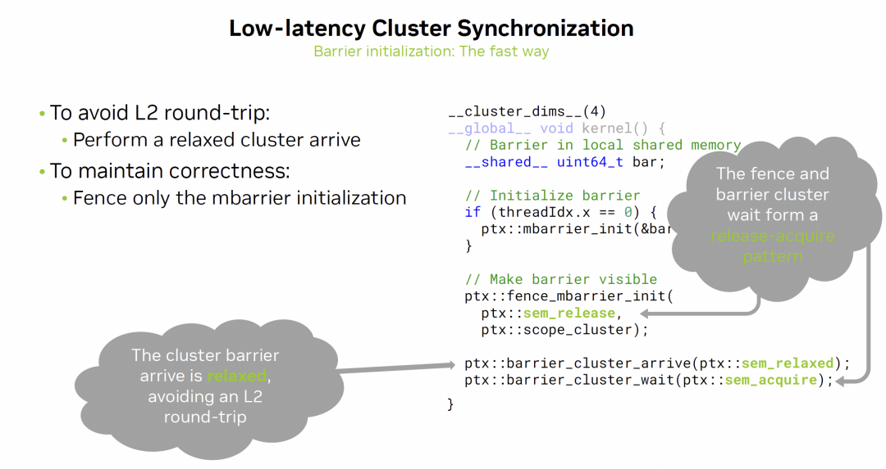

그다음 Cluster 안의 SM-SM communication은 asynchronous store 방식을 사용하고 local mbarrier를 wait하면 된다.

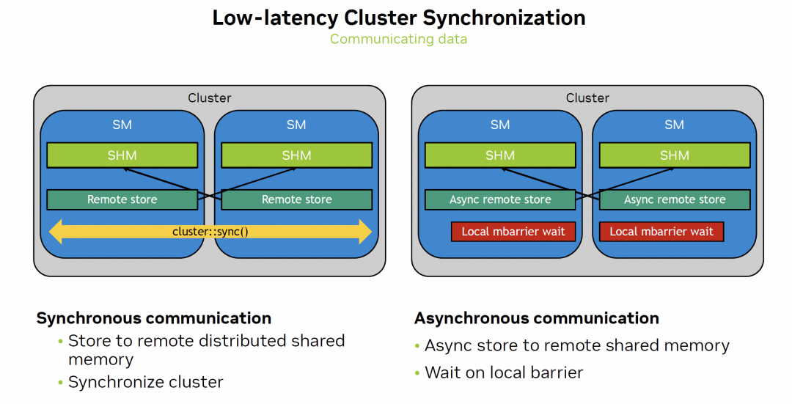

전체 process code는 다음과 같다:

```c++
#include <cstdio>
#include <cuda/ptx>
#include <cuda/barrier>
#include <cooperative_groups.h>

namespace cg = cooperative_groups;

using cuda::ptx::scope_cluster;
using cuda::ptx::sem_acquire;
using cuda::ptx::sem_relaxed;
using cuda::ptx::sem_release;
using cuda::ptx::space_cluster;
using cuda::ptx::space_shared;

namespace ptx
{

    __device__ __forceinline__ uint32_t __as_ptr_smem(constvoid *__ptr)
    {
        returnstatic_cast<uint32_t>(__cvta_generic_to_shared(__ptr));
    }

    __device__ __forceinline__ void mbarrier_init(uint64_t *mbar, const uint32_t count)
    {
        uint32_t mbar_ptr = __cvta_generic_to_shared(mbar);
        asm volatile("mbarrier.init.shared.b64 [%0], %1;" ::"r"(mbar_ptr), "r"(count) : "memory");
    }

    __device__ __forceinline__ void fence_mbarrier_init(cuda::ptx::sem_release_t, cuda::ptx::scope_cluster_t)
    {
        asm volatile("fence.mbarrier_init.release.cluster; // 3." : : : "memory");
    }

    __device__ __forceinline__ void barrier_cluster_arrive(cuda::ptx::sem_relaxed_t)
    {
        asm volatile("barrier.cluster.arrive.relaxed;" : : :);
    }

    __device__ __forceinline__ void barrier_cluster_wait(cuda::ptx::sem_acquire_t)
    {
        asm volatile("barrier.cluster.wait.acquire;" : : : "memory");
    }

    __device__ __forceinline__ void barrier_cluster_wait()
    {
        asm volatile("barrier.cluster.wait;" : : : "memory");
    }

    template <cuda::ptx::dot_scope Scope>
    __device__ __forceinline__ uint64_t mbarrier_arrive_expect_tx(
        cuda::ptx::sem_relaxed_t,
        cuda::ptx::scope_t<Scope> __scope,
        cuda::ptx::space_shared_t,
        uint64_t *__addr,
        const uint32_t &__txCount)
    {
        uint64_t __state;
        if constexpr (__scope == cuda::ptx::scope_cta)
        {
            asm("mbarrier.arrive.expect_tx.relaxed.cta.shared::cta.b64 %0, [%1], %2;"
                : "=l"(__state)
                : "r"(__as_ptr_smem(__addr)), "r"(__txCount)
                : "memory");
        }
        elseifconstexpr (__scope == cuda::ptx::scope_cluster)
        {
            asm("mbarrier.arrive.expect_tx.relaxed.cluster.shared::cta.b64 %0, [%1], %2;"
                : "=l"(__state)
                : "r"(__as_ptr_smem(__addr)), "r"(__txCount)
                : "memory");
        }
        return __state;
    }

    template <cuda::ptx::dot_scope Scope>
    __device__ __forceinline__ bool mbarrier_try_wait(
        cuda::ptx::sem_acquire_t, cuda::ptx::scope_t<Scope> __scope, uint64_t *__addr, const uint64_t &__state)
    {
        uint32_t __waitComplete;
        if constexpr (__scope == cuda::ptx::scope_cta)
        {
            asm("{\n\t .reg .pred P_OUT; \n\t"
                "mbarrier.try_wait.acquire.cta.shared::cta.b64         P_OUT, [%1], %2;                        // 6a. \n\t"
                "selp.b32 %0, 1, 0, P_OUT; \n"
                "}"
                : "=r"(__waitComplete)
                : "r"(__as_ptr_smem(__addr)), "l"(__state)
                : "memory");
        }
        elseifconstexpr (__scope == cuda::ptx::scope_cluster)
        {
            asm("{\n\t .reg .pred P_OUT; \n\t"
                "mbarrier.try_wait.acquire.cluster.shared::cta.b64         P_OUT, [%1], %2;                        // 6a. \n\t"
                "selp.b32 %0, 1, 0, P_OUT; \n"
                "}"
                : "=r"(__waitComplete)
                : "r"(__as_ptr_smem(__addr)), "l"(__state)
                : "memory");
        }
        returnstatic_cast<bool>(__waitComplete);
    }

}


__global__ void __cluster_dims__(8, 1, 1) low_latency_kernel(int iter_num)
{
    cg::cluster_group cluster = cg::this_cluster();

    __shared__ int receive_buffer[4];
    __shared__ uint64_t bar;
    // barrier 초기화
    if (threadIdx.x == 0)
    {
        ptx::mbarrier_init(&bar, blockDim.x);
    }

    // make barrier visible
    ptx::fence_mbarrier_init(sem_release, scope_cluster);

    ptx::barrier_cluster_arrive(sem_relaxed);
    ptx::barrier_cluster_wait(sem_acquire);

    // remote buffer와 barrier address 가져오기:
    unsignedint peer_rank = cluster.block_rank() ^ 1;
    uint64_t *remote_bar = cluster.map_shared_rank(&bar, peer_rank);
    int *remote_buffer = cluster.map_shared_rank(&receive_buffer[0], peer_rank);

    for (int iter = 0; iter < iter_num; ++iter)
    {

        cuda::ptx::st_async(remote_buffer, {iter, iter, iter, iter}, remote_bar);
        // relaxed
        uint64_t token = ptx::mbarrier_arrive_expect_tx(
            sem_relaxed,
            scope_cluster,
            space_shared,
            &bar,
            sizeof(receive_buffer));

        bool ready = false;
        while (!ready)
        {
            //acquire
            ready = ptx::mbarrier_try_wait(
                sem_acquire,
                scope_cluster,
                &bar,
                token);
        }

        ptx::barrier_cluster_arrive(sem_relaxed);
        ptx::barrier_cluster_wait();
    }
}

__global__ void __cluster_dims__(8, 1, 1) standard_async_kernel(int iter_num)
{
    cg::cluster_group cluster = cg::this_cluster();

    usingbarrier_t = cuda::barrier<cuda::thread_scope_block>;
    __shared__ int receive_buffer[4];
    __shared__ barrier_t bar;
    init(&bar, blockDim.x);

    // make barrier visible
    cluster.sync();

    // remote buffer와 barrier address 가져오기:
    unsignedint other_block_rank = cluster.block_rank() ^ 1;
    uint64_t *remote_bar = cluster.map_shared_rank(cuda::device::barrier_native_handle(bar), other_block_rank);
    // int * remote_buffer = cluster.map_shared_rank(&receive_buffer, other_block_rank);
    int *remote_buffer = cluster.map_shared_rank(&receive_buffer[0], other_block_rank);

    for (int iter = 0; iter < iter_num; ++iter)
    {

        // Arrive on local barrier:
        uint64_t arrival_token;

        //sem_release
        arrival_token = cuda::ptx::mbarrier_arrive_expect_tx(sem_release, scope_cluster, space_shared, cuda::device::barrier_native_handle(bar), sizeof(receive_buffer));
        cuda::ptx::st_async(remote_buffer, {iter, iter, iter, iter}, remote_bar);

        // Wait on local barrier:
        while (!cuda::ptx::mbarrier_try_wait(sem_acquire, scope_cluster, cuda::device::barrier_native_handle(bar), arrival_token))
        {
        }
    }
}

int main()
{
    cudaEvent_t start, stop;
    cudaEventCreate(&start);
    cudaEventCreate(&stop);

    int num_iter = 10000;
    float time;

    cudaEventRecord(start);
    low_latency_kernel<<<128, 32>>>(num_iter);
    cudaEventRecord(stop);
    cudaDeviceSynchronize();
    cudaEventElapsedTime(&time, start, stop);
    printf("low latency kernel elapsed %f\n", time);

    cudaEventRecord(start);
    standard_async_kernel<<<128, 32>>>(num_iter);
    cudaEventRecord(stop);
    cudaDeviceSynchronize();
    cudaEventElapsedTime(&time, start, stop);
    printf("async kernel elapsed %f\n", time);
}
```

async.st 때 cluster-scope relaxed를 사용하고, local barrier wait 때 acquire를 사용한다.

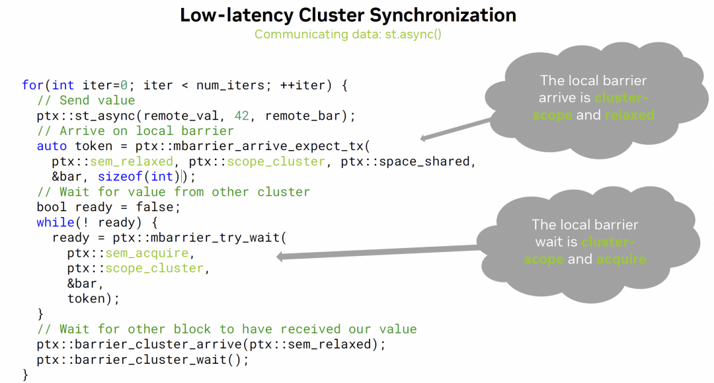

H20에서 실제로 test해 보면 `mbarrier_arrive_expect_tx(sem_release)`와 비교해 46% 더 빨랐다.

```c++
low latency kernel elapsed 2.068736
async kernel elapsed 3.714880
```

### 3.3 DSMEM 기반 multicast

TMA에는 Multicast capability도 추가되어 data를 여러 block에 동시에 load할 수 있다. 아래는 예제다. compile할 때 Multicast.cluster는 `sm_90a/sm_100a/sm_101a` architecture를 사용해야 한다는 안내가 나온다는 점에 주의하라.

ptxas /tmp/tmpxft\_00017425\_00000000-6\_03-tma-mcast.ptx, line 82; warning : Advisory: '.multicast::cluster' modifier on instruction 'cp.async.bulk{.tensor}' should be used on .target 'sm\_90a/sm\_100a/sm\_101a' instead of .target 'sm\_90' as this feature is expected to have substantially reduced performance on some future architectures

```c++
#include <cuda.h>
#include <cudaTypedefs.h>
#include <cooperative_groups.h>
#include <cuda/barrier>
#include <iostream>
#pragma nv_diag_suppress static_var_with_dynamic_init

usingbarrier_t = cuda::barrier<cuda::thread_scope_block>;
namespace cde = cuda::device::experimental;
namespace cg = cooperative_groups;

constint ARRAY_SIZE = 512;
constint TILE_SIZE = 16;
constint CLUSTER_DIM = 8;


inline PFN_cuTensorMapEncodeTiled get_cuTensorMapEncodeTiled()
{
    cudaDriverEntryPointQueryResult driver_status;
    void *cuTensorMapEncodeTiled_ptr = nullptr;

    cudaGetDriverEntryPointByVersion("cuTensorMapEncodeTiled", &cuTensorMapEncodeTiled_ptr, 12000,
                                     cudaEnableDefault, &driver_status);
    if (driver_status != cudaDriverEntryPointSuccess)
        throwstd::runtime_error("driver_status != cudaDriverEntryPointSuccess");
    returnreinterpret_cast<PFN_cuTensorMapEncodeTiled>(cuTensorMapEncodeTiled_ptr);
}


CUtensorMap make_1d_tma_desc(int32_t *global_address,
                             uint64_t global_dim,
                             uint32_t smem_dim)
{
    CUtensorMap tensor_map = {};
    uint64_t global_size[1] = { global_dim};
    uint64_t global_stride[1] = {global_dim * sizeof(int)};
    uint32_t tile_size[1]= {smem_dim};
    uint32_t elem_stride[1] = {1};

    auto encode = get_cuTensorMapEncodeTiled();

    auto res = encode(
        &tensor_map,
        CUtensorMapDataType::CU_TENSOR_MAP_DATA_TYPE_INT32,
        1, // rank =1
        global_address,
        global_size,
        global_stride,
        tile_size,
        elem_stride,
        CUtensorMapInterleave::CU_TENSOR_MAP_INTERLEAVE_NONE,
        CUtensorMapSwizzle::CU_TENSOR_MAP_SWIZZLE_NONE,
        CUtensorMapL2promotion::CU_TENSOR_MAP_L2_PROMOTION_L2_256B,
        CUtensorMapFloatOOBfill::CU_TENSOR_MAP_FLOAT_OOB_FILL_NONE);

    assert(res == CUDA_SUCCESS && "make tma descriptor failed.");
    return tensor_map;
}

__global__ void  __cluster_dims__(CLUSTER_DIM, 1, 1) tma_kernel(const __grid_constant__ CUtensorMap tensor_map,
                           uint32_t coord)
{
    __shared__ alignas(16) int tile_smem[TILE_SIZE];
    __shared__ barrier_t bar;

    cg::cluster_group cluster = cg::this_cluster();
unsignedint cluster_rank = cluster.block_rank();

    // Barrier 초기화
    if (threadIdx.x == 0)
    {
        init(&bar, blockDim.x);
        // TMA 호출 경로는 async proxy이므로, visible을 유지하기 위해 fence 필요
        // cuda::ptx::fence_proxy_async(cuda::ptx::space_shared);
        cde::fence_proxy_async_shared_cta(); // b)
    }
    __syncthreads();

    barrier_t::arrival_token token;
    if ((cluster_rank == 0 ) && (threadIdx.x == 0))
    {
        uint16_t ctaMask = 0b10111011;
        asm volatile(
            "cp.async.bulk.tensor.1d.shared::cluster.global.tile.mbarrier::"
            "complete_tx::bytes.multicast::cluster "
            "[%0], [%1, {%2}], [%3], %4;\n"
            :
            : "r"(static_cast<_CUDA_VSTD::uint32_t>(
                  __cvta_generic_to_shared(tile_smem))),
              "l"(&tensor_map), "r"(coord),
              "r"(static_cast<_CUDA_VSTD::uint32_t>(
                  __cvta_generic_to_shared(
                      cuda::device::barrier_native_handle(bar)))),
              "h"(ctaMask)
            : "memory");

        token = cuda::device::barrier_arrive_tx(bar, 1, sizeof(tile_smem));
    }
    else
    {
        token = bar.arrive();
    }

    // Wait for the data to have arrived.
    bar.wait(std::move(token));
    //printf("[tma_kernel] threadIdx.x %d arrived\n", threadIdx.x);

    cluster.sync();
    if (threadIdx.x == 0 ) {
        printf("cluster %d smem[%d %d %d %d]\n",cluster_rank, tile_smem[0],tile_smem[1],tile_smem[2],tile_smem[3]);
    }

}

int main(int argc, char **argv)
{
    int *h_data = nullptr;
    cudaHostAlloc(&h_data, ARRAY_SIZE * sizeof(int), cudaHostAllocMapped);
    for (size_t i = 0; i < ARRAY_SIZE; ++i)
    {
        h_data[i] = i;
    }

    int *d_data;
    cudaHostGetDevicePointer(&d_data, h_data, 0);

    CUtensorMap tensor_map = make_1d_tma_desc(
        d_data, ARRAY_SIZE, TILE_SIZE);

    uint32_t coord = 3 * TILE_SIZE;

    tma_kernel<<<CLUSTER_DIM, 32>>>(tensor_map, coord);
    cudaDeviceSynchronize();

    cudaError_t err = cudaGetLastError();

    cudaFree(d_data);

    return0;
}

#Output
cluster 6 smem[0000]
cluster 7 smem[48495051]
cluster 0 smem[48495051]
cluster 1 smem[48495051]
cluster 2 smem[0000]
cluster 3 smem[48495051]
cluster 4 smem[48495051]
cluster 5 smem[48495051]
```

## 4. 메모리 bandwidth 최대화

이제 GTC25의 이 session의 또 다른 주제인 "Maxmizing Memory Bandwidth"를 보자.

### 4.1 메모리 계층 구조 되짚어보기

Nvidia GPU 안에는 많은 Cuda Core가 있고, 이런 architecture와 함께 memory도 깊은 hierarchical structure를 가진다.

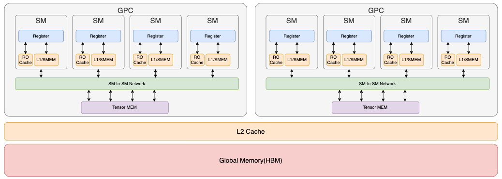

compute core에 더 가까운 cache는 access latency를 크게 낮출 수 있다. 따라서 Shared Memory는 세대마다 capacity가 커져 왔지만 거의 한계에 가까워졌다. 예를 들어 Hopper와 Blackwell의 SMEM capacity는 더 이상 늘지 않았다. 그래서 더 많은 방식은 local on-chip network를 구성해 SMEM이 이 작은 범위의 network를 통해 Distributed SMEM으로 구성되도록 하는 것이다. 이것도 더 나은 Data Locality로 GMEM access latency를 피하기 위한 목적이다.

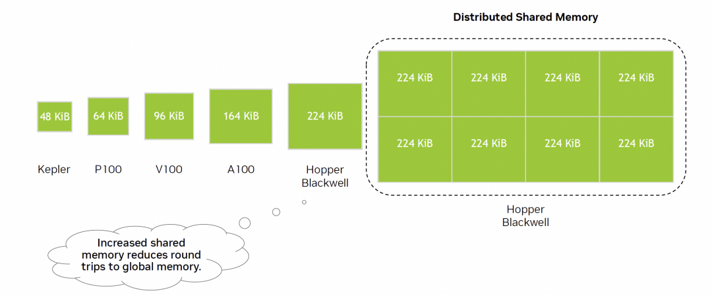

따라서 3장에서 소개했듯 Hopper와 Blackwell에서는 DSMEM 기반 프로그래밍과 Cluster abstraction이 더 중요해졌다.

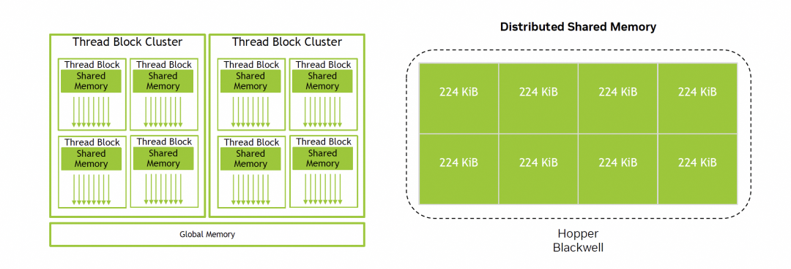

Blackwell은 Cluster의 mixed placement scheduling도 추가로 최적화해 utilization을 높였다.

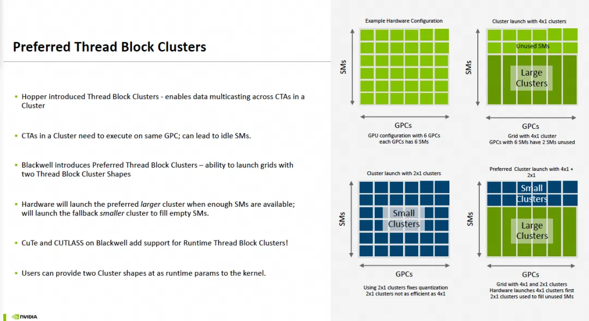

하지만 on-chip area 제한 때문에 SM의 증가 속도는 이미 둔화되었다. 큰 SMEM도 필요하고, 더 큰 compute capability도 필요하고, 더 많은 SM도 필요하다는 것은 본질적으로 모순이다. 결국 FP64를 줄일 수밖에 없었다....

한편 memory는 HBM3e/HBM4 덕분에 계속 증가하고 있지만, compute와 memory access 양쪽에서 tuning해야 하는 난도도 커지고 있다.

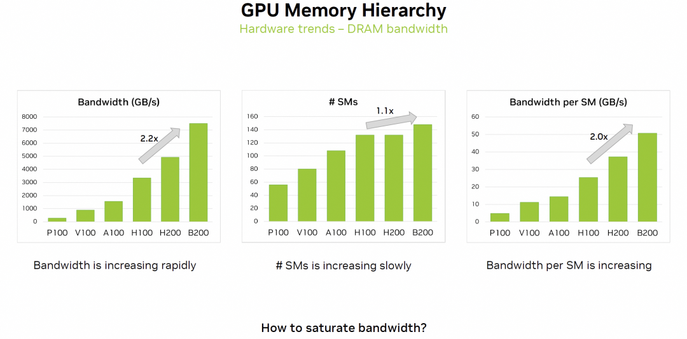

### 4.2 Little's Law

distributed system의 runtime efficiency를 최적화할 때, microarchitecture의 memory access latency든, macro 관점의 load balancing이든, network transmission의 congestion control이든, queueing theory 관점에서 분석하고 statistics, randomness, asynchronous 방식으로 latency 문제를 해결하는 것이 올바른 수단이다. 예를 들어 앞에서 언급한 Kingman formula 등이 있다. 여기서는 더 단순한 model을 이야기해 보자. stable system에서 customer의 long-term average number $L$은 long-term average effective arrival rate $\lambda$에 customer가 system 안에서 보내는 average time $W$를 곱한 값과 같다. 매우 직관적인 formula인 $L=\lambda W$다. 이것이 Little's Law다. 예를 들어 escalator에서 평균 2s마다 한 명의 customer가 도착하고, 즉 평균 1s마다 1/2명의 customer가 도착하며, escalator를 타는 데 40s가 걸린다면 system이 감당할 수 있는 concurrency는 20명이다.

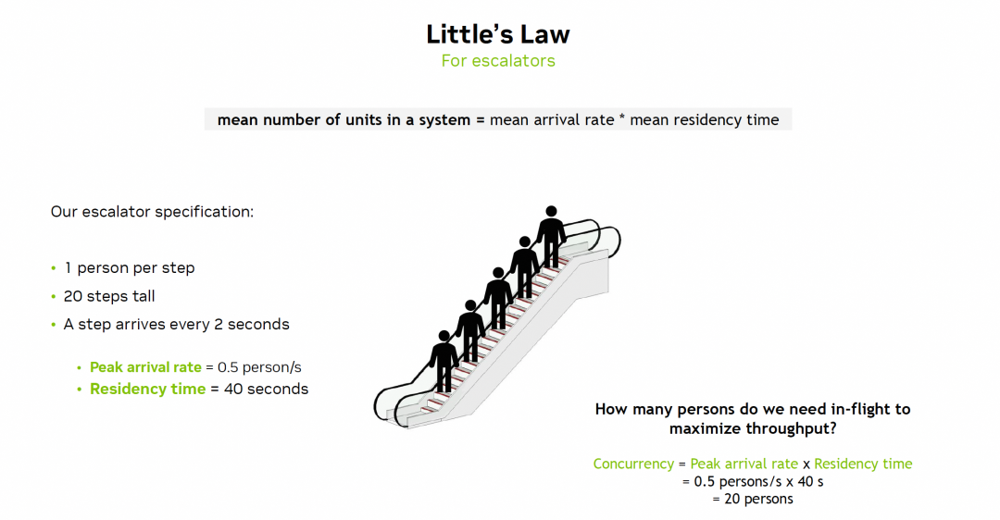

memory access도 사실 이와 비슷하다. memory bandwidth와 average memory access latency를 기준으로 Inflight-Bytes를 계산할 수 있다. Hopper는 memory bandwidth를 가득 채우려면 32KB의 inflight가 필요하고, Blackwell은 거의 두 배인 64KB가 필요하다는 것을 볼 수 있다.

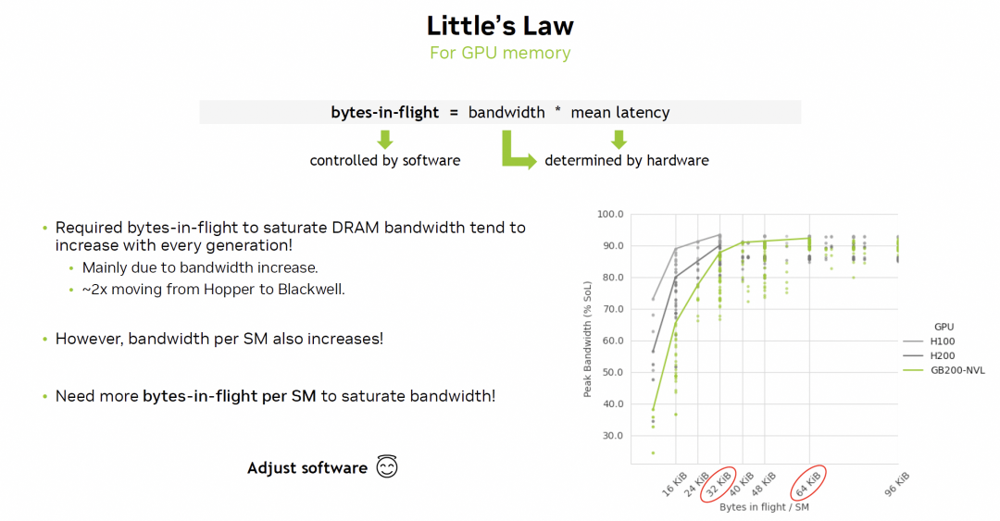

간단한 Kernel의 경우, single thread가 memory에 access하는 횟수, single access의 memory size, 전체 block 안의 thread 수, 전체 SM 안의 block 수를 통해 single SM의 inflight Bytes 수를 구할 수 있다.

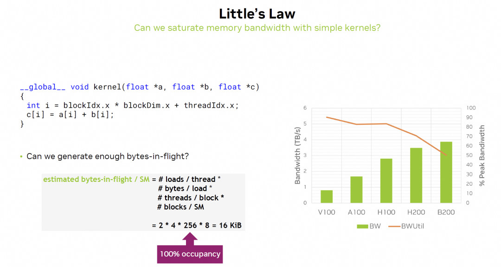

### 4.3 parallel optimization 및 asynchronous access

Inflight Bytes를 늘리는 방법은 보통 세 가지뿐이다. instruction-level parallelism(ILP), data-level parallelism(DLP), 그리고 asynchronous memory access다.


예를 들어 UNROLL로 loop를 펼쳐 concurrent instruction 수를 늘릴 수 있다:

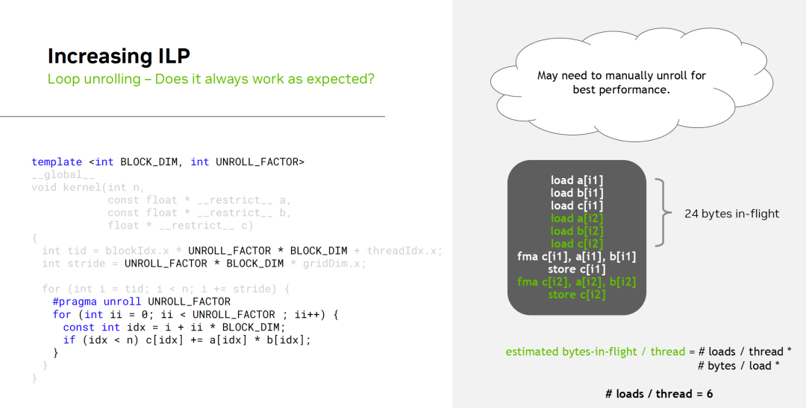

한편 Vector Load로 data parallelism(DLP)을 늘릴 수도 있다.

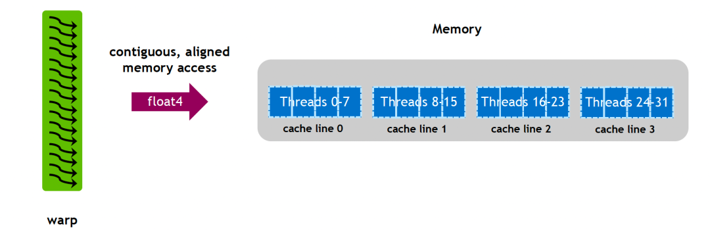

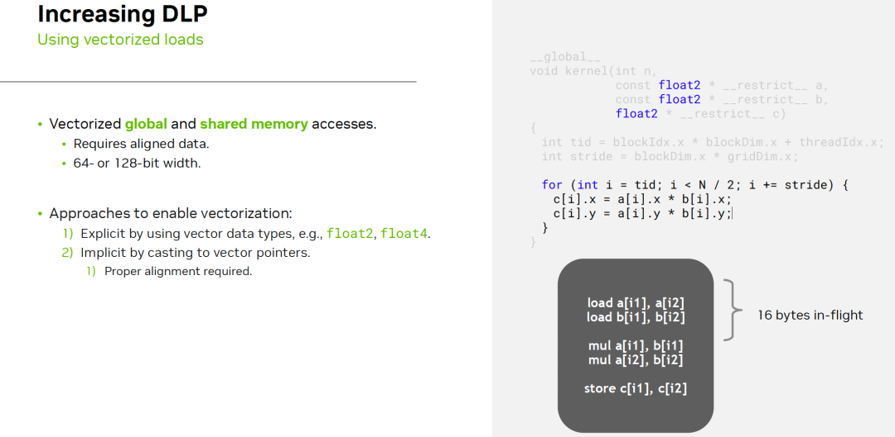

하지만 data parallelism과 instruction parallelism을 늘리면 register pressure가 크게 증가한다.

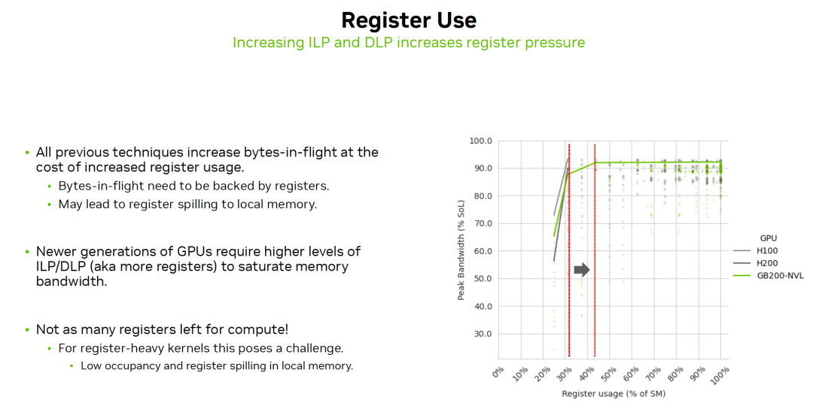

따라서 register 점유를 피하기 위한 asynchronous copy 방식이 등장했다.

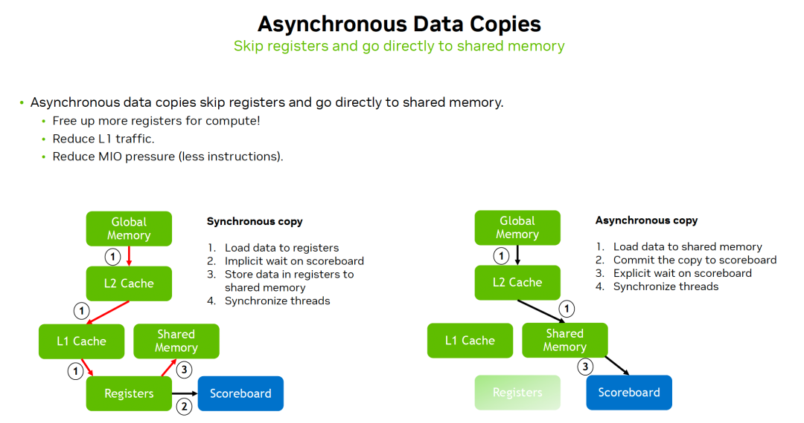

동시에 asynchronous loading은 data copy와 computation의 Overlap을 늘린다.

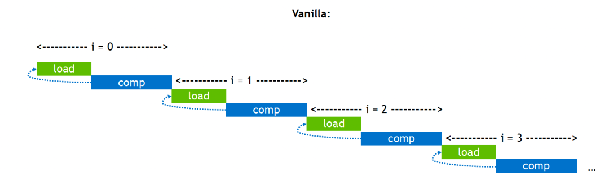

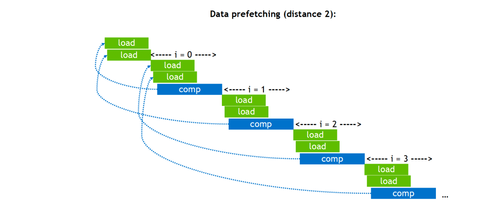

동시에 Producer-consumer 방식도 구현하고, warp specialization으로 실행한다.

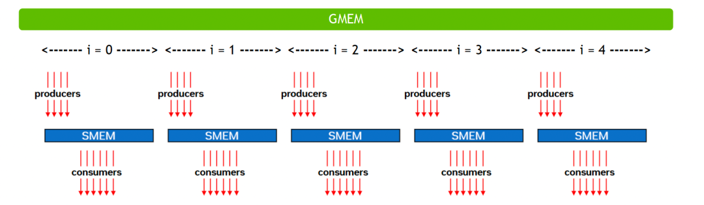

예를 들어 아래에서는 일부 threads를 memory copy용 Producer로 사용한다.

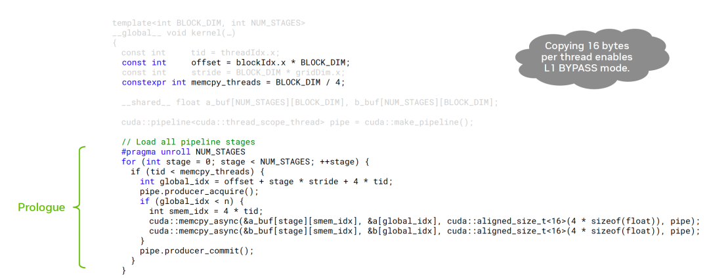

그다음 Consumer가 computation을 수행할 때, 일부 threads를 통해 계속 asynchronous data prefetch를 수행한다.

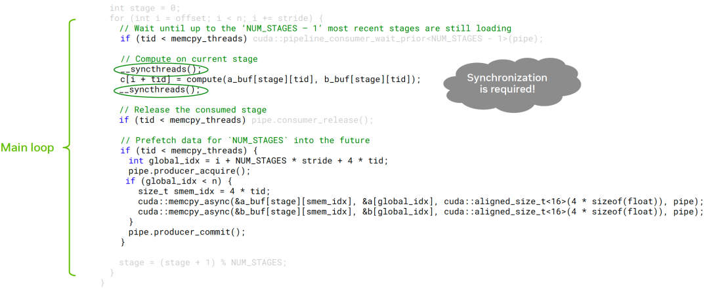

마지막으로 GTC25 session은 loading optimization에 대한 권장사항을 제시했다.

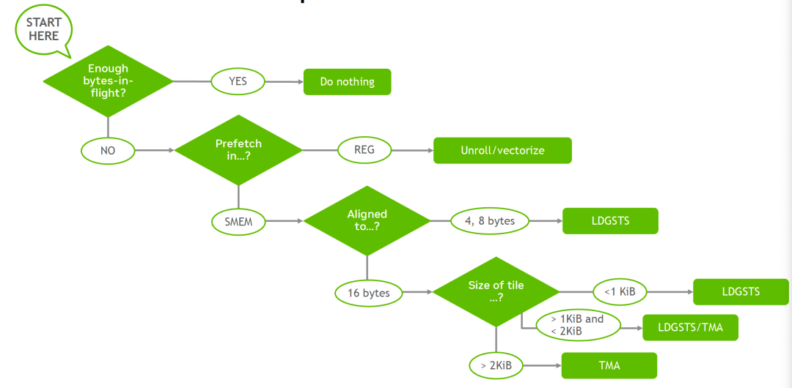

## 5. LD/ST instruction으로 Cache 제어하기

instruction parallelism과 data parallelism을 늘리고, 여기에 많은 asynchronous copy까지 존재하게 되면 register와 cache pressure를 어떻게 낮출 것인지가 반드시 고려해야 할 문제가 된다. Ampere에서는 Async Copy가 도입되어 register와 L1Cache를 bypass하고 GMEM에서 SMEM으로 직접 load할 수 있게 되었다. Hopper에서는 TMA가 추가로 구현되어 nD matrix 등의 instruction issue 수를 줄였다. Blackwell에서는 TensorMemory가 도입되었고, 주요 목적은 MMA 수행 시 register 점유를 줄이는 것이다. 이번 장에서는 General LD/ST가 cache를 어떻게 제어하는지 살펴본다.

예를 들어 DeepEP에서 사용되는 `ld.global.nc.L1::no_allocate.L2::256B`와 `st.global.L1::no_allocate` 등이 있다. DeepEP에는 참고할 만한 파일이 하나 있다. `https://github.com/deepseek-ai/DeepEP/blob/main/csrc/kernels/utils.cuh`

### 5.1 LD instruction

공식 PTX 문서에는 ld instruction의 여러 사용법이 기록되어 있다.

```c++
ld{.weak}{.ss}{.cop}{.level::cache_hint}{.level::prefetch_size}{.vec}.type  d, [a]{.unified}{, cache-policy};

ld{.weak}{.ss}{.level::eviction_priority}{.level::cache_hint}{.level::prefetch_size}{.vec}.type  d, [a]{.unified}{, cache-policy};

ld.volatile{.ss}{.level::prefetch_size}{.vec}.type  d, [a];

ld.relaxed.scope{.ss}{.level::eviction_priority}{.level::cache_hint}{.level::prefetch_size}{.vec}.type  d, [a]{, cache-policy};

ld.acquire.scope{.ss}{.level::eviction_priority}{.level::cache_hint}{.level::prefetch_size}{.vec}.type  d, [a]{, cache-policy};

ld.mmio.relaxed.sys{.global}.type  d, [a];

.ss =                       { .const, .global, .local, .param{::entry, ::func}, .shared{::cta, ::cluster} };
.cop =                      { .ca, .cg, .cs, .lu, .cv };
.level::eviction_priority = { .L1::evict_normal, .L1::evict_unchanged,
                              .L1::evict_first, .L1::evict_last, .L1::no_allocate };
.level::cache_hint =        { .L2::cache_hint };
.level::prefetch_size =     { .L2::64B, .L2::128B, .L2::256B }
.scope =                    { .cta, .cluster, .gpu, .sys };
.vec =                      { .v2, .v4 };
.type =                     { .b8, .b16, .b32, .b64, .b128,
                              .u8, .u16, .u32, .u64,
                              .s8, .s16, .s32, .s64,
                              .f32, .f64 };
```

.weak의 경우 실제 compile된 SASS instruction은 default와 동일하며 모두 `LDG.E`다. .volatile은 `LDG.E.STRONG`이고, relaxed/acquire는 앞 장에서 이미 자세히 소개했다. .mmio는 PTX8.2에서 추가되었고 `SM_70(Volta)` 이후 architecture에서만 지원된다. SASS instruction은 `LDG.E.MMIO.SYS`다.

`.cop`은 performance tuning에 매우 유용한 속성으로, cache operation policy를 정의하는 데 사용된다.

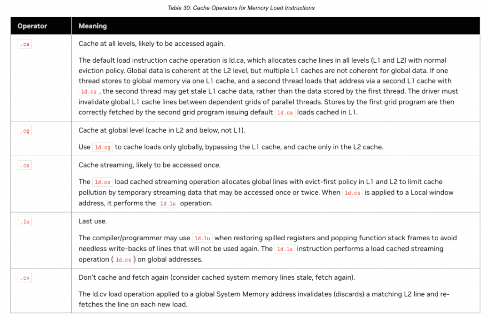

- `ca`: 모든 hierarchical cache에 존재해야 함을 뜻한다. 따라서 L1/L2에 모두 Cache된다. 이것이 default behavior다.
- `cg`: L2에만 Cache되고 L1에는 Cache되지 않음을 뜻한다.
- `cs`: 어떤 data가 한 번만 access될 가능성이 있을 때 이 policy를 사용할 수 있다. L1과 L2Cache에서 Evict-First 처리를 수행하며, SASS instruction에서 EF 속성이 추가된 것을 볼 수 있다. 예를 들어 일부 reduction operation을 수행할 때 선택할 수 있다.
- `lu`: LastUse. Spilled Reg를 복구하고 function stack frame을 pop할 때, 이 속성은 불필요한 write를 피할 수 있다. global address에 operation을 수행하면 cs 속성과 동일하다.
- `cv`: cache가 필요 없음을 뜻한다.

재미있는 면접 문제가 하나 있다. `ld.weak.global.cv`와 `ld.volatile.global`의 차이는 무엇일까? 차이가 없다. 둘 다 LDG.E.STRONG.SYS다. `ld.weak.global.cg`와 이들의 차이는 무엇일까? SASS instruction은 LDG.E.STRONG.GPU다.

그다음 L1Cache eviction policy와 L1Cache를 allocate할지 여부도 정의할 수 있다.

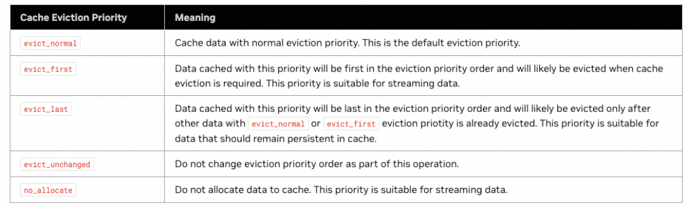

그다음 L2Cache Prefetch의 Size 등도 정의할 수 있다. 마지막으로 Scope parameter는 앞서 memory model을 설명할 때 이미 소개했다.

SM 내부에는 L1Cache 외에도 Read-Only Memory가 하나 있다. "CUDA Refresher: The CUDA Programming Model"[7]에서 이에 대한 소개가 있다.

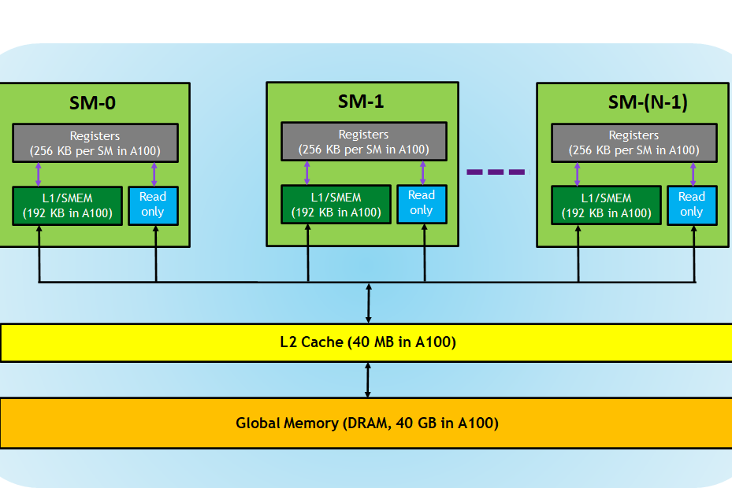

> Read-only memory—Each SM has an instruction cache, constant memory,  texture memory and RO cache, which is read-only to kernel code.

`ld.global.nc`를 사용하면 이 Cache를 선택적으로 사용할 수 있다. 특히 일부 texture cache size가 크고, latency도 충분한 parallelism으로 잘 숨길 수 있는 경우 선택할 수 있다.

```c++
ld.global{.cop}.nc{.level::cache_hint}{.level::prefetch_size}.type                 d, [a]{, cache-policy};
ld.global{.cop}.nc{.level::cache_hint}{.level::prefetch_size}.vec.type             d, [a]{, cache-policy};

ld.global.nc{.level::eviction_priority}{.level::cache_hint}{.level::prefetch_size}.type      d, [a]{, cache-policy};
ld.global.nc{.level::eviction_priority}{.level::cache_hint}{.level::prefetch_size}.vec.type  d, [a]{, cache-policy};

.cop  =                     { .ca, .cg, .cs };     // cache operation
.level::eviction_priority = { .L1::evict_normal, .L1::evict_unchanged,
                              .L1::evict_first, .L1::evict_last, .L1::no_allocate};
.level::cache_hint =        { .L2::cache_hint };
.level::prefetch_size =     { .L2::64B, .L2::128B, .L2::256B }
.vec  =                     { .v2, .v4 };
.type =                     { .b8, .b16, .b32, .b64, .b128,
                              .u8, .u16, .u32, .u64,
                              .s8, .s16, .s32, .s64,
                              .f32, .f64 };
```

예를 들어 `ld.global.nc`를 사용하면 실제 SASS instruction은 LDG.E.CONSTANT다. 여기에 L1Cache no allocate와 L2 Prefetch policy를 추가할 수도 있다. 즉 `ld.global.nc.L1::no_allocate.L2::256B`를 사용하면 이때 SASS instruction은 LDG.E.NA.LTC256B.CONSTANT가 된다. 이것도 DeepEP에서 사용하는 방식이다.

> 요약: 큰 program에서는 유연한 Cache policy를 사용해 Cache utilization을 더 높이고 program efficiency를 개선할 수 있다. 하지만 여기에는 많은 조합이 존재하고 Memory Order 관련 문제도 얽혀 있다. 게다가 많은 조합이 PTX 문서에 자세히 설명되어 있지 않으므로, 앞으로 더 세밀한 분석이 필요하다.

**덧붙여 작은 지식을 하나 이야기하자면, high-frequency trading 쪽 사람들에게 Cache policy / Memory Model은 면접에서 거의 필수로 물어보는 항목이다. program이 ns 단위로 시간을 다투어야 할 때 이것은 필수 skill이기 때문이다. 그래서 DeepSeek 사람들이 이런 극한 최적화를 하는 것은 매우 자연스러운 일이다.**

### 5.2 ST instruction

Store instruction은 다음과 같다.

```c++
st{.weak}{.ss}{.cop}{.level::cache_hint}{.vec}.type   [a], b{, cache-policy};
st{.weak}{.ss}{.level::eviction_priority}{.level::cache_hint}{.vec}.type
                                                      [a], b{, cache-policy};
st.volatile{.ss}{.vec}.type                           [a], b;
st.relaxed.scope{.ss}{.level::eviction_priority}{.level::cache_hint}{.vec}.type
                                                      [a], b{, cache-policy};
st.release.scope{.ss}{.level::eviction_priority}{.level::cache_hint}{.vec}.type
                                                      [a], b{, cache-policy};
st.mmio.relaxed.sys{.global}.type         [a], b;

.ss =                       { .global, .local, .param{::func}, .shared{::cta, ::cluster} };
.level::eviction_priority = { .L1::evict_normal, .L1::evict_unchanged,
                              .L1::evict_first, .L1::evict_last, .L1::no_allocate };
.level::cache_hint =        { .L2::cache_hint };
.cop =                      { .wb, .cg, .cs, .wt };
.sem =                      { .relaxed, .release };
.scope =                    { .cta, .cluster, .gpu, .sys };
.vec =                      { .v2, .v4 };
.type =                     { .b8, .b16, .b32, .b64, .b128,
                              .u8, .u16, .u32, .u64,
                              .s8, .s16, .s32, .s64,
                              .f32, .f64 };
```

많은 내용은 이미 ld 장에서 자세히 소개했다. 핵심은 cache operation policy(COP) 쪽에 설명이 필요하다는 점이다. 주로 write-back을 사용할지 write-through를 사용할지, L1/L2에 cache할지, cache할 때 evict-first policy를 지원할지에 관한 내용이다.

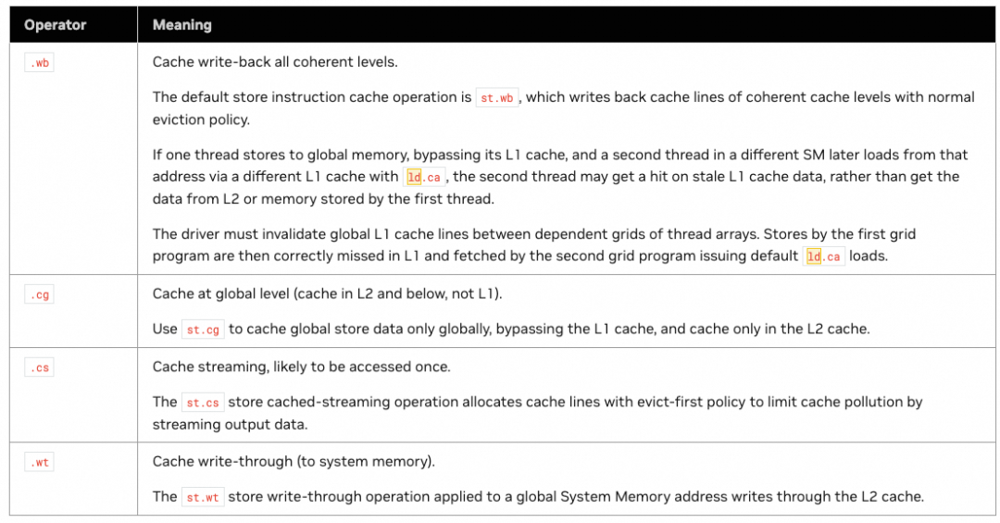

이 내용들도 L1/L2 Cache 점유를 최적화하는 데 큰 도움이 된다.

또 register pressure와 lifetime을 분석하는 방법도 하나 보충하자. 먼저 cuobjdump cubin을 사용한다.

```c++
[root@mem-order ldst]# cuobjdump a.out -xelf all
Extracting ELF file    1: a.1.sm_86.cubin
Extracting ELF file    2: a.2.sm_86.cubin
```

그다음 nvidasm으로 parse한다.

```c++
[root@mem-order ldst]# nvdisasm -plr ./a.2.sm_86.cubin
```

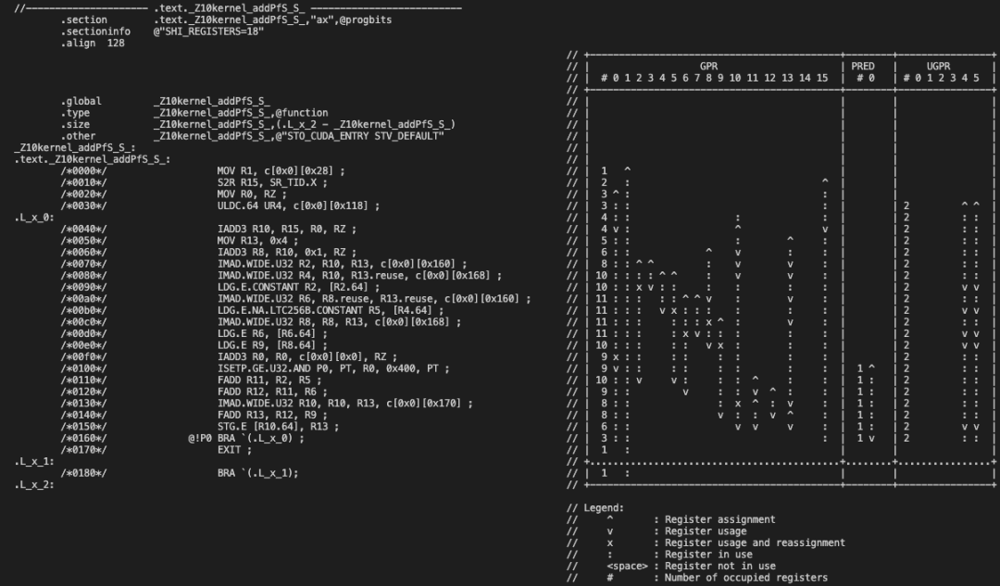

## 6. ScaleUP과 ScaleOut 네트워크 설계 논의

### 6.1 메모리 access Size

사실 새로운 GPU configuration은 5세대 TensorCore 이후 모두 TMEM을 포함한다. 자세한 내용은 [Tensor-011 Blackwell TensorCore](https://mp.weixin.qq.com/s?__biz=MzUxNzQ5MTExNw==&mid=2247493640&idx=1&sn=98cf818a60b670f0d3d40cbbcec4deef&scene=21#wechat_redirect)를 참고하면 된다. TMEM 도입으로 MMA 결과를 배치할 수 있고 register를 점유하지 않게 되었다.

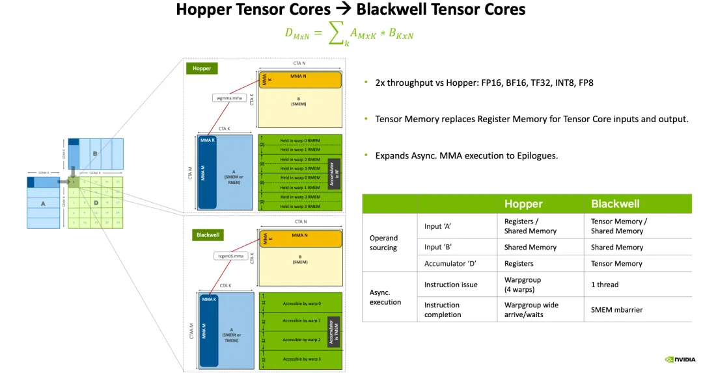

이렇게 되면 compile/operator split scheduling 관점에서 Tile based IR이 더 쉬워진다. Cutlass의 Layout algebra abstraction, Cutlass Distributed GEMMM 관련 작업, 그리고 기존 ecosystem의 Triton, 특히 최근 ByteDance의 Triton-Distributed[8] 같은 훌륭한 작업이 그렇다.

따라서 application 관점에서 보면, 앞으로 ScaleUP과 ScaleOut의 최소 communication unit은 Tile 기준이거나 Token 기준일 것이다. 그래서 message Size는 보편적으로 2KB보다 커질 것이다.

한편 GTC25 session이 loading optimization에 대한 권장사항을 제시한 것도 볼 수 있다.


**chip 사이 ScaleUP과 ScaleOut network에서 small size access에 대해 별도 최적화를 해야 할까?**

질문을 바꿔 보자. 전부 small message, 예를 들어 64B/128B라면 어떻게 될까? 초대규모 network를 구성해야 할 때 network routing/CRC 등의 정보를 담는 Header가 얼마나 필요할까? 일부 special topology를 지원할 때는 보통 source routing header 같은 것도 추가해야 한다. 따라서 small message의 실제 network transmission efficiency는 문제가 된다.

UALink protocol은 DataLink Flit 길이를 640B로, Transaction Layer Flit을 64B로 규정한다.

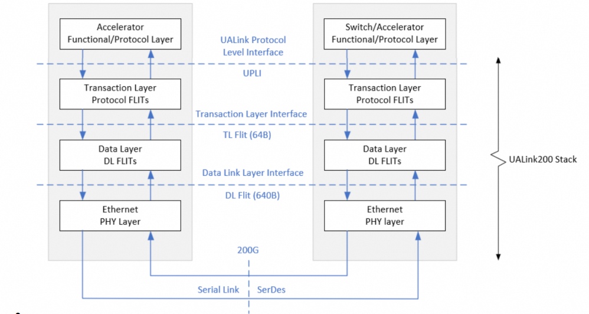

사실 이런 설계는 GPU 측에서는 on-chip network를 붙이기 매우 쉽다. 하지만 UALink Switch가 high throughput을 만들기는 어느 정도 어렵다.

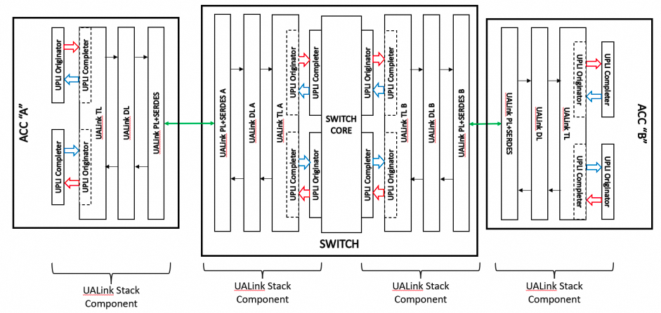

각 Switch는 DL Flit을 풀고, TL Flit을 하나씩 처리해야 한다. switch lookup forwarding pressure가 꽤 크다. 동시에 이것은 switch design도 제약한다. Shared Buffer Switch를 사용한다면 TM의 MMU design이 51.2T/102.4T 같은 rate에서 LineRate PPS를 가득 채우는 것은 매우 어렵다. 그렇다면 결국 PortBased Buffer design으로 바꾸고, switch 위에서 각 UALink마다 작은 Tile based PortLogic을 구성해야 한다. 하지만 congestion control은 또 다른 난제다. UALink가 Credit based 방식을 선택했음에도 그렇다.

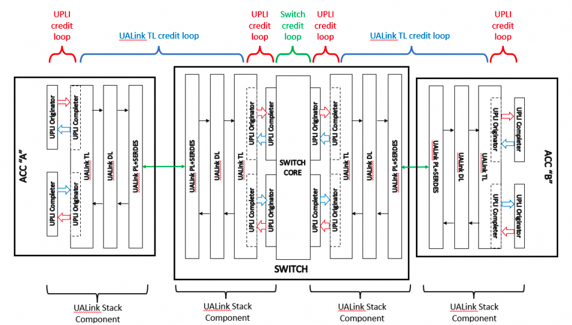

물론 이런 방식으로 천 장 규모 GPU interconnect를 만드는 것이 불가능한 것은 아니며, bandwidth도 단기적으로는 꽤 높게 만들 수 있다. 하지만 장기적 evolution 관점에서는 여전히 몇 가지 문제가 있다고 느껴진다. 물론 또 다른 문제는 NVLink/UALink 같은 것들이 구축하는 `mainframe` system이 장기 evolution 아래에서, 예를 들어 5~10년 뒤에도 계속 존재할 것인가 하는 점이다. 이것도 논의할 가치가 있다.

전체적으로 보면 NVLINK는 extreme case에서 transmission efficiency가 UAL만큼 높지는 않지만, protocol 자체는 더 깔끔해 보이고 switch capacity 경쟁도 더 쉽다.

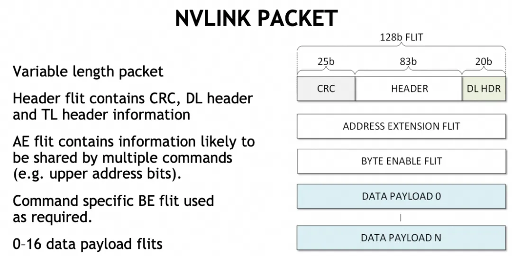

사실 이더넷 테이프 한 장이면 충분하다.

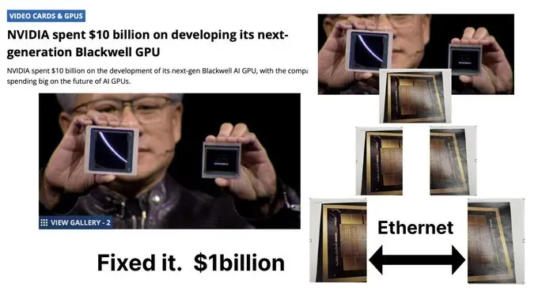

### 6.2 메모리 access latency

앞 장 중 하나에서는 GTC25가 Little's Law로 model한 memory access와 in-flight를 다루었다. 왠지 항상 full load로 동작할 수 있을 것처럼 보인다. 하지만 이런 방식은 실제 workload variation을 고려하지 않는다. 내가 system Scale modeling 관점에서 Little's Law와 Kingman formula를 반드시 함께 봐야 한다고 계속 강조하는 이유가 이것이다.

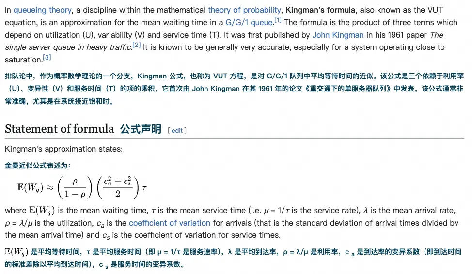

예를 들어 Kingman formula 관점에서 utilization이 100%에 가까워질 때 latency 변화는 이런 curve가 된다:

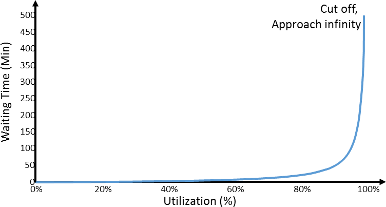

**하지만 많은 경우 latency를 test하고 evaluate할 때 우리는 보통 idle 상황만 본다.** 물론 현재 engineering을 하는 사람들은 일부를 보았을 수 있다. 예를 들어 NCCL launch kernel latency 같은 것이다. 사실 여러분은 cugraph로 kernel launch overhead를 낮추는 한쪽 면만 본 것이다.

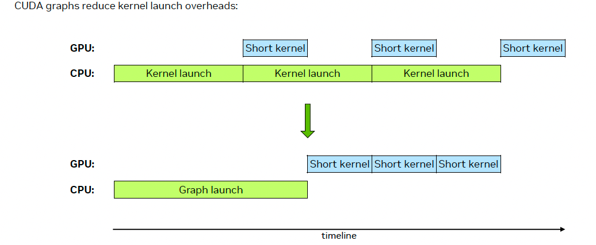

사실 이 문제는 지난해 8월의 글 [HotChip2024 후기: accelerator interconnect 및 ScaleUP에 RDMA를 쓰면 안 되는 이유](https://mp.weixin.qq.com/s?__biz=MzUxNzQ5MTExNw==&mid=2247492300&idx=1&sn=8a239883c831233e7e06659ec3425ea2&scene=21#wechat_redirect)에서 이미 분명히 설명한 적이 있다. 그리고 9월에는 더 깔끔한 해법 몇 가지를 찾아 일부 patent도 출원했다.

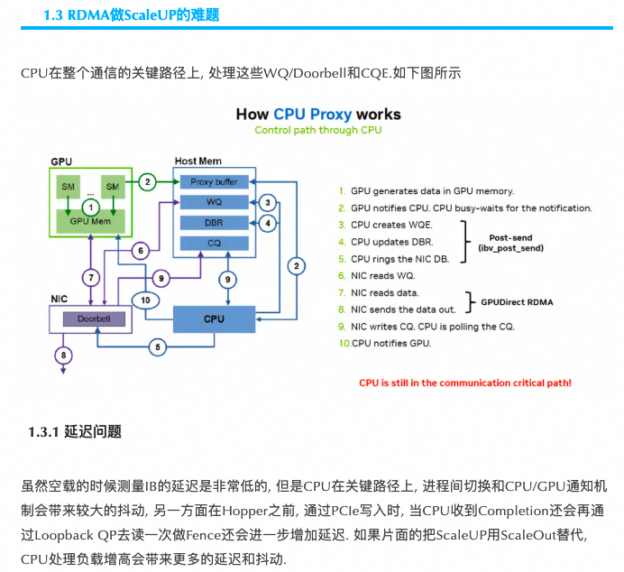

이 글에서는 기존 architecture 아래에서 latency를 피하는 방법도 함께 논의했고, 당시 IBGDA를 제안한 적이 있다.

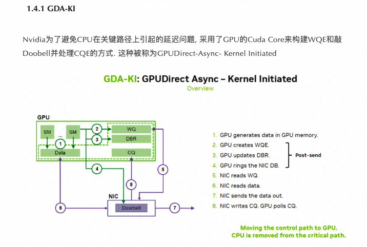

내가 Kingman formula를 반복해서 설명하는 이유는 이렇다. 많은 사람이 RoCE에서 DeepEP benchmark를 잘 돌리지만, 마지막에 E2E performance improvement에 문제가 생기는 근원이 무엇일까? network variation coefficient $C_\alpha$ 관점에서 보면 왜 DeepSeek이 AR을 켜야 하는지 이해할 수 있다. compute service variation coefficient $C_s$ 관점에서 보면 왜 LowLatency Kernel에 Hook을 넣어야 하는지, 왜 GroupGEMM과 EPLB가 필요한지, 그리고 load balancing을 최대한 해서 GEMM computation latency의 jitter를 낮춰야 하는지 이해할 수 있다.

system이 Scaling할 수 있는지는 단순히 switch가 Radix를 얼마나 지원하는지, topology 이론상 몇 장의 card를 붙일 수 있는지의 문제가 아니다. 큰 bandwidth와 낮은 latency를 동시에 요구할 때, system이 full load에 가까워지면 전체 system의 jitter를 어떻게 제어할지가 latency를 낮추는 핵심이다. 이 관점에서 보면 PFC 같은 것들이 At Scale이라고 주장하는 것은 완전히 말이 안 된다. DCQCN은 그렇게 복잡한 model을 만들었지만 가장 기본적인 것을 이해하지 못했다. oops. NV가 이후 DCQCN을 포기한 것도 이상하지 않다.

chip 사이 network access마다 data size가 2KB~4KB이고, asynchronous access로 inflight까지 늘어난다면, jitter control은 static latency보다 더 중요해진다. 사실 이 점을 잘 모르는 사람이 많다. ZhaB는 Cisco에서 십수 년 동안 on-chip network congestion부터 data center, WAN까지 많은 문제를 처리해 왔기 때문에 이 점을 반복해서 강조한다. eRDMA congestion control algorithm을 설계할 때도 이것을 첫 번째 optimization target으로 두었다.

### 6.3 Memory Model

앞에서 memory model을 이렇게 많이 이야기했다. 그렇다면 ScaleUP과 ScaleOut의 memory model은 어떻게 설계해야 할까? synchronous LD/ST와 Cache consistency 같은 sequential consistency 계열의 것들은 분명 inflight-bytes에 영향을 주어 bandwidth를 충분히 활용하지 못하게 한다. 한편 초대규모 networking은 보통 여러 layer의 switch로 구성되므로, data가 여러 path로 forwarding되면서 Data Race 문제가 발생한다. 그리고 여러 packet이 전송될 때 network가 packet loss와 retransmission을 허용할 것인지, retransmission으로 생기는 out-of-order 문제를 어떻게 처리할 것인지도 있다.

현재 산업계의 해법도 매우 기묘하다. Credit Based Flow Control은 zero packet loss를 기대하고, 매우 낮은 error rate도 요구한다. 예를 들어 IB는 1E-15, Eth는 1E-12다. Ethernet 쪽 사람들은 최근 또 LowLatency Retrans(LLR)를 만지작거리고 있다. 그리고 IBTA의 Reliable Connection 정의는 STRONG ORDER를 요구한다. 이것이 다시 Lossless와 Goback-N retransmission, 또는 receiver-side Reorder buffer 재정렬을 도입하게 만든다.

또 다른 극단적인 방식은 AWS SRD로 대표되는 방식이다. transport가 ordering을 전혀 보장하지 않고, 나머지 모든 일을 software에 맡긴다. 그런데 software에 맡기면 communication Kernel에 instruction overhead가 많이 생기고 compute resource를 낭비하게 된다. 다른 한편으로 instruction overhead 관점에서도 [HotChip2024 후기: accelerator interconnect 및 ScaleUP에 RDMA를 쓰면 안 되는 이유](https://mp.weixin.qq.com/s?__biz=MzUxNzQ5MTExNw==&mid=2247492300&idx=1&sn=8a239883c831233e7e06659ec3425ea2&scene=21#wechat_redirect)에서 왜 RDMA 방식을 쓰면 안 되는지 이미 분명히 설명했다. 원래 LD/ST instruction 하나로 끝날 일이 WQE를 준비하고 많은 일을 하도록 뒤틀린다. 이런 방식은 깔끔하지 않다. IBGDA는 현재 architecture 제약 아래의 compromise일 뿐이다. 그래서 DeepSeek이 paper에서 Unified ScaleUP/ScaleOut semantics 요구를 언급한 이유도 볼 수 있다.

사실 NV 자신도 Async Proxy 아래에서 Same-Address의 ordering은 보장하지 않는다.


본질적으로 말하면 compute side조차 그렇게 엄격한 Ordering을 요구하지 않는다. transport 쪽에서 굳이 스스로 일을 키울 필요가 없다. 일부 weak order를 잘 만들면 된다. 사실 이것은 architecture상의 TradeOff다. 이것이 내가 지난 몇 년 동안 algebra 관점에서 Semi-Lattice semantics를 계속 제기해 온 이유다. 3년 전 글 [위로, 미래를 밝히다: DPU의 몇 가지 algebra 문제](https://mp.weixin.qq.com/s?__biz=MzUxNzQ5MTExNw==&mid=2247487512&idx=1&sn=23ca42b52aebb0c8c4014fd4c5dd5942&scene=21#wechat_redirect)를 참고해 볼 수 있다.

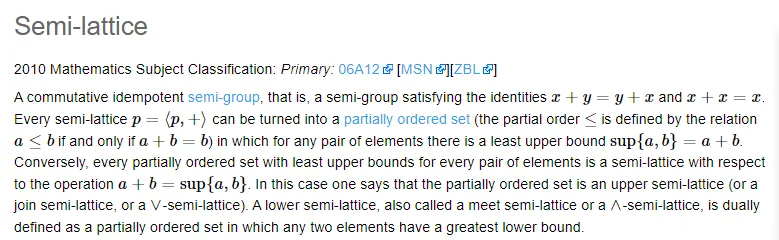

A commutative idempotent semi-group, 여기에 Partially ordered set이 더해지고, 많은 communication multipath는 throughput을 높이기 위해 Out-Of-Order도 필요하다. 사실 근원은 partial order set을 어떻게 이해하고 정의할 것인가에 있다. communication line에 놓으면 multipath 요구 때문에 ordering 보장이 매우 큰 pressure를 만든다. 그렇다면 다른 길을 열어 memory 위에 놓을 수는 없을까? 앞의 모든 dialectical relationship은 바로 이 지점을 던지기 위한 것이다:

먼저 memory distribution을 보자. 사실 이것은 memory address를 sequence로 삼는 partially ordered set이다. memory 위에서 수행되는 operation이 commutative, idempotent를 만족하고 semi-group에서 정의하는 closure와 associativity를 만족한다면, 이 memory operation은 Semi-lattice다. 단순한 memory read/write operation은 idempotent를 만족한다. associativity는 이 operation의 identity element가 무엇인지에 달려 있다. 즉 message를 atom으로 삼는지, Byte를 atom으로 삼는지의 문제다. 예를 들어 memory에서 Write와 Read 사이 operation의 address space가 conflict하면 associativity를 만족하지 않는다. 반면 message semantics는 이 둘을 잘 격리한다. 그래서 distributed parallel programming에서 흔히 보이는 Actor model과 CSP model을 볼 수 있는 것이다.

따라서 message semantics의 memory usage를 identity element로 삼고, memory operation의 address, instruction, message를 함께 bind하면 Semi-lattice의 algebraic structure를 구현할 수 있다. 그러면 large-scale communication의 난제도 해결된다. Commutative law는 Out-of-order가 multipath를 마음껏 사용해 congestion을 해결할 수 있게 해 주고, idempotent는 packet loss가 있어도 마음껏 retransmit할 수 있게 해 주며, associative law는 여러 operation을 algebra적으로 merge한 뒤 remote로 보낼 수 있게 해 준다.

사실 hardware에서 Semi-Lattice를 구현하는 비용은 크지 않다. 먼저 commutative law의 경우 일부 Relaxed Order operation을 허용하면 된다. associativity 구현은 사실 TMA가 바로 이런 처리 방식이다. `tensor_map` descriptor를 통해 operation을 associativity로 통합한다. idempotent도 구현하기 쉽다. 각 transport message에 Seq field를 추가하고, Consumer가 처리한 ci pointer에 fence를 걸어 rewrite를 막으면 된다. 물론 in-network-computing에서는 고려할 것이 조금 있다. addition의 idempotent 처리에도 몇 가지 고려사항이 있다.

결국 programming interface는 이렇게 바뀐다. GPU는 instruction 하나만 issue하고, mbarrier의 `completion_tx` counter를 기다리면 된다.

```c++
cde::cp_async_bulk_tensor_2d_global_to_shared(tile_smem, &tensor_map, x, y, bar);
token = cuda::device::barrier_arrive_tx(bar, 1, sizeof(tile_smem));

// 다른 작업 수행....

// 모든 data 도착 대기
bar.wait(std::move(token));
```

transport에 대한 요구는 이렇게 된다. 전체 TMA instruction이 생성한 fine-grained LD/ST를 하나의 message로 pack하고, message 안에서는 data를 out-of-order로 commit하게 하며, 여러 path로 forwarding할 수 있게 하고, packet loss retransmission도 사실 큰 문제가 없게 한다. 그러면 network의 BER 요구도 낮아진다. 마지막으로 message가 완료될 때 mbarrier를 update하면 되지 않는가? 축하한다. 여러분은 20년 전 iWARP가 이미 끝낸 Direct Data Placement(DDP)를 다시 발명했다.

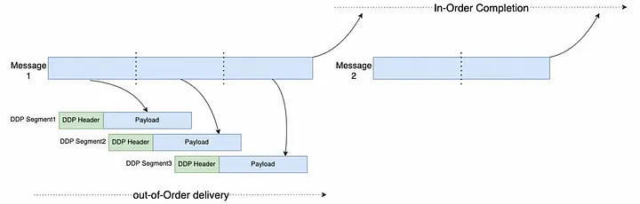

하지만 NV(Mellanox) 사람들은 이 물건을 사실 전혀 잘 이해하지 못한다. AR에서 일부 DDP를 구현했더라도 SEND/RECV의 DDP를 지원할 수 있는가? 당연히 안 된다. 이것은 RoCEv2 protocol의 결함이다. RoCEv2 protocol은 message transmission 방식에 대해 First/Middle/Last를 표시하는 Flag 하나만 규정한다. 중간 message에는 사실 memory operation address가 포함되지 않으므로 ordered transport가 필수다. 나중에 message 하나를 여러 개로 쪼개고 각 message가 RETH를 carry하게 하면, 각 packet은 operation의 memory address를 들고 있지만 SEND/RECV에 대해서는 receive buffer의 absolute address position을 확정할 수 없다. 동시에 NIC에 2개의 port가 있을 때는 XOR로 그중 하나의 port를 선택해 send해야 한다. 두 port 상황에서 single QP load balancing 처리를 어떻게 구현할 것인가?

사실 iWARP의 DDP 정의는 매우 명확하다. Msg Seq Number(MSN) field와 Msg offset(MO) field를 조합하면 된다. 이런 relative offset address 하나로 문제가 해결된다. receiver는 ReOrder buffer가 전혀 필요 없다. data가 오면 offset에 따라 계산해서 memory에 바로 commit하면 된다. 그런 다음 아주 작은 message bitmap을 구성해 모두 수신되었을 때 mbarrier를 update하면 된다. message의 idempotent로 rewrite를 막는 것은 MSN을 간단히 처리하면 된다. 이미 mbarrier를 submit한 MSN에 대해서는 이후 retransmitted message가 도착해도 write를 금지하면 된다.

이것이 eRDMA의 구현 방식이다. 매우 단순하고 hardware overhead도 매우 작다. reorder buffer 때문에 불확정적인 latency와 jitter가 늘어나지도 않는다. 동시에 전체 Fabric 위의 여러 path를 충분히 활용할 수 있고, Fabric local link failure도 tolerate할 수 있다.

이 관점에서 eRDMA(Weak Order), NV(Mellanox)의 StrongOrder, AWS-SRD의 RelaxOrder를 다시 비교하면 무엇이 best practice인지 자연스럽게 판단할 수 있다.


참고 자료

[1]

CUDA Techniques to Maximize Memory Bandwidth and Hide Latency: *https://register.nvidia.com/flow/nvidia/gtcs25/vap/page/vsessioncatalog/session/1727709012449001X6PZ*

[2]

Advanced Performance Optimization in CUDA: *https://www.nvidia.com/en-us/on-demand/session/gtc24-s62192/*

[3]

Sequential Consistency and TSO: *https://www.cis.upenn.edu/~devietti/classes/cis601-spring2016/sc\_tso.pdf*

[4]

SPCL\_Memory Model: *https://spcl.inf.ethz.ch/Teaching/2019-dphpc/lectures/lecture4-memory-models.pdf*

[5]

cuda c programming guide: *https://docs.nvidia.com/cuda/cuda-c-programming-guide/*

[6]

Cluster Group: *https://docs.nvidia.com/cuda/cuda-c-programming-guide/index.html#cluster-group-cg*

[7]

CUDA Refresher: The CUDA Programming Model: *https://developer.nvidia.com/blog/cuda-refresher-cuda-programming-model/*

[8]

Triton-distributed: *https://github.com/ByteDance-Seed/Triton-distributed*
