# Tensor-014 CUDA-Next: task-based tensor computation DSL?

- 원문 제목: CUDA-Next: task-based tensor computation DSL?
- 저자: ZhaB
- 계정: zartbot
- 발행일: 2025년 4월 26일 15:57

## TL;DR

최근 TileLink와 ScaleUP/ScaleOut bus의 co-design을 공부하다 보니 compiler 관련 work에도 관심을 두기 시작했다. 며칠 전 Nvidia Research 웹페이지를 살펴보다가 《Task-Based Tensor Computations on Modern GPUs》[1]라는 매우 흥미로운 work를 발견했다. 이 논문은 programming language top conference인 PLDI'25에 accepted되었다. 사실 최근 한동안 한 가지 문제를 생각하고 있었다. 한편으로 microarchitecture 관점에서는 GPU 안의 DSA(Tensor Core/TMA/RayTracing) 같은 DSA가 점점 많아지고 있어, 다시 목본 주기에 들어간 듯하다. 이런 주기적 변화가 programming 방식에 가져오는 challenge는 무엇일까? 대량의 asynchronous programming은 분명 어려운 문제다. 다른 한편으로 compute capability 요구가 커지면서 ScaleUP/ScaleOut이 가져오는 distributed computing, 그리고 distributed system 위의 programming language adaptation 문제, 특히 distributed system consistency 문제가 있다. 둘은 어떤 co-design을 할 수 있을 듯하다.

이 논문은 Tensor task 기반의 Cypress라는 DSL을 제안한다. 꽤 흥미롭다. compiler backend는 여전히 CUDA code를 생성하지만, 우리가 주목해야 할 점은 DSL이 등장하고 목본 주기 아래 DSA가 점차 mainstream이 되는 상황에서는, 국산 accelerator가 CUDA ecosystem monopoly를 bypass할 기회를 반드시 잡아야 한다는 것이다. 어쩌면 예전 OpenGL 시절처럼 여러 접근이 활짝 피어나는 시대가 다시 올 수도 있다.

## 1. 왜 새로운 DSL이 필요한가

Volta가 Tensor Core를 도입하고 각 thread의 independent PC와 cooperative\_groups를 도입하면서, 사실상 CUDA SIMT의 bulk-sync structure를 깨기 시작했다. 이후 Ampere는 async.cp를 도입해 L1/RF pressure 일부를 해결했다. Hopper에서는 TMA와 임시로 짜맞춘 WGMMA를 추가하고 warp specialization을 구현했다. SIMT의 bulk-sync programming mechanism은 점차 Producer-Consumer structure로 전환되었다. Blackwell에서는 RF burden을 더 줄이기 위해 TMEM을 도입했다. NV-GPU의 수십 년 발전사는 아래 special topic을 보면 자세히 알 수 있다.

[《GPU architecture evolution history》](https://mp.weixin.qq.com/mp/appmsgalbum?__biz=MzUxNzQ5MTExNw==&action=getalbum&album_id=2538479717163761664&scene=173&from_msgid=2247487954&from_itemidx=3&count=3&nolastread=1#wechat_redirect)

흥미로운 주제는 GPU가 heterogeneous accelerator로서 그 자체도 더 heterogeneous해지기 시작했다는 점이다. 이러한 heterogeneous device들은 deep learning이 사용하는 tensor scale이 커짐에 따라, async access로 전체 system throughput을 높이려는 요구가 점점 커지고 있다. 자세한 내용은 다음을 참고할 수 있다.

[《GPU memory model 및 interconnect network design에 대해 이야기하기》](https://mp.weixin.qq.com/s?__biz=MzUxNzQ5MTExNw==&mid=2247493955&idx=1&sn=0e880f3d509f0b494287cb552cbdb236&scene=21#wechat_redirect)

async programming과 DSA가 가져온 complexity는 CUTLASS/ThunderKitten 같은 programming library도 점차 파생시켰다. 하지만 programmer가 communication과 synchronization mechanism을 관리해야 한다. cutlass에 관한 소개는 아래 special topic에 있다.

[《Tensor》](https://mp.weixin.qq.com/mp/appmsgalbum?__biz=MzUxNzQ5MTExNw==&action=getalbum&album_id=3557619493198151684&scene=173&subscene=&sessionid=svr_32119fe6ccb&enterid=1722676230&from_msgid=2247491424&from_itemidx=1&count=3&nolastread=1#wechat_redirect)

data movement와 synchronization을 manual로 관리하는 것은 expert programmer에게도 error-prone하며, Data Race를 유발할 수 있다. 또는 일부 detail에서는 Overlap flow를 자세히 설계해야 하고, 그렇지 않으면 performance loss가 생긴다.

다른 길은 compiler에 모든 detail을 추측하게 맡기는 것이다. 예를 들어 Triton 또는 Triton-Distributed(TILELINK)가 있다. 이러한 방식은 automated heuristic으로 programmer의 부담을 일부 줄일 수 있지만, computation과 data를 physical machine에 어떻게 mapping할지는 여전히 어려운 문제다. 또한 expert가 작성한 일부 Kernel과 비교하면 어느 정도 performance discount가 발생한다.

논문에는 하나의 example이 있는데, Ampere/Hopper의 새로운 DSA 도입과 함께 async programming이 더 복잡해졌음을 볼 수 있다.

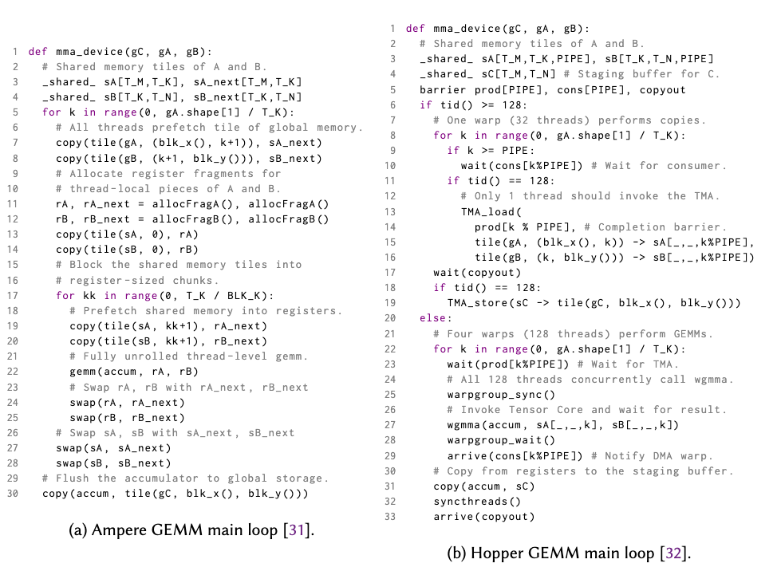

Blackwell에 이르면 Tensor Memory도 explicit하게 관리해야 하므로, 기본적으로 매 세대마다 Kernel을 다시 작성해야 한다.

따라서 industry는 순수 hand-written operator로 programmer가 data movement와 synchronization complexity를 관리하는 방식과, compiler heuristic에 전적으로 의존하는 fully automatic 방식 사이에서 어떤 balance를 얻기를 기대한다. programmer가 복잡한 data movement와 synchronization을 인식하지 않아도 되게 하면서, 동시에 computation을 어떻게 decompose하고 hardware에 어떻게 mapping할지처럼 performance에 핵심적인 부분에 대해서는 충분한 control을 얻는 것이다. 이것이 Cypress의 original intent다.

## 2.Cypress Overview

Cypress는 TensorCore/TMA 같은 asynchronous fixed-function DSA에 의존해 tensor algebra computation을 수행하고, 두 level의 abstraction을 제공한다. Tensor를 DSL의 first-class citizen으로 삼아, Cypress는 TensorCore/TMA 같은 DSA async call의 complexity를 감싸는 sequential programming DSL을 정의한다. 동시에 GPU에서 execute할 code를 생성하는 compiler를 제공하고, near-peak performance를 유지한다. modern GPU memory hierarchy는 다음과 같다:

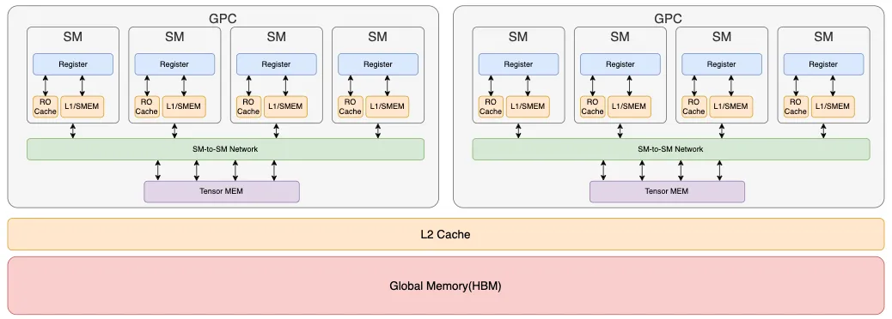

그다음 task로 일련의 sequential programming operator function을 정의하고, computation task를 다음과 같이 abstract한다.

1. Logical Description: computation의 operator decomposition과 해당 computation에서 tunable한 parameter를 정의한다.
2. Mapping Specification: compute unit, 특히 memory hierarchy에 어떻게 mapping할지 정의한다.

사실 이런 decomposition에는 큰 장점이 있다. computation 자체의 logic과 machine memory hierarchy가 분리되기 때문에, 미래의 새로운 DSA hardware 또는 ScaleUP/ScaleOut을 더 지원하는 Distributed-GEMM computation에서 operator adaptation cost가 더 작아진다. 덧붙이면, ScaleUP과 ScaleOut interconnect를 설계할 때도 hardware design은 software와 compiler가 더 잘 처리할 수 있도록 해야 하므로, memory hierarchy abstraction에는 아직 해야 할 일이 많다.

## 3. programming model

### 3.1 Logical Description

computation logical description은 hierarchical Task function structure를 정의한다. 여기에는 서로 다른 hardware에서 tuning parameter를 구성하기 위한 tunable variable이 정의되어 있으며, computation task를 어떻게 partition할지, parameter의 read/write attribute와 처리 scope도 정의된다.

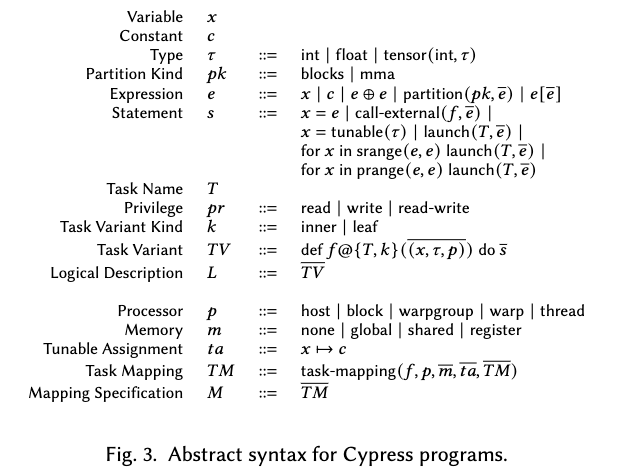

동시에 Task Variant Kind를 정의하며 inner와 leaf 두 type을 지원한다. inner task는 내부에서 제한적인 scalar computation을 지원할 수 있고, 추가로 sub-task를 호출할 수 있음을 의미한다. leaf에는 sub-task가 없으며, 주로 CUDA Core가 Tensor에 access해 다른 operation을 수행하는 데 사용된다. 또한 Inner task에 대해 range로 sub-task를 호출하는 두 strategy를 정의한다. srange는 sequential execution, prange는 parallel execution이다.

tensor split에 대해서도 partition type을 정의한다. 예를 들어 MMA의 swizzle 등이 있다. split 이후의 새로운 sub-matrix coordinate mapping 같은 내용은 cutlass layout algebra 관련 내용을 참고할 수 있다.

[《Tensor-008 CuTe Layout algebra》](https://mp.weixin.qq.com/s?__biz=MzUxNzQ5MTExNw==&mid=2247492220&idx=1&sn=4ec36b34df55ae6c0b643709da3316e1&scene=21#wechat_redirect)

사실 본질적으로는 composable operator의 abstraction process다. 따라서 Composable Disaggregation distributed computing architecture를 구성할 때도 software/hardware interaction interface의 composability를 만족해야 한다. 예를 들어 최근 크게 유행한 MCP는 본질적으로 더 높은 LLM layer에서 정의된 Monad다.

[《Tensor-006 AI software/hardware interaction interface: composable Kernel》](https://mp.weixin.qq.com/s?__biz=MzUxNzQ5MTExNw==&mid=2247491708&idx=1&sn=1fd03181e44f573f6ec1d90d66d93a24&scene=21#wechat_redirect)

사실 이것은 내가 여러 해 전 NetDAM을 설계할 때 강조했던 점이기도 하다. memory Semi-Lattice semantics를 지원하는 데에는 큰 cost가 있지만, memory access 시 commutative law를 지원하면 out-of-order execution이 가능해 concurrency를 크게 높일 수 있다. 다른 한편으로 memory access가 associativity를 만족하면 programming에서 composable operator structure를 더 쉽게 구성할 수 있다. idempotence는 packet loss와 link failure가 발생하는 scenario에서 replay가 side effect를 만들지 않도록 보장해 전체 system reliability를 더 높인다.

### 3.2 Mapping Specification

Cypress의 또 다른 abstraction component는 Mapping Specification이다. 이는 program을 특정 machine description에 어떻게 bind할지를 규정한다. MappingSpec은 performance-sensitive decision을 control할 수 있게 하고, Cypress compiler는 이러한 Mapping이 program correctness에 영향을 주지 않도록 보장한다. MappingSpec은 각 processor Scope에서 어떤 Task를 사용할지, 각 Task의 memory placement를 결정해 task tree를 statically instantiate한다. 각 instance는 name을 갖고, name으로 다른 instance를 reference한다.

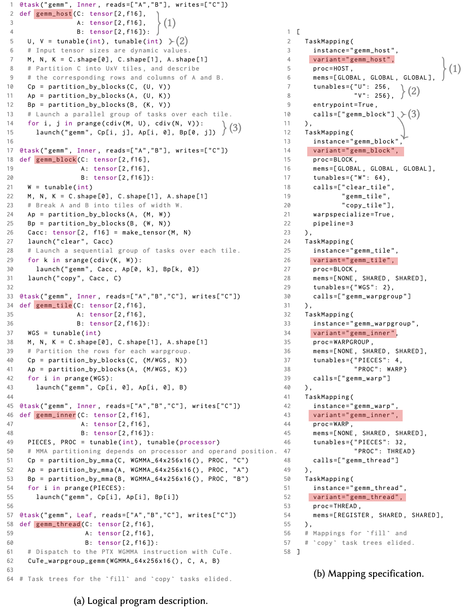

그림과 같이 하나의 Instance는 여러 attribute를 선언한다:

1. Instance execution 시 사용하는 Task Variant
2. Task Variant가 어느 processor(Scope)에서 execution되어야 하는지
3. Task의 각 tensor parameter를 어느 memory에 배치해야 하는지. 각 tensor는 서로 다른 memory에 배치될 수 있다.
4. task variant 안의 tunable parameter(Tunable variable)에 bind되는 concrete value
5. 각 launched Sub-Task를 어느 Task mapping instance에 schedule해야 하는지

MappingSpec은 특정 processor 관련 behavior도 control할 수 있다. 예를 들어 특정 Task에 대한 Warp-specialization, pipeline execution 시 추가 control, tensor layout control(예: Swizzle) 등이 있다.

한편 programmer는 memory hierarchy의 capacity와 performance constraint 때문에, 특정 Tensor가 특정 region에서 full instantiation될 필요 없이 Task-Tree의 더 lower-level Task Instance와 공유되기를 기대하는 경우가 많다. 따라서 Mapping 시 None Memory attribute를 사용할 수 있다. 예를 들어 GEMM의 Accumulator는 더 lower-level task를 통해 partitioned instantiation된다. Compiler는 None Memory attribute가 있는 tensor에 대해 compile time에 해당 constraint를 어느 정도 check해야 한다.

### 3.3 HopperGEMM example

앞 그림의 example처럼, 이것은 Python 기반 DSL이다. 이 program은 GEMM computation task decomposition과 hierarchical tiling process를 어떻게 수행할지를 설명한다. computation task의 entry는 gemm\_host이며, MappingSpec에서도 proc=Host로 정의되어 Host scope에서 execution된다. Host GEMM은 U, V 두 tunable parameter로 matrix를 split하고 각 sub-Block을 정의한 뒤, prange를 호출해 sub-task를 parallel하게 launch한다.

그다음 gemm\_block에는 warp-specialization과 Pipeline orchestration이 추가된다. 이어서 matrix partition을 더 진행해 gemm\_warpgroup과 gemm\_warp/gemm\_thread task를 구성한다. RF에 대한 일부 split과 constraint도 정의한다. 예를 들어 warp group의 pieces는 하나의 WarpGroup에 mapping되어 4개 SM을 호출하고, 각 SM은 gemm\_warp에서 4개 thread를 호출한다. 마지막 Leaf task에서 Cypress는 그 내용을 analyze하거나 optimize하지 않고, CUDA code의 thread-level flexibility를 보장한다.

### 3.4 몇 가지 discussion

Logical Description과 MappingSpec의 분리는 programmer가 application code를 intrusive하게 수정하지 않고도 performance-sensitive operator orchestration을 task form 기반으로 조정할 수 있게 한다. 또한 MappingSpec abstraction을 통해 TMA 같은 memory copy도 implicit하게 execute한다.

Cypress는 절충적인 위치에 있다. cutlass처럼 programmer에게 algorithm과 hardware mapping을 manual로 관리하도록 요구하지도 않고, Triton처럼 많은 performance-sensitive decision을 숨기지도 않는다. Cypress는 programmer에게 algorithm과 mapping decision에 대한 low-level control을 제공하면서도 strategy implementation은 자동화해 performance와 correctness를 모두 보장한다.

Cypress programming model은 source algorithm level에서 data partition과 그 usage를 명확히 표현하고, compiler를 통해 program execution의 sequential semantics와 concurrency를 보장한다. direct low-level programming implementation과 비교하면 program execution correctness를 더 잘 보장할 수 있다.

## 4. compilation

Cypress의 전체 compiler architecture와 Event 기반 IR은 다음과 같다:

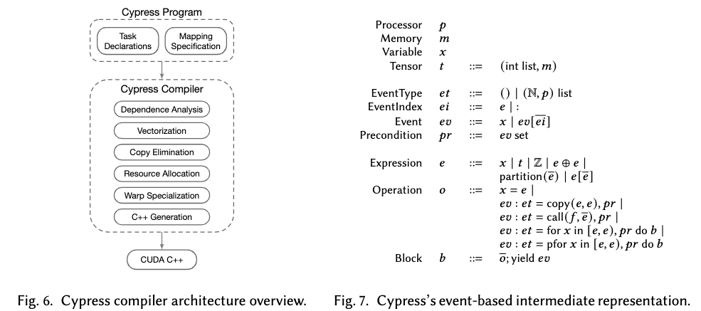

### 4.1 IR

위 그림은 Cypress IR의 simplified syntax를 보여준다. 이 syntax에는 Tensor 사이의 explicit data copy와 task scheduling operation, 그리고 sequential/parallel for loop(prange/srange)에 대응하는 (for/pfor) operation이 포함된다. IR의 potential async operation은 모두 event를 생성하며, block은 자기만의 complete event mechanism을 갖는다.

Cypress IR에서 가장 흥미로운 부분은 event representation이다. event type은 single unit일 수도 있고 event array일 수도 있으며, array의 각 dimension에는 특정 processor type이 annotated된다. event array는 parallel loop가 생성하며, 각 array element는 특정 processor에서 한 iteration이 complete된 event에 대응한다. event array를 index해 future operation이 depend해야 하는 specific event를 추출할 수 있다. event index는 integer value도 사용할 수 있고 broadcast operator도 사용할 수 있다. broadcast operator를 사용하는 것은 꽤 흥미로운데, 특정 dimension의 모든 event completion flag를 index한다는 뜻이고, indexed processor를 dimension 기준으로 synchronize한다.

### 4.2 compiler architecture

Cypress는 Logical Description과 MappingSpec description으로 program을 표현하고 compiler로 CUDA code를 생성한다. compiler는 IR에 대한 일련의 pass를 통해 이 transformation을 완료한다. dependency analysis/vectorization/copy elimination으로 Task-Based representation program의 중요한 정보를 capture하고 task abstraction level을 lower한다. 이어서 resource allocation/Warp-Specialization으로 optimization을 수행하고, 최종적으로 CUDA C++ code로 lower하며 system-specific synchronization mechanism으로 event를 대체하고 valid CUDA program execution에 필요한 다른 transformation도 구성한다.

#### 4.2.1 dependency analysis

이는 Task의 Logical Description과 MappingSpec description을 기반으로 syntax transformation을 수행해 Cypress IR로 변환한다. 이후 IR 위의 Event를 기반으로 dependency analysis를 수행한다. data operation permission, 예를 들어 Read-Only 또는 dependency 없음에 따라 parallel processing을 수행한다. 또한 single logical tensor가 partition되고 서로 다른 Task가 서로 다른 memory로 mapping되는 경우 data movement consistency dependency를 보장한다.

dependency analysis는 instantiated Task Tree를 traverse하고 MappingSpec의 Task Variant entry부터 traversal을 시작한다. Task 안의 각 tensor에 대해 event를 유지하며, Task launch point를 만날 때 launched Task의 data permission을 사용해 해당 event를 그 Task의 precondition으로 등록해 order를 보장한다. task completion 시에는 feedback으로 해당 upper-level event completion event를 update한다.

예를 들어 어떤 task가 tensor에 write하면, 이후 해당 tensor를 read하는 task는 write task completion에 depend하는 event를 기록한다. dependency는 IR 안에서 event를 chain connection함으로써 task call 사이에서 enforced된다. task call을 lower하기 위해 compiler는 MappingSpec을 참조해 called Task Variant와 각 tensor parameter가 어느 memory에 놓여야 하는지 결정한다. called task의 모든 tensor parameter에 대해 dependency analysis는 `CopyInput/CopyOut` convention을 사용한다. 하나의 task call을 Cypress IR로 lower하는 과정은 네 단계로 이루어진다:

1. called Task의 각 tensor parameter에 대해 mapping이 지정한 memory 안에 new allocation을 생성한다.
2. called Task가 read하는 각 tensor parameter에 대해 existing tensor allocation에서 new allocation으로의 copy를 생성하고, 그 copy의 모든 event precondition을 기록한다.
3. 모든 copy completion event를 called task의 precondition으로 기록한 뒤, called task가 선택한 task variant를 recursive traversal해 IR을 생성한다.
4. called Task가 write하는 각 tensor parameter에 대해 new allocation에서 caller task의 existing allocation으로 copy를 생성하고, called task의 completion event를 precondition으로 삼는다.

task group이 parallel execute될 때는 broadcast index operator를 사용해 subsequent operation이 모든 parallel iteration completion을 전제로 하게 만든다. 또한 CopyInput/CopyOut convention을 사용해 dependency analysis가 single task variant 안에 있도록 보장한다. 이런 방식은 불필요한 copy를 일부 도입하지만 compiler complexity를 단순화하며, 최종적으로 subsequent Copy Elimination으로 이러한 unnecessary copy가 제거되도록 보장한다.

#### 4.2.2 vectorization

이어서 Cypress는 vectorization process를 수행해 dependency analysis가 생성한 program의 nested loop structure를 flatten한다. 이 stage는 GPU programming model에 implicit한 nested loop, 예를 들어 warpgroups, warps, thread 대상 pfor loop를 제거한다. vectorization process는 IR 안의 indexable event array를 이용해 parallel loop를 unroll한 뒤에도 iteration 사이의 dependency relation을 유지한다.

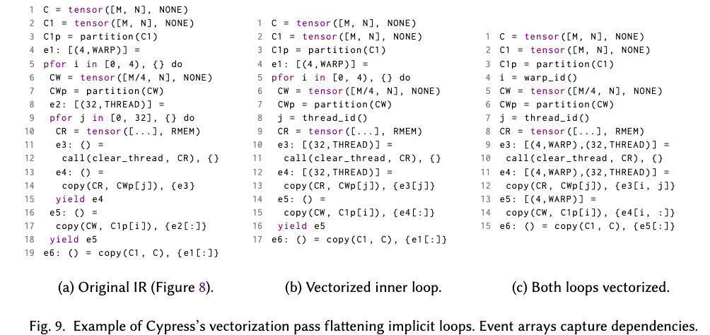

vectorization mechanism은 매우 직접적이다. 가장 깊은 nesting부터 시작해 각 implicit parallel loop를 unroll하고 flatten하며, iteration variable을 processor index(예: warp 또는 thread index)를 계산할 수 있는 expression으로 대체한다. flatten된 implicit loop 안에서 생성된 모든 event array는 해당 loop range와 같은 size의 new dimension을 추가해 lifted된다. 이후 implicit loop 안의 모든 event consumer는 각 event array를 processor index로 index하도록 rewrite된다. 이렇게 unrolled/flattened loop의 independent iteration 사이의 point-to-point dependency가 유지되고, copy와 dependent task 이전에 필요한 synchronization은 event의 broadcast index로 encode된다.

#### 4.2.3 copy elimination

첫 번째 stage에서는 data dependency analysis complexity를 단순화하기 위해 copyinput/copyoutput mechanism을 도입했고, 이 stage에서는 이러한 data copy를 analyze하고 eliminate한다.

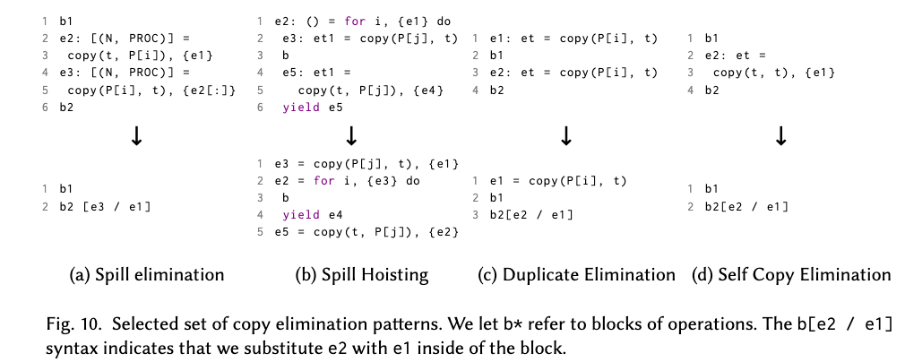

- `Spill Elimination`: 하나의 tensor를 parent tensor의 slice로 copy한 뒤, 다시 해당 parent tensor slice를 original tensor로 copy back하는 방식은 copy를 eliminate할 수 있다.
- `Spill Hoisting`: loop 내부에서 먼저 parent tensor에서 child tensor로 copy하고, 이후 child tensor에서 parent tensor로 copy back하는 case를 식별하면, 이러한 copy operation은 loop의 prologue와 epilogue로 hoist할 수 있다.

이러한 copy elimination 이후 data dependency event도 일부 처리해, dependency 안의 data가 완전히 준비되었음을 보장한다.

#### 4.2.4 resource allocation

copy elimination stage에서 copy 또는 intermediate tensor를 피한 뒤, 남은 tensor는 해당 physical memory로 mapping되어야 한다. 각 SM 내부의 SMEM은 on-chip resource constraint를 받기 때문에 memory resource와 parallelism 사이에 trade-off가 있다. Cypress는 async operation environment를 위해 몇 가지 special strategy를 구성해야 한다. logical tensor 하나가 async operation 때문에 서로 다른 시간에 같은 physical memory space를 reuse할지 결정해야 한다.

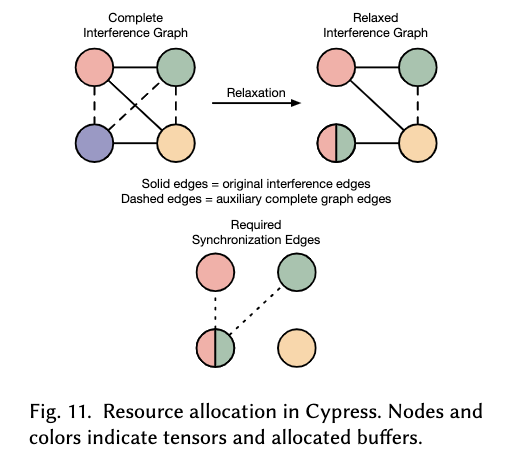

Cypress는 먼저 모든 shared memory Tensor 사이의 interference graph를 구성한 뒤, auxiliary edge를 추가해 graph를 complete하게 만들어 모든 tensor가 independent allocation 방식으로 들어가도록 강제한다. 그다음 user-provided memory limit 안에서 requirement를 만족하는 plan을 iterative하게 구성하고, auxiliary edge를 계속 제거해 완료한다.

같은 memory를 time-division reuse하므로 compiler는 추가 event dependency를 넣어 같은 physical memory에 allocated된 logical tensor들의 live range가 overlap되지 않도록 해야 한다. 주의할 점은 이러한 tensor들이 같은 memory에 allocated되므로, Cypress는 해당 physical memory를 사용하는 adjacent logical tensor 사이, 즉 이전 tensor의 last reader와 다음 tensor의 first writer 사이에 event dependency edge를 삽입해 write-after-read risk를 피한다.

#### 4.2.5 Warp Specialization

이는 computation을 thread block의 여러 warp로 partition해 warp 사이의 concurrency를 드러내고, resource를 여러 warp에 distribute할 수 있게 한다. Cypress는 Task를 여러 compute warp와 하나의 data movement warp로 partition하여 서로 다른 DSA(TC/TMA) 사이 interaction의 interference를 방지하고, compute warp가 더 많은 register file을 얻을 수 있게 한다. Cypress는 이를 graph partitioning algorithm으로 본다. IR의 dependency graph는 compute warp와 data movement warp 사이에서 partition되고 barrier가 삽입되어야 한다.

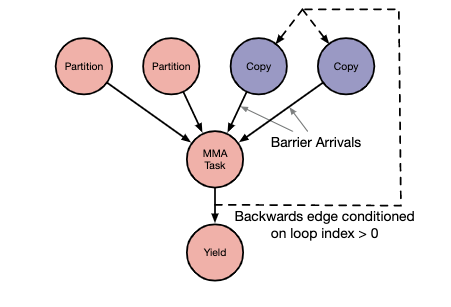

#### 4.2.6 CUDA C++ code generation

code generation에서는 앞서 그림의 independent computation task를 각각 해당 __device__ function으로 구성한 뒤 kernel을 launch한다. 핵심적인 task 중 하나는 specific dependency/async event synchronization mechanism을 구현하는 것이다.

## 5. evaluation

예를 들어 GEMM 처리, 특히 GEMM+Reduction 처리에서 Cypress의 몇 가지 장점을 볼 수 있다.

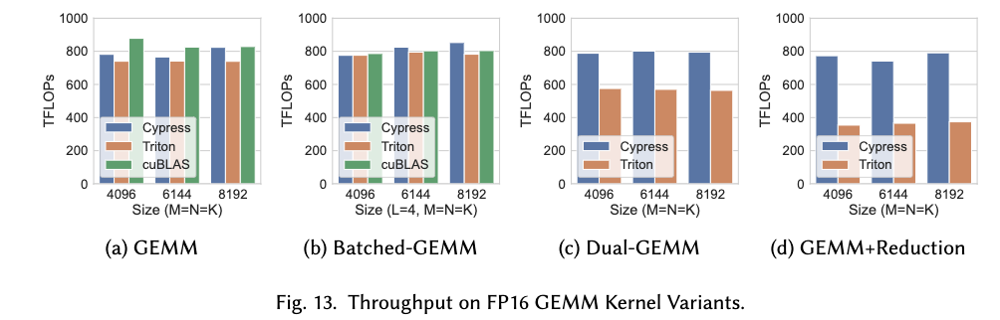

그다음 FlashAttn evaluation도 있다.

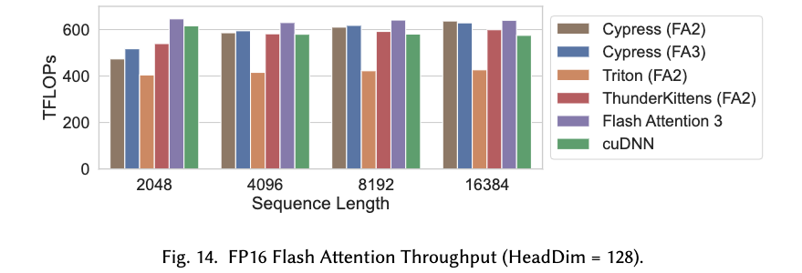

## 6. related work

주요하게 몇 부분으로 나뉜다. 예를 들어 Sequoia는 task-based parallel programming으로 memory hierarchy constraint를 다루지만, 이 model은 modern GPU에서 여러 level의 processor가 여러 memory에 access할 수 있는 상황을 describe할 수 없다. Cutlass 같은 template library에서는 user가 explicit communication/synchronization/warp specialization detail을 직접 처리해야 한다. Cypress는 Cutlass의 CuTe와 layout algebra를 reuse했다. 또 다른 부분은 Triton 같은 tile-based abstraction이다. underlying architecture가 점점 복잡해지고 program이 다양해짐에 따라, compiler가 thread block으로 어떻게 lower할지 완전히 결정하는 program expression은 performance issue를 만들 수 있다. 또한 functional programming 기반 및 scheduling 기반 DSL compiler들도 있다.

## 7. future software/hardware co-design에 대한 생각

논문을 읽고 나서 나도 한 가지 문제를 생각하고 있다. 예를 들어 Cypress over ScaleUP/ScaleOut design, 해당 MappingSpec을 어떻게 할지, 다양한 TP/SP/EP/DP expression을 어떻게 할지, Triton-Distributed(TileLink)와 유사한 work, DeepEP 같은 Buffer abstraction layer를 이들과 어떻게 결합할지 같은 문제다. ScaleUP과 ScaleOut 위의 processor memory hierarchy 처리, 그리고 더 장기적으로 inference system의 KVCache 등도 포함된다.

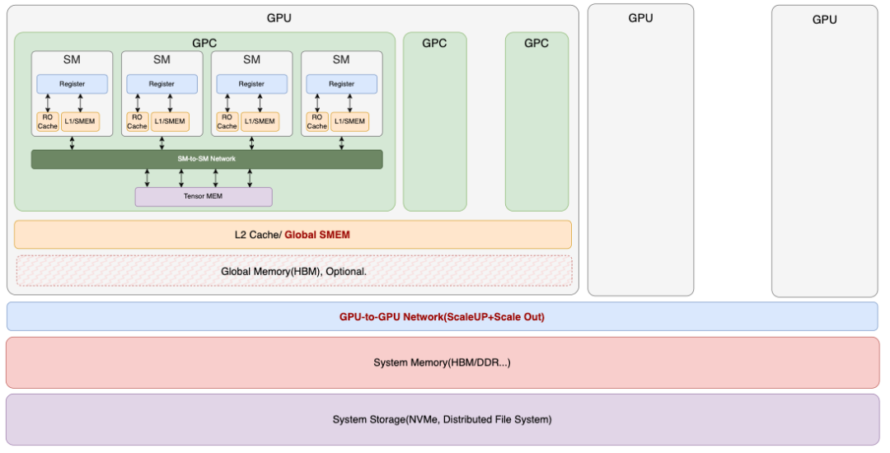

예를 들어 며칠 전 논의한 Tencent의 DeepEP optimization 아래에서, ScaleUP과 ScaleOut protocol 위의 Atomic과 Memory Fence 관련 system design은 꽤 흥미로운 주제다.

더 넓게 보면 NSA, Google Titan, MOBA 같은 새로운 Attn block이 memory access에 대해 더 많은 requirement를 갖는데, 이를 어떻게 더 처리해야 할까? 요 며칠 Google Research의 다른 논문을 읽었고, 더 분석할 예정이다.

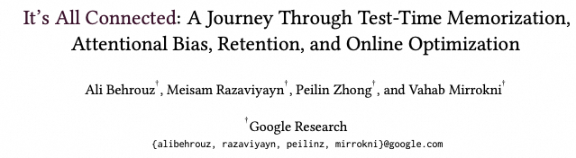

참고 자료

[1]

Task-Based Tensor Computations on Modern GPUs: *https://research.nvidia.com/publication/2025-06\_task-based-tensor-computations-modern-gpus*
