# Tensor-017 CuTe Layout algebra-1: Overview

- 원문 제목: CuTe Layout algebra-1: Overview
- 저자: Tilebot
- 계정: zartbot
- 발행일: 2025년 9월 24일 08:29

### TL;DR

Cutlass에서 가장 어려운 부분 중 하나는 3.0부터 도입된 CuTe tensor와 Layout abstraction이다. 아쉽게도 official document는 완성도가 높지 않고, 그 뒤의 design logic도 자세히 설명하지 않는다. 사용 방법을 알려 주는 몇 가지 case만 있다. 예전에 CuTe Layout에 관한 문서를 하나 정리한 적이 있지만, test 과정에서 반복적인 compile과 수정에 많은 시간이 들었고, 그 뒤의 design logic도 complete하게 탐색하고 설명하지 못했다.

이번에는 cuteDSL을 기반으로 comprehensive하게 탐색하고, algebra 관점에서 다른 Layout algorithm과 비교 분석해 보려 한다. 예를 들어 얼마 전 분석한 [Linear Layout 공부하기](https://mp.weixin.qq.com/s?__biz=MzUxNzQ5MTExNw==&mid=2247496013&idx=1&sn=010d59e5b3916712cfc0164fa063b81c&scene=21#wechat_redirect)가 있다. 이 글을 쓰던 중 마침 colfax가 쓴 훌륭한 글 "Categorical Foundations for CuTe Layouts"[1]도 발견했다. 그래서 이 document를 기반으로 자세히 분석해 보겠다. 이후 이 글에 딸린 150 page PDF도 chapter별로 점차 자세히 분석할 예정이다.

다만 관련된 많은 사람이 category theory 내용을 complete하게 배운 것은 아니므로, 여기서 일부 보충하겠다. 또한 category theory와 다른 algebra 관점에서 large model을 보는 topic은 다음을 참고할 수 있다.

[대형 모델 시대의 수학 기초](https://mp.weixin.qq.com/mp/appmsgalbum?__biz=MzUxNzQ5MTExNw==&action=getalbum&album_id=3210156532718403586#wechat_redirect)

이 글의 목차는 다음과 같다.

```
1. 왜 Layout algebra가 필요한가
1.1 Tensor의 memory storage에서 출발하기
1.2 matrix blocked multiplication 관점에서 보기
1.3 몇 가지 intuitive observation

2. abstract algebra와 category theory 간단 소개
2.1 abstract algebra
2.1.1 Group
2.1.2 Ring
2.1.3 Field
2.1.4 summary와 hierarchy
2.2 category theory
2.2.1 category definition
2.2.2 Morphism
2.2.3 graph
2.3 Functor
2.3.1 functor definition
2.3.2 covariant/contravariant functor
2.3.3 Faithful/Full
2.3.4 forgetful/free functor
2.3.5 Hom functor
2.4 Natural transformation
2.4.1 definition
2.4.2 Representable Functor
2.4.3 Functor Category
2.4.4 Presheaf
2.5 Yoneda Lemma
2.5.1 Yoneda Lemma
2.5.2 Yoneda Embedding
2.6 Universal Construction
2.6.1 Pullback
2.6.2 Pushout

3. Layout algebra
3.1 why Layout matters
3.2 algebraic abstraction
3.3 Tractable Layouts
3.4 Tuple-category
3.5 Layout function and Realization functor
3.5.1 colexicographic isomorphism
3.5.2 Realization Functor

4. Layout operations
4.1 Coalesce
4.2 Complement
4.3 Composition
4.4 a few expansions

5. nested layout and composition algorithm
5.1 nested layout and nested tuple morphism
5.2 composition algorithm
5.3 logical division
5.4 summary

6. relation to theory of operads
6.1 what is an operad
6.2 embedding layout theory into theory of operads
6.3 some additional analysis

7. closing
```

## 1. 왜 Layout algebra가 필요한가

### 1.1 Tensor의 memory storage에서 출발하기

Tensor를 data structure 관점에서 보면 multidimensional array다. Tensor 안 어떤 element의 logical coordinate와 실제 memory address 사이에는 one-to-one mapping이 구성된다. 이 mapping structure의 basic unit이 바로 Layout이다. 실제로 Layout 하나는 Layout function $f_L$이다.

$$
\text{Layout Function }: f_L(\text{ logical coord } ) \rightarrow \text{ physical address offset}
$$

`Layout`은 shape(Shape, S)와 stride(Stride, D) 두 부분으로 구성된다:

- **Shape(S):** integer tuple로, data의 **logical dimension**을 describe한다. 예를 들어 4x8 matrix의 Shape는 (4, 8)이다. Shape는 data의 logical structure를 define한다.
- **Stride(D):** Shape dimension과 match되는 integer tuple로, 각 logical dimension에서 한 unit 이동할 때 physical memory에서 element를 얼마나 "jump"해야 하는지 describe한다.

따라서 Layout을 S와 D로 구성된 object `L = S : D`로 define할 수 있다. 아래는 simple example이다. 4x8 matrix를 memory에 store할 때 보통 두 가지 방식이 있다:

- row-major 4x8 matrix의 경우 Stride는 (8, 1)이고, logical coordinate $(i, j)$에 대응하는 memory offset은 $8i+j$다.

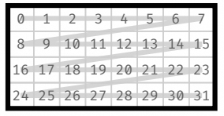

- col-major 4x8 matrix의 경우 Stride는 (1, 4)다. logical coordinate $(i, j)$에 대응하는 memory offset은 $i+4j$다.

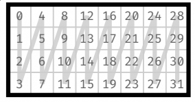

따라서 두 가지 Layout을 얻을 수 있다:

$$
L^{row}=S:D = (4,8):(8,1)
$$

$$
L^{col}=S:D = (4,8):(1,4)
$$

동시에 logical index에서 실제 physical address로 가는 Offset function $f_L$은 어떤 layout이든 Coord와 Stride의 dot product다:

$$
f_L ( coord ) = coord \cdot L_D = row * \text{stride_row} + col * \text{stride_col}
$$

### 1.2 matrix blocked multiplication 관점에서 보기

[Tensor-001 matrix multiplication blocked multiplication overview](https://mp.weixin.qq.com/s?__biz=MzUxNzQ5MTExNw==&mid=2247490988&idx=2&sn=ad84861d6c7ef538027f03edfbe5cea3&scene=21#wechat_redirect)에서 소개했듯 matrix blocked multiplication은 매우 common한 optimization strategy다. 아래 그림과 같다:

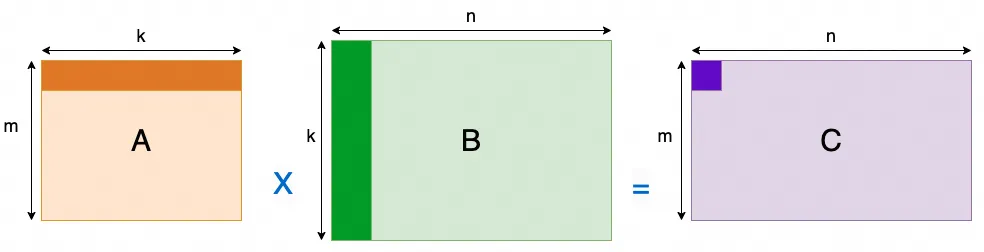

block 내부에서 block multiplication을 수행할 때 memory access order는 A column-first / B row-first 방식으로 바뀐다. 따라서 matrix Layout은 Z-shaped arrangement가 된다. 아래와 같다:

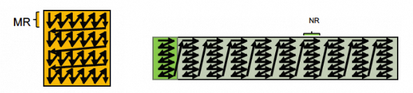

이런 상황을 Layout function으로 어떻게 describe할 수 있을까? 이전 section의 representation과 하나의 unified description으로 결합할 수 있을까? 자세히 보면 matrix 내부의 어떤 dimension에 다시 한 번 Layout을 수행하는 것과 같다. 그래서 우리는 Nested 방식으로 describe한다.

예를 들어 B의 이런 Layout은 `Shape = (4, (2,4))`, `Stride = (2, (1,8))`로 define할 수 있다.

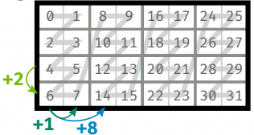

$$
L^{tile1}=S:D = (4, (2,4)):(2, (1,8))
$$

직관적으로 보면 4x8 matrix를 4 x (2x4) block으로 split하는 것이다. 하지만 이렇게 split한 뒤 Stride는 어떻게 계산할까? 그림을 보고 손가락으로 세어 봐야 할까?

더 나아가 아래 그림과 같은 Layout이 필요하다면 Shape와 Stride를 어떻게 계산해야 할까?


$$
L^{tile2}=S:D = ((2,2),(2,4)):((1,4), (2,8))
$$

이는 원래의 4x8 Layout을 기반으로 두 dimension 모두에 embedding을 수행한 것과 같다. `Shape= ((2,2),(2,4))`, `Stride = ((1,4), (2,8))`이다.

위와 같이 그림을 그려 different Shape 아래의 Stride를 observe할 수 있지만, manual handling은 보통 많은 error를 유발한다. 예를 들어 offset을 잘못 계산해 memory access out-of-bounds가 되는 문제가 있다. 더 clever한 방법은 없을까? 그리고 multi-level logical coordinate는 어떻게 처리해야 할까?

### 1.3 몇 가지 intuitive observation

section 1.2에서 4x8 matrix를 block으로 나누는 것을 intuitive하게 "division" operation으로 define할 수 있을까? 예를 들어 4x8 matrix를 여러 2x4 submatrix로 split해 $L^{tile1}$을 구성한다고 하자. 이는 4x8 matrix를 2x4 matrix로 `divide`하여 2x4 submatrix로 채워진 4x1 new matrix를 얻는 것과 같다. 두 번째 example은 2x2 matrix로 `divide`하여 2x2 submatrix로 채워진 2x4 new matrix를 얻는 것이다. `채워진다`는 엄밀하지 않은 표현은 어떤 의미의 `divisibility`를 암시하는 듯하다. 예를 들어 4x8 matrix로는 2x3 matrix를 `exactly divide`할 수 없다.

그다음 Stride를 보자. $L^{tile2}$를 예로 들면, original $L^{col}$ matrix에 대해 `division` $\oslash$를 define하여 다음을 만족하게 할 수 있을까?

$$
L^{tile2} = L^{col} \oslash T = ((2,2),(2,4)):((1,4), (2,8))
$$

그렇다면 그 안의 $T= S:D = (2,2):(x,y)$에서 Stride는 어떻게 표현해야 할까? $L^{col}$ 안의 첫 번째 2x2 Tile의 Stride를 $T$의 Stride로 삼아, 즉 $T=(2,2):(1,4)$로 두면 다음 Layout을 construct할 수 있다.

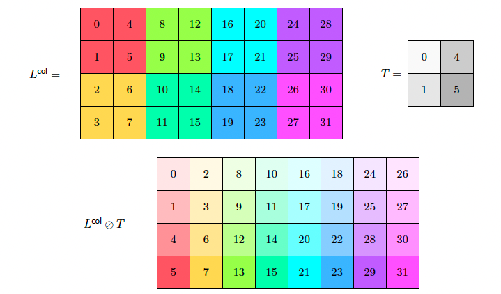

cuteDSL에서의 test는 다음과 같다:

```python
import cutlass
import cutlass.cute as cute

@cute.jit
def logical_divide_example():
    """
    Demonstrates logical divide
    """
    # Define the original layout
    layout = cute.make_layout((4, 8), stride=(1, 4))

    # Define the tiler
    tiler = cute.make_layout((2,2), stride=(1,4))

    # Apply logical divide
    result = cute.logical_divide(layout, tiler=tiler)

    # Print results
    print(">>> Layout:", layout)
    print(">>> Tiler :", tiler)
    print(">>> Logical Divide Result:", result)

cutlass.cuda.initialize_cuda_context()
logical_divide_example()

>>> Layout: (4,8):(1,4)
>>> Tiler : (2,2):(1,4)
>>> Logical Divide Result: ((2,2),(2,4)):((1,4),(2,8))
```

여기에는 어떤 operation rule이 숨어 있는 것처럼 보이지만, 이 rule은 기존의 사칙연산과는 다르다. 이것이 우리가 **abstract algebra**와 **category theory**를 도입해야 하는 근본 이유다.

앞 글 [Linear Layout 공부하기](https://mp.weixin.qq.com/s?__biz=MzUxNzQ5MTExNw==&mid=2247496013&idx=1&sn=010d59e5b3916712cfc0164fa063b81c&scene=21#wechat_redirect)의 abstract algebra chapter에서 소개했듯, 지금 손에는 $L=S:D$라는 장난감들이 있다. 이제 다양한 Layout을 생성하는 요구를 만족할 수 있는 놀이 방식을 만들어야 한다. 이것이 Layout algebra를 도입하는 이유다.

## 2. abstract algebra와 category theory 간단 소개

### 2.1 abstract algebra

여기서는 주로 CS 배경의 사람이 이해할 수 있는 언어로 쓰려고 한다. 그래서 그렇게 formal하고 엄밀한 설명은 아니다.

어떤 `장난감`들이 있다고 하자. 이것이 algebra에서의 element set이다. 그리고 몇 가지 `놀이 방식`이 있다. 이것이 operation, 예를 들면 addition, multiplication이다. abstract algebra는 "이 장난감 세트"에 "이 몇 가지 놀이 방식"을 붙였을 때 어느 정도의 "조화"를 이룰 수 있는지를 연구하는 학문이다. "조화"의 정도는 낮은 것부터 높은 것까지 Group, Ring, Field다.

#### 2.1.1 Group

Group은 마치 bronze player와 같다. 장난감 세트는 있지만 고정된 `한 가지` 놀이 방식만 있다. 예를 들어 레고를 가지고 놀 때의 "조립"이 그렇다. 보통 우리는 이런 고정된 놀이 방식을 간단히 "addition"이라고 부른다.

이것은 다음 네 가지 기본 규칙을 만족하며, `self-contained, reversible`한 작은 집단을 형성한다:

1. `새 장난감을 만들지 않음(closure)`: 임의의 두 장난감을 가져와 "조립"하면 결과도 여전히 이 장난감 세트 안의 하나다. 이상한 새 것이 튀어나오지 않는다.

- `예`: integer addition. 임의의 두 integer를 더하면 결과도 integer다.

2. `조립 순서는 중요하지 않음(associativity)`: 장난감 A, B, C가 있다고 하자. 먼저 A와 B를 붙인 뒤 C를 붙이는 것과, 먼저 B와 C를 붙인 뒤 A를 붙이는 것은 결과가 같다.

- `예`: $(2+3)+4$와 $2+(3+4)$의 결과는 같다.

3. `아무것도 하지 않는 장난감(identity element)`: 장난감 안에는 "공기"라고 부를 수 있는 특별한 장난감이 있다. 어떤 장난감이든 "공기"와 조립하면 자기 자신 그대로다.

- `예`: integer addition의 `0`. 어떤 수에 0을 더해도 자기 자신이다.

4. `모든 장난감에는 "분해" 파트너가 있음(inverse element)`: 각 장난감 A에 대해 항상 다른 장난감 B를 찾을 수 있고, 둘을 붙이면 다시 그 "공기" 장난감으로 돌아간다. 이는 모든 operation이 `reversible`하다는 뜻이다.

- `예`: integer $5$의 "분해" 파트너는 $-5$다. $5 + (-5) = 0$이기 때문이다.

> 만약 이 놀이 방식이 "A와 B를 조립"한 결과와 "B와 A를 조립"한 결과가 같다는 commutativity까지 만족하면, 이 group은 더 조화롭다. 이를 "Abelian Group"이라고 하며, commutative group이라고도 부른다.

#### 2.1.2 Ring

Ring은 Group이라는 bronze player가 두 번째 놀이 방식을 배워 silver player가 된 것과 같다. 장난감은 "조립"(addition)뿐 아니라 두 번째 놀이 방식, 예를 들어 "복제"도 할 수 있다. 우리는 이를 간단히 multiplication이라고 부른다. Ring은 다음을 만족한다:

1. "조립" 놀이 방식 아래에서는 완벽히 조화로운 group, 즉 Abelian Group이다. 위의 Group 규칙을 모두 만족하며 commutative이기도 하다.
2. "복제" 놀이 방식도 기본적으로 규칙을 지킨다:

- 두 장난감을 "복제"하면 결과가 여전히 community 안에 있다. multiplication closure다.
- 연속해서 "복제"하는 순서는 중요하지 않다. multiplication associativity다.

3. 두 놀이 방식이 조화롭게 공존한다(distributivity). "복제"를 "조립" 위에 분배할 수 있다. 예를 들어 A와 B를 먼저 붙인 뒤 전체를 3번 복제하는 것은, A를 3번 복제하고 B를 3번 복제한 뒤 두 더미를 붙이는 것과 결과가 같다.

- `예`: $3 \times (4+5)$는 $(3 \times 4) + (3 \times 5)$와 같다.

하지만 Ring의 "불완전함"은 Ring 안의 "복제"(multiplication) 놀이 방식이 보통 모든 장난감에 "분해" 파트너를 요구하지 않는다는 데 있다. 즉 **Ring은 division이 가능하다고 보장하지 않는다**.

- `예`: integer. $3 \times 2 = 6$은 할 수 있지만 integer 세계에서 $3 \div 2$는 할 수 없다.

#### 2.1.3 Field

Field는 diamond player에 해당한다. Group(bronze)과 Ring(silver) player의 기반 위에서 장난감의 놀이 방식을 완전히 숙달한 상태다. "Field"는 극도로 완벽한 "Ring"이며, "복제"(multiplication) 놀이 방식에 더 높은 요구를 둔다:

1. 먼저 Ring이다. addition, subtraction, multiplication을 모두 할 수 있고 distributivity도 성립한다.
2. "복제" 놀이 방식도 거의 완벽한 조화에 도달했다:

- "A가 B를 복제"한 결과와 "B가 A를 복제"한 결과가 같다. multiplication commutativity다.
- "공기"(0)라는 특별한 장난감을 제외하면, 모든 장난감은 "역방향 복제" 파트너를 가진다. multiplication inverse다. 예를 들어 장난감 A에 대해 항상 장난감 B를 찾을 수 있고, 둘을 "복제"하면 "한 개"를 대표하는 장난감, 즉 multiplication identity인 `1`로 돌아간다. 이 "역방향 복제"가 바로 division이다!

"Field"는 addition, subtraction, multiplication, division(0으로 나누는 것 제외)을 자유롭게 수행할 수 있는 완벽한 system이다. 우리가 가장 익숙한 사칙연산을 제공한다.

- `예`: rational number(fraction), real number는 모두 Field다. real number에서는 $3 \div 2 = 1.5$를 할 수 있다.
- `반례`: integer는 Field가 아니다. division이 통하지 않기 때문이다.

#### 2.1.4 summary와 hierarchy

- **Group**: `{장난감 + reversible한 놀이 방식 1개}`. 예: integer + addition. `->` `addition과 subtraction`을 보장한다.
- **Ring**: `{Group + 두 번째 놀이 방식 + 두 놀이 방식이 distributivity로 연동}`. 예: integer + addition과 multiplication. `->` Group 위에 `multiplication`을 추가한다.
- **Field**: `{완벽한 Ring + 두 번째 놀이 방식도 reversible}`. 예: real number + addition과 multiplication. `->` Ring 위에 *`division`*을 추가한다. 0으로 나누는 것은 제외한다.

위로 갈수록 structure는 더 "완벽"해지고 restriction은 많아지지만, 할 수 있는 일도 더 많아진다. abstract algebra는 이런 방식으로 서로 다른 mathematical world의 "capability boundary"를 정확히 설명한다.

### 2.2 category theory

category theory의 basic knowledge introduction은 다음을 참고할 수 있다.

[대형 모델 시대의 수학 기초(2)](https://mp.weixin.qq.com/s?__biz=MzUxNzQ5MTExNw==&mid=2247488528&idx=1&sn=fa49e334201e738e7ddb4258030798b3&scene=21#wechat_redirect)

[대형 모델 시대의 수학 기초(6)-word2vec에서 representation theory, compositionality, monoidal category와 Dataflow Optics 이야기](https://mp.weixin.qq.com/s?__biz=MzUxNzQ5MTExNw==&mid=2247488775&idx=1&sn=1793eb897beb71ce4a64c9ab44beee6b&scene=21#wechat_redirect)

Emily Riehl의 Category Theory in Context 첫머리 문단을 인용해 category theory가 무엇인지 설명해 보자:

Atiyah는 mathematics를 "science of analogy"라고 describe했다. 이 영역에서 category theory의 vision은 mathematics의 analogy다. category theory는 interdisciplinary mathematical language를 제공하며, general phenomenon을 outline하여 idea가 한 research field에서 다른 field로 transfer될 수 있게 한다. category-theoretic viewpoint는 simplified abstraction으로 작동해, formal reason 때문에 성립하는 proposition과 특정 mathematical discipline의 technique가 필요한 proposition을 분리한다. subtle한 perspective shift는 mathematical content를 고려 대상 object의 종류에 상대적으로 무관한 language로 describe할 수 있게 한다. category theory method는 object를 직접 characterize하지 않고, 같은 general type의 object 사이의 transformation을 강조한다.

category theory는 mathematics의 interdisciplinary field로, mathematical phenomenon을 이해하기 위한 new perspective를 채택한다. mathematics의 대부분 다른 branch와 달리 category theory는 고려되는 object 자체에 그다지 관심이 없다. 대신 같은 type object 사이, 그리고 서로 다른 type object 사이의 relationship에 집중한다. 그 abstraction과 breadth 덕분에 algebra, geometry, topology, analysis 등 여러 다른 branch에 닿고 이들을 connect할 수 있다.

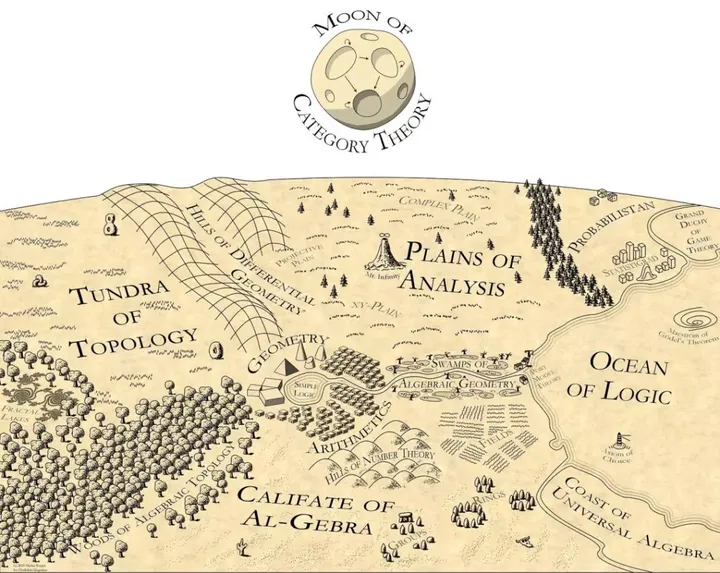

category theory의 central theme 중 하나는 abstraction이다. object를 개별적으로만 보지 않고 generalization을 통해 이해한다. taxonomy와 유사하게 category theory는 mathematical concept을 abstract하고 unify하는 방법을 제공한다. 그중 가장 중요한 Yoneda Lemma는 object를 다른 object와의 relationship을 통해 formally define할 수 있게 해 주며, 이는 category theory가 취하는 relationship-centered viewpoint의 core다.

#### 2.2.1 category definition

category $\mathcal{C}$는 a universe of `objects` $Ob(\mathcal{C})$와 그 사이의 `morphisms` $Mor(\mathcal{C})$로 구성된다. 여기서 일부러 a `set` of objects가 아니라 universe를 쓰는 이유는 Russell's paradox를 피하기 위해서다. 동시에 `small category`의 definition을 다음과 같이 제시한다:

> A category is `small` if it has a `small set` of `objects` and a `small set` of `morphisms`.

그리고 이 objects와 morphisms는 다음 condition도 만족해야 한다.

- 각 object $A$에 대해 unique identity morphism $id_A: A\rightarrow A$가 존재한다.
- $f: A \rightarrow B$와 $g: B \rightarrow C$에 대해 composition $g \circ f: A \rightarrow C$가 존재한다.
- 임의의 morphism $f: A \rightarrow B$에 대해 $id_B \circ f = f \circ id_A = f$다.
- 임의의 composable $f,g,h$에 대해 $h \circ ( g \circ f) = (h \circ g)\circ f$다.

`Example.1` 예를 들어 `FishA`, `FishB`, `FishC`, `FishD`, `FishE`, `FishF`를 object로 삼고, fish radical을 가진다는 relation을 morphism으로 구성한다고 하자:

- $f: FishA \rightarrow FishB$, $g: FishB \rightarrow FishF$에 대해 composition $g \circ f: FishA \rightarrow FishF$가 존재한다.
- 임의의 morphism, 예를 들어 $f: FishA \rightarrow FishB$, $id_a: FishA \rightarrow FishA$, $id_b: FishB \rightarrow FishB$에 대해 $id_B \circ f = f \circ id_A = f$다.
- 어떤 composable $f,g,h$에 대해서도 $h \circ ( g \circ f) = (h \circ g)\circ f$다.

따라서 우리는 fish radical을 가진다는 relation으로 category를 구성했다. 이 object들은 모두 single character label로 set을 이룰 수 있고, 모든 relation도 set을 이룰 수 있으므로 이 fish-relation category가 small하다고 말할 수 있다.

**생각해 볼 문제**: category theory에서 object가 만족해야 하는 morphism condition은 매우 simple하다. Layout 하나를 object로 삼는다면, category definition을 만족하도록 morphism을 어떻게 define할 수 있을까?

##### 2.2.2 Morphism

morphism $f: X \rightarrow Y$는 X에서 Y로 가는 arrow로 볼 수 있으며, $dom f=X$(domain), $cod f = Y$(codomain)로 적는다. $C$의 두 object $X,Y$에 대해 X를 domain으로, Y를 codomain으로 갖는 모든 morphism은 $Hom_C(X,Y)$를 구성한다.

> 주의: $Hom_C(X,Y)$가 반드시 set인 것은 아니다. 임의의 $X,Y \in Obj(C)$에 대해 $Hom_C(X,Y)$가 set이면, $C$ is `locally small`이라고 부른다.

morphism의 domain과 codomain이 있다면, 여러 개가 하나를 가리키거나 하나가 여러 개를 가리키는 경우는 어떻게 define할까? inverse arrow는 존재하는가? 자기 자신을 가리키는 경우는? 이런 type에 대해 다음과 같이 define한다:

`isomorphism`: $f: X \rightarrow Y$라고 하자. morphism $g: Y \rightarrow X$가 존재해 $f \circ g = id_Y$와 $g \circ f = id_X$가 성립하면, $f$를 isomorphism morphism이라고 부르고 X와 Y가 isomorphic하다고 하며 $X \cong Y$로 적는다.

> category $C$의 모든 morphism이 isomorphism이면 이를 `Groupoid`라고 부른다.

`Example.1` 예를 들어 Transformer에서 LoRA로 fully-connected layer를 replace할 때, 두 layer 사이의 Morphism isomorphism을 어떻게 보장할 수 있을까?

`epimorphism`: $f: X \rightarrow Y$에 대해, 모든 $Y \rightarrow Z$ morphism $g_1,g_2$에 대해 $g_1 \circ f = g_2 \circ f \Rightarrow g_1 = g_2$가 성립하면 epimorphism이다. function definition의 surjective와 유사하다.

`monomorphism`: $f: X \rightarrow Y$에 대해, 모든 $Z \rightarrow Y$ morphism $g_1,g_2$에 대해 $f \circ g_1 = f \circ g_2 \Rightarrow g_1 = g_2$가 성립하면 monomorphism이다. function definition의 injective와 유사하다.

`endomorphism`: $dom f = cod f = X$, 즉 $f: X \rightarrow X$다.

`automorphism`: endomorphism이 isomorphism이기도 하면 automorphism이라고 부른다.

**문제** 흥미로운 topic 하나가 있다. heterogeneous computing을 이야기할 때 그에 대응하는 isomorphic expression은 무엇인가? 여러 heterogeneous hardware의 isomorphic expression에 해당하는 IR layer는 어떤 모습이어야 하는가? 이 isomorphism은 PyTorch 위 model structure의 isomorphic expression인가, tensor computation layer인가, 아니면 low-level인가? CUDA reconfiguration과 compatible해야 하는가? 그렇지 않으면 각 heterogeneous accelerator card가 자기 framework를 갖게 되고, 그런 heterogeneity는 아무 의미가 없다. tensor operation에 대한 이 질문의 answer는 무엇인가? Triton인가? CuteDSL인가? Tilelang인가?

##### 2.2.3 Graph

category theory에서는 보통 diagram 방식으로 object와 morphism을 표현하며, morphism은 diagram에서 arrow로 표시한다. 각 arrow $f$는 다음 property를 가진다:

- source object 또는 domain: arrow가 출발하는 object이며 $dom(f)$로 적는다.
- target object 또는 codomain: arrow가 향하는 object이며 $cod(f)$로 적는다.

category theory의 composability, 즉 $f: A \rightarrow B$와 $g: B \rightarrow C$에 대해 composition $g \circ f: A \rightarrow C$가 존재한다는 것은 diagram으로 표현할 수 있다.

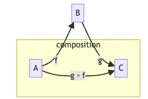

commutative diagram은 object와 arrow로 구성된 diagram이며, 특정 property를 만족한다. diagram 안의 임의의 start object에서 임의의 end object로 가는 모든 path의 composite result가 같다. 다시 말해 "different paths, same destination"이다. 예를 들어 위 그림은 commutative diagram이고, 아래 그림은 또 다른 example이다.

$$
\require{AMScd}
\begin{CD}
A @>{f}>>B\\
@VV{h}V @VV{g}V \\
 D @>{k}>> C
\end{CD}
$$

### 2.3 Functor

#### 2.3.1 functor definition

$C,D$가 두 category라고 하자. functor $F:C \rightarrow D$는 다음을 제공한다:

- $C$ 안의 각 object $X \in C$에 대해 $D$ 안의 object $F(X) \in D$가 대응된다.
- $C$ 안의 각 morphism $f:X \rightarrow Y$에 대해 $D$ 안의 morphism $F(f): F(X) \rightarrow F(Y)$가 대응된다.

그리고 다음을 만족한다.

- $C$ 안의 object $X \in C$에 대해 $F(Id_x) = Id_{F(X)}$다.
- $C$ 안의 임의의 morphism $f:X \rightarrow Y$, $g:Y \rightarrow Z$에 대해 $F(g \circ f)=F(g) \circ F(f)$다.

`Example1` training set에서 training data와 label 사이에는 morphism f가 있다. 우리는 machine learning model이 `model category` 안에 morphism을 construct하기를 기대한다. 많은 language model을 예로 들면, Tokenizer는 실제로 functor다.

$$
\require{AMScd}
\begin{CD}
training data @>{f}>> label\\
@VVV @VVV \\
 M(training data) @>{Mf}>> M(label)
\end{CD}
$$

#### 2.3.2 covariant/contravariant functor

`Covariant Functor`: covariant functor $F: C \rightarrow D$에 대해 $X,Y \in C$, $F(X),F(Y) \in D$다.

$$
\require{AMScd}
\begin{CD}
X @>{F}>>F(X)\\
@VV{f}V @VV{Ff}V \\
 Y @>{F}>> F(Y)
\end{CD}
$$

`Contravariant Functor`: contravariant functor $F: C^{op} \rightarrow D$에 대해 $X,Y \in C$, $F(X),F(Y) \in D$다.

$$
\require{AMScd}
\begin{CD}
X @>{F}>>F(X)\\
@AA{f}A @VV{Ff}V \\
 Y @>{F}>> F(Y)
\end{CD}
$$

#### 2.3.3 Faithful/Full

`Faithful`: 각 $A, B \in C$, $f,g \in Hom_C(A,B)$에 대해 $Ff=Fg \Rightarrow f=g$다. 한국어로는 Faithful을 충실하다고 번역할 수 있다. 간단히 말해 F가 induce하는 map $Hom_D(A,B) \rightarrow Hom_D(F(A),F(B))$가 injective라는 뜻이다.

`Full`: 각 $h \in Hom_D(FA,FB)$에 대해 $h=Ff$를 만족하는 $f \in Hom_C(A,B)$가 존재한다. 간단히 말해 F가 induce하는 map $Hom_D(A,B) \rightarrow Hom_D(F(A),F(B))$가 surjective라는 뜻이다.

`Fully Faithful`: F가 induce하는 map $Hom_D(A,B) \rightarrow Hom_D(F(A),F(B))$가 bijective라는 뜻이다. 한국어로는 완전 충실이라고 옮길 수 있다.

`Example1`: foundation model에 대한 우리의 요구는 그것과 `world category` 사이의 functor가 fully faithful하다는 것이다.

#### 2.3.4 forgetful/free functor

`forgetful functor`는 category 안의 일부 structure를 잊어버리는 functor다. 예를 들어 $F: Grp \rightarrow Set$는 complex algebraic structure를 가진 group category에서 set category로 가는 functor다.

`free functor`는 forgetful functor의 reverse이며, 예를 들어 $F: Set \rightarrow C$로 define할 수 있다.

#### 2.3.5 Hom functor

$h^A:Hom(A, -):C\rightarrow Set$는 covariant functor이며 다음을 포함한다.

- category C 안의 각 element X에 대한 morphism $Hom(A,X)$
- 각 morphism $f:X \rightarrow Y (X,Y \in C)$에 대해 $Hom(A,f):Hom(A,X) \rightarrow Hom(A,Y)$는 일련의 morphism으로 구성되는 $f \circ g:A \rightarrow X \rightarrow Y$로 볼 수 있다. 여기서 $g$는 $Hom(A,X)$ 안의 각 morphism이다.

$h_B:Hom(-,B):C\rightarrow Set$는 contravariant functor이며 다음을 포함한다.

- category C 안의 각 element X에 대한 morphism $Hom(X,B)$
- 각 morphism $f:X \rightarrow Y (X,Y \in C)$에 대해 $Hom(f,B):Hom(Y,B) \rightarrow Hom(X,B)$는 일련의 morphism으로 구성되는 $g \circ f:X \rightarrow Y \rightarrow A$로 볼 수 있다. 여기서 $g$는 $Hom(X,A)$ 안의 각 morphism이다.

$A,A',B,B' \in C$, $f:B \rightarrow B'$, $h:A' \rightarrow A'$에 대해

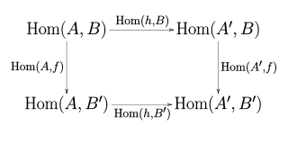

### 2.4 Natural transformation

#### 2.4.1 definition

$C$와 $D$가 category이고, $F$와 $G$가 $C$와 $D$ 사이의 functor라고 하자. $F$에서 $G$로 가는 `natural transformation` $\eta$는 $C$ 안의 각 object에 대해 D의 object 사이의 morphism $\eta_X: F(X)\rightarrow G(X)$를 제공한다. 이를 $\eta$의 X에서의 component라고 부른다. 그리고 $C$ 안의 각 morphism $f:X \rightarrow Y$에 대해 $\eta_Y \circ F(f) = G(f) \circ \eta_X$를 만족한다. commutative diagram으로 표현하면 다음과 같다:

$$
\require{AMScd}
\begin{CD}
F(X) @>{F(f)}>>F(Y)\\
@VV{\eta_X}V @VV{\eta_Y}V \\
G(X) @>{G(f)}>> G(Y)
\end{CD}
$$

F와 G가 contravariant functor이면 diagram 안의 horizontal arrow direction을 reverse한다. $\eta$가 $F$에서 $G$로 가는 natural transformation이면 $\eta:F \rightarrow G$ 또는 $\eta: F \Rightarrow G$로 적을 수 있다.

F와 G 사이의 natural transformation set은 $Nat(F,G)$로 표기한다.

#### 2.4.2 Representable Functor

C 안의 각 object $A$를 선택하면 C에서 Set으로 가는 functor $Hom(A,-):C\rightarrow Set$를 얻을 수 있다. Set을 향하는 이런 structure-preserving morphism은 보통 representable이라고 부른다. formal definition은 다음과 같다:

covariant 또는 contravariant functor $F: C \rightarrow Set$가 있고 C is locally small category라고 하자. object $A \in C$가 존재하여 $F$와 $Hom_c(A,-)$가 naturally isomorphic이면, 또는 F가 contravariant functor이면 $Hom_c(-,A)$와 naturally isomorphic이면, functor F는 object A로 representable하다고 한다.

`Example` machine learning task는 보통 $Learning = Representation + Evaluation + Optimization$으로 볼 수 있다. 예를 들어 ChatGPT training process에서 pretraining은 world category에 대한 representable functor를 construct하는 과정이다.

자세한 내용은 nLab[2]를 참고할 수 있다.

#### 2.4.3 Functor Category

$C$와 $D$가 category일 때, $[C,D]$의 functor category의 object는 $F:C \rightarrow D$이고, morphism은 이런 모든 functor의 natural transformation이며, composition law는 vertical composition에 기반한다. 즉 Functor $F,G,H: C\rightrightarrows D$, $\alpha : F \Rightarrow G$, $\beta:G \Rightarrow H$라고 하면 vertical composition은 $\beta \cdot \alpha : F \Rightarrow H$다. $[C,D]$의 functor category는 $D^C$로 표기한다.

#### 2.4.4 Presheaf

functor category에서 가장 중요한 example 중 하나는 presheaf category이며, $C^\wedge$로 표기한다. Presheaf는 C 위의 functor $F:C^{op} \rightarrow Set$다. $C$ 위의 모든 presheaf가 object를 이루고 presheaves 사이의 natural transformation이 morphism을 이루는 category를 presheaf category라고 부른다.

`Example` object A에 대해, large model의 pretraining process는 실제로 가능한 많은 data를 통해 A와 다른 object 사이의 Attention set을 construct하는 것이다. 실제로는 $h_A:Hom(-,A):C\rightarrow Set$이며, contravariant functor이고 $h_A:C^{op}\rightarrow Set$로도 표기할 수 있다. Presheaf가 C 위의 functor $F:C^{op} \rightarrow Set$라는 점에 주의하자. 본질적으로 large model의 pretraining process는 presheaf category를 construct해야 하는 것이다.

> 여기까지 읽으면 abstract nonsense처럼 느껴질 수 있지만, 이 내용들은 뒤의 Yoneda Lemma를 위한 prerequisite이다.

### 2.5 Yoneda Lemma

Yoneda Lemma는 일본 mathematician이자 computer scientist인 Nobuo Yoneda의 이름을 딴 것이다. 쉽게 말해 "인간의 본질은 모든 사회적 관계의 총합"이라는 말을 이해할 수 있다면, 그 core도 대략 이해할 수 있다.

#### 2.5.1 Yoneda Lemma

locally small category $C$ 위의 presheaf $P$가 주어졌을 때, C 안의 object $A$에 대해 $Nat(Hom(-,A),P)\simeq PA$가 성립한다.

#### 2.5.2 Yoneda Embedding

locally small category $C$에 대해 각 object $X$는 C 위의 presheaf, 즉 representable presheaf $h_x$를 포함한다. 이는 실제로 $F:C \rightarrow [C^{op},Set]$ functor를 구성하고, 이런 functor들이 presheaf category를 이룬다. Yoneda Lemma에 따르면 이 functor들은 fully faithful하다. 즉 어떤 locally small category 안의 object도 corresponding presheaf category 안의 element로 represent될 수 있다.

**문제** 이것이 바로 foundation model generalization에 대한 우리의 요구가 아닌가? large model pretraining의 본질은 presheaf category를 construct하는 것이 아닌가?

다른 한편으로

$$
X\simeq Y \Rightarrow Hom(-,X) \simeq Hom(-,Y)
$$

그리고 $F:C \rightarrow [C^{op},Set]$ functor가 fully faithful하다면,

$$
Hom(-,X) \simeq Hom(-,Y) \Rightarrow  X\simeq Y
$$

따라서 $X\simeq Y$는 오직 대응하는 Hom functor가 isomorphic할 때 그리고 그때에만 성립한다. 이 corollary로부터 우리는 **"object는 다른 object와의 관계에 의해 완전히 결정된다"**고 말할 수 있다.

### 2.6 Universal Construction

Colfax 논문에는 Pushforward와 pullback 관련 concept도 있다. pullback과 pushout은 모두 category theory의 Universal Construction에 속한다.

앞 section의 Yoneda Lemma가 설명했듯, category theory의 core idea는 object가 "무엇인가"를 define하는 것이 아니라, 다른 모든 related object와의 relationship을 통해 그것을 unique하게, isomorphism 의미에서 characterize하는 것이다. 이것은 category theory의 basic philosophy를 보여 준다: **object가 무엇인지는 중요하지 않고, 그것이 다른 object와 어떻게 interact하는지가 중요하다.**

Universal Construction은 보통 두 부분을 포함한다:

- object와 morphism set: 특정 object $U$와 그 object에서 출발하거나 그 object를 향하는 morphism set이 존재하며, 이들이 어떤 diagram의 commutativity를 만족한다.
- Universal Property: 유사한 condition을 만족하는 다른 어떤 object에 대해서도 corresponding diagram을 commute하게 하는 **unique morphism**이 존재한다.

#### 2.6.1 Pullback

두 morphism $f: X \rightarrow Z$와 $g: Y \rightarrow Z$로 구성된 **Span**, 즉 $X \rightarrow Z \leftarrow Y$가 주어졌다고 하자. 이들의 **pullback**은 object $P$와 두 morphism $p_1: P \rightarrow X$, $p_2: P \rightarrow Y$이며, 함께 다음 두 condition을 만족한다:

1. **Commutativity**: 아래 diagram은 **commutative**하다. 이는 $P$에서 $C$로 가는 두 path가 equivalent하다는 뜻이며, 즉 $f \circ p_1 = g \circ p_2$다.

$$
\require{AMScd}
\begin{CD}
P  @>{p_2}>> Y\\
@VV{p_1}V @VV{g}V \\
X @>{f}>> Z
\end{CD}
$$

2. **Universal Property**: `임의의` 다른 object $Q$와 morphism $q_1: Q \rightarrow X$, $q_2: Q \rightarrow Z$가 유사한 condition, 즉 $f \circ q_1 = g \circ q_2$를 만족하면, 아래 diagram의 모든 triangle을 commute하게 하는 `unique` morphism $u: Q \rightarrow P$가 존재한다. 즉 $p_1 \circ u = q_1$이고 $p_2 \circ u = q_2$다.

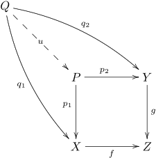

diagram을 intuitive하게 보면, 어떤 arrow가 이 object들을 점점 $Z$ 쪽으로 pull back하는 것처럼 보인다.

#### 2.6.2 Pushout

**pushout**은 pullback의 **dual** concept이다. 이는 다음 질문에 답한다. 같은 source object $Z$에서 출발하는 두 morphism $f: Z \rightarrow X$, $g: Z \rightarrow Y$가 있다고 하자. $X$도 mapping될 수 있고 $Y$도 mapping될 수 있으며, 이 mapping 방식이 둘의 common source $Z$를 "respect"하는 "best" target object $P$를 어떻게 찾을 수 있을까?

두 morphism $f: Z \rightarrow X$와 $g: Z \rightarrow Y$로 구성된 **Co-span**, 즉 $X \leftarrow Z \rightarrow Y$가 주어졌다고 하자.

이들의 **pushout**은 object $P$와 두 morphism $i_1: X \rightarrow P$, $i_2: X \rightarrow P$이며, 함께 다음 두 condition을 만족한다:

1. **Commutativity**: 아래 diagram은 **commutative**하다. 이는 $Z$에서 $P$로 가는 두 path가 equivalent하다는 뜻이다: $i_1 \circ f = i_2 \circ g$

$$
\require{AMScd}
\begin{CD}
P  @<{i_2}<< Y\\
@AA{i_1}A @AA{g}A \\
X @<{f}<< Z
\end{CD}
$$

2. **Universal Property**: `임의의` 다른 object $Q$와 morphism $j_1: X \rightarrow Q$, $j_2: Y \rightarrow Q$가 유사한 condition을 만족하면, 아래 diagram의 모든 triangle을 commute하게 하는 `unique` morphism $u: P \rightarrow Q$가 존재한다. 즉 $u \circ i_1 = j_1$이고 $u \circ i_2 = j_2$다.


## 3. Layout algebra

pure mathematics와 applied mathematics에는 object series와 그 사이 morphism이 존재하고, 이들이 set과 function과 같은 formal behavior를 갖는 많은 instance가 있다. morphism은 associative한 방식으로 compose될 수 있고, object는 identity morphism을 가진다. set 사이의 function이 prototype example이지만, category 안의 object가 반드시 set일 필요는 없고 morphism도 반드시 function일 필요는 없다.

Layout algebra는 multidimensional data(matrix, tensor 등)가 computer의 one-dimensional memory에 arranged되는 방식을 describe하고, 이런 arrangement를 compose하고 transform하기 위한 formal mathematical rule과 operation system이다. 이는 NVIDIA CuTe library의 core idea이며, programmer와 compiler가 declarative하고 composable하며 mathematically reliable한 방식으로 complex data layout을 처리할 수 있게 하는 것을 목표로 한다. 이를 "memory arrangement"를 위한 "syntax"와 "operation rule"의 set으로 생각할 수 있다.

category theory 관점에서 Layout의 여러 operation rule과 syntax를 살펴보는 것은 매우 clever하고 rigorous하다.

### 3.1 why Layout matters

- **Coalesced Memory Access:** GPU의 SIMT model에서 Warp 하나, 보통 32개 thread는 같은 instruction을 동시에 execute한다. 이 thread들이 global memory에 access할 때, address가 contiguous하거나 어떤 aligned block 안에 있으면 hardware가 이 access를 하나 또는 몇 개의 memory transaction으로 coalesce할 수 있다. 이는 memory bandwidth utilization을 크게 높인다. 좋은 layout은 Warp 안의 thread가 contiguous physical memory에 access하도록 보장해 coalesced access를 구현한다. 나쁜 layout은 scattered access를 유발해 여러 memory transaction을 trigger하고 performance가 급격히 떨어진다.
- **Shared Memory Bank Conflict:** shared memory는 여러 bank로 나뉜다. Warp 안의 여러 thread가 동시에 같은 bank에 access하면, broadcast case를 제외하고 Bank Conflict가 발생해 access가 serialized되고 performance에 심각한 영향을 준다. layout design은 shared memory 안의 data arrangement를 고려해 Bank Conflict를 피하거나 줄여야 한다.
- **Tensor Cores:** Volta architecture부터 NVIDIA GPU는 matrix multiply-accumulate(MMA) operation 가속을 위한 Tensor Core를 도입했다. Tensor Core는 specific size와 layout의 small matrix, 예를 들어 `16x16x16` FP16 matrix를 operate한다. Tensor Core를 efficient하게 사용하려면 programmer가 layout을 통해 data tile을 precise하게 control하고, data를 register/SMEM/TMEM으로 load한 뒤 Tensor Core가 요구하는 format으로 arrange해야 한다. CuTe의 main design motivation 중 하나가 이런 complex data tiling과 arrangement를 flexible하고 precise하게 describe하는 것이다.

따라서 matrix blocked computation은 보통 다음 flow로 abstract된다:

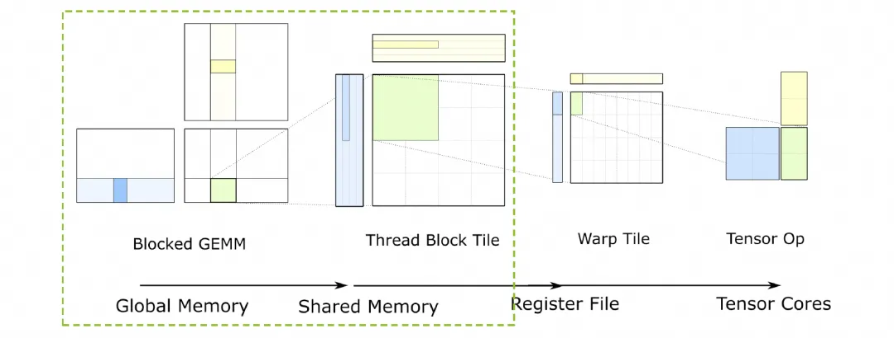

### 3.2 algebraic abstraction

simple row-major와 col-major layout은 high-performance computing scenario에 충분하지 않다. modern GPU algorithm, 특히 GEMM(general matrix multiplication) 같은 compute-intensive task는 data locality에 크게 의존한다. algorithm은 보통 high-speed cache, 예를 들어 L1/L2 Cache 또는 programmable cache(SMEM/TMEM) 안에서 small data block, 즉 tile 또는 block을 반복 operate하도록 design된다.

이는 전체 tensor layout을 표현할 수 있어야 할 뿐 아니라, 이런 data block의 layout을 편리하게 describe, split, regroup, operate할 수 있어야 함을 요구한다. 이것이 static한 "layout" concept에서 dynamic한 "layout algebra"로 evolve하는 근본 이유다. 따라서 composition, logical_divide 같은 algebraic operation을 통해 simple layout에서 algorithm과 hardware demand에 맞는 arbitrary complex new layout을 derive한다.

section 1.3에서 이미 몇 가지 algebraic abstraction을 소개했다. 예를 들어 traditional layout은 보통 stride tuple로 describe한다. 예를 들어 $(d_M, d_N)$는 $M\times N$ matrix에 사용된다. data loading의 경우 GPU 자체의 memory hierarchy 때문에 Layout이 **nested, hierarchical** layout을 허용해야 한다. 예를 들어 $(4, 8)$ tile은 $((2, 2), (2, 4))$의 `Block x Thread` layout으로 볼 수 있고, further nesting도 가능하다.

그리고 우리는 Lego처럼 이런 Layout을 block 하나하나로 보고, 몇 가지 "놀이 방식"을 define해야 한다. programmer가 block을 쌓듯 layout을 combine하여 complex data movement와 transformation을 describe할 수 있게 해야 한다. 예를 들어 Global Memory의 tile layout에 thread block 내부의 shard layout을 "compose"하면, 각 thread가 읽어야 하는 data의 final layout을 얻을 수 있다.

category theory는 mathematical structure와 그 사이의 structure-preserving relationship(morphism)을 연구하는 학문이다. CuTe layout의 여러 operation, 특히 Composition은 category theory의 **composition of morphisms**와 놀랍게 유사하다. CuTe layout을 category theory의 Objects와 Morphisms로 abstract하면 다음을 얻을 수 있다:

- **rigor 제공:** empirical rule과 algorithm을 precise mathematical language로 define하여 correctness와 unambiguity를 보장한다.
- **generality 제공:** 서로 다른 operation 뒤에 있는 unified structure를 발견한다. 예를 들어 앞에서 보여 준 "division"이 있다.
- **intuitive tool 제공:** category theory의 arrow와 diagram을 활용하면 abstract algebraic operation이 intuitive한 line game으로 바뀌어 reasoning과 computation이 크게 simplify된다.

### 3.3 Tractable Layouts

arbitrary layout에 대해 layout operation을 define하고 compute하는 것은 어렵지만, **tractable layouts**로 제한하면 intuitive working framework를 개발할 수 있다. 여기에는 practice에서 마주치는 거의 모든 layout이 포함된다. 예를 들면:

- **row-major**와 **column-major** layout
- **compact** layout, 즉 data를 contiguous memory address에 store하는 layout
- **projections**, broadcast data의 multiple copy에 사용
- **dilations**, padding이 있는 LD/ST 구현에 사용

###### 그렇다면 tractable하지 않은 Layout은 무엇인가?

Layout은 Shape:Stride로 define할 수 있다. Shape는 arbitrary shape와 arbitrary dimension으로 구성된 tuple일 수 있다. easy to handle인지 여부는 Shape constraint 아래에서 Stride가 어떻게 define되는지에 달려 있다. 예를 들어 Layout (4,8):(2,-1)은 data position이 memory에서 non-contiguous하고, overlap(two logical addresses access same physical address)이나 out-of-bounds access까지 발생할 수 있다.

따라서 가장 simple한 Flatten Layout을 고려한다. Shape와 Stride 모두 nested되지 않고 one-dimensional array $(x_1, \ldots, x_n)$로만 표현된다. Layout $L = S:D = (s_1, \ldots, s_m) : (d_1, \ldots, d_m)$에 대해 설명을 쉽게 하기 위해 **Mode** concept도 도입한다.

- **Size:** $\text{size}(L) = s_1 \cdot s_2 \cdot \ldots \cdot s_m$로 define한다. 이는 Shape 안 각 dim의 product다.
- **Length:** $L$의 Length를 $\text{len}(L) = m$으로 define한다.
- **Mode:** $\forall k \in [1,m]$에 대해 $(s_k):(d_m)$은 length=1인 Layout이며, 이를 $L$의 Mode라고 부른다.

그다음 Shape와 Stride에 다음 constraint를 둔다. 먼저 integer pair $s : d$ 위에 order relation $\preceq$를 다음과 같이 define한다:

$$
s : d \preceq s' : d' \quad \text{ if and only if } \quad d < d' \: \text{ or } \: d = d' \text{ and } s \leq s'
$$

> 주: 여기서는 실제로 Stride가 작은 것에서 큰 순서로 Layout의 Mode를 sort한다.

**Definition:** 우리는 flat layout(Flatten Layout)

$$
L = (s_1, \ldots, s_m) : (d_1, \ldots, d_m)
$$

이 모든 integer pair $1 \leq i, j \leq m$에 대해 다음 condition을 만족하면 **tractable**하다고 말한다:

$$
\text{if  } s_i : d_ i \preceq s_j : d_j \text{  and  } d_i, d_j \neq 0, \text{  then  } s_i d_i \text{  divides  } d_j
$$

order relation $\preceq$는 먼저 stride 기준으로 sort하고, stride가 같으면 shape 기준으로 sort한다. 이는 "fastest-changing"(minimum stride) dimension에서 "slowest-changing"(maximum stride) dimension으로 가는 dimension ordering을 define한다. condition $s_i * d_i$가 $d_j$를 divide한다는 의미는 다음과 같다. dimension $i$가 dimension $j$보다 더 빠르게 변하면, dimension $i$의 whole block이 memory에서 차지하는 span($s_i * d_i$)이 dimension $j$의 one unit을 seamless하게 tile할 수 있어야 한다.

---

**Example:** row-major $(M, N)$ matrix를 생각하자. layout은 shape=(M, N), stride=(N, 1)이다. 즉 Layout은

$$
L = S:D = (s_1, s_2) : (d_1, d_2) = (M, N):(N, 1)
$$

그 두 Mode는 $s_1:d_1$, 즉 $M:N$과 $s_2:d_2$, 즉 $N:1$이다.

- definition에 따르면 $1 < N$이므로 $N:1 \preceq M:N$이다.
- 이때 $i=2, j=1$이다. $s_2 * d_2$가 $d_1$을 divide하는지 check해야 한다.
- $s_2 * d_2 = N * 1 = N$이고 $d_1 = N$이다. $N$은 $N$을 divide한다.

따라서 row-major layout은 tractable하다.

---

Layout이 tractable한지 여부는 colfax가 open source로 공개한 layout-categories tool tract로 analyze할 수 있다. 설치는 다음과 같다.

```c++
git clone https://github.com/ColfaxResearch/layout-categories
cd layout-categories
cd tract
pip install .
```

그다음 CuteDSL environment에서 test할 수 있다.

```python
import cutlass
import cutlass.cute as cute

import tract

@cute.jit
def test_is_tractable():
    A = cute.make_layout(shape=(2,2,2), stride=(1,2,4))
    B = cute.make_layout(shape=(2,2,2), stride=(1,7,4))
    A_is_tractable = tract.is_tractable(A)
    B_is_tractable = tract.is_tractable(B)
    print(f"A =", A)
    print(f"A is tractable: {A_is_tractable}")
    print(f"B =", B)
    print(f"B is tractable: {B_is_tractable}")

test_is_tractable()

# output:
A = (2,2,2):(1,2,4)
A is tractable: True
B = (2,2,2):(1,7,4)
B is tractable: False
```

colfax의 글에는 조금 misleading한 그림이 몇 개 있다. 본질적으로 우리는 S:D를 Mode 기준으로 Stride ascending order로 sort할 뿐이다. 이 reorder process는 one-to-one mapping이며, diagram으로 쉽게 그릴 수 있다.

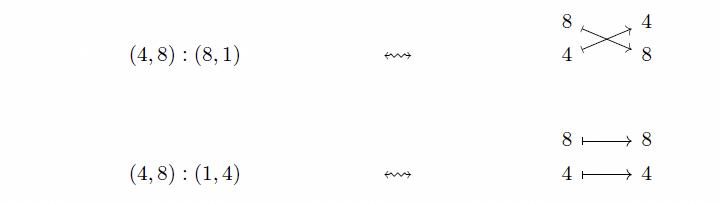

예를 들어 Layout= (2,3,2,4):(1,4,2,24)에 대한 reorder mapping은 다음과 같다.

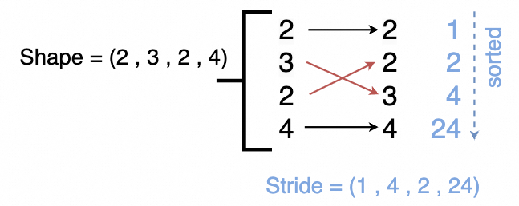

colfax blog의 original figure와 explanation에는 이 부분에 약간의 error가 있다. 사실 prefix products가 아니라, reorder 이후 divide할 수 있는가의 문제다.

Tractable의 본질은 Layout의 Shape와 Stride에 simple constraint를 두는 것이다. 이 condition은 layout이 GPU memory hierarchy에 대응하는 좋은 "hierarchical" 또는 "tiled" structure를 갖도록 보장한다. memory 안에서 interleaved되고 chaotic한 pathological layout을 배제한다.

### 3.4 Tuple-category

section 3.3의 object와 arrow로 표현한 diagram을 기반으로 category 하나를 construct한다. 즉 Tuple-category다.

- `object`: positive integer tuple $(s_1, \ldots, s_m)$이다.
- `morphism`: $f : (s_1, \ldots, s_m) \to (t_1, \ldots, t_n)$는 finite pointed sets 사이의 map $\alpha$로 지정된다.

$$
\alpha: \{ \ast, 1, \ldots, m \} \to \{ \ast, 1, \ldots, n\}
$$

그리고 다음 conditions를 만족한다:

1.

$$
\alpha(*) = *
$$

2. 만약 $\alpha(i) \neq *$이고 $\alpha(i) = \alpha(i')$라면, $i = i'$이다.
3. 만약 $\alpha(i) = j \neq *$라면, $s_i = t_j$이다.

이러한 morphism $f$가 $\alpha$ 위에 놓여 있다고 말하며, $f$를 tuple morphism이라고 부른다.

condition 1과 2는 각 source dimension이 버려지거나 broadcast되어 `*`에 mapping되거나, 아니면 target dimension 하나에 유일하게 mapping된다는 뜻이다. 여러 source dimension이 같은 target dimension을 차지할 수 없다. condition 3인 $s_i = t_j$는 mapping 전후에 dimension의 "size"가 변하지 않는다는 뜻이다. 이는 layout transform이 tensor 자체의 data volume을 바꾸는 것이 아니라 "reorder"와 "broadcast"일 뿐임을 보장한다.

**Definition:** $f$가 tuple morphism이면, $f$가 encoding하는 layout은 다음과 같다.

$$
L_f = (s_1, \ldots, s_m) : (d_1, \ldots, d_m)
$$

그 Shape는 $f$의 domain이고, Stride는 다음 식으로 주어진다.

$$
d_i = \begin{cases} t_1 \cdots t_{j-1} & \text{if } \alpha(i) = j \\ 0 & \text{if } \alpha(i) = * \end{cases}
$$

$f:  (s_1, \ldots, s_m) \to (t_1, \ldots, t_n)$에 대해 Shape는 domain이고, 오른쪽 $(t_1, \ldots, t_n)$은 intermediate representation, 즉 IR이다. 다시 말해 $\text{Shape} \rightarrow \text{IR}$이다. 실제로 같은 Layout도 여러 IR로 표현할 수 있다. 예를 들어 Layout=(4,5):(1,64)의 IR representation은 (4,16,5), (4,16,5,7), (4,2,8,5) 등이 될 수 있다. Tuple category conditions만 만족하면 된다.

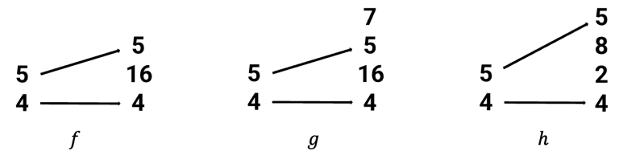

이 IR representation들 중에서 우리는 가장 단순한 representation을 얻고 싶다. 즉 여분의 entry가 없고, 예를 들어 $g$의 7이 없으며, mapping되지 않은 entry가 merge되어야 한다. 예를 들어 $f,h$를 비교하면 $f$의 16은 $h$의 (2,8)을 merge한 것이다. 이 가장 단순한 representation $f:(4,5) \rightarrow (4,16,5)$에 대해 $f$가 **standard form**을 갖는다고 말할 수 있다.

더 나아가 layout과 morphism이 **non-degenerate**하다고 가정하면, 이는 다음 condition에 대응한다.

$$
s_i=1 \Rightarrow d_i=0
$$

$$
s_i=1 \Rightarrow \alpha(i)=*
$$

Stride 계산식 $d_i = t_1 \cdots t_{j-1}$은 colexicographic, 즉 colex encoding의 표현이다. morphism의 target $(t_1,\ldots, t_n)$은 size가 $\prod t_k$인 linear memory space를 정의하고, element $t_j$의 offset은 $t_1\cdot \ldots \cdot t_{j-1}$이다.

source dimension $s_i$가 $t_j$에 mapping되면, $s_i$는 이 offset을 자신의 stride로 상속한다. $s_i$가 `*`에 mapping되면 stride는 0이며, 이는 broadcasting에 대응한다.

높은 수준에서 "non-degenerate"는 layout representation의 redundancy를 제거하기 위한 constraint다. 구체적으로는 size가 1인 dimension을 처리한다. size가 1인 dimension은 논리적으로 trivial하다. element가 하나, 즉 index 0 하나뿐이므로 이 dimension을 따라 이동하는 것은 의미가 없다.

Counterexample: L=(1,8):(8,1)에서 $s_1 =1, d_1=8 \neq 0$이므로 non-degenerate condition을 위반한다. 따라서 이것은 degenerate layout이다. 이 layout은 사실 8-element vector를 describe한다. logical coordinate $(0, j)$, 여기서 j는 0부터 7까지이며, 이것이 mapping되는 physical offset은 $0\times 8+j \times 1=j$이다. 이 $s_1=1$ dimension은 redundancy이며, 단순한 1D vector에 2D shell을 강제로 씌운 것뿐이므로 1D layout으로 degenerate될 수 있다.

**Theorem:** non-degenerate tractable flat layouts와 standard form의 non-degenerate tuple morphisms 사이에는 one-to-one correspondence가 존재한다.

##### A. Non-degenerate Tractable Flat Layout

이는 다음 세 conditions를 동시에 만족하는 layout $L = (S: D)$이다.

- **Flat:** $S$와 $D$는 모두 $(s_1, \ldots, s_m)$ 및 $(d_1, \ldots, d_m)$ 형태의 simple integer tuple이다.
- **Tractable:** 모든 $1 \le i, j \le m$에 대해, 만약 $s_i:d_i \preceq s_j:d_j$, 즉 $d_i < d_j$이거나 ($d_i = d_j$이고 $s_i \le s_j$), 또한 $d_i, d_j \ne 0$이라면, $s_i d_i$는 반드시 $d_j$를 divide해야 한다.
- **Non-degenerate:** 만약 $s_i = 1$이면 $d_i = 0$이다.

##### B. Standard Form의 Non-degenerate Tuple Morphism

이는 다음 세 conditions를 동시에 만족하는 tuple morphism $f: S \to T$, 즉 map $\alpha$로 정의되는 morphism이다.

- **Non-degenerate:** 만약 $s_i = 1$이면 $\alpha(i) = *$이다.
- **Standard Form:** 이 condition은 비교적 복잡하며, paper에서는 rigorous definition을 제시한다. 여기서는 직관적으로 두 가지로 이해할 수 있다.

1. **Redundant 1 없음:** codomain T에는 값이 `1`인 element가 포함되지 않는다. 즉 모든 $k$에 대해 $t_k \neq 1$이다. 어떤 `1`도 encoding된 layout을 바꾸지 않고 다른 element에 merge할 수 있기 때문이다.
2. **Merge 최대화:** codomain T에서 arrow가 가리키지 않는 모든 element, 즉 $\alpha$의 image에 속하지 않는 element는 하나의 single element로 merge된다. 여러 개가 존재한다면 그렇게 한다. 이는 representation의 uniqueness를 보장하기 위한 것이다. 예를 들어 $t_k$와 $t_l$ 모두 arrow가 가리키지 않는다면, 이들은 새 element $t_new = t_k * t_l$로 merge되어야 한다.

- **Tuple Morphism:** 앞에서 언급한 기본 rules를 만족한다.

이 theorem은 **application world, 즉 layout**과 **mathematical world, 즉 morphism**을 연결하는 핵심 bridge다. one-to-one correspondence는 다음을 뜻한다.

- $L_{f_L} = L$: layout $L$에서 출발해 morphism $f_L$을 construct하고, 다시 $f_L$에서 layout을 encoding하면 반드시 original $L$을 얻는다.
- $f_{L_f} = f$: standard form의 morphism $f$에서 출발해 layout $L_f$를 encoding하고, 다시 $L_f$에서 morphism을 construct하면 반드시 original $f$를 얻는다.

이 두 properties는 **standard form**의 uniqueness와 construction algorithm의 determinism에서 나온다. $L$에서 $f_L$을 construct하는 process는 본질적으로 stride를 "decompose"하는 것이고, $f_L$에서 $L$을 계산하는 process는 stride를 "compose"하는 것이다. standard form이 decomposition과 composition의 uniqueness를 보장하므로, 두 operation은 자연스럽게 서로 inverse가 된다.

- **직관적 이해와 high-performance programming**이 필요할 때는 **Layout**을 다룬다.
- **rigorous mathematical operation과 algorithm design**이 필요할 때는 **Morphism** 관점으로 전환하여 그 clear structure와 composition rules를 활용할 수 있다.

이 theorem은 전체 theoretical framework의 foundation이다. 이후 layout operations, 즉 composition, complement, partition 등에 대한 모든 discussion은 이 견고한 one-to-one correspondence 위에 세워진다.

### 3.5 Layout 함수와 Realization functor

layout L의 가장 중요한 invariant는 `layout function` $\Phi_L$이다. L이 tractable할 때, 그 layout function은 category `Tuple`에서 `realization functor`를 통해 자연스럽게 만들어질 수 있다.

$$
| \cdot | : \textbf{Tuple} \to \textbf{FinSet}
$$

#### 3.5.1 Colexicographic isomorphism

Definition: $S = (s_1, \ldots, s_m)$가 size M, 즉 $M = \prod s_i$인 positive integer tuple이면,

**colexicographic isomorphism**은 다음 function이다.

$$
\mathrm{colex}_S: [0, s_1) \times \cdots \times [0, s_m) \to [0, M)
$$

다음과 같이 정의된다.

$$
\mathrm{colex}_S(x_1, \ldots, x_m) = \sum_{i=1}^m x_i \cdot s_1 \cdots s_{i-1}
$$

**inverse colexicographic isomorphism**은 다음 function이다.

$$
\mathrm{colex}_S^{-1}: [0, M) \to [0, s_1) \times \cdots \times [0, s_m)
$$

다음과 같이 정의된다.

$$
\mathrm{colex}_S^{-1}(x) = (x_1, \ldots, x_m)
$$

여기서:

$$
x_i = \lfloor x / (s_1 \cdots s_{i-1} ) \rfloor \pmod{s_1 \cdots s_i}
$$

$colex_S$ function의 input은 multi-dimensional logical coordinate $(x_1, \ldots, x_m)$이며, 여기서 $x_i \in [0, s_i)$이다. output은 1D linear index $k \in [0, M)$이다. 이것은 multi-dimensional coordinate space를 1D line segment로 "flatten"하는 standard 방식이다. Layout function $\Phi_L$에 대해서는 이를 세 단계로 볼 수 있다.

1. **logical coordinate -> linear index (input):** $colex_S$로 input logical coordinate $(x_1, \ldots, x_m)$를 single linear index $k_S \in [0, M)$로 변환한다.
2. **linear index -> linear index (core mapping):** $|f|$는 input space의 linear index $k_S$를 output space의 linear index $k_T$로 mapping한다.
3. **linear index -> physical offset (output):** output linear index $k_T$가 실제로 우리가 원하는 physical memory offset이다.

#### 3.5.2 Realization Functor

L이 tractable할 때, **Tuple**에서 finite set category **FinSet**으로 가는 **realization functor**를 통해 그 layout function을 recover할 수 있다.

**Theorem:** 다음 functor가 존재한다.

$$
| \cdot | : \textbf{Tuple} \to \textbf{FinSet},
$$

이를 **realization**이라고 부르며, 다음 properties를 만족한다.

- S가 size M인 tuple이면 $|S| = [0, M)$이다.
- S와 T가 각각 size M과 N인 tuple이고 $f: S \to T$가 tuple morphism이면, 그 realization $|f|: [0, M) \to  [0,N) \subset \mathbb{Z}$는 $L_f$의 layout function이다.

특히 이 result는 `tuple morphism`의 Composition과 `Layout`의 Composition이 compatible하다는 simple proof를 제공한다.

먼저 $|f|$를 어떻게 construct하는지 보자. input index $k \in [0, M)$에 대해:

1. **Decompose:** inverse colexicographic isomorphism을 사용해 linear index $k$를 multi-dimensional logical coordinate $(x_1, \ldots, x_m) = \mathrm{colex}_S^{-1}(k)$로 decompose한다.
2. **Map:** 각 coordinate component $x_i$에 대해, morphism `f`, 즉 $\alpha$ mapping에서 어디로 가는지 찾는다.

- 만약 $\alpha(i) = j \neq *$이면, 이 coordinate component $x_i$는 target space의 $j$번째 dimension에 contribute한다. 이를 $y_j = x_i$로 둔다.
- 만약 $\alpha(i) = *$이면, 이 coordinate component $x_i$는 버려진다. target coordinate에는 contribute하지 않는다.

3. **Recompose:** 이제 target coordinate components $(y_1, \ldots, y_n)$의 set을 얻었다. 일부 `y`가 undefined일 수 있지만, `colex`에서는 이를 0으로 처리할 수 있다. target space의 colexicographic isomorphism을 사용해 이 components를 single output index로 recompose한다.


$$
|f|(k) = \mathrm{colex}_T(y_1, \ldots, y_n) = \sum_{j=1}^n y_j \cdot t_1 \cdots t_{j-1}
$$

layout function $\Phi_L(x_1, \ldots, x_m)$의 definition은 $\sum_i x_i d_i$이다.

morphism에서 얻은 $d_i$ 식을 대입하면:

$$
\Phi_{L_f}(x_1, \ldots, x_m) = \sum_{i \text{ s.t. } \alpha(i) \neq *} x_i \cdot (t_1 \cdots t_{\alpha(i)-1})
$$

$y_j = x_i$라고 두면, 즉 $\alpha(i)=j$일 때, 위 식은 다음과 같이 된다.

$$
\sum_{j \in \text{Im}(\alpha)} y_j \cdot (t_1 \cdots t_{j-1})
$$

이는 위에서 유도한 $colex_T$의 result와 정확히 같으므로, $|f|$의 function definition은 다음과 같이 쓸 수 있다.

$$
|f| = \mathrm{colex}_T \circ \alpha^* \circ \mathrm{colex}_S^{-1}
$$

여기서 $\alpha^*$는 $\alpha$에 따라 coordinates를 reorder하는 function이다.

이 functor의 역할은 두 categories를 연결하는 것이다. $|f|$는 $L_f$의 layout function이다. 즉:

1. direct computation method (traditional method): `shape` + `stride` -> $\Phi_L(x) = \sum x_i d_i$.
2. functor realization method (category-theoretic method): `morphism f` -> $|f| = \mathrm{colex}_T \circ \alpha^* \circ \mathrm{colex}_S^{-1}$.

`composition compatibility`, 즉 $L_{g \circ f} = L_g \circ L_f$에 대해서는 다음과 같이 prove한다.

layout composition의 definition은 function composition이다.

$$
\Phi_{L_g \circ L_f} = \Phi_{L_g} \circ \Phi_{L_f}
$$

이 장의 theorem에 따르면:

$$
\Phi_{L_g} = |g| \quad \text{and} \quad \Phi_{L_f} = |f|
$$

따라서,

$$
\Phi_{L_g \circ L_f} = |g| \circ |f|
$$

functor의 기본 property는 composition을 preserve한다는 것이다.

$$
|g \circ f| = |g| \circ |f|
$$

그러므로 다음을 얻는다.

$$
\Phi_{L_g \circ L_f} = |g \circ f|
$$

다시 이 장의 theorem을 사용하면, 어떤 function의 layout function이 $|g \circ f|$라면 그 function 자체는 반드시 $L_{g \circ f}$이다.

따라서 $L_{g \circ f} = L_g \circ L_f$이다. proof complete.

## 4. Layout operations

이 장은 앞에서 구축한 category-theoretic framework, 즉 morphism과 layout diagram을 CuTe에서 가장 흔하고 핵심적인 몇 가지 layout operation인 **Coalesce**, **Complement**, **Composition**에 어떻게 적용하는지 보여준다. 핵심 아이디어는 각 layout operation마다 morphism world 안에서 대응되는 더 단순하고 직관적인 graphical operation을 찾고, 두 operation이 equivalent임을 prove하는 것이다.

### 4.1 Coalesce

layout $L$의 coalesce operation은 $d_{i+1} = s_i * d_i$일 때 다음을

$$
(..., s_i, s_{i+1}, ...):(..., d_i, d_{i+1}, ...)
$$

다음으로 coalesce할 수 있다는 것이다.

$$
(..., s_i * s_{i+1}, ...):(..., d_i, ...)
$$

이를 $\mathit{coal}(L)$로 나타낼 수 있다. 예를 들어 다음 Layout에 대해

$$
L = (2,2,5,5,5):(1,2,8,40,200)
$$

다음과 같이 coalesce할 수 있다.

$$
\mathit{coal}(L)=(4,125):(1,8)
$$

diagram에서는 다음과 같이 표현된다. 즉 같은 target tuple 안의 adjacent positions에 있는 "parallel" arrows를 merge한다.

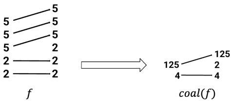

**Theorem:** diagram의 coalesce는 layout의 coalesce와 equivalent하다.

$$
L_{\mathit{coal}(f)} = \mathit{coal}(L_f)
$$

condition $d_{i+1} = s_i * d_i$가 핵심이다. 이는 dimension $i$와 $i+1$이 logical하게 adjacent하며, physical memory에서도 완전히 contiguous하다는 뜻이다. 이는 layout representation을 simplify하고 logical dimensions의 수를 줄여 physical memory의 linear nature에 더 가깝게 만드는 optimization operation이다.

Cute-DSL의 Example은 다음과 같다.

```python
import cutlass
import cutlass.cute as cute

@cute.jit
def coalesce_example():
    """
    Demonstrates coalesce operation flattening and combining modes
    """
    layout = cute.make_layout(shape=(2,2,5,5,5), stride=(1,2,8,40,200))
    result = cute.coalesce(layout)

    print(">>> Original:", layout)
    print(">>> Coalesced:", result)

coalesce_example()

# output
>>> Original: (2,2,5,5,5):(1,2,8,40,200)
>>> Coalesced: (4,125):(1,8)
```

coalesce operation의 본질은 **layout 안의 redundant logical dimensions를 identify하고 eliminate하는 것**이다. GPU programming에서는 logical layout이 가능한 physical memory에 가깝기를 원한다. 예를 들어 column-major로 저장된 `4x8` tile은 shape=(4, 8), stride=(1, 4)이다. coalesce condition ($4 = 4 * 1$)을 만족한다. coalesce 후에는 `shape=(32), stride=(1)`이 된다. 이는 이 32 elements가 memory에서 contiguous함을 명확하게 보여주며, `memcpy`나 vectorized load instruction, 예를 들어 `ld.global.v4.b32`를 사용한 efficient access에 매우 적합하다.

theorem $L_{\mathit{coal}(f)} = \mathit{coal}(L_f)$는 category-theoretic framework의 간결함을 다시 보여준다. diagram에서 수행하는 직관적인 "merge arrows" operation의 result가 layout에서 수행하는 복잡한 "check stride and merge" operation과 완전히 equivalent임을 보장한다. 이 graphical operation은 stride tuple 위에서 복잡한 algebraic operation을 하는 것보다 훨씬 직관적이다.

### 4.2 Complement

*L*이 layout이고 *N*이 positive integer이면, *comp(L, N)*은 sorting과 coalesce를 거친 layout으로, *L*과 concatenate했을 때 compact하다. 이는 concatenate 후의 layout function이 그 image set 위에서 isomorphic이라는 뜻이다. *L*이 complement를 admit하는 최소 integer *N*이 존재하며, 이 경우 *comp(L) = comp(L, N)*이라고 쓴다. 예를 들어, 만약

$$
L = (2,2,2):(1,10,60)
$$

그러면

$$
comp(L) = (5, 3) : (2, 20)
$$

마찬가지로 category **Tuple** 안에도 complement의 analogue가 있다. **f가 hit하지 않은** entries를 포함함으로써 tuple morphism *f*의 complement $f^c$를 계산할 수 있다. 예를 들면:

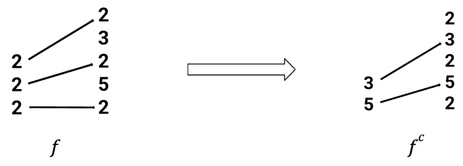

즉 category **Tuple** 안의 complement는 layout의 complement와 compatible하다.

**Theorem:** *f*가 standard form의 injective tuple morphism이면,

$$
L_{f^c} = \mathit{comp}(L_f)
$$

Cute-DSL의 예시는 다음과 같다.

```python
import cutlass
import cutlass.cute as cute

@cute.jit
def comp_example():
    """
    Demonstrates complement operation
    """
    layout = cute.make_layout(shape=(2,2,2), stride=(1,10,60))
    result = cute.complement(layout, cute.size(layout))

    print(">>> Original:", layout)
    print(">>> Complement:", result)

comp_example()

# output
>>> Original: (2,2,2):(1,10,60)
>>> Complement: (5,3):(2,20)
```

complement operation의 본질은 **어떤 subset 바깥의 remaining part를 describe하는 것**이다. 큰 data tensor를 떠올려 보자. $L$은 그중 한 tile의 layout을 describe한다. 그러면 $comp(L)$은 "그 외 모든 data"로 이루어진 set의 layout을 describe한다. 이 operation은 Partitioning과 Tiling 구현에 매우 중요하다. CuTe에서 흔한 pattern은 make\_tile(L, comp(L))이며, 이것은 큰 tensor를 $L$이 describe하는 tile part와 $comp(L)$이 describe하는 remaining part로 나눈다. programmer는 $L$ part를 처리한 다음, $comp(L)$ 위에서 recursively 다음 partition을 수행할 수 있다.

또한 $L$과 $comp(L)$을 concatenate하면 compact하다. "compact"하다는 것은 layout function이 injective, 즉 서로 다른 logical coordinates 두 개가 같은 physical address로 mapping되지 않으며, 그 image set, 즉 모든 physical addresses의 set이 contiguous하다는 뜻이다. 다시 말해 $(L, comp(L))$은 전체 data tensor를 complete하게, overlap 없이, hole 없이 cover한다.

또 morphism world에서 complement를 구하는 operation은 직관적이다. 주어진 morphism $f: S \to T$는 $S$ 안의 dimensions가 $T$의 어떤 dimensions를 "select"하는지를 describe한다. 그 complement $f^c$의 domain은 $T$에서 `select되지 않은` dimensions로 이루어진 tuple이고, $f^c$의 morphism은 이 dimensions를 "select"한다.

이를 통해 programmer나 compiler designer는 data partitioning 문제를 더 high-level에서 생각할 수 있다. "내가 이 part를 필요로 한다"만 고려하면, 나머지 part는 system이 `comp` operation을 통해 자동으로, 그리고 올바르게 계산할 수 있다.

### 4.3 Composition

A와 B가 layouts이면, **composition** $B \circ A$는 임의의 $x \in [0, \mathrm{size}(B \circ A))$에 대해 다음을 만족하는 layout이다.

$$
\Phi_{B \circ A}(x) = \Phi_B ( \Phi_A(x))
$$

layout $B \circ A$를 uniquely characterize할 수 있는 다른 properties도 있다.

예를 들어 A = (2, 2) : (5, 50)이고 B = (5, 2, 5, 2) : (1, 25, 5, 50)이면, A와 B의 composition은 (2, 2) : (25, 50)이다.

$f$와 $g$가 tuple morphisms이고 `codomain(f) = domain(g)`이면, $f$와 $g$를 compose하여 tuple morphism $g \circ f$를 만들 수 있다. 예를 들어 아래 diagram의 morphisms는 composable하다.

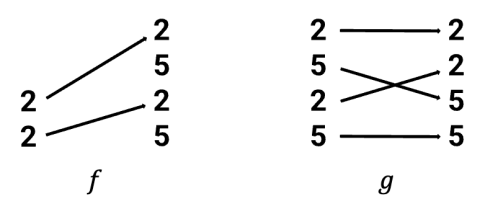

그 composition은 아래 diagram과 같다.

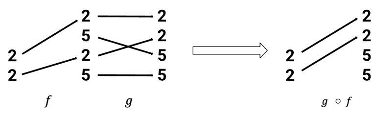

diagram을 통해 category **Tuple**에서의 composition이 layout의 composition과 compatible함을 prove했다.

**Theorem:** $f$와 $g$가 composable tuple morphisms이면,

$$
L_{g \circ f} = L_g \circ L_f
$$

composition은 **hierarchical** memory access pattern을 describe한다. 두 독립적인 layout mappings를 concatenate하여 더 macro한 mapping을 형성한다.

classic use case (Global -> Shared -> Register):

1. **Layout A:** thread block `blockIdx`를 global memory에서 자신이 담당하는 large tile의 base address로 mapping한다. `A: BlockCoord -> GlobalOffset`.
2. **Layout B:** thread `threadIdx`를 shared memory에서 자신이 담당하는 small tile의 position으로 mapping한다. `B: ThreadCoord -> SharedOffset`.
3. **composition $B \circ A$**: `(blockIdx, threadIdx)` 같은 "global thread ID"에서 그것이 access해야 하는 global memory data까지의 direct mapping을 describe한다.

morphism world에서 composition은 layout diagrams를 head-to-tail로 연결한 뒤 intermediate part를 eliminate하는 것이다.

#### 4.4 추가 전개

4.3의 composition condition `codomain(f) = domain(g)`는 real world에서는 거의 항상 **만족되지 않는다**. 예를 들어 Layout A의 output은 `(128, 128)` tile이고 Layout B의 input은 `(32, 8)` thread grid다. `(128, 128)`과 `(32, 8)`은 전혀 match하지 않는다. 실제로 $f$ 위에서 morphism $f'$를 refine하고, $g$ 위에서 morphism $g'$를 refine하여 $g'\circ f'$가 $B \circ A$를 represent하게 만들 수 있을까?

이 challenge가 바로 다음 장 "Nested layouts and the composition algorithm"이 해결하려는 core problem이다. 이후의 "mutual refinement", "pullback", "pushforward" 같은 더 advanced한 category-theoretic tools는 `codomain(f) != domain(g)`라는 difficult problem을 해결하기 위해 도입된다.

한편 Tiling에서 사용되는 logical division을 다시 보자. logical division은 `complementation`과 `composition`이라는 두 basic operations의 combination이다.

## 5. Nested layouts and composition algorithm

앞 장들에서 우리는 flat layouts에 대한 theory를 세웠고 그 limitation도 지적했다. 두 layouts `A`와 `B`가 logical하게 composable하더라도, 그에 대응하는 standard-form morphisms $f_A$와 $f_B$는 codomain과 domain이 match하지 않아서 category 안에서 직접 compose할 수 없을 가능성이 높다. 이 장에서는 이 문제를 해결하기 위해 **Nested Layouts**를 도입하고, 이를 기반으로 general **Composition Algorithm**을 구성한다.

### 5.1 Nested layouts와 nested tuple morphisms

이 부분은 먼저 앞의 모든 theory를 "flat" world에서 "nested" world로 generalize한다. 아래는 한 예시다.

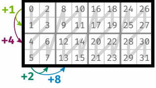

$$
L^{tile2}=S:D = ((2,2),(2,4)):((1,4), (2,8))
$$

먼저 몇 가지 terms를 정의한다.

##### profile

Profile은 nested tuple이며, 각 entry는 symbol $*$이다. 예를 들어 $P* = (*, (*, *))$와 $Q* = ((*, *), *, (*, *))$는 모두 Profile이다.

**Nested Tuple** $S$는 그 **flattening** $(s_1, \ldots, s_m)$, 즉 ordinary tuple과 Profile $P$에 의해 uniquely determined된다. nested tuple을 사용할 때는 $S = (s_1, \ldots s_m)_P$라고 쓰면 편리하다. 예를 들어 $S = ((2, 2), (5, 5))$이면, $P* = ((*, *), (*, *))$인 경우 $S = (2, 2, 5, 5)_P$라고 쓸 수 있다.

$L = S:D$가 layout이면 $S$와 $D$는 같은 Profile을 가져야 한다. 따라서 generic layout을 다음과 같이 쓸 수 있다.

$$
L = (s_1, \ldots, s_m)_P : (d_1, \ldots, d_m)_P
$$

우리는 layout

$$
L^\flat = (s_1, \ldots, s_m) : (d_1, \ldots, d_m)
$$

을 $L$의 **flattening**이라고 부른다. flat layouts에 대한 theory의 대부분은 nested case로 쉽게 옮길 수 있다.

**Definition:** layout $L$의 flattening $L^\flat$이 tractable이면, $L$이 **tractable**하다고 말한다.

L이 tractable하면, L은 diagram으로 표현될 수 있다. 예를 들어:

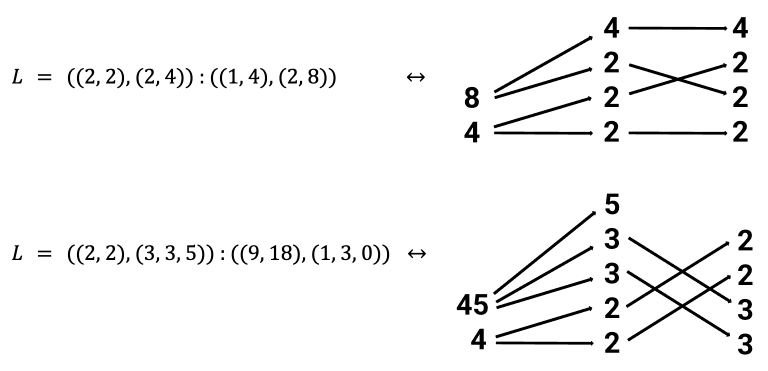

이 diagrams는 category **Nest** 안의 morphisms를 represent한다.

**Definition:** **Nest**를 다음 category라고 하자.

- `object`: positive integers의 nested tuple $(s_1, \ldots, s_m)_P$
- `morphism`: morphism의 definition은 **Tuple** category의 tuple morphism과 동일하다. flattening된 index를 기준으로 한다.

**Nested Tuple Morphism**:

morphism $f : (s_1, \ldots, s_m)_P \to (t_1, \ldots, t_n)_Q$는 finite pointed sets 사이의 map $\alpha$로 지정된다.

$$
\alpha: \{ \ast, 1, \ldots, m \} \to \{ \ast, 1, \ldots, n\}
$$

그리고 다음 conditions를 만족한다.

1.

$$
\alpha(*) = *
$$

2. 만약 $\alpha(i) \neq *$이고 $\alpha(i) = \alpha(i')$라면, $i = i'$이다.
3. 만약 $\alpha(i) = j \neq *$라면, $s_i = t_j$이다.

우리는 이러한 morphism $f$가 $\alpha$ 위에 놓여 있다고 말하며, $f$를 nested tuple morphism이라고 부른다.

$f$가 nested tuple morphism이면, $f$가 encoding하는 layout은 다음 layout이다.

$$
L_f = (s_1, \ldots, s_m)_P : (d_1, \ldots, d_m)_P
$$

그 shape는 $f$의 domain이고, Stride는 다음 formula로 주어진다.

$$
d_i = \begin{cases} t_1 \cdots t_{j-1} & \text{if } \alpha(i) = j \\ 0 & \text{if } \alpha(i) = \ast \end{cases}
$$

nested case에서도 **standard form**과 **non-degeneracy**를 정의할 수 있으며, 다시 correspondence theorem을 얻는다.

**Theorem:** non-degenerate tractable layouts와 standard form의 non-degenerate nested tuple morphisms 사이에는 one-to-one correspondence가 존재한다.

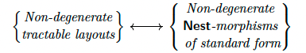

**flattening functor**를 통해 **Nest**와 **Tuple** 두 categories를 비교할 수 있다.

$$
(-)^\flat : \mathbf{Nest} \to \mathbf{Tuple}.
$$

특히 이를 **Tuple**에서 **FinSet**으로 가는 realization functor와 postcompose하여, **Nest** 위에 정의된 realization functor를 얻을 수 있다.

$$
| \cdot | : \textbf{Nest} \to \textbf{FinSet}
$$

이는 앞에서와 같은 properties를 가진다.

**Theorem:** **Nest**에서 **FinSet**으로 가는 realization functor는 다음 properties를 만족한다.

1. $S$가 size $M$인 nested tuple이면 $|S| = [0, M)$이다.
2. $S$와 $T$가 각각 size $M$과 $N$인 nested tuple이고, $f : S \to T$가 tuple morphism이면, 그 realization $|f| : [0, M) \to [0, N) \subset \mathbf{Z}$는 $L_f$의 layout function이다.

특히 이 theorem으로 다음 result를 쉽게 prove할 수 있다.

**Theorem:** $f$와 $g$가 composable nested tuple morphisms이면:

$$
L_{g \circ f} = L_g \circ L_f
$$

**Nest** category는 coalesce, complement, logical division, logical product 같은 많은 important layout operations의 analogues를 support한다. 아래 theorem에서는 이러한 operations와 corresponding layout operations 사이의 compatibility를 summarize한다.

**Theorem:**

1. nested tuple morphisms 위에 **coalesce** operation $coal(f)$를 정의한다. 이는 layout의 coalesce와 compatible하다. 즉:

$$
L_{\mathit{coal}(f)} = \mathit{coal}(L_f)
$$

2. nested tuple morphisms 위에 **complement** operation $f^c$를 정의한다. 이는 layout의 complement와 compatible하다. 즉 $f$가 standard form의 injective nested tuple morphism이면:

$$
L_{f^c} = \mathit{comp}(L_f)
$$

3. nested tuple morphisms의 **divisibility** 개념과, $g$가 $f$를 divide할 때의 **logical division** operation $f \oslash g$를 정의한다. 이 operation은 layout의 logical tiling과 compatible하다. 즉:

$$
\mathit{coal}(L_{f \oslash g}) = \mathit{coal}(L_f \oslash L_g)
$$

4. nested tuple morphisms의 **product admissibility** 개념과, $f$와 $g$가 product admissible할 때의 **logical product** operation $f \otimes g$를 정의한다. 이 operation은 layout의 logical product와 compatible하다. 즉:

$$
L_{f \otimes g} = L_f \otimes L_g
$$

**nesting** 개념을 도입함으로써 theoretical framework의 expressive power가 크게 확장되었고, flat layout composition의 difficult problem을 해결할 길이 열렸다.

이 section은 nested structure를 도입하여 layout의 "shape"를 rigid integer sequence에서 flexible하고 reconfigurable한 tree-like structure로 upgrade한다. 이는 이후 `refinement`, `pullback` 등의 operations를 통해 서로 다른 layouts의 interface를 dynamically match할 수 있는 가능성을 제공한다.

### 5.2 Composition Algorithm

이제 theory를 nested case로 generalize했으므로, 우리의 **composition algorithm**을 설명할 수 있다. 이 algorithm은 category-theoretic framework를 사용해 tractable layouts `A`와 `B`의 composition $B \circ A$를 계산한다. 이 algorithm에는 아직 논의하지 않은 important constructions, 즉 **mutual refinements**, **pullbacks**, **pushforwards**가 사용된다.

layout $A = (6, 6):(1, 6)$와 $B = (12, 3, 6):(1, 72, 12)$의 composition을 계산한다고 하자. $A$와 $B$가 모두 tractable하므로, tuple morphisms로 represent할 수 있다.

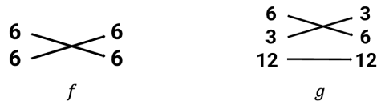

이 morphisms는 composable하지 않다. $f$의 codomain (6, 6)이 $g$의 domain $(12, 3, 6)$과 같지 않기 때문이다. 이는 morphisms $f$와 $g$를 직접 사용해 composition $B \circ A$를 계산할 수 없다는 뜻이다.

그러나 `(6, 6)`과 `(12, 3, 6)`의 **mutual refinement**를 찾아서 계산을 계속할 수 있다. 아래 diagram과 같다.

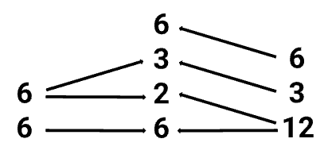

직관적으로, 이러한 mutual refinement는 $f$의 codomain과 $g$의 domain을 compatible한 방식으로 decompose하는 방법을 설명하는 specification이다. 이 mutual refinement를 사용해 $f$와 $g$를 composable한 morphisms $f'$와 $g'$로 변환할 수 있다.

$f$의 경우, mutual refinement는 첫 번째 `6`을 `(2, 3)`으로 decompose하고 $f$의 codomain에 extra `6`을 포함해야 함을 지시한다.

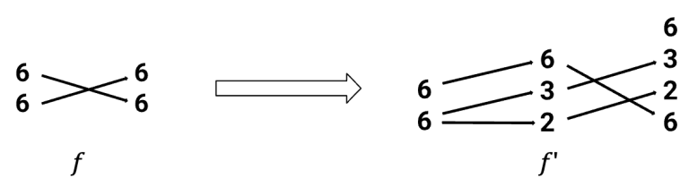

엄밀히 말하면, $f$에서 $f'$를 construct하는 process는 **pullback**의 한 instance다.

$g$의 경우, mutual refinement는 `12`를 `(6, 2)`로 decompose해야 함을 지시한다.

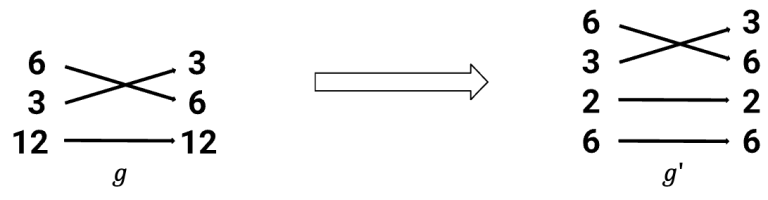

엄밀히 말하면, $g$에서 $g'$를 construct하는 process는 **pushforward**의 한 instance다.

nested tuple morphisms $f'$와 $g'$는 composable하므로, 그 composition을 형성할 수 있다.

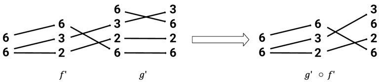

encoded layout을 계산하면 다음을 얻는다.

$$
B \circ A = L_{g' \circ f'} = ((2, 3), 6) : ((6, 72), 1)
$$

Cute-DSL의 예시

```python
import cutlass
import cutlass.cute as cute

@cute.jit
def composition_example():
    """
    Demonstrates basic layout composition R = A ◦ B
    """
    A = cute.make_layout((6, 6), stride=(1,6))
    B = cute.make_layout((12, 3, 6), stride=(1, 72, 12))
    R = cute.composition(A, B)

    # Print static and dynamic information
    print(">>> Layout A:", A)
    print(">>> Layout B:", B)
    print(">>> Composition R = A ◦ B:", R)

composition_example()

# output
>>> Layout A: (6,6):(1,6)
>>> Layout B: (12,3,6):(1,72,12)
>>> Composition R = A ◦ B: (12,3,6):(1,72,12)
```

우리는 예시 하나를 통해 composition algorithm의 실제 operation을 보였다. 강조해야 할 점은 **logical division**과 **logical product**가 모두 composition에 따라 정의되므로, 이 algorithm을 사용해 이러한 operations도 계산할 수 있다는 것이다.

### 5.3 Logical division

예를 들어 matrix를 block으로 나누어 연산해야 할 때, Layout division을 정의하여 어떤 Layout이 다른 Layout에 의해 partition되도록 할 수 있다. 이러한 function은 Tiling 또는 Layout partition의 basis가 될 수 있다.

logical division의 definition은 다음과 같다.

Layout $A=S:D$에 대해 $M = size(A)$라고 하자. B가 또 다른 Layout이고, $\{B,M\}$이 complementable하며, $\{S,B\}$가 composable하다고 가정하면, logical divide를 다음과 같이 정의한다.

$$
A \oslash B := A \circ (B, complement(B,M))
$$

cute-DSL의 function definition도 마찬가지다.

```python
def logical_divide(layoutA, layoutB):
## text ommited
  return composition(layoutA, make_layout(layoutB, complement(layoutB, size(layoutA))))
```

실제 matrix tiling 예시로, (1024,7168)을 Tile (32,32)에 따라 split하여 logical division을 수행하면 다음과 같다.

```python
@cute.jit
def logical_divide_example():
    """
    Demonstrates logical divide
    """
    # Define the original layout
    layout = cute.make_layout((1024,7168), stride=(1,1024))

    # Define the tiler
    tiler = cute.make_layout((32,32), stride=(32,1))

    # Apply logical divide
    result = cute.logical_divide(layout, tiler=tiler)

    # Print results
    print(">>> Layout:", layout)
    print(">>> Tiler :", tiler)
    print(">>> Logical Divide Result:", result)

logical_divide_example()

# output
>>> Layout: (1024,7168):(1,1024)
>>> Tiler : (32,32):(32,1)
>>> Logical Divide Result: ((32,32),7168):((32,1),1024)
```

### 5.4 Summary

`f`의 `codomain(f)`와 `g`의 domain `domain(g)`를 두 software modules의 **interfaces**로 볼 수 있다. layout composition이 실패하는 root cause는 interface mismatch다. 이 algorithm의 본질은 common하고 더 fine-grained한 "intermediate interface representation", 즉 mutual refinement를 도입한 뒤 `f`와 `g`를 모두 이 new interface에 "adapt"하여 서로 연결되게 만드는 것이다.

이 방법은 다음 advantages를 보여준다.

1. **Formalization and automation:** 많은 manual derivation과 subscript calculation이 필요한 complex process를 well-defined하고 diagram, 즉 morphism 기반의 transformation rules로 바꾼다. 이로 인해 전체 process를 computer program으로 **automate**할 수 있다. 이것이 바로 CuTe library가 `compose` function을 구현하는 theoretical basis다.
2. **Correctness guarantee:** 전체 process가 rigorous category-theoretic framework 위에 세워져 있으므로, 각 step, 즉 pullback, pushforward, composition에는 mathematical correctness guarantee가 있다. 최종 composition layout은 mathematical하게 correct임이 prove된다. 이는 manual calculation에서 생길 수 있는 여러 errors를 제거한다.
3. **Unity:** 글 끝에서 말하듯, 이 algorithm의 core idea는 interface refinement와 adaptation을 통해 composition을 구현하는 것이다. 이는 logical tiling/partitioning이나 logical product 같은 더 complex operations를 define하고 calculate하는 데에도 적용된다. 이는 이 theoretical framework가 좋은 unity와 expressive power를 갖고 있음을 보여준다.

## 6. Operad theory와의 관계

이 장은 layout theory와 **operad theory** 사이에 흥미로운 connection이 있음을 설명한다. 먼저 **Tuple** category가 어떻게 자연스럽게 어떤 operad의 **categories of operators**의 subcategory로 나타나는지 describe한다. 그런 다음 profile의 operad, 즉 operad of profiles를 도입하고, refinements를 "backward" morphisms로 구축하는 nested tuple category의 alternative definition을 제시한다. 이는 composition algorithm에서 refinement를 둘러싼 여러 operations에 background와 context를 제공한다. 관례에 따라 우리는 operad와 그 category of operators를 identify한다. 예를 들어 commutative operad는 finite pointed sets의 category다.

### 6.1 Operad란 무엇인가

이 장을 이해하려면 "operad"에 대한 직관적 이해가 필요하다.

operad는 **여러 input을 갖는 operations와 그것들을 compose하는 방법**을 describe하기 위해 특화된 algebraic structure다. 대표적인 예시는 function composition이다. 함수 $f(x, y)$와 $g(z)$가 있을 때, $g$의 output을 $f$의 한 input으로 넣어 새로운 function $h(z, y) = f(g(z), y)$를 만들 수 있다. operad는 이런 "composition rules"를 formalize하고 axiomatize한 것이다.

가장 simple한 operad는 다음을 포함한다.

1. 각 $n \geq 0$에 대해 $n$-ary operations의 set $O(n)$이 있다.
2. composition rule $\circ_i$가 있어, 하나의 $m$-ary operation을 $n$-ary operation의 $i$번째 "input slot"에 insert하여 $(n+m-1)$-ary operation을 얻을 수 있다.
3. associativity와 unit 같은 axioms를 만족한다.

### 6.2 Layout theory를 operad theory에 embedding하기

`divisibility relation` 아래에서 positive integers로 이루어진 `poset` $\mathbb Z_{ \gt 0}$를 생각하자. $a \leq b$는 $a$가 $b$를 divide할 때, 그리고 그때에만 성립한다. 어떤 poset이든 마찬가지로, 우리는 여기에 category를 associate할 수 있다. 그 objects는 set의 elements이고, $a \leq b$일 때, 그리고 그때에만 morphism $a \to b$가 존재한다. 간단히 쓰기 위해 이 category도 $\mathbb Z_{ \gt 0}$라고 표기한다.

이제 이 category를 multiplication operation 아래의 symmetric monoidal category, 즉 SMC로 보고, **operadic nerve**를 적용해 operad $\mathbb Z_{ \gt 0}^{\otimes}$를 생성한다. 이는 finite pointed sets category로 가는 functor를 갖춘다.

wide subcategory, 즉 모든 objects는 보존하지만 일부 morphisms만 보존하는 $E_{0}^{\otimes}$가 있다. 이는 finite pointed sets 위에서 basepoint 밖에서는 injective인 maps로 구성되며, 이 $E_{0}^{\otimes}$는 single unary operation의 operad다. 그런 다음 $\mathbb Z_{ \gt 0}^{\otimes}$를 $E_{0}^{\otimes}$ 위로 pull back하면, 그 result는 condition 2c, 즉 $\alpha(i) =j \neq *$이면 $s_i = t_j$라는 condition을 제외한 **Tuple** category definition과 equivalent하다. condition 2c를 impose하면 **Tuple**은 이 pullback의 subcategory로 정의된다.

###### Operadic nerve

이는 category theory의 Nerve[3] construction과 유사하다. Nerve는 category를 simplicial set으로 변환하는 데 사용된다. simplicial set `X`는 하나의 single set이 아니라, sets의 family $\{ X_n | n \geq 0\}$와 그 사이의 specific *face maps* 및 *degeneracy maps*로 이루어진다.

- $X_0$: 0-simplex의 set이다. *vertices/points*로 생각할 수 있다.
- $X_1$: 1-simplex의 set이다. *directed edges/line segments*로 생각할 수 있다.
- $X_2$: 2-simplex의 set이다. *filled triangles*로 생각할 수 있다.
- $X_3$: 3-simplex의 set이다. *filled tetrahedra*로 생각할 수 있다.
- ...
- $X_3$: n-simplex의 set이다.

Operadic Nerve는 mathematical construction으로, 그 core role은 algebraic structure, 여기서는 "symmetric monoidal category"를 geometric/combinatorial structure, 즉 simplicial set으로 변환하는 것이다. 서로 달라 보이는 두 mathematical worlds를 연결하는 bridge로 생각할 수 있다.

- bridge의 한쪽 끝: 좋은 multiplication/product operation을 가진 algebraic world다.
- bridge의 다른 끝: complex composition patterns를 describe하는 geometric/combinatorial world다. 이 world에서는 여러 operations를 tree structure로 compose하는 방법을 clear하게 논의할 수 있다.

이 글에서 author는 operadic nerve를 사용하여 "positive integers and multiplication"이라는 simple algebraic structure를 CuTe layout의 complex한 "shape composition" rules를 describe할 수 있는 operad $\mathbb Z^{\otimes}$로 바꾼다.

Operad가 다루는 것은 *tree-like/multi-input composition*이다. operad operation은 여러 inputs와 하나의 output을 가지며, 함수 $f(x, y, z)$와 비슷하다. 이러한 operations는 tree처럼 nested compose될 수 있다. 예를 들어 $h(u, v) = f(g_1(u), g_3(v, u), z)$이다. *operadic nerve*는 특정 algebraic structure, 즉 *Symmetric Monoidal Category, SMC*를 operad로 "geometrize"하는 것이다.

###### Symmetric Monoidal Category (SMC)

SMC는 category $C$이면서 동시에 multiplication과 유사한 "product" operation $\otimes$를 갖춘 것이다. 이 $\otimes$ operation은 다음을 만족한다.

- *Associativity:* $(A \otimes B) \otimes C$와 $A \otimes (B \otimes C )$는 "same"이다. category-theoretic sense에서는 natural isomorphic이다.
- *Commutativity:* $A \otimes B$와 $B \otimes A$는 "same"이다.
- *Unit:* object $I$가 존재하여 $A \otimes I$와 $A$가 "same"이 된다.

Layout algebra에서 사용하는 SMC는 $(\mathbb Z, \times)$다.

- *Objects:* positive integers.
- *Morphisms:* $a$가 $b$를 divide하면 morphism $a \rightarrow b$가 있다.
- *Product operation $\otimes$:* ordinary integer multiplication $\times$다.
- *Unit:* integer `1`.

operadic nerve가 $(\mathbb Z_{\gt 0}, \times)$ 같은 SMC에 작용할 때, 그것이 생성하는 operad의 $n$-ary operations는 $\otimes$ operation으로 $n$ objects를 compose하는 가능한 모든 ways에 대응한다. 이러한 "composition ways"는 `tree`로 visualize할 수 있다. SMC의 `n` objects $A_1, \ldots , A_n$를 $\otimes$ operation으로 compose하면, result는 $A_1 \otimes A_2 \otimes \ldots \otimes A_n$이다.

operadic nerve는 이 "composition tree" structure를 geometrize한다. 그것이 생성하는 category of operators에서 *objects*는 original SMC의 objects, 예를 들어 positive integers다. 하나의 $n$-ary morphism $A_1, \ldots , A_n \rightarrow B$는 $A_1 \otimes A_2 \otimes \ldots \otimes A_n$에서 $B$로 가는 morphism에 대응한다. $(\mathbb Z_{\gt 0}, \times)$의 예에서는 이것이 divisibility relation, 즉 $t_1 \times \ldots \times t_n$이 $b$를 divide한다는 뜻이다.

이 construction의 목적은 *가장 basic한 mathematical principles에서 출발해 CuTe layout을 describe할 수 있는 category를 build하는 것*이다.

1. *Starting point:* author는 가장 simple한 structure $(\mathbb Z_{\gt 0}$에서 출발한다. 이는 layout의 `shape` dimensions가 multiplied되어 merge될 수 있다는 basic fact, 즉 `coalesce`를 represent한다.
2. *Apply operadic nerve:* $(\mathbb Z, \times)$에 operadic nerve를 적용하여 operad $\mathbb Z^{\otimes}$를 얻는다. 새로 생성된 이 operad는 매우 rich한 structure이며, "a sequence of numbers를 multiplication으로 compose하는" 모든 rules를 내재적으로 포함한다.

- $\mathbb Z^{\otimes}$ 안의 하나의 `n`-ary operation은 $n$-dimensional `shape` tuple $(s_1, \ldots , s_n)$에 대응한다.
- $\mathbb Z^{\otimes}$ 안의 composition은 `shape` tuple을 nest하고 merge하는 것에 대응한다. 예를 들어 $(s_1,s_2)$와 $s_3$를 combine하여 $(s_1 \times s_2,s_3)$로 만든다.

3. *Construct Tuple category:* $\mathbb Z^{\otimes}$ structure는 지나치게 크고 generic하다. CuTe의 layout morphisms에는 extra constraints가 있다. 예를 들어 "하나의 input dimension은 최대 하나의 output dimension에 mapping된다"는 injectivity다. 따라서 author는 pullback technique을 통해 $\mathbb Z^{\otimes}$에서 substructure를 "cut out"하며, 이 substructure가 앞에서 정의한 *Tuple category*와 정확히 일치한다.

이 관점에서 profiles를 어떻게 integrate해야 할까? profile 자체는 하나의 single-colored symmetric operad를 이룬다. 그 $n$-ary operations의 set은 length가 $n$이고 symmetric group action이 trivial한 profiles로 이루어진다. operadic nerve 아래에서 이 operad를 $P^{\otimes}$로 표기한다. 그런 다음 operads의 pullback을 construct하면 임의의 symmetric monoidal category $C^{\otimes}$ 안에서 labeled profile을 고려할 수 있다. $\mathbb Z_{\gt 0}^{\otimes}$에 대해서는 얻어진 pullback을 $P\mathbb Z_{\gt 0}^{\otimes}$라고 표기한다. 따라서 depth 1의 profile을 고려하면, 마찬가지로 **Tuple**은 $P\mathbb Z_{\gt 0}^{\otimes}$를 $E_{0}^{\otimes}$ 위로 pull back한 것의 subcategory가 된다. 실제로는 $P\mathbb Z_{\gt 0}^{\otimes}$ 자체의 subcategory이기도 하다.

또한 $P\mathbb Z_{\gt 0}^{\otimes}$는 tuple morphisms와 refinements를 동시에 포함한다. integer multiplication이 monoidal product이기 때문이다. 따라서 더 complex한 constructions를 수행하기에 적절한 category다. 구체적으로 composition algorithm의 diagrams에서 보았듯이, factorization 뒤에 tuple morphism이 이어지는 process를 그 자체로 어떤 category 안의 morphism으로 볼 수 있다.

category theory에는 이를 가능하게 하는 standard construction이 있다. 즉 $P\mathbb Z_{\gt 0}^{\otimes}$ 안에서 specific Span category[4]를 construct할 수 있다. 이 category에서 forward morphisms의 class는 wide subcategory **Tuple** 안의 morphisms이고, backward morphisms의 class **Ref**는 finite pointed set map $\alpha: { \ast, 1, \ldots, m } \to { \ast, 1, \ldots, n}$ 위의 cocartesian edges[5]로 구성된다. 이 maps $\alpha$는 다음을 만족한다.

1. $\alpha$는 active하다. 만약 $\alpha(i)=*$이면 $i = *$이다.
2. $\alpha$는 surjective하다.
3. ${1, \ldots, m}$ 위로 restrict했을 때, $\alpha$는 non-decreasing이다.

간단히 설명하면 다음과 같다.

1. active: 어떤 dimension도 버리지 않는다. 모든 input dimension은 output dimension에 contribute해야 한다.
2. surjective: output의 모든 dimension은 적어도 하나의 input dimension으로 구성되어야 한다. "source가 없는" output dimension은 생기지 않는다.
3. Non-decreasing: dimensions의 relative order를 preserve하여 interleaving을 피한다.

여기서 이러한 maps 위에서 cocartesian edges를 취하는 효과는, 예를 들어 $ab = c$인 map $(a, b) \rightarrow c$를 고려한다는 뜻이다. $ab$가 $c$를 divide하는 일반적인 case가 아니다. 다시 말해 우리가 얻는 것은 정확히 refinement다.

주의하자. Span construction이 well-defined되려면, $P\mathbb Z_{\gt 0}^{\otimes}$ 안에서 **Tuple**의 morphisms를 **Ref**의 morphisms를 따라 pullback할 수 있는지 check해야 한다. 이는 prove될 수 있다.

마지막으로, 얻어진 Span category를 **Span(Tuple, Ref)**로 표기한다. 이 category의 typical morphism은 다음과 같다.

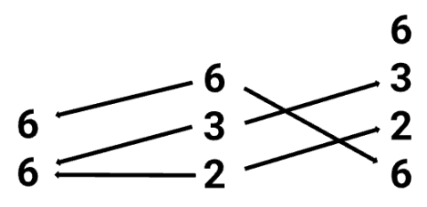

여기서는 Span diagram의 standard notation을 따라, 이제 left arrow group을 backward-facing arrows로 그렸다.

definition에 따라 **Span(Tuple, Ref)**는 $\text{Tuple}$과

$$
\text{Ref}^{\text{op}}
$$

를, 즉 Ref의 opposite category를 subcategory로 포함한다. 그런 다음 realization functor를 **Tuple**에서 **FinSet**으로 확장하여 전체 **Span(Tuple, Ref)** category에 작용하게 할 수 있다. 이렇게 하면 **refinements**는 *inverse colexicographic isomorphisms*로 mapping된다.

conceptually, 이는 nested tuples의 category에 대한 alternative perspective를 제공한다. **Nest** category와 달리 **Span(Tuple, Ref)** category의 **objects**는 flat tuples이지만 **morphisms**는 nested되어 있다. 이는 layout을, 그 codomain이 그 shape의 depth-1 reduction인 mapping을 정의하는 것으로 보는 관점과 consistent하다.

### 6.3 추가 분석

author는 일련의 정교한 mathematical constructions를 통해 `Tuple` category를 operad world에 embed한다. 이 process를 step by step으로 분해해 보자.

먼저 **base structure: $(\mathbb Z_{\gt 0}, \times)$**를 construct한다.

author의 starting point는 positive integers set과 "multiplication" operation이다. 이는 **monoid**를 이룬다. "$a \leq b$ iff a divides b"라는 relation을 통해 author는 이를 **poset**으로 만들고, 나아가 **category**로 만든다. 이 category를 **symmetric monoidal category**로 보며, 여기서 "monoidal product"는 integer multiplication $\times$이다.

다음은 **construct operad: Operadic Nerve**다.

이는 임의의 symmetric monoidal category, 예를 들어 $(\mathbb Z_{\gt 0}, \times)$에서 operad를 build할 수 있는 standard technique이다. 얻어진 operad $\mathbb Z_{\gt 0}^{\otimes}$는 직관적으로 다음과 같이 이해할 수 있다.

- 하나의 `n`-ary operation은 `n` positive integers의 tuple $(t_1, \ldots, t_n)$이다.
- composition rule은 하나의 tuple을 다른 tuple 안에 insert하고, underlying level에서 integer multiplication으로 `shape` values를 merge하는 것이다. 이는 layout에서 "refinement" 또는 "coalesce" operation의 prototype과 정확히 맞아떨어진다.

그다음은 **Pullback construction**이다. author는 이 operad를 직접 사용하지 않고, **pullback** operation으로 constraints를 impose하여 `Tuple` category를 정확히 construct한다. `Tuple` category의 morphism $\alpha$에는 key property가 있다. non-basepoint map이 **injective**, 즉 하나의 input dimension이 최대 하나의 output dimension에 mapping된다는 것이다. author는 이 property를 encode하는 operad $E_0^{\otimes}$, 즉 unary operations만 포함하는 operad를 찾았다.

$\mathbb Z_{\gt 0}^{\otimes}$를 $E_0^{\otimes}$ 위로 pull back하면, 얻어진 new structure는 injectivity property를 자동으로 만족한다. 여기에 $s_i = t_j$ condition을 더하면 `Tuple` category가 reconstruct된다. 이 step의 의미는 `Tuple` category가 허공에서 만들어낸 structure가 아니라, "multiplicative composition rules"와 "injective mapping rules"라는 두 more basic structures에서 standard category-theoretic construction, 즉 pullback을 통해 자연스럽게 나온다는 점이다.

마지막으로 **Profile**을 도입한다. Profile 자체도 operad $P^{\otimes}$를 이루며, 그 operations는 "`n`개의 things를 하나의 nested structure로 compose하는 방법"이다. pullback을 다시 사용해 $\mathbb Z_{\gt 0}^{\otimes}$와 $P^{\otimes}$를 combine하면 $P\mathbb Z_{\gt 0}^{\otimes}$를 얻는다. 이 new operad는 **numeric multiplicative composition**과 **structural nesting composition**을 동시에 encode한다. `Nest` category는 바로 이 richer world 안에 존재한다.

그다음에는 **Span category**를 추가로 도입한다.

5장에서 $f$와 $g$를 compose하려면 먼저 "mutual refinement"를 찾고, $f$에 `pullback`을 수행하며, $g$에 `pushforward`를 수행해야 했다. 이 process는 category 바깥에서 일종의 "manual operation"을 수행하는 것처럼 보인다.

author는 `Span(Tuple, Ref)`라는 new category를 construct할 수 있다고 제안한다. 이 category에서는 morphism 자체가 "refinement" process를 포함한다.

하나의 **Span**은 $X \leftarrow S \rightarrow Y$ 형태의 morphism pair다. **Span(Tuple, Ref)**에서 morphism $A \rightarrow B$는 span으로 정의되며, 그 안에서:

- $\leftarrow$는 **Ref** category에서 오며, **Refinement** operation을 represent한다. 예를 들어 `(36)`을 `(6,6)`으로 refine하는 것이다.
- $\rightarrow$는 **Tuple** category에서 오며, 앞에서 정의한 **tuple morphism**을 represent한다.

직관적으로, 이 new category의 morphism 하나는 "먼저 input을 한 번 refine하고, 그다음 tuple mapping을 수행하는" 전체 process를 represent한다. composition algorithm에서 $f$에서 $f'$로 가는 transformation은 `Span(Tuple, Ref)` category 안에서 $f$를 refinement를 represent하는 morphism과 compose하는 것으로 볼 수 있다.

`Span` category를 통해, 5장에서 $f$와 $g$를 compose하기 위해 수행한 "adaptation" operation은 이제 new category 안에서 이루어지는 standard morphism composition이 된다.

모든 operations가 unified category-theoretic framework 안으로 internalized된다. **refinement** operation은 `realization functor` 아래에서 *inverse colexicographic isomorphism*에 대응하고, **tuple morphism**은 *layout function*에 대응한다. 이 duality는 매우 elegant하며, data layout 뒤에 있는 deep mathematical symmetry를 드러낸다.

## 7. Conclusion

category-theoretic perspective에서 본 Cute Layout algebra는 더 직관적이며, diagram의 arrows를 통해 복잡한 Stride operations를 수행할 수 있다. 또한 이를 operad theory에 embed함으로써 CuTe layout theory를 더 universal한 mathematical branch인 operad theory로 거슬러 올라가게 하고, 깊은 algebraic background를 부여한다.

이 글의 mathematical language는 매우 abstract하지만, 중요한 message를 전달한다. complex hardware를 다루는 programming model을 design할 때, 그 뒤에 있는 올바른 mathematical abstraction을 찾는 것은 매우 중요하다. 서로 다른 Tensor Core architectures에 대해 optimal data tiling과 loading patterns를 generate하는 것처럼 복잡해 보이는 engineering problem도, 적절한 mathematical framework 아래에서는 놀라울 만큼 simple하고 regular한 형태를 보일 수 있다.

CuTe의 성공과 이 글이 제공하는 theoretical foundation은 abstract algebra에서 computer architecture로 이어지는 path가 얼마나 productive한지 다시 증명한다. 또한 future compilers와 libraries가 new hardware에 자동으로 adapt하도록 design하는 방향을 제시한다. **problem 뒤에 숨어 있는 mathematical structure를 찾아 활용하라**.

이 또한 내가 오래전부터 해 온 또 다른 working style이다. category theory의 perspective에서 large model structure를 찾고자 해 왔다. ["대모델 시대의 수학적 기초"](https://mp.weixin.qq.com/mp/appmsgalbum?__biz=MzUxNzQ5MTExNw==&action=getalbum&album_id=3210156532718403586#wechat_redirect) special topic에서 말했듯이:

이번 artificial intelligence revolution의 mathematical foundation은 category theory, algebraic topology, algebraic geometry 같은 20세기 mathematics가 처음으로 commercial computing stage에 오른 것이다.

대략 10년 전 이 viewpoint의 guidance 아래 관련 disciplines의 study를 점차 complete해 왔다. 앞으로 모두 함께 노력하자.

참고 자료

[1]

Categorical Foundations for CuTe Layouts: *https://research.colfax-intl.com/categorical-foundations-for-cute-layouts/*

[2]

representable functor: *https://ncatlab.org/nlab/show/representable+functor*

[3]

Nerve\_(category\_theory): *https://en.wikipedia.org/wiki/Nerve\_(category\_theory)*

[4]

Span category: *https://ncatlab.org/nlab/show/span*

[5]

cocartesian edges: *https://ncatlab.org/nlab/show/Cartesian+morphism*
