# Tensor-018 CuteDSL-1: Introduction

- 원문 제목: CuteDSL-1:  Introduction
- 저자: Tilebot
- 계정: zartbot
- 발행일: 2025년 9월 21일 10:28

### TL;DR

Hotchip 2025에는 AI Kernel Programming 관련 Session이 몇 개 있었고, 그중 Tri Dao가 CuteDSL을 이야기했다. 그동안 이 부분 내용을 보충할 시간이 없었다. 최근 시간을 내어 이 내용을 정리하고, 이후 Triton 및 Tilelang과도 비교 분석해 보려 한다. 이 글은 주로 기본적인 CuteDSL 소개와 설치 test를 중심으로 한다. 주로 GTC25 Session s74639 "Enable Tensor Core Programming in Python with CUTLASS 4.0"[1]을 참고했다.

## 1. 왜 CuteDSL이 필요한가

### 1.1 Cutlass

앞서 [Tensor](https://mp.weixin.qq.com/mp/appmsgalbum?__biz=MzUxNzQ5MTExNw==&action=getalbum&album_id=3557619493198151684&scene=173&subscene=&sessionid=svr_32119fe6ccb&enterid=1722676230&from_msgid=2247491424&from_itemidx=1&count=3&nolastread=1#wechat_redirect)라는 topic에서 Cutlass에 대해 이미 매우 자세히 많이 소개했다.


대략적인 관점은 이렇다. PyTorch, TensorFlow 같은 high-level framework는 compiler를 통해 많은 detail을 숨기고 common use case에서 뛰어난 성능을 보인다. 하지만 algorithmic innovations와 PDL(Programming Dependent Launch) 같은 fine-grained control이 필요한 advanced hardware feature에 대해서는 abstraction level이 너무 높아 요구를 만족하지 못한다.

이 그림은 Tri Dao도 인용했다. Triton 같은 DSL은 elevator를 타는 것과 같다. 많은 것이 자동으로 optimize되고 처리되며, developer는 algorithm logic에만 집중한다. tile-based programming model은 개발 속도가 편하고, 마치 elevator를 타면 빠르게 top floor까지 올라갈 수 있는 것과 같다. 하지만 extreme performance를 추구하려면 fine-grained optimization이 필요하고 더 많은 low-level abstraction을 노출해야 한다. 반면 PTX와 CUDA는 직접 한 걸음씩 조정해야 한다. 마치 계단을 한 칸씩 오르는 것과 같다. 하지만 가장 세밀한 tuning capability를 가진다. 그래서 Nvidia는 Tensor computation을 위해 C++ 기반 template library인 cutlass를 만들고, Tensor Layout algorithm을 도입했으며, developer가 fine-grained control도 할 수 있게 했다. 이는 escalator를 타는 느낌과 조금 비슷하다. bare CUDA/PTX programming보다 편하지만, 동시에 "escalator 위에서 몇 걸음 직접 걷는" 것도 가능하다.

Cutlass는 좋은 abstraction structure를 정의했다.

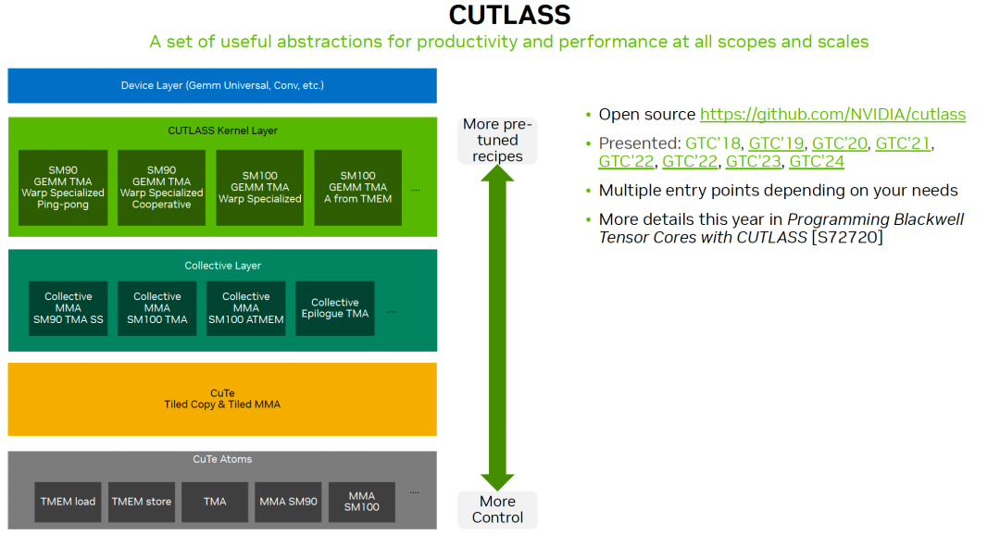

### 1.2 Cutlass의 문제와 CuteDSL의 이유

C++ template metaprogramming은 CUTLASS가 "zero-cost abstraction"을 구현하는 cornerstone다. compile time에 특정 data type, layout, hardware architecture에 highly specialized된 code를 생성할 수 있어 runtime branch나 virtual function call overhead를 피한다. 하지만 Cutlass에도 pain point가 많다. template library라 compile이 매우 느리고, error가 나면 debug도 어렵다. 게다가 modern DL 관련 개발은 대부분 Python 위에서 이루어지므로, pybinding을 반복해서 작성하는 것도 꽤 번거롭다.

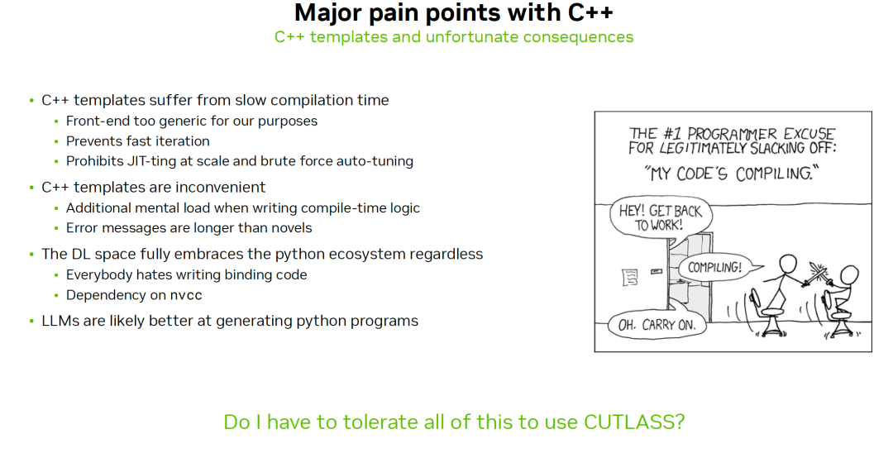

그렇다면 Python 안에 DSL을 만들어 지원할 수 있을까? deep learning research와 application의 주전장은 Python이다. low-level performance library를 Python developer에게 직접 노출하면 "idea에서 high-performance implementation까지"의 경로를 크게 줄일 수 있다. researcher는 cross-language development barrier 없이 새로운 operator fusion, mixed-precision strategy, sparse algorithm을 빠르게 verify할 수 있다. 이는 performance optimization의 threshold를 낮추고 bottom-up innovation을 더 많이 촉진할 수 있다.

이것이 Cutlass-DSL이다. initial version은 CuTe의 일부 low-level support를 지원했다. 이후 계속 추가될 예정이다.

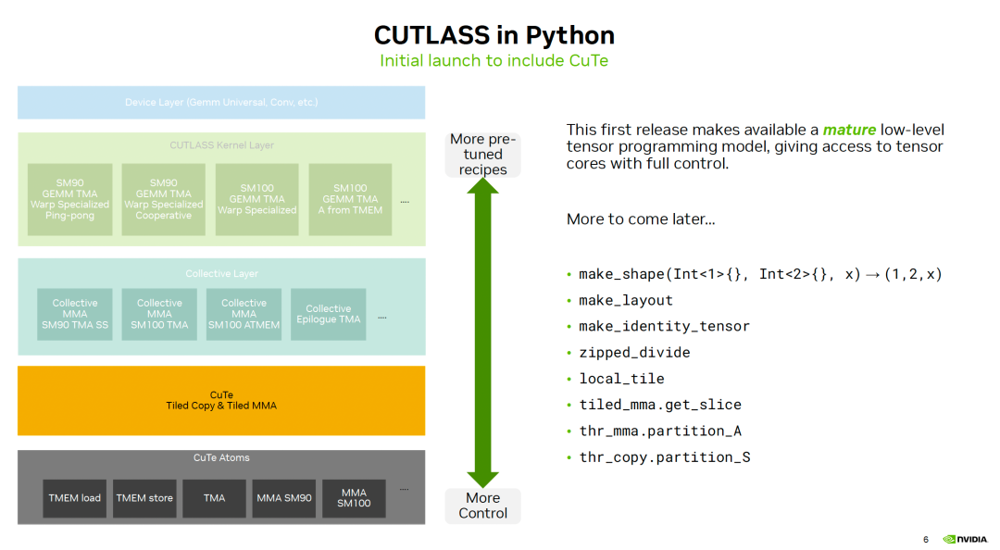

장점은 compile time이 훨씬 짧아졌고 debug도 상대적으로 편해졌지만, performance loss는 없다는 점이다.

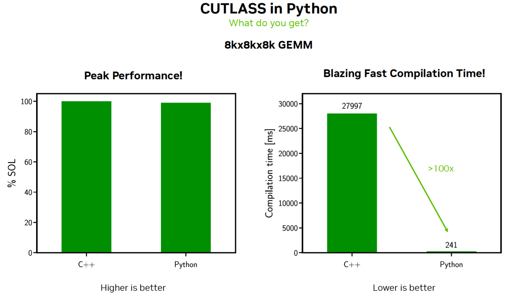

### 1.3 CuteDSL quick start

공식 PPT는 early version으로 보인다. 정식 cutlass-dsl 4.2 사용법은 다음과 같다. 먼저 system에는 CUDA 12.9 이상이 설치되어 있어야 하고, Python version도 3.12보다 커야 한다. GPU는 Ada/Ampere/Hopper/Blackwell을 지원한다. online에서 A10 machine 하나를 간단히 열고 cutlass-dsl library만 설치하면 된다.

```c++
 pip install nvidia-cutlass-dsl

 #물론 이후 개발을 위해 torch와 jupyter도 계속 설치한다.
 pip install torch jupyter
```

간단한 Hello world example은 다음과 같다.

```python
import cutlass
import cutlass.cute as cute

# Kernel function definition
@cute.kernel
def kernel():
    # Get the x component of the thread index (y and z components are unused)
    tidx, _, _ = cute.arch.thread_idx()
    # Only the first thread (thread 0) prints the message
    if tidx == 0:
        cute.printf("Hello world")

@cute.jit
def hello_world():

    # Print hello world from host code
    cute.printf("hello world")

    # Launch kernel
    kernel().launch(
        grid=(1, 1, 1),   # Single thread block
        block=(32, 1, 1)  # One warp (32 threads) per thread block
    )

# 실행 전에 cuda_context를 initialize해야 함
cutlass.cuda.initialize_cuda_context()
hello_world()
```

## 2. CuteDSL Infra

### 2.1 Soul of CuTe DSL

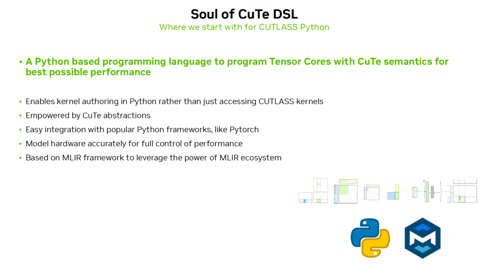

이 page는 다음 내용을 설명한다. Cutlass Python의 strategic intent를 요약하며, MLIR를 compiler cornerstone로 삼고 CUTLASS C++에서 검증된 CuTe hardware abstraction model을 Python으로 가져와, 많은 Python developer가 쉽게 시작할 수 있으면서 performance expert도 extreme optimization을 할 수 있는 next-generation GPU programming paradigm을 만드는 것을 설명한다. ultimate goal은 performance control을 희생하지 않으면서 GPU high-performance kernel 개발 productivity를 한 order of magnitude 높이는 것이다.

- Python 기반 programming language로, CuTe semantics를 통해 Tensor Cores를 programming하여 best performance를 달성한다.
- 기존 CUTLASS Kernel을 호출하는 것에 그치지 않고 Python에서 Kernel 작성도 지원한다.
- CuTe의 abstraction capability에 의해 drive되고 enable된다.
- PyTorch 같은 popular Python framework와 쉽게 integrate할 수 있다.
- performance를 완전히 control하기 위해 hardware를 precise하게 model한다.
- MLIR ecosystem의 강력한 capability를 활용하기 위해 MLIR framework 기반이다.

CuTe는 "high-level abstraction"과 "low-level control"의 통합을 구현하는 cornerstone다. GPU programming에서 가장 어렵고 error-prone한 부분은 multidimensional data의 memory layout, thread mapping, index calculation을 처리하는 것이다. CuTe는 이런 complex detail을 well-defined하고 composable한 일련의 "layout" object와 algebraic operation으로 abstract한다. developer는 low-level pointer offset과 thread index를 manual로 계산하지 않고, 이런 high-level object를 조작해 complex parallel pattern을 describe할 수 있다. 그 결과 performance를 보장하면서 productivity를 크게 높인다.

**따라서 CuTe Layout algebra를 이해하는 것이 CuTeDSL을 잘 사용하는 핵심이다.**

한편 DLPack protocol 같은 것을 지원함으로써, CUTLASS Python Kernel은 torch.Tensor를 input으로 seamless하게 받고 result를 다른 torch.Tensor에 직접 write할 수 있다. 이는 researcher와 engineer가 자신이 customize한 high-performance Kernel을 existing PyTorch model에 쉽게 insert하여 end-to-end acceleration을 구현하면서, complex pybinding code 작성을 피할 수 있음을 뜻한다.

### 2.2 Cutlass Python architecture

아래 그림은 Cutlass Python architecture를 보여 준다. flow chart를 통해 user가 작성한 Python code에서 최종적으로 GPU에서 실행되기까지의 full path를 그린다.

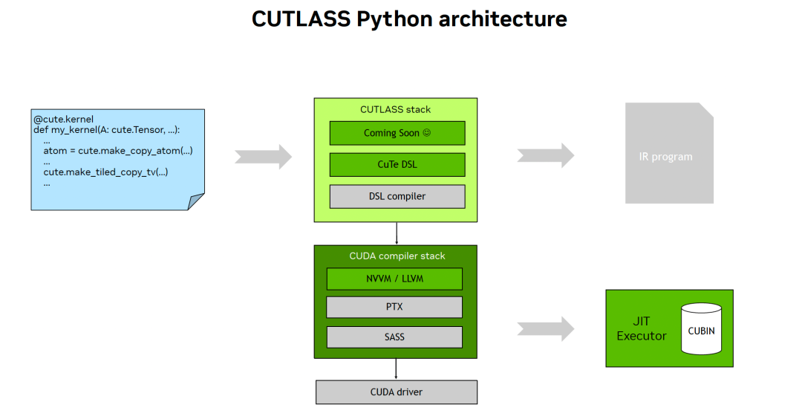

전체 flow는 typical modern compiler architecture다:

- **Frontend** Python code + DSL compiler. language syntax와 type checking을 처리하고 high-level concept을 IR로 transform한다. 이를 통해 language 자체는 빠르게 iterate할 수 있고 backend에는 영향을 주지 않는다.
- **Middle** MLIR + CUTLASS stack. 이것이 optimization core다. MLIR level에서는 loop unrolling, operator fusion, memory layout optimization 같은 hardware-independent 또는 hardware-specific optimization을 수행할 수 있다. "CUTLASS stack"의 존재는 compiler가 모든 code를 처음부터 generate하는 것이 아니라, CUTLASS library 안에 이미 존재하고 expert가 tune한 recipes를 intelligent하게 link하거나 inline한다는 것을 보여 준다.
- **Backend** NVVM/LLVM -> PTX -> SASS. 이 part는 NVIDIA의 existing mature CUDA compiler toolchain을 활용해 final generated code가 hardware feature를 충분히 사용할 수 있게 보장한다.

initial CuTeDSL version은 DSL Compiler와 CuteDSL을 지원했고, 여기서 "Coming Soon"인 것이 곧 release될 CuTile이다.

### 2.3 Python으로 Kernel 작성하기

이 page는 cuteDSL로 Kernel을 build하는 방법을 보여 준다. 직관적인 comparison을 통해 CUTLASS Python이 **programming model과 developer experience**에서 큰 leap를 제공함을 드러낸다. 왼쪽은 traditional Cutlass code, 오른쪽은 CuteDSL이다. `@cute.kernel` decorator로 Kernel function을 mark한다. 그리고 `@cute.jit` decorator로 CPU side에서 호출할 때 Kernel launch와 compile을 수행하도록 mark한다.

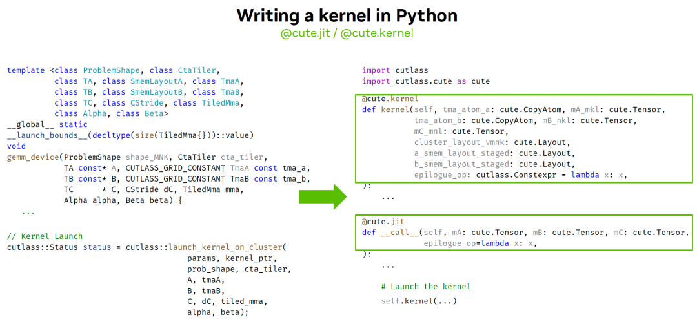

또 하나의 명확한 comparison은 Template vs Pythonic이다. code가 더 clear해진다.

- **C++:** CUTLASS C++의 강점은 template metaprogramming에 있다. compile time에 highly specialized code를 generate해 zero-cost abstraction을 구현할 수 있다. 하지만 그 대가는 매우 낮은 readability와 maintainability다. developer는 열 개가 넘는 template parameter를 가진 declaration을 마주하고, parameter 하나의 error가 수백 수천 줄의 이해하기 어려운 compile error를 만들 수 있다. 이런 "compile-time configuration" 방식은 cognitive burden이 매우 크다.
- **Python:** CUTLASS Python은 이 모든 것을 Python의 function parameter와 type hint로 바꾼다. template parameter는 function parameter가 되고, `tma_atom_a: cute.CopyAtom`처럼 clear한 name과 type을 가진다. 이는 code readability를 크게 높인다. kernel function behavior를 configure하는 방식이 "complex template list를 채우기"에서 "function에 parameter 전달하기"로 바뀌며, 이는 일반적인 programming intuition에 더 잘 맞는다.

다른 한편 C++에서 template parameter는 pure compile-time concept이고 function parameter는 runtime concept이다. 둘 사이의 interaction과 logic을 작성하는 것은 매우 complex하다. `@cute.jit`와 `@cute.kernel` design은 이 boundary를 clever하게 관리한다. `@cute.jit` function은 host side, 즉 Python interpreter에서 실행되며, 일반 Python computation을 수행하고 parameter를 준비할 수 있다. `@cute.jit` function이 `@cute.kernel` function을 호출하면 DSL compiler가 takeover한다. `@cute.kernel`에 전달된 parameter는 type, 예를 들어 `cutlass.Constexpr` vs. `cute.Tensor`의 dynamic shape에 따라 JIT compiler가 compile-time constant인지 runtime variable인지 intelligent하게 판단한다.

이 방식은 developer가 unified function-call syntax로 compile-time과 runtime configuration을 처리할 수 있게 하며, complexity는 DSL 자체가 소화한다.

또 `epilogue_op`가 `Constexpr`로 mark되면 compiler는 code generation 시 이 lambda function을 inline하고 optimize해 zero-overhead operator fusion을 구현한다. 반면 `mA_mkl`의 concrete data pointer와 dimension은 runtime information이다.

### 2.4 PyTorch integration

이 page는 simple code example을 통해 CUTLASS Python이 mainstream deep learning framework인 PyTorch와 어떻게 seamless하게 integrate되는지 보여 준다.

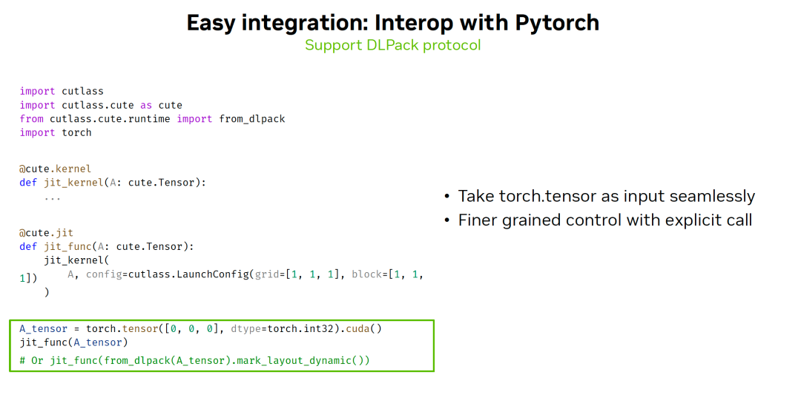

- **torch.tensor를 input으로 seamless하게 사용:** code는 CUDA 위의 `torch.tensor` object `A_tensor`를 `cute.Tensor` type parameter를 기대하는 `jit_func`에 직접 전달한다. 이는 implicit automatic type conversion을 보여 준다.
- **explicit call을 통한 더 fine-grained control:** comment 안의 code는 또 다른 방식을 보여 준다. `from_dlpack` function을 사용해 `torch.tensor`를 `cute.Tensor` object로 explicitly convert할 수 있고, `.mark_layout_dynamic()` 같은 method를 chain으로 호출해 property를 더 control할 수 있다.

DLPack은 서로 다른 deep learning framework 사이에서 tensor data를 exchange하기 위한 open in-memory standard다. 이는 tensor를 describe하는 데 필요한 모든 information을 포함하는 C data structure를 define한다:

- data memory pointer
- device type(CPU, GPU 등)과 device ID
- data type(int32, float32 등)
- number of dimensions(ndim)
- shape
- strides
- byte offset

DLPack은 여러 framework가 같은 device 위의 memory block을 **data copy 없이** share할 수 있게 한다. PyTorch, TensorFlow, CuPy, JAX, MXNet 등 mainstream framework가 모두 이 protocol을 지원한다.

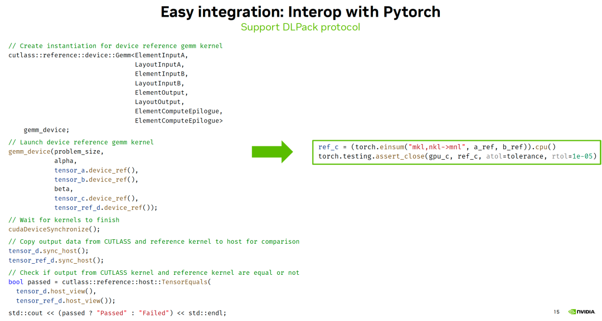

여기서 비교하는 것은 custom kernel function result를 **test and verify**하는 flow이며, CUTLASS Python의 장점을 더 강화한다. C++ flow는 훨씬 장황하다. developer는 template instantiation, explicit GPU synchronization, manual data copy-back trigger, specific comparison function call 등 많은 low-level detail을 신경 써야 한다. 각각이 potential error point다. Python의 전체 verification process는 핵심 code 두 줄만 필요하다. logic은 clear하고 intuitive하다: 1) CPU에서 reference value 계산, 2) compare. 이는 developer가 PyTorch ecosystem의 ready-made, highly encapsulated tool을 활용할 수 있기 때문이다.

- **Python:** developer는 Jupyter Notebook 같은 interactive environment에서 빠르게 code를 작성하고, 실행하고, `assert_close` result를 볼 수 있다. error가 있으면 PyTorch가 maximum error, error position 같은 detailed difference report를 제공한다. 그러면 바로 code를 수정하고 다시 실행할 수 있다. 이 "coding-run-debug" loop는 매우 빠르다.
- **C++:** traditional C++ workflow는 보통 "coding -> compile -> run"이다. compile 자체가 시간이 많이 걸린다. 특히 CUTLASS처럼 template을 많이 사용하는 library에서는 그렇다. test가 fail되면 developer는 "Failed" string만 얻게 되고, 문제를 찾기 위해 더 많은 `printf`를 추가하거나 `cuda-gdb` 같은 dedicated GPU debugger를 사용해야 한다. 전체 process가 훨씬 느리다.

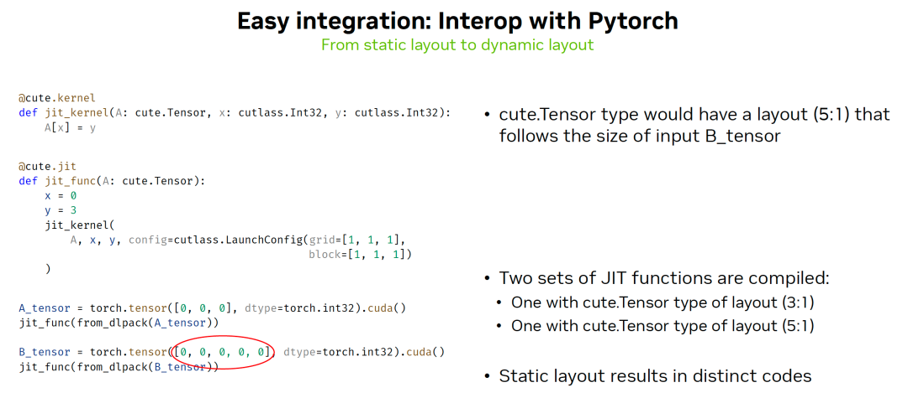

`cute.Tensor`의 layout은 그 type의 일부로 간주된다. `(3:1)`과 `(5:1)`은 서로 다른 layout이므로 다른 type으로 인식되고, 그 결과 두 번의 independent compilation이 trigger된다.

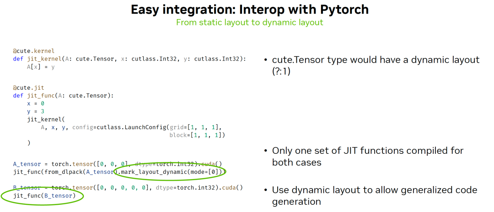

`.mark_layout_dynamic(mode=[0])` method를 호출하면 developer는 compiler에게 tensor의 0번째 mode, 즉 dimension size가 dynamic이며 kernel function에 hard-code되어서는 안 된다고 알려 준다. 서로 다른 size의 input `A_tensor`와 `B_tensor`가 같은 compiled kernel function을 reuse했다.

static compilation에서는 compiler가 더 precise한 memory dependency analysis, boundary check 등을 수행할 수 있고, compile time에 일부 out-of-bounds error까지 발견할 수 있다. 하지만 inference scenario에서 dynamic input, 예를 들어 다른 batch size나 sequence length를 처리할 때는 new shape를 만날 때마다 expensive compilation이 trigger되어 overall performance가 심각하게 떨어진다.

`mark_layout_dynamic()`을 통해 developer는 default implicit behavior에서 explicit control로 전환한다. developer가 compiler에게 **능동적으로 알리는** 것이다: "이 dimension size는 runtime에 variable하니 hard-code하지 말라.

아래 그림은 LLM에서 custom Kernel로 기존 nn.Linear를 replace하는 example을 보여 준다.

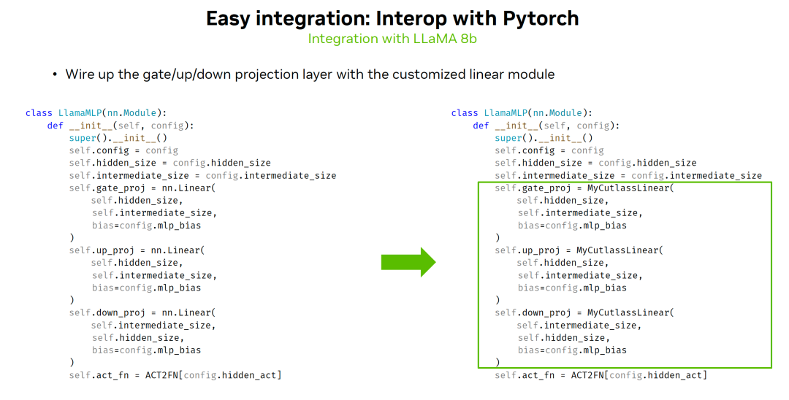

그다음 이 custom Linear class 안에서 custom Kernel function을 instantiate하고, forward propagation process에서 해당 kernel function을 호출하며, DLPack implicit conversion feature도 활용할 수 있다.

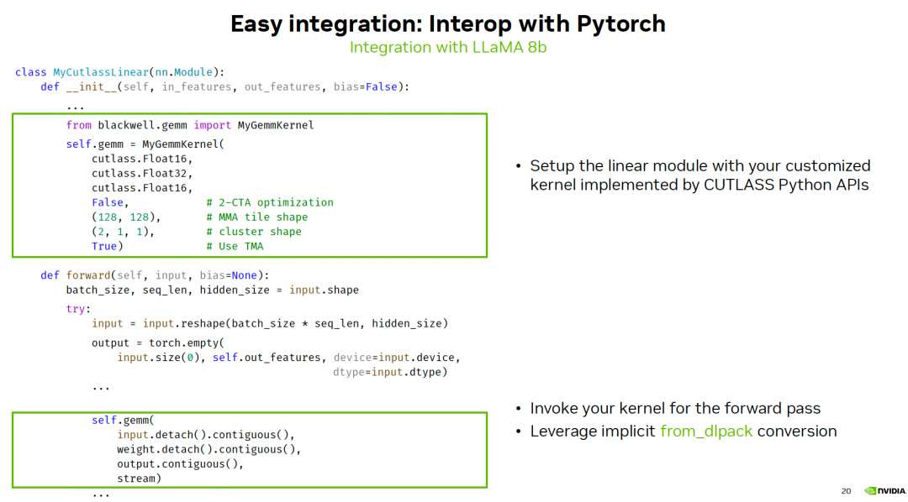

MyCutlassLinear module은 low-level MyGemmKernel을 encapsulate한다. 이는 좋은 software engineering practice다. module user는 내부가 CUTLASS인지 cuBLAS인지, 또는 다른 implementation인지 알 필요가 없다. forward method만 호출하면 된다. 한편 Kernel 자체도 TMA/Tile size 같은 일련의 tuning parameter를 가지고 있으며, 이 parameter들은 low-level hardware capability와 performance tuning의 key option에 직접 mapping된다. 그래서 CuteDSL은 user가 더 complete한 hardware control capability를 매우 편리하게 얻도록 해 준다.

### 2.5 imperative style metaprogramming

다음 두 page의 ppt는 Kernel function 안에서 Python을 직접 사용해 branch jump와 loop task를 수행하는 것을 보여 준다.

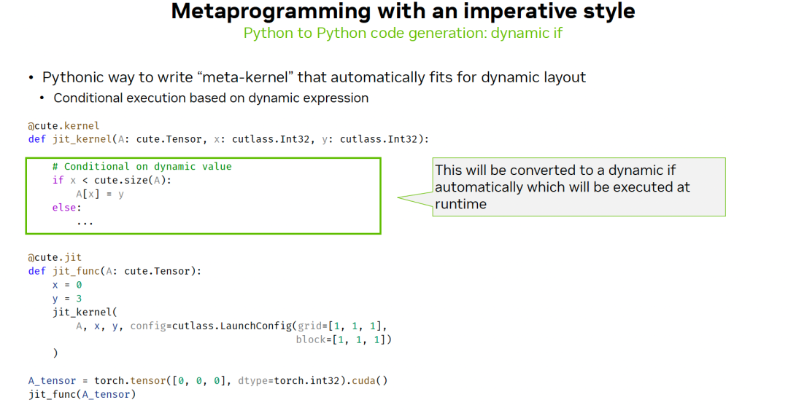

CUTLASS Python은 developer가 거의 같은 logic인 `if tidx < cute.size(A): ...`로 같은 기능을 구현할 수 있게 하며, low-level compile detail을 신경 쓸 필요가 없다. 여기서 meta-kernel이라는 말의 의미는, 작성한 Python code가 template이고, JIT compiler가 dynamic layout을 제공했는지 여부에 따라 dynamic `if`를 포함한 general kernel function을 생성할지, 또는 조건이 compile time에 known이므로 `if`가 제거된 specialized kernel function을 생성할지 결정한다는 뜻이다.

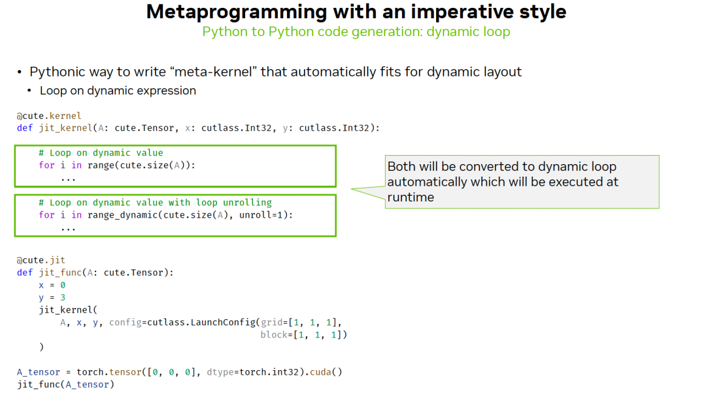

그다음 dynamic control flow concept을 `if` statement에서 `for` loop로 확장한다. `range` behavior는 위에서 설명한 대로 standard dynamic loop를 생성한다. `range_dynamic(..., unroll=1)`은 compiler에 additional **unroll hint**를 제공한다.

그리고 constexpr capability도 일부 있다.

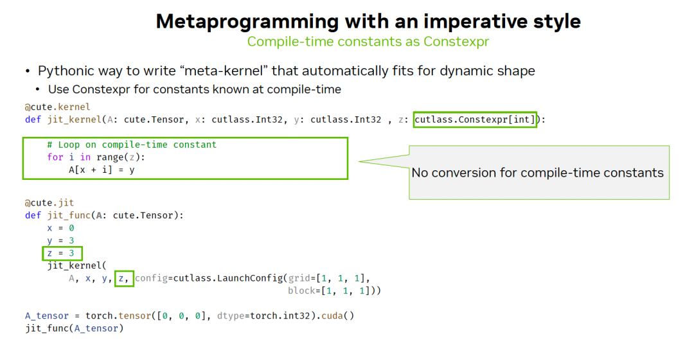

또 CuteDSL에서는 kernel function parameter로 TileCopy와 SMEM Layout을 전달할 수도 있다.

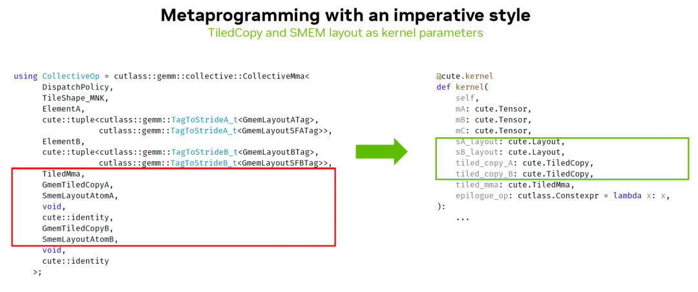

C++에서는 TiledMma, GmemTiledCopy, SmemLayoutAtom 같은 strategy가 모두 type이다. 이것들은 template parameter로 전달된다. 반면 Python에서는 function parameter로 직접 전달할 수 있다. C++에서 compile time에 고정해야 했던 core algorithm strategy, 예를 들어 TiledCopy, SMEM Layout, TiledMma를 runtime에 dynamic하게 construct하고 전달할 수 있는 first-class object로 바꾼 것이다. code flexibility, composability, readability를 크게 높이면서도 final performance를 희생하지 않는다.

### 2.6 DSL DataType

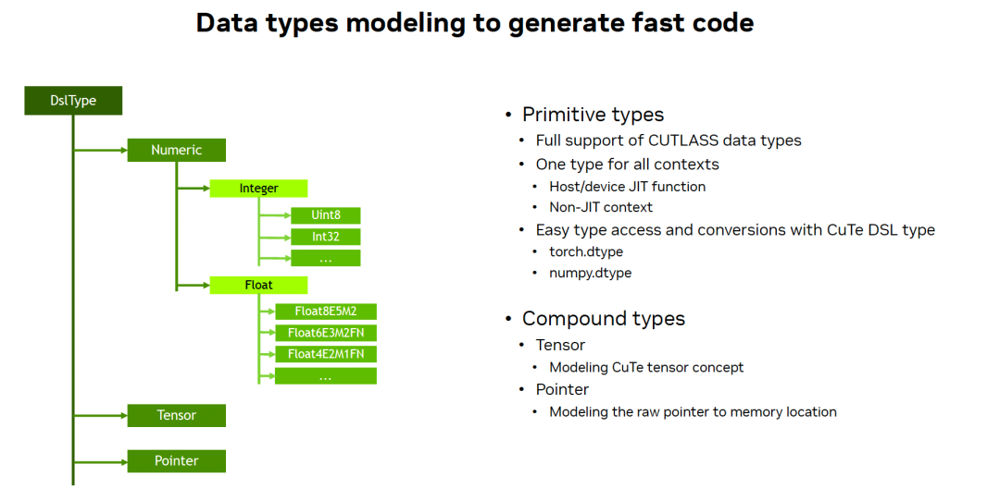

이는 comprehensive data type support capability를 cover한다. developer는 여러 type system을 배울 필요가 없어 cognitive burden이 낮아진다. torch.dtype과 numpy.dtype support는 ecosystem과 seamless integration을 구현하는 key다. torch.Tensor가 DLPack을 통해 전달되면 CUTLASS Python은 data pointer와 shape뿐 아니라 torch.dtype, 예를 들어 torch.float16도 check하고 이를 internal corresponding cutlass.Float16 type으로 자동 mapping한다.

### 2.7 operator overloading

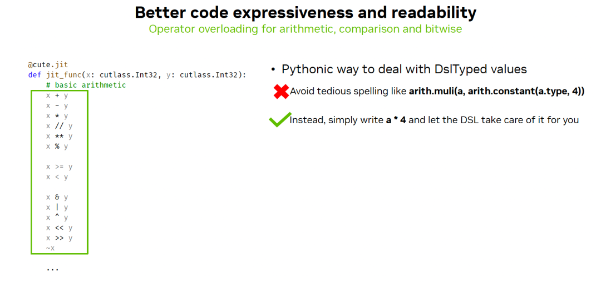

developer가 natural Python operator로 DSL 안의 data type을 operate할 수 있게 한다. 글에서 언급한 `arith.muli(a, arith.constant(a.type, 4))` 같은 표현은 compiler에게는 매우 clear하지만 사람에게는 매우 장황하고 intuitive하지 않다. 그래서 syntax sugar를 제공한다. code readability를 높이고 cognitive burden을 줄이며 development/debug speed를 높이는 데 큰 가치가 있다.

다른 한편으로 vectorized operator overloading capability도 있다.

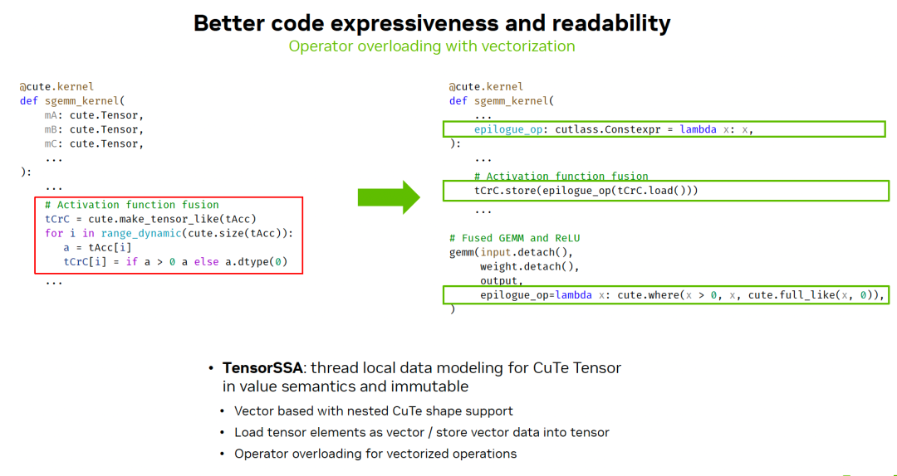

`TensorSSA`: Tensor-based Static Single Assignment를 뜻한다. compiler design에서 SSA(static single assignment form)는 각 variable이 한 번만 assign되는 IR이다. `TensorSSA`는 이 concept을 tensor operation에 도입한다. 즉 `TensorSSA` object는 **immutable**이다. `x > 0` 같은 operation을 수행하면 자기 자신을 바꾸지 않고, operation result를 represent하는 new `TensorSSA` object를 return한다.

Thread Local Data는 register에 저장된 data를 model한다는 뜻이다. 각 thread는 자기 register를 가지므로 이 data는 thread-private이다. `TensorSSA` object는 scalar 하나가 아니라 single thread가 hold하고 register 안에 존재하는 data shard 집합을 represent한다.

동시에 오른쪽 example에서 볼 수 있듯 lambda function call도 지원한다.

`epilogue_op`는 **runtime에 전달되는 parameter**다. 이는 user가 host side에서 원하는 fused operation을 임의로 define할 수 있으며, GEMM kernel function 내부 code를 수정할 필요가 없다는 뜻이다. `lambda x: cute.where(x > 0, x, cute.full_like(x, 0))`가 호출될 때 input `x`는 `TensorSSA` object이며, register 안의 data batch를 represent한다. 다음은 몇 가지 example이다:

- **GeLU fusion:** epilogue_op=lambda x: 0.5 * x * (1 + cute.tanh( ... ))
- **scalar multiplication(alpha):** epilogue_op=lambda x: x * alpha
- **bias add and activation:** epilogue_op=lambda x: cute.relu(x + bias)

vectorized version은 compiler가 전체 operation을 더 쉽게 identify하게 하여 더 optimized code를 generate할 수 있게 한다.

### 2.8 Cute struct

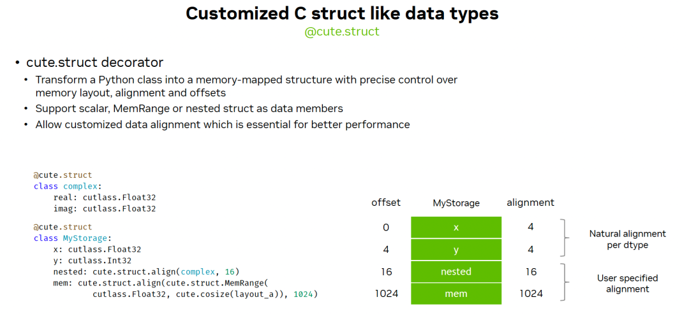

`@cute.struct`는 CUTLASS Python의 매우 중요한 feature다. GPU programming에서 가장 번거롭고 error-prone하지만 performance에 매우 중요한 SMEM layout management를 type-safe하고 declarative하며 highly controllable한 Pythonic 방식으로 abstract한다. C language의 `struct`가 제공하는 precise control capability를 simulate할 뿐 아니라, DSL의 다른 part와의 integration 및 Python의 dynamic feature를 통해 더 강한 flexibility와 expressiveness를 제공한다. 그 결과 high-performance complex CUDA kernel function을 작성하고 유지하는 난도를 크게 낮춘다.

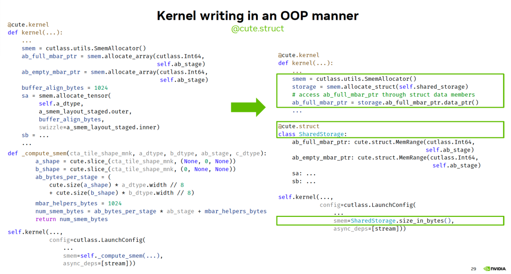

이 page는 `@cute.struct`가 SMEM management를 어떻게 더 structured하고 object-oriented하게 만드는지 보여 준다.

traditional 방식은 "먼저 Int64 block 하나를 allocate하고, 다시 Int64 block 하나를 allocate하고, 1024 byte로 align된 tensor 하나를 allocate하고..." 같은 식이다. 그다음 각 stage마다 많은 pointer arithmetic을 해야 해서 error가 나기 쉽다. 반면 `@cute.struct` decorator는 이 layout을 "어떻게" 구현할지에 관한 complex detail을 처리한다. `SharedStorage` class 안에 encapsulate하는 방식은 complex SMEM management를 clear하고 cohesive하며 reusable한 component로 organize할 수 있게 한다.

### 2.9 JIT cache

여러 iteration 과정에서 JIT가 매번 compile을 수행해 kernel launch가 느려진다.

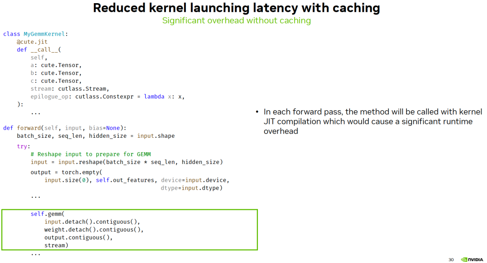

그다음 cuteDSL은 cubin으로 compile할 수 있는 KV Cache 방식으로 이 문제를 처리한다.

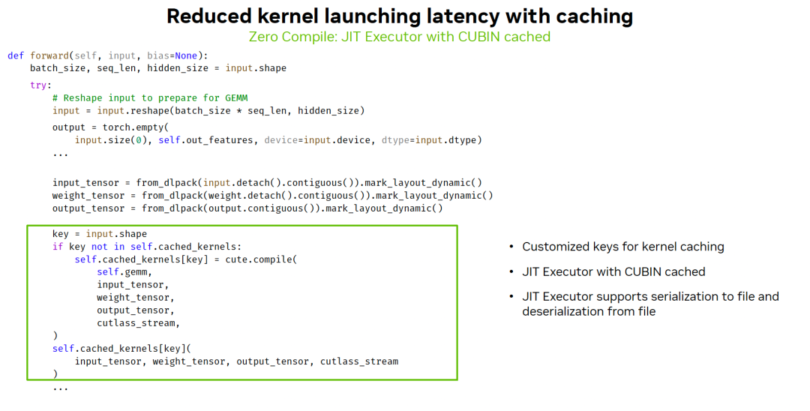

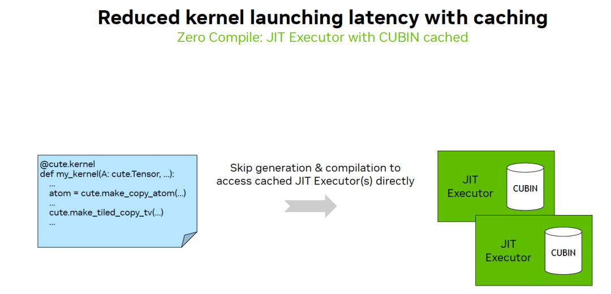

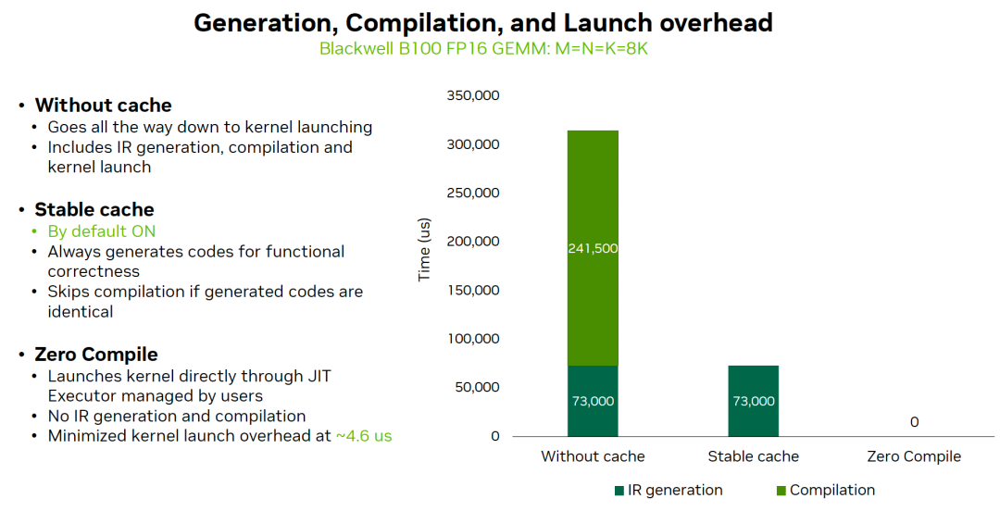

## 3. CuTe 기반 Python Kernel 개발

### 3.1 CuTe 소개

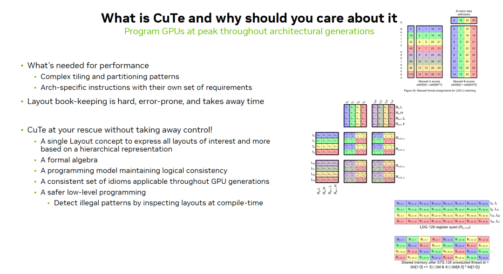

high-performance Kernel은 보통 서로 다른 generation의 GPU architecture를 고려하고, 모두 peak performance를 유지해야 한다. 이 부분의 자세한 전개는 다음 글을 참고할 수 있다.

[Tensor-007 Cute Layout 소개](https://mp.weixin.qq.com/s?__biz=MzUxNzQ5MTExNw==&mid=2247491741&idx=1&sn=c1eed8d4c5d7c20bd3cd1ee660062d28&scene=21#wechat_redirect)

Cute Layout은 Layout을 다루기 위한 single hierarchical algebraic abstraction을 제공한다. 또한 `composition`, `partition`, `tile` 같은 **algebraic operation**을 제공해 이 object들을 operate한다. developer는 low-level pointer arithmetic을 신경 쓰지 않고 이런 higher-order function으로 layout을 combine, split, transform할 수 있다. 이는 2D array의 각 element를 manual로 조작하는 대신 linear algebra로 matrix를 조작하는 것과 같다.

CuTe의 core는 concrete hardware implementation이 아니라 abstract mathematical concept(Layout과 algebra)이다. 그래서 그 programming paradigm은 durable하다. new generation GPU가 등장하면 새로운 `Atom Layout`, 예를 들어 new MMA instruction의 register layout을 describe하는 것이 생길 수 있지만, 이런 `Layout`을 combine하고 operate하는 algebra와 idiom(`make_tiled_mma`, `partition_A` 등)은 unchanged다. 그래서 new hardware용 code를 작성하는 learning curve가 크게 낮아진다.

CuteDSL도 여전히 이 Layout algebra를 계승한다.

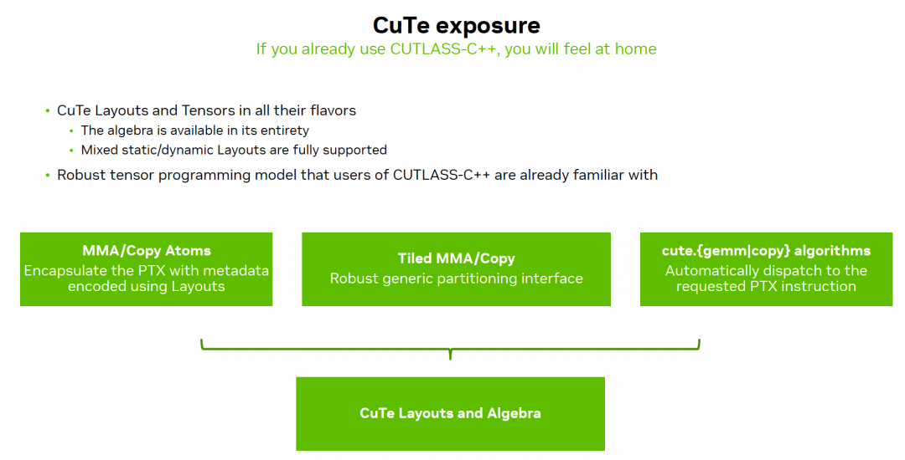

주: 이후 몇 page PPT는 몇 가지 example을 설명하지만 여기서는 생략한다. 뒤의 몇 편에서 code implementation과 함께 complete하게 다루겠다.

그다음은 몇 가지 Performance comparison이다. 기본적으로 C++와 큰 차이가 없다.

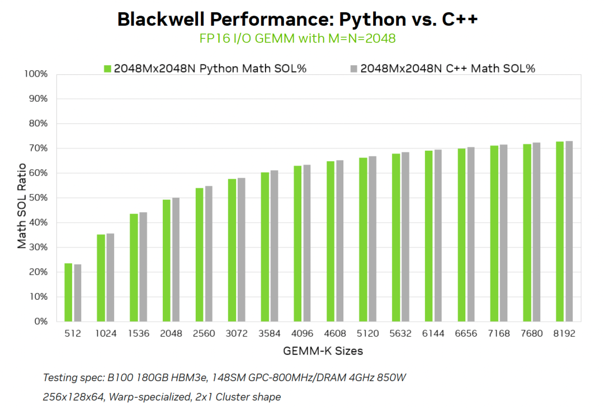

## 4. DSL for GPU Kernel

그리고 또 다른 관점은 Tri Dao의 Hotchip talk "DSL for GPU Kernels & Automatic Kernel Authoring with LLMs"에서 나온다. 아래 그림이 마음에 든다.

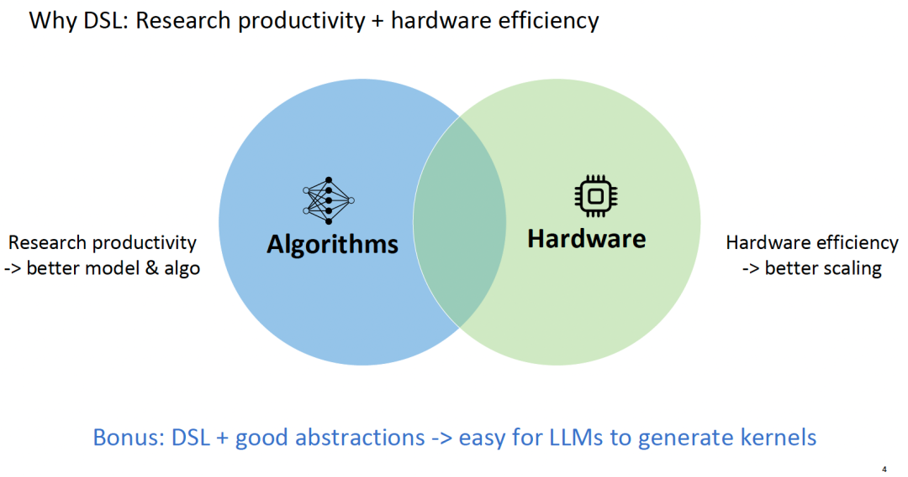

며칠 전 hardware 관점에서 design TradeOff와 DSE를 소개한 글이 하나 있었다.

[GPU cache 관점에서 보는 chip design과 interconnect](https://mp.weixin.qq.com/s?__biz=MzUxNzQ5MTExNw==&mid=2247495963&idx=1&sn=00f05c90d7ec22f90911ac4618180c9a&scene=21#wechat_redirect)

반면 Tri Dao는 software와 algorithm 관점에서 보았다. DSL과 좋은 abstraction은 operator development speed를 높이고 development difficulty를 낮출 수 있다. CuteDSL은 complete chip structure system을 expose한다.

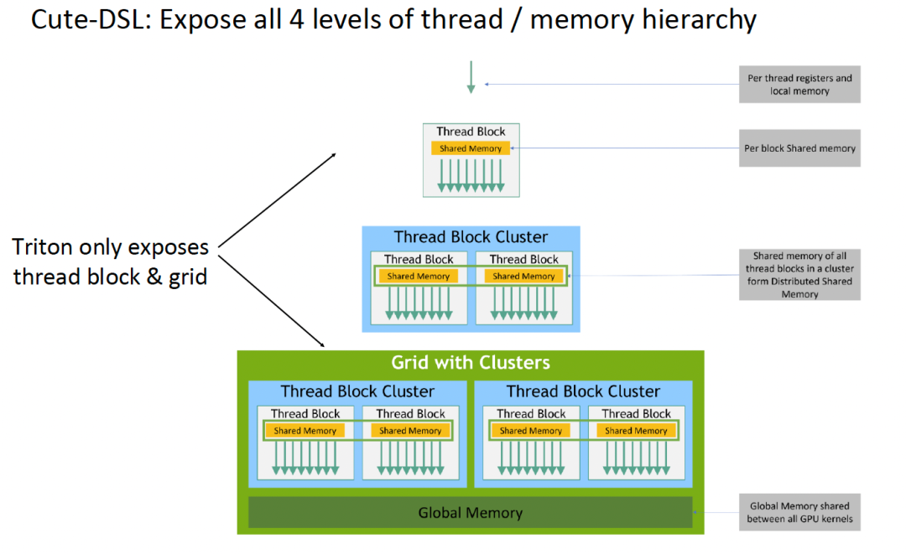

사실 그는 다른 DSL도 언급했다. 개인적으로 Tilelang도 동등하게 괜찮은 선택이라고 생각한다. Cutlass Layout algebra는 여전히 너무 complex하고, TileLang은 low-level의 역사적 부담이 적어 더 잘할 수도 있다.

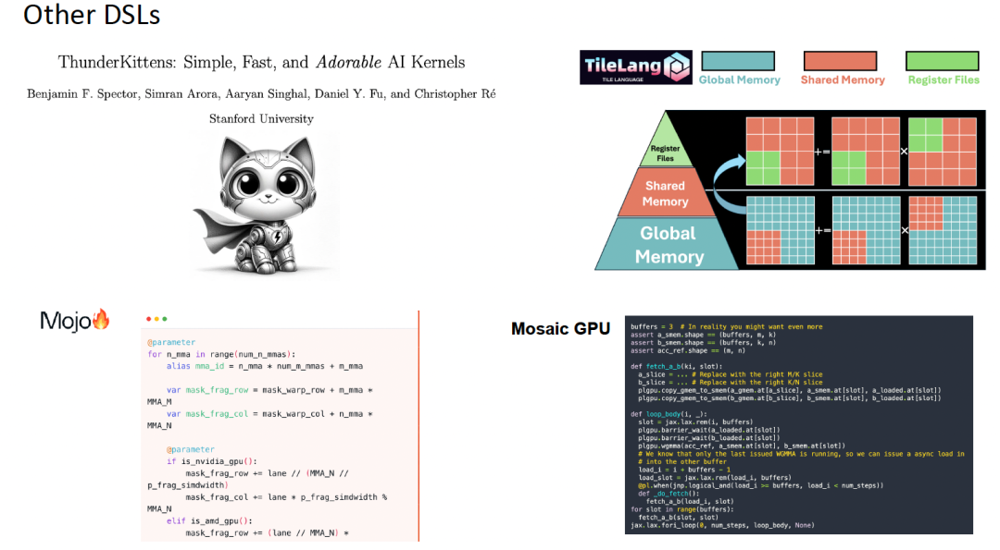

Tri Dao는 몇 가지 example을 보여 주었다. 예를 들어 Cute DSL의 async copy capability가 있다.

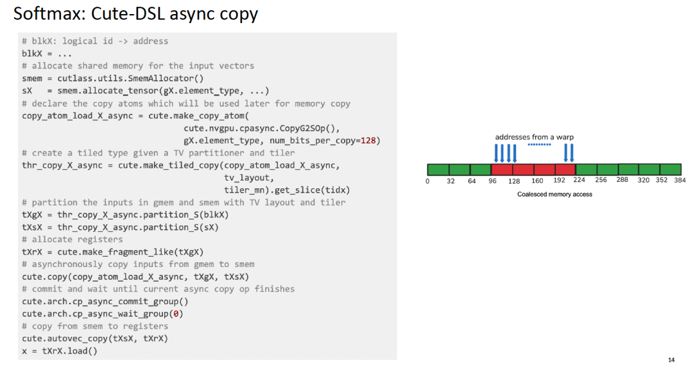

TensorSSA로 일부 Reduction operation을 수행한다.

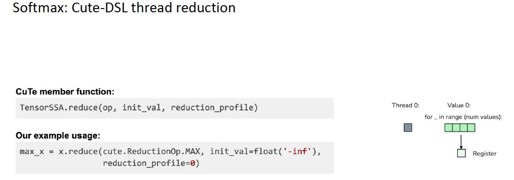

그리고 warp level reduction도 있다.

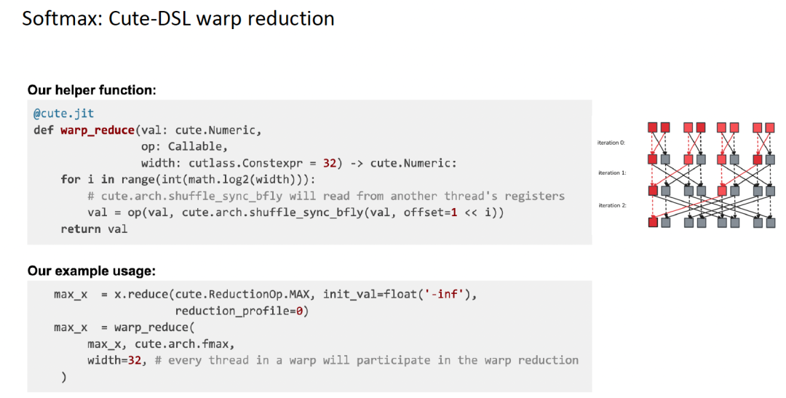

그다음은 Thread Block Reduction이다.

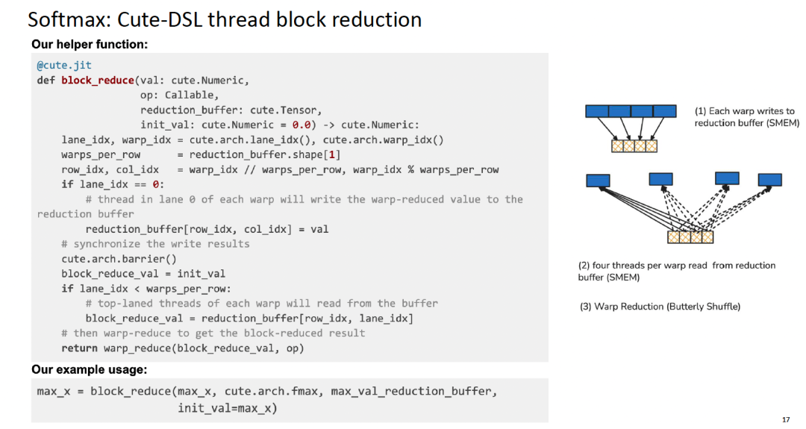

Python `cute.jit` function으로 encapsulate하면 모두 매우 simple하고 빠르게 operation할 수 있다.

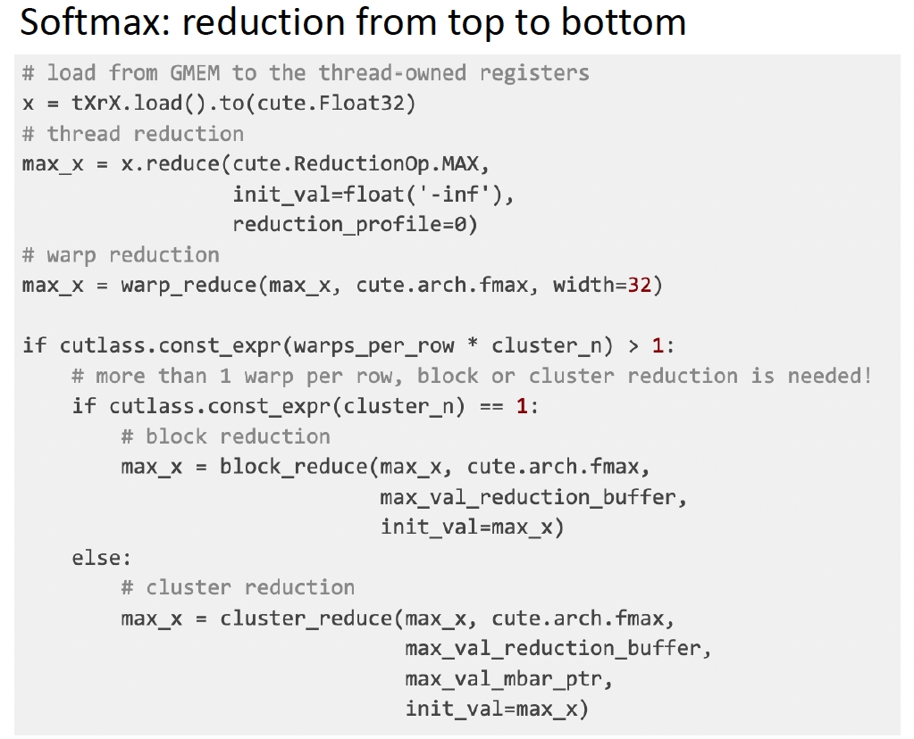

또 전체 Kernel performance도 기본적으로 최대치를 채울 수 있어 Torch Compile과 Triton 대비 큰 advantage가 있다.

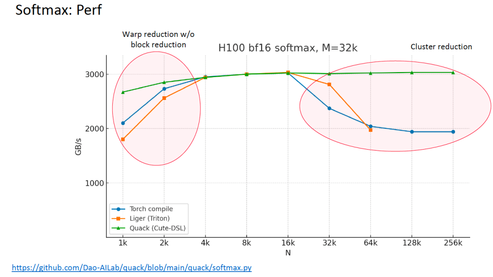

GEMM operator도 cublas보다 빠르다.

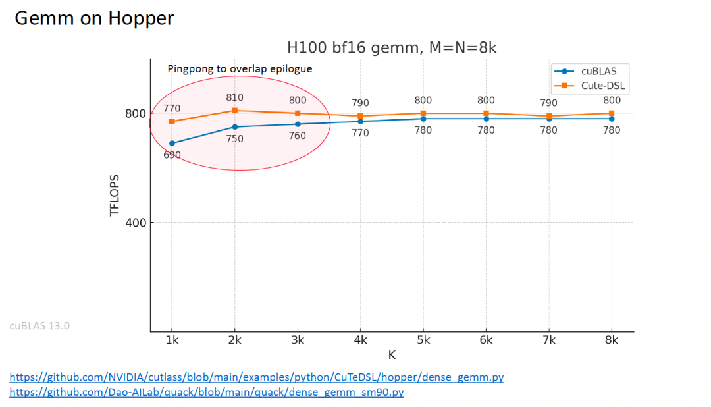

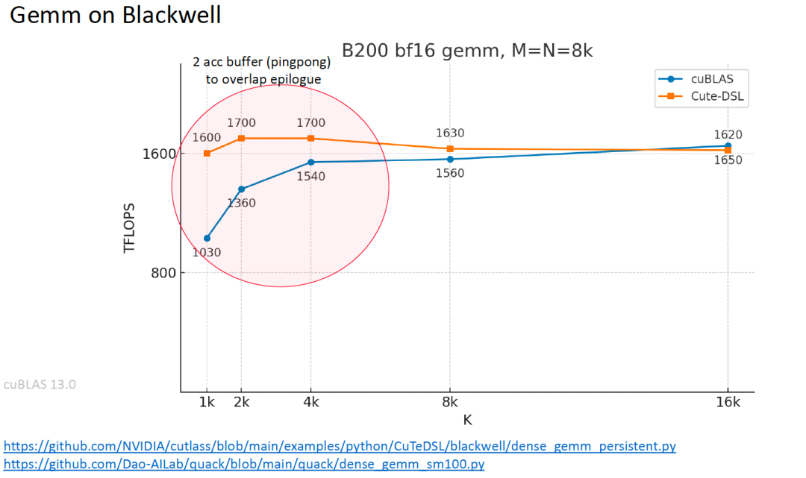

operator fusion에서도 cublas+triton보다 꽤 빠르다.

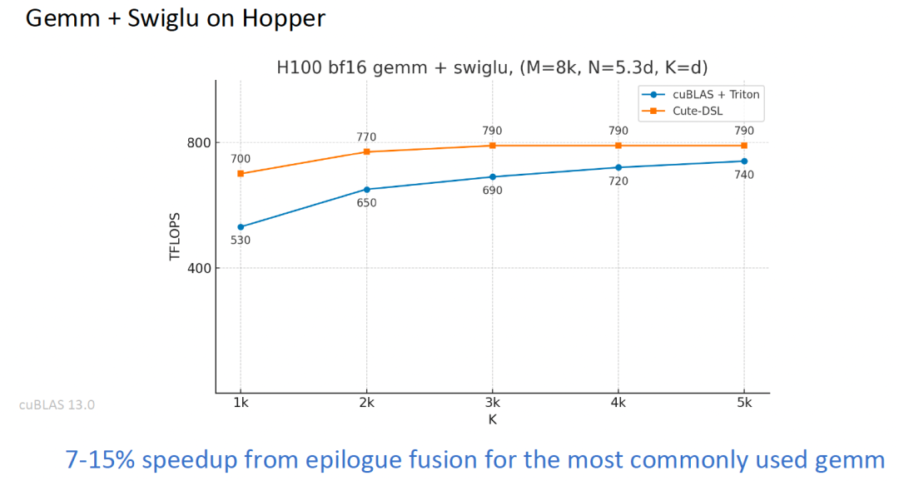

또 FlashAttention-4 example도 있다.

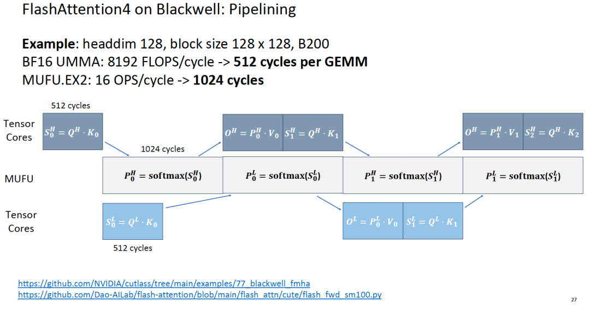

그다음 Tri Dao도 몇 가지 Trade-off를 제시했다.

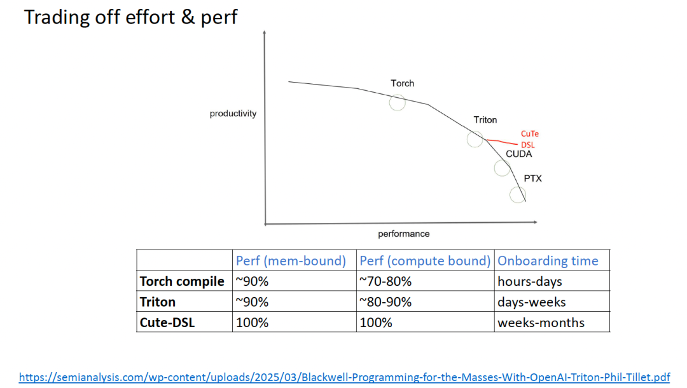

CuteDSL의 거의 유일한 단점은 learning cycle이 상대적으로 길다는 점이다. 내가 이 series 문서를 공부하면서 작성하는 동안 community의 다른 사람들에게도 도움이 되기를 바란다. 그리고 Tri Dao도 몇 가지 제안을 했다.

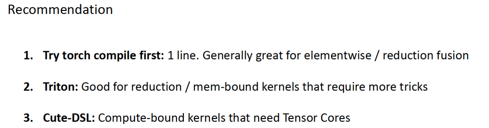

## 5. Summary

이 글은 Cute-DSL 소개의 첫 편이라고 할 수 있다. 전체 project의 origin과 몇 가지 basic concept을 대략 소개했다. 이후 official notebook과 Tri Dao의 QuACK[2]을 바탕으로 실제 code development 관련 내용을 보충하겠다.


참고 자료

[1]

Enable Tensor Core Programming in Python with CUTLASS 4.0: *https://www.nvidia.com/en-us/on-demand/session/gtc25-s74639/*

[2]

QuACK: *https://github.com/Dao-AILab/quack*
