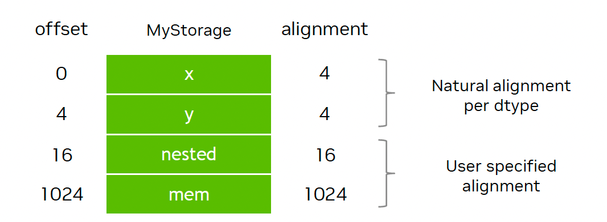

# Tensor-019 CuteDSL-2: 기본 조작

- 원문 제목: CuteDSL-2: 기본 조작
- 저자: Tilebot
- 계정: zartbot
- 발행일: 2025년 9월 30일 08:19

### TL;DR

Cute-DSL 두 번째 글이다. 주로 몇 가지 기본 조작을 소개하며, 공식 notebook[1]을 하나씩 정리하는 내용이다.

## 1. 기본 조작

### 1.1 Data type

CuteDSL은 기본적으로 흔히 쓰이는 integer와 floating-point type을 모두 지원한다. 아래는 예시다.

```python
import os
os.environ['CUTE_DSL_ARCH'] = 'sm_101a'
# Thor는 CUDA 13.0에서 SM110으로 이름이 바뀌었지만 cutedsl-4.2는 아직 12.9 기반이므로 environment variable을 설정해야 한다.

import cutlass
import cutlass.cute as cute

@cute.jit
def bar(va: cutlass.Constexpr[int], vb: cutlass.Float32):
    print("va(static) =", va)
    cute.printf("c(dynamic) = {}", va)

    print("vb(static) =", vb)
    cute.printf("c(dynamic) = {}", vb)

    a = cutlass.BFloat16(3.14)
    print("a(static) =", a)
    cute.printf("a(dynamic) = {}", a)

    b = cutlass.Float4E2M1FN(5.99e-3)
    print("b(static) =", b)
    cute.printf("b(dynamic) = {}", b)

    ca = cutlass.Constexpr[cutlass.BFloat16]
    ca = (7+ a + vb)
    print("ca(static) =", ca)
    cute.printf("ca(dynamic) = {}", ca)

bar(9, 3.14)

# output
va(static) = 9
vb(static) = ?
a(static) = ?
b(static) = ?
ca(static) = ?

c(dynamic) = 9
c(dynamic) = 3.140000
a(dynamic) = 3.140000
b(dynamic) = 0.005990
ca(dynamic) = 13.280001
```

#### print vs cute.print

cute-DSL에서 `print`는 compile time의 static value를 출력할 수 있다. 예를 들어 위의 `va`는 constexpr로 선언되어 있다. 반면 `cute.print`는 runtime에 출력할 수 있다.

operator overloading은 다음 여러 type을 지원한다.

- Arithmetic: `+`, `-`, `*`, `/`, `//`, `%`, `**`
- Comparison: `<`, `<=`, `==`, `!=`, `>=`, `>`
- Bitwise: `&`, `|`, `^`, <<, `>>`
- Unary: `-` (negation), `~` (bitwise NOT)

```python
@cute.jit
def operator_demo():
    # Arithmetic operators
    a = cutlass.Int32(10)
    b = cutlass.Int32(3)
    cute.printf("a: Int32({}), b: Int32({})", a, b)

    x = cutlass.Float32(5.5)
    cute.printf("x: Float32({})", x)

    cute.printf("")

    sum_result = a + b
    cute.printf("a + b = {}", sum_result)

    y = x * 2  # Multiplying with Python native type
    cute.printf("x * 2 = {}", y)

    # Mixed type arithmetic (Int32 + Float32) that integer is converted into float32
    mixed_result = a + x
    cute.printf("a + x = {} (Int32 + Float32 promotes to Float32)", mixed_result)

    # Division with Int32 (note: integer division)
    div_result = a / b
    cute.printf("a / b = {}", div_result)

    # Float division
    float_div = x / cutlass.Float32(2.0)
    cute.printf("x / 2.0 = {}", float_div)

    # Comparison operators
    is_greater = a > b
    cute.printf("a > b = {}", is_greater)

    # Bitwise operators
    bit_and = a & b
    cute.printf("a & b = {}", bit_and)

    neg_a = -a
    cute.printf("-a = {}", neg_a)

    not_a = ~a
    cute.printf("~a = {}", not_a)

operator_demo()

# output
a: Int32(10), b: Int32(3)
x: Float32(5.500000)

a + b = 13
x * 2 = 11.000000
a + x = 15.500000 (Int32 + Float32 promotes to Float32)
a / b = 3.333333
x / 2.0 = 2.750000
a > b = 1
a & b = 2
-a = -10
~a = -11
```

### 1.2 Tensor

다음은 tensor type이다. CuTe에서 tensor는 Engine(E)과 Layout(L)으로 구성된다. Engine은 주로 coordinate offset 기반의 element access를 제공하고, Layout은 여러 coordinates가 실제 Offset으로 어떻게 mapping되는지를 정의한다. PyTorch tensor 하나를 cuteDSL 안에서 서로 다른 layout으로 describe할 수 있으며, 동시에 `cute.print_tensor`로 출력할 수 있다.

```python
import torch
from cutlass.torch import dtype as torch_dtype

import cutlass
import cutlass.cute as cute
import cutlass.cute.runtime as cute_rt

a = torch.arange(1, 40, 1, dtype=torch_dtype(cutlass.Float32))
ptr_a = cute_rt.make_ptr(cutlass.Float32, a.data_ptr())

@cute.jit
def create_tensor_from_ptr(ptr: cute.Pointer):
    layout1 = cute.make_layout((4, 5), stride=(5, 1))
    tensor1 = cute.make_tensor(ptr, layout1)
    cute.print_tensor(tensor1)

    layout2 = cute.make_layout((2, 10), stride=(1, 2))
    tensor2 = cute.make_tensor(ptr, layout2)
    cute.print_tensor(tensor2)
    cute.print_tensor(tensor2,verbose=True)

create_tensor_from_ptr(ptr_a)

# output
tensor(raw_ptr(0x000000002581d6c0: f32, generic, align<4>) o (4,5):(5,1), data=
       [[ 1.000000,  2.000000,  3.000000,  4.000000,  5.000000, ],
        [ 6.000000,  7.000000,  8.000000,  9.000000,  10.000000, ],
        [ 11.000000,  12.000000,  13.000000,  14.000000,  15.000000, ],
        [ 16.000000,  17.000000,  18.000000,  19.000000,  20.000000, ]])
tensor(raw_ptr(0x000000002581d6c0: f32, generic, align<4>) o (2,10):(1,2), data=
       [[ 1.000000,  3.000000,  5.000000, ...,  15.000000,  17.000000,  19.000000, ],
        [ 2.000000,  4.000000,  6.000000, ...,  16.000000,  18.000000,  20.000000, ]])

# print할 때 verbose=True parameter를 추가하면 구체적인 coordinate에 대응하는 value를 출력할 수 있다.

tensor(raw_ptr(0x000000002581d6c0: f32, generic, align<4>) o (2,10):(1,2), data= (
 (0,0)= 1.000000
 (1,0)= 2.000000
 (0,1)= 3.000000
 (1,1)= 4.000000
 (0,2)= 5.000000
 (1,2)= 6.000000
 (0,3)= 7.000000
 (1,3)= 8.000000
 (0,4)= 9.000000
 (1,4)= 10.000000
 (0,5)= 11.000000
 (1,5)= 12.000000
 (0,6)= 13.000000
 (1,6)= 14.000000
 (0,7)= 15.000000
 (1,7)= 16.000000
 (0,8)= 17.000000
 (1,8)= 18.000000
 (0,9)= 19.000000
 (1,9)= 20.000000
)
```

또 다른 important feature는 Cute-DSL이 DLPACK을 지원한다는 점이다. 여기서는 PyTorch tensor와 NumPy array를 예로 든다.

```python
import numpy as np
import torch

import cutlass.cute as cute
from cutlass.cute.runtime import from_dlpack

@cute.jit
def print_tensor_dlpack(src: cute.Tensor):
    cute.print_tensor(src)

a = torch.randn(4, 5)
print_tensor_dlpack(from_dlpack(a))

b = np.random.randn(4,5).astype(np.float32)
print_tensor_dlpack(from_dlpack(b))

# output
tensor(raw_ptr(0x00000000147c7900: f32, generic, align<4>) o (4,5):(5,1), data=
       [[-0.976391,  1.239386, -0.485398, -0.854000,  0.391258, ],
        [ 2.096474, -1.257927,  0.552251,  0.145064,  0.854345, ],
        [-1.461262,  0.257915, -0.783814, -0.694687,  1.760151, ],
        [-0.466722,  2.175940, -0.427469, -0.791567, -0.211634, ]])
tensor(raw_ptr(0x0000000013fa3b20: f32, generic, align<4>) o (4,5):(5,1), data=
       [[ 1.204166,  0.768091,  0.620764, -0.122040,  0.255480, ],
        [-0.450180, -1.648787,  0.000650,  2.055988,  0.998210, ],
        [ 0.964397, -0.495548, -0.586975,  1.266420, -1.793599, ],
        [-0.285070, -0.390202,  0.702245,  0.701813,  0.045866, ]])
```

Tensor 내부 element operation은 다음과 같다.

```python
import torch

import cutlass.cute as cute
from cutlass.cute.runtime import from_dlpack

@cute.jit
def tensor_access_item(a: cute.Tensor):
    # access data using linear index
    cute.printf("a[2] = {} (equivalent to a[{}])", a[2],
                cute.make_identity_tensor(a.layout.shape)[2])
    cute.printf("a[9] = {} (equivalent to a[{}])", a[9],
                cute.make_identity_tensor(a.layout.shape)[9])

    # access data using n-d coordinates, following two are equivalent
    cute.printf("a[2,0] = {}", a[2, 0])
    cute.printf("a[2,4] = {}", a[2, 4])
    cute.printf("a[(2,4)] = {}", a[2, 4])

    # assign value to tensor@(2,4)
    a[2,3] = 100.0
    a[2,4] = 101.0
    cute.printf("a[2,3] = {}", a[2,3])
    cute.printf("a[(2,4)] = {}", a[(2,4)])


# Create a tensor with sequential data using torch
data = torch.arange(0, 8*5, dtype=torch.float32).reshape(8, 5)
tensor_access_item(from_dlpack(data))

print(data)

## output
a[2] = 10.000000 (equivalent to a[(2,0)])
a[9] = 6.000000 (equivalent to a[(1,1)])
a[2,0] = 10.000000
a[2,4] = 14.000000
a[(2,4)] = 14.000000
a[2,3] = 100.000000
a[(2,4)] = 101.000000
tensor([[  0.,   1.,   2.,   3.,   4.],
        [  5.,   6.,   7.,   8.,   9.],
        [ 10.,  11.,  12., 100., 101.],
        [ 15.,  16.,  17.,  18.,  19.],
        [ 20.,  21.,  22.,  23.,  24.],
        [ 25.,  26.,  27.,  28.,  29.],
        [ 30.,  31.,  32.,  33.,  34.],
        [ 35.,  36.,  37.,  38.,  39.]])
```

### 1.3 Struct

CuteDSL은 struct도 construct할 수 있다. 이러한 structs는 이후 matrix multiplication에서 자주 사용된다.



```python
import cutlass
import cutlass.cute as cute

@cute.struct
class complex:
    real: cutlass.Float32
    imag: cutlass.Float32

@cute.struct
class MyStorage:
    x: cutlass.Float32
    y: cutlass.Int32
    nested: cute.struct.Align[complex, 16]
    mem: cute.struct.Align[
        cute.struct.MemRange[cutlass.Float32, 768], 1024
    ]

@cute.kernel
def kernel():
    tidx, _, _ = cute.arch.thread_idx()
    allocator = cutlass.utils.SmemAllocator()
    s = allocator.allocate(MyStorage)
    s.x = 7.5 + tidx
    s.nested.real = 13
    s.nested.imag = 13.7
    cute.printf("struct: x={}  nested={}+{}i", s.x , s.nested.real , s.nested.imag)

@cute.jit
def hello_world():
    kernel().launch(
        grid=(1, 1, 1),   # Single thread block
        block=(8, 1, 1)  # One warp (32 threads) per thread block
    )

cutlass.cuda.initialize_cuda_context()
hello_world()
```

## 2. Control flow

Tri Dao는 QuACK project에 관련 document를 하나 두고 있다.

### 2.1 For loop

For loop는 다음 세 종류로 나뉜다.

- `range`: python built-in
- `cutlass.range`: built-in `range`와 같지만, unroll과 pipeline control을 지원한다.
- `cutlass.range_constexpr`: compile time에 loop를 unroll한다.

```python
import cutlass
import cutlass.cute as cute

@cute.jit
def control_for_loop(upper_bound : cutlass.Int32):
    n = 5

    for i in range(upper_bound):
        cute.printf("python built-in range: {}",i)

    # parameter가 있는 unroll을 지원한다.
    for i in cutlass.range(upper_bound, unroll=4):
        cute.printf("cutlass range: {}",i)

    # constant expression을 loop로 사용한다.
    for i in cutlass.range_constexpr(n):
        cute.printf("cutlass range(const_expr): {}",i)

control_for_loop(8)
```

CuteDSL은 Pipeline에도 작은 optimization을 했다. traditional code에서는 보통 Prefetch Stage Loop를 직접 control해야 한다.

```python
@cute.jit
def example():
    ...
    # build a circular buffer
    buffer = ...

    # prefetch loop
    for i in range(prefetch_stages):
        cute.copy(atom, gmem[i], buffer[i], ...)

    # main loop
    for i in range(bound):
        if i + prefetch_stages < bound:
            cute.copy(atom, gmem[i + prefetch_stages], buffer[(i + prefetch_stages) % total_stages], ...)

        use(buffer[i % total_stages])

    ...
```

반면 CuteDSL에서는 for loop 안에서 Prefetch stage를 직접 define할 수 있다.

```python
@cute.jit
def example():
    ...
    # build a circular buffer
    buffer = ...

    for i in cutlass.range(bound, prefetch_stages=prefetch_stages):
        # Compiler automatically handles the pipelining:
        # - Generates prefetch loop for initial stages
        # - In main loop, prefetches future data while using current data
        cute.copy(atom, gmem[i], buffer[i % total_stages], ...)
        use(buffer[i % total_stages])  # Uses data from previous iterations

    ...
```

CuteDSL은 Prefetch loop code를 자동으로 generate한다. 이후 GEMM code analysis에서 더 자세히 전개하겠다.

### 2.2 If-Else

Const-expr 기반으로 branch condition을 만들면 compile time에 처리할 수 있다. 예를 들어 어떤 operator가 ReLU 관련 code를 포함해야 하는지 여부가 그렇다.

```python
@cute.kernel
def gemm(..., do_relu: cutlass.Constexpr):
    # main GEMM work
    ...
    if cutlass.const_expr(do_relu):    # compile-time guard
        # ReLU code is emitted only when do_relu is True
        ...
```

`gemm(..., False)`를 호출하면 ReLU 관련 code는 IR generation 단계에서 생략된다.

물론 dynamic variable에 대한 branch judgment도 지원한다. 다만 const expr은 dynamic variable을 parameter input으로 받을 수 없다.

```python
@cute.jit
def main(const_var: cutlass.Constexpr, dynamic_var: cutlass.Int32):
    # ✅ This branch is Python branch, evaluated at compile time.
    if cutlass.const_expr(const_var):
        cute.printf("Const branch\\n")
    else:
        cute.printf("Const else\\n")

    # ✅ This branch is dynamic branch, emitted IR branch.
    if dynamic_var == 10:
        cute.printf("Dynamic True\\n")
    else:
        cute.printf("Dynamic False\\n")

    # ❌ Using a dynamic value with `cutlass.const_expr` is not allowed.
    if cutlass.const_expr(dynamic_var == 10):
        cute.printf("Bound is 10\\n")
```

### 2.3 While loop

마찬가지로 const expr과 dynamic value를 지원하지만, condition은 dynamic value를 const expr의 parameter로 사용하는 것을 지원하지 않는다.

```python
@cute.jit
def main(dynamic_var: cutlass.Int32):
    n = 0

    # ✅ This is Python while loop, evaluated at compile time.
    while cutlass.const_expr(n < 10):
        cute.printf("Const branch\\n")
        n += 1

    # ✅ This is dynamic while loop, emitted IR while loop.
    while dynamic_var == 10:
        cute.printf("Dynamic True\\n")
        n += 1

    # ❌ Using a dynamic value with `cutlass.const_expr` is not allowed.
    while cutlass.const_expr(n < dynamic_var):
        n += 1
```

### 2.4 Dynamic control flow의 constraints

주의할 점은 Python과 달리 Cute-DSL은 `break`, `continue`, `pass` 또는 exception throw처럼 control flow 안에서 early-exit하는 behavior를 지원하지 않는다는 것이다. 또한 일부 control body 안에서는 variable type을 변경할 수 없다.

```python
@cute.jit
def control_flow_negative_examples(predicate: cutlass.Boolean):
    n = 10

    # ❌ This loop is dynamic, early-exit isn't allowed.
    for i in range(n):
        if i == 5:
            break         # Early-exit

    if predicate:
        val = 10
        # ❌ return from control flow body is not allowed.
        return
        # ❌ Raising exception from control flow body is not allowed.
        raise ValueError("This is not allowed")
        # ❌ Using pass in control flow body is not allowed.
        pass

    # ❌ val is not available outside the dynamic if
    cute.printf("%d\\n", val)

    if predicate:
        # ❌ Changing type of a variable in control flow body is not allowed.
        n = 10.0
```

## 3. TensorSSA

`TensorSSA`: CuTe DSL에서 Static Single Assignment 형태로 tensor value를 represent하는 Python class다. compiler design에서 Static Single Assignment, 즉 SSA는 각 variable이 한 번만 assign되는 IR이다. TensorSSA는 이 concept을 tensor operations에 도입한다. 이는 TensorSSA object가 **immutable**하다는 뜻이다. 여기에 operation을 수행해도, 예를 들어 x > 0을 수행해도, 자기 자신을 바꾸지 않고 operation result를 represent하는 새로운 TensorSSA object를 반환한다.

예를 들어 TensorSSA에 대해 simple LD/ST와 operator overloading 기반 operation을 수행할 수 있다.

```python
import numpy as np

import cutlass
import cutlass.cute as cute
from cutlass.cute.runtime import from_dlpack

@cute.jit
def load_and_store(res: cute.Tensor, a: cute.Tensor, b: cute.Tensor):
    a_vec = a.load()
    print(f"a_vec: {a_vec}")
    b_vec = b.load()
    print(f"b_vec: {b_vec}")
    res.store(a_vec + b_vec)
    cute.print_tensor(res)

a = np.ones(20).reshape((5, 4)).astype(np.float32)
b = np.ones(20).reshape((5, 4)).astype(np.float32)
c = np.zeros(20).reshape((5, 4)).astype(np.float32)

load_and_store(from_dlpack(c), from_dlpack(a), from_dlpack(b))

#output
a_vec: tensor_value<vector<20xf32> o (5, 4)>
b_vec: tensor_value<vector<20xf32> o (5, 4)>
tensor(raw_ptr(0x000000001a9d18d0: f32, generic, align<4>) o (5,4):(4,1), data=
       [[ 2.000000,  2.000000,  2.000000,  2.000000, ],
        [ 2.000000,  2.000000,  2.000000,  2.000000, ],
        [ 2.000000,  2.000000,  2.000000,  2.000000, ],
        [ 2.000000,  2.000000,  2.000000,  2.000000, ],
        [ 2.000000,  2.000000,  2.000000,  2.000000, ]])
```

한편 register에 load된 data에 대해서는 다양한 calculation, conversion, slicing 등의 operations도 수행할 수 있다.

아래는 TensorSSA와 scalar multiply-add 및 Reduce의 예시다.

```python
@cute.jit
def apply_slice(res: cute.Tensor, src: cute.Tensor, a : cute.Float32, b: cute.Float32):
    src_vec = src.load()

    res_vec = a * src_vec + b

    if cutlass.const_expr(isinstance(res_vec, cute.TensorSSA)):
        res.store(res_vec)
        cute.print_tensor(res)
    else:
        res[0] = res_vec
        cute.print_tensor(res)

    # TensorSSA에 대해 Reduce operation도 수행할 수 있다.
    res_reduction = res_vec.reduce(
        cute.ReductionOp.ADD,
        0.0,
        reduction_profile=0
    )

    cute.printf("Reduction sum: {}", res_reduction)


shape = (4,5)
a = np.arange(np.prod(shape)).reshape(*shape).astype(np.float32)
res = np.empty(shape, dtype=np.float32)

apply_slice(from_dlpack(res), from_dlpack(a), 4, 5)

# output
tensor(raw_ptr(0x000000001bd8d520: f32, generic, align<4>) o (4,5):(5,1), data=
       [[ 5.000000,  9.000000,  13.000000,  17.000000,  21.000000, ],
        [ 25.000000,  29.000000,  33.000000,  37.000000,  41.000000, ],
        [ 45.000000,  49.000000,  53.000000,  57.000000,  61.000000, ],
        [ 65.000000,  69.000000,  73.000000,  77.000000,  81.000000, ]])
Reduction sum: 860.000000
```

아래는 tensor slicing 예시다.

```python
@cute.jit
def apply_slice(src: cute.Tensor, dst: cute.Tensor, indices: cutlass.Constexpr):
    """
    Apply slice operation on the src tensor and store the result to the dst tensor.

    :param src: The source tensor to be sliced.
    :param dst: The destination tensor to store the result.
    :param indices: The indices to slice the source tensor.
    """
    src_vec = src.load()
    dst_vec = src_vec[indices]
    print(f"{src_vec} -> {dst_vec}")
    if cutlass.const_expr(isinstance(dst_vec, cute.TensorSSA)):
        dst.store(dst_vec)
        cute.print_tensor(dst)
    else:
        dst[0] = dst_vec
        cute.print_tensor(dst)

def slice_1():
    src_shape = (4, 2, 3)
    dst_shape = (4, 3)
    indices = (None, 0, None)

    a = np.arange(np.prod(src_shape)).reshape(*src_shape).astype(np.float32)
    dst = np.random.randn(*dst_shape).astype(np.float32)
    apply_slice(from_dlpack(a), from_dlpack(dst), indices)

slice_1()

#output
tensor_value<vector<24xf32> o (4, 2, 3)> -> tensor_value<vector<12xf32> o (4, 3)>
tensor(raw_ptr(0x000000001ab1aa10: f32, generic, align<4>) o (4,3):(3,1), data=
       [[ 0.000000,  1.000000,  2.000000, ],
        [ 6.000000,  7.000000,  8.000000, ],
        [ 12.000000,  13.000000,  14.000000, ],
        [ 18.000000,  19.000000,  20.000000, ]])
```

또한 official notebook은 bcast 예시도 제공한다.

```python
import cutlass
import cutlass.cute as cute


@cute.jit
def broadcast_examples():
    a = cute.make_fragment((1,3), dtype=cutlass.Float32)
    a[0] = 0.0
    a[1] = 1.0
    a[2] = 2.0
    a_val = a.load()
    cute.print_tensor(a_val.broadcast_to((4, 3)))
    # tensor(raw_ptr(0x00007ffe26625740: f32, rmem, align<32>) o (4,3):(1,4), data=
    #    [[ 0.000000,  1.000000,  2.000000, ],
    #     [ 0.000000,  1.000000,  2.000000, ],
    #     [ 0.000000,  1.000000,  2.000000, ],
    #     [ 0.000000,  1.000000,  2.000000, ]])

    c = cute.make_fragment((4,1), dtype=cutlass.Float32)
    c[0] = 0.0
    c[1] = 1.0
    c[2] = 2.0
    c[3] = 3.0
    cute.print_tensor(a.load() + c.load())
    # tensor(raw_ptr(0x00007ffe26625780: f32, rmem, align<32>) o (4,3):(1,4), data=
    #        [[ 0.000000,  1.000000,  2.000000, ],
    #         [ 1.000000,  2.000000,  3.000000, ],
    #         [ 2.000000,  3.000000,  4.000000, ],
    #         [ 3.000000,  4.000000,  5.000000, ]])


broadcast_examples()
```

참고 자료

[1]

cuteDSL notebook: *https://github.com/NVIDIA/cutlass/blob/main/examples/python/CuTeDSL/notebooks*
