# Tensor-020 Tilelang-1: Introduction

- 원문 제목: Tilelang-1: Introduction
- 저자: Tilebot
- 계정: zartbot
- 발행일: 2025년 10월 2일 21:23

### TL;DR

사실 꽤 오래전부터 Tilelang을 주목하고 있었다. 특히 올해 3월 Zhihu에서 "TileLang: 80줄 Python kernel code로 FlashMLA 성능 95% 구현"[1]이라는 글을 보았다. 이 물건은 모든 base model training team, 특히 algorithm team에 꽤 큰 도움이 될 것 같다. 자체 algorithm을 위해 peak performance에 가까운 operator를 매우 빠르게 개발할 수 있기 때문이다. 작은 scale의 verification에는 efficiency를 크게 높여 주고, 마지막에 large-scale training을 하더라도 우선 training을 시작할 수 있다. operator team이 완성하고 optimize한 뒤 replace하면 되므로 시간도 적지 않게 절약할 수 있다. 그리고 9월 초에 Xue 선생님과 이쪽 work에 대해서도 이야기했고, 나중에 Jetson Thor 한 장을 샀다. 이 chip의 SM은 B200과 같고 TMEM도 있다. 다만 당시에는 Tilelang이 blackwell을 support하기를 기다리는 중이라 먼저 CuteDSL을 조금 만져 보기 시작했다. 최근 Tilelang이 B card를 이미 support한다는 것을 발견했고, 어제 빠르게 hack해 보니 Thor에서도 사용할 수 있었다.

이 글은 Tilelang 전체 series learning notes의 첫 번째 글이며, Tilelang paper "TileLang: A Composable Tiled Programming Model for AI Systems"[2]를 기반으로 대략적인 overview를 소개한다.

## 0. 왜 TileLang이 필요한가

대략적인 관점은 이렇다. PyTorch, TensorFlow 같은 high-level framework는 compiler를 통해 많은 detail을 숨기지만, algorithm innovation과 fine-grained control이 필요한 advanced hardware feature에 대해서는 abstraction level이 너무 높아 요구를 만족하지 못한다.

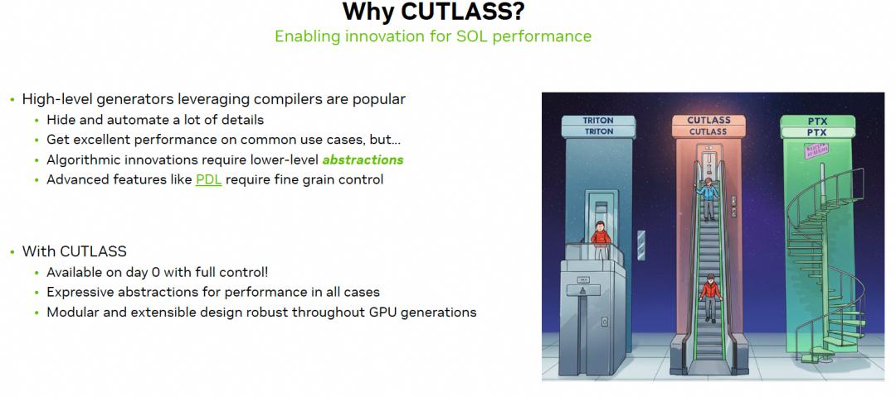

이 그림은 Tri Dao도 인용했다. Triton 같은 DSL은 elevator를 타는 것과 같다. 많은 것이 자동으로 optimize되고 처리되며, developer는 algorithm logic에만 집중한다. tile-based programming model은 개발 속도가 편하고, elevator를 타면 top floor까지 빠르게 올라갈 수 있는 것과 같다. 하지만 extreme performance를 추구하려면 fine-grained optimization이 필요하고 더 많은 low-level abstraction을 노출해야 한다. 반면 PTX와 CUDA는 직접 한 단계씩 조정해야 한다. 계단을 한 칸씩 오르는 것과 같다. 하지만 가장 세밀한 tuning capability를 가진다. 그래서 NV는 template을 통해 Cutlass를 도입해 상대적으로 꽤 단순화했지만, Cutlass 자체도 modify/compile/execute 속도는 여전히 느리다.

### 0.1 Triton의 문제

기존 methods, 예를 들어 Triton은 programming을 단순화했지만 보통 low-level control을 희생한다. 이는 expert developer가 hardware의 extreme performance를 끝까지 끌어내는 것을 제한한다.

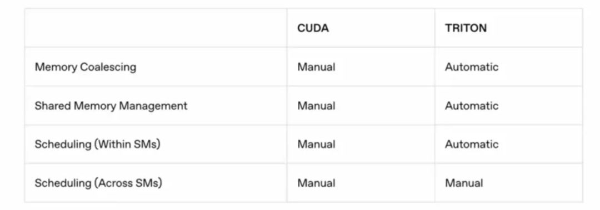

하지만 이런 Pythonic programming 방식이 algorithm을 하는 많은 사람들에게 더 쉽게 받아들여진다는 점은 부정할 수 없다. 따라서 NV는 CuteDSL과 CuTile을 통해 이 부분을 점차 보완하고 있다. 또한 Tri Dao의 QuACK도 CuteDSL 위에서 몇 가지 primitives를 제공하는 것 같다.

### 0.2 Tilelang

TileLang은 조금 더 clean하고, 서로 다른 hardware platform에 대한 support도 훨씬 좋다. 이번 DeepSeek DSA release 이후 domestic cards에는 상대적으로 unified Tile based IR layer가 생겼다.

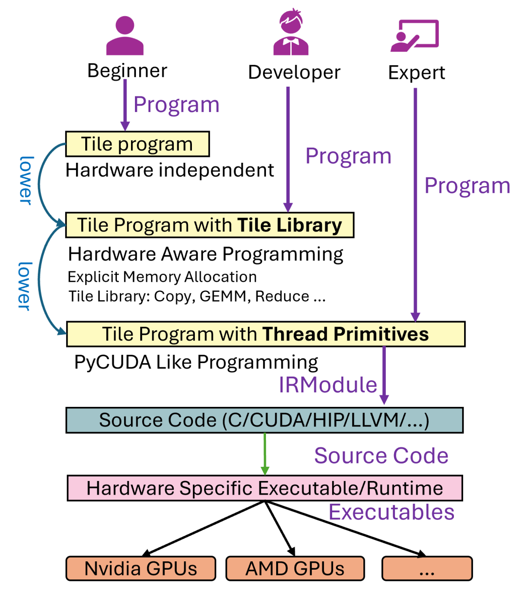

TileLang의 core design philosophy는 **Dataflow와 Scheduling strategy를 decouple하는 것**이다. Tilelang paper에서 말하듯이:

*TileLang decouples scheduling space (thread binding, layout, tensorize and pipeline) from dataflow, and encapsulated them as a set of customization annotations and primitives.*

- **Dataflow**: developer는 `T.gemm`, `T.copy` 같은 high-level, composable **Tile operators**를 사용해 computation의 core logic을 describe한다. 즉 data가 서로 다른 storage levels, 예를 들어 global memory, shared memory, register 사이에서 어떻게 move되고 process되는지를 describe한다.
- **Scheduling**: thread binding, memory layout, Tensorization, Pipeline 같은 hardware-related optimizations는 independent annotations와 primitives의 set으로 encapsulate된다. compiler는 default로 automated optimization을 수행하지만, expert developer가 이러한 primitives를 통해 fine-grained manual tuning을 할 수도 있게 한다.

이런 방식으로 TileLang은 **usability**와 **flexibility/high performance** 사이에서 더 나은 balance를 얻으려 한다. paper는 NVIDIA와 AMD GPU에서 대량의 experiments를 통해 TileLang이 current state-of-the-art specialized libraries, 예를 들어 cuBLAS, FlashAttention-3 및 compilers, 예를 들어 Triton의 performance에 도달하거나 심지어 surpass할 수 있으며, 동시에 code implementation은 더 concise함을 보인다.

core problem은 domain-specific compiler, 즉 DSL이 high-performance Kernel 작성의 burden을 줄이려 하지만, usability와 expressiveness 면에서 gap이 자주 존재한다는 것이다. author는 existing tools, 예를 들어 Triton에 두 가지 major problems가 있다고 지적한다.

- `Usability gaps`: 여전히 충분히 simple하지 않을 수 있고, beginners에게 threshold가 있다.
- `Expressiveness gaps`: 이것이 더 core한 criticism이다. existing tools는 usability를 추구하기 위해 너무 많은 low-level details를 숨기며, 그 결과 expert developer가 일부 advanced 또는 non-standard optimization tricks를 구현할 수 없게 된다. 예를 들어 user가 어떤 data type에 맞춰 매우 special한 memory layout을 쓰고 싶어도 compiler가 허용하지 않거나 support하지 않는다면, 이것이 expressiveness 부족이다.

key problem은 `Scheduling space`를 어떻게 다룰 것인가다. 이는 dataflow를 physical hardware 위에서 어떻게 efficiently execute할지 describe한다. author는 scheduling의 네 가지 key dimensions를 명확히 listed한다.

- `thread binding`: 어떤 thread가 data의 어느 part를 담당하는가.
- `layout`: data가 memory 안에서 어떻게 arranged되는가.
- `tensorize`: Tensor Core 같은 hardware의 dedicated matrix/tensor compute units를 어떻게 사용할 것인가.
- `pipeline`: latency를 hide하기 위해 data movement와 computation을 어떻게 overlap할 것인가.

그다음 `customization annotations and primitives`를 통해 Dataflow와 Scheduling strategy를 decouple한다. scheduling strategy는 compiler가 완전히 결정하는 black box가 아니다. TileLang은 이를 user가 사용할 수 있는 "switch" 또는 "knob", 즉 annotations와 primitives로 expose한다.

## 1. Introduction

글은 먼저 지난 몇 년간 hardware development와 corresponding specialized hardware Kernel evolution을 소개한다. 예를 들어 FlashAttention 같은 custom Kernel은 이미 등장해 attention mechanism을 optimize하고 memory overhead를 줄이며 processing throughput을 높였다. 그럼에도 계속 evolving하는 accelerator hardware 위에서 high efficiency를 구현하려면 여전히 hardware-aware design과 complex tuning의 섬세한 combination에 의존한다. 이러한 challenges는 더 expressive한 domain-specific compiler에 대한 interest가 점점 커지게 했다.

### 1.1 High-performance Kernel의 몇 가지 challenges

deep learning Kernel은 보통 dataflow pattern으로 represent되며, 여기에는 DRAM과 SRAM 사이에서 data tiles를 move하고 이 tiles에 대해 일련의 computations를 수행하는 과정이 포함된다. 이러한 patterns는 겉으로는 clear해 보이지만, high-performance Kernel을 build하는 일은 여전히 challenge로 가득하다. developer가 몇 가지 key optimization problems를 manual로 해결해야 하기 때문이다.

- **Thread Binding**: binding은 tiled operations와 data를 적절한 threads에 mapping하는 process를 말한다. modern accelerator architectures, 예를 들어 GPU에서는 thread blocks, warps, individual threads across에서 tasks를 careful하게 allocate하여 parallelism을 maximize하고 load imbalance를 minimize해야 한다. optimal binding strategy는 data locality를 강화하고 thread synchronization 및 divergence overhead를 줄여 compute throughput 향상에 기여한다.
- **Memory Layout**: memory layout optimization은 storage bank conflicts를 eliminate하고 efficient access pattern을 보장하기 위해 data의 physical memory arrangement를 systemically organize해야 한다. 이 process는 보통 data의 natural representation을 hardware memory subsystem과 align되는 tiled 또는 blocked format으로 transform해야 한다. 이러한 reorganization은 coalesced accesses와 effective cache utilization에 도움이 되어 memory latency를 줄이고 overall system performance를 높인다.
- **Intrinsic Tensorization**: hardware intrinsic functions를 활용한다는 것은 performance에 optimize된 target-specific instructions를 직접 사용하는 것을 의미한다. modern processors와 accelerators는 Tensor Core와 Matrix Core처럼 여러 arithmetic operations를 동시에 execute할 수 있는 specialized operations를 제공하고, bandwidth를 더 잘 활용하기 위한 vector copy 및 asynchronous copy 같은 mechanisms도 제공한다. 이러한 intrinsic instructions를 사용하려면 data type, memory alignment, control flow를 precise하게 manage해야 hardware의 compute capability를 충분히 끌어낼 수 있으며, key Kernel operations에서 significant acceleration을 가져온다.
- **Pipeline**: pipeline은 data movement와 computation을 overlap하여 memory access latency를 완화하는 technique이다. data transfer와 compute tasks를 parallel로 schedule함으로써 pipeline은 processing units가 active하게 유지되도록 하고 memory latency로 인한 idle time을 minimize한다. advanced NVIDIA Hopper architecture에서는 Tensor Memory Accelerator, TMA[10]가 CUDA Cores와 Tensor Cores 같은 different compute units에 asynchronous processing을 enable하여 이 process를 촉진하고 parallelism을 더 강화할 수 있다.

### 1.2 Existing tools의 limitations

최근 AI workload를 위한 몇몇 DSL은 high-performance Kernel creation을 크게 단순화했지만, dataflow가 explicit하게 exposed된 경우에도 대부분의 low-level optimizations를 Kernel implementation과 여전히 intertwine한다. 예를 들어 **Triton**은 intuitive block-level primitives를 제공하지만 thread behavior, memory layout, address space annotations를 auto-generated strategy 뒤에 숨긴다. 이 abstraction은 programming을 simplify하지만, extreme performance를 squeeze하려는 experienced developers에게는 obstacle이 된다.

예를 들어 quantized weights를 가진 matrix multiplication을 구현할 때를 보자. 이런 Kernel은 보통 vectorized data type conversion을 수행하기 위해 **inline assembly**가 필요하고, hardware-specific memory buffer와 careful하게 align된 custom data layout도 필요하다. Triton은 `tl.dot` 같은 vectorized operation을 제공하지만, 이를 custom use case로 extend하는 일, 예를 들어 PTX를 통해 hand-crafted high-performance tile operator를 register하는 일은 여전히 cumbersome하다. 또한 Triton이 user-friendly pipeline control인 `num_stage`를 expose하더라도 **user가 completely custom pipeline을 define하는 것은 허용하지 않는다**. 따라서 domain experts는 memory hierarchy와 other fine-grained optimizations에 대한 explicit control이 필요한 Kernel을 개발할 때 제한을 받는다.

### 1.3 TileLang이 제안된 이유

Triton의 conciseness를 유지하면서 더 큰 flexibility를 제공하는 programming model이다. TileLang은 higher performance를 위해 scheduling space에 대한 fine-grained control을 user에게 제공하는 것을 목표로 한다.

이를 가능하게 하는 key는 **Dataflow와 Scheduling의 decoupling**이다. user는 composable tile operators를 사용해 dataflow를 define하는 데만 집중하고, compiler는 scheduling strategy를 explore하고 apply한다. compiler의 default optimization이 만족스럽지 않을 때 user는 frontend에서 더 precise한 control을 impose할 수 있다. 따라서 GEMM, COPY, ATOMIC, REDUCE 같은 core compute patterns를 tile operators로 represent하는 composable tiled programming abstraction을 도입한다. 이 operators는 scheduling decisions와 independent하게 Kernel의 dataflow를 define한다. 동시에 further optimization을 capture하기 위한 scheduling primitives와 annotations set을 제공하여, user가 compiler-generated scheduling에 의존할지, performance-critical aspects를 manual로 fine-tune할지 선택할 수 있게 한다.

Triton의 core idea는 user가 block의 logical level에서 program하고 compiler가 efficient thread-level code를 generate하는 것이다. 이는 90%의 경우에는 좋다. 하지만 남은 10%의 extreme scenarios에서는 이런 "hiding"이 obstacle이 된다.

"Dataflow와 Scheduling의 decoupling"이 TileLang의 core다.

- **Dataflow (What to do)**: `T.copy`, `T.gemm` 같은 operators는 computation의 "semantic graph"를 구성한다. user는 building blocks를 쌓듯 computation logic만 describe하면 된다.
- **Scheduling (How to do it)**: `T.Pipelined`, `T.Parallel`, `T.annotate_layout` 같은 primitives는 이 "semantic graph"에 대한 "rendering instructions"다. 이들은 compiler에게 logical graph를 physical hardware에 어떻게 mapping할지 알려 준다.

이 decoupling의 benefits는 두 가지다.

1. **ordinary users에게**: scheduling part를 ignore하고 dataflow에만 focus할 수 있다. compiler가 "good enough" default scheduling을 제공하므로 programming threshold가 크게 낮아진다.
2. **expert users에게**: default scheduling이 performance requirement를 만족하지 않을 때 scheduling primitives를 사용해 precise manual intervention을 할 수 있다. 이 intervention은 **structured**이고 **declarative**이며, 직접 CUDA 또는 PTX assembly를 쓰는 것보다 여전히 high-level이고 maintain하기 훨씬 쉽다.

### 1.4 TileLang의 implementation

먼저 user 사용 편의를 위해 Python으로 frontend language를 구현하여 flexible programming style과 최소한의 type annotations를 support했다. 또한 TileLang에는 compiler가 도입되어 user-defined program을 highly optimized low-level code로 translate하고 modern hardware에서 efficiently execute할 수 있게 한다. 이 compiler는 key optimizations를 automate하여 performance tuning에 필요한 manual work를 줄인다. overall, Tilelang의 contributions는 다음과 같다.

1. **Tile-Level Programming Language**: tiled-level programming language를 design하여 user가 buffer가 hardware memory hierarchy의 어디에 위치하는지 explicit하게 declare할 수 있게 했다. **Layout Inference** mechanism을 활용해, system은 efficient parallelized buffer operations의 complexity를 abstract하면서 thread-level control interface를 expose하여 experts가 각 thread가 buffer와 어떻게 interact하는지 precise하게 manage할 수 있게 한다.
2. **Compiler with Automated Optimization**: TileLang에 companion compiler를 제공한다. 이 compiler에는 일련의 automated passes가 포함된다. 이 passes에는 layout inference mechanism을 통한 automatic parallelization, Kernel library를 위한 dynamic parameter simplification, automatic pipeline derivation, dynamic shapes를 위한 loop tail splitting optimization 등이 포함된다. 이 compiler는 TileLang programs가 efficient하면서도 작성하기 쉽도록 보장한다.
3. **State-of-the-Art Performance**: real AI Kernel에 대한 empirical evaluation은 TileLang이 NVIDIA와 AMD GPU 모두에서 vendor specialized libraries 및 Triton 같은 DSL-based methods와 comparable하거나 때로는 surpassing하는 performance를 얻었음을 보여준다.

## 2. A TileLang Example

### 2.1 Design principles와 background

TVM처럼 scheduling과 computation을 separate하는 existing machine learning compilers는 user가 computation과 scheduling을 explicit하게 구분하도록 요구한다. 또한 user는 best performance를 얻기 위해 new tensor instructions를 manual로 register하고 buffer layout을 specify해야 한다. 그러나 scheduler를 작성하고 이해하는 것은 여전히 challenge다.

Triton 같은 modern framework는 user가 tile-level programming에 focus할 수 있게 하지만, 그 dataflow representation은 보통 충분히 clear하지 않고, masked conditional load나 Tensor Memory Accelerator, TMA 같은 hardware-specific functions와 같은 workaround를 사용해야 한다.

ThunderKitten 같은 framework는 program을 load, compute, store, sync operations의 block-granularity combination으로 abstract하지만, dataflow는 여전히 충분히 transparent하지 않아 user가 further optimization을 적용하는 ability를 제한한다.

또한 Python-based deep learning frameworks가 널리 adopted되면서 model을 manual로 C++로 translate해 optimize하는 것은 practical하지 않다. 따라서 TileLang을 design할 때 author는 세 가지 key principles를 강조한다.

1. `Pythonic design`: Python ecosystem과 seamless하게 integrate하고 familiar coding experience를 제공하며 learning curve를 낮춘다.
2. `Dataflow-centric`: user가 주로 dataflow에 focus할 수 있게 하면서 low-level scheduling complexity를 abstract한다. thread binding, memory layout, tensorization, pipeline 같은 scheduling aspects를 dataflow와 decouple하고, 이를 customizable annotations와 primitives의 set으로 encapsulate하여 programmability와 maintainability를 높인다.
3. `Composability`: Kernel, primitives, scheduling strategies가 seamless하게 compose되어 complex design을 build할 수 있도록 보장한다.

### 2.2 GEMM example code 설명

TileLang에서 GEMM Kernel을 구현하여 basic syntax를 설명하고 productivity를 어떻게 높이는지 보여준다. 아래와 같다.

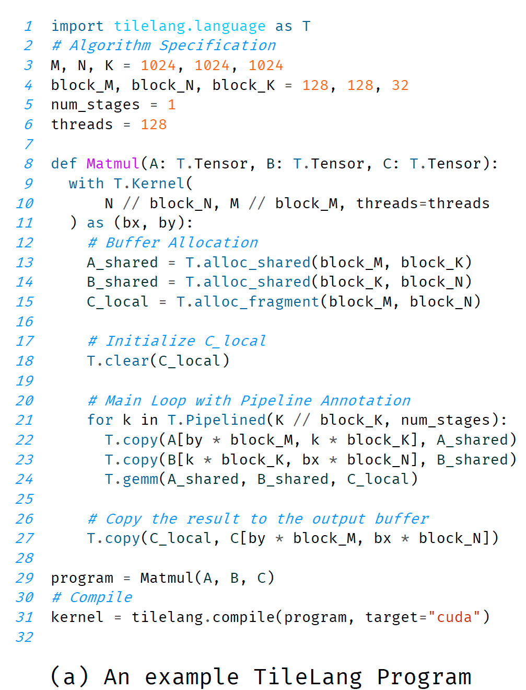

먼저 GEMM Kernel의 inputs와 outputs를 define하고, 8번째 line에서 shapes와 data types를 specify한다. 이어서 Kernel context를 initialize한다. 9-11번째 line은 grid size와 total thread count를 결정한다. 다음은 Kernel body, 12-27번째 line이며, 여기에는 on-chip memory allocation과 dataflow management가 포함된다. TileLang은 Python embedded programming language이므로 if-else, for, while 같은 Python의 모든 imperative structures를 support한다. key difference는 user가 function arguments와 variables declarations에 **explicit type annotations**를 제공해야 한다는 점이다. 이 requirement는 Python의 dynamic typing property에서 비롯되며, 이는 static data type이 precise data bit width를 결정하는 데 중요하기 때문에 CUDA/HIP 같은 device code generation에는 natural하게 적합하지 않을 수 있다. TileLang에서 type annotations는 element type과 tensor shape를 explicit하게 define하여 correctness와 efficient code generation을 보장한다.

또한 TileLang은 **explicit memory allocation**을 허용하여 data placement와 access pattern에 더 강한 control을 제공한다. 주어진 implementation에서 TileLang은 `T.alloc_shared`를 사용해 A와 B의 sub-matrices를 shared memory에 store하고, `T.alloc_fragment`를 사용해 block level에서 accumulator를 register file에 allocate한다. 또한 pipeline execution, 즉 `T.Pipelined`를 사용하면 memory transfer와 computation을 overlap하여 memory latency를 effectively hide하고 overall throughput을 높일 수 있다. `T.gemm` operation은 NVIDIA CUTLASS 또는 hand-written HIP code를 활용해 block-level matrix computation을 efficiently execute한다. low-level scheduling과 synchronization을 automate함으로써 TileLang은 developer가 hardware-specific optimization이 아니라 algorithm design에 focus할 수 있게 하고, compute efficiency를 유지하면서 productivity를 높인다.

- **L1-L7**: matrix dimensions, tile size, pipeline stage count, thread count 같은 algorithm parameters를 define한다.
- **L8**: `def Matmul(A: T.Tensor, B: T.Tensor, C: T.Tensor):`는 Kernel function을 define한다. `T.Tensor`는 TileLang의 type annotation이며, compiler가 처리해야 하는 tensor object임을 mark한다.
- **L9-L11**: `with T.Kernel(N // block_N, M // block_M, threads=threads) as (bx, by):`

- `T.Kernel`은 Kernel의 entry point다.
- `N // block_N`, `M // block_M`은 grid size와 total thread count를 결정한다. 이는 각 thread block이 output C의 `block_M x block_N` 크기 sub-block 하나를 compute한다는 뜻이다.
- `threads=threads`는 각 thread block이 128 threads를 포함한다고 specify한다.
- `as (bx, by)`: Context에서 `bx`와 `by`를 반환한다. 이들은 현재 thread block의 grid 내 x, y coordinates를 represent하며, CUDA의 `blockIdx.x`와 `blockIdx.y`와 유사하다.

- **L13-L15**: `T.alloc_shared(...)`, `T.alloc_fragment(...)`. 이는 explicit on-chip memory allocation이다. `A_shared`와 `B_shared`는 shared memory에 있고, `C_local`은 register file에 있다. 이때 관점은 **block-level**이라는 점에 주의하자.
- **L18**: `T.clear(C_local)`. block-level accumulator를 zero clear한다.
- **L21**: `for k in T.Pipelined(K // block_K, num_stages):`. 이는 dataflow의 core loop다. `T.Pipelined`는 special iterator이며, compiler에게 이 loop body를 pipeline해야 한다고 알려 준다. `K // block_K`는 total loop count다.
- **L22-L23**: `T.copy(...)`. dataflow를 describe한다. global memory의 `A`와 `B` corresponding tiles를 shared memory `A_shared`와 `B_shared`로 copy한다. index calculation인 `by * block_M`, `k * block_K` 등은 `by`와 loop variable `k`를 사용해 correct data tile을 locate한다.
- **L24**: `T.gemm(A_shared, B_shared, C_local)`. computation을 describe한다. shared memory에 있는 두 tiles에서 matrix multiplication을 execute하고 result를 register `C_local`에 accumulate한다.
- **L27**: `T.copy(C_local, C[...])`. loop가 끝난 뒤 register의 final result를 global memory `C`의 corresponding position에 write back한다.
- **L31**: `tilelang.compile(...)`. JIT compilation을 trigger한다.

### 2.3 Compilation flow

`tilelang.compile`을 호출하면 Tilelang program은 아래 figure (b)의 IR로 lower되고, 이후 CUDA Code로 further generate된다.

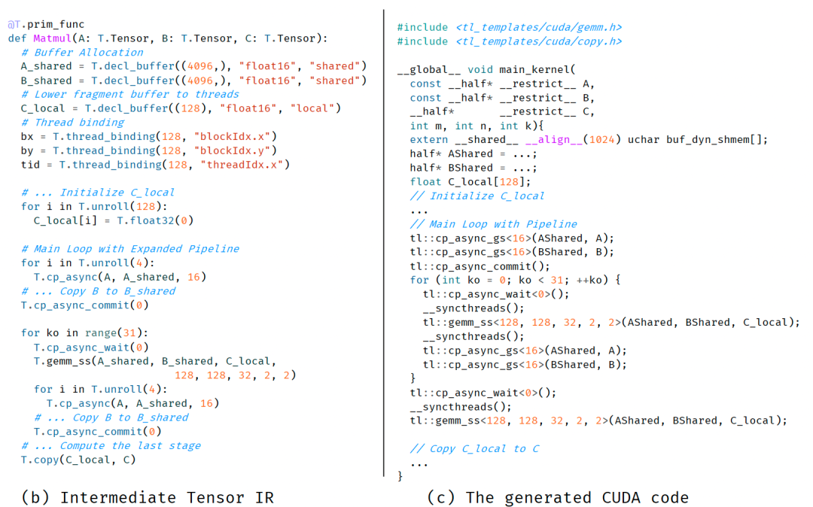

#### Figure (b)의 IR

- `T.decl_buffer`: `alloc` operation이 더 low-level declaration으로 바뀐다. `A_shared`와 `B_shared`가 size `4096 = 128 * 32`인 1D array로 flatten된다는 점에 주의하자. `C_local`도 thread-level buffer로 lowered되며, size는 `128`이다.
- `T.thread_binding`: `bx`, `by`, `tid` variables가 hardware의 `blockIdx.x`, `blockIdx.y`, `threadIdx.x`에 explicit하게 bound된다.
- `T.unroll`: loop가 unroll되어야 한다고 mark된다.
- **Pipeline expansion**: `T.Pipelined` loop가 사라지고, explicit `cp_async`, 즉 asynchronous copy, `cp_async_commit`, 즉 asynchronous copy commit, `cp_async_wait`, 즉 asynchronous copy completion wait instructions가 대신 나타나며, `gemm_ss`, 여기서 ss는 shared-shared input을 의미하는 computation과 interleave된다. 이는 software pipeline의 concrete implementation을 clear하게 보여준다.

#### Figure (c)의 CUDA code

- `tl::cp_async_gs`, `tl::cp_async_commit`, `tl::cp_async_wait`: 이는 TileLang이 제공하는 template library functions이며, low-level PTX asynchronous copy instructions를 encapsulate한다.
- `tl::gemm_ss`: TileLang의 GEMM template library function이며, 내부에서 CUTLASS를 호출한다.

### 2.4 추가 분석

overall, Tilelang program을 작성할 때 user는 완전히 Dataflow 중심으로 생각할 수 있다. 먼저 compute block을 위한 scratch space, 즉 `A_shared`, `B_shared`, `C_local`을 allocate하고, accumulator를 initialize한다. 그다음 K dimension을 loop하면서 `T.copy`로 A와 B의 next tile을 SMEM으로 load하고, `T.gemm`으로 compute 및 accumulate한다. 마지막으로 `T.copy`로 result를 write back한다. 전체 process는 dataflow graph를 그리는 것과 같으며, developer는 다음을 전혀 신경 쓸 필요가 없다.

- `T.copy`는 128 threads에 의해 어떻게 parallel execute되는가? memory access는 coalesced되는가?
- `T.gemm`은 Tensor Core를 어떻게 활용하는가? data는 shared memory와 registers 사이에서 어떻게 flow하는가?
- `T.Pipelined`는 load와 compute를 어떻게 overlap하는가? asynchronous copy instructions와 synchronization barrier는 어디에 insert되어야 하는가?

이런 complex scheduling problems는 모두 abstract되어 compiler에게 맡겨진다. 이는 CUDA로 직접 programming하는 것과 sharp contrast를 이룬다. CUDA에서는 developer가 위의 모든 문제를 manual로 처리해야 한다. 동시에 Triton과도 몇 가지 비교를 해 볼 수 있다.

1. **Explicit memory declaration**: TileLang의 `T.alloc_shared`와 `T.alloc_fragment`는 data의 location을 code 안에서 한눈에 보이게 한다. Triton에서는 pointer operation이 load를 implicit하게 처리하고, accumulator는 보통 ordinary Python variable이며 register 안의 location은 implicit하다. TileLang의 explicit declaration은 이후 layout inference와 optimization에 더 clear한 starting point를 제공한다.
2. **Primitive encapsulation**: TileLang은 `copy`, `gemm`, `clear` 같은 operations를 high-level API로 encapsulate한다. Triton은 pointer arithmetic과 `tl.load`, `tl.store`, `tl.dot` 같은 lower-level primitives를 더 많이 사용한다. TileLang의 API는 더 high-level이고 algorithm description에 더 가깝다. Triton의 primitives는 hardware operation에 더 가깝다.
3. **Pipeline expression**: TileLang의 `T.Pipelined`는 `for` loop에 작용하는 iterator wrapper이며, semantic이 매우 intuitive하다. "이 loop는 pipelined된다"는 뜻이다. Triton의 `num_stages`는 `@triton.jit` decorator의 parameter이며, whole Kernel에 작용한다. TileLang 방식은 nested loop나 partial loop의 pipeline을 express할 때 더 flexible할 수 있다.
4. **Transparency**: Figure 1(b)가 보여주는 IR은 TileLang design의 큰 highlight다. 이는 user, 특히 expert user에게 compiler가 high-level code를 어떻게 understand하고 transform하는지 보여준다. user는 `T.Pipelined`가 concrete `cp_async` operation sequence로 transform되는 것을 볼 수 있다. 이런 처리 방식은 developer가 compiler behavior를 신뢰하게 만들고, 필요할 때 더 targeted optimization을 할 수 있게 한다. Triton의 compilation process는 더 black box에 가깝다.

## 3. Tilelang design

이 장은 TileLang의 foundations를 자세히 소개한다. 여기에는 Tile-based programming model과 TileLang이 Kernel development를 systematic하고 efficient하게 manage하는 방법이 포함된다. 이 장의 core는 TileLang이 **Dataflow**를 다른 **Scheduling Space**와 separate하는 design method를 설명하는 것이다.

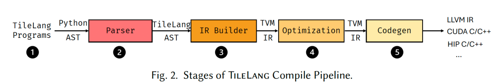

위 figure는 TileLang의 five-stage compilation pipeline을 보여준다.

1. **Developer**는 TileLang을 사용해 computation logic과 data access pattern을 describe하는 high-level program을 작성한다.
2. **Parser** stage는 TileLang program, 즉 Python code를 Python AST, 즉 abstract syntax tree로 parse한 뒤 TileLang AST로 transform한다.
3. **IR Builder** stage는 AST를 TVM intermediate representation, 즉 IR로 transform한다. 이렇게 하면 TVM의 mature syntax tree structure와 related infrastructure를 reuse할 수 있다.
4. **Optimization** stage는 IR에 일련의 graph optimizations와 scheduling transformations를 execute하여 execution efficiency를 높인다.
5. **Codegen** stage는 optimized IR을 backend code, 예를 들어 LLVM IR, CUDA C/C++, HIP C/C++로 translate하여 different hardware platforms를 support한다.

아래 table은 TileLang이 제공하는 representative dataflow operators와 scheduling primitives의 일부를 보여준다. Tile language는 **data-centric programming paradigm**을 받아들이며, 그 core compute semantics는 `T.copy`, `T.gemm`, `T.reduce` 같은 block-level operators로 express된다. 보완적으로 TileLang은 여러 scheduling primitives를 expose하여 developer가 parallelism, pipeline, memory layout 같은 performance-critical aspects를 fine-tune할 수 있게 한다.

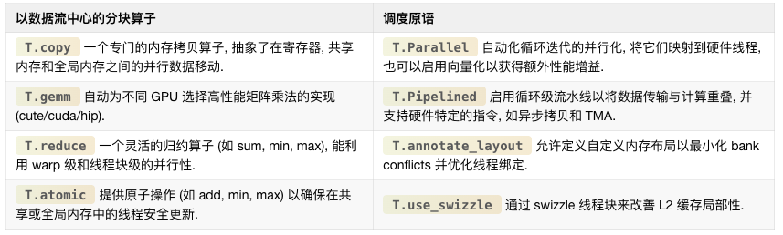

### 3.1 Tile-Based programming model

paper original text의 이 부분에는 Figure 11에 대한 typo가 있는데, 실제로는 Figure 3을 설명한다. 이는 simple GEMM example을 통해 developer가 high-level structures, 예를 들어 tiling, memory placement, pipeline, operator invocation을 사용해 data movement와 computation을 fine-control하는 방법을 보여준다. 특히 이 code snippet은 multi-level tiling이 different memory levels, 즉 global memory, shared memory, registers를 활용해 bandwidth utilization을 optimize하고 latency를 줄이는 방법을 보여준다. overall, TileLang의 Python-like syntax는 developer가 user-friendly programming model 안에서 performance-critical optimizations를 reason할 수 있게 한다.

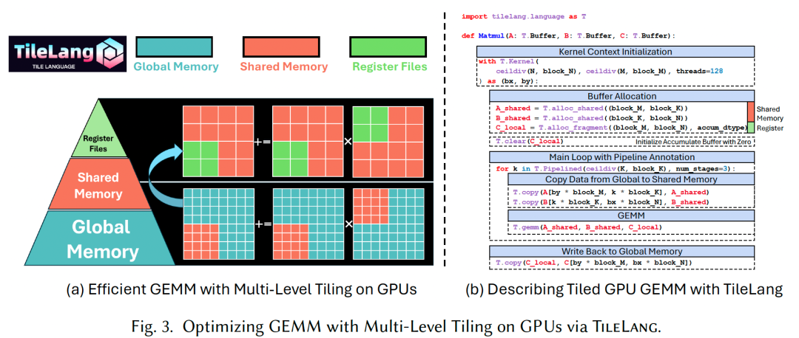

**Tile declarations**: 이 method의 core는 **Tile**을 programming model 안의 first-class citizen으로 삼는 것이다. tile은 shape를 가진 data의 일부를 represent하며, warp, thread block 또는 equivalent parallel unit이 own하고 operate할 수 있다. Matmul example에서 A와 B buffers는 Kernel loop 내부에서 `block_M`, `block_N`, `block_K`가 결정하는 tiles의 form으로 read된다. `T.Kernel`을 통해 TileLang은 execution context를 define하며, 여기에는 thread block indices인 `bx`, `by`와 thread count가 포함된다. 이러한 contexts는 각 thread block의 index를 계산하는 데 도움을 주고, TileLang이 memory access와 computation을 더 쉽게 automatically infer하고 optimize할 수 있게 한다. 또한 이러한 contexts는 user가 thread block 안의 each individual thread behavior를 manual로 control할 수 있게 한다.

**Explicit Hardware Memory Allocation**: TileLang의 hallmark feature는 이러한 tiled buffers를 hardware memory hierarchy 안에 explicit하게 place할 수 있다는 점이다. TileLang은 compiler의 opaque optimization process에 의존하지 않고, physical memory space 또는 accelerator-specific structures에 직접 mapping되는 user-facing built-in functions, 즉 intrinsics를 expose한다. 구체적으로는 다음을 포함한다.

- **T.alloc\_shared**: high-speed on-chip storage space에 memory를 allocate한다. 이는 NVIDIA GPU의 SMEM에 대응한다. SMEM은 computation 과정의 intermediate data를 cache하기에 이상적이다. global memory보다 훨씬 빠르고 같은 thread block 안의 threads가 data를 efficiently share할 수 있기 때문이다. 예를 들어 matrix multiplication에서는 matrix tiles를 SMEM에 load하여 global memory bandwidth demand를 줄이고 performance를 높일 수 있다.
- **T.alloc\_fragment**: **fragment memory** 안에 accumulator를 allocate한다. 이는 NVIDIA GPU의 register files, 즉 RF에 대응한다. inputs와 partial sums를 registers 또는 hardware-level cache에 보관함으로써 latency가 further minimized된다. 이 tiled program에서 각 tile이 shared memory와 같은 size의 local buffer를 allocate한다는 점은 counterintuitive해 보일 수 있다. shared memory는 보통 register file보다 더 풍부하지만 조금 느리기 때문이다. 이는 여기서의 allocation이 entire thread block의 register file을 가리키기 때문이다. TileLang은 compilation 중 **Layout Inference Pass**를 사용해 `T.Fragment` layout object를 derive하며, 이 object는 각 thread에 corresponding register file을 어떻게 allocate할지 결정한다. 이 process는 subsequent sections에서 자세히 논의한다.

global memory와 hardware-specific memory 사이의 data transfer는 `T.copy`로 manage할 수 있다. 또한 hardware-specific buffers는 `T.clear` 또는 `T.fill`로 initialize할 수 있다. data assignment의 경우에도 아래 figure에 보이듯 `T.Parallel`을 사용해 parallel하게 execute할 수 있다.

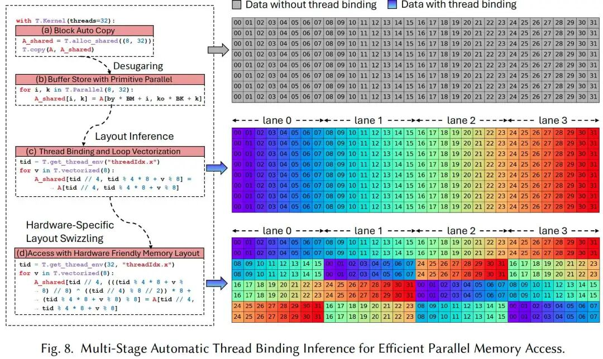

### 3.2 Dataflow Centric Tile Op

TileLang은 일련의 **Tile Operators**를 abstract하여 developer가 각 tile operation의 low-level implementation details를 manage하지 않고 dataflow logic에 focus할 수 있게 한다. Figure 4는 tile operator의 interface와 `GEMM`, `Copy`, `Parallel`을 포함한 몇 가지 representative examples를 보여준다.

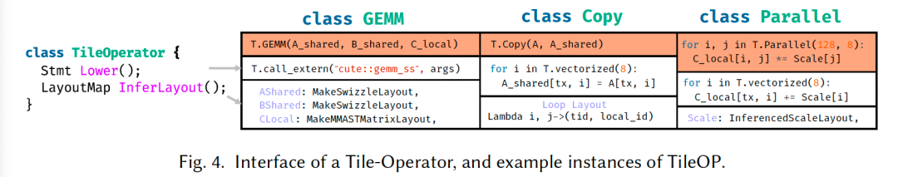

각 tile operator는 두 key interfaces, `Lower`와 `InferLayout`을 implement해야 한다.

- **Lower interface**: high-level tile operator를 lower-level IR로, 예를 들어 thread binding 또는 vectorized memory access로 lower하는 방법을 define한다. 예를 들어 `Copy`는 explicit thread binding과 vectorized load/store를 가진 loop로 lowered될 수 있다.
- **InferLayout interface**: 해당 tile operator와 associated된 memory 및 loop layout을 determine한다. 여기에는 buffer layout, 예를 들어 swizzled memory 또는 loop-level layout, 예를 들어 thread binding을 infer하는 것이 포함된다. 예를 들어 `T.gemm`은 shared memory inputs에 swizzled layout을 apply하고, MMA fragments를 write back하기 위해 matrix-specific layout을 사용한다. 마찬가지로 `T.Parallel` 안의 parallel loop structure는 thread-level binding과 vectorized access pattern으로 represent될 수 있으며, 둘 다 layout inference를 통해 얻어진다. Section 4.1은 layout composition과 lowering process에서의 역할을 더 자세히 논의한다.

앞에서는 tiled programming의 common operations를 simplify하기 위한 일부 TileLang operators를 listed했다. 이러한 built-in operators는 hardware memory access와 computation의 low-level details를 abstract하여 developer가 dataflow perspective에서 high-level algorithm design에 focus하면서도 performance-critical aspects에 대한 fine-grained control을 유지할 수 있게 한다. 아래에서는 몇 가지 key operators를 describe한다.

- **copy**: `copy` operation은 `T.Parallel`에 memory copy를 더한 syntactic sugar다. 이는 `fragment` scope, 즉 registers, `shared` scope, 즉 static shared memory, `shared.dyn` scope, 즉 dynamic shared memory, `global` scope, 즉 global memory 사이에서 copy를 수행할 수 있게 한다.
- **gemm**: built-in `T.gemm` operator는 general matrix multiplication을 위해 highly optimized된 implementation이며, 여러 memory access modes, 즉 `ss`, `sr`, `rs`, `rr`을 support한다. 여기서 `r`은 register memory, `s`는 SMEM을 represent한다. 이 operator는 Kernel configuration에 따라 optimal implementation을 automatically select한다. CUDA backend의 경우 `T.gemm`은 NVIDIA CUTLASS library를 활용해 Tensor Cores 또는 CUDA Cores를 efficiently use한다. AMD GPU의 경우 Composable Kernel과 hand-written HIP code를 사용해 performance를 optimize한다. user는 Python에서 custom primitive를 register하여 `T.gemm`을 extend할 수도 있으며, 이를 통해 specific use case에 더 flexible해진다.
- **reduce**: `T.reduce` operator는 dimensions across에서 data를 aggregate하기 위한 flexible하고 efficient한 reduction mechanism을 제공한다. `sum`, `min`, `max`, `product` 등 다양한 reduction operations를 support한다. reduction은 specified axes across로 수행할 수 있어 matrix row reduction 또는 column reduction 등을 구현할 수 있다. `T.reduce` implementation은 warp-level 및 thread-block-level parallelism을 활용하여 CUDA와 AMD backends 모두에서 best performance를 얻는다.
- **atomic**: `T.atomic` operator는 parallel context에서 shared 또는 global memory를 safely update하기 위한 atomic operation을 제공한다. `add`, `min`, `max` 같은 common atomic operations가 natively supported된다. `T.atomic`은 concurrent update 중 thread safety를 보장하며, NVIDIA와 AMD GPU의 native hardware atomic instructions를 활용해 parallel execution correctness를 보장하면서 high performance를 실현하도록 design되었다.

### 3.3 Schedule Annotations and Primitives

dataflow pattern은 operations를 organize하는 foundation이지만, modern high-performance computing은 execution pattern에 대한 더 fine-grained control을 요구한다. 이를 충족하기 위해 TileLang은 앞 table에서 설명한 것처럼 comprehensive scheduling primitives를 제공하여 developer가 applications의 performance-critical aspects를 precisely tune할 수 있게 한다.

- **Pipelined**: `T.Pipelined` primitive는 loop를 efficient하게 pipelined execute할 수 있게 하며, computation과 memory operations를 overlap하여 performance를 높인다. Figure 1에서 k, 즉 reduction dimension을 traverse하는 loop는 pipelined되고, `num_stages=3`은 3-stage pipeline을 만든다. 이 pipeline은 data transfer, computation, subsequent data preparation이 overlap되도록 하여 memory bottleneck을 effectively 줄이고 compute throughput을 높인다. `T.Pipelined`를 CUDA source로 lowering하는 detailed design은 Section 4.4에서 논의한다.
- **Parallel**: `T.Parallel` primitive는 iterations를 threads에 mapping하여 loop를 automatically parallelize한다. Figure 8에서 `A_shared`로 data를 copy하는 operation은 `T.Parallel(8, 32)`를 사용해 8과 32 두 dimensions에서 parallelize된다. 이는 hardware parallelism을 활용해 performance를 높일 뿐 아니라, threads를 iterations에 automatically map하고 further optimization을 위한 vectorization도 support한다.

- **annotate\_layout**: `T.annotate_layout` primitive는 user-defined memory layout을 사용해 shared 또는 global memory에 대한 memory layout optimization을 specify할 수 있게 한다. default로 TileLang은 NVIDIA와 AMD GPU에서 bank conflicts를 minimize하도록 design된 optimized memory layout을 사용한다.

- **use\_swizzle**: `T.use_swizzle` primitive는 swizzled memory access를 enable하여 L2 cache locality를 improve하고 rasterization process 중 data reuse를 높인다. 이 primitive는 parallel thread blocks가 tiled data를 process할 때 특히 effective하다.

이 장은 Tilelang의 design principles, 즉 **Dataflow와 Scheduling의 separation**을 통해 programming model을 구축하는 방법을 자세히 설명했다.

complex GPU programming을 manage 가능한 두 parts로 decompose한다.

- **"What to do"**: `T.gemm`, `T.copy` 같은 dataflow operators로 computation logic을 describe한다. 이 part는 algorithm researcher 같은 domain expert에게 매우 intuitive하다.
- **"How to do it"**: `T.Pipelined`, `T.Parallel`, `T.alloc_shared` 같은 scheduling primitives와 memory allocation interfaces로 execution method를 control한다. 이 part는 performance engineer에게 fine-tuning capability를 부여한다. 이러한 separation 덕분에 different roles의 developers가 자신이 잘하는 domain에 focus할 수 있다.

다른 한편으로는 **Composability and extensibility**다. `Tile Operator` interface, 즉 `Lower`와 `InferLayout`의 design은 extensibility의 foundation이다. user는 이 두 interfaces만 implement하면 자신만의 operator를 define하고 TileLang의 compilation 및 optimization flow에 seamless하게 integrate할 수 있다.

## 4. Scheduling Design and Automation

이 장은 dataflow 외의 네 가지 scheduling spaces와 TileLang 안에서의 automated design을 논의한다. 일부는 비교적 independent, 예를 들어 pipeline과 tensorization이며, 다른 일부는 더 tightly coupled되어 있다. 예를 들어 thread binding과 memory layout design이다. 다음 sections에서는 먼저 memory layout infrastructure의 design을 설명하고, 이어서 thread binding을 설명한다. 그다음 tensorization의 automated design을 논의하고, 마지막으로 pipeline design을 공유한다.

### 4.1 Memory Layout Composition

TileLang에서는 `A[i, k]` 같은 high-level interface를 사용해 multi-dimensional array를 index할 수 있다. 이러한 high-level indexing은 결국 일련의 software 및 hardware abstraction layers를 통해 physical memory address로 translate된다. 이 indexing translation process를 model하기 위해 key abstraction인 **Layout**을 도입한다. Layout은 data가 memory 안에서 어떻게 organize되고 map되는지를 describe한다.

physical address level에서 layout은 linear address expression으로 represent될 수 있으며, 그 form은 $\sum_i y_i s_i$다. 여기서 $y_i$는 $i$번째 dimension의 index를 represent하고, $s_i$는 해당 dimension이 전체 linear memory address에 contribute하는 stride다. layout $L = s : d = (s_0, s_1, \dots, s_{n-1}) : (d_0, d_1, \dots, d_{n-1})$가 주어졌을 때, TileLang은 TVM-inspired design을 채택하여 `IterVar` 기반의 composable, stackable layout function abstraction을 도입한다. `IterVar` 하나가 stride information을 encapsulate할 수 있으므로 layout expression은 `IterVar`에 대한 algebraic form으로 simplify될 수 있다. 따라서 layout function은 formal하게 mapping $f : \mathbb{K}^n \to \mathbb{K}^m$으로 represent될 수 있으며, 여기서 $f$는 high-level index에서 memory address로의 transformation을 encode한다.

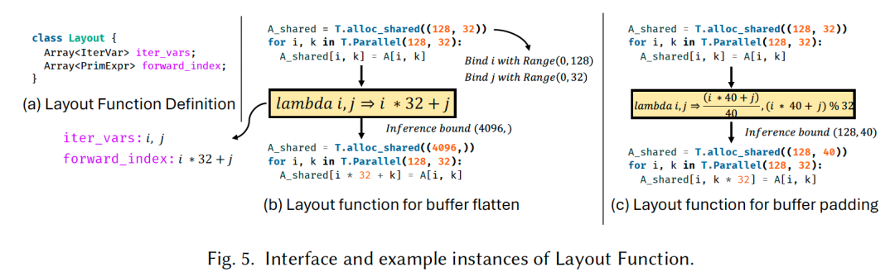

Figure 5(a)는 TileLang 안의 `Layout` definition을 보여준다. core components는 `iter_vars`, 즉 range information을 optionally carry할 수 있는 iteration variables와, 이 iteration variables를 기반으로 memory location을 compute하는 `forward_index` expressions의 set이다. 이 expressions는 함께 algebraic function $f : \mathbb{K}^n \to \mathbb{K}^m$을 define한다.

Figure 5(b)에서 보듯, 이는 2D to 1D layout transformation을 express할 수 있게 한다. buffer shape가 주어지면 `iter_vars`는 specific region에 bound되고, generated expressions는 arithmetic analyzer로 전달되어 symbolic 또는 constant bounds를 determine한다. 이 bounds는 transformed buffer shape를 infer하고 buffer access index를 accordingly adjust하는 데 사용된다.

TileLang은 non-bijective layout transformations도 support한다. 예를 들어 Figure 5(c)는 layout을 사용해 buffer access에 padding을 apply하는 방법을 보여준다. 이러한 layout transformations는 composable하며, TileLang에는 layout swizzling 같은 몇 가지 built-in layout strategies가 포함된다. 이는 보통 GPU의 shared memory bank conflicts를 mitigate하는 데 사용된다.

또한 TileLang은 `Layout` abstraction의 extension인 **Fragment**를 도입한다. standard layout과 달리 `Fragment` layout은 항상 form $f : \mathbb{K}^n \to \mathbb{K}^2$의 output을 produce한다. 여기서 두 output dimensions는 각각 **register file에서의 thread position**과 **local register file 안의 index**를 represent한다. 예를 들어 Figure 1의 Kernel에서는 thread block level에서 register file `C_local`이 allocated된다. 그러나 GPU register file은 block 내부 threads 사이에 partition되어야 하므로, `Fragment` layout은 이러한 partition scheme에 대한 precise description을 제공한다.

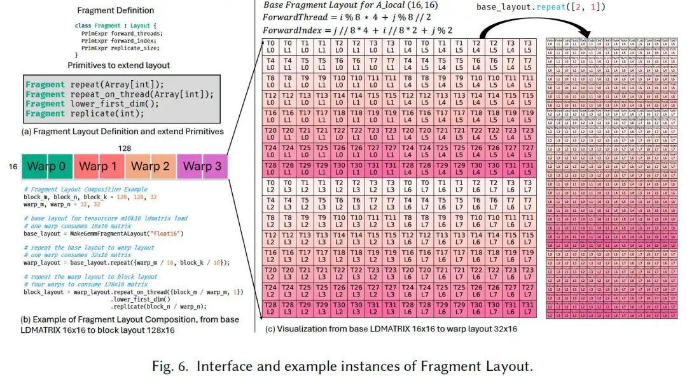

Figure 6(a)는 `Fragment` layout의 definition을 보여준다. TileLang은 user가 existing `Fragment` layout을 extend하는 데 도움이 되는 네 가지 primitive operations를 제공한다. Figure 6(b)는 이 primitives를 사용해 `m16k16` matrix fragment용 `mma_ldmatrix` instruction의 base layout에서 complete block-level layout을 derive하는 example을 보여준다. 여기서 `base_layout`은 warp 하나가 `m16k16` matrix 하나를 consume하는 layout을 represent한다. 이 layout은 `repeat` primitive를 통해 `warp_layout`으로 extend되어 single warp가 `m32k16` matrix를 consume할 수 있게 한다. Figure 6(c)는 이 transformation을 visualize한다. 그런 다음 `warp_layout`은 `repeat_on_thread`와 `replicate` 같은 primitives로 further extend되어 `block_layout`을 generate하며, 이는 four warps가 함께 `m128k16` matrix를 consume하는 것을 represent한다.

### 4.2 Thread Binding

`Fragment` layout abstraction 위에서, execution 중 이러한 layouts를 threads에 어떻게 mapping할 것인가라는 key challenge가 등장한다. 이것이 **Thread Binding** problem으로 이어진다. 이는 block-level register file을 individual threads에 어떻게 allocate할지, 그리고 appropriate `Fragment` layout을 어떻게 infer할지와 관련된다. 또한 layout constraints에 맞게 loop를 어떻게 correctly parallelize해야 하는지도 determine해야 한다.

Section 4.1에서 도입한 `Fragment` layout이 이 process를 simplify하는 데 도움을 주지만, arbitrary compute expression에 대해 모든 buffers의 appropriate `Fragment` layout을 determine하는 것은 여전히 어렵다. 이 process는 두 key observations로 guide된다.

1. multiple tile operators가 보통 same buffer를 share하므로, 각자의 layout과 thread binding strategies는 interdependent하다.
2. different operators는 layout과 thread binding에 대해 서로 다른 strictness의 requirements를 가진다. 예를 들어 GPU에서 `GEMM` operator, 즉 Tensor Cores를 활용하는 operator는 layout과 thread binding 모두에 strict constraints를 impose하지만, element-wise operator는 보통 더 큰 flexibility를 허용한다.

이 observations를 기반으로, buffer layout과 thread binding을 optimize하기 위해 `Layout` 및 `Fragment` objects 기반의 inference scheme이 제안된다. buffer layout을 systemically manage하기 위해 Tilelang은 모든 buffer의 layout information을 record하는 `LayoutMap`을 maintain한다. 또한 tile operator layout을 위해 **hierarchical priority system**을 define하며, higher priority level은 더 strict한 layout requirement와 더 큰 performance impact를 나타낸다. TileLang은 **top-down** 방식으로 layout inference를 처리하며, highest priority level에서 lowest priority level 순서로 layout을 infer한다. 각 priority level에서 TileLang은 아직 determined되지 않은 모든 buffers에 대해 layout을 infer하려고 시도하고, 더 이상 progress를 얻을 수 없을 때 다음 lower priority level로 이동한다.

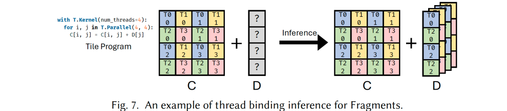

Figure 7에서 보듯, matrix `C`가 `GEMM` operation의 result이며 `Fragment` object에 대응하고, `GEMM` compute 후 bias `D`를 더해야 하는 scenario를 생각하자. inference process에서 `GEMM`이 highest priority를 가지므로 그 thread binding configuration은 pre-determined되어 있지만, `D`의 thread binding strategy는 아직 determine되지 않았다. output matrix `C`의 dimension은 4x4이고 8 threads에 distributed되어 있으며, 각 thread가 2 elements를 담당한다. 따라서 bias buffer `D`의 layout은 이 configuration에 align되어야 한다. tensor `C`의 각 row가 2 threads에 의해 processed되므로, 이 두 threads는 addition operation을 위해 `D`의 same element에 access해야 한다. 따라서 각 thread가 corresponding element에 access할 수 있도록 `D`는 replicated되어야 한다. `D`의 layout도 같은 method로 infer할 수 있다.

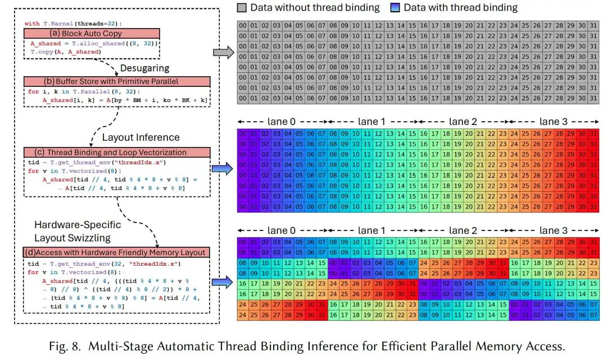

Figure 8은 thread binding inference process의 example을 보여준다. 구체적으로 Figure 8(a)는 data copy를 위한 simple code snippet을 보여주며, sub-block 하나가 global memory에서 shared memory로 transfer되는 dataflow를 describe한다. appropriate thread binding과 vectorized access는 GPU parallelism과 high-performance memory access instructions를 충분히 활용할 수 있게 한다. Figure 8(b)에서 `T.copy` operation은 multiple loops로 expanded된다. layout inference process를 적용한 뒤 Figure 8(c)처럼 program은 automatic vectorization과 parallelization을 거친다. 마지막으로 Figure 8(d)의 stage에서 Layout Swizzling이 apply된다.

여기서는 이 seemingly simple `T.copy` operation이 TileLang compiler의 multiple stages를 거치며 GPU hardware에 맞는 highly optimized parallel memory access code로 점차 transform되는 과정을 조금 더 analyze한다.

#### block auto copy

Figure (a)는 user의 가장 original intent를 describe한다. global memory `A`의 data block 하나를 shared memory `A_shared`로 copy하는 것이다. `A_shared`의 size는 `(8, 32)`로 declared된다. 전체 Kernel은 32 threads, 즉 `threads=32`를 사용한다. 이 stage에서 user는 이 copy task가 32 threads 사이에 어떻게 assigned되는지, 각 thread가 구체적으로 어떤 data를 copy하는지 전혀 신경 쓸 필요가 없다. user는 "what to do", 즉 copy data만 describe하고 "how to do it"은 describe하지 않는다.

#### Desugaring

Figure (b)는 desugaring stage다. compiler는 high-level `T.copy(A, A_shared)` operation을 equivalent low-level form으로 "expand"한다. 이 low-level form은 parallel loop인 `T.Parallel`이다.

- **T.Parallel(8, 32)**: 이 primitive는 two-level nested loop를 represent한다. outer loop range는 8, 즉 `i`이고, inner loop range는 32, 즉 `k`이며, compiler에게 이 두 loops의 iterations를 parallelize하라고 instruct한다.
- **Dataflow clarification**: 이 step에서 data copy logic은 더 explicit해진다. `A_shared`의 each element `[i, k]`는 global memory `A`의 corresponding position에서 온다. 여기서 `by * BM + i`와 `ko * BK + k`는 global tensor `A`에서 offset을 compute하여 source data block을 locate한다는 점에 주의하자.
- **Abstraction level**: (a)와 비교하면 logic은 더 concrete하지만, 여전히 **Logical Parallelism**이다. code는 이 `8x32` iteration space가 32 physical threads에 구체적으로 어떻게 mapping되는지를 아직 설명하지 않는다. 이것은 해결해야 할 **Thread Binding** problem이다.

#### Layout Inference

Figure (c)는 Layout Inference를 구현한다. 이것이 가장 core한 automated scheduling step이다. compiler는 이제 (b)의 `8x32` parallel tasks를 32 threads에 어떻게 assign할지 해결해야 한다. compiler는 concrete **Thread Binding Strategy**를 infer했다.

- `tid = T.get_thread_env("threadIdx.x")`: current thread ID를 가져온다. range는 0-31이다.
- task partitioning: compiler는 각 thread가 `(8 * 32) / 32 = 8` elements를 copy하도록 결정한다.
- Vectorization: compiler는 각 thread가 8 contiguous elements를 copy한다는 것을 발견한다. 이는 vectorized load/store instructions를 사용해 memory bandwidth utilization을 높이기에 매우 적합하다. 따라서 `T.vectorized(8)` loop를 도입한다.
- index calculation: `A_shared`의 index `[tid // 4, tid % 4 * 8 + v % 8]`:

- `tid // 4`: `tid`의 range는 `0..31`이므로 `tid // 4`의 range는 `0..7`이다. 이는 `A_shared`의 first dimension, size 8에 대응하며, 즉 row index `i`다. 이는 4 consecutive threads, 예를 들어 `tid = 0,1,2,3` 또는 `4,5,6,7` 등이 same row에 assigned된다는 뜻이다.
- `tid % 4 * 8 + v % 8`: `tid % 4`는 4-thread group 안에서의 local ID이며 range는 0..3이다. `tid % 4 * 8`은 각 thread가 담당하는 8 elements의 starting column index를 결정한다. threads 0, 4, 8...은 column 0부터 담당하고, threads 1, 5, 9...는 column 8부터, threads 2, 6, 10...은 column 16부터, threads 3, 7, 11...은 column 24부터 담당한다. `v % 8`에서 `v`는 vectorized loop의 index이며 range는 `0..7`이다. `v % 8`은 `v` 자체로, 8 elements 안의 offset을 represent한다.

- 오른쪽의 "Data with thread binding" figure는 이 mapping relation을 매우 intuitive하게 보여준다.

- `tid` 0-3, 즉 lane 0-3은 first row인 `i=0`을 담당한다.
- `tid` 4-7, 즉 lane 0-3은 second row인 `i=1`을 담당한다.
- ...
- first row 안에서 `tid=0`은 `k=0..7`, `tid=1`은 `k=8..15`, `tid=2`는 `k=16..23`, `tid=3`은 `k=24..31`을 담당한다.

이 stage에서 logical parallelism은 physical thread parallelism으로 완전히 mapped되었다. code는 각 thread, 즉 `tid`가 각 vectorized step `v`에서 어떤 memory address를 read/write해야 하는지를 describe한다.

#### Hardware-Specific Layout Swizzling

Figure (d)는 hardware-specific further optimization이다. GPU shared memory는 여러 **banks**로 나뉜다. warp 하나, 즉 32 threads 안의 multiple threads가 동시에 same bank에 access하면 **bank conflict**가 발생하고, memory access operation이 serialized되어 performance에 심각한 영향을 준다.

**Swizzling**. 이는 memory layout transformation technique이다. address에 몇 가지 bit operations, 보통 XOR를 적용해 shared memory 안에서 data의 physical storage position을 rearrange함으로써 access pattern을 흐트러뜨리고 bank conflict를 피한다. 이 complex index를 분해하면 다음과 같다.

- `tid % 4 * 8 + v % 8`: 이는 (c)의 original logical column index이며, 이를 `logical_k`라고 부른다.
- `(logical_k // 8)`: 이는 `logical_k`가 속한 8-element block index를 represent한다.
- `((tid // 4) % 8 // 2)`: `tid // 4`는 row index `i`다. 여기서는 row index에 일련의 calculation을 수행한다.
- `^`: XOR operation이다. compiler는 "block index"와 "row index의 일부"를 XOR했다.
- `* 8 + logical_k % 8`: calculated new block index를 address offset으로 convert하고 block-internal offset을 더한다.

이 seemingly complex address calculation의 목적은 원래 physical하게 contiguous한 memory access가 banks 위에서는 dispersed되도록 만드는 것이다. 예를 들어 원래 `tid=0`과 `tid=4`가 same bank에 access할 수 있었다면, bank count가 4의 multiple일 때 그렇다. swizzling 후에는 이들의 target bank가 서로 stagger될 수 있다.

### 4.3 High-performance hardware instructions 활용

modern hardware architecture는 보통 같은 compute operation을 구현하기 위한 multiple instructions를 support한다. 예를 들어 NVIDIA GPU에서 8-bit multiply-add operation은 `IMAD`, 즉 scalar, `DP4A`, 즉 vector, `MMA`, 즉 matrix 같은 여러 instruction types로 구현할 수 있다. 이들의 throughput difference는 매우 크다.

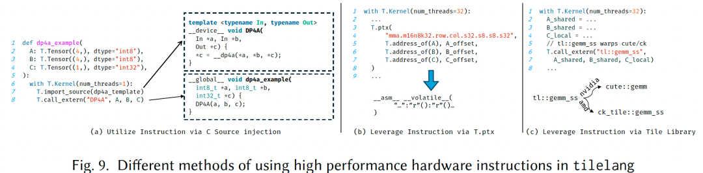

TileLang에서는 Figure 9처럼 hardware tensor instructions를 호출하는 두 가지 방법이 있다.

1. **C++ source injection** (Figure 9(a)): `T.import_source`와 `T.call_extern`을 통해 C++ templated instructions를 manual로 encapsulate하고 call한다.
2. **Inline PTX (`T.ptx`)** (Figure 9(b)): PTX assembly instructions를 Kernel 안에 직접 embed한다.

그러나 input shape와 data type에 따라 가장 적합한 instruction을 선택하는 것은 challenging할 수 있다. 이 process를 simplify하기 위해 TileLang은 Figure 9(c)처럼 **Tile Libraries**와의 integration도 support한다. NVIDIA의 `cute` 또는 AMD의 `composable kernel (ck)` 같은 tiled libraries는 high-level, standardized tile-based API, 예를 들어 `tl::gemm_ss`를 제공한다. 이러한 libraries는 hardware details를 abstract하고, low-level implementation이 주어진 input configuration에 대해 가장 effective한 instruction을 automatically select할 수 있게 한다. TileLang에서 developer는 `T.call_extern`을 사용해 these libraries를 direct하고 consistent한 방식으로 call할 수 있다.

요약하면 TileLang은 high-performance instructions를 활용하기 위한 두 가지 complementary methods를 제공한다. 첫 번째는 Tile-Lib을 활용하는 방식으로, integration을 simplify하고 vendor-optimized performance의 benefit을 얻는다. 하지만 high-level abstraction이 low-level control을 제한할 수 있다. 또한 template을 대량으로 사용하기 때문에 compilation이 매우 느려질 수 있다. 두 번째 method는 TileLang 내부에서 `T.gemm` 같은 operators를 통해 instruction logic을 직접 구현하는 것이다. 이는 layout annotation limitation을 피하고 compile time을 줄이지만, user가 각 target hardware instruction마다 TileLang 안에서 complete instruction set을 구현해야 한다. 현재 TileLang은 이 두 methods를 support하며, new hardware instructions를 빠르게 support하기 위해 default로 tiled-library-based method를 사용한다.

### 4.4 Software-defined pipeline

TileLang은 automated software pipeline inference mechanism을 채택하여 compute blocks 사이의 dependencies, 예를 들어 `Copy`와 `GEMM`을 analyze하고, correct execution order를 유지하면서 parallelism을 maximize하기 위한 structured pipeline schedule을 generate한다. 구체적으로 이 mechanism은 idle time을 줄이기 위해 `Copy` task를 다른 compute-intensive operations와 interleave하며, asynchronous processing opportunity가 detect되면 이를 available hardware resources에 automatically map하여 concurrent execute한다. 따라서 TileLang은 user에게 single `num_stages` interface만 expose하여 flow를 크게 simplify한다. 그러나 필요하다면 user가 order와 stage information을 explicit하게 제공하는 것도 허용한다.

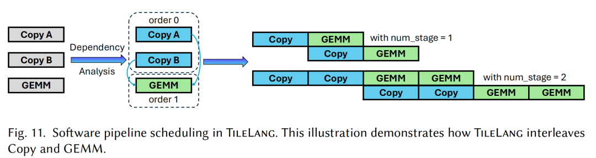

- **Ampere** architecture의 경우 TileLang은 `cp.async`를 사용하는 asynchronous memory copy operation을 support한다. TileLang은 loop structure를 analyze하고 eligible memory transfers에 `cp.async` instruction을 automatically insert하여 이 feature를 integrate한다.
- **Hopper** architecture에서는 두 가지 new features가 도입되었다. 하나는 global memory와 shared memory 사이의 data copy 전용 new TMA unit이고, 다른 하나는 PTX instruction set에 도입된 new `wgmma` instruction이다. 이는 four warps로 구성된 **warpgroup**이 matrix multiplication, 즉 MMA operation을 execute하여 TensorCore utilization을 높일 수 있게 한다. 또한 `wgmma.mma_async` instruction은 asynchronous다. Hopper architecture의 Kernel optimization은 보통 **Warp Specialization**을 사용하며, 여기서 threads는 producers와 consumers로 나뉜다. producer threads는 TMA로 data를 move하고, consumer threads는 computation을 담당한다. TileLang에서는 lowering process 중 Warp Specialization optimization이 automatically executed된다. 구체적으로 TileLang은 모든 statements의 buffer usage를 analyze하고, 그 roles, 즉 producer 또는 consumer를 determine한 뒤, `threadIdx`에 따라 different execution paths로 partition한다.
- **AMD CDNA** architecture에도 asynchronous copy instructions와 DMA support가 제공되며, TileLang은 HIP-encapsulated `Copy` primitive를 통해 이를 활용한다.

## 5. Numerical experiments

### 5.1 Test environment

**Hardware platforms**: experiment에는 세 가지 new GPU가 사용되었다.

- NVIDIA H100 (80 GB)
- NVIDIA A100 (80 GB)
- AMD Instinct MI300X (192 GB)

NVIDIA H100에는 CUDA 12.4를 사용했고, MI300X에는 ROCm 6.1.0을 사용했다. 모든 platforms는 Ubuntu 20.04에서 run되었다.

**Operator workloads**: large-scale deep learning pipeline에 자주 등장하는 일련의 operator workloads에서 TileLang을 evaluate했다.

- **NVIDIA H100**에서는 multi-head attention, 즉 MHA, Linear Attention, general matrix multiplication, 즉 GEMM에 focus했다.
- **NVIDIA A100**에서는 Dequantized GEMM Kernel의 performance를 측정했다.
- **AMD Instinct MI300X**에서는 GEMM과 MHA를 benchmark하여 서로 다른 GPU architectures를 across하는 representative use cases를 capture했다.

**Baselines**: TileLang의 performance를 evaluate하기 위해 machine learning과 GPU programming에서 널리 사용되는 several state-of-the-art baselines와 compare했다.

- **FlashAttention-3**: multi-head attention에 optimize되어 있으며, `tma`와 `wgmma.mma_async` 같은 CUDA instructions를 사용한다.
- **Triton**: efficient GPU Kernel을 위한 open-source framework로, Nvidia와 AMD GPU를 support하지만 manual optimization이 필요하다.
- **cuBLAS/rocBLAS**: NVIDIA와 AMD의 high-performance dense linear algebra libraries다.
- **PyTorch**: GEMM과 FlashAttention-2 같은 hand-written optimized Kernel을 갖고 있지만 fully optimized는 아니다.
- **BitsandBytes**: $W_{NF4}A_{FP16}$ 같은 formats를 support하기 위해 specifically designed되었으며 efficient Kernel을 제공한다.
- **Marlin**: $W_{INT4}A_{FP16}$ computation을 위한 highly optimized Kernel이다.

### 5.2 Experiments

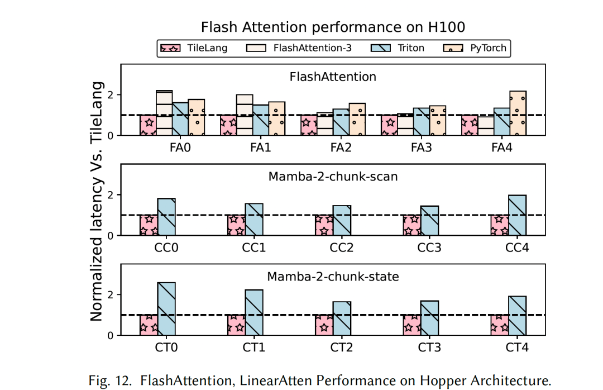

**Flash Attention performance (Figure 12)**: FlashAttention-3, Triton, PyTorch와 compare했을 때 TileLang은 각각 *1.36×*, *1.41×*, *1.70×* speedup을 얻었다. FlashAttention-3은 hand-crafted method라 changing workload size에 effectively adapt하지 못한다. 특히 fixed tile size 때문에 smaller sequence length에서 performance가 좋지 않다. longer sequence length, 예를 들어 8k에서는 TileLang performance가 여전히 FlashAttention-3에 가깝다. PyTorch는 hand-written FlashAttention-2 Kernel을 사용하므로 performance가 FlashAttention-3보다 낮다. 이러한 manual template 기반 implementations와 비교하면 TileLang은 `cp.async.bulk`, `wgmma.mma_async` 같은 instructions를 automatically leverage할 수 있고, Warp Specialization 같은 optimizations도 automatically apply할 수 있다. 주목할 점은 H100 GPU에서 TileLang이 FlashAttention-3가 사용하는 것만큼 complex한 pipeline scheduling scheme을 express할 수 있다는 것이다.

**Linear Attention performance (Figure 12)**: linear attention experiment에서는 Mamba-2의 `chunk-scan`과 `chunk-state` functions를 사용했다. Triton과 비교하면 TileLang은 평균 *1.77×* 및 *2.10×* speedup을 얻었다.

**MLA performance (Figure 14)**: Figure 14는 MLA의 performance와 corresponding Kernel implementation의 lines of code, 즉 LOC를 보여준다.

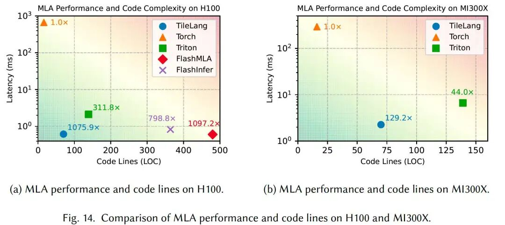

- **H100**에서 TileLang은 Torch 대비 **1075.9×** speedup을 얻었고, Triton과 FlashInfer보다 significantly 우수했으며, hand-written optimized FlashMLA implementation performance의 **98%**에 도달했다. 또한 TileLang은 약 **70 lines**의 Python code만 필요하여 다른 baselines보다 훨씬 좋은 usability를 보여준다.
- **MI300X**에서 TileLang은 Torch 대비 **129.2×** speedup을 얻었고, performance와 code compactness 모두에서 Triton을 surpass했다. hand-written library AITER와 비교하면 TileLang은 그 performance의 **95%**에 도달했다.

**Matmul performance (Figure 13)**: Figure 13은 NVIDIA와 AMD GPU의 GEMM workload performance를 보여준다.

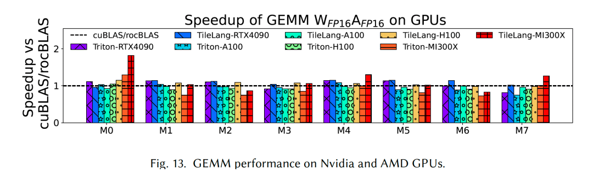

- RTX 4090, A100, H100, MI300X에서 TileLang은 vendor-optimized libraries, 즉 cuBLAS/rocBLAS 대비 각각 *1.10×, 0.97×, 1.00×, 1.04×* speedup ratio를 얻었다.
- Triton과 비교하면 TileLang은 같은 GPU들에서 각각 *1.08×, 1.03×, 1.13×, 1.25×* speedup을 delivered했다.
- matrix multiplication의 경우 TileLang은 simple syntax만으로 vendor-optimized libraries와 comparable한 performance에 도달했다.

**Dequantize Matmul performance (Figure 15)**: BitBLAS는 mixed precision computation을 위한 high-performance library다. 그 backend를 TileLang으로 replace했다.

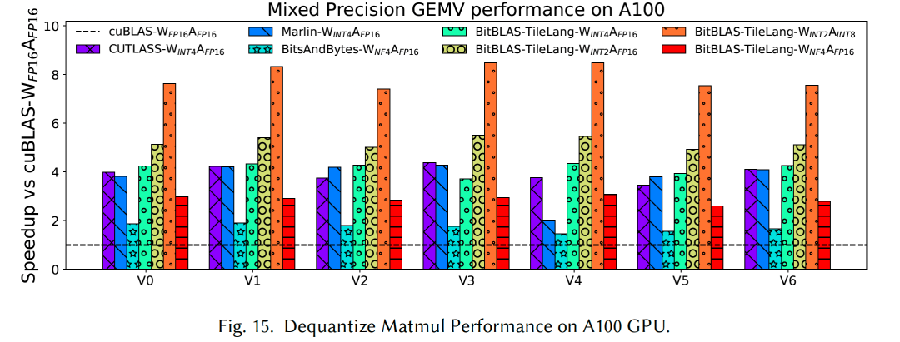

## 6. 가장 낮은 비용으로 B card에서 Tilelang 개발을 배우는 방법

물론 합법적인 국내 channel로 B200/B300 같은 Blackwell architecture card를 사용하기는 아직 쉽지 않다. 하지만 Jetson Thor 같은 automotive chip을 활용해 B card 관련 experiment를 하고 Blackwell SM architecture를 이해하는 데에는 방해가 되지 않는다. `tilelang==0.1.6.post1`은 Blackwell을 support하지 않으므로 official document "Tilelang Installation Guide"[3]를 참고해 install할 수 있다.

다만 주의할 점은 Thor가 CUDA 12.9에서는 `sm_101`로 불리지만, 몇 가지 좋지 않은 일 때문에 CUDA 13.0부터는 `sm_110`으로 바뀌었다는 것이다. source에서 compile하여 install하는 방법은 다음과 같다.

```c++
cd /opt
git clone --recursive https://github.com/tile-ai/tilelang
cd tilelang
```

Thor를 위해 약간 수정한다.

```c++
zartbot@zartbot-thor:/opt/tilelang$ git diff
diff --git a/src/target/utils.cc b/src/target/utils.cc
index 06ff20f..ca4f857 100644
--- a/src/target/utils.cc
+++ b/src/target/utils.cc
@@ -57,7 +57,7 @@ bool TargetIsSm100(Target target) {
   if (!TargetIsCuda(target))
     return false;
   int arch = GetArchInt(target);
-  return arch >= 100 & arch <= 103;
+  return arch >= 100 & arch <= 110;
 }

 bool TargetIsSM120(Target target) {
```

그다음 compile한다.

```c++
mkdir build
cp 3rdparty/tvm/cmake/config.cmake build
cd build
# echo "set(USE_LLVM ON)"  # set USE_LLVM to ON if using LLVM
echo "set(USE_CUDA ON)" >> config.cmake
# or echo "set(USE_ROCM ON)" >> config.cmake to enable ROCm runtime
cmake..
make -j 10
```

마지막으로 `~/.bashrc`에 추가한다.

```c++
export PYTHONPATH=/opt/tilelang/:$PYTHONPATH
```

environment를 verify한다.

```c++
zartbot@zartbot-thor:/opt/tilelang$ source ~/.bashrc
zartbot@zartbot-thor:/opt/tilelang$ python -c "import tilelang; print(tilelang.__version__)"
0.1.6.post1+a35ac496
```

마지막으로 simple test를 하나 수행한다.

```python
import tilelang
import tilelang.language as T

def matmul(M, N, K, block_M, block_N, block_K, dtype="float16", accum_dtype="float"):
    @T.prim_func
    def main(
        A: T.Buffer((M, K), dtype),
        B: T.Buffer((K, N), dtype),
        C: T.Buffer((M, N), dtype),
    ):
        with T.Kernel(T.ceildiv(N, block_N), T.ceildiv(M, block_M), threads=128) as (bx, by):
            A_shared = T.alloc_shared((block_M, block_K), dtype)
            B_shared = T.alloc_shared((block_K, block_N), dtype)
            C_local = T.alloc_fragment((block_M, block_N), accum_dtype)

            T.clear(C_local)

            for ko in T.Pipelined(T.ceildiv(K, block_K), num_stages=3):
                T.copy(A[by * block_M, ko * block_K], A_shared)

                for k, j in T.Parallel(block_K, block_N):
                    B_shared[k, j] = B[ko * block_K + k, bx * block_N + j]

                T.gemm(A_shared, B_shared, C_local)

            T.copy(C_local, C[by * block_M, bx * block_N])

    return main

func = matmul(1024, 1024, 1024, 128, 128, 32)
jit_kernel = tilelang.compile(func, out_idx=[2], target="cuda")

import torch
a = torch.randn(1024, 1024, device="cuda", dtype=torch.float16)
b = torch.randn(1024, 1024, device="cuda", dtype=torch.float16)
c = jit_kernel(a, b)

ref_c = a @ b
torch.testing.assert_close(c, ref_c, rtol=1e-2, atol=1e-2)
print("Kernel output matches PyTorch reference.")

cuda_source = jit_kernel.get_kernel_source()
print("Generated CUDA kernel:\n", cuda_source)

profiler = jit_kernel.get_profiler()
latency = profiler.do_bench()
print(f"Latency: {latency} ms")
```

test output:

```c++
zartbot@zartbot-thor:~$ python3 foo.py
Kernel output matches PyTorch reference.
Generated CUDA kernel:
#include <tl_templates/cuda/gemm.h>
#include <tl_templates/cuda/copy.h>
#include <tl_templates/cuda/reduce.h>
#include <tl_templates/cuda/ldsm.h>
#include <tl_templates/cuda/threadblock_swizzle.h>
#include <tl_templates/cuda/debug.h>
#ifdef ENABLE_BF16
#include <tl_templates/cuda/cuda_bf16_fallbacks.cuh>
#endif

extern "C" __global__ void main_kernel(__grid_constant__ const CUtensorMap A_desc, half_t* __restrict__ B, half_t* __restrict__ C);
extern "C" __global__ void __launch_bounds__(256, 1) main_kernel(__grid_constant__ const CUtensorMap A_desc, half_t* __restrict__ B, half_t* __restrict__ C) {
  extern __shared__ __align__(1024) uchar buf_dyn_shmem[];
  float C_local[128];
  __shared__ uint64_t mbarrier_mem[6];
  auto mbarrier = reinterpret_cast<Barrier*>(mbarrier_mem);
if (tl::tl_shuffle_elect<0>()) {
    tl::prefetch_tma_descriptor(A_desc);
    mbarrier[0].init(128);
    mbarrier[1].init(128);
    mbarrier[2].init(128);
    mbarrier[3].init(128);
    mbarrier[4].init(128);
    mbarrier[5].init(128);
  }
  __syncthreads();
if (128 <= ((int)threadIdx.x)) {
    tl::warpgroup_reg_dealloc<24>();
    for (int ko = 0; ko < 32; ++ko) {
      mbarrier[((ko % 3) + 3)].wait((((ko % 6) / 3) ^ 1));
      if (tl::tl_shuffle_elect<128>()) {
        mbarrier[(ko % 3)].expect_transaction(8192);
        tl::tma_load(A_desc, mbarrier[(ko % 3)], (&(((half_t*)buf_dyn_shmem)[((ko % 3) * 4096)])), (ko * 32), (((int)blockIdx.y) * 128));
      }
      #pragma unroll
      for (int i = 0; i < 2; ++i) {
        for (int vec = 0; vec < 2; ++vec) {
          *(uint4*)(((half_t*)buf_dyn_shmem) + (((((((((ko % 3) * 4096) + (((((int)threadIdx.x) & 7) >> 2) * 2048)) + (i * 1024)) + ((((int)threadIdx.x) >> 3) * 64)) + (((((((int)threadIdx.x) & 63) >> 5) + ((((int)threadIdx.x) & 3) >> 1)) & 1) * 32)) + (((((((int)threadIdx.x) & 31) >> 4) + (((int)threadIdx.x) & 1)) & 1) * 16)) + (((((((int)threadIdx.x) & 15) >> 3) + vec) & 1) * 8)) + 11264)) = *(uint4*)(B + (((((((ko * 32768) + (i * 16384)) + ((((int)threadIdx.x) >> 3) * 1024)) + (((int)blockIdx.x) * 128)) + ((((int)threadIdx.x) & 7) * 16)) + (vec * 8)) - 16384));
        }
      }
      tl::fence_proxy_async();
      tl::mbarrier_cp_async_arrive(mbarrier[(ko % 3)]);
      mbarrier[(ko % 3)].arrive();
    }
  } else {
    tl::warpgroup_reg_alloc<240>();
    #pragma unroll
    for (int i_1 = 0; i_1 < 64; ++i_1) {
      *(float2*)(C_local + (i_1 * 2)) = make_float2(0x0p+0f/*0.000000e+00*/, 0x0p+0f/*0.000000e+00*/);
    }
    tl::fence_proxy_async();
    for (int ko_1 = 0; ko_1 < 32; ++ko_1) {
      mbarrier[(ko_1 % 3)].wait(((ko_1 % 6) / 3));
      tl::gemm_ss<128, 128, 32, 2, 2, 0, 0, 0, 32, 128, 0, 0>((&(((half_t*)buf_dyn_shmem)[((ko_1 % 3) * 4096)])), (&(((half_t*)buf_dyn_shmem)[(((ko_1 % 3) * 4096) + 12288)])), (&(C_local[0])));
      mbarrier[((ko_1 % 3) + 3)].arrive();
    }
    #pragma unroll
    for (int i_2 = 0; i_2 < 64; ++i_2) {
      uint1 __1;
      float2 v_ = *(float2*)(C_local + (i_2 * 2));
      ((half2*)(&(__1.x)))->x = (half_t)(v_.x);
      ((half2*)(&(__1.x)))->y = (half_t)(v_.y);
      *(uint1*)(C + (((((((((((int)blockIdx.y) * 131072) + (((i_2 & 7) >> 1) * 32768)) + (((((int)threadIdx.x) & 63) >> 5) * 16384)) + ((i_2 & 1) * 8192)) + (((((int)threadIdx.x) & 31) >> 2) * 1024)) + (((int)blockIdx.x) * 128)) + ((i_2 >> 3) * 16)) + ((((int)threadIdx.x) >> 6) * 8)) + ((((int)threadIdx.x) & 3) * 2))) = __1;
    }
  }
}


#define ERROR_BUF_SIZE 1024
static char error_buf[ERROR_BUF_SIZE];

extern "C" const char* get_last_error() {
    return error_buf;
}

extern "C" int init() {
    error_buf[0] = '\0';

    cudaError_t result_main_kernel = cudaFuncSetAttribute(main_kernel, cudaFuncAttributeMaxDynamicSharedMemorySize, 49152);
    if (result_main_kernel != CUDA_SUCCESS) {
        snprintf(error_buf, ERROR_BUF_SIZE, "Failed to set the allowed dynamic shared memory size to %d with error: %s", 49152, cudaGetErrorString(result_main_kernel));
        return-1;
    }

    return0;
}

extern "C" int call(half_t* __restrict__ A, half_t* __restrict__ B, half_t* __restrict__ C, cudaStream_t stream=cudaStreamDefault) {

 CUtensorMap A_desc;
 CUtensorMapDataType A_desc_type= (CUtensorMapDataType)6;
 cuuint32_t A_desc_tensorRank= 2;
 void *A_desc_globalAddress= A;
 cuuint64_t A_desc_globalDim[2]= {1024,1024};
 cuuint64_t A_desc_globalStride[2]= {2,2048};
 cuuint32_t A_desc_boxDim[2]= {32,128};
 cuuint32_t A_desc_elementStrides[2]= {1,1};
 CUtensorMapInterleave A_desc_interleave= (CUtensorMapInterleave)0;
 CUtensorMapSwizzle A_desc_swizzle= (CUtensorMapSwizzle)2;
 CUtensorMapL2promotion A_desc_l2Promotion= (CUtensorMapL2promotion)2;
 CUtensorMapFloatOOBfill A_desc_oobFill= (CUtensorMapFloatOOBfill)0;

 CUresult A_desc_result = CUTLASS_CUDA_DRIVER_WRAPPER_CALL(cuTensorMapEncodeTiled)(
    &A_desc, A_desc_type, A_desc_tensorRank, A_desc_globalAddress, A_desc_globalDim, A_desc_globalStride + 1, A_desc_boxDim, A_desc_elementStrides, A_desc_interleave, A_desc_swizzle, A_desc_l2Promotion, A_desc_oobFill);

if (A_desc_result != CUDA_SUCCESS) {
  std::stringstream ss;
  ss << "Error: Failed to initialize the TMA descriptor A_desc";
  snprintf(error_buf, ERROR_BUF_SIZE, "%s", ss.str().c_str());
return-1;
 }
 main_kernel<<<dim3(8, 8, 1), dim3(256, 1, 1), 49152, stream>>>(A_desc, B, C);
 TILELANG_CHECK_LAST_ERROR("main_kernel");

return0;
}

Latency: 0.1454080045223236 ms
```

참고 자료

[1]

TileLang: 80줄 Python kernel code로 FlashMLA 95% 성능 구현: *https://zhuanlan.zhihu.com/p/27965825936*

[2]

TileLang: A Composable Tiled Programming Model for AI Systems: *https://arxiv.org/abs/2504.17577*

[3]

Tilelang Installation Guide: *https://tilelang.com/get\_started/Installation.html*
