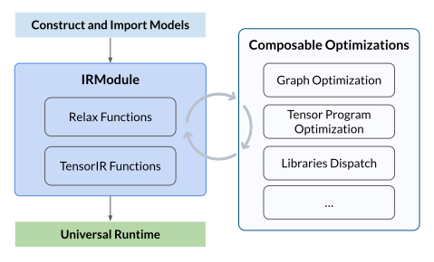
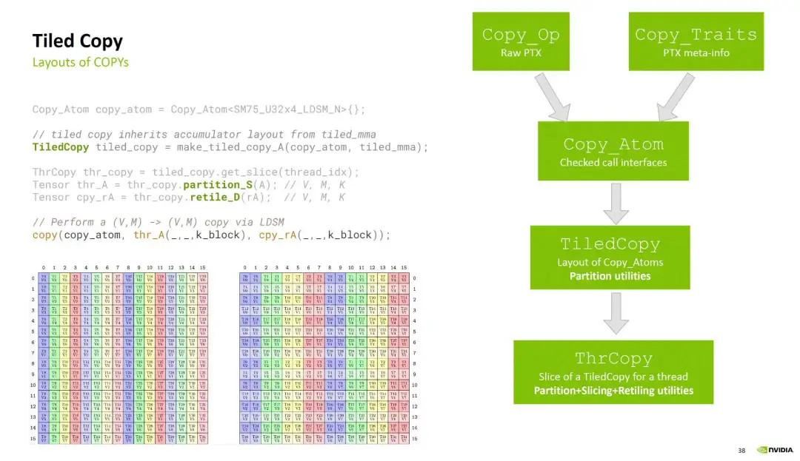
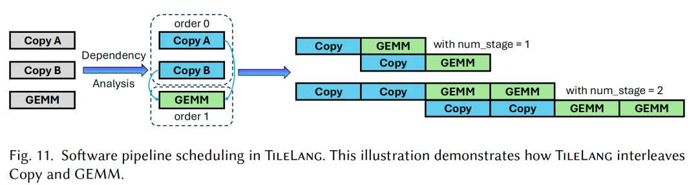
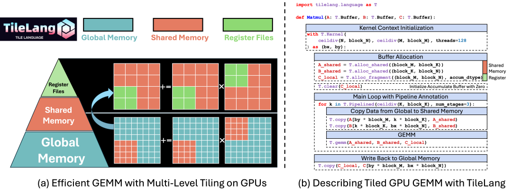

# Tensor-021 Tilelang-2: 기본 조작

- 원문 제목: Tilelang-2: 기본 조작
- 저자: Tilebot
- 계정: zartbot
- 발행일: 2025년 10월 12일 16:56

## 1. TVM에서 TileLang으로

Tilelang의 몇 가지 기본 조작을 이야기하기 전에, TVM의 evolution을 한번 되짚어 볼 필요가 있다. 이 맥락을 따라 TileLang을 설명해 보자.

### 1.1 TVM overview

오래전 Cisco에서 network device의 Telemetry data analysis와 neural network 기반 inference를 할 때, training으로 얻은 model은 TensorFlow에서 export한 model이었다. inference는 보통 ARM/Xeon-D 같은 embedded platform의 CPU나 Jetson Nano의 GPU에서 동시에 이루어졌다. 그래서 남들이 하는 방식을 따라 아주 짧은 기간 TVM을 만져 본 적이 있다.

TVM은 바로 hardware와 framework fragmentation 문제를 해결하기 위한 것이다.

- **frontend framework 다양성**: PyTorch, TensorFlow, ONNX, JAX...
- **backend hardware 다양성**:

- **general-purpose processors**: Intel/AMD CPU, ARM CPU
- **graphics processors**: NVIDIA GPU, AMD GPU
- **specialized accelerators**: Google TPU, Huawei Ascend, FPGA 및 여러 AI chips.

TVM이 없다면 model deployment는 N x M의 complex problem이 된다. 각 framework가 각 hardware를 위해 dedicated하고 highly optimized된 codebase를 작성해야 하며, 이는 cost가 매우 높고 maintain하기도 어렵다.

TVM은 Halide의 Compute-schedule decoupling idea를 참고했다. 보통 operator 하나는 tensor computation expression, 즉 Tensor Expression, TE를 define하고, 그다음 Schedule을 define해야 한다. Tensor Expression은 pure declarative DSL이며, 전체 description은 mathematical formula에 가깝다.

```c++
A = tvm.te.placeholder((n_val,), name="A")
B = tvm.te.placeholder((n_val,), name="B")
C = tvm.te.compute((n_val,), lambda i: A[i] + B[i], name="C")

# PrimFunc 생성
fadd_pf = te.create_prim_func([A, B, C])
mod = tvm.IRModule({"vector_add": fadd_pf})
```

반면 schedule은 imperative primitive이며, compiler가 이 computation을 어떻게 optimize하고 execute할지 guide하는 데 사용된다. 예를 들어 `s.split()`, `s.reorder()`, `s.bind()` 등을 사용한다. 아래는 예시다.

```c++
s = te.create_schedule(C.op)
# a. block의 loop를 가져온다.
(i,) = C.op.axis

# 각 GPU Block 안의 Thread 수를 define한다.
num_threads = 256

# a. loop i를 두 parts로 split한다. outer loop block_idx와 inner loop thread_idx다.
block_idx, thread_idx = s[C].split(i, factor=num_threads)

# b. loop를 GPU thread에 bind한다.
s[C].bind(block_idx, te.thread_axis("blockIdx.x"))
s[C].bind(thread_idx, te.thread_axis("threadIdx.x"))
```

한편 operator 하나, 예를 들어 matrix multiplication에는 수천수만 가지 implementation 방식이 있다. loop order, tile size 등이 모두 다르다. optimal scheme을 manual로 선택하는 것은 거의 불가능하다. TVM은 Auto-Tuning 방식으로 specific model과 specific hardware에 대한 "optimal solution"을 automatically 찾는다.

하지만 model이 점점 complex해지면서 TE의 expressiveness에 문제가 생겼다. 또 GPU architecture가 점점 complex해지고 asynchronous memory access 같은 capabilities가 도입되면서, Schedule로 SMEM을 precise하게 programming control하기 어려워졌다. TensorCore 도입도 많은 complexity를 가져왔다. 이후 TVM은 Tensor IR로 evolution했다.

Tensor Expression, TE는 **declarative** language다. mathematical formula를 쓰듯 **computation itself**만 describe하면 되고, how to compute에는 신경 쓸 필요가 없다. TensorIR은 **imperative**이고 **programmable**한 IR이다. 이는 different memory levels, 즉 GMEM/SMEM/Local 안에서의 data movement를 더 잘 define할 수 있고, TensorCore instructions에도 더 잘 mapping할 수 있으며, automatic optimization의 foundation을 마련한다.

한편 high-level graph optimization을 위해 Relax도 도입되었고, TensorIR과 함께 IRModule을 구성한다.



IRModule은 TVM 전체에서 사용되는 main data structure다.

- `tir::PrimFunc`는 low-level program representation으로, loop nest selection, multi-dimensional load/store, thread 및 vector/tensor instructions를 포함하며, 보통 operator program을 represent하는 데 사용된다.
- `relax::Function`은 상대적으로 high-level program representation이며, 보통 end-to-end model에 대응할 수 있다. 이는 Dataflow Graph를 represent할 수도 있고, programming language처럼 if/else와 loop를 쉽게 express할 수도 있다.

아래는 TIR+Relax 예시다.

```python
from tvm.script import ir as I
from tvm.script import tir as T
from tvm.script import relax as R

@I.ir_module
class RelaxModuleWithTIR:
    @T.prim_func
    def relu(x: T.handle, y: T.handle):
        n, m = T.int64(), T.int64()
        X = T.match_buffer(x, (n, m), "float32")
        Y = T.match_buffer(y, (n, m), "float32")
        for i, j in T.grid(n, m):
            with T.block("relu"):
                vi, vj = T.axis.remap("SS", [i, j])
                Y[vi, vj] = T.max(X[vi, vj], T.float32(0))

    @R.function
    def forward(
        data: R.Tensor(("n", 784), dtype="float32"),
        w0: R.Tensor((128, 784), dtype="float32"),
        b0: R.Tensor((128,), dtype="float32"),
        w1: R.Tensor((10, 128), dtype="float32"),
        b1: R.Tensor((10,), dtype="float32"),
    ) -> R.Tensor(("n", 10), dtype="float32"):
        n = T.int64()
        cls = RelaxModuleWithTIR
        with R.dataflow():
            lv0 = R.matmul(data, R.permute_dims(w0)) + b0
            lv1 = R.call_tir(cls.relu, lv0, R.Tensor((n, 128), dtype="float32"))
            lv2 = R.matmul(lv1, R.permute_dims(w1)) + b1
            R.output(lv2)
        return lv2
```

### 1.2 TileLang

이름 그대로, TVM TensorIR/Relax가 element와 loop를 중심으로 한다면 TileLang은 operation 시의 Tile을 중심으로 build된 DSL이다. program의 basic operation unit은 더 이상 `A[i, j]`가 아니라 data block, 즉 Tile이다. 예를 들어 `A[block_row, block_col]`이다. 동시에 computation과 memory Layout abstraction을 separate하고 Layout Inference mechanism을 사용한다. logical block 위에서 compute하기만 하면 되며, TensorCore 같은 dedicated hardware를 대상으로 한 tensorize와 software pipeline으로 data movement와 computation을 overlap하여 latency를 hide하는 것도 더 쉬워진다. 자세한 소개는 앞 글을 참고하면 된다.

[Tilelang-1: Introduction](https://mp.weixin.qq.com/s?__biz=MzUxNzQ5MTExNw==&mid=2247496243&idx=1&sn=a5c8beb7e4872d13b9b2f495bacc2be1&scene=21#wechat_redirect)

Tile-Based abstraction 측면에서는 Nvidia의 Cypress paper와도 사실상 같은 방향이다.

["CUDA-Next: task-based tensor computation DSL?"](https://mp.weixin.qq.com/s?__biz=MzUxNzQ5MTExNw==&mid=2247494047&idx=1&sn=0fe4f9dbfc473692c733145385740c33&scene=21#wechat_redirect)

## 2. TileLang 기본 조작

### 2.1 기본 구조

기본적인 TileLang program은 다음과 같다.

```python
import torch

import tilelang
import tilelang.language as T

@tilelang.jit(
  out_idx=[2],  # function의 세 번째, 0부터 시작하는 formal parameter를 의미한다. 즉 Buffer C가 output이다. 또한 out_idx=[-1]로 마지막 parameter가 output임을 나타내는 것도 지원한다.
  target="cuda" # Nvidia GPU에서 compile하고 run한다는 뜻이다. hip, cpu 등도 선택할 수 있다.
  )
def foo(
        M,
        N,
        K,
        BLOCK_N = 32,
        dtype="float16",
        accum_type = "float",
):
    @T.prim_func
    def main (
        A: T.Tensor((M, K), dtype),
        B: T.Tensor((K,N), dtype),
        C: T.Tensor((M, N), accum_type)
    ):
        with T.Kernel(2, T.ceildiv(N,BLOCK_N), threads=(16,4,2)) as (bm, bn):
            tidx = T.get_thread_binding(0)
            bidy = T.get_block_binding(1)
            if (tidx < bidy) and (bn == 1)  :
                T.print(tidx,"cond 1")
            else:
                T.print(bn, "cond 2")
    return main

M= 64
N= 64
K= 64

func = foo(M,N,K) # PyTorch에서 호출할 수 있는 function으로 instantiate한다.
cuda_source = func.get_kernel_source()
print("Generated CUDA kernel:\n", cuda_source) # generated CUDA source code를 출력한다.

a = torch.randn((M,K), device="cuda", dtype=torch.float16)
b = torch.randn((K,N), device="cuda", dtype=torch.float16)
c = torch.zeros((M,N) ,device="cuda", dtype=torch.float)

c = func(a,b) # execute
```

`with T.Kernel(2, T.ceildiv(N,BLOCK_N), threads=(16,4,2)) as (bm, bn):` 안에서 전체 context가 initialize된다는 점에 주의하자. `threads` 앞의 parameters는 사용할 block dimensions를 define하며, CUDA의 `grid = dim3(x, y, z)`와 equivalent하다. 또한 `threads`도 multi-dimensional로 define하여 block의 multiple dims를 describe할 수 있다.

program 안에서는 `T.get_thread_binding`을 사용해 thread에 corresponding하는 index를 얻을 수 있다. 그 안에서 loop, branch judgment, print 등의 functions도 execute할 수 있다. generated CUDA source는 다음과 같다.

```c++
#include <tl_templates/cuda/gemm.h>
#include <tl_templates/cuda/copy.h>
#include <tl_templates/cuda/reduce.h>
#include <tl_templates/cuda/ldsm.h>
#include <tl_templates/cuda/threadblock_swizzle.h>
#include <tl_templates/cuda/debug.h>
#ifdef ENABLE_BF16
#include <tl_templates/cuda/cuda_bf16_fallbacks.cuh>
#endif

extern "C" __global__ void main_kernel();
extern "C" __global__ void __launch_bounds__(128, 1) main_kernel() {
  if ((((int)threadIdx.x) < ((int)blockIdx.y)) && (((int)blockIdx.y) == 1)) {
    debug_print_var("cond 1", ((int)threadIdx.x));
  } else {
    debug_print_var("cond 2", ((int)blockIdx.y));
  }
}


#define ERROR_BUF_SIZE 1024
static char error_buf[ERROR_BUF_SIZE];

extern "C" const char* get_last_error() {
    return error_buf;
}

extern "C" int init() {
    error_buf[0] = '\0';

    return 0;
}

extern "C" int call(half_t* __restrict__ A, half_t* __restrict__ B, float* __restrict__ C, cudaStream_t stream=cudaStreamDefault) {
 main_kernel<<<dim3(2, 2, 1), dim3(16, 4, 2), 0, stream>>>();
 TILELANG_CHECK_LAST_ERROR("main_kernel");

 return 0;
}
# program run output은 다음과 같다.
msg='cond 1' BlockIdx=(0, 1, 0), ThreadIdx=(0, 1, 1): dtype=int value=0
msg='cond 1' BlockIdx=(0, 1, 0), ThreadIdx=(0, 2, 0): dtype=int value=0
msg='cond 1' BlockIdx=(0, 1, 0), ThreadIdx=(0, 3, 0): dtype=int value=0
msg='cond 2' BlockIdx=(0, 0, 0), ThreadIdx=(0, 2, 1): dtype=int value=0
msg='cond 2' BlockIdx=(0, 0, 0), ThreadIdx=(1, 2, 1): dtype=int value=0
msg='cond 2' BlockIdx=(0, 0, 0), ThreadIdx=(2, 2, 1): dtype=int value=0
msg='cond 2' BlockIdx=(0, 0, 0), ThreadIdx=(3, 2, 1): dtype=int value=0
```

### 2.2 Memory management

modern GPU는 RF, SMEM, TMEM, GMEM 같은 multiple hierarchical memory structures를 가진다. 아래 figure와 같다.


이 memory들은 modern GPU programming에서 performance에 영향을 주는 key factors가 된다. 여러 세대의 GPU architecture evolution에서 LDMATRIX부터 cp.async, TMA까지 도입되었고, Blackwell에서는 Tensor Memory도 새로 도입되었다. Tensor Memory 자체의 data access에도 몇 가지 constraints가 있다. 이러한 hardware architecture 변화로 인해 전체 data path의 complexity가 최근 몇 년 동안 매우 빠르게 증가했다.

Tilelang에는 다음과 같은 allocate 방식이 있다.

- **alloc\_shared**: SMEM allocation에 사용된다.
- **alloc\_local**: RMEM allocation에 사용된다.
- **alloc\_fragment**: 역시 RMEM allocation에 사용된다. TileLang은 compilation 중 layout inference process를 사용해 layout object `T.Fragment`를 derive하며, 이 object는 각 thread에 corresponding register file을 어떻게 allocate할지 결정한다.
- **alloc\_var**: single variable allocation에 사용된다.
- **alloc\_tmem**: Blackwell의 Tensor Memory allocation에 사용된다.
- **alloc\_barrier**: `arrive_count` barrier allocation에 사용된다.
- **alloc\_reducer**: matrix operation의 reduce operation에 대해 reduce operation buffer를 allocate한다.
- **alloc\_descriptor**: wgmma 또는 utcmma descriptor에 사용된다.

그다음 Tilelang은 `T.copy`를 통해 이러한 memory를 operate한다. overall로 보면 Cutlass의 Tiled Copy와 유사하다.



TileLang도 similar encapsulation을 수행하며, different platform에 따라 호출할 수 있다. 예를 들어 Hopper/Blackwell 같은 platform에서는 TMA를 호출해 memory copy를 수행하기도 한다. PassConfig로 일부 feature를 끌 수도 있다. 예를 들어 Hopper에서 TMA를 사용하고 싶지 않다면 다음과 같이 할 수 있다.

```c++
@tilelang.jit(
  pass_configs={
    tilelang.PassConfigKey.TL_DISABLE_TMA_LOWER: True,
  },
  out_idx=[2],
)
def gemv(M, N, block_M=16, block_N=256):
  @T.prim_func
  def main(
    A: T.Tensor((M, N), "float32"),
    B: T.Tensor((M,N), "float32"),
    C: T.Tensor((M,N), "float32")
    ):
    with T.Kernel(T.ceildiv(M, block_M),threads=32) as im:
        a_smem = T.alloc_shared((block_M, block_N), "float32")
        # copy from GMEM to SMEM
        T.copy(A[im * block_M, block_N], a_smem)

        a_local = T.alloc_local((block_M, block_N), "float32")
        # copy from SMEM to RMEM
        T.copy(a_smem, a_local)

        a_frag = T.alloc_fragment((block_M, block_N), "float32")
        T.copy(a_smem, a_frag)

  return main

M,N = 1024,1024
func = gemv(M, N)

cuda_source = func.get_kernel_source()
print("Generated CUDA kernel:\n", cuda_source)
```

이때 generated code는 다음과 같다. TMA를 끄면 vectorized float4를 사용해 load한다. 여기서 `alloc_local`과 `alloc_fragment`의 차이도 볼 수 있다. `alloc_local`은 Tile size에 따라 전체 buffer, 즉 16x256=4096을 allocate하지만, fragment는 Layout inference에 따라 이 Tile을 block 안의 multiple threads에 distribute하여 각 thread가 그중 small block 하나를 담당하게 한다.

```c++
extern "C" __global__ void __launch_bounds__(32, 1) main_kernel(float* __restrict__ A) {
  extern __shared__ __align__(1024) float a_smem[];
  float a_local[4096];
  float a_frag[128];
  #pragma unroll
  for (int i = 0; i < 32; ++i) {
    *(float4*)(a_smem + ((i * 128) + (((int)threadIdx.x) * 4))) = *(float4*)(A + (((((((int)blockIdx.x) * 16384) + ((i >> 1) * 1024)) + ((i & 1) * 128)) + (((int)threadIdx.x) * 4)) + 256));
  }
  __syncthreads();
  #pragma unroll
  for (int i_1 = 0; i_1 < 32; ++i_1) {
    *(float4*)(a_local + ((i_1 * 128) + (((int)threadIdx.x) * 4))) = *(float4*)(a_smem + ((i_1 * 128) + (((int)threadIdx.x) * 4)));
  }
  #pragma unroll
  for (int i_2 = 0; i_2 < 32; ++i_2) {
    *(float4*)(a_frag + (i_2 * 4)) = *(float4*)(a_smem + ((i_2 * 128) + (((int)threadIdx.x) * 4)));
  }
}
```

PassConfig의 `TL_DISABLE_TMA_LOWER`를 False로 set하면 TMA load를 호출하며, generated code는 다음과 같다.

```c++
extern "C" __global__ void __launch_bounds__(160, 1) main_kernel(__grid_constant__ const CUtensorMap A_desc) {
  extern __shared__ __align__(1024) float a_smem[];
  float a_local[4096];
  float a_frag[128];
  __shared__ uint64_t mbarrier_mem[1];
  auto mbarrier = reinterpret_cast<Barrier*>(mbarrier_mem);
  if (tl::tl_shuffle_elect<0>()) {
    tl::prefetch_tma_descriptor(A_desc);
    mbarrier[0].init(1);
  }
  __syncthreads();
  if (32 <= ((int)threadIdx.x)) {
    tl::warpgroup_reg_dealloc<24>();
    if (tl::tl_shuffle_elect<128>()) {
      mbarrier[0].arrive_and_expect_tx(16384);
      tl::tma_load(A_desc, mbarrier[0], (&(a_smem[0])), 256, (((int)blockIdx.x) * 16));
    }
  } else {
    tl::warpgroup_reg_alloc<240>();
    mbarrier[0].wait(0);
    #pragma unroll
    for (int i = 0; i < 32; ++i) {
      *(float4*)(a_local + ((i * 128) + (((int)threadIdx.x) * 4))) = *(float4*)(a_smem + ((i * 128) + (((int)threadIdx.x) * 4)));
    }
    #pragma unroll
    for (int i_1 = 0; i_1 < 32; ++i_1) {
      *(float4*)(a_frag + (i_1 * 4)) = *(float4*)(a_smem + ((i_1 * 128) + (((int)threadIdx.x) * 4)));
    }
  }
}
```

또 reduce buffer 사용을 조금 더 소개하자. ["Tensor-102: GEMV"](https://mp.weixin.qq.com/s?__biz=MzUxNzQ5MTExNw==&mid=2247496294&idx=1&sn=08a1c463d92fc0ebbdc0de6cf57d5b91&scene=21#wechat_redirect)에서 보듯, computation 중 block-level reduction을 execute해야 한다. TileLang에서는 Reduce buffer를 통해 programming을 simplify할 수 있다.

```python
@tilelang.jit(
  out_idx=[2],
)
def gemv(M, N, block_M=16, block_N=32):
  @T.prim_func
  def main(
    a: T.Tensor((M, N), "float32"),
    x: T.Tensor(N, "float32"),
    o: T.Tensor(M, "float32")
    ):
    with T.Kernel(T.ceildiv(M, block_M)) as i0_m:
      # reduce buffer allocation
      o_reducer = T.alloc_reducer(block_M, "float32", replication="all")
      T.clear(o_reducer)
      for i0_n in T.Pipelined(T.ceildiv(N, block_N), num_stages=2):
        a_smem = T.alloc_shared((block_M, block_N), "float32")
        T.copy(a[i0_m * block_M, i0_n * block_N], a_smem)

        a_frag = T.alloc_fragment((block_M, block_N), "float32")
        T.copy(a_smem, a_frag)

        x_frag = T.alloc_fragment(block_N, "float32")
        T.copy(x[i0_n * block_N], x_frag)
        for i1_m, i1_n in T.Parallel(block_M, block_N):
          # Partial sum을 reduce buffer에 accumulate한다.
          o_reducer[i1_m] += a_frag[i1_m, i1_n] * x_frag[i1_n]
      # reduce operation을 execute한다.
      T.finalize_reducer(o_reducer)

      # reduce result를 output GMEM으로 copy한다.
      T.copy(o_reducer, o[i0_m * block_M])
  return main

M,N = 4096,4096
func = gemv(M, N)

cuda_source = func.get_kernel_source()
print("Generated CUDA kernel:\n", cuda_source)
```

### 2.3 Scheduling strategy

#### 2.3.1 T.Parallel

ElementWise Add를 예로 들자.

```python
@tilelang.jit(out_idx=[-1], target="cuda")
def elementwise_add(
    TileM,
    TileN,
    threads,
    M=4096,
    N=4096,
    in_dtype="float32",
    out_dtype="float32",

):
    @T.prim_func
    def main(
            A: T.Tensor((M, N), in_dtype),
            B: T.Tensor((M, N), in_dtype),
            C: T.Tensor((M, N), out_dtype),
    ):
        with T.Kernel(T.ceildiv(N, TileN), T.ceildiv(M, TileM), threads=threads) as (bx, by):
            start_x = bx * TileN
            start_y = by * TileM

            for (local_y, local_x) in T.Parallel(TileM, TileN):
                y = start_y + local_y
                x = start_x + local_x
                C[y, x] = A[y, x] + B[y, x]

    return main
```

`T.Kernel`에서 matrix를 tile로 나누고, thread block이 N과 M 두 dimensions에서 각각 갖는 TILE idx `bx`, `by`를 얻는다. 이는 automatically `blockIdx.x`와 `blockIdx.y`에 bind된다. 그다음은 `T.Parallel` syntactic sugar다. 이는 Tile의 M/N loops `local_y`/`local_x`가 parallel 가능함을 indicate하며, compiler도 thread count에 따라 automatically mapping하고 가능한 efficient parallel load와 computation을 generate한다. 또한 이런 For Loop에서는 일부 boundary case에 대해 `loop_break`를 수행할 수도 있다. 예를 들어:

```c++
for i in T.Parallel(block_M, block_N):
    row_idx = by * block_M + i
    col_idx = bx * block_N + j
    if row_idx >= M:
        T.loop_break()
    B[row_idx, col_idx] = A[row_idx, col_idx]
```

#### 2.3.2 T.Pipelined

그다음 key는 `T.Pipelined`다. 이는 더 high-level software pipeline encapsulation이다. 보통 software pipeline은 copy의 일부를 loop 밖으로 끌어내고, copy와 GEMM을 alternate하게 수행한 뒤 마지막 GEMM을 complete해야 한다.



아래 그림과 같다.



user는 stage 하나만 주면 된다. 그러면 code block의 Buffer usage에 대한 dependency analysis를 수행하고 Pipeline의 여러 properties를 automatically infer한다.

### 2.4 Operation 관련 Op

#### 2.4.1 T.gemm

`T.gemm`도 Tile-level matrix multiplication operator에 대한 encapsulation이며, different cards에 따라 different implementation을 호출할 수 있다. 예를 들어 Blackwell에서는 PTX를 manual로 작성해 `tcgen5mma`를 호출할 필요가 없다. TileLang으로 전체 computation을 매우 간단히 complete할 수 있다.

```python
def matmul(
    M,
    N,
    K,
    block_M,
    block_N,
    block_K,
    trans_A,
    trans_B,
    in_dtype,
    out_dtype,
    accum_dtype,
    num_stages,
    threads,
):
    A_shape = (K, M) if trans_A else (M, K)
    B_shape = (N, K) if trans_B else (K, N)
    A_shared_shape = (block_K, block_M) if trans_A else (block_M, block_K)
    B_shared_shape = (block_N, block_K) if trans_B else (block_K, block_N)

    @T.prim_func
    def main(
            A: T.Tensor(A_shape, in_dtype),
            B: T.Tensor(B_shape, in_dtype),
            C: T.Tensor((M, N), out_dtype),
    ):
        with T.Kernel(T.ceildiv(N, block_N), T.ceildiv(M, block_M), threads=threads) as (bx, by):
            A_shared = T.alloc_shared(A_shared_shape, in_dtype)
            B_shared = T.alloc_shared(B_shared_shape, in_dtype)
            C_tmem = T.alloc_tmem([block_M, block_N], accum_dtype)
            mbar = T.alloc_barrier(1)
            C_local = T.alloc_fragment((block_M, block_N), accum_dtype)
            C_shared = T.alloc_shared((block_M, block_N), out_dtype)

            for k in T.Pipelined(T.ceildiv(K, block_K), num_stages=num_stages):
                T.copy(A[by * block_M, k * block_K], A_shared)
                T.copy(B[bx * block_N, k * block_K], B_shared)

                T.gemm(
                    A_shared,
                    B_shared,
                    C_tmem,
                    trans_A,
                    trans_B,
                    mbar=mbar,
                    wg_wait=-1,
                    clear_accum=k == 0)

                T.mbarrier_wait_parity(mbar, k % 2)

            T.copy(C_tmem, C_local)
            T.copy(C_local, C_shared)

            T.copy(C_shared, C[by * block_M, bx * block_N])

    return main
```

different hardware platforms에서는 operation의 Memory Scope에 서로 다른 restrictions가 있다.

| Arch | Matrix A | MatrixB | MatrixD |
| --- | --- | --- | --- |
| Volta | RF | RF | RF |
| Ampere | RF | RF | RF |
| Hopper | RF/SMEM | SMEM | RF |
| Blackwell | TMEM/SMEM | SMEM | TMEM |

따라서 `T.gemm`은 different hardware architectures에 맞춰 data를 prepare한다. Lei도 ["high-performance GPU matrix multiplication의 TileLang implementation"](https://zhuanlan.zhihu.com/p/20718641070)[1]에서 소개했듯, Ampere 같은 platform에서 `T.gemm`은 사용자를 대신해 cp.async로 data를 SMEM에 copy한 다음 LDMATRIX로 RMEM에 load하고 MMA instruction을 execute한다.

```c++
for ko in T.Pipelined((K // block_K), num_stages=stage):
  # Load A into shared memory
  for i, k in T.Parallel(block_M, block_K):
      A_shared[i, k] = A[by * block_M + i, ko * block_K + k]

  # Load B into shared memory
  for j, k in T.Parallel(block_N, block_K):
      B_shared[j, k] = B[bx * block_N + j, ko * block_K + k]

  for ki in T.serial(0, (block_K // micro_size_k)):

      # Load A into fragment
      mma_emitter.ldmatrix_a(
          A_local,
          A_shared,
          ki,
      )

      # Load B into fragment
      mma_emitter.ldmatrix_b(
          B_local,
          B_shared,
          ki,
      )

      # Perform Matrix Multiplication
      mma_emitter.mma(A_local, B_local, C_local)
```

### 2.5 JIT

TileLang으로 define한 function은 JIT로 just-in-time compile할 수 있으며, `~/.tilelang/cache/`에 cache된다. 다음 방식으로 JIT Kernel을 generate할 수 있다.

```c++
func = elementwise_add(M, N, TileM,TileN, "float32","float32", 256)
jit_kernel = tilelang.compile(func, out_idx=[-1], target="cuda")
```

또한 다음 방식으로 profiler를 호출해 performance를 test할 수 있다.

```c++
profiler = jit_kernel.get_profiler()
avg_time = profiler.do_bench(n_warmup=50,n_repeat=100)
```

### 2.6 AutoTune

Kernel 안의 일부 hyperparameters에 대해서는 AutoTune 방식으로 best performance를 얻을 수 있다. 보통 config를 construct한 뒤 autotune에서 이 config를 사용해 tuning한다. 전체 process는 다음과 같다.

```c++
import itertools
def get_config():
    BLOCK_M = [1, 2, 4, 8,16, 32, 64, 128]
    reduce_threads = [4, 8, 16, 32, 64, 128, 256]
    _configs = list(itertools.product(
        BLOCK_M,
        reduce_threads,
    ))

    configs = []
    for c in _configs : # config 안에서도 code logic으로 parameter를 constrain할 수 있다.
        if (c[0] * c[1] <=1024):
            configs.append({
                "BLOCK_M": c[0],
                "reduce_threads": c[1],
            })
    return configs

@tilelang.autotune(
    configs= get_config(), # get_config function을 호출한다.
    warmup= 50,
    rep = 100,
)
@tilelang.jit(
    out_idx=[-1],
    target="auto",
)

def kernel(
    BLOCK_M=None,
    reduce_threads = None,
):
    M = 4096
    K = 4096
    dtype = "float32"
    accum_dtype = "float32"
    MAX_TRANSACTION_SIZE_IN_BITS = 128
    TILE_K = MAX_TRANSACTION_SIZE_IN_BITS // DataType(dtype).bits
    BLOCK_K = reduce_threads * TILE_K


    @T.prim_func
    def main(
            A: T.Buffer((M, K), dtype),
            B: T.Buffer((K,), dtype),
            C: T.Buffer((M,), dtype),
    ):
        #add K dim,threads=[BLOCK_M,reduce_threads]
        with T.Kernel(T.ceildiv(M, BLOCK_M), threads=(BLOCK_M, reduce_threads)) as bm:
            tm = T.get_thread_binding(0)  # tm = threadIdx.x
            tk = T.get_thread_binding(1)  # tk = threadIdx.y

            A_local = T.alloc_local((TILE_K,), dtype) #thread local buffer
            B_local = T.alloc_local((TILE_K,), dtype)
            C_accum =  T.alloc_local((1,), accum_dtype)

            C_shared = T.alloc_shared((BLOCK_M,), accum_dtype) #alloc SMEM

            T.clear(C_accum)

            for bk in T.serial(T.ceildiv(K,BLOCK_K)):
                for k in T.vectorized(TILE_K):
                    A_local[k] = A[bm * BLOCK_M + tm, bk * BLOCK_K + tk * TILE_K + k]
                    B_local[k] = B[bk * BLOCK_K + tk * TILE_K + k]

                for k in T.serial(TILE_K):
                     C_accum[0] +=  A_local[k].astype(accum_dtype) * B_local[k].astype(accum_dtype)

            # TVM thread allreduce 사용
            C_reduced = T.alloc_local((1,), accum_dtype)
            with T.attr(
                    T.comm_reducer(lambda x, y: x + y, [T.Cast(accum_dtype, 0)]),
                    "reduce_scope",
                    T.reinterpret(T.uint64(0), dtype="handle"),
            ):
                T.evaluate(
                    T.tvm_thread_allreduce(
                        T.uint32(1),
                        C_accum[0],
                        True,
                        C_reduced[0],
                        tk,
                        dtype="handle",
                    ))
            C[bm * BLOCK_M + tm] = C_reduced[0]
    return main
auto_kernel = kernel()

best_config = auto_kernel.config
best_latency = auto_kernel.latency
print(f"Best Config: {best_config}")

gflops =  2 * a.numel()  / (best_latency  / 1000) / 1e9
print(f"Average execution time: {best_latency:.4f} ms")
print(f"Performance (GFLOPS): {gflops:.4f} GFLOPS")
print(f"Effective Memory Bandwidth: {( ( a.numel() +b.numel() +c.numel()) * 4) / (best_latency / 1000) / 1e9:.2f} GB/s")
```

## 3. Summary

overall, TileLang은 TVM 위에서 modern accelerator architectures, 즉 TensorCore를 대상으로 Tile을 first-class citizen으로 삼는 DSL을 build했다. Tile의 data preparation과 computation을 abstract했다. 동시에 scheduling strategy 측면에서는 많은 convenient syntactic sugar를 build했고, Layout inference를 통해 complex Layout details를 많이 hide하여 developer가 Kernel development complexity를 낮출 수 있게 도와준다.

참고 자료

[1]

high-performance GPU matrix multiplication의 TileLang implementation: *https://zhuanlan.zhihu.com/p/20718641070*
