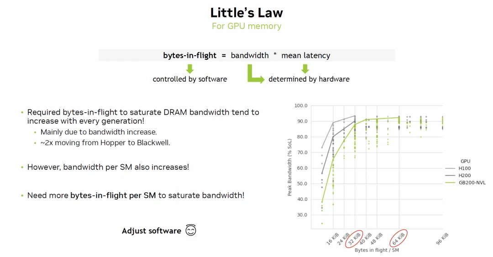
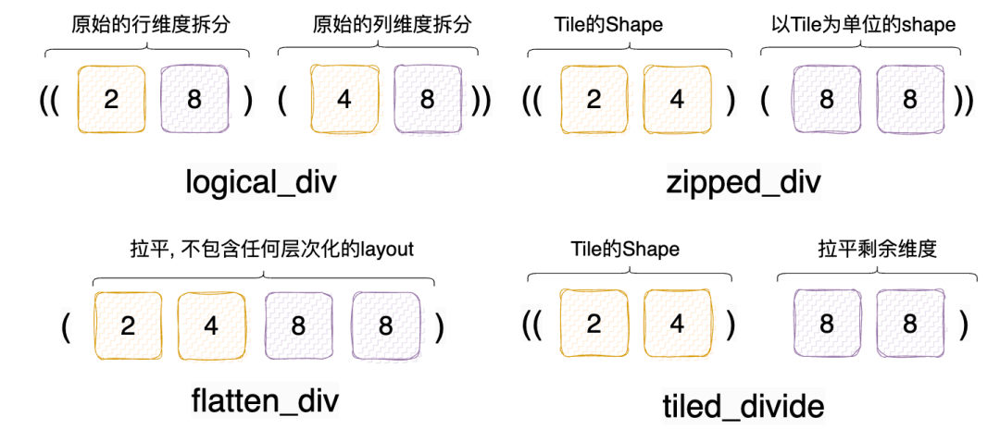
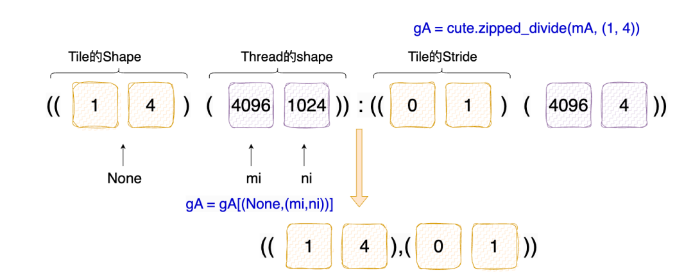
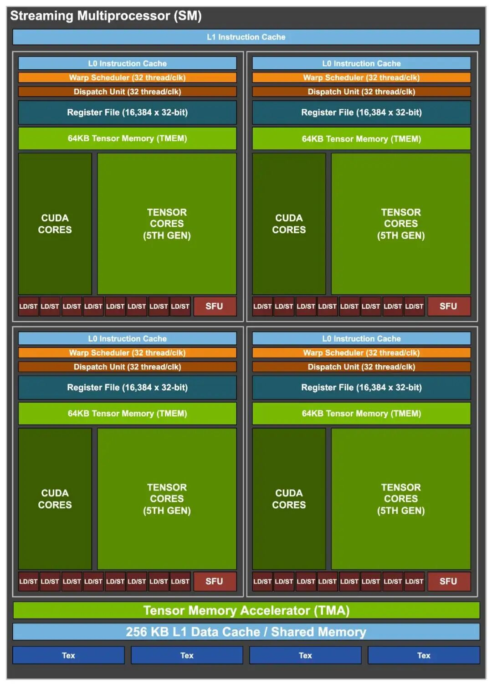
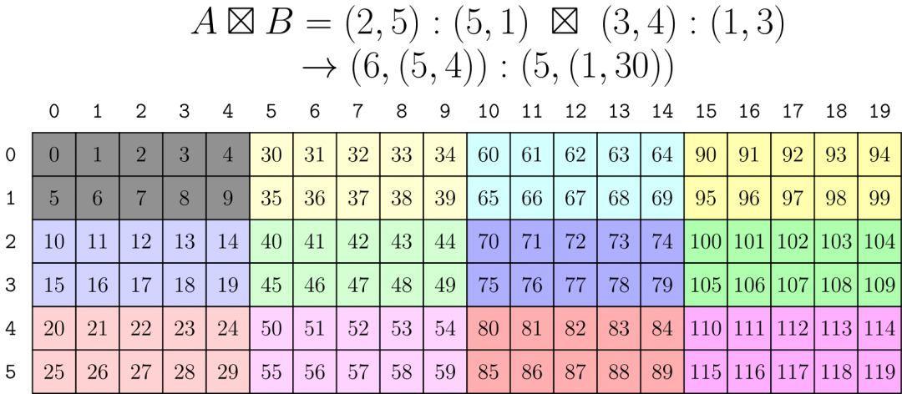

# Tensor-101: Element-Wise Add

- 원문 제목: Tensor-101: Element-Wise Add
- 저자: Tilebot
- 계정: zartbot
- 발행일: 2025년 10월 6일 00:42

### TL:DR

이제 CuteDSL과 Tilelang을 섞어서 같이 다뤄 보자. 먼저 가장 basic한 operator부터 시작한다. 대략 각 글의 구조는 먼저 알고리즘 자체를 이야기하고, 그다음 CuteDSL과 Tilelang 구현, 그리고 performance tuning 관련 내용을 다루는 식이다. 대략 elementwise Add부터 GEMV, GEMM으로 가고, 점차 FlashAttn, GroupGEMM 같은 것들로 넘어간다.

이 글은 elementwise add 계산을 소개하고, cuteDSL과 tilelang으로 몇 가지 kernel을 구현한 뒤 baseline cublas와 비교한다. performance result는 다음과 같다.

| 알고리즘 구현 | Thor GFLOPS | Thor MemBW | H20 GFLOPS | H20 MemBW |
| --- | --- | --- | --- | --- |
| Cublas | 19.61 | 235.383 GB/s | 262.25 | 3147.11 GB/s |
| cutedsl-naive | 20.07 | 240.90 GB/s | 179.52 | 2154.25 GB/s |
| cutedsl-vec-ld/st | 21.48 | 257.77 GB/s | 293.23 | 3518.77 GB/s |
| cutedsl-tv-layout | 20.92 | 251.12 GB/s | 279.28 | 3351.40 GB/s |
| tilelang-naive | 16.81 | 201.80 GB/s | 268.17 | 3218.14 GB/s |
| tilelang-autotune | 20.79 | 249.49 GB/s | 271.65 | 3259.82 GB/s |

Note: Thor는 최고 전력 모드로 조정해서 run하지 않았기 때문에 앞의 test가 정확하지 않다. `nvidia-smi -pm 1`을 설정한 뒤에도 performance jitter가 꽤 뚜렷했다. 재측정에서는 Thor에 대해 더 긴 warmup 횟수를 사용했고, 위 표는 이미 update했다.

cuteDSL에서는 TV-Layout 관련 지식도 소개한다. cuteDSL과 비교하면 tilelang은 더 간편하고, autotune 기능도 매우 유용하다.

## 1. ElementWise Add

### 1.1 Algorithm overview

matrix의 ElementWise Addition 계산은 다음과 같다.

**Input**: input은 두 matrix이며, 이를 $A$와 $B$라고 부른다. constraint는 $A,B$가 반드시 같은 shape이어야 한다는 것이다.

**Computation method**: $C=A+B$를 compute한다. 그리고 $A,B,C$는 모두 $M \times N$ matrix이며, 임의의 $0 \leq i \lt M$ 및 $0 \leq j \lt N$에 대해 다음과 같다.

$$
C_{ij}= A_{ij} + B_{ij}
$$

물론 또 다른 computation도 있다. scalar $\alpha$, $\beta$가 있을 때, $C=\alpha A+\beta B$는 다음과 같다.

$$
C_{ij}=\alpha  A_{ij} +  \beta B_{ij}
$$

CPU로 compute하는 code는 다음과 같다.

```c++
void cpu_geam(int m, int n, float alpha, const float* A, float beta, const float* B, float* C) {
    for (int j = 0; j < n; ++j) {
        for (int i = 0; i < m; ++i) {
            int index = j * m + i;
            C[index] = alpha * A[index] + beta * B[index];
        }
    }
}
```

### 1.2 CuBLAS baseline

계산 자체는 매우 simple하며, Memory-Bound operation에 속한다. CUBLAS는 `cublas<t>geam` (GEneral matrix-matrix Addition/Multiplication) function을 제공하므로, 이 기능을 매우 간편하게 구현할 수 있다.

```c++
#include <iostream>
#include <vector>
#include <cstdlib>
#include <cuda_runtime.h>
#include <cublas_v2.h>

// CUDA 및 CUBLAS API call의 error checking macro
#define CHECK_CUDA(call) do { \
    cudaError_t err = call; \
    if (err != cudaSuccess) { \
        fprintf(stderr, "CUDA Error at %s:%d: %s\n", __FILE__, __LINE__, cudaGetErrorString(err)); \
        exit(EXIT_FAILURE); \
    } \
} while (0)

#define CHECK_CUBLAS(call) do { \
    cublasStatus_t status = call; \
    if (status != CUBLAS_STATUS_SUCCESS) { \
        fprintf(stderr, "CUBLAS Error at %s:%d\n", __FILE__, __LINE__); \
        exit(EXIT_FAILURE); \
    } \
} while (0)

int main() {
    // 1. matrix dimension 정의
    int M = 4096; // matrix row 수
    int N = 4096; // matrix column 수
    long long num_elements = (long long)M * N;

    std::cout << "Testing cublasSgeam (element-wise add) with matrix size " << M << "x" << N << std::endl;

    // GEAM operation의 scalar alpha와 beta 정의
    // C = alpha * A + beta * B. simple addition에서는 alpha=1.0, beta=1.0
    float alpha = 1.0f;
    float beta = 1.0f;

    // 2. host side에서 data allocation 및 initialization
    std::vector<float> h_A(num_elements);
    std::vector<float> h_B(num_elements);
    std::vector<float> h_C_gpu(num_elements); // GPU computation result
    std::vector<float> h_C_cpu(num_elements); // verification용 CPU computation result

    // random number로 matrix 채우기
    for (long long i = 0; i < num_elements; i++ ) {
        h_A[i] = static_cast<float>(rand()) / RAND_MAX;
        h_B[i] = static_cast<float>(rand()) / RAND_MAX;
    }

    // 3. device side에서 memory allocation
    float *d_A, *d_B, *d_C;
    CHECK_CUDA(cudaMalloc((void**)&d_A, num_elements * sizeof(float)));
    CHECK_CUDA(cudaMalloc((void**)&d_B, num_elements * sizeof(float)));
    CHECK_CUDA(cudaMalloc((void**)&d_C, num_elements * sizeof(float)));

    // 4. CUBLAS handle 생성
    cublasHandle_t handle;
    CHECK_CUBLAS(cublasCreate(&handle));

    // 5. host에서 device로 data copy
    CHECK_CUDA(cudaMemcpy(d_A, h_A.data(), num_elements * sizeof(float), cudaMemcpyHostToDevice));
    CHECK_CUDA(cudaMemcpy(d_B, h_B.data(), num_elements * sizeof(float), cudaMemcpyHostToDevice));

    // 6. performance test
    cudaEvent_t start, stop;
    CHECK_CUDA(cudaEventCreate(&start));
    CHECK_CUDA(cudaEventCreate(&stop));

    // Warm-up
    CHECK_CUBLAS(cublasSgeam(handle,
                             CUBLAS_OP_N, CUBLAS_OP_N, // A와 B를 transpose하지 않음
                             M, N,
                             &alpha,
                             d_A, M,                  // A와 그 leading dimension
                             &beta,
                             d_B, M,                  // B와 그 leading dimension
                             d_C, M));                // C와 그 leading dimension

    CHECK_CUDA(cudaDeviceSynchronize());

    // 정식 timing
    int iterations = 100;
    float total_time = 0.0f;

    CHECK_CUDA(cudaEventRecord(start));

    for (int i = 0; i < iterations; ++i) {
        CHECK_CUBLAS(cublasSgeam(handle, CUBLAS_OP_N, CUBLAS_OP_N, M, N, &alpha, d_A, M, &beta, d_B, M, d_C, M));
    }

    CHECK_CUDA(cudaEventRecord(stop));
    CHECK_CUDA(cudaEventSynchronize(stop)); // 모든 GPU operation 완료 대기
    CHECK_CUDA(cudaEventElapsedTime(&total_time, start, stop));

    // 7. performance result 계산 및 출력
    float avg_time_ms = total_time / iterations;
    float avg_time_s = avg_time_ms / 1000.0f;

    // GFLOPS 계산
    // 각 element에는 floating-point addition 1회가 있음
    double flops = (double)num_elements;
    double gflops = (flops / 1e9) / avg_time_s;

    // effective memory bandwidth 계산
    // 각 operation에는 A read (M*N floats), B read (M*N floats), C write (M*N floats)가 필요함
    // 총 3 * M * N * sizeof(float) bytes 전송
    double bytes_transferred = 3.0 * num_elements * sizeof(float);
    double bandwidth_gb_s = (bytes_transferred / 1e9) / avg_time_s;

    std::cout << "--------------------------------------------------------" << std::endl;
    std::cout << "Average execution time: " << avg_time_ms << " ms" << std::endl;
    std::cout << "Performance (GFLOPS): " << gflops << " GFLOPS" << std::endl;
    std::cout << "Effective Memory Bandwidth: " << bandwidth_gb_s << " GB/s" << std::endl;
    std::cout << "--------------------------------------------------------" << std::endl;

    // GPU computation result를 host로 다시 copy
    CHECK_CUDA(cudaMemcpy(h_C_gpu.data(), d_C, num_elements * sizeof(float), cudaMemcpyDeviceToHost));

    // 9. resource 정리
    CHECK_CUDA(cudaFree(d_A));
    CHECK_CUDA(cudaFree(d_B));
    CHECK_CUDA(cudaFree(d_C));
    CHECK_CUDA(cudaEventDestroy(start));
    CHECK_CUDA(cudaEventDestroy(stop));
    CHECK_CUBLAS(cublasDestroy(handle));

    return 0;
}
```

Jetson Thor에서의 test result는 다음과 같다.

```
zartbot@zartbot-thor:~$ nvcc -arch=sm_110 -lcublas eleadd.cu
zartbot@zartbot-thor:~$ ./a.out
Testing cublasSgeam (element-wise add) with matrix size 4096x4096
--------------------------------------------------------
Average execution time: 0.855316 ms
Performance (GFLOPS): 19.6152 GFLOPS
Effective Memory Bandwidth: 235.383 GB/s
--------------------------------------------------------
```

그리고 H20에서의 test result는 다음과 같다.

```
Testing cublasSgeam (element-wise add) with matrix size 4096x4096
--------------------------------------------------------
Average execution time: 0.0639718 ms
Performance (GFLOPS): 262.259 GFLOPS
Effective Memory Bandwidth: 3147.11 GB/s
--------------------------------------------------------
```

## 2. Cute-DSL

Cute-DSL에는 git에 notebook[1]이 있다.

### 2.1 Navie elementwise add

먼저 관련 library를 import한다.

```python
import os
os.environ['CUTE_DSL_ARCH'] = 'sm_101a'
# Thor는 CUDA 13.0에서 SM110으로 이름이 바뀌었지만 cutedsl-4.2는 아직 12.9 기반이므로 environment variable을 설정해야 한다.

import torch
from functools import partial

import cutlass
import cutlass.cute as cute
from cutlass.cute.runtime import from_dlpack
```

Cute-DSL Kernel은 다음과 같다. 전체적으로 보면 Cuda code를 작성하는 것과 큰 차이가 없다.

```python
@cute.kernel
def naive_elementwise_add_kernel(
    gA: cute.Tensor,
    gB: cute.Tensor,
    gC: cute.Tensor,
):
    tidx, _, _ = cute.arch.thread_idx()
    bidx, _, _ = cute.arch.block_idx()
    bdim, _, _ = cute.arch.block_dim()

    thread_idx = bidx * bdim + tidx

    # Map thread index to logical index of input tensor
    m, n = gA.shape
    ni = thread_idx % n
    mi = thread_idx // n

    # Map logical index to physical address via tensor layout
    a_val = gA[mi, ni]
    b_val = gB[mi, ni]

    # Perform element-wise addition
    gC[mi, ni] = a_val + b_val

@cute.jit
def naive_elementwise_add(
    mA: cute.Tensor,
    mB: cute.Tensor,
    mC: cute.Tensor
):
    num_threads_per_block = 256

    m, n = mA.shape
    kernel = naive_elementwise_add_kernel(mA, mB, mC)
    kernel.launch(grid=((m * n) // num_threads_per_block, 1, 1),
                  block=(num_threads_per_block, 1, 1))
```

그다음은 몇 가지 test와 verification이다.

```c++
M, N = 4096, 4096

a = torch.randn(M, N, device="cuda", dtype=torch.float32)
b = torch.randn(M, N, device="cuda", dtype=torch.float32)
c = torch.zeros(M, N, device="cuda", dtype=torch.float32)

a_ = from_dlpack(a, assumed_align=16)
b_ = from_dlpack(b, assumed_align=16)
c_ = from_dlpack(c, assumed_align=16)

# Compile kernel
naive_elementwise_add_ = cute.compile(naive_elementwise_add, a_, b_, c_)
naive_elementwise_add_(a_, b_, c_)

# verify correctness
torch.testing.assert_close(c, a + b)
```

아래에는 benchmark code도 있다.

```python
def benchmark(callable, *, num_warmups, num_iterations):
    start_event = torch.cuda.Event(enable_timing=True)
    end_event = torch.cuda.Event(enable_timing=True)

    torch.cuda.synchronize()

    for _ in range(num_warmups):
        callable()

    start_event.record(stream=torch.cuda.current_stream())
    for _ in range(num_iterations):
        callable()
    end_event.record(stream=torch.cuda.current_stream())
    torch.cuda.synchronize()

    elapsed_time = start_event.elapsed_time(end_event)
    avg_time = elapsed_time / num_iterations
    gflops =  a.numel()  / (avg_time  / 1000) / 1e9

    print(f"Average execution time: {avg_time:.4f} ms")
    print(f"Performance (GFLOPS): {gflops:.4f} GFLOPS")
    print(f"Effective Memory Bandwidth: {(3 * a.numel() * 4) / (avg_time / 1000) / 1e9:.2f} GB/s")

benchmark(partial(naive_elementwise_add_, a_, b_, c_), num_warmups=5, num_iterations=100)
```

Thor에서 execute

```
Average execution time: 0.8357 ms
Performance (GFLOPS): 20.0751 GFLOPS
Effective Memory Bandwidth: 240.90 GB/s
```

H20에서 execute

```
Average execution time: 0.0935 ms
Performance (GFLOPS): 179.5212 GFLOPS
Effective Memory Bandwidth: 2154.25 GB/s
```

Cublas result와 비교하면 memory bandwidth를 꽉 채우지 못했다는 것을 볼 수 있다.

### 2.2 Vectorized LD/ST

Cute-DSL의 Note는 다시 Little's Law를 이야기한다.

$$
L = \lambda \times W
$$

여기서:

- $L$은 system에 평균적으로 도착해 있는 service object의 수이다.
- $\lambda$는 service object의 평균 도착률(Bandwidth)이다.
- $W$는 service object가 system 안에서 평균적으로 소요하는 시간(Latency)이다.

Memory-Bound operator의 경우, $L$은 평균 inflight LD/ST operation 수를 나타내고, $\lambda$는 bandwidth, 즉 Memory와 Compute Unit 사이의 data transfer rate를 나타낸다. $W$는 latency, 즉 memory request의 RTT를 나타낸다.



앞의 2.1에서 보면 Memory BW가 limit까지 도달하지 못했다. 그러면 simple한 방법은 software로 LD/ST operation 수를 늘리는 것이다. 비교적 최신 GPU architecture에는 128bits vectorized LD/ST instruction(`ld.global.v4.f32`, `st.global.v4.f32`)이 추가되었고, 이를 이용하면 inflight 수를 늘릴 수 있다.

하지만 이때 각 thread는 vectorized LD/ST를 통해 memory address가 연속된 element 4개를 읽어야 한다. 즉 `(1,4):(0:1)` layout을 구성한다. 다시 말해 $M \times N$ matrix를 `(1,4)` 기준으로 block으로 나누어야 한다. 여기서 matrix Layout의 division을 조금 더 펼쳐 설명한다.

[「CuTe Layout algebra-1: Overview」](https://mp.weixin.qq.com/s?__biz=MzUxNzQ5MTExNw==&mid=2247496154&idx=1&sn=474a5450c46b86169095d84dd3cfd7dc&scene=21#wechat_redirect)에서도 일부 소개했듯이, matrix Partitioning/Tiling에 대한 algebra operation을 Logical\_divide라고 부른다. 예를 들어 M=16, N=32인 tensor가 있고, 이를 tileM=2, tileN=4인 block으로 나누고 싶다고 하자. 그러면 row M은 8개 block으로 나뉘고, column 32는 32/4=8개 block으로 나뉜다. Cutlass에는 logical\_divide, zipped\_divide, flat\_divide, tiled\_divide 등 여러 division이 정의되어 있다. 사실 너무 걱정할 필요는 없다. 뒤의 세 가지는 모두 logical\_divide를 기반으로 생성된 nested tuple 안의 mode를 재배열해서 나온 것이다. 아래에 test example이 있다.

```python
@cute.jit
def layout_test(
    mA: cute.Tensor
):
    tiler = (2,4)
    lA = cute.logical_divide(mA, tiler=tiler)
    zA = cute.zipped_divide(mA, tiler=tiler)
    fA = cute.flat_divide(mA, tiler=tiler)
    tA = cute.tiled_divide(mA, tiler=tiler)

    print(f"[DSL INFO] Tiled Tensors:")
    print(f"[DSL INFO] Tiler: {tiler}")
    print(f"[DSL INFO] logical_divide  lA = {lA}")
    print(100*'=')
    print(f"[DSL INFO] zipped_divide  zA = {zA}")
    print(f"[DSL INFO] flatten_divide  fA = {fA}")
    print(f"[DSL INFO] tiled_divide  tA = {tA}")

M,N= 16,32
a = torch.randn(M, N, device="cuda", dtype=torch.float32)
print(f"Tensor shape  {a.shape} Stride: {a.stride()}")
a_ = from_dlpack(a, assumed_align=16)
layout_test(a_)
```

구체적인 output은 다음과 같다.

```c++
Tensor shape  torch.Size([16, 32]) Stride: (32, 1)
[DSL INFO] Tiled Tensors:
[DSL INFO] Tiler: (2, 4)
[DSL INFO] logical_divide  lA = tensor<ptr<f32, gmem, align<16>> o ((2,8),(4,8)):((32,64),(1,4))>
====================================================================================================
[DSL INFO] zipped_divide  zA = tensor<ptr<f32, gmem, align<16>> o ((2,4),(8,8)):((32,1),(64,4))>
[DSL INFO] flatten_divide  fA = tensor<ptr<f32, gmem, align<16>> o (2,4,8,8):(32,1,64,4)>
[DSL INFO] tiled_divide  tA = tensor<ptr<f32, gmem, align<16>> o ((2,4),8,8):((32,1),64,4)>
```

logical\_divide의 경우, 기존 row와 column 위에 nested tuple을 직접 구성한 뒤 해당 stride를 계산한다. zipped는 이를 재배열해서 tile shape tuple을 앞에 두고, 뒤쪽 segment가 Tile 단위의 shape을 나타내게 한다. flatten은 전체 nested tuple을 곧바로 1D로 flatten한다. tiled\_divide는 tile shape tuple만 nested로 구성한다.



vectorized LD/ST가 필요한 경우 tiler는 `(1,4)`이다. M,N=(4096,4096)인 matrix에 대해 zipped\_div result는 다음과 같다.



따라서 우리가 구성하는 code는 다음과 같다. 이때 주의할 점은 각 thread가 vectorized하게 read해야 하는 slice에 대해 `mi,ni` index를 사용해야 한다는 것이다.

```python
@cute.kernel
def vectorized_elementwise_add_kernel(
    gA: cute.Tensor,
    gB: cute.Tensor,
    gC: cute.Tensor,
):
    tidx, _, _ = cute.arch.thread_idx()
    bidx, _, _ = cute.arch.block_idx()
    bdim, _, _ = cute.arch.block_dim()

    thread_idx = bidx * bdim + tidx

    # Map thread index to logical index of input tensor
    m, n = gA.shape[1]       # thread-domain
    print(f"THread domain m={m} , n={n}") # result is the purple (4096,1024) in the figure above
    ni = thread_idx % n
    mi = thread_idx // n

    # build vectorized load using .load()
    a_val = gA[(None, (mi, ni))].load()
    b_val = gB[(None, (mi, ni))].load()
    print(f"[DSL INFO] sliced gA = {gA[(None, (mi, ni))]}")
    print(f"[DSL INFO] sliced gB = {gB[(None, (mi, ni))]}")

    # Perform element-wise addition
    gC[(None, (mi, ni))] = a_val + b_val


@cute.jit
def vectorized_elementwise_add(
    mA: cute.Tensor,
    mB: cute.Tensor,
    mC: cute.Tensor
):
    threads_per_block = 256

    # apply zipped div to the original matrix by (1,4)
    gA = cute.zipped_divide(mA, (1, 4))
    gB = cute.zipped_divide(mB, (1, 4))
    gC = cute.zipped_divide(mC, (1, 4))

    print(f"[DSL INFO] Tiled Tensors:")
    print(f"[DSL INFO]   gA = {gA}")
    print(f"[DSL INFO]   gB = {gB}")
    print(f"[DSL INFO]   gC = {gC}")

    vectorized_elementwise_add_kernel(gA, gB, gC).launch(
        grid=(cute.size(gC, mode=[1]) // threads_per_block, 1, 1),
        block=(threads_per_block, 1, 1),
    )
```

그다음 algorithm verification과 performance test를 execute한다.

```c++
M,N= 4096,4096
a = torch.randn(M, N, device="cuda", dtype=torch.float32)
b = torch.randn(M, N, device="cuda", dtype=torch.float32)
c = torch.zeros(M, N, device="cuda", dtype=torch.float32)

a_ = from_dlpack(a, assumed_align=16)
b_ = from_dlpack(b, assumed_align=16)
c_ = from_dlpack(c, assumed_align=16)

compiled_func = cute.compile(vectorized_elementwise_add, a_, b_, c_)
compiled_func(a_, b_, c_)

# verify correctness
torch.testing.assert_close(c, a + b)

benchmark(partial(compiled_func, a_, b_, c_), num_warmups=5, num_iterations=100)
```

Jetson Thor에서의 test result이다. Naive 구현과 비교하면 전체 chip의 memory bandwidth가 제한되어 있어서 overall performance는 향상되지 않았다.

```
[DSL INFO] Tiled Tensors:
[DSL INFO]   gA = tensor<ptr<f32, gmem, align<16>> o ((1,4),(4096,1024)):((0,1),(4096,4))>
[DSL INFO]   gB = tensor<ptr<f32, gmem, align<16>> o ((1,4),(4096,1024)):((0,1),(4096,4))>
[DSL INFO]   gC = tensor<ptr<f32, gmem, align<16>> o ((1,4),(4096,1024)):((0,1),(4096,4))>
THread domain m=4096 , n=1024
[DSL INFO] sliced gA = tensor<ptr<f32, gmem, align<16>> o ((1,4)):((0,1))>
[DSL INFO] sliced gB = tensor<ptr<f32, gmem, align<16>> o ((1,4)):((0,1))>
Average execution time: 0.7810 ms
Performance (GFLOPS): 21.4811 GFLOPS
Effective Memory Bandwidth: 257.77 GB/s
```

반면 H20에서는 Vector LD/ST performance가 크게 향상되었다. physical bandwidth limit는 4TB/s인데, 이미 3.5TB/s에 도달할 수 있다.

```
Average execution time: 0.0929 ms
Performance (GFLOPS): 180.5381 GFLOPS
Effective Memory Bandwidth: 2166.46 GB/s
[DSL INFO] Tiled Tensors:
[DSL INFO]   gA = tensor<ptr<f32, gmem, align<16>> o ((1,4),(4096,1024)):((0,1),(4096,4))>
[DSL INFO]   gB = tensor<ptr<f32, gmem, align<16>> o ((1,4),(4096,1024)):((0,1),(4096,4))>
[DSL INFO]   gC = tensor<ptr<f32, gmem, align<16>> o ((1,4),(4096,1024)):((0,1),(4096,4))>
THread domain m=4096 , n=1024
[DSL INFO] sliced gA = tensor<ptr<f32, gmem, align<16>> o ((1,4)):((0,1))>
[DSL INFO] sliced gB = tensor<ptr<f32, gmem, align<16>> o ((1,4)):((0,1))>
Average execution time: 0.0572 ms
Performance (GFLOPS): 293.2309 GFLOPS
Effective Memory Bandwidth: 3518.77 GB/s
```

### 2.3 TV Layout

2.2에서는 여전히 Thread domain의 Layout mapping을 수동으로 처리해야 했다. 예를 들면 다음과 같다.

```c++
    mi = thread_idx // n
    ni = thread_idx % n

    a[(None, (mi, ni))].load()
```

더 높은 dimension의 scenario에서는 이런 mapping을 계산하는 것이 더 복잡하다. 이를 직접 얻을 수 있는 더 simple하고 직관적인 algebra operation이 있을까? 원래 tensor $A$에 대해 어떤 방식으로든 이를 크기가 (TileM, TileN)인 많은 Tile로 나눌 수 있다. 이를 `tiler_mn`이라는 unknown variable로 정의하고, 일단 그 concrete implementation은 고려하지 않는다. 구성된 split은 다음과 같다.

```c++
gA = cute.zipped_divide(mA, tiler_mn) # ((TileM, TileN), (RestM, RestN))
```

그다음 각 thread block이 크기가 (TileM, TileN)인 Tile 하나를 처리하게 한다. thread block의 index를 통해, 즉 이 Layout의 두 번째 Mode인 (RestM, RestN)을 통해 indexing할 수 있다. GPU 하나에 대해 Grid 안을 (RestM, RestN)개의 block으로 나누어 처리한다는 뜻이다. 이것이 launch kernel 시 grid parameter를 `cute.size(gC, mode=[1])`로 설정하는 이유이다. 간단하게 하기 위해 Grid 안의 block은 1D로 배치한다. 즉 다음과 같다.

```c++
 grid=[cute.size(gC, mode=[1]), 1, 1]
```

Kernel 안에서는 block-idx를 통해 해당 block에 대응하는 subtensor를 얻을 수 있다. 즉 `gA[((None, None), bidx)]`이며, 이는 단일 `(TileM, TileN)` subtensor의 thread block local view를 return한다.

```c++
blk_coord = ((None, None), bidx)
blkA = gA[blk_coord] # (TileM, TileN) -> physical address
```

다시 말해 Layout `blkA`를 통해 하나의 mapping function을 얻을 수 있다.

$$
f_{blkA}(m',n') \rightarrow \text{physical address}
$$

이제 하나의 thread block이 `(TileM, TileN)` task를 받았다. 다음으로는 이 task를 block 내부의 수백 개 thread에 다시 세분해야 한다. GPU physical structure 관점에서 보면 하나의 SM architecture는 다음과 같다.



여기에는 4개의 warp가 포함되고, 각 warp에는 32개의 cuda core가 포함되어 총 4x32개의 cuda core가 있다. 그러면 thread를 `(4,32):(32:1)` 방식으로 layout을 구성할 수 있다. 즉 하나의 Warp(32개 thread)의 thread가 row 방향으로 data를 연속 load하게 하고, 서로 다른 4개의 warp가 각각 다른 row를 read하게 한다. 이렇게 해서 `thr_layout= cute.make_layout((4, 32), stride=(32, 1))`를 얻는다.

Note: 어떤 경우에는 warp 수를 늘리고 warp scheduler가 scheduling하게 해서, 하나의 block 안에 더 많은 thread를 두어 memory access latency를 숨길 수도 있다. 예를 들어 이 block에 256개 thread가 필요하다면 `thr\_layout= cute.make\_layout((8, 32), stride=(32, 1))`를 사용할 수 있다.

그다음 각 thread가 처리해야 하는 data에 대해 Value Layout을 구성할 수 있다. 예를 들어 vectorized LD/ST를 보장하기 위해서는 적어도 한 row에 연속된 data 4개가 있어야 하므로, `val_layout = cute.make_layout((4, 4), stride=(4, 1))`처럼 만들 수 있다. 즉 row-major value matrix이며, 각 row에는 vectorized LD/ST에 편리한 연속된 value 4개가 있고, 하나의 thread가 서로 다른 4개 row를 처리한다. `thr_layout`과 `val_layout` 정의가 끝나면 전체 Tile의 Layout을 구성해야 한다. 즉 `val_layout`을 `thread_layout`에 "삽입"하는 방식이 필요하다. 이러한 operation이 raked\_product이다.



이런 operation을 통해 `(TileM, TileN)` 안의 coordinate (m',n')에서 thr\_idx,val\_idx로 가는 mapping을 얻을 수 있다. 즉 다음과 같다.

$$
g:(m',n') \rightarrow (thr_idx,val_idx)
$$

사실 thread의 Kernel operation에서는 그 inverse function이 필요하다. 즉 thr\_idx, val\_idx에 따라 layout을 mapping할 수 있는 function이며, 다음과 같다.

$$
f_{tv}(thr_idx,val_idx)= g^{-1} \rightarrow (m',n')
$$

즉 shape이 (thr\_size,val\_size)인 temporary tmp layout을 구성한 뒤 $g^{-1}$와 compose할 수 있고, 최종적으로 tv\_layout function 구성이 완료된다.

```python
@cute.jit
def tv_layout():
    thr_layout = cute.make_layout((4, 32), stride=(32, 1))
    val_layout = cute.make_layout((4, 4), stride=(4, 1))
    layout_mn = cute.raked_product(thr_layout,val_layout)
    print(f"layout mn->thr_idx,val_idx {layout_mn}")

    thr_size = cute.size(thr_layout)
    val_size = cute.size(val_layout)
    print(f"thrsize: {thr_size} val_size: {val_size}")

    # Tile coordinate domain을 나타내는 temporary layout 생성
    tmp = cute.make_layout((thr_size,val_size))

    # inverse와 composition을 통해 (thr_idx, val_idx)에서 (M,N)으로 가는 mapping 구성
    layout_tv = cute.composition(
        cute.right_inverse(layout_mn), tmp
    )
    print(f"layout_tv: {layout_tv}")

    # Tiler 계산, 즉 (TileM,TileN)
    tiler_mn = cute.product_each(layout_mn.shape)
    return (tiler_mn,layout_tv)

tv_layout()
```

이것이 `cute.make_layout_tv`의 implementation 방식이기도 하다. 추가로 말하자면, 보통 이런 TV Layout은 전체 matrix에 대해 zipped tile을 수행하기 위한 (TileM,TileN) tuple도 output해야 한다. 즉 위 function에서 `tiler\_mn`을 계산하는 부분이다.

하나의 thread에 대해 TV\_Layout을 통해 $f_{tv}(thr_idx,val_idx)= g^{-1} \rightarrow (m',n')$를 얻을 수 있다. 동시에 block-idx를 통해 `gA[((None, None), bidx)]`를 얻을 수 있음에 주목한다. 이는 $f_{blkA}(m',n') \rightarrow \text{physical address}$이다. 따라서 두 function을 compose하면 다음을 얻을 수 있다.

$$
h(thr_idx,val_idx)= f_{blkA} \circ f_{tv} \rightarrow \text{physical address}
$$

즉 cutDSL에서는 다음 방식으로 해당 physical address를 얻을 수 있고, 그다음 TensorSSA를 이용해 load와 addition을 수행하면 된다.

```c++
    tidfrgA = cute.composition(blkA, tv_layout)
    tidfrgB = cute.composition(blkB, tv_layout)
    tidfrgC = cute.composition(blkC, tv_layout)

    thr_coord = (tidx, None)

    thrA = tidfrgA[thr_coord]  # (V) -> physical address
    thrB = tidfrgB[thr_coord]  # (V) -> physical address
    thrC = tidfrgC[thr_coord]  # (V) -> physical address

    #TensorSSA load and add
    thrC[None] = thrA.load() + thrB.load()
```

이렇게 해서 전체 TV\_Layout process가 완료된다. 종합하면 TV\_Layout 기반의 완전한 elementwise\_add를 구성할 수 있다.

```python
@cute.kernel
def elementwise_add_kernel(
    gA: cute.Tensor,
    gB: cute.Tensor,
    gC: cute.Tensor,
    tv_layout: cute.Layout
):
    tidx, _, _ = cute.arch.thread_idx()
    bidx, _, _ = cute.arch.block_idx()

    #--------------------------------
    # slice for thread-block level view
    #--------------------------------
    blk_coord = ((None, None), bidx)

    # logical coord -> address
    blkA = gA[blk_coord]  # (TileM, TileN) -> physical address
    blkB = gB[blk_coord]  # (TileM, TileN) -> physical address
    blkC = gC[blk_coord]  # (TileM, TileN) -> physical address

    #--------------------------------
    # compose for thread-index & value-index to physical mapping
    #--------------------------------
    # blockA:    (TileM, TileN) -> physical address
    # tv_layout: (tid, vid)     -> (TileM, TileN)
    # tidfrgA = blkA o tv_layout
    # tidfrgA:   (tid, vid) -> physical address
    tidfrgA = cute.composition(blkA, tv_layout)
    tidfrgB = cute.composition(blkB, tv_layout)
    tidfrgC = cute.composition(blkC, tv_layout)

    print(f"Composed with TV layout:")
    print(f"  tidfrgA: {tidfrgA.type}")

    #--------------------------------
    # slice for thread-level view
    #--------------------------------
    # `None` represent slice of the entire per-thread data
    thr_coord = (tidx, None)

    # slice for threads: vid -> address
    thrA = tidfrgA[thr_coord]  # (V) -> physical address
    thrB = tidfrgB[thr_coord]  # (V) -> physical address
    thrC = tidfrgC[thr_coord]  # (V) -> physical address
    print(f"thrA : {thrA}")

    thrC[None] = thrA.load() + thrB.load()

@cute.jit
def elementwise_add(
    mA: cute.Tensor,
    mB: cute.Tensor,
    mC: cute.Tensor,
):
    # mA layout: (M, N):(N, 1)
    # TV layout map thread & value index to (16, 256) logical tile
    #  - contiguous thread index maps to mode-1 because input layout is contiguous on
    #     mode-1 for coalesced load-store
    #  - each thread load 8 contiguous element each row and load 4 rows
    thr_layout = cute.make_layout((4, 32), stride=(32, 1))
    val_layout = cute.make_layout((4, 4), stride=(4, 1))
    tiler_mn, tv_layout = cute.make_layout_tv(thr_layout, val_layout)
    print(f"Tiler: {tiler_mn}")
    print(f"TV Layout: {tv_layout}")

    gA = cute.zipped_divide(mA, tiler_mn)  # ((TileM, TileN), (RestM, RestN))
    gB = cute.zipped_divide(mB, tiler_mn)  # ((TileM, TileN), (RestM, RestN))
    gC = cute.zipped_divide(mC, tiler_mn)  # ((TileM, TileN), (RestM, RestN))

    print(f"Tiled Input Tensors:")
    print(f"  gA: {gA.type}")
    print(f"  gB: {gB.type}")
    print(f"  gC: {gC.type}")

    print(f" block-size: {cute.size(gC, mode=[1])}, thread-size: {cute.size(tv_layout, mode=[0])}")
    # Launch the kernel asynchronously
    # Async token(s) can also be specified as dependencies
    elementwise_add_kernel(
        gA, gB, gC, tv_layout
    ).launch(
        grid=[cute.size(gC, mode=[1]), 1, 1],
        block=[cute.size(tv_layout, mode=[0]), 1, 1],
    )
```

그다음 마찬가지로 4096x4096 fp32 matrix를 사용해 verification과 performance test를 수행한다.

```c++
M,N = 4096,4096

a = torch.randn(M, N, device="cuda", dtype=torch.float32)
b = torch.randn(M, N, device="cuda", dtype=torch.float32)
c = torch.zeros(M, N, device="cuda", dtype=torch.float32)

a_ = from_dlpack(a, assumed_align=16)
b_ = from_dlpack(b, assumed_align=16)
c_ = from_dlpack(c, assumed_align=16)

elementwise_add_ = cute.compile(elementwise_add, a_, b_, c_)
elementwise_add_(a_, b_, c_)

# verify correctness
torch.testing.assert_close(c, a + b)

benchmark(partial(elementwise_add_, a_, b_, c_), num_warmups=5, num_iterations=200)
```

Jetson Thor에서의 output은 다음과 같다.

```
Tiler: (16, 128)
TV Layout: ((32,4),(4,4)):((64,4),(16,1))
Tiled Input Tensors:
  gA: !cute.memref<f32, gmem, align<16>, "((16,128),(256,32)):((4096,1),(65536,128))">
  gB: !cute.memref<f32, gmem, align<16>, "((16,128),(256,32)):((4096,1),(65536,128))">
  gC: !cute.memref<f32, gmem, align<16>, "((16,128),(256,32)):((4096,1),(65536,128))">
 block-size: 8192, thread-size: 128
Composed with TV layout:
  tidfrgA: !cute.memref<f32, gmem, align<16>, "((32,4),(4,4)):((4,16384),(1,4096))">
thrA : tensor<ptr<f32, gmem, align<16>> o ((4,4)):((1,4096))>
Average execution time: 0.8017 ms
Performance (GFLOPS): 20.9269 GFLOPS
Effective Memory Bandwidth: 251.12 GB/s
```

H20에서의 output은 다음과 같다.

```
Average execution time: 0.0601 ms
Performance (GFLOPS): 279.2836 GFLOPS
Effective Memory Bandwidth: 3351.40 GB/s
```

조금 더 펼쳐 보면, cuteDSL은 lambda function 기능도 추가했다. 즉 다른 elementwise operation이 필요할 때, 아래와 같이 `op`를 통해 정의할 수 있다.

```python
@cute.kernel
def elementwise_apply_kernel(
    op: cutlass.Constexpr,    # lambda function must be const expr to generate code at compile time
    gA: cute.Tensor,
    gB: cute.Tensor,
    gC: cute.Tensor,
    tv_layout: cute.Layout
):
    tidx, _, _ = cute.arch.thread_idx()
    bidx, _, _ = cute.arch.block_idx()

    blk_coord = ((None, None), bidx)

    # logical coord -> address
    blkA = gA[blk_coord]  # (TileM, TileN) -> physical address
    blkB = gB[blk_coord]  # (TileM, TileN) -> physical address
    blkC = gC[blk_coord]  # (TileM, TileN) -> physical address

    tidfrgA = cute.composition(blkA, tv_layout)
    tidfrgB = cute.composition(blkB, tv_layout)
    tidfrgC = cute.composition(blkC, tv_layout)

    print(f"Composed with TV layout:")
    print(f"  tidfrgA: {tidfrgA.type}")

    thr_coord = (tidx, None)

    # slice for threads: vid -> address
    thrA = tidfrgA[thr_coord]  # (V) -> physical address
    thrB = tidfrgB[thr_coord]  # (V) -> physical address
    thrC = tidfrgC[thr_coord]  # (V) -> physical address

    #--------------------------------
    # apply custom operation
    #--------------------------------
    thrC[None] = op(thrA.load(), thrB.load())


@cute.jit
def elementwise_op(
    op: cutlass.Constexpr,
    mA: cute.Tensor,
    mB: cute.Tensor,
    mC: cute.Tensor,
):
    # mA layout: (M, N):(N, 1)
    # TV layout map thread & value index to (16, 256) logical tile
    #  - contiguous thread index maps to mode-1 because input layout is contiguous on
    #     mode-1 for coalesced load-store
    #  - each thread load 8 contiguous element each row and load 4 rows
    thr_layout = cute.make_layout((4, 32), stride=(32, 1))
    val_layout = cute.make_layout((4, 8), stride=(8, 1))
    tiler_mn, tv_layout = cute.make_layout_tv(thr_layout, val_layout)
    print(f"Tiler: {tiler_mn}")
    print(f"TV Layout: {tv_layout}")

    gA = cute.zipped_divide(mA, tiler_mn)  # ((TileM, TileN), (RestM, RestN))
    gB = cute.zipped_divide(mB, tiler_mn)  # ((TileM, TileN), (RestM, RestN))
    gC = cute.zipped_divide(mC, tiler_mn)  # ((TileM, TileN), (RestM, RestN))

    print(f"Tiled Input Tensors:")
    print(f"  gA: {gA.type}")
    print(f"  gB: {gB.type}")
    print(f"  gC: {gC.type}")

    # Launch the kernel asynchronously
    # Async token(s) can also be specified as dependencies
    elementwise_apply_kernel(
        op, gA, gB, gC, tv_layout
    ).launch(
        grid=[cute.size(gC, mode=[1]), 1, 1],
        block=[cute.size(tv_layout, mode=[0]), 1, 1],
    )

a = torch.randn(M, N, device="cuda", dtype=torch.float16)
b = torch.randn(M, N, device="cuda", dtype=torch.float16)
c = torch.zeros(M, N, device="cuda", dtype=torch.float16)

a_ = from_dlpack(a, assumed_align=16)
b_ = from_dlpack(b, assumed_align=16)
c_ = from_dlpack(c, assumed_align=16)

from operator import mul

elementwise_op(mul, a_, b_, c_)

# verify correctness
torch.testing.assert_close(c, mul(a, b))
```

## 3. TileLang

TileLang official docs도 elementwise operation 소개인 "ElementWise Operators"[2]를 제공한다.

### 3.1 Naive elementwise add

Tilelang에서는 CuteDSL처럼 복잡한 Layout을 고려할 필요가 없고, 단순히 (TileM,TileN)을 `T.Parallel(TIleM, TIleN)`로 parallel schedule하면 된다.

```python
import torch
import tilelang
import tilelang.language as T

def elementwise_add(
    M,
    N,
    TileM,
    TileN,
    in_dtype,
    out_dtype,
    threads,
):
    @T.prim_func
    def main(
            A: T.Tensor((M, N), in_dtype),
            B: T.Tensor((M, N), in_dtype),
            C: T.Tensor((M, N), out_dtype),
    ):
        with T.Kernel(T.ceildiv(N, TileN), T.ceildiv(M, TileM), threads=threads) as (bx, by):
            start_x = bx * TileN
            start_y = by * TileM

            for (local_y, local_x) in T.Parallel(TileM, TileN):
                y = start_y + local_y
                x = start_x + local_x

                C[y, x] = A[y, x] + B[y, x]

    return main
```

Kernel compile 및 verification code는 다음과 같다.

```c++
M,N = 4096,4096

TileM,TileN = 128,128

func = elementwise_add(M, N, TileM,TileN, "float32","float32", 256)
jit_kernel = tilelang.compile(func, out_idx=[-1], target="cuda")

a = torch.randn(M, N, device="cuda", dtype=torch.float32)
b = torch.randn(M, N, device="cuda", dtype=torch.float32)
c = torch.zeros(M, N, device="cuda", dtype=torch.float32)

c = jit_kernel(a,b)
# verify correctness
torch.testing.assert_close(c, a + b)
```

Tilelang에는 profiler가 built-in되어 있으며, 매우 simple한 `do\_bench()` method로 performance measurement를 수행할 수 있다.

```c++
profiler = jit_kernel.get_profiler()
avg_time = profiler.do_bench(n_warmup=5000) #n_warmup=5000 for thor

gflops =  a.numel()  / (avg_time  / 1000) / 1e9
print(f"Average execution time: {avg_time:.4f} ms")
print(f"Performance (GFLOPS): {gflops:.4f} GFLOPS")
print(f"Effective Memory Bandwidth: {(3 * a.numel() * 4) / (avg_time / 1000) / 1e9:.2f} GB/s")
```

Jetson Thor에서의 result는 다음과 같다.

```
Average execution time: 0.9977 ms
Performance (GFLOPS): 16.8165 GFLOPS
Effective Memory Bandwidth: 201.80 GB/s
```

H20에서의 result는 다음과 같다.

```
Average execution time: 0.0626 ms
Performance (GFLOPS): 268.1780 GFLOPS
Effective Memory Bandwidth: 3218.14 GB/s
```

그다음 아래 방식으로 generated cuda kernel source를 얻을 수 있다.

```c++
cuda_source = jit_kernel.get_kernel_source()
print("Generated CUDA kernel:\n", cuda_source)
```

output은 다음과 같다. 이미 `float4`를 사용하고 Vectorized LD/ST를 execute한다는 것을 볼 수 있다.

```c++
Generated CUDA kernel:
 #include <tl_templates/cuda/gemm.h>
#include <tl_templates/cuda/copy.h>
#include <tl_templates/cuda/reduce.h>
#include <tl_templates/cuda/ldsm.h>
#include <tl_templates/cuda/threadblock_swizzle.h>
#include <tl_templates/cuda/debug.h>
#ifdef ENABLE_BF16
#include <tl_templates/cuda/cuda_bf16_fallbacks.cuh>
#endif

extern "C" __global__ void main_kernel(float* __restrict__ A, float* __restrict__ B, float* __restrict__ C);
extern "C" __global__ void __launch_bounds__(256, 1) main_kernel(float* __restrict__ A, float* __restrict__ B, float* __restrict__ C) {
  #pragma unroll
  for (int i = 0; i < 16; ++i) {
    float4 __1;
      float4 v_ = *(float4*)(A + (((((((int)blockIdx.y) * 524288) + (i * 32768)) + ((((int)threadIdx.x) >> 5) * 4096)) + (((int)blockIdx.x) * 128)) + ((((int)threadIdx.x) & 31) * 4)));
      float4 v__1 = *(float4*)(B + (((((((int)blockIdx.y) * 524288) + (i * 32768)) + ((((int)threadIdx.x) >> 5) * 4096)) + (((int)blockIdx.x) * 128)) + ((((int)threadIdx.x) & 31) * 4)));
      __1.x = (v_.x+v__1.x);
      __1.y = (v_.y+v__1.y);
      __1.z = (v_.z+v__1.z);
      __1.w = (v_.w+v__1.w);
    *(float4*)(C + (((((((int)blockIdx.y) * 524288) + (i * 32768)) + ((((int)threadIdx.x) >> 5) * 4096)) + (((int)blockIdx.x) * 128)) + ((((int)threadIdx.x) & 31) * 4))) = __1;
  }
}


#define ERROR_BUF_SIZE 1024
static char error_buf[ERROR_BUF_SIZE];

extern "C" const char* get_last_error() {
    return error_buf;
}

extern "C" int init() {
    error_buf[0] = '\0';

    return 0;
}

extern "C" int call(float* __restrict__ A, float* __restrict__ B, float* __restrict__ C, cudaStream_t stream=cudaStreamDefault) {
 main_kernel<<<dim3(32, 32, 1), dim3(256, 1, 1), 0, stream>>>(A, B, C);
 TILELANG_CHECK_LAST_ERROR("main_kernel");

 return 0;
}
```

### 3.2 AutoTune

이 kernel에는 몇 가지 hyperparameter인 TileM, TileN, num\_thread가 있다. Tilelang에는 AutoTune 기능이 built-in되어 있으며, 다음과 같다.

```c++
import itertools

def get_config():
    TILE_M = [8, 16, 32, 64, 128, 256]
    TILE_N = [8, 16, 32, 64, 128, 256]
    N_THREAD = [128, 256, 512]
    _configs = list(itertools.product(
        TILE_M,
        TILE_N,
        N_THREAD
    ))
    configs = [{
        "TileM" : c[0],
        "TileN" : c[1],
        "threads" : c[2],
    } for c in _configs]
    return configs

@tilelang.autotune(
    configs= get_config(),
    warmup= 5,
    rep = 20,
)
@tilelang.jit(out_idx=[-1], target="cuda")
def elementwise_add(
    TileM,
    TileN,
    threads,
    M=4096,
    N=4096,
    in_dtype="float32",
    out_dtype="float32",

):
    @T.prim_func
    def main(
            A: T.Tensor((M, N), in_dtype),
            B: T.Tensor((M, N), in_dtype),
            C: T.Tensor((M, N), out_dtype),
    ):
        with T.Kernel(T.ceildiv(N, TileN), T.ceildiv(M, TileM), threads=threads) as (bx, by):
            start_x = bx * TileN
            start_y = by * TileM

            for (local_y, local_x) in T.Parallel(TileM, TileN):
                y = start_y + local_y
                x = start_x + local_x

                C[y, x] = A[y, x] + B[y, x]

    return main


auto_kernel = elementwise_add()
```

그다음 `auto\_kernel`에서 best config를 얻을 수 있다.

```c++
best_config = auto_kernel.config
best_latency = auto_kernel.latency
print(f"Best Config: {best_config}")

gflops =  a.numel()  / (best_latency  / 1000) / 1e9
print(f"Average execution time: {best_latency:.4f} ms")
print(f"Performance (GFLOPS): {gflops:.4f} GFLOPS")
print(f"Effective Memory Bandwidth: {(3 * a.numel() * 4) / (best_latency / 1000) / 1e9:.2f} GB/s")
```

Jetson Thor에서의 output이다. Tilelang이 기본적으로 physical bandwidth를 꽉 채웠고, performance도 Cublas baseline을 넘어섰음을 볼 수 있다.

```c++
Best Config: {'TileM': 128, 'TileN': 64, 'threads': 128}
Average execution time: 0.8069 ms
Performance (GFLOPS): 20.7911 GFLOPS
Effective Memory Bandwidth: 249.49 GB/s
```

H20에서의 output

```c++
Best Config: {'TileM': 32, 'TileN': 64, 'threads': 128}
Average execution time: 0.0618 ms
Performance (GFLOPS): 271.6518 GFLOPS
Effective Memory Bandwidth: 3259.82 GB/s
```

참고 자료

[1]

Tutorial: Elementwise Add Kernel in CuTe DSL: *https://github.com/NVIDIA/cutlass/blob/main/examples/python/CuTeDSL/notebooks/elementwise\_add.ipynb*

[2]

TileLang ElementWise Operators: *https://tilelang.com/deeplearning\_operators/elementwise.html*
