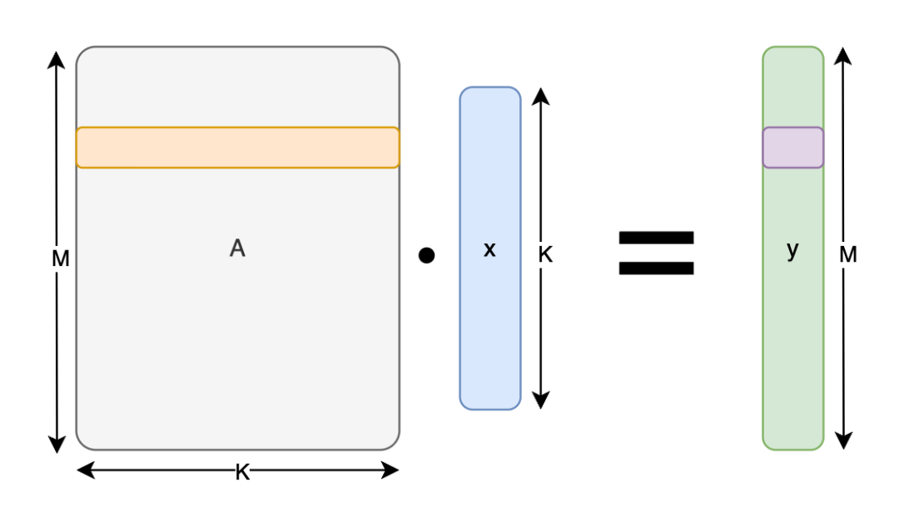
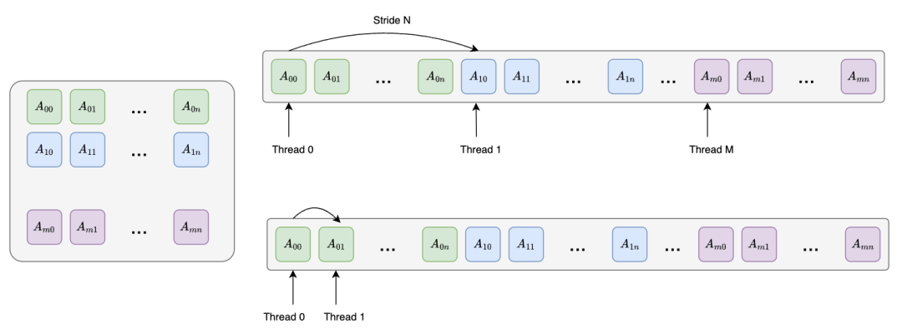
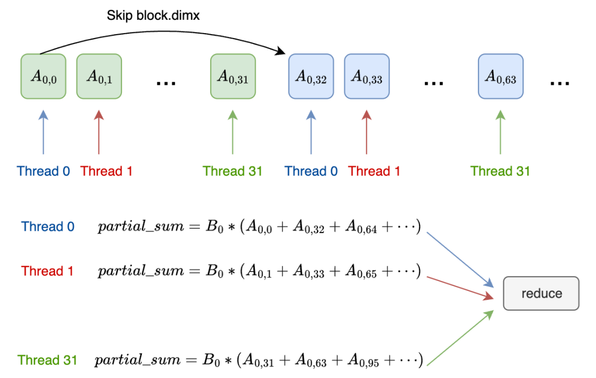
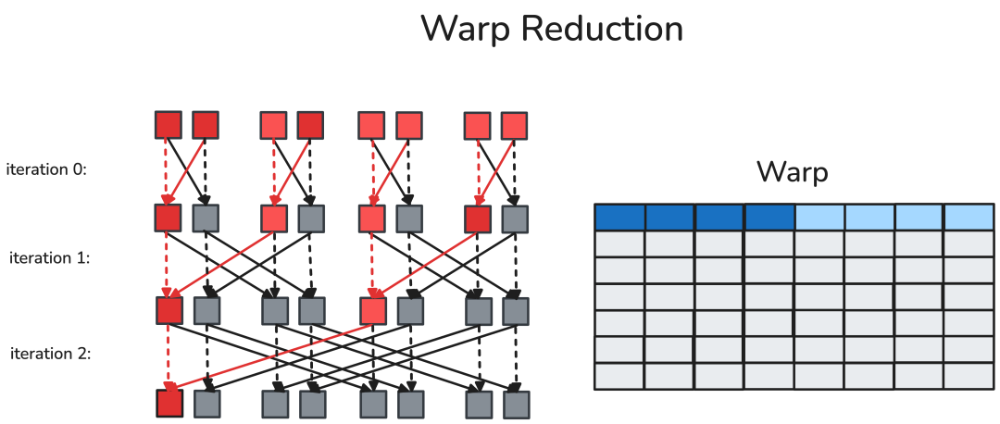

# Tensor-102: GEMV

- 원문 제목: Tensor-102: GEMV
- 저자: Tilebot
- 계정: zartbot
- 발행일: 2025년 10월 9일 09:26

### TL;DR

오늘은 계속해서 CuteDSL과 TileLang의 GEMV operator 관련 내용을 학습한다.

| 알고리즘 구현 | Thor GFLOPS | Thor MemBW | H20 GFLOPS | H20 MemBW |
| --- | --- | --- | --- | --- |
| Cublas | 112.70 | 225.52 GB/s | 1325.4 | 2652.09 GB/s |
| cutedsl-naive | 42.17 | 84.39 GB/s | 95.03 | 190.16 GB/s |
| cutedsl-coalesced | 117.79 | 235.55 GB/s | 972.54 | 1946.03 GB/s |
| cutedsl-block | 128.71 | 257.56 GB/s | 1363.69 | 2728.73 GB/s |
| tilelang-naive | 19.85 | 39.73 GB/s | 50.19 | 100.43 GB/s |
| tilelang-split-k | 37.82 | 75.69 GB/s | 677.37 | 1355.41 GB/s |
| tilelang-vec | 83.42 | 166.93 GB/s | 910.22 | 1821.33 GB/s |
| tilelang-vec-auto-tune | 88.05 | 176.19 GB/s | 1113.13 | 2227.36 GB/s |

## 1. GEMV algorithm

### 1.1 Algorithm overview

GEMV (GEneral Matrix-Vector multiplication, general matrix-vector multiplication)가 구현하려는 computation은 다음과 같다.

$$
y = \alpha \cdot op(A) \cdot x + \beta \cdot y
$$

여기서:

- $A$는 $M \times N$ matrix이다.
- $x$와 $y$는 vector이다.
- $\alpha$와 $\beta$는 scalar이다.
- $op(A)$는 matrix $A$ 자체(no transpose)일 수도 있고, 그 transpose인 $A^T$일 수도 있다.

CPU에서 operation을 execute하는 code는 다음과 같다.

```c++
void gemv_cpu(int M, int N,
            float alpha, const float *A, const float *x,
            float beta, float *y) {
    for (int i = 0; i < M; ++i) {
        float sum = 0.0f;
        for (int j = 0; j < N; ++j) {
            sum += A[i * N + j] * x[j];
        }
        y[i] = alpha * sum + beta * y[i];
    }
}
```

### 1.2 CuBLAS baseline

GEMV도 memory-bound operator이다. CuBLAS에서는 GEMV operation을 수행하는 `cublasSgemv` function을 제공한다.

```c++
#include <iostream>
#include <vector>
#include <cstdlib>
#include <cuda_runtime.h>
#include <cublas_v2.h>

// CUDA 및 CUBLAS API call의 error checking macro
#define CHECK_CUDA(call) do { \
    cudaError_t err = call; \
    if (err != cudaSuccess) { \
        fprintf(stderr, "CUDA Error at %s:%d: %s\n", __FILE__, __LINE__, cudaGetErrorString(err)); \
        exit(EXIT_FAILURE); \
    } \
} while (0)

#define CHECK_CUBLAS(call) do { \
    cublasStatus_t status = call; \
    if (status != CUBLAS_STATUS_SUCCESS) { \
        fprintf(stderr, "CUBLAS Error at %s:%d\n", __FILE__, __LINE__); \
        exit(EXIT_FAILURE); \
    } \
} while (0)


int main() {
    // 1. matrix와 vector의 dimension 정의
    int M = 4096; // matrix A의 row 수
    int N = 4096; // matrix A의 column 수

    std::cout << "Testing cublasSgemv with matrix size " << M << "x" << N << std::endl;

    // GEMV operation의 scalar alpha와 beta 정의
    float alpha = 1.0f;
    float beta = 0.0f;

    // 2. host side에서 data allocation 및 initialization
    std::vector<float> h_A(M * N);
    std::vector<float> h_x(N);
    std::vector<float> h_y(M, 0.0f); // GPU computation result가 여기에 저장된다
    std::vector<float> h_y_cpu(M, 0.0f); // verification용 CPU computation result

    // random number로 matrix와 vector 채우기
    for (int i = 0; i < M * N; ++i) h_A[i] = static_cast<float>(rand()) / RAND_MAX;
    for (int i = 0; i < N; ++i) h_x[i] = static_cast<float>(rand()) / RAND_MAX;

    // 3. device side에서 memory allocation
    float *d_A, *d_x, *d_y;
    CHECK_CUDA(cudaMalloc((void**)&d_A, M * N * sizeof(float)));
    CHECK_CUDA(cudaMalloc((void**)&d_x, N * sizeof(float)));
    CHECK_CUDA(cudaMalloc((void**)&d_y, M * sizeof(float)));

    // 4. CUBLAS handle 생성
    cublasHandle_t handle;
    CHECK_CUBLAS(cublasCreate(&handle));

    // 5. host에서 device로 data copy
    CHECK_CUDA(cudaMemcpy(d_A, h_A.data(), M * N * sizeof(float), cudaMemcpyHostToDevice));
    CHECK_CUDA(cudaMemcpy(d_x, h_x.data(), N * sizeof(float), cudaMemcpyHostToDevice));
    CHECK_CUDA(cudaMemcpy(d_y, h_y.data(), M * sizeof(float), cudaMemcpyHostToDevice));

    // 6. performance test
    cudaEvent_t start, stop;
    CHECK_CUDA(cudaEventCreate(&start));
    CHECK_CUDA(cudaEventCreate(&stop));

    // long warmup
    for (int i = 0; i < 100; ++i) {
        CHECK_CUBLAS(cublasSgemv(handle,       // CUBLAS handle
                             CUBLAS_OP_N,  // A transpose 여부 (No transpose)
                             M,            // matrix A의 row 수
                             N,            // matrix A의 column 수
                             &alpha,       // scalar alpha
                             d_A,          // device 위의 matrix A
                             M,            // A의 leading dimension (column-major에서는 row 수 M)
                             d_x,          // device 위의 vector x
                             1,            // vector x element의 stride
                             &beta,        // scalar beta
                             d_y,          // device 위의 vector y (input/output)
                             1));          // vector y element의 stride
    }
    CHECK_CUDA(cudaDeviceSynchronize());

    // 정식 timing
    int iterations = 100;
    float total_time = 0.0f;

    CHECK_CUDA(cudaEventRecord(start));

    for (int i = 0; i < iterations; ++i) {
        CHECK_CUBLAS(cublasSgemv(handle, CUBLAS_OP_N, M, N, &alpha, d_A, M, d_x, 1, &beta, d_y, 1));
    }

    CHECK_CUDA(cudaEventRecord(stop));
    CHECK_CUDA(cudaEventSynchronize(stop)); // 모든 GPU operation 완료 대기
    CHECK_CUDA(cudaEventElapsedTime(&total_time, start, stop));

    // 7. performance result 계산 및 출력
    float avg_time_ms = total_time / iterations;
    float avg_time_s = avg_time_ms / 1000.0f;

    // GEMV의 floating-point operation 수(FLOPs)는 대략 2 * M * N
    double flops = 2.0 * M * N;
    // GFLOPS = (FLOPs / 10^9) / (time_in_seconds)
    double gflops = (flops / 1e9) / avg_time_s ;

    // effective memory bandwidth 계산
    // 총 (M * N + M + N) * sizeof(float) bytes 전송
    long long num_elements = (long long) M * N + M + N;
    double bytes_transferred = num_elements * sizeof(float);
    double bandwidth_gb_s = (bytes_transferred / 1e9) / avg_time_s;

    std::cout << "------------------------------------------" << std::endl;
    std::cout << "Average execution time: " << avg_time_ms << " ms" << std::endl;
    std::cout << "Performance(GFLOPS): " << gflops << " GFLOPS" << std::endl;
    std::cout << "Effective Memory Bandwidth: " << bandwidth_gb_s << " GB/s" << std::endl;
    std::cout << "------------------------------------------" << std::endl;

    // GPU computation result를 host로 다시 copy
    CHECK_CUDA(cudaMemcpy(h_y.data(), d_y, M * sizeof(float), cudaMemcpyDeviceToHost));

    // 8. resource 정리
    CHECK_CUDA(cudaFree(d_A));
    CHECK_CUDA(cudaFree(d_x));
    CHECK_CUDA(cudaFree(d_y));
    CHECK_CUDA(cudaEventDestroy(start));
    CHECK_CUDA(cudaEventDestroy(stop));
    CHECK_CUBLAS(cublasDestroy(handle));

    return 0;
}
```

Jetson Thor에서의 test result는 다음과 같다.

```
zartbot@zartbot-thor:~$ nvcc -arch=sm_110a -lcublas gemv.cu
zartbot@zartbot-thor:~$ ./a.out
Testing cublasSgemv with matrix size 4096x4096
------------------------------------------
Average execution time: 0.297716 ms
Performance(GFLOPS): 112.706 GFLOPS
Effective Memory Bandwidth: 225.523 GB/s
------------------------------------------
```

H20에서 run한 result는 다음과 같다.

```
Testing cublasSgemv with matrix size 4096x4096
------------------------------------------
Average execution time: 0.0253165 ms
Performance(GFLOPS): 1325.4 GFLOPS
Effective Memory Bandwidth: 2652.09 GB/s
------------------------------------------
```

## 2. CuteDSL

### 2.1 Naive

계산은 아래 그림과 같다.



가장 simple한 operation을 하나 구성해 보자. 각 thread가 $A$ matrix의 한 row를 담당하고, multiply-add를 수행한 뒤 result에 write한다.

```python
import torch
from functools import partial

import cutlass
import cutlass.cute as cute
from cutlass.cute.runtime import from_dlpack

@cute.kernel
def naive_gemv_kernel(
    gA: cute.Tensor,
    gB: cute.Tensor,
    gC: cute.Tensor,
):
    tidx, _, _ = cute.arch.thread_idx()
    bidx, _, _ = cute.arch.block_idx()
    bdim, _, _ = cute.arch.block_dim()

    row = bidx * bdim + tidx

    m, n = gA.shape
    acc = cutlass.Float64(0.0)
    if (row < m ):
        for col in range(4096):
            acc += gA[row , col] * gB[col]

    gC[row] = acc.to(cutlass.Float32)


@cute.jit
def naive_gemv(
    mA: cute.Tensor,
    mB: cute.Tensor,
    mC: cute.Tensor
):
    num_threads_per_block = 32

    m, n = mA.shape
    kernel = naive_gemv_kernel(mA, mB, mC)
    kernel.launch(grid=(cute.ceil_div(m,num_threads_per_block ), 1, 1),
                  block=(num_threads_per_block, 1, 1))

M, K = 4096, 4096

a = torch.randn(M, K, device="cuda", dtype=torch.float32)
b = torch.randn(K, device="cuda", dtype=torch.float32)
c = torch.zeros(M, device="cuda", dtype=torch.float32)

a_ = from_dlpack(a, assumed_align=16)
b_ = from_dlpack(b)
c_ = from_dlpack(c)

# Compile kernel
naive_gemv_ = cute.compile(naive_gemv, a_, b_, c_)
naive_gemv_(a_, b_, c_)

# verify correctness
torch.testing.assert_close(c,torch.mv(a, b),atol=1e-4, rtol=1.3e-6)
```

마찬가지로 benchmark function을 구성해 performance evaluation을 수행한다.

```python
def benchmark(callable, *, num_warmups, num_iterations):
    start_event = torch.cuda.Event(enable_timing=True)
    end_event = torch.cuda.Event(enable_timing=True)

    torch.cuda.synchronize()

    for _ in range(num_warmups):
        callable()

    start_event.record(stream=torch.cuda.current_stream())
    for _ in range(num_iterations):
        callable()
    end_event.record(stream=torch.cuda.current_stream())
    torch.cuda.synchronize()

    elapsed_time = start_event.elapsed_time(end_event)
    avg_time = elapsed_time / num_iterations
    gflops =  2* a.numel()  / (avg_time  / 1000) / 1e9

    print(f"Average execution time: {avg_time:.4f} ms")
    print(f"Performance (GFLOPS): {gflops:.4f} GFLOPS")
    print(f"Effective Memory Bandwidth: {((a.numel()+b.numel()+c.numel()) * 4) / (avg_time / 1000) / 1e9:.2f} GB/s")

benchmark(partial(naive_gemv_, a_, b_, c_), num_warmups=50, num_iterations=100)
```

Jetson Thor에서의 result는 다음과 같다.

```
Average execution time: 0.7956 ms
Performance (GFLOPS): 42.1748 GFLOPS
Effective Memory Bandwidth: 84.39 GB/s
```

H20에서의 result는 다음과 같다.

```
Average execution time: 0.3531 ms
Performance (GFLOPS): 95.0356 GFLOPS
Effective Memory Bandwidth: 190.16 GB/s
```

### 2.2 Memory access coalescing

이 구현의 performance가 매우 나쁘다는 점에 주목하자. 주요 원인은 각 thread가 access하는 memory space가 연속적이지 않아 memory load를 coalescing할 수 없기 때문이다. matrix $A$가 Row-major로 배치되어 있다면, 여러 thread가 연속적으로 access하게 만들 수 있을까?



이때 각 thread는 일부 column의 value만 access한다. 아래와 같다. 따라서 computation이 끝난 뒤 thread가 계산한 partial sum에 대해 reduce를 수행해야 한다.



CuteDSL Reduction computation에 대해서는 QuACK에 "Getting Memory-bound Kernels to Speed-of-Light"[1]라는 문서가 있다.

warp 내부 reduce 계산은 warp shuffle 방식으로 execute할 수 있다. 예를 들면 아래 그림의 butterfly warp reduction이다.



구체적인 implementation은 다음과 같다.

```python
import math
from typing import Callable, Optional

@cute.jit
def warp_reduce(
    val : cute.Numeric,
    op: Callable,
    width: cutlass.Constexpr[int] = cute.arch.WARP_SIZE
):
    for i in cutlass.range_constexpr(int(math.log2(width))):
            val = op(val, cute.arch.shuffle_sync_bfly(val, offset=1 << i))
    return val
```

전체 GEMV Kernel은 다음과 같다.

```python
@cute.kernel
def coalesced_gemv_kernel(
    gA: cute.Tensor,
    gB: cute.Tensor,
    gC: cute.Tensor,
):
    tidx, _, _ = cute.arch.thread_idx()
    bidx, _, _ = cute.arch.block_idx()
    bdim, _, _ = cute.arch.block_dim()

    m, n = gA.shape

    partial_sum = cutlass.Float32(0.0)
    for  i in range( n // bdim +1):
        col = i * bdim + tidx
        if (col < n):
            partial_sum += gA[bidx , col] * gB[col]

    # reduce partial_sum
    partial_sum = warp_reduce(partial_sum,lambda x,y: x +y )

    if (tidx == 0):
        gC[bidx] = partial_sum

@cute.jit
def coalesced(
    mA: cute.Tensor,
    mB: cute.Tensor,
    mC: cute.Tensor
):
    num_threads_per_block = cute.arch.WARP_SIZE

    m, n = mA.shape
    kernel = coalesced_gemv_kernel(mA, mB, mC)
    kernel.launch(grid=(m, 1, 1),
                  block=(num_threads_per_block, 1, 1))

M, K = 4096, 4096

a = torch.randn(M, K, device="cuda", dtype=torch.float32)
b = torch.randn(K, device="cuda", dtype=torch.float32)
c = torch.zeros(M, device="cuda", dtype=torch.float32)

a_ = from_dlpack(a, assumed_align=16)
b_ = from_dlpack(b)
c_ = from_dlpack(c)

# Compile kernel
coalesced_ = cute.compile(coalesced, a_, b_, c_)
coalesced_(a_, b_, c_)

# verify correctness
torch.testing.assert_close(c,torch.mv(a, b),atol=1e-4, rtol=1.3e-6)
```

Benchmark를 execute한다.

```c++
benchmark(partial(coalesced_gemv_, a_, b_, c_), num_warmups=50, num_iterations=100)
```

Jetson Thor에서 execute하면, 기본적으로 memory bandwidth를 이미 꽉 채웠다.

```
Average execution time: 0.2850 ms
Performance (GFLOPS): 117.7191 GFLOPS
Effective Memory Bandwidth: 235.55 GB/s
```

H20에서 execute하면, 아직 개선 여지가 있음을 볼 수 있다.

```
Average execution time: 0.0345 ms
Performance (GFLOPS): 972.5426 GFLOPS
Effective Memory Bandwidth: 1946.03 GB/s
```

### 2.3 Vector load

각 thread의 한 번 LD/ST가 여전히 scalar라는 점에 주목하자. vectorized 방식으로 load할 수 있을까? 마찬가지로 block 하나가 한 row를 처리하게 하되, 각 block 안의 thread 수 `num_thread_per_block`을 늘린다. 그러면 각 thread가 처리해야 하는 element 수는 다음과 같다.

```c++
num_thread_per_block = 512
num_elements_per_thread = A.shape[1] // num_thread_per_block
```

이때 계속 TV\_Layout 방식을 사용한다. Thread Layout에 대해서는 `(1,num\_thread\_per\_block):(num\_thread\_per\_block,1)` 방식으로 배치하고, Value Layout에 대해서는 `(1,num\_elements\_per\_thread):(num\_elements\_per\_thread,1)`을 사용한다. 따라서 matrix $A$에 대한 Tiling은 다음과 같다.

```c++
    thr_layout = cute.make_layout((1, num_thread_per_block), stride=(num_thread_per_block, 1))
    val_layout = cute.make_layout((1, num_elements_per_thread), stride=( num_elements_per_thread, 1))
    tiler_mn, tv_layout = cute.make_layout_tv(thr_layout, val_layout)

    gA = cute.zipped_divide(mA, tiler_mn)  # ((TileM, TileN), (RestM, RestN))
```

예를 들어 M=N=4096, num\_thread\_per\_block = 512일 때, Tiler: (1, 4096), TV Layout: (512,8):(8,1)이다. 즉 block 하나에는 8개의 warp가 있고, 각 warp가 512개 value를 처리한다. Kernel을 launch할 때는 다음과 같다.

```c++
    block_gemv_kernel(
        gA, mB, mC, tv_layout
    ).launch(
        grid=[gA.shape[1][0], gA.shape[1][1], 1],
        block=[cute.size(tv_layout, mode=[0]), 1, 1],
    )
```

Kernel 내부에서도 마찬가지로 block tile Layout과 TV\_Layout을 compose하는 방식으로 처리해야 할 A-Tile을 얻고, `tensor.load()`를 사용해 vector load를 수행한다.

```c++
    blk_coord = (None, (bidx,bidy))

    # logical coord -> address
    blkA = gA[blk_coord]  # (TileM, TileN) -> physical address
    tidfrgA = cute.composition(blkA, tv_layout)

    thr_coord = (tidx, None)
    thrA = tidfrgA[thr_coord]  # (V) -> physical address
    a_vec = thrA.load()
```

vector B에 대해서는 각 thread가 처리해야 하는 element 수(`tidfrgA.shape[1]`와 같음)에 따라 직접 partition한다.

```c++
    b_tiler = cute.make_layout(tidfrgA.shape[1], stride=1)
    blkB = cute.zipped_divide(gB, tiler=b_tiler)
    b_vec = blkB[(None,tidx)].load()
```

그다음 thread 내부 data에 대해 computation을 수행할 수 있다.

```c++
    thread_sum = 0.0
    for i in cutlass.range (tidfrgA.shape[1]):
        thread_sum += a_vec[i] * b_vec[i]
```

그러면 각 thread에는 `thread_sum`이 생기고, 이를 block-level에서 합산해야 한다. 앞 절에서는 warp shuffle을 사용해 warp-level reduce-sum을 계산할 수 있었다. 이번에도 일반적인 방법을 사용해 먼저 warp-level에서 sum을 구한다. 그다음 각 warp의 첫 번째 thread(`lane\_id == 0`)를 smem에 write하고, warp 수에 따라 smem의 data를 warp-0의 서로 다른 thread 안으로 load한 뒤 다시 한 번 warp-reduce를 수행한다. 마지막으로 sum result를 GMEM에 write한다.

```c++
    lane_id = cute.arch.lane_idx()
    warp_id = cute.arch.warp_idx()
    warp_num = bdimx // cute.arch.WARP_SIZE

    warp_sum = warp_reduce(thread_sum,lambda x,y: x +y)

    smem = cutlass.utils.SmemAllocator()
    reduce_buffer = smem.allocate_tensor(
        element_type= cutlass.Float32,
        layout=cute.make_layout(shape=(16), stride=(1)),
        byte_alignment=16,
    )

    if lane_id == 0 :
        reduce_buffer[warp_id] = warp_sum

    cute.arch.barrier()
    sum = 0.0
    if (warp_id == 0):
        if (tidx < warp_num):
            warp_sum = reduce_buffer[tidx]
        else:
            warp_sum = 0.0
        sum = warp_reduce(warp_sum , lambda x,y : x+y)

    if (tidx == 0):
        gC[bidx] = sum
```

마지막으로 complete code는 다음과 같다.

```python
@cute.jit
def warp_reduce(
    val : cute.Numeric,
    op: Callable,
    width: cutlass.Constexpr[int] = cute.arch.WARP_SIZE
):
    for i in cutlass.range_constexpr(int(math.log2(width))):
            val = op(val, cute.arch.shuffle_sync_bfly(val, offset=1 << i))
    return val

@cute.kernel
def block_gemv_kernel(
    gA: cute.Tensor,
    gB: cute.Tensor,
    gC: cute.Tensor,
    tv_layout: cute.Layout
):
    tidx, _, _ = cute.arch.thread_idx()
    bidx, bidy, _ = cute.arch.block_idx()
    bdimx, bdimy, _ = cute.arch.block_dim()

    lane_id = cute.arch.lane_idx()
    warp_id = cute.arch.warp_idx()
    warp_num = bdimx // cute.arch.WARP_SIZE

    blk_coord = (None, (bidx,bidy))

    # logical coord -> address
    blkA = gA[blk_coord]  # (TileM, TileN) -> physical address
    tidfrgA = cute.composition(blkA, tv_layout)

    thr_coord = (tidx, None)
    thrA = tidfrgA[thr_coord]  # (V) -> physical address
    a_vec = thrA.load()

    b_tiler = cute.make_layout(tidfrgA.shape[1], stride=1)
    blkB = cute.zipped_divide(gB, tiler=b_tiler)
    b_vec = blkB[(None,tidx)].load()


    thread_sum = 0.0
    for i in cutlass.range (tidfrgA.shape[1]):
        thread_sum += a_vec[i] * b_vec[i]

    warp_sum = warp_reduce(thread_sum,lambda x,y: x +y)

    smem = cutlass.utils.SmemAllocator()
    reduce_buffer = smem.allocate_tensor(
        element_type= cutlass.Float32,
        layout=cute.make_layout(shape=(16), stride=(1)),
        byte_alignment=16,
    )

    if lane_id == 0 :
        reduce_buffer[warp_id] = warp_sum

    cute.arch.barrier()

    sum = 0.0
    if (warp_id == 0):
        if (tidx < warp_num):
            warp_sum = reduce_buffer[tidx]
        else:
            warp_sum = 0.0
        sum = warp_reduce(warp_sum , lambda x,y : x+y)

    if (tidx == 0):
        gC[bidx] = sum


@cute.jit
def block_gemv(
    mA: cute.Tensor,
    mB: cute.Tensor,
    mC: cute.Tensor,
):

    num_thread_per_block = 512
    num_elements_per_thread = mA.shape[1] // num_thread_per_block

    thr_layout = cute.make_layout((1, num_thread_per_block), stride=(num_thread_per_block, 1))
    val_layout = cute.make_layout((1, num_elements_per_thread), stride=( num_elements_per_thread, 1))
    tiler_mn, tv_layout = cute.make_layout_tv(thr_layout, val_layout)
    print(f"Tiler: {tiler_mn}")
    print(f"TV Layout: {tv_layout}")

    gA = cute.zipped_divide(mA, tiler_mn)  # ((TileM, TileN), (RestM, RestN))

    print(f"Tiled Input Tensors:")
    print(f"  gA: {gA.type}, shape {gA.shape[1][0]}")

    block_gemv_kernel(
        gA, mB, mC, tv_layout
    ).launch(
        grid=[gA.shape[1][0], gA.shape[1][1], 1],
        block=[cute.size(tv_layout, mode=[0]), 1, 1],
    )

M, N = 4096, 4096

a = torch.randn(M, N, device="cuda", dtype=torch.float32)
b = torch.randn(N, device="cuda", dtype=torch.float32)
c = torch.zeros(M, device="cuda", dtype=torch.float32)

a_ = from_dlpack(a, assumed_align=16)
b_ = from_dlpack(b, assumed_align=16)
c_ = from_dlpack(c)

block_gemv_ = cute.compile(block_gemv, a_, b_, c_)
block_gemv_(a_, b_, c_)

# verify correctness
torch.testing.assert_close(c,torch.mv(a, b),atol=1e-4, rtol=1.3e-6)
```

Jetson Thor performance test result는 다음과 같으며, 이미 memory bandwidth를 꽉 채웠다.

```
benchmark(partial(block_gemv_, a_, b_, c_), num_warmups=50, num_iterations=100)

Average execution time: 0.2607 ms
Performance (GFLOPS): 128.7154 GFLOPS
Effective Memory Bandwidth: 257.56 GB/s
```

H20 performance test result는 다음과 같으며, performance가 이미 Cublas를 넘어섰다.

```
Average execution time: 0.0246 ms
Performance (GFLOPS): 1363.6997 GFLOPS
Effective Memory Bandwidth: 2728.73 GB/s
```

## 3. TileLang

Tilelang official docs에는 "General Matrix-Vector Multiplication (GEMV)"[2]라는 소개 문서가 있다.

### 3.1 Navie

TileLang 자체가 좋은 Tile-based abstraction을 가지고 있기 때문에, matrix $A$를 `(BLOCK_M, BLOCK_K)` Tile로 매우 simple하게 나누고, $B$도 `(BLOCK_K)` block으로 나눈 뒤 순서대로 dot product를 수행하고 sum을 구할 수 있다.

```python
import torch

import tilelang
import tilelang.language as T

def naive_gemv(
    M: int,
    K: int,
    BLOCK_M: int,
    BLOCK_K: int,
    dtype: str = "float16",
    accum_dtype: str = "float",
):

    @T.prim_func
    def main(
            A: T.Buffer((M, K), dtype),
            B: T.Buffer((K,), dtype),
            C: T.Buffer((M,), dtype),
    ):
        with T.Kernel(T.ceildiv(M, BLOCK_M)) as bm:
            tm = T.get_thread_binding(0)  # tm = threadIdx.x
            A_shared = T.alloc_shared((BLOCK_M, BLOCK_K), dtype)
            B_shared = T.alloc_shared((BLOCK_K,), dtype)
            C_reg = T.alloc_local((1,), accum_dtype)
            T.clear(C_reg)
            for bk in T.serial(T.ceildiv(K, BLOCK_K)):
                for tk in T.serial(BLOCK_K):
                    A_shared[tm, tk] = A[bm * BLOCK_M + tm, bk * BLOCK_K + tk]
                    B_shared[tk] = B[bk * BLOCK_K + tk]

                for tk in T.serial(BLOCK_K):
                    C_reg[0] +=  A_shared[tm,tk].astype(accum_dtype) *B_shared[tk].astype(accum_dtype)
            C[bm * BLOCK_M + tm] = C_reg[0]

    return main
```

CuteDSL과 비교하면 Tilelang은 tensor tiling의 dataflow description이 조금 더 simple하고 직관적이다.

그다음 아래 code를 계속 사용해 verification과 performance measurement를 수행한다.

```python
M,K = 4096,4096
BLOCK_M,BLOCK_K = 128,128

func = naive_gemv(M, K, BLOCK_M,BLOCK_K, "float32","float32")
jit_kernel = tilelang.compile(func, out_idx=[-1], target="cuda")

a = torch.randn(M, K, device="cuda", dtype=torch.float32)
b = torch.randn(K, device="cuda", dtype=torch.float32)
c = torch.zeros(M, device="cuda", dtype=torch.float32)

c = jit_kernel(a,b)
# verify correctness
torch.testing.assert_close(c, torch.mv(a ,b),atol=1e-3, rtol=1.3e-6)

profiler = jit_kernel.get_profiler()
avg_time = profiler.do_bench()

gflops =  2 * a.numel()  / (avg_time  / 1000) / 1e9
print(f"Average execution time: {avg_time:.4f} ms")
print(f"Performance (GFLOPS): {gflops:.4f} GFLOPS")
print(f"Effective Memory Bandwidth: {( ( a.numel() +b.numel() +c.numel()) * 4) / (avg_time / 1000) / 1e9:.2f} GB/s")
```

Jetson Thor에서의 performance는 다음과 같다.

```
Average execution time: 1.6899 ms
Performance (GFLOPS): 19.8556 GFLOPS
Effective Memory Bandwidth: 39.73 GB/s
```

H20에서의 performance는 다음과 같다.

```
Average execution time: 0.6685 ms
Performance (GFLOPS): 50.1927 GFLOPS
Effective Memory Bandwidth: 100.43 GB/s
```

naive code의 performance는 peak의 1/20에도 미치지 못하므로, overall parallelism이 높지 않다.

### 3.2 Parallelism 증가(Split-K)

K dimension에서 tiling을 수행해 parallelism을 늘린다.

```python
def naive_split_gemv(
    M: int,
    K: int,
    BLOCK_M: int,
    BLOCK_K: int,
    dtype: str = "float16",
    accum_dtype: str = "float",
):

    @T.prim_func
    def main(
            A: T.Buffer((M, K), dtype),
            B: T.Buffer((K,), dtype),
            C: T.Buffer((M,), dtype),
    ):
        #add K dim,threads=[BLOCK_M,BLOCK_K]
        with T.Kernel(T.ceildiv(M, BLOCK_M),threads=(BLOCK_M,BLOCK_K)) as bm:
            tm = T.get_thread_binding(0)  # tm = threadIdx.x
            tk = T.get_thread_binding(1)  # tk = threadIdx.y

            A_local = T.alloc_local((1,), dtype) #thread local buffer
            B_local = T.alloc_local((1,), dtype)
            C_accum =  T.alloc_local((1,), accum_dtype)

            C_shared = T.alloc_shared((BLOCK_M,), accum_dtype) #alloc SMEM
            if tk == 0:
                C_shared[tm] = 0.0

            T.clear(C_accum)

            for bk in T.serial(T.ceildiv(K,BLOCK_K)):
                A_local[0] = A[bm * BLOCK_M + tm, bk * BLOCK_K + tk]
                B_local[0] = B[bk * BLOCK_K + tk]
                C_accum[0] +=  A_local[0].astype(accum_dtype) * B_local[0].astype(accum_dtype)
            # finally use atomic to accumulate into smem
            T.atomic_add(C_shared[tm], C_accum[0])
            C[bm * BLOCK_M + tm] = C_shared[tm]
    return main
```

Test 및 verification:

```c++
M,K = 4096,4096

BLOCK_M,BLOCK_K = 8,32

func = naive_split_gemv(M, K, BLOCK_M, BLOCK_K, "float32","float32")
jit_kernel = tilelang.compile(func, out_idx=[-1], target="cuda")

a = torch.randn(M, K, device="cuda", dtype=torch.float32)
b = torch.randn(K, device="cuda", dtype=torch.float32)
c = torch.zeros(M, device="cuda", dtype=torch.float32)

c = jit_kernel(a,b)

# verify correctness
torch.testing.assert_close(c, torch.mv(a ,b),atol=1e-3, rtol=1.3e-6)
```

마지막으로 performance test를 수행한다.

```c++
profiler = jit_kernel.get_profiler()
avg_time = profiler.do_bench()

gflops =  2 * a.numel()  / (avg_time  / 1000) / 1e9
print(f"Average execution time: {avg_time:.4f} ms")
print(f"Performance (GFLOPS): {gflops:.4f} GFLOPS")
print(f"Effective Memory Bandwidth: {( ( a.numel() +b.numel() +c.numel()) * 4) / (avg_time / 1000) / 1e9:.2f} GB/s")
```

Jetson Thor에서의 test result

```
Average execution time: 0.8871 ms
Performance (GFLOPS): 37.8253 GFLOPS
Effective Memory Bandwidth: 75.69 GB/s
```

H20에서의 test result:

```
Average execution time: 0.0495 ms
Performance (GFLOPS): 677.3747 GFLOPS
Effective Memory Bandwidth: 1355.41 GB/s
```

### 3.3 Vectorized load 및 TVM\_thread\_allreduce

TileLang에서는 `T.vectorized`를 사용해 vectorized load를 사용할 수 있다. 또한 reduce computation에서 atomic도 performance에 큰 영향을 준다. cuteDSL에서는 warp shuffle 방식으로 reduce를 처리했지만, TileLang에서는 `tvm\_thread\_allreduce`로 대체할 수 있다.

```python
from tilelang import tvm as tvm
from tvm import DataType

def split_gemv_vec(
    M: int,
    K: int,
    BLOCK_M: int,
    reduce_threads: int,
    dtype: str = "float16",
    accum_dtype: str = "float",
):
    MAX_TRANSACTION_SIZE_IN_BITS = 128
    TILE_K = MAX_TRANSACTION_SIZE_IN_BITS // DataType(dtype).bits
    BLOCK_K = reduce_threads * TILE_K


    @T.prim_func
    def main(
            A: T.Buffer((M, K), dtype),
            B: T.Buffer((K,), dtype),
            C: T.Buffer((M,), dtype),
    ):
        #add K dim,threads=[BLOCK_M,reduce_threads]
        with T.Kernel(T.ceildiv(M, BLOCK_M), threads=(BLOCK_M, reduce_threads)) as bm:
            tm = T.get_thread_binding(0)  # tm = threadIdx.x
            tk = T.get_thread_binding(1)  # tk = threadIdx.y

            A_local = T.alloc_local((TILE_K,), dtype) #thread local buffer
            B_local = T.alloc_local((TILE_K,), dtype)
            C_accum =  T.alloc_local((1,), accum_dtype)

            C_shared = T.alloc_shared((BLOCK_M,), accum_dtype) #alloc SMEM

            T.clear(C_accum)

            for bk in T.serial(T.ceildiv(K,BLOCK_K)):
                for k in T.vectorized(TILE_K):
                    A_local[k] = A[bm * BLOCK_M + tm, bk * BLOCK_K + tk * TILE_K + k]
                    B_local[k] = B[bk * BLOCK_K + tk * TILE_K + k]

                for k in T.serial(TILE_K):
                     C_accum[0] +=  A_local[k].astype(accum_dtype) * B_local[k].astype(accum_dtype)

            # TVM thread allreduce 사용
            C_reduced = T.alloc_local((1,), accum_dtype)
            with T.attr(
                    T.comm_reducer(lambda x, y: x + y, [T.Cast(accum_dtype, 0)]),
                    "reduce_scope",
                    T.reinterpret(T.uint64(0), dtype="handle"),
            ):
                T.evaluate(
                    T.tvm_thread_allreduce(
                        T.uint32(1),
                        C_accum[0],
                        True,
                        C_reduced[0],
                        tk,
                        dtype="handle",
                    ))
            C[bm * BLOCK_M + tm] = C_reduced[0]
    return main

M,K = 4096,4096

BLOCK_M = 4
reduce_threads = 32

func = split_gemv_vec(M, K, BLOCK_M, reduce_threads, "float32","float32")
jit_kernel = tilelang.compile(func, out_idx=[-1], target="cuda")

a = torch.randn(M, K, device="cuda", dtype=torch.float32)
b = torch.randn(K, device="cuda", dtype=torch.float32)
c = torch.zeros(M, device="cuda", dtype=torch.float32)

c = jit_kernel(a,b)

# verify correctness
torch.testing.assert_close(c, torch.mv(a ,b),atol=1e-3, rtol=1.3e-6)
```

performance test는 다음과 같으며, Jetson Thor에서의 performance이다.

```
Average execution time: 0.4022 ms
Performance (GFLOPS): 83.4248 GFLOPS
Effective Memory Bandwidth: 166.93 GB/s
```

H20에서의 performance:

```
Average execution time: 0.0369 ms
Performance (GFLOPS): 910.2222 GFLOPS
Effective Memory Bandwidth: 1821.33 GB/s
```

### 3.4 Auto-Tune

이 Kernel에는 `BLOCK_M`, `reduce_threads`라는 두 hyperparameter가 있으며, AutoTune을 수행한다.

```c++
import itertools


def ref_program(A, B):
    return A @ B.T


def get_config():
    BLOCK_M = [1, 2, 4, 8,16, 32, 64, 128]
    reduce_threads = [4, 8, 16, 32, 64, 128, 256]
    _configs = list(itertools.product(
        BLOCK_M,
        reduce_threads,
    ))

    configs = []
    for c in _configs :
        if (c[0] * c[1] <=1024):
            configs.append({
                "BLOCK_M": c[0],
                "reduce_threads": c[1],
            })
    return configs

get_config()

@tilelang.autotune(
    configs= get_config(),
    warmup= 50,
    rep = 100,
)
@tilelang.jit(
    out_idx=[-1],
    target="auto",
)

def kernel(
    BLOCK_M=None,
    reduce_threads = None,
):
    M = 4096
    K = 4096
    dtype = "float32"
    accum_dtype = "float32"
    MAX_TRANSACTION_SIZE_IN_BITS = 128
    TILE_K = MAX_TRANSACTION_SIZE_IN_BITS // DataType(dtype).bits
    BLOCK_K = reduce_threads * TILE_K


    @T.prim_func
    def main(
            A: T.Buffer((M, K), dtype),
            B: T.Buffer((K,), dtype),
            C: T.Buffer((M,), dtype),
    ):
        #add K dim,threads=[BLOCK_M,reduce_threads]
        with T.Kernel(T.ceildiv(M, BLOCK_M), threads=(BLOCK_M, reduce_threads)) as bm:
            tm = T.get_thread_binding(0)  # tm = threadIdx.x
            tk = T.get_thread_binding(1)  # tk = threadIdx.y

            A_local = T.alloc_local((TILE_K,), dtype) #thread local buffer
            B_local = T.alloc_local((TILE_K,), dtype)
            C_accum =  T.alloc_local((1,), accum_dtype)

            C_shared = T.alloc_shared((BLOCK_M,), accum_dtype) #alloc SMEM

            T.clear(C_accum)

            for bk in T.serial(T.ceildiv(K,BLOCK_K)):
                for k in T.vectorized(TILE_K):
                    A_local[k] = A[bm * BLOCK_M + tm, bk * BLOCK_K + tk * TILE_K + k]
                    B_local[k] = B[bk * BLOCK_K + tk * TILE_K + k]

                for k in T.serial(TILE_K):
                     C_accum[0] +=  A_local[k].astype(accum_dtype) * B_local[k].astype(accum_dtype)

            # TVM thread allreduce 사용
            C_reduced = T.alloc_local((1,), accum_dtype)
            with T.attr(
                    T.comm_reducer(lambda x, y: x + y, [T.Cast(accum_dtype, 0)]),
                    "reduce_scope",
                    T.reinterpret(T.uint64(0), dtype="handle"),
            ):
                T.evaluate(
                    T.tvm_thread_allreduce(
                        T.uint32(1),
                        C_accum[0],
                        True,
                        C_reduced[0],
                        tk,
                        dtype="handle",
                    ))
            C[bm * BLOCK_M + tm] = C_reduced[0]
    return main
auto_kernel = kernel()

best_config = auto_kernel.config
best_latency = auto_kernel.latency
print(f"Best Config: {best_config}")

gflops =  2 * a.numel()  / (best_latency  / 1000) / 1e9
print(f"Average execution time: {best_latency:.4f} ms")
print(f"Performance (GFLOPS): {gflops:.4f} GFLOPS")
print(f"Effective Memory Bandwidth: {( ( a.numel() +b.numel() +c.numel()) * 4) / (best_latency / 1000) / 1e9:.2f} GB/s")
```

Jetson Thor에서의 best performance는 다음과 같다.

```c++
Best Config: {'BLOCK_M': 2, 'reduce_threads': 256}
Average execution time: 0.3811 ms
Performance (GFLOPS): 88.0519 GFLOPS
Effective Memory Bandwidth: 176.19 GB/s
```

H20에서의 best performance:

```c++
Best Config: {'BLOCK_M': 1, 'reduce_threads': 64}
Average execution time: 0.0301 ms
Performance (GFLOPS): 1113.1380 GFLOPS
Effective Memory Bandwidth: 2227.36 GB/s
```

참고 자료

[1]

Getting Memory-bound Kernels to Speed-of-Light: *https://github.com/Dao-AILab/quack/blob/main/media/2025-07-10-membound-sol.md*

[2]

TileLang GEMV: *https://tilelang.com/deeplearning\_operators/gemv.html*
