# Tensor-103.1: Basic GEMM

- 원문 제목: Tensor-103.1: Basic GEMM
- 저자: Tilebot
- 계정: zartbot
- 발행일: 2025년 10월 18일 09:13

### TL;DR

이 글에서는 매우 basic하면서도 널리 사용되는 GEMM operator를 CuteDSL과 Tilelang에서 구현하는 방법을 소개하고, Hopper(H20)와 Blackwell(Jetson Thor)을 결합해 몇 가지 targeted optimization을 수행한다. 또한 단일 글의 분량을 조절하기 위해 이 내용은 여러 편으로 나눈다. 이 글은 첫 번째 편으로 CuteDSL 기반 Basic Gemm을 소개한다. 두 번째 편에서는 Hopper GEMM 내용을 소개하고, 세 번째 편에서는 Blackwell GEMM, 네 번째 편에서는 TileLang GEMM을 소개한다. 이후에도 GEMM 관련 다른 내용을 몇 편 더 소개할 수 있다.

```c++
1 GEMM algorithm
1.1 Algorithm overview
1.2 Blocked matrix multiplication
1.3 TensorCore

2 CuteDSL
2.1 Basic Gemm
2.1.1 TiledCopy
2.1.2 TiledMMA
2.1.3 Kernel
2.1.3.1 TileCopy Layout
2.1.3.2 Predication Tensor
2.1.3.3 Prefetch Prologue
2.1.3.4 RMEM allocation 및 prefetch
2.1.3.5 Main loop
2.1.3.6 Epilogue

Ref. CublasLt GEMM
```

## 1. GEMM algorithm

### 1.1 Algorithm overview

GEMM(GEneral Matrix-Matrix multiplication)은 linear algebra library BLAS(Basic Linear Algebra Subprograms)의 core operation이다. 그 standard form은 다음과 같다.

$$
C = \alpha * A * B + \beta * C
$$

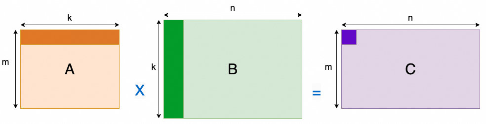

- **A**: M x K matrix
- **B**: K x N matrix
- **C**: M x N matrix (input 및 output)
- **$\alpha,\beta$**: scalar (constant)

이는 scientific computing과 engineering computing의 core building block이다. deep learning에서는 다음과 같다.

- **Fully Connected Layer**: forward propagation process가 그대로 GEMM operation이다.
- **Convolutional Layer**: `im2col` (image-to-column) 방식으로 convolution operation을 대규모 GEMM operation으로 효율적으로 변환할 수 있다.

neural network의 대부분 computation이 이러한 layer에 집중되어 있기 때문에, **GEMM의 performance가 전체 AI training과 inference speed를 직접 결정한다**.

CPU에서 compute하는 method는 다음과 같다.

```c++
// A, B, C가 모두 row-major storage라고 가정
// C = A * B (단순화를 위해 alpha=1, beta=0으로 둔다)
for (int i = 0; i < M; ++i)
    for (int j = 0; j < N; ++j)
        for (int k = 0; k < K; ++k)
            C[i][j] += A[i][k] * B[k][j];
}
```

이 algorithm의 computational complexity는 $\mathcal O(M * N * K)$이다.

### 1.2 Blocked matrix multiplication

자세한 내용은 "Tensor-001 Matrix multiplication blocked multiplication overview"를 참고하면 된다. 여기서는 간단히 설명한다. 보통 하나의 matrix를 여러 block으로 나눌 수 있다. 예를 들면 다음과 같다.

$$
P =
\begin{bmatrix}
1 & 2 & 3 & 4\\
5 & 6 & 7 & 8\\
9 & 10 & 11 & 12 \\
13 & 14 & 15 & 16
\end{bmatrix}
$$

이를 4개의 블록으로 나눌 수 있다.

$$
P =
\begin{bmatrix}
1 & 2 & | & 3 & 4\\
5 & 6 & | & 7 & 8\\
- & - & + & - & - \\
9 & 10 & | & 11 & 12 \\
13 & 14 & |  & 15 & 16
\end{bmatrix}
$$

다음과 같이 표기할 수 있다.

$$
P_{11} =
\begin{bmatrix}
1 & 2 \\
5 & 6
\end{bmatrix}
,
P_{12} =
\begin{bmatrix}
3 & 4 \\
7 & 8
\end{bmatrix}
,
P_{21} =
\begin{bmatrix}
9 & 10 \\
13 & 14
\end{bmatrix}
,
P_{22} =
\begin{bmatrix}
11 & 12 \\
15 & 16
\end{bmatrix}
$$

블록으로 나눈 뒤의 행렬은 다음과 같이 표기한다.

$$
P =
\begin{bmatrix}
P_{11} & P_{12} \\
P_{21} & P_{22}
\end{bmatrix}
$$

블록 행렬 곱셈은 다음과 같다.

$$
\begin{bmatrix}
A_{11}&A_{12}\\
A_{21}&A_{22}
\end{bmatrix}
\begin{bmatrix}
B_{11}&B_{12}\\
B_{21}&B_{22}
\end{bmatrix}
=
\begin{bmatrix}
A_{11}B_{11}+A_{12}B_{21} & A_{11}B_{12}+A_{12}B_{22}\\
A_{21}B_{11}+A_{22}B_{21} & A_{21}B_{12}+A_{22}B_{22}
\end{bmatrix}
$$

더 일반적으로 말하면 아래 그림과 같다.


$(m \times k)$ 행렬 $A$가 주어졌고 이를 $q$개의 행과 $s$개의 열로 나눈다.

$$
A=
\begin{bmatrix}
 A_{11} & A_{12} & \cdots & A_{1s}      \\
 A_{21} & A_{22} & \cdots & A_{2s}      \\
 \vdots & \vdots & \ddots & \vdots      \\
 A_{q1} & A_{q2} & \cdots & A_{qs}
\end{bmatrix}
$$

다른 하나의 $(k \times n)$ 행렬 $B$는 $s$개의 행과 $r$개의 열로 나눈다.

$$
B=
\begin{bmatrix}
 B_{11} & B_{12} & \cdots & B_{1r}      \\
 B_{21} & B_{22} & \cdots & B_{2r}      \\
 \vdots & \vdots & \ddots & \vdots      \\
 B_{s1} & B_{s2} & \cdots & B_{sr}
\end{bmatrix}
$$

그러면 이들의 곱 $C=AB$는 다음과 같이 계산된다.

$$
C_{\alpha\beta} = \sum_{\gamma=1}^s A_{\alpha\gamma}B_{\gamma\beta}
$$

대응하는 곱셈 루프 코드는 다음과 같다.

```c++
for (int m = 0; m < M; m += Mtile)                // iterate over M dimension
    for (int n = 0; n < N; n += Ntile)            // iterate over N dimension
        for (int k = 0; k < K; ++k)
            for (int i = 0; i < Mtile; ++i)       // compute one tile
                for (int j = 0; j < Ntile; ++j) {
                    int row = m + i;
                    int col = n + j;
                    C[row][col] += A[row][k] * B[k][col];
                }
```

optimization의 core idea는 **data reuse를 최대화**해서 memory wall을 극복하는 것이다. 작은 data block을 빠른 local storage에 한 번 load한 다음, 가능한 한 많이 사용하고 버린다. 이것이 **blocking/tiling**이다. 대규모 matrix를 처리할 때 이는 몇 가지 key advantage를 제공한다.

1. `Memory constraint`: 매우 큰 matrix의 경우 전체 matrix를 한 번에 memory로 load하지 못할 수 있다. 큰 matrix를 더 작은 block(submatrix)으로 나누면 일부만 memory에 load해 compute하고 다른 부분을 swap out할 수 있으므로 제한된 memory resource를 관리할 수 있다.
2. `Parallel computation`: multi-core CPU, GPU, distributed system 같은 modern processor와 computing architecture는 모두 parallel computation을 지원한다. blocked matrix multiplication은 matrix multiplication task를 더 작은 independent task로 분해할 수 있게 하며, 이러한 task는 서로 다른 processor core나 node에서 동시에 수행되어 computation process를 accelerate할 수 있다.
3. `Cache optimization`: computer의 cache hierarchy는 random하게 분포된 data에 access하는 것보다 연속적이거나 가까운 data에 access하는 것이 더 빠르다는 뜻이다. matrix를 적절히 block으로 나누면 computation process에서 자주 access되는 data가 cache 안에 위치하도록 보장할 수 있어 cache miss를 줄이고 computational efficiency를 높일 수 있다.
4. `Ease of implementation`: programming 관점에서 blocked multiplication은 특히 parallel programming이 관련될 때 이해하고 구현하기 쉬운 경우가 많다. workload와 data를 나누는 직관적인 방법을 제공한다.

CUDA 기반 blocked matrix algorithm implementation은 "Tensor-002 Matrix multiplication optimization"을 참고하면 된다.

### 1.3 TensorCore

$M,N,K$ matrix multiplication 하나에 대해 computation amount는 $C= 2\times M \times N \times K \sim \mathcal O(N^3)$이고, memory access amount는 $D = M \times K + K \times N + 2 \times M \times N \sim \mathcal O(N^2)$이며, compute-to-memory ratio는 $C/D \sim \mathcal O(N)$이다. 문제를 단순화해 $M=N=K$인 경우를 고려하면 compute-to-memory ratio는 $N/2$가 된다. 따라서 data storage와 access에서 reuse가 매우 필요하다. 하나의 Warp 안에서는 Thread computation efficiency를 parallel하게 더 높일 수 있으며, 특히 WarpLevel register file reuse 측면에서 그렇다. 이것이 Tensor Core가 탄생한 이유이다.

1세대 TensorCore는 Volta architecture에서 등장했고, TensorCore architecture도 여러 세대를 거쳐 진화했다. TensorCore의 computation numerical precision 관점에서 보면 다음과 같다.

| Arch | FP64 | FP16 | INT8 | INT4 | FP8 | MXFP |
| --- | --- | --- | --- | --- | --- | --- |
| Volta | ❌ | ✅ FP16 | ❌ | ❌ | ❌ | ❌ |
| Turing | ❌ | ✅ FP16 | ✅ | ✅ | ❌ | ❌ |
| Ampere | ✅ | ✅ FP16/BF16 | ✅ | ✅ | ❌ | ❌ |
| Hopper | ✅ | ✅ FP16/BF16 | ✅ | ❌ | ⚠️FP8/FP22 | ❌ |
| Blackwell | ✅ | ✅ FP16/BF16 | ✅ | ❌ | ✅ | ✅ MXFP(8/6/4) NVFP4 |
| Blackwell Ultra | ⚠️ reduced compute | ✅ FP16/BF16 | ⚠️ reduced compute | ❌ | ✅ | ✅ MXFP(8/6/4) NVFP4 |

memory access 관점에서 보면 각 operand matrix를 저장할 수 있는 memory location은 다음과 같다. 특히 Blackwell에서는 tensor memory도 도입되었다.

| Arch | Matrix A | MatrixB | MatrixD |
| --- | --- | --- | --- |
| Volta | RF | RF | RF |
| Ampere | RF | RF | RF |
| Hopper | RF/SMEM | SMEM | RF |
| Blackwell | TMEM/SMEM | SMEM | TMEM |

instruction call 측면에서 Volta에서는 하나의 warp가 thread 4개씩 묶인 QuadPair로 나뉘고, 전체 WARP에서 4개의 instruction을 동기적으로 호출해 computation을 완료했다. Ampere부터는 완전한 warp-level synchronous call이 되었다. Hopper에서는 warpgroup-level asynchronous call capability가 추가되었다. Blackwell에서는 operand가 register를 전혀 차지하지 않기 때문에(모두 TMEM/SMEM에 저장 가능) 완전히 asynchronous한 call을 구현할 수 있다.

자세한 내용은 다음을 참고하면 된다.

- [Tensor-003 TensorCore architecture](https://mp.weixin.qq.com/s?__biz=MzUxNzQ5MTExNw==&mid=2247491424&idx=1&sn=0fc2110931b27714900e78d73b11a5b5&scene=21#wechat_redirect)
- [Tensor-011 Blackwell TensorCore](https://mp.weixin.qq.com/s?__biz=MzUxNzQ5MTExNw==&mid=2247493640&idx=1&sn=98cf818a60b670f0d3d40cbbcec4deef&scene=21#wechat_redirect)

TensorCore 기반 CUDA 및 Cutlass programming은 아래 두 글을 참고하면 된다.

- [Tensor-004 TensorCore programming and optimization](https://mp.weixin.qq.com/s?__biz=MzUxNzQ5MTExNw==&mid=2247491529&idx=1&sn=12902726d6d9a8f9d66405ac6ea42fa7&scene=21#wechat_redirect)
- [Tensor-006 AI software-hardware interaction interface: composable Kernel](https://mp.weixin.qq.com/s?__biz=MzUxNzQ5MTExNw==&mid=2247491708&idx=1&sn=1fd03181e44f573f6ec1d90d66d93a24&scene=21#wechat_redirect)

전체적으로 보면 TensorCore가 도입된 뒤 GEMM programming은 매우 복잡해졌다. 아래 그림은 Cypress paper에서 가져온 Ampere와 Hopper의 TensorCore GEMM flow 설명이다. 대량의 asynchronous memory access 때문에 전체 program complexity가 매우 높다.

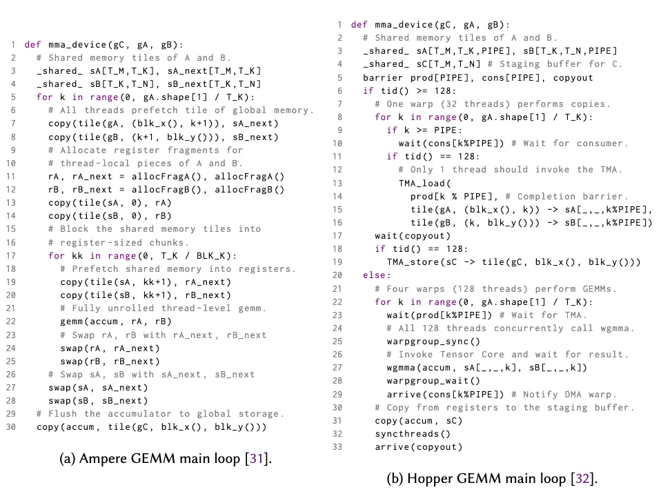

## 2. CuteDSL

먼저 Cutlass github의 ampere sgemm[1]을 예로 들어, CutDSL 기반 workflow 전체를 systemically 정리한다. 예를 들면 자주 쓰는 API 사용법이다. 그다음 Hopper와 Blackwell의 몇 가지 feature로 들어가고, 이 소개를 통해 Nvidia의 전체 design lineage도 보려 한다. 예를 들어 Ampere부터 보면, async copy 시 irregular matrix에 대해 predicate tensor가 boundary computation을 보조해야 한다. Hopper의 TMA부터는 이러한 complexity가 제거되었고, Thread Block Cluster와 TMA 기반 multicast capability도 도입되었다. 이후 Blackwell의 5세대 TensorCore에서는 모든 operand가 SMEM/TMEM 안에 있고, 2SM 등 일련의 capability도 있다.

### 2.1 Basic Gemm

이 절은 Cutlass github의 [ampere sgemm]을 예로 든다. 이는 TensorCore를 사용하지 않고 CUDA Core만 사용해 FMA computation을 수행하므로 performance가 매우 나쁘다. 또한 Ampere는 이미 전체 life cycle의 말기에 들어섰기 때문에, 지금 이 부분을 다시 보는 것이 그다지 가치가 없어 보일 수도 있다.

사실 여기서 이를 소개하는 주요 목적은 이를 통해 Cutlass의 Gemm abstraction 전체 workflow와 많은 tensor 및 layout 관련 operation API를 이해하는 것이다. Layout tool과 Tensor 관련 API 사용에 익숙해지는 것은 CuteDSL 전체에 익숙해지는 데 매우 도움이 된다.

다른 한편으로 이를 baseline으로 삼고, 그다음 Hopper와 Blackwell microarchitecture evolution을 소개하는 것도 매우 가치가 있다. 예를 들어 이는 `cp.async`를 사용하지만, out-of-bounds access를 고려해 추가 predicate tensor(Preidication Tensor)가 out-of-bounds를 방지해야 했다. Hopper에서는 TMA를 통해 이를 깔끔하게 해결했다. 개인적으로는 기존 implementation의 complexity를 이해해야 전체 architecture evolution process를 더 깊게 이해할 수 있다고 생각한다.

다시 blocked matrix multiplication 자체로 돌아가자. 보통 result $C$ matrix의 block을 기준으로 Thread Block을 배치하고, 각 Thread Block 안에서 Kernel function을 구성해 execute한다.

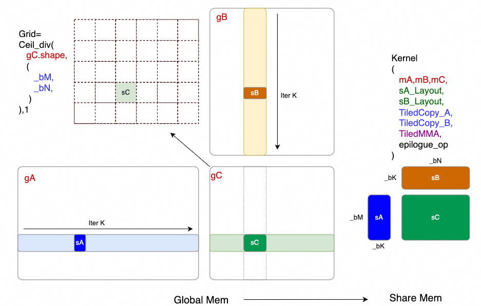

따라서 Kernel launch 시 grid =($\lceil \frac{M}{_bM} \rceil$,$\lceil \frac{N}{_bN} \rceil$, 1)이다. 여기서 $M,N,K$는 GMEM에 원래 저장된 matrix $gA,gB,gC$의 Shape이고, $_bM,_bN,_bK$는 blocked matrix multiplication에서 각 Thread Block(많은 문서에서는 Cooperative thread array, CTA라고도 부름)이 처리해야 하는 Tile의 Size이다.

각 CTA는 동일한 Kernel code를 run해서 data를 처리한다. 대략적인 dataflow는 다음과 같다.

1. GMEM에서 SMEM으로 Tile을 copy하여 $sA,sB$ 두 Tile을 구성한다. 따라서 이들의 Layout이 필요하고, 어떻게 copy할지 설명하는 `TileCopy` object를 준비해야 한다.
2. 그다음 CTA에 대해 어떤 Tile based matrix multiplication operation을 사용할지 선택한다. 예를 들면 CUDA Core의 FMA instruction을 사용하거나 TensorCore의 MMA instruction을 사용하는 것이다. 서로 다른 instruction에는 서로 다른 `MMA_Layout`도 있으므로, 이를 설명하는 wrapper `TiledMMA` object도 필요하다.
3. 마지막으로 예를 들어 matrix가 $C = \alpha * A * B + \beta * C$를 compute해야 한다면, blocked matrix multiplication을 마친 뒤 추가 처리를 해야 한다. $\alpha$를 scale하고 $\beta C$를 더하는 식이다. 물론 ReLU 계산 같은 deep learning 관련 다른 algorithm도 있다. Cutlass는 이를 모두 `Epilogue` process로 abstract한다. 예를 들면 아래 그림과 같다.

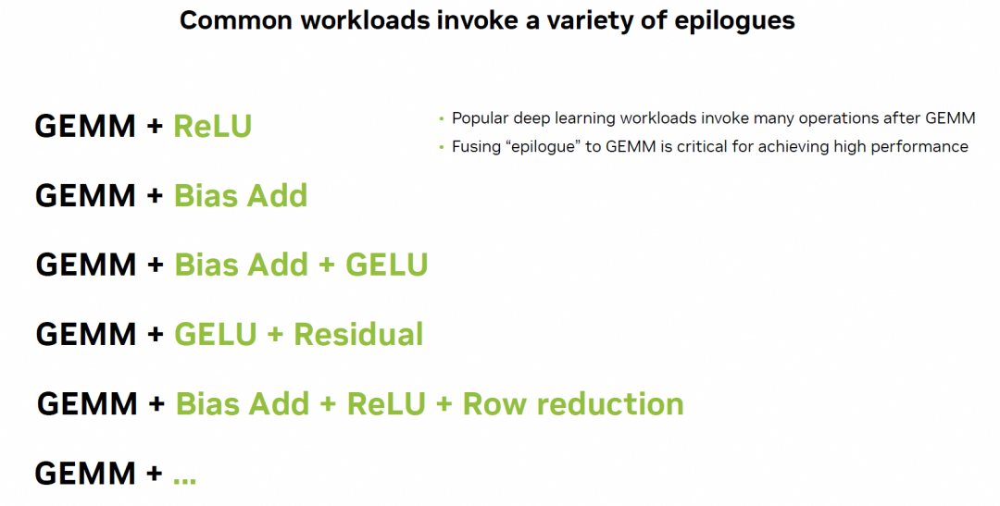

그리고 이것들이 CTA에서 compute하는 Kernel의 전체 input parameter를 구성한다.

```python
    @cute.kernel
    def kernel(
        self,
        mA: cute.Tensor,
        mB: cute.Tensor,
        mC: cute.Tensor,
        sA_layout: cute.Layout,
        sB_layout: cute.Layout,
        tiled_copy_A: cute.TiledCopy,
        tiled_copy_B: cute.TiledCopy,
        tiled_mma: cute.TiledMma,
        epilogue_op: cutlass.Constexpr = lambda x: x,
    ):
```

#### 2.1.1 TiledCopy

먼저 CTA가 관련 Tile data를 GMEM에서 SMEM으로 어떻게 copy하는지 보자. 우선 `gA`, `gB`가 GMEM에서 어떤 Layout을 갖는지 이해해야 한다. BLAS 정의에 따르면 다음 네 가지 경우로 나뉜다.

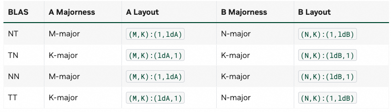

CuteDSL에서는 `utils.LayoutEnum.from_tensor()` function을 통해 해당 Layout을 얻을 수 있다.

```python
@cute.jit
def major_check(
    mA: cute.Tensor
):
    print(f" shape {mA.shape}:{mA.stride} Layout: {utils.LayoutEnum.from_tensor(mA)}")

M,N,K = 2048,1024,512

a = torch.randn(M, K, device="cuda", dtype=torch.bfloat16)
b = torch.randn(N, K, device="cuda", dtype=torch.bfloat16)
bT = torch.randn(N, K, device="cuda", dtype=torch.bfloat16).permute((1,0))

_a = from_dlpack(a, assumed_align=16)
_b = from_dlpack(b, assumed_align=16)
_bT = from_dlpack(bT, assumed_align=16)

major_check(_a)
major_check(_b)
major_check(_bT)

#output
 shape (2048, 512):(512, 1) Layout: LayoutEnum.ROW_MAJOR # A: torch default는 Row-Major
 shape (1024, 512):(512, 1) Layout: LayoutEnum.ROW_MAJOR # B
 shape (512, 1024):(1, 512) Layout: LayoutEnum.COL_MAJOR # B^T: Col-Major
```

그다음 `cute.make\_layout` function을 통해 sA\_Layout과 sB\_Layout을 구성할 수 있다. 주의할 점은 보통 memory access latency를 hide하기 위해 computation 시 `num_stages` multi-stage pipeline 방식으로 처리한다는 것이다. 따라서 SMEM에서 A와 B의 Tile을 allocate할 때 `num\_stage` dimension을 하나 더 추가해야 한다. default Layout은 다음과 같다.

$$
TileA \rightarrow (_bM,_bK, num_stages):(1,_bM,_bM * _bK)
$$

$$
TileB \rightarrow (_bN,_bK, num_stages):(1 , _bN,_bN * _bK)
$$

example에서는 memory access bank-conflict 문제도 고려했으며, padding을 추가하는 방식으로 해결한다.

```c++
        # A와 B가 K-major이면 bank conflict를 줄이기 위해 padding 추가를 고려해야 한다.
        padding_a = 4 if self.a_major_mode == utils.LayoutEnum.ROW_MAJOR else 0
        padding_b = 4 if self.b_major_mode == utils.LayoutEnum.ROW_MAJOR else 0
        sA_layout = cute.make_layout(
            (self._bM, self._bK, self._num_stages),
            stride=(1, (self._bM + padding_a), self._bK * (self._bM + padding_a)),
        )
        sB_layout = cute.make_layout(
            (self._bN, self._bK, self._num_stages),
            stride=(1, (self._bN + padding_b), self._bK * (self._bN + padding_b)),
        )
```

CuteDSL Layout은 cute-viz[2]를 사용할 수 있으며, 다음 방식으로 install하고 사용한다.

```python
!pip install -U git+https://github.com/NTT123/cute-viz.git

from cute_viz import render_layout_svg, display_layout
@cute.jit
def layout_SA():
    _bM , _bN , _bK = 128 , 128 , 8
    _num_stages = 3
    padding_a = 4

    sA_layout = cute.make_layout(
       (_bM, _bK),
       stride=(1, _bM),
    )
    sA_layout_w_padding = cute.make_layout(
       (_bM, _bK),
       stride=(1, (_bM + padding_a)),
    )
    # padding 때문에 점유되는 storage space는 size_in_bytes function으로 얻을 수 있다.
    print(f"Layout w/o padding: {sA_layout} Size: {cute.size_in_bytes(cutlass.Float32,sA_layout)}B")
    print(f"Layout w   padding: {sA_layout_w_padding} Size: {cute.size_in_bytes(cutlass.Float32,sA_layout_w_padding)}B")

    # save to svg file
    render_layout_svg(sA_layout, "layout_wo_padding.svg")
    render_layout_svg(sA_layout_w_padding, "layout_w_padding.svg")

    # jupyter notebook에서 display_layout을 직접 호출해 바로 표시할 수도 있다.
    #display_layout(sA_layout)

layout_SA()

## output
Layout w/o padding: (128,8):(1,128) Size: 4096B
Layout w   padding: (128,8):(1,132) Size: 4208B
# Padding은 각 column에 4개 element padding을 추가한다. 누적 8-1 column, 28개 element이며 FP32 4Bytes 기준 112Bytes가 추가된다.
```

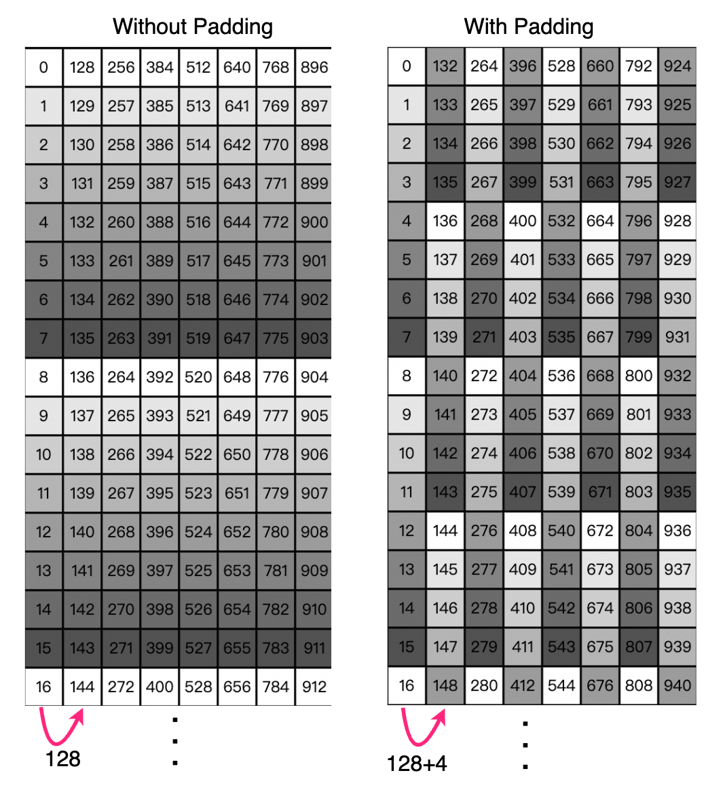

Ampere에서는 CTA 안의 각 Thread가 parallel하게 copy operation을 execute해야 한다. Cutlass에서 TileCopy의 abstraction은 다음과 같다.

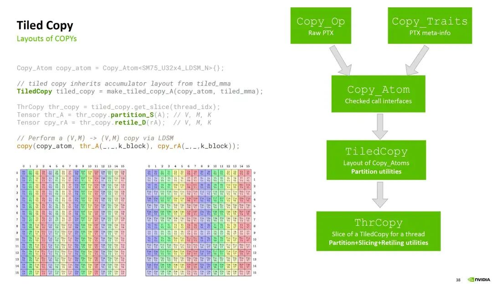

이는 PTX instruction(즉 Copy\_Op)과 관련 PTX meta-info(Copy\_Traits)를 encapsulate하여 copy atomic operation, 즉 Copy\_Atom을 구성한다. 그다음 Layout 관련 정보를 바탕으로 TileCopy object를 구성한다. 그리고 CTA 안의 각 thread는 thread ID를 통해 TileCopy object에서 자신의 thread copy object(Thr\_Copy)를 slice할 수 있다.

CuteDSL에서는 아래 API로 TileCopy object를 구성할 수 있으며, parameter는 Copy\_Atom, Thread\_Layout, Value\_Layout이다.

```c++
    tiled_copy_A = cute.make_tiled_copy_tv(atom_async_copy_A, tA,vA)
```

##### Copy\_Atom

Copy\_Atom에 대해서는 Copy\_Op, 즉 original PTX instruction을 확인해 볼 수 있다.

```c++
cp.async.ca.shared{::cta}.global{.level::cache_hint}{.level::prefetch_size}
                         [dst], [src], cp-size{, src-size}{, cache-policy} ;
cp.async.cg.shared{::cta}.global{.level::cache_hint}{.level::prefetch_size}
                         [dst], [src], 16{, src-size}{, cache-policy} ;
cp.async.ca.shared{::cta}.global{.level::cache_hint}{.level::prefetch_size}
                         [dst], [src], cp-size{, ignore-src}{, cache-policy} ;
cp.async.cg.shared{::cta}.global{.level::cache_hint}{.level::prefetch_size}
                         [dst], [src], 16{, ignore-src}{, cache-policy} ;

.level::cache_hint =     { .L2::cache_hint }
.level::prefetch_size =  { .L2::64B, .L2::128B, .L2::256B }
cp-size =                { 4, 8, 16 }
```

`cp-size`는 4B, 8B, 16B만 지원한다는 점에 주목하자. 따라서 각 thread가 FP32 data를 처리할 때는 memory address의 continuity에 따라 고려해야 한다. 연속적이면 가능한 vectorized copy를 사용한다. 즉 한 번에 FP32 element 4개를 copy하여 16B를 구성하고, 그렇지 않으면 element 하나만 copy한다. CuteDSL에서 Copy\_Atom을 구성하는 방식은 다음과 같다.

```c++
    atom_async_copy_A = cute.make_copy_atom(
        cute.nvgpu.cpasync.CopyG2SOp(),
        mA.element_type,
        num_bits_per_copy= mA.element_type.width
    )
```

##### TV\_Layout

먼저 Thread\_Layout의 경우, 한 dimension이 \_bK에 align되도록 구성하고 Majorness는 globalTensor와 같게 한다. Tile\_A의 thread\_Layout\_A를 처리하는 경우를 예로 들면 다음과 같다.

```c++
    tA = cute.make_layout(
        ( num_threads // _bK , _bK), stride=(_bK,1)
    )
    vA = cute.make_layout((1,1))
```

Value\_Layout은 default로 cp-size = 4B를 사용한다. 즉 하나의 thread가 하나의 Value를 처리한다.

```c++
    vA = cute.make_layout((1,1))
```

연속적이어서 vectorization할 수 있음을 발견하면 `num_vectorized = 4`, 즉 `cp_size=16B`가 된다. 따라서 `tA`와 `vA`는 다음 방식으로 update할 수 있다.

```c++
    if cutlass.const_expr(utils.LayoutEnum.from_tensor(mA) == utils.LayoutEnum.COL_MAJOR) :
        num_vectorized = 4
        atom_async_copy_A = cute.make_copy_atom(
            cute.nvgpu.cpasync.CopyG2SOp(),
            mA.element_type,
            num_bits_per_copy= mA.element_type.width * num_vectorized,
        )

        major_mode_size = _bM // num_vectorized
        tA = cute.make_layout(
            (major_mode_size, num_threads // major_mode_size),
            stride=(1, major_mode_size),
        )
        vA = cute.make_layout((num_vectorized, 1))
```

마지막으로 `make_tiled_copy_tv`를 통해 TileCopy object를 얻을 수 있다. 아래는 test code이며, 관련 Layout을 render할 수 있다.

```python
num_threads = 256
_bM , _bN , _bK = 128 , 128 , 8

@cute.jit
def tiled_copy(
    mA : cute.Tensor
):
    tA = cute.make_layout(
        ( num_threads // _bK , _bK), stride=(_bK,1)
    )
    vA = cute.make_layout((1,1))

    atom_async_copy_A = cute.make_copy_atom(
        cute.nvgpu.cpasync.CopyG2SOp(),
        mA.element_type,
        num_bits_per_copy= mA.element_type.width
    )

    if cutlass.const_expr(utils.LayoutEnum.from_tensor(mA) == utils.LayoutEnum.COL_MAJOR) :
        num_vectorized = 4
        atom_async_copy_A = cute.make_copy_atom(
            cute.nvgpu.cpasync.CopyG2SOp(),
            mA.element_type,
            num_bits_per_copy= mA.element_type.width * num_vectorized,
        )

        major_mode_size = _bM // num_vectorized
        tA = cute.make_layout(
            (major_mode_size, num_threads // major_mode_size),
            stride=(1, major_mode_size),
        )
        vA = cute.make_layout((num_vectorized, 1))

    tiled_copy_A = cute.make_tiled_copy_tv(atom_async_copy_A, tA,vA)

    # render layout
    render_layout_svg(tA, "thread_layout_A.svg")
    _layout = tiled_copy_A.layout_dst_tv_tiled
    display_layout(_layout)
    render_layout_svg(_layout, "tile_copy_layout.svg")

a = torch.randn(1024, 1024, device="cuda", dtype=torch.float)
# a is row_major
_a = from_dlpack(a, assumed_align=16)

# a is col_major
#_a = from_dlpack(a.T, assumed_align=16)

tiled_copy(_a)
```

Thread Layout은 다음과 같다.

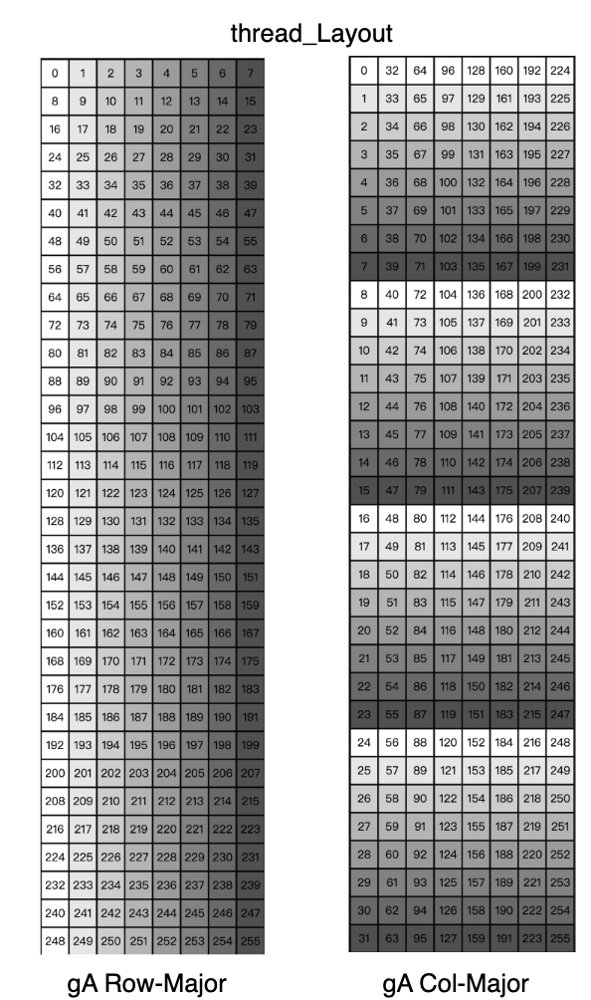

#### 2.1.2 TiledMMA

TiledMMA object에 대한 Cutlass의 abstraction은 다음과 같다. 마찬가지로 original PTX instruction으로 MMA\_Op를 구성하고, 해당 meta-info로 MMA\_Traits를 구성한 뒤, 마지막으로 MMA의 atomic operation(MMA\_Atom)을 구성한다. 그다음 MMA\_ATOM layout에 따라 TiledMMA를 구성한다. 마지막으로 각 thread는 TiledMMA를 통해 slice하여 thread MMA object(ThrMMA)를 얻을 수 있다.

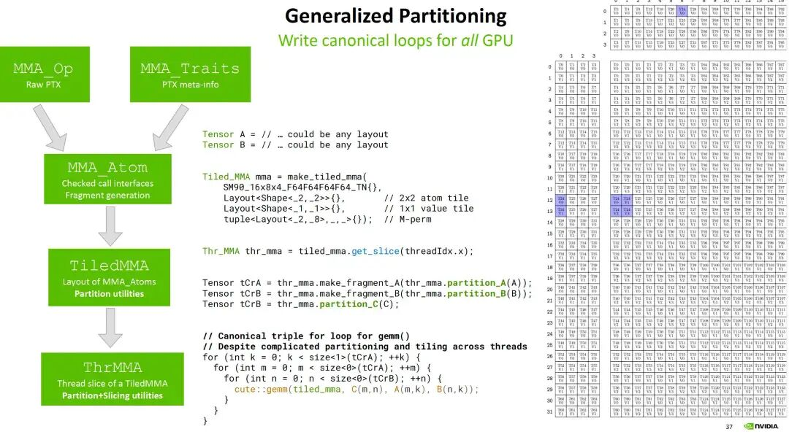

먼저 MMA\_Atom을 선택한다. 여기 example에서는 CUDA Core SIMT 기반 FMA, 즉 `cute.nvgpu.MmaUniversalOp(cutlass.Float32)`를 선택했다.

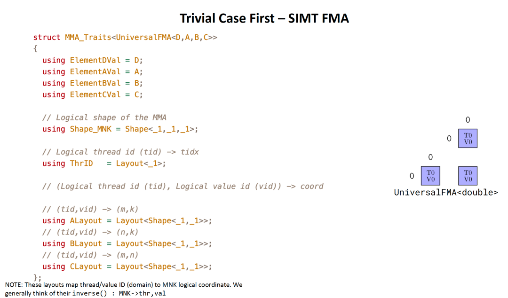

이는 1x1x1 MMA이다. 그다음 Atoms\_Layout의 경우, 매번 multiplication이 하나의 result를 생성한다. Thread Layout은 TileC의 Layout에 따라 간단히 구성한다.

```c++
        atoms_layout = cute.make_layout(
            (self._num_threads // 16, 16, 1), stride=(16, 1, 0)
        )
        if cutlass.const_expr(self.c_major_mode == utils.LayoutEnum.COL_MAJOR):
            atoms_layout = cute.make_layout(
                (16, self._num_threads // 16, 1), stride=(1, 16, 0)
            )
```

마지막으로 `make_tiled_mma` function을 통해 TiledMMA object를 구성한다. 이는 두 parameter를 필요로 한다. 하나는 MMA\_Op이고, 하나는 Atoms\_Layout이다. 또한 optional parameter `permutation_mnk`가 있다. reorder를 통해 thread가 value를 연속적으로 read할 수 있게 한다. 전체적으로 TiledMMA를 구성하는 test function은 다음과 같다.

```python
num_threads = 256
_bM , _bN , _bK = 128 , 128 , 8

@cute.jit
def tiled_mma(
    mC : cute.Tensor
):
    atoms_layout = cute.make_layout(
        (num_threads // 16, 16, 1), stride=(16, 1, 0)
    )
    if cutlass.const_expr(utils.LayoutEnum.from_tensor(mC) == utils.LayoutEnum.COL_MAJOR):
        atoms_layout = cute.make_layout(
            (16, num_threads // 16, 1), stride=(1, 16, 0)
        )
    op = cute.nvgpu.MmaUniversalOp(cutlass.Float32)
    permutation_tiler_M = cute.make_layout(
        (atoms_layout.shape[0], 4), stride=(4, 1)
    )
    permutation_tiler_N = cute.make_layout(
        (atoms_layout.shape[1], 4), stride=(4, 1)
    )
    tiled_mma = cute.make_tiled_mma(
        op,
        atoms_layout,
        permutation_mnk=(permutation_tiler_M, permutation_tiler_N, None),
    )

    print(f"Atoms layout: {atoms_layout}")
    print(f"TiledMMA TV-layout-A: {tiled_mma.tv_layout_A_tiled}")
    print(f"TiledMMA TV-layout-C: {tiled_mma.tv_layout_C_tiled}")


c = torch.randn(1024, 1024, device="cuda", dtype=torch.float)
_c = from_dlpack(c, assumed_align=16)

tiled_mma(_c)

#output
Atoms layout: (16,16,1):(16,1,0)
TiledMMA TV-layout-A: ((16,16),(1,(4,1))):((0,4),(0,(1,0)))
TiledMMA TV-layout-C: ((16,16),(1,(4,4))):((256,4),(0,(1,64)))

#without Permutation:
Atoms layout: (16,16,1):(16,1,0)
TiledMMA TV-layout-A: ((16,16),(1,(1,1))):((0,1),(0,(0,0)))
TiledMMA TV-layout-C: ((16,16),(1,(1,1))):((16,1),(0,(0,0)))
```

마지막으로 Host function에서는 kernel launch에 사용할 Grid와 Block을 계산해야 한다.

```c++
        # grid_dim은 C의 Shape을 block_M과 block_N 기준으로 나누고, block_dim은 atoms_layout size(aka. num_threads)에 따라 구성한다.
        # grid_dim: ((m + BLK_M - 1) // BLK_M, (n + BLK_N - 1) // BLK_N, 1)
        grid_dim = *cute.ceil_div(mC.shape, (self._bM, self._bN)), 1

        self.kernel(
            mA,
            mB,
            mC,
            sA_layout,
            sB_layout,
            tiled_copy_A,
            tiled_copy_B,
            tiled_mma,
            epilogue_op,
        ).launch(
            grid=grid_dim,
            block=[cute.size(atoms_layout), 1, 1],
            stream=stream,
        )
```

#### 2.1.3 Kernel

앞의 두 절에서 host side code는 기본적으로 처리되었고, Kernel에 필요한 parameter도 준비되었다. 이제 Kernel code를 보자. 먼저 Thread Index와 Block Index를 얻고, BlockIndex에 따라 Tile coordinate(Tiler\_coord)를 구성한다. 또한 thread index(tidx)에 따라 TiledMMA object에서 slice를 얻어 Thr\_MMA를 만든다.

```c++
        # Thread and block indices
        tidx, tidy, tidz = cute.arch.thread_idx()
        bidx, bidy, bidz = cute.arch.block_idx()
        tiler_coord = (bidx, bidy, None)

        thr_mma = tiled_mma.get_slice(tidx)
```

##### 2.1.3.1 TileCopy Layout

그다음 tiler\_coord와 CTA\_Tiler, 즉 $[_bM,_bN,_bK]=(128,128,8)$로 구성된 tuple에 따라 local\_tile을 얻는다. cta\_tiler와 tiler\_coord가 모두 3D이므로, `proj` tuple을 통해 필요한 dimension을 결정한다는 점에 주의하자.

```c++
        # ///////////////////////////////////////////////////////////////////////////////
        # Get the appropriate tiles for this thread block.
        # gA: (BLK_M, BLK_K, k), gB: (BLK_N, BLK_K, k), gC: (BLK_M, BLK_N)
        # ///////////////////////////////////////////////////////////////////////////////
        gA = cute.local_tile(
            mA, tiler=self._cta_tiler, coord=tiler_coord, proj=(1, None, 1) #select M, K dim, tiler=(128,8)
        )
        gB = cute.local_tile(
            mB, tiler=self._cta_tiler, coord=tiler_coord, proj=(None, 1, 1) #select N, K dim, tiler=(128,8)
        )
        gC = cute.local_tile(
            mC, tiler=self._cta_tiler, coord=tiler_coord, proj=(1, 1, None) #select M, N dim, tiler=(128,128)
        )
```

예를 들어 compute 시 M,N,K=4096,4096,4098을 사용하고, 동시에 gA, gB, gC를 print할 수 있다.

```c++
        if (tidx, tidy, bidx, bidy ) == (0, 0, 1, 0) :
            cute.printf("gA {}",gA)
            cute.printf("gB {}",gB)

#output
gA raw_ptr(0x0000781f44200400: f32, gmem, align<16>) o (128,8,513):(4098,1,8) =
  ( 2.232828, -0.914160, -0.434011, 0.241222, -0.203234, -0.858159, -1.057811, -0.276097, -1.159224, -0.202816, -0.339250, 0.847252, 0.282905, -0.242454, 0.251689, -1.054146, -0.730669, 1.360016, -0.043775, 2.123710, 1.541446, -0.778495, -0.293049, 0.340791, 1.854621, -0.315319, -0.030140, 0.353239, 2.685961, 0.276291, 0.416161, [...] )
gB raw_ptr(0x0000781f3e000000: f32, gmem, align<16>) o (128,8,513):(4098,1,8) =
  ( -0.107501, 1.378693, -0.589159, -0.628105, -0.784239, -0.085578, -1.613212, 0.500337, 0.196457, -0.388494, 0.130661, 0.322285, -0.098240, 0.765472, -0.916214, 1.665686, -1.892140, 1.230363, 1.912450, -0.432180, -0.306490, -0.753587, 0.533725, -1.154443, -0.092635, 0.996614, 0.718422, -0.614310, 0.130793, -0.219224, 0.902878, [...] )
```

그다음 boundary case를 고려해야 한다. K에서 $\text{gA.shape[2]}=\lceil\frac{K}{_bK} \rceil = 513$이면, K dimension의 residue는 $K - \lceil\frac{K}{_bK} \rceil * _bK = 4098 - 513 * 8 =-6$이다. 그다음 `cute.domain\_offset`을 통해 gA/gB pointer를 `-k` direction으로 이동시켜 첫 번째 Tile이 irregular Tile이 되게 한다.

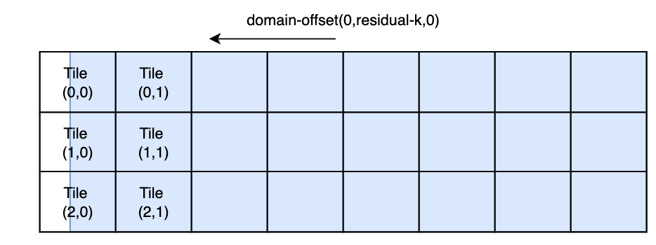

```c++
        residue_k = mA.shape[1] - cutlass.Int32(self._bK) * gA.shape[2] #mA.shape[1] == K
        gA = cute.domain_offset((0, residue_k, 0), gA)
        gB = cute.domain_offset((0, residue_k, 0), gB)

        if (tidx, tidy, bidx, bidy ) == (0, 0, 1, 0) :
            cute.printf("domain_offset by residue_k={}", residue_k)
            cute.printf("gA {}",gA)
            cute.printf("gB {}",gB)

# output
domain_offset by residue_k=-6
gA raw_ptr(0x0000781f442003e8: f32, gmem, align<4>) o (128,8,513):(4098,1,8) =
  ( 0.545876, 0.220103, 0.771488, 0.042910, -2.330272, -1.605312, 0.793518, 0.719658, 0.783606, 0.096901, 1.967885, 0.062523, -0.751021, 0.431259, 0.881671, 0.435522, 0.937110, 0.633271, 0.864045, -0.535543, 0.767267, 0.483572, -1.474787, 0.092404, -0.984192, -0.882738, -0.088075, -0.012253, 0.609542, -0.092585, 0.712758, [...] )
gB raw_ptr(0x0000781f3dffffe8: f32, gmem, align<4>) o (128,8,513):(4098,1,8) =
  ( 0.000000, -1.123452, -0.652423, 0.933533, 0.792622, -0.863053, -0.584279, -0.662824, 0.366895, -0.101855, -1.214358, 0.869608, 0.572380, 0.479916, -0.437270, 0.323538, 0.189797, 0.122727, 0.473485, -1.118110, -0.256566, 0.798130, -3.183375, 0.578726, -2.714239, 1.723931, -1.179997, -1.230503, 0.377926, 2.089392, -0.404093, [...] )
```

하지만 여기서 제시한 것은 Tiler\_Coord=(1,0)의 value라는 점에 주의해야 한다. Tiler\_Coord=(0,0)을 사용하면 offset 이후의 tensor를 print할 때 out-of-bounds error가 발생한다. out-of-bounds 문제는 뒤에서 predicate tensor(Predicate Tensor)를 통해 boundary check와 handling을 수행한다.

original address gA= 0x0000781f44200400과 비교하면, 새로운 gA address는 0x0000781f442003e8이며, 앞쪽으로 6개 element(0x18= residue\_k \* 4B) 길이만큼 이동했다. concrete computation은 `domain\_offset` function을 봐도 된다.

```python
@dsl_user_op
def domain_offset(coord: Coord, tensor: Tensor, *, loc=None, ip=None) -> Tensor:
    offset = crd2idx(coord, tensor.layout, loc=loc, ip=ip)
    if isinstance(tensor.iterator, Pointer):
        return make_tensor(tensor.iterator + offset, tensor.layout)
    elif is_integer(tensor.iterator) or isinstance(tensor.iterator, tuple):
        new_iter = _cute_ir.add_offset(
            _pack_int_tuple(tensor.iterator), _pack_int_tuple(offset)
        )
        return make_tensor(_unpack_x_tuple(new_iter), tensor.layout)
    else:
        raise ValueError(f"unsupported tensor for domain_offset, got {tensor}")
```

그다음 shared memory를 allocate하고, TileCopy에서 slice하여 ThrCopy를 얻어야 한다.

```c++
        smem = cutlass.utils.SmemAllocator()
        sA = smem.allocate_tensor(mA.element_type, sA_layout, 16)
        sB = smem.allocate_tensor(mB.element_type, sB_layout, 16)
        thr_copy_A = tiled_copy_A.get_slice(tidx)
        thr_copy_B = tiled_copy_B.get_slice(tidx)
        tAgA = thr_copy_A.partition_S(gA)
        tAsA = thr_copy_A.partition_D(sA)
        tBgB = thr_copy_B.partition_S(gB)
        tBsB = thr_copy_B.partition_D(sB)

        if (tidx, tidy, bidx, bidy ) == (0, 0, 1, 1) :
            cute.printf("sA Layout {}", sA_layout)
            cute.printf("tAgA {}",tAgA)
            cute.printf("tAsA {}",tAsA)
            cute.printf("sB Layout {}", sB_layout)
            cute.printf("tBgB {}",tBgB)
            cute.printf("tBsB {}",tBsB)

# output
sA Layout (128,8,3):(1,132,1056)
tAgA raw_ptr(0x000077b95a2003e8: f32, gmem, align<4>) o ((1,1),4,1,513):((0,0),131136,0,8) =
tAsA raw_ptr(0x0000000000000400: f32, smem, align<4>) o ((1,1),4,1,3):((0,0),32,0,1056) =

sB Layout (128,8,3):(1,132,1056)
tBgB raw_ptr(0x000077b9542003e8: f32, gmem, align<4>) o ((1,1),4,1,513):((0,0),131136,0,8) =
tBsB raw_ptr(0x0000000000003570: f32, smem, align<4>) o ((1,1),4,1,3):((0,0),32,0,1056) =
```

다른 한편, B matrix를 Col-major로 설정하면 Layout은 다음과 같다.

```c++
sA Layout (128,8,3):(1,132,1056)
tAgA raw_ptr(0x000074ea3a2003e8: f32, gmem, align<4>) o ((1,1),4,1,513):((0,0),131136,0,8) =
tAsA raw_ptr(0x0000000000000400: f32, smem, align<4>) o ((1,1),4,1,3):((0,0),32,0,1056) =

sB Layout (128,8,3):(1,128,1024)
tBgB raw_ptr(0x000074ea33fe8200: f32, gmem, align<16>) o ((4,1),1,1,513):((1,0),0,0,32768) =
tBsB raw_ptr(0x0000000000003570: f32, smem, align<16>) o ((4,1),1,1,3):((1,0),0,0,1024) =
```

Layout은 아래 표와 같다. 여기서 A는 Row-Major, B는 Col-Major이다. Shared-Memory 관점에서 보면, sA\_Layout의 stride에는 bank-conflict를 완화하기 위한 4B Padding이 추가되어 있고, 둘 다 num\_stages= PIPE에 따라 multi-stage pipeline 정보를 저장한다.

| Layout |  |  |
| --- | --- | --- |
| sA | (bM,bK, PIPE) | (128,8,3):(1,132,1056) |
| sB | (bN,bK, PIPE) | (128,8,3):(1,128,1024) |
| tAgA | (CPY\_V, CPY\_M, CPY\_K, k) | ((1,1),4,1,513):((0,0),131136,0,8) |
| tBgB | (CPY\_V, CPY\_N, CPY\_K, k) | ((4,1),1,1,513):((1,0),0,0,32768) |
| tAsA | (CPY\_V, CPY\_M, CPY\_K, PIPE) | ((1,1),4,1,3):((0,0),32,0,1056) |
| tBsB | (CPY\_V, CPY\_N, CPY\_K, PIPE) | ((4,1),1,1,3):((1,0),0,0,1024) |

그다음 Thr\_copy는 original TileCopy object에서 Thread idx에 따라 `get\_slice()`를 호출해 얻는다. 또한 `Thr\_copy.partition\_S(gA)`를 통해 Thread copy가 original GMEM에서 갖는 Partition Layout을 얻는다. 여기서 RowMajor matrix A의 경우 CPY\_V = (1,1)이고, Col-Major matrix에는 vectorized `cp.async`를 사용할 수 있어 CPY\_V = (4,1), 즉 async\_cp의 cp\_size = 16B가 된다. 그리고 blockDim= (256,1,1)이므로, single Thread는 전체 \_bM \* \_bK / num\_threads = 128 \* 8 /256 = 4개 value를 copy해야 한다.

- cp\_size = 4B일 때, 즉 CPY\_V = (1,1)일 때 CPY\_M,CPY\_N = (4,1)
- cp\_size = 16B일 때, 즉 CPY\_V = (4,1)일 때 CPY\_M,CPY\_N = (1,1)

##### 2.1.3.2 Predication Tensor

앞에서 보았듯이 CuTe `local\_divide` 시, 예를 들어 M,K=4096,4098을 Tiler= (bM,bK)= (128,8)에 따라 split하려 하면 2개 Element가 남는다. dim-K에 대해 Cutlass는 512개의 (128,8) block에 하나의 (128,2) block을 더하는 방식을 쓰지 않는다. 대신 전체를 (128,8) block에 align한다. 그리고 다른 CUDA programming과 유사하게 하나의 predicate(Predication) matrix를 통해 처리한다. 자세한 문서는 "0y Predication"[3]을 참고하면 된다.

일반적인 process는 다음과 같다.

1. original data shape과 같은 "identity" layout을 만든다. 즉 `cute.make\_identity\_tensor(mA.shape)`이며, 그다음 CTA\_Tiler와 해당 block coordinate를 기반으로 Local Tile을 얻는다.

```c++
        mcA = cute.make_identity_tensor(mA.shape)
        mcB = cute.make_identity_tensor(mB.shape)
        cA = cute.local_tile(
            mcA, tiler=self._cta_tiler, coord=tiler_coord, proj=(1, None, 1)
        )
        cB = cute.local_tile(
            mcB, tiler=self._cta_tiler, coord=tiler_coord, proj=(None, 1, 1)
        )
```

2. 그다음 마찬가지로 이 identity layout을 기반으로 domain\_offset과 thr\_copy partition을 구성한다.

```c++
        cA = cute.domain_offset((0, residue_k, 0), cA)
        cB = cute.domain_offset((0, residue_k, 0), cB)
        # Repeat the partitioning with identity layouts
        tAcA = thr_copy_A.partition_S(cA)
        tBcB = thr_copy_B.partition_S(cB)
        # Allocate predicate tensors for m and n
```

3. 그다음 RMEM에서 make\_fragment를 수행한다. numerical type은 Bool이다. TileA matrix를 예로 들면, tApA는 main loop에서 M/N boundary check에 사용되고, tApA\_residue\_k는 첫 번째 column에 대한 boundary check로 M/N과 K를 모두 check해야 한다. A matrix를 예로 들면 아래 그림과 같다.

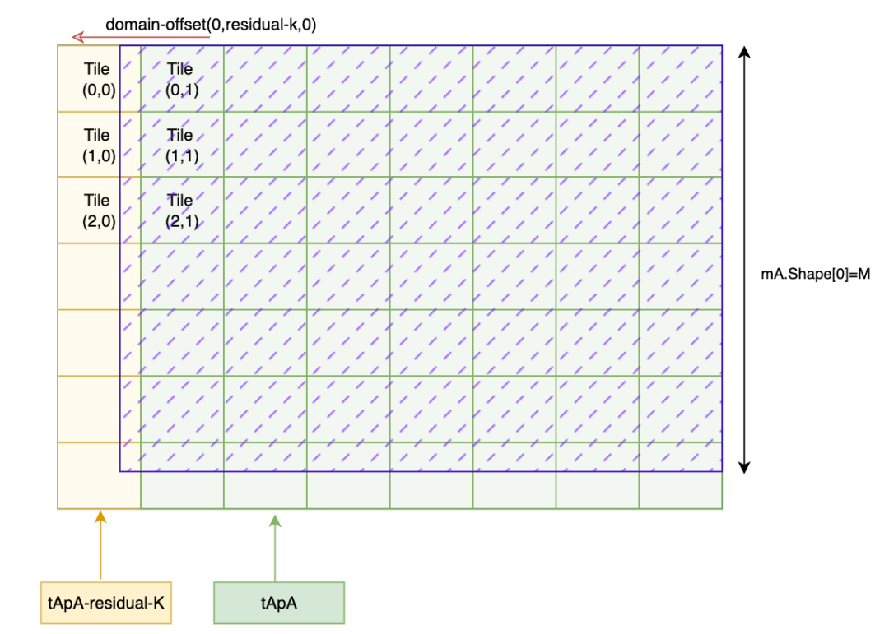

먼저 Fragment를 다음과 같이 생성한다.

```c++
        tApA = cute.make_fragment(
            cute.make_layout(
                (
                    tAsA.shape[0][1],  #CPY_V->rest_v
                    cute.size(tAsA, mode=[1]), #CPY_M
                    cute.size(tAsA, mode=[2]), #CPY_K
                ),
                stride=(cute.size(tAsA, mode=[1]), 1, 0),
            ),
            cutlass.Boolean,
        )

        # Allocate predicate tensors for m, n and k for residue k-tile
        tApA_residue_k = cute.make_fragment(
            cute.make_layout(
                (
                    tAsA.shape[0][1],
                    cute.size(tAsA, mode=[1]),
                    cute.size(tAsA, mode=[2]),
                ),
                stride=(
                    cute.size(tAsA, mode=[1]) * cute.size(tAsA, mode=[2]),
                    cute.size(tAsA, mode=[2]),
                    1,
                ),
            ),
            cutlass.Boolean,
        )
```

main loop에서는 tApA와 tBpB를 사용해 check한다. boundary check는 M(for A)과 N(for B) dimension만 check하면 되며, bool value를 통해 boundary M과 N보다 작은지 판단한다. 여기서는 `cute.elem\_less`를 사용해 비교한다. boundary 이상이면 return value가 0이므로, 이러한 element는 copy에 참여하지 않음을 나타낸다.

```c++
        # Set predicates for m/n bounds for mainloop
        for rest_v in range(tApA.shape[0]):
            for m in range(tApA.shape[1]):
                tApA[rest_v, m, 0] = cute.elem_less(
                    tAcA[(0, rest_v), m, 0, 0][0], mA.shape[0]
                )

        for rest_v in range(tBpB.shape[0]):
            for n in range(tBpB.shape[1]):
                tBpB[rest_v, n, 0] = cute.elem_less(
                    tBcB[(0, rest_v), n, 0, 0][0], mB.shape[0]
```

반면 tApA\_residue\_k와 tBpB\_residue\_k는 M/N과 K의 boundary condition을 완전하게 check해야 한다.

```c++
        # Set predicates for m/n/k bounds for residue k tile
        for rest_v in range(tApA_residue_k.shape[0]):
            for m in range(tApA_residue_k.shape[1]):
                for k in range(tApA_residue_k.shape[2]):
                    coord_A = tAcA[(0, rest_v), m, k, 0]
                    tApA_residue_k[rest_v, m, k] = cute.elem_less(
                        (coord_A[0], cutlass.Int32(-1)), (mA.shape[0], coord_A[1])
                    )
        for rest_v in range(tBpB_residue_k.shape[0]):
            for n in range(tBpB_residue_k.shape[1]):
                for k in range(tBpB_residue_k.shape[2]):
                    coord_B = tBcB[(0, rest_v), n, k, 0]
                    tBpB_residue_k[rest_v, n, k] = cute.elem_less(
                        (coord_B[0], cutlass.Int32(-1)), (mB.shape[0], coord_B[1])
                    )
```

##### 2.1.3.3 Prefetch Prologue

먼저 async.cp를 통해 모든 GMEM->SMEM memory copy를 submit해야 한다. 첫 번째 step은 irregular block을 copy하는 것이다.

```c++
        k_pipe_max = cute.size(tAsA, mode=[3])
        k_tile_count = cute.size(tAgA, mode=[3])
        gmem_pipe_read = cutlass.Int32(0)
        cute.copy(
            tiled_copy_A,
            tAgA[None, None, None, gmem_pipe_read],
            tAsA[None, None, None, 0],
            pred=tApA_residue_k, # use tApA_residue_k predicate tensor as condition
        )
        cute.copy(
            tiled_copy_B,
            tBgB[None, None, None, gmem_pipe_read],
            tBsB[None, None, None, 0],
            pred=tBpB_residue_k, # use tBpB_residue_k predicate tensor as condition
        )

        # each cp.async submits one commit_group, making it easier to check pipeline completion at wait_group
        cute.arch.cp_async_commit_group()

        # increment gmem read pipeline counter after copy completes
        gmem_pipe_read = (
            gmem_pipe_read + 1
            if gmem_pipe_read + 1 < k_tile_count
            else cutlass.Int32(0)
        )
```

그다음 loop를 통해 remaining Tile을 copy한다. loop condition은 SMEM pipeline depth - 1만큼의 data만 SMEM으로 Prefetch한다는 점에 주의하자.

```c++
        # Start async loads for 1st k-tile onwards, no k-residue handling needed
        for k_tile in range(1, k_pipe_max - 1):
            if k_tile < k_tile_count:
                cute.copy(
                    tiled_copy_A,
                    tAgA[None, None, None, gmem_pipe_read],
                    tAsA[None, None, None, k_tile],
                    pred=tApA, # predicate tensor uses tApA
                )
                cute.copy(
                    tiled_copy_B,
                    tBgB[None, None, None, gmem_pipe_read],
                    tBsB[None, None, None, k_tile],
                    pred=tBpB, # predicate tensor uses tBpB
                )

            # increment gmem read pipeline counter after copy completes
            gmem_pipe_read = (
                gmem_pipe_read + 1
                if gmem_pipe_read + 1 < k_tile_count
                else cutlass.Int32(0)
            )

            # submit one commit_group after each cp.async submission in the pipeline
            cute.arch.cp_async_commit_group()
```

마지막으로 Tile 수가 pipeline data 수보다 작으면 모든 Tile copy가 submit된 뒤 predicate tensor를 clear할 수 있음을 뜻한다.

```c++
        # all tiles have been copied from global memory, so clear the
        # predicate tensor
        if k_tile_count < k_pipe_max:
            for rest_v in range(tApA.shape[0]):
                for m in range(tApA.shape[1]):
                    tApA[rest_v, m, 0] = cutlass.Boolean(0)
            for rest_v in range(tBpB.shape[0]):
                for n in range(tBpB.shape[1]):
                    tBpB[rest_v, n, 0] = cutlass.Boolean(0)
```

##### 2.1.3.4 RMEM allocation 및 prefetch

먼저 TiledMMA의 slice에 따라 Thr\_MMA를 생성해야 하고, 그다음 이를 기반으로 SMEM에서 RMEM으로 load하는 Layout을 구성한다.

```c++
        thr_mma = tiled_mma.get_slice(tidx)

        # ///////////////////////////////////////////////////////////////////////////////
        # Define A/B partitioning and C accumulators.
        # ///////////////////////////////////////////////////////////////////////////////
        tCsA = thr_mma.partition_A(sA)
        tCsB = thr_mma.partition_B(sB)
        tCgC = thr_mma.partition_C(gC)
        tCrA = tiled_mma.make_fragment_A(tCsA[None, None, None, 0])
        tCrB = tiled_mma.make_fragment_B(tCsB[None, None, None, 0])
        tCrC = tiled_mma.make_fragment_C(tCgC)
        # Clear the accumulator
        tCrC.fill(0.0)

        # Current pipe index in smem to read from / write to
        smem_pipe_read = cutlass.Int32(0)
        smem_pipe_write = cutlass.Int32(k_pipe_max - 1)

        tCsA_p = tCsA[None, None, None, smem_pipe_read]
        tCsB_p = tCsB[None, None, None, smem_pipe_read]
```

그다음 첫 번째 K-Tile의 data를 register로 prefetch한다. 여기서는 `cute.autovec\_copy`를 호출해 vectorized instruction load를 자동으로 사용할 수 있다.

```c++
        # ///////////////////////////////////////////////////////////////////////////////
        # PREFETCH register pipeline
        # ///////////////////////////////////////////////////////////////////////////////
        k_block_max = cute.size(tCrA, mode=[2])

        if k_block_max > 1:
            # here we must first wait until the first Tile has finished loading into SMEM
            cute.arch.cp_async_wait_group(k_pipe_max - 2)
            cute.arch.barrier()
            # Prefetch the first rmem from the first k-tile
            cute.autovec_copy(tCsA_p[None, None, 0], tCrA[None, None, 0])
            cute.autovec_copy(tCsB_p[None, None, 0], tCrB[None, None, 0])
```

##### 2.1.3.5 Main loop

여기서는 전체 software pipeline(Software Pipeline) process를 자세히 보여준다. 전체 main loop에 대해 먼저 GMEM -> SMEM copy를 보자. default SMEM pipeline depth는 num\_stages = 3이다. 앞서 SMEM allocation 시 CTA Tiler의 description에 따라 3배 크기의 space를 allocate했고, main loop에 들어가기 전에는 num\_stages - 1 = 2개 buffer의 data만 prefetch했다. 전체적으로 보면 이 loop의 structure는 다음과 같다.

1. GMEM에서 SMEM으로 k-tile 하나를 copy한다.
2. 이 K-Tile에 대해 GEMM computation을 execute한다.
3. 다음 copy 완료를 기다린다.

`cute.arch.cp_async_wait_group(num_smem_stages - 2)` 명령은 unfinished 'copy' operation 수가 1 이하가 될 때까지 계속 wait한다. 이 method의 advantage는 shared memory production(즉 step-1)과 consumption(즉 step-2)이 overlap되어 동시에 진행될 수 있게 한다는 점이다. 아래 그림과 같다.

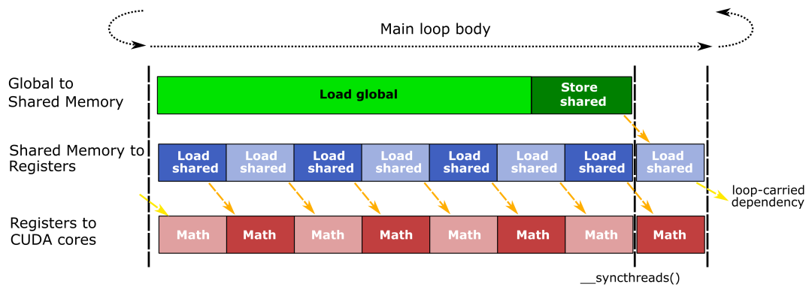

그다음 SMEM에서 register로 가는 pipeline operation도 유사하다. register pipeline은 i+1의 data를 produce(load)하고, i의 data를 consume(compute)한 뒤 다시 i+2의 data를 produce한다. 주목할 점은 i와 i+1이 같은 register를 사용하지 않는다는 것이다. 이는 동일 register에 대한 dependency를 제거하여 더 좋은 parallelism을 얻는다.

전체 loop flow는 다음과 같다.

```c++
for _ in range(k_tile_count):
    for k_block in range(k_block_max, unroll_full=True):
        #  1. wait for the previous pipeline to complete
        #  2. SMEM->RMEM, copy the next block
        #  3. if this is the first iteration of the inner loop, i.e. k_block = 0, prefetch next Tile-A
        #  4. execute GEMM on k_block
        #  5. if this is the first iteration of the inner loop, i.e. k_block = 0, prefetch next Tile-B
```

전체 MainLoop code는 다음과 같다.

```c++
        for _ in range(k_tile_count):
            for k_block in range(k_block_max, unroll_full=True):
                if k_block == k_block_max - 1:
                    tCsA_p = tCsA[None, None, None, smem_pipe_read]
                    tCsB_p = tCsB[None, None, None, smem_pipe_read]
                    cute.arch.cp_async_wait_group(k_pipe_max - 2)
                    cute.arch.barrier()

                # Load A, B from shared memory to registers for k_block + 1
                k_block_next = (k_block + 1) % k_block_max  # static
                cute.autovec_copy(
                    tCsA_p[None, None, k_block_next],
                    tCrA[None, None, k_block_next],
                )
                cute.autovec_copy(
                    tCsB_p[None, None, k_block_next],
                    tCrB[None, None, k_block_next],
                )

                # Fetch next A: To better interleave global memory access and
                # compute instructions, we intentionally use the sequence:
                # copy A, perform GEMM, then copy B.
                if k_block == 0:
                    cute.copy(
                        tiled_copy_A,
                        tAgA[None, None, None, gmem_pipe_read],
                        tAsA[None, None, None, smem_pipe_write],
                        # Use predicates because the m-mode may be irregular
                        pred=tApA,
                    )

                # Thread-level register gemm for k_block
                cute.gemm(
                    tiled_mma,
                    tCrC,
                    tCrA[None, None, k_block],
                    tCrB[None, None, k_block],
                    tCrC,
                )

                # Fetch next B and update smem pipeline read/write
                if k_block == 0:
                    cute.copy(
                        tiled_copy_B,
                        tBgB[None, None, None, gmem_pipe_read],
                        tBsB[None, None, None, smem_pipe_write],
                        # Use predicates because the n-mode may be irregular
                        pred=tBpB,
                    )
                    cute.arch.cp_async_commit_group()
                    smem_pipe_write = smem_pipe_read
                    smem_pipe_read = smem_pipe_read + 1
                    if smem_pipe_read == k_pipe_max:
                        smem_pipe_read = cutlass.Int32(0)
                    # After copying all tiles, we avoid clearing the predicate
                    # tensor in the `mainloop` to prevent increasing its
                    # instruction count. Instead, we continue copying the
                    # first tile, though it won't be used. The 0-th tile is not
                    # copied due to its irregular shape, which could lead to
                    # illegal memory accesses.
                    gmem_pipe_read = (
                        gmem_pipe_read + 1
                        if gmem_pipe_read + 1 < k_tile_count
                        else cutlass.Int32(1)
                    )
```

##### 2.1.3.6 Epilogue

마지막으로 K-Tile iteration을 거치면 computation result는 이미 allocate된 tCrC register 안에 있다. 그다음 앞의 operation들이 모두 완료되기를 기다린 뒤 `epilogue\_op`를 execute해야 한다.

```c++
        cute.arch.cp_async_wait_group(0)
        cute.arch.barrier()
        tCrC.store(epilogue_op(tCrC.load()))
```

EpilogueOp computation을 완료한 뒤에도 마찬가지로 predicate tensor 방법을 사용해 boundary condition을 control하고, data를 RMEM에서 GMEM으로 copy한다.

```c++
        cC = cute.make_identity_tensor(gC.shape)
        tCpC = thr_mma.partition_C(cC)
        predC = cute.make_fragment(tCrC.layout, cutlass.Boolean)
        residue_m = mC.shape[0] - cutlass.Int32(self._bM) * bidx
        residue_n = mC.shape[1] - cutlass.Int32(self._bN) * bidy
        for i in range(cute.size(tCrC.shape)):
            predC[i] = cute.elem_less(tCpC[i], (residue_m, residue_n))
        numIterM = cute.size(tCrC, mode=[1])
        numIterN = cute.size(tCrC, mode=[2])
        atom = cute.make_copy_atom(cute.nvgpu.CopyUniversalOp(), mC.element_type)
        cute.copy(atom, tCrC, tCgC, pred=predC)
        return
```

#### 2.1.4 Test 및 verification

Cutlass Example의 test code는 비교적 복잡하므로, 여기서는 Class SGemm code만 선택해 다음 방식으로 test한다.

```python
import time
from typing import Tuple
from functools import partial

import cuda.bindings.driver as cuda
import torch

import cutlass
import cutlass.cute as cute
import cutlass.utils as utils
from cutlass.cute.runtime import from_dlpack

def benchmark(M, N , K , callable, *, num_warmups, num_iterations, dtype_size = 4, accum_dtype_size = 4):
    start_event = torch.cuda.Event(enable_timing=True)
    end_event = torch.cuda.Event(enable_timing=True)

    torch.cuda.synchronize()

    for _ in range(num_warmups):
        callable()

    start_event.record(stream=torch.cuda.current_stream())
    for _ in range(num_iterations):
        callable()
    end_event.record(stream=torch.cuda.current_stream())
    torch.cuda.synchronize()

    elapsed_time = start_event.elapsed_time(end_event)
    avg_time = elapsed_time / num_iterations
    gflops =  2 * M * N * K / (avg_time  / 1000) / 1e12

    print(f"Average execution time: {avg_time:.4f} ms")
    print(f"Performance (GFLOPS): {gflops:.4f} TFLOPS")
    # dtype = FP16, accum_dtype =FP32
    print(f"Effective Memory Bandwidth: {((M * K + K * N) * dtype_size + M * N * accum_dtype_size) / (avg_time / 1000) / 1e9:.2f} GB/s")

class SGemm:
# for details, refer to [ampere sgemm] on Cutlass github

M,N, K = 4096, 4096, 4098

a = torch.randn(M, K, device="cuda", dtype=torch.float32)
b = torch.randn(K, N, device="cuda", dtype=torch.float32).permute((1,0))
c = torch.zeros(M, N, device="cuda", dtype=torch.float32)

_a = from_dlpack(a, assumed_align=16)
_b = from_dlpack(b, assumed_align=16)
_c = from_dlpack(c, assumed_align=16)

sgemm = SGemm()

sgemm_ = cute.compile(sgemm, _a,_b,_c)
sgemm_(_a,_b,_c)

# verify correctness
torch.testing.assert_close(c, a @ b.T ,atol=1e-4, rtol=1.3e-6)

benchmark(M, N , K , partial(sgemm_, _a,_b,_c), num_warmups=50, num_iterations=100)
```

H20에서 Benchmark를 execute한 result는 다음과 같다.

```
benchmark(M, N , K , partial(sgemm_, _a,_b,_c), num_warmups=50, num_iterations=100)

Average execution time: 5.5716 ms
Performance (GFLOPS): 24.6860 TFLOPS
Effective Memory Bandwidth: 36.15 GB/s
```

물론 이 example은 FMA만 사용하고 TensorCore를 사용하지 않았기 때문에 performance가 매우 나쁘다. 하지만 전체 process를 통해 cute가 Tensor와 Layout에 대해 수행하는 많은 operation technique, 그리고 `cp.async`와 해당 predicate tensor를 어떻게 사용하는지 관찰할 수 있다. 바로 이러한 복잡한 `cp.async`와 predicate tensor, 그리고 data path에서 reuse를 더 강화하기 위해 Hopper에서는 TMA, Thread block Cluster(CGA), DSMEM structure가 도입되었다. 다음 글에서 이 부분을 자세히 펼쳐 보겠다.

### Ref. CuBLASLt implementation of GEMM

코드는 다음과 같다:

```c++
#include <iostream>
#include <vector>
#include <random>
#include <cuda_runtime.h>
#include <cublas_v2.h>    // For cublasCreate_v2
#include <cublasLt.h>
#include <cuda_bf16.h> // For __nv_bfloat16

// CUDA and cuBLAS error checking macro
#define CHECK_CUDA(func)                                                       \
    do {                                                                       \
        cudaError_t err = (func);                                              \
        if (err != cudaSuccess) {                                              \
            std::cerr << "CUDA error at " << __FILE__ << ":" << __LINE__       \
                      << ": " << cudaGetErrorString(err) << std::endl;         \
            exit(EXIT_FAILURE);                                                \
        }                                                                      \
    } while (0)

#define CHECK_CUBLAS(func)                                                     \
    do {                                                                       \
        cublasStatus_t status = (func);                                        \
        if (status != CUBLAS_STATUS_SUCCESS) {                                 \
            std::cerr << "cuBLAS error at " << __FILE__ << ":" << __LINE__     \
                      << " (code: " << status << ")" << std::endl;             \
            exit(EXIT_FAILURE);                                                \
        }                                                                      \
    } while (0)


int main() {
    // 1. define GEMM parameters and performance test parameters
    // for better performance, M, N, K should preferably be multiples of 8, especially when using Tensor Cores
    int M = 4096;
    int N = 4096;
    int K = 4096;
    float alpha = 1.0f;
    float beta = 0.0f;
    int warmup_iterations = 5;
    int timing_iterations = 50;

    std::cout << "GEMM Configuration: M=" << M << ", N=" << N << ", K=" << K << std::endl;
    std::cout << "Data Type: BF16, Compute Type: FP32" << std::endl;
    std::cout << "Warm-up Iterations: " << warmup_iterations << std::endl;
    std::cout << "Timing Iterations: " << timing_iterations << std::endl;


    // 2. initialize data on the host side (use FP32, then convert to BF16)
    std::vector<float> h_A_fp32(M * K);
    std::vector<float> h_B_fp32(K * N);

    std::default_random_engine generator(1234); // Use fixed seed for reproducibility
    std::uniform_real_distribution<float> distribution(-1.0f, 1.0f);
    for (int i = 0; i < M * K; ++i) h_A_fp32[i] = distribution(generator);
    for (int i = 0; i < K * N; ++i) h_B_fp32[i] = distribution(generator);

    std::vector<__nv_bfloat16> h_A_bf16(M * K);
    std::vector<__nv_bfloat16> h_B_bf16(K * N);
    std::vector<__nv_bfloat16> h_C_bf16(M * N, __nv_bfloat16(0.0f));
    #pragma omp parallel for
    for (int i = 0; i < M * K; ++i) h_A_bf16[i] = __nv_bfloat16(h_A_fp32[i]);
    #pragma omp parallel for
    for (int i = 0; i < K * N; ++i) h_B_bf16[i] = __nv_bfloat16(h_B_fp32[i]);

    // 3. allocate memory on the device side and copy data
    __nv_bfloat16 *d_A, *d_B, *d_C;
    CHECK_CUDA(cudaMalloc(&d_A, M * K * sizeof(__nv_bfloat16)));
    CHECK_CUDA(cudaMalloc(&d_B, K * N * sizeof(__nv_bfloat16)));
    CHECK_CUDA(cudaMalloc(&d_C, M * N * sizeof(__nv_bfloat16)));

    CHECK_CUDA(cudaMemcpy(d_A, h_A_bf16.data(), M * K * sizeof(__nv_bfloat16), cudaMemcpyHostToDevice));
    CHECK_CUDA(cudaMemcpy(d_B, h_B_bf16.data(), K * N * sizeof(__nv_bfloat16), cudaMemcpyHostToDevice));
    CHECK_CUDA(cudaMemcpy(d_C, h_C_bf16.data(), M * N * sizeof(__nv_bfloat16), cudaMemcpyHostToDevice));

    // 4. cuBLASLt workflow
    // 4.1 create handles
    // create cublasHandle_t according to your requirements. Note: this handle will not be used by cublasLt functions.
    cublasHandle_t regular_cublas_handle;
    CHECK_CUBLAS(cublasCreate_v2(&regular_cublas_handle));

    // create the cublasLt-specific handle; this is what we will actually use.
    cublasLtHandle_t ltHandle;
    CHECK_CUBLAS(cublasLtCreate(&ltHandle));

    // 4.2 create matrix operation descriptor
    cublasLtMatmulDesc_t matmulDesc;
    CHECK_CUBLAS(cublasLtMatmulDescCreate(&matmulDesc, CUBLAS_COMPUTE_32F, CUDA_R_32F));
    cublasOperation_t op_n = CUBLAS_OP_N; // no transpose
    cublasOperation_t op_t = CUBLAS_OP_T;
    CHECK_CUBLAS(cublasLtMatmulDescSetAttribute(matmulDesc, CUBLASLT_MATMUL_DESC_TRANSA, &op_n, sizeof(op_n)));
    CHECK_CUBLAS(cublasLtMatmulDescSetAttribute(matmulDesc, CUBLASLT_MATMUL_DESC_TRANSB, &op_t, sizeof(op_t)));

    // 4.3 create matrix layout descriptors (row-major)
    cublasLtMatrixLayout_t A_desc, B_desc, C_desc;
    CHECK_CUBLAS(cublasLtMatrixLayoutCreate(&A_desc, CUDA_R_16BF, M, K, K));
    CHECK_CUBLAS(cublasLtMatrixLayoutCreate(&B_desc, CUDA_R_16BF, N, K, K));
    CHECK_CUBLAS(cublasLtMatrixLayoutCreate(&C_desc, CUDA_R_16BF, M, N, N));

    // 4.4 find the optimal algorithm
    cublasLtMatmulPreference_t preference;
    CHECK_CUBLAS(cublasLtMatmulPreferenceCreate(&preference));
    size_t workspaceSize = 32 * 1024 * 1024; // 32MB workspace
    CHECK_CUBLAS(cublasLtMatmulPreferenceSetAttribute(preference, CUBLASLT_MATMUL_PREF_MAX_WORKSPACE_BYTES, &workspaceSize, sizeof(workspaceSize)));

    int returnedResults = 0;
    cublasLtMatmulHeuristicResult_t heuristicResult;
    CHECK_CUBLAS(cublasLtMatmulAlgoGetHeuristic(ltHandle, matmulDesc, A_desc, B_desc, C_desc, C_desc, preference, 1, &heuristicResult, &returnedResults));
    if (returnedResults == 0) {
        std::cerr << "No suitable algorithm found!" << std::endl; return1;
    }

    // 4.5 allocate workspace
    void* workspace = nullptr;
    if (heuristicResult.workspaceSize > 0) {
        CHECK_CUDA(cudaMalloc(&workspace, heuristicResult.workspaceSize));
    }

    // 5. performance test
    // 5.1 warmup
    std::cout << "\nRunning warm-up..." << std::endl;
    for (int i = 0; i < warmup_iterations; ++i) {
        CHECK_CUBLAS(cublasLtMatmul(ltHandle, matmulDesc, &alpha, d_A, A_desc, d_B, B_desc,
                                    &beta, d_C, C_desc, d_C, C_desc, &heuristicResult.algo,
                                    workspace, heuristicResult.workspaceSize, 0));
    }
    CHECK_CUDA(cudaDeviceSynchronize());

    // 5.2 formal timing
    std::cout << "Running performance measurement..." << std::endl;
    cudaEvent_t start, stop;
    CHECK_CUDA(cudaEventCreate(&start));
    CHECK_CUDA(cudaEventCreate(&stop));

    CHECK_CUDA(cudaEventRecord(start, 0));

    for (int i = 0; i < timing_iterations; ++i) {
        CHECK_CUBLAS(cublasLtMatmul(ltHandle, matmulDesc, &alpha, d_A, A_desc, d_B, B_desc,
                                    &beta, d_C, C_desc, d_C, C_desc, &heuristicResult.algo,
                                    workspace, heuristicResult.workspaceSize, 0));
    }

    CHECK_CUDA(cudaEventRecord(stop, 0));
    CHECK_CUDA(cudaEventSynchronize(stop));

    float ms_total = 0;
    CHECK_CUDA(cudaEventElapsedTime(&ms_total, start, stop));

    // 5.3 compute and print performance
    float ms_per_gemm = ms_total / timing_iterations;
    double gflops = (2.0 * M * N * K * 1e-9) / (ms_per_gemm / 1000.0);
    double tflops = gflops / 1000.0;

    std::cout << "\n===== Performance Results =====" << std::endl;
    std::cout << "Average time per GEMM: " << ms_per_gemm << " ms" << std::endl;
    std::cout << "Achieved TFLOPS: " << tflops << std::endl;
    std::cout << "=============================" << std::endl;

    // 6. copy the last result back to host for verification
    std::vector<__nv_bfloat16> h_C_gpu_result_bf16(M * N);
    CHECK_CUDA(cudaMemcpy(h_C_gpu_result_bf16.data(), d_C, M * N * sizeof(__nv_bfloat16), cudaMemcpyDeviceToHost));

    // 7. clean up resources
    if (workspace) CHECK_CUDA(cudaFree(workspace));
    CHECK_CUDA(cudaEventDestroy(start));
    CHECK_CUDA(cudaEventDestroy(stop));
    CHECK_CUBLAS(cublasLtMatrixLayoutDestroy(A_desc));
    CHECK_CUBLAS(cublasLtMatrixLayoutDestroy(B_desc));
    CHECK_CUBLAS(cublasLtMatrixLayoutDestroy(C_desc));
    CHECK_CUBLAS(cublasLtMatmulDescDestroy(matmulDesc));
    CHECK_CUBLAS(cublasLtMatmulPreferenceDestroy(preference));
    CHECK_CUBLAS(cublasLtDestroy(ltHandle));
    CHECK_CUBLAS(cublasDestroy_v2(regular_cublas_handle));
    CHECK_CUDA(cudaFree(d_A));
    CHECK_CUDA(cudaFree(d_B));
    CHECK_CUDA(cudaFree(d_C));

    return0;
}
```

Compile and execute

```
# nvcc -arch=sm_90a -lcublas -lcublasLt gemm.cu
# ./a.out
GEMM Configuration: M=4096, N=4096, K=4096
Data Type: BF16, Compute Type: FP32
Warm-up Iterations: 5
Timing Iterations: 50

Running warm-up...
Running performance measurement...

===== Performance Results =====
Average time per GEMM: 1.0387 ms
Achieved TFLOPS: 132.318
```

참고 자료

[1]

ampere sgemm: *https://github.com/NVIDIA/cutlass/blob/main/examples/python/CuTeDSL/ampere/sgemm.py*

[2]

cute-viz: *https://github.com/NTT123/cute-viz*

[3]

0y\_predication: *https://github.com/NVIDIA/cutlass/blob/main/media/docs/cpp/cute/0y\_predication.md*
