# Tensor-103.2: Hopper GEMM

- 원문 제목: Tensor-103.2: Hopper GEMM
- 저자: Tilebot
- 계정: zartbot
- 발행일: 2025년 10월 22일 19:01

### TL;DR

이 글은 전체 Tensor-103 Gemm series의 두 번째 편이다. 첫 번째 편에서는 CuteDSL 기반 basic gemm kernel implementation을 소개했다. 이번 글에서는 먼저 Basic Gemm의 몇 가지 문제를 분석한 뒤, Hopper의 hardware architecture와 software co-design이 이러한 문제를 어떻게 해결하는지 펼쳐 분석한다. 마지막으로 CuteDSL의 hopper Gemm example을 사용해 자세히 분해해 분석한다. 이 글의 목차는 다음과 같다.

```
1. Hopper software-hardware feature evolution overview
1.1 Basic Gemm의 문제
1.1.1 cp.async
1.1.2 TensorCore
1.2 Hopper architecture evolution
1.2.1 TMA
1.2.2 CGA
1.2.3 TensorCore & WGMMA
1.2.4 Warp Specialization

2. Hopper new feature details
2.1 CGA
2.1.1 Basic operation
2.1.2 Grid/Cluster Layout
2.2 TMA
2.2.1 TMA architecture analysis
2.2.2 TMA instruction and descriptor
2.2.3 TMA address calculation and request generation
2.2.4 TMA synchronization mechanism
2.2.5 TMA multicast
2.2.6 TMA Reduce
2.2.7 CuteDSL TMA operation
2.3 TensorCore WGMMA
2.3.1 WGMMA programming overview
2.3.2 Swizzle
2.3.3 CuteDSL WGMMA
2.4 CuteDSL asynchronous programming
2.4.1 PipelineAsync
2.4.2 PipelineTmaAsync
2.4.3 PipelineTmaStore
2.5 Summary

3. Hopper DenseGemm
3.1 Host-side function
3.2 Kernel function
3.2.1 Stage 1: initialization and coordinate calculation
3.2.2 Stage 2: pipeline setup and memory partitioning
3.2.3 Stage 3: Prologue
3.2.4 Stage 4: MainLoop
3.2.5 Stage 5: Epilogue
```

## 1. Hopper software-hardware feature evolution overview

Hopper Gemm 소개도 cuteDSL Github의 Example Hopper\_DenseGemm[1]을 참고한다.

### 1.1 Basic Gemm의 문제

#### 1.1.1 cp.async

`cp.async`의 경우 L1Cache를 bypass하여 SMEM에 직접 저장할 수 있고, 완전히 asynchronous한 memory copy를 지원해 copy latency를 hide할 수 있다. 하지만 여전히 몇 가지 문제가 있다.

1. cp\_size는 최대 16B에 불과하므로, 대량의 data를 copy하려면 CUDA Core가 많은 LD/ST instruction을 issue해야 한다. 따라서 MIO bottleneck이 발생한다.
2. boundary check에는 많은 predicate tensor(Predication Tensor)를 구성해야 해서 register resource를 점유하며, 동시에 code complexity도 증가한다.
3. address calculation도 thread와 register resource를 점유하므로 compute capability를 낭비한다.

#### 1.1.2 TensorCore

앞의 example은 TensorCore를 사용하지 않았지만, TensorCore를 사용하더라도 Ampere architecture에서는 여전히 SMEM에서 RMEM으로 data를 수동으로 load해야 한다. 이는 data movement를 한 번 추가하고 computation complexity도 높인다. 동시에 TensorCore computation scale이 더 커지면 register layout pressure가 매우 커진다.

### 1.2 Hopper architecture evolution

[GPU architecture evolution history 14: Hopper architecture deep dive](https://mp.weixin.qq.com/s?__biz=MzUxNzQ5MTExNw==&mid=2247488380&idx=1&sn=bf83d9150f629adbd46016c0a1ba7062&scene=21#wechat_redirect)에는 Hopper architecture에 대한 몇 가지 analysis가 있다. 하지만 이어서는 GEMM scenario와 결합해 이러한 design을 펼쳐 이야기한다.

#### 1.2.1 TMA

먼저 `cp.async` 문제를 해결하기 위해 Tile을 대상으로 하는 tensor acceleration engine을 별도로 만들 수 있을까? Tile의 Layout과 source/destination coordinate를 하나의 descriptor로 구성해 이 device에 넘겨 처리하게 하면 된다. TMA는 1D~5D tensor를 지원하며, 특정 BLOCK을 정의해 asynchronous data load와 store를 수행할 수 있다.

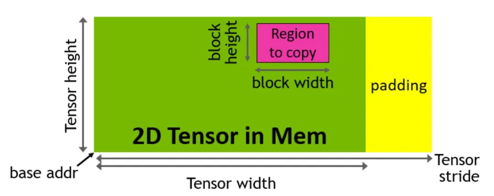

이런 방식은 thread와 register 점유를 해방하고, data copy와 address operation을 asynchronous하게 수행하게 한다. 이렇게 하면 SM의 MIO pressure도 낮아지고 issue되는 instruction 수 역시 크게 줄어든다. 이것이 TMA의 유래이다.

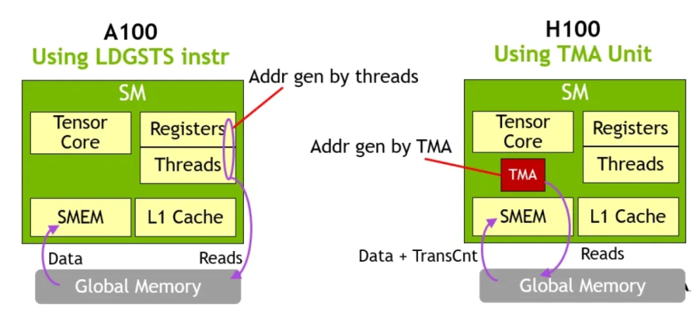

TMA의 concrete operation은 [Tensor-003 TensorCore architecture](https://mp.weixin.qq.com/s?__biz=MzUxNzQ5MTExNw==&mid=2247491424&idx=1&sn=0fc2110931b27714900e78d73b11a5b5&scene=21#wechat_redirect)에서도 일부 소개했다. 뒤에서 별도 subsection에서 자세히 설명한다.

#### 1.2.2 CGA

아래 그림과 같이 Ampere architecture에서는 matrix multiplication computation 시 같은 Tile이 여러 번 load된다. 연속된 2X2 Tile 두 개를 예로 들면, GMEM에서 SMEM으로 이동할 때 일정한 multicast capability를 지원할 수 있다면 GMEM memory bandwidth를 몇 배 절약할 수 있다.

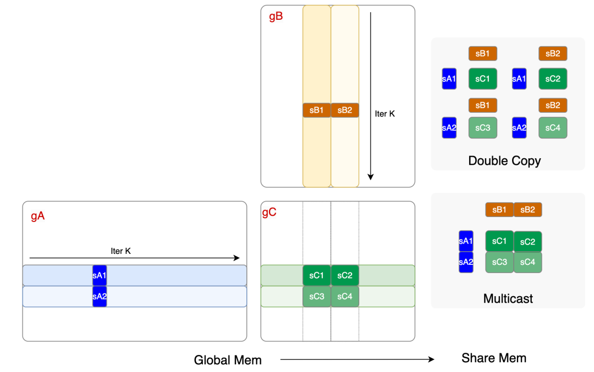

따라서 local한 몇몇 SM 사이에 SM-to-SM network를 구성할 수 있을까? 이것이 Hopper에서 Thread Block Cluster architecture(또는 Cooperative Grid Array, CGA)를 추가한 이유이며, 여러 SM을 서로 연결해 하나의 Cluster를 구성한다.

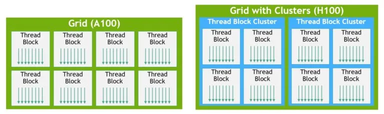

이렇게 하면 Cluster 내부에서 SM과 SM 사이의 memory access가 허용된다. 예를 들어 sC1을 compute하는 SM이 sA1을 sC2의 SM과 share할 수 있고, CGA 안에서 TMA를 사용해 memory를 다른 SM의 SMEM으로 asynchronous copy하는 것도 지원한다. 이렇게 distributed SMEM architecture가 구성되며, DSMEM이라고도 부른다.


또한 TMA는 CGA를 대상으로 multicast capability도 제공한다. 예를 들어 copy 시 sB1을 multicast 방식으로 GMEM에서 한 번 read하지만, 동시에 sC1과 sC3의 두 SM 안에 넣을 수 있다.

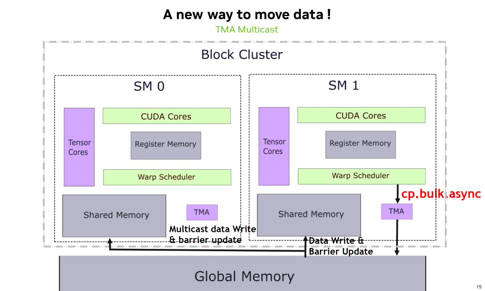

#### 1.2.3 TensorCore & WGMMA

그다음 TensorCore를 보자. Ampere의 TensorCore operand는 여전히 register resource를 점유해야 했고, 사용자가 SMEM의 data를 RMEM으로 옮겨야 했다. 따라서 Hopper에서는 이 상황도 optimized되었다. Matrix A와 Matrix B는 모두 SMEM에 직접 배치되어 TensorCore가 read할 수 있으므로 register resource 점유를 피한다. 반면 result Matrix D는 여전히 RMEM에 둔다. 이는 Attention의 Softmax처럼 CUDA Core가 이어서 수행해야 하는 Epilogue 처리가 많기 때문이다. 이후 Blackwell에서는 Tensor Memory도 추가되어 register 점유를 더 줄이고, WMMA issue cost를 더 낮춘다. 구체적인 내용은 Blackwell 절에서 update한다.

| Arch | Matrix A | MatrixB | MatrixD |
| --- | --- | --- | --- |
| Volta | RF | RF | RF |
| Ampere | RF | RF | RF |
| Hopper | RF/SMEM | SMEM | RF |
| Blackwell | TMEM/SMEM | SMEM | TMEM |

TensorCore operand가 Hopper에서는 SMEM에도 배치되기 때문에 result matrix Matrix D만 register resource를 점유한다. 따라서 Hopper에서는 하나의 SM 안의 4개 SubCore를 묶고, 연속된 4개 Warp가 WarpGroup을 구성해 TMA와 함께 4개 TensorCore parallel matrix multiplication을 구현할 수 있다. WarpGroup MMA에는 SMEM bandwidth를 낮출 수 있다는 또 다른 advantage도 있다. 아래 그림과 같다.

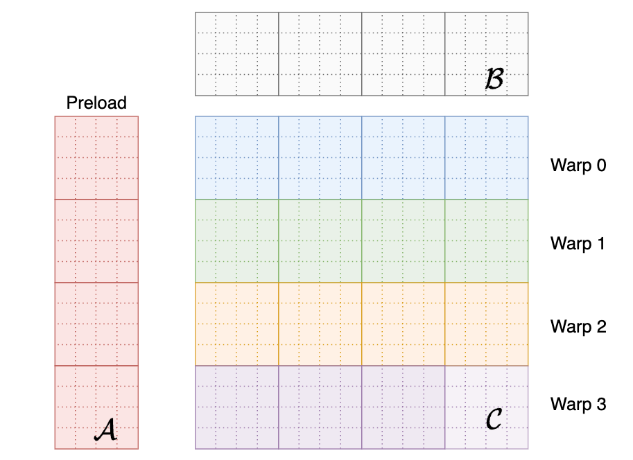

A-Tile을 미리 load할 수 있고, B-Tile은 4개 Warp 안에서 broadcast 방식으로 execute할 수 있다. 이렇게 하면 B-Tile이 TensorCore에 의해 read되는 bandwidth가 4배 낮아지고, 전체 TensorCore operation efficiency도 크게 향상된다. 물론 문제도 있다. 예를 들어 execute 전에 `wgmma.fence`가 필요하고, 완료 시에도 `wgmma.wait\_group` wait가 필요하다. 또한 전체 warp group이 execution instruction을 issue해야 한다. 이것도 Nvidia가 최종적으로 Blackwell에서 TMEM을 도입한 또 다른 이유이다. 다른 한편으로 scale도 계속 확대되어 2CTA(2SM)를 통해 execute할 수 있고, DSMEM에서 broadcast하여 TensorCore로 load할 수 있다. 동시에 각 warp는 하나의 thread에 의해 독립적으로 submit될 수 있으며, SMEM의 mbarrier를 통해 completion을 notify한다.


Blackwell의 TensorCore에 대해서는 뒤의 장에서 따로 소개한다.

#### 1.2.4 Warp Specialization

TMA가 도입되고, Hopper에서 TensorCore operand도 SMEM에 배치되며, 둘 다 asynchronous call capability를 제공하기 때문에 TMA와 TensorCore를 SM의 accelerator로 사용할 수 있다. SM 내부의 Warp Divergence와 Warp scheduling을 되짚어 보자. 하나의 SM은 한 cycle 안에서 최대 4개의 서로 다른 Warp로부터 각각 instruction 하나를 issue할 수 있다. ALU instruction은 보통 짧고 fixed completion time을 갖지만, TensorCore는 fixed completion time이 있더라도 보통 더 길다. memory access instruction은 보통 cache hit/miss, memory congestion 등의 영향을 받아 시간이 길고 uncontrollable하다. GPU는 많은 Active Warp를 유지해 latency hiding을 구현한다. 어떤 Warp가 long-latency operation(예: memory access) 때문에 stall되면, Warp scheduler는 즉시 ready 상태인 다른 Warp로 전환해 instruction을 execute할 수 있다.

다른 한편, Warp Divergence가 발생하면 각 Warp의 SIMT 특성 때문에 performance가 저하된다. 예를 들면 아래 그림과 같다.

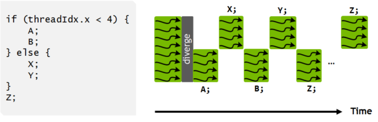

timeline 위에 많은 bubble이 존재해 efficiency에 영향을 주는 것과 같다.

Warp Specialization(WASP)은 CUDA-DMA[2]와 Singe compiler[3] 작업을 기반으로 널리 쓰이게 되었다. 본질적으로 Warp 내부의 Divergence를 Warp 사이로 옮기는 것이다. 서로 다른 Warp는 서로 독립적인 context에서 execute되므로, Divergence가 Warp 사이에서 발생할 때 Warp Scheduler scheduling을 통해 추가 cost가 도입되지 않는다.

다른 한편 TensorCore와 TMA 같은 accelerator 도입으로 asynchronous call capability가 생겼다. 따라서 WASP를 통해 dedicated Warp를 사용해 TMA 또는 Tensor Core matrix multiplication instruction을 issue할 수 있다. TMA Warp는 copy instruction을 issue하고 data가 multiplication 준비를 마치면 Tensor Core Warp에 notify한다. Tensor Core Warp는 data가 consume된 뒤 TMA Warp에 notify하여 memory가 free 상태이고 더 많은 copy에 사용할 수 있음을 알린다. 아래 그림과 같다.

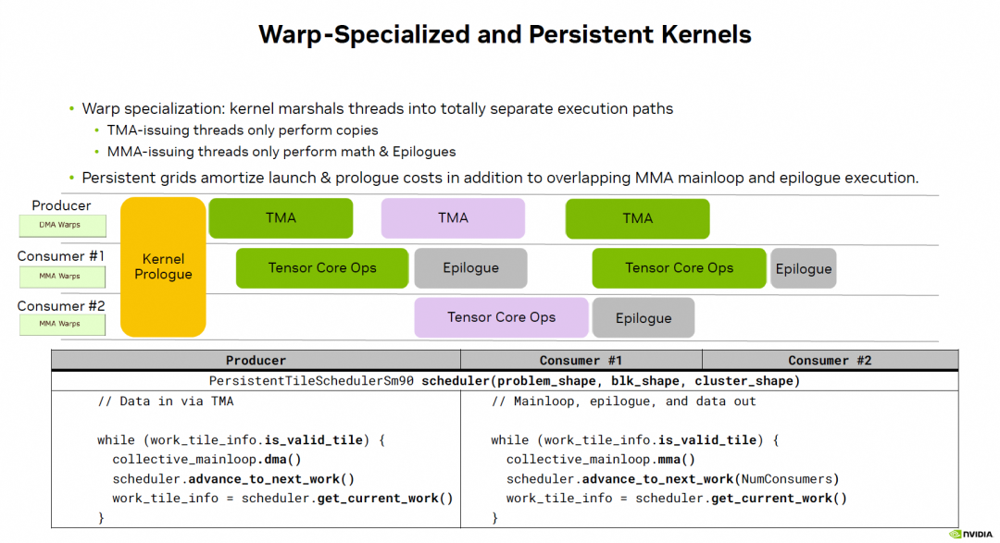

그다음 WASP의 performance benefit을 분석해 보자. 먼저 위 그림과 같이 TMA 같은 memory copy는 Cache Miss나 memory bandwidth의 영향을 dynamic하게 받는다. Warp Specialization을 통해 Warp Scheduler scheduling으로 이러한 dynamic latency를 hide할 수 있으므로 TensorCore utilization을 maximize할 수 있다.

다른 한편 TMA Warp는 더 이상 address를 계산하거나 predicate tensor로 boundary check를 수행할 필요가 없고 thread resource도 점유할 필요가 없다. 따라서 이 Warp의 register resource usage가 훨씬 작다. 그러므로 `setmaxnreg`를 통해 register resource를 consumer의 MMA warp에 allocate할 수 있으며, cuteDSL에서는 `cute.arch.warpgroup\_reg\_alloc(self.num\_regs\_mma)`를 사용해 수정할 수 있다.

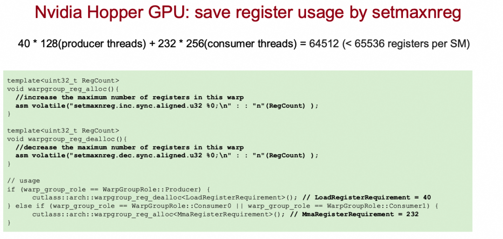

하지만 WASP를 사용하면 programmer가 전체 pipeline을 어떻게 정교하게 arrange하고 synchronized data dependency를 처리할지에 대한 challenge도 생긴다는 점에 주의해야 한다. 예를 들어 Hopper의 FlashAttn에서는 SM이 TMA와 TensorCore GEMM operation을 issue하는 동시에 softmax computation 같은 많은 CUDA Core 관련 work도 execute해야 한다.

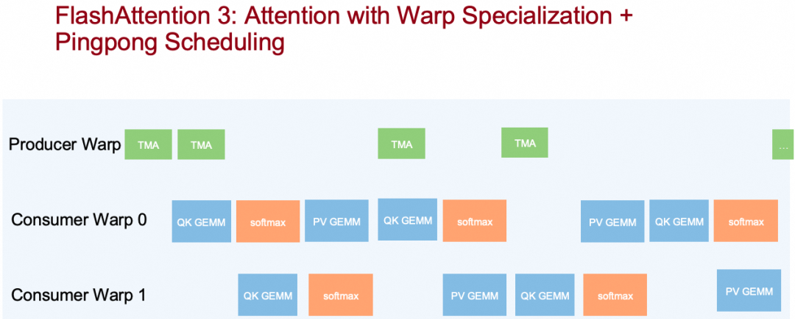

마지막으로 warp specialization의 또 다른 benefit은 서로 다른 Warp의 instruction 수가 줄어드는 데서 온다. 이렇게 하면 Warp execution 시 I-Cache overhead도 줄어든다. 그렇지 않으면 일부 복잡한 Attn computation process에서 더 많은 I-Cache가 필요하거나 I-Cache Miss가 발생해 performance loss로 이어질 수 있다.

WASP에 대해서는 참고할 만한 좋은 문서가 몇 편 있다. Unweaving Warp Specialization[4], 15-779 Lecture 6: Advanced CUDA Programming: Warp Specialization[5], GPGPU Arch(2) - Hopper WarpSpecialization Pingpong/Cooperative design discussion[6], WASP: Exploiting GPU Pipeline Parallelism with Hardware-Accelerated Automatic Warp Specialization[7]를 참고하면 된다.

## 2. Hopper new feature details

### 2.1 CGA

Hopper GPU 내부에는 local SM-to-SM network가 추가되어, SM 사이에서 SMEM을 share하고 Distributed SMEM을 구성할 수 있다.

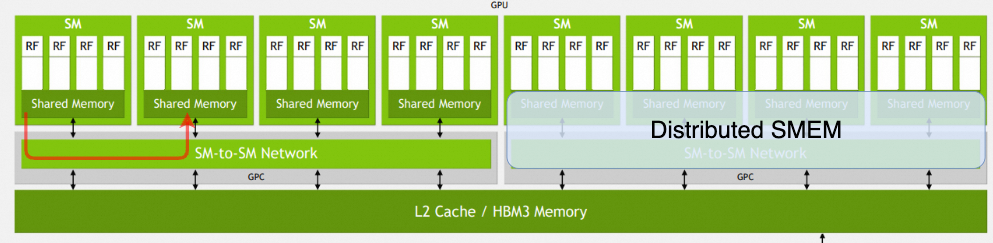

software level에서는 `cluster`라는 hierarchical structure가 추가되었다. 즉 Thread Block(CTA,Block)<--Thread Block Cluster(CGA,Cluster)<---Device(Grid)이다.

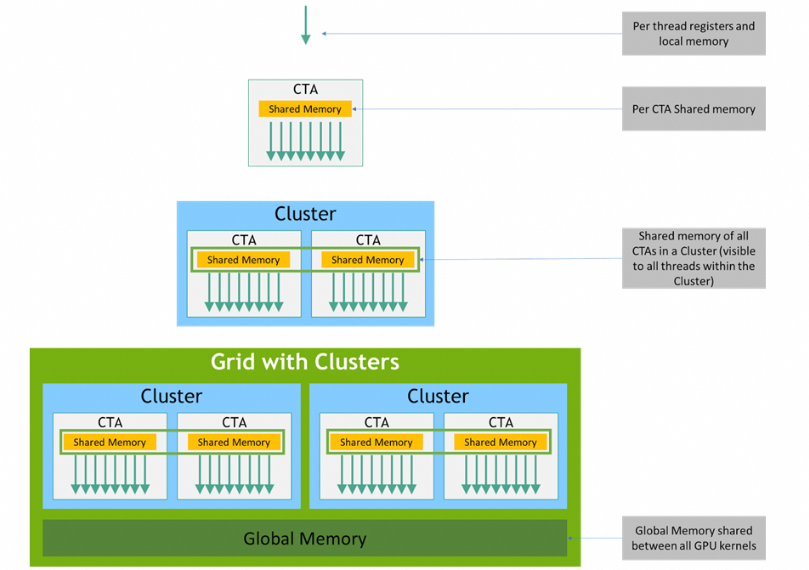

#### 2.1.1 Basic operation

CGA를 사용하고 해당 cluster-index를 얻는 test code는 다음과 같다.

```python
import torch
import cutlass
import cutlass.cute as cute
import cuda.bindings.driver as cuda

@cute.jit
def cluster_demo(
    stream: cuda.CUstream
):
    num_threads = 2
    cluster_kernel().launch(grid = (4,6,2),
        cluster = (2,2,1),
        block = (num_threads,1,1),
        stream = stream)

@cute.kernel
def cluster_kernel():
    tidx, _, _ = cute.arch.thread_idx()
    bidx, bidy, bidz = cute.arch.block_idx()
    cidx, cidy, _ = cute.arch.cluster_idx()
    cdimx, cdimy, _ = cute.arch.cluster_dim()
    cluster_id = cidx + cdimx * cidy
    cute.printf("tid {} block-id {},{},{} cluster-id {},{} id {}",
                tidx, bidx,bidy,bidz,cidx,cidy,cluster_id)
    return

torch_stream = torch.cuda.Stream()
stream = cuda.CUstream(torch_stream.cuda_stream)

cluster_demo(stream)
```

concrete cluster layout은 아래 그림과 같다.

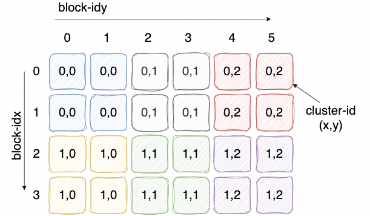

#### 2.1.2 Grid/Cluster Layout

Hopper platform에서 execute되는 TensorCore 기반 WGMMA instruction이 지원하는 Shape은 다음과 같다.

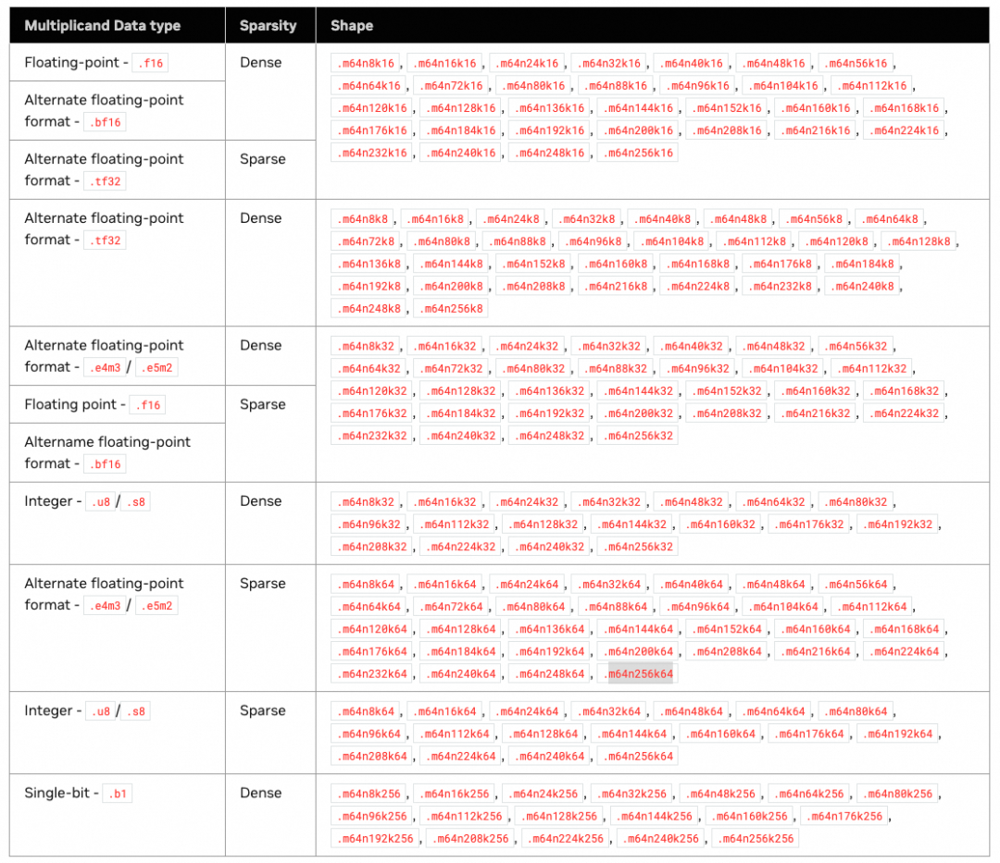

BF16을 예로 들면 DenseGemm K=16이고, 이는 여기서 선택하는 Tile\_MN, 즉 bM과 bN의 size를 constrain한다. 하나의 WarpGroup은 4개 warp, 즉 128개 thread를 사용한다. bM x bN이 128x256이면 각 thread에는 256개 register가 필요하다. Hopper에서 single thread register의 maximum count는 255개이다. 하나의 thread register 수가 limit에 도달하면 Register spill이 발생한다. 즉 사용하지 않아야 할 일부 Reg가 Local Memory에 임시 저장되며, 이는 Kernel performance를 크게 낮춘다. 다른 한편 WGMMA는 Accum matrix도 RMEM 안에 있으므로 모든 thread가 참여해야 한다. Register spill이 TensorCore와 이러한 Accum matrix가 사용하는 register에서 발생하면 TensorCore operation efficiency에 매우 큰 영향을 준다.

따라서 일반적인 방법은 thread 수를 늘려 두 개 Warp가 협력해 WGMMA operation을 execute하게 하는 것이다. 즉 Tile을 load한 뒤 2개의 64 x 256 sub-block으로 더 나누어 operation을 수행한다. 이렇게 하면 전체 register usage가 변하지 않는 상황에서 각 thread의 register 수를 절반으로 줄일 수 있다. `atom_layout_mnk`를 정의해 이러한 추가 split을 처리할 수 있다.

```python
from typing import Tuple, Type
import math
import torch
import cuda.bindings.driver as cuda

import cutlass
import cutlass.cute as cute
import cutlass.utils as utils
import cutlass.utils.hopper_helpers as sm90_utils
from cutlass.cute.runtime import from_dlpack

@cute.jit
def cluster_layout(
    a : cute.Tensor,
    b : cute.Tensor,
    c : cute.Tensor,
):
    tile_shape_mn = (128,128) # choice: [(128, 128), (128, 256), (128, 64), (64, 64)]
    tile_shape_mnk = (*tile_shape_mn, 1) # K-dim will be updated later

    cluster_shape_mn =(2,1) # choice: [(1, 1), (2, 1), (1, 2), (2, 2)]

    # for larger tiles, a single WarpGroup operation causes RegisterSpill,
    # so two warp groups are needed for the operation
    atom_layout_mnk = (
            (2, 1, 1)
            if tile_shape_mnk[0] > 64 and tile_shape_mnk[1] > 128
            else (1, 1, 1)
        )
    mma_warp_groups = math.prod(atom_layout_mnk)
    num_threads_per_warp_group = 128
    threads_per_cta = mma_warp_groups * num_threads_per_warp_group

```

WGMMA instruction은 Tile computation scale에 대해 특정 shape constraint를 갖기 때문에, 최종 split과 Layout을 결정하려면 K-dim size를 더 계산해야 한다. 먼저 $A, B, C$ 세 tensor의 datatype과 Majorness를 얻는다. 그다음 M=64, N=bN으로 Tiled\_MMA를 구성하고, Tiled\_MMA shape 안의 k-dim을 사용한다. 아래 그림은 "Targeting NVIDIA Hopper in MLIR"[8]에서 참고했다.

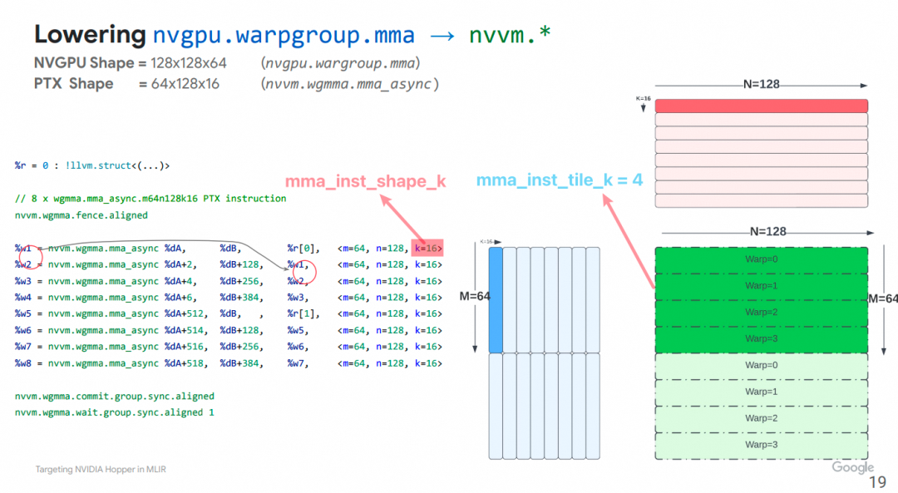

```c++
    # get Tensor datatype and Majorness
    a_dtype = a.element_type
    b_dtype = b.element_type
    acc_dtype = c.element_type
    a_layout = utils.LayoutEnum.from_tensor(a)
    b_layout = utils.LayoutEnum.from_tensor(b)
    c_layout = utils.LayoutEnum.from_tensor(c)

    # construct Tiled_MMA
    tiled_mma = sm90_utils.make_trivial_tiled_mma(
        a_dtype,
        b_dtype,
        a_layout.sm90_mma_major_mode(),
        b_layout.sm90_mma_major_mode(),
        acc_dtype,
        atom_layout_mnk,
            tiler_mn=(64, tile_shape_mnk[1]),
    )

    mma_inst_shape_k = cute.size(tiled_mma.shape_mnk, mode=[2])
    mma_inst_tile_k = 4
    tile_shape_mnk = (
        tile_shape_mnk[0],
        tile_shape_mnk[1],
        mma_inst_shape_k * mma_inst_tile_k,
    )
    cute.printf("tile-mma {} tile_shape_mnk{}",tiled_mma.shape_mnk,tile_shape_mnk)

#output
tile-mma (64,128,16) tile_shape_mnk(128,128,64)
```

이 시점에서 Tile\_MNK computation은 완료되었다. 마지막으로 $C$ Tensor의 Shape에 따라 필요한 grid를 계산한다. 예를 들어 M=N=K=4096이고 Batch dimension L=16일 때 C\_Tiler=(128,128)이므로 gC의 Layout은 (128,128),(32,32,16)이다. 그다음 cluster\_shape에 따라 grid dimension을 계산한다.

```c++
    c_tiler = (tile_shape_mnk[0], tile_shape_mnk[1])  #c_shape = tile_M,tile_N
    gc = cute.zipped_divide(c,tiler=c_tiler)
    cluster_shape_mnl = (*cluster_shape_mn, 1) #cluster dimz = 1
    clusters = cute.ceil_div(cute.get(gc.layout, mode=[1]).shape, cluster_shape_mnl)
    grid = tuple(x * y for x, y in zip(clusters, cluster_shape_mnl))
    cute.printf("gC Layout {} grid {}",gc.layout, grid)

#output
gC Layout ((128,128),(32,32,16)):((4096,1),(524288,128,16777216)) grid (32,32,16)
```

### 2.2 TMA

#### 2.2.1 TMA architecture analysis

TMA implementation detail은 patent US20230289292A1[9]에서 찾을 수 있다.

TMA를 구현하는 가장 근본적인 이유는 다음과 같다. GPU에서 matrix operation을 위한 dedicated unit(예: Tensor Core)의 performance가 크게 향상되면서 data supply가 새로운 bottleneck이 되었다. 전통적인 memory access 방식, 즉 processor core(CUDA Core)가 load/store instruction을 execute하는 방식은 복잡한 address calculation을 수반하고 귀중한 register resource를 점유한다. 또한 data가 main memory(Global Memory)에서 on-chip shared memory(Shared Memory)로 transfer되기를 기다리는 동안 compute unit이 idle 상태가 될 수 있어 overall performance와 energy efficiency를 제한한다. `LDGSTS` 같은 asynchronous copy instruction도 여전히 software(즉 processor core에서 run되는 program)가 각 data block의 address를 계산해야 하므로, 상당한 software overhead와 performance loss를 가져온다.


이 문제를 해결하기 위해 Nvidia는 dedicated memory access hardware circuit, 즉 Tensor Memory Access Unit(TMAU)을 설계했다. core idea는 다음과 같다.

1. **Offload:** 복잡하고 시간이 많이 드는 multidimensional data address calculation과 data movement control logic을 general-purpose processing core(예: SM 안의 CUDA Core)에서 dedicated hardware unit TMAU로 offload한다.
2. **Asynchronous execution:** TMAU는 processor core와 독립적으로 large-scale data block transfer task를 asynchronous하게 execute할 수 있다. processor core는 high-level request 하나만 보내면 이후 다른 computation task를 계속 execute할 수 있으므로 memory access latency를 효과적으로 hide한다.
3. **Abstraction and simplification:** TMAU는 tensor 같은 multidimensional(1D~5D) data structure의 logical layout을 이해할 수 있다. programmer는 더 이상 복잡한 physical memory address를 수동으로 계산할 필요가 없고, 더 높은 dimension의 coordinate를 통해 data를 request할 수 있다. 이는 programming model을 크게 단순화하고 development/debugging cost를 낮춘다.
4. **Boundary check:** 기존 data load process에서는 보통 CUDA Core가 predicate tensor를 구성해 memory access boundary를 판단해야 했지만, TMAU에는 boundary check capability가 built-in되어 있다. 이 역시 register pressure를 크게 줄인다.

architecture 측면에서 각 SM은 하나의 TMAU와 tightly coupled되어 있다. 이러한 one-to-one configuration은 access latency와 resource contention을 줄인다.

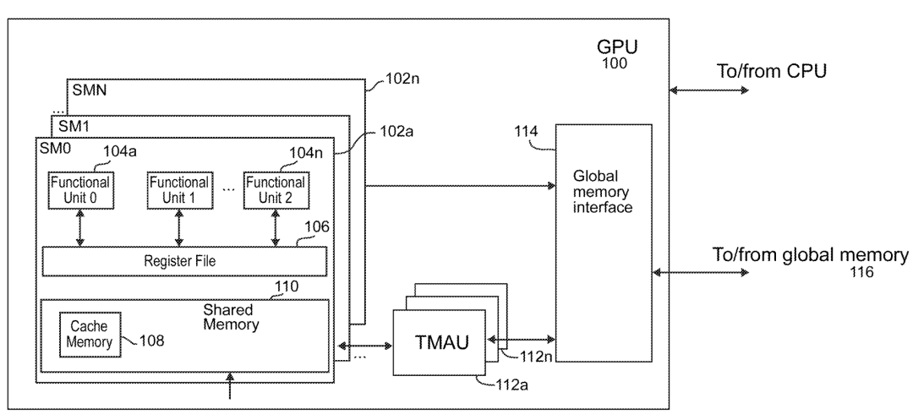

아래 그림과 같이 TMAU는 서로 다른 level의 memory에 access할 수 있다. 여기에는 다음이 포함된다.

- Global Memory 같은 external memory, 예를 들면 HBM/GDDR DRAM, 나아가 PCIe를 통한 Host Memory access
- SM 내부의 shared memory(Shared Memory, SMEM)
- internal interconnect network를 통한 distributed shared memory(Distributed Shared Memory, DSMEM) access

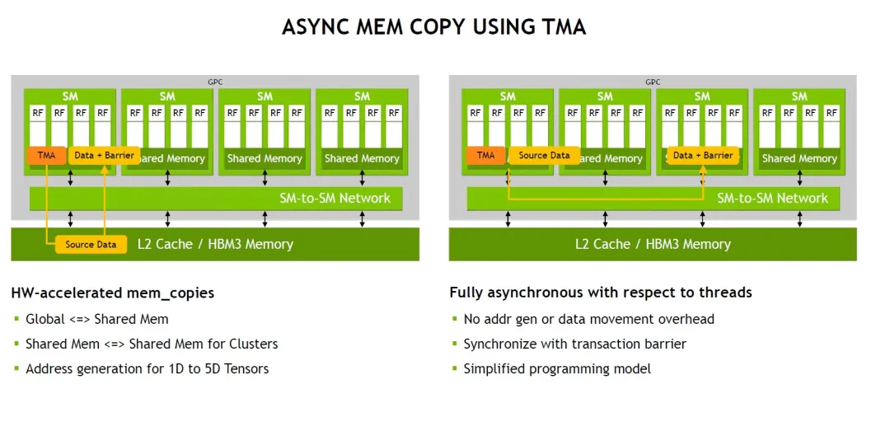

TMAU internal structure는 다음과 같다.

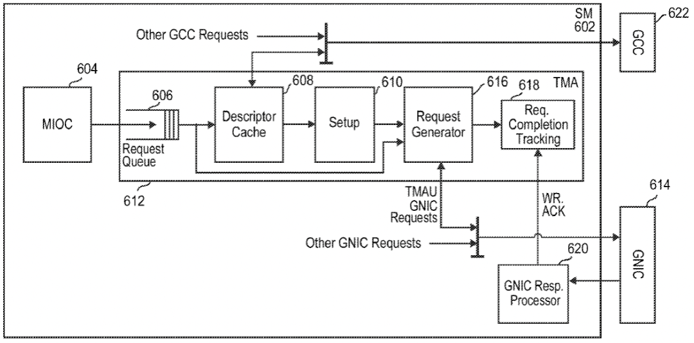

| 번호 | component name | function description |
| --- | --- | --- |
| 604 | memory input/output controller | SM과 TMAU 사이의 interface 역할을 하며, SM에서 오는 memory access request를 receive한다. |
| 606 | internal request queue | SM에서 오는 request를 cache한다. 두 종류의 request를 처리할 수 있다: tensor request(descriptor 필요)와 non-tensor request(linear data block). |
| 608 | descriptor cache | 최근 사용된 tensor descriptor를 cache한다. 동일 tensor에 대한 access는 보통 temporal locality를 가지므로, 이 cache는 descriptor 획득 latency를 크게 줄일 수 있다. cache miss가 발생하면 global memory에서 descriptor를 prefetch한다. |
| 610 | Setup Block | request queue에서 request를 꺼내고, tensor request이면 descriptor cache에서 descriptor를 가져온다. 모든 parameter(descriptor와 request 자체에서 온 것)를 parse하고 correctness check를 수행하며, 이후 request generator에 필요한 모든 computation parameter를 준비한다. |
| 616 | request generator | TMAU의 core engine이다. Setup Block이 준비한 parameter를 receive하고, multidimensional tensor space(또는 linear address space)를 traverse하며, 각 sub-block의 global memory address와 shared memory address를 iterative하게 계산하고, out-of-bounds condition을 check하며, memory subsystem으로 보낼 low-level request를 생성한다. |
| 618 | response completion tracking circuit | issue된 각 sub-request의 state를 track하여 TMAU와 SM의 asynchronous operation을 구현한다. 모든 sub-request가 완료되면 synchronization mechanism을 trigger한다. |
| 614 | generic network interface controller | GPU 내부 memory interconnect network와 communication하여 request를 send하고 response를 receive한다. |
| 620 | GNIC response processor | GPU 내부 memory interconnect network와 communication하며, received response를 처리한다. |

Note: non-tensor request의 경우 descriptor를 처리할 필요가 없으므로 606 request queue에서 616 request generator로 바로 jump할 수 있다.

concrete workflow:

1. **SM initiates request**: SM 위의 thread 하나가 coupling된 TMAU에 request를 send한다. tensor request의 경우 tensor descriptor pointer와 block coordinate 정보도 포함한다.
2. **TMAU generates sub-requests**: TMAU가 request를 receive하면 asynchronous work를 시작한다. request를 parse하고, data block size와 memory system constraint(예: L2Cache Line size)에 따라 일련의 sub-block physical address를 자동으로 계산하며, 여러 low-level memory access request를 생성해 memory subsystem에 send한다.
3. **Data transfer**: memory subsystem은 이러한 sub-request에 response하고 data를 target location으로 transfer한다. TMAU는 data를 SM의 SMEM에 직접 write할 수 있고, register file(RF)과 L1 data cache를 bypass하여 resource usage와 불필요한 cache pollution을 피한다.
4. **Synchronization**: TMAU 내부에는 completion tracking circuit이 있다. 모든 sub-request가 완료되고 전체 data block이 성공적으로 transfer되면, TMAU는 synchronization mechanism(예: shared memory 안의 counter 또는 barrier update)을 통해 SM에 notify한다. SM 위의 thread는 이 synchronization object를 check하여 data가 ready인지 확인할 수 있다.

#### 2.2.2 TMA instruction and descriptor

SM이 TMA instruction 하나를 issue할 때, 보통 instruction이 최대한 concise하기를 바란다. 하지만 tensor-based TMA의 경우 tensor dimension(dimensions), 각 dimension의 size, element size, 각 dimension의 stride 등 많은 정보를 carry해야 한다. 따라서 TMA design은 descriptor(Descriptor)를 구성해 GMEM에 두고, TMA instruction에는 그 pointer만 carry하도록 한다. descriptor는 아래 그림과 같다.

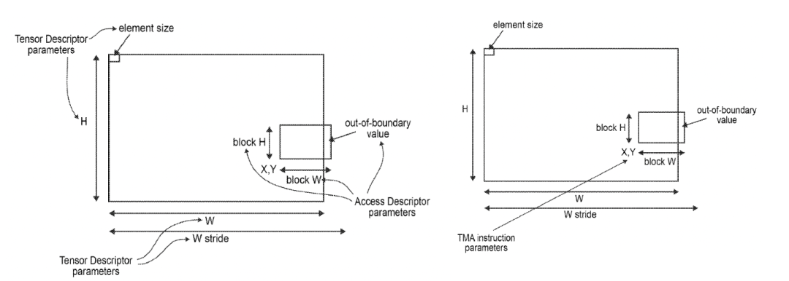

- **Tensor Descriptor:** GMEM에 저장되는 data structure이며, tensor의 static attribute를 정의한다. SM은 request를 initiate할 때 이 descriptor의 pointer만 제공하면 된다.

- `parameter example`: tensor dimensions, 각 dimension의 size, element size, 각 dimension의 stride.

- **Access Descriptor:** 보통 tensor descriptor 안에도 포함되며, access pattern의 attribute를 정의한다.

- `parameter example`: access block size(block/box size), out-of-bounds fill value.

- **TMAU Instruction Parameters:** SM이 request를 initiate할 때 직접 제공하며, 이번에 구체적으로 어떤 data block에 access할지 지정하는 데 사용된다.

- `parameter example`: block의 starting **coordinate** (e.g., (x,y,z)), target SMEM address, synchronization object address.

TMA에는 Descriptor Cache가 있으므로, CuteDSL에서도 다음 방식으로 GMEM에서 Descriptor를 Prefetch할 수 있다.

```c++
cute.nvgpu.cpasync.prefetch_descriptor(tma_atom_a)
cute.nvgpu.cpasync.prefetch_descriptor(tma_atom_b)
```

#### 2.2.3 TMA address calculation and request generation

`non-tensor mode`의 address generation은 매우 simple하다. SM의 request instruction이 다음을 직접 제공한다.

1. source address (GMEM의 starting address)
2. target address (SMEM의 starting address)
3. total amount of data to transfer

이때 TMA의 address generation logic은 simple linear address incrementer로 degenerate된다. i번째 data block(보통 16 bytes)에 대한 address calculation은 다음과 같다.

$$
Addr_{global} = SourceAddress + i \times BlockSize
$$

`tensor mode`에서는 tensor descriptor에 따라 생성해야 한다. 먼저 Setup Block에서 필요한 정보를 analyze해 얻는다.

- **Tensor Descriptor**에서 얻는 것:

- tensor base address (Base Address).
- tensor dimensions (Dimensions).
- 각 dimension의 total size (Tensor Size).
- 각 dimension의 stride (Tensor Stride).
- element size (Element Size).

- **Access Descriptor**(보통 tensor descriptor 안에도 있음)에서 얻는 것:

- requested **block size (Box Size)**, 즉 각 dimension에서 load할 element 수.
- traversal stride (Traversal Stride).

- **SM에서 온 instruction**에서 얻는 것:

- requested block의 starting coordinate. 이는 logical position이며, 예를 들어 `(x, y, z)`이다.

그다음 request generator 내부에는 hardware state machine이 구현되어 있으며, 그 behavior는 N-dimensional nested loop와 equivalent하다(N은 tensor dimension).

$$
Addr_{global} = BaseAddr + \sum_{i=0}^{N-1} (coord_i \times stride_i)
$$

inner loop의 각 iteration에서 TMA는 현재 계산된 logical coordinate `coord_i`가 tensor descriptor에 정의된 `TensorSize`, 즉 각 dimension의 size(tensorSize[0], tensorSize[1], ...)를 초과했는지 check한다. 초과했다면 TMA는 이 invalid address에 access하지 않고, 해당 element를 out-of-bounds로 mark하며, 이후 target address에 write할 때 preset fill value(0 또는 special NaN)를 사용한다.

마지막으로 generated address에 대해 TMA는 각 element마다 independent memory access request를 생성하지 않는다. address가 연속적인 여러 element를 intelligent하게 merge하여 memory subsystem(예: L2 cache)에 대한 하나의 request로 만든다. request size는 보통 L2 cache line size(예: 128B)이다. 이 step은 memory bus utilization을 maximize한다.

마지막으로 memory access의 Bank conflict를 피하기 위해 swizzle 방식으로 address를 생성해야 한다. TMA는 data를 shared memory에 write할 때 Swizzle을 자동으로 execute한다. 이 process는 programmer에게 semi-transparent하다. programmer는 data가 Swizzle되었다는 사실은 알아야 하지만, Swizzle을 직접 구현할 필요는 없다.

먼저 base address와 LogicalOffset에 따라 logical address를 계산한다.

$$
Addr_{smem_logical} = BaseAddr_{smem} + LogicalOffset
$$

그다음 Swizzle function을 적용해 physical address를 생성한다.

$$
Addr_{smem_physical} = Swizzle(Addr_{smem_logical})
$$

이 Swizzle function은 보통 **address bit의 XOR operation**을 기반으로 한다. hardware로 구현하기 매우 빠르고 저렴하다.

##### Example: simplified 64KB shared memory, 32 banks, each bank is 4 bytes wide

- 하나의 address는 하나의 4Byte word를 uniquely identify할 수 있다.
- address의 lower 5 bits(address[4:0])는 보통 그것이 어떤 Bank에 속하는지 결정하는 데 사용된다.
- address의 high bits(address[...:5])는 그것이 해당 Bank의 어느 row에 있는지 결정하는 데 사용된다.

###### Case without Swizzle:

하나의 Warp의 32개 thread가 access하는 address가 각각 0, 32, 64, 96, ...라면, 이 address binary representation의 lower 5 bits는 모두 `00000`이다. 이는 32개 thread가 모두 `Bank 0`에 access한다는 뜻이며, 심각한 Bank Conflict를 유발한다.

###### Case with Swizzle:

TMA는 Swizzle function을 적용할 수 있다. 예를 들면 다음과 같다.

$$
\text{physical_bank_id} = \text{logical_bank_id}\quad XOR\quad \text{logical_row_id}
$$

더 구체적으로 hardware level에서는 다음과 같을 수 있다.

$$
Addr_{physical}[4:0] = Addr_{logical}[4:0] \oplus Addr_{logical}[9:5]
$$

여기서 우리는 logical address의 high bits(row information)를 사용해 low bits(Bank information)를 "disturb"한다. 이제 thread가 logical address 0, 32, 64, 96, ...에 access할 때:

- logical address *0*: Addr\_logical is *...00000 00000*. physical Bank ID is *00000 XOR 00000 = 0*.
- logical address *32*: Addr\_logical is *...00001 00000*. physical Bank ID is *00000 XOR 00001 = 1*.
- logical address *64*: Addr\_logical is *...00010 00000*. physical Bank ID is *00000 XOR 00010 = 2*.
- ...

원래 같은 Bank에 access하던 address sequence는 Swizzle 후 Bank 0, 1, 2, ... , 31로 완벽하게 분산되어 Bank Conflicts가 제거된다.

#### 2.2.4 TMA synchronization mechanism

Ampere에서는 `cp.async`가 보통 하나의 thread에 의해 submit되고, 그 thread가 직접 commit\_group과 wait\_group을 수행한다. 따라서 thread에만 visible하면 된다. 그래서 가장 직접적인 방법은 scoreboard 위에 barrier를 하나 두거나, SMEM 위에 spin lock 또는 semaphore mechanism을 두는 것이다. 보통 prologue stage에서 `cp.async` access 묶음을 bulk submit하고, `cp.async.commit_group`을 수행한 뒤 `cp.async.wait_group N`으로 operation 완료를 기다린다. 아래 그림과 같다.

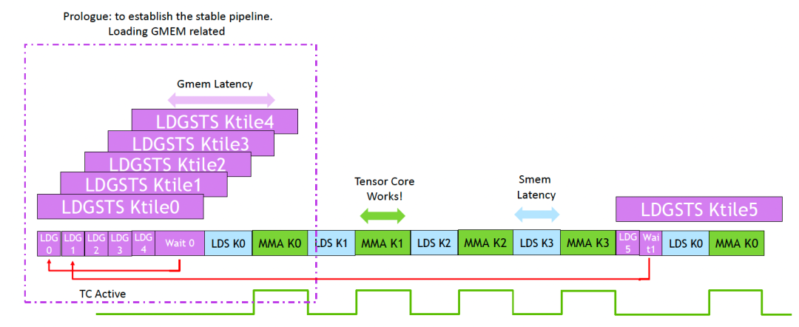

반면 TMA operation에서는 보통 하나의 thread가 TMA instruction을 submit하지만, 다른 thread도 result를 알아야 한다. DSMEM 기반 SMEM->SMEM 또는 GMEM->multicast scenario에서는 cross-CTA synchronization mechanism도 필요하다. 따라서 Hopper에는 memory barrier synchronization mechanism이 도입되었고, TMA memory copy의 direction에 따라 두 가지 completion mechanism을 지원할 수 있다.

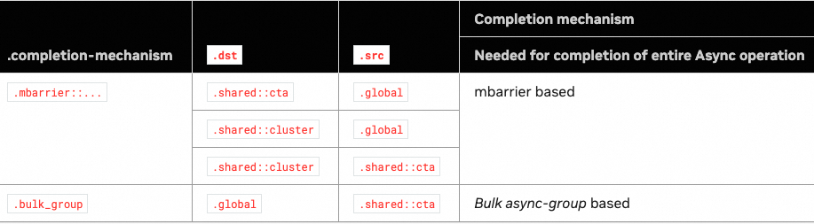

SMEM->GMEM의 경우도 보통 하나의 thread가 직접 TMA instruction을 issue하고, 직접 commit과 wait를 하면 된다. 아래에서는 warp specialization의 TMA Producer와 WGMMA Consumer를 예로 mbarrier mechanism을 펼쳐 소개한다. Bilibili에는 "GPU computing and programming model evolution: throughput and latency balance in asynchronous compute programming"[10]이라는 video가 있는데, Hopper에서는 두 set의 semaphore로 표현해야 한다.

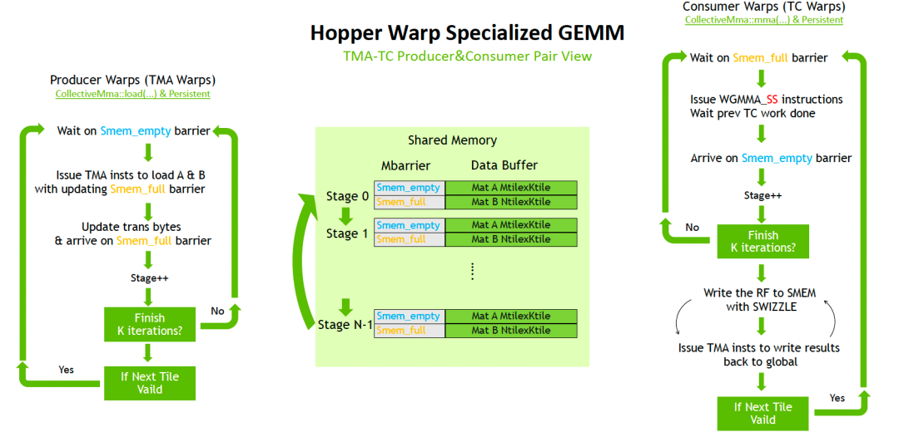

Producer TMA가 일부 data를 SMEM에 넣으면, `smem_full` Mbarrier를 통해 Consumer에게 data가 ready되었음을 알려야 한다. 마찬가지로 Consumer가 computation을 완료하면 semaphore `sem_empty`로 Producer에게 data를 refill하라고 notify해야 한다. Hopper부터 Mbarrier structure는 다음과 같다.

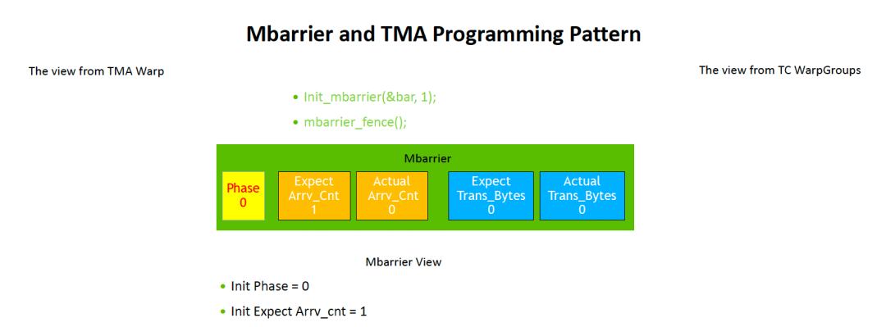

그 내부에는 thread 수와 관련된 counter와 몇 Byte를 transfer했는지에 대한 counter가 있으며, expected value와 current completed count를 포함한다. 그리고 Phase bit가 flip을 통해 completion state를 나타낸다. 먼저 위 그림과 같이 Mbarrier를 initialize해야 한다. TMA는 하나의 thread가 instruction을 issue하므로 Expect Arr\_Cnt=1이고, 다른 값은 모두 0이다.

조금 더 풀어 말하면, 여기의 이 data structure는 Hopper에서 외부에 설명하는 Async Transaction Barrier에 해당한다.

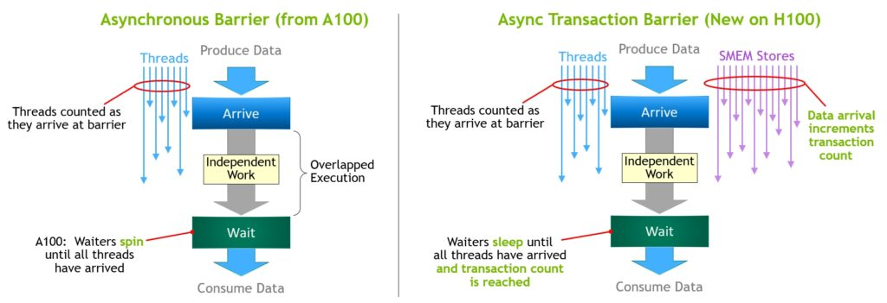

그림 왼쪽의 Threads cnt는 Mbarrier structure에서 orange 부분에 해당하고, 오른쪽의 Transaction cnt는 Mbarrier의 blue 부분에 해당한다.

그다음 TMA가 request 하나를 initiate한다. TMA는 이 instruction을 이 Barrier에 attach하고, 16KB data를 transfer해야 함을 알린다. 이어서 `mbarrier\_arrive\_expect` operation을 수행하면, 이때 Actual Arrv\_Cnt가 1이 되고 barrier의 Expect TransBytes도 update된다.

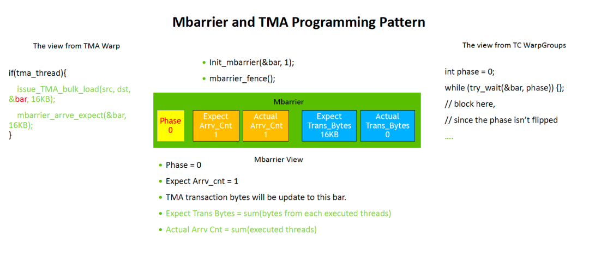

그다음 data가 계속 transfer되면서 TMA의 Req Completion Tracking module은 GNIC가 return한 Write ACK에 따라 Actual Trans\_Bytes를 update한다. 이때 Expect와 Actual Trans\_Bytes가 아직 일치하지 않으므로 Mbarrier Phase bit는 여전히 0이고, Consumer는 Phase bit가 flip될 때까지 계속 block된다.

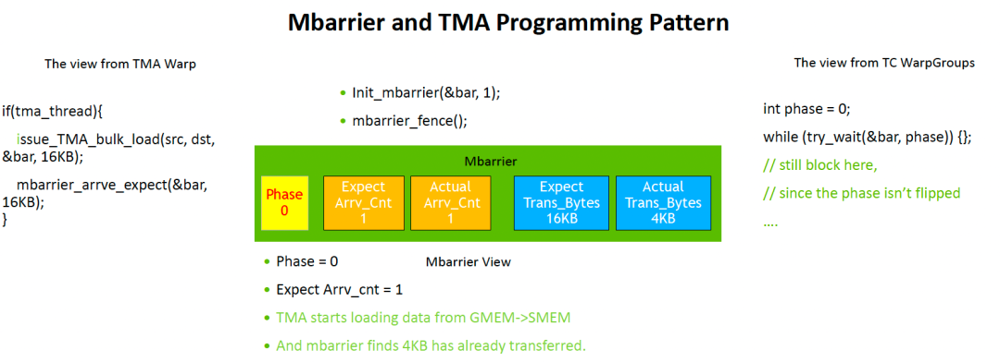

16KB data transfer가 완료되면 아래 그림과 같이 hardware가 이 state에 따라 Phase bit를 flip한다. 이 bit를 flip하는 것은 atomic operation이다.

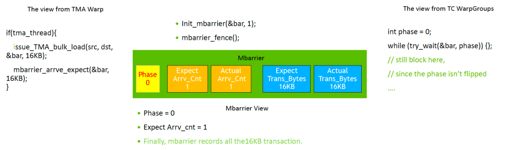

flip이 완료되면 Consumer block이 해제되고, WGMMA 같은 computation operation을 execute하기 시작한다.

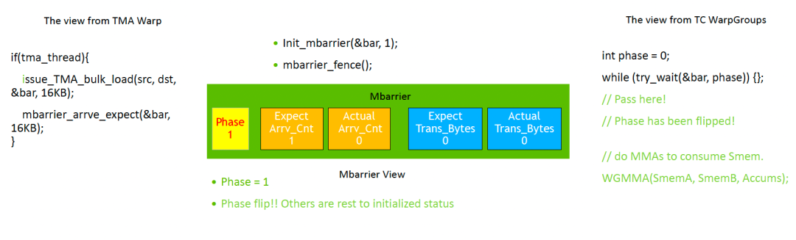

그다음 Consumer는 data를 consume하기 시작한다. 앞에서 말한 Barrier는 data가 이미 full이고 Consumer가 consume할 수 있음을 나타내므로 `smem_full` Mbarrier라고도 부른다. 이때 또 다른 Mbarrier가 필요하다. semantic상 이 data가 이미 consume 완료되어 free 상태임을 나타내며, 즉 `smem_empty` Mbarrier이다. 이때 Producer는 이 empty barrier의 phase에 따라 blocking operation을 수행한다. 주의할 점은 WGMMA가 WarpGroup의 128개 thread가 참여해 compute하므로 `init\_mbarrier(&bar\_empty,128)`이며, expect arrv\_cnt에서 128은 이 128개 thread를 나타낸다는 것이다.

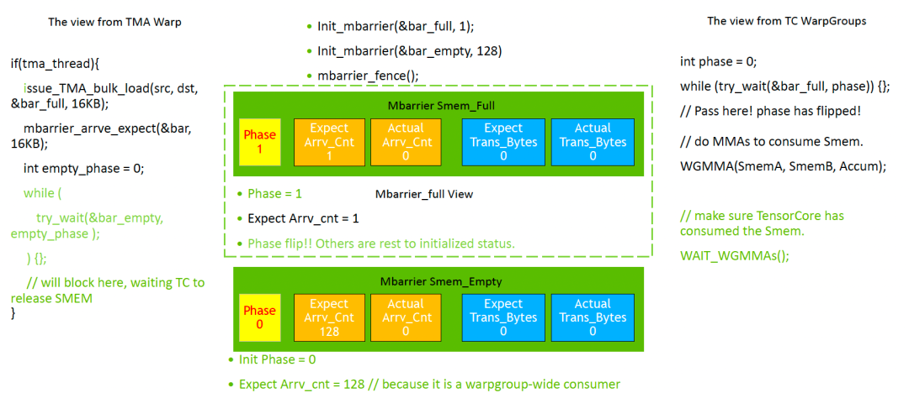

그다음 consumer는 TensorCore가 computation을 완료하기를 기다린 뒤, `mbarrier\_arrive(&bar\_empty)`를 사용해 `smem_empty` 안의 actual arrv\_cnt를 update한다. 이때 Phase는 여전히 0이고 Producer는 계속 block 상태이다.

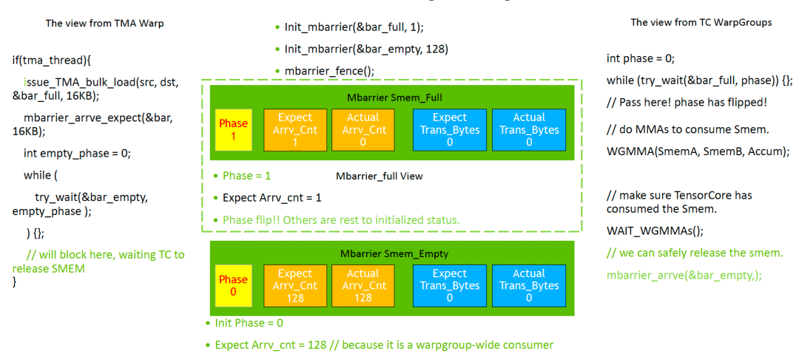

expect와 actual data가 일치하면, 다음 cycle에서 hardware가 다시 atomic operation으로 `smem_phase` bit를 flip한다. Producer는 block에서 해제되어 data transfer를 계속 execute한다.

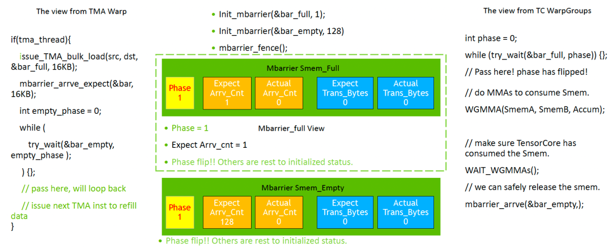

그다음 두 번째 iteration을 진행할 때 MBarrier의 Phase=1이므로, 이때 Producer/Consumer는 다음 update 시 phase bit flip이 1에서 0으로 일어난다는 것을 기록해야 한다.

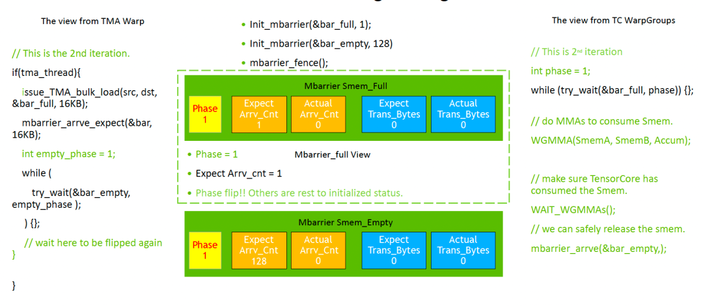

1.2.4에서 Warp Specialization을 소개했듯이, 이러한 두 semaphore 방식을 통해 hardware가 warp scheduling을 수행할 수 있다. 기존 multi-stages와 비교하면 Producer와 Consumer code가 완전히 decouple된 뒤 두 semaphore의 coordination과 asynchronous execution을 통해, 전체 process에서 하나가 block되면 다른 하나가 execute될 수 있음을 볼 수 있다. 따라서 TensorCore의 Warp를 완전히 채울 수 있고, 중간에 TMA operation을 기다리는 code를 삽입해 TensorCore utilization에 영향을 줄 필요가 없다. 동시에 `setmaxregn`을 통해 Consumer가 더 많은 register resource를 갖게 하여 register spill을 피할 수 있다. 마지막으로 이러한 separated operation은 SM 안의 I-Cache usage도 줄여, 복잡한 large-scale program이 가져오는 I-Cache miss 영향을 피한다.

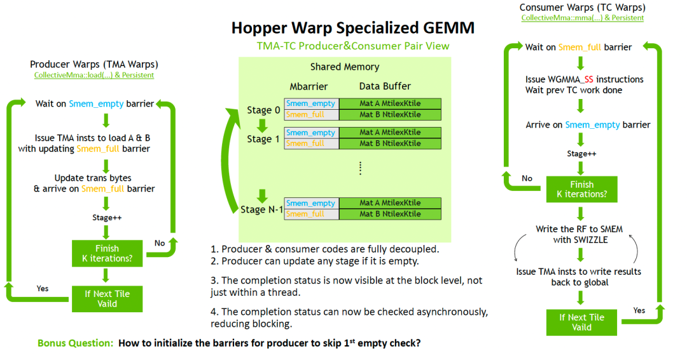

물론 이러한 Phase flip과 cnt/bytes operation은 매우 복잡하다. Cutlass에서는 일부 `pipeline` encapsulation을 수행하고, `advance` method를 통해 multiple stage circular buffer pipeline 사용을 구성한다.

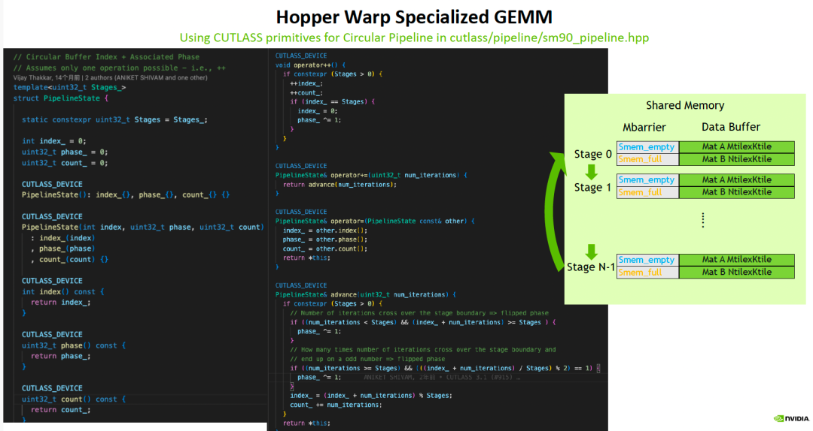

동시에 Producer TMA Warp와 Consumer TC WarpGroup을 대상으로 사용하기 더 편한 API layer도 encapsulate했다.

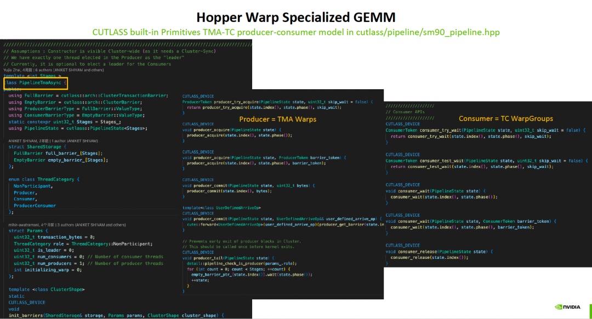

뒤의 몇 subsection에서 CuteDSL 위에서 이 process를 다시 자세히 분석한다.

#### 2.2.5 TMA multicast

Hopper에 SM-to-SM network가 추가되어 DSMEM이 구성되었으므로, matrix operation 시 GMEM에서 SMEM으로 한 번만 copy한 뒤 SM-to-SM을 통해 한 SM의 SMEM에서 다른 SM으로 copy할 수 있다. 이렇게 하면 GMEM bandwidth를 절약할 수 있다. 아래 그림과 같다.


따라서 TMA에도 multicast capability가 추가되었다. 먼저 하나의 SM에서 TMA multicast instruction을 issue하고, data arrival write와 barrier update가 이루어진다.

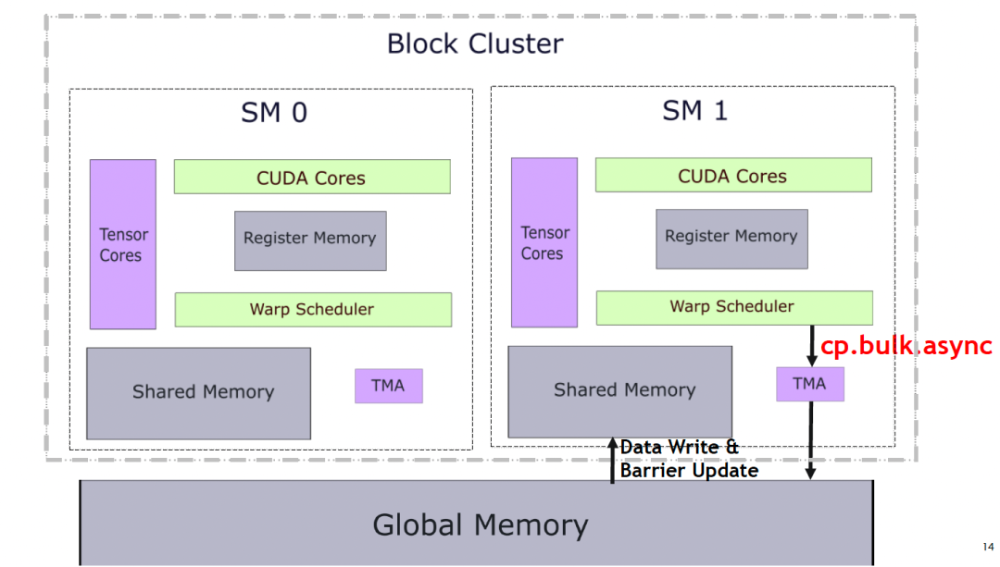

이때 TMA Unit에 몇 가지 extension을 만들 수 있다. operation instruction에 Multicast가 포함되어 있으므로, 또 다른 SMEM-to-SMEM ST operation을 trigger하여 다른 SM으로 write할 수 있다.

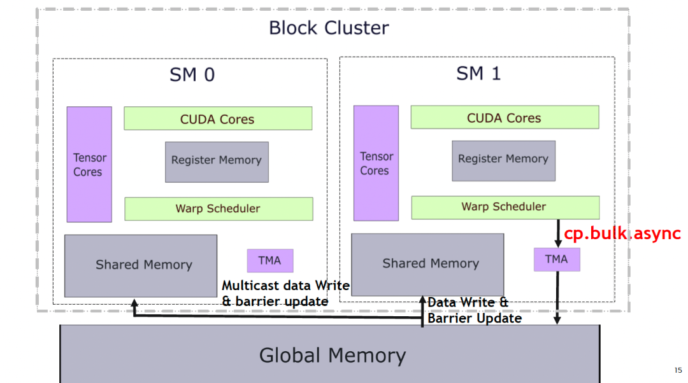

#### 2.2.6 TMA Reduce

Reduce sum은 Split-K GEMM에서 필수적인 operation이고, reduce min/max도 attention mechanism에서 자주 사용된다. 일반적인 reduce operation은 CTA SMEM의 value를 GMEM tensor 안의 Tile 하나에 accumulate해야 한다. 여기에는 한 번의 GMEM read, original data를 CTA의 SMEM 또는 RMEM으로 load, xor | and | or | add | min | max | inc | dec operation execute, 그리고 다시 한 번 GMEM write가 포함된다.

따라서 TMA는 Reduce support를 추가했으며, SMEM->GMEM reduce operation만 지원한다. 하지만 공개 patent를 보면 TMAU에는 reduce computation operation을 처리하기 위한 vector compute unit이 없다. 동시에 Nvidia도 TMA Reduce implementation을 완전히 공개하지 않았으므로, 몇 가지 추측을 해 본다.

GMEM data가 NOC를 지나 SM으로 두 번 이동하는 overhead를 낮추기 위해, 이 reduce operation의 vector device는 SM 외부에 있어야 하고 CUDA Core의 ALU를 reuse하지 않을 것이다. 그리고 여러 SM이 함께 reduction을 수행해야 할 때는 여러 SM 사이의 cooperation과 computational consistency 문제도 처리해야 하므로 매우 복잡해진다. 따라서 TMA Reduce implementation에서는 몇 가지 constraint를 두었다. source address는 CTA-Level SMEM만 지원하고, destination address는 GMEM만 지원한다.

```c++
cp.reduce.async.bulk.dst.src.completion_mechanism{.level::cache_hint}.redOp.type
               [dstMem], [srcMem], size{, cache-policy}

.dst =                  { .global      }
.src =                  { .shared::cta }
.completion_mechanism = { .bulk_group }
.level::cache_hint    = { .L2::cache_hint }
.redOp=                 { .and, .or, .xor,
                          .add, .inc, .dec,
                          .min, .max }
.type =                 { .f16, .bf16, .b32, .u32, .s32, .b64, .u64, .s64, .f32, .f64 }
```

그다음 TMA reduce에 의해 호출되는 각 reduction operation은 independent하고 relaxed-order로 처리된다. 하지만 이러한 operation이 atomic operation으로 design되며, operation 시 address가 16B에 align된다는 점도 고려해야 한다. 따라서 L2Cache가 XBAR에 연결되는 port에 일부 Reduction Logic이 추가되었을 것으로 추측한다. 이러한 operation에는 큰 compute power가 필요하지 않고, TMA 자체가 asynchronous operation이며 다른 SM memory access도 있으므로 Reduction Logic이 L2 bandwidth에 도달할 필요도 없다. 예를 들어 2TB/s reduction bandwidth가 필요하다면, FP32 Reduction computation 처리 시 compute requirement는 500Gflops에 불과하다.

#### 2.2.7 CuteDSL TMA operation

CuteDSL의 TMA operation definition은 다음과 같다.

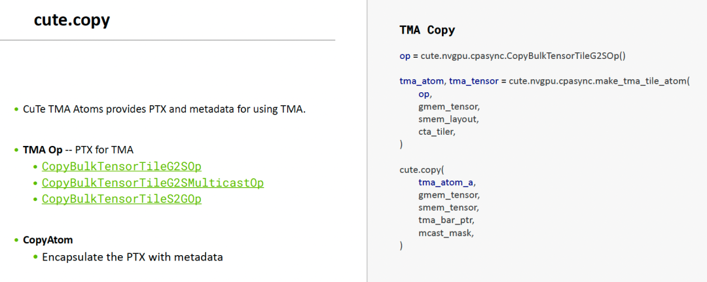

아래의 simple example로 CuteDSL의 TMA operation에 익숙해져 보자. 대략적인 flow는 먼저 `zipped\_devide`를 통해 gmem\_tensor를 얻고, smem layout을 생성한 뒤, 이를 기반으로 tma\_atom을 만드는 것이다. SMEM memory management에서는 cuteDSL의 struct 기능을 사용해 Mbarrier와 SMEM 위 tensor storage space를 함께 struct로 구성한다.

```python
from typing import Tuple, Type
import torch
import cuda.bindings.driver as cuda

import cutlass
import cutlass.cute as cute
import cutlass.utils as utils
import cutlass.utils.hopper_helpers as sm90_utils
from cutlass.cute.runtime import from_dlpack

@cute.jit
def tma_example(
    A : cute.Tensor,
):
    tile_shape_mn = (32,32)

    # use zipped_divide for tiling and compute required block layout
    gA = cute.zipped_divide(A, tiler=tile_shape_mn)
    print(f"zipped_divide A Layout {gA}")
    grid_dim = (*gA.shape[1],1)

    a_dtype = A.element_type
    a_layout = utils.LayoutEnum.from_tensor(A)

    # make_smem_layout_atom function performs swizzle based on datatype and major dimension size.
    # concrete Swizzle operation is described in detail in a later section.
    a_smem_layout_atom = cute.nvgpu.warpgroup.make_smem_layout_atom(
        kind=sm90_utils.get_smem_layout_atom(
            a_layout,
            a_dtype,
            major_mode_size=tile_shape_mn[0],
        ),
        element_type=a_dtype
    )

    # generate smem_layout based on target tile_shape and layout atom
    a_smem_layout = cute.tile_to_shape(
        atom = a_smem_layout_atom,
        trg_shape=tile_shape_mn,
        order=(0,1)
    )
    cute.printf("atom layout {}\n smem layout {}",a_smem_layout_atom,a_smem_layout)
    # atom layout S<2,4,3> o 0 o (8,32):(32,1)
    # smem layout S<2,4,3> o 0 o ((8,4),(32,1)):((32,256),(1,0))

    tma_copy_size_a = cute.size_in_bytes(
        a_dtype, cute.select(a_smem_layout, mode=[0,1])
    )
    cute.printf("tma cp size {}",tma_copy_size_a)
    # tma cp size 2048

    # construct struct containing mbar pointer and data in smem
    buffer_align_bytes = 128
    @cute.struct
    class SharedStorage:
        mbar_ptr: cute.struct.MemRange[cutlass.Int64, 2]
        sA:  cute.struct.Align[
            cute.struct.MemRange[a_dtype, cute.cosize(a_smem_layout)],
            buffer_align_bytes
        ]

    smem_size = SharedStorage.size_in_bytes()

    # generate tma_atom and tma_tensor
    a_tma_atom, a_tma_tensor = cute.nvgpu.cpasync.make_tiled_tma_atom(
        op = cute.nvgpu.cpasync.CopyBulkTensorTileG2SOp(),  # use TMA
        gmem_tensor = A,
        smem_layout= cute.select(a_smem_layout, mode=[0,1]),
        cta_tiler = tile_shape_mn
    )
    cute.printf("TMA ATOM ThrID  {} \nTV-Layout\n Src {}\n Dst {}\n TMA Tensor {}",
                a_tma_atom.thr_id,
                a_tma_atom.layout_src_tv,
                a_tma_atom.layout_dst_tv,
                a_tma_tensor
    )
    # TV-Layout
    #  Src (1,1024):(0,1)
    #  Dst (1,1024):(0,1)
    #  TMA Tensor (0,0) o (4096,4096):(1@1,1@0)

    kernel(
        a_tma_atom,
        a_tma_tensor,
        a_smem_layout,
        tma_copy_size_a,
        cute.make_layout(tile_shape_mn),
        SharedStorage,
    ).launch(
        grid = grid_dim,
        block = (256,1,1),
        smem = smem_size
    )

@cute.kernel
def kernel(
    tma_atom: cute.CopyAtom,
    tma_tensor : cute.Tensor,
    smem_layout: cute.ComposedLayout,
    tma_copy_size_a : int,
    cta_tiler: cute.Layout,
    SharedStorage: cutlass.Constexpr
):

    bidx, bidy, _ = cute.arch.block_idx()
    tidx, _, _ = cute.arch.thread_idx()
    warp_idx = cute.arch.warp_idx()

    # first warp group acts as producer
    is_producer = warp_idx < 4

    # prefetch TMA descriptor as early as possible
    if warp_idx == 0:
        cute.nvgpu.cpasync.prefetch_descriptor(tma_atom)
    cute.arch.sync_threads()

    # allocate SMEM and get MBarrier pointer from struct
    smem = cutlass.utils.SmemAllocator()
    storage = smem.allocate(SharedStorage)
    mbar_ptr= storage.mbar_ptr.data_ptr()

    # get Tensor from struct
    sA = storage.sA.get_tensor(smem_layout.outer, swizzle=smem_layout.inner)

    # initialize MBarrier
    with cute.arch.elect_one():
        cute.arch.mbarrier_init(mbar_ptr, cnt=1)
    cute.arch.mbarrier_init_fence()

    #######################################
    #  TMA Producer
    #######################################
    if is_producer :
        warp_idx_in_wg = cute.arch.warp_idx() % 4
        if warp_idx_in_wg == 0:

            # get Local Tile based on block coordinates
            tiled_tma_A = cute.local_tile(
                tma_tensor,
                tiler = cta_tiler.shape,
                coord = (bidx , bidy)
            )

            # for warpgroup
            sA_grouped = cute.group_modes(sA, 0, 2)
            tiled_tma_A_grouped = cute.group_modes(tiled_tma_A, 0, 2)

            tAsA, tAgA = cute.nvgpu.cpasync.tma_partition(
                    atom=tma_atom,
                    cta_coord=0, # for CGA; CGA is not enabled, so set to 0
                    cta_layout=cute.make_layout(1), # CGA is not used, so Layout is (1)
                    smem_tensor=sA_grouped,
                    gmem_tensor=tiled_tma_A_grouped,
            )

            if bidx == 0 and bidy == 0 and tidx == 0:
                cute.printf("gA: {}", tiled_tma_A.layout)
                cute.printf("gA_grouped: {}", tiled_tma_A_grouped.layout)
                cute.printf("sA: {}", sA.layout)
                cute.printf("sA_grouped: {}", sA_grouped.layout)
                cute.printf("tAgA: {}", tAgA.layout)
                cute.printf("tAsA: {}", tAsA.layout)

            # gA: (32,32):(1@1,1@0)
            # gA_grouped: ((32,32)):((1@1,1@0))
            # sA: ((8,4),(32,1)):((32,256),(1,0))
            # sA_grouped: (((8,4),(32,1))):(((32,256),(1,0)))
            # tAgA: (((32,32),1)):(((1@0,1@1),0))
            # tAsA: ((1024,1)):((1,0))

            # execute Copy
            cute.copy(tma_atom, tAgA, tAsA, tma_bar_ptr=mbar_ptr)

            # update TMA smem_full barrier expected tx-bytes
            with cute.arch.elect_one():
                cute.arch.mbarrier_arrive_and_expect_tx(mbar_ptr, tma_copy_size_a)

            if bidx == 0 and bidy == 0 and tidx == 0:
                cute.printf("PRODUCER: TMA copy issued.")
    #######################################
    #  Consumer
    #######################################
    else:
        # wait for smem_full barrier
        cute.arch.mbarrier_wait(mbar_ptr, 0)
        if tidx == 128 and bidx == 0 and bidy == 0 :
            cute.printf("CONSUMER: TMA load finished.")
            cute.printf("Tile in SMEM {}",sA)
    return

M,N = 4096, 4096
a = torch.arange(0.0, M *N, device="cuda", dtype=torch.bfloat16).reshape(M,N)
_a = from_dlpack(a, assumed_align=16)

tma_example(_a)
```

### 2.3 TensorCore WGMMA

#### 2.3.1 WGMMA programming overview

Hopper의 TensorCore operation은 granularity가 더 커졌다. 4개 warp(128개 thread)가 하나의 WarpGroup을 구성하고, 하나의 SM 안에서 동시에 TensorCore를 호출해야 한다.

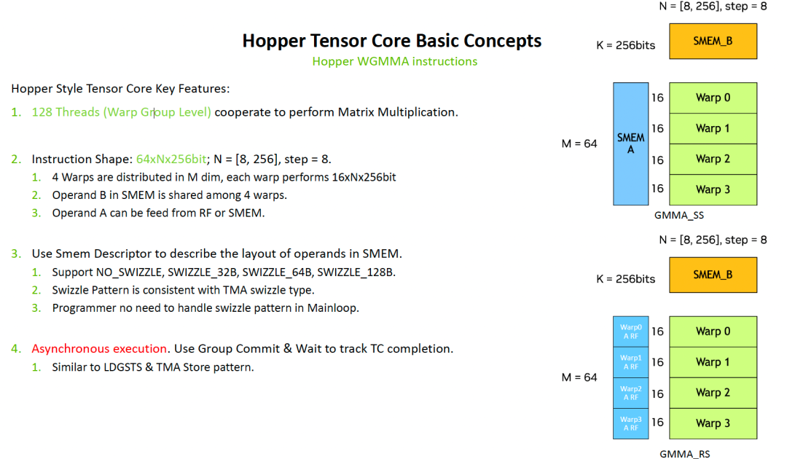

그다음 오른쪽 그림에서 볼 수 있듯이, A operand는 SMEM에서도 올 수 있고 register에서도 올 수 있지만, B는 SMEM 안에 있어야 한다. 또한 네 개 Warp가 M dimension을 따라 concatenate되므로 operand B는 SMEM에만 둘 수 있고, TensorCore 위에서 네 개 Warp로 broadcast된다. programmer는 각 Warp가 instruction(WGMMA\_instr)에서 16xNx256bit operation을 지원하고, 전체 WarpGroup은 instruction level에서 concatenate되어 64xNx256bit를 지원한다는 점만 알면 된다.

그다음 Shmem descriptor는 operand가 SMEM 안에서 갖는 Layout을 정의한다. 특히 중요한 점은 hardware Swizzle 방식을 사용해 TMA와 WGMMA의 Pattern이 일치하도록 보장한다는 것이다.

가장 중요한 점은 WGMMA TensorCore operation도 asynchronous operation으로 바뀌었다는 것이다. `commit\_group`과 `wait\_group`을 사용해 check한다. common instruction sequence는 다음과 같다.

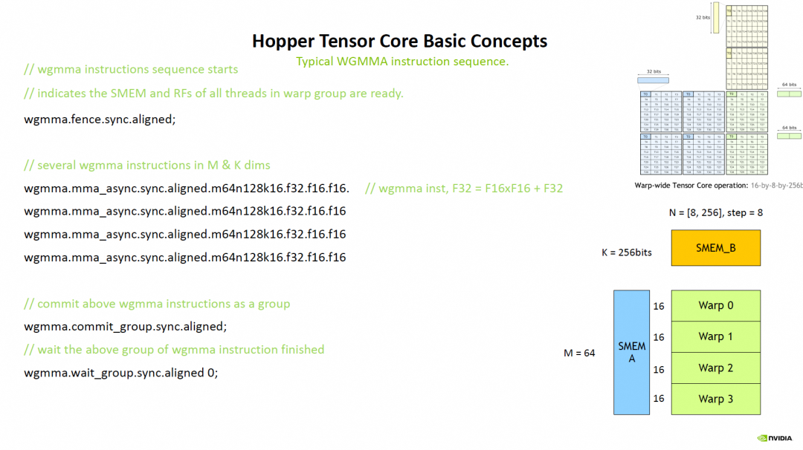

먼저 data가 이미 ready되었음을 나타내는 fence가 필요하고, 이어서 M과 K direction을 따라 여러 wgmma instruction을 send한다. instruction send가 완료되기를 기다린 뒤, 이러한 모든 in-flight instruction을 package하여 commit을 완료하고, `wait\_group`을 통해 completion을 기다린다. 아래는 concrete flow이다.

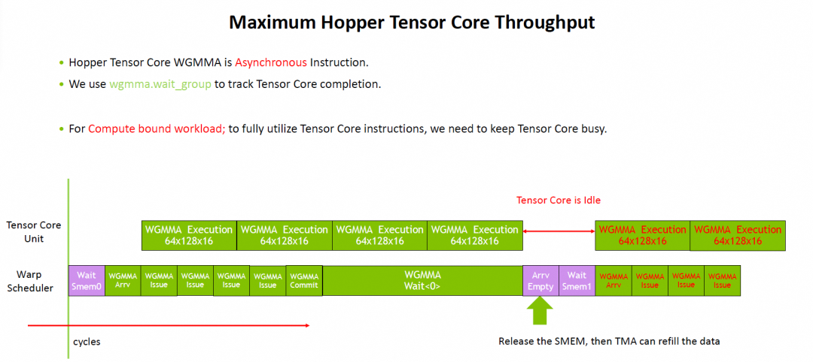

먼저 Producer TMA가 data를 SMEM으로 read하는 flow를 initiate한다. 그다음 Consumer로서 `smem_full` Barrier, 즉 그림의 purple block을 기다려야 한다. 그 뒤 WGMMA instruction을 issue하고 commit\_group을 수행한다. 이어서 wait\_group으로 WGMMA completion을 기다리고, 다음 `smem_full` Barrier가 완료되었는지 check한 뒤 다음 round의 WGMMA instruction을 issue한다. 하지만 이런 방식에서는 중간에 TensorCore가 일정 시간 idle 상태가 된다. 이를 꽉 채우려면 pipeline을 재배치하고 multi-stage pipeline 방식을 사용해야 한다. WGMMA commit\_group과 wait\_group 사이의 시간에 다음 slot의 SMEM이 완료되었는지 check하고 다음 round의 WGMMA instruction을 issue한다.

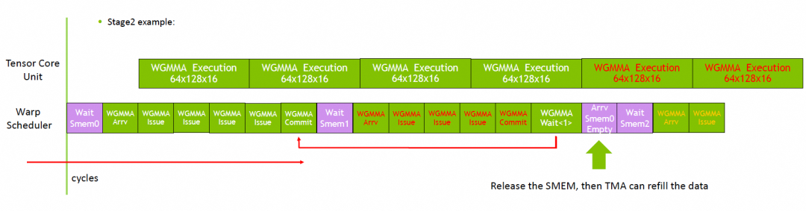

concrete code는 다음과 같으며, 실제로는 `smem_pipe_release`와 `smem_pipe_read`라는 두 counter가 있다. 초기에는 둘이 같고, 예를 들면 둘 다 0이다. Prologue에서는 먼저 data load가 완료되었는지 check한다(위 그림의 purple Wait Smem 0). 완료되었으면 WGMMA를 issue한다(위 그림의 흰색 글자 WGMMA operation). 그다음 `++smem_pipe_read`를 수행하고, 다음 SMEM block이 Ready인지 검사한다(위 그림의 purple Wait Smem 1). Ready이면 두 번째 stage WGMMA를 다시 issue한다(위 그림의 red text WGMMA). 이때 `smem_pipe_read=2`, `smem_pipe_release=0`이고, 이후 stable pipeline Mainloop에 들어간다. 위 오른쪽 그림과 같다. 다만 Release memory 시에는 항상 이전 stage의 memory를 release한다.

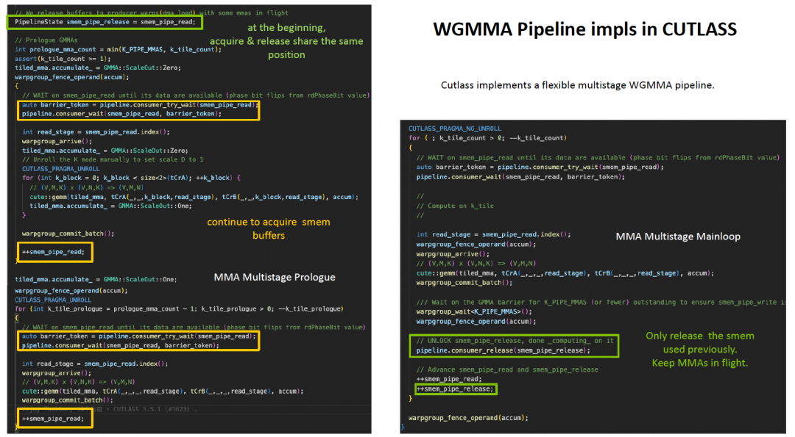

#### 2.3.2 Swizzle

먼저 chip의 physical 관점에서 보면, SMEM은 32개 bank를 포함하고 각 bank가 32bits인 structure이다. 예를 들어 `float s[64]` array의 storage format은 다음과 같다.

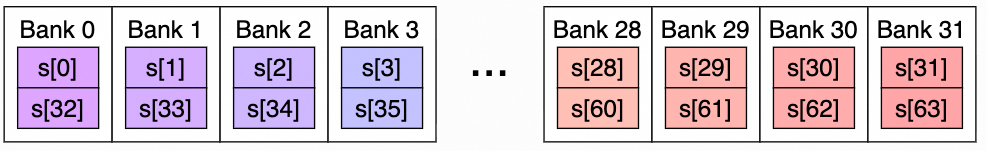

Hopper TensorCore의 경우 Warp-Group Level instruction으로 `64xNx256bits`를 지원한다. 여기서 `N=[8,256],step=8`이다. Warp-Level TensorCore instruction은 `16x8x256bits`이다.

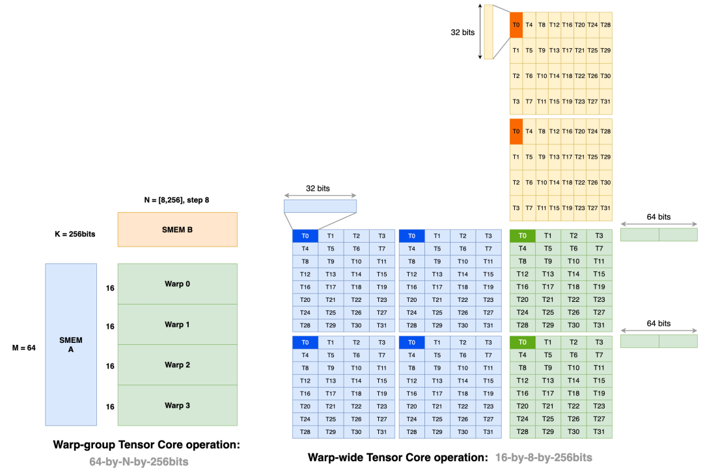

예를 들어 BF16의 WGMMA Shape가 64xNx16이라고 하자. A matrix를 예로 들면 이는 64x16 matrix이며, M dimension에서 4개 Warp가 concatenate되어 구성되고, 각 Warp는 16x16 submatrix 하나를 execute한다. 이 16x16 matrix는 실제로 2x2개의 Core Matrix로 구성되며, 각 Core Matrix dimension은 8x128bits이다.

TensorCore operation process에서 SMEM은 TMA를 통해 GMEM에서 data를 read하고 write해야 하며, 동시에 SMEM에서 TensorCore로 data를 read해야 한다. 따라서 전체 process에서 read/write operation에 모두 참여한다. simple col-major 또는 row-major layout은 SMEM이 read와 write에서 동시에 no-bank-conflict requirement를 만족하도록 할 수 없으므로 Swizzle operation이 필요하다.

Ampere에서는 data를 GMEM에서 SMEM으로 copy한 뒤 다시 RMEM으로 load하여 TensorCore computation에 제공해야 했다. 전체 process에서 programmer가 swizzle 처리에 수동으로 참여해야 했고, 이는 매우 번거로운 process였다. 따라서 Hopper에서는 redesign이 이루어졌다. TensorCore operand를 SMEM에서 직접 read할 수 있고, Nvidia는 이 부분을 optimize하여 TMA와 TensorCore가 같은 Swizzle feature를 지원하도록 했다. smem descriptor 하나만 있으면 되며, programmer는 main loop 안에서 swizzle을 인지하고 처리할 필요가 없다. 모든 operation은 hardware가 처리한다.

하지만 computation result는 여전히 RMEM 안에 있으므로 Epilogue stage에서는 여전히 일부 처리가 필요하다. Nvidia documentation의 Swizzle 설명이 그리 완전해 보이지는 않으므로, 이 절에서는 Swizzle을 자세히 분석한다.

먼저 TMA instruction을 보자. 이는 src/dst memory address가 16Bytes에 align되어야 하고, operation size도 16B의 multiple이어야 한다. 따라서 swizzle의 single block size는 16B이다. 예를 들어 SMEM에 matrix `__shared__ float4 sA[8][8]`를 allocate할 수 있는데, float4는 정확히 16B atomic operation을 만족한다.

k-dim 연속 storage에 따르면 아래 왼쪽 그림과 같다. 그림의 서로 다른 색은 SMEM의 서로 다른 Bank를 나타낸다. column 기준으로 read/write해야 할 때 심각한 Bank conflict가 발생한다. 아래 오른쪽 그림의 방식으로 배치하면, 어떤 row와 어떤 column을 read/write하더라도 bank conflict가 없음을 볼 수 있다.

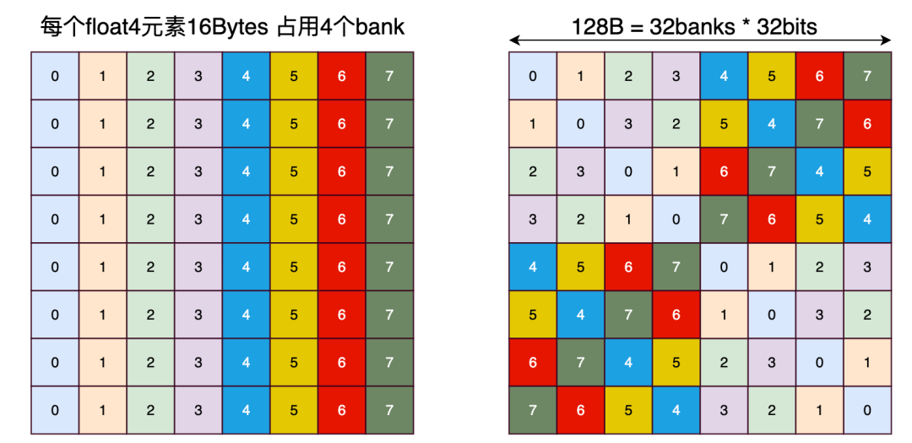

따라서 hardware implementation에서 매우 simple하고 fast한 Swizzle function을 구성해 위 Layout을 표현해야 한다. cutlass swizzle.hpp[11]에는 이러한 algorithm이 설명되어 있으며, function은 `Swizzle<BBits, MBase, SShift>`로 표현된다. concrete algorithm은 다음과 같다.

```c++
// A generic Swizzle functor
/* 0bxxxxxxxxxxxxxxxYYYxxxxxxxZZZxxxx
 *                               ^--^ MBase is the number of least-sig bits to keep constant
 *                  ^-^       ^-^     BBits is the number of bits in the mask
 *                    ^---------^     SShift is the distance to shift the YYY mask
 *                                       (pos shifts YYY to the right, neg shifts YYY to the left)
 *
 * e.g. Given
 * 0bxxxxxxxxxxxxxxxxYYxxxxxxxxxZZxxx
 * the result is
 * 0bxxxxxxxxxxxxxxxxYYxxxxxxxxxAAxxx where AA = ZZ xor YY
 */
```

- `MBase`: num\_base. 전체 lowest address의 몇 bit를 unchanged로 유지할지 나타낸다. Hopper에서는 TMA operation granularity가 16Bytes이므로 Mbase = 4이다.
- `BBits`: num\_bits. operation에 참여하는 high bits YYY와 low bits ZZZ의 bit width가 몇 bits인지 나타낸다.
- `SShift`: num\_shift. high bits와 low bits 사이의 interval이 몇 bits인지 나타낸다.

operation은 XOR를 사용한다. 한편으로 bit operation은 hardware에 매우 efficient하고, 다른 한편으로는 계산이 reversible하다는 좋은 특성이 있다. 예를 들어 YYYY=1111, ZZZZ=1011, AAAA = ZZZZ XOR YYYY = 0100이라고 하자. 생성된 Swizzle address를 inverse하면, 즉 YYYY XOR AAAA = 1011 = ZZZZ가 되어 원래 address를 simple하게 recover할 수 있다.

`Swizzle<3, 4, 3>`을 예로 들면 다음과 같다.

```c++
Swizzle<3,4,3> =>

num_bits = 3
num_base = 4
num_shft = 3

//bit_msk = (1 << num_bits)-1
bit_msk = (0b00000000_00000001 << 3) - 1 = 0b00000000_00000111

//yyy_msk = bit_msk << (num_base + max(0,num_shft))
yyy_msk = 0b00000000_00000111 << (4 + 3) = 0b00000011_10000000

// return offset ^ shiftr(input_number & yyy_msk{}, num_shft{})
// for example, take input_number = 0b00000011_11111111 = 1023

//input_number & yyy_msk
0b00000011_11111111 & 0b00000011_10000000 = 0b00000011_10000000

// (input_number & yyy_msk) >> num_shft
0b00000011_10000000 >> 3 =  0b00000000_01110000

// return value = input_number ^ ((input_number & yyy_msk) >> num_shft)
0b00000011_11111111 ^ 0b00000000_01110000 = 0b00000011_10001111 = 911

# inverse operation SMEM->GMEM offset
input_number = 0b00000011_10001111 = 911
// input_number & yyy_msk
0b00000011_10001111 & 0b00000011_10000000 = 0b00000011_10000000
// (input_number & yyy_msk) >> num_shft
0b00000011_10000000 >> 3 = 0b00000000_01110000
// return value = input_number ^ ((input_number & yyy_msk) >> num_shft)
0b00000011_10001111 ^ 0b00000000_01110000 = 0b00000011_11111111 = 1023
```

Hopper에서는 다음 몇 가지 Swizzle mode를 지원한다.

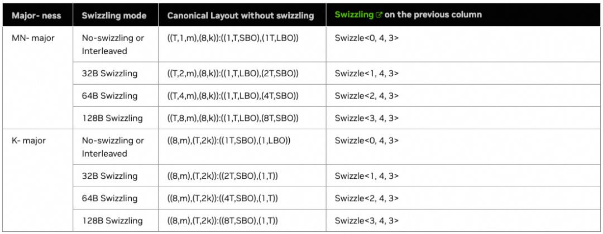

여기서 관련 Layout parameter는 다음과 같다.

- `T= 128 / sizeof-elements-in-bits`: 128 bits(16B)를 unit으로 하는 element 수를 나타낸다.
- `m`: 같은 row에 반복 pattern이 몇 개 있는지 나타낸다.
- `k`: 같은 column에 반복 pattern이 몇 개 있는지 나타낸다.
- `LBO(leading dimension byte offset)`: K dimension에서 인접한 두 core matrix 사이의 byte distance.
- `SBO(stride dimension byte offset)`: M 또는 N dimension에서 인접한 두 core matrix 사이의 byte distance.

TMA의 경우 Tensor Descriptor를 구성할 때 parameter 중 하나가 Swizzle이다. TensorCore에서는 64bits register value 하나를 통해 matrix descriptor를 구성할 수 있고, SMEM에서 matrix multiply-add operation에 참여하는 matrix의 attribute를 지정하는 데 사용된다. 그 안에는 swizzle mode에 대한 description이 포함된다.

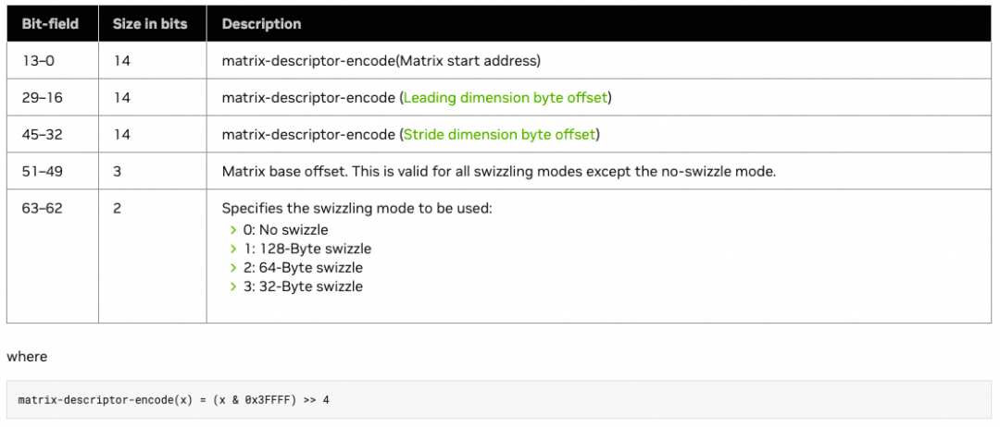

Hopper에서 Swizzle을 설정하는 방법은 다음과 같다. 예를 들어 TMA와 WGMMA operation을 준비하기 전, 다음과 같이 sem\_layout이 필요하다.

```python
import torch

import cutlass
import cutlass.cute as cute
import cutlass.utils as utils
import cutlass.utils.hopper_helpers as sm90_utils
from cutlass.cute.runtime import from_dlpack

@cute.jit
def swizzle_test(
    A : cute.Tensor,
):
    tile_shape_mn = (16,64)

    a_dtype = A.element_type
    a_layout = utils.LayoutEnum.from_tensor(A)

    a_smem_layout_atom = cute.nvgpu.warpgroup.make_smem_layout_atom(
        kind=sm90_utils.get_smem_layout_atom(
            a_layout,
            a_dtype,
            major_mode_size=tile_shape_mn[0],
        ),
        element_type=a_dtype
    )
    cute.printf("smem layout atom{}",a_smem_layout_atom)

    a_smem_layout = cute.tile_to_shape(
        atom = a_smem_layout_atom,
        trg_shape=tile_shape_mn,
        order=(0,1)
    )

    cute.printf("smem layout {}",a_smem_layout)

M,N = 4096, 4096
a = torch.arange(0.0, M *N, device="cuda", dtype=torch.bfloat16).reshape(N,M)
_a = from_dlpack(a, assumed_align=16)

swizzle_test(_a)

# output
smem layout atomS<1,4,3> o 0 o (8,16):(16,1)
smem layout S<1,4,3> o 0 o ((8,2),(16,4)):((16,128),(1,256))
```

`sm90_utils.get_smem_layout_atom`에서는 major\_mode\_size에 따라 majaor\_mode\_bits를 계산하고, continuity requirement에 따라 Swizzle Mode를 return한다.

```python
def get_smem_layout_atom(
    layout: LayoutEnum,
    element_type: Type[Numeric],
    major_mode_size: int,
    *,
    loc=None,
    ip=None,
):
    assert major_mode_size % 8 == 0
    sw128_num_contiguous_bits = 1024
    sw64_num_contiguous_bits = 512
    sw32_num_contiguous_bits = 256
    major_mode_size_bits = major_mode_size * element_type.width
    if layout.sm90_mma_major_mode() == OperandMajorMode.MN:
        if major_mode_size_bits % sw128_num_contiguous_bits == 0:
            return cute.nvgpu.warpgroup.SmemLayoutAtomKind.MN_SW128
        if major_mode_size_bits % sw64_num_contiguous_bits == 0:
            return cute.nvgpu.warpgroup.SmemLayoutAtomKind.MN_SW64
        if major_mode_size_bits % sw32_num_contiguous_bits == 0:
            return cute.nvgpu.warpgroup.SmemLayoutAtomKind.MN_SW32
        return cute.nvgpu.warpgroup.SmemLayoutAtomKind.MN_INTER
    if major_mode_size_bits % sw128_num_contiguous_bits == 0:
        return cute.nvgpu.warpgroup.SmemLayoutAtomKind.K_SW128
    if major_mode_size_bits % sw64_num_contiguous_bits == 0:
        return cute.nvgpu.warpgroup.SmemLayoutAtomKind.K_SW64
    if major_mode_size_bits % sw32_num_contiguous_bits == 0:
        return cute.nvgpu.warpgroup.SmemLayoutAtomKind.K_SW32
    return cute.nvgpu.warpgroup.SmemLayoutAtomKind.K_INTER
```

`make_smem_layout_atom`에서는 해당 swizzle이 생성된다.

```python
@dsl_user_op
def make_smem_layout_atom(
    kind: SmemLayoutAtomKind, element_type: Type[Numeric], *, loc=None, ip=None
) -> core.ComposedLayout:
    """
    Makes a SMEM layout Atom.

    This function creates a composed layout in unit of elements consistent with the requested layout
    Atom kind and element data type.

    :param kind:         The kind of layout Atom
    :type kind:          SmemLayoutAtomKind
    :param element_type: The element data type to construct the layout for
    :type element_type:  Type[Numeric]
    :return:             The SMEM layout atom
    :rtype:              core.ComposedLayout
    """
    if not isinstance(element_type, NumericMeta):
        raise TypeError(f"element_type must be a Numeric, but got {element_type}")

    if kind in (SmemLayoutAtomKind.MN_INTER, SmemLayoutAtomKind.K_INTER):
        num_contiguous_bits = 128
        sw = core.make_swizzle(0, 4, 3)
    elif kind in (SmemLayoutAtomKind.MN_SW32, SmemLayoutAtomKind.K_SW32):
        num_contiguous_bits = 256
        sw = core.make_swizzle(1, 4, 3)
    elif kind in (SmemLayoutAtomKind.MN_SW64, SmemLayoutAtomKind.K_SW64):
        num_contiguous_bits = 512
        sw = core.make_swizzle(2, 4, 3)
    elif kind in (SmemLayoutAtomKind.MN_SW128, SmemLayoutAtomKind.K_SW128):
        num_contiguous_bits = 1024
        sw = core.make_swizzle(3, 4, 3)
    else:
        raise ValueError("unrecognized SMEM layout atom kind")
    num_contiguous_elems = num_contiguous_bits // element_type.width

    if kind in (
        SmemLayoutAtomKind.MN_INTER,
        SmemLayoutAtomKind.MN_SW32,
        SmemLayoutAtomKind.MN_SW64,
        SmemLayoutAtomKind.MN_SW128,
    ):
        # M/N-major layout
        return core.make_composed_layout(
            sw,
            0,
            core.make_layout(
                (num_contiguous_elems, 8), stride=(1, num_contiguous_elems)
            ),
            loc=loc,
            ip=ip,
        )
    else:
        # K-major layout
        return core.make_composed_layout(
            sw,
            0,
            core.make_layout(
                (8, num_contiguous_elems), stride=(num_contiguous_elems, 1)
            ),
            loc=loc,
            ip=ip,
        )
```

#### 2.3.3 CuteDSL WGMMA

아래에서는 CuteDSL의 WGMMA operation을 설명한다. 전체 example을 simple하게 유지하기 위해, data가 이미 TMA에 의해 SMEM에 배치되었다고 가정하고 WGMMA를 직접 호출해 operation을 수행한다. 이 code는 Epilogue 처리와 data write-back을 포함하지 않고, 복잡한 Consumer/Producer interaction도 포함하지 않는다(다음 절에서 자세히 펼친다). 여기서는 WGMMA에 필요한 SMEM Descriptor, `tiled\_mma`를 어떻게 구성하는지, 그리고 해당 Layout 관련 내용을 simple하게 분석한다. complete example은 3장에서 자세히 분석한다.

CuteDSL에서 WGMMA를 호출하려면 많은 data structure를 미리 준비해야 한다. 예를 들면 Tiled\_MMA object, 해당 Layout, SMEM descriptor 등의 정보이다. 아래 그림과 같다.

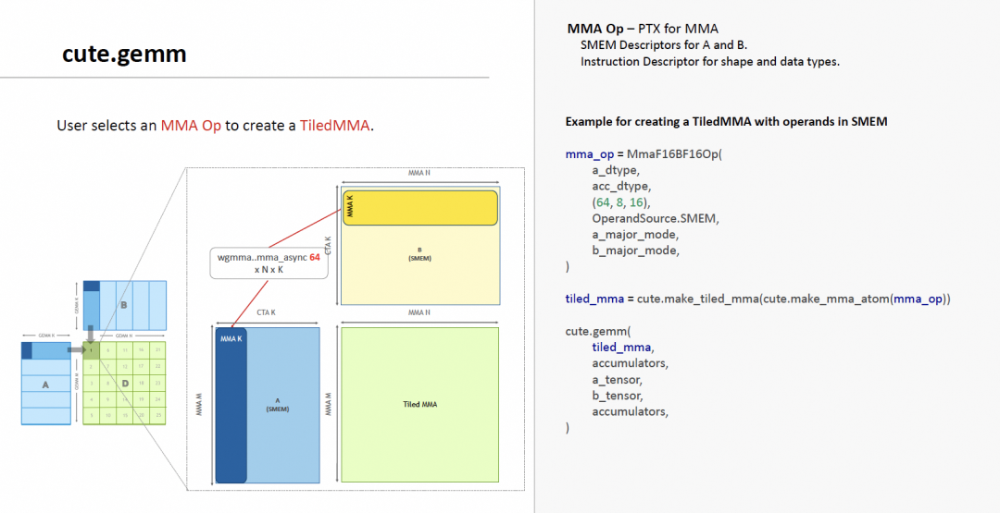

먼저 Host-side function과 data preparation을 보자. Tiled\_MMA object를 생성해야 하고, operand datatype, Tiler shape 등을 알아야 한다. CuteDSL에는 Hopper를 대상으로 `make\_trivial\_tiled\_mma`[12] function이 있어 `tiled\_mma`를 구성한다.

```python
import torch
import cutlass
import cutlass.cute as cute
import cutlass.torch as cutlass_torch
import cutlass.utils as utils
import cutlass.utils.hopper_helpers as sm90_utils
from cutlass.cute.runtime import from_dlpack


@cute.jit
def launch_gemm(
    a : cute.Tensor,
    b : cute.Tensor,
    c : cute.Tensor,
):
    tile_shape_mnk = (128,128,64)

    # get Tensor datatype
    a_dtype = a.element_type
    b_dtype = b.element_type
    c_dtype = c.element_type
    a_layout = utils.LayoutEnum.from_tensor(a)
    b_layout = utils.LayoutEnum.from_tensor(b)
    c_layout = utils.LayoutEnum.from_tensor(c)

    # create tiled_mma object
    tiled_mma = sm90_utils.make_trivial_tiled_mma(
            a_dtype,
            b_dtype,
            a_layout.sm90_mma_major_mode(),
            b_layout.sm90_mma_major_mode(),
            c_dtype,
            atom_layout_mnk=(1, 1, 1),
            tiler_mn=(64, tile_shape_mnk[1]),
    )
```

이 function 내부에서는 A operand가 default로 SHMEM 안의 `OperandSource.SMEM`에 있다. 그다음 A와 B의 dataType에 따라 MMA\_OP를 선택한다. 예를 들어 FP16일 때는 MmaF16BF16Op를 선택한다. 마지막으로 MMA\_OP를 통해 MMA\_ATOM을 생성하고 Tiled\_MMA object를 생성한다.

```c++
def make_trivial_tiled_mma(
    a_dtype: Type[Numeric],
    b_dtype: Type[Numeric],
    a_leading_mode: OperandMajorMode,
    b_leading_mode: OperandMajorMode,
    acc_dtype: Type[Numeric],
    atom_layout_mnk: Tuple[int, int, int],
    tiler_mn: Tuple[int, int],
    a_source: OperandSource = OperandSource.SMEM,
    *
) -> cute.TiledMma:

    if a_dtype in {Float16, BFloat16}:
        mma_op = MmaF16BF16Op(
            a_dtype,
            acc_dtype,
            (*tiler_mn, 16),
            a_source,
            a_leading_mode,
            b_leading_mode,
        )
    elif a_dtype in {Float8E4M3FN, Float8E5M2} and b_dtype in {
        Float8E4M3FN,
        Float8E5M2,
    }:
        mma_op = MmaF8Op(
            a_dtype,
            b_dtype,
            acc_dtype,
            (*tiler_mn, 32),
            a_source,
            a_leading_mode,
            b_leading_mode,
        )
    else:
        raise TypeError(f"unsupported a_dtype and b_dtype, got {a_dtype} and {b_dtype}")

    return cute.make_tiled_mma(cute.make_mma_atom(mma_op), atom_layout_mnk)
```

하지만 `cute.gemm` operation에는 A/B와 Accumulator C의 Layout도 필요하다. Host function에서는 다음 방식으로 구성하며, 이때 Swizzle 관련 attribute가 함께 carry된다.

```c++
    a_smem_shape = cute.slice_(tile_shape_mnk, (None, 0, None))
    a_is_k_major = (
        a_layout.sm90_mma_major_mode() == cute.nvgpu.warpgroup.OperandMajorMode.K
    )
    a_major_mode_size = tile_shape_mnk[2 if a_is_k_major else 0]

    a_smem_layout_atom = cute.nvgpu.warpgroup.make_smem_layout_atom(
        kind=sm90_utils.get_smem_layout_atom(
            a_layout,
            a_dtype,
            a_major_mode_size,
        ),
        element_type=a_dtype,
    )

    a_smem_layout = cute.tile_to_shape(
        atom = a_smem_layout_atom,
        trg_shape=(tile_shape_mnk[0], tile_shape_mnk[2]),
        order=(0,1) if a_is_k_major else (1,0)
    )
    print(f"a smem layout {a_smem_layout}  inner {a_smem_layout.inner}  outer {a_smem_layout.outer}")

    b_smem_shape = cute.slice_(tile_shape_mnk, (0, None, None))
    b_is_k_major = (
        b_layout.sm90_mma_major_mode() == cute.nvgpu.warpgroup.OperandMajorMode.K
    )
    b_major_mode_size = tile_shape_mnk[2 if b_is_k_major else 1]

    b_smem_layout_atom = cute.nvgpu.warpgroup.make_smem_layout_atom(
        kind=sm90_utils.get_smem_layout_atom(
                b_layout,
                b_dtype,
                b_major_mode_size,
            ),
        element_type=b_dtype,
    )
    b_smem_layout = cute.tile_to_shape(
        atom = b_smem_layout_atom,
        trg_shape=(tile_shape_mnk[0], tile_shape_mnk[2]),
        order=(0, 1) if b_is_k_major else (1, 0),
    )
    print(f"b smem layout {b_smem_layout} inner {b_smem_layout.inner}  outer {b_smem_layout.outer}")

    c_smem_shape = cute.slice_(tile_shape_mnk, (None, None, 0))
    c_major_mode_size = tile_shape_mnk[1 if c_layout.is_n_major_c() else 0]
    c_smem_layout_atom = cute.nvgpu.warpgroup.make_smem_layout_atom(
        kind=sm90_utils.get_smem_layout_atom(
                c_layout,
                c_dtype,
                c_major_mode_size,
            ),
        element_type=c_dtype,
    )
    c_smem_layout = cute.tile_to_shape(
        atom = c_smem_layout_atom,
        trg_shape=(tile_shape_mnk[0], tile_shape_mnk[1]),
        order=(0, 1) if c_layout.is_n_major_c() else (1, 0),
    )
    print(f"c smem layout {c_smem_layout} inner {c_smem_layout.inner}  outer {c_smem_layout.outer}")

#output
a smem layout S<3,4,3> o 0 o ((8,16),(64,1)):((64,512),(1,0))  inner S<3,4,3>  outer ((8,16),(64,1)):((64,512),(1,0))
b smem layout S<3,4,3> o 0 o ((8,16),(64,1)):((64,512),(1,0)) inner S<3,4,3>  outer ((8,16),(64,1)):((64,512),(1,0))
c smem layout S<3,4,3> o 0 o ((8,16),(32,4)):((32,256),(1,4096)) inner S<3,4,3>  outer ((8,16),(32,4)):((32,256),(1,4096))
```

마지막으로 smem memory usage를 계산하고 SMEM data struct를 구성한 뒤 Kernel을 launch한다.

```python
    smem_size = (cute.size_in_bytes(cutlass.BFloat16, a_smem_layout) +
                 cute.size_in_bytes(cutlass.BFloat16, b_smem_layout) +
                 cute.size_in_bytes(cutlass.Float32, c_smem_layout))

    buffer_align_bytes = 1024
    @cute.struct
    class SharedStorage:
        sA: cute.struct.Align[
            cute.struct.MemRange[
                a_dtype, cute.cosize(a_smem_layout)
            ],
            buffer_align_bytes,
        ]
        sB: cute.struct.Align[
            cute.struct.MemRange[
                b_dtype, cute.cosize(b_smem_layout)
            ],
            buffer_align_bytes,
        ]
    gemm_kernel(
        a_smem_layout,
        b_smem_layout,
        c_smem_layout,
        tile_shape_mnk,
        tiled_mma,
        SharedStorage
    ).launch(
        grid=(1, 1, 1),
        block=(128, 1, 1),
        smem=smem_size
    )
```

Kernel function에는 SHMEM 안의 A/B/C layout, Tiled\_MMA, SMEM storage struct, 그리고 Tile Shape을 pass한다. 먼저 SMEM 안에 struct를 allocate하고, layout의 swizzle definition에 따라 Tensor를 얻는다.

```python
@cute.kernel
def gemm_kernel(
        a_smem_layout: cute.ComposedLayout,
        b_smem_layout: cute.ComposedLayout,
        c_smem_layout: cute.ComposedLayout,
        tile_shape_mnk: tuple [int,int,int],
        tiled_mma: cute.TiledMma,
        SharedStorage: cutlass.Constexpr
    ):
    acc_type =  cutlass.Float32
    tidx, _, _ = cute.arch.thread_idx()

    smem = cutlass.utils.SmemAllocator()
    storage = smem.allocate(SharedStorage)
    sA = storage.sA.get_tensor(
        a_smem_layout.outer, swizzle = a_smem_layout.inner
    )
    sB = storage.sB.get_tensor(
        b_smem_layout.outer, swizzle = c_smem_layout.inner
    )
    sC_ptr = cute.recast_ptr(
        sA.iterator, c_smem_layout.inner, dtype=acc_type
    )
    sC = cute.make_tensor(sC_ptr, c_smem_layout.outer)
```

그다음 각 thread에 대해 fragment를 구성한다.

```c++
    thr_mma = tiled_mma.get_slice(tidx)
    tCsA = thr_mma.partition_A(sA)
    tCsB = thr_mma.partition_B(sB)
    tCgC = thr_mma.partition_C(sC)

    tCrA = thr_mma.make_fragment_A(tCsA)
    tCrB = thr_mma.make_fragment_B(tCsB)

    accumulator = cute.make_fragment(tCgC.shape, acc_type)
```

마지막으로 `cute.gemm`을 execute한다. 보통 execute 전에 warpgroup fence가 필요하며, data가 모두 load 완료되었음을 보장해야 한다는 점에 주의하자. 그다음 instruction issue 후 `commit\_group`이 필요하고, `wait\_group(N)`으로 completion을 기다려야 한다.

```c++
    cute.nvgpu.warpgroup.fence()
    cute.gemm(tiled_mma, accumulator, tCrA, tCrB, accumulator)
    if tidx == 0 :
        cute.printf("WGMMA Issued")

    cute.nvgpu.warpgroup.commit_group()
    cute.nvgpu.warpgroup.wait_group(0)
    if tidx == 0 :
        cute.printf("WGMMA Finished")
```

### 2.4 CuteDSL asynchronous programming

다음 step은 TMA와 TensorCore WGMMA라는 두 asynchronous call을 함께 coordinate하는 것이다. 아래 그림과 같다.

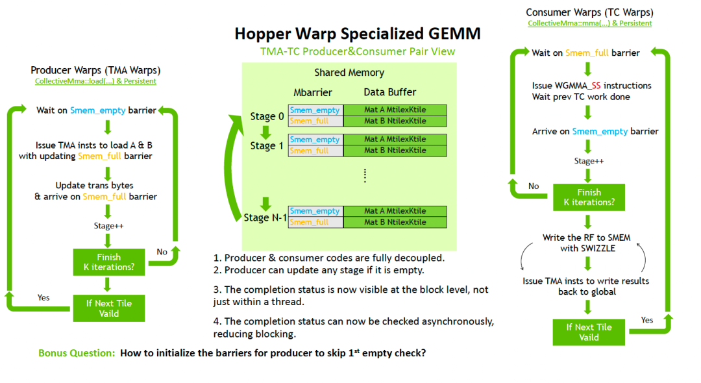

그다음 SMEM을 multi-stage pipeline으로 나눈다. 각 pipeline stage에는 `smem_empty`와 `smem_full`이라는 두 semaphore가 있다. 사실 smem\_full이라는 표현은 오해를 부르기 쉽다. 최근 cuteDSL document에서는 이를 `smem_ready`로 바꾼 것으로 보이는데, 이것도 괜찮다.

하지만 interaction process는 여전히 매우 복잡하고, 제대로 처리하지 않으면 Kernel이 hang되는 문제가 쉽게 발생한다. CuteDSL은 전체 interaction process를 `pipeline`[13]으로 encapsulate했다. 이 절에서는 이를 자세히 펼쳐 본다.

이 framework는 classic Producer-Consumer model을 기반으로 한다.

- **Producer**: 보통 low-speed Global Memory에서 data를 load하는 asynchronous operation을 담당한다. modern NVIDIA GPU에서는 `cp.async` instruction(`PipelineCpAsync` 사용)일 수 있고, 더 efficient한 tensor memory accelerator TMA(`PipelineTmaAsync` 사용)일 수도 있다.
- **Consumer**: 보통 computation task를 execute하는 thread이다. 예를 들어 matrix multiplication(MMA)을 execute하는 Warp이다.
- **Buffer**: high-speed shared memory(SMEM)에 위치한 area이며, producer와 consumer 사이의 data exchange에 사용된다.

먼저 이 code는 `PipelineAsync` base class를 정의한다. 그다음 `cp.async` asynchronous scenario를 대상으로 `PipelineCpAsync`를 정의하고, TMA asynchronous memory access scenario를 대상으로 `PipelineTmaAsync`와 `PipelineTmaMultiConsumersAsync`를 정의한다. 후자는 multiple Consumer가 computation과 memory access latency를 더 잘 overlap할 수 있게 지원하지만, code를 보면 blackwell용인 것 같은데 왜 SM\_90 file 안에 있는지는 모르겠다. 마지막으로 epilogue에 사용할 `PipelineTmaStore` class도 정의한다.

#### 2.4.1 PipelineAsync

`PipelineAsync`는 generic pipeline class이며, producer와 consumer가 모두 asynchronous thread이다. 또한 다른 specialized pipeline class의 base class 역할도 한다. 이 class 안에는 `smem_full`과 `smem_empty`라는 두 Mbarrier state machine이 정의되어 있다.

| barrier | state | p.acquire | p.commit | c.wait | c.release |
| --- | --- | --- | --- | --- | --- |
| empty\_bar | empty | <return> | n/a | n/a | - |
| empty\_bar | wait | <block> | n/a | n/a | -> empty |
| full\_bar | wait | n/a | -> full | <block> | n/a |
| full\_bar | full | n/a | - | <return> | n/a |

이 table은 dual-barrier synchronization mechanism을 명확히 설명한다.

- `empty_bar`: producer에게 "buffer가 비었으니 write할 수 있다"고 알리는 데 사용된다.
- `full_bar`: consumer에게 "buffer가 찼으니 read할 수 있다"고 알리는 데 사용된다.

##### Workflow:

1. **Producer**:

- call `acquire()`: wait on **empty\_bar**. If the buffer is empty(`empty` state), the call returns immediately. If the consumer has not released it yet(`wait` state), the producer blocks.
- (producer performs write operation)
- call `commit()`: send an `arrive` signal on **full\_bar**, change its state to `full`, and notify the consumer that data is ready.

2. **Consumer**:

- call `wait()`: wait on **full\_bar**. If data is ready(`full` state), the call returns immediately. If the producer has not committed it yet(`wait` state), the consumer blocks.
- (consumer performs read operation)
- call `release()`: send an `arrive` signal on **empty\_bar**, change its state back to `empty`, and notify the producer that this buffer can be reused.

이런 Mbarrier pair는 circular buffer의 Slot 안에 배치된다. `mbarrier`는 Hopper architecture가 도입한 key synchronization primitive이다. 이는 shared memory 안에 저장되는 object이며, 기존 `barrier.sync` 같은 synchronization 방식과 비교해 더 flexible한 synchronization mode를 제공한다. concrete operation flow는 앞 절에서 이미 자세히 소개했다.

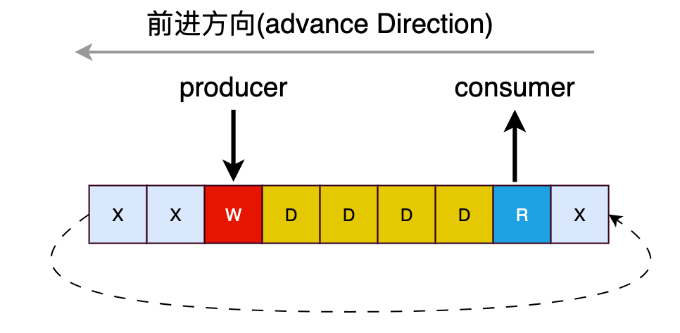

여기서:

- `X`: empty buffer (initial state)
- `W`: producer is writing (producer waits for buffer to become empty)
- `D`: data ready (producer has written data into buffer)
- `R`: consumer is reading (consumer is consuming data in buffer)

circular buffer로 design하는 이유는 global memory에서 shared memory로 data를 load하는 수백 clock cycle의 latency 등을 hide하기 위해 Kernel을 pipeline 형태로 구성하기 때문이다. `N`개 stage(`num_stages`)가 있다고 가정하면, shared memory 안에 `N`개 buffer를 allocate했다는 뜻이다. \* 시각 `t`에서 consumer(compute unit)는 `k`번째 buffer의 data를 처리하고 있다. \* 동시에 producer(memory load unit)는 asynchronous하게 data를 `k+1`번째 buffer로 load할 수 있다. \* consumer가 `k`번째 buffer의 work를 완료하면, data가 이미 ready되어 있으므로 즉시 `k+1`번째 buffer의 data를 처리하기 시작할 수 있다.

이 방식은 computation과 data load가 parallel하게 execute될 수 있게 하여 SM throughput을 높인다.

그 key member method는 다음과 같다.

- `sync_object_full`, `sync_object_empty`: 이 둘은 core synchronization object이다. 보통 `MbarrierArray` instance이며, 각각 `N`개 stage의 "smem\_full" Mbarrier와 "smem\_empty" Mbarrier를 관리한다.
- `num_stages`: pipeline depth.
- `producer_mask`, `consumer_mask`: multi-CTA cooperation 시 어떤 CTA가 `arrive` signal에 참여하거나 receive해야 하는지 지정하는 데 사용되며, 보통 CGA-scope synchronization에 사용된다.
- `create()`: static factory method로, `PipelineAsync` instance를 생성하고 initialize하는 데 사용된다. 전달된 parameter에 따라 `sync_object_full`과 `sync_object_empty`를 생성한다. `barrier_storage.align(min_align=8)`이 shared memory 안에서 `mbarrier` object의 8-byte alignment를 보장한다는 점에 주의하자. 이는 hardware requirement이다.
- `producer_acquire()` / `producer_commit()`: producer의 "empty buffer 획득"과 "full buffer submit" logic을 구현한다.
- `consumer_wait()` / `consumer_release()`: consumer의 "full buffer 대기"와 "empty buffer release" logic을 구현한다.
- `producer_tail()`: 중요한 tail function이다. producer loop가 끝난 뒤 호출되어 모든 pipeline stage가 올바르게 synchronized되었음을 보장한다. 마지막으로 사용된 buffer까지 advance하고 그 buffer에 `acquire` operation을 수행함으로써, consumer가 모든 remaining work를 완료하기를 기다린다. 이는 kernel exit 후에도 dangling `mbarrier` signal이 남아 state inconsistency가 발생하는 것을 방지한다.
- `make_producer()` / `make_consumer()`: user-friendly한 `PipelineProducer`와 `PipelineConsumer` object를 생성해 API call을 단순화한다.

여기서 `make_producer()` / `make_consumer()`를 조금 더 펼쳐 보자. 이 두 encapsulation이 없다면 internal state가 직접 노출된다. 아래와 같이 user는 `PipelineAsync` object와 직접 interact해야 하며, code는 아마 다음과 같을 것이다.

```c++
# pseudocode without interface class
pipeline = PipelineAsync.create(...)
producer_state = make_pipeline_state(PipelineUserType.Producer, num_stages)
consumer_state = make_pipeline_state(PipelineUserType.Consumer, num_stages)

# producer loop
for i in range(...):
    pipeline.producer_acquire(producer_state) # wait
    # write data into buffer pointed to by producer_state.index
    pipeline.producer_commit(producer_state) # commit
    producer_state.advance() # manually advance state

# consumer loop
for i in range(...):
    pipeline.consumer_wait(consumer_state) # wait
    # read data from buffer pointed to by consumer_state.index
    pipeline.consumer_release(consumer_state) # release
    consumer_state.advance() # manually advance state
```

이 방식에는 몇 가지 심각한 문제가 있다.

1. **State management exposure**: user가 `producer_state`와 `consumer_state`를 수동으로 생성, 전달, update해야 한다. 이는 매우 번거롭고 error-prone하다.
2. **Non-intuitive API**: `pipeline.producer_acquire(state)` call 방식은 `producer.acquire()`만큼 직관적이지 않다.
3. **Poor safety**: 복잡한 loop나 conditional logic에서 이미 `advance`된 state에 대해 실수로 `commit`하거나, `advance`를 잊어 deadlock 또는 data race를 유발하기 쉽다.

`PipelineProducer`와 `PipelineConsumer` class의 목적은 위 모든 문제를 해결하는 것이다.

- `PipelineAsync` 및 그 subclass: pipeline이 어떻게 작동하는지에 집중한다. 이들은 low-level synchronization engine이며, `mbarrier`, TMA transaction, cross-CTA signaling 같은 complex mechanism을 처리한다.
- `PipelineProducer`/`Consumer`: pipeline을 어떻게 사용하는지에 집중한다. final user에게 role-based, state-independent simple interface를 제공한다.

`PipelineProducer`는 producer role을 나타낸다. 하나의 `PipelineProducer` instance는 세 가지 key private member를 가진다.

- `__pipeline: PipelineAsync`: underlying pipeline engine에 대한 reference. 모든 actual synchronization operation은 이 object에 delegate된다.
- `__state: PipelineState`: **mutable state object**. 이는 `PipelineProducer`의 core이며, producer가 **next time** operation할 buffer index(`index`)와 synchronization phase(`phase`)를 track한다. `advance()`가 호출될 때마다 이 `__state` object 내부의 value가 update된다.
- `__group: CooperativeGroup`: production operation에 참여하는 thread group을 identify한다.

producer의 standard workflow는 *Acquire -> (Produce Data) -> Commit -> Advance*이다.

###### acquire() -> ImmutableResourceHandle:

1. `self.__pipeline.producer_acquire(self.__state, ...)`를 호출해 **blocking wait**를 수행한다. 이는 `__state`가 가리키는 buffer가 empty가 되기를 기다린다(즉 이전 loop의 consumer가 이미 release했음을 의미).
2. wait가 성공하면 `self.__state.clone()`을 호출해 current state의 read-only snapshot을 생성한다.
3. 그다음 이 snapshot과 `__pipeline` object reference를 `ImmutableResourceHandle`로 wrap하여 return한다.

**Role**: `acquire`는 resource를 획득하는 action이다. 반환된 `handle`은 이 특정 buffer에 대한 usage right를 가지고 있음을 증명한다.

###### advance():

1. `self.__state.advance()`를 호출한다.
2. 이는 `__state` 내부의 `index`와 `phase`를 update하여 circular buffer의 next stage를 가리키게 한다.

**Role**: 이 method는 `PipelineProducer` object 자체의 internal state를 변경한다. 다음 `acquire`를 준비한다.

###### acquire\_and\_advance() -> ImmutableResourceHandle:

1. `acquire()`와 `advance()`를 simple하게 merge한다.
2. 먼저 `acquire()`를 호출해 current stage의 `handle`을 얻는다.
3. 그다음 즉시 `advance()`를 호출해 producer의 internal state를 next stage로 advance한다.

**Role**: 이는 가장 자주 쓰이는 pattern이다. producer가 stage `k`의 buffer를 얻은 뒤 곧바로 stage `k+1`을 얻을 준비를 할 수 있다. state를 미리 advance하면 code logic을 더 잘 organize할 수 있다.

###### commit(handle: Optional[ImmutableResourceHandle] = None):

1. `handle`이 전달되면 `handle.commit()`을 호출한다. 이것이 recommended usage이다.
2. `handle`이 `None`이면 `self.__state`를 직접 사용해 commit한다: `self.__pipeline.producer_commit(self.__state)`.

**Role**: 이 method는 producer가 buffer에 대한 data write를 완료했음을 pipeline에 notify한다.

Note: `ImmutableResourceHandle` internal class는 design의 core이며, 매우 중요한 **safety**를 제공한다. `producer.acquire_and_advance()`가 호출되면 `producer` object 자체의 `__state`는 이미 next stage(예: `k+1`)를 가리키지만, 반환된 `handle` 내부의 `__immutable_state`는 여전히 current stage(stage `k`)를 가리킨다.

이후 producer thread가 data load 등의 operation을 execute하고, 완료되면 `handle.commit()`을 호출한다. 이 call은 `handle` 내부에 저장된 immutable state, 즉 stage `k`를 가리키는 `state`를 사용한다. 이것이 다음을 보장한다.

1. commit하는 것은 항상 처음 acquire한 stage이다.
2. `producer` object state change 때문에 잘못된 stage(예: 아직 data를 write하지 않은 stage `k+1`)를 accidently commit하지 않는다.

example code:

```c++
producer = pipeline.make_producer()

# iteration 0
handle_k0 = producer.acquire_and_advance() # producer.__state -> 1, handle_k0.__state -> 0
# ... (write data into buffer 0)
handle_k0.commit() # correctly issue commit signal on pipeline stage 0

# iteration 1
handle_k1 = producer.acquire_and_advance() # producer.__state -> 2, handle_k1.__state -> 1
# ... (write data into buffer 1)
handle_k1.commit() # correctly issue commit signal on pipeline stage 1
```

`PipelineConsumer` also contains `__pipeline`, `__state`, and `__group`. 여기서 `__state`는 consumer가 다음에 consume할 buffer를 track한다.

consumer의 standard workflow는 *Wait -> (Consume Data) -> Release -> Advance*이다.

###### wait() -> ImmutableResourceHandle:

1. `self.__pipeline.consumer_wait(self.__state, ...)`를 호출해 **blocking wait**를 수행한다. 이는 `__state`가 가리키는 buffer가 full이 되기를 기다린다(즉 producer가 이미 commit했음을 의미).
2. producer와 마찬가지로 wait가 성공하면 `__state`의 read-only snapshot을 생성한다.
3. 이 snapshot을 포함한 `ImmutableResourceHandle`을 return한다.

**Role**: `wait`는 data ready를 기다리는 action이다. 반환된 `handle`은 채워진 data buffer에 대한 read right를 얻었음을 증명한다.

###### advance():

1. producer와 마찬가지로 `self.__state.advance()`를 호출해 consumer의 internal state를 next stage로 advance한다.

**Role**: 다음 `wait`를 준비한다.

###### wait\_and\_advance() -> ImmutableResourceHandle:

1. `wait()`와 `advance()`를 merge한다.

**Role**: 이는 consumer loop에서 가장 자주 쓰이는 method이다.

###### release(handle: Optional[ImmutableResourceHandle] = None):

1. `handle`이 전달되면 `handle.release()`를 호출한다. 이것이 recommended usage이다.
2. `handle.release()` 내부에서는 `self.get_origin().consumer_release(...)`를 호출하며, `handle` 내부에 저장된 immutable state를 사용한다.

**Role**: 이 method는 consumer가 buffer data read를 완료했으며, 해당 buffer가 이제 "empty"이고 producer가 다시 사용할 수 있음을 pipeline에 notify한다.

`PipelineCpAsync` class implementation은 Base class와 거의 유사하므로 여기서는 생략한다.

#### 2.4.2 PipelineTmaAsync

이어서 Hopper에서 가장 자주 쓰이는 PipelineTmaAsync class를 자세히 분석한다. 아래 그림과 같다.

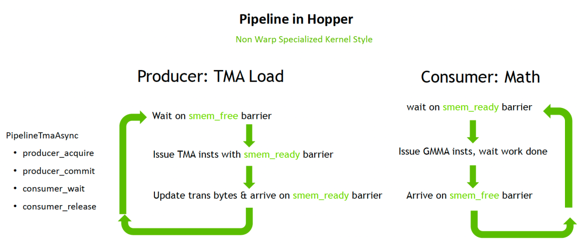

이는 Hopper architecture의 TMA를 위해 design된 pipeline이다. producer는 TMA Load operation이다. 이 class는 TMA working method에 맞추기 위해 significant change를 도입했다.

##### producer\_acquire():

이 method는 base class와 본질적으로 다르다. `empty_bar`에서 `wait()`할 뿐 아니라 즉시 `full_bar`에서 `arrive()`도 수행한다. 이는 TMA synchronization model이 transaction-based이기 때문이다. 여기서 `full_bar`는 transaction barrier로 configure된다. `arrive()` operation으로 이 transaction을 initialize하고 expected byte count(`tx_bytes`)를 설정한다. 그다음 `tma_load` instruction을 issue한다. TMA hardware는 asynchronous하게 load를 execute할 때 이 `mbarrier`에 대해 자동으로 "arrive" operation을 수행하고 actual tx\_bytes를 점진적으로 증가시킨다.

##### producer\_commit():

이 method는 `pass`(empty operation)이다. 실제 "commit" action, 즉 TMA data load는 `tma_load` instruction에 의해 asynchronous하게 trigger되기 때문이다. `producer_acquire`를 호출한 뒤에는 다른 task를 계속 execute할 수 있고, 다시 synchronous commit을 수행할 필요가 없다.

##### init\_empty\_barrier\_arrive\_signal()

이는 CGA 전용이다. 하나의 Cluster 안에서 여러 CTA가 큰 GEMM을 협력 처리할 때, 하나의 CTA(producer)가 computation을 완료한 뒤 다른 CTA(consumer)에게 어떤 global memory region을 사용할 수 있음을 notify해야 한다. 이 function은 "buffer is empty" signal을 cross-CTA로 효율적으로 전달하기 위한 것이다. thread ID(`tidx`)와 cluster layout(`cta_layout_vmnk`)에 따라 thread 하나(`is_signalling_thread`)를 strategic하게 선택해 target CTA(`dst_rank`)에 `arrive` signal을 보낸다.

`is_same_row_or_col` check는 cluster 내부 communication topology를 활용하기 위한 것으로, 같은 row 또는 같은 column의 CTA를 우선 선택해 communication한다. 이들 사이에는 더 빠른 physical connection이 있을 수 있기 때문이다. 이는 모든 thread가 signal을 보내서 congestion을 유발하는 것을 피하고, signal이 올바르게 전달되도록 보장한다.

##### consumer\_release():

이는 conditionally execute된다. `init_empty_barrier_arrive_signal`에 의해 선택된 "signaling thread"(`is_signalling_thread`)만 실제로 `arrive` operation을 execute하고, producer에게 buffer가 empty임을 notify한다.

###### 2.4.3 PipelineTmaStore

Epilogue의 TMA Store operation을 synchronize하는 데 사용된다. 즉 computation result를 shared memory에서 global memory로 asynchronous write-back한다. 이는 producer(store를 execute하는 thread)만 있고 consumer는 없는 special pipeline이다.

- 이는 `mbarrier`를 사용하지 않고 `TmaStoreFence` object를 사용한다. 이는 TMA Store 전용 synchronization primitive이다.
- `producer_acquire()`: wait하여 이전 TMA Store operation이 완료되었고 hardware resource를 사용할 수 있음을 보장한다.
- `producer_commit()`: arrive하여 새로운 TMA Store operation을 submit한다.
- `producer_tail()`: `sync_object_full.tail()`을 호출한다. 이는 fence operation이며, kernel exit 전에 submit된 모든 TMA Store가 완료되었음을 보장해 data의 global visibility를 보장한다.

TMA와 결합해야 하므로, 자세한 usage code는 다음 장에서 소개한다.

### 2.5 Summary

좋다. 여기까지 이 장에서는 CGA, TMA, TensorCore와 서로 coordinate하는 Pipeline을 자세히 소개했다. 이제 필요한 조각이 모였으니 cuteDSL의 Hopper DenseGemm code를 하나로 연결해 분석할 수 있다.

## 3. Hopper DenseGemm

### 3.1 Host-side function

Host function에서는 주로 Kernel operation 시 먼저 WGMMA computation에 사용할 Tiled\_MMA object를 생성해야 한다. 그다음 MMA instruction의 K length에 따라 `tiled\_mn`과 함께 `tiled\_mnk`를 계산한다. 이어서 SMEM memory capacity에 따라 pipeline stage count(ab\_stage 및 epi\_stage)를 계산하고, 마지막으로 Tile\_A, Tile\_B, Tile\_Epilogue가 SMEM에서 갖는 layout을 생성한다. 이때 어떤 Swizzle을 사용할지 판단한다. 또한 TMA에 대해서는 TMA ATOM과 Tensor Descriptor를 생성해야 하며, CGA Layout에 따라 TMA multicast capability를 enable할지 고려해야 한다. 이어서 SMEM multi-stage pipeline management를 위해 SharedStorage struct를 생성한다. 마지막으로 CGA shape와 Tiled\_mnk shape에 따라 kernel launch에 사용할 grid parameter를 계산하고, 최종적으로 kernel을 호출한다.

0. `tiled\_mn`의 shape에 따라 register spill을 피하기 위해 2개 WarpGroup execution이 필요한지 판단하고, `atom\_layout\_mnk` object를 생성 및 분석한다.
1. Tensor A/B/C의 datatype 및 Majorness를 얻고 datatype을 statically validate한다.
2. Tiled\_MMA object를 생성한다.
3. *self.\_setup\_attributes()*를 호출한다.

- CTA Tile Shape를 check한다.
- Tiled-MMA object를 생성한다.
- MMA instruction의 Shape\_k에 따라 tile\_shape\_mnk의 K dimension size를 update한다.
- cluster\_shape\_mn을 기반으로 CGA 안의 CTA Layout layout을 생성한다.
- CGA Layout을 기반으로 A/B가 TMA multicast를 해야 하는지 판단한다. 즉 is\_a\_mcast / is\_b\_mcast이다.
- epi\_tile shape를 계산한다.
- SMEM capacity에 대해 pipeline stage count ab\_stage와 epi\_stage를 계산한다.
- *\_make\_smem\_layouts* function을 기반으로 A/B/C의 smem\_layout을 얻는다.

4. tma\_atom과 tma\_tensor를 구성한다.
5. tile\_shape\_mnk와 cluster\_shape\_mn을 기반으로 kernel launch에 사용할 grid를 계산한다.
6. SharedStorage struct를 구성한다.
7. Launch kernel

여기서 Tiled-MMA object 처리, tiled\_k dimension 계산, CGA/Grid Layout은 2.1.2절에서 이미 자세히 소개했다. 아래에서는 주로 SMEM 관련 Layout computation에 집중한다.

먼저 SMEM capacity와 Tile\_MNK에 따라 필요한 pipeline stage count를 estimate해야 한다. cuteDSL example에는 `_compute_stages` function이 정의되어 있으며, $A,B$ operand와 마지막 Epilogue에 필요한 pipeline stage count를 계산해 return한다. concrete implementation logic은 다음과 같다.

```python
@cute.jit
def tma_stage(
    a : cute.Tensor,
    b : cute.Tensor,
    c : cute.Tensor,
):
    tile_shape_mnk = (128,128,64)

    # get Tensor datatype
    a_dtype = a.element_type
    b_dtype = b.element_type
    c_dtype = c.element_type

    # set fixed stage for Epilogue
    epi_stage = 4
    # C-related Epilogue operation reuses AB memory
    epi_bytes = 0

    # get SMEM capacity and define occupancy
    smem_capacity = utils.get_smem_capacity_in_bytes("sm_90")
    occupancy = 1

    # get A/B Tile Shape and compute memory usage per pipeline stage
    a_shape = cute.slice_(tile_shape_mnk, (None, 0, None))
    b_shape = cute.slice_(tile_shape_mnk, (0, None, None))
    ab_bytes_per_stage = (
        cute.size(a_shape) * a_dtype.width // 8
        + cute.size(b_shape) * b_dtype.width // 8
    )

    # also consider space occupied by Mbarrier-related helper data structures
    mbar_helpers_bytes = 1024

    # AB stage count is as follows:
    ab_stage = (
        smem_capacity // occupancy - mbar_helpers_bytes - epi_bytes
    ) // ab_bytes_per_stage

    cute.printf("ab_stage {} epi_stage {}",ab_stage, epi_stage)


M,N,K,L = 4096, 4096, 4097,16

a = torch.randn(L, M, K, device="cuda", dtype=torch.bfloat16).permute(1,2,0)
b = torch.randn(L, N, K, device="cuda", dtype=torch.bfloat16).permute(1,2,0)
c = torch.zeros(L, M, N, device="cuda", dtype=torch.float32).permute(1,2,0)

_a = from_dlpack(a, assumed_align=16)
_b = from_dlpack(b, assumed_align=16)
_c = from_dlpack(c, assumed_align=16)

tma_stage(_a,_b,_c)

#output
ab_stage 7 epi_stage 4
```

그다음 CGA shape를 판단해 TMA Multicast를 사용할지 결정해야 한다.

```c++
        self.cta_layout_mnk = cute.make_layout((*self.cluster_shape_mn, 1))
        self.num_mcast_ctas_a = self.cluster_shape_mn[1]
        self.num_mcast_ctas_b = self.cluster_shape_mn[0]
        self.is_a_mcast = self.num_mcast_ctas_a > 1
        self.is_b_mcast = self.num_mcast_ctas_b > 1
```

SMEM Layout을 계산하기 전에 epilogue tile의 shape도 고려해야 한다. Tile이 커서 setting이 필요할 때, single WarpGroup operation은 RegisterSpill을 유발하므로 두 개 warp group이 operation을 수행해야 한다. epi\_tile은 `_sm90_compute_tile_shape_or_override` function을 통해 처리하여 register usage를 control해야 한다.

```python
    is_cooperative = self.atom_layout_mnk == (2, 1, 1)
    self.epi_tile = self._sm90_compute_tile_shape_or_override(
        self.tile_shape_mnk, self.c_dtype, is_cooperative=is_cooperative
    )

    @staticmethod
    def _sm90_compute_tile_shape_or_override(
        tile_shape_mnk: tuple[int, int, int],
        element_type: type[cutlass.Numeric],
        is_cooperative: bool = False,
        epi_tile_override: tuple[int, int] | None = None,
    ) -> tuple[int, int]:
        if epi_tile_override is not None:
            return epi_tile_override
        if is_cooperative:
            tile_m = min(128, cute.size(tile_shape_mnk, mode=[0]))
            tile_n = min(32, cute.size(tile_shape_mnk, mode=[1]))
            return (tile_m, tile_n)
        else:
            n_perf = 64 if element_type.width == 8 else 32
            tile_m = min(64, cute.size(tile_shape_mnk, mode=[0]))
            tile_n = min(n_perf, cute.size(tile_shape_mnk, mode=[1]))
            return (tile_m, tile_n)
```

마지막으로 stage 수에 따라 smem 안에서 각 stage의 Layout을 계산한다. 즉 example의 `_make\_smem\_layouts` function을 호출해 `a_smem_layout_staged`, `b_smem_layout_staged`, `epi_smem_layout_staged`를 얻는다.

```python
    @staticmethod
    def _make_smem_layouts(
        tile_shape_mnk: tuple[int, int, int],
        epi_tile: tuple[int, int],
        a_dtype: type[cutlass.Numeric],
        a_layout: utils.LayoutEnum,
        b_dtype: type[cutlass.Numeric],
        b_layout: utils.LayoutEnum,
        ab_stage: int,
        c_dtype: type[cutlass.Numeric],
        c_layout: utils.LayoutEnum,
        epi_stage: int,
    ) -> tuple[cute.ComposedLayout, cute.ComposedLayout, cute.ComposedLayout]:

        a_smem_shape = cute.slice_(tile_shape_mnk, (None, 0, None))

        a_is_k_major = (
            a_layout.sm90_mma_major_mode() == cute.nvgpu.warpgroup.OperandMajorMode.K
        )
        b_is_k_major = (
            b_layout.sm90_mma_major_mode() == cute.nvgpu.warpgroup.OperandMajorMode.K
        )
        a_major_mode_size = tile_shape_mnk[2 if a_is_k_major else 0]
        a_smem_layout_atom = cute.nvgpu.warpgroup.make_smem_layout_atom(
            sm90_utils.get_smem_layout_atom(
                a_layout,
                a_dtype,
                a_major_mode_size,
            ),
            a_dtype,
        )
        a_smem_layout_staged = cute.tile_to_shape(
            a_smem_layout_atom,
            cute.append(a_smem_shape, ab_stage),
            order=(0, 1, 2) if a_is_k_major else (1, 0, 2),
        )

        b_smem_shape = cute.slice_(tile_shape_mnk, (0, None, None))

        b_major_mode_size = tile_shape_mnk[2 if b_is_k_major else 1]
        b_smem_layout_atom = cute.nvgpu.warpgroup.make_smem_layout_atom(
            sm90_utils.get_smem_layout_atom(
                b_layout,
                b_dtype,
                b_major_mode_size,
            ),
            b_dtype,
        )
        b_smem_layout_staged = cute.tile_to_shape(
            b_smem_layout_atom,
            cute.append(b_smem_shape, ab_stage),
            order=(0, 1, 2) if b_is_k_major else (1, 0, 2),
        )

        c_smem_shape = epi_tile
        c_major_mode_size = epi_tile[1] if c_layout.is_n_major_c() else epi_tile[0]
        c_smem_layout_atom = cute.nvgpu.warpgroup.make_smem_layout_atom(
            sm90_utils.get_smem_layout_atom(
                c_layout,
                c_dtype,
                c_major_mode_size,
            ),
            c_dtype,
        )
        epi_smem_layout_staged = cute.tile_to_shape(
            c_smem_layout_atom,
            cute.append(c_smem_shape, epi_stage),
            order=(1, 0, 2) if c_layout.is_m_major_c() else (0, 1, 2),
        )

        return a_smem_layout_staged, b_smem_layout_staged, epi_smem_layout_staged
```

그다음은 TMA-ATOM과 Tensor Descriptor를 생성하는 것이다. 주로 A/B load와 Epi\_tile store이며, load process에서 Multicast를 사용했는지 판단해야 한다.

```python
    def _make_tma_atoms_and_tensors(
        tensor: cute.Tensor,
        smem_layout_staged: cute.ComposedLayout,
        smem_tile: tuple[int, int],
        mcast_dim: int,
    ) -> tuple[cute.CopyAtom, cute.Tensor]:
        op = (
            cute.nvgpu.cpasync.CopyBulkTensorTileG2SOp()
            if mcast_dim == 1
            else cute.nvgpu.cpasync.CopyBulkTensorTileG2SMulticastOp()
        )

        smem_layout = cute.slice_(smem_layout_staged, (None, None, 0))
        tma_atom, tma_tensor = cute.nvgpu.cpasync.make_tiled_tma_atom(
            op,
            tensor,
            smem_layout,
            smem_tile,
            num_multicast=mcast_dim,
        )
        return tma_atom, tma_tensor
```

store process에서는 Epi-tile의 shape와 tensor-C의 shape를 고려해야 한다.

```python
   def _make_tma_store_atoms_and_tensors(
        tensor_c: cute.Tensor,
        epi_smem_layout_staged: cute.ComposedLayout,
        epi_tile: tuple[int, int],
    ) -> tuple[cute.CopyAtom, cute.Tensor]:
        epi_smem_layout = cute.slice_(epi_smem_layout_staged, (None, None, 0))
        c_cta_v_layout = cute.composition(
            cute.make_identity_layout(tensor_c.shape), epi_tile
        )
        tma_atom_c, tma_tensor_c = cute.nvgpu.cpasync.make_tiled_tma_atom(
            cute.nvgpu.cpasync.CopyBulkTensorTileS2GOp(),
            tensor_c,
            epi_smem_layout,
            c_cta_v_layout,
        )
```

마지막은 SMEM 안의 struct이다. 아래와 같다. 먼저 각 Stage마다 두 개의 Mbarrier가 있으며, struct의 mainloop\_pipeline\_array\_ptr에는 이 multi-stage Mbarrier pointer가 저장된다. 그다음 A와 B의 SMEM layout과 size에 따라 MemRange를 구성한다.

```python
        buffer_align_bytes = 1024

        @cute.struct
        class SharedStorage:
            mainloop_pipeline_array_ptr: cute.struct.MemRange[
                cutlass.Int64, self.ab_stage * 2
            ]
            sA: cute.struct.Align[
                cute.struct.MemRange[
                    self.a_dtype, cute.cosize(self.a_smem_layout_staged)
                ],
                self.buffer_align_bytes,
            ]
            sB: cute.struct.Align[
                cute.struct.MemRange[
                    self.b_dtype, cute.cosize(self.b_smem_layout_staged)
                ],
                self.buffer_align_bytes,
            ]
```

### 3.2 Kernel function

#### 3.2.1 Stage 1: initialization and coordinate calculation

먼저 TMA descriptor를 prefetch한다. 이는 각 CTA의 첫 번째 Warp(warp\_idx == 0)가 execute하며, 이렇게 하면 첫 TMA copy instruction을 initiate할 때 latency를 줄일 수 있다.

```c++
        # get warp-idx; make_warp_uniform is just a compiler hint,
        # indicating this value remains unchanged within the same Warp
        warp_idx = cute.arch.warp_idx()
        warp_idx = cute.arch.make_warp_uniform(warp_idx)

        # Prefetch TMA Descriptor
        if warp_idx == 0:
            cute.nvgpu.cpasync.prefetch_descriptor(tma_atom_a)
            cute.nvgpu.cpasync.prefetch_descriptor(tma_atom_b)
```

그다음 CTA/Warp/Thread idx를 얻고 cluster-id를 계산한다. 흥미로운 부분은 뒤의 CTA Swizzle to promote L2 data reuse 구간이다. 이는 `cluster_id`를 C matrix coordinate에 직접 mapping하지 않고, `s_layout`을 통해 Swizzle을 수행한다. 목적은 L2 cache hit rate를 높이는 것이다.

default linear mapping은 physical하게 인접한 SM core가 logical하게는 인접하지만 physical memory상으로는 멀리 떨어진 C matrix block을 처리하게 만들 수 있다. Swizzling은 logical하게 인접한 cluster가 physical하게 가까운 SM에 schedule될 가능성을 높인다. 이들이 data에 access할 때 data locality가 더 좋아져 L2 cache hit rate가 올라가고, GMEM bandwidth requirement가 줄어든다. `pid_m`, `pid_n`은 Swizzling 이후 현재 CTA가 전체 GEMM problem에서 갖는 logical block coordinate이다.

그다음 CGA에서 TMA Multicast가 필요한 mask를 처리한다. `make_layout_image_mask`는 현재 CTA가 cluster 안에서 갖는 coordinate(`cluster_coord_mnk`)에 따라 mask를 생성한다. 이후 TMA copy에서는 이 mask에 따라 처리한다. 현재 CTA가 multicast의 "source"(root)가 아니면, 이 mask는 이후 TMA `copy` operation에서 해당 CTA가 GMEM에서 data를 read하지 못하게 막는다. 하지만 다른 CTA에서 multicast되어 온 data를 receive하는 데는 계속 참여한다. 마지막으로 각 Stage의 smem\_layout을 얻고, copy해야 하는 byte size를 계산해 TMA operation을 준비한다.

```c++
        # ///////////////////////////////////////////////////////////////////////////////
        # Get mcast mask
        # ///////////////////////////////////////////////////////////////////////////////
        a_mcast_mask = cute.make_layout_image_mask(
            cta_layout_mnk, cluster_coord_mnk, mode=1
        )
        b_mcast_mask = cute.make_layout_image_mask(
            cta_layout_mnk, cluster_coord_mnk, mode=0
        )

        a_mcast_mask = a_mcast_mask if self.is_a_mcast else 0
        b_mcast_mask = b_mcast_mask if self.is_b_mcast else 0
        a_smem_layout = cute.slice_(a_smem_layout_staged, (None, None, 0))
        b_smem_layout = cute.slice_(b_smem_layout_staged, (None, None, 0))
        tma_copy_bytes = cute.size_in_bytes(
            self.a_dtype, a_smem_layout
        ) + cute.size_in_bytes(self.b_dtype, b_smem_layout)
```

#### 3.2.2 Stage 2: pipeline setup and memory partitioning

먼저 SharedStorage struct를 기반으로 memory를 allocate한다.

```c++
        smem = cutlass.utils.SmemAllocator()
        storage = smem.allocate(self.shared_storage)
```

그다음 pipeline library를 통해 memory barrier를 initialize해야 한다. `PipelineTmaAsync` creation에는 다음 parameter가 필요하다.

```python
    def create(
        *,
        num_stages: int,
        producer_group: CooperativeGroup,
        consumer_group: CooperativeGroup,
        tx_count: int,
        barrier_storage: cute.Pointer = None,
        cta_layout_vmnk: Optional[cute.Layout] = None,
        tidx: Optional[Int32] = None,
        mcast_mode_mn: tuple[int, int] = (1, 1),
    ):
```

따라서 creation 전에 producer와 consumer의 CooperativeGroup을 생성해야 한다. tx\_count와 num\_stages는 앞 절에서 이미 계산되었고, barrier\_storage pointer도 SharedStorage struct에서 얻을 수 있다.

```c++
        # get barrier_storage pointer from SharedStorage struct
        mainloop_pipeline_array_ptr = storage.mainloop_pipeline_array_ptr.data_ptr()

        # create Producer CG; by default only one Thread issues TMA, so arrive_thr_cnt defaults to 1
        mainloop_pipeline_producer_group = pipeline.CooperativeGroup(
            pipeline.Agent.Thread
        )

        # then Consumer arrive_thr_cnt needs to consider TMA multicast
        mcast_size = self.num_mcast_ctas_a + self.num_mcast_ctas_b - 1
        num_warps = self.threads_per_cta // 32
        consumer_arrive_cnt = mcast_size * num_warps
        mainloop_pipeline_consumer_group = pipeline.CooperativeGroup(
            pipeline.Agent.Thread, consumer_arrive_cnt
        )

        cta_layout_vmnk = cute.make_layout((1, *cta_layout_mnk.shape))

        # create PipelineTmaAsync object
        mainloop_pipeline = pipeline.PipelineTmaAsync.create(
            barrier_storage=mainloop_pipeline_array_ptr,
            num_stages=self.ab_stage,
            producer_group=mainloop_pipeline_producer_group,
            consumer_group=mainloop_pipeline_consumer_group,
            tx_count=tma_copy_bytes,
            cta_layout_vmnk=cta_layout_vmnk,
        )
        # finally, at cluster level, ensure all CTAs have completed initialization of their own mainloop_pipeline objects
        if cute.size(self.cluster_shape_mn) > 1:
            cute.arch.cluster_arrive_relaxed()
```

여기서 `cluster_arrive_relaxed` operation과 `cluster_arrive`의 차이에 주의하자. 실제로 여기서는 thread 사이의 data exchange가 없고, control flow에 대해서만 synchronize하면 된다. 이전 memory write가 다른 CTA에 visible함을 보장하는 `cluster_arrive`를 사용할 필요가 없다. 따라서 relaxed 방식을 사용할 수 있으며, 추가 memory synchronization guarantee를 제공하지 않는다. 이 방식이 더 빠르고 latency가 낮다. 또한 `cluster.arrive`와 `cluster.wait`의 차이는 다음과 같다. 전자는 "나(이 thread)는 synchronization point에 도달했다"는 의미이며 단순 check-in action이다. 반면 `cluster.wait`는 blocking operation이며, "나(이 thread)는 cluster 안의 모든 check-in해야 하는 thread가 check-in을 완료할 때까지 여기서 기다리겠다"는 뜻이다.

이어서 SMEM 안의 Tensor object를 생성하고, GMEM에서 처리해야 할 Tile을 가져와야 한다.

```c++
        sA = storage.sA.get_tensor(
            a_smem_layout_staged.outer, swizzle=a_smem_layout_staged.inner
        )
        sB = storage.sB.get_tensor(
            b_smem_layout_staged.outer, swizzle=b_smem_layout_staged.inner
        )
        sC_ptr = cute.recast_ptr(
            sA.iterator, epi_smem_layout_staged.inner, dtype=self.c_dtype
        )
        sC = cute.make_tensor(sC_ptr, epi_smem_layout_staged.outer)

        # based on tile_coord/shape, use local_tile function to tile Tensor in GMEM,
        # and get the local block to process.

        # (bM, bK, RestK)
        gA_mkl = cute.local_tile(
            mA_mkl, self.tile_shape_mnk, tile_coord_mnkl, proj=(1, None, 1)
        )
        # (bN, bK, RestK)
        gB_nkl = cute.local_tile(
            mB_nkl, self.tile_shape_mnk, tile_coord_mnkl, proj=(None, 1, 1)
        )
        # (bM, bN)
        gC_mnl = cute.local_tile(
            mC_mnl, self.tile_shape_mnk, tile_coord_mnkl, proj=(1, 1, None)
        )
```

그다음 MMA operation에 필요한 metadata를 준비해야 한다. 여기서는 한 가지 문제를 고려해야 한다. 앞에서 일부 큰 Tile에 대해 RegisterSpill을 방지하기 위해 2개 warp group이 필요하다고 했으므로, 여기서 `tiled\_mma`에서 `thr\_mma`를 얻을 때 추가 처리가 필요하다.

```c++
        warp_group_idx = cute.arch.make_warp_uniform(
            tidx // self.num_threads_per_warp_group
        )
        # where self.mma_warp_groups = math.prod(self.atom_layout_mnk)
        warp_group_thread_layout = cute.make_layout(
            self.mma_warp_groups, stride=self.num_threads_per_warp_group
        )

        thr_mma = tiled_mma.get_slice(warp_group_thread_layout(warp_group_idx))

        tCgC = thr_mma.partition_C(gC_mnl)
        tCsA = thr_mma.partition_A(sA)
        tCsB = thr_mma.partition_B(sB)
        tCrA = tiled_mma.make_fragment_A(tCsA)
        tCrB = tiled_mma.make_fragment_B(tCsB)

        acc_shape = tCgC.shape
        accumulators = cute.make_fragment(acc_shape, self.acc_dtype)
```

이어서 TMA operation에 필요한 metadata를 처리해야 한다. 주로 copy operation의 source와 destination partition이다.

```c++
        #  TMA load A partition_S/D
        a_cta_layout = cute.make_layout(cute.slice_(cta_layout_mnk, (0, None, 0)).shape)
        a_cta_crd = cluster_coord_mnk[1]
        sA_for_tma_partition = cute.group_modes(sA, 0, 2)
        gA_for_tma_partition = cute.group_modes(gA_mkl, 0, 2)
        tAsA, tAgA_mkl = cute.nvgpu.cpasync.tma_partition(
            tma_atom_a,
            a_cta_crd,
            a_cta_layout,
            sA_for_tma_partition,
            gA_for_tma_partition,
        )

        # TMA load B partition_S/D
        b_cta_layout = cute.make_layout(cute.slice_(cta_layout_mnk, (None, 0, 0)).shape)
        b_cta_crd = cluster_coord_mnk[0]
        sB_for_tma_partition = cute.group_modes(sB, 0, 2)
        gB_for_tma_partition = cute.group_modes(gB_nkl, 0, 2)
        tBsB, tBgB_nkl = cute.nvgpu.cpasync.tma_partition(
            tma_atom_b,
            b_cta_crd,
            b_cta_layout,
            sB_for_tma_partition,
            gB_for_tma_partition,
        )
```

operation이 완료된 뒤에는 cluster-level synchronization이 있다. cluster 안의 모든 CTA가 pipeline과 barrier initialization을 완료한 뒤에야 함께 main loop에 들어가도록 보장한다.

```c++
        # cluster wait for barrier init
        if cute.size(self.cluster_shape_mn) > 1:
            cute.arch.cluster_wait()
        else:
            cute.arch.sync_threads()
```

#### 3.2.3 Stage 3: Prologue

이제 가장 core인 compute pipeline에 들어간다. 먼저 TMA copy 묶음을 issue하여 data를 SMEM에 load해야 한다. 동시에 Consumer도 initialize하여 smem\_full을 기다리고 WGMMA를 issue해야 한다.

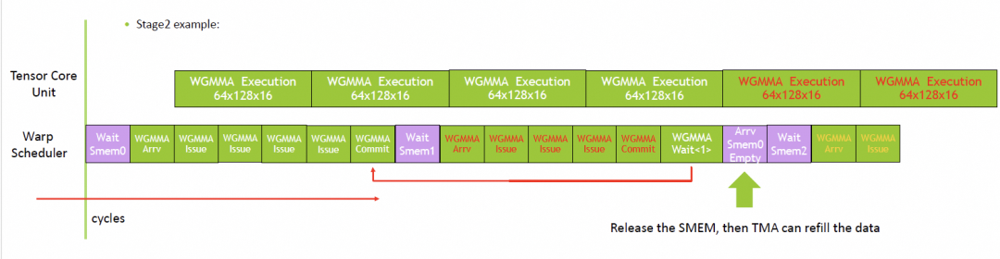

먼저 처리해야 할 K-Tile의 total count를 계산하고, SMEM의 pipeline stage count(ab\_stage)와 비교하여 prefetch가 필요한 data count를 얻는다.

```c++
        k_tile_cnt = cute.size(gA_mkl, mode=[2])
        prefetch_k_tile_cnt = cutlass.max(cutlass.min(self.ab_stage, k_tile_cnt), 0)
```

그다음 이 example code에서는 `PipelineProducer`와 `PipelineConsumer` class를 사용하지 않고, `make\_pipeline\_state`를 통해 state를 직접 노출한다. 총 세 개의 state가 있으며, Prologue stage의 대략적인 flow는 다음과 같다. 주의할 점은 Consumer side에서 두 개의 independent pipeline state machine을 만든다는 것이다. 하나는 read(wait, consume)를 track하고, 다른 하나는 release를 track한다.

```c++
# create State
mainloop_producer_state = pipeline.make_pipeline_state(
    pipeline.PipelineUserType.Producer, self.ab_stage
)
mainloop_consumer_read_state = pipeline.make_pipeline_state(
    pipeline.PipelineUserType.Consumer, self.ab_stage
)
mainloop_consumer_release_state = pipeline.make_pipeline_state(
    pipeline.PipelineUserType.Consumer, self.ab_stage
)

# producer loop
for i in range(...):
    pipeline.producer_acquire(producer_state) # wait
    # call TMA to write data into buffer pointed to by producer_state.index
    pipeline.producer_commit(producer_state) # commit; actually a no-op, real completion is updated by TMA tx-byte cnt hardware
    producer_state.advance() # manually advance state

# consumer loop
for i in range(...):
    pipeline.consumer_wait(mainloop_consumer_read_state) # wait for data Ready
    # based on buffer data pointed to by mainloop_consumer_read_state.index
    # submit WGMMA instruction and execute wg.commit_group
    mainloop_consumer_read_state.advance() # manually advance Read state
```

Prologue에서는 read만 수행하고 release는 수행하지 않는다. SMEM buffer가 main loop에서 corresponding release operation이 발생할 때까지 occupied state를 유지하기를 원하기 때문이다. 여기서 release해 버리면 pipeline rhythm이 흐트러진다. 이 두 state machine의 separation이 이러한 delayed release를 구현하는 key이다.

즉 `mainloop_consumer_release_state` state는 Mainloop에서 Consumer의 `wg.wait\_group`이 WGMMA asynchronous operation completion을 확인한 뒤에야 `consumer\_release(mainloop\_consumer\_release\_state)` operation을 호출하고, 동시에 `mainloop\_consumer\_read\_state`와 `mainloop\_consumer\_release\_state`를 advance한다.

##### Prologue TMA

다음과 같다.

```c++
        # producer warp
        if warp_idx == 0:
            # build loop for the number of K-tiles that need Prefetch
            for prefetch_idx in cutlass.range(prefetch_k_tile_cnt, unroll=1):

                # wait until A/B buffer is empty
                mainloop_pipeline.producer_acquire(mainloop_producer_state)

                # based on current state, set GMEM and SMEM slices that TMA needs to copy
                tAgA_k = tAgA_mkl[(None, mainloop_producer_state.count)]
                tAsA_pipe = tAsA[(None, mainloop_producer_state.index)]

                tBgB_k = tBgB_nkl[(None, mainloop_producer_state.count)]
                tBsB_pipe = tBsB[(None, mainloop_producer_state.index)]

                # execute TMA copy
                cute.copy(
                    tma_atom_a,
                    tAgA_k,
                    tAsA_pipe,
                    tma_bar_ptr=mainloop_pipeline.producer_get_barrier(
                        mainloop_producer_state
                    ),
                    mcast_mask=a_mcast_mask,
                )
                cute.copy(
                    tma_atom_b,
                    tBgB_k,
                    tBsB_pipe,
                    tma_bar_ptr=mainloop_pipeline.producer_get_barrier(
                        mainloop_producer_state
                    ),
                    mcast_mask=b_mcast_mask,
                )

                # the following commit is a no-op in PipelineTmaAsync; the real commit is completed by TMA tx-bytes counter update.
                mainloop_pipeline.producer_commit(mainloop_producer_state)
                mainloop_producer_state.advance()  # advance forward
```

##### Prologue MMA

code는 다음과 같다. 먼저 `k\_pipe\_mmas`를 설명하자. 이 variable은 Prologue stage에서 몇 round의 MMA를 execute할지 정의한다. 여기서는 1로 hard-code되어 있다. 이는 Prologue가 Prefetch로 준비한 첫 번째 data block을 consume한다는 뜻이다. `k\_pipe\_mmas`는 보통 WGMMA의 `wait\_group` mechanism과 관련되어 있으며, WGMMA instruction pipeline depth, 즉 completion을 기다리지 않고 연속으로 submit할 수 있는 WGMMA instruction batch 수를 나타낸다. 여기서 1로 설정하는 것은 비교적 simple하고 conservative한 strategy이다.

```c++
        k_pipe_mmas = 1

        peek_ab_full_status = cutlass.Boolean(1)
        if mainloop_consumer_read_state.count < k_tile_cnt:
            # consumer_try_wait is a non-blocking barrier check. It immediately returns a boolean indicating whether the first data block (Stage 0) is ready.
            peek_ab_full_status = mainloop_pipeline.consumer_try_wait(
                mainloop_consumer_read_state
            )
        # the preceding code checks whether it is full before the whole loop, avoiding pointless waiting in later consumer_wait
        # because if the status is known to be ready before blocking in consumer_wait loop, a few cycles can be saved.

        # during the first round of computation, Tile MMA is in non-accumulate mode
        tiled_mma.set(cute.nvgpu.warpgroup.Field.ACCUMULATE, False)
        num_k_blocks = cute.size(tCrA, mode=[2])

        # this loop executes only once (because k_pipe_mmas = 1)
        for k_tile in cutlass.range_constexpr(k_pipe_mmas):

            # wait until A/B buffer is Ready
            mainloop_pipeline.consumer_wait(
                mainloop_consumer_read_state, peek_ab_full_status
            )
            # insert a fence to ensure TMA writes to SMEM are visible to the WGMMA unit
            cute.nvgpu.warpgroup.fence()
            for k_block_idx in cutlass.range(num_k_blocks, unroll_full=True):
                k_block_coord = (
                    None,
                    None,
                    k_block_idx,
                    mainloop_consumer_read_state.index,
                )
                tCrA_1phase = tCrA[k_block_coord]
                tCrB_1phase = tCrB[k_block_coord]

                cute.gemm(
                    tiled_mma,
                    accumulators,
                    tCrA_1phase,
                    tCrB_1phase,
                    accumulators,
                )
                # after the first Tile MMA submission, set accumulate mode to True for later rounds
                tiled_mma.set(cute.nvgpu.warpgroup.Field.ACCUMULATE, True)

            # submit WGMMA commit_group()
            cute.nvgpu.warpgroup.commit_group()

            # advance mainloop_consumer_read_state.
            mainloop_consumer_read_state.advance()

            # then check whether mainloop_consumer_read_state is ready before entering the next iter.
            peek_ab_full_status = cutlass.Boolean(1)
            if mainloop_consumer_read_state.count < k_tile_cnt:
                peek_ab_full_status = mainloop_pipeline.consumer_try_wait(
                    mainloop_consumer_read_state
                )
```

#### 3.2.4 Stage 4: MainLoop

MainLoop는 전체 Kernel에서 가장 core이고 execution time이 가장 긴 부분이다. Prologue가 pipeline을 구축한 뒤, MainLoop는 pipeline의 stable running stage를 맡는다. K dimension의 각 iteration에서 세 가지 task를 동시에 execute한다.

1. **Compute (Consume)**: WGMMA를 사용해 현재 ready된 A와 B data block을 compute하고 WGMMA commit\_group을 execute한다.
2. **Release**: WGMMA waitgroup을 통해 이전 round의 WGMMA operation completion을 기다린 뒤, 그 이전 round의 computation에서 사용한 SMEM buffer를 release한다.
3. **Load (Produce)**: 방금 release된 buffer에 다음 batch의 A와 B data block을 asynchronous하게 load한다.

전체 MainLoop structure는 다음과 같다.

```c++
for k_tile in cutlass.range(k_pipe_mmas, k_tile_cnt, 1, unroll=1):
    ###########################
    # Consumer                #
    ###########################
    # 1. wait until data is ready
    mainloop_pipeline.consumer_wait(
        mainloop_consumer_read_state, peek_ab_full_status
    )
    # 2. after Ready, execute WGMMA according to mainloop_consumer_read_state.index and commit_group

    # 3. wait for previous WGMMA to complete computation
    cute.nvgpu.warpgroup.wait_group(k_pipe_mmas)

    # 4. release buffer that has finished being used
    mainloop_pipeline.consumer_release(mainloop_consumer_release_state)

    # 5. advance state machine
    mainloop_consumer_read_state.advance()
    mainloop_consumer_release_state.advance()

    # 6. try checking the next-next buffer state early to optimize the next loop
    peek_ab_full_status = cutlass.Boolean(1)
    if mainloop_consumer_read_state.count < k_tile_cnt:
        peek_ab_full_status = mainloop_pipeline.consumer_try_wait(
            mainloop_consumer_read_state
        )

    ###########################
    # Producer (executed only by Warp 0) #
    ###########################
    if warp_idx == 0 and mainloop_producer_state.count < k_tile_cnt:
        # 1. request an idle buffer
        mainloop_pipeline.producer_acquire(mainloop_producer_state)

        # 2. initiate asynchronous TMA load; note GMEM uses count, while SMEM uses index because it is a circular buffer
        tAgA_k = tAgA_mkl[(None, mainloop_producer_state.count)]
        tAsA_pipe = tAsA[(None, mainloop_producer_state.index)]
        cute.copy(
            tma_atom_a,
            tAgA_k,
            tAsA_pipe,
            tma_bar_ptr=mainloop_pipeline.producer_get_barrier(
                mainloop_producer_state
            ),
            mcast_mask=a_mcast_mask,
        )
        # perform the same TMA copy for B

        # 3. advance state machine
        mainloop_pipeline.producer_commit(mainloop_producer_state) # this is a no-op (NOP)
        mainloop_producer_state.advance()
```

For the whole state machine, assume ab\_stage=3 and k\_pipe\_mmas=1.

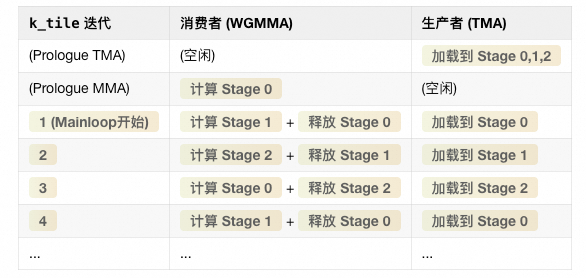

#### 3.2.5 Stage 5: Epilogue

`EPILOG` section is the final stage of the GEMM Kernel. `MAINLOOP`가 모든 K dimension iteration을 완료하면, final computation result $C = \sum (A \times B)$는 이미 각 Warp Group의 private accumulator register(`accumulators`) 안에 accumulate되어 있다.

`EPILOG`의 task는 수천 개 register에 분산된 이러한 result를 GMEM의 correct position에 safely and efficiently write-back하는 것이다. 물론 일부 computation scenario에서는 Epilogue가 ReLU/softmax 같은 computation도 담당해야 한다. 여기서는 가장 simple한 경우를 예로 들며, 이 process는 보통 두 main step으로 나뉜다.

1. **RMEM -> SMEM (R2S)**: 예를 들어 accumulator 안의 data(보통 FP32)를 target type(예: BP16)으로 convert하고 SMEM에 store한다.
2. **SMEM -> GMEM (S2G)**: TMA를 사용해 SMEM 안의 result data block을 GMEM으로 asynchronous write-back한다.

```c++
# /////////////////////////////////////////////////////////////////////////////
#  EPILOG
# /////////////////////////////////////////////////////////////////////////////

# 1. ensure all WGMMA computations submitted in MAINLOOP have completed, and values in accumulators are final results.
cute.nvgpu.warpgroup.wait_group(0)

# this wait synchronization is very important; it must ensure all threads in CGA/CTA have completed computation.
# because in Epilogue stage, SMEM space allocated for A/B matrices in MAINLoop is reused to store C matrix.
# if not waiting for all threads to complete, data pollution will occur.
if cute.size(self.cluster_shape_mn) > 1:
    cute.arch.cluster_arrive()
    cute.arch.cluster_wait()
else:
    cute.arch.sync_threads()

# 2. define Copy-Atom and TiledCopy; here R2S uses StMatrix instruction to store 8x8x16b data to SMEM
copy_atom_r2s = sm90_utils.sm90_get_smem_store_op(...)
copy_atom_C = cute.make_copy_atom(...)
tiled_copy_C_Atom = cute.make_tiled_copy_C_atom(copy_atom_C, tiled_mma)
tiled_copy_r2s = cute.make_tiled_copy_S(copy_atom_r2s, tiled_copy_C_Atom)

# 3. memory partitioning
# thr_copy_r2s: slice its own task for current thread (tidx) from Tiled-Copy.
thr_copy_r2s = tiled_copy_r2s.get_slice(tidx)

# tRS_sD: partition target SMEM (sC), obtaining the SMEM view current thread is responsible for writing. Note sC is a pipelined SMEM region.
tRS_sD = thr_copy_r2s.partition_D(sC)

# retile does not move data. It only logically reinterprets accumulators (whose layout is determined by WGMMA) into a new layout suitable for Epilogue tiled copy.
tRS_rAcc = tiled_copy_r2s.retile(accumulators)

# this code allocates a temporary, small staging buffer tRS_rD in RMEM,
# used to temporarily store a small block copied from large accumulators for subsequent type conversion and reshuffle.
# layout of accumulators is determined by WGMMA, while Epilogue Store layout usually depends on instructions like stmatrix because it writes to SMEM. The two layouts have different needs and must be decoupled.
rD_shape = cute.shape(thr_copy_r2s.partition_S(sC))
tRS_rD_layout = cute.make_layout(rD_shape[:3])
tRS_rD = cute.make_fragment_like(tRS_rD_layout, self.acc_dtype)
size_tRS_rD = cute.size(tRS_rD)

# 4. process TMA for SMEM->GMEM

# describes src, i.e. Layout of data to copy in SMEM.
# this function merges Mode 0 and Mode 1 of sC layout into a new mode for later copy.
#  - before conversion: Layout<(M, N, Stage), ...>
#  - after conversion: Layout<(M * N, Stage), ...>
sepi_for_tma_partition = cute.group_modes(sC, 0, 2)

# describes dst, i.e. Layout where data will finally be placed in GMEM
tCgC_for_tma_partition = cute.zipped_divide(gC_mnl, self.epi_tile)

#
bSG_sD, bSG_gD = cute.nvgpu.cpasync.tma_partition(
    tma_atom_c,
    0,
    cute.make_layout(1),
    sepi_for_tma_partition, # source: (Tile, Stage)
    tCgC_for_tma_partition, # target: (TileGrid, TileShape)
)


# 5. asynchronous pipeline uses PipelineTmaStore class
c_producer_group = pipeline.CooperativeGroup(
    pipeline.Agent.Thread, self.threads_per_cta, self.threads_per_cta
)
c_pipeline = pipeline.PipelineTmaStore.create(...)

# 6. loop: R2S and S2G
for epi_idx in cutlass.range_constexpr(epi_tile_num):
    # 6a. R2S - Part 1: Accumulator -> Registers
    for epi_v in cutlass.range_constexpr(size_tRS_rD):
        tRS_rD[epi_v] = tRS_rAcc[epi_idx * size_tRS_rD + epi_v]

    # 5b. R2S - Part 2: type conversion
    tRS_rD_out = cute.make_fragment_like(tRS_rD_layout, self.c_dtype)
    acc_vec = tRS_rD.load()
    tRS_rD_out.store(acc_vec.to(self.c_dtype))

    # 6c. R2S - Part 3: Registers -> Shared Memory
    epi_buffer = epi_idx % cute.size(tRS_sD, mode=[3])
    cute.copy(
        tiled_copy_r2s, tRS_rD_out, tRS_sD[(None, None, None, epi_buffer)]
    )

    # 6d. synchronize R2S
    cute.arch.fence_proxy(cute.arch.ProxyKind.async_shared, ...)
    cute.arch.barrier()

    # 6e. S2G - TMA initiated by Warp 0
    gmem_coord = epi_tile_layout.get_hier_coord(epi_idx)
    if warp_idx == 0:
        cute.copy(
            tma_atom_c,
            bSG_sD[(None, epi_buffer)],
            bSG_gD[(None, gmem_coord)],
        )
        c_pipeline.producer_commit()
        c_pipeline.producer_acquire()

    # 6f. synchronize S2G
    cute.arch.barrier()

# 7. pipeline tail
if warp_idx == 0:
    # wait for the last submitted TMA store operation to complete.
    c_pipeline.producer_tail()
```

참고 자료

[1]

Hopper/DenseGemm: *https://github.com/NVIDIA/cutlass/blob/main/examples/python/CuTeDSL/hopper/dense\_gemm.py*

[2]

CUDA DMA: *https://d1qx31qr3h6wln.cloudfront.net/publications/SC\_2011\_CUDA\_DMA.pdf*

[3]

Singe compiler: *https://cs.stanford.edu/~sjt/pubs/ppopp14.pdf*

[4]

Unweaving Warp Specialization: *https://rohany.github.io/blog/warp-specialization/*

[5]

15-779 Lecture 6:Advanced CUDA Programming:Warp Specialization: *https://www.cs.cmu.edu/~zhihaoj2/15-779/slides/06-warp-specialization.pdf*

[6]

GPGPU Arch (2) - discussion on Hopper WarpSpecialization Pingpong/Cooperative design: *https://zhuanlan.zhihu.com/p/1929932276499722808*

[7]

WASP: Exploiting GPU Pipeline Parallelism with Hardware-Accelerated Automatic Warp Specialization: *https://www.nealcrago.com/wp-content/uploads/WASP\_HPCA2024\_preprint.pdf*

[8]

Targeting NVIDIA Hopper in MLIR: *https://llvm.org/devmtg/2024-03/slides/nvidia-hopper-in-mlir.pdf*

[9]

TMA Patent: *https://patents.google.com/patent/US20230289292A1/*

[10]

GPU computing and programming model evolution: throughput and latency balance in asynchronous compute programming: *https://www.bilibili.com/video/BV11tMwznEmo/*

[11]

include/cute/swizzle.hpp: *https://github.com/NVIDIA/cutlass/blob/main/include/cute/swizzle.hpp*

[12]

make\_trivial\_tiled\_mma: *https://github.com/NVIDIA/cutlass/blob/main/python/CuTeDSL/cutlass/utils/hopper\_helpers.py[#L101](javascript:;)*

[13]

Cutlass Pipeline: *https://github.com/NVIDIA/cutlass/blob/main/python/CuTeDSL/cutlass/pipeline/sm90.py*
